# 课程 P14：讲座13 冰激凌店模拟 🍦

在本节课中，我们将学习如何通过多线程编程来模拟一个冰激凌店的运营场景。我们将分析一个复杂的程序，它使用多种线程同步机制来协调顾客、店员、经理和收银员之间的交互。通过这个例子，我们将深入理解二进制锁、广义计数器、二进制会合、广义会合以及层次化构造等核心概念。

## 概述

我们将模拟一个冰激凌店的日常运营。在这个模型中，顾客进店购买一定数量的冰激凌甜筒。每个甜筒由一个专门的店员制作，制作完成后需要经理检查质量。只有合格的甜筒才能交给顾客，然后顾客去收银台结账。整个过程涉及多个线程（顾客、店员、经理、收银员）的并发执行与协调。


## 核心概念与结构

在深入代码之前，我们先了解程序中用到的几种关键同步机制。

### 1. 二进制锁（互斥锁）


上一节我们介绍了模拟场景，本节中我们来看看如何保证资源独占访问。二进制锁本质上是一个互斥锁（Mutex），它确保在同一时刻只有一个线程可以进入临界区或访问某个共享资源。


**公式/代码描述：**
```cpp
std::mutex mtx;
mtx.lock();
// 临界区代码
mtx.unlock();
```


### 2. 广义计数器（信号量）


接下来，我们看看如何管理有限数量的资源。广义计数器通常通过信号量（Semaphore）实现。信号量维护一个计数器，可以原子性地进行增减操作，用于协调多个线程对有限资源的访问。

**公式/代码描述：**
```cpp
sem_t sem;
sem_init(&sem, 0, initial_count); // 初始化
sem_wait(&sem); // P操作，申请资源
sem_post(&sem); // V操作，释放资源
```

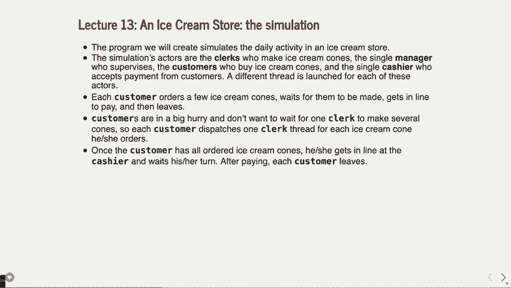

### 3. 二进制会合

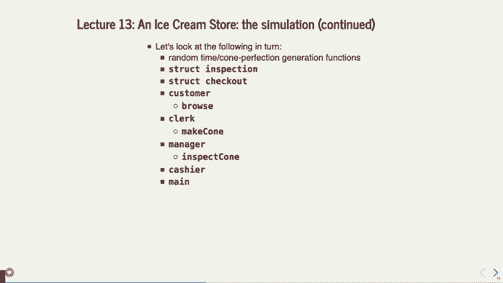

当两个线程需要精确协调彼此的执行顺序时，我们会用到二进制会合。这通常使用初始值为0的信号量来实现，一个线程等待（wait），另一个线程在完成特定任务后发出信号（post）。


**公式/代码描述：**
```cpp
// 线程A
sem_wait(&rendezvous_sem); // 等待线程B的信号
// 继续执行...

// 线程B
// 完成某些工作
sem_post(&rendezvous_sem); // 通知线程A
```

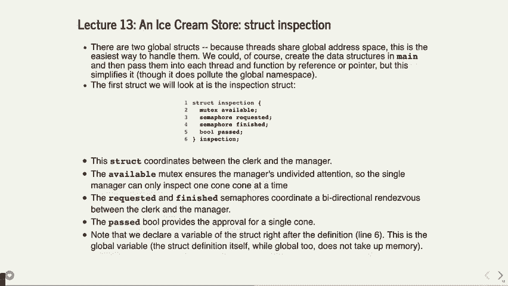

### 4. 广义会合

广义会合用于一个线程需要等待多个其他线程都完成某项任务后才能继续执行的场景。这结合了二进制会合和计数器的思想。


**公式/代码描述：**
```cpp
// 主线程生成N个工作线程
for (int i = 0; i < N; ++i) {
    // 启动工作线程
}
// 主线程等待所有工作线程完成
for (int i = 0; i < N; ++i) {
    sem_wait(&completion_sem[i]);
}
```

### 5. 层次化构造

在实际程序中，我们经常需要组合使用上述多种同步原语来构建更复杂的逻辑，这就是层次化构造。例如，可能先使用互斥锁保护一个共享队列，再使用信号量来通知消费者线程有新数据到达。

## 程序结构解析


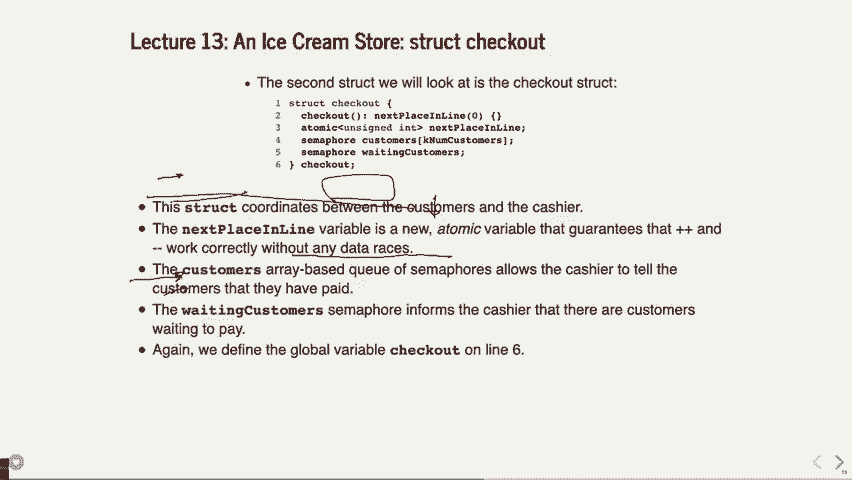

现在，让我们逐一分析模拟程序中的各个组成部分。

### 全局数据结构


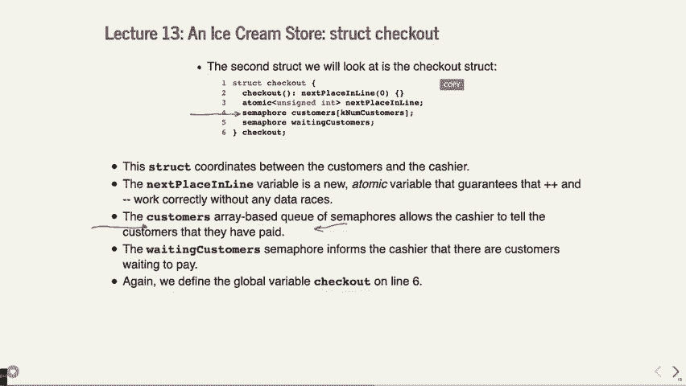

程序定义了几个全局结构体来共享状态和进行线程间通信。


**检查结构体 (`inspection`)**
这个结构体用于店员和经理之间的交互。
```cpp
struct inspection {
    std::mutex available;       // 二进制锁，确保一次只有一个店员与经理交互
    sem_t requested;            // 信号量：店员通知经理“我有一个甜筒待检查”
    sem_t finished;             // 信号量：经理通知店员“检查已完成”
    bool passed;                // 检查结果：甜筒是否合格
} inspection;
```


**结账结构体 (`checkout`)**
这个结构体用于顾客和收银员之间的交互。
```cpp
struct checkout {
    sem_t customer_waiting;     // 信号量：通知收银员有顾客在等待
    std::atomic<unsigned int> next_enqueue_position; // 原子计数器：下一个排队位置
    sem_t customer_finished[MAX_CUSTOMERS]; // 信号量数组：每个顾客一个，用于通知结账完成
} checkout;
```
这里使用了 `std::atomic<unsigned int>` 来原子性地更新排队位置，避免了使用互斥锁。

### 顾客线程 (`customer`)

顾客线程模拟顾客的行为。

以下是顾客线程的主要步骤：
1.  **获取需求**：确定需要购买的甜筒数量。
2.  **创建店员线程**：为每个甜筒创建一个店员线程来制作。
3.  **浏览等待**：调用 `browse` 函数模拟在店内浏览。
4.  **等待完成**：使用 `join` 等待所有为其服务的店员线程结束，这意味着所有甜筒都已制作并检查合格。
5.  **排队结账**：原子性地获取下一个排队位置 (`next_enqueue_position`)。
6.  **通知收银员**：通过 `sem_post(&checkout.customer_waiting)` 通知收银员有顾客准备结账。
7.  **等待结账完成**：在属于自己的信号量 `customer_finished[position]` 上等待，直到收银员处理完毕。
8.  **离开**：结账完成后，顾客线程结束。


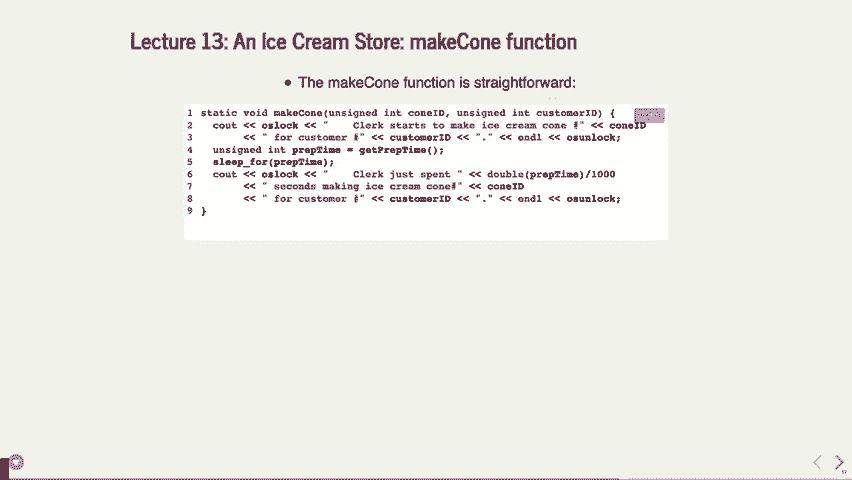

`browse` 函数非常简单，只是让线程休眠一段随机时间。

### 店员线程 (`clerk`)

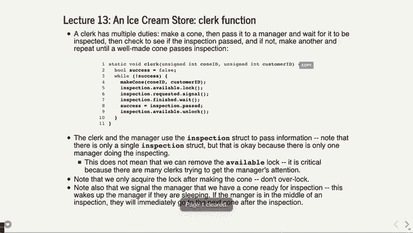

店员线程负责制作单个甜筒，并确保其通过经理检查。


以下是店员线程的主要循环逻辑：
```cpp
bool success = false;
while (!success) {
    make_cone(); // 制作甜筒，耗时
    inspection.available.lock(); // 获取与经理交互的锁
    sem_post(&inspection.requested); // 通知经理检查甜筒
    sem_wait(&inspection.finished); // 等待经理检查完毕
    success = inspection.passed; // 获取检查结果
    inspection.available.unlock(); // 释放锁
    if (!success) {
        // 甜筒不合格，丢弃，循环继续制作下一个
    }
}
// 甜筒合格，线程结束
```
`make_cone` 函数模拟制作甜筒所花费的时间。

### 经理线程 (`manager`)


经理线程负责检查店员提交的甜筒是否合格。

以下是经理线程的主要循环逻辑：
```cpp
for (int approved = 0; approved < total_cones_needed; ) {
    sem_wait(&inspection.requested); // 等待店员提交甜筒
    inspect_cone(); // 检查甜筒，更新 inspection.passed
    sem_post(&inspection.finished); // 通知店员检查结果
    if (inspection.passed) {
        approved++; // 合格甜筒计数增加
    }
}
// 达到所需合格甜筒数量，经理下班
```
`inspect_cone` 函数模拟检查过程，并随机决定甜筒是否合格。


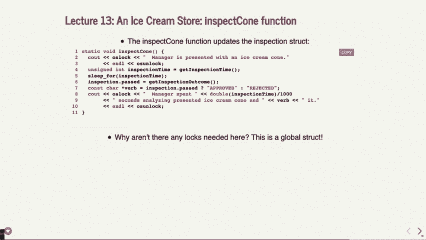


### 收银员线程 (`cashier`)


收银员线程负责按顾客排队的顺序为他们结账。

以下是收银员线程的主要逻辑：
```cpp
for (unsigned int next_to_serve = 0; next_to_serve < num_customers; next_to_serve++) {
    sem_wait(&checkout.customer_waiting); // 等待下一位顾客
    // 为位置是 `next_to_serve` 的顾客结账
    sem_post(&checkout.customer_finished[next_to_serve]); // 通知该顾客结账完成
}
// 所有顾客结账完毕，收银员下班
```
关键点在于，收银员严格按 `next_to_serve` 的顺序（0, 1, 2...）服务顾客，这保证了先排队的顾客先被服务。顾客通过原子计数器 `next_enqueue_position` 确定自己的排队位置，从而与收银员的顺序匹配。

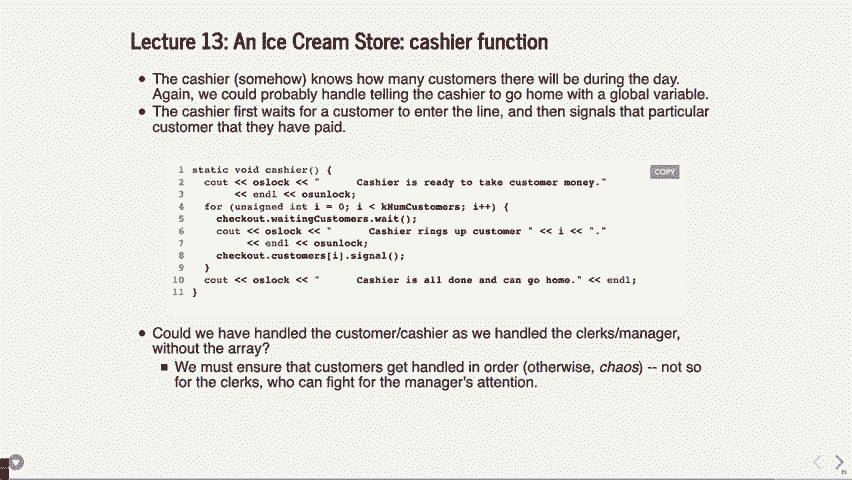

### 主函数 (`main`)

主函数负责初始化全局数据、创建经理线程、收银员线程以及所有顾客线程，并最终等待所有线程结束。

以下是主函数的简化流程：
1.  初始化信号量和互斥锁。
2.  创建经理线程（传入需检查的甜筒总数）。
3.  创建收银员线程（传入顾客总数）。
4.  循环创建每个顾客线程（传入顾客ID和其需求的甜筒数）。
5.  等待所有顾客线程结束 (`join`)。
6.  等待收银员和经理线程结束 (`join`)。
7.  程序退出。

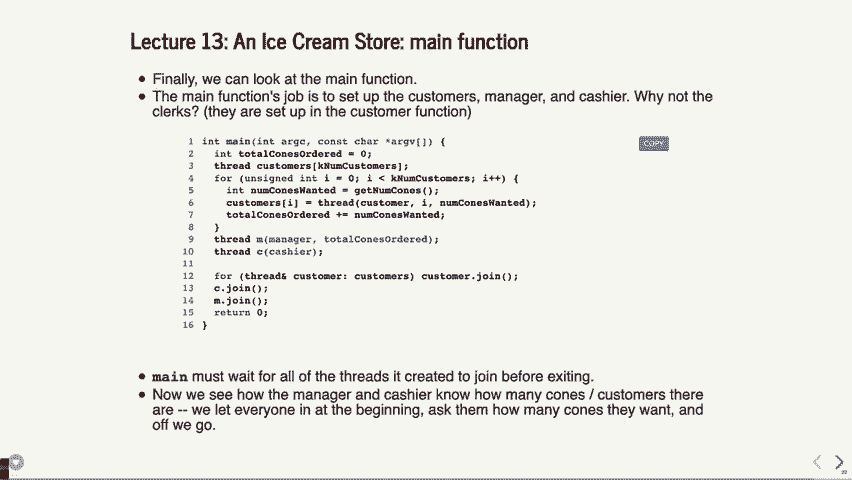

经理和收银员线程在创建后立即开始运行，但会很快在各自的信号量上等待，直到被顾客或店员的活动唤醒。这种模式类似于“线程池”，线程预先创建好，等待任务分配，减少了动态创建线程的开销。

## 总结

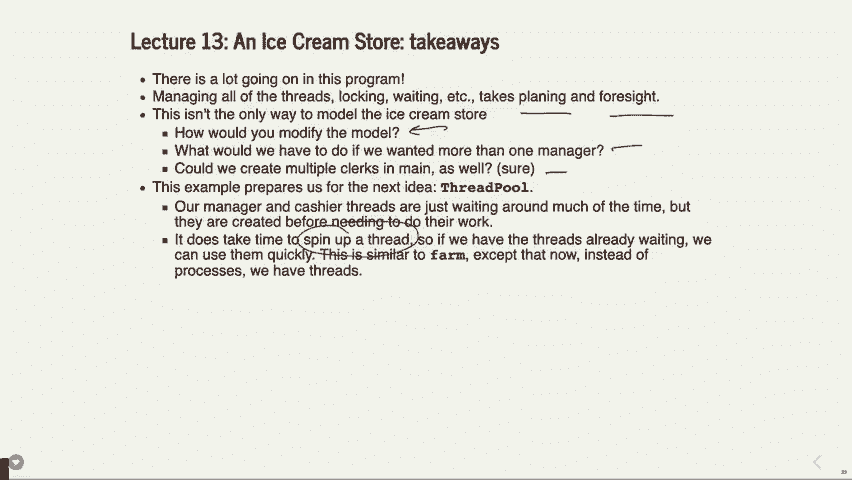

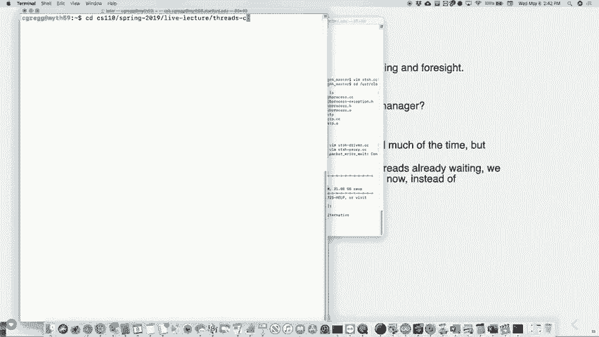

本节课中我们一起学习了一个复杂但经典的多线程编程实例——冰激凌店模拟。我们深入分析了如何使用：

*   **二进制锁（`std::mutex`）** 来保护经理与店员之间的独占交互。
*   **信号量（`sem_t`）** 来实现线程间的通知与等待（二进制会合），例如店员-经理的检查流程和顾客-收银员的结账流程。
*   **原子变量（`std::atomic`）** 来实现无锁的顺序排队。
*   **线程连接（`join`）** 来实现广义会合，例如顾客等待所有店员线程完成。

通过将这个现实场景分解为多个并发执行的线程，并精心设计它们之间的同步机制，我们构建了一个能够正确、高效模拟店铺运营的程序。理解这个程序的设计思路和实现细节，对于掌握多线程编程中的核心挑战——**同步**与**通信**——至关重要。