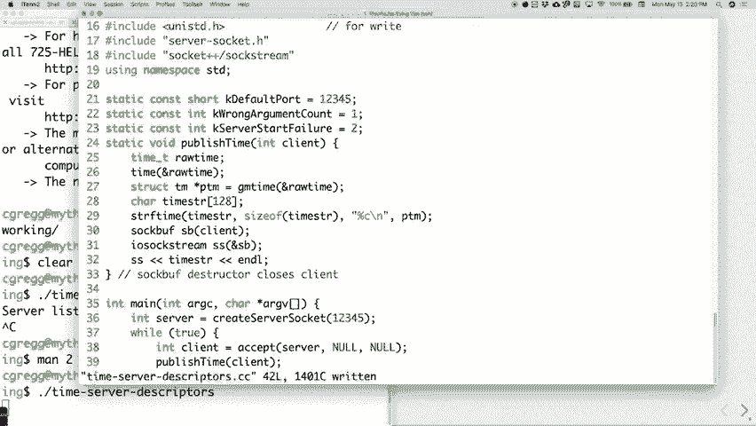

# P15：讲座 14 网络基础介绍 - ___main___ - BV1ED4y1R7RJ

欢迎，欢迎来到第七周，我们快到了。 作业五进展怎么样？

没问题，希望这是第一个线程作业，显然。 它有一些细微的差别，你肯定需要思考锁定和。 你得思考七个锁，还有新的测试方法，我们加入了。 这些内容，比如你必须确保你只会有这么多线程。

这一切都是为了测试你使用信号量的能力。 RSS。 新闻订阅是我们现在不怎么使用的东西，但是大约。 六七年前，它曾经是非常流行的，当这些东西。 发布时，它是一个大事件，大家都认为这是你获取新闻的方式。

你将会获取到所有这些订阅，它们会是这些。 小片段的新闻，你可以去阅读更大的文章之类的。 每个人都觉得很酷，接着我们都用了大约一周。 然后就觉得很无聊，像以前那样，慢慢就又回去了。

但是大多数地方仍然有这些RSS新闻订阅服务，所以你可以。 获取一个新闻订阅阅读器，这正是你正在构建的，用来实际创建这些内容。 好的，希望这不会太糟，它是周五截止的，我想我会做的是。 我们在作业上有点落后，仅仅是因为期中考试的原因。

发生了什么，我想给你们多一点时间完成上一个作业。 所以我们可能会这样做，我可能会在周四发布下一个作业。 给你一个稍微小一点的作业，比我们之前计划的要简单些。我得把细节都工作出来，然后我们会继续进行。

跟上进度，因为接下来的两个作业七和八都是相当有分量的。 不过是很有分量的，我想给你们足够的时间来理解。 这些内容，不至于让你们觉得有点疯狂。 好的，尽管我们还在处理中间的作业，我们。

正在转向新的、希望是有趣的内容，我们今天要讨论的是。

好的，我们今天要讨论的是网络，这是接下来的。 大事，也是我们接下来要讨论的最后一件大事。 我们要谈论的是网络，连接。 两台计算机之间，通过类似于读写的方式，它是。

有点像在两个进程之间创建管道，但不完全是进程，而是我们在创建这种两台。 计算机之间的"管道"，它就是互联网的工作原理，也是万维网。 的工作原理，等等，我们今天会稍微介绍一下如何实现。

如果你真的喜欢这些内容，`CS144`就是网络课程，对，144是网络课程，内容显然比我们在这门课上讲的要详细得多，我想你会喜欢的，顺便说一句，如果你喜欢其他课程，那么操作系统就是`143`，不对，应该是`140`，哦不，`143`是编译原理课程。

对了，**编译原理**课程也是一门很棒的课程，然后`140`是操作系统课程，它讲述了如何构建线程库，如何将多进程集成到操作系统中之类的内容。如果你真的不喜欢这些内容，那么也许可以考虑修其他的课程。

如果你确实感兴趣的话，后续还有很多课程可以跟进，我们很快会花些时间讨论这些课程的内容。

所以我们来谈谈网络。正如我刚才说的，网络就是把两台计算机连接起来，而这个网络可以是非常局部的，事实上，网络通信甚至可以发生在同一台计算机上的两个进程之间，就像管道一样，但它是

使用网络协议，而不是底层的管道协议。你可以在一台计算机上进行进程之间的网络通信，但我们大多数时候是在谈论多台计算机之间的通信。好的，工作的方式是，你需要让其中一台计算机充当**服务器**，而服务器其实只是一个。

计算机就像是等待其他计算机向它询问问题的存在。我在等待其他计算机说“我可以连接到你吗？”。如果你没有设置好服务器，你可以整天问，但另一台计算机**不会响应**，好吧，所以下面是你必须要做的，你必须拥有一个。

服务器，然后你必须有一个或多个客户端连接到**服务器**。好了，万维网就是通过这种方式工作的，如果你连接到`CS110.stanford.edu`，你连接的是一个网页服务器，而你就是客户端，而且你们很多人可以同时进行这个操作。所以当我说我们可以同时做这件事时，我们确实能。

你必须考虑效率，因为服务器必须能够快速地将信息反馈给客户端，而且可能会有很多很多的客户端。所以我们首先需要考虑这一点，但我们现在不用太担心这个问题。

但最终我们将更多地思考：网络是如何工作的。它通过一种叫做**套接字**的东西来工作，套接字就是一个数字，实际上它只是一个整数，实际上它的范围是从零到六五五三五，换句话说，你最多只能同时打开**64,000个套接字**。

一次可以打开 000 个套接字，这比你可能想象的要多得多。大多数计算机并不会一次打开这么多套接字，但它只是一个 16 位整数，所以它的限制是 65，35，因此你基本上设置你的程序，让它说“嘿，监听这个套接字或端口”，这就是我们所说的另一种方式。

当另一台计算机（客户端）想要连接到你的服务器时，操作系统会注意到这一点。操作系统和硬件对此有很大的支持。操作系统注意到这一点后，会向你的服务器发送一个小的唤醒信息，告诉它“嘿，你有一个客户端需要处理”。

使用它，正是我们想要做的事情。你可以把端口号或套接字号当作一个虚拟的进程 ID 来理解。你可以这样想，它代表着某个套接字，它把你连接到服务器上的特定进程。好吧，事情就是这么发生的。

对，为什么我们不直接使用进程 ID 来做套接字 ID 呢？是因为你希望能够说“嘿，告诉大家去监听这个特定的端口”，而每次你启动一个新进程时，端口都会变化。所以，这就是我们要做的事，我们如何在。

让你的计算机查看你连接到的内容。我们可以做以下操作。我们可以，嗯，稍等一下。好了，我们可以在这里使用 studio，然后输入 next stat，接着。

我总是忘记它是如何运行的，我们用 PLNT - PLNT 来做得更大一点，所以你。

你可以看到整个内容，好的，让我调整一下，让它变得更清晰。

最终就会像这样美好地呈现出来，来吧，这非常不错。那么，你可以在中间服务器上执行这个操作，看起来这些中间服务器正在监听许多端口，你可以看到它们在监听哪些端口。它们在监听端口 25，我看看能不能找到。

看看我的光标在哪里，那里有端口 25。好的，它们在监听端口 587，这些恰好与邮件服务器相关，所以所有的中间服务器都在监听一个邮件服务器，你的计算机也在监听一个邮件服务器。好了，这个在监听。

在 53 上，每次 53 就是域名服务（DNS），所以当你访问时，

www.google.com 好吧，有人需要把这个翻译成一个数字，因为你的计算机处理的是数字，而人们更喜欢处理文字。所以这里有一个翻译层，它由域名服务（DNS）处理，该服务在你的计算机上运行，并连接到另一台计算机，再连接到。

连接到另一台计算机，这台计算机上有所有域名的信息，就像你的计算机一样，保留了一些我首先访问的地方，然后这个查询会发到另一台计算机，最终返回给你名称。从某种意义上说，这就像是为你的文件系统程序做的目录搜索，这就是。

发生的事情。好，端口22是用于Telnet的，也适用于SSH。我们稍后会讨论Telnet，它是用于SSH的，默认情况下SSH会连接到端口22。有些人喜欢将他们的计算机设置为在其他端口上监听SSH，因为端口22是一个很多恶意行为者尝试攻击的端口。

连接到它们，因为它们知道，如果能够搞定密码，就能进入电脑，所以它们会更改这个，但我们的是默认的22和631。恰好是打印机服务器，事实上我们可能不知道，但你可以。

一般来说，在你的电脑上，我们可以在一个新窗口中进行操作，你通常可以。

让我们把它放大一点，这里是127.0.0.1，也就是你的本地电脑的IP地址。如果一切正常，应该看到一个小打印机。

细节是，实际上你正在监听一个网络服务器来进行操作。

打印功能，而且它通常在许多电脑上都已经设置好了，如果你看到一个小消息说没有设置好，它会告诉你如何设置，如果还没有设置的话。我们也可以输入本地主机的地址，即localhost:631，本地主机，顾名思义。

你自己的电脑应该没问题，它也应该在那里显示出来，就是这个情况。

发生了什么呢？好，我们来看看，我们有另一个小的22和631。因此，TCP 6。结果是，正常的IP地址是32位数字。它们中有这些冒号，就像127.0.0.1那样，那是一个32位数字，只是被分隔成了小的两字节数字。

数字是32位的数字，32位数字的话，我们可以有多少个不同的IP地址呢？大约是四十亿。实际上互联网上有超过四十亿的计算机。回想一下互联网设计的时候，它实际上是一个当时由国防部发起的项目，事实上我不。

我不知道之前有没有给你展示过这个，原始互联网，看看这里应该有一些。

这里的图片，我应该能够找到，看看我一直喜欢用的那个图，嗯，这可能是它，看看那里，稍微有点不对，哦，稍等一下，那是我想的那个，哦不，那个是最小的，你根本看不见。

你大致可以看到，斯坦福大学在其中，我们是最初互联网的一部分，挺好的，对吧？注意到没有，谁不在其中呢？其他地方的相对本地的地方没有，麻省理工学院也在其中，BBN 也在，它是最早的参与者之一，这是一家起步于此的公司。让我们看看，卡内基梅隆大学也在其中，当时它还只是卡内基研究所。

伊利诺伊大学，犹他大学也在其中，相信与否，犹他大学在 1970 年代时有一个非常棒的计算机科学系，他们恰好加入了互联网。

很早以前，很多人都在进行早期的思考，不过当时他们说过：32 位，互联网上有四十亿台计算机，那不会有那么多计算机的，这太荒谬了。所以他们就开始使用 32 位数字，然而现在我们不这么做了，怎么做呢？

现在我们所面临的是路由器，它们在这栋大楼里可能只有一个 IP 地址，然后路由器给你们每个人分配一个本地 IP 地址，因此它是一个间接的层级。这就是目前发生的情况，我们正在努力解决这个问题，以便每台计算机都能拥有。

它有自己的电子邮件或者自己的 IP 地址，我们通过 IPv6 实现这一点，而不是 IPv4，IPv6 有 128 位地址，可以支持更多的计算机，实际上，我认为如果你愿意的话，几乎可以给宇宙中的每个原子分配一个 IP 地址，而不需要很多数字。

里面有很多内容，因此这里有足够的空间来扩展，但这需要一段时间来让每个人都跟上进度。一些服务器正在监听这一过程。好了，现在如果你自己运行一个程序，注意看看这一边，它说 PID 程序，它没有任何信息，因为它实际上...

它隐藏了非超级用户的访问权限，我们作为普通用户并不具备这个权限。我们实际上可以让我运行一些东西，我们将创建时间服务器描述符，我想应该就是这样，所以如果我这样做，就会在同一台计算机上运行，看看我们现在在做什么，神话 58，我们就这样在同一台计算机上执行。

好吧，我们再来一次，看，这里说的是 2 6 5 5 / 时间服务器，虽然没有给出完整的信息，但这就是我现在正在运行的那个程序。好吧，那个恰好是端口一二三四五，这是个不错的端口，为什么是这个端口呢？

用零零零代替127，我不知道为什么，老实说我也不确定为什么。那为什么是127.0.0.1呢？互联网把它当作本地计算机使用，这只是它给每台计算机的数字，你的计算机和每台其他计算机都是一样的。我不知道，这是个好问题，我不确定为什么它是这样的。

就像上面那个零点零一样，不过端口是正确的，不过你说得对。

另外一部分没有问题。那么关于这些地址，我还能告诉你什么呢？

我说过，有65,000或64,000个，实际上你只应该在一个特定的范围内使用一些。嗯，为什么它没有显示出我建立的SSH连接呢？

SSH是一个神话，这是在神话计算机上，但它没有显示出什么，没有显示实际的连接，可能有很多连接，这只是给你看。

哪些服务器是可用的并在监听，这就是它展示给你的内容。现在，好的问题，嗯，实际上你可以去查看一份完整的常用端口列表。

端口，好的，常用端口，如果我们去看，那里有很多端口，好的，这就像。

这实际上只是其中一个很小的列表，我们来看看我是否可以进入那里。

这里是我常用的端口，我把它放大一点，好了，非常大。所以基本上，端口0到1023通常是用来做系统相关的事情，比如你。不要使用那些非常低的端口，注意我们之前提到的所有端口都比较低，它们是非常明确的，不要使用这些。

因为它们都为SSH准备了，哦，顺便说一句，80是用于网页的。网页等，因此你希望能够，你不想使用。

那些端口，好吧，但是它们的列表比较小，就像我在上面说的，其他的端口是什么，现在我们有了很多，如果我们看看80，80是用于HTTP，代表网页等，所以有很多端口你可以查看，它们是明确的，不要使用它们，如果你可以避免的话。我们可以去。

接下来的列表，从1024到49151，你可以看到为什么它们选择了这个数字，基于一些二的幂，这些是分配的端口，但它们有点模糊，基本上就是有人说“嘿，我想用这个端口，可以分配给我吗？”然后IAN A这个组织会这样做。

这实际上决定了你是否有合法的理由，你是公司，还是你知道你在做一些有趣的事情。它们会说，好吧，你可以拥有一个，我们会说这是你的端口，一些端口。

它们做的是开放VPN，用来通过虚拟专用网络连接你的电脑，比如1194端口，等等，还有很多这样的端口。

这些端口有成千上万，你不必局限于那些。对吧？如果你自己设定端口，没人会说“嘿，你破坏了我的设置”。如果你运行一个程序需要那个端口，而你又运行了另一个程序在那个端口上，它们不能同时监听同一个端口，这就是问题所在。

这里的一个大问题是，我们刚才展示的就是使用了端口一二三四。

一二三四五，这个设置是为方块世界小战斗机和NetBus设定的，它们都有些相似，或者我猜它们假设大家都需要端口一二三四五。我们通常使用这个端口，因为它简单好记，反正输入也方便，但如果你必须在你的...

计算机，那可能会和你想做的事冲突，所以我...

不知道是一个方块世界，还是其他的，反正可以这么说，或者一个小战斗机 - 随便吧。

无论如何，超过四万或其他什么数字的端口，它们是上层端口，未预定义的，你可以根据需要使用这些端口，没人会说“嘿，这是我们想要的那个”。好吧，那就是端口号，让我们继续吧。

这些就是你将看到的内容，你会看到很多普通的端口，然后我们将使用我们自己的问题，嗯，那是个好问题，端口是服务器上的一个监听端口。端口和套接字有点可以互换，套接字基本上是，你一旦设置好套接字，可以把它想象成你设置了一个管道。

就是这么回事，但端口号就是套接字号，你使用的是套接字和端口号，可以这么理解，嗯，服务器只是台电脑，对吧？所以并不是说你发送消息到另一个计算机时，你实际上用的是一个端口，但不一定是你连接到的那个端口。比如我想要...

连接到你的服务器，使用端口一二三或五，而我的外发端口可能是1800，或者其他什么端口，它是通过那个端口出去的，然后，另一个计算机会说：“哦，当我回应时，就返回到那个端口。”我们实际上隐藏了这部分信息，你不需要担心这些。

对于这个不需要太多细节，它几乎都是内置到库里的。我们使用的它很有意义，是的，其他人有问题吗？这里有很多细节。你可以深入了解，好，看看还有什么，嗯，接下来让我们创建。我们的第一个服务器，好，我们将创建一个服务器，所有的服务器就是。

要做的是，你就在这里做，它叫做时间服务器，我们将使用。描述符来开始，好，做这个有很多像设置的东西。显然在这里，我们要做的是我们将设置一个服务器，基本上获取服务器的时间，结果它将获取 GMT 时间，。

是格林威治标准时间（Greenwich Mean Time）在英格兰的时间，它将获得这个，嗯，它获取时间然后将其转换为我们想要的时间，在这种情况下。我们将其转换为格林威治标准时间，这个时间是比较标准的。事实证明它是最容易输入的，但我们要做的是获取。

时间，它将赢得连接，当你接收到连接请求时。它将查找时间，然后将时间格式化为字符串，再将其推送。回连接的计算机，所以基本上像一个时间服务器，它只是告诉你。时间，好，这就是所有的了，好，我们怎么做呢？嗯，你可以。

做 int 服务器同样记住服务器只是一个井，在这种情况下它是一个。 在这种情况下它是一个与服务器关联的数字，它有点像文件描述符。好的，然后我们将使用创建。服务器套接字，好，1，2，3，4，5，就这些，我们将做的就是这些。

现在为了创建服务器套接字使用一些底层的内建系统调用。等等，你可以去查看，我相信它在 server socket dot cpp 中。实际上我们来看看，看看能否找到 server socket。server socket。dot cpp，不是，等一下。

server socket dot c 哦，这个容易，不如在这里做 server socket dot cc。

好，创建服务器套接字使用一些底层的函数，一个叫做。socket 的函数来做它，它有一些参数，我们现在暂时不需要担心，我们将一直使用这些。你可以自由查看这些，我们稍后会讨论一些细节，这个是。

很快就会完成，好，顺便说一下，你注意到我做了控制 Z 然后。Fg 吗？现在你知道这些都是什么意思了，我这一年一直在用，有些人。现在知道它是什么了，好，我们创建它，创建服务器，然后我们。基本上做一个小的 while 循环，简单地等待连接。

好的，我们现在就坐在这里等待连接，当我们找到时，我们将会做客户端的部分，`client = accept`，然后我们将要求它在服务器端接受连接，并传递一些`no's`，如果我们想获取客户端的IP地址。

我们可以使用这些，我们可以用`no's`作为一些参数，比如像我们这样。一个是像状态，另一个是像你想要得到什么的那种。等一下PID，我们可以用它来获取我们想要的关于客户端的信息。好的，然后我们只是要调用这个函数，我们将在a中编写。

第二步是将时间发布给客户端，这对我来说就是等待它接受，顺便说一句，`accept`会阻塞，直到你得到一个实际的客户端连接。好的，它就会停在这里，然后当一个客户端请求连接时，它会进入下一行，创建连接，然后进入下一行，继续。

然后它会重复，就这样。好的，现在如果`publish time`需要很长时间，那么你可能会开始丢失连接。这是我们需要担心的事情，我们稍后会再讨论。是的，它永远不会中断，无线网络也没有问题，这个服务器会一直运行，直到你按下`Ctrl+C`。

大多数服务器都是这样的，它们就会一直运行，然后你想要终止它们时，你停止程序就行了。就是这么简单。现在你当然可以用其他方式来做到这一点，优雅地停止它，但在这种情况下其实没关系。对，这是个好问题，是的，好问题，为什么我们。

想要这样做，这是为了我们可以获取时间，然后我可以请求时间，你可以请求时间，这样它就会在这里等待，任何请求时间的人都会得到时间回应。所以它会一个接一个地这样做，这就是为什么我们要让它在。

当它一直运行的时候，只要我们写得好，它就永远有效。对了，一个好问题是：等等，这看起来似乎比所有的文件描述符之类的东西更隐藏。至少现在来说，我们真正需要知道的是，写程序时，你只需要知道：看，我是否。

我已经通过`create server socket`设置了一个服务器，然后我接受了这个服务器并从中得到了客户端，这就是你需要查看的水平。如果你想更深入了解，随时可以查看实际C/C++代码中的头文件。我们稍后会看到如何让它更简单一点。

过几分钟我们就会看到如何让它变得更简单，老实说，那不是我们关心的层面。我们关心的是创建服务器，正确响应并发送东西，是的，好问题，试试看。现在我正在监听端口，问题是。

等一下，如果我创建两个程序，我尝试监听同一个端口，会怎么样？嗯，这个程序现在就在运行，一二三四……

在58时，如果我们再做一次，并且在124时再做一个，同样会发生错误，它会说不能启动服务器，告诉你端口已经被使用了，抱歉，就是这样。所以，当你设置这些时，得小心一点。

所以举个例子，当你用这些网络接口进行作业时，我们会根据你用户名的哈希值来设置你使用的端口，这个哈希值不太可能与其他人匹配，因此应该能正常工作。但是对，你的问题很好，确实我们不能在同一台机器上重复使用这个端口。

不太好，问题很好。好的，我们来写一个发布时间的函数。为了发布时间，我们必须先获取时间，好的，时间，然后它实际上是time_t类型的，我们稍后会看到，它是一个为你构建的结构体，原始时间我不需要结构体time_t，因为它是C++的，也不需要。

在C++中，我们基本上会使用time函数来传入一个指向原始时间的指针，这样就会填充它。然后我们将使用，实际上我们需要一个不同的时间函数，实际上可能需要这样做，但总之，我们用这种方式，PT是指向时间的指针。

我们要做的是说使用gm时间，并且我们还会传入原始时间，这会帮我们做一些转换，好吧，还有一个叫做TM的结构体，我们要处理这个，gm时间将会执行这些操作。现在我们来谈谈时间。事实证明，如果你查看时间t……

抱歉，我说错了，这不是一个结构体，它其实只是一个整数类型time t。如果你查看time t，你会发现它只是一个整数，当你请求时间时，调用time，它会基于自纪元以来的秒数来填充这个整数。事实上，如果我们去查找一下，来做一下演示……

这里我们来关闭一下时间，我相信就是这个，来看一下，时间。

返回的时间是从纪元开始的秒数，纪元根据你的发音不同可以有不同的说法，它恰好是Unix世界中的时间起点——1970年1月1日。那么，谁提出的这个数字呢？为什么选择这个数字作为时间的起点呢？实际上，Unix是在那个时候创建的。

1970年和Unix的时间系统是因为他们这样做了，他们说既然我们必须要有时间，那为什么不现在就开始呢？我不知道。如果他们当时没有考虑到基于1970年前的时间数字可能会存在问题，我也不知道，反正他们没想那么多，反正就这么用了。

因为这是自1970年起的时间，而如今许多计算机依然使用时间下划线T，一个整数，它实际上是一个四字节或32位整数。 再次强调，这表示自1970年1月19日的秒数。 我们来算算那是多少秒，32位能表示多少数字。

四十亿，没错，我们想要的就是这样，我们就这么做吧，假设。 所以有2的32次方，这是我们拥有的位数，没错，这也是我们可以表示的不同数字的数量。 事实证明，这是一个有符号数，所以实际上是2的31次方。 好吧，2的31次方，实际上是减1，因为你不能得到。

结果并不能获得整个范围，因为秒数从0开始。所以，应该没有零吧，减1，这就是不同数字的数量。

我们得到的是大约20亿不同的数字，即自1970年以来的秒数。 好吧，如果我们想弄清楚这是多少年。 我们该怎么做呢，如何将秒数转换成年数，如何计算出它的年数。

在这种情况下，可能需要除以365.25，好吧，闰年考虑进去了。 假设是对的，好的，这将是每年的天数，现在我们想知道的是秒数每一天是多少。 现在我们想知道多少年，然后再乘以24乘以60乘以60。 哎呀，我是不是忘记打印了？

好的，68年，从1970年算起，68年是2038年。 到2038年时，仍然使用这个时间表示方式的计算机会发生什么？ 它会回绕，对吧？ 这应该是类似的7个问题，猜猜看，会回绕，之后的任何时间都会重新从1970年开始。所以到2038年，我们最终会得到。

目前有些计算机将不会更新，直到那时。因为它们可能不会更新，谁知道呢，看看吧，实际上你们有些人比2000年还年轻，谁是2000年后出生的？ 几个人对吧？ 几个人。 好吧，顺便说一句，记得2000年吗，谁还记得。

Y2K问题，或者有人知道吗？ 不记得了，Y2K问题，但发生了什么呢？ 在1997年左右，人们意识到，许多程序中存在类似的问题，程序员只用了两位数来表示年份，因为他们当时编写这些程序是在1970年代。

像是，谁会在25年后使用这些计算机呢，哈哈哈。 没错，银行，对吧，银行仍然在使用这些计算机，使用相同的程序，等等。 他们做的是，他们只用了两位数来表示日期。 主要是为了节省内存，因为当时他们。

在70年代建造这些电脑时，内存实际上是有意义的。当时，每个日期如果保存两个数字，那实际上节省了大量的内存，回到过去的时代，节省了很多内存。所以他们这么做了。当2000年到来时，日期会回绕并回到零。

不是2000年，而是1900年，然后这会成为一个大问题。我第一次听到这个问题是在1997年左右，虽然一些人比那时稍早就考虑过这个问题，但1997年是世界上大多数人都突然意识到，哦，我们有麻烦了，整个世界可能都会陷入困境。

如果所有银行的计算机软件都认为现在是1900年而不是2000年，整个系统就会崩溃，世界也会陷入混乱。这在1997年左右是一个大问题，很多人检查这些电脑说：“好吧，我们能修复这些问题，我们只需要雇佣人来处理。”

重写代码并重新编译等等，相信与否，很多代码仍然是用COBOL编写的，这是一种在1950年代设计的语言。结果证明，这种说法有一定的真实性，比如许多银行软件就恰好是用COBOL编写的，而大多数COBOL程序员已经退休。

住在佛罗里达州的人们都很疲惫，于是他们开始拿起手机，有人说：“嘿，我们会付你一百万美元，来我们银行修复这个问题。”他们都坐飞机去了，赚了很多钱，并且大部分解决了这个问题，但其实人们在12月31日时依然感到不安。

就像存放金枪鱼罐头和一些东西一样，存放大量水和所有这些东西，因为他们认为世界因为这个原因会崩溃。当然他没有做这件事，我记得我曾访问过一个网站，上面写着日期是101年1月1日，或者是类似那种奇怪的日期。

这个问题可能就是2000年时发生的，但不管怎样，那个问题发生在2000年，我们又面临着另一个Y2K问题，像是更好、更大或更快的挑战，反正2023年依然有一些电脑在处理这个问题。

也就是说，我们仍然使用这种时间下划线T，一些我们现在使用的电脑使用64位数字，顺便说一下，64位数字将是从2的31次方到63次方，这样我们就能使用到...这给我们带来了，嗯，这是什么？两。

一百九十二亿年之后，所以如果人们现在谈论这个问题，不是九十二亿年，而是现在也许不再会有这样的问题了，也不会再有电脑谈论这个问题，因为你知道，很可能再也没有人类在讨论这些问题了，他们会笑哈哈地说，我们已经处理好了，这个问题已经解决。

我想太阳会在那之前变成红巨星，然后我们所有人……地球会受到影响，我想所以可能不会有电脑了，或许会把一些电脑送到其他地方去。

谁知道呢，反正他们得面对这个问题，两百九十二亿年之后，但就是这样，所以回到我们之前谈论的话题。

离题不谈，我们正在获取时间，把它转换成这个 `struct TM`，这有点拆解了时间，问题来了，为什么会使用 `time TV`？抱歉，可能是因为你可以得到一个负的返回值，像"哦，干脆就这样，能返回负值"。

这可能就是原因，嗯，谁知道呢，但他们也想过，嗯，再过68年，如果他们用了32位系统，或许可以再多用68年，那是个不错的选择，但他们没想到这一点，可能只是因为他们认为返回值会是负数。

可能的原因是，是的，哦，时间，真是个好问题，你问的是电脑里有没有计时器，对吧？我的意思是，是不是有一个时钟在更新，是的，当然有，计时器的运行频率就是你电脑时钟的频率，然后他们只是将其除以某个数字。

如果你的电脑运行在一千兆赫兹或者类似的频率，只需要除以一千兆，就能得到秒数，这样每秒更新一次。在这种情况下，时间就使用信号来更新，顺便说一下，基本上是操作系统来处理的。

每秒都会发生一次信号，这是一种计时器，每秒触发一次，它实际上比这更频繁地发生，因为有些比一秒更精确的计时器，但确实有一个计时器会更新一切。哦，是的，好的问题，如何同步这些计时器呢？

计时器使用时间服务器，基本上就像格林威治英国的某个人说，"这是准确时间"，然后就是这样，而这实际上是由Strata Mercer来执行的，顺便提一下，所有的时间服务器都说"这是准确的时间"，而且每隔几年就会有闰秒什么的，然后它们就说这是时间。

这是一个真实时间，接着一堆时间服务器连接到它，然后它们有自己的本地版本，然后我们再把这些连接起来，虽然并不是每次都能完全协调，但还是挺协调的。是的，是的，大家没听到的话，艾米拿到了一台来自德国的电脑。

或者每次她开机时，它都会重置到德国的时区，或者……是的，当他们设置这个电脑的 BIOS 时，它可能会设置成，如果无法获取时间，就查找并设置为某个时区的时间，可能是它最初制造时所在的时区。

这是一个硬件问题，顺便提一下，可能是因为你的电池。计算机内部有一个小电池，可能已经没电了，这可能是它会发生这样的原因。然后它连接到服务器，没问题，一旦完成就好了。

好的，好，接下来让我们完成这个程序，然后再开始下一个程序。我们将使用这个 `gm time` 函数来获取时间，然后我们将使用这个 `gm time` 函数将其转换，接下来我们将需要将其转换为字符串，让我们就用 `char* time string` 来表示，128 是。

绝对足够长，以保持我们的小时间字符串，然后我们要做的是 STR F 时间，这就是将时间转换为实际字符串的函数。在许多语言中都有这个 `str time` 函数，它接受时间字符串，接下来它还需要什么？它还需要接受大小。

它是时间字符串的大小，所以它会覆盖过去的东西，百分号 C 在这个情况下其实并不是表示一个字符，而是表示以本地定义的时间来做。这是它将使用的 GMT 时间，然后它需要接受指向实际时间结构体 TM 的指针，好，接下来我们来看看。

我们要做的是，我们将执行这个操作，这可能会让你回想起一些回忆，也许不是好的回忆，回到期中考试的那个字节数，已写入字节数等于零，大小。T，要写入的字节数等于我们发送的时间字符串的字符串长度。结果我们不需要在这里加上零，实际上我们不需要发送它。

然后当写入的字节数小于要写入的字节数时，num bytes 是什么？我总是能理解这一点，num bytes written。加上等于写入，然后我们会尝试客户端，然后是时间字符串加上已写入的字节数，再减去剩余的字节数。这是一长串。

成为一行长的代码，已写入的字节数，好，接下来。

在 while 循环之后，我们完成了写入，接下来我们需要关闭客户端，好，这实际上现在变得非常重要，要正确地在循环中进行写入，因为当你处理网络时，可能非常可能不会把所有字节都推送到网络文件，这个过程相当复杂。

很可能你会把它们都推送出去，但在这种情况下，除非你有一个已填充的管道，否则可能会让你从期中考试中稍微“扭动”一下。但这就是发生的事情，我们需要把这个写出来，实际上写出所有字节，但是请注意，在这种情况下客户端，好，写入。

函数像是没有使用的，将它当作一个文件描述符，在 Unix 中，它确实是一个文件描述符，结果它变成了一个指向套接字的文件描述符，套接字会将数据发送到客户端，好，我们来看我是不是做对了。

这里有任何错误吗？时间服务器描述看起来还行，然后我们运行它。运行另一个在这边的时间，我们之前已经看过了服务器。描述符，我们其实没有看到它工作，时间服务器描述符正在运行。好了，你实际上可以通过连接到这个东西来获取那个信息。

我写了一个小客户端，我们可能下次再谈，但你也可以通过一种有趣的方式来做，使用一个叫做 telnet 的函数，稍后我们会详细谈一下。telnet 可以说是 SSH 之前的版本，虽然它的安全性远不如 SSH。

安全外壳（secure shell，telnet）是非常不安全的，但它所做的所有工作就是。它连接到网络并建立连接，然后你可以与网络进行双向通信。所以如果我们输入 telnet myth 58 然后给它端口号。1 2 3 4 5，好了，一切顺利，它会告诉你一些。

细节说明，尝试使用 myth 58 时，实际上是它转到了来自 58 的 IP 地址。连接到它时，它会告诉你一些关于如何退出的事项，所有你要做的就是。建立连接，一旦你建立了连接，神话时钟服务器。就会返回时间，关闭连接，这就是这里发生的情况。

就这样了。没有来回的交流，稍后我们会涉及到来回的交流，但就是这样。注意，现在是 5 月 13 日 9:14，实际上是 9:14，因为。那是格林尼治（Greenwich）英国的当前时间。结果是这样的，21:14:9:14，我相信是正确的，可能是差不多的数字，嗯，一些人可能会觉得不同之类的，嗯，所以，某些人。

发送消息“嗨”，你没有做那件事，谢谢，但你不需要。好了，所以，反正一旦我们启动了服务器，现在这个 while 循环发生了什么。只需要一个连接，顺便说一下你们都可以检查一下，你们现在可以去访问 myth 58 的端口 1 3 4 5，获取实际的时间。

myth 58 好的，你实际上可以这么做并检查一下。嗯，我们可以在这个 while 循环中做一些操作，while 循环中做什么呢？实际上让我来运行一下。我现在需要运行时间客户端，输入 myth 58，然后是 1 3 4 5，好了，系统就会去除其他的垃圾信息。

我们在 while 循环中这样做，你可以看到它在更新。什么是 while 循环呢？时间客户端的 myth 58 1 3 4 5，然后我们让它暂停一秒。好了，就是这样，然后每秒钟我就会更新一次。我的跳过一秒可能不精确，或者它可能会做得不对，但你。

你可以看到每秒钟它在更新，因为它会在我们进行时不断更新。好了，你还可以做一些有趣的事，我写了一个小脚本，叫做 corner time.sh，它看起来有点奇怪，事实上是这样的。

它基本上在调用这个，等等，让我修改一下哦，确实是 myth 58，挺好的。

这是 corner time 的作用，让我先给你们运行一下。

`corner time`基本上是让时间一直显示在你shell的左上角，对吧？你有没有想过Emacs是怎么做到的，让你可以在shell的上方而不是下方输入？实际上它是利用了这些。

这些叫做转义字符，所以如果我们看看这个，嗯，让我看看。

转义序列，搞定了，下面是一个所有这些转义序列的表格。

这些序列基本上是这些约定的东西，你必须发送给终端，以让光标移动。对，你可以做到这一点，你可以制作类似吃豆人游戏之类的东西，或者做任何你想做的事，你可以让它在屏幕上移动，这挺有趣的，它需要...

这些东西叫做转义命令，嗯，如果我们再看看这里。

转义字符，实际上输入那个字符有点奇怪，实际上它是一个字符，你实际上必须输入`Ctrl + v`，然后输入转义字符，它就会把那个字符插入给你。然后每次你想要打印一些东西时，你就打印转义字符。

然后是一些命令，基本上在这个情况下，它保存了光标的位置，然后移动到左上角，然后，嗯，设置为白色背景和红色前景。所以我想这么做，然后它调用时间客户端并更新它，然后它只在这种情况下休眠0.2秒，如果你在。

背景好了之后，你可以执行`LS`或者其他命令，它会不断地返回。

如果你想保持顶部的小计时器当然，反正你在电脑的其他部分也有一个，然后我们可以，我们可以做那个，嗯，它不一定在像它们这样的程序上工作得很好，呃它工作得还可以，但如果你想要像这样，它会工作得还不错，但然后...

有时候它会出现这种情况，如果你回到顶部，它可能不会工作。好了，搞定了，是的，它不是世界上最稳健的东西，但...

嗯，就是这样，看看，我们把它去掉。好了，嗯，你可以使用这个时间服务器，如果你想的话，好的，那有谁尝试连接到它吗？连接上了吗？如果你连接到时间服务器，可以连接到它了，对吗？

程序稍微好一些，呃我们想要做的第一件事是。

屏幕更大了，呃我们要做的第一件事是，我们想要这个。已发布的时间我们之前已经讨论过了，嗯，我们实际上是想要去掉这个。

这个整个while循环，业务逻辑部分，是期中作业的内容，我们不想写那么多。好了，我们想要让它更容易打印输出到服务器。让我们使用一个名为socket++的库来实现这个功能。这个socket++库只是一个封装了那个命令并完成所有工作的库。

缓冲和其他必要的操作都已为你处理好，这使得实现变得更容易。所以，让我们实际快速地重写一下。核心部分——不，我们要做的是——时间服务器，保持相同的内容，这样我们就不需要再重新输入所有的差异了。所以我们需要做的就是，你只需要。

pat，你可以使用它，它不是内建于C++的库，但你可以使用它，叫做socket++/sock stream，这很好。然后，你所需要做的就是在这里。删除我们不喜欢写的所有东西，只需要设置它。

要知道如何连接并与我们的客户端交互，我们做以下操作。我们说，sock buff sb，它是套接字缓冲区，然后我们告诉它，这是我们希望你写入的文件描述符。好的，然后我们做iosock stream ss，它现在是一个套接字流，属于这个库，接着我们可以做一些类似的操作。

ss，然后这些应该看起来非常熟悉，时间字符串。它处理所有的工作，运行得很好，另一个好处是，我们也因为套接字的工作方式，当函数退出时，哦，套接字流退出作用域时，套接字缓冲描述符就会被关闭。

抱歉，析构函数会关闭客户端，所以你不需要再关闭它了。一旦它退出作用域，客户端会自动关闭。这非常好，这样你就不需要再写那些关闭代码了，真的不需要写那些，真的很麻烦。

再次写入时间服务器描述符，哦不，套接字，套接字流，看看这里是不是对的。时间服务器必须做的事情。

它是socket++/sock stream，做对了。哦哦，点h，哦，好的，谢谢，比我自己看这些东西要好。好了，行了，所以它将是相同的，完全相同的套接字在那里。好了，接下来我们要做的就是。

这将大大简化操作，这样你就不需要处理写入和等待了。只要我们有一个C++程序，你就可以使用这个库，我们将在接下来的部分中使用它。

项目和其他事情会让它变得更简单。好的，还有什么呢？嗯，我们会担心什么呢？好吧，事实证明，实际上我们可以尝试一些事情，假设我们添加了一些东西，假设我们让发布时延非常慢。好的，假设时间服务器描述符是`cc`，让我们假设它可能会很慢。

发布时很慢，但它会非常慢，所以我们可以说类似，休眠之类的，哦，那不行，怎么不试试两个呢，来吧，如果我们这样做。

看，做到了，然后假设我再次运行这个程序。如果我们在这儿做我们的每秒操作，嗯，等一下，它会每秒尝试获取数字，但是应该停一下，让我们看看我们应该做什么，改为去掉那个休眠看看是否有区别。

它应该好了，所以现在它不再休眠了，谁在休眠呢？是服务器本身有问题，当你尝试请求一个客户端时，它会阻塞客户端请求，所以实际上要执行这个操作需要时间。我们想要去除这个延迟，因为你不希望在别人完成谷歌搜索之前等待他们的搜索。

对，你希望它运行得更快。嗯，实际上在我们做其他事情之前，让我们先去掉那个休眠。好吧，我猜我们可以稍后再做，但我们要怎么做呢？线程。好的，现在你了解了线程，每当有人想连接时，你就可以启动一个线程，并且记住线程是如何工作的，你现在就可以做了。线程会说，好，我将开始。

在某些情况下，假设我启动了线程，忘记它，让它自己去做事情。然后我会返回到我的`while`循环顶部，或者其他什么地方，然后我可以接受另一个连接。好的，这就是我们实际要做的事情，我们将使用一个叫做线程池的东西，我已经提到过几次线程池，线程池就是你将要使用的东西。

为下一个作业构建，好的，现在我们要使用它，但你将为下一个作业进行构建，你将会看到它在下一个作业中的工作原理。但这使得实际操作相对简单，关于我们必须做什么来实际完成这项任务。让我们来做这个，我们需要去做。

到主程序，而这个`while`循环就是问题所在，对吧？我们基本上是在阻塞，直到发布时返回。所以我们想要做的是，我们想说，哦，好，让我们创建一个叫做线程池的东西，它允许我们每当收到请求时就设置这些线程，每个请求，我们将把它交给一个线程，最多允许多少线程在池中运行。

这里我们就用四个线程，结果证明你确实需要另一个 `#include`，看我能不能这次正确输入，`#include`，我相信是 `thread_pool.h`，好了，就这样，然后我们在主函数中要做的就是，我们还是会做 `accept`，但是一旦 `accept` 发生，我们要尽快回到那个 `accept`，尽量快。

这样我们就不会阻塞，也不会让用户等待，好的，在这种情况下我们要做的是。我们将说 pool dot schedule，当你写代码时，你会明白这一切，我们基本上是要调度一个池，这需要一个函数。很好，所以我们这里将使用一个匿名的 lambda 函数，我们需要做的是客户端，然后我们需要做的是。

发布时间，发布时间给客户端，这就是它的全部，然后我们就不再需要那个了。好了，现在这会立即发生，然后返回到 `accept`，你将能够更快速地接受更多的客户端，它们会各自进入自己的线程，最多四个线程，在这种情况下我们可以将其设为四十个，但哦，我们还没有做。

我们还没有设置好这个，嗯，我们需要设置，来看，线程池 pool 四，挺简单的，你设置好线程池，然后你可以调度线程去做任务。你可以安排任务让这些线程去执行，好的，这就是发生的事情。有关于这个的问题吗？是的，像线程不会像其他的那样，嗯，所以会更高效/节省资源。

不像其他的东西，问题是我们这么做是因为它不占用那么多资源，虽然它们占用的资源更多，事实证明它们的资源消耗更多，但有一个好处，嗯，就是它能更快地完成。所以每当有人请求时间时，我们就会启动一个新的线程，或者说指派给一个空闲的线程，让它去发布时间。

就是这样，我们使用的方式就是这样，好的，使用线程池其实非常简单，事实证明它很方便，线程池自动完成了所有的工作，自动进行线程池的操作，它会自动做所有的 join 操作，你在使用线程池时会自己构建这些功能，好的，但我们需要更改的一点是，你有没有问题，为什么我们需要创建线程？

我们需要在下载时创建线程，所以下一个任务你将看到如何使用线程池让事情变得比现在更快，尽管对于任务五你可能不容易看出差异，但基本上，拥有已经在运行的线程意味着你不需要在每次使用时重新启动它们。

这样做的原因是它的速度更快，在那种情况下它们都只是在等待，直到给它们一些工作。就像你在作业三中做的那样，我们的选择是四个，因为它比一个大。你知道你需要多少吗？好问题，这取决于你预期的负载是多少。谷歌会运行成千上万的线程。

因为他们知道成千上万的人会使用，每台服务器都有很多很多线程。对于我们来说，我只是做了一个小的操作，我们本可以设为40，也不会有什么不同。通常情况下，你的线程数会受到特定机器上线程数的限制。如果你不是超级用户的话，大概会限制到几千个线程之类的。所以我们现在不想这样做，接下来是。

我们不想做的是让系统的带宽变得过载，我们不希望它被完全占用。这就是在作业五中你要做的事情：你会说，我只想要总共24个线程，并且每个特定的服务器最多只有10个线程，因为你不想把所有请求都发给它。我们正在尝试做的就是类似的操作。

我们也需要限制这些东西，所以我们来做这件事。我们还需要做另外一件事。我们需要将发布时刻变成线程安全的，现在它不是。你可能不会意识到这一点，因为你可能没考虑过，但我们现在的做法是使用一种全局可用的指针，或者说我们使用的指针实际上是试图。

我们可以使用一个不同的函数来处理这个共享相同时间结构的情况。前两行代码会完全相同，我们现在要做的是，我们不再创建指向时间结构的指针，而是直接创建时间结构的本地副本。然后接下来。

我们要做的是使用另一个函数 `gm_time_r`，其中 `r` 代表可重入（reentrant）。这基本上意味着它是线程安全的。为什么它是线程安全的？因为你将会把时间复制到你本地的线程副本中，这样它们就不会都在共享这个副本。好，这就是我们这样做的原因，并且它需要一些额外的信息。

这个原始时间函数需要一个指向 `tm` 结构的指针，这是我们要做的。除此之外，我想除了这个是可重入的（reentrant）之外，我认为我们所需的更改就这些了。再说一遍，我做错了吗？你不认为它需要因为它是一个指向时间的指针吗？之前它是指向 `ptm` 的指针。所以现在我认为它需要，我们到时候看看吧。不管怎样，要使其可重入，只需这样做就行了。

当你使用带线程的函数时，你必须考虑这些问题。你总是要担心，能否安全地进行函数调用，像是 `strtok` 就不是线程安全的。为什么？因为 `strtok` 有它自己的内部状态，这通常不是你想要的。为什么不直接使用另一个呢？例如，我们查找 `man gm time`，它应该有很多不同的版本。

这里有时间，嗯，就是 gm time 和 gm time underscore r，我们来看看吧。

这是可重入版本，嗯，gm time r 函数就像是存储数据和用户提供的结构。所以基本上，它是，我不知道它是否可以查找线程。好了，它会告诉你是否是线程安全的，你必须考虑这些问题。

你在做线程哦，嗯，问题是为什么我必须从指针改成局部变量？首先，gm time underscore r 函数接受一个指向该对象的指针，但它会为你填充数据。所以在这种情况下，它为你填充数据，而不是给你一个指针。和它的局部副本，所以这是不同之处。普通的 gm time 会说哦，这是这是。

我保持时间的指针就是那个，或者是我创建的指针，并将它给你，然后如果你再次调用它，它会重新设定时间，所以你不希望线程共享那个值，你希望每个线程都有自己的副本。好问题，嗯，有没有什么方法可以手动处理线程？你不能做线程池吗？不太行，我是说你可以用线程。

如果你根本不知道你的负载会怎样，或者你只是想要一个临时的线程之类的，可能不需要为它设置整个线程池。一旦你写完作业，你就会看到在什么时候应该使用它或者不使用它。好问题，嗯，如果它不改变值，为什么它不安全？它会改变。

当你再次调用函数时，你想要知道的值，如果两个函数调用相同的 gm time，它将会被更新，然后就不再是相同的，它们试图使用相同的值，而你只是存储一次。那么假设另一个线程一秒后过来，第一个线程可能会拿到更新后的时间，如果它还没有发布它的话，或者其它原因，所以会有一些问题。

是的，伙计，好吧，是的，我们去掉了线程使其变成多线程的。嗯，关于你的问题，像是我们是否应该再试一次加上线程休眠？如果我把休眠加回去，它会。

那么这是我们之前做的事情，我们只是放了一个小的线程，我们放了一个小的。

在这里我们加入了一个sleep或者其他什么东西，对吧？所以每次一个服务器请求时，该服务器将会接收到它，然后需要等一会儿才关闭连接，两秒钟。结果发现，如果多个客户端同时到来，那么它们都会各自接收，并且它们都需要等两秒钟。结果发现，每个客户端不必等到两秒钟才接收到它。

一个独立地等待两秒钟，不需要等另一个完成，这就是它的区别。好的，所有这些说完了，现在我们有了我们的好版本，它使用了。

线程池，事实证明它允许服务器接受一个连接，迅速启动一个线程，然后接受另一个连接。所以如果有100个连接。涌入，这里有四个连接同时到达，它会非常迅速地处理它们，已经相当快了，处理它们时不需要等待已发布的。

时间函数结束。好的，这就是大致情况。现在，呃，我们已经讨论了已发布的时间，那就是更新的时间。好的，呃，考虑到现在的时间，我想我们将讨论一下构建客户端。我不确定我们是否有机会构建客户端，但我想再给你们展示一下更多关于呃，我将使用townnet来向你们展示。 

了解更多关于互联网如何运作的知识。好的，这就是我想展示给你们的内容。

我们用townnet连接到我们的服务器，实际上它仍在运行townnet，呃，myth 58。一二三四五，也许没有，等一下，也许我们仍然有。

我们仍然可能有延迟，然后就这样吧，延迟还在。嗯，所以我们用townnet来做这个，townnet再次简单地打开连接，然后与服务器进行纯文本通信。好的，所以你可以这样做：townnet google.com，端口80。我们知道互联网是通过端口80的，如果你这样做，你就能做到。

我们现在已连接到谷歌。好的，现在我们并没有连接到谷歌的支付服务器或其他什么。你知道，我们没有连接到内部网络，而是连接到网站，就像你的浏览器一样，这正是你的浏览器做的事情。好的，所以就是这样，可能有一点超时，希望我能足够快地完成其余的部分，但你怎么做呢？

做这个，如果我们真的想请求一个网页，你必须遵循一个非常特定的协议。而这个协议是HTTP，你或许听说过，但它是整个互联网都在使用的协议。好的，实际上它有几个不同的版本。你可以说的是你可以说“get /”，这意味着主页。

然后你说，我正在使用http/1.1，1.0有，1.1也有，2.0现在也有，2.0你不能再使用了，因为它是二进制格式，太糟糕了，伤心。但就是这样，如果你再按一次回车键，你就能看到谷歌的首页。好的，这就是我们现在获得的谷歌首页，它有点……

事实上，信不信由你，它比你预期的要小，里面大部分是JavaScript。好的，它其实是被压缩过的。你可以看到谷歌不会在意换行符。对，为什么谷歌要在每个查询中加入换行符呢？浏览器并不在意换行符，浏览器对换行符毫不关心，它只是……

知道，进入下一个环节。对吧，如果它发送了一千个换行符，那就意味着需要发送一千个字节给你以及现在正在请求谷歌的十亿其他人。谷歌希望最小化发送给你的内容，因为它必须支付带宽费用。我的意思是，这不是免费的，对吧，它必须支付带宽费用，而十亿次乘以一百就是一个非常大的数字。

你知道，很多字符被额外发送，每天或者每两小时发送一次，或者其他任何时间间隔。它还想要快速处理，所以越多的换行符发送到浏览器中，那些不重要的换行符只是浪费了时间，浪费了传送查询的时间，你不希望为查询等待。那么谷歌是怎么做的呢？它们删除了实际的换行符，运行了一个叫做“压缩器”的工具来处理它们。

JavaScript，某种程度上是将这一切为你做好的，像程序员并不会这么写。对吧，你不会去谷歌上写“我不能在谷歌上使用换行符”，对吧，他们是不会这么做的。对，你可以随意使用换行符，然后当它们遇到这个压缩器时，实际上会生成这样的代码，所以你得到的就是这个结果，好的，但这就是你获取细节的方式。

来自谷歌的，好的，我们也可以切换到web.stanford.edu端口80，对，我在这里做。好的，差不多一样的事情，实际上这个有一个稍微小一点的超时。如果我们执行“get”然后你可以获取到实际的一个类，比如“/cs110”，它实际上要求在最后加一个斜杠，这非常讲究，你总是……

想知道为什么在106a他们告诉你fv必须完全匹配，或者在106b它必须是完全的输出，这就是原因。计算机之间的通信正是这个原因，让我们设置超时，然后如果我们不加slash直接输入1.1，大多数网页服务器要求你必须明确指定你想要访问哪个主机。谷歌出于某种原因不要求这样做，尽管我们本可以在斯坦福做同样的事。

edu 然后再来一次，另一个，然后看它怎么说，它说，哦，对不起，你请求的文档，就是没有slash的那个，slash class slash cs 110没有slash的，已经变更并转移到了slash class slash cs 110 slash，它已经为你搞定了，告诉你你做错了。

所以这就是为什么我们这样做的原因，我们再试一次，然后这仍然是斯坦福，我们要访问。slash class slash cs 110 slash 好的 http slash 1.1 然后是 host web.stanford.edu 然后就这样。

这是我们课程的网页，对吧，你可以查看课程的具体html代码以及像JavaScript之类的内容，嗯，实际上可能并不是JavaScript，许多网页也会加载外部资源，你的浏览器必须把这一切都搞清楚。浏览器会说，让我加载主页，哦，还有什么需要加载的吗？

它会去加载网页，然后这会告诉你加载更多的内容，它很大，这就是为什么有时候这些网页加载起来会比较慢，比如cnn.com，加载了成千上万的不同文件，主要是广告，我想说，然后它需要一些时间来完成这些加载。好了，没问题，有人对这个协议有问题吗？

我们将构建一个小客户端来执行这个协议，实际上我们不如直接做客户端，我们还将开始构建一个名为wget的程序，这是内置在你的程序中的，如果你输入wget google.com，它实际上会去请求网页。

就像我们刚刚做的那样，实际上这很简单，如果我们查看index.html，那就是我们刚才做的谷歌页面，你可以从终端拉取网页，随便做。问题是，当你在网页中输入URL时，它实际上是做了相同的事情。好吧，因为我在cs 110中省略了slash，它会自动搞定。

无论如何，是的，好问题，那个返回的消息说你的东西已经永久移动，浏览器会想，哦，这太傻了，我需要加上slash，结果它就发出了另一个get请求，并且加上了slash，问题解决了。浏览器会隐藏许多错误信息，因为它会自行解决这些问题。

这是其中之一，好问题。好的，呃，我要做的是客户端。starter 哦，转到 time client.cc，好的，time client.cc，这其实相对简单。我们没有太多内容。至于时间部分，第一部分只是说怎么从命令行获取信息，或者如何获取参数，好的，我们要做的是这个。

我们要做的是客户端套接字，这次不是客户端，如果我能打对字的话，客户端套接字 =。创建客户端套接字 rv1，然后我们把另一个转换成 rv2，转成整数。好的，这样就创建了客户端套接字，好的，我们只需要断言它实际上成功了。客户端大于等于零，好的，如果你愿意，可以做更好的错误检查。

在这个，呃，我们来看看，嗯，客户端，是的，你说得对，应该是客户端套接字，你说得对。我不知道为什么那个错了，应该是客户端套接字，谢谢，你说得对。应该大于零，呃，好的，然后我们要做 sock 上面和 sb，因为这是我们要设置的，就像我们之前做的，因为我们所做的就是需要能够获取。

从服务器获取信息，好的，iosockstream 和 sb 就像那样，然后我们要做字符串。timeline，我们说，使用 get line，这很棒，所以我们只需要做 get line，它接收套接字，然后接收 timeline，它基本上就是读取它，好的，然后我们打印出 timeline nl，嗯，就这样。那就是我们的第一个客户端，好的，如果我没有犯错，那应该是它的样子。

好的，安排时间，客户端哦，希望很多，不管怎样，嗯，客户端和线程池，我们有他们的目标吗？我们不应该在这里有他们的目标，等一下。安排时间，客户端哦，不行，哦，断言没有声明，嗯，还有很多其他的东西。我们来看看，怎么用`#include assert`，怎么样，c 断言，看看能不能行。没错，我做错了什么吗？嗯，让我们看看。

谢谢，稍等，看看软的那个。

我从未声明过 s s，你说得对，非常感谢。那我们怎么做呢，哦，不，我们做这个。哦，你说得对，谢谢，怎么做呢，我们需要调用构造函数，我在调用它的变量。timeline，timeline，timeline，哦，完美，好的，谢谢。哦，不，还是一样。稍等，现在它似乎说是最新的，哦，也许之前的那个有问题。

time client，然后我们是不是还在运行，我们确实在运行 myth 58。12345，行了，现在我们得到了时间，我们做到了。但是不管怎样，重点是客户端实际上并不难构建，对吧？你，呃，你真正需要做的只是创建一个客户端套接字，连接到一个特定的机器，特定的端口，然后获取信息。

然后它将信息发送回去，就这样。 现在你可以连接起来，然后再发送更多信息，这也没问题，但你仍然可以这样做。所以设置客户端相对简单。现在你有了两台不同的计算机进行通信，嗯，事实上我认为它们都在同一台计算机上，但你也可以从你的计算机上做这件事。

你也可以在家里做，父母可以在任何地方做。是的，所以当我们设置客户端时，基本上就像是设置一个服务器，看起来它们差不多，虽然它并不完全对称。 但它是一个相对对称的东西，你设置了，我将设置监听服务器，我设置。 我只想建立一个连接给你，并说请给我一些细节，发送一些。

这就是不同之处，一个是设置服务器，然后等待连接，而另一个是客户端设置连接，并立即连接上。这就是它们之间的区别。 好的，如果有其他问题，我们下次见。

星期三。Coq你。
