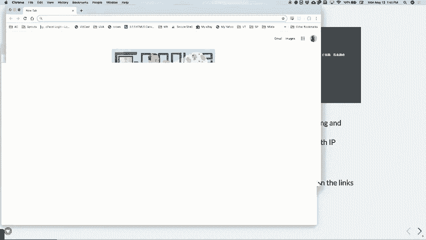
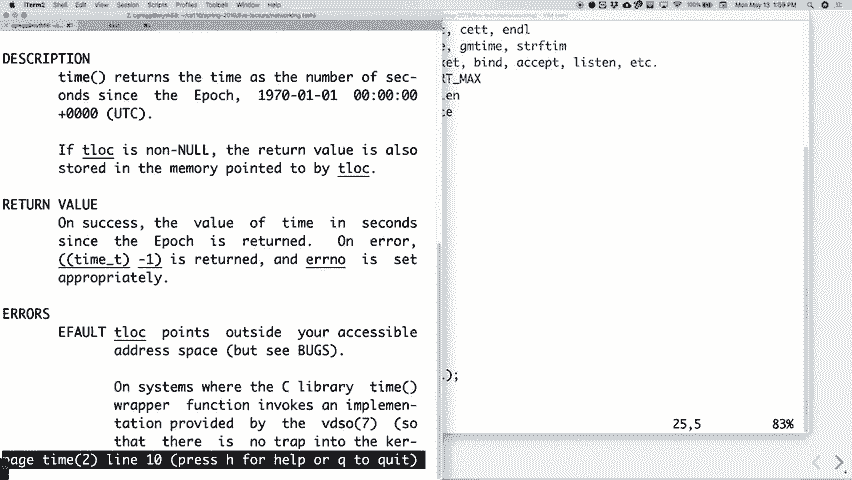

# P15：Lecture 14 Introduction to Networking - ___main___ - BV1ED4y1R7RJ

 Welcome， welcome to week seven we're getting there。 How's assignment five going？

 It's all right hopefully this one's the first threading assignment obviously and。

 it's it's got some nuances to it you definitely have to think about locks and。

 you have to think about seven fours you think about new Texas and we've thrown。

 in all that stuff about oh you have to make sure you only have so many threads。

 and this and that and that's all to test your ability to use semaphores。 RSS。

 news feeds are something that we don't really use too much now but about I。

 want to say six or seven years ago it was kind of a rage like when these came。

 out it was this big deal of like this is how you're gonna read your new Chanel。

 and you're gonna get all these feeds and they're gonna it's gonna be all these。

 little snippets of news that you can go read the bigger articles and all that。

 and everybody thought it was cool and then we all used it for about a week and。

 then went out and was boring like the old way and just kind of went back and。

 but most like lots of places still have these RSS newsfeed services so you can。

 get a newsfeed reader which is what you're building to actually create that。

 Okay hopefully it's not too too bad it is due Friday what I think I'm gonna do。

 is we're a little behind on the assignments only because the midterm。

 happened and I wanted to give you a little extra time in the last one so。

 what we're probably gonna do is I'm probably gonna release the next assignment。

 maybe Thursday give you a slightly smaller assignment than what we were。

 thinking before I got to work all the details out and then we'll get back on。

 track because the last two assignments seven or eight are pretty meaty good ones。

 but pretty meaty and I wanted to give you enough time to wrap your heads around。

 those without making it feel like it was going a little crazy。

 Alright but even though we are still in the midst of threading for assignments we。

 are moving on to new and hopefully interesting material we're talking about。

 there we go we're talking about networking today so this is kind of the。

 next big thing and pretty much the last big thing that we're gonna talk about。

 for the quarter actually we're gonna talk about networking which is connecting。

 two computers together through kind of similar to a read write mentality it's。

 kind it's very similar to creating a pipe between two processes but not。

 processes but now we're creating this kind of glorified pipe between two。

 computers and it's how the internet works and it's how the world wide web。

 works and and so forth so we're gonna see a little bit how to do it by the way。

 if you really like this stuff CS 144 is it networks yeah 144 is networks which。

 goes into obviously much more detail than what we're gonna kind of touch on in。

 this class and I think you'd enjoy that by the way if you've enjoyed the other。

 stuff then operating systems which is 143 no sorry 140 what is 143 compilers。

 yeah compilers compilers is also a great class by the way and then 140 is the。

 operating systems class which goes into like how do you build thread a。

 threading library how do you build multi-processing into an operating system。

 and that sort of stuff if you really didn't like that then maybe stay with。

 those classes go take more and that's but anyway if you do enjoy there are。

 lots of follow-on classes and we'll spend some time talking about those soon。

 anyway so let's talk networking what is networking wealth like I said it's。

 basically connecting two computers on a network and that network can be very。

 local in fact networking can happen between two computers on the same or。

 between two processes on a single computer much like a pipe would but it's。

 using network protocols instead of the kind of the underlying pipe protocols so。

 you can network between two processes on one computer but most often we're。

 talking about multiple computers talking to each other okay the way that works。

 is you need one of the computers to act as a server and a server is simply a。

 computer that's waiting around for some other computer to ask it something。

 I'm waiting around for some other computer to say can I connect to you and。

 if you don't have that server set up you can ask all day but the other computer。

 is not going to respond okay so that's what you have to have you have to have a。

 server and then you have to have one or more clients which are connecting to the。

 server okay and the World Wide Web works this way if you connect to CS110。stanford。edu。

 you connect to a web server and you are the client and many of you can do the。

 exact can do that at the same time so when I say that it's the same time we do。

 have to think about efficiency here because there's going to be some kind of。

 ability for it has there has to be an ability for the server to get the。

 information back to the clients quickly and there might be lots and lots of。

 clients so we have to think about that first we're not going to worry too much。

 about it but then we will eventually think more about that how does networking。

 work it works through this thing called sockets and a socket is a number all it。

 is just an int in fact it's an int that goes from zero to six five five three。

 five in other words you can only have up to 64 kilo or kilo sockets open at once， 64，000 or 65。

000 sockets open at once which would be many more than you probably。

 have most computers do not have that many open at once but it's just a 16-bit。

 integer so that's why it's limited to 65， 35 and you basically set your program。

 up to say hey listen on this socket or port another way of another thing we call。

 it and when a another computer the client wants to connect to your server。

 the operating system notices this there's lots of operating system and。

 hardware support for this the operating system notices this and then sends a。

 little wake-up message to your server that says hey you've got a client deal。

 with it and that's that's what we're trying to do okay you can kind of think。

 of the port number or the socket number as a virtual process ID okay so you can。

 kind of think of it that there's some socket here that connects you to a。

 particular process on the server okay that's the that's the way it goes all。

 right and and the reason we don't have a do like the why not make just the process。

 ID the socket ID is because you want to be you want to say hey listen tell people。

 go listen on this particular port and that changes every time you do a new。

 process so that's that's how we're going to do it how might we look these up on。

 your computer to see what you're connected to well we can do the following。

 we can do let's see hang on there we go we can do a studio here next stat and then。

 I always forget what that runs our PLNT - PLNT make this a bit bigger so you。

 can see the whole thing here okay and let me make it let me make it so that it。

 comes out nicely like this there we go that's very nice all right so what you。

 can do is you can do that on the mid servers and it looks like the mid servers。

 are listening on a whole bunch of ports that are that you were able to see what。

 they're listening on okay they're listening on port 25 which is see if I can。

 get my cursor there you go port 25 okay they're listening on port 587 those。

 happen to be associated with the mail server so all the myths listen on a。

 mail server your computer listens on a mail server okay this one is listening。

 on 53 every time 53 was 53 is the domain name service so when you go to。

 www。google。com well some somebody needs to translate that into a number because。

 your computer is dealing with numbers and people like to deal with words so that。

 there's a translation layer there which is had handled by the domain name service。

 which is running on your computer which connects to another computer which connects。

 to another computer which which has all the domains on there like your computer。

 kind of keeps a little list of where I go first and then that query is another。

 computer which eventually gives you back the name I guess in some sense it's like。

 the directory search for your first the file system programs it's kind of what's。

 going on there okay port 22 is for telnet and it's all right for SSH we'll。

 talk about telnet in a minute it's for SSH which when you SSH it goes to port 22。

 by default some people like to set their computers up to listen on some other。

 port for SSH because tort 22 tends to be one that lots of bad actors try to like。

 connects to because they know that if they can figure out a password they can。

 get into the computer so they change that but ours is just the default 22 631。

 happens to be the printer server in fact we may not know this but you can。

 generally on your computers let's do it in a new window here you can generally。

 go to make this a little bigger here 127。0。0。1 which is your local computer it's。

 always your IP address colon 631 if all works right there's the little printer。

 details so it's actually a web server that you are listening to to actually do。

 printing and it happens to be set up on many computers and you might get a little。

 message that is not set up and it tells you how to set it up if it's if it's not。

 we could also have typed local host colon 631 local host is as you might guess。

 your own computer okay and it should also come up there that's the that's what's。

 going on there okay so that's that let's see we've got another little 22 and 631。

 therefore TCP 6 so it turns out that normal IP addresses are 32-bit numbers。

 they've got these colons in them you know like 127。0。0。1 that's a 32-bit。

 number just kind of separated up into into little two byte number two byte。

 numbers but it's a 32-bit number and with 32 bits how many different IP。

 addresses could we have four billion about there's actually more than four。

 billion computers on the internet back when the internet was designed which is。

 it turns out it was a defense department program back in the day in fact I don't。

 know if I showed you this before original internet see there should be some。

 images here I'll probably should be able to find out let's see where's the good。

 one that I always like to use just the one yeah this might be it yeah there's。

 there that's a slightly or oops slightly there's the there's one I was。

 thinking oh no that's it that's the tiniest little one you can't see it on there。

 well you can kind of see it Stanford is on there we were part of the original。

 internet nice right notice who's not there， else relatively local not there MIT is on there BBN which is one of the original。

 places it's a company that kind of start on this let's see let's see Carnegie。

 Mellon was on there used to just be the Carnegie Institute at that point。

 Illinois Utah was on there Utah believe it or not it was a really good computer。

 science department back in the 1970s they happened to get on the internet。

 really early so lots of lots of early think but anyway back then they said。

 32 bits four billion computers on the internet that will never be big that many。

 computers on the internet that's ridiculous so that's why they kind of。

 started out with 32 bit numbers but of course today we don't do that how do we。

 get away with this now what we have is routers that then give like in this。

 building there might be one IP address and then the router gives each one of you a。

 local IP address and so it's one level removed so that's what's that's just。

 going on there we are trying to fix this issue so that every computer can have。

 its own email or its own IP address we do that through we do that through IP。

 version 6 versus version 4 which has a 128 bit address which is many more。

 computers you could practically in fact I think you could probably give every。

 atom in the universe its own IP address if you wanted to without many numbers so。

 there's lots in there so there's plenty plenty of room to grow with that but it's。

 going to take a while to get everybody up to speed some servers are listening for。

 that okay now if you happen to be running a program yourself notice that over in。

 this side it says PID program it doesn't say anything that's because it kind of。

 hides it from non super users which we are not as just regular users we can。

 actually let's me run something we're gonna actually create here time server。

 descriptors I think that there we go so if I do this just be on the same。

 computer what are we on over here myth 58 so let's actually do it on the same。

 one let's do oh I'm with 58 okay let's do it again and look at that it says。

 2 6 5 5 slash time server and that doesn't give the whole thing but that's。

 ours like that's the one I'm running right now okay so that happens to be port。

 one two three four five that's a good good why is it。

 zero zero zero instead of 127 I don't know why tell you true not actually sure why。

 that's why are we 127。0。0。1 is the way the internet says local computer that's。

 just the number it gives all the computer all your low computer is the same as。

 every other computer I don't know what it's a good question I'm not sure why it's。

 as zero dot zero up there but anyway port is correct but the you're right the。

 other part is not okay so what else can I tell you about these these addresses as。

 I said there's let's see there are 65 or 64 thousand or 65 thousand of them。

 you're really only you really only should use some in a particular range。

 yeah why didn't it show that my SSH connection was established where I am。

 SSH in a myth this is on the myth computer but it doesn't say what doesn't say the。

 actual connection like there might be many connect this is just showing you。

 which servers are available are listening that's all this is showing you。

 now good question all right so you can actually go and see a full list of common。

 ports okay the common ports if we go there's lots of them okay this is like。

 that's actually just a tiny little list of them here let's see if I go to there。

 here here's the common ports I make this a little bit bigger here okay very big。

 so basically ports 0 through 1023 are kind of used for systemy things like you。

 don't want to do a port that's really low notice all the ones we talked about。

 earlier were kind of low they're like very well defined don't use these ones。

 because they're all ready for SSH and for oh by the way 80 is for the web the。

 web and so forth and so there's you want to be able to you don't want to use。

 those okay but they're the list small in there as I say up here what the other。

 ones are now so we've got lots of ones look if we look at 80 in there 80 is for。

 HTTP which is the web and so forth lots of ports in there that you can look at。

 that are well well defined and don't use them if you can help it we go to the。

 next list here after that okay from 1024 to 49，151 which is you can see why they。

 chose that number based on some powers of two those are assigned ports but it's。

 kind of wishy-washy it's basically like somebody says hey I want to use this。

 port can you assign it to me and the the IAN a which is like this organization。

 that does this kind of determines whether or not you have a legitimate。

 reason are you a company are you some you know you're doing something interesting。

 they say fine you can have one we'll say that this is your port and some of them。

 in there they they do that open VPN for like connecting your computer through a。

 virtual private network that's 1194 etc okay there's but lots of them there's。

 there's thousands and thousands of these but you don't have to live by those。

 right if you do your own nobody's gonna go and you broke my thing if you're。

 running a program that needs that port and you run another program that's on。

 that port they can't both be listening to the port at the same time so that's the。

 the big issue there we use for the one I just showed you we used one two three four。

 five one two three four five this happens to be set up for cube world little fighter。

 to and net bus they all kind of you know or I guess they assumed that they all。

 wanted one two three four five we will often use that one just because it's easy。

 to type and whatever but if you have to be running a cube world server on your。

 computer well that's probably gonna conflict with the one you want to do so I。

 don't know a cube world but anyway you could or a little fighter - whatever okay。

 anyway and then above the whatever the forty thousand or whatever it was they're。

 kind of upper grabs they will not predefined those you can use those for。

 whatever you want and nobody's gonna say hey that was the one we kind of wanted。

 after that okay so those are those are the port numbers and let's see there we go。

 and those are what you will see you'll see a lot of normal ones and then we'll。

 use our own question well that's good question ports let ports are on a server。

 to listen to the computers a socket in a port is kind of interchangeable a socket。

 is more or less once you set up a socket think of you setting up a pipe that's。

 kind of the way it is but the port number is the socket number that's the you use a。

 socket on a port number let's put it that way， well a server just is a computer right so it's not like yeah I mean your your you。

 are when you send a message to another computer you actually use a port but it's。

 not necessarily the one you're connecting to so let's say I want to。

 connect to your server on one two three or five my outgoing port might be you know。

 1800 or something like that it was whatever it goes out on and then and then。

 the other computer goes oh when I respond go back to that port we actually。

 hide that a bit of that from you from here you don't need to worry about those。

 details quite as much for this one it's just kind of all built into libraries。

 we're using it makes sense yeah anybody else good questions lots of details here。

 that you can get into all right let's see what else that's that let us create。

 our first server okay so we're gonna create a server and all the server is。

 going to do is you do it right here it is called time server and we're gonna use。

 descriptors to start out okay to do this and there's a bunch of like set up。

 obviously in here what we're gonna do is we're going to set up a server that。

 basically gets the time on the server as it turns out it's gonna get gm t which。

 is the time at Greenwich Mean Time in England it's gonna get that well it gets。

 the time and then it converts it to whatever we want we're in this case。

 we're gonna convert it to Greenwich Mean Time which is which is pretty standard。

 it's the easiest one to type as it turns out but what we're gonna do is gonna get。

 the time it's going to win a connection when you get to connection request it's。

 going to find the time and then format the time into a string and then push it。

 back and connect the computer so basically like a time server it just tells you。

 the time okay and that's all there is to it okay how do we do this well you can。

 do int server equally remember the server is just a well in this case it's a。

 in this case it is a number that associates itself with a server it's kind。

 of like a file descriptor in that sense okay and then we're gonna use create。

 server sockets okay one two three four five that's it that's all we're gonna do。

 for this now to create server socket uses some underlying built-in system calls。

 and so forth you can go look at that in I believe it is server socket dot cpp。

 actually let's just see let's see if we can find server socket server socket。

 dot cpp and it's not it server hang on。

 server socket dot c oh that's easy no let's do here server socket dot cc there we。

 go okay and create server socket use some underlying function a function called。

 socket which does it and it's got some some parameters in there and things if。

 we're not gonna worry about right now we're just always gonna use these ones。

 you feel free to look at those we'll talk about some of the details of this it's。

 pretty soon okay and then by the way did you notice that I did control Z and then。

 Fg now you know what that all does I've been using it all year and some of you。

 now you know there is okay so we create that we create the server and then we。

 basically do a little while Lou that just sits here and waits for connections。

 okay so we're just gonna sit here and wait for connections and when we find。

 well we're going to do the client we're gonna get the client equals except and。

 then we're gonna ask for the tell it to accept on the server number and then。

 we're gonna pass in a couple of no's if we wanted to get the client's IP address。

 we could use those we could use the no's to be a couple parameters ones like us。

 one's like a status the other one's like what do you want to get kind of like。

 wait PID we could use that for to get information about the client that we。

 want okay and then we're just gonna call this function we're gonna write in a。

 second called publish time to the client and that's it for me waits for it does。

 the accept when by the way except blocks until you get an actual client that comes。

 in okay just sits on wait and then when a client requests the connection it goes。

 to the next line it creates the connection then goes to the next line and。

 then and then it repeats that's all there is to it okay all right now if。

 published time took a long time then you might start to drop connections this is。

 something we have to worry about we will get there a little bit later yeah it never。

 breaks out the wireless this this server goes on until you do control C and in。

 most servers like that they just kind of go and go and then and then you want to。

 break them you stop the program that's it because this is really simple now you。

 could certainly have some other way to do this and and stop it nicely but doesn't。

 really matter in this case yeah good question yeah good question why do we。

 want to do this this is so that we can get you can ask for the time then I can。

 ask the time and you can ask the time and something this is so that it's gonna sit。

 there and just anybody who requests the time is gonna get the time back so does。

 it one after the other at the other at the other that's why we want it in a。

 while it's serving the time forever more as long as we have it written good。

 right a good question the question is like wait this seems a little more hidden。

 from us than like all the file descriptors and so forth for now at least we're。

 really when you're writing programs all you really need to know is look do I。

 have I set up a server using create server socket and then have I accepted。

 the server and gotten a client from it that's really all the that's the level。

 you're gonna look at feel free to look at the header files in the actual C C plus。

 code if you want to dig a little deeper we're also gonna use well we'll see in a。

 few minutes how we're gonna make it a little even a little simpler honestly。

 that's not the level we care about the kind of level we care about is create the。

 server respond adequately and send it something， yeah good question let's try so right now I'm listening on the port the question。

 was wait what if I create a - what if I create two programs I try to listen to。

 the same port well this one happens to be running right now in one two three four。

 five on myth 58 if we do the same thing again and do another one on one two four。

 five also a myth to get it says could not start the server doesn't let you it says。

 are you've already somebody's already using it sorry and that's all there is to。

 it okay yeah so you have to be a little careful when you're setting these up you。

 don't you so for instance when you do your assignments with these network。

 implants we're going to set up the port you use based on a hash of your username。

 which is unlikely to match anybody else's so it's gonna should work out just。

 fun but yeah good question you can't we can't duplicate it on the same machine。

 doesn't work very good question okay let's write the publish time function here so。

 to publish the time we have to get the time all right time and then it's actually。

 time to underscore T we're gonna look at that in a second it's a struct that is。

 built for you raw time I don't need struct time T because it's C++ or need。

 in C++ and then we're going to just basically use the time function to pass。

 in a pointer to this raw time which populates it okay and then we are going。

 to use now we do needs a different one hour actually that's probably need to。

 do this anyway but anyway we're doing it this way P T a pointer to a time which we。

 are going to do that we're going to say gm time and we are also gonna pass in the。

 raw time this is gonna do that some of the conversion for us okay and there's。

 another struct called TM which we're going to do and gm time is going to do。

 now let's talk about time for a second it turns out that if you look at time t。

 sorry I said this wasn't a this was struck this is not a struck it's actually。

 just an integer time t if you look up time t just an integer and when you ask。

 for the time when you say time it populates the integer based on the number。

 of seconds since the epic okay in fact if we go and look this up let's do it over。

 here let's close this man time I believe this is it here and see here we go time。

 returns the time is the number of seconds since the epic or epic depending on how。

 you pronounce it which happens to be the beginning of time in Unix world is。

 1970 January 1st 1970 and you say who came up with that number what was the。

 reason for making that number as the beginning of time well Unix was created。

 in 1970 and Unix was because they did that they said well let's we got to have。

 the time basically from some time why don't we just start it now I don't know。

 if they never thought that there might be an issue with using time based on。

 numbers before 1970 I don't know they they didn't think they use this anyway。

 for that but it was the time since 1970 and once again many computers these days。

 still have time underscore T an integer that's actually a four byte or 32 bit。

 integer once again number of seconds since 1970 January 19th first 1970 let's。

 find out how many seconds that is how many numbers can we fit into a 32 bit。

 number four billion right we want we just do this we'll do it this way let's say。

 so there's two to the 32 which is how many bits we have right and that's how many。

 different numbers we can do it turns out this is a signed number so it's actually。

 only two to the 31 okay two 31 in fact it's minus one because you're not get。

 you don't get that whole range it turns out because a second since so there's no。

 I guess there's no zero in there minus one that's how many different numbers we。

 have which is two billion something about this up a little two billion different。

 numbers seconds since 1970 well if we wanted to figure out how long this is。

 going to be right how are we going to or how are we going to do this so that we。

 can figure out how many years it is how are we going to convert seconds to years。

 in this case divided by maybe 365 point two five all right got it leap you're in。

 there suppose right okay that's going to be the number of days per what is this。

 there's seconds seconds per day now we want to end up wanting to know the number。

 of years okay and then times 24 times 60 times 60 oops did I forget to print。

 there we go okay so 68 years right 68 years from 1970 gives you 2038 what's。

 gonna happen to computers that still use this time in 2038 it's gonna wrap。

 right this is one of seven stuff I guess right it's gonna wrap around and any time。

 after that is going to start from 1970 again so in 2038 we're gonna end up with。

 an issue where there are computers in the world that are currently not gonna be。

 updated until then because well they might be who knows let's see some of you are。

 actually younger than 2000 who's born after 2000 a few of you yeah a few of you。

 okay it scares me by the way that vividly remember your 2000 anybody remember。

 the Y2K or anybody know about you don't remember it the Y2K issue but what。

 happened in your 19 about 1997 people realized that there was a very similar。

 issue with many programs where programmers would write the year with only。

 two digits because they were writing these programs in like the 1970s and。

 like who's gonna be using these computers 25 years from now ha ha ha。

 right well banks all right banks still use the computer use the same programs。

 and whatever and what they did was they wrote the date with only two days mainly。

 to save or to two numbers to save memory because back when they were。

 building these computers in the 70s the memory actually meant something and they。

 well for every date if we save two digits that's actually a lot of a lot of。

 memory back in the day it was a lot of memory so they did this well when 2000。

 was gonna come around then it was gonna wrap around and go back to zero which。

 instead of 2000 would be 1900 and then this would be a big deal around the。

 first time I heard about it was about 1997 some people have thought about this a。

 little bit before then but 1997 was when most of the world all of some woke up。

 and went oh we're in trouble right we're gonna we're gonna like the entire world。

 could collapse if all the banks collapse because all their software thinks that。

 it's nineteen hundred instead of two thousand and so the world will burn and。

 this was this was a big deal in 1997 or so well people went and looked at all。

 these computers said well okay we can fix these we just have to hire people to。

 rewrite the code and recompile it and so forth much much of the code believe it。

 or not was still written in co-ball a language designed in the 1950s turns out。

 that's still kind of true that a lot of banking software for instance happens to。

 be written in co-ball and most of the co-ball programmers have retired they're。

 all living in Florida are tired right and so they all started picking up their。

 phones and somebody said hey we'll pay you a million dollars to come to our。

 bank and fix this they all went a lot of plane and they went and like made lots。

 of money and fixed it fixed it mostly but it really people December 31st were。

 like storing like tuna cans and things and like lots of water and all that because。

 they thought this was gonna like the world was gonna blow up because of this。

 and of course he didn't have it I remember one website I went to that said。

 the date was like January 1st 101 or something weird like that and it was。

 probably that issue is what happened but anyway that issue happened in 2000 we。

 were coming up with another Y2K like you know more better bigger or faster。

 whatever in 2038 and there are still computers that deal with that so all of。

 that is to say that we still use this time underscore T some computers like the。

 ones we use now use a 64-bit number oh by the way 64 bit number would be instead。

 of two to 31 to the 63 and this gives us until well gives us what is that two。

 hundred ninety two billion more years so if people are talking about that to not。

 a ninety two billion years now probably not gonna be also gonna be computers。

 talking about it because you know it's probably not gonna be any human。

 stalking anymore they're gonna go ha ha we've got a deal of this it's that could。

 happen I think the Sun is going to become a red giant before then and then。

 we're all you know the earth is gonna get involved and I think so probably won't。

 be computers they might ship some computers off to some other sources。

 who knows anyway they're gonna have to deal with that two hundred ninety two。

 billion years now but that's that so back to what we were talking about all。

 that digression aside we're trying we are getting a time to we're converting it。

 to this struct TM which kind of breaks it up a little bit question yeah why would。

 the time TV sorry who it's probably because you can get a。

 negative like return value like oh let's just make it so we can get negative。

 one back that's probably the reason like it yeah who knows but they also thought。

 well again 68 years if they've done it if they've done 32 bits on some would have。

 gotten another 68 years which is a kind of nice but they didn't think about it。

 probably just because though I want a return value would be negative one。

 probably the reason yeah oh for the time yes such a good question is there a。

 timer in your computer is really what you're asking right I mean is there a。

 clock that's we're updating yeah sure there is yep and the timer runs at。

 whatever your clock frequency is but then they just divide by the number of。

 clock ticks per computer if your computer runs it one gigahertz or whatever。

 just divides by one gig or two get you the number of seconds and it and it does。

 update that every you know every second in that case for that time that's。

 happened that uses signal by the way just the operating system basically it's a。

 signal that happens every it's a timer that happens every second it just goes。

 and does that it actually happens much more frequently than that because there's。

 other more precise timers than one second but yes there's actually a timer。

 that updates everything oh yeah good question how do you synchronize these。

 timers using time servers basically like somebody in Greenwich England says。

 this is the real time boom and then it's and it's much more strata mercer do this。

 by the way and they all say this is the real time based on this and there's always。

 leaps seconds and things every couple years we get and whatever they say this。

 is a real time and then all a bunch of time servers connect to that and then。

 have their own local versions and then we connected those and it's all very。

 coordinated doesn't always work but it's pretty coordinated yeah。

 yeah so so people didn't hear that the so Amy got computer and it was from Germany。

 or something and every time she turns it on it resets to the German time zone or。

 whatever yeah when they when they set up the bios on that computer it probably。

 said if you can't don't know the time look it up by just or just set it to this。

 time and some other time zone where it was first originally like built and。

 that's that's a hardware sort of issue by the way it may be because your battery。

 there's another's a battery a tiny battery inside the computer that might be。

 dead that might be the reason that it's a that it does like does it does that but。

 and then it connects to the server and it's okay once it does it okay。

 good all right so let's actually finish this this program up before you go to。

 next programs we are going to get the time using this gm time function and then。

 we are going to convert it using this gm time function then we're gonna have to。

 convert to a string let's just use a char star time string there 128 is。

 definitely long enough to hold our little time string okay and then we're gonna。

 do STR F time this is the thing that converts the time to the actual string。

 for you and this is in many languages has this stir time function and then you。

 takes in the time string and then what else does it take in it takes in how big。

 it is size of time string so it's an overwrite past the thing percent C in this。

 case actually means not one character but it means do it in a local defined。

 time this is the GMT time that it's going to do and then it needs to take in the。

 pointer to the actual time struct TM that we have there okay and then what are。

 we gonna do well we're gonna do this this will give you flashbacks maybe not。

 good ones to the the midterm exam number of bytes bytes written equals zero size。

 T num bytes to write equals the string length of time string we're sending that。

 we don't need the zero on there as it turns out we don't need to send that and。

 then while num bytes written is less than num bytes to write num bytes what is it。

 num bytes written I always get this right to think about it num bytes written。

 plus equals right and then we'll try to the client and then the time stir plus。

 the num num bytes written and then num bytes to write minus num this is a lot。

 becoming a long line num bytes written okay all right and then that was in a。

 while loop and after that we are done writing and then we need to close the。

 client okay so this is actually now all of a sudden really important to do the。

 right in a loop because when you're dealing with networks it may it's very。

 likely that you would not push all those bytes up the network files it's pretty。

 likely that you're gonna get them all pushed but in this case unless you have a。

 pipe that's filled another maybe like making you twitch a little from midterm。

 but that's what that's what's going on there we need to write this to actually。

 write all the bytes out but notice that the client in this case okay the right。

 function like no uses treats that just as a file descriptor which in Unix it is a。

 file descriptor turns out okay it's a file descriptor that ends up pointing to a。

 socket that point that sends it to the client okay all right let's see if I made。

 any mistakes here time server descriptors looks okay okay and then we run it。

 run in the other one over here time times we've seen this already server。

 descriptor we haven't actually seen it work it time server descriptors is running。

 okay and you can actually get that information by connecting to the thing。

 I've written a little client that we'll talk about probably next time but you can。

 do it in an interesting way using a function called telnet which we're going。

 to talk about a little bit later to telnet is kind of you get to what used to be or。

 it's the original kind of version of SSH except it was very much SSH 10 for。

 secure shell telnet is very much not secure but what it does all it does is。

 it connects to a network and sets up a connection and then you can talk back。

 and forth to the network so if we type telnet myth 58 and then give it port number。

 one two three four five okay it all goes well there we go it tells you some。

 details says trying myth 58 is it turns it that's the IP address from the 58。

 connected to it tells you something about how you exit out of it all you do is you。

 do the connection the instant you get the connection the myth the time server。

 goes here's the time close the connection and so that's what happened here and it。

 and that's it okay there is no back and forth we'll get to the back and forth in。

 a little bit but that's it okay notice it is May 13th 914 it's 914 because。

 that's the current time in Greenwich England this turns out okay 21 14 914 I。

 believe that's correct 7 I was different something like that um so and some who's。

 sending messages hi and you don't do that thank you though but don't you um so。

 the so anyway once we have the server going now this while what happened it。

 needed one connection and you guys could all check that by the way you could go。

 right now to town that to myth 58 port 1 3 4 5 and get the actual time from。

 myth 58 okay you could actually do that and check it out um we could do this in a。

 little while loop here while one do uh let's see actually let me run let me。

 just show y'all run the time client right now I need to do myth 58 and then。

 1 3 4 5 and there we go just kind of it takes away all the other garbage but if。

 we do this in a while loop you can see that it updates。

 what while one do time client's myth 58 1 3 4 5 and then let's sleep for one second。

 and done and that's there we go and then every second I'll just kind of update。

 my skip one is not right on the second or whatever it might make that but you。

 can see that every second it's updating because it just updates as we go along。

 okay you can do some other kind of fun stuff with this I wrote a little uh。

 a little she'll call let's see corner time。sh which uh looks kind of weird and it's。

 got it's basically calling this let me change oh it is myth 58 that's good。

 here's what corner time does let me run it for you first。

 corner time just basically keeps the time up in the top left corner of your。

 shell right you may ever wonder how them and emacs actually makes it so you can。

 type up here in your shell and not down here and it actually it's using these。

 things called antsy escape characters so if we look at this uh let's see。

 antsy escape sequences there we go so here's a table of all these antsy escape。

 sequences it's basically these agreed upon things you have to send to your。

 terminal to make the cursor move around right you can do it you can build up。

 pac-man game or whatever make it in the terminal just like you know you can do。

 anything else you can make it move around the screen which is kind of fun it takes。

 these things called escape commands um and if we look back at here again。

 the escape character it's actually a little weird to type that it's actually。

 it's actually one character you actually have to type control v and then the escape。

 character and it puts that one character in there for you。

 and then every time you want to print something you print the escape character。

 and then some command basically in this case it saves the cursor position and。

 then moves the top left and then um makes it white with red background so I。

 wanted to do that and then it calls the time client and updates it and then it， only sleeps for 0。

2 seconds in this case if you do corner time at SH in the。

 background well then you can do LS and whatever and it'll keep coming back。

 kind of nice if you want to keep that little timer up there of course you've。

 got one in the other part of your computer anyway and then we can we can。

 do that um it doesn't necessarily work well with like them uh it works a。

 ok but then if you want like it'll it'll work ok if you do that but then。

 sometimes it goes like if you go back up to the top it'll probably not work。

 there we go so yeah it's not not the most robust thing in the world but。

 um that's that let's see let's get rid of that there we go。

 so uh so you can use this time server if you if you want to okay then anyone try。

 connecting to it did it connect okay if you connect at the time server。

 can bring it connected to it yeah okay so what do we want to do to make this。

 program a little bit better well what we want to do first is。

 screen bigger uh we want to do first is we want to this is a。

 published time we already talked about here um we want to actually get rid of。

 that whole while loop right business that's midterm stuff we don't want to。

 write that all right we want to make it easier to print stuff out to the server。

 and uh let's do that using a library called socket plus plus okay the socket plus。

 library is a just a library that wraps that right command and does all the。

 buffering and whatever necessary for you so that it makes it easier to。

 uh to do that so let's actually just quickly uh rewrite this。

 core uh no we want to do uh time server we'll keep the same one so we don't have to。

 type all the differences here uh so what we need to do is you just need to。

 pat and you're allowed to use this it is not it's a library that's not built into。

 c++ but you can use it uh it's called socket plus plus。

 slash sock stream which is nice okay and then all you need to do down here。

 is get rid of all this that we don't like writing and we just have to set it up。

 to uh know how to connect to our talk to our client we do the following we say。

 sock buff sb which is sock buffer and we tell it here's the file descriptor we。

 want you to write out to okay and then we do iosock stream ss which is now a sock。

 stream uh which is in this library as well and then we can do something like。

 ss and then these should look very familiar time string and。

 and it takes care of all that works okay and the other nice thing is we also because。

 of the way the socket works when the function goes out when the uh sock。

 sir the when the sock stream goes out of scope the sock buff descriptor i mean。

 sorry destructor closes the client so you don't even need to close it。

 anymore once it goes out of scope the client gets closed for you。

 it's kind of nice so that makes it so you don't have to write those。

 you don't have to write those um why that wild that's really annoying to。

 write time server descriptors again， oh no socket sock stream get around here sock。

 see i think that's right let me just see um， time server gotta do。

 it is socket plus plus slash sock stream do that right。

 oh oh dot h oh okay thank you better than me looking at this stuff there we go。

 okay and there we go so it's going to be the same。

 same exact sock is there okay all right and that's the the next thing we want to do。

 um this is going to make it much easier so you don't have to do the writing and。

 waiting and all that it's just uh you can use that as long as we have a c plus。

 program you can use that which we are going to do uh for all the rest of the。

 projects and things it makes it easier all right um。

 what else uh are we going to worry about well turns it out and let's actually。

 try something let's say that we add maybe let's say we made published time very slow。

 okay so let's say time server descriptors cc let's make uh let's say that it might。

 publish the time but then it's going to be really slow so we say something like， sleep uh。

 or something like that oh that's not gonna work how about two there we go if we do that。

 see there we go and then let's say i run this again。

 and if we go up in our do our one second business here。

 there it is okay what it's going to do is it's trying every second to actually get the number but。

 should hang on， let's see we want to do this instead of let's get rid of that sleep and see if that makes a difference。

 it should there we go so it's not sleeping anymore who's doing the sleeping now。

 that's the actual server that's got the issue and that when you try to request a client it。

 blocks requesting a client and so it takes time to actually do this we want to get rid of that delay。

 because you don't want to wait for someone else's google search before you do a google search。

 right you want to do it much quicker well and actually before we do anything else let's actually。

 get rid of that sleep too so we well i guess we could we could do it later but how are we gonna do。

 that threads okay now that you know about threads you can launch a thread every time someone wants to。

 connect to you and remember how threading works you're doing it now thread says okay i'm going to be。

 in some let's say why i move i'm going to launch the thread forget about it let it do its own thing。

 and then go back up to the top of my my while loop or whatever and then i can accept another。

 connection okay so that's what we're actually going to do we're going to use a thing called a。

 thread pool which i've mentioned a couple times thread pool and a thread pool is what you're going。

 to build for the next assignment okay so we're going to use it now but you're going to build it for。

 the next assignment and you're going to see how that works in the next assignment but it makes it。

 relatively straightforward about what we have to do to actually do this let's do this we need to go。

 down to main and this while loop is where the problem is right we're blocking basically until。

 publish time comes back so what we want to do is we want to say oh okay let's create a what we call。

 a pool of threads that allows us to uh to go and set these threads up every time we get a request。

 and a request we're going to throw it off to a thread for some maximum number of threads in this。

 case we're just going to use four as it turns out you do need another pound include see if i can。

 type this one right this time pound include uh i believe it is thread pool dot h there you go。

 and that's that and then what we're going to do in main is we are going to uh we are still going to。

 do the accept but once the accept happens we want to get back to that accept accept as fast as we can。

 so that we don't uh block so we don't like make the uh user wait on it okay and in this case we are。

 going to uh do the following okay we're going to say pool dot schedule when you write yours you。

 will see what this is all about we're basically going to schedule a pool this takes a function。

 great so we'll use a an anonymous lambda function here we need to do the client and then we need to。

 publish time publish time for the client and that is going to be it and then we don't need that。

 anymore okay so now we're going to this is going to happen instantly and go back up to the accept。

 you'll be able to accept many many more clients very quickly they will all go into their own。

 thread up to four threads in this case we could make it 40 if we wanted to but oh but we haven't done。

 that we haven't set that up yet uh we're need to do that let's see thread pool pool four pretty。

 straightforward you set up the thread pool and then you can schedule threads to go off on there。

 you can schedule work to go happen on those threads as they go okay that's what's happening。

 there questions on that yes so like thread wouldn't be as uh so there would be more efficient slash。

 not like the other stuff that are in， so the question is do we do this because it doesn't take up as much resource as they know this makes。

 them more resource takes up more resources as it turns out but at the benefit uh with the benefit。

 of doing it fast so each three each time somebody requests the time we go and set another thread off。

 or or say to one of the threads that's waiting around doing to do work please go publish the time。

 that's how we that's how we use that okay pretty straightforward using thread pool is actually very。

 nice as it turns out there easy does automatically do it it automatically thread pool does all the。

 joining yet you'll build that into your thread pool when you do that okay but the one thing that。

 we do need to change you have a question why do we need to create thread？

 we need to create the threads when we're downloading things so so the next assignment you're going to。

 see how you use a thread pool to make things a little bit faster than what you're doing now。

 for it's you won't be able to tell necessarily for for the assignment uh assignment five。

 but basically having threads already running means that you don't have to get them running when you。

 call it so it's faster in that sense they're all just waiting around and going give me some work to。

 be just like farm did for your assignment three okay i just picked four because it was a number。

 bigger than one how many do you know how many you need good question depends on what your。

 low you expect your load to be so google's gonna have thousands of thousands of threads running。

 because they know that millions of people are going to be each server's got it's like lots and lots。

 of threads um for ours i'm just making small just to do it we could have made it 40 and it wouldn't。

 have mattered you you are generally limited to the number of threads on a particular machine。

 if you're not the super user thousands or something like that so we don't want to do that now the other。

 thing we don't want to do is make the bandwidth of the system such that it's uh it's we don't we're。

 not going to want to like tie it up too too much this is what for assignment five what you're doing。

 is you're saying oh i only want 24 total threads and i only want 10 threads going to any particular。

 server because you don't want to blast it with all your requests that's kind of what we're trying to。

 do with limiting these things as well okay so let's do this we have to do one other thing here。

 we need to actually make uh publish time what we call thread safe it's not right now you wouldn't。

 know that because you wouldn't necessarily think about it but the way we're doing this we are using。

 one we're using one kind of globally available pointer here or one pointer that actually tries。

 to go to this that shares the same time struct we can use a different function to to do this the。

 first couple lines are going to be exactly the same and what we're going to do now is we're just。

 going to instead of making it a pointer to a time struct we are going or a um yeah tm struct a。

 struct tm we're just going to make it a an actual local copy of the time the tm struct and then what。

 we're going to do is we're going to use another function gm time underscore r r stands for reentrant。

 which basically means it's thread safe why is it thread safe now you are going to be copying the。

 time into your local copy threads copy of the time so they're not all trying to share this copy。

 okay so that's uh that's why we're doing that and it takes a little bit more information here takes。

 the raw time and it takes a pointer to tm which is uh we're trying to do and then otherwise i think。

 except for this being， antressant m i think that's all we need to do to change that say again did i screw some up。

 you don't think it has to because it's a pointer to a time before it was a point ptm but pointer。

 so now i think it does we'll see but anyway that's all you have to do to make it reentrant。

 you have to think about these things when you do functions with threading you always have to worry。

 a is my can i do the function is it thread safe things like stir talk not thread safe why because。

 stir talk has its own internal state which is not really what you want why just use another one so。

 for instance we look up uh man gm time right it should have there's a whole bunch of different。

 times in here uh there is right there gm time gm time underscore r which is let's see say that。

 it's the reentrant version yeah uh the gm time r function is like the store the data and user。

 supply struct so basically it's uh there i don't know if it even you can look up thread。

 there we go tells you if they're thread safe or not you have to think about these things when。

 you're doing threads oh yeah the question was why do i have to change from a pointer to a local one。

 well first of all the gm time underscore r function takes a pointer to the thing but it。

 populates it for you so in this case it populates it for you instead of giving you a pointer and a。

 local copy that it's got so that's the difference there the regular gm time says oh here's here's。

 my pointer that i'm keeping the time in the one that or the arm i'm creating it mine for you and giving。

 it to you and then if you called it again it would just redo that time and so you don't want your。

 thread sharing that one value you want their own copy of it good question yeah is there anything。

 you can do with threads manually you can't do a thread pool uh not really i mean threads that you。

 you're gonna want to do threads if you have no idea what your load is going to be or you just want。

 a one-off thread or something like that you probably don't need a whole thread pool for it yeah once you。

 write that assignment you'll see kind of the differences of when when you might use it or not。

 good question yeah um why wouldn't it be thread safe if it's not changing the value it will change。

 the value you want to know when you call the function again if two functions call the call the。

 gm time it will get updated and then it won't be the same they're trying to use the same value and。

 you just are you only storing it once so let's say another one came by a second later the first one。

 might get that later time if it hadn't published it yet or whatever so there's some issues of it。

 yeah dude okay yes we took out the thread to make it multi-threaded yes um and as your question。

 like should we try it again with the thread sleep to or if i put the sleep to back in it would make。

 it would be that so here's what we did before we just put a we put a little thread we put a little。

 inside here we put like a sleep to or whatever right so every time a server requests it that server。

 is going to get it and then have to wait a little bit before closes its connection two seconds it turns。

 out if you have multiple clients coming in at once then they will all get their own they will still。

 have to wait two seconds it turns out but there's that each one does not have to wait two seconds each。

 one independently waits two seconds doesn't have to wait for the other one to finish that's the。

 difference there okay so all of that said we now have our good version which is which uses。

 threading a thread pool as it turns out and it allows the server to accept a connection spin。

 off a thread really quickly and then accept another connection so if there are 100 connections。

 coming out there are four in this case connections at once it will very quickly deal with them it's。

 already pretty quick it will very quickly deal with them and not have to wait for the published。

 time function to end okay so that's the the big deal there now the uh let's see we talked about。

 the published time that there's the updated time okay uh given the time now i think we're gonna talk a。

 little bit about building building a client i don't know we might get a chance to to build the client。

 but i want to show you a little bit more about uh the well i'm going to use town that to show you a。

 little bit more about how the internet works okay here's what i want to show you okay so。

 we use town that to go to our server in fact it's still running town that uh myth 58。

 one two three four five and maybe not hang on maybe oh maybe we have the oh i bet we still had the。

 still have that we still have the delay in there probably and there we go there's still the delay in。

 there um so we used town that to do that town that again simply opens a connection and then has a。

 plain text communications with the server okay so you could do the following townnet google。com。

 port 80 well we know that port the internet is on port 80 and if you do the following you do that。

 we are now connected to google okay now we're not connected to google's like pay server or whatever。

 you know we're not connected like the internal network connected to the website just like your。

 browser this is exactly what your browser does okay your browser says hey connect to google so。

 that's that there's a bit of a timeout so hopefully i'll do the rest of it fast enough but how do you。

 do this uh if we want to actually request a web page you have to do a very particular protocol。

 and the protocol is http which you may or may not have heard about before but it's the protocol。

 which is talked by a talked on by the entire internet okay there's a few different versions。

 of it as it turns out what you can say though is you can say get slash which means the home page。

 and then you say i am using http slash 1。1 there's 1。0 there's 1。1 there's 2。0 now， 2。

0 you can't use tell that for anymore it's a binary format so that's too bad。

 sad face but that's that and then if you hit return one more time there's google's home page。

 okay so that's the home page for google that you've now that we've now got it's kind of it's。

 it's actually believe it or not smaller than you might expect it's mostly javascript in there okay。

 and it's it's kind of compressed all right you can see that google doesn't bother with new ones。

 right why are they bother with new lines if you're program if google is sending every query new lines。

 that don't that the browser doesn't care about the browser could care less about new lines it just。

 knows go to the next thing right well if it sends a thousand new lines well that's a thousand。

 bytes it needs to send to you and a billion other people that are requesting from google right now。

 google wants to minimize the amount of stuff it sends you because it has to pay for bandwidth i。

 mean it's not like free right it has to pay for bandwidth and a billion times a hundred is a。

 you know a lot of characters extra there's a send every you know day or whatever you know two hours。

 or whatever it also wants to do it fast so the more new lines that get sent to your browser that。

 don't matter are just wasted time sending you your query and you don't want to have to wait for your。

 query so what does google do they get real new lines they run what's called a minifier on their。

 javascript which kind of takes it all does this for you like the programmers don't write like this。

 right you don't go to google and write like i can not use new lines at google right they don't do that。

 right you can use all new lines you want then when they run up to this minifier that actually。

 produces this so that that's what you get okay but that's the um that's how you get the details from。

 from google okay we can also town that to web。stanford。

edu port 80 right i'll do it up here okay same sort。

 of thing this actually has a slightly smaller timeout um if we do get and then you can get the。

 actual one class slash cs 110 it actually requires a slash at the end it's very particular you always。

 wonder why in 106a they tell you fv exact or 106b it's gotta be the exact output this is why。

 computers talk to each other it's exactly the reason let's make timeout um and then if we type it without。

 the slash and say 1。1 most web servers require that you actually say which host do you actually want。

 google for some reason didn't require that although we could have done it stanford。

edu and then one more， another there we go what does it say it says oh i'm sorry your document that you asked for which was。

 the one without the slash on it slash class slash cs 110 without the slash has changed and gone to。

 slash class slash cs 110 slash right it keeps us figured out for you which is says you did it wrong。

 and so that's why we did so let's try it again and then this is still stanford we're going to get。

 slash class slash cs 110 slash okay http slash 1。1 and then host web。stanford。edu and there we go。

 there's our web page for the class right and that's uh you can look at exactly the html and like。

 the job script and whatever for the class um it's probably actually it's probably not the。

 JavaScript uh it many web pages load external resources too and your browser has to figure all。

 this out your browser says let me load the main page oh is there anything else i need to load and。

 it goes and loads that and then that tells you more stuff for loading it's this big that's why it。

 takes some time sometimes for these web pages like cnn。com which has a billion different files that。

 wants to load on your computer mostly ads i would say and then it uh and then it takes a while to。

 do all that so uh that's that okay all right anybody have any questions about the protocol right now。

 you're gonna we're gonna build a little client to do this protocol in fact we might as well do do。

 the client um this we're also going to start building a a program called wget which is built。

 in your program if you do wget google。com what it does is it actually goes and requests the web page。

 just like we just did it's pretty simple as it turns out if we look at index。

html there's the google， page again that we just did so you can do you can pull pages from the terminal all you want question。

 when you type a URL in the web page it's doing exactly again。

 okay well because when i leave out the slash in like cs 110 figures out how do you get rid of it。

 anyway yeah well notice that that's good question the little message that came back and said your。

 thing has permanently moved well your browser goes oh that was silly i need to put the slash on it just。

 does another get request and gets it with the slash it's it's there are lots of error messages that come。

 through uh your browser that are all hidden from you because your browser goes oh i can figure that out。

 that's one of them good question okay uh what i'm going to do is client。starter oops to time client。

cc， okay time client。cc this is actually relatively straightforward okay we don't have too much。

 for the time this is just saying how to the first part is just saying how to actually get the information。

 here or how to get the parameters for that from the uh from the command line okay what we're going to do。

 is we're going to do it client socket this time not client if i could type right client socket equals。

 create client socket rv1 and we're going to convert the other one to a rv2 convert to an integer。

 okay that's going to create the client socket okay we're going to just assert that it actually worked。

 client is greater than or equal to zero okay you could do some better error checking if you want to。

 on this uh the let's see um the client yeah you're right it should be client socket you're right。

 i don't know why that's that's actually wrong so client socket thank you all right should be。

 greater than zero uh okay and then we are going to do sock above and sb because this is what we're。

 going to set up just like we did before because all we're going to do is we need to be able to get。

 the information from the server okay iosockstream and sb like that and then we're going to do string。

 timeline we'll say and get line that's nice so we can just do get line takes the sockets over and。

 then takes in timeline and it just basically reads it in okay and then we print out timeline nl and。

 that's it so there's our first client okay if i didn't make a mistake that's what it should look like。

 okay make time client oh lots of hope anyway um， client and thread pool do we have their goal we shouldn't have their goal here hold on。

 make time client oh no oh assert was not declared um and there's lots of other stuff in there too。

 let's see how about pound include assert how about c assert see if that works。

 nope did i do something else yeah let's see。

 thank you right hang on see soft that。

 i never declared s s you're right thank you very much how about we do that like oh no we do。

 oh you're right thank you how about that we need to call the constructor i'm at the call it variable。

 timeline， timeline timeline oh perfect okay thanks oh no same thing。

 hang on well now it seems to say it's up to date oh maybe the other thing was not was broken。

 time client and then do we still run running we do myth 58。

 one three four five and there we go now we got the time we made it but anyway the point is that a。

 client is actually not that hard to build right you uh all you really need to do is say create a。

 client socket and to a particular machine on a particular port and then get the information。

 sends you back right and that's that now you could connect up connection then have to send more。

 information that's fine too but you can still do it this way so it's relatively straightforward to。

 set up a client and now you have two different computers talking to uh up to in fact i think。

 they're both on the same computer here but you could have to you could do this from your computer。

 as well at home and your parents could do it wherever yeah so when we set the client we're just。

 like a server it seems like it's more or less the same thing it's a very um it's not perfectly symmetric。

 but it's it's a relatively symmetric thing you're setting up the i'm going to listen server i'm setting。

 up i just want to make a connection to you and say please give me please send me some details some。

 stuff that's the difference one is setting up a server and then waiting for connections the that's。

 the server the client is saying i'm setting up this connection and then immediately connecting to it。

 that's the difference to a particular one all right if there are other questions we'll see you all。

 Wednesday。 Coq you。