# 课程 P15ï¼šç½‘ç»œåŸºç¡€ä»‹ç» ğŸ–§


在本节课中，我们将è¦å­¦ä¹ è®¡ç®—机网络的基础知识，包括æœåŠ¡å™¨ä¸å®¢æˆ·ç«¯çš„概念ã€ç«¯å£ä¸å¥—æ¥å­—的作用，以åŠå¦‚何编写一个简å•çš„网络程åºæ¥å®ç°é€šä¿¡ã€‚


---

## 概述

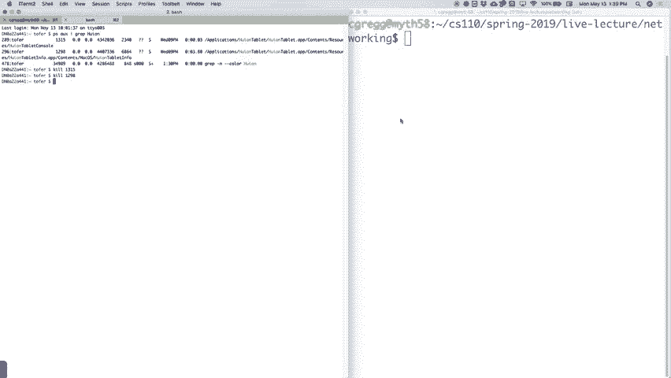

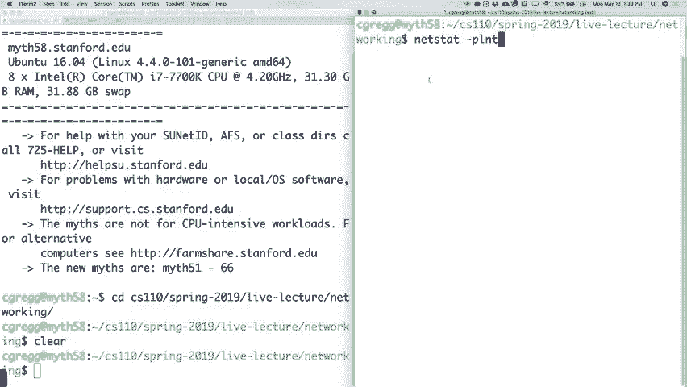


网络是将两å°æˆ–多å°è®¡ç®—机è¿æ¥èµ·æ¥è¿›è¡Œé€šä¿¡çš„技术。它类似äºè¿›ç¨‹é—´çš„管é“，但范围更广，å¯ä»¥å®ç°ä¸åŒè®¡ç®—机之间的数æ®äº¤æ¢ã€‚互è”网和万维网都基äºæ­¤åŸç†å·¥ä½œã€‚


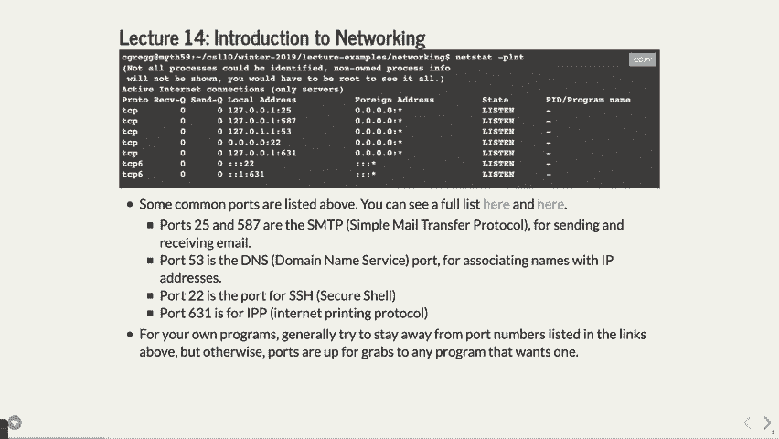

我们将ä»åŸºç¡€æ¦‚念开始，é€æ­¥å­¦ä¹ å¦‚何创建一个æœåŠ¡å™¨ç¨‹åºæ¥ç›‘å¬è¿æ¥ï¼Œä»¥åŠå¦‚何创建一个客户端程åºæ¥è¯·æ±‚æœåŠ¡ã€‚

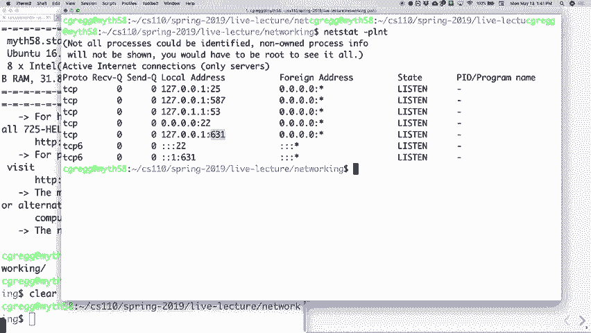

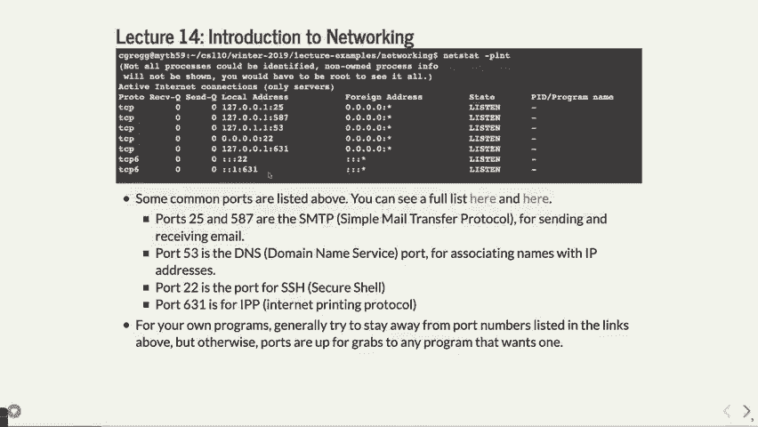


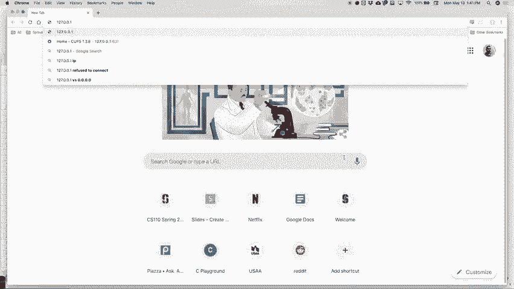

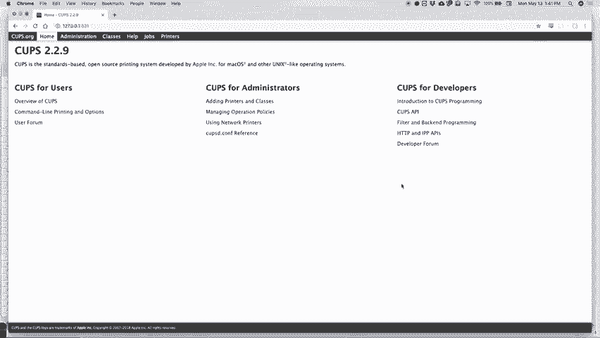

---


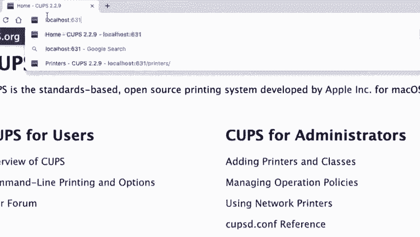


## æœåŠ¡å™¨ä¸å®¢æˆ·ç«¯

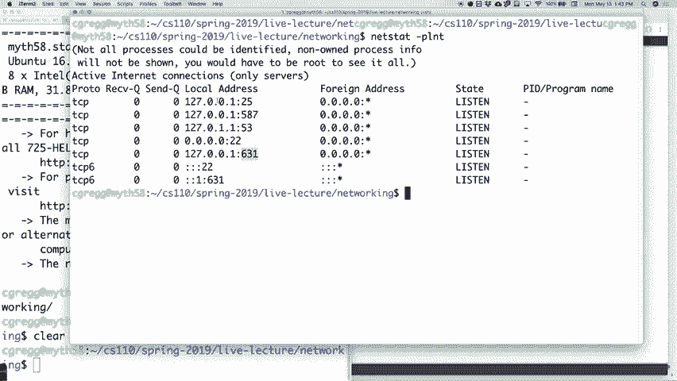

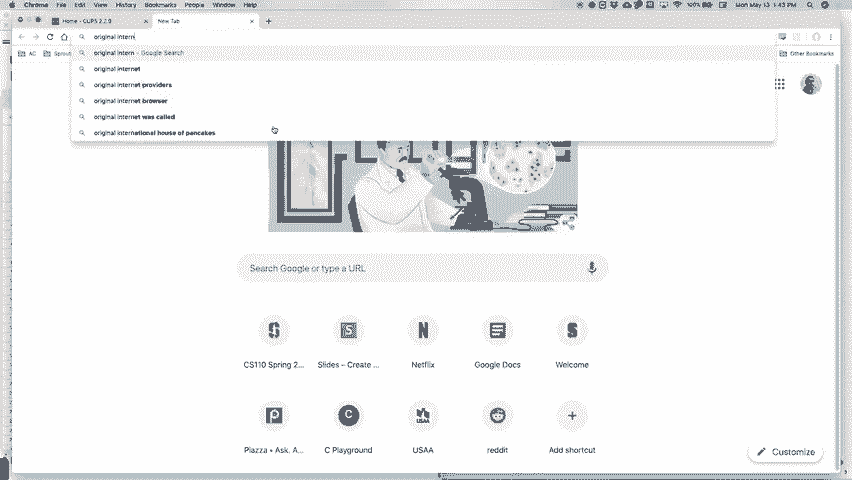


上一节我们介ç»äº†ç½‘络的基本概念，本节中我们æ¥çœ‹çœ‹ç½‘络通信中的两个核心角色：æœåŠ¡å™¨å’Œå®¢æˆ·ç«¯ã€‚

æœåŠ¡å™¨æ˜¯ä¸€å°ç­‰å¾…其他计算机（客户端）å‘èµ·è¿æ¥çš„计算机。客户端则是主动å‘æœåŠ¡å™¨å‘èµ·è¿æ¥è¯·æ±‚的一方。例如，当你访问一个网站时，你的æµè§ˆå™¨æ˜¯å®¢æˆ·ç«¯ï¼Œè€Œæ‰˜ç®¡ç½‘站的计算机就是æœåŠ¡å™¨ã€‚

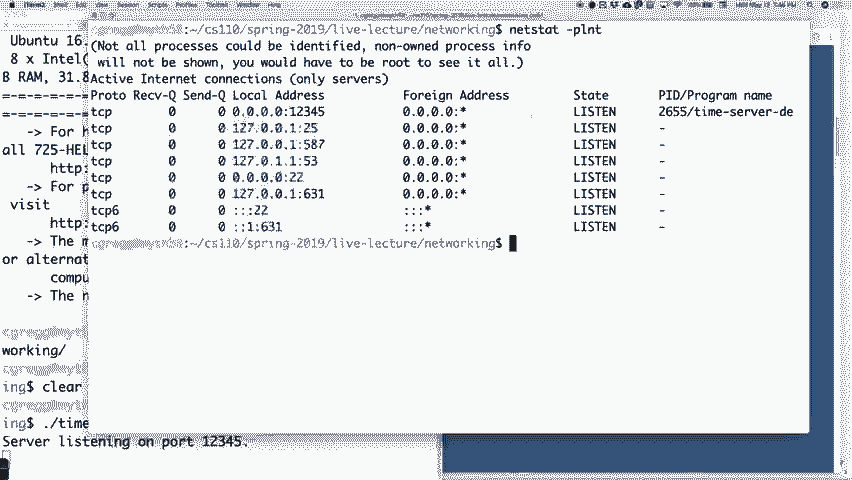

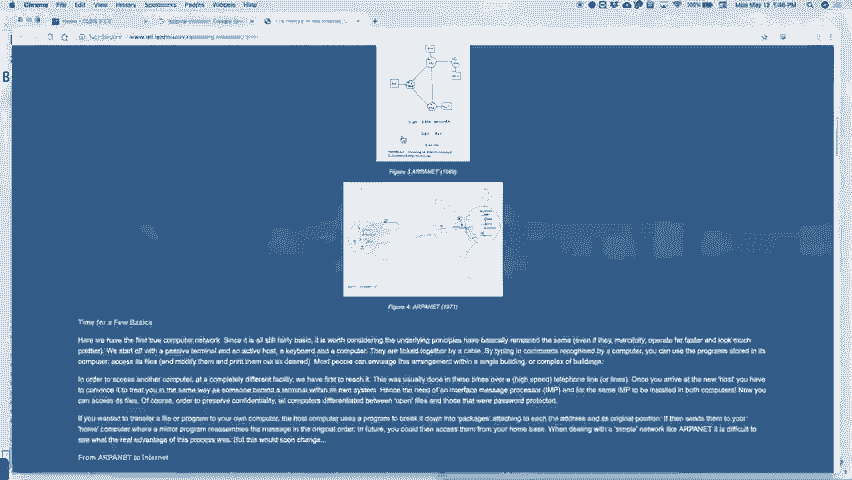

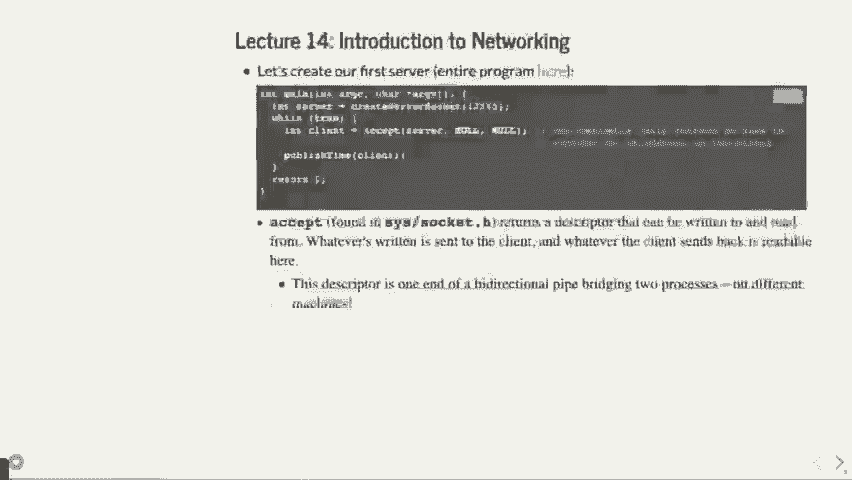

æœåŠ¡å™¨å¿…é¡»æå‰è®¾ç½®å¹¶è¿è¡Œï¼Œæ‰èƒ½å“应客户端的è¿æ¥è¯·æ±‚。一个æœåŠ¡å™¨å¯ä»¥åŒæ—¶å¤„ç†å¤šä¸ªå®¢æˆ·ç«¯çš„è¿æ¥ã€‚


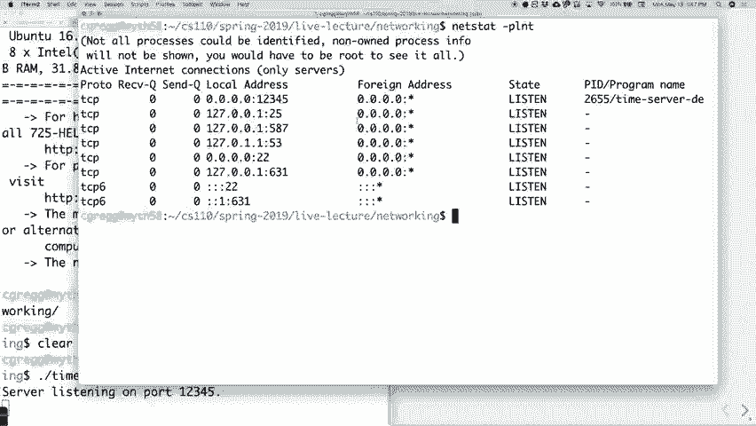


---


## 端å£ä¸å¥—æ¥å­—


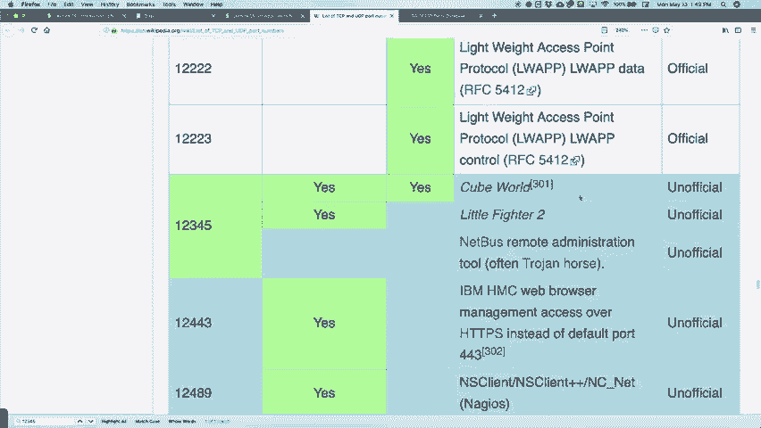


ç†è§£äº†æœåŠ¡å™¨å’Œå®¢æˆ·ç«¯çš„关系å，我们æ¥çœ‹çœ‹å®ƒä»¬æ˜¯å¦‚何具体建立è¿æ¥çš„。这需è¦é€šè¿‡**端å£**å’Œ**套æ¥å­—**æ¥å®ç°ã€‚


**套æ¥å­—**是一个用äºæ ‡è¯†ç½‘络è¿æ¥çš„整数，范围通常是0到65535。你å¯ä»¥å°†å…¶ç†è§£ä¸ºä¸€ä¸ªè™šæ‹Ÿçš„进程ID，它代表了一个特定的网络è¿æ¥ç«¯ç‚¹ã€‚


**端å£å·**是套æ¥å­—的具体编å·ã€‚æœåŠ¡å™¨ä¼šç›‘å¬ä¸€ä¸ªç‰¹å®šçš„端å£ï¼Œç­‰å¾…客户端è¿æ¥ã€‚当客户端想è¦è¿æ¥æœåŠ¡å™¨æ—¶ï¼Œå®ƒéœ€è¦çŸ¥é“æœåŠ¡å™¨çš„IP地å€å’Œç«¯å£å·ã€‚


以下是查看当å‰è®¡ç®—机上正在监å¬çš„端å£çš„命令示例：
```bash
netstat -plnt
```

端å£å·åˆ†ä¸ºå‡ ä¸ªèŒƒå›´ï¼š
*   **0-1023**：系统端å£ï¼Œé€šå¸¸ç”¨äºæ ‡å‡†æœåŠ¡ï¼ˆå¦‚HTTPçš„80端å£ï¼ŒSSHçš„22端å£ï¼‰ã€‚
*   **1024-49151**：注册端å£ï¼Œå¯ä¾›ç”¨æˆ·ç¨‹åºç”³è¯·ä½¿ç”¨ã€‚
*   **49152-65535**：动æ€æˆ–ç§æœ‰ç«¯å£ï¼Œå¯ä¾›ä¸´æ—¶ä½¿ç”¨ã€‚

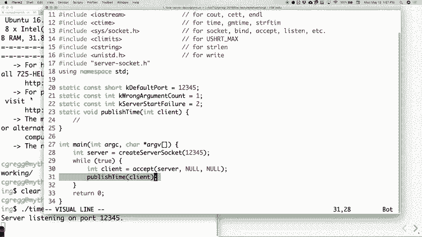

两å°è®¡ç®—机ä¸èƒ½åœ¨åŒä¸€ç«¯å£ä¸ŠåŒæ—¶è¿è¡Œç›‘å¬æœåŠ¡ã€‚


---

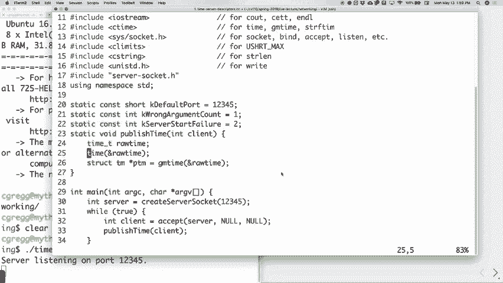

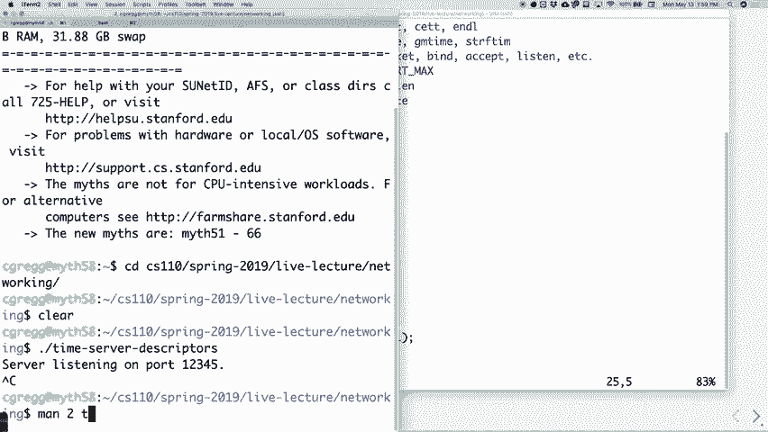


## 编写时间æœåŠ¡å™¨


ç°åœ¨æˆ‘们已ç»äº†è§£äº†ç«¯å£å’Œå¥—æ¥å­—，让我们动手å®è·µï¼Œç¼–写一个简å•çš„æœåŠ¡å™¨ç¨‹åºã€‚这个æœåŠ¡å™¨å°†ç›‘å¬å®¢æˆ·ç«¯çš„è¿æ¥ï¼Œå¹¶åœ¨è¿æ¥å»ºç«‹å，å‘客户端å‘é€å½“å‰çš„æ ¼æ—å¨æ²»æ ‡å‡†æ—¶é—´ã€‚

以下是创建æœåŠ¡å™¨å¥—æ¥å­—并进入监å¬å¾ªç¯çš„核心代ç æ¡†æ¶ï¼š
```cpp
int server = createServerSocket(portNumber);
while (true) {
    int client = accept(server, nullptr, nullptr); // 等待客户端è¿æ¥
    publishTime(client); // å‘客户端å‘é€æ—¶é—´
    close(client); // 关闭客户端è¿æ¥
}
```
`createServerSocket` 函数å°è£…了底层的系统调用，用äºåˆ›å»ºå’Œç»‘定æœåŠ¡å™¨å¥—æ¥å­—。`accept` 函数会阻å¡ï¼Œç›´åˆ°æœ‰å®¢æˆ·ç«¯è¿æ¥è¿›æ¥ã€‚

---

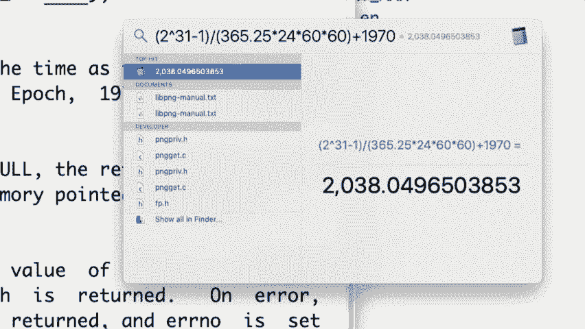


## 处ç†æ—¶é—´æ•°æ®


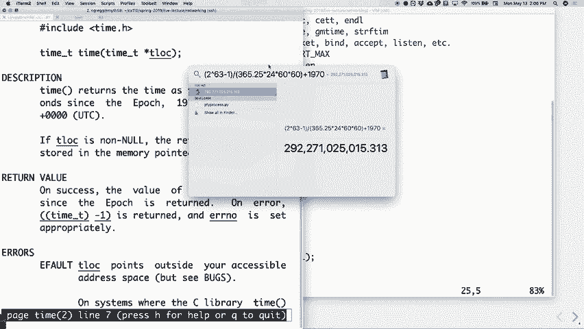

在 `publishTime` 函数中，我们需è¦è·å–当å‰æ—¶é—´å¹¶å°†å…¶æ ¼å¼åŒ–为字符串å‘é€ç»™å®¢æˆ·ç«¯ã€‚

我们使用 `time` 函数è·å–自1970å¹´1月1日（Unix纪元）以æ¥çš„秒数，这是一个 `time_t` ç±»å‹çš„整数。然å使用 `gmtime` 函数将其转æ¢ä¸ºåŒ…å«å¹´ã€æœˆã€æ—¥ç­‰è¯¦ç»†ä¿¡æ¯çš„ `struct tm` 结æ„体。最å，使用 `strftime` 函数将时间格å¼åŒ–为字符串。

需è¦æ³¨æ„的是，标准的 `gmtime` 函数返å›ä¸€ä¸ªæŒ‡å‘é™æ€å†…存的指针，这在多线程ç¯å¢ƒä¸‹æ˜¯ä¸å®‰å…¨çš„。因此，在编写多线程æœåŠ¡å™¨æ—¶ï¼Œåº”使用其线程安全版本 `gmtime_r`。


以下是è·å–并格å¼åŒ–时间的代ç ç¤ºä¾‹ï¼š
```cpp
time_t rawtime;
time(&rawtime);
struct tm tm;
gmtime_r(&rawtime, &tm); // 线程安全版本
char timeStr[128];
strftime(timeStr, sizeof(timeStr), "%c", &tm);
// 然åå°† timeStr å‘é€ç»™å®¢æˆ·ç«¯
```

---

## 使用 Socket++ 库简化æ“作


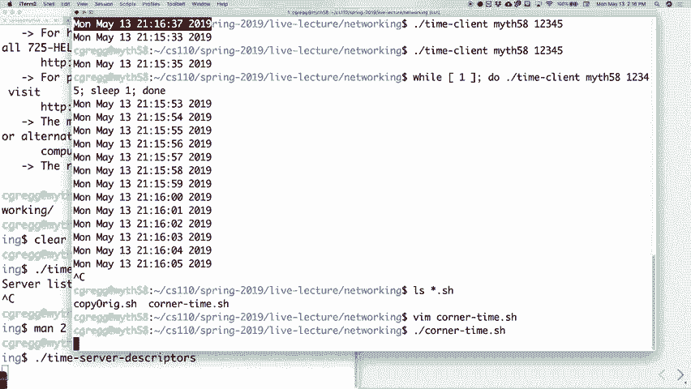


上一节我们手动处ç†äº†æ•°æ®çš„写入和è¿æ¥å…³é—­ï¼Œè¿‡ç¨‹ç¨æ˜¾ç¹ç。本节中我们æ¥çœ‹çœ‹å¦‚何使用 `Socket++` 库æ¥ç®€åŒ–网络编程。


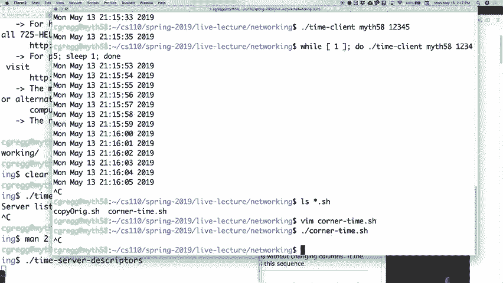

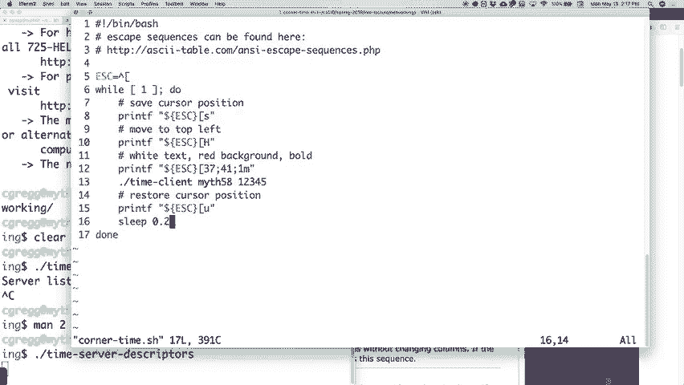

`Socket++` 库æ供了更高级的抽象，å¯ä»¥åƒæ“作C++标准æµï¼ˆå¦‚ `cout`）一样æ“作网络è¿æ¥ï¼Œå¹¶è‡ªåŠ¨ç®¡ç†ç¼“冲区和资æºé‡Šæ”¾ã€‚


使用 `Socket++` é‡å†™æ—¶é—´å‘é€é€»è¾‘的代ç å¦‚下：
```cpp
#include <socket++/sockstream.h>
// ... 创建 client 套æ¥å­— ...
sockbuf sb(client);
iosockstream ss(&sb);
ss << timeStr << endl;
// 退出作用域时，sockbufçš„ææ„函数会自动关闭client
```
这使得代ç æ›´åŠ ç®€æ´æ˜“读。


---


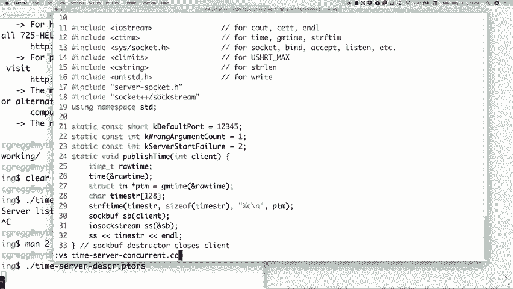

## 引入多线程æå‡æ€§èƒ½


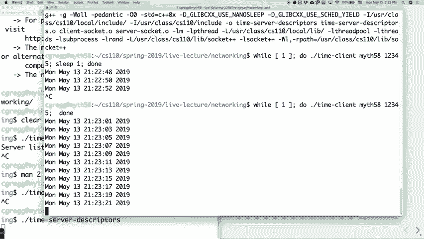

我们之å‰ç¼–写的æœåŠ¡å™¨ä¸€æ¬¡åªèƒ½å¤„ç†ä¸€ä¸ªå®¢æˆ·ç«¯è¯·æ±‚，效ç‡å¾ˆä½ã€‚本节我们将利用多线程技术æ¥æå‡æœåŠ¡å™¨çš„并å‘处ç†èƒ½åŠ›ã€‚

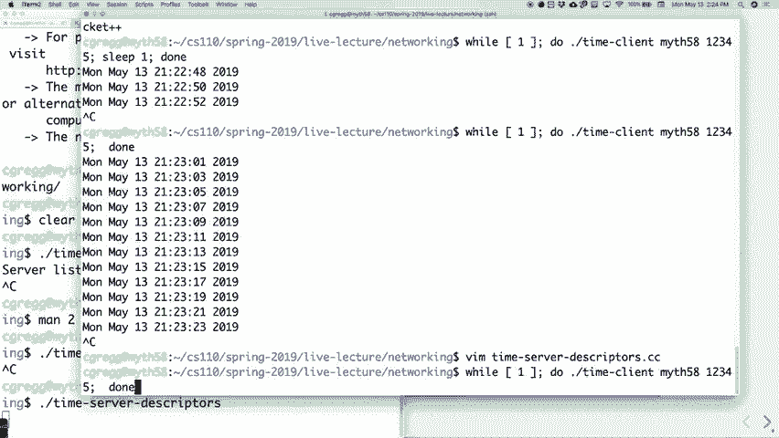

我们å¯ä»¥ä½¿ç”¨**线程池**。当有新的客户端è¿æ¥æ—¶ï¼ŒæœåŠ¡å™¨ä¸»çº¿ç¨‹è¿…速æ¥å—è¿æ¥ï¼Œç„¶å将处ç†è¯¥å®¢æˆ·ç«¯è¯·æ±‚的任务（如 `publishTime`）æ交给线程池中的一个空闲线程å»æ‰§è¡Œã€‚这样，主线程就å¯ä»¥ç«‹å³è¿”å›å»æ¥å—下一个è¿æ¥ï¼Œè€Œå¤šä¸ªå®¢æˆ·ç«¯è¯·æ±‚å¯ä»¥è¢«å¹¶è¡Œå¤„ç†ã€‚

以下是使用线程池调度任务的核心代ç ï¼š
```cpp
ThreadPool pool(4); // 创建包å«4个工作线程的线程池
while (true) {
    int client = accept(server, nullptr, nullptr);
    pool.schedule([client] {
        publishTime(client);
        close(client);
    });
}
```
在下一个作业中，你将有机会自己å®ç°ä¸€ä¸ªçº¿ç¨‹æ± ã€‚

---

## 编写时间客户端

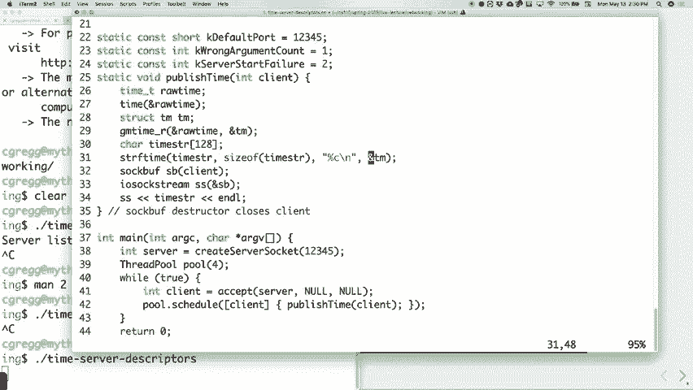


æœåŠ¡å™¨å‡†å¤‡å°±ç»ªå，我们需è¦ä¸€ä¸ªå®¢æˆ·ç«¯æ¥æµ‹è¯•å®ƒã€‚编写客户端相对更简å•ã€‚


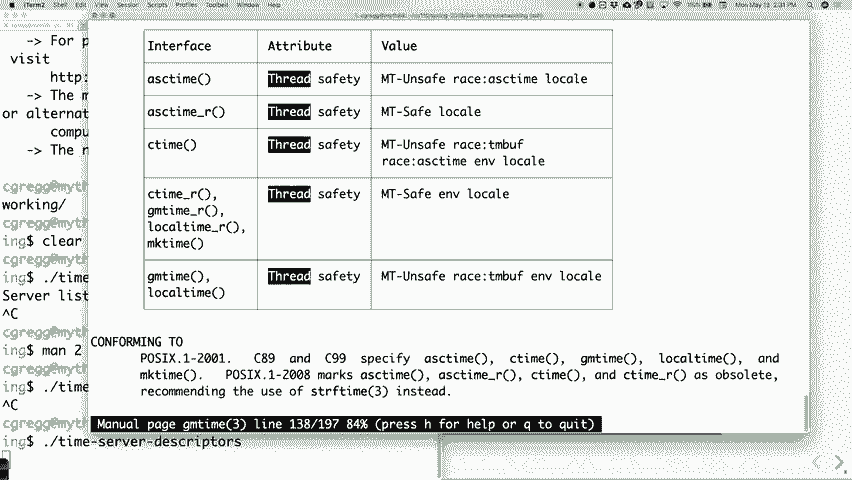

客户端的核心任务是è¿æ¥åˆ°æŒ‡å®šæœåŠ¡å™¨çš„指定端å£ï¼Œç„¶å读å–æœåŠ¡å™¨å‘é€å›æ¥çš„æ•°æ®ã€‚


以下是客户端代ç çš„核心部分：
```cpp
int clientSocket = createClientSocket(serverHost, portNumber);
sockbuf sb(clientSocket);
iosockstream ss(&sb);
string timeline;
getline(ss, timeline); // 读å–æœåŠ¡å™¨å‘æ¥çš„一行数æ®
cout << timeline << endl;
```
`createClientSocket` 函数负责建立到æœåŠ¡å™¨çš„è¿æ¥ã€‚之å，我们åŒæ ·å¯ä»¥ä½¿ç”¨ `Socket++` 库æ¥æ–¹ä¾¿åœ°è¯»å–æ•°æ®ã€‚


---


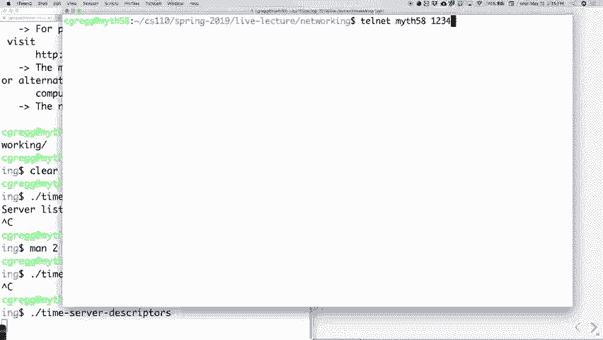

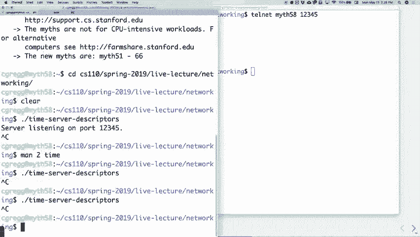

## æ¢ç´¢ HTTP åè®®

我们æ„建了自定义å议的时间æœåŠ¡å™¨ã€‚在ç°å®ä¸–界中，最常用的应用层å议是 **HTTP**（超文本传输å议）。本节我们通过一个简å•å·¥å…·æ¥ç›´è§‚æ„Ÿå—HTTP。

我们å¯ä»¥ä½¿ç”¨ `telnet` 命令手动模拟一个HTTP客户端。`telnet` å¯ä»¥å»ºç«‹åˆ°ä»»ä½•TCPæœåŠ¡å™¨çš„纯文本è¿æ¥ã€‚


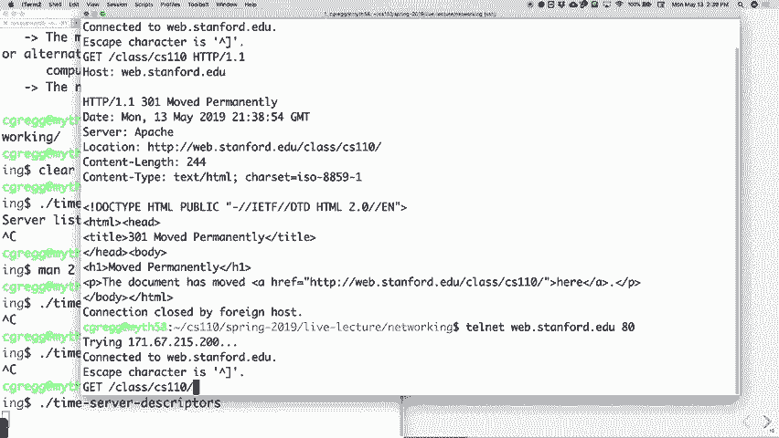


例如，è¿æ¥åˆ°è°·æ­Œçš„WebæœåŠ¡å™¨ï¼ˆç«¯å£80）并请求主页：
```bash
telnet google.com 80
```
è¿æ¥æˆåŠŸå，手动输入HTTP请求：
```
GET / HTTP/1.1
Host: google.com
```
（输入两个空行结æŸè¯·æ±‚头）
æœåŠ¡å™¨å°†è¿”å›è°·æ­Œé¦–页的HTML代ç ã€‚这直观地展示了æµè§ˆå™¨ä¸WebæœåŠ¡å™¨ä¹‹é—´çš„通信本质。


---

## 总结

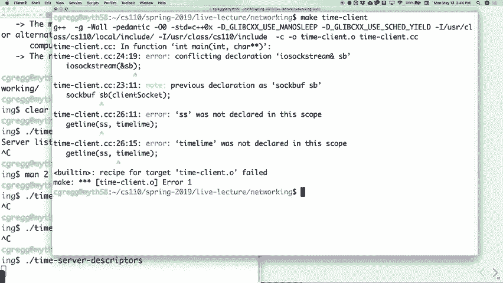


本节课中我们一起学习了计算机网络的基础知识。我们ä»æœåŠ¡å™¨ä¸å®¢æˆ·ç«¯æ¨¡å‹å…¥æ‰‹ï¼Œç†è§£äº†ç«¯å£å’Œå¥—æ¥å­—作为通信端点的作用。我们å®è·µäº†å¦‚何编写一个多线程的时间æœåŠ¡å™¨ï¼Œä»¥åŠä¸ä¹‹é…套的客户端程åºï¼Œå¹¶ä½¿ç”¨äº† `Socket++` 库æ¥ç®€åŒ–网络I/Oæ“作。最å，我们通过 `telnet` 工具窥æ¢äº†HTTPå议的工作方å¼ï¼Œä¸ºå续学习更å¤æ‚的网络应用打下了基础。

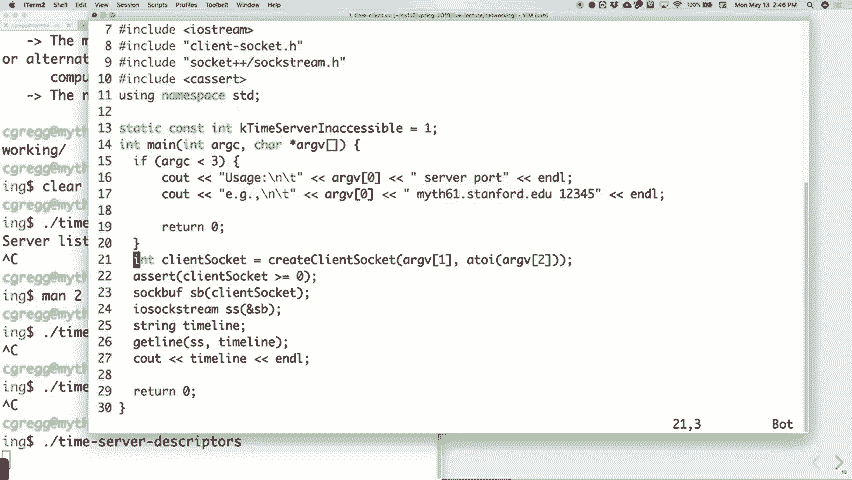

网络编程的核心在äºç†è§£è¿æ¥æ˜¯å¦‚何建立ã€æ•°æ®æ˜¯å¦‚何在套æ¥å­—之间å¯é ä¼ è¾“的。æŒæ¡äº†è¿™äº›åŸºç¡€ï¼Œä½ å°±èƒ½æ„建出å„ç§ç½‘络应用程åºã€‚