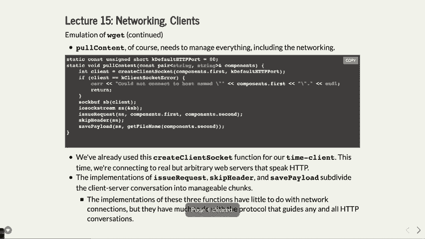

# P16：Lecture 15 Networks and Clients - ___main___ - BV1ED4y1R7RJ

 Okay， so we are going to continue our discussion about networks。 I hope the assignment is going well。 I am going to have some off-sours right after class today for an hour。 hour and a half or， so。 So feel free to stop by if you'd like。 But today we're going to continue working on networks and I think we're going to get。

 to a point today where you go， "Oh， I see what's going on here with the wavy internet。 works a little bit。"， And hopefully it will be interesting。 But there is a handout because there's tons of code and today is going to be another。 day where I'm not going to just like furiously type code。

 I actually did this lecture last quarter and it was a nightmare because it was like my。 fingers were cracked by the end of it and people were saying that's a ridiculous amount。 of code to put on the board or to try to do live。 So you've got a whole bunch of code here。 We will go through it slow enough on the board so that you can either take notes or。

 ask whatever questions you have。 So hopefully that will work out。

 So let's go back to where we were at the end of Monday's lecture which was to say we built。 our first client and the client was as simple as basically saying， "Okay， we are going to。 create a client socket and we're going to dig into those details。 We're going to do it a little more manually today and you'll see some more details but。

 there will be details we see today that I don't want you to concentrate on。 You can look at them and go， "Oh， those are some details but I don't want you to think。 about the wheel talk about those next week。"， But that's like how the connection is built and then we basically set up a little stream。 to be able to in this case to be able to read from the server whatever the server tells。

 us and that's it and then we're printing it out。 So this is like the most basic server。 Now often you want to actually have some sort of like you want to send the server some information。 which we'll do by via the actual URL today and then of course you want to get more information。 back maybe in another particular form。 So we will see how that works with a couple of examples。

 So the first example we're going to look at and I mentioned it， I talked a little bit about。 how it works and I showed you an example on Monday is this WGet function。 This is built in for Linux and you can see that by typing WGetGoogle。com and it will actually。

 pull down the results of Google。com to a file。 In this case it saves it as index。html and that's it。 So there's the Google homepage right there in a file called index。html which I just used。 WGet to get。 It's a pretty simple thing。 You need to request it from the website。 the website sends it back to you and restore it。

 So that's what we're going to build。 And here's what we're going to do with it。 We are going to。 we have to remember the， we're going to build the server part as it turns， out。 And the。 in this case rather not the server part， sorry we're going to build the client。 part in this case which is going to take a URL and it's going to get the URL and break。

 it into its parts。 Okay， so that's like Google is not a great example but web。stanford。edu/class110 is like， what you might pass into it。 And what it needs to do is this is the part that you connect to。 web。stanford。edu and the， rest is basically the path name。 So we need to break that into parts。 So we can actually use the part， a part URL function to do this。 Okay。

 and most of our URLs are going to start with HTTP colon colon。 As it turns out HTTP that's basically tells you hey you're going to the world wide web。 Most of the websites you go to these days are HTTPS which stands for secure which is。 a much better way of doing it so the data actually comes across encrypted。

 Because as you may or may not know， I mean when radio signals get sent to the router。 unless it's an encrypted site all of the text that's sent back and forth is completely， unencrypted。 Now if you have a password or if you have that sort of thing they encrypt， you can encrypt。 that in other ways。 But in general HTTP sites are not encrypted。

 it doesn't matter that much for some sites。 But it does mean that you could have what's called a man in the middle attack where you。 have， I guess you could for HTTPS to some extent， but you could have an attack where。 you think you're getting data back from a non-secure site and it's coming from some other site。 That might not be what you want。 So you should prefer HTTPS。

 For now we're just going to do with HTTP because we don't want to deal with encryption。 Most of it actually happens at a lower level than what we're dealing with anyway。 But for now we're going to go with HTTP。 And the default path is just slash。 That means like if you google。com the default path is just slash。

 So what we're doing in here is we are basically pulling the URL apart and we're just saying。 look if it starts with HTTP then we actually need to get the rest of it which is what。 this substring line does here。 And then you're then going to look for a slash and if you have a slash everything after the。 slash is the actual path name。 So that's kind of what it is and the rest is the host part of it which is like google。

com， or stamp for web。stanford。edu。 That's all this is doing。 Not that much to it。 It is returning a pair。 Why is it returning a pair？ Because C++ only allows you to return one thing。 And so in this case we're returning we want to return both the host and a path。 So we're returning a pair。 You could also return to vector or an array or something like that whatever。

 But the point is that in this case we're just making a pair sending that back and dealing。 with the first and second of the pair。 Okay。 Pretty straightforward。 And this by the way means if you are trying to use the find on the string if the find。 is not found that's string colon colon and pass that means that you are going to use。

 the default path which is just slash means that you just said hey I want google。com with。 no extra stuff on it。 Okay。 That's that。 Main in this case is just going to have one it's going to call one function which is poll。 content which is going to actually do the request and get the result back and then save it into。 a file。 That's what we're doing。 We'll break these up into other little parts as we go。

 That's really all we're doing right we're going to a website requesting the website and。 then asking for the and then getting the data saving to a file that's all W get does。 It turns out。 Okay。 Questions on that？ Yeah。 Awesome。 Yeah。 That's like Google。com slash which is your question。 What it's the slash part is the default path and that just means there's no extra stuff。

 after the you are the actual website you're going to we'll see why that makes a difference。 in a little bit but it makes difference for doing like class slash class last CS 110 that's。 our class which is a shared website on all the entire Stanford web service。

 Good anybody else？ Okay。 All right。 So poll content is going to do the actual like hey we need to set up a client socket。 Okay。 We will see again we'll see in a little bit doing some things a little different with this。 one but for now we're just going to set up the client socket。 And we are going to then do a little error checking if we were to get set up。

 Then we're setting up a stream and the stream is going to be to actually be able to send。 to the to the server to say hey give me the data。 Okay。 So we're setting up the stream and then we're issuing a request。 We are going to skip all the headers。 Remember when a website comes back it actually gives you a whole bunch of details and we're。

 going to look and we're going to see those some of those details a little later and those。 details we don't care about for this website you might care about them。 You can ask for a you can ask for a website to be compressed coming back to you if you。 want and so that would be a header saying hey this is a compression I chose and then you'd。

 have to decompress it yourself but we're not going to worry about that we're just going。 raw text back from the server。 Okay。 And then we're going to actually have to save it to a file as well。 Okay。 So we're going to create a client socket。 Okay。 So by the way what we really need for that we need just the first part just the URL because。

 that's how you set it up。 We don't care that it's slash class slash CS 110 we care that it's web。stanford。edu。 That's what we're connecting to on a particular port for the internet ports are 80 like that's。 the main internet port。 Sometimes you also see 80 80 or 8。000 or whatever those are some kind of default ones but the。

 world wide web lives on port 80 for servers。 It's just generally where it lives。 Okay。 And again you can change that if you have a home network that you don't want any other。 people to know about you can say hey forward my traffic to a different port get my website。 from a different port and people won't necessarily know how to connect to it unless they say。

 the port number。 That's the way that works。 Okay。 What questions do you have on this？ Yes。 What is component？ The components is the pair that we passed in。 It's the host and the actual path name or path。 Yeah。 Good question。

 Anybody else？ Alright。 It's still pretty straightforward so far。 Okay。 Now we have to start doing the details。 Now remember when I did Talnet the other day。 Okay。 The Talnet command for internet websites or not the Talnet command the actual HTTP request。 is very well defined。 And it starts out with get and then the path and then it says what protocol we're using。

 In this case HTTP 1。0 or 1。1 probably doesn't matter which one you use in this case。 And then it has this interesting backslash R backslash N。 Well we know what backslash， N means。 It means new line。 Well it kind of means new line but really it means new line in the sense that it means。 go directly down to the next line。 The backslash R is what we call a carriage return。

 And a carriage return comes from the typewriter days where when you hit like the， well it used。 to be you actually had to hit a little lever that pushed this carriage where the paper was。 moving back and forth。 That's what happened in typewriter。 You should check some out sometime。 Come to my office。 You can see a cool typewriter project or a couple of them。

 And anyway the carriage return meant that the entire paper would go juke back to the other， side。 I guess from your perspective it's our juke back to the other side。 And that's what's happening with the backslash R。 Backslash R backslash N is what you really should send whenever you are saying I am。 done with a line to the server。 It just happens to be that's the way it was that's the way it ends up working out。

 Unix just kind of doesn't really use the backslash R often。 It just means look I want to go to the next line and go all the way to the front。 But you do need the backslash R in there as well。 Yeah， question？ Why don't you use N to L？

 Good question。 N to L will only send the backslash N as it turns out。 Yeah。 Good question though。 Backslash N just does the Unix way of doing it just does backslash N。 Which is not just what we want。 Okay。 So it does that。 Then the next line it says the host that you are on and the actual that takes the host。

 and then another backslash R backslash N。 Tell that we will send that for you by the way， correctly。 And then we send another blank line to say we are done with our request and then we flush。 Now we have to flush the actual data which means if it is buffered in the system somewhere。 make sure it actually gets to the other computer。 Okay。

 Sometimes if you don't do backslash N when you do print F or the N down sometimes the characters。 won't show up until you get that N down。 This is what the flush is all about。 It says look make sure the data is sent because otherwise the web server will have no idea。 when to respond or not。

 Okay。 Let's do this example again。 Yeah。 Davis。 I'll unplug these。 No the flush doesn't check anything it just actually says oh if I've got some buffer data。 I haven't sent yet make sure it goes out。 That's really what it does。 It just says I could buffer it and keep it to myself。

 I'm going to collect it all and send it all at once。 It says look now I want you to send it。 Definitely send it now。 That's really sick。 Yeah。 You could have flushed earlier。 Sure。 It doesn't really matter。 The member of the web server is expecting all of the data。 It won't do anything until it gets all of it。 Good question。 Yeah。 Good question。

 Why do you need to flush？ It just turns out that there might be a situation where without a just the backslash N might not。 actually do the push like actually might not say I've got enough data to send and who。 knows but the flush definitely says look I'm ready to send the data make sure it goes。 all that goes from this point forward。 That's how it works。 That's what？

 It's a safeguard in that sense。 We could try without it and see the words but the odds are it might work。 New lines normally send a flush but you just never know in this case。 Okay。 You were going to get an O。 Is that a new word？ Yeah。 Let me show you。 If we do telnet google。com 80。 And then we say get。 We need the path name。 So that's the actual path name。

 I'll show it to you again and you can look at it in the code but I'll show you it again。 And then we say we are going to tell it what one slash one point I guess one point O in。 this case for our example。 And then we send a return then we say host and in this case www。google。com and then you。

 hit a new line and then it gets all out there。 So that is the three things we need to send and that's exactly what we're sending in our。 program。 Let's take a look。 We're saying get right here。 We're saying。 Every time I connect to my this tablet doesn't seem to work when I connect to when I try to。 go back and forth between programs。 Don't exactly know why。 But there it goes。 Okay。

 So we do the get and then we do the path which in this case was slash。 There was no path for Google and we didn't want the original index dot HTML the original。 like slash path and then we say oh we're doing HTTP 1。0 new line。 The next line we tell it what host we're on。 This is the Google。com www。google。

com and then we send a couple new lines。 The order does matter。 Yeah。 It expects it in exactly this order。 Why would you want the host to second？ I don't know。 That's the way they designed the protocol。 I mean you're already connected to Google。com。 You already know you're connected there but then it just says hey which particular host。

 of it might be that the website you're connected to has multiple IP addresses but different。 hosts on that IP address。 But。 Yeah like max。 Yeah。 It's something else dot Google dot com docs dot Google。 It might be a different one too。 It might be that。 Yeah。 So is the double again。 What is tell that part of double again？ No。

 Good question。 Tell that is just a way to connect via the terminal。 That's all that is。 W get is the program that's doing this via a network。 We're writing it。 You'll see how the actual word but we're writing the program W get which asks request the website。 gets it， downloads it， saves it to a file。 That's what W get does。 Anybody else？ Okay。

 So that's all the issue request function is going to do。 It basically says hey get the request。

 And then we need to do what？ We need to skip all these headers。 Skipping the headers is relatively straightforward。 You read a bunch of lines until you get an empty line。 Okay so there's a whole bunch of the first thing that comes back from the web server is。

 all this header information。 And the way it's defined is header， header， header， header， blank line。 the rest is data。 That's all it is。 In this case we don't care what those headers are。 We could print them out if we wanted to or we could look at them or whatever but for our。 kids we don't care。 So all we're doing is doing a whole bunch of get lines and when until the line is empty。

 we're just going to keep reading them。 Now some servers aren't nice and they just send new lines because some people who write。 these things don't realize that you also need the backslash R。 We will also if we just get a line that has a backslash R on it we will also figure that。 it's just a new line。 It's just kind of a hack in that case。 Just to see what's the most question。

 Why are we doing the do with the wild conditions that are just like a straight line of the， wild？

 Why are we doing it do wild？ I think it probably saves a line of code。 I mean you would have to set the， you'd have to basically set the line up to be not empty。 and then you'd have to set it up to some other way and say it in some default value and then。 do wild and then get it。 I mean you could do it short but in this case that just saves the line or two of code。

 So what was the thing with that？ The most interesting thing was that a little language but there are other people who are。 familiar with the get that we should know？ Yeah so this is a good question。 So why get？

 Well get is one of the ways you can request information from a web server。 You can also do a post which means I'm sending data to the web server like I have a file。 I want to send or I name or something else。 You can also do。 there's another one that you're going to do for next assignment and， I'm forgetting what it is。

 There's more of them too but it's just part of the language of HTTP。 That's all it is。 It's just the HTTP protocol。 One of the things you do is you use get or you use post or you use 77。 Chase。 So what happens if you just do /r？ If you just do /r and not /n the web server might get confused。 I mean it just might go are you done with the line yet？ I don't know。 You know that's why you need。

 The protocol says you have to have both so we send both。 That's the way it works。 And again this is why when computers talk to each other they need to know exactly the。 right information。 This is why we hammer this into you in 106A， in B， in 107， whatever。 It has to be exactly the same output and it's not just because we're being jerks about it。

 It's so that computers can。 Because our autograders are computers。 They're trying to talk too but you will see this again and again and again。 You need to be exacting your output。 So that's the exact thing。 I'm sorry。 What exactly does the header remain in content？ The header information contains what kind of data is it sending back？

 Whether or not， and we'll see this example， we'll see an example of some header data we。 care about later。 It's got， whether or not it's compressed。 It's got to hold on。 Whether or not the website can ask for the data when it's not on the website。 I mean。 so many times a website doesn't just really nearly give data to some other computer。

 through certain methods。 In this case the header could tell you。 yeah it's okay or maybe we don't want to do that。 Whether it's cached or not。 I mean there's lots of different headers。 You can just look up HTTP headers and see the hundreds of them that it could be。 Yeah， header it's one line at a time。 One header another header another header another。

 And then the last one is a blank line。 And then we're into data。 That's just a protocol。 Pretty simple。 All things considered。 A whole bunch of headers， new line data。 That's all there is to it。 Okay。 All right。 So that's that。 Let's see as we go to the next one here。 There we go。 Ooh， that's not what I wanted to do。 Hold on。

 There we go。 Okay。 So we are going to then look at the get file name function。 Okay。 And by the way this is all because all like in you can look at the code and see what happens。 But it's basically we're just decomposing this into here。 The get file name is just going to take the path and it's going to convert the path to。

 a file name if it's the last part of the path， the file name。 If it doesn't have a file name it uses index。html which is like the default file name for web。 pages。 If you've never done any web， if you've ever done any web writing you'll probably have seen。 index。html which is basically the first page you get to on a web page。 Normally。

 That's the way that works。 Okay。 So it's pretty easy to do。 It just basically says look if the path is empty or if you've got a slash at the end just。 return index。html。 Okay。 Otherwise you are going to find everything from the last slash。 This is what the R find does and return that part of it。 That's all there is to it。 Okay。

 So just finding the actual file and the anchor。 We're about to write the file out。 Okay。 So what do we have to do for saving the payload？ Well we have to read in。 Okay。 We're going to be given a file name to save to which we're going to get from get file， name。 We're going to be given some stream that we are going to be in this case reading from。

 That's the network basically。 Okay。 We're going to set this up and get the network stream that we're going to be reading from。 so we can read all the data。 Okay。 And how are we going to do that？

 We are going to basically say while we are not have not read all the data。 This is the wild do because we can do that in this case as it turns out for this kind。 of stream we can do that。 And then we just read all the data。 Right。 We're going to read as much as we can into our buffer which is a fixed length。 Why 2014？

 I don't know。 It's made of 2014。 It could be whatever we want。 And then we count up all the data and then we write it out to the buffer that we actually。 are sorry we write it out to the buffer and then let's see。 Sorry。 We're reading it into the buffer。 Sorry。 We're writing the buffer to the output the amount of data that we read。

 That's all there is to that。 Okay。 And then it's counted up how many bytes so we know how many bytes got read。 Yeah。 Right。 Yeah。 That's a good question。 Why do we need to get finally and function？

 Remember what would the finally and be if I asked for we have got stamped ready to use。 slash class slash CS 110 would it be class slash CS 110 that doesn't really make sense。 for a file name。 So we just want the last part of it。 So in this case we see us 110 which actually wouldn't work for ours because we would have。

 to request CS 110 slash but if we did this would be the final just the last part of it。 So we got the path which we're going to request but then the final name is just the last part。 of the path。 It's a bit you know we're just creating that because that's what W get works。 Yeah so what is an I/O sock stream。 Okay。 This is so you know how you can do see out and you can do that and you can do see out。

 stuff and it works。 Well that's a stream and a stream is C plus plus is way of saying hey here's some relatively。 easy ways of doing input and output。 I/O sock stream is a class that's created to make wrap a network file descriptor into。 a stream so that it's easy to use。 That's all I have sock。 Just a class that we're using to make it easy to do so that we can do things like output。right。

 We can do things like where we read in from the SS right here SS dot read right that's。 like you do that from a stream and so forth。 And it buffers it all for you and you don't need to worry about having a while loop that。 does you know certain only certain amount of data and so it does all that for you。 David you have a question。 [inaudible]， SS dot G count is the amount of data you get you got back I believe。

 I believe that's what it is。 So it basically says how much we just read well how much did we just read right and then。 it just keeps that updated from the read。 All right so these are all kind of helper functions right now that we're dealing with。 So let's see was that the only value that was it actually that's the we've actually。

 done everything and it's a no we didn't miss anything we actually had all of it in here。

 because we needed to first issue the request we saw how to do here the get request。

 And then we skip all the headers read all those headers and then the new line and then。 we save the payload which is everything after the headers。

 Did we not have this did I skip the skip headers function。

 No there it is there it is yeah that's it okay so just read all that。 All right that's how that's all we have to do in this case。 And that's it let's check let's check it out and see that it works。

 Okay let's see see us one ten spring live lecture that out of the way。 Okay and then if we do networking and we do wwebget and let's try Google。com right。 well it says that's two hundred nineteen bytes which means something went wrong there。 Let's look at it probably means that it didn't have the right。 Let's see them index。

html yeah it says it has moved to Google。com/ so we need to do slash。 and oh we need to do we need the wwe probably。 There we go now we've got enough bytes we've got 46。000 bytes so that actually works。 What was going on if we did the if we did without like we did wwebget just Google。com， without the wwew。 Well if we look at what it says it says hey that document has moved to wwew。

google。com。 So that's just that's yeah it basically there's a difference between Google。com and wwew。google。com， and so Google has set it up such that whenever you ask for Google。com it says no no no please， ask for wwew。google。com and your browser does it for you。 If you just type Google。com it'll go to Google。com get this message back and go oh I got to do。

 another request and get the real version back。 It's all that yeah。 Question about the save payload function。

 Yeah let me pull it off the save payload function yes。 What was the turning backslash zero for the buffer？

 What does that do？ Ah good question so in this case because we're trying to read the question was why is there。 a terminating backslash I guess I skipped right over that。 When you you're reading in this actually says hey create the entire buffer full of zeros。 what it does in this case so they're all already zero so it doesn't mean you don't。

 have to put one at the end when you read all the data in so it's already。 Good question。 Okay。 Yeah。 Would you also have to close the output？ No。 In this case OF stream you don't need to close those like this case。 Yeah I think actually I believe it gets closed when it goes out of scope because the way it， works。 Alright。 Now let's look at how much more interesting and kind of a cool example that by the end。

 of I think you'll see that you go oh this is cool and this is how the internet works and。 this is how this is not really how you would necessarily create a web page but it's pretty。 close as it turns out。 You don't necessarily need to create your own web server most of the times when you put。 a page on a server it will get run for you by the web server which is already running。

 on your computer。 We're going to do a much more lower level version of this right now but it basically。 you can kind of see what the web server has to do to get your data to shoot it out to。 a some other client that requests it。 Okay。 What we're going to do we're going to look at we're going to look at an example that。 which has which is kind of it's an AP it's got an API associated with it right basically。

 an application programming interface which basically means we know what we have to send。 to the server and it will give us back data in some form that we can understand。 Okay who here has heard of JSON before JSON。 Okay almost everybody not quite everybody JSON is a format that's machine readable but。 also pretty human readable。 Okay and we'll see the actual format when we get to it but we're going to output our。

 results of what I'm going to show you in this format so that if we wanted to and at。 the end I'll show you a little web page I built that uses that we can actually get the。 data formatted such that our computer can understand it and do something interesting。 with it put it on the screen in an interesting way or use it to do some calculations or whatever。

 but that's we're going to end up creating。 So what we're going to do is we're going to create this little program that uses a program。 called Scrabble Word Finder and this program you certainly can go look at it but that's。 a 106B program basically takes letters that you might have from a this place grab before。 mostly everybody word finder some other like words with friends whatever you have a number。

 of letters and the number of letters you have to use to make words and they're all scrambled。 up and this program will find all the words in a dictionary that are come from those letters。 Okay that's all it's going to do let me show you an example of this let's see Scrabble Word。

 Finder Stanford okay and it will print out all the different words that you can make from。 the letters in Stanford okay that's what the program does okay and yeah whatever words are。 in the dictionary it will make okay Scrabble Word Finder Network okay we'll print out all。 the ones that happen to be words you can make from that work and that's what we're going。

 to use so let's pretend we have a website that wants to do this well we might create a。 Stanford we might create a Scrabble Word Finder program that does exactly this it takes as。 a parameter into the program the letters and it spits out all the words that create from。 those letters okay so what we want to do is we want to do a server that uses this program。

 or does the same thing except instead of printing it out to the screen it shoots it off to our。 client in a form of the client can understand namely JSON format okay you might think okay。 let's go into the Scrabble Word Finder program wherever it does see out let's set up a network。 connection let's do a client or we'll do a little server connection and we'll have an。

 accept and all that you know why would we do that if we've already got a program that。 works perfectly well there was a assignment you all did where you used other programs and。 got the results from those programs what was that program you wrote subprocess right this。 let's leverage subprocess to actually get the words from this exact program and our server。

 needs to be this tiny little thing which basically just translates request comes in use the Scrabble。 Word Finder get the words send them back to be client and a story okay there's a fair。

 amount of details that we're going to go through as we do this but as you see that that's what。 we want to do we don't want to modify the program that already works perfectly well if。

 we can use a subprocess to do this okay alright here's what JSON looks like by the way this。

 is a the results of what we're going to do we're going to run this program let's run this。 server let's say it's on port 13133 on myth 54 and when we request myth 54 colon 13133。 slash lexical we will take lexical and speed those letters into our Scrabble Word Finder。 so we need to figure this and we need to parse out the various you know parts of this so。

 that we can get the letters from that so we're going to do that and then we're going。

 to generate something like this we are going to say how long it took to do the request we。

 are going to say whether or not it was cached or not so the assignment not this assignment。 but the next assignment in fact the big networking assignment you're going to do is a web cache。 program which is actually kind of cool but caching in networking basically means if you've。 already done something before don't do it again because networking itself is relatively。

 slow but in this case it's not really that it's really if the program we have already。 gotten a bunch of letters and we've already converted them into words we might as well。 save those words in case somebody requests those same letters again in a cache and we're。 just going to report back whether or not it was cached why would the client care about。

 this who knows maybe the client cares about it but we're going to tell them whether or。 not it was cached and then it's just and then it's just going to be an array of all of the。

 words okay so this is actually a little it's basically a map time and then it gives the。 time comma cashed false and then possibilities and it's an array this is what JSON looks like。 notice it's relatively readable once you understand that oh this is what a map looks like in。 JSON you go oh now I can read it that's pretty straightforward and your your JavaScript program。

 can read that very easily as it turns out which is what the you're going to probably be requesting。 the server the client data from okay all right so that's what we're going to end up doing。

 here by doing this let's see what we how we're going to actually do this we're going to leverage。 as I said we're going to leverage sub process to do this and it's just going to use it get。 the output and do that do we need to send any data into scrap a word finder no which we're。 doing it via the command line so we don't actually need to actually say what the letters。

 are we could have set the program to do that but we just do a Bible command line so it's。

 going to be fairly straightforward okay so here's the main function what's the main function。

 do for our server it should look relatively similar to other servers let's see let me find。

 this on here so you guys can copy on it is on page three maybe no some page eight oh that's。 right it's at the end of the program right on page eight sorry on page eight is where the。 actual main is for this okay so what we're doing here is we are setting up the server kind of。 like what we've done in the in the past okay we are going to create the create that's right。

 and zoomed in here we're going to create the server socket okay we are first going to extract。 the port that's actually a relatively easy for easy thing we're basically just going to。 get that from the command line all right and we're going to get the port number because。 what you can do is you are going when you run this you can say what port you want to。

 run it on and then we are going to if you don't it's going to have a default and then we are。 going to create the server socket okay and then we're going to say what we're listening。 on big deal we're going to set up this thing called a thread pool remember the reason we're。 doing this is so that we can accept connections very quickly up to 16 connections very quickly。

 and shoot off threads based on those connections okay so it's going to be a way to do you will。 build thread pool for the next assignment okay then we're going to have a cache and in this。 case the cache is going to be those letters mapped to the vector of the strings of the。 result what do you think we're going to have to do to the strings to make sure that if we。

 get a B C D and then we get D C B A aren't those going to create the exact same set of。 words what should we do to this to the word we get in before putting it on a map yeah sort。 it just put it in sort it's all going to do the same but we will do that okay then we。 are going to need a mutex because we're dealing with threads we're going to need a mutex for。

 the cache lock here or for the cache basically because if we're reading from the cache and。 anybody else is trying to write to it at the exact time that could be bad news we might。 get the wrong data it might corrupt something the writing might get something might go on。 it probably not going to actually corrupt anything but you might get the wrong data or。

 it may actually end up being in a situation where the state is not known so we're going。 to lock anytime we read or write to that cache okay so this is kind of the demonstration。 of that okay then we're going to have our regular old while loop for our server that's。 going to accept connections okay and we're going to do things a little bit differently。

 here this is the part where I said don't pay any attention let's just look at it and go。 wow we'll learn about that next week we're going to set up a this thing called a struct。 socket address underscore in for the actual IP address the reason we're going to do this。 is because whenever we get a client we want to actually know what IP address it came from。

 why might we care about that we want to log it maybe we're maybe we're a program who cares。 about Scrabble words the most in the world what I like what regions of the world we might。 log that or whatever trust me every website you go to logs your data logs your IP address。 logs what you asked for look this is how people get collect your data always log in details。

 about you in this case we're going to care about what the IP address is okay and the。 way we're going to do this is this stuff which I'm not going to go through the details now。 but we will see it next week and it's it's basically used to get the client IP address。 in this case okay and we are going to once we get it by doing all this fancy searching。

 through the the response we're going to say that where we got it from and we have to actually。 print it out correctly and so forth but it's basically going to say hey received a connection。 request from IP address that's what we care about okay then we are going to schedule the。 thread so that we can then go back quickly and do another accept and we're going to do。

 that by by calling our published Scrabble words function which itself will call self。 process and we're going to do that we need to pass in the client we're going to the file。 script for that pass in the cache by references it turns out and passion the cash lock also。 by reference that's what we're going to do okay that's the big idea of our program and。

 then everything happens in published Scrabble words where everything starts to happen there。 questions on this one no fair asking about the details we'll do next week okay all right。

 so like I said all of this address size I net and top we'll talk about that next week it's。 kind of cool okay published Scrabble words is going to rely on sub process we're going。 to eventually create JSON output and then we're going to see how that works so let's。 take a look and this next function is pretty detailed we'll do it line by line it's called。

 published Scrabble words and it is on what page seven so I'm very good for it okay all。

 right so here's what it is you've got it on your thing I'll try to hopefully you can。 kind of see it from the back there so here's what we're going to do in published Scrabble。 words okay we're going to make it so that we can write to the client pretty easily or read。 and write as it turns out from the client pretty easily okay we're going to call a function。

 called get letters which is going to request which is going to take the request we've got。 and figure out what the after the slash for the web page that we're looking for and use。 those as the letters okay then as we said we're going to sort them because we don't care。 what the order is but it's going to make a difference for our cash okay we're then going。

 to time it so why do we care about timing it again this is like our own little benefit。 of hey how long do I take to do this maybe it's going to take too long or whatever guess。 what the cash one should take much fewer much less time than the actually run on the program。 let's hope that that's the case we'll see if that's the case as we go okay we're going。

 to just get the time to start and that's how you do that this is kind of what I showed。 you last week when we did the time server client similar sort of idea here now we're about。 to update the cash or rather we're going to see if our letters are in the cash so first。 we lock it then we do a fine on our map okay and then we immediately unlock don't lock for。

 longer than you have to okay we could have just done a lock guard and for the rest of。 the function just been guarding that that variable or the the map but we don't want to。 because we want other threats to also be able to read to it and other threats to be able。 to update it so don't lock for longer than you have to that is a definite style issue。

 that also can just affect your program one time so be very careful about doing that okay。 if we were basically coming up with a little Boolean that says whether or not we found。 the cash or not or found the string in the cash and we're going to create a vector that。 we're going to put those words in if we are cached we're done right we basically say great。

 the words that in the vector are the words from our cache and the story okay the way。 find works is it gives you back a pair the second part of the pair of the iterator rather。 gives you back an iterator and the second the second thing in the iterator is the actual。 vector in that case the value from the map okay so it's going to do that otherwise we。

 didn't find it in the cash well now we need to actually go and use our subprocess so we're。 going to call our subprocess and we're going to set up our subprocess command how are。 we going to do that grab a word finders the name of the program letters dot c string。 that's the letters we just obtained that's the second parameter the first parameter to。

 our through our program and then no that should look pretty familiar from your shift Stanford。 shell okay then we're going to call a function called poll formable words and we're going。 to pass in a reference to the vector and we're going to pass in the file descriptor we get。 back to subprocess this is basically doing saying hey we're going to get all the words。

 out of subprocess throw them into that vector one line at a time fairly straightforward。 and don't forget we have to wait till we're done right if you're doing multi processing。 you have to do wait PID this is this example ties in everything we've done so far as it。 turns out okay and then once we get the result back we know we weren't cached before we better。

 put our vector into the cache so we lock our we lock our variable our map we lock around。 our map I should say via the cache lock then we update the cache with the vector based on。 the key of the letters that have another sorted now and that's it we can use a lock guard because。 when this goes out of scope the lock comes on really it gets unlocked even we were saying。

 again we purposely previously said to do what oh right all right all right we shouldn't。 call subprocess with you can call let's see you can call in this oh good question that's。 a question the question is wait we shouldn't we shouldn't mix threading and multi processing。 in this case it's actually going to be okay because subprocesses we were very careful in。

 subprocess only to allow the it's still in the same threat in that case okay I mean the。 thread now you do have you're right you do have multiple you have multiple processes in。 that but we are waiting for it properly and we are doing that okay so yeah in this case。 it's all right yeah I think let me look into a little more detail and yeah that's a good。

 good point though because we always said don't mix don't mix those in that way it does turn。 on it works but it's good question so I'll look into it yeah good question yes of course。 we're gonna go down this path now oh yeah why should we not usually mix if you are if。 you are in a thread and you're calling multi you're calling it you're you're forking off。

 a process right well then the thread is now kind of outside your process and like it's。 in its own like that the thread has to coordinate now wait wait now I've got this other process。 going on but I'm process and I've got thread so it's not necessarily a good thing which。 is wild to look up why this actually works but the in that sense you don't want to you've。

 got a thread manager and a process manager and they don't always work well together okay。 in a process you should be able to call threads but we're doing the opposite here so I will。 look this up and see why yeah I'm not but otherwise you don't it's basically because you've got。 two scheduling things going on that don't like to necessarily won't necessarily work well。

 together good good question this is a good point for the background right so the question。 is go over again why we use the locking here and not the lock guard but we're able to use。 the lock guard down here and you're absolutely correct your comment was up here we need to。 unlock here before there's any scoping going out anything going out of scope nothing here。

 is going out of scope so if we try to use a lock guard it wouldn't actually go out there。 with the lock wouldn't release until somewhere down here where we're out of a scope and that's。 not what we want but here because the last thing we're about to do is update the cache。 and then to definitely go right out of scope we can use the lock guard exactly right yeah。

 you don't have to you could do lock here unlock after the catch perfectly fine you're。 not going to mark that nope it's not a style but issue no it's just add to style it's a。 style but it's not a bad thing to do with the lock unlock perfectly fine chase you had a。 question no okay I'm gonna hand over here good questions on here very good questions but。

 that's that's the meat of this here after we get the words out well that's how long it。 took so then we get the end time okay then we do a little a couple more commands to or。 functions to actually figure out what the duration of the time was in seconds this is。 using the another time if time valve struck and in this case just it just uses the seconds。

 plus the millisecond or microseconds divided by a million which gives you the seconds and。 that's how that works out and then we are going to set up the payload now the payload。 in this case is we're gonna basically construct the payload from the words from whether or。 not we've been cast or not and from the time and then we're passing in this string we want。

 to string that we're gonna send back to the client we have to construct that doesn't。 kind of come for free we have to kind of create a JSON string out of it okay once we construct。 that payload we then send it using another function called send response okay all right。 the payload is a string that we're gonna send back to the client and that's JSON you'll。

 see it when we build it okay this is a long function other questions very good question。 about the multi-threading multiprocessing other questions on this one good question。 good question a lot okay yeah the question is hey how does this time thing work basically。 up here we are creating a very local variable called start it happens to be a type struct。

 time value and then we're populating with the current time get time of day we'll say。 what time is it right now and populates that and then whenever we and then we just keep。 that locally and then later after we do all of our checking or all of our creating the。 words and so forth we then say that took this much time we do it again we get the time of。

 day now subtract the two and we get the duration exactly what you would have done in the midterm。 again it's time everything again yeah the sock stream at the top is for basically reading。 in the data which we will let's see we'll write out the data here and then let's see do we。 read it anywhere else or do we already have it ready yes the get letters get letters is。

 going to read from that one and o string stream is we are going to build up a string。 and that's how you do this right it actually it allows you to take a string and build it。 up one piece at a time kind of how it works you could do it as a regular string but this。 is like a string builder and Java you know you might have used a job so you'll see how。

 it works you'll see how it works in a minute other questions on this one okay let's move。

 on okay so the poll form of a words this is where we need to use the file descriptor。 we got from our sub process to actually create all those words and put the words into a vector。 it's pretty straightforward right we are going to do this which is not something you。 may have seen before this is actually creating a it's basically creating a data structure。

 that allows you to create an input stream for that for C++ it's all that is and then we。 read one line at a time from the sub process and after we read one line at a time we one。 until we get to the end we then push it into the vector all there is to it there and that。 vectors reference so you don't need to return or anything all right send response well remember。

 we've already constructed the payload we'll see that in a minute okay send response does。 the following well it actually is the reverse of the get command okay the get function it's。 the server sending data back before when we did the get time server we didn't care what。 the format was it was our own special format we now want this to be so that a web like a。

 client or a web browser could use our server we're actually raising up the stakes here now。 we're saying oh let's do this from our browser so the browser is expecting the response to。 be in the following format it's expecting us to say we are using HTTP 1。1 slash or 1。1 then。 it says what is the status okay in this case it's 200 and if you go look up let's see uh。

 on this way HTTP 200 it says it says the HTTP HTTP 200 okay status response code indicates。

 that the request has succeeded so you get back a 200 that says hey your request succeeded。 there are lots of things that could go wrong the server could time out some reason that。 would be a different command that would be a different one the server could have moved。 remember the one we got before which was 300 or whatever it says look this means the server。

 has moved you can look up the all the uh you can look up all the status codes and all。

 the status codes are right here 200 is okay 201 means it's something's created there's。 an accepted you're basically the server sending back to the data to the client saying here's。 what's going on right now and it's and generally you're looking for 200 which says great everything。

 worked out okay the ones that did redirection is the ones we saw before okay and that's the。 one that client errors or 400 saying the client says oh I screwed up right or you screwed。 up I get a server saying hey you screwed up you didn't ask for the right thing or you。

 didn't give them the right form or whatever bad request or unauthorized or whatever 500s。 are I screwed up the server screwed up which are down here internal server error maybe。

 you gave the wrong issue there's timeouts or whatever there's one that let's see there's。 one called I am a teapot which is 418 that one in here there we go one of the original。 web servers ever was a little web server that basically said whether or not coffee was。 ready in an office sounds pretty banal but that's the way things work you know when they。

 create these things the first web server was this so somebody coded this up and said if。 you get 418 back it means you're a teapot why well that's the way it goes it's kind。 of an Easter egg it turns out okay all right so so we will send back okay we will send back。 the I am using HTTP 1。1 0 200 and then you also send an okay which says everything worked。

 out great and then you send your little back slash our back slash and then you send some。 headers now this is where the server is sending headers to the client okay the header in this。 case is text slash one of them is called content type you will see that all the time。 if you're doing back end server work content type is what kind of data am I sending back。

 in this case we're sending text slash JavaScript and they were also saying what character set。 we are using which is good because of the computers around the world know how to translate what。 we're sending the text slash JavaScript is a little weird I looked it up I was I was confused。 about why we're using that why we were using that ourselves so I just looked up like what。

 whoops what should be the content type what should the content content type be for JSON。

 and if you look it up there's the first link there of course the stack overflow it says。 I've been messing around here are all the ones that I've used seen used which one is。 correct when we were using is application slash no it was text slash JavaScript so you。

 can use that one but somebody says no no no you should use application no sorry you should。 use application slash JSON that's what we should be using so we could change this and。 do it basically your browser if you can figure it out and it knows most of these it will。

 figure it out that's what we're trying to in this case it's saying hey what's the format。 of the response going to be and that's what we're doing there okay all right then we are。 saying how long the data is so the content length is how many bytes am I about to send。 you why do we need to send the data why can't we just put a zero at the end it could be binary。

 data it could be a JPEG or some other data that's not text and you can't have some particular。 character say when the data is ending you have to send the length so the client knows。 to keep reading for that amount of data okay now it could read until it ends which is also。 probably fine but it's good to know good to send it the data so it knows how much data。

 it's expecting okay normally it would just keep reading until nothing's left and then。 say oh that's all the data that's that remember after our headers new line so we're sending。 that new line there and then we send the entire payload and then we flush to make sure that。 it gets sent over the data over the network okay so that's going on there questions on。

 this one these functions this response is what we're have to send back so the website。 or so the web browser knows what to expect okay all right a couple other ones we're going。

 to look at here the get letters function which is basically getting the letters from your。 clients okay how does that work remember if you say if you say myth 58 slash abcde well。 we need the you need the port number in there too but it's the abcde part we want to grab。 off of this so let's see how we do that okay what are we going to do we are given the socket。

 stream that we already set up this is where we set that up earlier because we're about。 to read it we are going to create a method string a path string and a protocol string。 because remember there's get and then the path abcde and then the http 1。1 etc okay so。 we need to do that method path protocol we're going to read them in nice thing about a stream。

 is you can do it one after the other boom boom boom to read them in one one after the。 other reads it ignores the white space in there or it breaks on the white space all right。 and then we need to get the rest which is one more line because we know that the we're。 going to have one more line after that okay and then we are going to just use the path。

 is the only part that we use to do the to get the end of that path to get our letters out。 of it so basically we're using the fact that you're sending to a particular path and using。 that path as the letters and that's how we're doing that okay it's all there is to that return。 pause equals equals string and we didn't find anything right what are we going to return。

 back we're going to return back the entire path otherwise we're going to return just。 the stuff after the slash yeah pauses the slash in that case yeah all right and then the construct。 payload part is going to do the JSON part now JSON is a very particular format it starts。 with a curly brace and it ends with a curly brace and inside it's got some fancy things。

 in fact the one that's on the slide here I modified a little bit so that I could show。 you something in a few minutes basically generally real JSON actually needs another quote around。 all the different parts here so basically needs a quote around all the parts and it's。 not reflected here so I guess I should update that but basically we're going to say the。

 time quit the time whether or not it's cached we're going to put way to her false and then。 the entire vector of strings that we got back from yeah when we said the status is okay we're。

 we're saying if we got to this point we're about to send you a good string that's what。 means the status is okay so if you're to the point where you've collected all your data。 it's good to go and you're ready to send a response back and everything looks fine you。 send okay and say yep I'm ready it sounds like you give me a good response here it is。

 and that's that now if anything else breaks in the middle like the network goes down or。 something you just won't get a response and then it'll time out in the web browser and， so forth。

 Okay good question all right so we are ready to test it and then I want to show you a couple。 of other fun things okay so I've got it all written here it's going to be it is Scrabble。 Scrabble word finder server I am on myth 59 and oh no oh I bet I'm on it if it's okay。

 let's do one two three four five and see if that way there we go okay so we're now on。 one two three four five so if in another window we go to Talmet myth 59 one two three four five。 okay over here notice it says received your connection request from 171。64。15。17 that's。 a log it said that's the that's where we got the request from your IP address gets sent。

 to whoever it has to of course get sent to whoever your the server is and it gets logged。 okay all right so let's do our little get command we want to get slash let's say Stanford and。 then we're gonna do HTTP colon slash 1。1 and then we want to have like a host myth 59 I。 don't think it just kind of ignores that for ours and then that's that and look what we。

 got back right we got all our words back which is kind of cool right so far so good well I。 promised you that we would be able to do this from a web browser let's see if that works。

 okay so if I type in myth 59 colon two three four five slash somebody give me a bunch of。

 letters a b c d e f j okay this all works well there's our JSON we got back okay it's kind。

 of small but that's what it is and that's what we got back from our web so we created。 a web server we made a web server that actually did this okay now this is kind of interesting。 and by the way notice how long it took 0。04 seconds that's how long it took to do all that。 if we do the same request again it took 1。5 to 10 and a negative 5th sets because it was。

 cached for us we those words were already created for us they were cached our server。 just went here you go I don't need to re I don't need to call that sub process baloney。 anymore and Eva tells us is probably not a good thing to do anyway so it worked that。 that's how that worked okay now you're saying yourself great this doesn't look like any。

 web page I've ever been to right with this stuff so what you can do is you can sorry。 that's true okay what you can do is let me open up let me go to okay and let me go up。

 here and do the same thing here but in this case myth let's see 59 colon one three four。 five okay so I didn't put a that time I didn't put natural thing in there in JavaScript you。 can actually request websites from JavaScript okay so let's actually do that what you can。 do in what's kind of cool about your your browser and this is why I was using I was。

 using Chrome because I happen to know how to use these ones pretty well let's see that。 one we can close so let's see this is gonna make this bigger yes I can okay we're gonna。 actually use what's called the fetch command to do this so if I type fetch that's actually。 has the ability to fetch from a website okay and if I type HTTP colon slash slash myth 59。

 dot Stanford dot edu colon one two three four five because we are slash let's do uh。 leland let's say we had those letters okay and then method you take the method in this。 case what's wrong do I spell it wrong why oh man like that yeah sorry sorry I feel bad。 now okay I'm not gonna work here much longer don't tell anybody please okay um looks get。

 we're gonna use the get method here I do need it thank you very much syntax highlighting。 is nice okay so we're gonna do get in this case okay and then we're actually going to。 do a thing called then which is the part of the request that says how to do this you do。 not need to know this obvious I'm just showing you that it works we're gonna return data。

 dot JSON because we know it's JSON that's what we're expecting okay and then we do another。 then and in this case this is the one that actually does the response okay and what we。 can do is we can print it out console dot log with principle log response okay and like。 that and then we can actually catch the error if there's an error there shouldn't be in this。

 case there might be who knows error and let's see console dot log and whatever the error。 is we can do that okay if all goes well let's see there we go it gave us the amount of time。 it took and it gave us that and that's that so we just wrote a little JavaScript function。 do that again you're saying yourself that doesn't look like any webpage I've ever been。

 to okay but what you can do is where do I want to go here I think I put it yeah I put。 it on you are web by the way you all can go from your web browser and do this I don't。 think they tried that in the last five minutes but what's that oh yeah people are doing it。 thank you I guess everybody's doing it you can do that I guess you people are doing that。

 class CS 110 WWW okay let's see it is called Scrabble word finder dot HTML I wrote a little。 HTML program to do this and the reason I'm changing it right now is because I hard coded。 you shouldn't be this but I hard coded the wrong I didn't know it was going to be there。 one one two three or five in there okay and basically it's setting up a little webpage。

 so if you've done any web were that web step before you'll see I'm just setting up a head。 at the title of the webpage and a couple of places to put the details and whatever and。 if all goes right we should make this a little bigger whoops we should be able to go to web。 dot Stanford dot edu slash class slash CS 110 slash Scrabble word finder word finder。

 dot HTML and there we go okay we have our letters and if we type L E L A N D correct。 this time right we should get it back and there's our webpage so we created a and that。 used by the way that fetch and whatever use the JavaScript and said oh I know what these。 things are and it made it into us still a dumb looking web page certainly but it now。

 works just like any other web page that you might might care about okay so what other。 weird words in there yeah you can get a Dorns from Leland what's that no you can't you're。 right wait a minute this didn't work right yeah wonder what happened with that say again。 oh I could stand for no I didn't I did I probably did oh my gosh I did you're right。

 okay I'll fix I'll fix that wow good call that doesn't make any sense okay yeah for some。 reason I heard that it would be easy enough to get why didn't well anyway I didn't do it。 so oh there it is right there we'll fix it right now since we can it's letters I knew。 I got it out of there I just forgot to do that let's see plus let's do this slash plus。

 letters okay live changing the website right there let's see if this works better okay okay。 okay I don't know that's a good thing when you get applause after you make a dumb mistake。 I'm fixing it might be the good thing okay what other question you have about this there。 was a lot of code to look through today but it's all in there it's a lot of stuff we've。

 seen over the years I will find out about the multi-processing sets a great question and。 then we'll do it yeah yeah， yeah yeah yeah yeah so good question if you just type myth 59 the web server is a different。 computer altogether the actual Stanford web server is not on the machines we created。 our own little server which is kind of cool part right but we created our own little server。

 the web server that Stanford uses is a professionally built open source but professionally built server。 that serves all the regular old Stanford web pages that you go to web。stanford。edu that's。 where I put this one but remember this one goes to myth 59 and I did a hard code go to。 myth 59 in this okay that's wrong this tab is my computer talking directly to myth 59 how。

 does no or 59 is it remember the DNS server I mentioned the other day that's where the。 domain name server you say go to myth 59 your computer and you're through your browser basically。 looks up what is that what IP addresses that connect to then it goes directly there this。

 goes directly to myth 59 if I'm in the website here now I'm on the Stanford website which I'm。 gonna talk to the browser is talking to the Stanford website the Stanford website and through。 JavaScript and it that comes to me and then it tells me the JavaScript I need to go to。 myth 59 directly so basically I'm loading the web page from web。stanford。edu which is the。

 main Stanford website and then I'm myself talking directly to myth 59 on my computer。 here to get the actual words you could probably do a different way where you had this website。 or my computer talk back to the Stanford website which then talks to myth 59 and does a one。 or layer of indirection but in this case we skip that in your direction。 So it's a little。

 there's a lot going on there。 Yeah。 Yeah the port closing happens in there it is it happens。

 when the client socket goes out of scope so it's basically back wherever we created it。 I think we created it right here so it goes out of scope like down here at the end of。

 this function and then it closes it。 That's where the in our case the server closes the。 connection to the client。 Okay good questions。 Alright like I said I'm glad to do it。 I'm。 sorry now feel free to stop by or after class and ask more questions and we'll see you guys。

