# 🕸️ 课程 P16：第15讲 网络与客户端


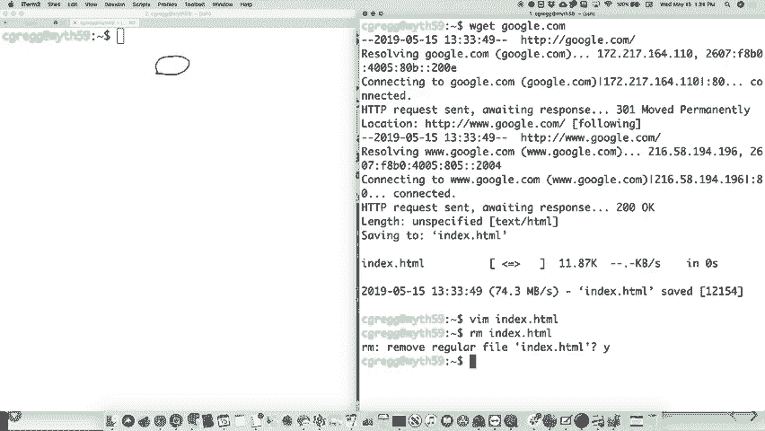

在本节课中，我们将继续深入学习网络编程，特别是如何构建一个功能更完善的网络客户端。我们将从回顾一个简单的客户端开始，逐步构建一个类似 `wget` 的命令行工具，用于从网络下载内容。最后，我们将探讨如何创建一个能够处理特定请求（如拼字游戏单词查找）并返回结构化数据（JSON格式）的服务器。

---


## 🔍 回顾：简单的网络客户端


上一节我们介绍了如何创建一个最基本的客户端套接字来连接服务器并读取数据。其核心步骤是：创建套接字、建立连接、设置数据流、读取服务器响应并打印。

本节中，我们将在此基础上进行扩展，构建一个可以向服务器发送特定请求并获取更多信息的客户端。


---


## 📥 构建 `wget` 功能


`wget` 是 Linux 系统中的一个常用命令，用于从指定的 URL 下载文件。例如，输入 `wget google.com` 会将 Google 首页下载到本地的 `index.html` 文件中。

我们的目标是实现类似的功能：接收一个 URL，解析其组成部分，连接到对应的主机，发送 HTTP 请求，获取响应数据，并保存到文件中。


### 解析 URL

首先，我们需要将 URL 拆解为主机名和路径两部分。例如，对于 URL `http://web.stanford.edu/class/cs110`：
*   主机名是 `web.stanford.edu`
*   路径是 `/class/cs110`


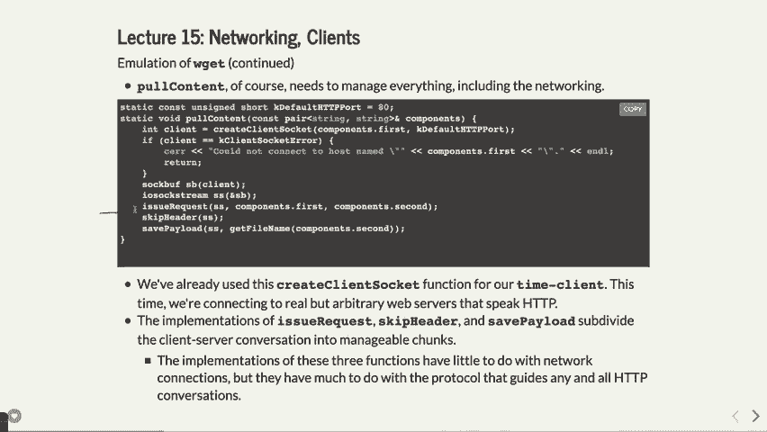

如果 URL 以 `http://` 开头，我们需要去掉这个前缀。然后，寻找第一个斜杠 `/` 来分隔主机和路径。如果没有指定路径，则默认路径为 `/`。


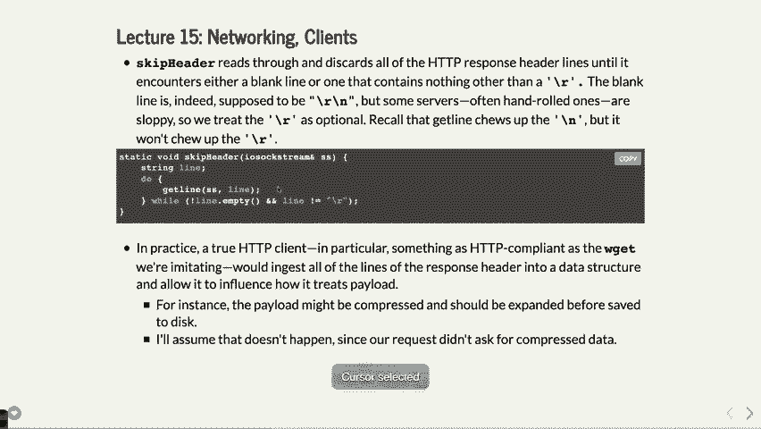

以下是解析 URL 的核心思路，用伪代码表示：
```cpp
pair<string, string> parseURL(string url) {
    string host, path;
    // 1. 如果以 "http://" 开头，则去掉它
    // 2. 查找第一个 '/' 的位置
    // 3. '/' 之前的部分是 host，之后的部分是 path
    // 4. 如果没找到 '/'，则 path 设为 "/"
    return make_pair(host, path);
}
```


### 发起请求与获取内容


解析出主机和路径后，我们需要连接到主机（通常是 80 端口），并发送一个格式正确的 HTTP `GET` 请求。


一个基本的 HTTP `GET` 请求格式如下：
```
GET [路径] HTTP/1.0\r\n
Host: [主机名]\r\n
\r\n
```
请注意，行尾必须是 `\r\n`（回车换行），而不仅仅是 `\n`。发送请求后，需要调用 `flush` 操作确保数据立即发送出去。

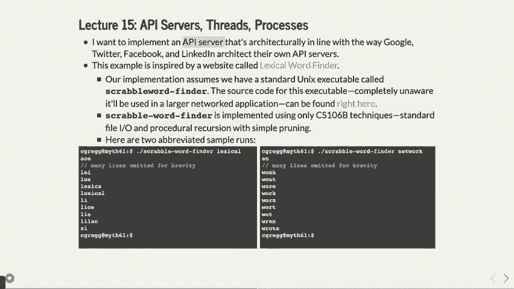


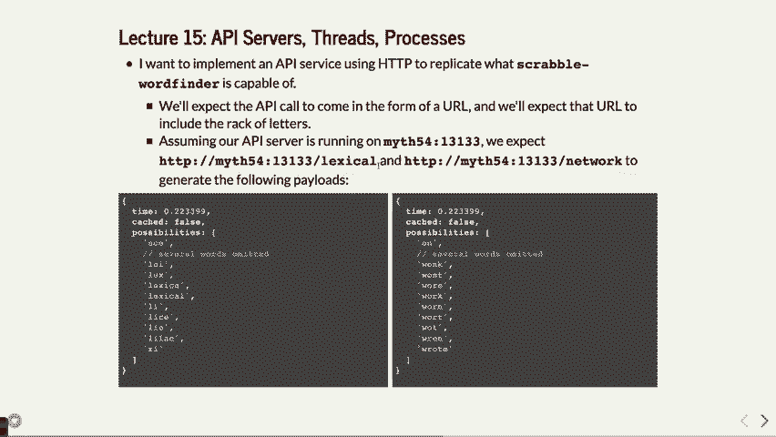


### 处理服务器响应


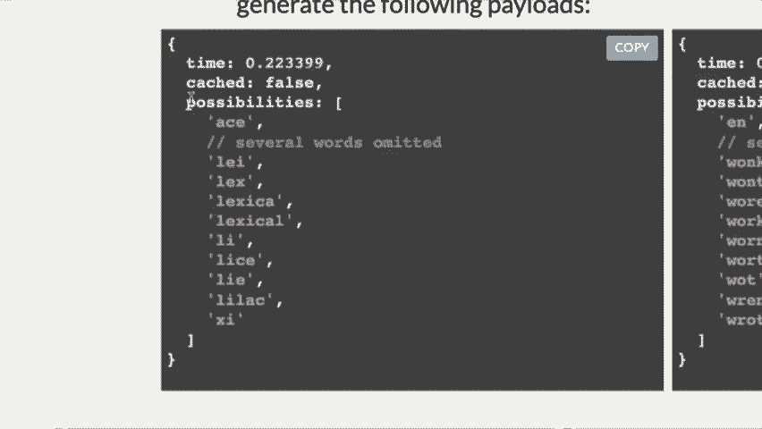

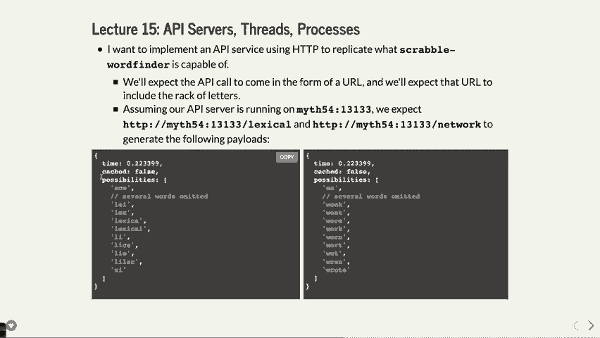

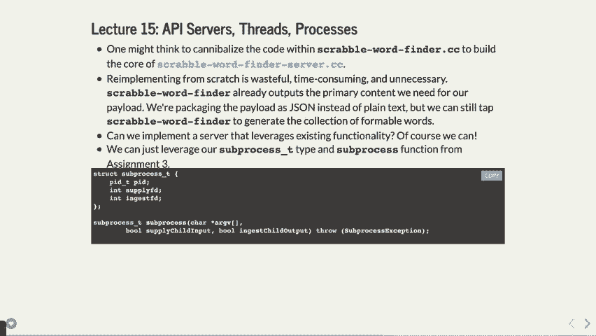


服务器返回的响应分为两部分：**响应头**和**响应体（数据）**。
响应头包含元信息（如内容类型、是否压缩等），每一行是一个头部信息，以空行（`\r\n\r\n`）结束。
我们暂时不关心具体的头部内容，因此可以连续读取行，直到遇到空行，这表示头部结束，之后的内容就是我们要保存的数据体。

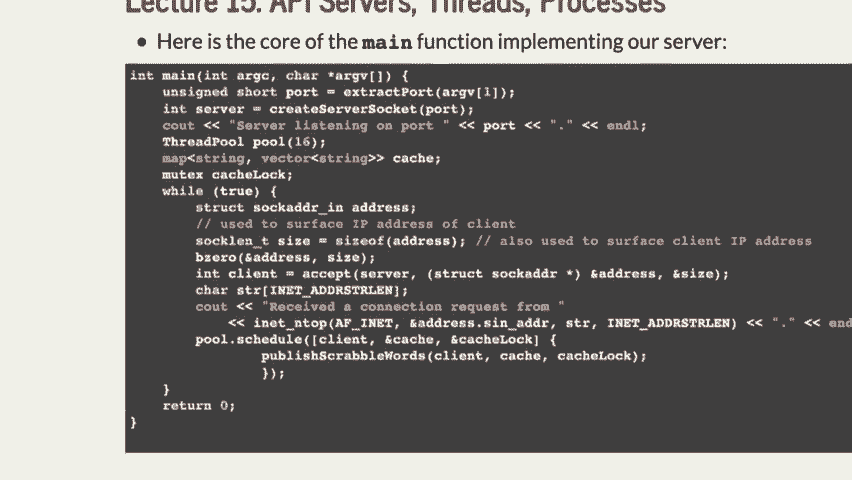


### 保存到文件

获取数据体后，我们需要将其写入本地文件。文件名可以从路径中提取（例如，路径 `/class/cs110/index.html` 的文件名是 `index.html`）。如果路径以 `/` 结尾或为空，则使用默认文件名 `index.html`。


保存数据的核心流程是：打开一个文件输出流，从网络流中循环读取数据块，并写入文件，直到读取完毕。

---

## 🧩 示例：拼字游戏单词查找服务器

接下来，我们将看一个更复杂的例子：构建一个服务器，它接收包含字母的请求，调用一个现有的“拼字游戏单词查找”程序，并将结果以 JSON 格式返回给客户端。这演示了如何将传统程序“网络服务化”。

### 服务器架构概述

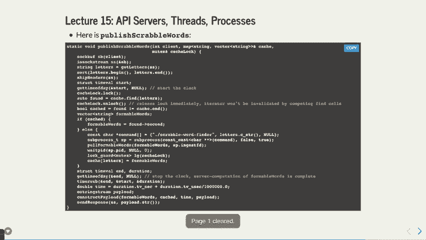


服务器的主要工作流程如下：
1.  创建服务器套接字并监听指定端口。
2.  使用**线程池**来并发处理多个客户端连接，提高效率。
3.  对于每个连接，解析客户端请求中的字母参数。
4.  使用**缓存**（一个映射表）存储之前查询过的结果，避免重复计算。
5.  如果缓存中已有结果，直接返回；如果没有，则通过**子进程**调用本地的单词查找程序。
6.  将程序输出的单词列表、处理时间等信息，组装成 **JSON** 格式的响应。
7.  按照 HTTP 协议规范，将 JSON 数据发送回客户端。


### 关键技术点


以下是实现过程中涉及的几个关键概念：


*   **线程池与互斥锁**：为了高效处理并发请求，我们使用线程池。当多个线程可能同时读写共享的缓存时，必须使用**互斥锁**来保护数据，防止出现竞态条件。加锁的范围应尽可能小，以减小性能影响。
*   **子进程调用**：服务器通过创建子进程来运行现有的单词查找程序，并捕获其输出。这使用了我们之前学过的进程创建与管理技术。需要注意的是，在多线程环境中调用 `fork` 需要格外小心。
*   **JSON 响应构建**：JSON（JavaScript Object Notation）是一种轻量级的数据交换格式，易于人阅读和机器解析。我们的服务器需要手动构建类似下面的 JSON 字符串：
    ```json
    {
      "elapsed": 0.04,
      "cached": false,
      "words": ["word1", "word2", "..."]
    }
    ```
*   **HTTP 响应格式**：服务器返回给客户端（如浏览器）的数据必须遵循 HTTP 协议。一个成功的响应通常如下所示：
    ```
    HTTP/1.1 200 OK\r\n
    Content-Type: application/json\r\n
    Content-Length: [数据长度]\r\n
    \r\n
    [JSON 数据体]
    ```
    其中，状态码 `200` 表示成功，`Content-Type` 告诉客户端数据的格式，`Content-Length` 指明数据体的大小。


### 从浏览器访问


完成服务器后，我们不仅可以通过 `telnet` 或自定义客户端访问，还可以直接从 **网页浏览器** 访问。例如，在浏览器地址栏输入 `http://myth59:12345/abcde`。
更进一步，可以编写一个包含 JavaScript 的 HTML 页面，使用 `fetch` API 向我们的服务器请求数据，并动态更新网页内容，从而创建一个完整的交互式网页应用。

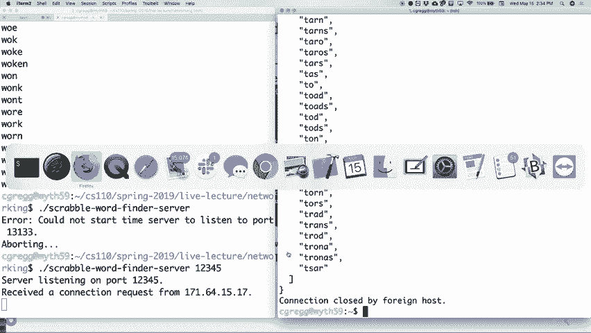


---

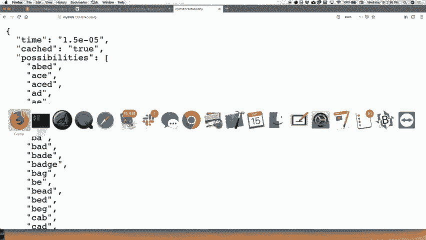


## 📚 总结


本节课我们一起学习了网络编程的更多实践内容。


我们首先构建了一个增强版的网络客户端，实现了类似 `wget` 的下载功能，深入了解了 HTTP 请求的发送与响应的解析。


接着，我们探索了如何构建一个能够提供特定网络服务的服务器。这个服务器综合运用了**多线程**、**进程控制**、**缓存机制**和**网络协议**等知识，将本地程序的功能通过 HTTP 和 JSON 接口暴露出来，使其能够被远程客户端（包括网页浏览器）调用。


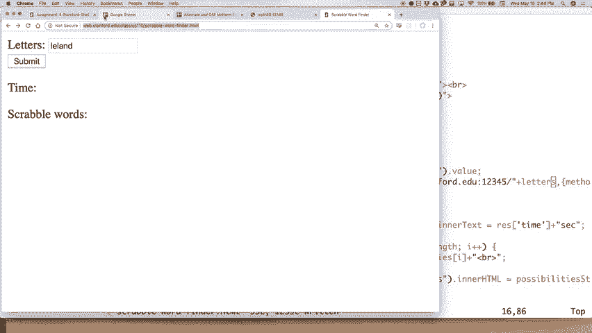

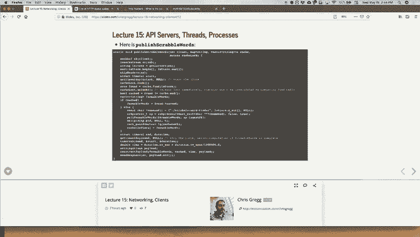

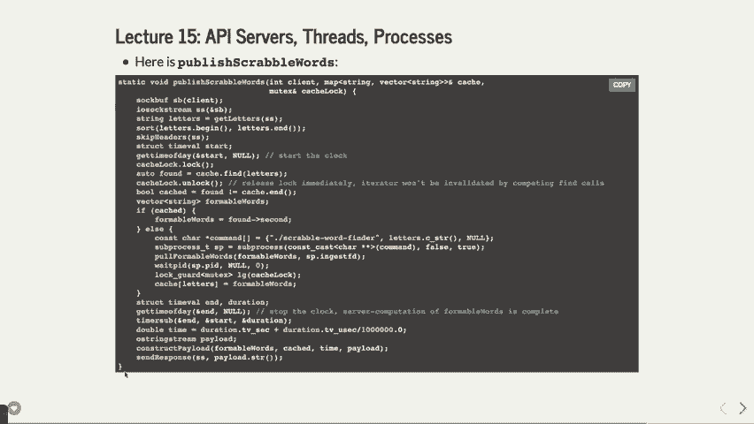

通过这些例子，我们可以看到，网络编程的核心在于定义清晰的通信协议（如 HTTP）和数据格式（如 JSON），并在客户端和服务器端正确地实现它们。