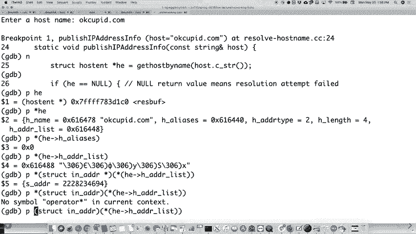

# P17：第16讲 网络系统调用 - ___main___ - BV1ED4y1R7RJ

屏幕和转播，你错过了大约30秒。好的，问题是：“嘿，我们可以在线程中使用多处理吗？”

答案是，你必须小心一点。我能找到的最好答案是那个几乎可以算作神圣的答案，它基本上说，“看，你可以在多线程程序中使用fork。”那么这到底是什么意思呢？这意味着，当你使用fork时，两个副本会被创建，两个进程都有与之关联的线程。所以，你得小心点，知道吗？

你得有办法处理这个问题。但从能够做到这一点的角度来看，最重要的是，在你进行fork之后，执行exec BP之前，不要做任何内存分配、new或delete操作。这是我找到的最好的答案。你可以做到这一点，只是不要做任何会以某种方式破坏内存的操作，导致问题发生。

摆弄调度器之类的东西。这是我找到的最好的答案。所以答案是，如果你想在多线程中使用多处理，你是可以的。你只需要小心一点。显然，测试总是非常重要的。好的，这是个好问题。

这是我找到的答案。如果你有兴趣，可以自己再深入研究一下。但是是可以的，只是得小心。好了，接下来我们继续。

网络系统调用、库函数等等。就像我几分钟前说的那样，我觉得这有点像是CS107的回顾，因为与C语言相关的一些不规范操作会传播到这些函数中，这些函数用于获取主机名、解析它们以及使用这些底层函数。

以一种方式来做，使得你可以支持IP版本4、IP版本6以及任何你想要的其他版本。结果证明，套接字编程——我们在这里讨论的，就是通过套接字或者基本上是端口，两个计算机相互通信的方式。套接字，实际上就是一个文件描述符，但它是一个非常特殊的文件描述符。

它仍然会在打开的文件表中有一个条目。信不信由你，它仍然会在特定进程的文件描述符中有一个条目，但它允许你在两个进程或两台计算机之间通过网络进行双向通信。明白了吗？所以它就像一个文件描述符，但它还有更多的内容。

你不一定需要知道它的其他细节，除了一个事实，即尽管它是一个文件描述符，实际上你不能像平常那样进行读写操作。明白了吗？

你使用像`accept`这样的函数，还会使用其他函数。我猜你可以在文件描述符上使用`write`，但不能。还有一些其他的细微差别，你不能只是说，哦，它就像每一个其他的文件。它有点像文件，但并不完全是。好了，让我们来谈谈具体的细节。

因为我们是人类，我们喜欢使用像`www.facebook.com`这样的东西，而不是`31.13.75.17`，对吧？

你不想记住数字。我们在本课程的很多地方都谈过这一点。所以，有一些函数可以根据名称获取数字。如果你知道像`www.facebook.com`这样的名称，它是很容易记住的，你可以使用一个名为`gethostbyname`的函数。你也可以使用另一个`gethostbyaddress`，它们两个从技术上来说已经不推荐使用了。

换句话说，应该有其他你应该使用的东西。不过，你的书中谈到这些函数，它们仍然被足够多地使用，以至于你应该习惯使用它们。特别是，我不太确定实际的新函数是什么。我并不说。比起看到这些，我更常看到那个，我也忘了实际的新函数是什么。

你现在应该使用的是这个。所以，反正我们将会讨论这两个。它们所接收的参数是`gethostbyname`。它接受一个像`www.facebook.com`这样的名称。并返回一个名为`host`的结构体，一个叫做`hostint`的结构体。我们稍后会看到这个特别的结构体。

它会用你需要的关于IP地址等的信息来填充它。你也可以在这里传入一个地址。事实证明，我不认为这实际上是一个`char*`。虽然它看起来像一个`char*`。你必须把它转换成一个`int`，相信我，或者在这个情况下是其他类型。之所以这么做，是因为你需要，实际上这个可能不是。这个。

我甚至不认为我们会在例子中使用这个。这个可能不是。也有些是你必须这么做的。再说一次。这是因为C语言的历史悠久，还有一些我们在1977年做的事情，那时候甚至没有`void*`指针。所以，一切都变成了`char*`指针，尽管你可以这么做。在这种情况下。

我猜在这种情况下，嗯，这实际上应该是，我认为，是一个数字。一个指向数字的指针。然后你将会说它是多少字节，接着还有另一个变量，它描述了连接的类型，是否是一个IP地址，或者是IPv6等等。好的，所以有很多关于这方面的细节是你在使用这个函数时需要了解的。好的。

一个`struct hostint`包含以下内容，嗯，我们会稍后看看它是什么。让我们来看看，`gethostname`。是的，来了。这个是一个名为`i-n-a-d-d-r`的结构体，它恰好是一个`int`。这是我见过最奇怪的结构体了。它只有一个值，就是一个`int`。好吧。我们稍后会更多地了解它。

但我们主要关注的是get host by name。所以，事实证明。好的，明白。那么，这是什么？这是什么？哎呀，哦，不，这不是我想做的。等一下。我现在没有正确设置我的平板，等一下。我回到这里，我们使用光标。好了。明白了。所以。

这是结构体host int的样子。首先，它内部包含了一个名为struct i-n-a-d_ad-dr的结构体，在这个例子中是一个无符号整数s-a-d-d-r。正如我所说，这是一个奇怪的结构体，因为它只包含一个值。你通常不会去管只有一个值的结构体，它想要的是指针。

也许这是为了，嘿，他们当时想，也许会以其他方式使用它。而他们可能有一些其他的想法，他们也许有足够的前瞻性，但它从未实现过。而且它也从未改变过。所以，这就是里面的全部内容。好的。这是一个无符号整数。然后，结构体host int有一个普通的旧指针星号，最后是一个普通的旧指针星号。

这是名称。好的。那是正式的名称。事实证明，我会给你看一个例子。正式名称可能与实际输入的名称不同。很多时候，它们最终会指向同一个IP地址，但名称可能稍微不同。然后你会看到一堆别名。好的。

别名是其他字符串，也指向相同的IP地址。好的。所以有一个官方的名称，还有其他指向相同地址的别名。你很少看到别名字段被填充。我猜也许真的没有人那么关心它。但你很少会看到它被填充。但它确实是一个指针星号星号。

这意味着它基本上就像我们通常使用的其他指针星号。它是一个。事实证明，是一个没有终止符的指向字符串的指针列表。所以字符串，字符串，字符串，字符串，字符串，然后最后一个是，没错，你知道你已经到了末尾。这就是那个。好的。地址类型将根据你关心的IP地址类型有所不同。

所以在这个例子中，我们可能主要使用AFI net，这意味着Internet中的IPV4地址。好的。这个其实是挺重要的。我们会看到为什么，当我们进入一些奇怪的多态性细节时，它们被硬塞进了C语言中。正如我们所见。好的。然后这里是一个指针星号星号，每个地址列表。

这其实是另一个非指针星号星号。它基本上是一个void指针星号星号。应该是void指针星号星号。但当他们构建这个函数时，要么他们当时没有void指针星号星号，要么由于某些原因不想使用它。但是当你使用它时，应该将其转换为适当的类型。

你将通过分析这个来了解。我们再看一下它是如何工作的。这就像是非常低级的107类的东西。问题是，这些东西应该是为了做一个durant（译注：durant可能是个打字错误或专有名词）吗？

这些东西是杜兰特做的吗？可能吧。应该是同一批人。对，你看。当你在1970年代设计某个东西时，它跟今天的设计方式有点不同。也许吧。但没错，可能是同一批人做的。或者是有相同思维方式的人。好吧。

无论如何，过一会我们就会知道为什么这会变得有趣。好吧。好的。S-A-D-D-R 字段就是我们所说的点四表示法。好吧。基本上，它是四个字节。一个，二，三，四。好吧，四个字节。这就是你们希望曾经见过的那种类似的IP地址形式。你有它。嗯，这就是IP地址的样子。一个IP版本4地址就长这样。171。

64，64，136。然后这些IP地址会被分成四段，因为比记住那个长长的数字要容易一些。首先，数字一。然后第二，每个小字节表示不同的意义。171。我相信斯坦福的意思是第一个字节，所有斯坦福地址都是这样。然后，其他的字节逐渐指向你正在查看的实际机器或路由器。

所以它是这么工作的。意思是，因为这些只是字节，IP版本4地址就是四个字节，或者32位，它是171，64，64，136。那么，这些字节的顺序会是什么？换句话说，当你有……这也是我刚才提到的107的部分。当你有一个四字节的数字时。

我们可以使用两种不同的字节顺序。记得它们是什么吗？小端字节序和大端字节序，对吧？我们的机器通常是小端字节序的机器。意思是数字的低位字节实际上会先存储在内存中。因此，136 实际上会是内存中第一个字节，然后是64，接着是另一个64。

然后 171 将是最后存储的内容。我们本来可以按完全相反的顺序来做。你可以用大端字节序来做。对于那些学习了计算机科学的同学们，嗯，107E。我相信树莓派一般使用的是大端字节序。虽然也许它们……我觉得我实际上可以在两者之间切换，结果是这样。

但重点是，在那种情况下它会是不同的顺序。嗯，由于标准化，你的计算机使用的是小端字节序，你需要与另一台可能使用大端字节序的计算机通信。当你实际上通过网络发送数据时，你必须决定字节的顺序。

好吗？所以我们必须这么做的原因是为了让每个人都能一起交流。因此，如果你的计算机上的字节序不正确，在你准备发送数据时，最好进行转换。我们稍后会看到实际操作。我现在只是为你们做个铺垫，思考一下。稍后我会展示给你们看。好吧？我们来看看。对，接着。

对于非IP版本4的情况，我们也可以，嗯，让我看看，稍等，看看这个。看看这个。对于非IP v4的情况，我们有不同的信息在所有这些内容中。它包含了其他信息。H-atter类型将会是一个不同的实际数字。如果你有128位，长度也会不同。你需要报告这个。

列表中也可以包含不同类型的信息。所以你得小心一点，稍微小心一点。好吧？好了。那么，为什么它不让我再做一次呢？好了。好了。目前为止，关于这个有什么问题吗？

我们正在接近实际的代码部分。

事实上，让我们实际写些代码，然后我会在过程中向你展示。这个字体太小了。好吧。那么，我们开始。好吧。那么。我们将继续查看代码。然后我们将继续查看代码。

然后我们将继续查看代码。然后我们将继续查看代码。然后我们将继续查看代码。然后我们将继续查看代码。然后我们将继续查看代码。然后我们将继续查看代码。好了。所以，我们必须先声明一个`struct host end`。这是一个由操作系统维护的静态构建变量。

如果你在代码中多次使用这个，最好创建一个副本，如果你想跟踪不同的内容。保持一份副本，因为它不是线程安全的，或者其他的原因，因为你只是获取了指向数据的实际指针，而这个数据存活在你调用的函数内部。好了。这不是最好的做法。

但这就是静态变量的工作方式，也就是它是如何工作的。`get host by name`是一个C函数。所以我们需要转换，如果我们有一个C++字符串，我们只需将其转换为C字符串。好了。然后调用`get host by name`会填充这个。好了。所以，不，意味着我们无法解析这个名称。结果证明，这可能是多种原因造成的。

可能是你的DNS服务器出现故障，可能是在你的电脑、网络、路由器或你连接的其他地方，或者可能是其他原因。所以如果你输入了一个，恰好它不存在，这并不一定意味着它**不存在**，而是意味着你的程序无法解析它。

这是网络的问题。有时候，其他你无法依赖的东西会出现故障，而你对此无能为力。好了。然后，H E是我们之前谈到的那个名称，接着所有这些IP地址，我们会逐一处理，首先说，好的，让我们将H地址列表转换成它真正的样子，我们知道它实际上是一个IN地址双指针。为什么？因为我们知道。

我们正在请求IP版本四地址。换句话说，我们调用`get host by name`，意味着我们期待的是IPV4。如果你想要IPV6，有一个不同的函数可以调用。

好的。我一会儿给你看。不过，反正，你通过循环直到得到IP地址。得到后就不再继续。好的。那我们实际上是如何获取IP地址的呢？嗯，记住，它现在只是一个数字，仅仅是一个四字节的数字。所以我们做的是调用另一个叫做`I met network to printable`的函数，本质上就是。

NTOP代表什么，它的意思是它会说，嘿，你在使用哪种类型的IP地址？在这种情况下，是IP版本四？好。它说，给我实际指向地址本身的指针。好。然后给我一个字符串来填充它。这就是我们在上面所做的。

我们知道`I met underscore ADDR`，Sterling是IP地址的最大长度。事实证明是这样。所以我们知道那是可以的。然后，它的长度也是传入的，以避免溢出缓冲区。一旦你做到这一点，它就会把那个数字转换成一个漂亮的172点什么，什么，什么。好啦，关于这个有什么问题吗？嗯。是的。`A of I net`是IP版本四。是的。

`A of I net`是IP版本四。我们快速看一下。`Resolve host name six， C C`。是的。

这是用于IP版本六的那个。

`A of I net six`，等等。我们还会调用一个不同的函数，叫做`get host by name two`。

他们在命名这些时并不是特别聪明，我猜。你认为它会是……你觉得它会是像`get host by name six`之类的名字。但其实是……你可以传入这个。这个你传入的是实际的类型。所以我相信我们本来也可以使用这个来处理IPV6版本。

而且它也会正常工作。因为我们本来会传入IP版本，抱歉，是IP版本四。它们也写了两个两个吗？它们也写了两个两个吗？

他们可能也写了两个两个。是的。是的。如果你曾经构建过一个大型系统，你会很快意识到，你有些必须做出的决定，你从心底讨厌这些决定。但你必须做这些决定，因为这就是事情的进行方式。现在，如果他们必须这样做，可能不会。

但他们可能是某个委员会决定了这些，事情就是这样发展的。

无论如何，让我们看看这个程序如何运行。好的。我觉得它已经做好了。让我们看一下。`Resolve host name`。是的。好的。如果我们输入一个主机名，试试，试试`www.stanfer.edu`。好吧。所以它显示了那是实际的主机名，就是官方的主机名。现在，幸好我们不需要每次都输入这个才能访问斯坦福。

或者是给Stanford，或者给你。为什么它会那么长？嗯。它实际上告诉你，Stanford依赖于亚马逊的AWS服务，嗯。如果你想想，其实这也不是个糟糕的选择。如果不必要，为什么要全都自己做呢，对吧？

只依赖一个拥有数十亿台服务器的巨头公司。它应该会保持较高的在线频率等等。我相信如果我们只输入Stanford.edu，我们就能看到，没错，看到的是官方名称，就是Stanford.edu，它恰好指向了一个稍微不同的网页地址。我的猜测是，如果你输入www。

stanford.edu，你的浏览器可能，试试这个。

我要试试别的。Ping。Stanford.edu，好吧，它显示171，67，215，200。

好吧，就是这样。如果我们ping一下www，看看会发生什么。没有。它给了你另一个。所以它们略有不同。它们最终可能会指向同一个地方，但没错，确实有些不同，www实际上在这种情况下稍微有些差别。

如果你输入这两个，你会最终到达同一个地方。某个地方，它们会重新路由到同一个网页。让我们再试几个。试试google.com。Google.com有一个IP地址，我相信它实际上是基于你的位置的。它好像知道谁在请求，然后返回一个基于你位置的IP地址。

比如本地的，更接近你的位置。结果是，看看，facebook.com。嗯，还是一样的。给你。哦，其他一些，看看，www.facebook.com。给你。那个，www.stanford1，实际上我认为它有两个，那里有。它确实有两个不同的IP地址关联。我想那些是亚马逊的地址。

然后还有一个Jerry喜欢使用的。

好吧，Cupid.com。我不知道Jerry是否喜欢用那个，但Jerry确实给我看过。它有很多。我不确定为什么。并不是因为像数十亿人使用它，而Google只有一些人偶尔使用。所以我不知道为什么。这里有一些。似乎有些问题，导致它们的主机服务器说，“嘿，这些都是你的IP”。

地址出现后它会显示在这个列表中，然后，它有点像黑魔法。现在。github.com，让我试试。github.com。只有一个。我要不要试试www.github.com？一样。所以它是一样的。那个正好是。官方名称是同一个，指向的是同一个。所以，没错。

这里绝对有一些黑魔法在发生。我知道，你知道。我不清楚所有的细节。所以让我们做一件事。

我想给你展示一件事。gdb。我告诉你它不像107。gdb。解析。主机名。

好的。发布时中断。IP 地址信息。我想现在可以了。好了。

再运行一次。我们做 Stanford.edu。其实，我们做吧。我们做吧。我们做吧。好了。

让我们做这个，做这个，好，保留一个只是看看。好了，qubit.com。

好的。所以如果我们进入代码并获取主机名，好，如果我们打印出 HE，它就是。

一个指针。好了。

如果我们像那样打印出主机 HE，它会告诉你所有的详细信息。好了。所以它在这种情况下告诉你名字，那只是指向名字的指针。然后别名在里面，结果显示没有别名。我相信如果我们做。我们看看怎么做。我们要做一个星号。HE，我们做星号。HE，箭头。

HE，别名是。

看看是否有效。是的。所以第一个那里没有别名，结果显示没有。然后我们看看。H 地址类型恰好是二。在这种情况下，那意味着 IP 版本四。然后长度是四个字节。所以我们知道地址的长度。然后地址列表是。记得我们说它是一个 char star。

但是如果我们只是说，尝试像这样做这个，ADDR 列表，那会有点乱吧，对吧？

因为我们并不真正知道它是什么。我想你可能得像这样做。看看这是否有效。让我们看看我们是否能做到这一点。我们将不得不进行强制类型转换。我知道。它变得很丑，对吧？我们得把它强制转换成一个——它是什么？是一个 struct，i-n-a-d-d-r。

Struct，i-n-a-d-d-r star，也许？

不行。[听不清]，它会是——不行，哦不。我们看看。我早些时候做过这个。我之前弄明白了。

好的。就是那个。也许我们需要做——。

我们看看。我们直接去——[听不清]，等一下。只有这个——像这个吗？

如果我做了——那将会是一样的事情。

如果我——如果我做了——等一下。好了。所以是那个。然后如果我们想要再——。

我们看看。所以让我们打印出每一个那是什么。

P0x84——132。那是其中之一吗？好了，保持一次吗？

它是。132。

然后让我们看看。84d0——。

208。对了。其他的呢？是41和198。所以我们应该得到41应该是29。

然后C6应该是198。

好的。注意它的顺序。它的顺序是错的。是反过来的。好吧。我们之前调用的那个i net，_ntop函数实际上知道它的顺序是错的——不，实际上是小端格式。然后给我们返回正确的字符串。好的。但我们还没有真正转换过来——。

还没有把数据发送到网络上。对。[听不清]，是的。它知道一旦它到达那个数字，它就会变成计算机的表示形式。所以在这个情况下是小端。当我们实际将它发送到网络上时，我们必须将它转变为大端数值。你必须这么做，大家才能知道如何处理——。

[听不清]，为什么是大端而不是小端？有人做了这个决定。我是说。你们知道小端和大端的来历吗？你们需要了解更多。看。这 supposedly 是斯坦福大学的一个文理学院大学。这是我所理解的。但它来源于《格列佛游记》。所以在《格列佛游记》里，有...

小端和大端的故事，关于他们是如何打破鸡蛋的，无论是从大端还是从小端打破，或者是硬煮蛋或软煮蛋，还是小端。而他们为此大打出手。所以无论是谁创造了这个，都会说，哦，看起来小端在那里。哦，我记得这个。哦。

这也会引起一场大争论。这就是为什么我们会问问题，比如，为什么？

这有什么关系，等等。所以这实际上是一个完美的类比，事实证明它的确来源于此。好的，既然我们在这儿，我们来看一下主机名6。cc。

这是——哎呀——。

然后解析主机名6。cc。我们来看一下这个。当我们稍微看一下这个时。如果我们想要处理IP版本6地址，我们实际上可以查看它们。我们必须实际使用一个获取主机名的命令。我们得到了主机名2并告诉它。我们在找I和6地址。然后我们需要检查并确保。

那是I和6地址，即IP版本6地址。然后这里是同样的事情。我们可以使用这个函数。它知道如何转换IP版本6。

让我们看看当我们运行它时。我们实际在DDB上做一下，看看有什么不同。

解析主机名6。

让我们先运行它，看看主机名，[google.com](https://google.com)。这是[google.com](https://google.com)的地址。现在，这里有128位。这是一个相当大的数，128除以8是16。那就意味着16。这里不是16，有一个，两个，三个，四个，五个，六个，七个，基本上是七，八，因为它大约需要9、10位。而且里面还有一些额外的双冒号。

这是他们做出的一个决定，试图让IP版本6的数字变得更小。如果有一串零，你其实可以放两个冒号，然后就看着剩下的所有零。我还是觉得人类几乎不可能搞明白所有这些意味着什么。虽然不是不可能，但就是像这样。

你得动动脑筋，想一想零在哪里，它们是如何适配的？

对我来说，这可能是一个没有灵感的决定。但是实际上有些地方，记住一个IP版本6地址时，会有128位可用，也就是说，有2的128次方个不同的地址。实际上，让我去这里看看。我把数字找到了。就在这儿。

现在你可以拥有这么多不同的IP地址。这个数字比宇宙中的质子或原子还要大，我相信。

所以，如果你愿意，你就能为宇宙中的每一个原子分配一个IP版本6地址。我怀疑我们至少在我们的有生之年是不会用完这些地址的。但谁知道呢，我想。反正他们是这么看的。如果你是一个足够大的公司，并且你有足够的云计算资源，你实际上可以申请一个特定的IP版本6地址。那你为什么关心这个呢？[Facebook.com](https://facebook.com)。

看看Facebook的IP版本6地址。

它里面确实写了Facebook，这就像，哦，真聪明，真棒。而且我还不明白为什么他们不直接写两个双冒号。我依然不理解这些东西是如何工作的。

这些东西是怎么被算出来的。但也许有一天他们会直接使用花哨的IP地址。

你可以为你的手机或其他设备获取一个地址。

虽然你可能不在乎，但我猜，[Facebook](https://facebook.com)的人会在乎这些事。让我们继续运行它。我们照以前一样在相同的函数里中断。发布IP地址信息。

然后——哦，不。它不在那儿吗？等一下。然后。然后。然后解析主机名6。

他们说这被称作——让我们看看。

发布——哦，当然。发布 IPV6。信息。让我来做一下。好了，打断这个，然后运行它。是的，我们要启动它，再试试 Google。注意，我没有做 Stanford。等一下，让我给你看一下 Stanford。是的。Stanford.edu。继续。我不知道它是否已经有了。真是太遗憾了。不过，反正就是这么回事。

我们再看看。主机名。我们再试一次。Google.com。好吧。Google.com。好。然后你执行获取主机名，然后是这里，然后是这里。然后我们必须——再说一遍，我们得把它转换为结构体 i 和地址 6。然后我们必须真正执行它。所以如果我们再输入一次——让我们看看，pi_print_out_he。

它会告诉我们，它的字节数长度为 16，实际的地址列表等等。所以这里有一些不同的地方，你得了解。是的，它必须这样。当你把它转换为结构体 i 和 6 地址指针指针时，是因为你能操作地址列表。嗯，那是对的。没错。好问题。

看一下这个结构体——。

它去哪了？在那里。好吧。所以这是强制转换为 char 指针指针。

它没有强制转换为它真正的类型。为什么要强制转换为它真正的类型？因为我们希望它足够通用，能兼容 IP 版本 4、IP 版本 6，甚至你想要的其他任何版本。实际上还有另一个 IP。我想它只是有一个——我想是 i——这里是什么？

它不是 i 和地址。

它是 i 和 addr_unix。它是它自己的类型，意味着你可以像内部使用计算机的套接字一样使用它。这是另一种做法。所以再说一遍，这个服务器功能很强大。但它足够强大，里面有些奇怪的细节，你得去了解。

但是这让你明白了吗？为什么你必须这么做？先生——，[无法听清]。

为什么你要做地址列表加加？是的，你可以做地址列表加加，因为现在它知道是这种强类型，对吧？

一旦你这样做了，如果你没有这么做，它会尝试一次处理一个字符，然后就会乱掉。再次提到 107 的内容。是的。[无法听清]。

我不知道发生了什么，版本 5 怎么了。嗯，这是个好问题。

这可能是致命的。但是，IPV5 怎么了？IP——为什么没有 IP？

是的，这可能就像 Windows 9。让我们看看。不存在，所以没有 IP 版本 5。让我们看看。它是故意跳过的，以避免混淆。曾经有一个实验性协议叫做互联网流协议，在 1190 中定义。因此，它被分配了 IP 版本 5。但我们现在不再使用它。所以他们说，哦，让我们跳过它，使用 6。

跟那四个字节或六个字节什么的没有关系。如果你曾经这么想过，那就不对了。就这样。好的，行。知道这些东西确实有点疯狂。

总之，我们已经运行了很多这样的操作。现在，让我们来谈谈插座本身。当你创建一个插座时——记得我们做过吗？我们有 `accept` 命令，也有创建插座的命令等等。我们将稍微详细地查看它们，看看它们到底是如何构建的。我们将查看创建客户端插座。

以及创建服务器插座。记住，它们是两件完全不同的事情。当你创建客户端插座时，你要做的事情是，你要去连接到另一台计算机，连接到那台计算机的 IP 地址和端口。所以你实际上是要去连接另一台计算机。

那时你就是在创建客户端插座。你在创建客户端插座时。如果你是主机，如果你要做的是创建服务器插座，你所需要做的就是获取你本地的端口号，并试着分配给自己。我们叫这个绑定。我们将看到它是如何工作的。所以你实际上并不去连接任何人。

当你在做服务器时。你基本上是在说，嘿，我在这里。请连接我，或者其他计算机连接我。这是一个很大的区别。现在，当然，我们这里有不同类型的插座。这里又是它变得有点复杂的地方。我们有一个通用插座。

通用插座是 `struct-socket-dress`。它的第一个元素——它的第一个成员是一个无符号短整型，叫做 SA family。它是一个两字节的值，叫做 SA family。它会告诉我们——这将表示它是什么协议。然后我们有一个非常奇怪的 `SA data`，是 14 字节。但就这些了。

它没有再说明其他内容，除了说那里有 14 字节。然后你可能会想，哦，好的，也许这 14 字节将来会有用。我其实看不出它有什么用处。接下来是 `struct-socket-dress-in`，用于互联网。这是 IP 版本的表示方式。它的前两个字节是家庭，互联网插座的互联网家庭。

然后它有一个与之关联的端口号。接着它有一个我们之前看到的 `struct-i` 地址，叫做 `ADDR`，表示实际的四字节互联网地址。记住，它是奇怪的。它是四字节而不是——它实际上是一个结构体，这挺奇怪的。

然后它有八个字节的零值。这些零值被定义为零。事实证明，它们完全被忽略，尽管大多数人实际上会将它们设置为零，因为名字里有零。所以他们认为应该把它设为零。实际上，这可能完全不重要。它们完全被忽略。那么这是什么？

我不知道。我们拭目以待。首先，先数一下字节数。看看这是否真的有作用。一个短整型占多少字节？两个。另一个短整型再占两个。总共四个字节。无符号整数（INRS）占多少字节？四个。所以总共有八个字节。然后还有八个字节。那就是十六个字节。接着在这里，我们加上两个字节，再加上十四个字节。

所以那是 16。好了，听起来好像有些道理。我们来看一下互联网版本。第六版。它同样也将前两个字节作为家庭类型。然后它的前两个字节是端口。记住，端口只有两个字节。不管你是使用 IPv6 还是 IPv4。接着它包含一个 IN6 地址结构。

那将会是签名的 sin 6 地址。128 字节有多大？128 位转换成字节是多少？16个字节。16 加 4 等于 20，再加 2 等于 22，再加 2 等于 24。再加上另外 4 个字节是 28。这个是 16 吗？不是。

我不知道为什么会是这样。事实证明，这其实并不重要。就算有一个 14 字节的部分在那里，似乎也没关系。我认为必须有些东西在那里，以使编译能够正常工作。这是我能理解的全部了。我查阅的各种资料也说，这似乎并不重要。所以无所谓。

[听不清]，什么？[听不清]，哦，对不起。流信息和范围 ID。我甚至不确定它们是什么。它们是专门针对 IPv6 的一些东西。这部分的好处在于它足够通用，所以你可以在其中添加额外的内容。流信息可能与实际的后端有关。

服务器和客户端之间来回交换。也许它比其他某些方式更高效。于是他们想把它加进去。范围 ID 可能是其他的东西。我只是不知道。但是这超出了本课程的范围。没有恶意的意思。只是一些与之相关的附加信息。好了。

这就是一个 SOC 地址的样子。我们有这个通用的，似乎对我们没有太大帮助的地址，除了它包含了这个家庭类型。然后我们还有这些其他的地址，包含了家庭类型以及前两个字节，接着还有额外的信息。这才是关键的部分。实际上，不止两个字节。

还有其他的 Unix 类型，以及其他的类型。Socket 是一种非常通用的结构类型。好了，就是这些。不管怎样，正如我所说，版本 6.1 中包含了其他一些内容。你很少会声明这种类型的变量。好吧，这有点像 Java 中的抽象类或者类似的东西。

这里有一个定义，你实际上永远不会使用它。它只是存在，为了让其他从中继承的东西可以被使用。好的。所以你几乎不会实际做一个SOC ADDR。你会做你想要的那个，针对特定插槽你正试图创建的。好的。实际上 Linux 会为两者做一种设置。

因为他们想要使其通用。好的。你必须做的事情——我们在实际写代码时会看到——是你必须进行一些与这些相关的类型转换，才能获取正确的值。现在，如果你还记得 CS107 中的内容，你就会知道，你必须做这些类型转换，特别是在编写通用函数时。

有时候，比如你正在写一个函数，它有两个 `void*` 指针。在写函数时你知道类型，但编译器没有任何概念，因为它期望的是 `void*` 指针。你知道的，因为你是编写函数的人，哦，实际上这些是 `char**` 指针。

或类似的东西，在函数内部，你实际上会进行类型转换。当我们实际编写这两个函数时，它们将会非常相似。好的。我们将写两个函数，一个是创建客户端插槽。

另一个是创建服务器插槽。客户端插槽稍微简单一点，尽管看起来似乎有更多的事情要做。实际上你是试图联系另一台计算机，并与其连接。但实际上并没有那么多事情需要做。你知道你需要知道端口号和地址。

然后你必须设置插槽来执行它。这就是我们要做的事情。我们要确认，我们实际上能够与 IP 地址进行通信。嗯，确认该主机的 IP 地址存在。我们将尝试连接某个主机，我们需要这个 IP 地址。

让我们检查它是否存在。然后我们将分配一个新的描述符。这与常规的文件描述符非常相似，但又非常不同。它就像文件描述符一样，存在于文件中。

描述符表，它有一个打开的文件描述符等等。但你并不是用它的方式与其他描述符一样使用它。它是双向的。它是一种双向通信，而我们其他大多数描述符是单向的。你会使用一个叫做 socket 的系统调用，来实际配置一个插槽描述符。

当你使用 socket 时，它实际上并不会与其他计算机通信。它只是设置插槽，以便你可以用正确的细节填充它。然后使用它。接着，如果我们在做 IPv4，我们必须创建一个 socket 地址实例，命名为 `IN`，然后它将主机和端口号打包起来。

它打包了所有我们要连接的细节。我们会做这个。然后现在你已经设置好了这个套接字。现在你可以真正去连接另一个计算机了。我们将要做的就是这个。如果一切顺利，你就将那个套接字返回给任何需要的人。

程序或者其他请求它的功能。明白吗？问题是。这就结束了吗？从概念上讲，这和我们之前设置服务器和客户端的方式有何不同？是的，这是个好问题。问题是，从概念上讲，这和设置服务器和客户端有何不同？

现在我们正在设置的细节。所以我们之前实际上已经调用了这些函数。现在我们真正要做的是深入挖掘，看看我应该怎么做？

这就是我们需要获取的所有其他内容所在的地方。好问题。所以套接字描述符，文件的千分之一。套接字描述符位于文件描述符表中。它的类型是套接字。所以它不是一个只读文件、只写文件等等。它是一个套接字。

它有更多的细节，因为它需要双向连接并可能连接其他计算机等等。但由于几乎所有的Unix系统中都将一切都视为文件，它们仍然把它当作一个文件，尽管你不能像在本地文件描述符中那样使用它。好吧。

让我们实际操作一下。好的，现在我们来做这个。

让我们看看。我们想做客户端套接字。cc。

好的。这个是这里。你还有这段代码，这样你就能跟着我们一起操作了。我们将做 `struct host` 和 `hv = get host by name`。然后是我们传入的名称，`host.cster`，就像这样。这正是我们之前谈了10分钟的内容。因为我们只是在试图搞清楚它是否存在。好吧。如果它不存在。

我们只是返回-1，这表示，看看，我们没有获得它。我们不知道你说的是哪个地址。然后希望调用 `create client circuit` 的人注意到返回值，然后知道，哎呀，我没有获得我请求的套接字。接着我们会做 `in s =`。

这就是我们调用套接字函数来设置套接字的地方。在这种情况下，我们使用的是afinet。然后我们使用的是SOC stream。接下来我会稍微讲一下。SOC stream 基本上是在告诉操作系统，拜托，拜托，拜托，按照传统的互联网方式来处理这个。你可能会说，好吧。

普通的互联网是怎么工作的？嗯，我来告诉你。当你在两台计算机之间发送数据时，你并不是一次性发送一大串数据直到发送完毕。我的意思是，你有时确实会这样做。但是他们的设置方式是，它会分包发送。一个包的大小可以非常不同。我想大多数——。

我现在不太确定一个包裹有多大。可能像128字节之类的东西。它相对较小，但可能有512字节。但它包含了数据的信息。它有一个包裹号。还有关于数据本身的信息。然后，它会有一些数据。

你把这些包裹发送到某台计算机，而它们可能走不同的网络路径。很多包裹会走相同的路径，因为恰好是最短的路径。但也可能不是。有些包裹可能会走一条路径，而有些可能走另一条路径。

它们最终都会在计算机那里汇聚，那里是你要把它们发送到的地方。而且它们可能会以错误的顺序到达。如果它们的顺序错了，实际上也没关系，因为另一台计算机会说：“好吧，我要等所有这些包裹。如果我先收到包裹二。”

我就先把它搁在一边，直到我收到包裹一。然后我就知道我收到了包裹一和包裹二。等我把它们都收到以后，我会把它们排序。有时候包裹会丢失。事实上，包裹经常丢失。有些计算机宕机了，或者某个地方出了故障。

或者其他的。如果一个包裹丢失了，双方都有一个超时的机制。结果是，接收计算机收到一个包裹后，会发回一个确认包裹。它会说：“我收到了你的包裹三。”然后发送计算机就会说：“好的，包裹三收到了。”然后它会把它勾掉。如果接收计算机没有收到包裹三，它就……

等待一小段时间。然后发送——实际上，它只是等待。我相信。它只是静静地坐着等。是发送计算机说：“哦，我没有收到确认信号。我得再发送一个包裹。”它会一直发送，直到发送成功。这有时候就是为什么我能接收你的文件，这也是为什么你的文件会有缓存等问题。

问题来了。但是，接受包裹丢失了怎么办？是的，这是个好问题。真是个好问题。如果确认包裹丢失了怎么办？

这完全是一样的。发送计算机说：“哦，他们没有收到我的东西。”然后再发送一个。接收计算机如果收到了两个包裹，三个，它就会忽略其中一个。它忽略第二个包裹，因为我已经收到了。所以从这个意义上来说，它是健壮的。不过，也有一个问题，叫做——。

它叫——为什么我现在想不起来了？让我想一想。再说一遍？

这是前进的问题吗？不，不，不。是拜占庭皇帝问题。就是这个。你知道，拜占庭将军问题。再一次，文科教育。拜占庭将军问题是，如果有两个将军站在两个山头上，他们都想——他们想协调攻击一个山谷。并且他们必须就攻击时间达成一致。

他们必须攻击那个山谷。假设一个将军给另一个将军发送消息，说我们将在早上7点发动攻击。另一个将军回信说，好的，我们知道我们将在7点攻击。但是如果你从未收到那些确认消息呢？

即使你做到了，发送确认的人怎么知道另一个人收到了确认呢？然后就像——所以你永远不能完全精确地协调。所以总是会有一点小问题在那里。但通常情况下，你在开始时发送你需要的总字节数，希望它能够传送成功。

然后你收到一个确认消息，什么的。结果证明它运行得还不错，正如它的工作原理一样。所以基本上，你会发送一堆这样的数据包。Sockstream做的事情是，Sockstream告诉操作系统，"请为我处理这些数据包来回的所有细节"。

如果你不想让操作系统来处理这些事，假设你想自己处理所有的事情。你只想发送数据包，让它们按顺序发送并去做。那样你就需要做更多的工作，特别是如果你想要确保一切都保持一致。

比如确保另一端收到了数据包。你必须做所有这些。你可能会想这么做。假设你正在发送视频数据或者其他什么，而你不在乎每个字节或每个数据包。也许你想这么做。你可以说，"嘿，我来处理这些事情"。

因为即便视频的几帧变得模糊一秒钟，也没关系。谁在乎呢，至少它继续播放，而不是因为确认的问题被迫减速。所以这样做是有原因的。在这种情况下，我们只会坚持使用SOC字符串。好吧？好的，那就是如果S小于0的情况。再次说明，这意味着我们遇到了问题。

返回负1。现在我们必须做struct SOC address，以及地址。

我们需要填充我们在这里创建的这个地址，因为我们实际上会用它来进行连接。所以我们将这样做。现在，首先我们要做的是使用memset并填充地址为0，大小为struct SOC address。就像这样——实际上，我想我们可以直接做——我已经在私有部分写好了，但你也可以直接做。

做地址的大小。

我认为两者都可以。我们这么做只是为了清除内存。再次说明，这可能并不重要，结果可能没差，但我们这么做是因为它要求这些内容应该为0。

这其实没什么关系。我觉得我们反正会填充所有字节，因为事实证明。好的。那么接下来我们要做的是，地址。internet，基本上，套接字互联网族等于affinet。然后我们要做的是，地址。sonport等于。现在。就在这里我们需要将它转变为网络号码。当我们设置套接字时。

我们必须确保它符合网络顺序。我不确定为什么他们不能直接让连接函数来做这个。但是你需要实际执行以下操作。你需要直接说，htonsport。它代表--它代表--，让我看看，h--现在忘记了。主机--是的。

主机到网络短。它将把端口转换为正确的地址。实际上会翻转这两个字节。如果你在一个大端机器上构建这个，那将是一个无操作的函数。它实际上什么也不做。因为它已经是那个顺序了。

就是这么回事。好的。所以我们必须这么做。

好的。那么我们接下来要做的是地址等于。好了，准备好了吗？

我们现在必须适当地进行转换。第二，我们必须将其转换为一个结构体，internet，a，d，d，r。像这样，h，e，h，e，r。

为什么我们要这么做--哎呀，我在这里做了什么？等一下。一个，a，d，d，r，等于。好了。难道我忘了那个数字了吗--是的，我忘了。我一定在这里忘记了，但是我们现在不管它。所以现在我们要将那个4字节整数转换为一个实际的结构体。确保它正确地进入结构体。为什么？因为它是一个结构体，而不是一个整数。

所以它是这样的。然后我们调用这个连接函数。如果，连接。我们传入的是那个我们还没有--与之关联的套接字。我们马上就要做那个。我们在这里还有一个转换需要做，结构体，sock，address，star。这基本上是向下转换。它在大图中丢失了信息。

当你这么做时，它会丢失信息。因为编译器将会查找一个套接字地址，而不是一个套接字地址i n。你可能会问，嗯，如何把这些信息找回来呢？嗯。我们在你执行这一行之后再讨论这个问题，地址的大小，等于0。

这就是实际的连接行。那这个套接字--或者说，连接函数。怎么知道我们在使用互联网版本4？这是问题。它怎么知道？

我们之前说过，每个这些的相同之处是什么？前两个字节总是地址。族。所以如果我们知道前两个字节总是地址，我是说。我们知道结构体的成员总是必须按顺序排列。我们实际上可以查看第一个成员，并说这个成员必须是该类型。

然后在 `connect` 函数内部，如果类型是互联网地址4，我们就按这种方式处理。如果是6，我们就按这种方式处理。如果是单位，我们就按这种方式处理，等等。所以它通过知道是什么来决定的。好了，好的，如果返回值是0，意味着我们——或者说，返回值是 `s`，意味着我们实际上获得了正确的套接字。

[不清楚]，对。那么，它怎么知道的？我们在这里创建它。现在，它是互联网地址族的一种类型，像结构体一样设置，对吧？

前两个字节必须是这样的。实际上，我们在这里设置了它们。前两个字节表示的是族。因此，每当你遇到这些通用的套接字地址时，如果你查看前两个字节，它会是一个族。然后你就可以说，哦，我知道有哪些不同的族。因此，它必须是这种类型，套接字地址 `in`。所以他们就会以这种方式处理它。

所以 `connect` 函数需要知道不同的类型。它会查看前两个字节，然后说，哦，那个是2，或者那个是4，那个是8，或者其他什么的，然后根据这个数字，它会在内部决定，哦，我知道这是什么。这就是它的工作方式。现在，你不能在 C 语言中这么做，因为你不能重载函数声明类型。所以因此。

你必须以这种不太规范的方式来做。CS107，耶。这就是所有这些的根源。好了，现在，如果出于某种原因你没有连接——比如说连接实际上被断开了——你必须关闭我们创建的那个套接字，因为我们打开了——或者那个描述符，因为我们实际上通过套接字打开了一个描述符。因此。

你必须关闭它。所以如果你没有——如果你到达这一行。

这意味着某些地方出了问题，你需要关闭它，然后返回一个负数，比如这样。问题。之前我注意到在决定 SI 和地址之前，那个旧的——[不清楚]，对。只是你选择的路径。我本来希望没人问这个问题。这个问题是，非常好的观点。在这种情况下，你不需要做字节序的问题。我觉得因为——。

让我想想。嗯，我不太确定。就是为什么——我不知道为什么——你必须在这里做，而在这里却不需要做。我不完全确定为什么。嗯，我不确定。我会查一下的。我会尽量看一下，看看。这个是有效的。我们可以尝试一下。我的意思是，它在我们课堂上使用的每个例子中都有效，所以我假设它在这个例子中也能工作。

好的，那我们得到了什么？

所以这是客户端连接函数。

好的，让我们实际创建并看看。有人看到客户端套接字了吗？

看看这是否有效。一个客户端套接字。好的，哦不，哦，我知道为什么，因为它没有——它只是需要把它变成一个——如果我们在这种情况下输入make，它就能工作。实际上这是一个库函数，不需要一个main函数。我们没有main函数。好的，还有其他问题吗？是的。[听不清]，为什么我们要关闭它？[听不清]。

如果调用成功，我们把它传回。用户需要关闭它。因为你在设置套接字，对吧？所以在这里，你说让我们实际连接到那台计算机并获取——现在套接字是一个打开的文件。对于——它是一个打开的文件描述符。或者更准确地说，它是一个已连接的文件描述符。

然后你将它传回给使用它的用户。[听不清]，是的，是的，问题是，是否有点像子进程传回一个打开的文件描述符，所以用户必须关闭它。没错。注意我们在使用描述符时会关闭它们。结果是，屏幕，套接字流会为我们关闭它。但它会关闭它。是的。

好的，重点是使用的函数需要实际关闭它。因为只有它知道何时完成。好了，接下来我们快速看一下服务器套接字文件。

好的，这个会稍微相似一些。但是我们有一些额外的细节需要处理。好的，在创建服务器套接字时，我们将基本上做相同的事情。顺便说一下，我们这里只有使用互联网 IPV4。AF，iNet，OK。Sockstream，0。所以在这种情况下，我们不需要获取任何IP地址。因为IP地址就是我们的IP地址。

我们在尝试在计算机上设置一个服务器。所以实际上结果是，没关系。我们可以使用我们其中一个IP地址。我说“其中一个IP地址”，是因为你的计算机通常会有多个IP地址。如果你有蓝牙，如果你有Wi-Fi，如果你有网线以太网线插入电脑。

你将会有多个IP地址。所以你实际上可以说，能不能只允许在这个Wi-Fi上连接，或者如你所见，你可以说任何地址。我们马上就会看到。好的。好了，如果这不起作用，我们将返回负一。它甚至还没有打开，所以我们不需要实际关闭它。

但是如果它确实打开了，我们就可以继续。我们可以继续，结构体，和之前一样，SOC，地址。高地址和地址。这个看起来应该相对熟悉。然后我们将调用M，设置地址，0，地址的大小。好的。接下来我们将设置家庭的标志。再一次，这是套接字函数将如何——或者在这种情况下是bind函数。

它将知道如何解释我们下转的地址，或者下转的SOC地址。好的。我们将做到这一点。SOC family = a，f，i net。

好的。然后我们需要设置地址。son 地址。地址。地址。好的。在这种情况下，我们确实需要做这个。所以我在想之前是否不需要做这个。没有，我觉得之前不需要，因为它一直都能工作。我得看看，为什么现在需要这么做。所以我们现在正在做的，是 HTML。

现在我们要将我们正在处理的 IP 地址转换成主机到网络的格式。这个情况下，所以现在，使用 ADDR，任意地址。我们本来可以使用我们自己的 IP 地址，但我们不想这么做。因为我们希望，至少在这种情况下，允许它连接到任何可用的端口。如果你不想这么做，你也可以不这么做。然后是地址。son。端口等于 hto_n 短端口。

就像那样。

然后现在我们需要确保我们已经连接到操作系统的那个端口。我们还需要确保我们在监听那个端口。我们必须做两件事。我们需要做的就是所谓的 bind。我们将套接字绑定到地址。再次地，你需要进行类型转换。套接字，地址。然后同样的，如果绑定成功，bind 等于 0。

现在让我们做另一件事，叫做 listen。listen 系统调用表示，好，现在你已经绑定了这个端口。现在你实际上说，当有连接尝试时，把它转发给我的程序。你可以通过 listen 来做到这一点。然后是 backlog。我们在这里输入了 backlog 吗？我们有 backlog 吗？哦。

它是传入的。是的，我不确定那是什么——哦，我想通常我们会传入零或没有，或者其他的。其实这没什么关系。我不确定 backlog 这个参数到底做什么。返回 S。好的。换句话说，如果你不能绑定到套接字，或者你可以绑定并监听它。

返回我们现在已经正确设置的套接字，作为服务器套接字。否则，我们关闭套接字，因为遇到了问题。

然后我们返回负值。就这样运作，是的，我们不。第 22 行是什么？

第 22 行是做什么的？好的，它设置了我们正在使用的地址——基本上，它告诉绑定和监听函数你可以在我所有的 IP 地址上进行监听。这就是它的意思。它与端口不同，因为你的电脑通过 Wi-Fi 也有一个 IP 地址。

你的电脑，信不信由你，也有一个通过蓝牙的 IP 地址。如果你连接了一个以太网端口，它也有一个 IP 地址。所以在这种情况下，不同的 IP 地址与连接相关联。事实证明，我相信，ADDR 任意地址实际上是零。所以你可能根本不需要做这个。

但在另一个地方情况并非如此。所以我会再查一下，解决其他的遗漏问题。现在我们已经设置好了开始监听。还有一个问题。是的？[听不清]，好的。那么我们来看看你的问题。问题是，是什么阻止客户端连接？

然后重新分配或者其他什么的。所以记住，客户端只是——它是一个非常不透明的过程。客户端是另一台计算机，它尝试向服务器请求某些东西。它只是说，“嘿，我想连接到端口1234”。然后，如果你的服务器在监听这个端口。

它就建立一个连接，表示，“好的，开始给我数据”。它不会在其他服务器计算机上做任何本地操作。你不能跨越服务器计算机，去更改那里的任何端口。[无法听清]，哦，它可以尝试与其他端口通信。[无法听清]，嗯，它可以尝试——好的。

假设你发送了一条消息，一条随机的消息，给一个位于80端口的Web服务器。你正在尝试从它那里获取信息——它只会处理Web请求。再一次，它不会尝试其他的，它也无法获取其他的信息。你可以把这个信息传递给其他程序，或者做其他操作。

然后它们就能与Web服务器通信。其实这没什么大不了的，因为它不会——你在电脑上做的事情，跟那个套接字无关。如果它只是Web HTTP通信，那就没问题。也许多个程序可以同时通信，当然。但是它并不——也许我误解了你的问题。[无法听清]，[无法听清]。

服务器可以被分配一个没有直接请求的套接字吗？[无法听清]，不。我不能。我的意思是，套接字是本地的。套接字是本地于机器的。它可能是连接到另一台机器，连接到另一台机器的特定IP地址。但就是这样。

如果没有其他的——你不能请求一个没有监听的套接字。首先，你不能请求一个没有在监听的端口。而且你不能请求任何——，停下来准备上课了。我们检查一下。回来吧，我们准备好上课了。不过，其他问题呢？抱歉，情况不太好。对，[无法听清]，嗯，我不完全清楚回溯参数的作用。

我们来查一下。绑定。然后绑定。我们来看一下。绑定到一个套接字。我们来看一下。绑定或者——这是那个——是绑定吗？等等。哦，它在监听。抱歉，监听。监听一个操作。对不起，回溯。好的。回溯参数定义了队列中待处理连接的最大长度。基本上，如果有连接请求产生。

队列已满，客户端排队。好的。是的。这是说你会允许多少个不同的连接。我想最大值是128，实际上。我不认为你能指定更高的数量。但它会让你的程序稍微花点时间来建立连接。然后操作系统会。

保持其他连接的积压，然后将它们一个接一个地转发给你。我相信就是这样。是的。[听不清]，是的，好问题。好的。问题是，我对支持、套接字和IP地址有些困惑。好的。IP地址——我们从反向顺序开始。IP地址是你电脑的地址。

这是全世界都知道的。好的，我在这台机器上的IP地址是Myth 64，具体来说，是IP地址。

IF config会给你IP地址。它就在这里。IP前地址是171641529。IPv6地址是这里的这个长长的地址。然后是范围——哦，范围。范围就是这样。它是一个链接，出于某种原因。所以，这就是你的IP地址。它是与全世界通信的地址。当外部世界的某人想要与您通信时。

它们可以请求你某个特定的端口。你的一个程序正在监听该端口。所以也许我们想要SSH连接到Myth。那是22端口。所以我们查看IP地址，然后查看22端口，这样就能建立SSH连接。如果我们查看80端口，那就是网页连接。如果查看443端口，那就是邮件连接。

或类似的东西。这就是端口的定义。它指的是你电脑上用于监听各种事情的端口。现在，套接字是与连接相关联的文件描述符，无论是连接到另一个电脑，还是你正在监听的端口。套接字本身就是文件描述符，你可以从中读取和写入，并且可以同时进行两者。

结果显示是这样。那有帮助回答你的问题吗？是的。好的，先生。所以我们可以有多个。比如，我们可以连接到其他电脑，像其他计算机那样，它们会连接到一个服务器，然后它们会像什么一样，是什么不同的多个套接字？然后套接字呢？啊，好问题。所以是的，这是个非常好的问题。

我还没谈到这个问题。问题是，等等，假如多个计算机试图与你在特定端口上通信，因为这意味着它们都有不同的套接字，实际上发生了什么。这点我们之前略过了。一旦你与另一台计算机建立了连接。

你实际上是在完全不同的端口上操作。你在原始端口上做的唯一事情就是监听连接。然后你设置另一个端口，通过另一个端口与客户端连接，你可以在该端口上监听并建立连接。所以，一旦你在初始端口上设置好了，你就会实际交接连接。

连接到不同的端口来建立连接。假设你有1000台不同的计算机连接到你，你将会有1000个其他端口，它们在这些端口上连接并相互通信，而你仍然在监听80端口，等待下一个连接到来。这就是发生的事情。好问题。是的。[听不清]。

当你想监听多个端口时，你必须做——嗯，你必须做一些进程。其实也不完全是。我的意思是，你可以在一个特定的进程中监听多个端口。就像你可以打开多个文件一样。[听不清]，哦，线程会共享套接字吗？

我相信它们会共享。是的，我相信线程会共享套接字。现在，这其实并不会，像在你的网络线程池中，比如说，当我们做这个时，我们会建立一个新的连接。那是一个不同的端口，当我们做所有这些——当我们进行设置时。连接回客户端时。那是完全不同的端口。好的，还有其他问题吗？

好的，我们周三见。
