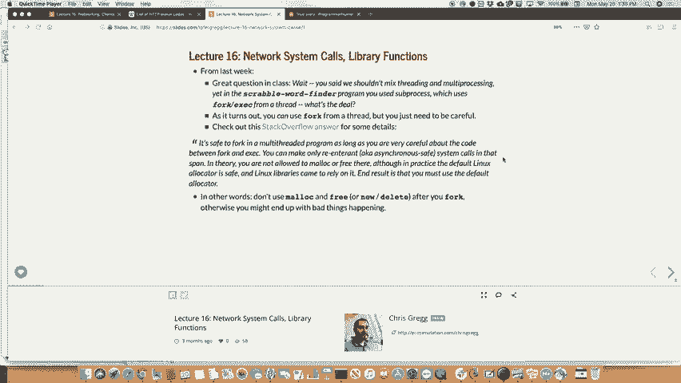

# 网络系统调用教程 P17：第16讲 ğŸŒ


在本节课中，我们将学习网络编程中的核心系统调用，特别是如何通过套æ¥å­—（socket）å®ç°ä¸åŒè®¡ç®—机之间的通信。我们将ä»è§£æ主机å开始，é€æ­¥æ·±å…¥åˆ°åˆ›å»ºå®¢æˆ·ç«¯å’ŒæœåŠ¡å™¨å¥—æ¥å­—的具体步骤。

---

## 主机å解æä¸IP地å€è·å– ğŸ”

上一节我们讨论了多线程ä¸å¤šè¿›ç¨‹çš„交互。本节中，我们æ¥çœ‹çœ‹ç½‘络编程的基础：如何将人类å¯è¯»çš„主机å（如 `www.facebook.com`）转æ¢ä¸ºè®¡ç®—机å¯è¯†åˆ«çš„IP地å€ã€‚

### `gethostbyname` 函数

`gethostbyname` 函数用äºæ ¹æ®ä¸»æœºåè·å–其对应的IP地å€ä¿¡æ¯ã€‚它æ¥æ”¶ä¸€ä¸ªä¸»æœºå字符串，并返å›ä¸€ä¸ª `struct hostent` 结æ„体指针。

```c
struct hostent *gethostbyname(const char *name);
```

如æœè§£æå¤±è´¥ï¼Œè¯¥å‡½æ•°è¿”å› `NULL`。失败åŸå› å¯èƒ½æ˜¯DNSæœåŠ¡å™¨æ•…éšœã€ç½‘络问题或主机åä¸å­˜åœ¨ã€‚

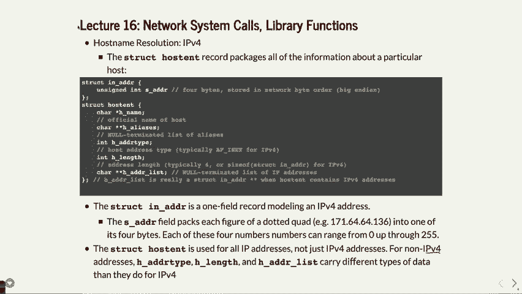

### `struct hostent` 结æ„体


该结æ„体包å«äº†ä¸»æœºçš„详细信æ¯ã€‚以下是其核心字段：

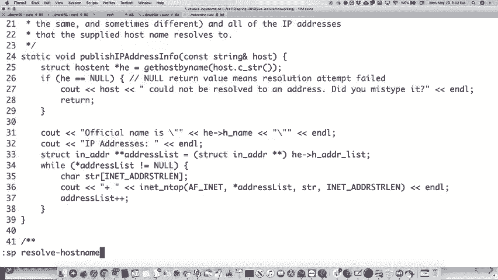


*   `h_name`: 指å‘官方主机å的指针。
*   `h_aliases`: 一个指å‘字符串指针数组的指针，表示该主机的别å列表。列表以 `NULL` 指针结æŸã€‚
*   `h_addrtype`: 地å€ç±»å‹ï¼Œä¾‹å¦‚ `AF_INET` 代表IPv4地å€ã€‚
*   `h_length`: 地å€é•¿åº¦ï¼ˆå­—节数）。对äºIPv4，此值为4。
*   `h_addr_list`: 一个指å‘网络地å€æŒ‡é’ˆæ•°ç»„的指针。对äºIPv4，æ¯ä¸ªåœ°å€æ˜¯ä¸€ä¸ª `struct in_addr`。列表以 `NULL` 指针结æŸã€‚


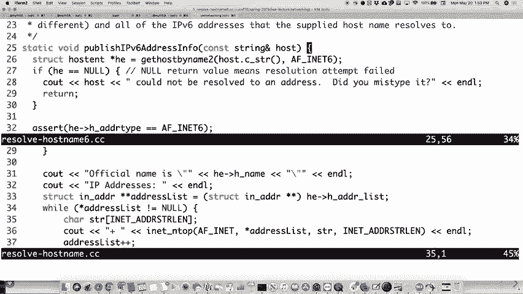

`struct in_addr` 是一个特殊的结æ„体，通常åªåŒ…å«ä¸€ä¸ªæˆå‘˜ `s_addr`，它是一个表示IPv4地å€çš„32ä½æ— ç¬¦å·æ•´æ•°ã€‚

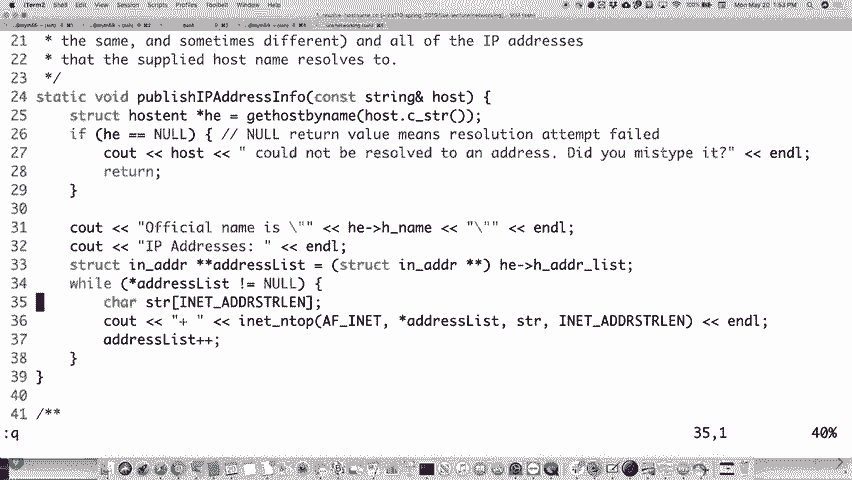

### 字节åºé—®é¢˜

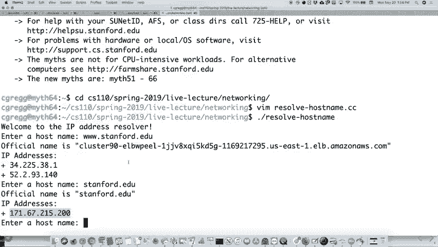


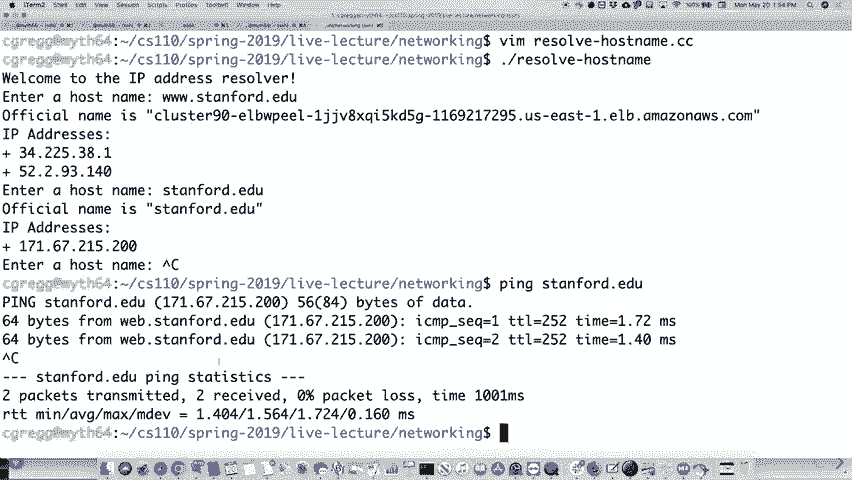

计算机存储多字节数æ®ï¼ˆå¦‚32ä½IP地å€ï¼‰æœ‰ä¸¤ç§é¡ºåºï¼š**å°ç«¯åº**（ä½ä½å­—节在å‰ï¼‰å’Œ**大端åº**（高ä½å­—节在å‰ï¼‰ã€‚为了ä¿è¯ç½‘络通信的一致性，数æ®åœ¨å‘é€å‰éœ€è¦è½¬æ¢ä¸º**网络字节åº**（大端åºï¼‰ã€‚我们使用以下函数进行转æ¢ï¼š


*   `htons()`: å°†16ä½çŸ­æ•´å‹ï¼ˆå¦‚端å£å·ï¼‰ä»ä¸»æœºå­—节åºè½¬æ¢ä¸ºç½‘络字节åºã€‚
*   `htonl()`: å°†32ä½é•¿æ•´å‹ä»ä¸»æœºå­—节åºè½¬æ¢ä¸ºç½‘络字节åºã€‚
*   `ntohs()`: å°†16ä½çŸ­æ•´å‹ä»ç½‘络字节åºè½¬æ¢å›ä¸»æœºå­—节åºã€‚
*   `ntohl()`: å°†32ä½é•¿æ•´å‹ä»ç½‘络字节åºè½¬æ¢å›ä¸»æœºå­—节åºã€‚


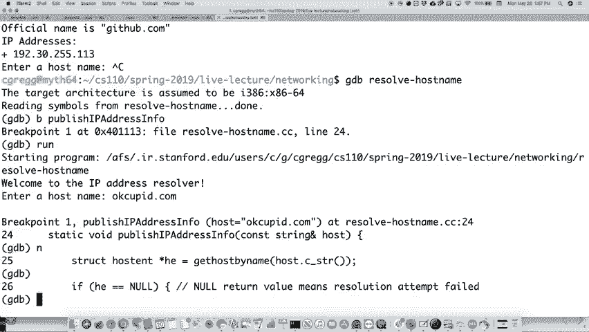

### 示例：解æ主机å

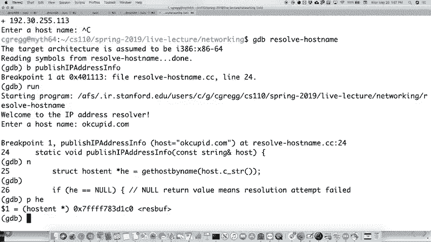


以下是使用 `gethostbyname` å’Œ `inet_ntop`（将网络地å€è½¬æ¢ä¸ºç‚¹åˆ†å进制字符串）的代ç ç¤ºä¾‹ï¼š


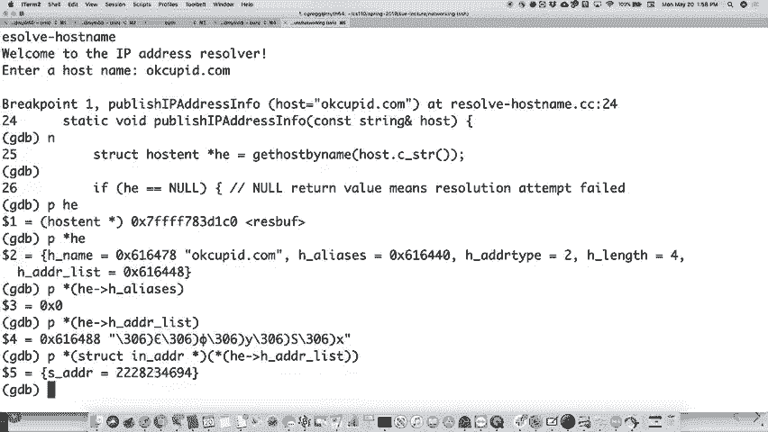


```c
#include <netdb.h>
#include <arpa/inet.h>
#include <stdio.h>


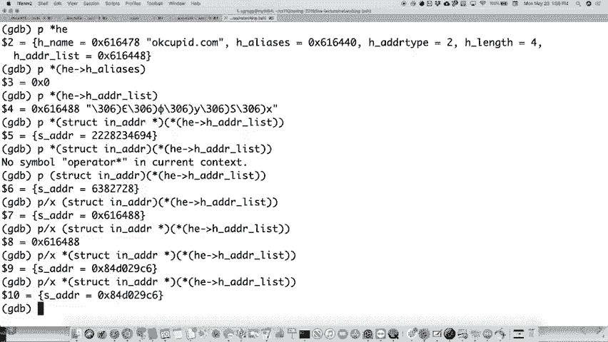


void resolve_hostname(const char* hostname) {
    struct hostent *he = gethostbyname(hostname);
    if (he == NULL) {
        fprintf(stderr, "无法解æ主机å: %s\n", hostname);
        return;
    }

    printf("官方å称: %s\n", he->h_name);

    // éå†åœ°å€åˆ—表
    struct in_addr **addr_list = (struct in_addr **)he->h_addr_list;
    for (int i = 0; addr_list[i] != NULL; i++) {
        char ip_str[INET_ADDRSTRLEN];
        inet_ntop(AF_INET, addr_list[i], ip_str, sizeof(ip_str));
        printf("IPåœ°å€ %d: %s\n", i+1, ip_str);
    }
}
```


---

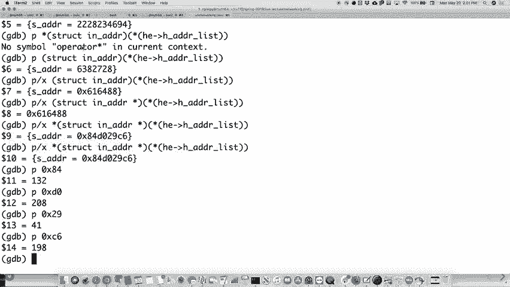


## 套æ¥å­—地å€ç»“æ„ ğŸ—ï¸


在深入创建套æ¥å­—之å‰ï¼Œæˆ‘们需è¦ç†è§£ç”¨äºè¡¨ç¤ºç½‘络地å€çš„通用结æ„。


### 通用套æ¥å­—地å€ï¼š`struct sockaddr`

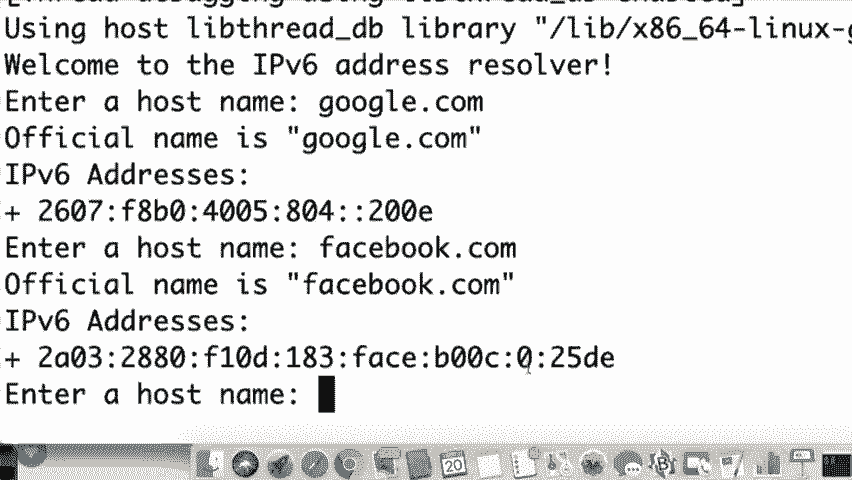


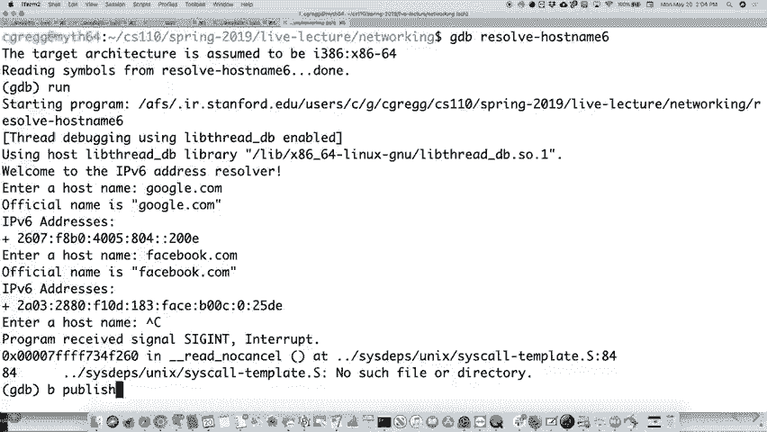

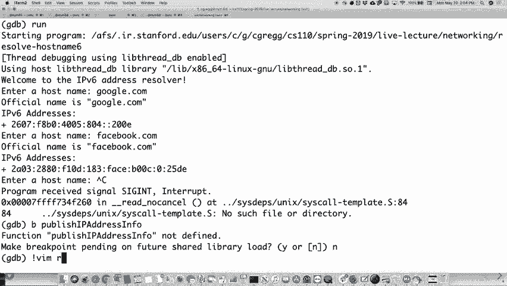

这是一个通用的地å€ç»“æ„，用äºåœ¨å‡½æ•°è°ƒç”¨ä¸­ä¼ é€’地å€ä¿¡æ¯ã€‚其定义如下：


```c
struct sockaddr {
    sa_family_t sa_family; // 地å€æ—（如 AF_INET, AF_INET6）
    char        sa_data[14]; // å议地å€
};
```


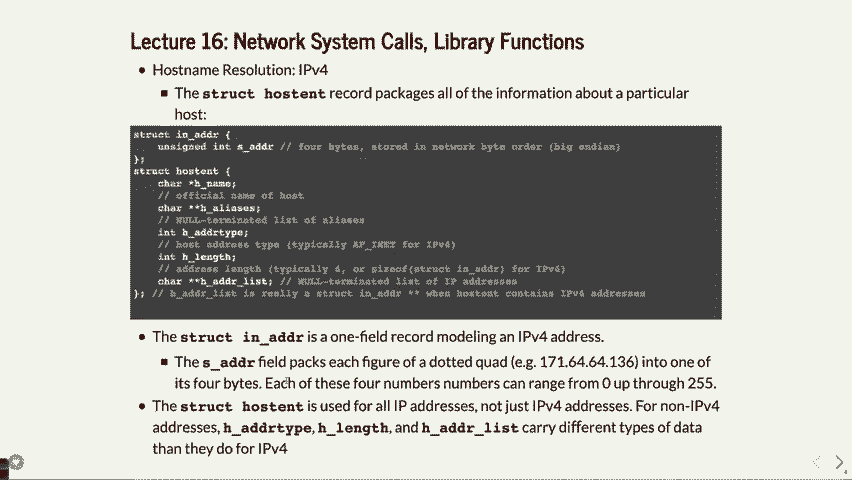


### 互è”网套æ¥å­—地å€ï¼ˆIPv4）：`struct sockaddr_in`


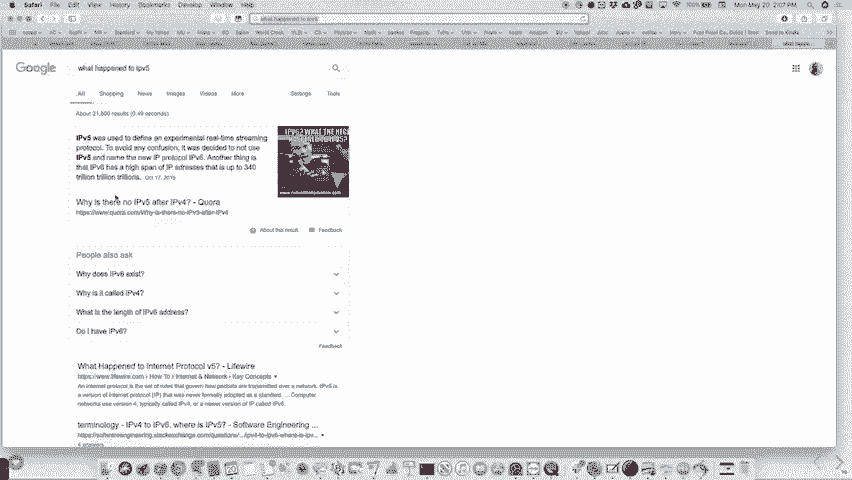

这是å®é™…用äºIPv4通信的地å€ç»“æ„。它包å«å…·ä½“的地å€ä¿¡æ¯ã€‚

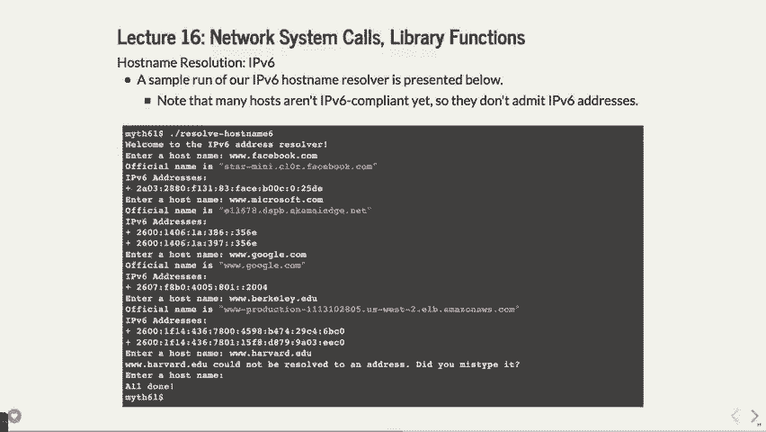

```c
struct sockaddr_in {
    sa_family_t    sin_family; // 地å€æ—，必须为 AF_INET
    in_port_t      sin_port;   // 端å£å·ï¼ˆç½‘络字节åºï¼‰
    struct in_addr sin_addr;   // IPv4地å€
    unsigned char  sin_zero[8]; // 填充字段，通常设为0
};
```

### ç±»å‹è½¬æ¢

ç”±äºåƒ `connect`ã€`bind` 这样的系统调用æ¥æ”¶é€šç”¨çš„ `struct sockaddr*` 指针，我们在传递 `struct sockaddr_in` 地å€æ—¶éœ€è¦è¿›è¡Œå¼ºåˆ¶ç±»å‹è½¬æ¢ã€‚

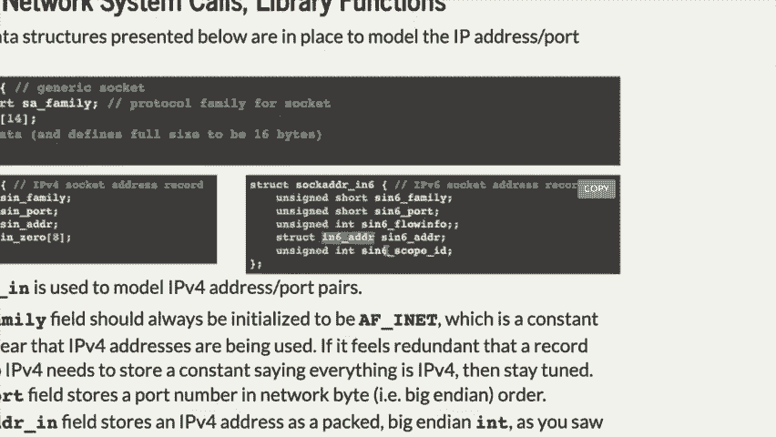

```c
struct sockaddr_in server_addr;
// ... å¡«å…… server_addr ...
connect(sockfd, (struct sockaddr *)&server_addr, sizeof(server_addr));
```

系统调用内部通过检查 `sa_family` 字段æ¥åˆ¤æ–­å…·ä½“的地å€ç±»å‹å¹¶è¿›è¡Œç›¸åº”处ç†ã€‚

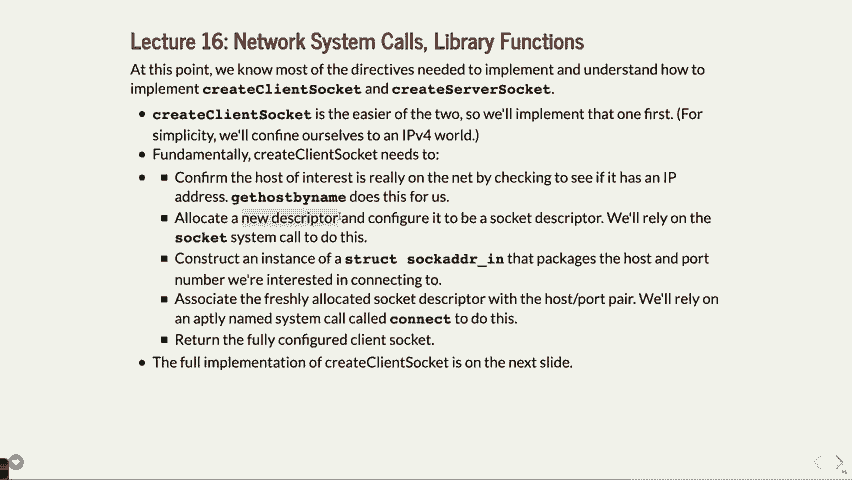

---

## 创建客户端套æ¥å­— 🖥ï¸â¡ï¸ğŸŒ

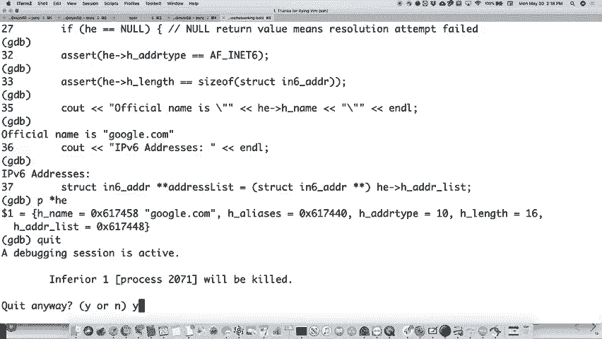

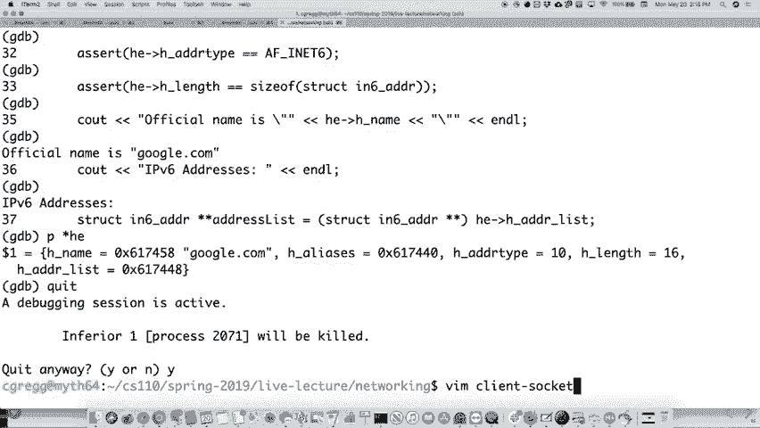

客户端套æ¥å­—用äºä¸»åŠ¨å‘èµ·ä¸è¿œç¨‹æœåŠ¡å™¨çš„è¿æ¥ã€‚

创建客户端套æ¥å­—主è¦åˆ†ä¸ºä»¥ä¸‹å‡ æ­¥ï¼š

1.  **解ææœåŠ¡å™¨ä¸»æœºå**：使用 `gethostbyname` è·å–æœåŠ¡å™¨çš„IP地å€ã€‚
2.  **创建套æ¥å­—æ述符**：使用 `socket()` 系统调用创建一个新的套æ¥å­—。
3.  **å¡«å……æœåŠ¡å™¨åœ°å€ç»“æ„**：创建一个 `struct sockaddr_in`，填入æœåŠ¡å™¨IPã€ç«¯å£ï¼Œå¹¶ç¡®ä¿å­—节åºæ­£ç¡®ã€‚
4.  **å‘èµ·è¿æ¥**：使用 `connect()` 系统调用å°è¯•è¿æ¥åˆ°æœåŠ¡å™¨ã€‚
5.  **错误处ç†**：如æœä»»ä½•æ­¥éª¤å¤±è´¥ï¼Œéœ€è¦å¦¥å–„关闭已打开的套æ¥å­—æ述符。

以下是核心代ç æ¡†æ¶ï¼š


```c
int create_client_socket(const char* hostname, int port) {
    // 1. 解æ主机å
    struct hostent *he = gethostbyname(hostname);
    if (he == NULL) return -1;

    // 2. 创建套æ¥å­—
    int sockfd = socket(AF_INET, SOCK_STREAM, 0);
    if (sockfd < 0) return -1;

    // 3. å¡«å……æœåŠ¡å™¨åœ°å€
    struct sockaddr_in server_addr;
    memset(&server_addr, 0, sizeof(server_addr));
    server_addr.sin_family = AF_INET;
    server_addr.sin_port = htons(port); // 转æ¢ç«¯å£å­—节åº
    // å¤åˆ¶IP地å€ï¼Œæ³¨æ„h_addr_list是指针的指针
    server_addr.sin_addr = *((struct in_addr *)he->h_addr_list[0]);

    // 4. å‘èµ·è¿æ¥
    if (connect(sockfd, (struct sockaddr *)&server_addr, sizeof(server_addr)) < 0) {
        close(sockfd); // 5. è¿æ¥å¤±è´¥ï¼Œå…³é—­å¥—æ¥å­—
        return -1;
    }
    // è¿æ¥æˆåŠŸï¼Œè¿”å›å¥—æ¥å­—æ述符
    return sockfd;
}
```

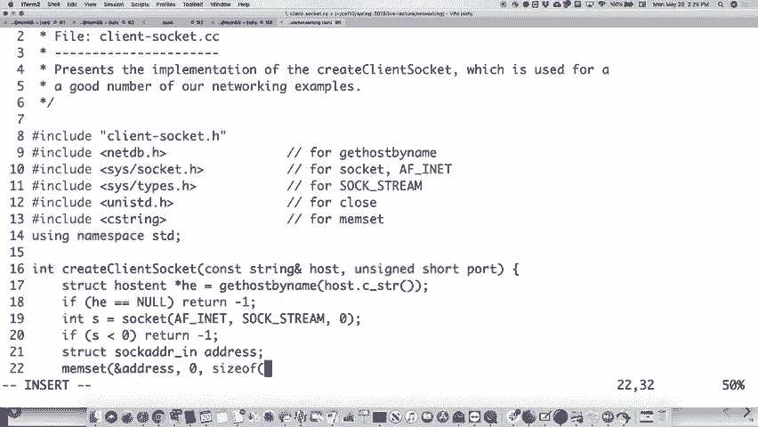


**注æ„**：调用此函数æˆåŠŸè·å–套æ¥å­—å，使用者负责在通信结æŸæ—¶è°ƒç”¨ `close()` 关闭它。

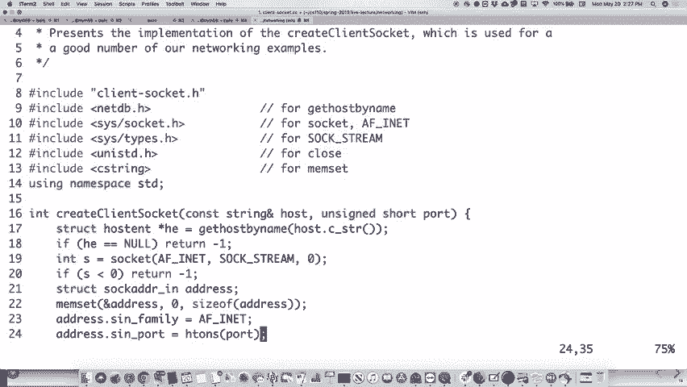


---


## 创建æœåŠ¡å™¨å¥—æ¥å­— ğŸŒâ¡ï¸ğŸ–¥ï¸

æœåŠ¡å™¨å¥—æ¥å­—用äºåœ¨æœ¬åœ°ç›‘å¬ï¼Œç­‰å¾…客户端的è¿æ¥è¯·æ±‚。

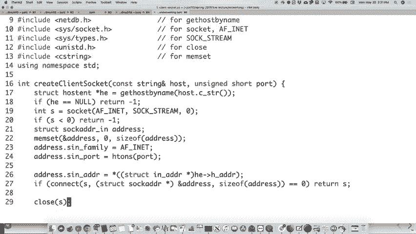

创建æœåŠ¡å™¨å¥—æ¥å­—主è¦åˆ†ä¸ºä»¥ä¸‹å‡ æ­¥ï¼š

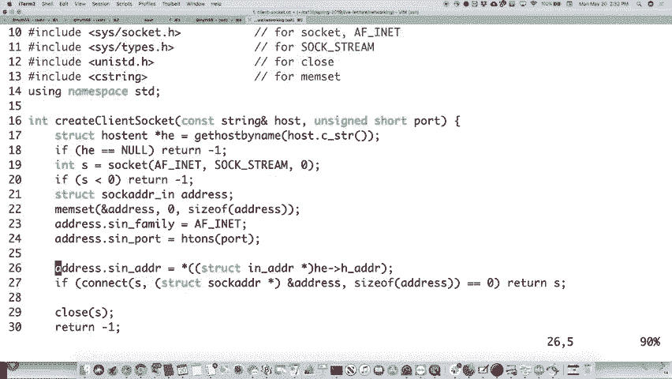

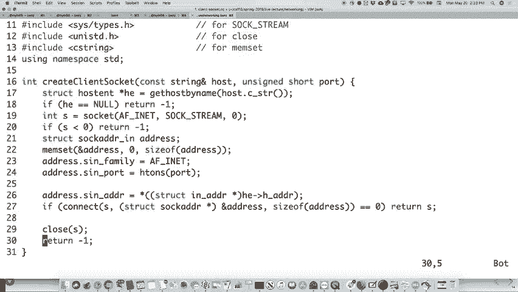

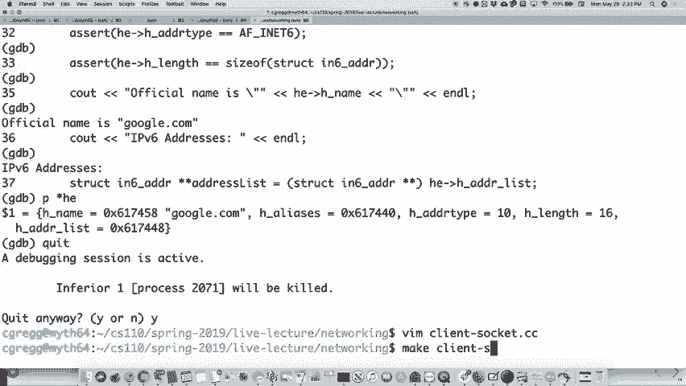

1.  **创建套æ¥å­—æ述符**：使用 `socket()` 系统调用。
2.  **填充本地地å€ç»“æ„**：创建一个 `struct sockaddr_in`。通常将IP地å€è®¾ç½®ä¸º `INADDR_ANY`（0.0.0.0），表示监å¬æœ¬æœºæ‰€æœ‰ç½‘络æ¥å£ã€‚端å£è®¾ç½®ä¸ºè¦ç›‘å¬çš„端å£ã€‚
3.  **绑定地å€**：使用 `bind()` 系统调用将套æ¥å­—ä¸ç‰¹å®šçš„IP地å€å’Œç«¯å£ç»‘定。
4.  **开始监å¬**：使用 `listen()` 系统调用，将套æ¥å­—ç½®äºè¢«åŠ¨ç›‘å¬æ¨¡å¼ï¼Œå‡†å¤‡æ¥å—è¿æ¥ã€‚
5.  **错误处ç†**：如æœç»‘定或监å¬å¤±è´¥ï¼Œéœ€è¦å…³é—­å¥—æ¥å­—。

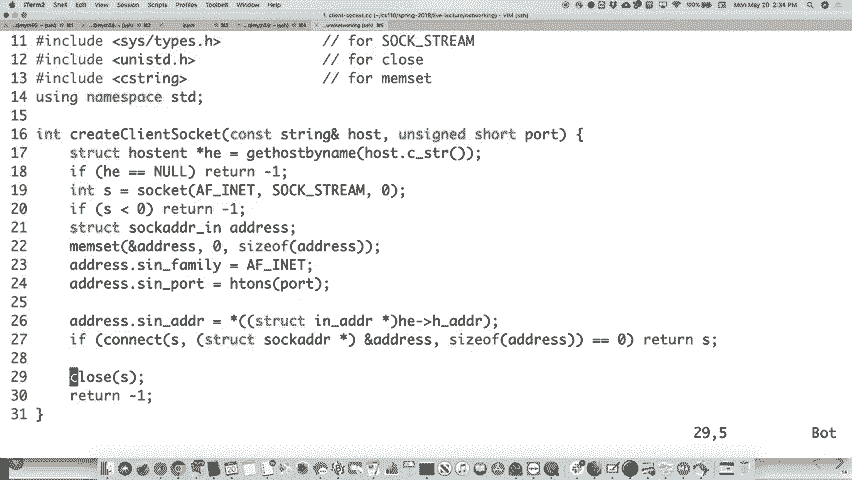

以下是核心代ç æ¡†æ¶ï¼š


```c
int create_server_socket(int port, int backlog) {
    // 1. 创建套æ¥å­—
    int sockfd = socket(AF_INET, SOCK_STREAM, 0);
    if (sockfd < 0) return -1;

    // 2. 填充本地地å€ï¼ˆå…许任何æ¥å£è¿æ¥ï¼‰
    struct sockaddr_in server_addr;
    memset(&server_addr, 0, sizeof(server_addr));
    server_addr.sin_family = AF_INET;
    server_addr.sin_addr.s_addr = htonl(INADDR_ANY); // 监å¬æ‰€æœ‰IP
    server_addr.sin_port = htons(port); // 设置监å¬ç«¯å£

    // 3. 绑定地å€
    if (bind(sockfd, (struct sockaddr *)&server_addr, sizeof(server_addr)) < 0) {
        close(sockfd);
        return -1;
    }

    // 4. 开始监å¬
    // backlogå‚数定义了等待è¿æ¥é˜Ÿåˆ—的最大长度
    if (listen(sockfd, backlog) < 0) {
        close(sockfd);
        return -1;
    }
    // 监å¬æˆåŠŸï¼Œè¿”å›æœåŠ¡å™¨å¥—æ¥å­—æ述符
    return sockfd;
}
```


**关键点说æ˜**：
*   `INADDR_ANY`：一个特殊地å€ï¼Œè¡¨ç¤ºæœåŠ¡å™¨æ„¿æ„æ¥å—æ¥è‡ªä»»ä½•ç½‘络æ¥å£ï¼ˆå¦‚以太网ã€Wi-Fi）的è¿æ¥ã€‚
*   `listen()` çš„ `backlog` å‚数：指定了内核为此套æ¥å­—æ’队的最大未完æˆè¿æ¥æ•°ã€‚超过此数é‡çš„è¿æ¥è¯·æ±‚å¯èƒ½ä¼šè¢«æ‹’ç»ã€‚

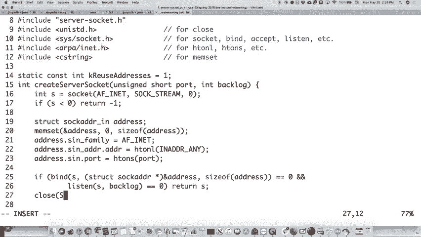

æœåŠ¡å™¨å¥—æ¥å­—创建æˆåŠŸå，å¯ä»¥ä½¿ç”¨ `accept()` 系统调用æ¥æ¥å—具体的客户端è¿æ¥ï¼Œè¯¥è°ƒç”¨ä¼šè¿”å›ä¸€ä¸ªç”¨äºä¸å®¢æˆ·ç«¯é€šä¿¡çš„**新套æ¥å­—æ述符**。åŸå§‹çš„æœåŠ¡å™¨å¥—æ¥å­—继续用äºç›‘å¬æ–°çš„è¿æ¥è¯·æ±‚。

---


## 总结 📚


本节课中我们一起学习了网络系统调用的核心内容：

1.  **主机å解æ**：使用 `gethostbyname` 将域å转æ¢ä¸ºIP地å€ï¼Œå¹¶ç†è§£äº† `struct hostent` 结æ„体和网络字节åºçš„概念。
2.  **套æ¥å­—地å€ç»“æ„**：了解了通用的 `struct sockaddr` 和具体的 `struct sockaddr_in`（IPv4）结æ„体，以åŠå®ƒä»¬ä¹‹é—´çš„ç±»å‹è½¬æ¢ã€‚
3.  **客户端套æ¥å­—**：æŒæ¡äº†åˆ›å»ºå®¢æˆ·ç«¯è¿æ¥çš„æµç¨‹ï¼šè§£æ主机å -> 创建套æ¥å­— -> å¡«å……åœ°å€ -> 调用 `connect()`。
4.  **æœåŠ¡å™¨å¥—æ¥å­—**：æŒæ¡äº†åˆ›å»ºæœåŠ¡å™¨ç›‘å¬ç«¯å£çš„æµç¨‹ï¼šåˆ›å»ºå¥—æ¥å­— -> 填充地å€ï¼ˆå¸¸ä½¿ç”¨ `INADDR_ANY`） -> 调用 `bind()` -> 调用 `listen()`。

ç†è§£è¿™äº›åŸºç¡€ç³»ç»Ÿè°ƒç”¨æ˜¯è¿›è¡Œæ›´é«˜çº§ç½‘络编程（如æ„建HTTPæœåŠ¡å™¨ã€èŠå¤©ç¨‹åºç­‰ï¼‰çš„基石。记ä½ï¼Œç½‘络编程涉åŠè®¸å¤šç»†èŠ‚和边界情况，充分的测试和错误处ç†è‡³å…³é‡è¦ã€‚