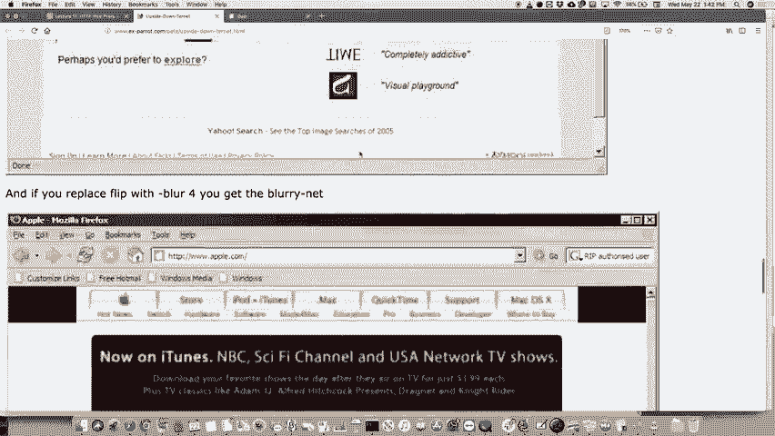

# P18：第17讲 网络代理 - ___main___ - BV1ED4y1R7RJ

好的，开始吧，尽管这里没有很多人，但我们还是开始。作业怎么样？作业，是什么，六号？怎么样？进行得怎么样？对，今天到期。我今天有办公室时间。下课后一个小时到一个小时十五分钟。

或者说对于任何想过来获得帮助的人来说，都会有时间。希望作业不太难。希望线程池作业有趣。我觉得它包含了所有不同的部分。你需要新的技术。你需要信号量，你可能需要条件变量之类的东西。

你不需要，可能你是用别的方法做的，但很可能你会需要。这个作业还有一些细节上的内容，但它是一个相当健壮的类。做得好。还有两个作业。接下来我们将进入周四的时间安排。

下一个作业将在明天发布，虽然严格来说你现在就可以去看了。我一会儿会给你们展示链接。然后它将在下周四截止。下一个作业将在周四发布，截止时间是下周四，我认为严格来说，这其实是在课程结束后。我不确定学校规定是否允许在课程结束后提交作业。

结束了，我觉得那是不允许的。所以我得想办法解决。也许我会把截止日期定在周三，但给每个人一个自由日，直到周四，或者类似的安排。我只是稍微绕过一些规定，但我确实想给你们足够的时间。但我也理解你们要准备期末考试之类的，所以我们会商量出一个办法。

在这方面的内容。但今天，我们基本上已经完成了作业的新材料。事实上，我们已经几乎完成了所有作业的新内容。还有一个话题，就是非阻塞I/O，基本上就是不会阻塞的I/O。当你说accept等操作时。我们可能会有使用它的理由。

我们将在最后一天上课时讨论这个问题，也许前一天也会讨论。今天之后，我们实际上还有三次讲座，对吧？下一次是周一，但那天是节假日。耶，再来一次。接下来是下周三的讲座，然后是下一个星期一和星期三。但实际上不会有新的内容出现在作业里。关于I/O。

非阻塞I/O，我可能会在期末考试中问一些很高层次的问题，但就这些内容而言应该没什么了。所以我们基本上已经完成了本学期的所有内容。下周我们会再多讲一点今天开始的内容，实际上就是关于你们下一个作业的内容。然后我们也会稍微聊聊，嘿。

这是关于110课程的大致框架，以及你应该从宏观角度学到的不同内容。所以这就是我们今天的全部内容。今天我想带你深入了解你明天开始的作业。我为什么要这么做？我觉得这是一个你会喜欢的作业，但你需要理清思路，而理清思路需要一些时间。

这不像其他作业那样简单，但这个作业确实需要一些时间来理解。所以我们将花大部分课时来讲解作业内容，具体时间取决于大家有多少问题，接着我会介绍我们最终作业的主题。

它叫做Napper-Duce，并且它将所有内容串联在一起。你需要运用你所知道的所有不同部分来完成这个最终作业。

所以，明天的作业是一个网页代理。这个是网页代理的基本概念。顺便提一下，你可以在这里下载实际的作业，如果你进入这个链接的话，看看我能否现在点击下载。应该就是作业文件了。不过你现在不能下载，我们没有……我会处理的。

早上好，我将推送实际的代码库，但如果你现在还没有在做当前作业的话，可以随时去阅读这份文件。正如你所看到的，它是一份相对较长的文档。不过并不太难。我们现在就来阅读一遍。所以，接下来我将返回到这里，看看它的内容是什么。

什么是网页代理？网页代理是一个位于你的网页浏览器和你想要访问的网页之间的服务器。你可以，今天我会向你展示如何操作。你可以设置你的网页浏览器，要求它每次请求网站时都使用代理服务器。所以，浏览器不会直接去请求实际的网站，而是会先请求你的网页代理服务器。

它发出确切的请求，你的网页代理服务器会接收这个请求，然后将请求转发给你想要访问的网页或服务器，获取结果后，再将结果返回给你。那么，为什么我们要这么做呢？其实，有很多理由你可能会想使用代理。

你可能想要屏蔽对某些网站的访问。这就像一种防火墙功能，如果你这么理解也没错。基本上，可能你会想设置一个代理，因为如果你经营一家公司，你可能不希望员工在工作时间访问Facebook.com，或者其他类似的网站，采取一些比较严格的措施。

像那样，或者类似的。不过你也许会这样做。也许你是一个家长，你不希望你的孩子访问某些网站，那些网站就不说了，等等。但这可能是使用代理的一个原因。你设置好之后，浏览器就会访问那个代理服务器，等等。顺便说一下，如果你有孩子，他们总能绕过你设置的任何代理。

所以不要认为这是一种完整的解决方案。这就是为什么只有你应该拥有你的路由器密码的原因。这就是它的作用。无论如何，这就是你可能会做的一件事。你可能想要阻止访问某些文档。比如说，你有一个巨大的文档。如果你在飞机上。

他们总是要求你通过网络代理，这样你就不能在飞机上下载像 YouTube 文档那样的内容，或者看 YouTube，因为他们的带宽非常有限，因为他们在天空中飞行。然后也许某些类型的文件。我不知道为什么我把压缩文件列在上面。

但也许它们太危险了，因为它们可能带有病毒之类的东西，或者你可能想要阻止这些内容。也许你会说，“我不喜欢列支敦士登，我不希望我的任何东西来自那里”，这些来自那里的人呢？抱歉如果我说错了。好吧，可能没有。反正你们也不过就三四万人吧。但无论如何。

我甚至不知道那儿是否有网站。可能有一点点。他们可能托管在列支敦士登。我敢打赌他们有。你也可能想要采取行动。其实，我认为你可能想要使用某种代理的一个重要原因是，你想作为匿名化工具，去除数据中的标头信息，去掉你的真实 IP 地址。

有多少人以前听说过 Tor 浏览器或洋葱路由（onion routing）？

有些人。好吧，那个是什么呢？那部分是一个网络代理，部分是一个将所有内容包装在高级加密中的工具。它是什么呢？Tor 网络是一个旨在帮助那些生活在可能受到网络使用限制的国家的人的网络。即使他们使用互联网，可能会因为某些原因感到不安全。

可能会面临被逮捕等情况。这些人希望他们不是在违反法律。他们可能在他们的国家违反了法律，但希望他们在全球做的是好事，他们可能希望通过互联网与其他人交流，沟通，而不是泄露他们的信息等等。现在。

它肯定可以用于所谓的暗网，供从事恶意活动的人使用。假设这些人做的是好事。它的工作原理是，你通过这个 Tor 网络的代理服务器，它接受你的请求并加密它，当然你可能首先加密它，然后再发送到另一个代理服务器，再次加密后发送到另一个地方。

这个过程通过加密再加上一层层的匿名化，使得你到底是从哪里来的更加难以追踪。这样做其实是一个不错的方法，可以在没有恐惧的情况下使用互联网，不用担心有人会查出你是谁。在一些国家，这对于那些为正义而斗争的人来说尤为重要，否则他们可能会遇到政府的麻烦。不过这并不是百分之百可靠的。

几年前，哈佛的一个学生居然向学校发出了炸弹威胁，称某个建筑里有炸弹，要求他们通过最终考试之类的东西。他通过Tor网络发送了威胁信息，这完全匿名化了他的身份，但警方还是挺聪明的。他们做的事情是，他们说我们有日志记录，记录了谁在使用互联网。

那时在校园里有些人使用Tor网络。结果发现有两个人在使用Tor网络，其中一个是个研究Tor网络的研究生，另一个是住在宿舍的孩子，他曾经发过炸弹威胁。所以他们通过外部数据推测出来，虽然当时并不知道他的IP地址。

他们就简单地查询了谁在使用这个网络。所以，如果你打算做这种愚蠢的事，要小心一点。为什么你可能会想使用代理呢？也许你想要拿到一些图片，并对它们做一些有趣的事情。

我发现的一件我最喜欢的事情，大概是十年前发生的。那时有个叫做“倒立网络”的东西，它是一个网络代理。它的原理是一个人设置了一个代理，那个设置代理的人有一个开放的Wi-Fi网络。现在大多数Wi-Fi网络已经不再开放了。

虽然现在Wi-Fi都有密码保护，但以前大部分Wi-Fi网络都是开放的。有个家伙意识到，所有的邻居都在偷用他的开放Wi-Fi网络。所以他在电脑上设置了一个代理。他基本上是在他自己的电脑和互联网之间设置了一个代理。

路由器，然后是他的电脑和互联网。

他基本上写了几个小脚本，做的事情是，每当有图片请求时，它会把图片翻转过来，再通过图片程序处理后，提供给用户。所以那些通过他互联网浏览的人，看到的图片都是倒过来的，这可能会让人觉得很烦，足够让你停止使用那个Wi-Fi。

然后他想，不如做得更恶搞一点，除了倒立图片外，他还可以让网络变得模糊。具体做法是，所有的图片都会被轻微模糊，这样你看着图片会觉得有点不对劲，而这种模糊效果是作用于所有图片的。

所以稍微模糊了一些，他认为这样也能起到同样的效果。你也可以用它来，这个人做了完全相同的事情，拦截所有流量。

然后只是把它转发到别的地方。这种情况发生在你去机场时，你登录时，有一个付费墙，你知道，你登录到任何网站，它会立即把你转发到某个代理服务器，告诉你请为互联网支付费用，或者同意这些条款和条件什么的。这个人也设置了它，每隔一段时间就切换一次。

它会直接去哪里呢？它去了哪里呢？

也许它不在那里。它会直接去 kittenwar.com。

所以每次他们浏览时，或者直接去 kittenwar.com，我猜你可以在 QK 和你可以选择之间做出选择，但这就是你知道的，他也是这么做的。所以他减少了使用他开放网络的人数。

然后，他实际上收到了来自 kittenwar 网站拥有者的一个小纸条，内容是：每隔一段时间，我就会收到一些愤怒的邮件，声称 kittenwar.com 上有病毒，他说我只会把他们指向你，告诉他们可能是你那边的问题，然后他说，“是的，主要问题应该是吧。”所以，这也是你可能想使用网页代理的另一个原因。

如果你想让人们整天只看小猫。好吧，哦，还有另一个，这是最重要的，实际上你会在作业中做这个。你可能想缓存实际的请求。现在，缓存，正如我们之前可能讨论过的，只是你请求的内容的本地副本。

所以在这种情况下，本地副本就是从允许缓存的数据网站获取的内容。什么样的东西可能会被缓存呢？Google 的标志，对吧？Google 的标志每天都是一样的。我的意思是，它们会在特殊日子做一些更改，但实际的 Google 标志本身多年如一。

为什么你每次去网站时都要重新请求它呢？只需要保留一个本地副本，最终它会在许多天或几个月后过期。但你不需要每次都去请求它。所以如果你有了本地副本，你就不需要浪费带宽到互联网去获取它，这是很重要的。现在，浏览器已经为你做了很多这种事情。

你的浏览器会保存页面的缓存。有时，缓存问题很严重，尤其是当网站正在更新时，你修改了内容，但它始终没有更新，你得弄清楚如何手动更新它。对于这个作业，你的浏览器会有缓存，因为这是一个作业。

你实际上是在使用浏览器，针对实际程序你应该尽可能频繁地清除浏览器数据。或者至少频繁清除，以避免出现“等一下，好像没有变化，一定有什么问题”这样的情况。所以就是这样。好了，任务本身确实需要你使用浏览器，而且它确实需要。

你需要将浏览器指向特定的计算机，主要是其中一台 myth 机器。我们建议使用 Firefox 浏览器，主要是因为我们知道大多数人通常不使用 Firefox，而且设置 Firefox 进行代理配置是最简单的，然后你可以用其他浏览器进行所有常规浏览。

我恰好使用的是 Firefox 浏览器来做这个演示，所以我现在会同时做一些操作。但实际上，你要做的是，现在我就为这个任务做一遍示范。我要向你展示如何操作。

首先我要做的是进入第七个春季任务，然后是样本。实际上，让我们先创建原始文件，这里就是起始代码，对吧，起始代码。

代码有一个代理，这里有很多文件，我们稍后会讲这些文件。起始代码有一个叫做“proxy”的代理，它基本上选择一个基于你用户名哈希值的端口。所以如果你设置代理，然后其他人设置代理，端口号应该不会重复，端口号足够多。

如果你发现总是使用相同的端口号，可能是别人也在使用相同的端口，你可以设置一个特定的端口号。如果需要的话。无论如何，现在是 myth 64 正在监听 19 4 1 9 端口，我们回到。

进入 Firefox，我们进入偏好设置，在偏好设置中我们在这里输入代理。

然后点击设置，它会显示一堆内容，可能显示的是“无代理”，如果你现在查看，可能会显示“使用系统代理设置”，你可以在系统中设置全局代理。你要做的是设置手动代理，你看我之前是这么做的。设置手动代理到你拥有的服务器，或者你有的任何代理，在这个情况下是。

是 myth 64 然后是 19 4 还是 9，因为我的名字没有像去年或上个季度那样重新生成哈希。总之，是 myth 64，端口号是 19 1 4 1 9，你还应该选择“为所有协议使用这个代理服务器”，如果你不选择这个，你可能会访问一些绕过代理的网站，认为一切正常，但实际上并非如此，因为它会。

通过代理，所以确保你点击了那个选项，然后当你这么做时，如果你尝试。

我们去访问一个网站，试试看example.com，它应该显示你正在编写一个代理对吧？所以我有一个例子，显示你正在编写代理，这就是它目前的功能，基本上是拦截你的请求，然后返回一个显示你正在编写代理的页面，就是这样。

好的，现在看来我们写的代码只适用于HTTP网站。你们将要编写的代码是可以用于HTTPS网站的，而现在大多数网站都是HTTPS，所以你得小心不要访问那些HTTPS站点，不然你可能会在做作业的一半时才发现问题。

这个不工作，你记得吗？哦，那是一个HTTPS网站，它会在初始代码中工作。因为初始代码会完全忽略请求的任何内容，直接返回这个页面。所以如果我访问Google.com，这将是一个HTTPS网站，哦，也许不行，可能不行。很有趣，我们来试试example.com，也许我没有设置好。好的。

成功了，我们来试试Stanford.com或者Stanford AD，是的，这个成功了。那么HTTPS呢？也许如果你用HTTPS就不行了，我们来看看，不行。也就是说，如果你使用HTTPS，可能会出现错误，所以让我继续操作，我要保持这个设置。

这样我仍然可以每次更改网站代理，频繁地做这个操作，没问题。

现在没有代理，所以这就是你运行它时的样子，你知道吗？

我应该怎么做呢？我应该展示如何用另一个来运行它，让我们来试试。

看看发生了什么，我们去samples/proxy_solution页面。好的，它会显示类似的信息并且会被设置好，然后如果我们访问一个网站。

就像这样，让我们来做吧，我来回切换页面。如果我们访问example.com，example.com恰好是一个允许缓存的页面。所以如果你访问这个页面，它会允许缓存，因此程序会说好的，可以缓存响应。

响应中带有哈希值，并且有一个很长的哈希值持续了六百四十八百秒。所以它会缓存一段时间，好的，它会将这个缓存保存在你的计算机上，然后下一次你访问example.com时，它会更快地加载，并且不会再显示任何信息。

因为它已经为你缓存好了，所以如果example.com发生变化，你的电脑也不会更新，直到缓存过期，这可能要等一段时间。好的，很多网站没有这样的功能。让我看看，嗯，我在实际的中找到了它，看看这是否真的有效。

它似乎现在还能继续工作，好的，所以现在没什么问题。

在启动代码中，你可以修改它，但你应该保留原来的设置，然后使用不同的浏览器来处理其他的事务，好吧，如果你需要的话。

如果你愿意，你也可以选择使用telnet，不想麻烦也没关系。如果你想查看更多的细节，你也可以这样做。实际上，我将尝试这个，这就是我真正想发送的内容，我想发送整个获取行，哎呀，等一下，做到了，好了，看看，我们现在在myth 64上。

好的，如果我输入telnet，然后是myth 64，端口是19419，它将允许我连接。太好了，然后如果我输入那个获取行IPFI，它只是告诉你你的IP地址，结果发现，你得输入host IPI，假设是www.ipi.org，然后再来一个。再看看，它真的有效吗？不，我觉得它没有成功，也许没有。

不是因为我们做了什么，哦，只是API的原因，抱歉，再试一次，告诉他们通过这个。其实只是从我的Mac上做的，不需要从其他计算机上操作。让我们再试一次，然后是主机，主机IPI IPI FYI.org，然后没有，走吧，找到了，我们在找的就是这个，它只会返回一些JSON数据，但你可以看到所有的头部信息。

它返回的数据应该是你的程序应该捕获的所有数据。通过这个过程，我会谈到一些其他的事情，它们也需要做。顺便说一下，这告诉你返回的是JSON数据，记得我们曾经讨论过JSON是什么，它基本上告诉你你的IP地址。

这是你的电脑，或者是你本地的情况，无论如何，这就是你如何使用telnet的方式。如果你不在校园里，有些人说他们要旅行，或者其他原因，不在校园里，你确实需要登录斯坦福的VPN才能使用这个功能，因为你必须直接连接到其中一台神话机，你不能在校外做到这一点。

你不能在校外直接连接到某个特定的神话机，好吧，所以你需要登录。

VPN连接好了，好了，正如我所说，你可以使用telnet，你可以实际操作。

实际的样本告诉你，它确实执行了你应该执行的操作。

好的，接下来我们来看看这个任务实际要做什么。首先，这个任务分为四个部分，第一部分是你要做一个顺序代理。最终你会使用线程池，不是必须的，除非你真的想要。我们已经给了你一个可用的版本，而不是你自己的版本，虽然它不能工作，但我们给了你一个有效的版本。

这个版本肯定有效，所以你不必再调试线程池。但是，首先你要写一个顺序版本，做的第一件事就是把它做成一个实际的代理，拦截请求，然后将其转发到目标服务器，再获取响应并将其返回。

好的，您需要支持三种不同类型的 HTTP 请求，我们之前见过 `GET`。`GET` 是基本上只是获取网页内容的一种方法。顺便说一下，`GET` 不应该对 web 服务器有任何副作用，换句话说，你不应该传递 web 服务器将用于更新其自身状态的数据，这实际上不是 `GET` 的正确用法。

因为通常 web 浏览器会因各种原因为同一数据发起一个或多个 `GET` 请求。所以在这种情况下，你不想发送任何可能需要服务器进行更改的数据，但通常当你在做网页时，这种情况会发生。你还需要做一个叫做 `HEAD` 的请求，这是一个新的请求，它做的和 `GET` 一模一样。

`GET` 请求只是请求头，唯一不同的是你返回的只有请求头。那为什么你可能会想要这样做呢？有时候网站或浏览器可能会请求某个页面的头信息，知道它将要发起实际的 `GET` 请求，并且可能需要设置一些内容。返回的内容包括负载的大小和是否会加密等信息。

这样有时它们会这么做，你应该支持这个功能。`GET` 和 `HEAD` 之间的区别只是是否忽略负载，或者说对于 `HEAD` 请求没有负载。否则，你将做完全相同的事情，所以这是一个简单的例子。然后 `PUT` 是你需要实际向网站发送数据的请求。`PUT` 相对来说与 `POST` 几乎一样，除了...

你的请求头中有负载，你随后将其发送到实际的服务器。因此，你必须从请求中捕获负载，然后将其转发到下一个请求，或者转发给你请求的服务器。到目前为止还好吗？好的。然后请求将看起来像这样，它将被封装，这个我们之前见过。

这个次数，假设你要去康奈尔大学，最好使用研究记住你需要一个`ctb 1.1`用于你发送回去的任何网页，你可以随意使用`hctb 1.0`，它实际上不会有什么区别，它们基本上是相同的格式，但就是这样，当你做完这一点时，你要把请求转发到`www.coranel.edu`，好的，在这种情况下的请求，因为你只是。

你已经知道你正在将它转发到那个服务器，你只需要在那里填写实际的路径，你不需要填写完整的服务器，只需要填写实际路径，我不知道是否在这里有路径是很重要的，但就是这样，我们已经为你提供了一个`hctb`请求类，所以你不需要自己构建这些，好的，你需要更新操作符`<`。

之后会做一些输入，但一般来说，`hctb`请求已经为你设置好了，所以你基本上只需要提供信息，然后你就能得到请求，你真的应该了解一个请求是如何获得`cc`文件的，因为它里面有很多功能，但你会希望使用，我知道你还没有看到这些，但我们会。

讲到你很快就需要的实际文件，好的，明白了，所以在这个第一个步骤中，你需要做的其中一件事是签名，这看起来可能有点奇怪，像是有什么意义，但是我们希望你接受进来的头部信息，然后我们希望你添加一个名为`x-forded-proto`的头部，现在记住，头部信息是这样的，如果你看这里，头部信息都是。

在这种情况下，我们没有任何头部信息，但它们会出现在`GET`之后，我认为它们实际上会在`Host`行之后出现，它们只是看起来像这样的头部，这些是响应头部，但它们看起来就像这样，其中包含了服务器用来做事情的信息，我们希望你处理这两个头部。

添加或添加两个`x-forded-proto`，基本上意味着它在说我们使用的是什么协议，你将使用`HTTPS`，结果发现这是非常简单的，你只需添加它，做起来非常容易，如果它已经存在，你就再次添加，也没什么大问题。你还需要做另一个稍后会非常重要的事，这个叫做。

`x-forded`在这里基本上是四个代理来表示最初是谁转发了请求，实际上，如果你在匿名化信息，你会把这个留空，但在这种情况下你不会这样做，它基本上是一个列出所有这些请求来源的各种前置位置的列表，好的，现在我为什么说将来可能会有很多它们，我们会进一步讨论这个。

你可以有一个预处理链，谁说你的代理不和另一个代理交互，另一个代理又和另一个代理交互，这基本上就是Tor网络的运作方式，顺便说一下，它是从一个点开始，然后中间有17个环节，你完全不知道如何回到原来的那个点，这其实是重点，或者可能还有其他。

有代理与另一个代理交互的原因，我们将在几分钟后详细讲解你需要做的事。假如收到一个头部信息说是x-forded for，那么它会是一个以逗号分隔的所有IP地址列表，你需要再加一个逗号，并加入你当前的IP地址。然后将其重新放回请求中，好吗？所以你需要手动执行这个操作，顺便说一下。

没有什么花哨的功能可以让你做这个，你必须手动做。实际上，使用一些请求功能是相当简单的。在这种情况下，你只需要请求头部信息，我们已经给你提供了一个完整的函数或类，它将这一功能作为其中一个方法——获取值或获取，抱歉，基本上是请求处理类，我相信是这样。

获取值作为字符串，并传入x-forded for，它会返回逗号分隔的字符串。所以不要看这个就说我不知道怎么获取请求头，实际上它很直接。只要查看实际的代码并找出它们在哪里。就像我说的，你必须手动输入，大部分代码会在请求处理类的.h文件里。

所以让我们稍微看一下这个，好的，request handler.h文件，咱们在这里看request handler.h，好的，request handler.h，它有很多公共函数，当然也有构造函数。然后它有一些其他功能，比如服务请求、清除缓存，我们稍后会谈到缓存，接着是设置最大缓存年龄。这些都是程序将会使用的功能。

然后你还有一些其他函数，比如处理get请求，你也会想要处理put请求和head请求。所以你有几个额外的函数，然后还有一些其他请求你可能需要处理。

你还得处理一些我们已经为你构建的内容，所以让我们来看一下。好了，handle request已经有了错误处理等等。但其他的你需要做的工作大部分是在像我们看一下哪里有get请求。这里，我们将设置一个get请求，我们还将设置一个。

然后你还需要设置ahead等，接下来我们来看一下，我想这就是唯一的设置。在这里，“handle get request”是我们已经为你做了一点的实际功能，你可以看到它实际上是这样工作的，你设置了get请求，创建了一个响应，并将响应代码设置为你想要的任何值，通常是200，然后设置协议为HTTP。

在这种情况下，斜杠1.0和负载在这个案例中是你正在运行的代理，仅此而已，然后你把它推送出去。所以从实际的网页和你的代理之间的连接来说，这个过程非常简单，好的，还有你的浏览器，所以就这样。

在你写完这个之后，测试，测试，再测试，测试很多很多的HTTP网站。好了，你也可以在HTTPS上测试，但大多数情况下你会遇到连接拒绝或其他错误。如果你能找到HTTP网站，像example.com就是一个不错的选择。还有那个IP，如果我记得没错，反正有很多其他网站，但千万不要。

不要惊讶，有时你会访问一个HTTP网站，它会很快转换为HTTPS网站，你可能没有注意到。如果你看到角落里有一个小锁图标，它可能需要HTTPS，你应该尝试访问其他网站。所以我们可以整理出一个可以访问的其他网站列表。好了，这就是第一步，第二步。

所以你要做的事情就是，正如我所说，它提供的一项代理服务可能就是这个功能，叫做黑名单，而另一个叫做缓存黑名单。黑名单基本上意味着封锁某些网站的访问。好了，让我们看看“blocked domains.txt”文件，它是这样的。

如果你已经设置好了“blocked domains.txt”文件，那么你就无法访问任何伯克利网站、任何加拿大网站、任何法国网站，看起来也无法访问政府网站。我猜我也无法访问Microsoft.com，尽管我认为微软是那些采用一切HTTPS的网站之一。无论如何，好消息是，测试被封锁的网站实际上并不需要访问这些网站。

它应该立即封锁，事实上，让我们来测试一下。哦，不，它还没有设置好，我将开始一个cookie。不过，反正这些就是你想要做的。Jerry Kane有一个已经设置好的代理，它应该始终有效。我会问他是否仍然设置好了，应该是的，但这些是你应该无法访问的网站。它使用正则表达式匹配来确定哪些网站需要封锁，欢迎你随时查看。

记住，如果你已经学过103课程，或者去学习正则表达式，你在这个部分不需要了解任何相关的内容，黑名单文件程序或黑名单功能已经为你编写好了，但如果你想查看它长什么样，可以随便看看。

如果连接到你的代理的浏览器访问了一个禁止站点或被阻止的站点，你实际上会返回一个客户端状态码，或者你会返回403状态码。好了，我们来查一下403是什么。

事实上，如果我们来到这里，看，403禁止访问，好的，这意味着它正在告诉浏览器这是一个禁止站点，大多数时候浏览器只会报告有效载荷是什么，但它知道这是一个禁止访问的站点，有时它可能会显示其他页面，哦我的天，这是禁止的，但这就是正确的代码，当站点不允许访问时。

被请求的，您可能以前在其他事情中见过它，这意味着您。

必须创建你自己的请求并发送响应并返回，但这和我之前给你展示的临时请求是一样的，很容易判断服务器是否允许使用这个黑名单功能，我是给你提供的，如果没有，黑名单服务器不被允许，好的，我们已经为你编写了这个函数。好的，再说一次，我不介意你做的就是进入。

阅读这个文档的时候，你可能会觉得，“哦，这听起来像是我得写一个完整的部分，可能得花我几个月的时间”，其实没有那么夸张，没问题吗？好的，好了，关于这个黑名单问题，到目前为止很简单，不让用户访问那个站点，这个人。不过是的，你试图放入的信息，是什么问题呢？

现在的时间就像一个有效载荷，我确信我们会回去的，嗯，让我们看看一个`put`请求是什么样子的。

就像是，嗯，让我们在这里做一下，呃，`put`，哦，看看这个是否有效，搞定了，应该可以，`put`请求，好的，`put`请求和`post`请求的区别，呃，`put`，好了，我们去这个站点，`put`请求会在目标上创建一个新的资源。它刚刚被放置在`post`中，`post`就是标识，一次调用，几次相同效果，好的。

它基本上说的是，这里有一堆请求，接着是一堆头部信息，头部后面有一个新的行，之后直到文件的末尾都是数据，就是这么简单。通常会注明有效载荷的字节数等等，好消息是，对于作业来说，你不需要太担心这些，你只需要知道这些。

将会是你确实需要转发的有效载荷，否则你不需要任何细节，你不需要自己创建任何`put`请求，但基本上它就是一个发送数据到客户端或那个Web服务器的请求，仅此而已。好了，其他问题呢？好的问题。

还有其他人吗？好的，这就是Web代理的工作原理。另一方面，缓存是这样的概念，我。

如前所述，缓存是保存页面的本地副本，这样你就不必从互联网上重新请求它了。这样可以节省时间，节省带宽。很多时候，代理服务器是本地化的，例如在一个组织内部，如果组织内有很多人访问同样的网页，而你已经缓存了这些页面，那么缓存就会在本地，你无需再次请求，就能节省很多带宽。

有了缓存之后，好的，在这种情况下，你需要做几件事情。你需要更新`hctb`请求处理器，检查是否已经有了缓存副本。也就是说，你要做的第一件事就是查看请求：我是否已经有了缓存？如果有缓存，我就直接使用缓存。

将缓存响应转发回去就完成了，我甚至不需要访问它试图请求的站点。这样挺好的。那么，你会为`put`请求做这些事情吗？不会。不能为`put`请求做缓存，因为你需要将数据发送到实际的网站，无法缓存这种请求。所以这些操作只适用于`head`或`get`请求。

对于缓存的请求，我们已经构建了大部分逻辑，判断请求是否已经缓存，所以你基本不需要过多担心这个问题。这里有一个`hctb`缓存类，你应该查看并理解它。你在实现多线程时只需要做非常少的修改，但这就是唯一需要改动的地方。

当你将它做成多线程程序时，所做的更改是：你会像平常一样转发请求。如果请求不在缓存中，响应会告诉你是否可以缓存。换句话说，你发出请求，响应返回后，页面本身的头部会告诉你“哦，是的，你可以缓存它”。好吧，让我们实际测试一下这个。

我有一个网站，让我确认一下网址，确保没问题。我会让你在这里测试，如果我们告诉它`ecosimulation.com 80`，然后执行`get`请求。那么它是什么呢？是`cgi`，哎呀，哦不，真是的，我忘记了浏览器的缓存太快了，我得先写下来，然后粘贴进去。所以`cgi`就是……

让我看一下，等一下，`ecosim`我忘记了页面的名称。好吧，`cgi public html cgi`。它叫做`current time dot php`。好了，我们要做的是发出一个请求，具体来说是发出`get`请求。

slash cgi bin slash current time dot dot php，然后是 h 和 http1 slash 1。好了，我们把这个粘贴进去，看看我是否能快速输入主机地址，看看，告诉我好吗，试试这个，然后是 host，我输入对了吗，哦，我忘记了什么？是不是忘了其他应该设置为 cgi 的东西？我也不知道为什么它没有正常运行。

我们在浏览器中查看它，但实际上它会返回可以**缓存**的能力。好吧，我稍后再进行测试，基本上它会返回这样的信息，然后你需要判断哦，如果它已经缓存了，最好把它放到缓存中。然后。

之后，告诉我再次请求页面，你可以做到的。让我给你看一下，实际页面会是什么样子的，嗯，让我给你展示一下我刚才尝试访问的站点。

呃，让我看看 eco simulation dot com slash cgi bin slash current time dot php，好的，来到了。那就是它的样子，嗯，它的作用是我只是放了一个小页面，告诉你现在的**当前时间**。它显示了日期、小时、分钟和秒钟，如果我刷新这个页面的话，实际上浏览器并不会缓存它，事实证明，或者说是最初的代理服务器。

它实际上并没有缓存它。让我们看看这个是否仍然设置好了，嗯，没有，应该是还没设置好，等一下，可能在**偏好设置**中没设置好，我们再看看。

好了，接下来我们已经让代理服务器开始工作了，如果我们做一下测试，来看一下samples slash proxy solution。好了，现在我们从代理服务器请求这个页面，这就是它的表现。它已经缓存了响应，并且它将缓存3600秒，所以接下来的一个小时，它会继续请求那个网站。

并且我一直在重复刷新这里，而且它总是显示相同的时间。因为它已经被缓存了，好吧，这种情况你不希望发生在像这样的页面上，因为这是一个**动态生成**的页面。很多网页在网上是动态生成的。如果你去 facebook.com，你的时间线是不断更新的，对吧？广告也一直在闪现。

无论如何，它每次刷新或滚动，或其他操作时，所有的内容都是**动态生成**的，唯一能被缓存的是**静态内容**，例如图片等不会变化的内容。 所以在这种情况下就是这样。那么如果你遇到这种情况，缓存了不应该缓存的内容怎么办呢？对了，每次我刷新时，它都会显示。

使用缓存副本，因为它知道去使用缓存副本。你可以做的是，输入 `--clear-cache`，然后它会通过删除所有这些文件来清除缓存。它会将文件保存在你的程序中的隐藏目录下，在你的任务文件中，我不知道为什么我们要隐藏它，但我猜这就是它的方式。然后现在当我刷新时，它应该会回到原始状态，看看，现在它回来了。

更新到这里，当然它没有被缓存，所以它会更新，不会再做一次。

所以就是这样，好的，我再回到这里，这样我可以做那个缓存问题。

基本的概念就是这样，大家对这个基本概念没有问题吧？

好的，就是这些你需要做的事情，嗯，你可以随时使用这个测试来确保你的缓存是正确的。去刷新几次，然后看到每次都是同样的时间，这样就能确保你在缓存。是的，当你缓存某个东西时，你不能再通过网页了，对吧？是的，这是个好问题，你可以缓存网站的部分内容，我会这么说。

嗯，问题是这样，当你运行这个并访问某个网站时，它实际上会请求数百个网页，实际上会请求很多网页，某种意义上。如果我们……我们来看一下，我觉得我们这样做好了，我们仍然需要设置，嗯，看看我们……设置好之后，我们再回到代理设置。

看看我怎么做的，哦，好的，如果我去……好吧，所以我们现在有这些，等一下让我把网页缩小一点，这样你至少能看到可能发生的滚动。好，如果我去，比如说 time.com，我觉得它不会在这里加载，看看它获取了所有这些网页。

如果你能看到，它仍然会获取很多很多网页，right time.com 是另一个很好的测试方式，因为它除了广告或某些部分，可能并不是 HTTPS，但你会获取到大量的网页。所以看看它请求了多少不同的页面，仅仅是从 time.com 对吧？而且它仍然在加载完成，为什么？因为它会去请求。

主要的网页，主要网页上写着，哦这是另一张图片，这是一个广告，还有另一个子框架页面，等等。这就是发生的情况，好的问题，嗯，嗯，问题是，缓存会在你运行它之后持久化吗？是的，缓存文件会保存在实际的目录中。如果我们看一下 `ls -a -l -d`，我们来看一下，嗯，这里是 `ls -a -l -s -a`。

好的，接下来，应该是，哦，你知道吗，我想它不在这里，我觉得它在你的主目录中，看看那里有没有，嗯，应该有一个 `.proxy_cache_myth64`，如果我们进入这个目录，那里是你的主目录下的 `.proxy_cache_myth64`，然后在里面有所有的站点信息，所以所有保存的请求都在里面，所以 `time.com` 的请求就在那儿，而且那个哈希值。

一会儿这会变得非常重要，好吧，马上就会变得非常重要。我不知道这是什么格式，咱们看一下 `7728`，哦，那是一个目录，我们进入 `cd 7728`。进去后，发现它是某种二进制文件，或者可能是其他类型，也许是个图像，可能是个图像，所以我们可以这样做，对吧。你知道怎么判断它是否是图像，你会查看。

对于它的十六进制表示，你可以执行类似 `hex dump` 的命令，然后输入文件名，接着哦，似乎不是 `hex dump`，`hex` 是什么呢，嗯，哦，`hex dump` 就是这样，然后输入文件名。然后你就可以查看文件开头，哦，文件开头很多二进制文件其实都有像 `5448` 这样的开头，可能意味着它是某种特定的格式。

这种类型的文件，比如 PNG 文件或者其他类型的文件，所以你可以做一些调查，如果你想弄清楚这一点，但无论如何，这就是重点，嗯，我不确定怎么说。

我们的存储位置，嗯，就是在那儿，好吧，好的，那么我们进入到 `time.com`。这是一个很好的测试网站，因为它仍然仅支持 HTTP 协议，我们来看一下，是否已经去掉了这些设置。是的，我去掉了代理设置，现在我们重新设置为无代理，好的。

好的，所以你需要做的是为缓存处理基本的检查，看它是否在缓存中，如果有的话。

数据会返回，或者把它转发回你的本地副本，如果那里没有请求，它会请求，当它回来时，系统会检查它是否可以放入缓存，基本上就是缓存和存储过程。好了，那是版本二，版本三现在开始引入并发性，你已经建立了一个线程池，并且正在使用这个线程池。

正如你发现的，实际上这并不难，难的部分是知道什么时候需要做所有的互斥锁操作和其他东西，尤其是在你使用线程池时对吧，因为现在我们有多个线程处理多个网页请求，你实际上会限制线程池的大小为64个线程，你的线程池会同时有64个线程，你将建立这个。

调度器被用来处理这些请求，实际上调度器基本上是一个先进先出的队列，它将进入线程池。所以你需要构建这个调度器。实际上，代码量不多，而且事实证明，这会非常简单，最终你会发现。

这段代码不多，你的调度器类会有一行代码调用一个HTTP请求处理程序，而你已经构建好了这个处理程序，并且它已经为你准备好了HTTP黑名单和HTTP缓存。不要去重新发明轮子，只需要说，好吧，我将使用一个HTTP请求处理程序，但我需要做的是，我需要。

将那个处理程序更新为线程安全，这意味着某些内容需要像缓存一样可能需要线程安全，而黑名单则不需要，实际上它是不会变化的，所以不需要做任何改动，但你应该这样做。关键的部分是，你确实需要在其他代码中添加同步指令。

你写的代码可能意味着你需要改变函数签名等内容，实际上没问题，你可以改变函数签名，即使我不确定是否需要改变公开的那些函数，但你可以更改函数签名来为此添加功能。嗯，你只能为给定的请求保持一个打开的请求，换句话说，假设两个线程，假设有两个。

如果两个线程几乎同时请求来自time.com的某个JPEG文件，只有一个线程允许继续。好吧，你怎么才能确保只有一个线程能继续呢？你可能需要在这种情况下使用互斥锁，因为你只有一个实例。所以在这种情况下，你需要锁住实际的请求。嗯，你只需要这样做，而你不想做的是。

锁住整个缓存，实际上，因为缓存的原因，你不希望锁住整个缓存，嗯，那样会很慢。换句话说，当你在做请求或者更新缓存时，所有线程都会说不，我不能更新缓存。关于缓存的好消息是，它是线程安全的，如果你试图将内容添加到缓存中。

来自两个不同站点的请求没问题，它只是处理具有不同名称的本地文件。事实证明，你可以让两个不同站点同时往缓存中添加内容。实际上，没问题，你可以同时有任意多个线程从缓存中读取，只是不能有两个完全相同的站点同时写入缓存，这就是原因。

你不会允许两个请求同时访问同一页面的，这样做似乎有些疯狂，因为你已经在请求该页面，完全可以直接使用缓存中的副本，然后对下一个请求进行排序。但如果你决定这么做，那你有什么问题吗？是的，问题是，问题是，等一下，我不明白，如果存在的话，这样不会成为问题吗？

有多个线程在进行读写操作，结果证明缓存的构建方式刚好能够解决这个问题。它没有任何内部状态，不像在更新任何内部数据，它只是严格地打开和关闭我展示给你的文件夹中的文件，这些文件是独立的，所以无论两个线程同时进行什么操作都无所谓，它们可以同时调用。

它们会在不同的文件中操作，只要你没有重复请求相同的内容。如果两个请求相同，它们就会重叠并且会混乱。因此，原因在于，除了相同的请求外，它大致是线程安全的。所以你需要在这一部分使用互斥锁，这也是你需要的原因。

你不想一直在整个缓存周围加上互斥锁，只有在你进行实际的操作时，才需要加锁。嗯，只有在你正在执行实际操作时，才需要加锁。让我想想，我猜应该是在更新缓存或者读取时，检查缓存中是否存在请求时。其实这是唯一需要加锁的地方，所以这操作是相对较低的。

你将能够让不同的请求同时进行。所以我们如何做到这一点呢？你将拥有一个包含997个互斥锁的数组。我已经看到有些人会问，“你在说什么？”我已经把问题写在这里了，我们到底在说什么呢？我们有997个互斥锁，好吧，这是怎么回事。

每次你请求一个网站时，你将对实际的请求进行哈希。好的，你将把请求进行哈希，现在证明我们为你构建了一个哈希函数，它接受请求并返回该请求的哈希值。记得我们在其他地方看到过吗？让我们回去看看，记得如何...

这里的数字就是实际哈希值。所以我们来看看，都是从哈希函数输出的哈希值，它会使用这个哈希作为文件名。实际上，它会把这些数据存入特定文件夹中的载荷里，使用这个哈希值作为文件名。总之，你的任务是，如果我们有一个特定的请求，我们将调用这个哈希函数。

请求作为字符串功能，比如如果我使用钢笔它就变黑，我不知道，嗯，没关系，我们。 将返回并看看能否做到这一点，让我看看页面， 是不是， 不，不，不。 等等，使用钢笔页面缩小，嗯，可能不值得，我猜我们现在处理的是红色还是黑色，嗯，所以。 它会获取哈希，然后你会有其中一个互斥锁。

基于那个哈希，对九百九十七做模运算，得到九百零七个互斥锁。 这是你将用来作为实际哈希或互斥锁的哈希值，好了，让我稍微详细解释一下。 你将会得到这九百九十七个互斥锁，然后你会说，好，每当我得到一个新的请求时。

页面，我会为那个页面使用一个不同的互斥锁，它们重叠的唯一时间大多数。 情况是如果它是相同的请求，因为两个不同请求的哈希值相同的可能性很小。 可能有九百九十七分之一的情况，但这只是必须做的事情，否则你会在那个点使用锁，表示我现在已被锁定，基于。 

这个哈希，如果你有两个哈希请求或者请求恰好在同一时间到达。 并且是针对相同站点的，它们都会哈希到相同的值，最终会使用相同的互斥锁， 所以你将为这两个相同站点使用锁，这就是我们。 现在做的事情，问题是为什么是九百九十七，有人知道这个数字吗？

它是素数，是的，当你使用素数做模运算时，哈希效果最好，它实际上会。 把它打乱得比通常情况更彻底，就是这样，所以这个问题大家有疑问吗？ 没有，没有，没有。 你问得很好，你必须判断同一站点的哈希碰撞。 如果碰撞了，你只需要处理它，说“好吧，知道了，可能会稍微慢一点”。

由于碰撞，这种碰撞发生的频率非常低，所以你不需要担心这个。 而且这不是说你可以选择更大的素数，这样发生碰撞的可能性就更小。 但实际上即使你做了内存分配，你每次只处理64个元素。 所以那64个元素发生碰撞的几率，就像是一个生日问题一样。

问题，但这不是世界上最大的麻烦，即使它发生了你也不会注意到。 我的意思是，你根本不会注意到，当然不会注意到。 是的，当然，当然，你可以在同样的余数上得到不同的哈希，绝对可以。但是。 注意哈希值的长度，通常是60位，或者15或20个数字。

很长对吧？这是个巨大的数字，它们会哈希到相同的地方，它们会哈希到997个桶数组中的某个桶里。确实有可能，但几率很小，因为你有1/997的几率，基本上就像生日悖论那样。

是的，这样就明白了。所以我们不需要处理任何冲突，因为它实际上不会有任何影响。嗯，基本上，你还是会得到一个不同的哈希，你只需要处理997个互斥锁。互斥锁只是让操作变慢，它只是在说，看，你。

无论如何，我现在也在这里，不会耗费太长时间。不过没关系。当你访问缓存时，应该在这种情况下加锁。如果你…我想让我们看看，我该怎么说呢？对，问题是如果一开始它就线程安全，为什么还需要加锁呢？我会深入研究一下。

我不想给你错误的答案，但基本的思路是，嗯，就在你访问这个特定网站的缓存时，加锁，而不是因为访问本身需要加锁，而是因为两个站点可能尝试访问相同的文件。所以，这实际上就是你要做的事情。你并不是在真正地加锁，你只是锁住了你。

缓存访问，但只有在你发出请求时，可能与其他请求相同，这时候才会有影响。就这个原因而言，和缓存是否线程安全无关。问题在于，如果你正在发出相同的请求，那么它就不安全，所以在这种情况下你必须加锁，对吗？对，问题是我们是不是应该只加锁某个特定的东西呢？

记得我们说过，你不能同时对同一个站点发出请求。所以，在这种情况下，你确实需要锁住整个请求的过程，就像整个请求的设置，因为你想确保如果两个浏览器标签页或者其他东西同时请求同一个页面时，其中一个会在另一个完成之前完全执行完。

另一个问题是你需要锁定整个部分，但这又是997个不同的锁。所以，出现问题的可能性不大。好问题，还有其他问题吗？你有得到帮助吗？好的，好的问题，我觉得这是作业中比较棘手的部分。好的，版本四，你需要做的事情还剩下一件。

最后你要做的是这个叫做代理链的东西，我之前提到过代理链。代理链就是你的代理连接到另一个代理，再连接到另一个代理，再连接到另一个代理，让我来为你演示一下，好的，如果我们再次设置代理。

所以我们设置代理为 myth 64 的手动代理，假设我，嗯，看看我在哪。

这里，呃，十，呃，看看 Spring 作业，第七个作业，好的，如果我们做这个，让我们做这个，做农场，呃，或者不做农场，我们稍后再用农场，结果是另一个不同的农场，在这种情况下我们要做样本或者样本/代理解决方案，我们要告诉它，看看我们怎么做，告诉它如何，呃，来吧，我们说短划线短划线代理服务器。

我们实际上做这个，呃，看看我们做的是这个，呃，看到我们做的是短划线在那里，短划线在那里，短划线。

短划线代理服务器，所以现在我们已经说好，如果我们的浏览器去访问我们的代理并发出请求，它不会将请求转发到所请求的网站，而是将请求转发到我们即将设置的另一个代理服务器。所以我告诉它，我在 myth 63 上设置了这个，嗯，我可能在办公室做了这个，所以也许它不能正常工作，不过我们看看，ssh myth 63。

好的，是的，我要这么做，好的，叫这个十，十和 Spring 作业，第七个作业，样本/代理解决方案，在这种情况下，我们想要端口 12345，好的，它工作了，好的，现在它将是 123 或 5。所以，当我向我的另一个原始 myth 64 发送请求时，它应该将请求转发到 myth 63，好吧，如果一切顺利，让我们尝试一下，假设是 time.com，看看会发生什么。

好的，它正在加载，来吧，所以注意到原始请求正在这里，这里有些奇怪的事情发生。时钟插座可能是时间在捣乱，在这里它正在连接到另一个代理服务器，然后它在来回转发，所以这会改变我们的进程，好吧，如果我们去，呃，让我们看看如果我们去当前时间那个，好的那就是当前时间，实际上。

缓存了，我想实际上它在两个代理中都缓存了，结果是这样，因为两个代理都希望回来时是缓存的，没关系，但如果我们再做一次，实际上你看不到，来清除它，我们看看它是否再次缓存，如果我们做这个，就在那里，它只在第一个代理缓存了，因为它本地就有，根本不需要去第二个代理那里。所以。

缓存的一个好处是你不需要去其他代理，其他代理已经在那里。现在做这个的诀窍是什么呢，嗯，让我来给你看，设置，没有代理，好的，明白了。所以你可以在一排中设置任意数量的代理，对吧。

应该能够处理当前发生的每个个体代理，实际上每个代理并不关心它来自多少个先前的代理，也不关心它要发送到多少个代理，除非在某种情况下你不希望能够创建一个代理循环。如果我是一个代理，目标是Darick，而Darick又是一个代理，返回给我，那我们就会一直来回传递，整天不停地循环，并且我们将创造出成千上万的请求。

请求就像我们刚才说的那样，大家都会在等待，直到真正超时。如果没有循环检测的话，就会发生这种情况。那么我们需要做的就是现在来做这个检测。记得大约十张幻灯片之前，我说过有个东西叫做x-forwarded-for。它表示请求来自哪里，你将下一个请求添加到这个列表中。

好吧，猜猜你将如何做，如果你来自一个代理，你将把那个代理的IP地址添加到这个列表中，这样它最终会传递到下一个代理。如果你查看这个列表，发现有一个循环正在发生，换句话说，你即将发送的地方已经在列表中了，你就必须返回一个错误信息，因为你不希望发生循环。

创建这个循环时，错误信息我们希望你返回的是504，这是网关超时。

它表示服务器在充当网关或代理时，没有及时收到响应。这就是你能做的最好的错误信息，结果证明，这种问题你能做的最好的错误信息就是这个。好了，请说它没有成功，因为发生了这个循环。

它确实再次经过代理，这是个好问题。如果你有一个设置了代理的情况，我来为你画一下，因为这并不是错的，看看。对不起，嗯，如果你有一个代理，它向另一个代理发出请求，它期望从那个代理那里返回你的请求或响应，但那个代理可能会。

有它自己的代理，负责向它返回你的请求，所以这个链条继续下去。咚咚咚，最终得到真正的网站，它会回应最后一个代理，再回应倒数第二个代理，依此类推，直到所有代理都响应，最终回到你这里。这就是整个链条，它有点慢，不是很快。哦，这不是一个循环，因为没有请求返回。

返回到已经请求过的代理那里。记住这是个循环，好的，我请求某个网站。那么假设我的浏览器请求time.com，并且它作为代理来找我。作为我的代理，我去找Elizabeth，Elizabeth说，她会回应我，我正在期待她的回应。她去找Derek，依此类推，然后Derek去找time.com，最后响应会回来。

Derek从time走到Elizabeth，Elizabeth再返回给我，这样没有循环。如果Derek设置了一个代理，结果回到了我这里，那么请求将会是从浏览器到我，再到Elizabeth，再到Derek，再到我，再到Elizabeth，一直循环下去，这样就形成了循环。不过你可以通过分析这个过程来找出问题。当请求从time发到我时，我会在x4到4头部标签中加入time。

然后我将响应转发给Elizabeth，Elizabeth会在x4到4头部标签中加上我的IP，再转发给Derek，Derek也会在x4到4头部标签中加上她的IP，最后时间会收到这个响应，按顺序返回。所以响应并不需要返回给原始发送者，实际上是返回给响应者。不过循环发生在请求过程中，明白吗？好的，太好了。

如果你想检查自己的IP是否在其中，你应该检查你即将发送请求的代理是否已经在其中了，对吧？如果是这样，你就会意识到，哦，我不能这样发送，我应该换个代理。好问题，是的。当你有多个代理时，哪个代理会使用缓存数据呢？哦，好问题，我不确定。

你可能注意到，它们都刚好使用了缓存，因为你记得你并不知道这是否有代理，虽然你知道你是转发到一个代理，但你不一定知道它是否有缓存。所以每次收到响应时，你的本地决定是是否需要将其缓存，如果需要的话就缓存。然后，之前的代理会判断它是否需要缓存。

它会在每一段路由中缓存数据。在现实中，这不一定会发生。可能其中一个会缓存数据，或者有其他情况，但也许它们都会在本地缓存，谁知道呢？反正这是个好问题。好了，实际上我们有一个程序叫做run proxy farm，你可以用它来检查，看看是否能够正常运行。

创建一个小的代理链，通过所有的中继机器或其他设备，嗯，你可以通过这种方式测试。不过它没有测试的一个重要点是，它没有检测循环。如果你想要，你可以深入研究这个Python程序的代码，然后写个功能来检测循环，或者做一些循环创建的处理，这其实非常有用。

它应该是可以的，更新并不难，但嗯，你必须做这个。就是这样。所以这就是现在的任务，虽然花了一些时间来解释，但现在你应该有个不错的想法了。明天或者什么时候开始做它时，我建议早点开始。你会一步一步完成的。好的，如果你确实想支持https的话，结果会是怎样呢？

你必须支持另外一个名为 `connect` 的头部或方法，我们并不期望你去做这个。我们也可以给你一些提示，告诉你怎么做，所以如果你有额外的时间，想说“哦，我想为 https 做些工作”，那么随时可以问我们，我们会提供关于如何让 `connect` 工作的详细信息，但我建议你只有在最后才做这件事，而且你不需要去想它。

尽可能频繁地测试，清除浏览器和本地缓存中的缓存文件。然后，嗯，这就是你需要修改的各种文件。

缓存文件的更改非常微小，代理文件的更改也很小，但请求的更改相对较大，你会在这个过程中做很多工作。请求处理器的更改非常小，调度器中也有一些小的修改。所以，总之，有很多文件需要修改，大多数都是很小的修改，好，明白了。

问题嗯，你可以为计算机创建多个代理，你可以创建一个以上的代理。每个端口可以有不同的代理项，好吧，嗯，实际上当你们大家都在运行时，我们可能有25个人，而他正在运行25个不同的服务器。如果他们以相同的方式缓存来自某个站点的数据，那么缓存会存储在本地的你自己的主文件夹中。

所以没有其他人的缓存数据，是的，没有人能够缓存，这样会让任务变得非常难，每个人都可以缓存数据，你还得进行调试，真的很难。但是不，缓存是你本地的副本，因此它是基于你的本地文件夹，在你自己的主文件夹中，通过隐藏文件夹存储。好的问题，现在我们已经讨论过了。

关于这一点，你现在对代理也了解了一些，现在你要开始构建一个了，明天或者周五开始，好吧，所以在接下来的几分钟里，我将简要谈谈下一个任务，放在整个大局中讲，接下来周三我会详细介绍它，好吧，类似地，这就是你们需要的东西。

所以最后的任务是一个叫做 **map reduce** 的算法，**map reduce** 是一个非常酷的分布式算法，我相信它最初是由 Google 发明的，或者至少是广泛使用的。它是什么呢？它是一个并行的，嗯，让我看看，哦，是分布式的。好的，它是分布式的。

分布式，意味着它是在多台计算机上运行。好的，所以你的程序实际上会在多台计算机上运行，它用于生成和处理大数据集。好吧，这意味着什么呢？它意味着你有一个数据集，你需要对它进行大量的分析，你希望利用多个不同的服务器来完成这项任务。这对像Google这样的公司来说是一个巨大的问题。

Google、Facebook、Apple或那些每天处理大量数据的公司，它们有数十亿的任务要完成，并且拥有成千上万的服务器。你必须把这些任务分配到所有这些服务器上，分两大部分来完成MapReduce：一个是`map`阶段，另一个是`reduce`阶段，它们是与特定问题相关的部分。

好的，`map`阶段表示我需要将这些数据分发到所有这些服务器并进行处理。它会在所有这些服务器上进行处理，我会在稍后的时间或者也许是下周三给你展示一个例子。它会以某种方式处理这些数据，然后对其进行排序，这不是`map`阶段的一部分，但它算是其中的一部分，虽然它在一个。

所有这些你总是需要在这里进行排序，下面显示你有一个映射器。你有一些中间数据，你需要以某种方式对这些中间数据进行排序，或者说将它们按照键进行分组，我会给你举个例子，然后你会有一个`reduce`阶段，它说，好的，现在所有数据已经分散出去，我需要收集所有这些数据。

有规律的方式下进行，这样我可以把它们汇总成一个巨大的结果。好吧，所以你将数据发送出去，映射到所有这些不同的服务器上，这些服务器会处理它们，做任何必要的事情。然后你会根据这些排序和按键分组的方式来排序并处理它们，接着你会通过将它们汇总回来的方式来进行`reduce`。

主要计算机和最终数据集，这就是MapReduce的核心内容，好吧，那么它到底是什么呢？细节是什么？是的，`group by key`和`reduce`之间有什么区别？你将会看到。当你操作时，`group by key`基本上是局部的，你在说所有本地副本中的这些键是相同的，你会看到一个例子，然后你就会明白，然后`reduce`是处理。

所有这些不同的农场-bound版本，把它们都收集回来并进一步结合在一起。好吧，你将看到它是如何工作的，这就是它的工作原理，因此它需要网络，它需要多线程。也就是说，主服务器必须通过线程来完成将数据分发到所有其他任务中。这需要多进程，我想它是需要的。

它需要多线程处理，你将运行多个程序，这样做把我们整个学期所做的工作串联起来。好的，下面是示例，我只展示这个部分，然后让你们去做，下周三我们再完成这个部分。示例是，假设你有一个文件，假设是一本书，里面有这些。

这段脚本会读取一个输入文件，并为每个单词输出该单词和它关联的一个含义。你不一定非得要有这个一对一的关系，但是在这种情况下，我们这样做是为了让它更通用。

它会输出每个单词，并显示“1”，所以在这个小脚本的执行结果中，你会得到文档中的所有单词，里面会有很多重复的单词。然后你会看到“word 1”，“word 1”，“word 1”的重复出现。好的，之后你将进行排序和汇总阶段，我们将在后面讲解。

好的，到下周三再见，没问题，我们下周三回来后会详细讨论更多关于MapReduce的内容。与此同时，我现在要去办公室做一些离线工作。如果你想过来的话，我认为是219房间，之后我们在实验室见，或者下周见。

