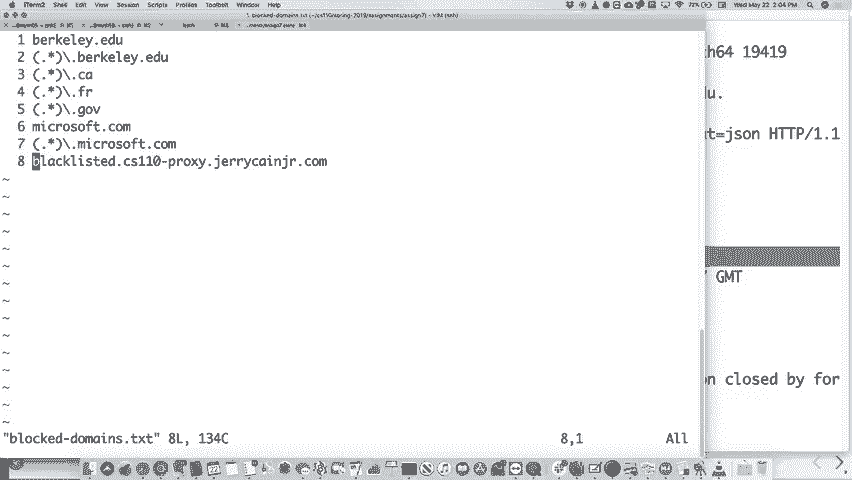
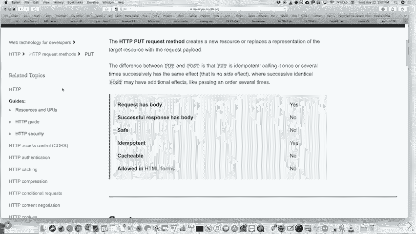

# P18：Lecture 17 Web Proxy - ___main___ - BV1ED4y1R7RJ

 Okay， let's get going even though not a ton of people here but we'll get going。 So。

 how's the assignment going？ Assignment， what is it， six？ How's that going？ Going right。

 yeah it's due tonight。 I will have offs hours today。

 right after class for an hour and an hour and 15 minutes。

 or so for anybody who wants to stop by and get some help with that。 And hopefully it's not too bad。

 Hopefully the thread pool is an interesting assignment。

 I mean it kind of has all the different parts to it。 You've got to have new Texas。

 you've got semaphores， you do have to probably have a conditional， condition variable， any in there。

 You don't， maybe you did it some other way but that's likely you'll need that。

 And there's various kind of nuances to that but that's a pretty robust class to be building。

 And so a good job for doing that。 There are two more assignments。

 We're now going to be on like a Thursday， Thursday schedule。

 The next assignment will be out tomorrow although technically you can go look at it right now。

 I'll show you the link in a minute。 And then it will be due next Thursday。

 The next one will come out Thursday due to the following Thursday which I think technically。

 is actually after class ends。 I'm not sure I'm allowed by school rules to actually have an assignment due after classes。

 end like I think that's like not allowed。 So I'll have to figure something out。

 Maybe I'll make it due Wednesday but then give everybody a free day until Thursday or。

 something like that。 I'm just skirting the rules a little bit but I do want to give you enough time。

 But I also understand that you've got finalists to study for and all that so I'll， we'll figure。

 something out in that regard。 But so today， so we are mostly done with the new material for assignments。

 In fact we are pretty much all done with new material for assignments。

 We have one more topic which is non-blocking I/O which is basically I/O that doesn't block。

 when you say accept and so forth。 And there's reasons we might want to use that。

 We will talk about that on the last day of class， maybe the previous day as well。

 After today we actually have three more lectures right。 Next one， Monday's a holiday。 Yay。

 more of that。 Next， next Wednesday is lecture and then the following Monday Wednesday。

 But really there's no new stuff that's going to be on assignments。 The I/O。

 non-blocking I/O I might ask some very high level questions about it on the final。

 but that would be about it。 So we've basically gotten through all the stuff for the quarter。

 We do have， next week we will talk a little bit more about what we're going to start today。

 and then which is about your next assignment actually。 And then we will also do a little like， hey。

 here's the big picture of 110 and all the， different things you should have learned in a big picture sense。

 So that's really all we've got going。 Today I wanted to give you a relatively deep dive into the assignment that you're going。

 to start tomorrow。 Why am I doing that？ I think it's an assignment that you will enjoy but you've got to wrap your head around。

 it and wrapping your head around it takes some time。

 Not like the other ones did but this one definitely takes some time to get your head。

 wrapped around。 So we're going to take most of the class to go over。

 depending on how many questions， are I guess， about to go over the assignment starting tomorrow and then I will introduce。

 the topic that we will have for the final assignment。

 It's called Napper-Duce and it kind of ties everything together。

 You've got to use all the different parts of the things you know to do the final assignment。

 So tomorrow's assignment is a web proxy。 So here's what a web proxy。 You can go by the way。

 you can go here and download the actual assignment if you go and。

 let's see if I can click on it now。 Let's see if we go here and download it。

 That should be the assignment。 Now you can't， we don't have the， I will。

 small morning I will push out the actual repos， but feel free if you are not working on the current assignment still。

 To go and read through this it's a relatively long document as you can tell。 It's not too bad。

 We're going to go through it right now。 So there we go。

 I will go back here and here's what it is all about。

 What is a web proxy？ Well， a web proxy is a server that sits between your web browser and some web page that you。

 want。 What you can do is you can， I will show you how to do this today。

 You can set up your web browser to use a proxy server whenever it requests websites。

 So instead of going to the actual website and requesting it， it goes to your web server。

 and makes the exact request and your web proxy makes the request and then the web proxy forwards。

 that on to the actual web page or web server you're looking for gets the result back and。

 then forwards it back to you。 Now why would we care about doing that？ Well。

 there's a lot of reasons you might want to use a proxy。

 You might want to block access to certain websites。

 This is kind of like a firewall sort of thing if you want to think of it that way。 But basically。

 maybe you want to put a proxy up because you don't want， if you run a company。

 you don't want to already go into Facebook。com during the work day or something， draconian。

 like that or whatever。 But maybe you do that。 Maybe you're a parent and you don't want your kids going to certain websites that will。

 remain unnamed， et cetera。 But that would be one reason to have a proxy。 You set that up。

 the browser goes to that and so forth。 And by the way， if you ever have kids。

 they will be able to get around whatever proxy you， put it in place。

 So don't think it's like some sort of full solution。

 This is why only you should own the password to your router。 That's what it is。 But anyway。

 so that's one thing you might do。 You might want to block access to certain documents。 I mean。

 let's say you have some giant document。 If you're on a plane。

 they always have you go through a web proxy such that you can't。

 download like YouTube document or you can't watch YouTube or whatever on the plane because。

 they have a very limited bandwidth because they're flying around with the sky。

 And then maybe certain types of files。 I don't know why I put zip files up there。

 but maybe they're too dangerous because they， can have viruses or something you want to make those block。

 Maybe you say， "I don't like Likstinstein and I don't want any web pages coming from。

 there for my whatever my thing is。"， Anybody from there？ Sorry if I said it。 Okay， probably not。

 There's only 30， 40，000 of you in them anyway。 But anyway。

 I didn't even know if they have websites there。 Probably a little bit。

 They're like hosted in Likstinstein。 I bet they do。 You also might want to act。 Actually。

 I think an important reason you might want to use proxy of sorts。

 You want to act as an anonymizer to strip data from headers to strip what your real IP。

 address is and so forth。 How many people had heard of the Tor browser before or the onion routing before？

 A few people。 Okay， here's what that is。 That is partially a web proxy。

 partially kind of a thing that wraps everything in high， level encryption。 What it is。

 the Tor network is a network where it was put in place to allow people in countries。

 where they may be discouraged from using the internet or if they use the internet they。

 might be under like they might end up getting arrested and so forth。

 These people are hopefully not breaking the law。 They might be breaking the law in their country but hopefully they're doing good things in。

 the world and they might want to use the internet to talk， communicate with other people and not。

 necessarily give away their information and so forth。 Now。

 it certainly can be used on the so-called dark web for people who are doing malicious， things。

 Let's assume people are doing good things。 What it does is it has basically you go to a proxy server on this Tor network and it takes。

 your request and it encrypts it， well you probably first encrypt it but it encrypts it。

 and then sends it on to another proxy server which encrypts it again， sends it to an ex。

 one which encrypts it again and all the way along the way it further anonymizes where。

 you came from and it's not a bad way to be able to do like use the internet without fear。

 of somebody being able to figure out who you are。 And so this is important in countries where there are people fighting a good fight who。

 otherwise might get trouble with their government or so forth。 It is not foolproof。

 A couple years ago some student at Harvard of all places actually sent a bomb request。

 a bomb threat into the school and said there's a bomb in this building and you've got to。

 take his final exam or whatever。 And so he sent this through the Tor network which anonymized his thing completely but。

 the police were pretty clever about that。 What they did was they said well we have the logs of who's using the internet at all on。

 campus at that time who was using the Tor network。

 And they found like two people using the Tor network and one was some graduate student who。

 was researching the Tor network and the other one was this kid in his dorm room who was。

 the one who did the bomb threat。 So they figured it out by using external data not knowing exactly what his IP address was。

 or whatever。 They just said well who was using this network。

 So be a little more careful than that if you're going to do silly things like that。

 Why else might you want to use a proxy？ Maybe you want to take images。

 certain images and do something interesting with them。

 One of my favorite things I found about oh man I was probably ten years ago at this point。

 is this thing called the upside down turnnet which is a web proxy and what it is is it's。

 a person who set up a proxy。 It was a person who had an open Wi-Fi network。

 Now this used to be a thing most Wi-Fi networks are now not open。

 They have passwords but it used to be most everybody had an open Wi-Fi networks and this。

 one guy realized that all his neighbors were stealing his Wi-Fi from being open。

 And so what he did was he set up a proxy on his computer。

 He basically set it up on his computer between his computer and the internet through the。

 router and then to his computer and the internet。

 And he basically was a couple little scripts and what it did was any image that came through。

 that got requested it just took the image flipped it over in an image program and then。

 served it to the user。 So whoever was browsing using his internet would look and get all these upside down images。

 which probably is annoying enough that you probably stop using the Wi-Fi thing。

 And then he said well let's be a little more even a little more diabolical about it。

 Besides the upside down he said you can actually make the blurry internet where instead of flipping。

 it it would just like moderately blur all the images so that it just kind of you kind of。

 stare something wrong with that image and you do it with all the images。

 So just a little bit blurry and he figured that would do the same have the same effect。

 You could also use it to and this guy does the exact same thing intercept all traffic。

 and just forward it somewhere else。 This happens when you go to the airport and you log on like there's a paywall and you。

 know you log on to any site and it immediately forwards you to some proxy that says please。

 pay for internet or agree to these terms and conditions or whatever。

 This person also had it so that it would just go straight to， he switched it every so often。

 it would go straight to where did it go where did it go。

 Maybe it's not there。 It would go straight to kittenwar。com。

 So anytime they were browsing or just go to kittenwar。com where I guess you decide between。

 QK and you can pick and choose whatever but that was that's you know that's what he did， too。

 So he reduced the number of people using his open network。

 And then he actually got a little note from the guy that owns kittenwar saying every so。

 often I get extremely irate to emails people claiming that like kittenwar。com is playing。

 host to some kind of virus and he says I just point them back to you and says probably。

 your thing and then he goes yeah prime I think。 So anyway that's another reason you might want to use a web proxy。

 If you want people to just look at kittens all day。

 Okay so oh and the other one this is the big one and this is in fact one that you will。

 be doing for your assignment。 You may want to cash the actual requests。

 Now a cash as we probably talked about before is just a local copy of whatever you've requested。

 So in this case the local copy is whatever data comes off the website that allows itself。

 to be cashed。 What kinds of things might be cashed？ The Google logo right。

 The Google logo is the same every single day。 I mean they change it so when they do the special days or whatever but the actual Google。

 logo itself doesn't change for years and years and years。

 Why would you go and request it from the website every single time you go to the website。

 Just keep a low copy and that eventually times out like over many days or months or whatever。

 But you don't need to go request it。 So if you have it locally you don't need to waste bandwidth going out to the internet。

 as a whole and getting it and that's important。 Now your browser already does a lot of that for you。

 Your browser keeps a cache of pages。 Sometimes you'll。

 it's really bad when they keep a cache and they're working on a website。

 and then you're changing things and it just never updates and you've got to figure out。

 how to manually update it。 For this assignment you will have a cache both in your browser because this is an assignment。

 you're actually using your browser and for the actual program you should clear the browser。

 data as frequently as you can。 Or at least as much as you do it frequently enough so that you don't get into the issue。

 of like wait it looks the same something must be wrong。 So that's that。

 Okay so the assignment itself well it requires you to use your browser and it does require。

 you to have your browser pointing to a particular computer mainly one of the myth machines。

 We suggest to use the Firefox browser mainly because we know that most of you don't normally。

 use Firefox and it's probably easiest to set up Firefox to do the proxy thing and then。

 just use your other browser to do all your regular browsing。

 I happen to be using Firefox for this presentation so I'll do a little bit of both right now。

 But what you do is actually will do it right now for the assignment。

 I'm going to show you how to do this。

 The first things first I'm going to one tenth spring assignment seven and then samples actually。

 let's just let's make the original here make this is the starter code right and the starter。

 code has a proxy there's a lot of files we'll talk about those files in a bit。

 The starter code has a proxy which is called proxy and it basically chooses a port that's。

 based on a hash of your user name so if you do if you do proxy and then somebody else。

 does proxy probably not going to overlap the port numbers and there's enough port numbers。

 to go around so it's probably okay if you find out that it's always if it's always using。

 the same port number somebody else has you can do it you can do a specific port number。

 if you want to。 Anyway this is now on what is this myth 64 listening on port 19 4 1 9 so if we go back。

 to Firefox and we go to preferences and in preferences we type in proxy down here and。

 then click on settings it will say a bunch of things it probably says no proxy if you。

 right now may say use system proxy settings you can set your global ones in your system。

 what you're going to do is set your manual pro you've seen I've done this before you。

 set your manual on to whatever server you have whatever myth you have in this case it's。

 myth 64 and then is it 19 4 or 9 it is because my name didn't hash differently from last。

 year or last quarter so anyway it's myth 64 port 19 1 4 1 9 you should also select the。

 use this proxy server for all protocols if you don't select that you can go to some websites。

 that bypass your proxy you think everything's working great and it's not because it's going。

 past your proxy so make sure you click on that and then when you do that if you try。

 to go to a website so let's go to let's try example。com it should say you're writing a。

 proxy right so I've got an example that kind of says you're writing proxy well that's all。

 it does so far basically intercepts your so for the starter code intercepts your request。

 and then feeds back a page that says you're writing proxy that's all it does right now。

 okay now it turns out that the way we've got this written it only works for HTTP websites。

 the way you guys are going to write this it is possible to do it for HTTPS sites which。

 is most sites these days so you kind of have to be a little careful that you don't go to。

 sites that aren't that are HTTPS and you'll get halfway through the assignment go why。

 isn't this working you remember oh that's an HTTPS site it will work for the starter code。

 because again the starter code just completely ignores anything about the request and feeds。

 this back so if I go to Google。com which is going to be an HTTPS oop maybe not maybe not。

 it's interesting let's see let's try example。com maybe I didn't set it up there okay that。

 one worked let's try let's try Stanford。com or Stanford AD yeah that one worked so HTTPS。

 maybe if you do HTTPS it won't work let's see no that's it so if you go to HTTPS it。

 probably will give you an error there so let me do this I'm going to keep the preferences。

 up so I can still do the websites proxy change this very so often every time I do this okay。

 no proxy right now okay so that's what it looks like when you run it oh you know what。

 I should do I should just run it with I should show you how to do it with the other let's。

 see what show you what happens with the regular one so if we go to samples slash proxy solution。

 okay it will say the same sort of thing and it'll be set up and then if we go to a website。

 like let's do let's do this let me make this let's do well I'll just go back and forth between。

 the page if we go to example。com example。com happens to be a page that allows it to be。

 allows it to be cached so if you go to the page that says allows to get this all looks。

 like there example domain your program is going to say okay to cash or response so cash。

 and response under the hash and there's a big long hash for six hundred four eight。

 hundred seconds so for a while okay so it's just going to cash that it's going to keep。

 it locally on your myth in the myth machine for you and then the next time you go to example。com。

 it's going to come back faster number one and it's not going to say anything again there。

 because it's already it's already cached it for you so if example。com did change your computer。

 wouldn't update that until it timed out sometime later okay many sites don't have have that。

 there is one let's see I got it in the I've got it in the actual let's see if this actually。

 continues to work without it seems like it will right now okay so there's not much going。

 on in the starter code but you get to change that you should just leave your settings and。

 then use a different browser generally for for for doing the other stuff okay if you want。

 you can use tell that instead if you want to don't bother you don't want to bother you。

 want to see more details about what's going on you can do that as well so let's try in。

 fact I'm going to do this one it is this is what I want to actually send I want to do。

 the whole get line there whoops when I do well there we go okay let's see we are on myth 64。

 right so if I go tell net and then myth 64 one port one nine four one nine it will allow。

 me to connect great and then if I type that get line IPFI is just a it tells you your IP。

 address it turns out and then you have to type host IPI guess it's www。ipi。org and then another。

 another let's see did that actually work no I think it didn't don't think it worked maybe。

 it wasn't because we did oh it's just API sorry let's try this again tell them by the。

 just doing it from my Mac I don't doesn't even need to be from another myth machine let's。

 do this again and then host host IPI IPI FYI。org and then not there we go that's what we're。

 looking for and it just sends back some JSON but you can see all the headers and things。

 that it sends back to and your program should be for should be capturing all of that data。

 through the through thing and I'll talk about some other things that has to be has to do。

 as well by the way this tells you that it's JSON that's getting sent back and remember。

 we talked about what JSON is there it's like that it basically tells you what your IP address。

 is for your computer or your local one is anyway that's how you can use telnet to also。

 do okay if you're off campus I mean some people said they're gonna be traveling or whatever。

 you're off campus you do need to log on to the Stanford VPN to use this is to do this because。

 you're gonna have to go directly to one of the myth machines you can't do that off campus。

 you can't go to a specific myth machine off campus okay so you're gonna need to log into。

 the VPN for that okay all right like I said you can use telnet you can do you can actually。

 do the actual samples one tells you it does exactly what yours should be doing in the。

 end okay so let's go through what the assignment is going to be actually doing you're going。

 to first there's four parts to this assignment first what you're going to do is a sequential。

 proxy okay eventually you will use thread pool not miss not yours unless you really want。

 to we've given you a working version not the use isn't working but we've given you a working。

 version that definitely works so you don't have to do more debugging on thread pool but。

 first you're gonna write sequential version and what it's going to do is you're gonna make。

 first thing you're gonna do is just make it into an actual proxy that intercepts the request。

 and just passes them onto the intended server and then gets the response and passes that back。

 to your browser okay you need to support three different types of HTTP requests we have seen get。

 before and get is one that basically tell just grabs the web page okay get by the way is not supposed。

 to have any side effects on the web server in other words you shouldn't pass data that the。

 web server is going to use to update its own state that's really not the way get your work。

 because often web browsers will make one two or more get requests for the same data for various。

 reasons and so in this case you don't want to you don't want to do send any data that the server。

 might need to make changes but that normally happens when you're doing web pages anyway you。

 also have to do a request called head this is a new one this one does exactly the same thing as。

 get except it only requests the only thing that you get back is the headers now why might you want。

 to do that well sometimes a website or a browser might request the head from a particular page。

 knowing that it's about to make an actual get request and it may need to set some things up。

 what you get back is how big the payload is going to be and whether it's going to be encrypted or not。

 and so forth so sometimes they'll do that you should support that the difference between get and head。

 is simply a matter of ignoring the payload or not or knowing that no payload for the head otherwise。

 you're going to do exactly the same thing so that's an easy one and then put is one where you have to。

 actually send data to the website put is relative it's almost the same thing except that after all。

 your headers you have payload that you're then sending to the to the actual server okay so you。

 have to capture the payload from the request and then forward to payload on to the next request or。

 to the server that requests it or that you're requesting from okay so far so good all right。

 then the request is going to look like this it's going to be gapped and then this is a we've seen。

 this number of times let's say you're going to Cornell better use research remember you need a。

 ctb 1。1 for any web pages you are sending back you can feel free to use hctb 1。0 it's not really。

 going to make a difference they're basically the same format but that's that's that when you do。

 that you forward the request to ww。coranel。edu okay and the request in that case because you're just。

 for you already know you're forwarding it to that server you just need to put the actual path in there。

 you don't need the actual full server you just say the the actual path i don't know that it matters。

 that you have if you have a path in there but that's the way it goes we've given you an hctb request。

 class so you don't have to build all of that okay you need to update the operator less than less。

 than to do some to do some input for that but it's not that much extra work in general the hctb。

 request is all set for you so you just basically feed it the information and then you get the。

 request you really should understand how a request got cc the file works because it's got a lot of。

 functions in there but you're going to want to use and i know you haven't seen these yet but we'll。

 talk about the actual files you're going to need soon okay all right so one thing you're going to have。

 to do in this first one is going to sign it's going to seem a little weird like what's the point but。

 we want you to take the headers that come in okay and we want you to add a header called x-forded。

 proto now remember the headers look like this okay if you look here the headers are all of。

 in this case we didn't have any headers but they would come after the get i think it actually。

 after the host line i believe they're just headers that kind of look like this。

 these are the response headers but they look kind of like this where they they have。

 information that is used by the server to like do stuff well the two headers that we want you to。

 add or add two are the x-forded proto which basically means that it's saying what protocol are we using。

 here and you're going to use just HTTPs it turns out it's a pretty straightforward you just add that。

 it's very easy to do and then you also and if it's already there you just add it again no big deal。

 there there's another one you have to do which is going to be really important later this is called。

 x-forded for this is basically four proxies to say who they forwarded the request from originally。

 right now if you're anonymizing things you're going to leave that blank but you're not going to。

 be doing that for this in this case it's basically a list of all the various prior places that this。

 request came from okay now why do i say there could be many of them eventually and we'll get to this。

 you could do a pre you could have a proxy chain who's to say that your proxy doesn't talk to another。

 proxy doesn't talk to another proxy doesn't talk to another proxy that's basically what the。

 Tor network is doing incidentally it's going one to run and then there's 17 things in between and you。

 have no idea how to get back to the original one which is kind of the point or there might be other。

 reasons to have a proxy talk to another proxy we'll get to those in a few minutes what you need to do。

 is if there's a header that comes in that says x-forded for it's going to be a comma-separated list of all。

 these IP addresses you need to add another comma and add the current IP address that you came from。

 and then re-put it like put it back into the request okay so you need to do that manually by the way。

 there's no fancy function that allows you to do that you have to do that um it's really pretty easy to。

 to use some of these request functions in this case you just request the header which we've given。

 you a whole function or a whole class that does has this as one of its methods get value or get。

 the sorry that's the basically the request the request handler class i believe it is and then。

 get value as string and use pass in the export of four it gives you back the string it's this comma。

 separate value so don't look at this go i have no idea how to get a request header it's it's pretty。

 straightforward straight from the actual code you just have to look through the code and find out。

 where those are okay like i said you have to manually enter that in um most of the code for this。

 sequential version is going to be in the request handler。

h file so let's look at that for a second okay， request handler。

h file let's do it over here in request handler。h okay so request handler。h well。

 it's got a bunch of functions in it public functions there's a constructor of course and then it has。

 service request clear the cache we'll talk about the cache soon and then set the maximum cache age。

 that's all that you're the program is going to use and then you've got some other functions in here。

 like handler get request you're going to want to also handle a put request and handle a head request。

 so you've got a couple more functions there and then you've got some other requests that you're。

 going to have to handle as well some of those we've actually built for you already so let's see。

 there we go handle handle request has already got a handle error in it and so forth。

 but otherwise you need to actually do most of your work under like let's see where's the get request。

 one here we go handle like there's one we're going to set up a get we're also going to set up a。

 put you're also going to set ahead etc and then let's see I think that's the only there it is down。

 here handle get request is the actual function we've done a little bit for you already so you can kind。

 of see that it actually look you set you get a rest each create a response you set the response。

 code to be whatever you want normally it's going to be 200 you set the protocol to be HTTP and then。

 in this case slash 1。0 and then the payload in this case was your running proxy and that's it and then。

 you push it out so pretty straightforward in terms of like the connections between the。

 the actual web and your proxy okay and your browser so that's that。

 after you've written this one test test test test on lots and lots and lots of HTTP sites。

 okay you can also test on HTTPS but most of the time you'll get that connection refused or whatever。

 or some other error if you can find HTTP sites what are good ones example。com is a good one。

 there's that IP if I won there's there's lots of others that are out there but just don't。

 don't be surprised like sometimes you'll go to an HTTP site and it will quickly turn it into an。

 HTTPS site you won't notice well it's broken look for the little lock if there's a lock up in the。

 corner it probably needs its HTTPS and you should try a different site so we will have we'll we can。

 put together a list of other sites that are okay all right now that's the first thing the second。

 thing you're going to do so as I said one of the proxy services that it may offer is this thing。

 called blacklisting and another one is called caching blacklisting basically means to block access。

 to certain websites okay so there is a blocked domains。txt file let's look at it it is let's see。

 already set up where really blocked domains。txt okay so you can't go to any Berkeley sites can't。

 go to any Canadian sites can't go to French sites it looks like no government sites I guess。

 I can't go to Microsoft。com although I think Microsoft is one of those ones that does everything HTTPS。

 anyway the good news is testing the block sites it doesn't actually have to go to the website so。

 it should block it immediately in fact let's test that oh no it hasn't been set up I'm gonna start。

 a cook but anyway these are the ones that you want to do Jerry Kane has one set up that should work。

 all the time I'll ask him if it's still set up it should be but that's those are sites that you。

 shouldn't be able to go to this uses regular expression matching to figure out which sites feel free to。

 remember if you took 103 already or go learn about regular expressions you do not have to know a。

 thing about it for this for this part the blacklist file program or blacklist functions are already。

 written for you but feel free to look at if you want to see what it looks like okay so if you。

 if the browser that's connecting to your proxy does go to a forbidden site or block site you actually。

 return a client status code or you return to the client status code 403 well let's look up what 403。

 actually is if we go here this there we go 403 forbidden okay this means that it it's telling。

 the actual browser that that's on forbidden site and most of the time your browser just reports。

 whatever the payload is but it knows that it's a forbidden site sometimes it may put up some other。

 pages oh my gosh this is forbidden but that's the the correct code when the site is not allowed to。

 be requested you may have seen that one before for other various things and you that means you。

 have to create your own request and send a response and send it back but it's exactly like what the。

 the temporary the one I showed you already was it's very easy to tell whether a server is allowed。

 using this blacklist function I mean I'm giving it to you right here if not blacklist。

server is allowed， all right we've written that function for you okay again what I don't mind you to do is get into。

 the reading this document go oh it sounds like I have to write like an entire like you know。

 part of it would take me months not that quite that bad little question no okay all right anything。

 so far on this blacklisting pretty straightforward don't let the user go to that site this person。

 but yes like the information that you're trying to put like what problem is it was。

 time now like just a payload and I'm sure we'll go back yeah let's look up what a put request looks。

 like right so let's do it here uh put oops see if this works there we go that should work there。

 put requests okay put request versus a post request uh put here we go we'll go to this site here。

 a pull request creates a new resource resource on the target。

 it's just been put in post the post is identity calling it once several times the same effect okay。

 it basically says here's a bunch of here's the request here's a bunch of headers there's a new。

 line after the headers after that everything until the end of the file is dated that's all there is to。

 it you generally put how much the payload how many bytes the payload is and so forth the good news is。

 you don't have to worry about that so much for the assignment and you just have to know that there。

 will be a payload that you do need to forward otherwise you don't need no any details about it。

 you won't have to create any put requests yourself but basically it's just a request that sends data。

 to the client or to that web server and that's it all right any other questions good question。

 anybody else okay so that's the web proxy okay cashing on the other hand is this idea that I。

 mentioned earlier it's keeping a local copy of a page so that you don't re-request it from the。

 internet all right that saves time it saves bandwidth many times proxies are local to like an。

 organization and if lots of people in the organization happen to go into the same web pages and you。

 have a cache of them well it's right there locally you don't need to go like lots of your benefit from。

 having that having that cache okay in this case you are going to have to do a few things for this。

 you're going to have to update the hctb request handler to check and see if you've already got。

 the cache copied I mean that's basically the first thing you're going to do is you're going to look。

 here's the request do I already have it in my cache if I have it in my cache I'm going to just。

 forward back the cache response and be done I never even touch the site that it's trying to request from。

 okay and that's kind of nice all right now are you going to do that for things like put requests no。

 you can't do that for put because you have to send data to the actual websites there's no way to。

 cache something that's going to be put so it's absolutely only going to be either head or get。

 requests that are cached and we've already built most of the logic behind whether it's figuring out。

 whether or not this is cached for you so you're not even going to worry too much about that there。

 is an hctb cache class which you should look at and understand you'll have to make very minor。

 change to that when you get to multi-threading but that's that's the only real change you're。

 going to have to make is when you do this as a multi-threaded program you're going to forward。

 as usual if it's not in the cache when you get the response the response will tell you whether or。

 not it can be cached so in other words you record make the request and it comes back and the page。

 itself in the headers says oh yeah you can catch this okay let's actually test this。

 i have a let's see if i can do this there we are i have a website let me make sure i get it right。

 that i'll let you use to test on here as well if we tell that to ecosimulation。com 80 and i do get。

 and then what is it it is cgi whoops oh no oh no this is really so i forgot my browser's garage。

 really fast i have to write this first and then paste it in so cgi has been uh it is。

 let me look hang on ecosim i forgot the name of the pages here uh okay cgi public html cgi。

 it is called current time dot php okay so we are going to do a request for we're going to say get。

 slash cgi been slash current time dot dot php and then h and then http1 slash 1。1 okay we're。

 gonna put paste that in there and let's see if i can type the hosting fast enough let's see tell。

 that okay let's try that and then host， did i get it oh what did i forget um。

 did i forget something else that should get cgi i don't know why he's not doing that well。

 we'll look at it in the browser um but what it's going to do is it sends back like the ability to。

 be cached okay i'll test it in a little bit i'll test it again um but basically it's going to say。

 that and then you need to determine oh if it's cached i'd better put it in the catch okay and then。

 later tell me your request the page again you can do it let me show you what this looks like for。

 the actual uh let me show you what it looks like for the site that i was just trying to go to。

 uh let's see eco simulation dot com slash cgi been slash current time dot php there we go okay。

 so that's what it looks like um what it is i just put up a little page that tells you what the。

 current time is now it's got the uh date and the hour minute and seconds if i refresh this right。

 the browser doesn't actually cache it as it turns out um or rather the the original proxy server。

 doesn't actually cache it let's see if this is still set up uh no group the rope i think it's still set。

 up meaning that hang on preferences maybe it didn't actually set that up let's see。

 there we go okay so now we've got the proxy server going uh if we do the let's see samples。

 slash proxy solution there we go okay and then now we request this from the proxy server there it。

 is now that's it right if i rec and let's look at what it did it said it cast the response and it's。

 going to cache it for 3600 seconds so for the next hour it's going to request that website。

 and it's always i'm repeating the refreshing here and it's always going to the same time。

 because it's been cached okay this is not something you want for pages like this because this is a page。

 that's generated uh dynamically okay and many web pages are generated dynamically on the web。

 if you go to facebook。com your timeline is updated all the time right you got ads flashing up and。

 whatever it's all being regenerated um every time you refresh or scroll or whatever that's dynamic。

 content the only content that can be cached is static content which should be things like images。

 and things that aren't going to change so in this case that's it now what if this happens to you and。

 you've cached something that shouldn't be cached okay by the way every time i refresh it it says。

 using cached copy because it knows to go and use the cached copy there what you can do is you can say。

 dash dash clear cache and then it will clear the cache by deleting all these files it keeps the files。

 in a hidden directory in your program in your assignment file i don't know why we hit it but i。

 guess that's the way it goes and then now when i refresh it it should go back and there it is now。

 updated to there of course it's not being cached again so it'll update won't uh won't do that again。

 so that's uh that's that okay let me go back here again so i can do that questions i'm caching and。

 what you have to what the basic idea is no questions on the basic idea for that okay。

 all right it is that's those are the things you have to do for that um and feel free to use this test。

 to make sure that your thing is caching right go and refresh a bunch of times go oh it's the same。

 time every time so it makes sure you're caching yeah so when you're caching something you can't。

 pass the web page right yes so good question you can cast parts of a web site i would say。

 yeah um so the here's the thing when you go when you run this and you go to some website it will。

 actually request hundreds and hundreds of web pages web actual web page in some sense um if we。

 let's see i kind of think let's do it this way we still have to set up uh let's see if we。

 set it up for let's make go back to the proxies for a second i'm going to set it up there and then。

 let's see how am i going oh yeah if i go to okay so now there's what we have there let me let me make。

 the web page a little smaller so you can at least see the scrolling that might happen here okay if i。

 go to let's say time。com which i don't think it there we go see all the web pages that it's getting。

 and if you can see it's still getting lots and lots and lots of web pages right time。com is another。

 good way to test because it's not HTTPS except for probably the ads or something some parts it。

 might be but you get lots and lots so look at how many web look at how many different pages it requested。

 just from time。com right and it still has me in finished loading why because it goes and requests。

 the main one and the main one says oh here's another image here's a uh an ad here's another sub i frame。

 page and so forth so that's what happens there so good question yeah。

 yeah so it is so the the question was does the cache persist beyond your running it yes it's。

 the files on the actual thing so if we look ls-a-l-d dot let's see let's uh where's here ls-a-l-s-a。

 there we go okay uh it should be oh you know what i believe it's in your it's not in here i think。

 it's in your main uh let's see if it's there is there is dot proxy cache myth 64 if we go into that。

 that's in your home folder dot proxy cast myth 64 then in there there's all the sites so there's。

 all the requests that it saves so all the time dot com requests are right in there and that hash。

 will become important in a couple minutes okay i've become really important in a minute i don't。

 know what form this is in let's just look 7 7 2 8 oop that's a directory let's say cd 7 7 2 8。

 in there created that's binary of some sort or maybe it's some other maybe it's an image probably。

 an image so we can do that right so um you know how you'd figure out if it was an image you'd look。

 at the hex for it you'd go something like hex dump and then the name and then you'd oops not hex。

 dump hex what is it hex what is hex dump hmm oh hex hex dump there we go hex dump and then the name。

 and there you go and then you could look and see at the beginning of the file oh the beginning of the。

 file so many files that are binary actually have like 5 4 4 8 possibly means like it's a particular。

 type of file like the png file or some other thing so you can do a little bit of investigation if you。

 want to figure that out but anyway that's the point um and i'm not sure exactly how to say。

 our store but that that's where it is anyway okay all right so let's go to that was time。com。

 which is a good one to test because it still remains only http let's see did i get rid of。

 those settings here yes i did proxy and then let's make it no proxy again and there we go okay。

 all right so you need to do that for the caching basically check if it's in the cache if it is for。

 the data on or forward it back for your local copy if it's not there request it when it comes back。

 say oh this does can this go in the cache pretty much cash and a story for that okay that is version。

 two version three is now adding concurrency you have built a thread pool and using a thread pool。

 as you found out is not actually that difficult the hard part is knowing when to do all of the。

 mutexes and things when you're using the thread pool right because now what we've got we've got。

 multiple threads that are going to handle multiple webpage requests you're actually going to limit。

 it to 64 threads your thread pool is going to have 64 threads at once and you'll be building this。

 thing called a scheduler to actually handle those now the scheduler basically is the first in first。

 out kind of basically the first in first out queue that's going to go into those into the thread pool。

 and so you're going to you're going to have to build that it's not too much code actually and。

 as it turns out you're going to have to do that it will be very very simple as it turns out when I。

 say it's not much code your scheduler class is going to have like one line that does calls an HTTP。

 request handler which you've already built right and that already has an HTTP blacklist and an HTTP。

 cache already built for you don't go and try to reinvent things just make just say okay I am going。

 to use one HTTP request handler but what I'm going to need to do is I'm going to need to。

 update that handler to be thread safe which means that there's certain things like oh maybe the cash。

 needs to be thread safe maybe the the blacklist is it turns out doesn't it's already never changes。

 so it doesn't need to be nothing needs to change for that but you should you should do that here's the。

 the big thing about this you'll do need to add synchronization directives to the other code that。

 you've written this may mean that you have to change like function signatures and things that's。

 actually okay you change functions even though I don't know if any of the public ones will need it but。

 you can change function signatures to add functionality for this um you're only allowed to have one。

 request open for a given request in other words let's say that two thread let's say that two。

 threads both requests some some jpeg from time。com at the exact same time only one of them is allowed。

 to proceed okay well how might you support only one of them proceeding so before or probably a mutex。

 in this case just because you're only live one so in this case you need to lock around the actual。

 request for that so yeah so you're just going to have that now what you don't want to do is。

 lock around the entire well it's basically because of the cache it turns out you don't want to lock。

 around the entire cache um that would be really slow in other words while you're doing the request。

 or while you're updating the cache or whatever every thread is going to say no I can't update the cache。

 here's the nice thing about the cache it is thread safe if you're trying to add things to the cache。

 from two different sites okay it just does local files that have different names associated with。

 them as it turns out so you can have two different sites doing adding to the cache at the same time。

 it's actually okay you can have as many reading from the cache at the same time as you want you just。

 can't have two of the exact same site writing to the cache at the same time so this is the reason。

 that you're not going to your point allow two requests to go out to the same page number one it seems a。

 little crazy to do that anyway because you're already requesting it you might as well have the。

 cached copy and then just sort it for the next one but that's what you're going to do you have a question。

 yeah so good question the question is way way way I don't get it how is it not an issue if there。

 are multiple threads reading and writing well it turns out that the way the cache is built it just。

 it doesn't have any internal state it's not like it's updating anything internal it's strictly opening。

 and closing files in that folder I showed you and those files are distinct so it doesn't matter if。

 two things are doing at the same time they both can be two different threads can both be calling。

 that function and they will be doing different files as long as you aren't requesting doing the。

 same request if they're on the same request they're they're gonna overlap and they're gonna try to。

 try to they're gonna get mucked up in that that way so that's the reason so it's mostly thread safe。

 except for the same request so you do need to have a mutex around that which again it's a reason you。

 don't want to have a mutex around the entire cache all the time only when you are um you you。

 only need to do it for that that amount of time where you are uh when you are doing the actual let's。

 see I think it's the the I guess it's the actual updating of it or rather the reading if it's in there。

 or not I think that's really the only thing you're gonna really need to do so it's it's relatively low。

 level but you are going to have you do want to have different requests able to go at the same time。

 so how are we going to ask you to do that you are going to have an array of 997 mutexes。

 and i've already seen some people going there's going to be guys going what are you talking about。

 and i put it right here what are we talking about while we have 997 mutex okay here's how this is。

 going to work every time you request a site you are going to hash the actual request okay you're。

 going to take the request and you're going to hash it now it turns out that we built a hash hashing。

 function for you that takes a request and returns to you a hash for that request remember how over in。

 the other thing here you saw let's see if we do whoops if we go back here and do that remember how。

 that those numbers there that's the hash that actually comes out of so let's see there we go those。

 are all the hashes that come out of the hashing function and it uses that hash as the file name。

 as it turns out for the folder that the information is going to go into the payload so it's going to。

 use that anyway your job is to say okay if we have a particular request we're going to call this hash。

 request as string function like if i pen just turn black i don't know um that's all right we're。

 going to return return that and it's going to see if i can do this let's see pages is it no no no。

 hang on use pen pages shrink uh not worth it i guess we're dealing with red right now or black um so。

 it's going to uh it's going to get the hash and then you're going to have one of those mutexes those。

 nine hundred and seven mutexes based on that uh that hash modded by nine hundred and ninety seven。

 that's the hash you're going to use for the actual hash or for the mutex okay let me explain that in a。

 little more detail uh here's what you're going here's what you are going to do you're going to have。

 these nine hundred ninety seven mutexes and you're going to say okay every time i get a never double。

 page i'm going to use a different mutex for that page the only time they will overlap most of the。

 time is if it's the same request because that's the odds are very slim that two different requests will。

 have the same hash out of those nine hundred and ninety seven might be the case that's just something。

 you have to do it otherwise you're going to use that lock at that point to say i'm locked now based on。

 that hash if you have two hash requests coming or requests coming into the exact same time that。

 are for the same site they're going to both hash to the same value they're going to both end up with。

 the same mutex therefore you're going to use the lock for those two identical sites that's what we're。

 doing now the question is why is it nine hundred ninety seven anybody know anything about that number。

 it's prime yeah hashing works best when you do mod with a prime number so it actually kind of。

 scrambles it up even more than it would otherwise that's the way it goes so questions on that people。

 no no no you got the good question you have to determine between a collision in the same site。

 if it collides you just deal with it go well you know what it's going to be a little slower because。

 that collision the collision will happen very infrequently so you don't need to worry about that。

 and this is not you know if you wanted to you could pick a bigger prime number and even less。

 likely than that but the odds are pretty good that even if you're making memory you only have 64。

 things going at a time so the odds of those 64 have a collision it's a little bit of a birthday problem。

 issue but it's not the biggest deal in the world and even if it happens it's not even you're not even。

 noticing i mean you won't notice it anyway but you won't notice it all yes。

 oh sure sure you could have this a different hash in the same remainder yeah absolutely but。

 the hashes are notice how long the hash is either like you know 60 bits or 15 or 20 number uh digits。

 long right that's a giant number and they're going to hash into the same they're going to hash。

 somewhere in that bucket of 997 that array of 997 buckets sure but the odds are slim because you've。

 got a one out of 90 well you've got a birthday problem number of you know percentage wise。

 chance that it actually two very different numbers hash to the same bucket basically one out of 997。

 per uh two two that are going at the same time yeah that makes sense so we don't need to deal with。

 don't need to deal with any collisions because it will matter anyway um it the the uh the。

 you still will get an in you still will get an individual hash which is different you just will。

 only have 997 mutexes deal with and the mutex is only slowing it down it's only saying look you。

 can't go while i'm here and it's forgetting very short amount of time anyway but not not too big of a deal。

 when you're accessing the cache they should you should lock around in that case um again if you if you。

 i guess let's see how should i put this you yeah the question is why do you even need it if。

 it's thread safe to begin with i'm gonna look i'm gonna look look into it a little more detail i don't。

 want to give you the wrong answer on that but the basic idea is yeah just while you're accessing that。

 cache for that particular website lock around it and it's not really that you're locking because of the。

 access you're simply locking because two sites might have the same trying to try and access the。

 same files so that's really all you're doing you're not really locking you are locking around your。

 cache accesses but it's only it's only when you're doing that request that might be the same as some。

 other request that's the only reason yeah so it has nothing to do with the cash being thread safe or。

 not it has to do with the fact that if you're you are the same web if you are doing the same request。

 then it's not safe so you have to lock in that case right yeah the question is shouldn't we just。

 be locking around one particular thing well remember we've said that you're not allowed to make a。

 request to the same site at the same time so you do need to lock around the entire request in that。

 case like the entire setup for that request because you want to make it so that if two browser tabs。

 or whatever go to the same ask for the same page at the same time one of them fully completes before。

 the other one goes you need to lock around that whole section but again it's one 997 different locks。

 so it's going to be unlikely to have too much of a problem good question how's anything else do you。

 have your help okay all right good question and this i think is one of the trickier parts of the。

 assignment okay uh version four there is one more thing you're going to have to do for this assignment。

 the final thing you're going to do is this thing called proxy chaining and i mentioned that earlier。

 proxy chaining is where you have your proxy goes to another proxy goes to another proxy goes to。

 another proxy let me demonstrate for that that for you okay if we go and set up our proxy again。

 so we're setting up the proxy to be manual proxy for myth 64 let's say that i let's see where was i。

 here uh one ten uh let's see spring assignments assignment seven okay if we do let's do this let's。

 do farm uh or not farm we will use farm in them in a little bit again different farm it turns out。

 in this case we're going to do sample or sample slash proxy solution and we are going to。

 tell it let's see how we do this we tell it how to uh there we go we say dash dash proxy server。

 and let's actually do we'll do exactly this one uh see we'll do dash in there dash in there dash。

 dash proxy server so this is what now we've said okay if our browser goes to our proxy and makes a。

 request it will not forward it on to the requested website it will forward it on to some other。

 proxy that we are about to set up so i have told it that i'm sending this up on myth 63。

 who i probably did this in my office so maybe it won't work well we'll see ssh myth 63。

 okay yes i'm gonna do that okay say this one ten， ten and spring assignments assignment seven sample slash proxy solution and in this case we want。

 port one two three four five oh here we go it is working okay so now it's going to be one two three。

 or five so when i make a request to my other original myth 64 one it should forward the request。

 on to myth 63 okay if all goes well let's try this let's say time。com and let's see what happens。

 okay it's loading there we go so notice the original request is going here there's some other weirdness。

 going on here the clock socket it's probably time being annoying and over here it's going to the。

 other proxy server and then it's forwarding back and forth so it'll change our process okay if we go to。

 uh let's see if we go to our current time one okay there's the current time it actually。

 cached it i think it actually cached it in both as it turns out because both proxies wanted to come。

 back as a cache that's okay but if we go and do one more time it actually you couldn't see let's。

 clear this and let's see if it does it again if we do it there there we go it only cached it in the。

 first one because it had it locally never needed to go to the proxy the second proxy there so that's。

 one of the nice things about caching you didn't need to go to the other proxy the other ones there。

 now what's the trick to doing this well let me show you。

 settings no proxy okay all right so you can have as many proxies as you want in a row right you。

 should be able to handle as many as happen now each individual proxy could really care less how。

 many prior proxies it came from or how many it goes to except in one case you don't want to be。

 able to create a cycle of proxies what if i was a proxy going to darick and darick was a proxy。

 coming back to me well we would go back and forth all day and we'd just make millions and millions of。

 requests and that would like we just all be waiting to really start timing out and this and that。

 because there if there was no cycle detection right so what we need to do is you need to do that now。

 remember about ten slides ago and when i said there's this thing called x forwarded for。

 and where did it say it said where the request came from and you add your next request onto it。

 well guess what you're gonna if you come from a proxy you're gonna add add that proxies。

 IP address onto this list which is going to end up going to the next proxy if you look through that。

 list and find out that there's a cycle going on in other words the place you're about to send to。

 is one that's already in the list you have to return an error message because you don't want to。

 create the cycle the error message we happen to want to you to send back is 504 which is gateway。

 timeout and it says the server while acting as a gateway or proxy did not receive a timely response。

 that's about the best you can do the error message it turns out the best you can do for。

 this sort of issue okay please say it didn't work because there was this cycle。

 it does go through the proxy again good question question is if you if you have a proxy set up。

 here i'll draw it out for you know i'm up because this isn't wrong let's see。

 of course i'm sorry um the uh if you have a proxy that makes a request to another proxy。

 it's expecting your request back from that or the response back from that proxy that proxy might。

 have its own proxy that's going to it's your expecting your request back so the chain goes。

 down the line bing bing bing gets the real website it responds to the last proxy response。

 to the second last proxy responses to the next last proxy all the way back to you so that's the。

 whole chain it's kind of slow it's not fast oh it's not a cycle because there's no request that comes。

 back to the one that's already been requested from remember here's the cycle okay i request。

 the site from so i'm gonna so let's say my browser requests time。com and it comes to me as a proxy。

 as my proxy i go to Elizabeth and Elizabeth says uh she's going to respond i'm expecting a response。

 from her she goes to Derek etc and then Derek goes to time okay and then the response comes back to。

 Derek from time from Derek goes back to Elizabeth from Elizabeth goes back to me no cycle if however。

 Derek had a proxy set up that was going to come back to me then it would go browser to me to Elizabeth。

 Derek to me to Elizabeth's Derek to me it was never good time。

com and that would be a cycle but you can， figure that out because when the request comes from time to me i tag on time to the x4 to 4 and。

 then i pass it on to Elizabeth and Elizabeth tags my ip onto the x4 to 4 and then goes to Derek and。

 Derek tags hers onto the x4 to 4 and then time gets it respond response following it comes back that way。

 so it won't uh the response doesn't need to go i mean can go back to the actually goes back to。

 whoever responded but the cycle happens when you're doing the request that makes sense okay good too。

 if you would you would not check if your own ip is in there you would check if the request the。

 the proxy that you're about to send to is in there already right because then if it is then you go oh。

 well i can't i shouldn't be sent and do another proxy good question yeah。

 when you have more than one proxy which which one uses the cache data oh good question i don't。

 know if you noticed that both of them happen to use the cache because you remember you don't know。

 that there's a proxy and you know you're forwarding onto a proxy but you don't necessarily know if it。

 has a cache or not so every time you get that response your local decision is do i make it a。

 cache or not and i did if it needs to be and then the one previous says oh do i need to make it does。

 so it would get cash along each section now in real life this is not necessarily going to happen。

 either one is going to catch it or there's going to be some other things going on but maybe they。

 all locally catch it who knows you know so but good question all right so we actually have a。

 program called run proxy farm that you can actually use to to actually check and soups to check and run。

 make a little proxy proxy chain through all the remit machines or whatever and it uh and you can。

 test it out that way what it doesn't test for and this is kind of the most important thing but it。

 doesn't test for cycles you if you wanted to you could dig into the code for the python program。

 would give you and just write it so that it checks for cycles or does some cycle creation is really。

 what it is it should be it's not too hard to update but um you would have to do that so that's that。

 so that is the assignment now it took a while to explain it but now you should have a good。

 idea when you get to it tomorrow or whenever you start doing it i would start doing it sooner than。

 later um you will get to it uh one step at a time okay if you do want to support https it turns out。

 you have to support this other header or method called connect um we don't expect you to do that。

 nor do we uh we can give you some hints on how to do that so if you wanted to do that if you had extra。

 time and said oh i'd like to work for https then feel free to ask and we'll give you details about。

 what you need to do to make connect work um but i would only do that at the end and you don't have。

 to test as often as you can clear your caches both in the browser and locally in the cache。

 and then um that's that the files here's the various files you're going to have to make changes to um。

 very minor changes to cache the cache files very minor changes to the proxy file somewhat minor but。

 less like decent changes to request as you see across the age uh this is where you're going to do。

 most of the work request handler very minor uh minor in the scheduler uh things as well so。

 again there's a lot of files you have to touch minor changes in most of them okay all right。

 question um so you can have you can create more than one proxy for computer you can create one。

 one more than proxy computer every port could have different proxy items okay yeah and in fact when。

 you guys are all running it we might have 25 people and he's mitt doing 25 different servers。

 if they if they like cache the same way uh from a site the cache is locally your own home folder。

 so nobody else's cache is yeah there's no oh boy that would make it a really hard assignment everybody。

 else gets to cache the stuff too and you have to get good luck doing that kind of debugging but no。

 it's your local copy so it is based in the folder is based off the local。

 in your own home folder hidden by hidden folder good question all right and now that we've talked。

 about that you now know a little bit more about proxies too and now you're gonna go you're gonna。

 go start building one uh tomorrow or Friday all right so in the last couple minutes i'm gonna briefly。

 talk about the next assignment just in this in the big global picture and then next Wednesday。

 i will go much more detail about it okay in a similar kind of like here's the things you have。

 to think about okay so the last assignment is this algorithm called map reduce and map reduce is a。

 very cool uh algorithm that is a distributed algorithm i believe it was first um it was first。

 invented or at least used widely at google um what it is it's a parallel okay it's a let's see。

 it's a parallel no i got the brother cursor back but no there you go it's distributed okay it's。

 distributed meaning that it is across many myth computers okay so your program will actually run。

 on many myth computers uh it is uh and it's used to generate and process large data sets okay。

 what does that mean it means that you've got this data set that you need to do a lot of analysis with。

 and you want to utilize many different servers to do that this is a huge issue for companies like。

 google or facebook or apple or companies that have lots and lots of data that they're chugging。

 through every day they have billions of things to do and they have tens of thousands of servers。

 you have to farm them out across all these servers and do this there are two basic parts to map reduce。

 there's the map stage and there's the reduce stage those are the those are the problem specific things。

 okay the map stage says i need to take this data farm it out to all these servers and process。

 it in some way okay and it gets processed on all those servers and i'll show you an example in a。

 minute or maybe i'm next wednesday it processes in a certain way and then it sorts it all and that's。

 not the part of the map part but that's that's kind of part of that thing but it's not it happens in。

 all of it you always have to do some sorting back down here it shows that you've got a mapper。

 you've got some intermediate data you take that intermediate data you always sort it in some way or。

 another and you only group it by these keys and i'll show you an example and then you have a reduce。

 phase which says okay now that all that data is out there i need to go collect all that data in a。

 regulated way so that i can get it back and collate it into one giant result okay so you're sending the。

 data out you're mapping it out to all these different servers that are going to chug away and do。

 whatever is necessary for it then you're going to sort it and process it by these sorting and grouping。

 by the key that will come along with it and then you're going to reduce it by bringing it back to。

 the main computer and having the final data set that's what map reduce is all about okay so what is the。

 what are the details yes what's the difference between group by key and reduce well you'll see。

 when you do it but group by key basically is local you are saying all for my local copy all these。

 keys are the same and you'll see the example and you'll go oh i get it and then the reducing is taking。

 all those different farm-bound versions bringing them all back and further combining them together。

 okay you'll see how it works and and that's it and so it requires networking it requires。

 it requires threading in terms of getting the the main server has to do the threads to get。

 everything out to all the things it requires um i require multi processing i guess it does。

 and it requires multi processing and then you're going to run multiple programs on there kind of。

 ties everything together that we've been doing all quarter okay all right here's the example and i'm。

 only going to show this and then i'm going to let you go and then we'll finish this up next Wednesday。

 the example is um you basically have a uh a file let's say a document that's a book that has these。

 words in it and what it's going to do is it's going to the script here it's going to read in an input file。

 and output it for every word it's going to say word and then one meaning there's one word that。

 it's associated with it now why do you have to do it you don't necessarily have to have that one but。

 we're going to in this case we're going to do that because it's going to be generic in this way we're。

 going to say uh it's going to output the word and then it's going to be one so at the end of this。

 little script you're going to have all the words in this document there's going to be many overlaps。

 and they're all going to say word one the next word one the next word one you're going to have lots。

 of duplicates okay after that you are going to then do the sorting and collating phase that we'll get。

 to next Wednesday okay all right so we'll get back to we'll talk a lot more about MapReduce when we get。

 when we come back next Wednesday in the meantime i am going to the office now for some off-sars if you。

 want to come by it's actually 219 i think is where it's going to be and we'll see you guys in lab or next week。

