# 🕸️ 课程 P18：第17讲 网络代理

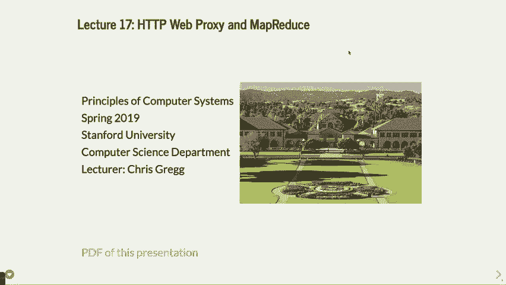


在本节课中，我们将要学习网络代理的基本概念、工作原理以及如何实现一个具备缓存、黑名单和代理链功能的网络代理服务器。课程内容将围绕一个具体的编程作业展开，帮助你理解代理服务器在客户端和真实服务器之间扮演的中介角色。

## 概述

网络代理是一个位于网页浏览器和目标网站之间的服务器。浏览器不直接请求目标网站，而是将请求发送给代理服务器，由代理服务器转发请求并返回响应。使用代理有多种原因，例如屏蔽特定网站、缓存内容以节省带宽、匿名化请求或修改传输的数据（如翻转图片）。


## 什么是网页代理？

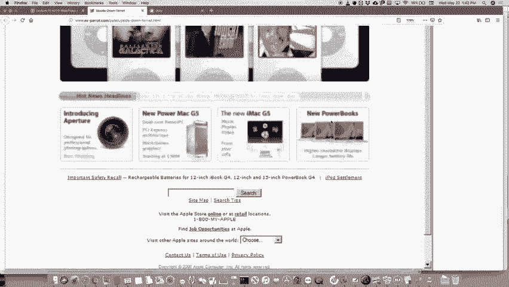

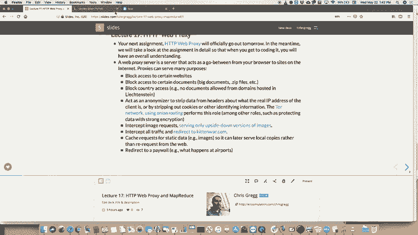


网页代理充当浏览器与互联网之间的中介。当浏览器配置使用代理后，其所有网页请求都将首先发送到代理服务器。


以下是使用代理的几个常见原因：
*   **访问控制**：阻止对特定域名（如社交媒体或特定国家网站）的访问。
*   **内容过滤**：阻止特定类型文件（如大型视频或压缩包）的下载。
*   **匿名化**：隐藏客户端的真实IP地址，增强隐私保护（例如Tor网络）。
*   **内容修改**：在传输过程中修改网页内容，例如翻转所有图片。
*   **缓存**：存储经常访问的网页副本，减少重复请求的带宽消耗和延迟。

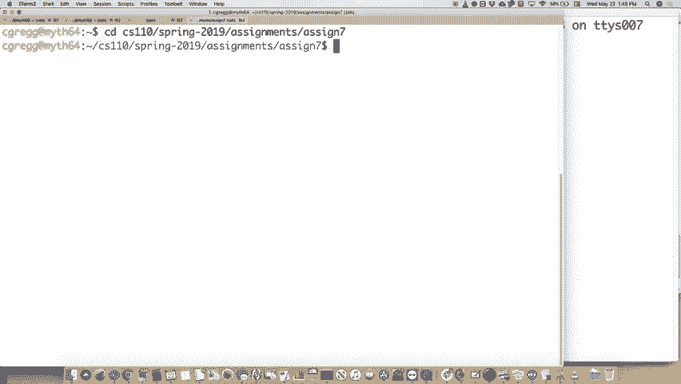

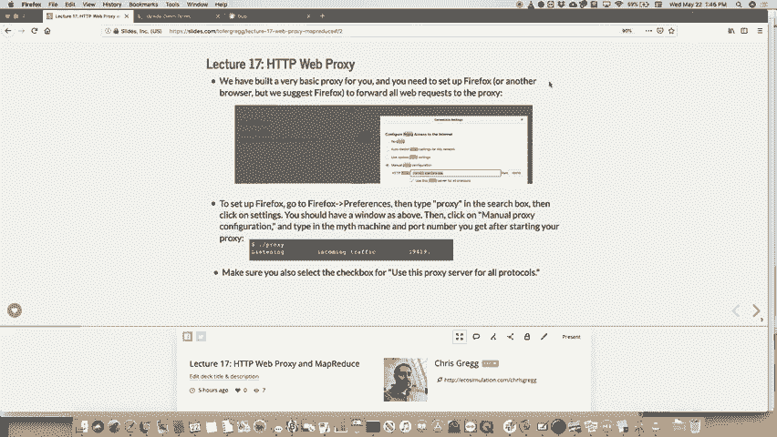


## 代理作业详解


接下来，我们将深入分析你要实现的网络代理作业。该作业分为几个循序渐进的版本。

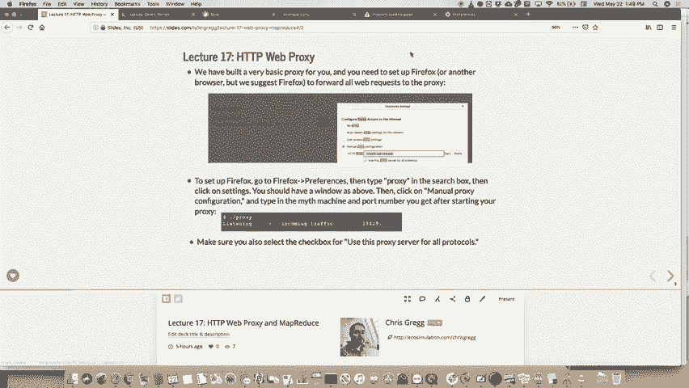


### 第一部分：实现顺序代理

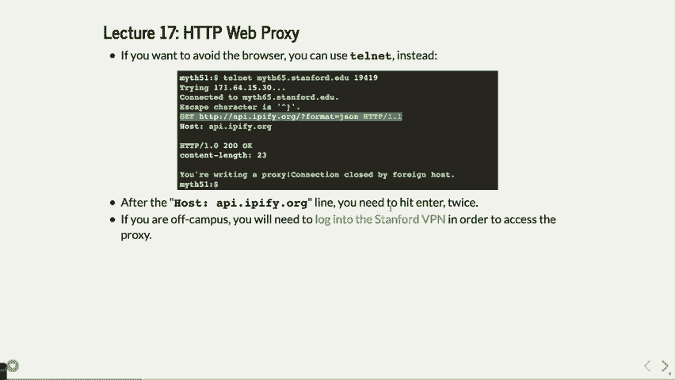

首先，你需要实现一个基本的顺序代理，它能处理HTTP请求并转发。

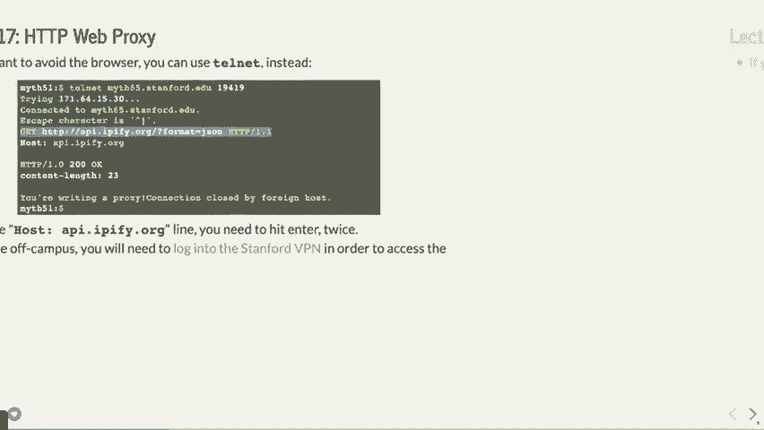


**核心任务包括：**
1.  **支持HTTP方法**：你需要处理 `GET`、`HEAD` 和 `PUT` 请求。
    *   `GET`：获取资源。
    *   `HEAD`：与 `GET` 类似，但只返回响应头，不返回正文。
    *   `PUT`：向服务器上传数据。你需要从客户端请求中读取负载（payload），并转发给目标服务器。
2.  **修改请求头**：代理需要在转发的请求中添加特定的头部信息。
    *   `X-Forwarded-Proto`：声明客户端与代理之间使用的协议（例如 `http`）。
    *   `X-Forwarded-For`：记录请求经过的代理IP地址链。如果请求中已存在此头部，你需要追加当前代理的IP地址。


一个 `GET` 请求示例如下：
```
GET /path HTTP/1.1
Host: www.example.com
```
你的代理需要将其转发给 `www.example.com` 的80端口。

作业提供了 `HTTPRequest` 和 `HTTPResponse` 等类来帮助你解析和构建请求。你主要需要在 `request-handler.h/.cc` 文件中实现 `handleGETRequest`, `handlePUTRequest` 等方法。

### 第二部分：实现黑名单功能


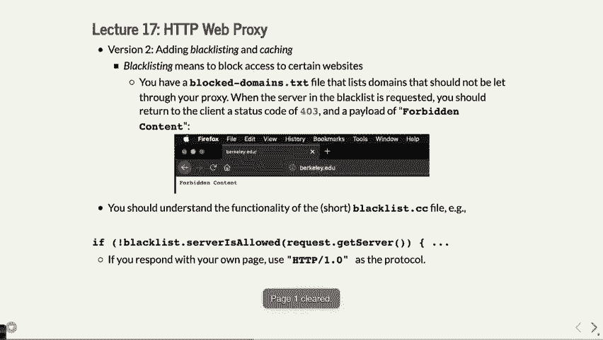

代理应能根据配置文件阻止对特定网站的访问。


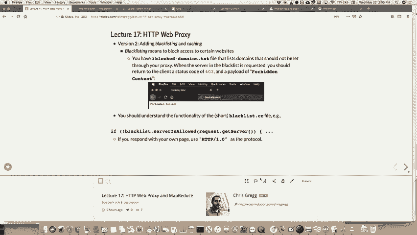

**实现步骤如下：**
1.  读取 `blocked-domains.txt` 文件，其中包含需要屏蔽的域名模式（支持正则表达式）。
2.  当收到请求时，检查目标主机是否在黑名单中。
3.  如果匹配，则直接向客户端返回 `403 Forbidden` 状态码的响应，而不是转发请求。


黑名单检查功能已提供，你主要需要将其集成到请求处理流程中。

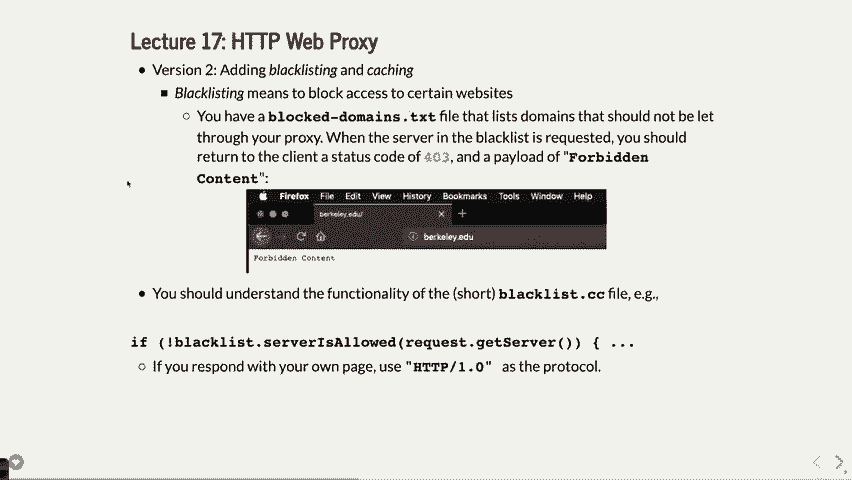

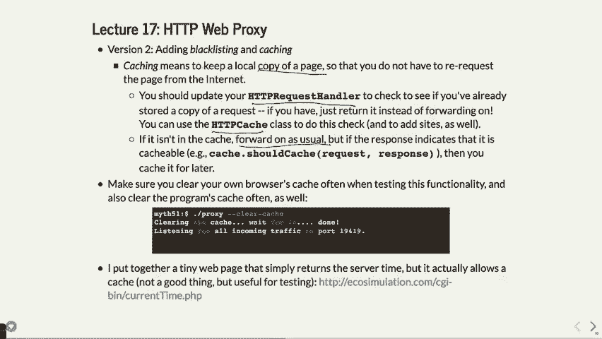

### 第三部分：实现缓存功能


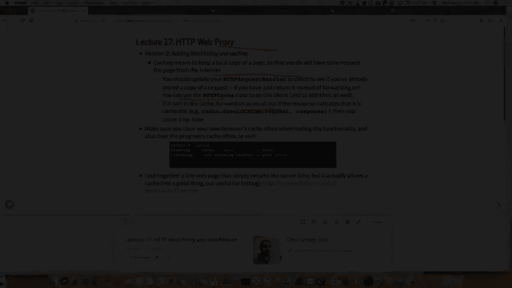

缓存可以存储服务器的响应，当同一请求再次发生时，直接返回缓存内容，无需访问远程服务器。

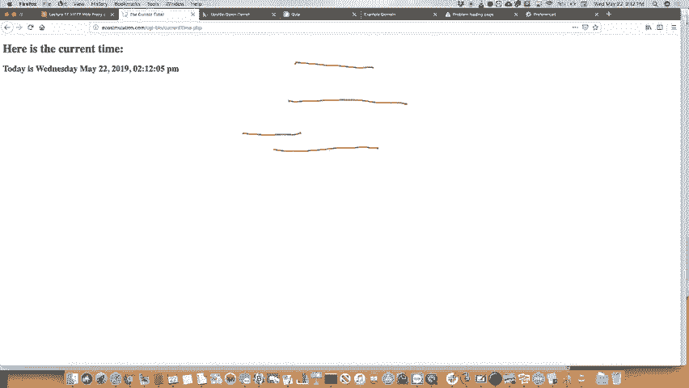


**缓存逻辑如下：**
1.  **检查缓存**：收到 `GET` 或 `HEAD` 请求后，首先检查本地缓存中是否有该请求的副本。
2.  **使用缓存**：如果存在有效缓存，则直接将其返回给客户端。
3.  **获取并缓存**：如果无缓存，则转发请求。收到响应后，检查响应头（如 `Cache-Control`）判断是否允许缓存。若允许，则将响应存入缓存。
4.  `PUT` 请求不应被缓存。


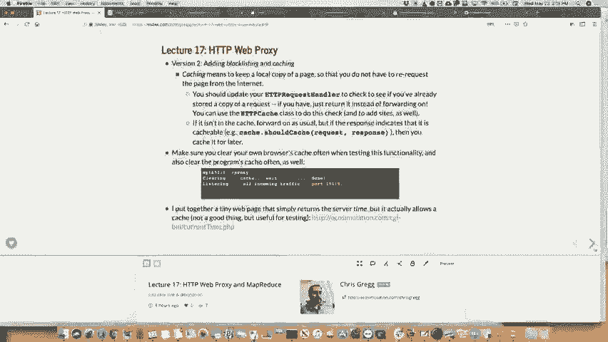


作业提供了 `HTTPCache` 类来管理缓存文件。你需要在请求处理程序中调用其接口。注意，缓存文件通常存储在用户主目录的隐藏文件夹中（例如 `.proxy_cache_myth64`）。

### 第四部分：使代理并发（线程安全）


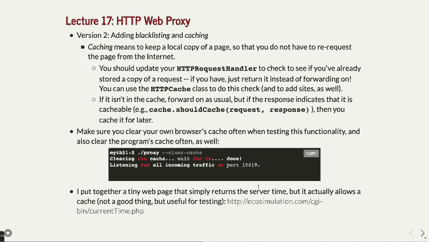

为了使代理能同时处理多个客户端请求，你需要引入线程池。

**关键改造点：**
1.  **线程池**：使用已有的 `ThreadPool` 类（作业提供），将每个 incoming 的连接请求作为任务提交到池中执行。
2.  **请求调度器**：实现一个调度器，负责接收连接并将其分发给线程池。
3.  **缓存线程安全**：当多个线程可能同时读写缓存时，需要保证线程安全。重点是防止对**同一资源**（如同一个URL的请求）的并发访问。
    *   为此，你需要维护一个包含 **997个互斥锁** 的数组。
    *   对每个请求，计算其哈希值，然后对997取模，根据结果选择对应的互斥锁进行加锁。
    *   这确保了只有真正请求同一资源的线程才会相互阻塞，不同资源的请求可以并行处理。

### 第五部分：支持代理链

代理可以配置为将请求转发给另一个代理，而不是直接访问目标服务器，从而形成代理链。

**实现要点：**
1.  **配置上游代理**：通过 `--proxy-server` 命令行参数指定上游代理的地址和端口。
2.  **转发请求**：你的代理将请求转发给上游代理，而不是原始目标服务器。
3.  **防止循环**：代理链可能形成循环（A->B->A）。为了防止这种情况，需要利用 `X-Forwarded-For` 头部。
    *   在转发前，检查目标上游代理的IP是否已经存在于当前请求的 `X-Forwarded-For` 头部列表中。
    *   如果存在，说明出现了循环，应立即向客户端返回 `504 Gateway Timeout` 错误。


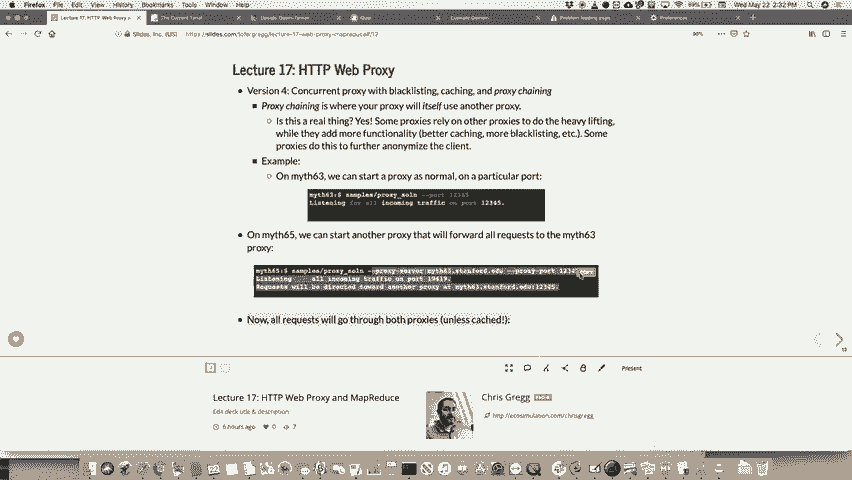

## 测试与调试建议


在开发过程中，请注意以下事项：
*   **使用HTTP网站测试**：大多数现代网站使用HTTPS。你的基础代理可能无法处理HTTPS（需要实现`CONNECT`方法）。建议使用 `example.com`、`time.com` 等仍支持HTTP的网站进行测试。
*   **配置浏览器**：建议使用Firefox，并手动配置代理设置指向你的代理服务器（如 `myth64.stanford.edu:端口号`）。测试完毕后，记得关闭代理设置。
*   **清除缓存**：在测试缓存功能时，频繁使用 `--clear-cache` 参数启动代理，或手动删除缓存目录，以避免旧缓存干扰测试结果。
*   **使用Telnet调试**：你可以使用 `telnet` 工具直接向代理服务器发送原始的HTTP请求，观察其返回，这有助于调试。
    ```
    telnet myth64 19419
    GET / HTTP/1.1
    Host: www.example.com
    ```
*   **VPN连接**：若在校外，需要通过斯坦福VPN连接才能访问 `myth` 机器。

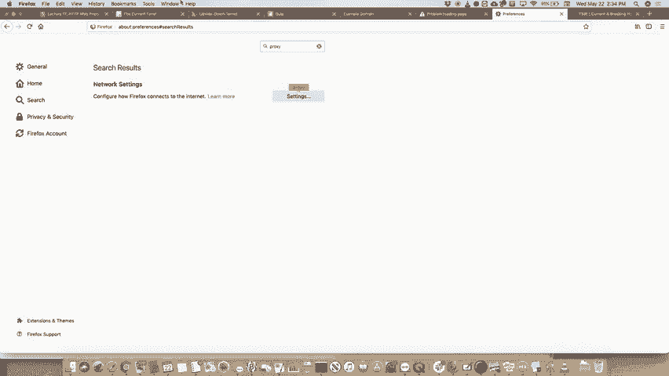

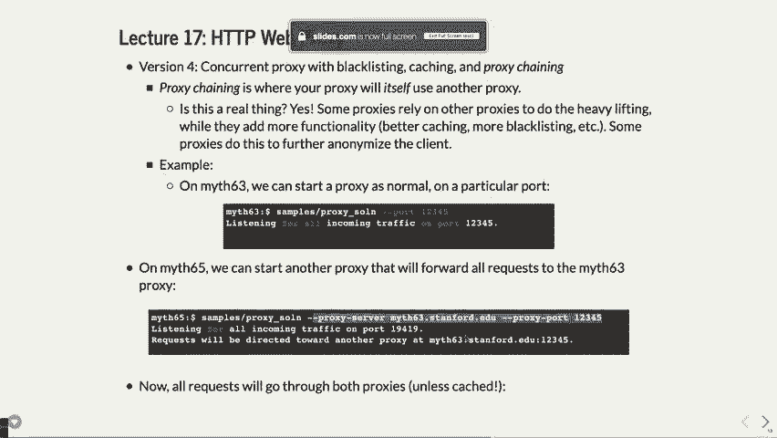

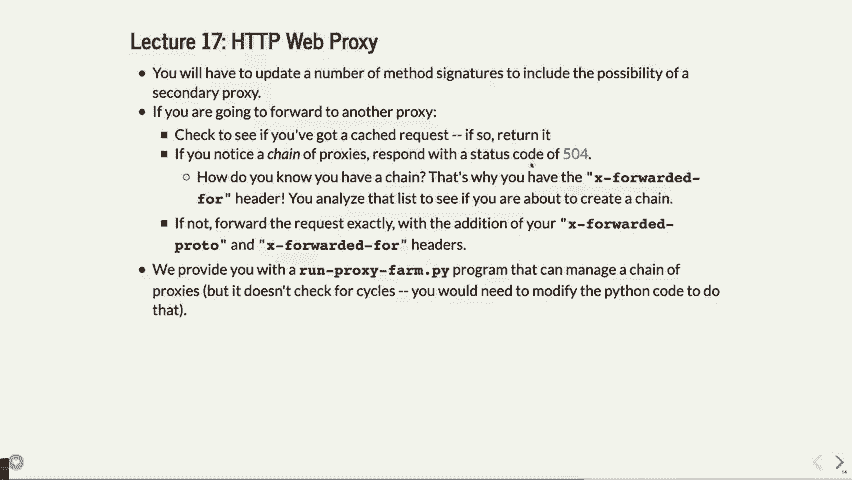


## 总结

本节课我们一起学习了网络代理的核心概念。我们了解到代理作为中间层，可以用于流量转发、访问控制、内容缓存和匿名化。通过分解的作业任务，我们逐步实践了如何构建一个支持顺序处理、黑名单、缓存、多线程并发以及代理链的完整代理服务器。这个项目综合运用了网络编程、并发控制和系统设计等多方面知识，是本学期所学技能的一次重要整合。

---


**附：关于最终作业 MapReduce 的简要预告**

在接下来的课程中，我们将介绍最后一个作业：**MapReduce**。这是一个用于大规模数据处理的分布式编程模型，由Google推广。它将任务分为两个主要阶段：
1.  **Map阶段**：将输入数据拆分并分发到多台工作机器上进行并行处理，生成一系列中间键值对。
2.  **Reduce阶段**：将Map阶段产生的、经过排序/分组的中间结果进行汇总，产生最终的输出。


MapReduce作业将需要你运用网络通信、多线程和多进程协调的知识，是贯穿本学期主题的综合性项目。我们将在下节课详细展开。