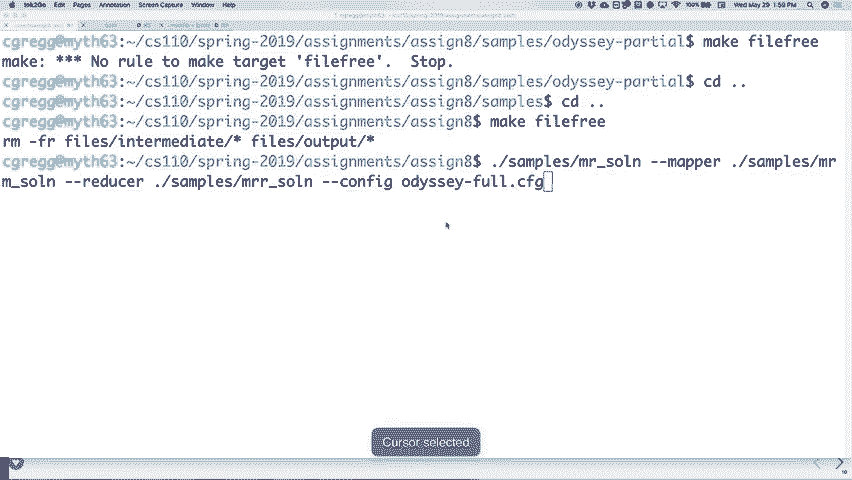

# P19：Lecture 18 MapReduce - ___main___ - BV1ED4y1R7RJ

 Okay。 Welcome。 Welcome back。 So this has zero to do with the class。 Although by the way。

 do you like the fact that I'm really excited that I'm now a movie star from the video in lab the other day？

 Right， I totally forgot that I was on that video。 Literally。

 So there's one other thing you might be asking yourself， why is he showing us these silly videos？

 And there's one other thing we're going to have you do in class this week。

 which is like a five minute survey on the videos。 It's actually part of a research project you will find out more about it in lab this week。

 The， oh， what else do I want to show you？ Oh， another video。 This has nothing to do with class。

 I just thought it was kind of funny。

 So last week， let me turn the lights off。 Last week， not last week。 Recently。

 my wife and I moved into a new house and we had this little back fenced in area。 And every day。

 I'll go back there and there'd be a little like thing dug under the fence。

 Something is dug under the fence and like gone on the back。 And so I have a camera out there now。

 You want to see what we found？ Let's see。 Yeah， you can kind of see it from here。

 There it is。 Yeah， really cute。 The problem is if we let the dogs back， they were really in trouble。

 If that skunk will win the war， I'm sure。 But anyway， that was what I found。

 When you put cameras up， you find cute things， but things， you know。 And then。

 so if I put a bunch of boards down below and it hasn't come back。 Although I hear skunks are really。

 really good at digging and they could care less about like boards。 So we'll see what happens。

 We will see what happens。 Okay。 Let's see。

 How is assignment seven going？ Almost there on this one， hopefully。

 Let's do what does it do tonight tomorrow。 It's between it。 Okay。

 I do have offsauce right after this for about an hour if you want to stop by if you're having some particular troubles。

 And then we are on to the final assignment， which is what we're going to talk about today completely and kind of get you up to speed on the final assignment。

 which I briefly mentioned last week called MapReduce。

 And MapReduce is an algorithm that we will dig into a little bit today。

 And then I'll talk to you more about the details of the assignment itself and how you can do it。

 There are a lot of moving part， I see that for all these times。 There's a lot of parts of this one。

 There's four different tasks again， but it is broken down into tasks。

 And we'll take a look at a little bit of the code today too。 And I'll point out some highlights。

 And then we'll get going on that。 The assignment。 MapReduce assignment technically is out already。

 I posted it a little earlier today。 So if you want to get working on it， if you haven't。

 if you've already finished， then that's okay。 It's due ostensibly next Wednesday。

 which is the last day of class。 I'm going to let anybody who wants to hand it in Thursday do so without any penalty。

 So you can figure out what that means in the big picture anyway。

 But just if you want you can turn it。 So the no penalties will start until Friday of next week。

 Which would be the 90% and 60% Saturday。 So you've got a little extra time for me to use that。

 But it is technically due Wednesday。 Okay。 All right。 Let's chat about this MapReduce algorithm。

 Now， what I didn't tell you the other day about MapReduce is that MapReduce is an algorithm that was used very extensively at Google。

 It actually was invented at Google。 Although it's very similar to things that have been invented in the past。

 It's not like they completely reinvented the entire thing before。

 But it was used at Google very extensively。 It's also used in a system called Hadoop。

 which is a system that uses MapReduce to solve these big data problems。

 And what the idea is for MapReduce is you take this data you have to analyze and you farm it out to a bunch of servers and do this map stage where you're taking all these different parts。

 You're taking these kind of this big set of data， mapping it out to all these different servers。

 All the different parts of it。 And then on the servers you're doing a reduce to bring it back。

 You're actually doing this kind of filtering sort of thing where you're combining a bunch of things and then sending it back to the main server。

 So it utilizes in our case the myth machines。 But you can use Hadoop or you can use MapReduce on a giant set of servers if you want。

 With thousands and thousands and thousands of processors。

 What's nice about it is if you build your program well and ours aren't necessarily for that purpose。

 But you build it well it's very robust for computers going down。

 So if you go to a Facebook or a Google data center they have tens of thousands of computers in there。

 And every single day many of those hard drives or computers will actually break。

 Because tens of thousands when you scale up things tend to break。

 And there's literally people there who are hired to walk around with a cart of hard drives or SSDs or whatever now。

 And we just go to this row and this column and the data center will place the hard drive。

 And then because it broke。 And some of your data might be on those broken things but you have to be robust enough so that the data is actually spread out across a number of systems。

 But it's the same idea with doing an algorithm that's using tens of thousands of computers。

 You need to write your application such that if one of the computers goes down you don't have to restart the entire process。

 That would be deadly because there's no way something with 60。

000 computers could last for more than an hour without one of those computers breaking。

 So you have to be robust about that。 And that produce allows you to do those things where you can be robust。

 Although that's not really the point of our assignment。 So I did this。

 I started this the other day I'm going to kind of review just to get us back up to speed of where it goes。

 And I kind of already said this you've got the map state in the map part and the reduced part。

 And the map part takes the data and comes up with some intermediate result。

 Now the intermediate result we're going to have the example and this is a classic example of taking a text of words。

 And basically taking the each word and putting it in a list in some file with a little one after it's saying there is one word with one word。

 And why the one it's so you can add it up later。 You could ignore you could not have the one and just assume it's there and that's fine too。

 But in this case there's going to be an intermediate result which we'll see which is just a word and then the number one next to it saying that's what was next。

 And this is not sorted at all at this point。 Then you do this sorting stage where you might take a file and sort all the words so it'll say like and one and one and one and one and one。

 It's all sorted and then you run a group by key which basically goes down list counts up all the hands and then writes one and in the total sum and then does that for all the other words。

 And then you have to reduce it which basically collates all those results and then sends them back to the original server。

 Okay， so that's the big process。 The mapping stage depends on what you're mapping the reducing stage depends on what you're reducing。

 But the sorting and group by key if you do the same for every problem then they're always going to be the same。

 So you never need to redo those parts of it。 Okay。

 and we'll talk in more detail as we go through this。

 So here's the little thing now there's a couple Python programs that we're going to show you。

 And by the way this isn't listed in your assignment itself but if you want to use some of these pythons in your code you are welcome to so you don't have to rewrite some of these algorithms yourself。

 So that's actually okay。 It doesn't help the mapping and reducing part but it helps the actual like the kind of sorting and so forth you can use these。

 But what this does is basically this file goes through a standard in and it finds all the lines and then it splits them into it splits them into by spaces or whatever。

 And then for each token in that it will actually take the make the word lowercase and then match it and basically print out the word and then print a one next to it。

 That's all this part is doing。 That's all this files do。 Okay。 How do you run it？

 You say something like this and we will go do that。

 Let's see。 We need to go into the right folder。 You might want to write down some of these。

 You might want to have these files handy because you can you will be able to call them without copying them into your folder。

 You'll see how that works in a minute。 Let's see。 Spring and then live map reduce。 Okay。

 So let's say cat Anna Karenina and we are going to pipe it through dot slash word count mapper。

 Okay。 And that's all it's doing。 Right。 Stating every word and just putting a one next to it。

 Now most of the time you would either have this itself go into a file because you're going to do lots of these。

 Or you would have it。 You probably wouldn't have it just print the screen。

 You probably have it piped out to some file。 That's all it's doing。 Take each word。 Take one。

 Word one。 Word one。 That's that。

 Okay。 All right。 So after we do that。 Okay。 Then you've got this group by key situation where you're trying to take the output and then just sort it。

 So in this case all we need to do is just in if we're doing this on the command line just pipe it through sort and it will do that。

 And so you can see zoological happen twice but that's what the end result should have that in there as a to in the end。

 But now we're going to be able to run through this use this other program to run through and just grab the and add them up。

 And that's the that's the next portion of this。

 Okay。 So this is another this is a kind of a cool little Python script by the way that is not it's a little bit dense as it turns out。

 It's not really that hard to understand once you get it but it's using things that aren't necessarily are in C++。

 For instance this yield which is kind of basically this function is used in another function you'll see down here。

 To basically go through each line and grab the first item which is the word and then join all the words that are the same using the ones and counting them all up。

 So it's basically what it's doing and then it's printing out the actual word and then oh sorry this was not in counting this was just putting the word and then putting 1111111。

 That's what this was doing。 Okay， so let's see what happens when we do this and if you want to look at the details of the program you can。

 But this one would be then we do this and then do group by group by key and this one says oh okay now it's got it's kind of one step at a time。

 Now again you can you probably combine some of these together if you really wanted to but this is the main algorithm and if you do it this way it will work for lots of different problems。

 So it's not like you have to if you format all your map reduce jobs in this format then it always works。

 This might not be the case if we did it in some other way but for instance your has this many times of it was in that document。

 So once you've got that then you need to write another program which is in this case word count reducer which is another one of these strangers but it basically does the same sort of thing where it breaks the it takes each line gets the first one which is the word the first word。

 the first space delimited value which is the word and then for all the other space that we values all just ones and it's going to sum them all up。

 Okay so it basically does the sum of all the rest and then prints out the word and then the sum and there's your answer and then that is what would get sent back to the server in this case。

 Remember what we're doing here is not a map reduce across many servers it's just on one computer。

 So what would that one be that would be dot slash word count reducer and hopefully there you go and notice is a logical as to words in there and so forth your self as 27 and so forth。

 And that's the big idea for map reduce。 Okay， now things out to word one on one on one。

 collate all the words and then count up some of the words and then basically send the data back。

 Problem is you have to do it distributing it's like which is which is the part that that's the science about。

 Yeah。 So the one on one seems like one program you can take that out and just sum it in the second step。

 But because we're distributing this that they just can only tack on one because like each process won't have access。

 Yeah that's a good way of putting it。 Yeah， so Sam's comment is very good where the reason we're doing the one on one on one and here doesn't seem to make sense because you could have just summed it right then right because it's one thread doing it all。

 But when multiple threads are all trying to contribute to one file let's say it's going to each one has to only contribute a one so there's a tax one on the end。

 Now， could it read it in read the value and then put it sure but I mean there's there's in this sense this is the most generic way to do it。

 In the pipeline that you have on the pivot slide where do the threads like。 Yeah， yeah。

 so this is a member this isn't the one this is now a single threaded one so there's no where would it happen。

 They would rejoin under the reduce phase basically the reduce would take its individual parts reduce them down and then when the last one finishes it basically tells the server hey we're all done grab this file and then the server go get the file。

 So that's that's how it works for the assignment。 Here's the nice thing about this assignment on this is not necessarily true in across the data centers of the world but for our assignment we have how many myths that we have 10 or 12 myths or how 15 or whatever there are。

 That many myths they all share the same file system so that's the nice part about this is that if you ask for a file you can use one path and it gives you that file off the file system no matter which myth you're on。

 I mean you do this every day when you ask this agent in myth and go to your CS 110 folder。

 It's the same folder on multiple different myths because really it's the same underlined file distributed file system。

 So that's the nice thing about this assignment is yes we are using multiple myth machines to do this but we're using one single file system now you might think oh how could I do this if we had a multiple if we didn't have shared file systems。

 Well you just have to pass the data back and forth every time so if you wanted to say hey go do this chunk of data you would first have to send the data across to that machine when it's all done you'd have to gather the machine gather the data back again。

 And if you've ever taken or maybe some of you will take a parallel processing class you'll see where that becomes important。

 Why is that a big deal？ Sometimes it's too expensive to keep the entire file system synchronized across many data centers。

 It's not that bad these days but it's to keep it all synchronized across many data centers is not really that efficient so it's easier actually to send the data and retrieve it back versus just say hey read your local data and I'll get the response once it gets there。

 So that's that。 Okay so questions on the map reduce algorithm itself besides the question about when do these parts happen。

 Anybody else have any questions on this？ Yes。 The so the group by key let's just back up one second let's see what the group by key does。

 The group by key just puts all these ones in there and it hasn't actually collated them yet。

 Like it hasn't added some to them all up so in our case the reducer is just doing the summing part。

 That's all it's doing。 Why do they separate？ I think that it kind of comes down to this idea of many files will be adding to the one that's not going to be the one。

 It kind of comes down to this idea of many files will be adding to the one like maybe updating one file or they'll be updating it on files but many threads might be doing that on a machine and so therefore you don't want to try to do the summing at the same time you're adding up it might just be slower。

 If you're just adding a one is easier than saying oh I'm going to now get the value back and sum it up and then you know so forth。

 I think that's probably the main reason there。 So let's look at the actual assignments once we get to it。

 Now so this assignment as I said already to do next Wednesday although there won't be any late days until starting Friday so you can hand it Thursday around the penalty。

 It obviously is going to do the MapReduce algorithm。

 It's going to use the Myth Machines so you are going to start on one Myth Machine run your basic program on the Myth Machine and then it will create it will basically SSH and launch a program via SSH。

 You can look in the code and see how it does that and then that program will call back to the server and say please give me some data to tell me what to do。

 So basically the one program is going to farm out all these processes different server or different myths and then each one will call back to the main myth and say hey give me some work to do。

 Most of this is already written for you it turns out。 There's a lot going on there。

 So we've given you a pretty robust start for the program。

 What that means is that there's going to be a lot of code you have to understand beforehand。

 Now this has been true in this whole class and I was talking to somebody in office hours。

 I don't see a person here talking to somebody in office hours a couple of days ago about this idea that we have a ton of code to read through and this happens wherever you go。

 How many people have done internships already in CS in some form or other。

 Yeah have you found that there's like you get to this place and they're like okay your job is going to be to do some updates to the code base and you look at the code base and it's a billion lines of code。

 Like not even kidding it's a billion lines of code you got to figure out how to do that and every place you work has a different way they format the code and the different tools they use and they have different ways to make files and different ways to do code reviews and you have to learn all this stuff and it's very similar to going in and saying here's a bunch of code that you're going to try to modify in some way。

 You got to understand the code more or less first。

 So if you're thinking about oh there's a lot of code to read this is we're not necessarily doing this just for you know for kicks we're doing it to kind of get you ready for when you have to do this in real life。

 Okay so this is the robust start we give you a lot of code to look through and we're going to look through some of it in a few minutes。

 There are four tasks handle each one just like the others in order and it's probably the best best way to go。

 Well one thing you will be adding of course is a thread pool so adding a thread pool will make it so that your main distributor program can just launch all these threads and not have to worry about the thread issue and then you're each one of the workers can also have multiple threads when it gets more work to do。

 So that's kind of a cool part of it。 Okay and you're going to be doing the reduce part the one part that we've really left up to you is the reduce stage we've given you a pretty open end in part I mean if you look at we'll look at this in a minute as well but let's see。

 If we look at we find it here and assignment eight map reduce reducer dot CC。

 Okay there there's your function so far like we haven't given you much right we've given you exactly zero right for that so this is your part your place to shine in this case where you write the reducer but once you understand what has to happen you go oh okay all these distributed files are going to be in this format。

 I need to now co-awake that and then get them back to service it's doable。

 Okay we'll get we'll get there as we go through this。 Okay all right so that is that。

 Let's actually talk about the details because you got to get up to speed on some of these details as well。

 When you clone the assignment okay in fact I'm going to do let's see R and dash R which one do I want I want is it files yes I hope it's files it's not in trouble。

 So when you when you start your assignment yeah I'm just I have to expect never never do this R and R star that would be really bad I'm just I'm a slash star will like destroy things in a bed especially if you're a super user don't do that。

 Trust me I've done stuff like that before you just you accidentally do that and it just destroys your day I can tell you that。

 So anyway when you start out you don't have all the files are going to end up in this one particular directory this will help you when you're doing debugging。

 And so what you do is you type make directories and it creates the directories one's called files slash intermediate one's called file slash output and and it creates the delete some first minute creates I guess it could have been in the valley but it creates them for you。

 And that's where all the data is going to go okay and then every time you run your program you should clean that folder out by just saying make file free and what that does is it just deletes all the files in there。

 Okay， for you and why is that because you don't want the files that are already there to be corrupt to be there when you're trying to do a new batch of data so always remember to do make file free you only have to do this one wants me this one pretty much every time before you run the program。

 You should do that。 Okay， there are actually five different executables that this program entails。

 Okay， I'm seeing people go what are you talking about。 It's not that bad。

 You've got the map reduce map which does the mapping you've got the map reduce reducer which does the reducing and this is coordinating these。

 Those are the ones that are coordinating all this you've also got a program that we've written these two programs for you the word count mapper and the word count reducer。

 Those are similar to the ones that we've you've already seen the Python。 Okay。

 so those are already like already built there。 You will have to modify these other ones to make it actually work。

 So because of the way you're doing this you might think， oh well。

 how many threads do I need and how many different servers in this and that you have a file that's configuration file。

 Okay， and in fact if we look at it right now， we will look at Odyssey for that CFG。

 Oops。 Hang on。 I swear I hit there we go。 Okay， let's see Odyssey for that CFG。

 So here's what's in that file and this is it's always going to look exactly like this in the sense you have you tell it。

 You have a key that says， hey， what file is going to do the actual mapping of the words。 Well。

 it's going to be this word count mapper program。 What file is going to do the reducer word counter producer。

 How many mappers are we going to have？ We're going to have eight mappers。

 That's basically eight threads that are going to be on different servers doing their thing。

 And how many different reducers are we going to have？ We're going to have four reducers。

 Why is it that number of those numbers？ Kind of arbitrary。

 Normally you probably make them equivalent but maybe you know that there's more work to be done doing the mapping part and you want more horsepower to do that。

 And then it says what the input path is。 In this case it's this Odyssey folder。

 I'll show you what's in there in a second。 And then you tell what the intermediate path is。

 The intermediate path is after the mappers get done。

 They will put a whole bunch of files in this intermediate path and we'll look at those。

 And then you have an output path which is where the final results go。 And we'll see that as well。

 Let's go look at the Odyssey folder。 If we get a samples and then Odyssey full。

 We've got in here we've already done this for you where we've broken up the Odyssey textbook or text into twelve different files。

 And let's look at one。 0007。input。 By the way， one thing before you get to this part。

 See how it's like four zeros and a seven and three zeros and eleven。

 You have to write that part yourself。 Like how do I figure out how to make a string that has like three leading like the number of leading zeros that add up to five。

 It's not really that hard。 Don't overthink it。 But just know that you're going to have to do that and go oh okay this is the part where it doesn't do it for you。

 And people get stuck on that and go oh why isn't it doing that。 You just got to do it yourself。

 But anyway let's look at one of these files。 This is what it is。 It's just part of the Odyssey。

 Okay and you can read through and this is the thing。

 We've broken it into twelve different files because we're basically going to farm each one of those files off to a different server to do their thing。

 That's how that one works。 So as you're going along you can see you won't really have to modify this too much。

 If you want there's an Odyssey is it Odyssey partial or something。

 Yeah Odyssey partial which is many fewer files。 So if you're debugging it might be better to do this one so it doesn't take forever。

 Just take a keep your eye on like changing that。 You just need to change the CFG file or if you run this Odyssey partial dot CFG file。

 Then you do this。 Okay all right and those are our files I just saw。 I already showed you。

 So let's actually run this。 Okay so when you're running this I'm going to copy this line because it's kind of long。

 You'll get used to copy pasting either this one or the one for your program。 Maybe I won't。

 There we go。 Okay so I've done make file free。 I've already done that。

 And no I haven't。 I have but I got to be in the right folder。 Make file free。 There we go。

 And then we're going to run this line。 Now here's what's going on here。

 The first part of this is the map reducer like coordinator。

 That's this part right or is it this part right here。

 We're going to just run the solution you want to see it。

 And then the mapper is going to be MR the MRM mapper solution。

 The reducer is going to be MRR solution and then the config file is going to be this。

 And then you go to your stuff and say to yourself why don't we just put these things inside the configuration you could have。

 But this is actually a pretty generic way to do this where it's a little more generic in this sense。

 You could use some other file here but keep the same config file。

 So that's just what we're doing in this case。

 Okay let's run this and you will see lots of stuff flying by。

 Okay so all of this log data is not bad to use if you need to figure out what's going on。

 But there's lots of it here and it is eventually this is the full version with threading and also it's actually relatively quick。

 It goes through and eventually it says okay here's all the output files and what they have to and it's hashing the output files so you can check the answer。

 Remember all the way back to the first assignment or the file assignment。

 Same sort of thing where you go oh mine the hash is the same we're good to go。

 Okay so that's what you're going to want to do there。

 And as I said it's your program is calling all of these SSH things。

 Now let's actually look up how it's doing that SSH star。cc。 There we go。

 So it's basically doing some file。 File it's got some streams in there and it's basically just doing something like that where it says okay that's going to be you and it's going to tell it how to do SSH to there。

 Okay so there's lots of fun stuff going on there。 You might be asking yourself how does it know your password and I actually don't know。

 I forget how it actually does that part。 I'll look up how it does that part。 What's that？

 It doesn't know your password so it does it without having to know your password I forget how。

 I'll look up。 I forget how。 Yeah I'm not sure。 Anyway it does it does that。

 And then let's see what else。 It's all of the different communications that are happening here like it says。

 Oh informing worker at Myth 52 that all file patterns have been processed。

 We're going to see some of these to do that。 Keep all these in mind because these are going to help you when you're debugging this。

 Okay。 All right。 So that's that。 Now let's look at where the output happened。 Okay。

 So if we do files/intermediate。 Okay。

 There are a whole bunch of files in here。 Okay。 Now it turns out that this is how they actually work。

 0 0 0 0 1。 0 0 0 0 dot mapped。 Okay。 Is basically saying from file 0 0 0 0 1 dot input。

 It takes a subset of file of words that are individually hashed to go into the 0 0 0 0 0 mapped file。

 And any time you have a dot 0 0 0 0 dot mapped file it means that that word happened to hash into to that that number mod I believe it's 32。

 So if we go down here and we look up the Mac yacko 0 to 31。 So each one of these says 31。

 Now there were 12 different files。 There were 32 individual map files for this。

 So 32 times 12 is 384。 There should be 384 different files in this folder。

 And there are in this case。 Okay。 We'll talk more details about what that is。

 The first time I looked at them or what's going on here。 I'll show you。 Okay。

 So if you look at all these files。 Okay。 This is what the word count mapper produced。 Okay。

 And it will look familiar when we actually look at these。 Okay。

 The word word count mapper place these files in here。

 And they represent the words from the input that hashed to that particular number on the end here。

 So I'm going to show you what that hashed means and I wrote a little program to test it for you too so you can test out a word hash。

 But let me show you what let's say we looked at 12 to 28。 0 0 0 1 2 dot 0 0 0 2 8。

 Does this look familiar？ This is what the output of the mapper was earlier in that it takes the well。

 These are actually a little bit farther down the line。

 This is all of the words from zero zero from zero zero twelve from zero zero twelve from zero zero verb。

 Here from zero zero zero， Let's see， There is all the words from zero zero zero twelve input， that。

 mapped two or the， when hash ended up with a， value of 28 after being modded by 32。

 Let me show you what that means。 Okay？ The is in here。 It's in this list。 So the。

 If we run it through some hash function， you get a number， right？ Let's go do this。

 I wrote a file or wrote a program， Let's see it is let's see CS one。 I'll just run it from here。

 CS 110， You can run this to let's do it from there。 You can run it like this you do slash。

 User slash class CS 110， W don't know we don't need that we can do a lecture examples。

 There we go lecture examples map reduce， Oh， no， it's not made you do have to make it。 Sorry。

 You have to make it first when you when you download it user， Let's see CS 110 spring， Map reduce。

 Hash-hasher， okay， if you run a hash or it says please provide something to hash。

 So if we provide the then it will hash into this number， What is the hash function？

 It's something built into C++ and it might actually be different on different machine different。

 Operating systems and different C++ compilers。 We're using the same one。

 So it's always gonna be the same for us， But this is what these should always hash to if I do it again。

 It will have to the same number that number will not fit into 32 buckets。

 So if we mod it by 32 it fits into bucket 28， Okay， isn't that what we want it before？

 Let's see if we look at greev g r e ve then let's try the same thing g r i e ve。

 It should also hash into the 28 bucket。 Okay， so what's happening here？ We have。

 Each individual file out there's 32 files per input file that have now been mapped in the following way where all the words in those。

 File in the input file that hashes to a particular one of the 32 buckets goes in that file with a little one after it。

 That's that okay， and that's what the intermediate files end up with。

 Okay， and they're 384， No good， Maybe part is in， No， no good question the question is wait。

 You just said something about I can I have to make I have to figure out this。

 0 0 0 1 2 business some of it has figured out for you already some of it like these ones。

 You'll have to write yourself and I'll show you how that I'll show you how that that actually works。

 Well actually it's not written for you because it's originally there。

 You have to figure out how to take a number and put leading zeros up to five。

 This is like a one or six a question is really， What is it's not that hard？

 You'll find out when you write the program。 I mean it's it's in the I forget。

 It's in the mapping stage is what's happening。 Yeah， this is happening。 It's not in the pipe number。

 This is gonna be in C++。 Sure。 You don't forget this out。 Okay。 You're not quite using it。

 We're not actually using any Python yet。 You'll see where that happens a little later， Okay。

 but now are there any questions about what's what the results are and why there's 384 files here？

 I didn't really told you why exactly those 384 but。

 What it turns out what it ends up being is there are eight， Nappers and there are four reducers。

 So we're gonna end up with 32 different files per input file， Okay， that's why it is now。

 Why is it number of mappers times number of reducers？ This is completely arbitrary， Okay。

 it's arbitrary， Mainly because if we do it this way that's making you break your code into lots of different pieces that when you're doing your threading part can。

 surface some， harder to find， Bugs like mainly whether you're locking around the right things or whatever。

 So that's the big deal with with this one， We're saying you have to produce these 32 files or eight times four in this case because we want you to be able to。

 Write your thread and make your locks work appropriately。

 So it's a little bit arbitrary in that sense， But that's that's what's going on there。 Okay？

 All right， so， Let's look at another file just to make sure if we look at so we just looked at zero zero zero one two dot input。

 if we look at zero zero zero five， same 28 again instead of。

 12 look at zero zero zero zero zero five dot， 28， Well， it will also hopefully have yeah。

 the V is in there， Okay， anything with a 28 means that the words that end up there happen to hash to 28 now。

 Why are there different these in different files at this point？ Right now。

 Each individual input file might have a bunch of these in them。 In fact， we can find out。

 Let's see if we do。

 See grip if we look for the as the， Let's see， Let's look for， How are we gonna do this？

 It's a little hard to do this little hard to get this perfect because of the files。

 But if we look for the in and this will not do commas and things in， See samples。

 Let's see Odyssey full， Star yeah， it'll say and then let's see。

 I think - L will just list the files that they're in， - L。 There we go。

 So it turns out that the that V happens to be in files three through twelve probably two as well。

 But I didn't do it right。 So that's so that's how so they're all in each file。

 So they're all gonna end up in anything with the 28 after yeah， Yeah。

 good question the question is well， how much faster are we talking about when we do this multi-threading？

 So it's really it's a little hard to answer that， It will scale well。 I'll put it that way。

 Just because of the fact that you are spreading it out over many different servers。

 When we're gonna try our the starter version which doesn't have any threading in it doesn't do the whole thing。

 But you'll see it's a， Marginally slower anyway， but you do get some speed up and you'll be able to see some speed out here when you do it。

 It's hard to quantify it exactly though for the size of the problem。

 We're doing you might not get a huge speed up， But you get some， Okay。

 so where do we stand at this point？ We have now shown that you're going to have to map these into many different files。

 Before you do the reduce it。 Yes， Yeah， the question is is there is the reason for hashing so that we can split them into？

 Kind of evenly spaced files pretty much。 Let's actually let's actually look at the file sizes here and see。

 They are so 685 looks like a small one， But then it goes up to maybe a few thousand there might be a ten thousand in here。

 I'm not sure but they're roughly the same size would there be another way to do it？

 I mean you could probably figure that for whatever data you have to do。

 You know you might say oh just do a through L and this file and you know what extra words to start with that。

 Probably wouldn't be perfect though。 This is a little probably a little better in that sense， Yeah。

 good question， Everybody else， Okay， let's look at。

 Just wondering if you could count all the words in Odyssey easily， Let's see。

 Think let's see if we do the following， Now I won't do right now。

 We can count we could count all the words and see if they're all in there， I'll put that in Piazza。

 It's gonna be easier to do that than me trying to figure the command out right now。

 But but it is possible。 So if you want to learn how to use the hashing function。

 We've written it for you already in a very place and thing or just go look at this file that I。

 That I pasted on or that I put down here， That's not it。 I think I did。 I think I pasted the wrong。

 Oops， I think I pasted the musta pasted the wrong one。 I will fix that， Hasher program located。

 Hang on。

 No， it didn't。

 No， it didn't do it。 Well if you click on it should come but you can look at that file and actually see how it's done。

 It's not that hard cat slash here。 I'll show you then， Spring I map reduce and， Hasher got CC here。

 It's pretty easy to use you basically say hash， brackets or angle bracket string hasher and then。

 Passing the string and there you go。 That gives you the hash value。 So really straightforward to do。

 Yeah， Um， do you have one more？ So the question is if you're doing that produce would you do not have any more race conditions once you've mapped it out？

 No， I mean you still are going if you're doing a if you're using the。

 Distributed file system anytime two threads on any myth or trying to write to one file。

 They better not write to the same file。 So there's definitely a you have to do some something there now。

 It's going to be a little harder。 You can't lock across。

 Myths right so there's other things you have to worry about。 I think in that case， Let's see。 No。

 it's only a multiple if you multiple threads you could run into that problem。 So。

 Each individual myth one is not going to be writing the same file as some other one。

 So that's a good thing。 So it'll work out in the big。

 You do it still have to think about it for the threads just think about just like you normally do。

 I should just back up just think about it exactly like you normally do if multiple threads can。

 Modify a data structure at the same time。 I better stop。 I better lock around those。

 That's where that's the the max。 We don't think about， okay。

 So， Okay， so let's actually run the starter code。 Okay。

 and see what your starter code actually produces。

 Okay， I'm gonna do same things before make file three， Okay， now clear everything out。

 Don't forget to do that。 And then I'm going to just copy this little line here， Okay。

 So this one is basically using your version of the one that we give you for starter code， and。

 The mrm one which we give you and the mr。 Which we give you and then it says map only。

 This is because we didn't write any reduce for you and then the quiet means don't print any details out except for these hashes that you'll see。

 That are all print out。 Okay， so that's what we're going to run and you can see how fast it is if it's faster or slower。

 then before， Okay， let's see。 I'll do it from here。 There we go。 Okay， so it's going， Right now。

 I have to wait around。 Wait around。 This is only the mapping part， right？ And there it goes。

 So that's it。 So the mapping part， I guess you can't really tell but it tells you some of the hashes that come out。

 Let's look at the files right now intermediate by the way。

 If we looked at the output files there are none because there's no reduced stage yet。

 but if we do intermediate， Then， Your solution does not break it into。

 Or the solution the starter code does not break things into any of the hashing。

 That's the part you're going to have to do but what it does do is it already maps to。

 Like the words for you zero zero zero one dot mapped， And look what it comes for you already， right？

 So in this sense， we don't need to you don't need to use that python program to do anything here。

 We've already written that for you in C++。 Okay， and this now is。

 Fairly far along the path of like how it's doing how it's doing the， Mapping for you。 Okay。

 and let's do it without the quiet part， Make file free again。

 Do make file free again and then I want to do this without the quiet and you'll see what else what other things are going on here。

 Okay， so it's still communicates。 It's already doing a lot of that communication stuff。

 So it's not like it's just， Doing it locally like the python scripts。

 It is actually communicating and sending back data。

 So I mean a lot of that's already written for you， Question， It's not doing the hash and right。

 Yeah， so in this so this is only partially the way they're now you're you are still going to further need to break it into。

 32 in the case of the four times eight different files。

 For each one of these input ones and you can do that by hashing in there。

 And again part of this is our return about why we're making you do that part。

 It's part of it to have more files that can be spread out among more servers。

 And part of it is this kind of test that you can do locking and multiple blocks or multi threading well。

 We again， we've given you a thread pool。 It's not like you have to write that part。

 You just have to write the locking and do the proper locking which really。

 In the big picture the big the biggest part about going forward from here。

 You've now written thread pool and you've done regular threads and things before from now on。

 You'll probably just use a thread pool or maybe use threads individually。

 But this you know now at this point the important part is oh。

 do you really know how to lock in the right places？ That's the important part。

 Okay， Other questions， Okay， so let's go back here。 So that's what our mean。

 that's what we've actually， done in this program and， You can see that the。

 Actually what we can do now actually see where the shows up。

 Let's see find no crap and we'll do the， This way， be in files file slash intermediate star and。

 - oh， this is a， It was should tell us which files it actually found the end in this case。 Yeah。

 I found it in all but， What they only filed it didn't have the end was that was one in this case。

 So it's already broken it up into it's already taken each individual input file and done the。

 first round of mapping for you， Okay。

 Okay， so， Where does that leave us now？ Well， let's look at some of the files。

 Here's the main files that you'll have to look at now stage by the way。

 There's four tasks task one is understand the files。

 You're not sure to do anything for task one except absorb and you have to kind of do you know。

 Do that in the best way possible， but don't skip task one。

 You'll get you'll get crushed because there's too much too much to understand， Right。

 even though it's just reading and don't try to just jump in and write this stuff， Right first。

 I try to understand these things。 Okay mrm， That is the entry point。

 That's the client of the map reduce server， Okay， and the server invokes mrm remotely like on each machine。

 so each machine gets a map reduce mapper that runs up it okay and， and then。

 The real as I said the reason this works is because of the x-men's file system map reduce mapper is the。

 Class that actually does all the server business。 Okay。

 and here's the most interesting part about that， Let's let's go look at map reduce mapper and map reduce。

 Map reduce， Worker， okay， if we look at let's look at let's see。

 Let's see which one what's the name of the file it's that produce we'll look at map reduce。

 Map reduce worker first， Okay， let's look at map reduce worker。h。

 Okay defines the map reduce worker based class now， How many people remember from 106b？

 Like the last week of class when you were already checked out where you talked about。

 Um where you talked about polymorphism and you talked about。

 Narratents and all that anybody remember that？ Yeah。

 like one person remembers that right and so this is written for you。

 So you don't need to worry about that， but basically we've we've broken this down and we said look。

 There's a server and there's a the reducer and the。

 Mapper they both have to talk to the server in pretty much identical ways。

 So let's but but not exactly identical。 I have to say different things there too。

 So let's create one base class， which then， Does this worker part and then each individual the reducer and the mapper。

 Subclass off of this worker and do it so you you will have to understand inheritance。

 Just a little bit for this and when you read through this don't be scared when you see。

 Weird things that i'll show you in a second。 Okay， so in here。 What do we have in here？

 We've got a huge。

 Set of parameters for this。

 Okay， and then we can request input and notice there's client stuff in here again this part is mostly written for you。

 We're not asking to redo all the client creation business and so forth。

 Okay， it's got the server stuff and it's got alert server progress。

 And you should be using some of these to print out the right messages。

 When you're trying to oh you have when you're doing progress and so forth， Okay。

 let's look at the map reduce mapper and i'll show you the part that。

 Might seem a little weird look at the map reduce mapper。 Well， here's the actual。

 Constructor for this， Okay， Notice that it has a map reduce worker， As part of its definition。

 This is because it's sub classing the map reduce worker， It turns out so um。

 it's actually nice that it's it's not it's it doesn't even have other parameters。

 Basically passing all of its own parameters onto the the class of the map reduce worker and then it updates some of the functions。

 uh down here， Okay， we've got the map going on here and that's it。 That's all we have so far， Okay。

 I'm gonna show you the map reduce reducer。

 Uh， but i'll show you that again here， user， Cc same sort of thing here where it subclasses map reduce worker and then has this reduce function。

 Okay， so there's not not too much that you have to like go and like dig through to find out what's happening。

 Where but you have to understand what's what's going on down in those files？ Okay， that is task one。

 Okay， understand all of those files， Uh， let's see is there anything else in here。

 Let's look at mrm。cc。 Oops mrm。cc。

 Okay， this is basically saying right now， map， map， That's what it's doing。

 It's kind of in here eventually going to call reduce after that， Okay。

 so you've got to you're gonna do that and you have to do reduce。

 What you're also going to have to do is it turns out is you're gonna have to modify the number of parameters in here。

 You'll find out when you read through the assignment。 Um。

 it's basically so you have to if you have to add， Another parameter to the splitting of the files based on those hashes and things。

 So you're gonna have to update that， um。

 It's it's kind of listed on the， assignment where you have to do that， All right， Task two， Well。

 now we have to spawn multiple mappers。 Now whenever you say spawn multiple。

 you should immediately be thinking thread pool， Right， this is where you have to start。

 So you have to say oh， okay。 I'm basically going to uh modify the spawn mappers。

 Where is spawn members？ Spawn mappers in the map reduce server， app reduce server， Okay。

 spawn mappers， Okay， and the spawn mappers function right now has no thread pool in it。 Okay。

 but what you are going to do is you're going to， Put a wrap a thread pool around spawn worker such that it then does many。

 Workers， okay， why are we doing that because that will make it。

 Much easier to or that will make it much more robust in terms of being faster and enable communicate better。

 Okay， what do you have to do with that？ You have to make sure to lock in the right places and and。

 Just all the various now you know about thread pool。

 So it's the things that you have to you have to do。 Uh， you're just going to basically。

 If you actually had the wrong the wrong one there， you have there's a。

 Method called orchestrate workers， which uses a handle request and the hand I think it's a handle request you're actually going to map in a dot schedule。

 Uh handle request。

 There we go。 There is an orchestrate workers function， Which uh。

 we'll look at the header file to see that and then there's a handle request。

 Down here and this is the one that we can basically。

 Right up here is where you're going to end up doing your scheduling， Okay。

 See we wanted to look up the header file on this。

 There we go， orchestrate。

 Oh， it doesn't say anything about it。 Oh， no， I thought it did。 Well， it's in the assignment anyway。

 and they had， For car make sure you do your right in your Texas and modify only like lock around things。

 That are going to change from multiple threads。 You look to the code and see where that happens。

 Okay， question， In the， Handle request is basically where you'll need the mutexes right you'll need it in there and then anything that calls that might end up locking。

 needing to be locked， Because there's going to be various files that are going to be written to and and red and so forth that you need to need to pay attention。

 Anybody else？ Okay， so。

 then， Task three。 This is the hashing part。 Now。 This is where you're going to。

 At the moment and this is actually what you've got already your program only creates the little。

 00xx。map files， Now we need to do the splitting into。

 All of those intermediate files that we saw a little bit earlier。 Okay。

 that's where you're going to have to update the build map or command。

 This is the one we have to add that other argument。 Okay。

 and that's going to be the number of hash codes used by each mapper， And how do you figure that out？

 Well， you figure that out by， Multiplying the number of servers by the number of or the number of mappers by the number of reducers。

 That's how you get that number， Okay， you also have to update mrm。

cc to accept another argument in its rv， Which means you're going to have to update map reduce mapper。

 So there's a kind of a propagating set of things you have to go and go oh now that this has a。

 Updated argument and this one has to also so it can pass over there and this one has to also。

 So it's a little bit propagating you'll see when you get to that part， but don't don't be too。

 Scared if you start going oh i've been updating a lot of arguments you'll have to do at least three in this case。

 You'll have to do three in this case and the number of hash codes i said number of mappers times number of reducers。

 And that's more or less for hey are you doing this correctly with the concurrency stuff。

 All right， And then finally you have to do the reduce part， Um。

 The this is what i said before this is relatively open-ended。

 In that we haven't given you any code for it。 We've just told you how the algorithm is supposed to work。

 And at this point you know， oh， I now have， 384 files that I need to。

 Combine back into the output files that uh that we've got now。 Um， let me go back。

 I I didn't show you earlier， Forgot to do that。 Um， I didn't show you the。

 Let's do this make file free， Okay， and then let's do the original one， Which is， Nope。

 that's longer there， I want to go back to the one there it is。 Okay。 Uh。

 that's the one and this is the one that's going to do all the files， This is the solution， And。

 Is that there we go。 Let's look at files slash output the output there will be in this case 32 output files。

 Okay， 000， One dot out or zero， Dot output， Okay， and this is now an alphabetical order the actual total counts。

 This is what you're going to end up with， in the end， Okay。

 and if in the if you really wanted to create one more file that is everybody you just add all those together because they're going to be in this case。

 Uh， let's look at 00031 dot output， Uh， oh no， it's not this isn't an alphabetical or you'd have to do some more shorting in that case。

 But it's going to be 32 different ones based on the words that you're， output， Okay。

 and that's the yeah， but I guess there'd be happy that one more stage for you to have to do that。

 I don't think we have to do that， So let's see， How are we going to do this part？ Well。

 you need to you know kind of what you need to do， But you the reducers need to collate the collection of intermediate files with the keys those are words。

 Uh with the same hash code sort it and then group the sorted。

 Collation by key then invoke the reducer， Uh to actually produce the output files and then you can leave it in those those final output file format。

 Okay， um， here's where you can start to use the python programs that we give you if you don't want to rewrite this。

 If you don't want to do the sorting and the um， the collating part， Um， this is where you can go。

 Oh， all right。 I'll just use the files that you've given us already。 They are located here。

 And you should have that absolute file name in your program as it turns out probably as a constant but in there。

 Uh， so for instance the group by key， Word count reducer， etc。 You can do that。

 The question is how do you run those python programs？

 You probably could use subprocess or you could probably use something like that that we've done before turns out。

 There is one called there's a function called system， which is really easy to use， Okay。

 let me show you how easy it is to use， uh， let's see， We are going to go to。

 Should have this and I should have this in two， My lecture map reduce。 There we go。

 And in here system example， Okay system example takes an argument， which is a。

 Command that you would type into the command line and it runs it， Right。

 you don't need to parse it into rv。 You don't need to do anything。 It just goes bone and that's it。

 Um， it doesn't give you the answer back。 It actually does whatever it does。

 It doesn't you can't gather the input or the output back， You have to actually uh。

 pipe it out to a file， but for instance， I will give you uh， the example here。

 I'm gonna have to re-type this a little bit， but uh。

 Let me show you what this one would be and make sure you got it there。

 Remember this thing that we had before where we had all of the different， um。

 We we had this whole python stream here。 Well， if you run you can run this exact command from your c++ program by using that system command。

 So it's pretty straightforward if you ran this it should there you go output to what do I call it all output dot txt and there you go。

 So you can run this for each individual file by using that system command so you don't have to do the sorting。

 You don't have to do and it does it does in this case， You're not gonna do all of this pipeline。

 but you're part of it and it's a little easier than writing it c++。

 Feel free to write it in c++ that will probably be a little quicker because it's not having to call all these functions that are outside of your program。

 But up to you if you want to do it a little more a little easier because we've already done something before you go right ahead。

 Alphasic sort， Right， so this is what we've done with the python program right python program in here calls the sort function down here。

 And you would do the same thing you could use the sort you could use c++'s sort function if you had like a。

 Or you could you can read all files in and sort them that way， You could do that as well， No， no。

 the the you would have you are going to sort the individual files。

 Right and you can do that by reading them in and sort of pushing them back out the file。

 That's fine or you could use this or stuzz it for you， So up to you about which one you want to do。

 but they will already have so remember what the output the intermediate files are。

 Let's see intermediate， Looks like let's look at one zero zero zero zero six dot zero zero zero two nine。

 Oops， Dot-mapped， Already looks like this， but that's not sorted。

 It's just as they came in the file， That's what you've got so you need a first sort them and then you need to co-late them。

 But do all the ones and then you need to add up all those ones that other python programs do it for you。

 Might as well use that if you can you have to figure out what the final names are going to be and so forth。

 But that's how that's that's the basic idea， So up to you if you want to do it either way。

 I'd probably suggest the python version because it's， Easy to implement。

 You have to run it on all of them。 Yes， you do you do have to run it on all of them。 Yes。

 All that an individual wants you have to run that on， You'll see when you get to the the the apple。

 but yes， You have to run that on all the individual files and then once you have all those files co-late them together。

 You'll see you'll you'll see when you get there in the program about that。

 but that's about the basic idea， Okay， All right， that's how you do that。 Um。

 there's one hint here that I wanted to just point out it may not make much sense right now。

 Once you the mapper's job has gotten to a point where it's going to do the reducing， Okay。

 you're going to have to reduce all of those， individual。

 Files that have the same hashes right all the ones that end for instance in zero zero dot zero zero zero zero zero。

 zero one dot nect， Okay， I think I might have missed a， Ending in files。 Yeah。

 I think I'm gonna miss something there， But anyway all the files that end in this case in dot zero zero zero one dot napped。

 You need to get all those files and do the co-lating on that。 Okay。

 so you're probably gonna want to have some sort of pattern， matching。

 In your built-in your program so that it does that you basically say here。

 Hey here all the files that you're gonna have only use the ones that match this pattern。

 And it's not that hard to do just keep in mind you're gonna have to logically figure out how to write that part。

 Okay， you are totally allowed to have as many intermediate more as many more intermediate files as you want。

 Um， just remember to delete them before you get to the before you're finally done。

 Like create as many intermediate files as you want， Um。

 and then after that after you get all everything into the final the output delete all the intermediate files。

 Except for the ones that we want you to leave， Just make sure you do that。

 So if you want you can have those and again， I know at this point。

 Some of this doesn't make much sense yet， um， because you haven't actually dug into the assignment。

 but it will once you once you get there， Okay， All right。

 What other questions do you have that is the mapperies program， Don't be scared of it。

 It's just like you if you if you thought at the beginning of proxy you're like， how am I？

 We're gonna do it get through all this。 It's the same sort of idea， Um。

 there's lots of steps we write out a lot of before you will get there one step at a time as you go through it。

 Yes， So how does this work to？ Computers going down。

 This doesn't so the good question the question is wait， how does this resolve？

 How does this like how is this robust for computer breaking and so forth？

 This one isn't but you can imagine that if you if you may wanted to make this more robust。

 You would in fact， I'm not even I'm not sure that we haven't written some of this in there。

 But if one of the myths let's say doesn't return your values you're gonna have some time out in the。

 The main map where that's the main program is doing this goes on。 I better send it to a different。

 I better task a different myth to do this because this other one seems to be flaking out on me。

 Yeah map producing itself doesn't fix the problem。

 But map reduce makes it relatively easy to attack that problem because now you've got lots of servers。

 You can and you're getting data back and forth and go。 Oh， all you need to do is basically say oh。

 okay， I didn't get anything back from that server。

 I better retarget that exact same job to some other server。

 And then that would be how you handle that robust part of it， Okay。

 all right go end a few minutes early unless there's more questions。

 I'm headed back to my office for office hours， Until about 4 p。m。 It's 2。

19 in gates and I will see you later。