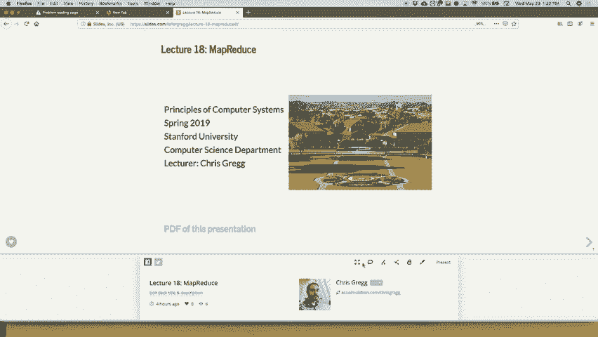

# 课程 P19：第18讲 MapReduce 🗺️➡️📊

在本节课中，我们将学习 MapReduce 算法的核心概念、工作原理，并通过一个具体的单词计数示例来理解其处理流程。我们还将了解如何将其应用于分布式计算环境，并初步探讨相关编程作业的框架。


---

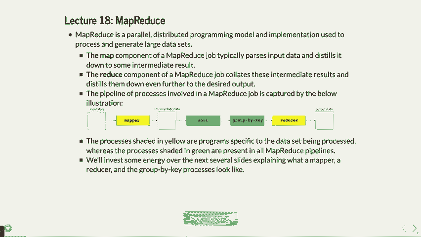


## 概述


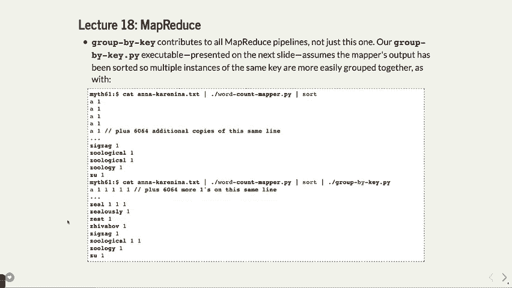

MapReduce 是一种用于处理大规模数据集的编程模型和算法，最初由 Google 提出。它的核心思想是将复杂的计算任务分解为两个主要阶段：**映射（Map）** 和 **归约（Reduce）**，从而能够高效地在成百上千台服务器上并行处理数据。本节课我们将解析其工作原理，并通过一个实例演示完整的处理流程。

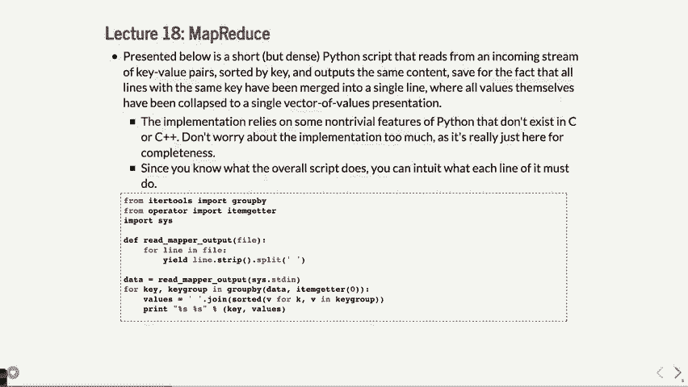

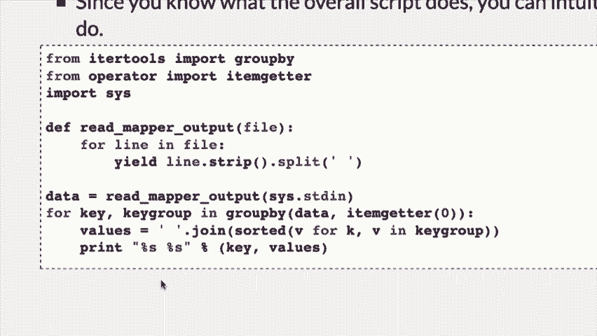


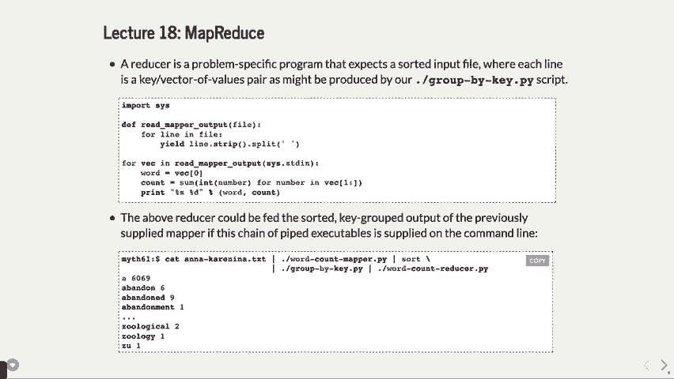


---

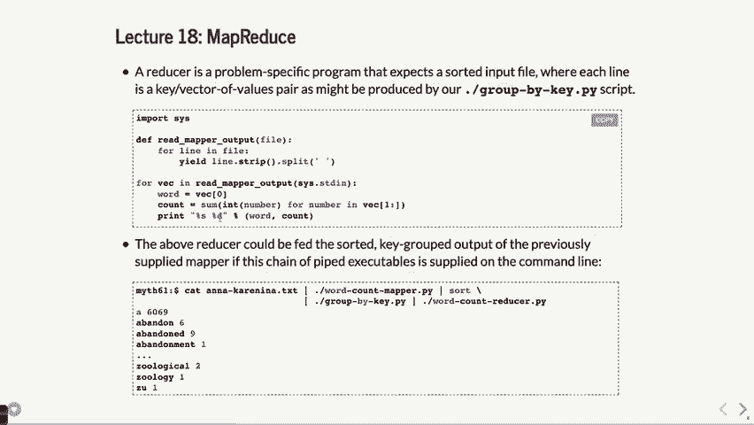

## MapReduce 核心流程


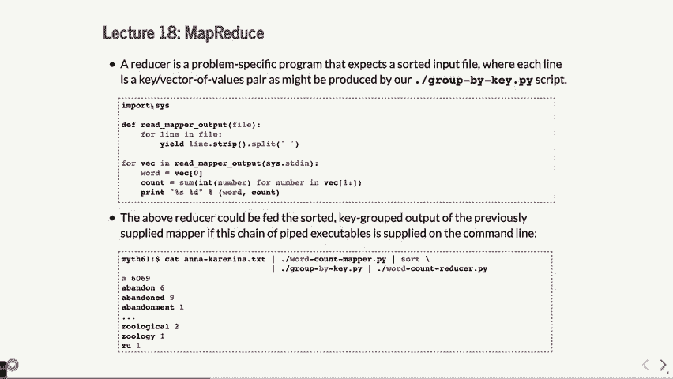

上一节我们介绍了 MapReduce 的基本概念，本节中我们来看看其标准工作流程。整个过程通常包含以下几个步骤：


1.  **映射（Map）**：将输入数据分割成多个片段，由不同的工作节点（或线程）并行处理。每个映射器处理一个数据片段，并生成一组中间键值对。
    *   在单词计数例子中，映射器读取文本，为每个单词输出 `(单词, 1)` 这样的键值对。
    *   代码示例（Python映射器逻辑）：
        ```python
        for word in line.split():
            print(f"{word.lower()} 1")
        ```

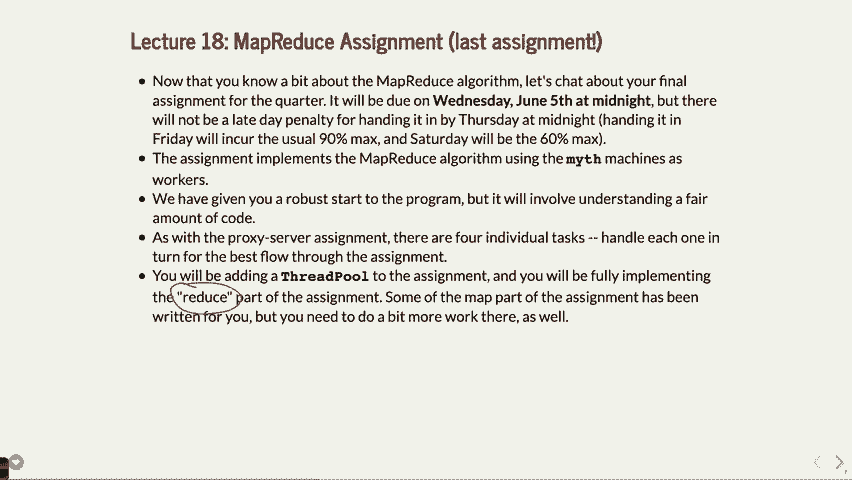


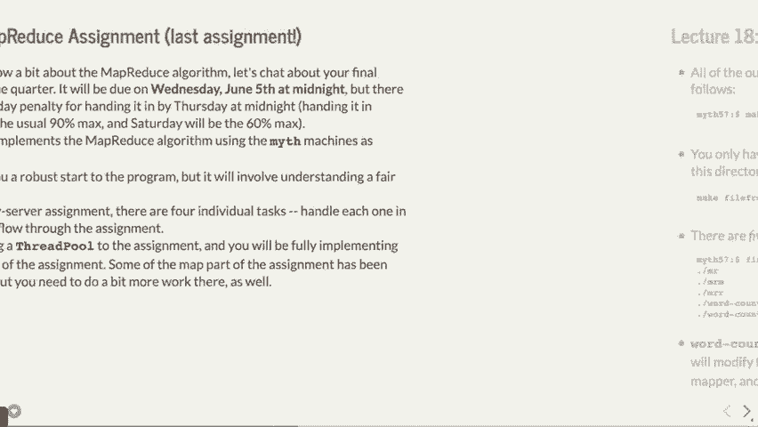

2.  **洗牌与排序（Shuffle & Sort）**：系统将所有映射器生成的中间结果按照键（如单词）进行收集和排序，确保相同键的数据被发送到同一个归约器。


3.  **归约（Reduce）**：每个归约器接收属于特定键的所有值，执行汇总操作（如求和、求平均等），并生成最终的输出结果。
    *   在单词计数例子中，归约器对同一个单词的所有 `1` 进行求和。
    *   公式描述：对于键 `k`，其最终计数为 `count(k) = sum(v1, v2, ..., vn)`，其中每个 `v` 都是 `1`。


这个流程使得处理海量数据成为可能，并且对单点故障具有很好的容错性。


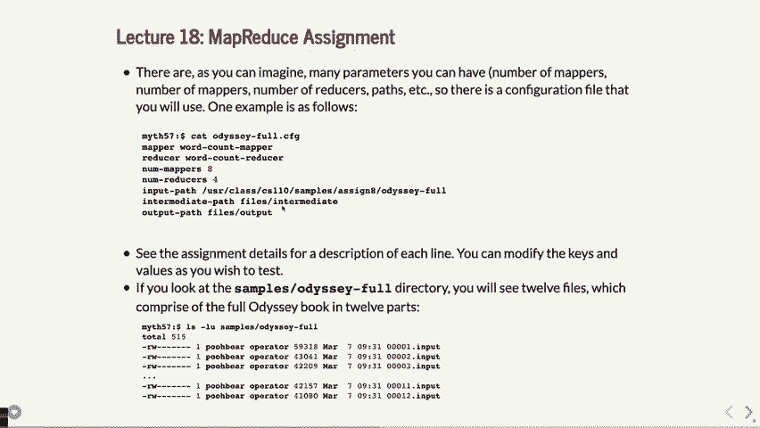


---


## 单词计数示例详解


现在，我们通过一个具体的例子，将上述流程串联起来。假设我们要统计一段文本中各个单词的出现次数。


以下是处理步骤：

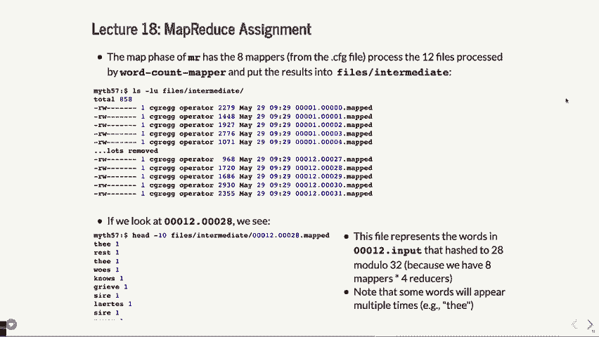


1.  **映射阶段**：输入文本被分割。映射程序读取文本，每遇到一个单词，就输出一行“单词 1”。
    *   例如，句子 “hello world hello” 经过映射后，会生成：
        ```
        hello 1
        world 1
        hello 1
        ```

2.  **排序阶段**：将映射器的所有输出收集起来，并按单词进行排序。
    *   排序后得到：
        ```
        hello 1
        hello 1
        world 1
        ```


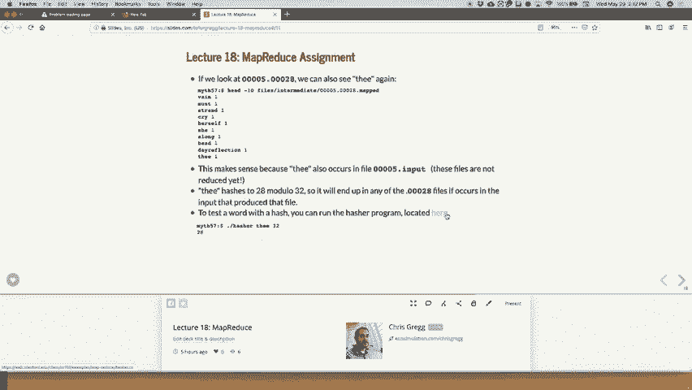


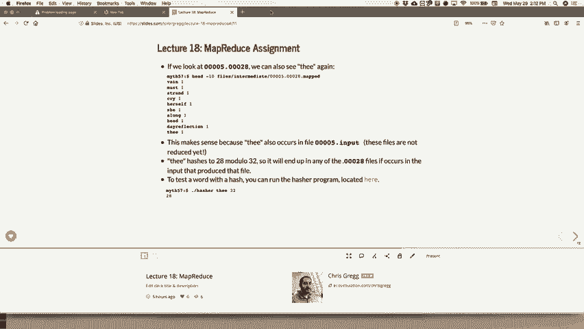

3.  **归约阶段**：归约程序读取已排序的数据。每当遇到一个新的单词，就开始对它的所有计数值（都是1）进行累加，直到下一个单词出现。
    *   处理 “hello” 时，累加两个1，得到2。
    *   处理 “world” 时，累加一个1，得到1。
    *   最终输出：
        ```
        hello 2
        world 1
        ```


通过命令行工具，我们可以模拟这个过程：
```bash
# 1. 映射
cat input.txt | ./word_count_mapper > mapped_output.txt
# 2. 排序
sort mapped_output.txt > sorted_output.txt
# 3. 归约
./word_count_reducer < sorted_output.txt > final_output.txt
```

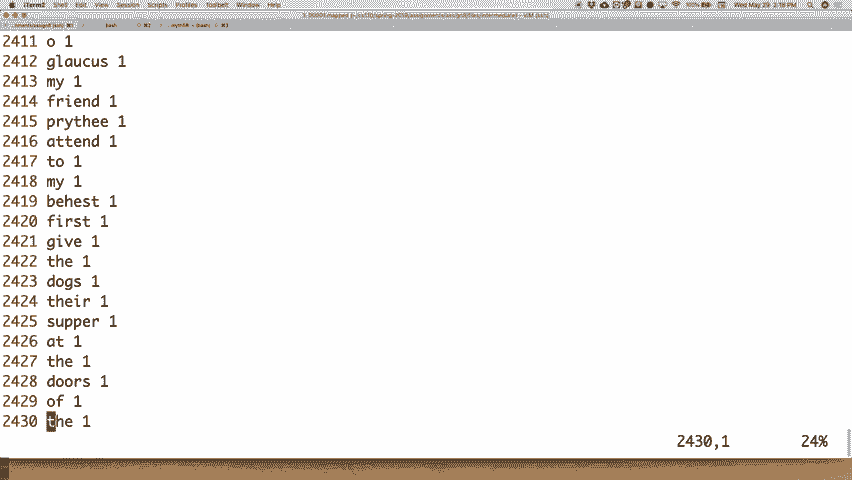


---


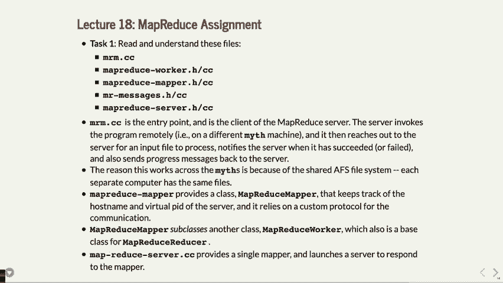

## 分布式实现与作业框架


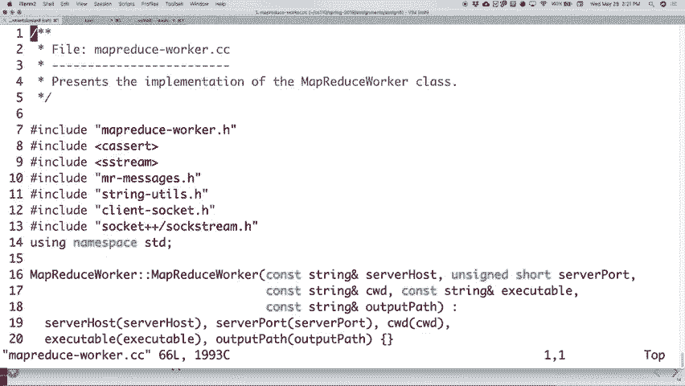


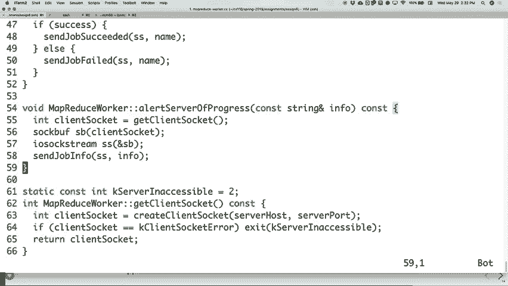

上一节我们看了单机上的流程，本节中我们来看看如何在分布式环境（如Myth集群）中实现MapReduce。关键在于利用共享文件系统进行任务协调和数据交换。


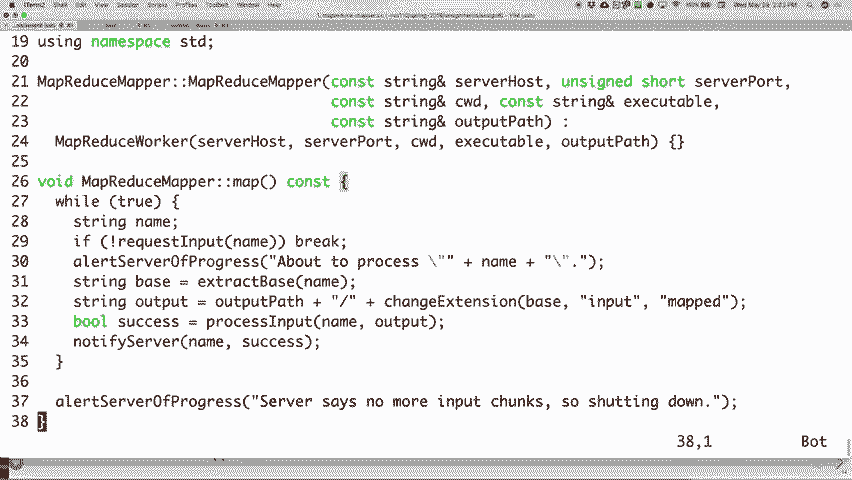

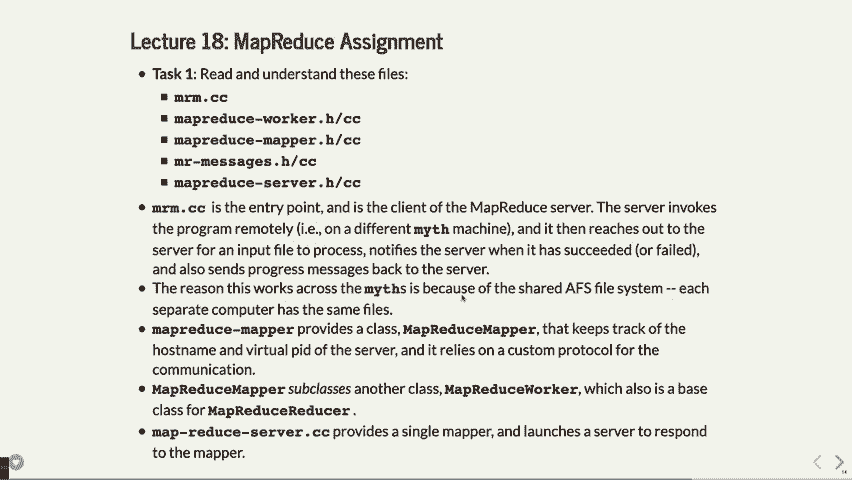


以下是作业中你需要完成的核心任务概览：


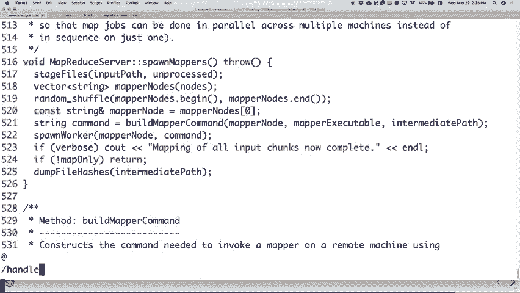

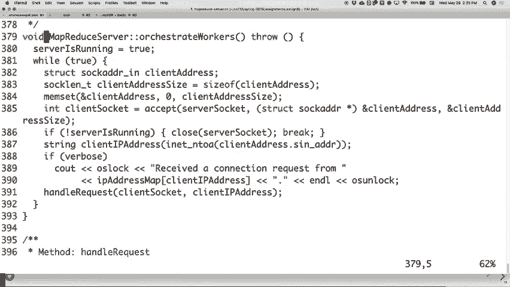


*   **任务一：理解代码框架**。仔细阅读提供的服务器端（MRM）、工作节点端（Mapper/Reducer）的C++代码，理解它们如何通过SSH通信和文件系统交互。
*   **任务二：实现多线程映射**。修改 `spawnMappers` 函数，使用线程池来并发启动多个映射任务，提高处理效率。你需要在此处正确添加锁机制，以保护共享资源。
*   **任务三：实现中间文件哈希分发**。修改映射过程，使其不仅生成一个 `.mapped` 文件，而是根据单词的哈希值将结果分散到多个文件中（例如 `00001.00028.mapped`）。这为后续的并行归约做准备。哈希函数可以通过 `hash<string> hasher; size_t hashValue = hasher(word) % numBuckets;` 实现。
*   **任务四：实现归约阶段**。这是最开放的部分。你需要编写归约器，使其能够：
    1.  收集所有属于同一哈希桶的中间文件（如所有以 `.00028.mapped` 结尾的文件）。
    2.  对这些文件中的内容进行排序和按键分组。
    3.  调用 `word_count_reducer`（或使用C++实现相同逻辑）对每个单词的计数进行汇总。
    4.  将最终结果写入输出文件，并清理临时文件。


整个作业利用了Myth机器共享文件系统的特性，使得不同机器上的进程可以通过读写特定路径的文件来交换数据，从而模拟了分布式计算。


---

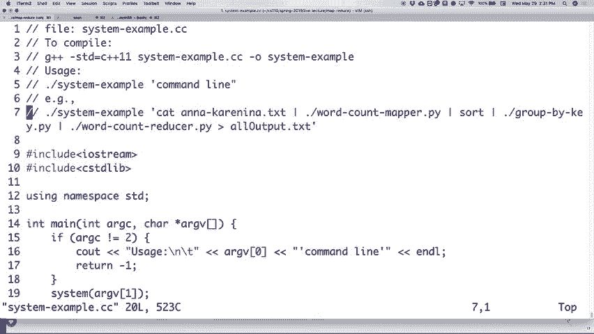

## 总结


本节课中我们一起学习了 MapReduce 这一强大的分布式计算模型。我们从其核心的 **Map** 和 **Reduce** 两阶段流程出发，通过一个详细的单词计数示例，逐步理解了数据如何从原始输入被映射为键值对，经过排序洗牌，最终被归约为汇总结果的过程。

我们还探讨了如何将这一模型应用到实际的分布式编程作业中，包括使用线程池并发执行任务、通过哈希函数分发数据以实现负载均衡，以及协调多个工作节点完成最终计算。理解这个框架，不仅有助于完成当前作业，也为将来处理大规模数据处理系统打下了坚实的基础。