# P2：Lecture 2 文件系统 - ___main___ - BV1ED4y1R7RJ

你好，大家好。欢迎回来，今天是CS110的第二天。今天我们有很多内容要覆盖。每天都有很多内容要学习。这门课的一个特点就是内容非常多。所以有几件事，我发布了第一份作业，今天我们会讨论这个作业。希望大家能开始做，如果你们还没有开始的话。

如果你昨晚或今天早上很早就下载了作业，请重新下载。我做了一些小修改，虽然不重要，但比如我发现，无论什么原因，当我打开PDF并尝试从PDF中复制某些内容（比如一些命令）并尝试运行它时，它看起来会像是。

你的程序没有正常工作，但其实是因为粘贴的代码中有隐藏字符。这让我困惑了一段时间，我想我的程序是正常的，但看起来并不是，所以重新下载那个，我想我已经修复了这个问题。那个问题真的很烦人，明明知道程序是正常的，却发现并不是。

只是因为你复制了代码，其中有一些隐藏字符。所以请重新下载它。我们来看一下Piazza是否正常运行，但在Piazza上已经有了一些问题。Piazza可能是你获取有关作业等信息的第一道防线。我一直在看Piazza，Tiazza也一直在看Piazza。

时间上，所以这是一个很好的地方来开始，如果你有问题的话。显然，来到Offsowers也是一个很好的选择，但很多问题在Piazza上就得到了回答，在它们在Offsowers或者其他地方回答之前，你不妨先去那里查看。好吧。

所以在周一我们开始讨论UMass，之后的一些问题表明我让你们有些困惑，因此我为此道歉。我只是想重新讨论一下UMass，或者说是重新讨论一下UMass，抱歉，我想给你们一个概述。顺便说一下，这不是课堂上最重要的部分。

我想从前几天开始，不是想让大家困惑，只是想再具体谈谈权限问题，尤其是它与UMass的关系，这样我就能让你们不再困惑，或者你们可以立即得到解答。好的，UMass的核心是让用户控制文件的默认权限。好的，所以它并不是完全关于。

这个程序是在尝试设置各种权限。它的意思是用户可以说：“嘿，当一个程序为我创建文件时，我不希望它给任何人全世界的读取权限。”这由用户来控制。如果你去你的终端，其实。

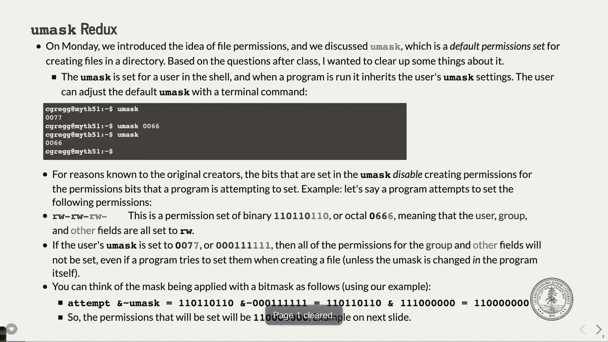

我们现在就做这个，输入UMass，如果你稍等一下。我不知道为什么我要等一下。等一下。没有，等一下让我再试一次。哦，这不好。等一下。好了，开始了。好的。如果你输入UMass，它会告诉你你的默认用户权限，对吧？事实上，记住077，我们稍后会详细讲解，这意味着第一个0。

第二个0表示它是一个八进制数字，实际上这个0表示用户可以设置任何权限。好的。所以它可以是读、写、执行，或者其他权限。程序尝试写入时，它将能够写入。7中的7表示组和其他人（不是所有者）不能直接写入，或者实际上不能写入。

已经设置了这些权限。好的。让我给你举个例子。好吧。如果我们实际执行以下操作，输入touch，比如test1.txt，然后执行ls -l test1.txt。好的。请注意，它为文件设置了读写权限，当你使用touch时，它不会设置执行权限。无论如何，touch文件会尝试为用户设置读写权限。

任何人都可以做。你掩码是因为077表示你不能这样做。好的。但是如果我把UMass改成0，好的，这样就不行了。如果我实际上检查它，没错，是0，这意味着如果我尝试为所有者、或者抱歉，是的，为所有者、其他人和组设置特定的权限，它现在会允许我这样做。所以如果我做touch test2.txt，让我们看看这是否有区别，test2。

txt。

猜猜看它是如何设置所有权限的。好的。所以一切都与用户控制有关，控制着无论程序如何设置权限，都会由你来设置。好的。换句话说，touch程序表示为所有者、组和其他人设置读写权限，而原始UMass则阻止了对组和其他人的权限设置。

好的。现在明白了发生了什么吗？基本上，UMass表示你作为用户可以控制它。如果另一个程序尝试设置权限，它不会允许，或者根据你的情况它会允许。对，问题。Touch实际上是创建一个空文件。是的，仅此而已。是的，UMass中的第一个。

哦，UMass中的第一个是它是一个八进制数。对。我相信就是这样，反正你在三位数前加0，表示它是一个Unix中的八进制数。这是非常常见的。那还有什么其他问题？对。所以这是一个很好的问题。问题是等一下，等一下。

一分钟。我以为所有三位都是1，也就是位都打开了。稍后我会讲解这个。U掩码是反转的。为什么？我查不出来。我做了很多搜索，我在想为什么会是这种情况？不太清楚。你怎么使用它，我会稍后展示给你。非常好的问题。是的。所以所有位都打开了。

为什么它们不在X文件里？这些文件是由各种其他原因创建的。比如其他程序创建了这些文件。是的。所以，它就是像`touch`命令的默认行为，不会尝试设置可执行权限。就这样。好的，让我们来详细看看一些其他的内容。

还有什么其他重要的事情吗？再说一次，这不是这门课程中最重要的部分，所以我不想花一个小时去讨论它的细节，除了说，权限有三个部分。第一个是所有者，我用红色表示。抱歉，色盲的朋友们，我道歉。所有者是红色的，然后我用绿色表示组，最后蓝色表示其他。

其他。其他人不在你的组内，也不是你。就这样。根据权限，这些只是位，对吧？所以如果你有一个权限，你想要的权限是R W - R W - R W -。那么它就是一一零一一零一一零，或者说，一一零恰好是八进制六。然后是八进制六和八进制六。好的，所以零六六六将是R W - R W -的权限。

R W -。好的。现在掩码做反转，就像它是反转一样，但我不完全确定为什么。其实我也不确定。哎呀。我也不确定为什么这个小黑色。等等。让我看看我能不能弄明白。

先把这个去掉。这有点奇怪。也许是他。等等，让我试试这个。没有。好吧。

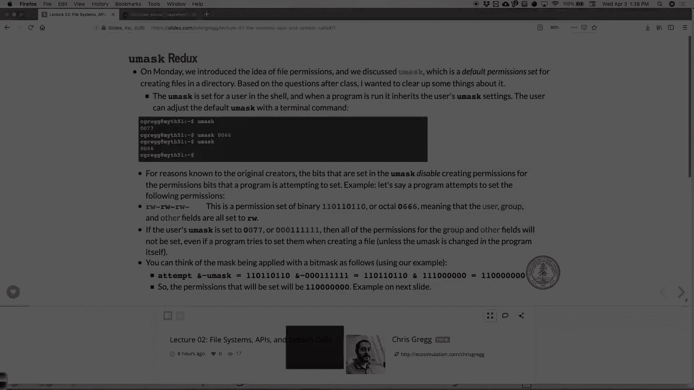

好的，它会在那儿停留一会儿。嗯，等等。是的，我不确定为什么。好吧，不管怎样。那个。

所以U掩码实际上是这样应用的。好的，如果U掩码是零零七或零七七。换句话说，所有的零七七。那就是这个U掩码，基本上意味着，你不能为你、组或者其他任何人创建权限。这就是它的底线。它的作用就是这样，尽管这其中有个奇怪的黑盒子。

但它基本上会做你试图设置的操作，通过按位与运算并与U掩码的反转结合，这就是它实际上设置权限的方式。好的，就是这样。我这里做了一个小示例，如果你试图设置这个R W - R W - R W -，并且你有一个U掩码是零或零和所有的1。然后它会做反转操作。

它与此对比，你就会得到这样的权限。这就是全部内容。关于这方面你还有其他问题吗？嗯？什么问题？对，那就让我给你展示一下。

这是一个好问题，关于什么是真正的组，再说一次，我希望我能去掉。

这个小东西。我真的不知道它为什么在那里，但哦，啊哈。我移动它了。我移动它了。

好的，它没了。好了。好了。我不知道它为什么在那里，但如果你做的话。

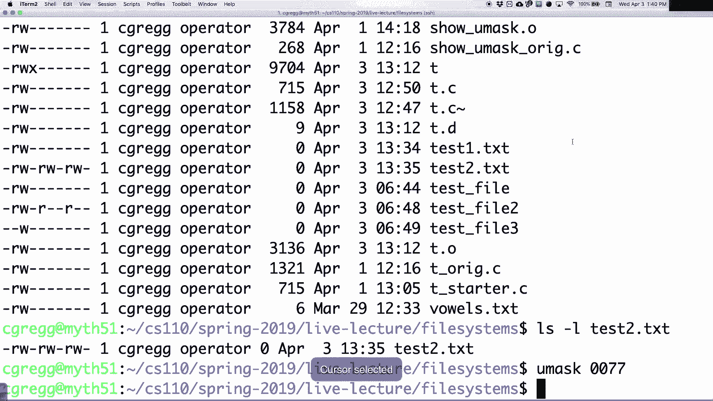

跟随并说这些组，这些都是组。我猜是挂起的。它只是组。组就是它吗？

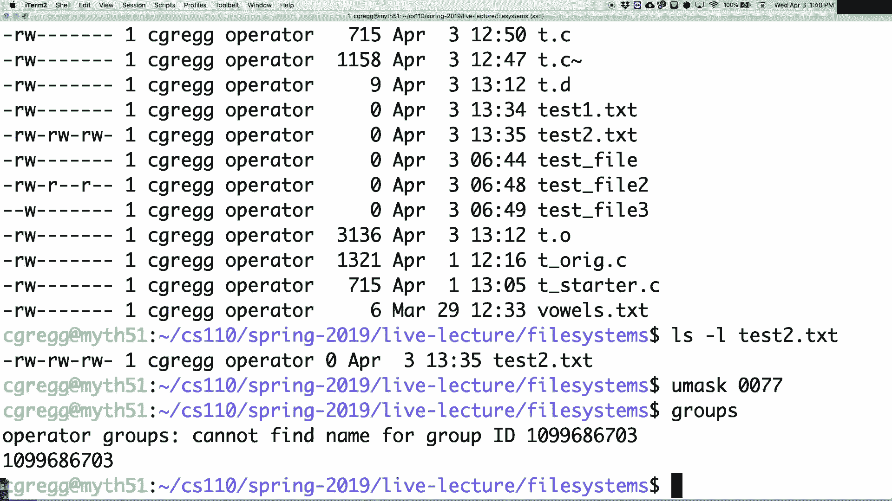

不。我以为是组。无论如何，你可以找出你属于哪些组，如果你查看特定文件，第二个文件是你这个文件的实际组。

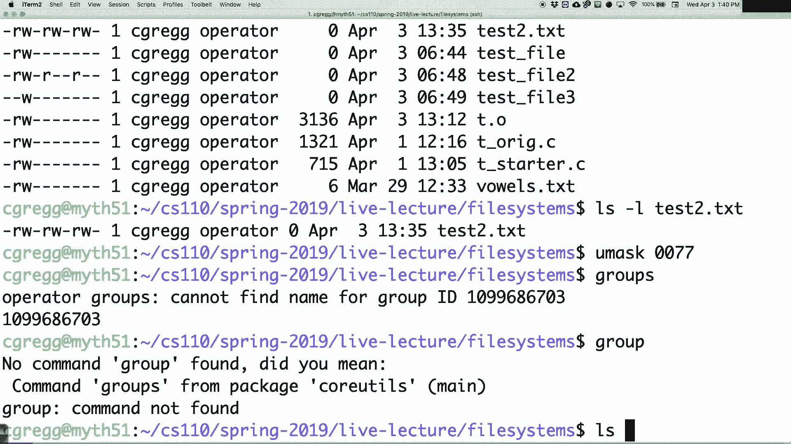

恰好属于。每个文件都有一个用户，然后有一个组，许多用户可能会用到它。我不确定操作员特别是什么，但它就是这样。如果有其他问题，大家有什么问题吗？还有手吗？好的，你的U mask并不是那么重要。它只是那样的。

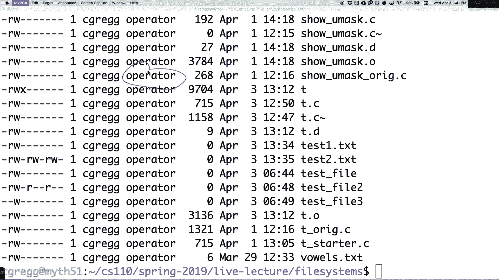

这是一个细致的事情。我想给你展示一下。好的。如果你这是另一个，另一个。

例如，我想是这个。基本上，如果你有我们前几天创建的文件，对吧。它基本上试图设置某些权限，在这种情况下是0644。你的U mask如果是零，它将允许你正确地设置所有这些权限。如果你改变了U mask，你可以通过相同的程序继承这个U mask并应用它。

并且只允许你在这里设置权限。现在。一个特定的程序可以修改U mask。所以如果程序修改了U mask，它就能够写入它。但这一切都与默认值有关，只要你知道程序试图做什么，作为用户你就可以控制它。

它。这就是底线。好的。好了。Unix文件系统很有趣。

好的。作业一。实际上有多少人已经看过了？哦，你们一半。好的。如果是这样。第一个作业是，首先，我们还没有覆盖足够的内容让你去做新的CS 110内容的作业。但我们想做的是，给你们一个关于CS106B和CS107的复习，并且稍微再提一下，嘿，你们得去学点C语言。

这是你在 106B 课程中没有学到的内容。好吧。这就是这个作业的核心内容。好的。这个作业的目的是让你赶上所有你需要为这门课做的编码技能。好吧。你们中的一些人已经给我发过邮件，说，天哪，我已经有两年半没学过 107 了，怎么办呢？那么。

这个作业将帮助你恢复速度。好的。作业本身，好的，是一个挺有趣的作业。它基本上叫做凯文·贝肯的六度分隔法（six degrees of Kevin Bacon）。那为什么是凯文·贝肯呢？嗯，凯文·贝肯恰好出演了很多电影。所以，如果你试图将凯文·贝肯与另一个演员联系起来。

很难找到凯文·贝肯（Kevin Bacon）出演的超过一部或两部电影，里面有一群演员，他们出现在许多不同的电影中。然后其他某个演员恰巧和其中一个演员出演了某部电影。你可以通过它们连接起来，像是通过一部电影的差异。好吧。所以这就是程序实际工作的方式。你可以。

你通过输入 `dot slash search` 来运行它，这是你将要处理的文件之一。然后你输入两个名字，在这种情况下是梅丽尔·斯特里普和杰克·尼科尔森。顺便提一下。许多演员，因为可能有很多同名的人，都在 IMDB 互联网电影数据库中，名字旁边有一个小小的罗马数字括号。这仅仅是表示。

那里可能有两个或三个以上的杰克·尼科尔森，你必须输入那个。所以你必须稍微小心一点。例如，麦当娜（Madonna）是另一个。如果你在测试这个代码时，在你测试一个尚未测试的特定名字之前，去 IMDB 上查找一下它们。如果。

如果他们的名字旁边有一个类似括号的符号，你必须输入那个。

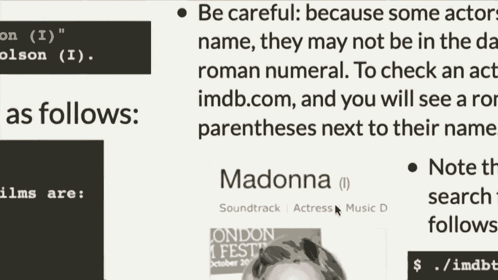

罗马数字。否则，它会说麦当娜不在搜索文件中。你会觉得程序坏了，实际上只是你没有正确输入对吧？好吧。所以就是这样。

它能工作。你可以输入 `dot slash search`，梅丽尔·斯特里普和杰克·尼科尔森。它可以正常工作。让我们。

你可以实际做这个。哦，不，又来了。等等。好了。好了。好了。我们来看看。我们将做作业，作业一。

你可以通过进行示例，输入 `samples slash search` 来测试这个。它有。

搜索解决方案。如果你输入梅丽尔·斯特里普（Meryl Streep），然后你输入 streak，streak，streak，可能会有一个。梅丽尔·斯特里普。我不确定。然后你输入杰克·尼科尔森（Jack Nicholson），括号里写着一，右吗？它应该会显示出来。

梅丽尔·斯特里普曾与杰克·尼科尔森有过对手戏。好的，试试别的。试着欺骗这个系统。给我两个我们可能听过的演员名字，随便两个。杰瑞·凯恩。杰瑞·凯恩，之前和我们班讲过的那位。我觉得可能不止一个。

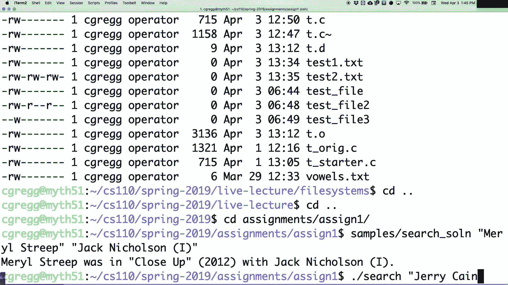

然后我们试试梅丽尔·斯特里普。为什么不呢？他可能没出演过，嗯，我做错了什么？

忘了加引号，谢谢。好了。这样就好了。所以是杰瑞·凯恩。不是在这里讲课的那位。

他参演过一部叫做《没有规则》的电影，和一个叫唐·弗莱的人一起演的。唐·弗莱曾与梅丽尔·斯特里普一起出演《姑妈的霸凌》，对吧？其实真的很难找到一两部不一样的电影。给我一些我们听过的其他人的名字。抱歉？迈克尔·乔丹。

迈克尔·乔丹是在哪个？这里的乔丹，还是迈克尔·乔丹？他参演过《太空大灌篮》。好的，可能不止一个，我们试试这个。乔丹。

然后还有其他人吗？基努。是这个拼写对吗？

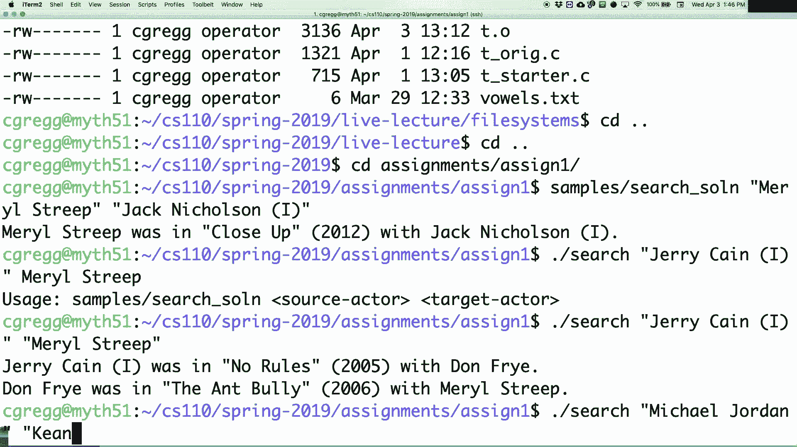

我想是这样。好的。没找到迈克尔·乔丹，可能不止一个。所以我们就看看是不是第一个。应该不是。好了。迈克尔·乔丹出现在《瞬间决定》，谁知道呢。

那个“瑞克”，我不确定它听起来怎样。还有那个与连锁反应有关的其他人。所以很难，对吧？你可以追溯很久。让我们看看迈克尔·乔丹，或者试试查理·卓别林？

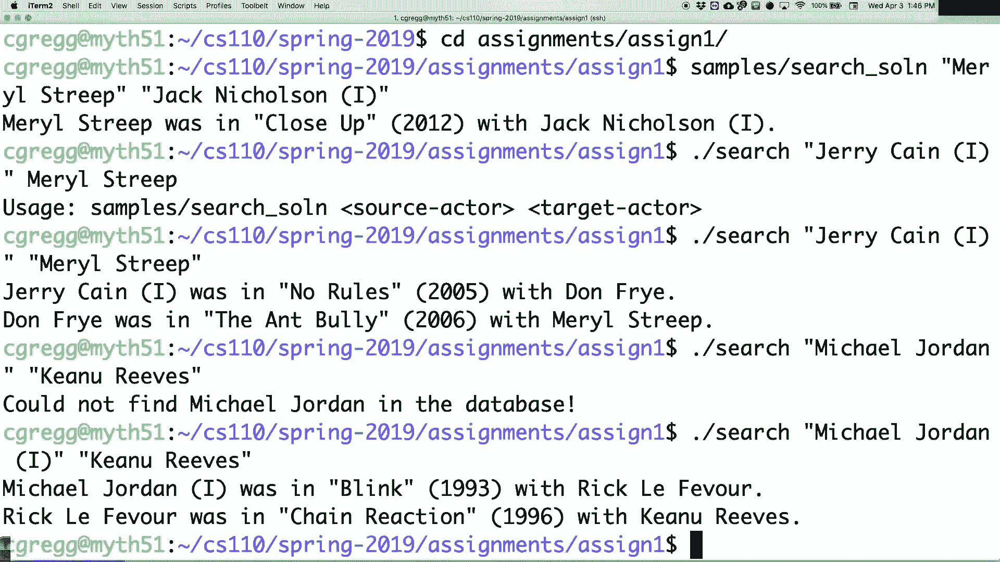

好吧。那是很久以前的事了，对吧？我在想，可能是，我还没有试过那个。很有趣。真的很有趣。我们再等一下。

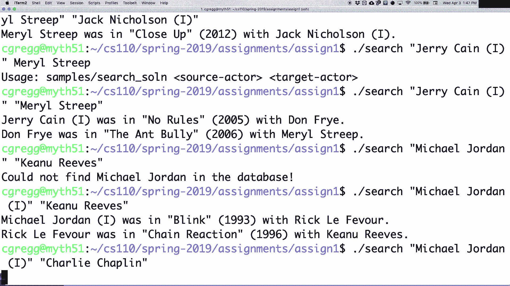

大概是几秒钟。可能是，嗯，我不确定是什么问题。让我试试。让我试试，大家。之前应该试这些东西的。但我们再试一次梅丽尔·斯特里普。

是的，这很有趣。我想知道查理·卓别林是不是，嗯，应该不会，嗯。

我不知道。那很奇怪。那罗纳德·里根呢？

我觉得是文件系统的问题。稍等一下。我们再试试，看看会不会。

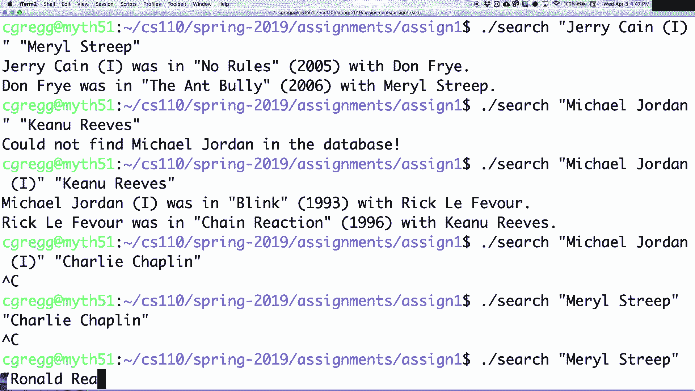

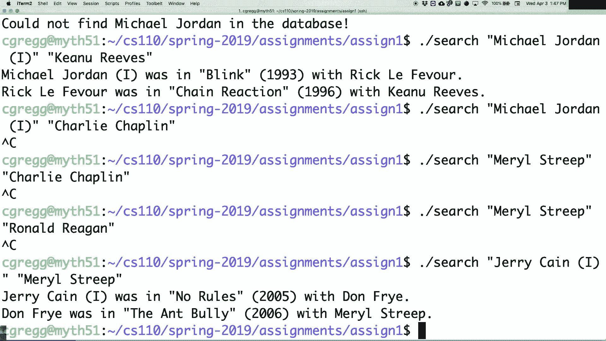

我不知道。我不知道。这很奇怪。好吧，无论如何，你大致明白了。你可以。即使有点疯狂，但你也可以做一些事情，比如进行 IMDB 测试。首先做什么，比如检查并查看它。我们就检查一下。哦，你知道吗，是查尔斯？现在我想它可能是查尔斯。啊，来了，可能是。

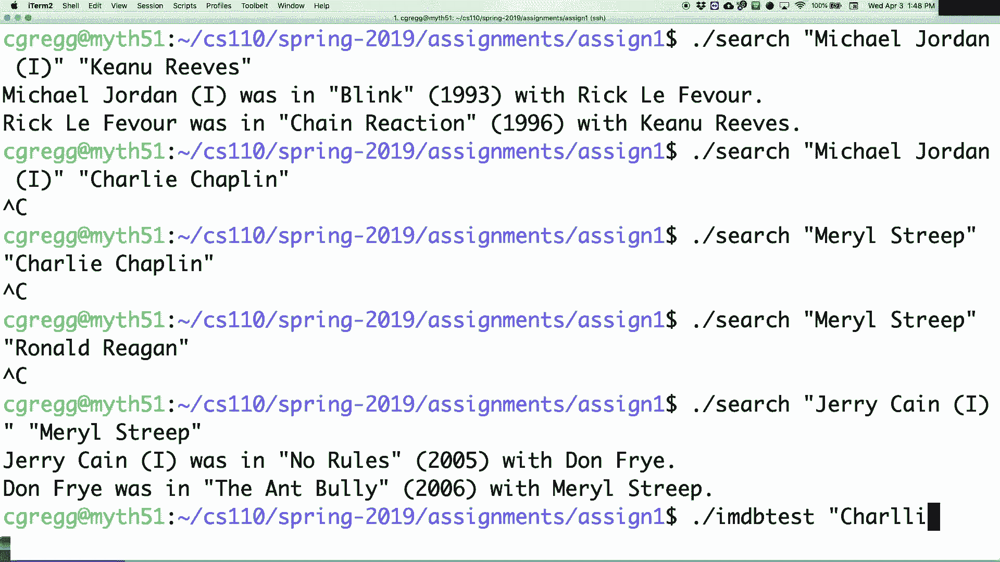

这就是之前的问题。好的，等一下，等一下，等一下。我不知道为什么我没告诉你。

让我们看看查尔斯。好了。好的。那么 IMDB 数据库有一个问题。查理·卓别林并没有在 2006 年活着。他大概在 1970 年或那时去世了。但是每当有人在电影中出现片段时，他们也会把他放在这里。所以它有点。

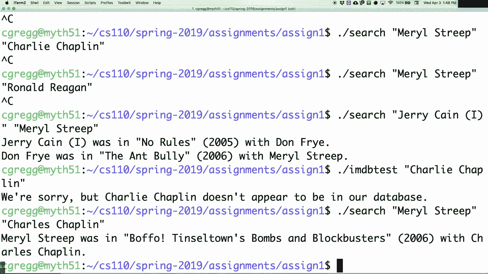

稍微复杂一点。无论如何，就是这样。但你可以做 IMDB 证书测试。如果我们做的话。

查理·卓别林，那么它会告诉你他参演了成千上万的电影，并列出其中一部分，不是全部。你可以通过这种方式测试你的程序。好的。那么这就是关于这个工作原理的基本想法。好的，接下来我们来讨论一个。

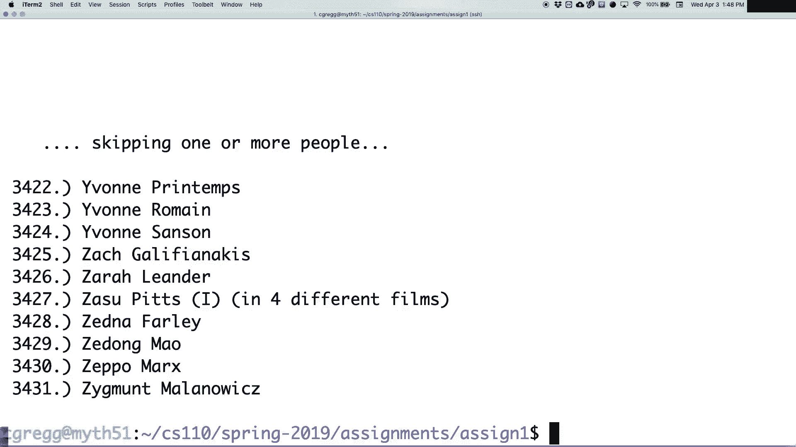

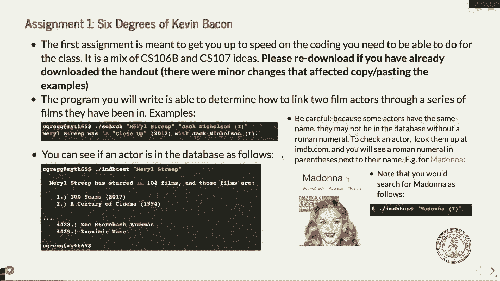

详细一点。这里有两个大文件，"大"指的是包含数十万条名字的文件。一个叫做演员文件，另一个叫做电影文件。它们的设置方式是，你可以对其进行二分查找。好的。演员文件包含了一堆偏移量，指向文件中不同演员的位置。然后它们列出了演员的名字。

所有演员参演的电影。电影数据库则是相反的。它包含电影，和指向电影文件的多个偏移量。然后电影会标明演员。好的，这些文件的大小足够大，以至于你不想一次性读取它们。首先。但实际上，我们已经把很多内容封装在了背后。

对你来说，你不需要担心你没读到这些内容。只需要知道你实际上并不是在读取，你只是跳转到文件中的某个位置并读取一点内容。但这些文件的关键之处在于，你可以在它们上进行二分查找。它们按字母顺序排列，以便你可以进行二分查找。二分查找非常棒，正如你所知。

从 CS106B 的课程中非常快速，因为他们把问题分解成块，然后采用分治法等等。所以你得弄清楚如何正确地索引这个奇怪的文件，它包含了所有这些偏移量，里面有许多不同的细节。这就是 CS107 的部分。好的。这是你会说，“哦，天啊，我得记住，我得记住怎么做。”

你需要做指针运算、指针算术运算，进行索引等操作。还要处理“越界”错误，等等。但这些是 CS107 的内容。明白吗？C++ 部分是，你将使用标准模板库，它类似于你在 106B 或 106A 中使用的斯坦福库，但又有些不同。具体来说，你需要使用一个函数。

lower bound 是一个标准模板库函数，它为你执行二分查找。事实上，Piazza 上已经有一个问题问了，嘿，我们可以用递归来做这个查找吗？我说，哇，我们知道查找不需要递归，因为 lower bound 会执行递归，它做的是二分查找。明白了吗？

这个概念是你设置 lower bound 函数，它会在你的数据中进行查找，但你必须正确设置它。明白吗？但是这些都是 106B 课程中你将要处理的内容。这个 lower bound 函数，它有点有趣。它返回的是我们所说的迭代器。至少在这个作业中，迭代器相当于指针，因为它是一个迭代器。

它允许你向其中添加元素，并允许你继续迭代列表中的下一个元素。这就是它的作用。你将能够学到这些内容。这就是这一周的重点。如果你还不知道什么是迭代器，那就去了解一下。明白吗？一旦你搞清楚了这一切，你就能应对自如了。

你能够在这个数据库中进行搜索。好了，现在你实际上必须将一和二连接起来。好吧，怎么做呢？

你将进行广度优先搜索。啊，又是 106B 的内容。对吧。你需要记住如何做广度优先搜索。我给你个提示，你可能想使用队列，或者在我们的例子中使用列表，它实际上是队列的另一种表现形式。所以这些就是作业中的重点。好了，现在我们来多聊聊这个 lower bound。

花了几分钟。作业本身要求你使用 STL 的 lower bound 算法。哦，太好了。你必须用它来执行二分查找，同时你还要使用 C++ 的 lambda，也就是匿名函数，带有捕获子句来提供无名的比较函数。你可能会想，我以前从未见过这个，对吧？我们甚至还没有...

你还没有学会吗？好了，我现在要稍微讲一下这个概念。C++ 中的 lambda，它是一个新的概念，如果你曾经做过 JavaScript 的话，你肯定用过这些，尽管你可能不知道它们的名称。它是一个被作为参数内联传递给另一个函数的函数，明白吗？

它期望的参数本身是一个函数。所以这有点像是“盗梦空间”，对吧？

你在107课程中已经学过函数指针了。好的。所以如果你还记得107，你谈到过函数指针。这是一个内联的函数指针，而不像你设置的其他函数。好的。例如，你还记得107中的Q sort函数吧？

最后。

这里的参数是a，哎呀，不对，是一个你必须定义的比较函数。

你把它传给Q sort。好的。Q sort根本不知道这个函数是如何工作的。它只知道，我有两个指针，我会把它们传给这个函数。我会得到一个零，一个负一或一个一，表示它是更小的、更大的，还是相等的。它就知道这些，对吧？

这就是函数指针的全部内容。你给这个其他函数，传入一个函数指针，告诉它，“嘿，我会为你做点什么，使用它吧。” 就是这么简单。就这样。好吧。让我们看一个小程序。

关于这个。好的，我刚做了一个简单的程序来实现以下内容。好的。在这个程序中，好吧。我创建了两个，嗯，我们从这个开始。我创建了一个叫做modified VEC的函数。它的作用是，我们现在在C++的世界里，所以它通过引用接收一个C++向量。好的。它接收一个值，还接收一个this，这是C++中函数指针的表示方式。你可以这么理解。

就是这样。好的。它的意思是，它要求给我一个返回整数并接受两个整数作为参数的函数。好的。它要做的是基本上遍历向量，然后传入该向量元素（实际上是传引用），然后，嗯。实际上它会得到引用。它将传入该值。

它将传入向量中的值，然后应用那个操作。这就是它所做的。它基本上是根据某些操作更新向量中的新值。好的。那么，我做了哪两种操作？我碰巧做了一个叫做add的操作，基本上就是传入后返回x加y。非常简单。然后是subtract，它做的是x减y。

就是这么简单。好的。那么，我们在main函数中实际上做了什么？

我们从命令行中获取一些内容。然后我们创建一个向量，并调用这个修改过的向量函数里的操作。好吧。我在说修改这个向量，传入向量，传入我在命令行上输入的值来进行操作，然后是函数本身。好的。关键部分是，当你调用这个修改后的。

VEC 函数，尽管 add 是一个函数，它并不会立即被调用。这是一个关键点。当你说修改时，当你传入参数一、参数二、参数三时，这个参数并不会被调用，直到修改后的 VEC 实际上直接调用它。好吧，事情就是这样。它是这样工作的。好吧。

你可以通过说像 function pointer add 12 来测试它。我们做的事情是，它会把一、二、三、四、五、十、一百万这些数字加上12并输出。好吧，这应该对你们来说很熟悉，来自 CS107。好吧，如果不熟悉，或者有点生疏，没关系，看看这个例子。

弄清楚它是如何工作的，并提出问题，如果你有的话。好吧，但关键部分是，这是你传入一个的地方。

函数指针。好吧，现在让我们用这个叫做 lambda 函数的奇怪东西来重写这个。好吧，一切都一样，除了从这里到这里，然后接下来的代码也一样。发生的事情是，我们在说，好吧，太好了，传入这个向量，传入那个值，然后传入这个奇怪的东西，它实际上在函数内部有代码。

参数本身。看起来有点奇怪。但它只是内联代码，它会返回 x 加 y，对于参数 x 加 y 或者 x 和 y。好吧，完全相同的事情，只是注意到我没有在这里或者函数中写 add 或 subtract 程序。我只是做了完全相同的事情，内联的。这就是 lambda 让你能做的事情。好吧，lambda 做的事情是，它有。

以下是 lambda 函数的签名。它有一对花括号，或者说括起来的代码，稍微难看清楚。它有两个方括号，里面可以放一些内容，我们一会儿会讲这个。它有一个参数列表，参数列表，然后它包含了一些代码，放在花括号里。好吧，这是一个函数，它作为参数传递到另一个函数。好吧，它没有与之关联的名称。

它不需要一个名称。它就在内联里。好吧，这就是将会发生的事情。现在这是完全相同的程序。好吧，好吧，我们一会儿会讨论这些方括号中的奇怪东西是干什么用的。思考一下它一秒钟。到目前为止你有什么问题吗？你可能还没来得及思考清楚，但目前有什么问题吗？

好问题。问题是，这样做有什么好处？好处是你可以在内联中写？这是其中一个好处。通常这些函数比较简短，它们就在那儿，你可以马上看到它们。那很棒。另一个我们接下来会提到的好处是，lambda 的最大优势在于，它可以做一些你用函数指针无法做到的事情。

我们一会儿再讨论这个。但现在我只是想介绍一下它，并且，嗯，就这样，这和之前完全一样。接下来我们会深入了解新的内容。到目前为止，你有什么问题吗？好的。如果你觉得，哦。我以前没见过这个，再看一遍。

我们会到达那一步。现在事实证明，好的，假如，或者我应该说，如果我们实际上想要利用一些我们不想显式传递给函数的变量，并且这些变量不一定只是。一个变量。我们实际上可以在lambda函数中调用一个函数。它可能会使用。原始调用函数中的某些局部变量。让我给你展示一下我的意思。好的。这就是。

我们最初的代码。对吧。我们这里有一个函数，它接受两个东西。它接受一个值，它，接受或者说它接受两个值。好的。其中一个值来自这个向量。另一个我们传入函数。这就像12。它会把12加到向量中的每个元素上。

好的。但如果我们想把它改成只在我的函数中处理实际的向量元素本身。我不想通过使用这些函数参数传递另一个元素。好的。事实证明，这将会非常困难。事实上，我之前并不知道。

如果我知道如何用函数来做这个，使用一个普通的旧函数指针。好的。那么，怎么做呢？我马上给你演示一个例子。事实证明，在这种情况下，我们希望修改后的向量能够处理我们正在更新的值。换句话说，我们希望调用修改后的向量的函数来处理这个值，**在它进入我们修改后的向量函数之前**。

我们希望像预先排好我们要做的事情一样。用函数指针做这件事会非常难。使用lambda函数，实际上就能做到。

可能的。好的。接下来是你可能会怎么做。好的。现在我做了哪些不同的改变呢？我有。

我已经在这里做了更改。所以基本上，函数现在只是说。给我一个向量元素，我将用一些其他的值对它执行操作。而我们的操作。我们的修改后的向量函数，非常简单。它只需要知道从向量中取出一个元素，传递给这个操作函数，完成操作。然后它会为我们做剩下的所有事情。

但它仍然会添加这个。好吧，下面我说的是，好的。这现在是这里重要的部分，好的。我说，好的，传入修改后的向量。我们要改变的向量。然后是以下的lambda函数，好的，就是这个。它说只接受一个参数x，但使用v的值。

叫做val，它来自这个函数作用域，并且在修改后的x函数中使用。好吧，它将如何做到这一点？它会说返回x加那个值。换句话说，我不再将值作为参数传递，去修改它了。好吧，这就是这里发生的事情。这个方法通过捕获的概念来实现。

捕获表达式是说，把你想要传递给捕获的，或者传递给其他函数使用的lambda函数的局部变量或作用域中的变量放入方括号中。好吧。在这个例子中，我只是传递了val，然后我们在这里声明int x是。

然后我们在这里说返回x加val，分号和大括号，就像那样。我们在函数内部做的就是这个，它让你能够做到这一点。现在，你可能还是会觉得，嗯，这看起来似乎没什么不同。事实证明，如果是普通的函数指针，做这件事几乎是不可能的，第一点。

第二点，如果你在一个类的函数中，尝试调用一个非类函数，那会更加困难。好吧，做起来真的很难，尤其是当那个非类函数期望已经为你处理好一些事情，而这些事情并不在参数列表中时。好吧，这现在需要考虑很多东西。顺便提一下。

有很多方法可以通过将多个变量放入一个列表中来捕获多个变量，例如value one、value two等。你也可以通过引用来捕获它们。不幸的是，它看起来就像指针，但在这种情况下并不是指针，而是一个地址。如果你说百分号值，它会按引用传递值。

实际上，改变原始内容时，你需要处理大数据结构等等。现在，我提到这些并向你展示如何操作，是因为你必须这样做。对于这个作业，你需要在特定的位置使用那个下界函数，并返回到笔记中，去思考：“哦，这些东西到底是怎么工作的？”理解这些，你就能做到。

你应该能弄明白如何做这个作业了。是的。[听不清的问题]，是的。那么我们来思考一下我们试图做什么。如果我们有一个函数说，“好吧，你将给我一个函数指针”，在这种情况下，或者说只是一个函数那样的lambda函数，“但一个函数指针只有一个值，但那个值是依赖于……” 

原始调用函数中发生了其他事情。“换句话说，换句话说，这个vowel变量对吧？如果我不能将它传递给上面的函数，那怎么才能做到修改VEC呢？除非我能传入另一个变量？你知道，我显然可以通过传递那个其他变量来做到，但他们并不会为像下界这样的东西这么做。”

他们说，"这是，函数签名。你得到一个变量，或者你有一个函数传递进来，并且只有一个参数。你不能再有其他参数。" 你会说，"等等，我需要两个参数才能做到这个。我怎么传递另一个参数呢？"

我该怎么处理另一个呢？通过lambda函数来做。"好的。你说，"哦，我将在本地处理它，捕获我需要的变量，告诉函数如何处理那个变量。" 然后，当整个函数被传递到另一个函数时，一切都被处理好了。

就像它是一个黑箱一样，所有的事情都被处理到了原始函数或者你调用的那个函数。所以这些东西很微妙，但你稍后会看到，实际上，当你开始拆解作业时，你会遇到这一点，然后说，"我猜我可以使用一个常规函数。" 然后你会想，"哦，我做不到。这样行不通。这样的问题就出现了。"

进入实际操作。"你还有其他问题吗？没有？好的。再看看这些东西。上面有很多文档，如果有需要，欢迎来上办公时间。"

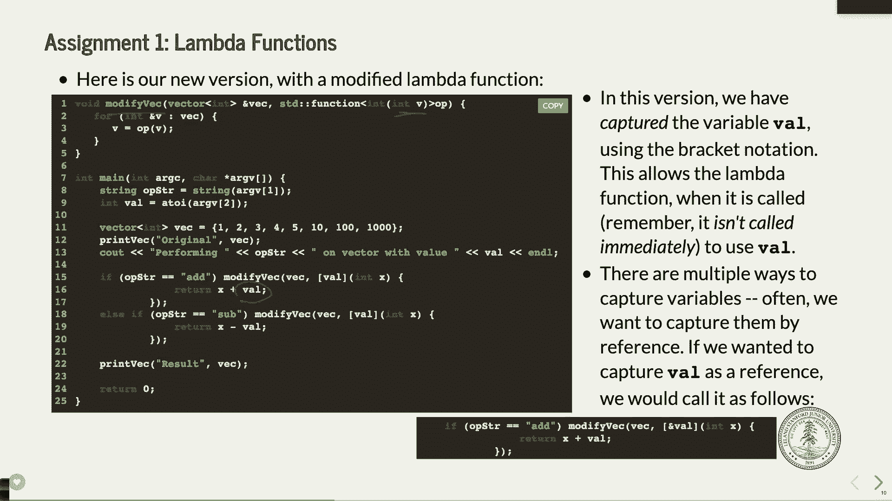

也可以看一下它。好的。好吧。还有什么评论？"它们对于C++类是至关重要的。正如我所说，类方法变量，你实际上不能通过引用将它们传递给其他函数，无论你怎么做。所以，必须使用，lambda函数。"

你可以通过使用this指针来捕获类中的所有变量。好的。正如我所说，你也可以一个接一个地处理它们。关于如何设置这些东西，还有一些细微差别，但如果你想通过引用传递this、Val和我的VEC，就是这样做的。好的。

当你进入这部分内容时，到课程结束、学期结束时，你会说，"我明白这些东西了。" 但第一次看到它时，你会想，"我不知道发生了什么。" 回到幻灯片，去Piazza上提问，然后在办公时间我们一起搞清楚。还有其他问题吗？好的。好了，我们回到刚才的内容。

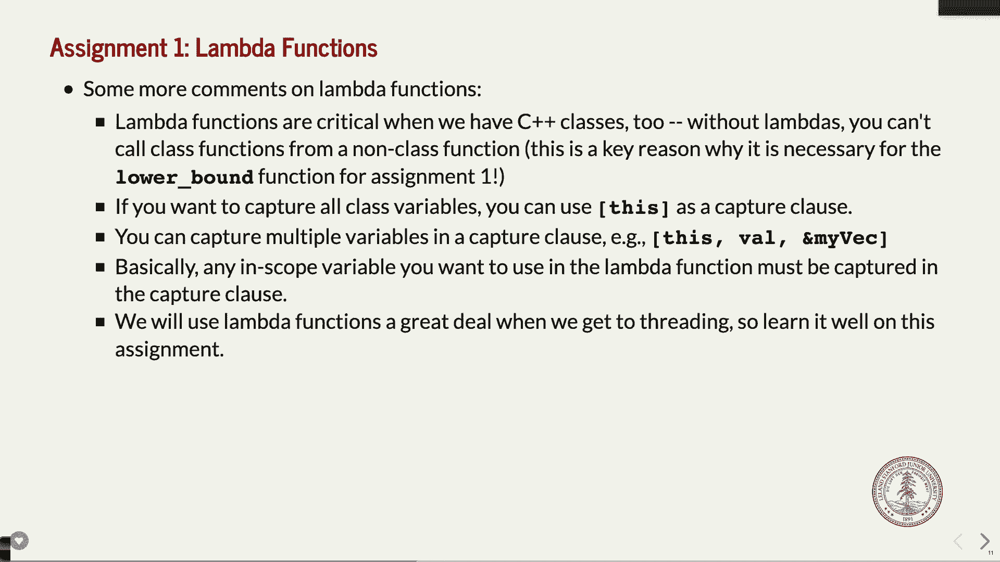

回到我们昨天的内容。我们要继续讨论文件系统。好的。昨天我以这个例子结束，基本上是重新实现了名为copy的CP命令。考虑到一切，这是一个相当简单的程序，基本上是说你有文件一和。

文件二，你想将文件一的内容复制到文件二，作为完全相同的副本。好的。我们做的就是，"好的，没问题。我们将设置一个文件描述符，它只是一个整数。我们将使用open命令来完成。然后我们会说它是只读的。"

所有的读取操作。我们将做完全相同的操作，只不过我们将创建一个文件，使用另一个文件描述符，通过open和使用只写O-create和O-X-C-L。我们将在接下来的几页中看到另一个例子。但这行代码表示，“如果文件不存在，则创建它。”对吧。如果已存在，报错。然后尝试进行以下权限操作。

可能会根据UMass的权限设置工作，也可能不会。再次强调，这并不是特别重要。好的。接着我们该做什么呢？我们设置一个小的缓冲区，这个缓冲区的大小可以根据需要任意设置。我们恰好设置为1024，因为我们想节省内存，假设如此，但如果你愿意，也可以设置得更大。接着我们有一个while循环，这里有一些关于while的疑问。

这个循环是为了从文件中一个接一个地读取1024个字节，或者说是1千字节，一个千字节，再来一个千字节。每次把那个千字节放入输出文件中。这就是第一个while循环的作用。好的。它是怎么工作的呢？嗯，它读取数据。

它从输入文件读取到缓冲区，在这个例子中是1024个字节。你不需要担心文件末尾可能有空字符，或者这些数据不一定是字符串。它们只是数据。所以你不需要担心，你可以读取所有1024个字节。好的。如果你得到的是零字节，意味着没有更多字节可以读取，然后你就可以结束了。

好的。如果你得到的字节数不是零，那意味着它们已经从文件中读取出来，你然后需要将它们写入到另一个文件。那么你该如何做呢？首先，你说，好的。我写入的字节数是零，我还没有写入任何字节。然后我会再做一个while循环，尝试写入所有这些字节。

就在这里。它将会在这里。它将尝试一次性将所有这些字节写入文件。好的。它将在输出文件中进行操作，它将把这么多字节索引到缓冲区中。第一次执行时当然是零，它将开始并尝试写入所有1024个字节。结果可能是它只写入了其中一部分字节。为什么？嗯。

这就是操作系统可以做到的。操作系统可以说，你想写入1024字节。我只允许你写入1个字节。抱歉，你得稍后再试。这就是这个while循环的意义所在。它会一直进行，直到你成功写入所有字节。好的。在本地文件中，1024字节通常不会失败。但如果你尝试...

一次读取一百万个字节，它可能会说，哦，你可以先读五十万个字节，然后下次再读另五十万个字节。好的。顺便提一下，正如我昨天提到的，`read` 命令会阻塞，直到这些字节被读取，至少有一些字节被读取。如果有字节可以读取，它会等到一些字节可用。

到目前为止，对于这个程序你有什么问题吗？有什么问题吗？没有。好的。那么，有趣的部分是，这是直接的、低级的。

好的。当我说低级时，所有你可能用来读写文件的其他方法，底层都会使用读取和写入来实现。好的。所以，如果你使用文件指针，比如在 C 语言中使用的，或者 C++ 中的 IO 流，它们本身也是通过读取和写入来完成工作的。好的。它们有一些其他的好处。它们可以缓冲连接。你还可以向后读取。

使用文件、星号或者 IO 流进行前向读取，你可以回放等等。你不能在读取和写入中做到这一点。你必须手动在库函数中处理这些细节。所以，读取和写入会很快，但它们并没有那么发展成熟，对吧？你必须通过那个 while 循环来写出数据，否则你可能会漏写一些字节。

好的。这些是关于读取和写入的主要内容。好的。有问题吗？有什么问题吗？

好的。那么，让我们进入另一个程序，叫做 T。好的。现在，T 是一个你可以使用的程序。

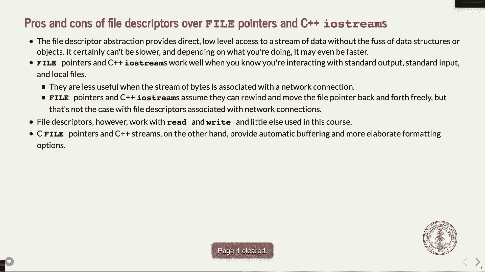

这是 Linux 内置的。好的。T 就是这么工作的。好的。T 做的是以下几件事。它说：

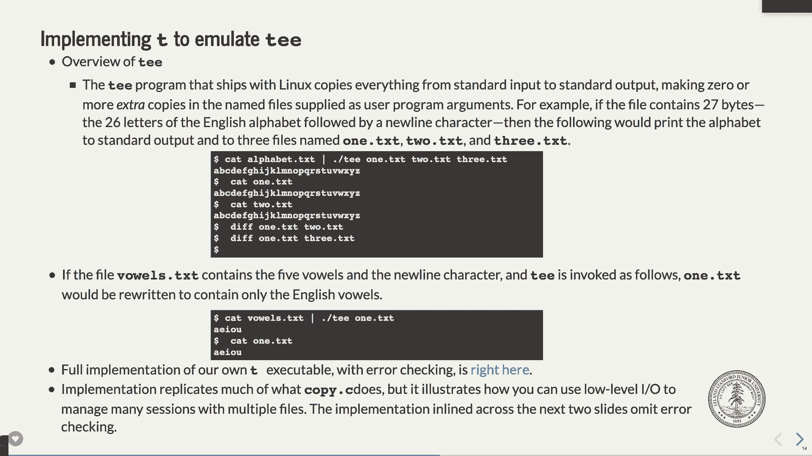

好的。从命令行获取输入或通过另一个文件传入，然后输出到屏幕并打印到任何一个文件中。好的。例如，我可以说 `cat`，比如 `T.C`，这是我有的文件。`cat T.C`。不，我没有 T.C。等一下。也许……不在那里。也许如果我去正确的文件夹，看看讲座文件夹，然后是文件系统。好了。

如果我输入 `cat T.C`，它会打印到屏幕上。如果我输入 `cat T.C` 然后通过管道传入 T 程序，好的。它会说，好的，我将打印到屏幕上，然后将它复制到 T2.C、T3.C、T4.C 或其他地方。它会这么做。所以，它应该打印到屏幕上，正如它做的那样。然后，如果我们查看 T2.C，它也在那里。并且。

对于 T3.C 和 T4.C，情况是一样的。好的。你明白 T 是在做什么吗？是的。

它正在创建那些新文件吗？它正在创建它们。如果它们已经存在。如果它们已经存在。我们来试试。让我们看看，如果我们，假设输入一个文件，叫做`d.txt`，内容是`abcd`。然后我们试试完全一样的操作，不过现在我们要将`cat D`输入到`d.txt`，然后是`this.txt`，然后是`T2.T3`和`T4`，`T2.C`。没错，它会覆盖它。没错。所以它不在乎。在这种情况下，它会覆盖它。好吧。

所以要理解这里发生了什么，拿一个文件，或者标准输入并执行。顺便说一句，标准输入通常是你键入的内容。标准输入的作用就是这个。如果我们做同样的事情，假设我说，不是输入`cat D.txt`，而是输入，好的，`T2.D3.4`。对吧？然后我开始输入。这是一些文本。对吧？嗯，它会将其重复一遍。它做了什么呢？

它拿到了这个。这是一些文本，它打印到屏幕上，并且把它们写入到文件中。然后这是一些更多的文本。它会做同样的事情，直到我输入控制键`D`，它表示文件结束。顺便说一下，那个意思就是这样。然后如果我们看一下，看看现在`T2.C`，它就是这些文本。这是，另一段文本。好吧。

所以标准输入就是你键入或者从另一个文件的输出获取信息。这个小的管道符号就是干这个用的。好吧。你会在这门课结束之前非常熟悉这个管道符号。我保证。好吧。好了，让我们看一下`T.C`。让我们实际看看我们怎么做这个。好吧。那么，我需要做什么？我们说的是拿标准输入。我们。

我们得弄明白怎么做。我们将把标准输入打印到标准输出。我们得弄明白怎么做。然后我们得打开命令行上输入的文件数目，并打开它们，把数据写入这些文件。我们可能需要帮助我们的函数来处理这个问题，因为看起来这里会有很多事情要发生。好吧。

但是让我们，实际上从这里开始，假设，好的，没问题。关于文件描述符。如果我们有一个命令行，你还记得命令行是`argv`和`argc`吗？`argc`表示你在命令行上输入的不同项的数量。第一个是程序的名称，后面是你在程序名后面输入的内容。

好吧，我们需要创建`argc`数量的文件。为什么？如果我输入，看看这个，如果我输入`t abc.txt def.txt`，对吧，实际上我们有一个输出文件。我们有一个`abc.txt`的文件，还有一个`def.txt`的文件。命令行上的三项内容意味着`argc`将是三。结果我们需要的文件描述符就是这么多。

好吧。那么我们回到这里，做这件事。好吧。那么我们实际上需要创建它们，这些文件，除了标准输入之外，对吧，或者说在这种情况下是标准输出。好吧，因为标准输出已经为你创建好了。事实上，它已经存在了。它是这样工作的。好吧。`FDS0`在这种情况下等于`STDOUT`，标准输出文件。就是这么叫的。

标准输出和标准输入已经存在。还有另一个。还有一个。标准，嗯，还有标准输入文件。还有标准错误文件或标准错误文件。因为有时你希望程序打印常规输出，也输出错误信息或调试信息或其他的。就是这样。

会为你创建三种不同类型的文件，随着我们继续进行。好的。就是这样。然后，我们必须打开所有其他文件。我们就这样做吧。size t i等于一。我们已经创建了FDS0。i等于一。i小于argc。i加加。好的。然后我们要做的是。

我们将要说FDSi等于打开argv的i。然后现在我们要做的，好的。我们将写输出到这些文件。所以只写。好的。然后我们要，数量。我们将按位或与o create，因为我们正在创建文件。然后。还有一个我们还没有见过的叫做o trunk。这是那个会检查文件是否存在的。

如果文件已经存在，先清空它，再把其他内容写进去。这正是你问题的所在。然后我们可以说，哦，试试做044，但我们知道那可能行也可能不行。好的。这就是我们这样做的方式。现在我们已经打开了所有那些文件，准备输出数据。好的。现在我们来读取数据。字符缓冲区这次设为2048。为什么不呢？好的。

当条件为真时。这将与我们之前做的非常相似。好的。当条件为真时。S size。tier。记住那是一个有符号整数，表示读取的字节数，等于read。我们将从哪里读取。标准输入文件编号。这就是我们所说的。我们说我们从输入文件中读取，或者从另一个文件中通过管道传入的数据，或者通过管道传入的输出，缓冲区的大小是缓冲区。好的。

所以我们这样做。好的。然后如果num red等于零，意味着我们完成了，因为没有其他事情要做。这就是我们将在这里使用我们的小助手函数，来将输出写入所有不同的文件。所以让我们看看，我们再做一个size t i等于零，i小于rc，i加加，我们需要做所有的文件。我们将做一个叫做write all的函数，它会写入。

第二个。然后我们将做的是将其写入缓冲区。我在这种情况下，然后，或者写入文件描述符。然后是读取的字节数。好的。然后那样做。抱歉，屏幕太小了。然后我们将，看看。那是一行，所以实际上可以工作。然后之后我们完成了对所有文件的写入。

我们必须关闭它们。嗯，我们最好再做一个size t i等于零，i小于rc，i加加。对吧。然后在这种情况下，我们将关闭fds i。如果你想的话，可以关闭输入。如果你在程序中用完了它，关闭它。它在其他可能正在运行的程序中仍然是打开的。所以这不是说你会破坏任何人的东西。好的。

然后现在我们可以返回零，我可能已经在那里写了。好了。就这样。让我们看看是否有任何问题。可能会有问题，因为我们还没有创建 `write all` 函数。但是。

让我们看看，比较运算符并没有它们的数学意义。哦不。

第21行。你们注意到了吗？21行。好了，谢谢。分号。好了。更好了。再试试。哎呀。哦不。我做了什么？好了。

好了。我们来看看。隐式声明和标准输出文件，分层。我们来看看。标准。哦。文件号就是它的内容。谢谢，我之前弄错了。

它是标准输出文件，像这样。文件新建，就这样。我想是一样的。那里。

我们来做同样的事情。好的。再试一次。好的。现在我们需要做的就是快速。

写那个其他函数，就是 `write all`，它应该看起来和 `copy` 函数非常相似。静态 `void write all`，静态函数做什么？

记住，这只在当前文件中可见。你应该把你的本地函数写成静态的。因为如果可以避免，最好不要污染命名空间。好了。我们将做一个缓冲区和一个长度。好吧。在这个函数中，我们将做。我们之前做过的完全一样的事情。Size T num_written = 0。然后在 num。

如果写入的字节数少于传入的长度，我们将执行我们要做的操作。num_written += write。我们将通过每一个文件写入。好的。写入到文件。描述符，我们传入的缓冲区加上我们已经写入的字节数。再加上。长度减去已经写入的字节数。这应该可以了。就这些，我们的函数就是这样。

问题。是的。这里。是的。那么这是什么意思？记住 `T` 命令在做什么。它正在从你输入的内容读取，也就是标准输入。所以在这种情况下，我们必须打开那个文件，或者说我们必须设置它，因为它已经是。

为你打开。所以我们需要那个文件描述符。这就是我们做的方式。好问题。在我尝试之前，有没有问题？对。没有，这是“或”运算符，所以你可以按任何顺序做。完全可以。就像这样关联。好问题。还有其他人吗？好了，让我们试试。做。哦。是不同的。

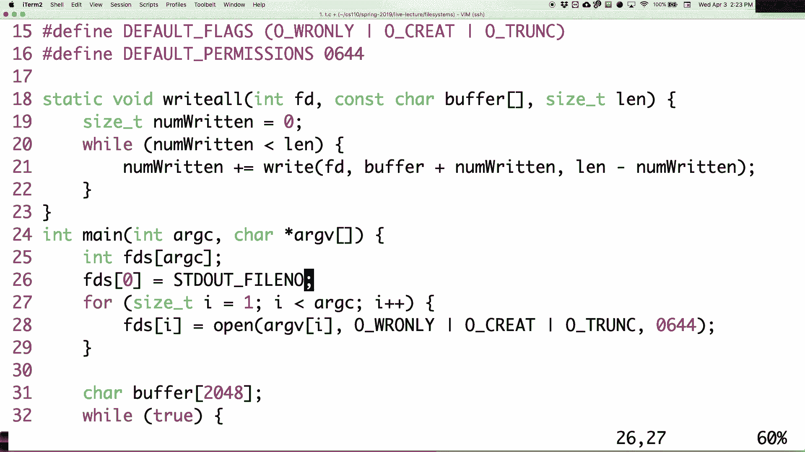

文件。好的。那么 T。如果我输入 `./T`，然后我说 `F file1.txt` 和 `file2.txt`。

对。然后我开始输入，这是我在输入，更多输入。对。然后按控制 D。我应该能够。

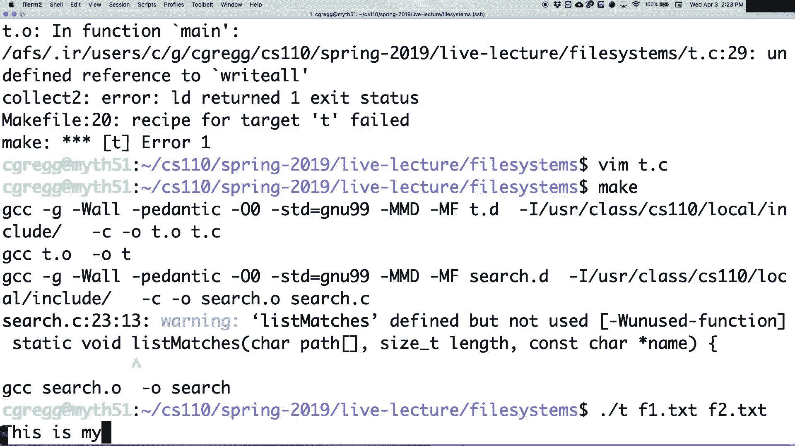

你可以查看F one dot T X T，看到它在那里工作。好的。那么，你有什么问题吗？

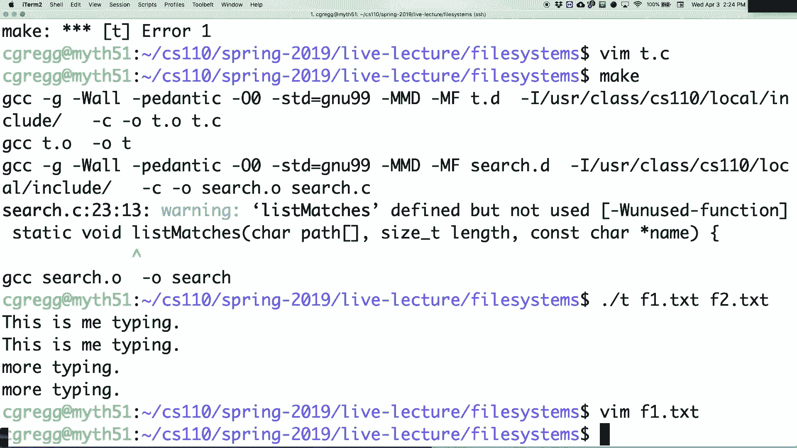

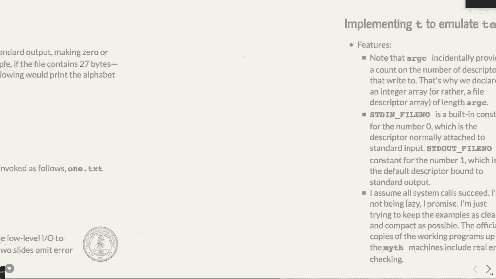

关于这些问题吗？你现在已经了解了关于标准输入输出文件和标准输出文件编号的基本知识。还有标准错误文件编号。好的。在我们的小程序中，我们假设一切都成功了，但实际上，代码（你可以在线查看）有更多的错误检查。你应该做更多的错误检查。

在我们的课堂上，我们并不像其他地方那样担心大多数错误检查。但是你会在不同的作业中看到，当它很重要时，如何处理。好的。还有其他问题吗？好的。那么，这是T。好的。所以。

让我们继续深入了解文件系统的相关内容。好的。这里有两个函数，STAT 和 EL STAT，它们是系统调用。再次提醒，系统调用是内核执行的函数。好的，你的代码调用它，然后内核接管并执行它。好的。它们会填充另一个东西，叫做 struct STAT。不幸的是，它被重载了。好的。

struct STAT 被调用并填充。你传入的 struct STAT 会被 STAT 函数填充。好的。STAT 和 EL STAT 完全相同，唯一不同的是如果有链接——我们稍后会讨论链接——STAT 会返回关于链接本身的函数。EL STAT 则会说，哦，我要去检查那个链接的详细信息。

链接是什么呢？可以把它看作是一个别名。它基本上是指向某个其他文件的名称。好的。我们会在接下来的几天内讨论这个问题。好的。顺便说一句，你可以查找这些东西。你应该习惯于输入类似 MAN 2 STAT 之类的命令。

forth。 这里指的是你需要的手册部分。如果你只是输入MAN STAT，看看会发生什么。

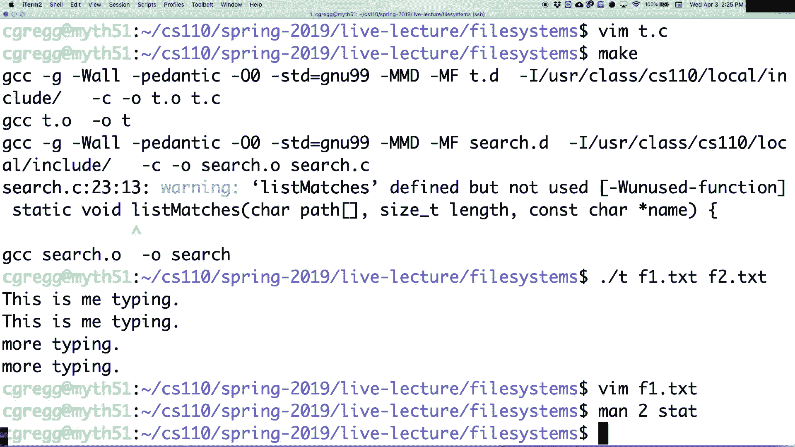

我认为它是一个不同的命令，它是 Unix 的内置命令，或者你看到的是它而不是。

这是库函数。好的。但是你在这里已经有了库函数的所有细节。

好的。它们的作用是，它们填充这个 struct STAT，而 struct STAT 里面有一些。

其中包含的信息可能对你有用。好的。最终我们会使用 i 数字，好的，或者 inode 编号。然后，我们关心的是这个 mode。好的。mode 是一个包含多个不同位的变量，它允许你获得关于文件的信息。好的。你可以提取关于文件的信息。它是一个目录吗？是的，我认为。

我不知道那是否告诉你文件有多大。我觉得那并不能告诉你文件的大小，但它会提供关于特定文件的各种信息。好的。我们实际上需要做一点。

编码来展示这是什么在做的。好的。这里有一个叫做 `find` 的函数。我使用 Unix 已经好多年了，直到不知道这个。后来一发现有个叫做 `find` 的函数，我就想，哦，天哪，这就是我要用的。我每天都会用它。是的，我用了，我现在每天都在用 `find`。

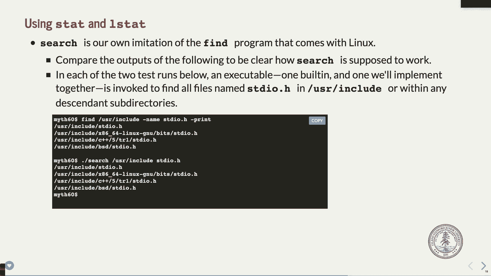

每一天。find 做的事情是，它允许你递归地搜索一组目录。

找到一个特定的文件或文件模式。所以让我们看看，发生了什么。我知道有搜索。

无论这里是什么点。如果我回到上面，做这个，`find live lecture`，然后搜索 `dot star`，我会把它放在括号里。好的。然后它会去说任何实际上。

它有点显示给你，实际上在这种情况下没有，等等，让我做一下这个。我会说搜索，像这样。它会告诉你它认为的地方。各种东西在那找到了。好了，我们来看看。哦，你知道吗，find 有点不同。它表示一个叫做点的东西。

这就是它正在寻找的东西。好了，就是这样。那就是搜索本身的位置。如果我想找到匹配的，我希望所有不同的文件，我会输入 `search star`，然后它会给我所有的。

含有星号或搜索的不同事物，这些都是文件。好的。所以它允许你通过不同的目录进行搜索，基于文件名或部分匹配来查找文件。好的。

所以我们要做的是，编写一个相对简单的程序来实现这个功能。

并且进行一些搜索，正好做这个。如果你执行 `find /user/include`，然后查找 `STD IO dot H`，`find /user/include STDI`。我们来看看。你得做这个。

dash name STD IO dot H 然后打印是一个术语。带上打印，结果就出来了。好了，我们开始吧。我们将。

列出所有名为 `STD IO H` 的文件，结果有一大堆。我们的搜索函数应该做完全相同的事情。好的。我们需要能够读取文件。查看它是否是一个目录。如果是目录，就遍历那个目录，然后继续读取。这个应该从你做的一些 CS107 的事情中非常熟悉。好的。

但让我们实际去做吧。

然后写下实际的命令`search.c`。好的，我已经把所有的头文件都放进去了。我们要开始了。

首先编写主函数。然后我们将编写这个`list matches`函数，它会稍微复杂一些。但现在，先写`search`函数。实际上，是的，我们会先写一些。实际上。

我现在就给你演示一下。然后我们可以运行它，稍后再看实际版本。

好的。主要函数，暂时不需要我现在全部写出来，主要函数就是这样。

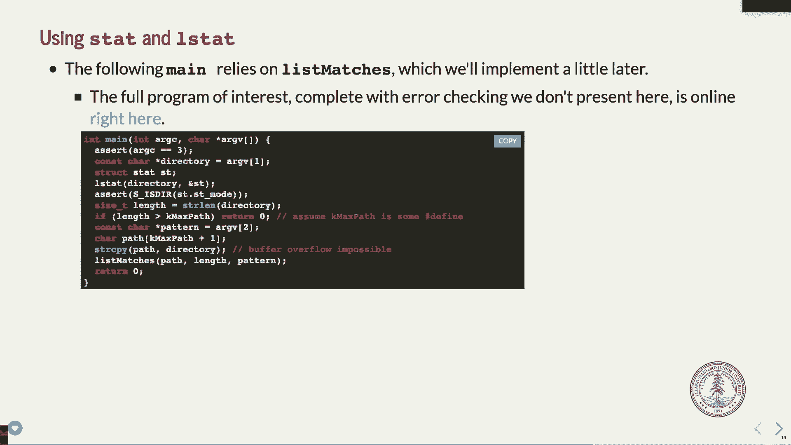

它看起来是这样的。好的。它基本上使用了`lstat`系统调用来获取文件是否是目录的信息。那么如何做到这一点呢？你调用`lstat`然后传入某个名称，对吧，然后你填充一个`struct stat`，这个结构体会被填充。然后你可以通过使用宏`S_ISDIR`来检查它是否是一个目录。

然后你传入返回的模式。就这么简单。好。接着，你需要实际检查目录名称本身的长度。好的。然后，你有一个我们将要输入的模式，实际上你将把它传递给`list matches`函数，基本上是复制路径加上这个模式。

文件加上下一个，再加下一个，再加下一个。好的。这就是它的工作原理，使用我们将要编写的`list matches`程序或`list matches`函数。好的。所以，基本上。

这就是它的操作方式。你输入搜索命令，然后是你开始的目录名称，再接着是你要查找的模式。它会进行搜索。

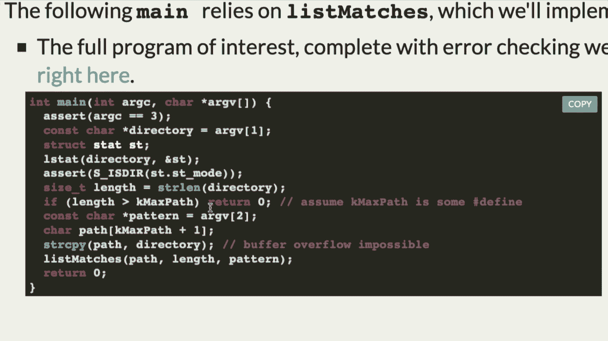

`list matches`将会完成所有这些操作。好的。那么它是如何工作的呢？正如我所说，我们需要。

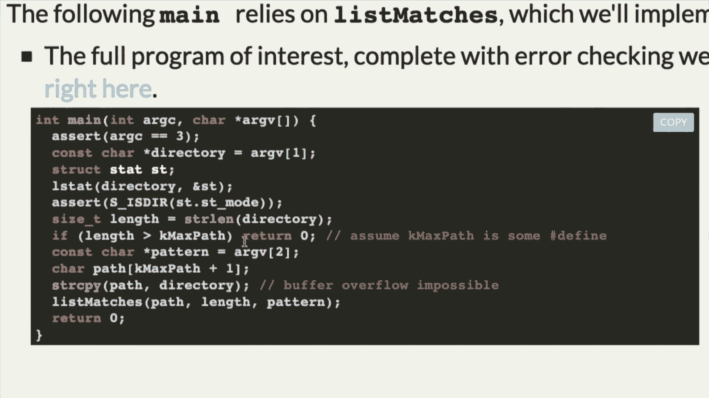

否则就使用`lstat`来进行这个操作。好的。`S_ISDIR`是一个宏。宏类似于一个函数，但它会在代码中立即被替换。它并不真的调用一个函数，而是直接将一段代码内联。它基本上是在检查一些位，如果其中一位被设置，就表示它是一个目录，在这个案例中就是这样。

还有`is reg`，它表示是否是常规文件；`is link`表示它是否是指向文件的链接。这就是我之前提到的别名。大部分操作实际上会在`list matches`函数中完成。我稍后会给你展示。好的。你需要利用`opendir`来打开一个目录，并且你需要使用`dir int`。

然后是。

对不起，你需要使用`struct dir int`和`redir`函数，这个你应该在107中做过。如果忘记了，你可以去查找如何做。但它基本上是为你遍历目录的。这样做挺方便的。然后你需要知道如何关闭。

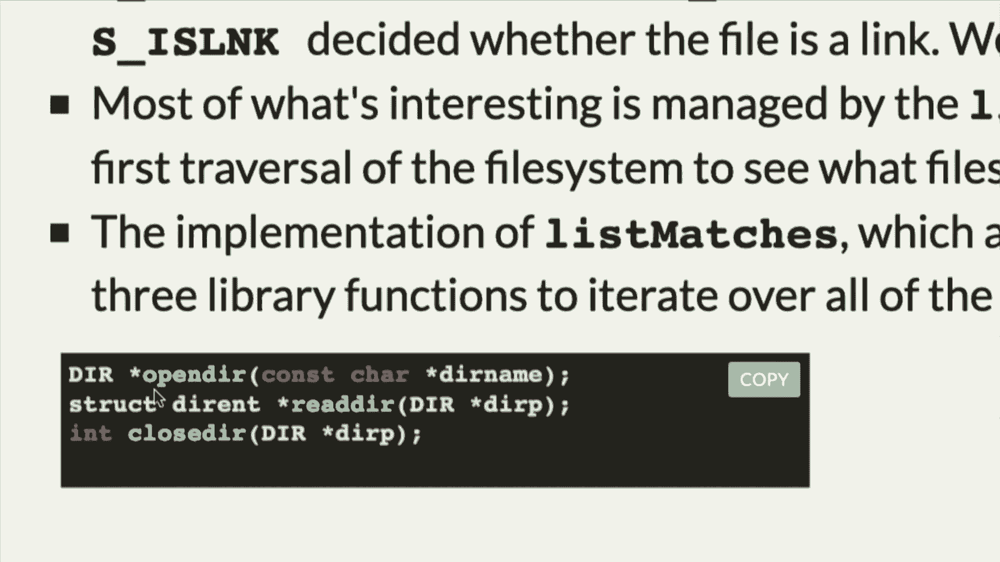

也可以是一个目录。好的。好了。那么这里是列表匹配函数的实际实现。

好的。列表匹配函数是做什么的？它打开目录。好的。如果目录，路径为空，也就是说如果那里什么都没有，那么它就返回。好的。否则，它会把路径复制，实际的路径加到，或者说复制斜杠到路径上，然后开始遍历所有不同的目录。

所有不同的条目并检查每个条目，看它是否匹配我们要匹配的内容。

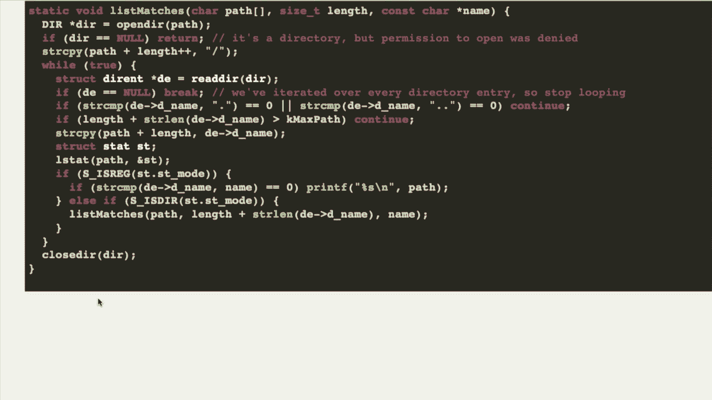

好的，我得从我这里的笔记开始做。所以我们将要读取目录。在这个循环中遍历目录。好的。再一次，如果路径为空，我们就停止，因为我们已经到达了，已经到达了结尾。这个就是它的工作方式。它会一直遍历，直到返回一个空值。好的。然后我们会把它与点和点点进行比较。点和点点是这两个。

这些文件是什么意思？我们说过什么？点和点点是相同的目录，点表示当前目录，点点表示上级目录。所以它会忽略这些目录。它会跳过它们，因为为什么？因为否则它就会进入一个不想进入的循环。好的。如果路径太长怎么办？

我们只允许一个特定的路径，如果符合条件，那就没问题。然后它就说我完成了，我不会继续向前走了。对你来说太遗憾了。接着它把实际的名字复制到路径末尾，添加斜杠后。然后它再次执行LStack命令，检查它是否是一个常规文件。如果是常规文件的话。

它会对那个文件做字符串比较。如果比较结果是零，也就是说它们是一样的，那么它就会打印出路径。这就是它如何找到它的方式。好的。如果是一个目录，它需要做什么？

它必须递归调用列表匹配，因为它需要遍历这个列表。所以这是一个递归程序。但实际上它并不复杂，它只是在查找一组目录。好的。问题。是的，一个常规文件不是一个链接。它基本上是一个包含数据的文件。一个链接是一个文件，它指向另一个文件。所以它里面的数据指向另一个文件。

操作系统需要知道它是别名、链接还是常规文件，这样它们才能正确地处理或不处理这些文件。是的。关于这个程序，你有什么问题吗？是的。我们用什么？对，我们说的区别是什么？这只是一个问题，比如说。我们期望它是什么？你可能会有链接。是的，你当然可以有链接。事实上，

你的作业中有链接。

让我给你展示一个作业中的链接。如果你去，看看，去作业。

作业一，看看，我觉得，应该是你开始的地方，或者是？好了。

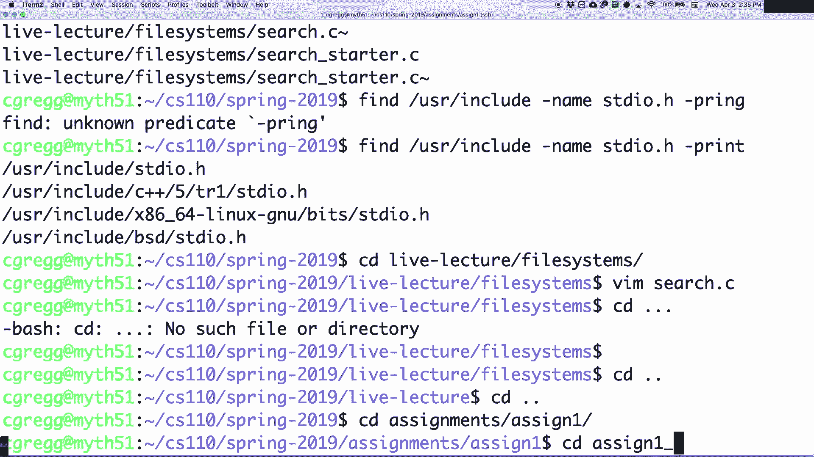

如果我们进入这里，查看一下 dash L，好的，看看下面的 samples。那是什么？

那里发生了什么？它说 samples 有一个小小的奇怪箭头指向斜杠。AFS slash IRS slash class CS110 samples assignment one。顺便说一句，如果我们进入 samples。

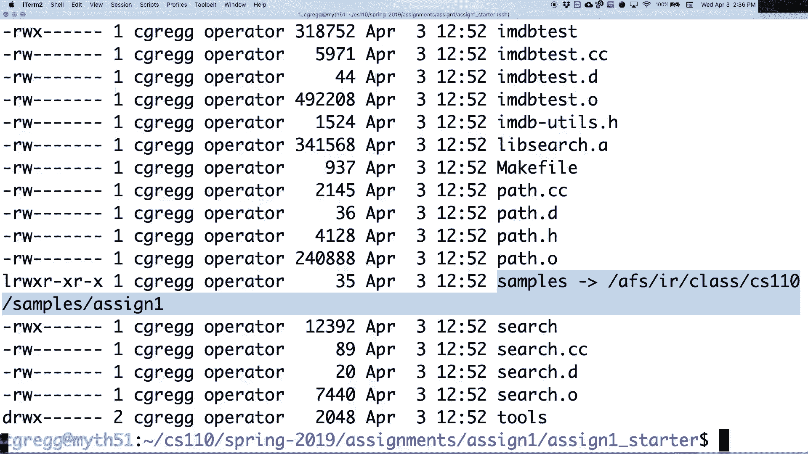

让我们来看一下。现在我们实际进入了那个文件。如果我们看它，我们得到了一个 actor 数据。

文件和一个电影数据文件。这两个文件非常大。它的意思是，如果你在作业文件中链接到这个常规文件，没人会更改这些文件。结果是你甚至不能更改它们。因为它们是只读的，专门供你使用。但这意味着班上所有人都可以通过这个文件访问这个巨大的文件。

链接，这样你就不必为每个人复制它们。如果我们尝试为每个人创建一个千兆字节文件或 80 兆字节文件，空间很快就会用完。是的，八百兆字节的文件，什么的。其他问题吗？

好问题。那个回答了吗？好的。那么这就是 stat 和 L stat 的工作原理。再说一遍。

我们做这个示例是为了展示你可以使用 L stat 来判断它是否是文件还是目录。好吧，你可以使用 error stats 来做到这一点。你也可以用其他方法。有些事情可能对你很重要。比如下一个作业，你会关心结构中的其他部分。好的。我们依赖 Opender，它基本上意味着

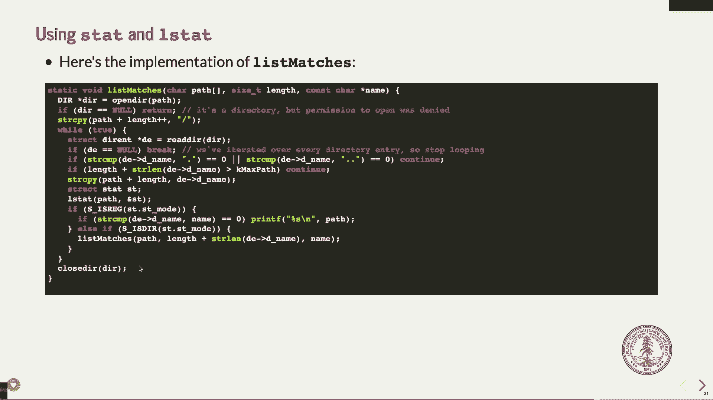

哦，是一个目录。我们在这里做了一个断言，表示不要尝试打开目录。那是一个文件。你必须弄清楚。好的，你必须确保这样做。然后你可以通过 walk 这个 read/read/der 调用来获取所有这些不同的目录条目。好的。再说一次，你可能在 107 课中做过这个。你可能做过相关作业。

但其实并不算太难。只需一次次回忆那个函数，它会给你下一个目录，下一个文件，或者下一个，或者下一个目录。好。我们看看。还有什么呢？这就是。这里是你问题的答案。我们使用L stat而不是stat，这样我们就知道它是否真的是一个链接，而且我们在这种情况下会忽略链接。你可以有递归的链接，例如。

它可能指向文件系统中的某个早期位置。所以，如果你这么做，你可能会遇到问题，因为你通过一个链接遍历，可能会返回到你之前的位置，然后你就会陷入这个递归循环，永远也走不出去。这可能是个坏情况。好。我想。关于这些所有细节，我不再赘述。你应该像往常一样记得关闭你的目录。

还有其他的吗？好的。我们将简要查看另一个名为list的函数。

基本上就是LS。对吧。LS做什么？LS实际上列出你目录中的所有内容。猜猜看？它基本上需要做类似的事情。它需要读取所有目录条目并提取相关信息。它需要获取权限，顺便提一下。它需要判断这是否是一个目录，并需要填充这些部分。

好。它还需要告诉你文件的大小或有多少个我们称之为硬链接的引用指向一个文件。那是我们下周或者星期五会讨论的另一个话题。基本上你可以有一个文件，很多东西指向它，有两种方式，而列表实际上会告诉你这些引用有多少个。好的。它需要获取文件名，获取创建日期等等。

好。那些细节稍微有点复杂，但你可以做得到。好。如果你想查看整个列表，你可以这么做。关于这个权限的，我会在这里给你展示。如何获取特定文件的权限？

好。我们来看一下。好的。我们需要做的是。这个代码里有很多内容。

对。我们基本上需要做这个。这里是权限列表，就在这里。好。它需要，找到。而且有些细节你其实不需要知道，但它基本上说的是：“将所有权限设置为破折号。”好。然后继续检查每个目录，对吧。检查每个目录的权限，如果是目录，你就在里面加一个D。

否则，你需要检查每一个可能的权限。你必须逐一检查这些权限，看用户是否可以，所有者是否可以读取，所有者是否可以写入，所有者是否可以执行，设置这些权限。其他用户能做同样的事情吗？组用户能做同样的事情吗？对吧。细节。

在编写这种低级代码时，你必须处理所有这些细节。这种情况就是这样。好的。让我们看看这里还有什么重要的内容吗？这里有一些标志，你可以用在所有不同的文件上，对吧。S-I-R 用户。那是一个宏，基本上是说。

检查并查看用户是否能写，或者用户是否能读，或者用户是否能写。需要检查九个不同的条件，因为每个拥有者、组和用户都有三个。逐一检查这些会做很多事情。好的。如果你在做系统类型的工作，LS可以做的事情真是令人惊讶。它必须处理所有这些细节。

列表权限函数本身会打印出这些权限，这是。等一下，我想那一块。哦不，那是嗯，是的，来看看这里。

哦不，这非常好，那些内容就是全部了。它包含了权限列表和相关内容。这里的东西基本上是它的设置部分。好的，反正去看看这个代码吧，如果你想了解这些宏和其它东西是如何工作的。我们不一定会要求你编写所有这些低级的代码。你应该知道这些是如何工作的，这样你才能理解。

权限是如何工作的，以及有宏，和你必须使用这个结构体，等等。好的，没问题。你对我们已经讲过的内容有什么问题吗？

任务下周三到期。任务必须在周三提交。这个任务没有延期，因为我们希望你尽早开始下一个任务，并且我们想尽可能快地给第一个任务打分。明天早上10点到12点我有办公时间。如果你想来，可以过来，然后我会把消息发给CAs。他们会。

可能从明天或周五开始一些办公时间。它们会安排在周五，抱歉，是周五，然后至少是周日，接下来的一周也会安排。好吧，我会再等几分钟，我们周五见。周五有课。没有实验课。周五有课。

