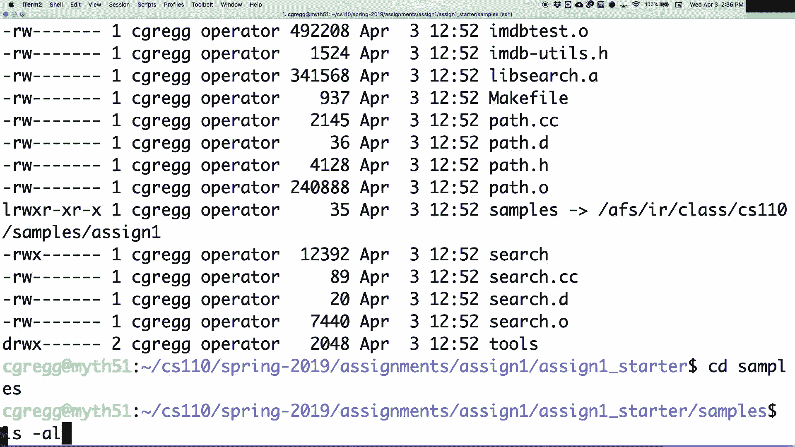

# CS110 课程 P2：文件系统与 `umask` 详解 📁


在本节课中，我们将要学习 Unix 文件系统中的权限管理核心概念 `umask`，并复习作业一的相关背景知识。我们还将探讨如何使用系统调用进行文件操作，并编写一个简单的文件搜索程序。


---


## 概述：`umask` 与用户权限控制


上一节我们介绍了文件的基本权限。本节中我们来看看 `umask`（用户文件创建掩码）如何让用户控制新创建文件的默认权限。


`umask` 的核心是让用户控制文件的默认权限。它的作用不是让程序去设置各种权限，而是让用户声明：“当一个程序为我创建文件时，我不希望它给全世界读取权限。” 这由用户来控制。


在终端输入 `umask` 命令，它会显示当前的用户掩码。例如，输出 `0077`。这里的第一个 `0` 表示这是一个八进制数字。`077` 意味着用户（所有者）可以设置任何权限（读、写、执行），但组和其他人（非所有者）的写权限被屏蔽。


**公式**：新文件的最终权限 = 程序请求的权限 & (~umask)


---


## `umask` 工作原理示例


以下是 `umask` 如何影响文件创建的示例。


1.  **默认情况**：当 `umask` 为 `0077` 时，`touch` 命令尝试为新文件设置 `rw-rw-rw-`（0666）权限。应用 `umask` 后，组和其他人的写权限被屏蔽，最终文件权限变为 `rw-------`（0600）。
    ```bash
    $ umask 0077
    $ touch test1.txt
    $ ls -l test1.txt
    -rw------- 1 user group 0 Sep 10 10:00 test1.txt
    ```


2.  **更改 `umask`**：如果将 `umask` 改为 `0000`，则程序请求的所有权限都会被允许。
    ```bash
    $ umask 0000
    $ touch test2.txt
    $ ls -l test2.txt
    -rw-rw-rw- 1 user group 0 Sep 10 10:00 test2.txt
    ```


`umask` 是反转应用的：它屏蔽（置0）的位，表示不允许设置的权限。程序尝试设置的权限会与 `umask` 的反码进行按位与运算，得到最终权限。

---

## 文件权限的表示


文件权限分为三个部分：所有者（红色）、组（绿色）和其他人（蓝色）。每个部分由 `r`（读）、`w`（写）、`x`（执行）三个位表示。

例如，权限 `rw-rw-rw-` 对应的二进制是 `110110110`，转换为八进制就是 `666`。因此，`chmod 666 file` 命令会将文件权限设置为 `rw-rw-rw-`。


**公式**：权限八进制计算：`r=4, w=2, x=1`。将所有者、组、其他人的权限值分别相加即可。例如 `rw-r--r--` = `4+2, 4, 4` = `644`。


---


## 关于用户组

每个文件都有一个所有者和一个所属组。你可以使用 `groups` 命令查看你属于哪些组。使用 `ls -l` 命令时，输出中的第二列就是文件的所属组。

---


## 作业一：凯文·贝肯的六度分隔 🎬


上一节我们讨论了系统权限，本节中我们来看看本周的作业。作业一的目的是复习 CS106B 和 CS107 的编程技能，并练习 C++ 编程。

作业要求你实现“凯文·贝肯的六度分隔”游戏。程序通过两个大型数据库文件（演员文件和电影文件）查找任意两位演员之间的最短合作路径。


**核心操作**：
1.  **二分查找**：数据库文件已排序，你需要使用 `lower_bound` 算法进行高效查找。
2.  **广度优先搜索**：使用队列（或列表）来寻找演员之间的最短连接路径。
3.  **C++ Lambda 表达式**：作业要求使用 Lambda 表达式为 `lower_bound` 提供自定义比较函数。


---


## C++ Lambda 表达式简介

Lambda 表达式是一种匿名函数，可以在代码中内联定义并作为参数传递。这在需要传递简短逻辑时非常方便。

**基本语法**：
```cpp
[capture](parameters) -> return_type { function_body }
```

**示例**：一个将向量中每个元素加上某值的 Lambda。
```cpp
vector<int> vec = {1, 2, 3};
int val = 12;
// Lambda 捕获了外部变量 val
for_each(vec.begin(), vec.end(), [val](int &x) { x += val; });
```


Lambda 的“捕获”功能是其强大之处，它允许函数访问并操作其定义作用域内的变量，而无需通过参数传递。


---


## 系统调用：低级文件 I/O


理解了高级任务后，我们回到文件系统基础。Unix 提供了 `read` 和 `write` 等系统调用来进行低级文件操作。


**`copy` 程序示例**：以下是一个简化版的文件复制程序，演示了 `read` 和 `write` 的基本用法。


```c
#include <fcntl.h>
#include <unistd.h>
#define BUFSIZE 1024


int main() {
    int infd = open("input.txt", O_RDONLY);
    int outfd = open("output.txt", O_WRONLY | O_CREAT | O_TRUNC, 0644);
    char buffer[BUFSIZE];
    ssize_t bytesRead;
    while ((bytesRead = read(infd, buffer, BUFSIZE)) > 0) {
        ssize_t bytesWritten = 0;
        while (bytesWritten < bytesRead) {
            ssize_t result = write(outfd, buffer + bytesWritten, bytesRead - bytesWritten);
            if (result == -1) { /* 处理错误 */ break; }
            bytesWritten += result;
        }
    }
    close(infd);
    close(outfd);
    return 0;
}
```
**关键点**：
*   `read` 和 `write` 调用可能不会一次性读完或写完请求的所有字节，需要循环处理。
*   `O_TRUNC` 标志表示如果输出文件已存在，则先清空其内容。


---


## 实现 `find` 命令的核心：`stat` 与目录遍历


最后，我们探讨如何利用系统调用实现类似 `find` 的命令，这需要用到 `stat`/`lstat` 和目录遍历函数。


**`stat` 与 `lstat`**：
*   这两个系统调用用于获取文件（或目录）的元信息，并填充到一个 `struct stat` 结构中。
*   区别在于对待符号链接：`lstat` 返回链接本身的信息，而 `stat` 返回链接指向的目标文件的信息。


**实现思路**：
1.  使用 `lstat` 检查给定路径是文件还是目录。
2.  如果是目录，使用 `opendir`、`readdir`、`closedir` 函数遍历其中的所有条目。
3.  对于每个条目，递归调用搜索函数。
4.  如果是普通文件，则与目标模式进行匹配。




**代码框架**：
```c
void list_matches(const char *dirpath, const char *pattern) {
    DIR *dir = opendir(dirpath);
    struct dirent *entry;
    while ((entry = readdir(dir)) != NULL) {
        // 跳过 "." 和 ".."
        if (strcmp(entry->d_name, ".") == 0 || strcmp(entry->d_name, "..") == 0) continue;
        // 构建完整路径
        char fullpath[PATH_MAX];
        snprintf(fullpath, sizeof(fullpath), "%s/%s", dirpath, entry->d_name);
        struct stat st;
        lstat(fullpath, &st);
        if (S_ISDIR(st.st_mode)) {
            // 如果是目录，递归搜索
            list_matches(fullpath, pattern);
        } else if (S_ISREG(st.st_mode)) {
            // 如果是普通文件，检查是否匹配模式
            if (strcmp(entry->d_name, pattern) == 0) {
                printf("%s\n", fullpath);
            }
        }
        // 忽略符号链接等其他类型
    }
    closedir(dir);
}
```


---


## 总结


本节课中我们一起学习了：
1.  **`umask`** 的作用与工作原理，它允许用户控制新文件的默认权限。
2.  **作业一**的核心要求：使用二分查找、广度优先搜索和 C++ Lambda 表达式解决演员关联问题。
3.  使用 **`read`/`write` 系统调用**进行低级文件操作，并理解了它们可能需要循环处理。
4.  使用 **`stat`/`lstat`** 获取文件信息，并结合目录遍历函数实现了一个简单的文件搜索程序逻辑。


这些知识是深入理解 Unix 系统编程和完成后续作业的基础。