# P20：Lecture 19 Principles of System Design - ___main___ - BV1ED4y1R7RJ

 So， CS140 is about operating systems。 In this class。

 we used all these things that you will end up building in operating systems， right？

 Like you build a file system。 You build like how you actually。

 you kind of build a little bit of that for this class。

 but you build like a little lower level file system and more robust and more of the parts。

 for the files。 You don't have to just read and write files。 You build the actual file system in 140。

 You build a threading library or a forking library and multi-processing library。

 And those are the kinds of things that we know how to use now and then you'll actually。

 do them in 140 where you actually build them and understand what it takes to build a threading。

 library。 So， it's a good thing you already know how to use these because then it's much easier。

 to understand how you're going to go and build them。 So， that's that。

 And that's about the implementation part of it。 There's also CS 143 which is compiler construction。

 Compilers class， when I was in graduate school， it was one of my favorite classes。

 I didn't do particularly well， I'm sorry。 But it was a class that I enjoyed a lot because you really get a much more detailed feel for。

 hey， how does your code end up as machine code？ Now。

 you cover that a little bit in 107 but not really the part of like actually doing， the translation。

 Like you see how， you see what the beginning and the end are but compiler is all about。

 translating and doing that。 And it's a great class。

 I also happen to think that a lot of employers when they see that you took a compiler's class。

 actually perk up a little bit and go， oh， well this person went a little bit outside。

 than normal because it's not like everybody takes compilers and they know it's a hard， class too。

 So， for what that's worth。 I think it's an interesting class and you might want to take a look at that。

 If you like the networking things that we did recently， CS144 covers networking and this。

 is in much more detail than what we did。 We just talked about server client and setting up a network and so forth。

 This networking class digs into more of the details。

 Like how do the bits actually get across the network efficiently？

 We'll talk a little bit more about that today just in general terms。

 But that's what the networking class covers and it's another good class especially if。

 you're interested in this sort of stuff。 If you do go into security or things。

 it's probably not a bad idea to take a peer networking。

 class as well because it's got a lot of the things that a lot of the exploits end up exploiting。

 things that might be at the networking layers that you haven't necessarily seen in this class。 Okay？

 So， that's the three bigger ones that I think you could go on and take。

 There's also 144 and 142 and other classes that are， sorry， 142 is another one that you。

 can take that dig into more systems details。 So there are a lot of systems classes and again。

 I do recognize that many of you are like， I'm glad I'm done with systems forever and that's it。

 But for other people who want to do it， lots of other choices and feel free to chat with。

 me about that if you want to know some of those other choices。 Okay。

 So here's the principles we want to talk about today。 So we want to talk about abstraction。 Now。

 abstraction is what you've been doing。 You've seen abstraction at many。

 many different layers and we'll get to the details of what， abstraction is all about。

 We need to talk about how that relates to CS110。 Modularity and layering is another one that we're going to look at。

 Naming， remember all those things， you're doing file systems and like name resolution。

 That's kind of a big principle that you have to deal with。

 Many of these principles are all about doing things either more efficiently or doing them。

 in such a way that makes a big system become less gigantic to wrap your head around。

 That's what a lot of these things are。 Okay。 Or it's a matter of like name resolution is all about。

 hey， humans are good at names， computers are good at numbers。

 how do you mix those together so that it works most efficiently， for the computer。 Virtualization。

 we'll talk about two different types of virtualization and then concurrency。

 which I would argue this class is more about concurrency than probably any other topic。

 There's more of that kind of filtered in along the way。

 And then client server request and response is another one。

 It's not just networks that deal with client server request and response。

 Anytime you have two programs trying to communicate whether they're on the same computer or across。

 a network or in some other sense， that's where you've got this client server request response。

 And understanding how that works is kind of is important。 Okay。 All right。

 So those are the let's jump right in and of course， hang on。 Of course， this is not working again。

 There we go。 Okay。 Maybe。 Okay。 We'll go about it。

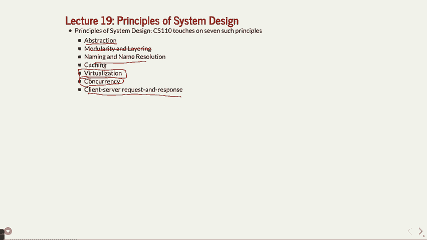

 There we go。 There we go。 There we go。 There we go。

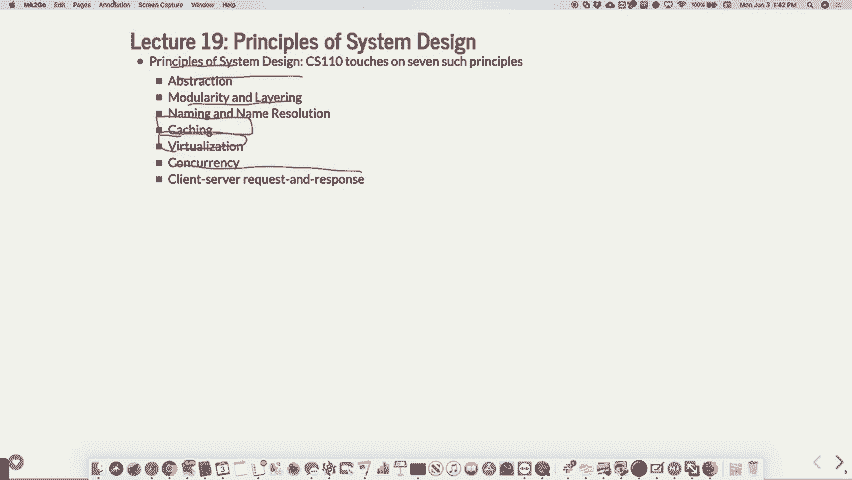

 Now it's back。 Okay。 So abstraction。 All right。 Abstraction is simply separating what the program is doing from the implementation。

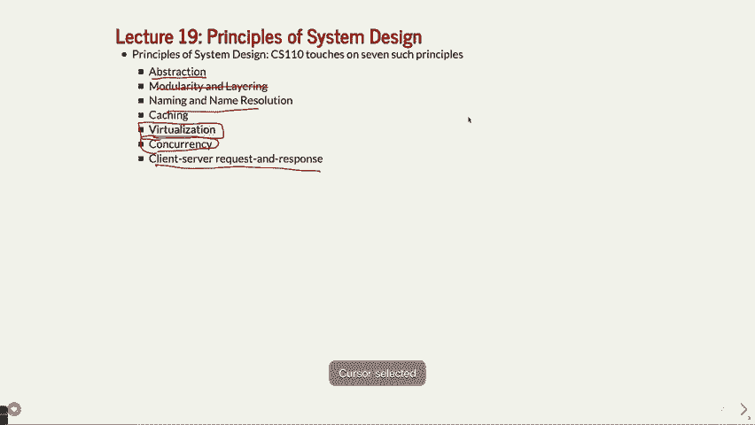

 Okay。 And this is something we've seen in lots of different scenarios。

 But one example is just a sorting program。 Right。 A sorting program has an interface where you pass a bunch of words in and they come back。

 to you sorted。 And that's the interface that you may have。

 You have to put them in an array and you have to set where the beginning and the array。

 is and so forth。 That would be the interface。 The actual behavior is they get sorted。

 How that implementation happens is completely up to the program。 Now， of course， with sort。

 you want to do it。 You don't， there are so many different types of sorts and you don't want to do the one。

 that's going to be oh and you want to do the one that's going to be oh and log and or， whatever。

 But in terms of the implementation versus the or the interface versus the abstracted。

 this is how it goes， that's the big， big picture of abstraction。 Okay。 We've seen these in many。

 many ways。 The big challenge a lot of times is to design a clean interface that makes some library。

 you're designing easy to use。 Okay。 We've actually done a lot of the designing of the interface for you in this class。

 Mainly because it would be really hard to say hey， here's the， it would be hard to test。

 it first of all。 But second， without a clear interface， you can spend many。

 many hours thinking about how， to design an interface for something and you kind of want to do it properly because it。

 is challenging。 I would argue that the C++ language， the interfaces are not necessarily as clean as。

 you might hope for other languages。 They tend to be somewhat cleaner。 You know。

 when you do a find in a map and you come and give you back an iterator and there's。

 a first and a second and all that kind of business that's kind of painful to deal with。 All right。

 That might not be quite as clean。 It's there for a reason， but it might not be particularly clean。

 File systems。 So whenever， when you use file star and IO streams and we use many more IO streams in。

 this class than we did file stars， that's an abstraction that is away from the read， the。

 low level read and write， which is what we saw right at the beginning。

 And why do we abstract those away？ Because again， it's easier。 With the read and the write。

 you have to worry about buffering yourself。 You have to worry about， oh。

 what happens if I try to read 10 bytes and I only get 6， bytes back。

 These are all abstract in a way。 Once you have a good file library like IO stream and file stars and so forth。

 Okay。 Processes。 Well， processes。 Why is that an abstraction？ Well。 Okay。 So it's basically。

 you probably don't know how fork and exec VP work。 Right？

 You'll learn that if you take CS 140 about how those actually work under the hood。

 But there's an interface there。 When you say fork。

 you know that it creates two processes and you don't really care how， it happens。

 But you know that now you've got two processes and you've got a child and a parent and so， forth。

 And there's lots of other things happening to keep track of the child to be able to wait。

 PID and so forth。 That's all in abstraction。 Signals is another one。 If you took CS 107E。

 you may have， you definitely did interrupts which are basically signals and。

 you know a little bit more about how those work。 But the idea that you've got a。

 the kernel keeping track of a bunch of things that you， don't necessarily， you want them。

 you want the kernel to keep track of it。 You don't really know how it's doing that。

 You just know that when something happens， the kernel goes and tells your program calls。

 a handler function or whatever。 That's basically a signal。 So that's abstracted away too。 Your。

 the abstraction there is， oh okay， I've got a signal handler that's going to get。

 called when something happens and how does that actually， when we camp that， it's all。

 abstracted away from you。 Okay。 If you go take the operating systems。

 you'll learn more about how that happens or maybe， some double E classes too or you deal with that。

 Threads， same sort of thing。 Remember threads and processes are similar。

 Their threads are kind of lightweight processes but it's the same idea。 You've got these threads。

 How does it work？ We don't really know。 We know how to use them and we know how to use them efficiently。

 That's that。 HTTP。 So this is what your last assignment。

 the proxy was all about and you HTTP defines how things。

 get sent across the network and the various messages that it gets and that's abstracted， away again。

 You can， you generally with your web browser don't need to worry about get and post and。

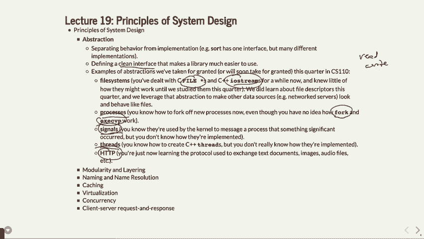

 that sort of thing。 Okay。 So that's abstraction。

 Okay。 Modularity and layering。 So when you talk about modularity。

 we're basically saying subdivide a larger system into， a bunch of smaller systems。

 This is decomposition。 You've been doing this since day one of one or six A or one or six B and it's important。

 One of my favorite examples of a large system that's complex is believe it or not a Xerox， machine。

 So how do people use， everybody's used a Xerox machine before， right？ Well we have some in our。

 in the CS department that are able to copy like hundreds of exams。

 for like CS106B and CS106A and whatever and these machines are super duper complicated。 Right？

 If you go and you think about what has to happen to make copies of pages in a certain， form。

 it's pretty intense。 So for instance， okay。 Right？ So copy machines are supposed to like copy paper。

 That's the big picture， right？ Purple paper。 There you go。

 So it's a copy paper and that's what they do。 But what else do they do？ Well。

 they handle double sided。 Right？ What does that actually mean？ Right？

 It means you either have to have a way to write on both sides of the paper， which is not really。

 what happens generally。 That would be kind of weird especially because gravity might come into play a little bit。

 But you also have to， or you have to flip the paper over and that's a mechanical engineering。

 challenge。 Right？ So you've got that in there。 These things sometimes staple。 Right？

 Stapling involves getting the paper exactly right the place。 I mean， oh， by the way。

 it also has collating。 Right？ Which is where you have to have like all the different stacks of the right thing。

 How does collating work？ Well， if you have a 20 page exam。

 like the CS110 exam might not be 20 pages， but let's， say you have a 20 page exam， right？ Well。

 they better be enough memory in your system to hold all 20 pages or some of the。

 older machines had to refeed the paper every time it wanted to do a 20 page thing because。

 they didn't have enough memory for that。 So that's a big thing because there's memory in there。

 Let's see。 It's got networking associated with it if you can， like I can send a print job to the。

 Xerox copy or that's it。 That's I can do that。 What else does it have？

 There's also the whole physical layer or the actual physics that goes into it。 Like。

 you guys know how copyers actually work， like physically how they do it？ Okay。

 so there's a piece of paper that's black and oh by the way， there's also lasers， right？

 There's a laser that's inside your copy machine， right？ And that's kind of cool。

 And actually the laser charges up your paper。 Let's say it's a negative charge。

 I don't know which charge。 It charges up the various dots on your paper where there's going to be a toner。

 And then the rest of the copy machine takes the toner which is that powdery black horrible。

 stuff and it charges at the opposite charge。 And then it dumps a bunch of toner on the paper believe it or not。

 And then it where it charges are there it sticks to it。 And then it sweeps off to excess， all right？

 Actually， I think first it fuses it and then it sweeps off or maybe the other way around。

 But it basically does that and then it sort of says there's a heating business in there。

 and that's why it always comes out in one。 And my point is that these things are so complex that no one person in fact no ten people know。

 enough about the entire machine to be able to like fix it or do it all by themselves。

 Or even understand it to be able to tell you all about all the details， right？ There's physicists。

 there's engineers， there's oh by the way， there's all the software。

 You know how many different menus are on that thing， right？ There's so much software on there。

 right？ Like has to do it all and get everything right and then there's mechanical engineering that。

 goes into it。 I mean there's so many people that work on that。 It has to be subdivided。

 It's just way too big。 You would never have one person creating a Xerox machine by herself， right？

 It's impossible because one person can't do that。 So that's that。

 Another good example is the phone in your pocket， right？ If you took 107E with me。

 you remember we talked about like all the different sensors， that are on your phone， right？

 There's probably 15 different sensors on here。 Do you know there's four radios in your phone？

 There's four different radios in your phone。 There's the one for the regular phone calls which isn't even the regular thing you do anymore。

 That's like the least used thing you use your phone for anymore。 There's the Wi-Fi one。

 There's a Bluetooth one。 There's， let's see， there's another one that communicates with the。

 when you do Apple Pay， or whatever。 So I mean there's all sorts of radios in your phone。

 There's cameras。 There's at least three different cameras。 There's a camera on the front。

 There's a camera on the back。 There's a camera underneath the fingerprint thing。 If you've got that。

 that's how that works， right？ Some ones have cameras built into the screen now。

 I mean that's not even to mention there's a temperature sensor。 There's a drop sensor。

 There's an accelerometer。 There's a gyroscope， right？ Who knows， understands all those things？

 Nobody understands every little bit about that， right？

 There's specific engineers whose job is to do the gyroscope part of the iPhone and that's。

 how it works， right？ But it's all about subdivision of this large system。

 So you have to understand how that works if you're going to be building bigger projects， right？

 Now at the same time you might go to Apple and work on the iPhone and be like， "Oh， I'm。

 the person who's doing the fingerprint sensor and whatever。"， And you're not the only one。

 But you might feel like you're doing a very small part of a much bigger thing。

 You have to keep that in mind that， "Oh， there is a bigger project here that ends up， being there。"。

 But that's where you have to understand。 This class hopefully gave you assignments that were somewhat robust and there were lots。

 of moving parts and that's why there's 20 different header files and whatever because。

 you have to kind of try to understand that。 And we don't make it too complex that you can't as one person understand it but we need to。

 push that limit to say， "Oh， we better break these into various subsystems otherwise it's。

 not going to happen。"， Final systems。 Here's a good example of layering here where you've got lots of not necessarily modulating。

 but you've got layering which is putting one layer on top of the other so that you break。

 it down into its various components。 Remember for your assignment two there was this symbolic link where you didn't have to。

 use symbolic links but you could read about those and learn about those。

 There's an absolute path name which is like slash user slash class etc。

 There's a path name layer which actually takes the which can take things like dot dot slash。

 dot dot slash whatever and then layers it onto an actual thing there。

 There's the file name layer which actually does the files for human reading that's where。

 you've got that layer。 Then you've got the i-node layer。 Remember each file has an i-node。

 Why because computers are better at numbers than trying to figure out a whole like path。

 is much slower to do that。 And then there's the file layer which is where like the bits themselves what they consist。

 of on the drive like your actual files and then there's the block layer which is like。

 where on the disk they are。 All of those different layers come together to make a file system and you have to at least。

 understand parts of those layers or at least how your layer if you're working on one particular。

 layer interacts with the next layer down。 Hopefully not more than a couple layers down but that's you have to understand that when。

 you're doing that。

 Alright what else do we have on modularity and layering。

 So this is one that we don't really go into this much detail maybe you probably do in。

 a compiler class but I'm about to show you some layering that happens in g plus plus。

 You know how you have your program and it turns it into a binary。

 Well there's lots of steps in there。 It's not just like it just goes through once and turns everything straight into binary。

 There's lots of different parts and we're going to see some of those parts in particular。

 so that you can actually see what the compiler actually has to do。

 First we're going to look at is the preprocessor。 So the preprocessor is one of the ones that all the pound includes or pound defines or。

 as you yarkshows call hash includes or hash defines。

 The preprocessors what takes those and manipulates them and changes those into something else。

 that the next layer down can do。

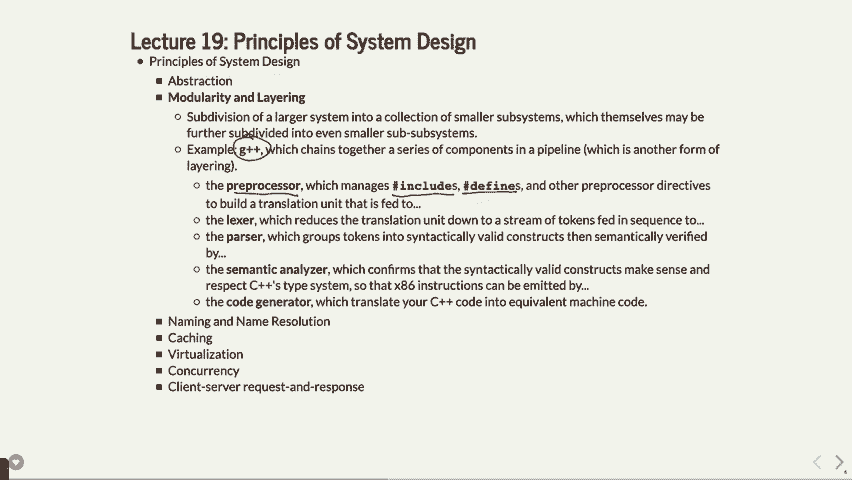

 Let me show you what I'm talking about。 What we're going to do is we're going to go over and we're going to do a little program。

 called hello。cc and it's going to be very simple。 It's going to be like day one of one or six be here。

 I-O stream using namespace STD。 And then let's do a pound define because we've got two pound things here。

 They include and then the pound define。 I'll talk this K range start 100。

 And then it's main in to our C in a char star RV。 And then let's do that for int i equals K range start。

 I is less than K range start plus 10。 I plus plus。

 And then in here we'll do see out hello world and then we'll actually do the I as well like。

 that and that's it。 So pretty straightforward program。 Anybody see any bugs？

 Okay。 What I'm going to do I'm actually not doing this on myth。

 I'm actually doing this on my computer because I'm going to use a slightly different compiler。

 I'm going to use a compiler called clang which allows you to break out some of the details。

 here that G plus plus for some reason doesn't let you you might be able to I couldn't figure。

 out the way to put in clang you'll see it。 So if we do the following clang dash E hello。cc。 Okay。

 So let's do this first clang hello。cc - oh hello。 Make sure it works and if everything works right。

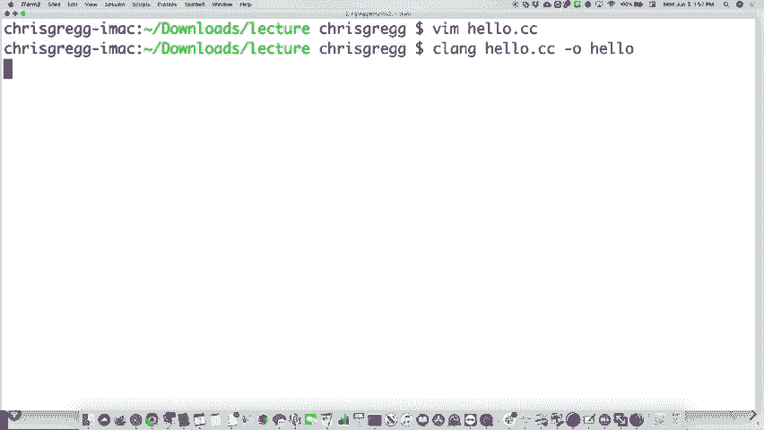

 Oh no。 Maybe any of you maybe need to do clang plus plus。

 There we go that works so I guess clang plus plus work。

 So if we do hello in this case right it will do that and that that's makes sense。 Okay。

 That's what I'm going to do。 If we do let's try clang this time clang dash E hello。cpp。

 This is saying run the pre processor that's one of the deals with the pound and close and。

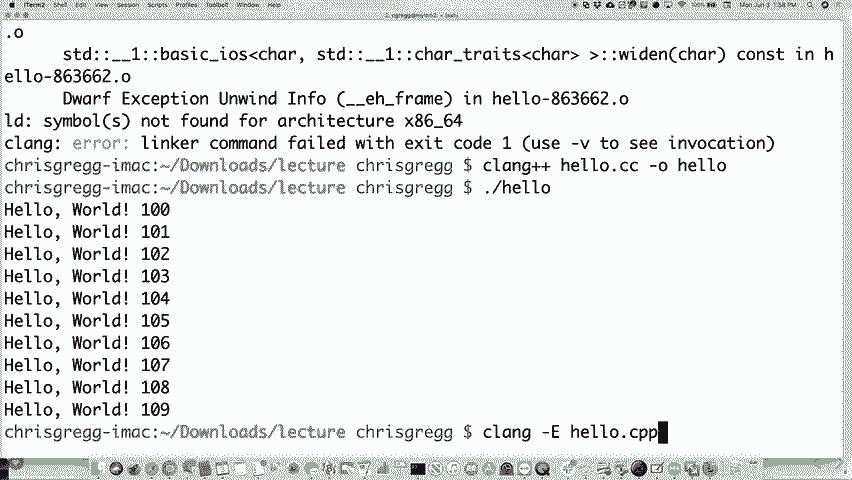

 pound of funds。 Okay。 And why is this not working？

 Oh， CC that's why there we go。 There we go。 Okay。 So let's go and buy。

 Here's what it's actually doing。 Okay。 So what it's doing is it's taking a bunch of the well first of all it's taking the pound。

 include and including it。 And guess what that pound include header file probably also has includes and it needs。

 to include all those and it just basically creates one more file that it's all the stuff。

 that you're about to process in one file。 Okay。 And it does that。

 In fact let's see how big just the pre processor creates word count 41，000 lines。

 Comes out of our one hello world program just from taking that pre processor in there。

 But let's take a look at without。 Hello。cc。 Let's take a look at it without the see out in there and without the just just look at。

 what happens to the K range start in here。

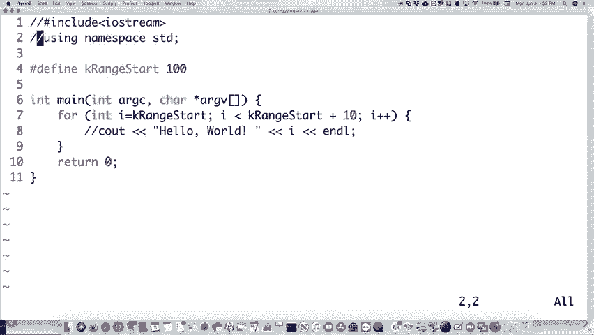

 All right。 If we do the same thing again I don't 18 lines so that's much better。

 Okay。 So what we did this stuff at the top here is just it's other information that's going。

 to be used by other stages of the compiler so file amounts and so forth。

 And notice what it did with our pound define。 It took that K range start and replaced it with the 100 and it replaced the 100 here。

 and that's all it did。 Took whatever you define and just went through the entire program found where it was defined。

 used and then replaced it。 It's all it does。 It doesn't do anything else in this case。

 It might do it might actually do a little bit of replacing a variables if you if you set。

 it up that way。 But that's it。 So that's the pre processor does and that's the first stage。

 Okay。 The next stage is called the Lexer and the Lexer is what takes the translation of a stream。

 of tokens。 Right。 It takes all those the program and turns it into individual tokens of what's happening。

 in your program。

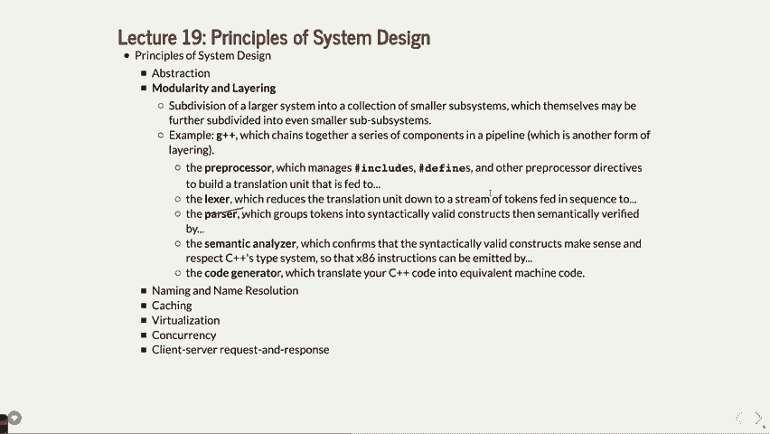

 Okay。 Let me show you what I mean by that。 Okay。 If we do the let's do let's go back and make it the original one again。

 So we'll do that and we'll put this back just so we can see the original again。

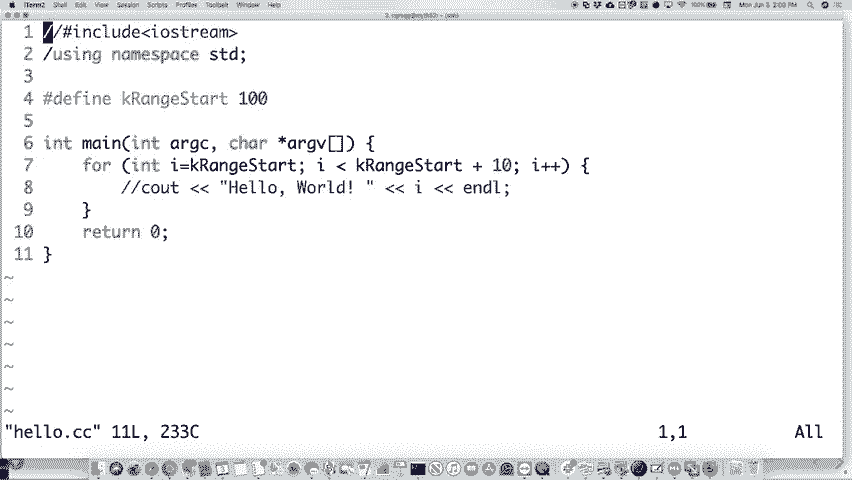

 Okay。 And let's do this。 If you dash clang dash X clang dash dump tokens and hello。cc。

 What it actually does is it actually puts the output for some reason standard error。

 So I'm going to actually pipe or redirect standard error to standard out which you may。

 or may not know that you can do it but you can't and this you should use the two angle。

 bracket ampersand one。

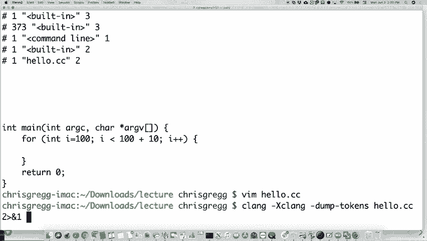

 There it is。 And then we're going to look at it and here's what comes out。 Okay。

 So what is it done here？ It is taken a type death called type death in this case and there's a type death in there。

 that it actually created。 And let's see。 There was a char 16t in there that it created and more type deaths。

 You know what？ This is actually now they look at it。

 This is just the this is all the included file in here。

 So let's get rid of that again and you'll see what it looks like with just the part of。

 the program that we have and you'll see how it actually。

 Let's see。 There we go。 Let's try this again。

 There we go。 Okay。 Here we go。 So here's what it did。 It had to find our inch。

 Remember we said that for loop in there。 What it did was it said if I was an int here and it found main and this is for the int return。

 value for main and then it found main in here and it says that's an identifier main and。

 the program is going to be look the compiler can be looking for main。 Oh， guess what？

 It found a left parentheses。 This is the main。 Remember it's like int main parentheses。 Well。

 that's the parentheses there and it calls it a left parent and it's taking it down。

 to that level where it found each individual token and does that。 There's another int in there。

 There's an Rc variable。 There's a comma。 You probably never thought about oh。

 we have to deal with all this。 If you're writing a programming language that comma means something。

 That parenthesis means something。 Well， it's just another token that gets taken into the thing。

 We have some left some brackets in here for charge to our RV。 Let's see what else we have。

 Let's see if I can get some more there。

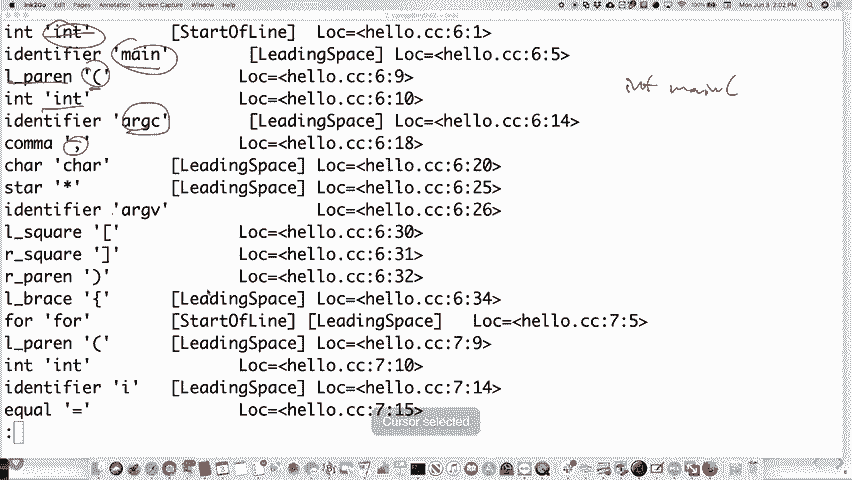

 Let's see。 Can we find any of the ones we had here？ Here's our identifier I that we put in there。

 It has that in there。 There's the plus plus。 It actually calls it plus plus。 It does it。

 So this is part of this by the way is so that it can do much more translation than some。

 other compilers。 It breaks it down to this level。 But it does need to tokenize it。

 That's a layering sort of idea。

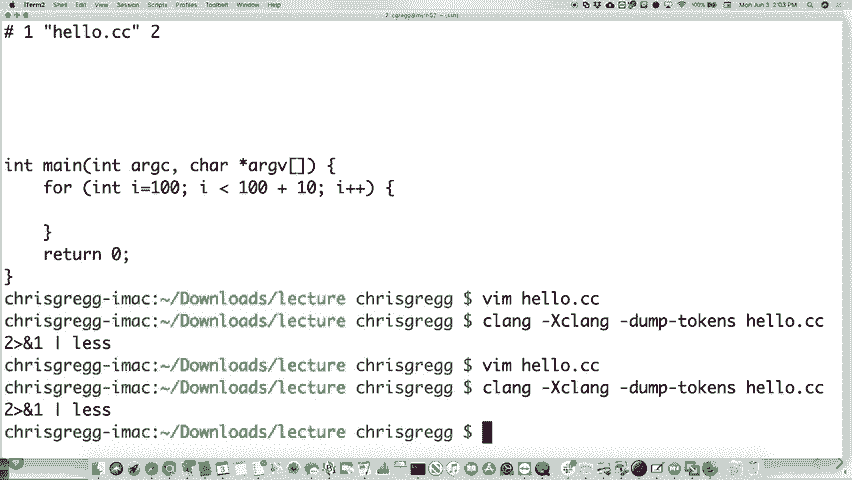

 Then after we go through the Lexer which gets all those tokens， then it goes into a more。

 interesting part。 So far this is like oh， that's just translation。 That's not too bad。

 Then it goes into this one called a parser。 A parser is now looking at syntax。 And parser says oh。

 let's break these tokens into syntactically valid constructs。

 Let's see what we do that。

 This one is also exclaiming again。 This one is AST dump like this。

 AST dump like that。 And now it actually is creating a little tree。

 We call this an abstract syntax tree that actually has all different parts in there。

 So let's see if we can find something in here that we've done here。 Here we go。

 So remember we have a four statement in there。 Well。

 the four statement is made up of a compound statement。 A compound statement up here let's say。

 And then you've got a four statement and then a declarative statement in there which is like。

 the individual parts of the four loop。 Let's see we've got an int。

 And there's our 100 for our integer that we had the constant in there。

 We've got to have a bool because there's a less than calculation in there。

 So there's a boolean value that's going on when we're doing that。

 We've got another int in there for probably the next part of the four loop。

 Let's see we've got the 10 in there for the plus。 We're going to have a plus in there which is our binary operator。

 So all these things somebody to think about how does the C++ language turn into this abstract。

 syntax tree。 And when you build computer languages you don't necessarily have to think about this。

 on some level。 But there are tools that do a lot of this for you as well。

 And then you can see there's the post fix again and plus plus and so forth。

 So that's how you end up with the parsing part of it which is actually a very interesting。

 part of computer programming language design。

 Okay。 Let's see。 There are a couple more parts here。

 There is the semantic analyzer。 Okay。 The semantic analyzer part is right here。

 That's the part that takes all those syntactically valid constructs and says does this actually。

 work in C++？ Like so far it's taken it and saying okay this maps this little part of the tree and。

 then it goes oh now I'm going to see if this works with a type system and if you can， so。

 you're going to have to eventually put out assembly code so it needs to do that。 Unfortunately。

 Klein doesn't show you the semantic analyzer part so that's that。

 But finally there's a code gen part which is what you may have or what you would have。

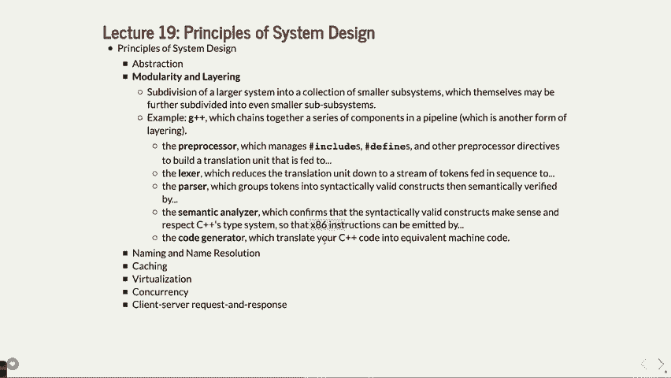

 thought about in CS107 which hopefully isn't bringing back bad memories。

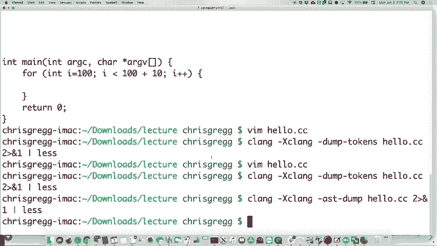

 But if we do the same sort of thing now instead of AST dump now we just want to do， I think。

 it's dash S actually。 So if we do， let's not do the X claim to our clang。

 I'll do plus plus again plus plus。 Hello， we'll do dash S。 Hello。cc。

 Let's see if there we go and then yeah there we go。

 Hello。S。 Well here's all your assembly language that came out。

 Right and that's the final part is generating a similar。

 What's cool about clang is it actually tries to comment its code。 It's kind of neat。

 You know it's nice for them to do this。 It talks about the interludes and so forth。

 Another interesting thing about this。 So let's look up， let's do this。

 Let me recompile this using the big， by the way， let's see how long is this。

 This one is 923 bytes。 If we put back in the two parts here just actually do the printing。

 Let's see， there we go and now it is how big。 It's now 49 kilobytes。

 Right so it changes a little bit when you have to all of a sudden print something out。

 Right there's a lot more going on here。 But let's look for the C out function for instance。

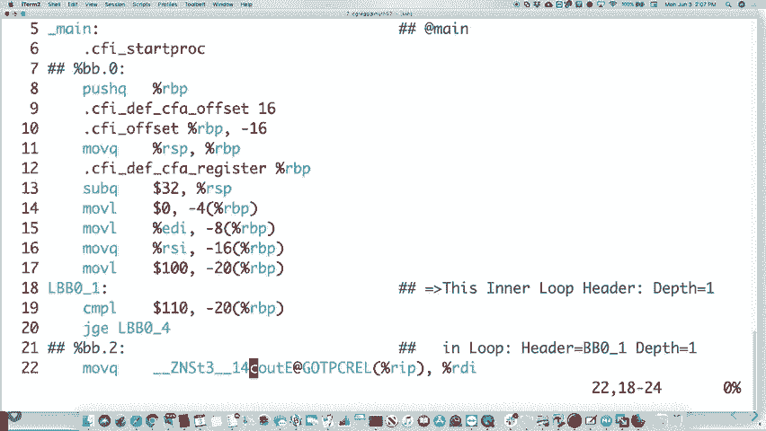

 There's our C out function。 Now notice something interesting about it。

 It's not a good color。 Notice something interesting about the C out function。

 It's got all this garbage around it。 Like underscore in record ZNST3。

 You didn't see that when you saw your functions in C code for an assembly or whatever。

 The reason is because C++ allows you to overload functions。 Right？ So you can't have just one C out。

 You can have 10 C outs that all have different parameters and things。

 So what it needs to do is it needs to do what's called name mangling。

 And it actually mangles the name and keeps track of it of course。

 But it mangles the name so if you had two different or 10 different C outs it would know which。

 one you call and you can't do that in C。 It's one of the reasons we do 107 in C instead of C++ because it can't do that。

 It doesn't do this and it's much easier to read this sort of code。

 So that's one thing you can look at in there。 So there you go。

 That's the different parts of the compiler。

 Okay？ So you have all these different parts that happen and it's all about layering and it。

 does one thing at a time and does multiple passes across the code that you can then use。 Okay？

 Then uses to actually build your assembly code。 It's kind of amazing to me that compilers go as fast as they do。

 I mean your computer is already fast but making them go fast enough to compiler code。

 just like that and when you think about all these different things that happen。

 Oh and by the way that didn't even talk about compiling with -03 in there or some other one。

 If we had taken out the C out statement again and did 03 you would have had like a 20 byte。

 file because it would have optimized everything out because nothing actually got printed。

 So all that optimization takes more time and so forth。

 And if you take a compiler's class you'll learn this。 Compiling time is not really that important。

 It's your runtime that becomes more important。 So it does take more time to compile something that's actually okay。

 Now you do have to worry about programmer efficiency and you can't take days to compile。

 things or hours like it used to but it doesn't matter if it's a little longer to compile as。

 long as it optimizes to make your program actually faster。

 If you only have to compile once you run it a million times。

 So that's how that works。 Okay。 What else are we going to talk about？ Computer networks。

 So that's a layers。 Right？ There's tons of layers in your computer networks here。 Okay？

 There's the TCP/IP layer， right？ Which is the data of how packets get transmitted back and forth。

 I talked about this the other day where it's the TCP layer that says， "Oh， here's your。

 packets in a particular or in what order？ Like zero through a hundred packets。"。

 And it's that layer that on the other side gets the packet and then says， "Oh， I've got， the packet。

 I've got packet seven。 I'm going to send an acknowledgement for packet seven back to the original calling。

 the， computer that sent me the packet。"， And so forth。 So that's what the TCP layer does。 Okay？

 But there's all these other layers in here as well。

 There's the application layer which is what you were you writing your application when。

 using these sorts of things。 There's the transport layer which is where the TCP happens。

 There's the network layer。 The network layer is the part where it says， "Okay。

 I want to send my packet to a particular， computer。

 but first it needs to go through the next closest router， like the one that's。

 in the ceiling or whatever for your Wi-Fi packets and so forth。 Okay？ In fact。

 let's take a look at how you might figure that out or how you might do a little。

 analysis there。 There is a command which is Traceroot。 Did I show you Traceroot before？

 I didn't even smart class。 Traceroot。 If you took 106B with me， you would have seen this。

 Traceroot is a way to find out all the different paths that your or the different path， one。

 particular path let's say that your packets might go through。 So I happen to find a engineering。

new university of New South Wales in Australia， edu。au。 If we try to trace the packets here， "Oh no。

 it's not going to let me。"， This happened earlier when I tried this at my desk。

 Sometimes it fails and it won't let you。 So I think， let's see， there we go。

 I did do it earlier just in case this would happen。 So let's pretend that didn't fail。

 You have to be prepared。 So what it did was it actually， if it worked。

 it would have shown you all these different， routes here， which basically says， "My computer。

 which is 10。34。160。2， needs to go to， or I guess， that might be the router actually。

 My computer might first go to the router。"， And then it goes to something at S soonet。

 which is still on Stanford。 Then it goes to another 171， which is still at Stanford。

 Then it goes to another soonet， which is still at Stanford。

 It takes four hops just to get off the Stanford campus if it's trying to go to Australia。 Why？

 Because we have a lot of computers on here and a lot of different ways you need to go through。

 a lot of steps just to get out of your local network。

 Probably that is because we have not enough IP addresses to go around。

 Then it goes to this thing called scenic， which is a， I believe that's something to do。

 with the universities in the Bay Area and kind of the North， the Pacific， Northwest Pacific。

 somewhere。 Then it has to get to Australia。 So it goes to this place called Pacific Wave。

 which is a， which is a ISP or a router that， basically sends things across the ocean。

 And you can actually see， if you go， let's see if I still have this up here， there we go。

 You can actually see all the different submarine cables that are around。 You might ask， so wait。

 why don't the， I always thought these like signals to go to Australia。

 would go through like satellites and things， right？ Sometimes they do。

 but it turns out it's much faster to go through the underwater， believe， it or not。 Any ideas why？

 Actually， the radio waves are actually faster in the air than in underwater cables。 Any ideas why？

 How far away are geosynchronous satellites？ Anybody have any idea？ How many？ 22，000 miles away。

 It takes about an eighth of a second for light to go 22，000 miles up to the satellite。

 And then another eighth of a second to go 22，000 miles back。 That's a quarter of a second delay。

 And if you've ever called anybody， let's say in Australia and did get on a satellite connection。

 there's a big delay there because it takes that much time to do it versus the 8，000 miles。

 one direction to get from like here to Australia or 10，000 miles。 Much less time over the network。

 But anyway， you can see， you can actually play around with this map and zoom in and zoom。

 out and whatever and see all the different various connectors。

 Air water cables are kind of cool in that they spool the model。 These giant spools。

 they just have a boat driving along， spooling out the cable。 And every so often。

 then they have to splice the cables together and run out of the spool。

 And they do that for thousands of miles across the ocean and it just sinks to the bottom。

 Sharks really like these cables too。 They can actually sense the electricity kind of going through them。

 So they bite them a lot。 They have to break。 They break a lot。

 So they have to deal with that too and they make them think of whatever。 Chase。

 How do they retrieve the cables？ Yeah， when a shark bites it and like splits it。

 they have a big hook that they know where， it is basically with GPS's over。

 And they have a hook that they go along until they hook it and then they reel it up。 So yeah。

 I don't know what it does to all the wildlife in the bottom。

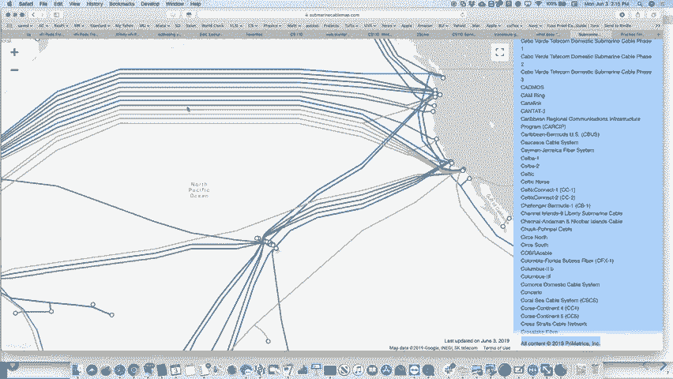

 But it's a yeah。 I think the different colors just mean。

 I don't actually know what the different colors mean。

 Good question。 It might be different。 It might be different companies that run them。

 It might be a little bit。 Well， they are specific cables。

 but like there's a bunch of gray ones here and I don't know， what the gray ones are。

 I don't know what they are。 Yeah， the military。 Yeah， maybe that's it。 But anyway。

 there are lots of cables around the world that because there are lots of people。

 communicating and that's the way it goes。 But anyway， that's another layer。

 You need to go through the network layer that sends these。

 And this would then be the physical layer， by the way。

 That's another layer that these things go through。 So another layer that we talked about。

 I guess you don't put the layer。 There's the link layer， which basically is， let's see。

 the link layer I think is between， the， I guess the network layers between the computer and the next router。

 The link layer might be either internal to the router or not a guy at the show。

 I'll have to look that on that。 But you can look up more different types of layers there。

 We generally use the application layer， right？ When you do socket and bind and all those things。

 that's generally the application layer that， we need to deal with。

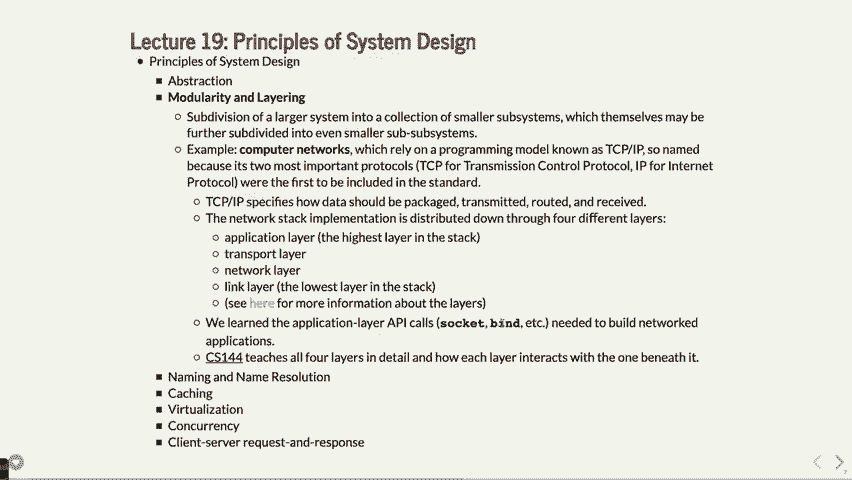

 Take a networking flash and go a couple more layers down。 Okay， 144。

 What do you might want to do that？

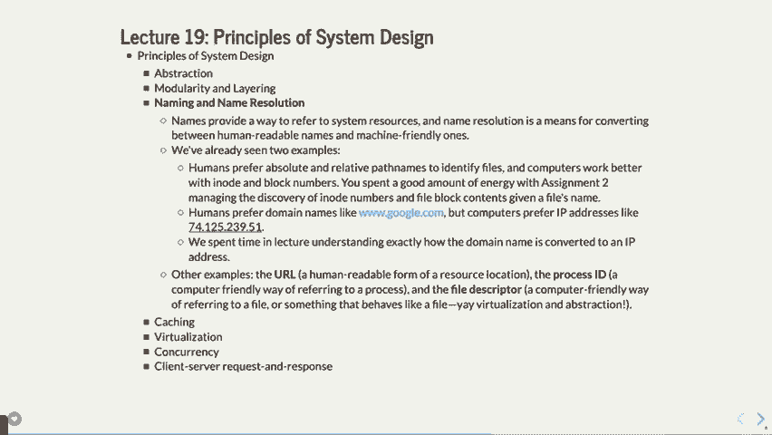

 Okay， what else？ The naming and name resolution。 Here's another one。

 So we've already seen some of this about a file system， file system examples。 We've said， you know。

 we've talked about absolute and relative path names and whether or not， humans like， Google。

com and computers like 74， et cetera。 We've done that。 URLs are also human readable。

 Remember URLs can map to IP addresses with a file path name as well。 Okay， so there's that in there。

 File descriptors。 A file descriptor is just a number， right？

 But that number goes to a file descriptor table， which has all the other details and that's， that。

 There's two different places where you can see naming and name resolution that you will。

 see as you build more bigger programs。

 Let's see， caching。 So here's a topic that I was actually a little surprised。

 This topic wasn't covered in as much detail in 110。

 I believe it's covered in more detail and correct me if I'm wrong， but people have taken， EEE 180。

 Is anybody taking EEE 180？ Nobody has。 I think EEE 180 covers the caching in more detail。

 But I wanted to spend 10 or so minutes talking about caching。

 This is what I would have covered if I was designing this course from scratch。

 I would probably cover this in a little more detail。 Here's how memory works on your computer。

 You have main memory in your computer and it's a lot， right？

 It's normally like 8 gigabytes or sometimes 16 or 32 gigabytes of main memory。

 It's memory that is random access and goes away when you're computerized。 There's also， by the way。

 the hard drive or SSD。 That doesn't go away。 It's super slow。 It's also much， much bigger。

 A terabyte or many， many hundreds of gigabytes。 But there's main memory， which is the RAM。

 Your computer also has these various caches。 So you might have a cache called an L2 cache。

 You might have an L4 cache， an L3 cache， an L2 cache， and then an L1 cache， let's say。

 And each one of these caches is smaller and smaller in amount of memory but also faster。

 than the previous level。 What makes an L2 cache faster than main memory？ Number one。

 it's generally built right on the chip itself， like on the processor chip， itself。

 So it's close to end of wires or really close to each other and it doesn't need to go to。

 some other bucks and so forth。 L1 is another one that's maybe built with also basically on the chip and also uses a。

 different technology， maybe to make it even smaller or even faster but it takes up more。

 space maybe or something like that。 And then finally you have the register file which you've done in 107 or 107E which is super。

 super fast memory but you have 32 registers or something like that。

 In fact there's more on different processors but some very small amount。

 You might have something like， I don't know， 8 kilobytes or maybe 128 kilobytes of L1 and。

 256 kilobytes of L2 etc。 What these are therefore is when you're requesting data。

 you generally request data often， the， same data sometimes many times。

 If you have a variable I that you're looping over， right？ If you're looping over 100。

000 times you're going to access that variable 100，000 times。

 So you might want to keep it in a register or keep it in an L1 cache somewhere where it's。

 going to be really fast to access because you don't want to have to go to main memory。

 and go look for it。 Here's the difference between main memory and the registers。

 There's a good analogy about this。 Main memory， let's do it this way。

 Let's say that registers is like if I had this pen and let's say this is a register。

 I have the pen sitting here and I want to write something。

 Going to a register I have to pick up the pen and I have to write something and then I。

 put the pen down。 Going to the L1 cache， it might be like the pen is way over here on the table。

 In order to go to the L1 cache I have to go over and hit the pen and then come back and。

 have to write it down。 That's how much slower the L1 is。 L2 might be the pen isn't on the table。

 it's over in gates or something。 I have to go back to my office。

 I have to go to the pen and I have to come back。 That's how much the floor is for L2。

 Main memory would be like let's see the data is in San Francisco and I have to walk there。

 to get the data。 That's how much slower is。 A million times slower like in some cases。

 You have to go and walk down San Francisco and come back to the pen。 That's it。

 Drive is like the data is in New York City and I have to walk to New York City and go， get it。

 That's how much slower it is to get something off your hard drive or your solid state disk。

 than it is from the register。 You think it's pretty important then to keep things as low in memory as possible if you're。

 using that often。 What I wanted to do is I wanted to show you a little example of how a cache actually works。

 Some of the numbers that might go into using a cache。

 You do not need to know any of this for the final exam or whatever。

 I just want to show it to you just to give you a feel for how caches actually what they。

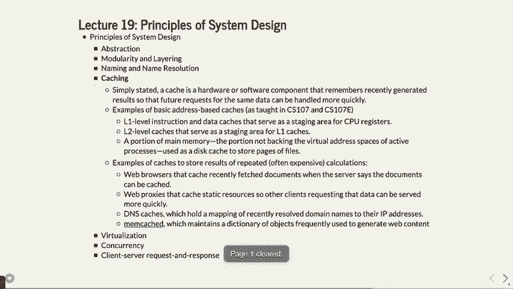

 have to do to keep the data。 What we're going to do is we're going to do a thing called a direct mapped cache。

 Here's what this is。 Let's say that you had 32 kilobytes of memory。

 In order to do 32 kilobytes of memory we would need to have five bits of information。

 One bit per byte as it turns out or one bit for two to the fifth number of kilobytes or， whatever。

 You need five bits of information there。 Like zero zero zero zero zero zero zero zero zero zero zero zero zero zero zero one all。

 the way down to one one one one one。 Let's say that was your main memory。

 What we're going to want to do is we're going to want to have a smaller amount of memory。

 Sorry not 32 kilobytes 32 addresses that would make more sense so you can do five bits here。

 32 addresses but let's say that we have a cache that only has space for eight of those。

 memory like sections。 Let's do it like this。 Let's say that you had eight bits in here one two three four five six seven seven one two。

 three four five six seven eight eight。 How many bits do I need to represent eight different locations？

 How many？ Three。 You need three bits right。 We're going to have this thing called a tag or an index rather an index which is going。

 to be zero zero zero zero zero one and I'm actually sorry I'm going to do this。 Oh no。

 I'm going to do it。 Hang on。 We're going to we're going to have the I put it in the wrong place here。

 You're going to have a the index here or maybe I took it in the right place。

 Anyways the index here and the index is the part that tells us yes so zero zero zero zero。

 zero zero one zero zero one one zero zero one zero one zero one zero one zero one zero， one one one。

 There's our eight locations that we're going to be able to store some of those 32 addresses。

 Zero is going to map to zero one is going to map to one two is going to map to zero one， zero etc。

 Where do you think eight seven is going to go to one one one one where do you think eight。

 is going to go back to zero right we need some modules here to actually do that thing。

 we're basically going to store them based on the upper three bits of their address okay。

 and so I'm sorry it's actually this is where I got confused it's the lower three bits of。

 their address that we're going to do。 So basically zero zero zero is going to go in zero zero zero zero zero zero one is going。

 to go there etc。 Okay and remember what we're trying to do is we're trying to say every time you ask for。

 some memory it's going to first look in this very fast cache and if it finds it it's going。

 to return it faster than if it had to look it up in main memory。

 Okay at the beginning nothing is in your cache okay we are going to try to look up the following。

 ten different values okay we are going to look up one zero one one zero then we're going。

 to look up one one zero one zero and then one zero one one zero and then one one zero。

 one zero and I got the rest of them here too we're going to look up one zero zero zero zero。

 zero zero zero one one one two three four five six we need four more we're going to be one。

 zero zero zero zero one zero zero one zero one zero zero zero zero zero what are you doing。

 class day listen to Chris this talk much better and then one one zero one zero okay we're going。

 to look up all those numbers look look up all those addresses and if you look it up and。

 it's not in the cache it's called a cache miss and that's expensive we want to get cache。

 hits which means that it's in the thing because this is direct address it actually turns out。

 we can't we can't keep the values in there very long there's other kinds of caching which。

 allows you to keep the data in there longer we're just going to see this example see how。

 it works here's what you do you go to let's see if you look up one zero one one zero we。

 look at the one one zero and we go over here and we find the index and this is called the。

 tag by the way and we look up we say is one one zero fill or not well one one zero is not。

 filled so what we do is we say first of all we say that's a cache miss and we put the。

 one zero well we put the let's do this we put the memory for one zero in here with the one。

 four one zero one one zero the memory for that in there and then we're going to tag it with。

 the one zero to differentiate it from the other things that might fit in that bucket okay so。

 we looked up one zero one one zero we looked at the one one zero we did it in the wrong。

 one didn't I guys got to catch me on this we did it in there did in the wrong one one。

 one one zero and we looked at one zero and then we're getting the memory from one zero one。

 one zero okay that's what we're putting we're putting that memory there so when next time。

 we look that up we will get it quickly so let's look at the next one one one zero one zero。

 we look at zero one zero and we go to zero one zero is it there no so we it's another。

 miss and we do the same thing here we put we've got one one and then we have the memory from。

 that location doesn't matter what that is right now okay and then now it's in the cache。

 let's look up one zero one one zero again we go to one one zero it's there is one zero。

 the tag it's there we quickly return this value that is a cache hit and that's a good。

 thing and that means that it's that it's we've got that value in there and you can think。

 that if we're going to access that number many times well we'll always find it in the。

 cache until it gets replaced by something else。 Let's look at the next one 11010 we。

 look at the 010 0 0 10 1 1 it is also in there already so that's another hit。 Okay let's look。

 at 100 0 0 0 not there so we put the 1 0 there and we have the memory from that location that's。

 a miss 0 0 0 1 1 0 0 0 1 1 it's a miss and we'll get to one that's interesting in a second。

 1 1 the memory there and then 1 0 0 0 0 okay 1 0 0 0 we've already seen we already seen。

 that one too yes we did that's a hit okay and then 1 0 0 1 0 okay we go to 0 1 0 aha。

 0 1 0 it's 1 1 but we're looking for 1 0 we now evict what's there in the cache what's。

 they call cache eviction we send it out we put the 1 0 1 there we replace it with the。

 memory from 1 0 0 1 0 okay and then let's do this one and that was a miss because it wasn't。

 what we're looking for 1 0 0 0 0 0 0 0 0 0 it's a hit again and then the final one 1 1 0 1。

 0 well we've looked at this one a whole bunch of times but now 1 1 0 1 0 we go back to 0 1。

 0 we have to kick this one out again and that's another miss and now we put this one back。

 in there this method is great because it's fast to look up it's not great if you happen。

 to get two pieces of data that are both mapped to the same bucket at the same time anyway。

 that's how you do this mapping a lot of times this is supported with hardware so these things。

 can be done in parallel a lot of this can be done in parallel and it's also there are。

 ways to do it so that the values can go in any position in the cache and you have to determine。

 whether or not to kick something out of the cache based on how long it's been there if。

 it's been there most recently then you don't kick it out it's been there a long time you。

 kick it out or whatever and you have to go through that so I just wanted to show you that's。

 a little of the math that you might have to go through if you take E。D。 180 and you work。

 on how do caches actually do their thing okay so that's that one okay questions on caching。

 yeah very good question the question was if you ask if you do malik where does it go。

 to come from totally depends generally if you haven't if the if the computer hasn't used。

 that memory location recently then it will have to go to main memory to request it if。

 it has been used for maybe from other programs or whatever but it's not being used by other。

 program now it might still be in the cache but if you do malik it might get a bunch out。

 of the in fact it won't actually need to read any information out it says hey here's。

 your locations first time you try to read from the location it will populate in the cache。

 the next time it will be there hopefully it will be much faster and by the way those。

 four levels of caches or whatever it keeps bumping it down down down down down as far。

 the more you do so your data will be in all the upper level caches but looks in the lower。

 spot first doesn't find it looks in the next one doesn't find it and then eventually gets。

 up to where it finds it yeah good question any other questions on this okay let's look。

 at so or let's see what board there we go okay so that was caching virtualization yeah。

 yeah so the question is is your stack moved to your cache surely right I mean the cache。

 is separate from your program itself right the caches based on how often you use that。

 data and if you use it it gets looked for in the cache it is not there it gets put in。

 the cache once it finds it and so again there's various strategies for doing this what you're。

 trying to do is you're trying to get about if you can ninety percent cache hits in your。

 lower level caches so that's very fast and this really does speed things up and significantly。

 yeah yeah so yeah the question is are these being virtually mapped in here and they are。

 they are all being virtually mapped in the addresses that are stored or the memory addresses。

 that are stored in the caches are actually physical addresses so a particular program。

 will have a physical address now another question that might come up is wait what happens when。

 you do multi processing and you shift off the process do all the caches remain or do they。

 go away generally to get cleared for a different process they might get saved and popularly。

 populated but generally I think they just get cleared so every time you do a process switch。

 your caches get cleared which slows things down significantly too they talk about you。

 talk about caches as that being hot or cold a cold cache doesn't have any memory in it yet。

 the hot cache has all the memory there it's really fast to access what other kinds of。

 caches by the way we have you did a web browser cache or you did a web web cache web proxy。

 cache DNS caches is whenever you're trying to request a Google's address trust me your。

 local cache has Google's address because you use it all the time so it's a need to go find。

 it and then there let's see oh there's another one called them cached which is I don't know。

 much about that but it's for web content that keeps the web content cached in a slightly。

 different way so there's lots of different places where caching becomes important and。

 it does significantly speed things all right what else can we do virtualization so we I。

 mentioned virtualization a few times you've seen it in labs and so forth as well virtualization。

 there are two types one is an abstraction that makes many resources look like one okay let。

 Let me give you an example。 There is a hard drive system called RAID， r-a-i-d。

 And it basically says， let's say that you have a computer， and it has many hard drives。

 Why would you have that？ A couple of reasons-- you might have four hard drives。

 associated with one particular server。 One reason is that you can keep file one here。

 part of file one here， and another part of file one here， and another part of file one here。

 And maybe throughout those four-distits， duplicated in such a way that if this， entire disk dies。

 then you can recoup file one just， with the other three disks。

 It's very good for redundancy reasons。 But let's say that you--。

 another reason you can do it is if you kept file one here， and file one here。

 remember reading from a hard drive is slow。 What if you can do it in parallel and have one process。

 reading from this drive and the other process reading， from this drive to get part of the same file？

 You can actually do it almost twice as fast， because both disks will be running in parallel。

 to giving your data。 So it's both for robustness and for safety， as far as robustness and for speed。

 rather， so that you can get your data faster。 But by the way， your file system。

 when you access a file， it has no idea that there's four disks here。

 It looks like just when you make one request， and it gives you the data back。

 Internally to the RAID system， it does all these special， oh， there's four disks。

 and I have to do that。 That's a virtualization。 Four disks look like one disk， but they。

 are partitioning such a way that it， is either faster or more robust。

 So that's one type of virtualization。 The Andrew file system， this is what。

 we use on the MIF machines。 If you ever noticed， if you've logged in a MIF。

 or you log in to Cardinal or if you log in a MIF 52 or 58， or whatever， all the same file system。

 the reason it's all the same file system， is that it's a file system that is spread across。

 all those computers。 In fact， Andrew file system is spread across the world。

 You can go to Carnegie Mellon's--， if you can do CD from your MIF to a machine in Carnegie Mellon。

 now you don't have the permissions probably to do anything， but you can actually CD into it。

 We always type slash user slash class。 Really， that's actually a link to slash AFS slash IR slash。

 et cetera， et cetera。 And those are like AFS is the Andrew file system。

 I think IR is Stanford's or whatever。 And so it's mapped to across the world。

 But that's a virtualization。 It looks like there's one file system。

 but really there's thousands and thousands， of computers connected to that one system。

 They share the file system。 Web server load balancer。

 This is when you log in a MIF and we did a load balancer in class。

 We log in a MIF and it comes up with--， sends you to MIF 52 because it's got the fewest number of people。

 on it that are working。 Virtualization is also making one resource look like many。

 So what does that mean？ Well， this would be like virtual to physical memory mappings。

 So you know how we've said last time， that you have two processes and they both think。

 they have all the memory in the entire system？ Well， they don't。

 They only have a little portion of memory， but it's making that one--。

 it's making the one resource look like many resources， instead of the other way around。 Threads。

 Well， it's thread has its own stack segment。 Well。

 that's just the irregular stack broken into many pieces。 That's virtualization。 Virtual machines。

 So who has used VMware before？

 I think I have VMware on here。 Here we go。 Here's VMware。 I can load-- if I load this up。

 I can load a Linux machine。

 on my neck that's really Linux。 And it really thinks it's talking to hardware directly。 And in fact。

 it is， because Intel sets up things， to make it virtualization work right。

 But now I have literally two operating systems running。

 on a computer at once-- my Mac operating system， and a Linux operating system。 And by the way。

 VMware was--， the company has started from Professor Mendel Rosenblum。

 who's here and teaches this class， occasionally in some other systems classes。

 He did pretty well creating VMware。 But anyway， now I've got-- see， now I'm just inside my Linux。

 machine up here。 And I also can do-- you can do windows or other machines too。

 I don't even have a Windows PC， but I use Windows programs， occasionally。

 And all I do is run it out of VMware and makes it easy。 So it's a little slower because there's。

 some translation that has to happen。 But it's not too bad。 And it works pretty well。

 Works pretty well。 That's how the ends work。

 All right。 Concurrency。 We've talked a lot about concurrency in this class。 Multiple processes。

 multiple threads， multiple cores on your multi-processor computer。 Wasn't until about 10。

 12 years ago， you really couldn't buy a multi-processor computer。

 for less than tens of thousands of dollars。 It was really expensive。 In 2006。

 Intel started pushing out a dual core machine， which means now you've got a computer that can literally。

 do two programs at the same time。 And that's concurrency。

 Signal interrupt handlers are all about concurrency。 Signals， your program is running along。

 with an interrupt handler。 The kernel is doing its own thing。

 And then signals your handler to stop the rest of your program。

 and handle whatever the child process handler， or whatever is happening there。

 There are languages which are built specifically， to do concurrency。

 There's a language called Erlang， which， is a great language but kind of hard。

 to get your head wrapped around。 But it basically doesn't allow race conditions。

 You can't make a race condition early， because of the way the languages built。

 Not bad if you're trying to do lots of concurrency。 Yeah？ So signals interrupt， but it's not。

 because they can try and code that works， before they throw a problem。 Good question。

 If signals interrupt handlers， just like everything else。

 If signals interrupt handlers are concurrent， how did it work before multi-processing？

 When you have one processor， you can mimic multi-processing， by time slicing everything。 Right？

 So the kernel gets a little time， and you get a little time。 The kernel gets some time。

 and you get some time， in your single manner， get some time， whatever。 So that's how it works。

 But anyway， Erlang， look it up。 It's an interesting language if you。

 want to do very safe concurrent programs。 JavaScript is exactly the opposite。

 They said concurrency is too hard。 We're just going to have one thread。

 And it's not quite as true these days。 But it made it very easy to program in JavaScript in some ways。

 but also not very efficient because it has one thread。 It does everything。

 So that's that。 OK。 All right。 And then finally， we have client server response， which。

 is a request and response。 This is what we've been doing for networked。

 This is exactly what your map reduce is doing， where your map reduce main program is talking。

 to the reducers and the mappers back and forth， until it gets all the data back。

 It's a client server request。 You see this all the time， not just in networking。

 You see it with multi-processing。 You see it with processors that have。

 to basically talk between each other， and coordinate things that happens。

 System calls are also another request and response， right？

 Where you say a system call and the kernel， goes and handles it， you are basically。

 talking to the kernel that talks back to you， that gives you， back the answer。

 And there's that handshake that has， to happen via a system call in there。

 All of the networking protocols， of course， are various examples of client requests and response。

 And then the file systems that we just talked about。

 are also client requests or a request and response。 Because you look for a file that might not。

 be on the hard drive that the mitzv are using。 It's on the file system that the hard drive。

 is up some other building， which might be--， it might be if you're looking at Carnegie Mellon's。

 it's on the hard drive over at Carnegie Mellon。 You have to do some requesting and it's kind of slow。

 in that sense。 So those are the seven pieces that we covered this quarter。 And there's a lot there。

 but you know some of the details， about that。 You still don't know some of the abstraction underneath the hood。

 sort of details。 You'll get those in other classes。 But in here。

 hopefully you can see how many of the things， that we've done relate to these ones。

 What questions do you have at this point？ All right。

 So I will then see you for last class on Wednesday。 It is on non-blocking file。io。

 And then we have the final exam。

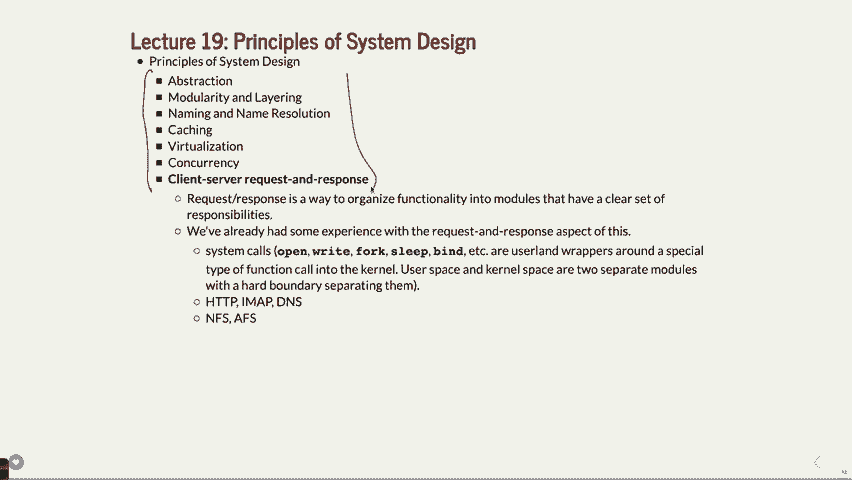

 No laps this week， there are no laps。 We'll see you then。

