# P20：第19讲 系统设计原则 - ___主讲___ - BV1ED4y1R7RJ

所以，CS140是关于操作系统的。在这门课程中，我们使用了你最终将在操作系统中构建的所有这些内容，对吧？

比如，你会构建一个文件系统。你会构建如何实际操作文件的系统。在这门课上，你会构建一个较低级的、更稳健的文件系统，并且更多地涉及文件的各个部分。你不仅仅是读取和写文件，你会在140课程中构建实际的文件系统。

你将会构建一个线程库、一个分叉库和一个多处理库。这些正是我们现在知道如何使用的东西，接下来你将在140课程中真正构建它们，并理解构建一个线程库所需的内容。所以，很高兴你已经知道如何使用这些库，因为那样做起来会容易得多。

了解如何去构建它们。所以，这就是关于实现部分的内容。还有CS 143，这是一门编译器构造课程。在我读研究生时，这是一门我最喜欢的课程。尽管我成绩不是特别好，非常抱歉，但我非常喜欢这门课程，因为你会更深入地了解编译器的工作原理。

嘿，你的代码是如何最终变成机器码的？在107课程中你稍微涉及过这个话题，但并没有真正深入到如何进行翻译的部分。你会看到起始和结束的过程，但编译器的核心就是进行这些翻译。这是一门非常棒的课程。

我还认为，很多雇主看到你上过编译器课程时，通常会稍微有点兴趣，觉得这个人敢于挑战常规，因为并不是每个人都会选修编译器课程，而且大家都知道这是一门很难的课程。所以，这门课很有趣，如果你有兴趣的话，可以去了解一下。

如果你喜欢我们最近做的网络相关的内容，CS144涵盖了更多细节的网络知识，比我们做的要详细得多。我们只是讨论了服务器与客户端，以及如何设置网络等等。这门网络课程会深入探讨更多细节。例如，数据是如何高效地通过网络传输的？

今天我们会更一般性地讨论这个话题。但这就是网络课程的内容，它是另一门非常好的课程，特别是如果你对这类东西感兴趣。如果你将来从事安全相关的工作，或者类似的领域，选修一门网络课程也许不是个坏主意。

这门课也非常重要，因为它涉及很多漏洞利用的内容，这些内容可能存在于你在这门课上还没有看到的网络层。明白吗？

所以，这就是我认为你可以继续深入学习的三个主要方面。还有144和142等其他课程，抱歉，142是另外一门可以让你深入学习系统细节的课程。所以有很多系统课程，再次声明，我理解很多人都想说，终于结束了，永远不想再学系统了。

但是对于那些想要尝试的其他人，有很多其他选择，如果你想了解更多这些选择，随时可以和我聊。好了。那么今天我们要讨论的原则是这些。我们要讨论抽象。现在，抽象就是你一直在做的事情。你在许多场合中都看到了抽象。

有许多不同的层次，我们会深入讨论抽象到底是什么。我们需要讨论它与CS110的关系。模块化和分层是我们要看的另一个方面。命名，记住你在文件系统中做的所有事情，比如名称解析。这是你必须处理的一个重要原则。

这些原则大多数是关于更高效地做事情，或者以某种方式让一个庞大的系统变得不那么庞大，更容易理解。这就是这些原则的主要内容。好吧。或者说，像名称解析就是这样，嘿，人类擅长名称，计算机擅长数字。

那么，如何将两者结合起来，使其对计算机来说更加高效。虚拟化。我们将讨论两种不同类型的虚拟化，然后是并发。我认为这门课更多地涉及并发，可能比其他任何主题都要多。沿途会有更多这种内容。

然后，客户端-服务器请求和响应是另一个方面。并非只有网络涉及客户端-服务器的请求和响应。无论你是否在同一台计算机上，或者通过网络，或者在其他任何情况下，只要有两个程序试图进行通信，就涉及到客户端-服务器请求和响应。

而且理解它是如何工作的，这一点非常重要。好吧，没问题。那么这些是，我们直接跳进去，当然，等等。当然，这又不工作了。好了。也许。好的。我们继续进行。

来了，来了。来了，来了。

现在回来了。好吧。抽象。好的。抽象就是简单地将程序所做的事情与实现分开。

好吧。这是我们在许多不同场景中看到的内容。但其中一个例子就是排序程序。对吧，一个排序程序有一个接口，你传入一堆单词，然后它会把这些单词排序后返回给你。这就是你可能拥有的接口。你需要将它们放入数组，并设置数组的起始位置。

就是这样。那就是接口。实际的行为是它们被排序。实现是如何发生的完全取决于程序。当然，使用 sort 时，你希望使用最优的排序算法。你不想用那个最差的排序方法。你希望使用一个复杂度为 O(n log n) 的排序，或者是其他什么的。

但从实现与接口与抽象的角度来看，它是这样的，这就是抽象的大致框架。好吧。我们已经在许多方面看到了这些。很多时候，主要的挑战是设计一个干净的接口，使得你设计的某个库容易使用。好吧。我们在这门课上已经为你们做了很多接口的设计。

主要是因为如果你不清楚接口，设计和测试会非常困难，首先是很难测试。但其次，没有清晰的接口，你可能会花费很多时间思考如何设计某个东西的接口，而你会想要正确地做，因为它确实很有挑战性。我认为 C++ 语言中的接口不一定像...

你可能会希望其他语言更简洁一些。你知道，当你在 map 中查找时，它返回一个迭代器，并且有一个第一个元素和第二个元素，等等，这样的事情处理起来就有点麻烦。好吧。那可能没有那么简洁。它之所以存在是有原因的，但它可能并不是特别简洁。

文件系统。所以每当你使用文件流和 IO 流时，我们在这门课中使用的 IO 流比文件流多得多，这是一个从低级读取和写入（我们最开始看到的那部分）中抽象出来的东西。为什么我们要将它们抽象化呢？因为，正如之前所说，这样做更容易。通过读取和写入。

你必须考虑如何为自己处理缓冲。你必须考虑，哦，假如我尝试读取 10 个字节，但只读取到 6 个字节，怎么办。这些从某种程度上来说都是抽象的。一旦你有了一个好的文件库，比如 IO 流和文件流之类的，情况就不一样了。好吧。进程。那么，进程为什么是抽象的呢？嗯，好吧。所以本质上是这样的。

你可能不知道 fork 和 execvp 是如何工作的，对吧？

如果你学了 CS 140，你会了解这些背后实际是如何工作的。但那是一个接口。当你调用 fork 时，你知道它会创建两个进程，你并不关心它是如何实现的。但你知道现在你有了两个进程，一个是子进程，一个是父进程，等等。

还有许多其他事情在发生，用于跟踪子进程，以便能够等待，进程 ID（PID）等等。这一切都是抽象的。信号也是其中之一。如果你学了 CS 107E，你可能学过中断，它本质上就是信号，你对它的工作原理了解更多一些。但关键是你有一个。

内核跟踪着一些你不一定需要知道的事情。你希望内核去跟踪它们。你并不真正知道它是如何做到的。你只知道，当某件事发生时，内核会去调用你的程序，触发一个处理函数或类似的东西。这基本上就是一个信号。所以这个也被抽象化了。你的。

这里的抽象是，哦，好吧，当某件事发生时，我有一个信号处理器会被调用，它是如何实现的呢？当我们封装它时，这一切都被抽象化了。如果你去学操作系统，你将了解更多关于它是如何工作的，或者也许某些电子工程课程也会涉及到这些内容。

线程，类似的东西。记住，线程和进程是相似的。线程是轻量级的进程，但基本概念是一样的。你有这些线程。它是如何工作的？我们并不完全知道。我们知道如何使用它们，并且知道如何高效使用它们。就这样。HTTP。这就是你上次作业的内容。

代理就是这么回事，HTTP定义了东西是如何通过网络传输的，以及它所接收到的各种信息，这一切都被再次抽象化了。通常情况下，你在使用网页浏览器时，不需要担心get和post等问题。

这类事情。好了，这就是抽象。

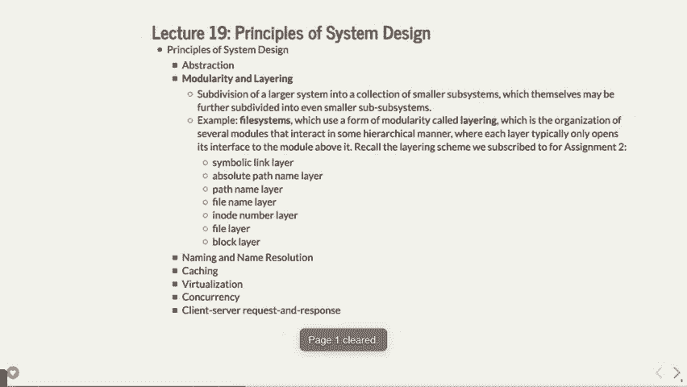

好的。模块化和分层。所以当你谈论模块化时，基本上是在说将一个较大的系统细分成多个较小的系统。这就是分解。你从106A或106B的第一天就开始做这件事了，这一点很重要。我最喜欢的复杂大型系统的一个例子，信不信由你，是复印机。

那么人们是如何使用的呢，大家都用过复印机，对吧？我们计算机科学系有一些复印机，能够复印成百上千份考试卷，比如CS106B和CS106A之类的，这些机器超级复杂，对吧？

如果你去想一下，为了将页面复印成某种格式，必须发生什么事情，其实是相当复杂的。举个例子，好吗？对吧？复印机的作用就是复印纸张。这是大致的情况，对吧？紫色的纸。就这样。所以它们就是复印纸，这就是它们的功能。但它们还做什么呢？嗯。

它们可以处理双面复印，对吧？那实际上是什么意思呢？对吧？

这意味着你必须有一种方法在纸的两面都写字，这通常并不会发生。那样做会有些奇怪，尤其是因为重力可能会起作用。但你也可以选择将纸翻过来，这就涉及到机械工程的挑战了。对吧？所以它也有这些功能。这些机器有时还会订书，对吧？

装订涉及到把纸张放置得准确无误。我的意思是，哦，顺便说一下，它还需要进行整理，对吧？这就是你得把所有不同的堆叠整理到合适的位置。整理是怎么做的呢？好吧，如果你有一份20页的考试卷，像CS110的考试可能不止20页，但假设你有一份20页的考试卷，对吧？那么……

系统得有足够的内存才能存储这20页，或者说，一些旧款复印机每次处理20页文档时都必须重新送纸，因为它们没有足够的内存来一次性处理这些。这个问题很重要，因为机器里面有内存。我们再看看，它还有与网络相关的功能，如果你想，像我可以把打印任务发送到……

复印，或者说就这样。我能做到。那还有什么？

还有整个物理层，或者说它背后的实际物理原理。你们知道复印机到底是怎么运作的吗？物理上它是怎么做到的？好吧，所以有一张黑色的纸，哦，顺便说一下，还有激光，对吧？

你复印机里面有一束激光，对吧？这挺酷的。实际上，激光会给纸充电。假设它是负电荷。我不知道是什么电荷。它会给纸上的各种点充电，接下来会有碳粉覆盖上去。然后复印机的其他部分会取用那个碳粉，就是那种黑色的、粉状的糟糕东西。

它会充电到相反的电荷，然后在纸上喷上大量的碳粉，信不信由你。接着它会把那些有电荷的地方吸附住。然后，它会把多余的碳粉扫掉，好吧？

实际上，我认为它是先把纸张加热，再把碳粉扫掉，或者也许是相反的顺序。但基本上是这样操作的，然后它会做一个加热过程，这就是为什么复印出来的纸总是非常干燥的。而我的意思是，这些东西是如此复杂，没有一个人，实际上甚至没有十个人，能知道足够多关于整个机器的知识，能够独立修理或完全操作它。

或者甚至理解它，能够告诉你所有的细节，对吧？这里有物理学家，有工程师，还有，顺便提一下，还有所有的软件。你知道手机上有多少不同的菜单，对吧？上面有很多软件，对吧？就得做这些，确保一切都正确，然后还有机械工程。

这背后有很多工作。我的意思是，参与其中的人非常多，它必须被细分开来。实在是太庞大了。你绝不会让一个人单独做出一台复印机，对吧？

这不可能，因为一个人做不到。就这样吧。另一个很好的例子是你口袋里的手机，对吧？如果你和我一起上过107E课，你还记得我们讨论过手机上的各种传感器，对吧？

这个机器上可能有15个不同的传感器。你知道你手机里有四个无线电吗？

你的手机里有四种不同的无线电。一个是用来接打常规电话的，实际上这已经不是你最常做的事情了。现在你用手机的最少的功能就是打电话了。还有 Wi-Fi。还有蓝牙。再来，嗯，还有一个是用来进行 Apple Pay 或其他操作时通讯的。所以，你的手机里有各种各样的无线电。

有摄像头。至少有三种不同的摄像头。有前置摄像头。后置摄像头。指纹传感器下方的摄像头。如果你有的话，就是这样工作的，对吧？现在一些设备的屏幕里也集成了摄像头。更不用说还有温度传感器、跌落传感器。

有加速度计。有陀螺仪，对吧？谁能理解这些所有的东西呢？

没有人能理解每个细节，对吧？

有专门的工程师负责 iPhone 中陀螺仪部分的工作，这就是它如何工作的，对吧？但这完全是一个大系统的细分。所以，如果你打算构建更大的项目，你必须理解这些是如何运作的，对吧？

同时，你可能会去 Apple 工作，负责 iPhone 的工作，并且想，“哦，我是负责指纹传感器的那个。” 但你不是唯一的那个。你可能会觉得自己只是在做一个很小的部分，但你必须记住，“哦，确实有一个更大的项目在这里，它最终是完整的。”

但这就是你必须理解的地方。希望这门课程给你的作业是有一定复杂度的，里面有很多移动的部分，这就是为什么会有 20 个不同的头文件之类的原因。你必须尝试去理解这一点。我们并没有让它变得过于复杂到一个人无法理解，但我们需要推动这个极限，说明 "哦，我们最好把这些拆分成不同的子系统，否则就会变得无法管理"。

这不可能发生。"，最终系统。这里有一个很好的分层示例，你可以看到，虽然不一定是调制，但你有分层，意思是把一层放在另一层上面，从而将它分解成不同的组件。记得在你的第二个作业里，有一个符号链接，你不一定非要使用符号链接，但你可以阅读并了解它们。

有一个绝对路径名称，比如 slash user slash class 等等。还有一个路径名称层，可以处理像 dot dot slash dot dot slash 这样的路径，并将其层叠到实际的东西上。还有一个文件名层，实际上是处理人类可读的文件，这是那里。

你有了那一层。接下来是 i-node 层。记住每个文件都有一个 i-node。为什么呢？因为计算机在处理数字方面比处理整个路径要更高效。处理路径会慢得多。然后是文件层，它存储文件的实际内容，例如硬盘上的位数据，最后是块层，它指示它们在磁盘上的位置。

所有这些不同的层次汇聚在一起构成文件系统，而你必须至少了解这些层次中的一部分，或者至少了解你正在处理的特定层如何与下一个层交互。希望不会涉及太多层次，但你在工作时必须理解这一点。

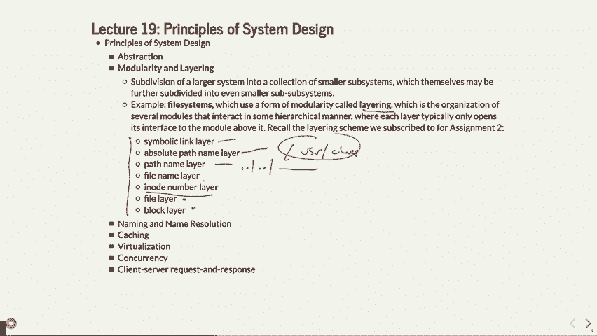

好的，我们关于模块化和分层还有什么要讲的呢？这是我们不太深入探讨的内容，可能你在编译器课上会更详细地讲解。但我现在要给你们展示一下 G++ 中发生的分层。你知道你的程序如何被转换成二进制。

其实这里面有很多步骤。它并不是一次就把所有东西直接转成二进制。其实有很多不同的部分，我们将会特别看看其中的一些部分，这样你就能看到编译器究竟需要做什么。我们首先来看预处理器。预处理器是所有包含和宏定义的处理者。

就像你们展示的那样，包含（include）和宏定义（define）。预处理器会处理这些并将它们转化成其他东西，供下一级层次使用。

让我给你们展示我在说什么。我们要做的是编写一个小程序，叫做 hello.cc，内容非常简单。就像是第一天的作业，使用 I/O 流并命名空间 STD。然后我们做一个宏定义，因为这里有两个宏，include 和宏定义。接下来我会讲解，K 范围起始值是 100。

然后是 main 函数，C 输入一个 char 指针 RV。接下来让我们做一个循环，i 从 K 范围起始值开始，i 小于 K 范围起始值加 10，每次增加 1。在这里我们会输出“hello world”，并将 i 一起输出。就这样。这个程序很简单。有人发现什么 bug 吗？

好的。我接下来做的事情实际上不是在 Myth 上进行的。我是在我的电脑上做，因为我要使用一个稍微不同的编译器。我将使用一个叫做 clang 的编译器，它允许你拆解一些细节，这是 G++ 由于某些原因无法做到的，你可能能做到，但我搞不清楚。

通过clang执行，你会看到它的效果。如果我们执行以下命令`clang -E hello.cc`，好了，首先尝试执行`clang hello.cc -o hello`，确保它能够正常工作，如果一切正常。

哦不，也许你们中的某些人需要使用`clang++`。好了，这样可以正常工作，所以看起来是`clang++`起作用了。所以如果我们在这种情况下执行`hello`，它会执行，并且那样是有意义的。好了，我就这么做。如果我们尝试执行`clang`，这次执行`clang -E hello.cpp`。

这表示运行预处理器，这是处理`#`和结束符号的一部分。

一磅资金。好的，为什么这个不工作呢？

哦，CC，原来是这样。好了，明白了。那么我们继续吧。

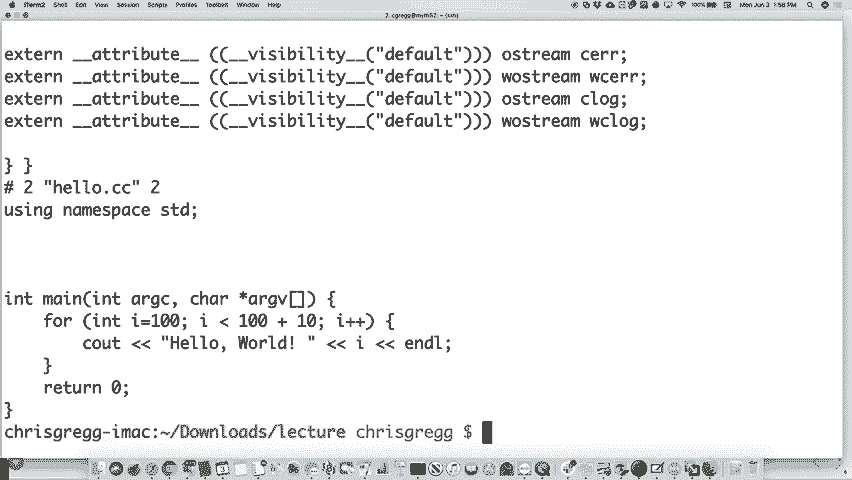

这是它实际做的事情。好吧，它实际上是做了什么？首先，它获取了一个`#`符号。

包含文件，并将其包括在内。猜猜看，那个`#include`头文件也可能包含其他的文件，它需要将这些文件也包含进去，最终它会将所有这些内容合并成一个文件，基本上是将你即将处理的所有内容放到一个文件里。好的，它就这么做了。实际上，让我们看看预处理器生成的文件大小，字数大约41,000行。

结果就是我们的一行“Hello World”程序，完全是通过将预处理器加进去的。不过让我们来看看没有`Hello.cc`的情况。我们来看看没有`cout`的代码，以及没有`cout`的情况下`K range start`会变成什么。

好的。如果我们再做一次，结果是18行，明显好多了。

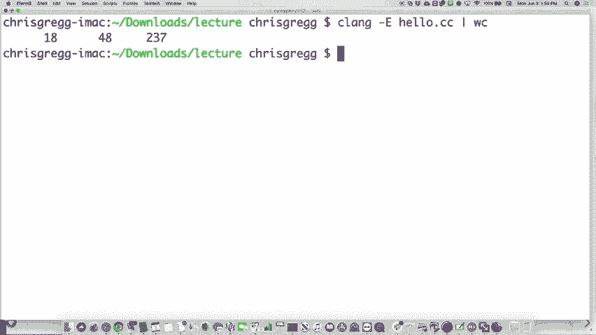

好的。所以我们做的这部分内容，其实是一些其他信息，会被编译器的其他阶段使用，比如文件数量等等。请注意它对我们的`#define`做了什么。它将`K range start`替换成了100，并且在这里也替换了100。就这么简单。它取了你定义的内容，遍历了整个程序，找到了定义的位置并做了替换。

使用并替换它，这就是预处理器的作用，它不会做其他的事情。在某些情况下，如果你做了适当的设置，它可能会替换一些变量，但就这么多。这就是预处理器的作用，也是它的第一阶段。

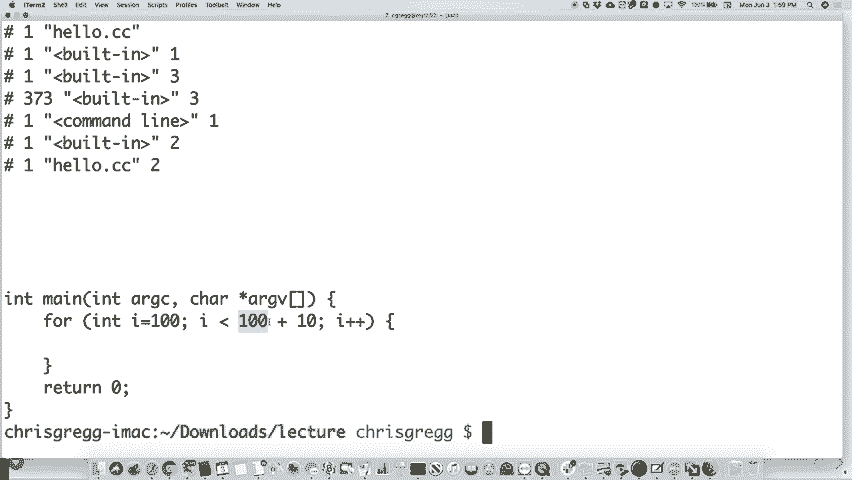

好的。下一阶段称为词法分析器（Lexer），它负责将一个令牌流的翻译结果提取出来。对了，它会将程序中的内容转换为一个个独立的令牌，表示程序中发生的事情。

好的，让我来展示一下我的意思。如果我们重新回到最初的代码。

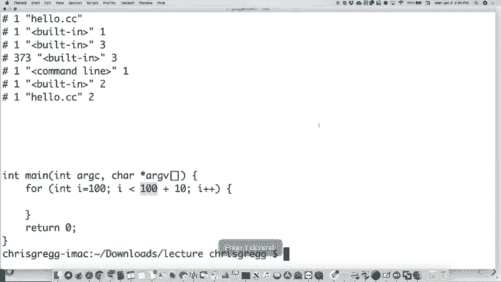

所以我们来做这个，然后把它放回去，这样我们就能再次看到原始内容。

好的。我们来做这个。如果你使用`dash clang dash X clang dash dump tokens`命令，然后加上`hello.cc`。

它实际上做的事情是，它出于某种原因将输出放到了标准错误流。所以我将实际上将标准错误流管道或重定向到标准输出流，你可能知道或不知道你可以这样做，但你可以，这时你应该使用两个尖括号`&1`。

就是这样。然后我们要查看它，看看输出是什么。好的。那么这里做了什么？它采取了一个称为“类型死亡”的类型，在这种情况下，它里面有一个类型死亡。它实际上创建了它。让我们看看。里面有一个`char 16t`，它创建了它，还有更多的类型死亡。你知道吗？实际上现在他们看它时是这样的。

这只是所有包含的文件。所以我们再把它去掉，你将看到它只显示程序的一部分，看看它是如何实际工作的。

让我们看看。好了。我们再试一次。

就这样。好的。现在我们来看一下它做了什么。它必须找到我们的`inch`。

记得我们说过那里的`for`循环吗？它做的是，如果我是`int`，然后它找到了`main`，这是`int`的返回值，然后它在这里找到了`main`，它说这是一个标识符`main`，并且程序——编译器正在寻找`main`。哦，猜猜看？

它找到了一个左括号。这是主函数。记住，它就像`int main()`，对吧？那个括号就是这里，它把它称为“左括号”，并且将它分解到这个层次，找到了每一个独立的标记。就这样。里面还有另一个`int`。还有一个`Rc`变量。还有一个逗号。你可能从来没有想过，哦。

我们必须处理这些。如果你在编写一种编程语言，逗号意味着某种东西，括号也意味着某种东西。那么，它就是一个被当作标记处理的符号。我们在这里有一些括号，表示对`RV`的调用。让我们看看还有什么。再看看能不能找出更多的。

我们来看看。我们能找到这里的任何一个吗？这是我们放进去的标识符`I`。它里面有这个。这里是`++`。它实际上称之为`++`。它做到了。所以这实际上是这个的一部分，顺便说一下，这样做是为了让它能够进行比一些其他编译器更多的翻译。它把它分解到这个层次。但它确实需要进行标记化处理。

这是一种分层的思路。

然后在我们通过了词法分析器（Lexer），它获取了所有这些词法单元之后，它进入了一个更有趣的部分。到目前为止，这看起来像是翻译而已。并不算太难。接着进入了一个叫做解析器（parser）的部分。解析器现在正在查看语法。解析器说，哦，来吧，让我们把这些词法单元分解成语法上有效的结构。

让我们看看我们是怎么做的。

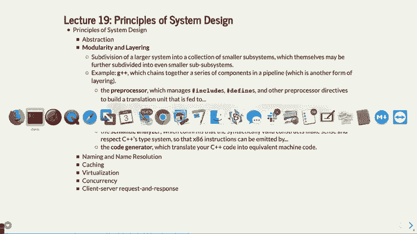

这个也是在再次感叹。这个是AST转储，像这样。

像这样的AST转储。现在它实际上正在创建一颗小树。我们称之为抽象语法树（abstract syntax tree），它实际上包含了不同的部分。让我们看看是否可以在这里找到我们已经做过的部分。这里来看看。记得我们在这里有一个四个语句。嗯。

四个语句由一个复合语句组成。假设这上面是一个复合语句。然后你有一个四个语句，再加上一个声明语句，类似于四个循环的各个部分。我们来看一下，我们有一个int类型的变量。然后我们有100作为我们整数的常量。

我们必须有一个布尔值（bool），因为这里有一个小于运算（less than calculation）。所以在我们做这个运算时，就会有一个布尔值。我们还得有另一个整数类型（int），可能是四个循环的下一个部分。再看一下，我们在加法操作中用了10。所以这里将会有一个加号（plus），这是我们用的二元运算符。

所以这些东西得有人考虑，C++语言是如何转变成这个抽象语法树的。在构建计算机语言时，你不一定非得考虑这些问题。某些程度上，你不必自己思考这个，但也有工具可以帮你做很多这种工作。然后你可以看到那是后缀操作符，再加上++等。

所以这就是你最终得到的解析部分，它实际上是计算机编程语言设计中一个非常有趣的部分。

好的，让我们看一下。这儿还有几个部分。

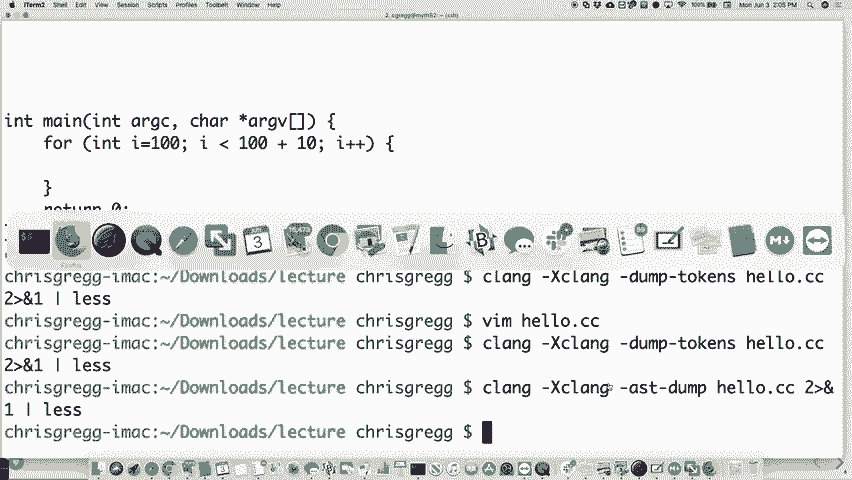

这是语义分析器。好的，语义分析器部分就在这里。它是那个部分，它接受所有那些语法上有效的结构，检查这些在C++中是否有效。到目前为止，它已将这部分映射到语法树中，然后它会说，现在我要检查它是否符合类型系统，如果可以的话，继续进行。

你最终还是得输出汇编代码，所以它需要执行这个操作。不幸的是，Klein没有展示语义分析器部分，所以就到这里吧。但最终有一个代码生成部分，这就是你可能会有的，或者你会有的部分。

这是在CS107中考虑过的内容，希望这不会勾起不好的回忆。

但是如果我们现在做同样的事情，而不是做 AST 转储（dump），我们只需要做，我想是 dash S。实际上是 dash S。所以如果我们这样做，我们就不再做 X 声明给 clang。我会再次做加号加号。你好，我们来做 dash S。Hello.cc。我们来看看，应该可以了，是的，可以了。

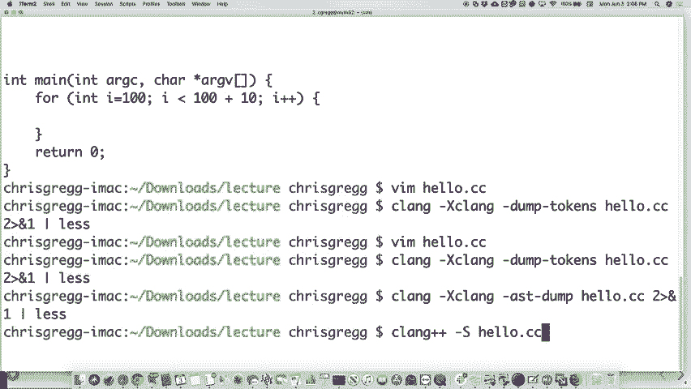

你好，S。那么这里是所有的汇编语言输出。

对，这就是最后一个部分，就是生成一个相似的代码。clang 很酷的一点是，它实际上会尝试为代码添加注释。真是很棒。

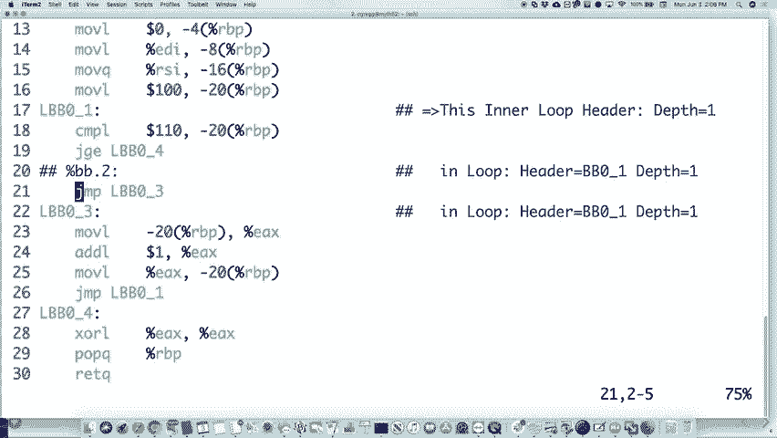

你知道，他们做这些事情真不错。它谈到了插曲等内容。

关于这个，还有一个有趣的事情。我们来看看，做一下这个。让我重新编译一下这个，顺便说一下，我们来看看它有多长。

这个是 923 字节。如果我们把这里的两个部分放回去，实际上是做打印。

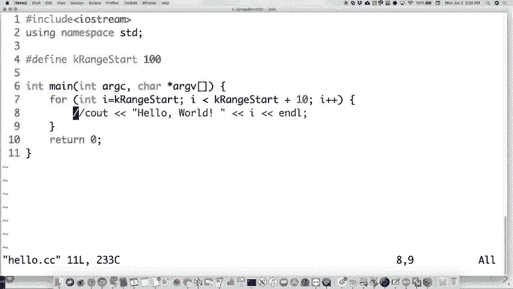

我们来看看，现在它有多大？现在是 49 千字节。对，当你突然需要输出某些内容时，文件大小会有点变化。对，这里发生了更多的事情。但让我们看看 C 输出函数，比如说。

这是我们的 C 输出函数。现在注意到一些有趣的地方。

它的颜色不好。注意到 C 输出函数的一些有趣的地方吗？它周围有很多垃圾字符，比如记录中的下划线 ZNST3。你在 C 代码的函数中或者汇编中是看不到这些的。原因是因为 C++ 允许函数重载。对吧？所以你不能只有一个 C 输出函数。

你可以有 10 个不同参数的 C 输出。所以它需要做的就是进行所谓的名称修饰（name mangling）。它实际上会修改名称并跟踪它。当然，它会修改名称，这样如果你有两个不同的，或者 10 个不同的 C 输出，它就知道是哪一个。

你调用一次，在 C 语言中是做不到的。这也是我们在 C 中做 107 而不是在 C++ 中做的原因，因为它做不到这一点。它不做这个，而且这种代码更容易阅读。所以这是你可以在其中看到的一个方面。好了，编译器的不同部分就是这些。

好吗？所以你有这些不同的部分，这一切都涉及到层次化处理。它一次做一件事，并对代码进行多次遍历，最终你可以使用它。好吗？

然后编译器使用它来构建你的汇编代码。对我来说，编译器能这么快实在是令人惊讶。我的意思是，你的计算机本身已经很快了，但要让它足够快去编译代码，就像那样。而当你想到所有这些不同的事情时。哦，顺便说一下，我还没有提到使用`-03`编译或其他某些选项。

如果我们再次去掉了`C out`语句并执行了03，你会得到一个大约20字节的文件，因为它会优化掉一切，因为实际上没有任何内容被打印出来。所以所有这些优化反而需要更多时间，等等。如果你参加编译器课程，你会学到这一点。编译时间其实并不是那么重要。

是你的运行时变得更重要了。所以确实需要更多时间来编译某些东西，这也没关系。现在你必须关注程序员的效率，不能像以前那样花几天或几小时编译。但如果编译时间稍长也没关系，只要它能优化并让你的程序更快。

如果你只需要编译一次，你就可以运行它一百万次。

所以这就是它的工作原理。明白了吗？我们还要谈些什么？计算机网络。这里有许多层，对吧？在你的计算机网络中有很多层。明白了吗？

还有TCP/IP层，对吧？它是数据包来回传输的方式。我前几天讲过这个，TCP层会说：“哦，这里是你的数据包，按特定顺序传送，像是从零到一百个数据包。”就是这个层在另一端接收到数据包，然后说：“哦，我收到了数据包。”

我有了第七个数据包。我要向原始调用的计算机发送一个对第七个数据包的确认信息，"计算机发送了给我这个数据包。"等等。所以这就是TCP层所做的工作。明白了吗？

但这里也有其他的层。比如应用层，这是你在编写应用程序时所用的那些层。还有传输层，这是TCP发生的地方。再就是网络层。网络层就是它说：“好吧。”

我想把我的数据包发送到一台特定的计算机，但首先它需要经过下一个最接近的路由器，比如天花板上的那个，或者用于Wi-Fi数据包的路由器，等等。明白了吗？事实上，让我们看看你如何找出这一点，或者你如何做一些事情。

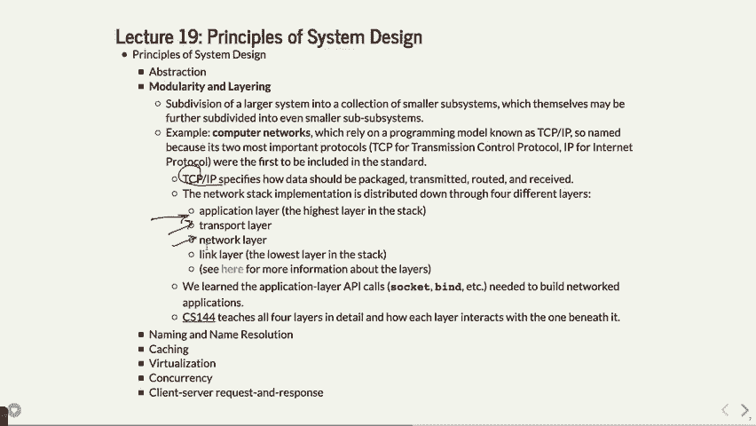

在这里进行分析。有一个命令叫做Traceroot。我之前给你们演示过Traceroot吗？

我甚至没上过聪明的课。Traceroute。如果你和我一起上过 106B 课程，你就会见过这个。Traceroute 是一种方法，用来找出你的数据包可能经过的所有不同路径，或者说，特定路径。比如，我偶然发现了澳大利亚新南威尔士大学的工程网站 edu.au。如果我们试图追踪这些数据包，“哦，不行。”

它不会让我连接。”我在我办公桌上试过这个时也发生过这种情况。有时它会失败，无法让你连接。所以我想，看看，行了。我之前确实做过这个，以防万一发生这种情况。所以我们假装它没失败。你必须做好准备。所以它实际上是这样做的，如果它成功的话。

它本应向你展示所有这些不同的路由，基本上是说，“我的电脑，IP 地址是 10.34.160.2，需要连接到，或者我猜，实际上应该是路由器。我的电脑可能首先会连接到路由器。”然后它会连接到 S soonet，那仍然是在斯坦福大学。接着它会连接到另一个 171，仍然是在斯坦福大学。

然后它连接到另一个 soonet，仍然是在斯坦福大学。仅仅要从斯坦福大学校园出去，它就需要四次跳跃，如果它要去澳大利亚。为什么？

因为我们这里有很多计算机，而且有很多不同的路径需要通过。仅仅要离开本地网络就需要经过很多步骤。可能是因为我们没有足够的 IP 地址可以使用。接着它会连接到一个叫做 scenic 的东西，我相信它与某些事情有关。

与湾区的大学以及北太平洋、太平洋西北部的一些地方连接。然后它必须到达澳大利亚。于是它连接到一个叫做 Pacific Wave 的地方，这是一家 ISP 或路由器，基本上是把信息传送到大洋彼岸。如果你去看，看看我是不是还打开了这个页面，来看看。

你实际上可以看到周围所有不同的海底电缆。你可能会问，那么等等，我一直以为这些信号去澳大利亚的应该通过卫星之类的东西，对吧？有时确实是这样的，但事实证明通过水下电缆要快得多，不管你信不信。你知道为什么吗？

实际上，电波在空气中的传播速度比在水下电缆中快。你知道为什么吗？

静止轨道卫星离得有多远？有人知道吗？大约 22,000 英里远。光从地面到卫星需要大约八分之一秒的时间。然后再花八分之一秒的时间返回地面。这样就会有四分之一秒的延迟。如果你曾经打过电话，假设是打到澳大利亚并通过卫星连接。

那里有很大的延迟，因为完成这项工作需要这么长时间，而从这里到澳大利亚单程是 8,000 英里，或 10,000 英里。通过网络传输要少得多的时间。但无论如何，你可以看到，实际上你可以玩弄这个地图，进行缩放，查看所有不同的连接器。

空中水下电缆有点酷，它们会把模型卷成大卷。这些巨大的卷筒。它们只是让一艘船沿着电缆走，然后卷出电缆。每隔一段时间，它们就得把电缆接起来，然后继续从卷筒里放出。它们为此在海洋中铺设了成千上万英里的电缆，最后它们就沉入海底。

鲨鱼也很喜欢这些电缆。它们实际上可以感知电流通过电缆的情况。所以它们经常咬这些电缆。电缆必须断裂。它们经常断裂。所以它们也必须应对这个问题，它们会让它们去想办法。追逐。它们是怎么取回这些电缆的？是的，当鲨鱼咬住电缆并把它撕裂时。

它们有一个大钩子，通过 GPS 定位确定位置。然后它们沿着电缆走，直到勾住电缆，然后把电缆拉上来。所以是的。我不知道这对海底的所有野生动物有什么影响。

但是是的，我认为不同的颜色只是代表不同的意思。我其实不知道不同的颜色意味着什么。

好问题。可能会有不同的情况。可能是不同的公司在管理这些电缆。可能会有一点不同。嗯，这些是专用电缆。但是这里有一堆灰色的电缆，我不清楚这些灰色的是什么。我不知道它们是什么。是的，可能是军用的。对，也许就是这样。但无论如何。

世界上有很多电缆，因为有很多人在进行通信，这就是它们的工作方式。但无论如何，那是另一个层。你需要经过网络层来发送这些电缆。顺便提一下，这将是物理层。

这也是这些电缆所经过的一个层。所以这是我们刚才谈到的另一个层。我猜您并没有加这个层。链接层基本上就是，我想链接层是在计算机和下一个路由器之间。链接层可能位于路由器内部，或者不在展示中。

我得查一下这个。但你可以查看其他不同类型的层。我们通常使用应用层，对吧？当你进行套接字操作、绑定以及其他这些操作时，通常是需要处理的应用层。

进行一次网络闪存，继续往下走几层。好，144。你可能想做这个吗？

好的，还有什么呢？命名和名称解析。这里有另一个例子。我们已经看到了一些关于文件系统的内容，文件系统示例。我们说过，我们谈到了绝对路径和相对路径名，以及人类喜欢的像是 Google.com 和计算机喜欢的像 74 等等。我们已经做了这些。URL 也是人类可读的。

记住，URL 也可以映射到 IP 地址以及文件路径名。好的，这里有这个。文件描述符。文件描述符就是一个数字，对吧？

但是那个数字会指向文件描述符表，里面包含了所有其他的细节，就是这样。有两个不同的地方，你会看到命名和名称解析，当你编写更大的程序时，你会遇到。

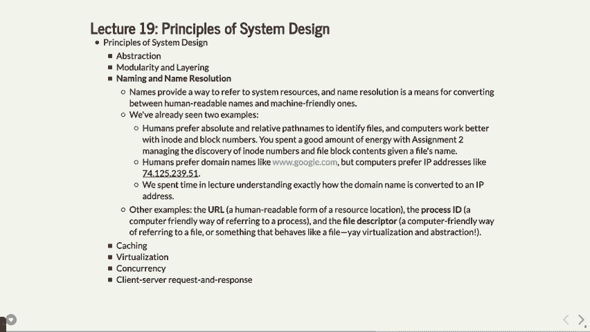

看看缓存。这里有一个话题，实际上我有点惊讶这个话题在 110 课程中没有详细覆盖。我相信它在其他地方有更详细的讲解，如果我错了，请纠正我，但有些人已经选修了 EEE 180。有人选修 EEE 180 吗？没有人选吗？我觉得 EEE 180 更详细地讲解了缓存。

但我想花大约 10 分钟时间来讲解缓存。如果我是从头设计这门课程，我会更详细地讲解这个内容。你计算机的内存是如何工作的呢？你计算机中的主内存是非常庞大的，对吧？

通常，主内存是 8GB，或者有时是 16GB 或 32GB。它是随机访问内存，计算机化后会消失。顺便说一下，还有硬盘或 SSD。那是不会消失的。它非常慢，但也大得多，可能有一个 TB 或者几百 GB。但主内存是 RAM。

你的计算机也有这些各种缓存。所以你可能有一个叫做 L2 缓存的缓存，你可能还有 L4 缓存、L3 缓存、L2 缓存，再到 L1 缓存，假设是这样。每一个缓存的内存量都越来越小，但也比前一级缓存更快。那是什么让 L2 缓存比主内存更快？第一点。

它通常直接内建在芯片上，比如处理器芯片上。所以它很接近线缆末端，或者非常接近彼此，并且不需要去其他地方。L1 缓存是另一种可能直接内建在芯片上的，它可能采用不同的技术，甚至更小或者更快，但它占用的空间更多。

可能是空间之类的。最后，你还有寄存器文件，这是你在 107 或 107E 课程中学过的，它是非常非常快的内存，但你只有大约 32 个寄存器，或者类似的数量。事实上，不同的处理器上可能有更多，但也只是非常少的数量。你可能会有 8KB 或许 128KB 的 L1 缓存之类的。

256千字节的L2缓存等。这些实际上是当你请求数据时的情况。通常你会频繁地请求数据，有时还会多次请求相同的数据。如果你有一个变量I，你在循环处理，明白吗？如果你循环了100,000次，你将访问这个变量100,000次。

所以你可能想将它保存在寄存器中，或者将它保存在L1缓存中，这样访问速度会非常快，因为你不想去主内存中找它。这里是主内存和寄存器之间的区别。有一个很好的类比。主内存，我们这样做。

假设寄存器就像我拿着这支笔，假设这支笔是一个寄存器。我把笔放在这里，我想写东西。去寄存器时，我必须拿起笔，然后写下东西，再把笔放下。去L1缓存时，可能就像笔放在桌子上很远的地方。

要去L1缓存，我必须走过去拿起笔，然后回来，写下内容。这就是L1缓存的速度慢的原因。L2缓存可能就像是笔不在桌子上，而是在某个地方。我得回到办公室，去拿笔，再回去。这就是L2缓存的速度慢的程度。

主内存就像是数据在旧金山，我得走到那里去取数据。就是这么慢。在某些情况下慢一百万倍。你得走到旧金山，再走回来拿笔。就是这样。硬盘就像数据在纽约市，我必须去纽约市走一趟，去拿它。

这就是从硬盘或固态硬盘获取数据的速度有多慢，而从寄存器中获取的速度要快得多。那么，显然如果经常使用，尽量将数据保存在内存中更低层次的地方是很重要的。我想给你展示一个缓存是如何工作的例子。展示一些可能用于缓存的数字。

你不需要知道这些内容来参加期末考试或其他什么。我只是想给你展示一下，让你感受一下缓存的实际工作原理。

需要做的事情是保持数据。我们要做的是实现一种叫做直接映射缓存的东西。看，这是什么样的。假设你有32千字节的内存。为了处理32千字节的内存，我们需要5位信息。每个字节一个位，或者说是每32千字节对应的5位信息，具体取决于你。

你需要5位信息，就像是0000000000000000000000000000000001，一直到111111111111111111111111111111111。这就是你的主内存。我们想要做的事情是将内存量缩小。抱歉，不是32千字节，而是32个地址，这样你就可以用5位信息了。

32个地址，但假设我们有一个缓存，只能存储其中八个内存段。我们可以这么做，假设你有八个比特位，这里是一二三四五六七八。我们需要多少比特来表示八个不同的位置？

多少位？三个。你需要三个比特，对吧？我们将有一个叫做标签或索引的东西，实际上是一个索引，它将是`000001`，对不起，我做错了。哦不，我要重新做一下。等一下。我们将这样做，把它放错地方了。你将会有一个索引，或者可能我放对了地方。

无论如何，索引在这里，索引是告诉我们是不是的部分。所以，`000000001001010101010`，这是我们能存储其中部分32个地址的八个位置。零将映射到零，一将映射到一，二将映射到零一，零等等。

你认为`87`会存到哪里？`1111`，你认为`8`会存到哪里？回到零，对吧？我们需要一些模块来做这件事。我们基本上将根据它们地址的上三位来存储这些数据。抱歉，实际上是这个地方我搞错了，是根据它们地址的下三位来操作。

他们的地址我们将要做的。基本上，`000`将存入`000`，`001`将存入那里等等。好的，记住我们要做的事是每次你请求某些内存，它将首先在这个非常快速的缓存中查找，如果找到了，它将比从主内存中查找更快地返回结果。

好的，一开始缓存中什么都没有，好吗？我们将尝试查找以下十个不同的值。好，我们将查找`10110`，然后查找`11010`，接着是`10110`，再然后是`11010`，我这里也有剩下的值，我们还将查找`10000`。

`00011123456`，我们还需要四个位，我们将是`100000101000000000`，你在干什么？班级，听Chris讲，那个讲得好多了。然后`11010`，好，我们将查找所有这些数字，查找所有这些地址，如果你查找它。

它不在缓存中，这叫做缓存未命中，这很昂贵。我们希望得到缓存命中，这意味着它已经在缓存中，因为这是直接寻址。实际上，结果证明我们不能将值存储在缓存中太长时间，还有其他种类的缓存可以让你将数据存储得更久，我们只是通过这个例子来看一下如何操作。

它是如何工作的呢？你要做的是，看看是否查找 1 0 1 1 0。我们查看 1 1 0，然后去找索引，这个叫做标签。我们查看时会问，1 1 0 是填充了吗？其实 1 1 0 还没填充，所以我们做的第一件事是说这是一个缓存未命中，我们把。

一 0 好，我们做这个，我们把 1 0 的内存放进去，用 1 4 1 0 1 1 0 的内存放进去，然后我们用 1 0 的标签来区分它，以免它与可能适合这个桶的其他内容混淆。好的，现在我们查找 1 0 1 1 0，我们查看 1 1 0，但我们做错了。

我没有搞错吧？大家得提醒我，我们查的是错误的 1 1 0，而我们查的是 1 0，然后我们取出了 1 0 1 1 0 的内存，好的，我们把那个内存放进去，这样下次我们查找时就能快速找到它。现在让我们看看下一个，1 1 0 1 0。

我们查找 0 1 0，然后我们去看 0 1 0，它不在，所以这又是一个未命中，然后我们做同样的事情，我们把 1 1 放进去，然后从那个位置取出内存，不管那是什么，现在好了，它已经在缓存中了。让我们再看看 1 0 1 1 0，我们去找 1 1 0，它在那里，就是 1 0。

标签存在时，我们快速返回这个值，这是一个缓存命中，这是好事。这意味着我们已经把这个值存入缓存，你可以想象，如果我们多次访问这个数字，那么我们总是能在缓存中找到它，直到它被其他东西替换掉。让我们看下一个 11010。

看看 010 0 0 10 1 1，它也已经在里面了，这是另一个命中。好的，让我们看一下 100 0 0 0，它不在，所以我们把 1 0 放进去，并从那个位置获取内存，这是一个未命中。0 0 0 1 1 0 0 0 1 1，它是一个未命中，我们稍后会看到一个有趣的情况。1 1 从那里的内存，然后 1 0 0 0 0，好吧，1 0 0 0 我们已经看过了。

那个也放进去，是的，我们做到了，这是一个命中。好，接着是 1 0 0 1 0，我们去找 0 1 0，啊哈，0 1 0 是 1 1，但我们现在在找 1 0，于是我们将缓存中已有的内容逐出，这就叫做缓存驱逐。我们将 1 0 1 放进去，替换掉了 1 0 0 1 0 的内存，好，接下来我们做这个，它是一个未命中，因为它不存在。

我们要找的是 1 0 0 0 0 0 0 0 0 0，又是一个命中，接下来是最后一个 1 1 0 1 0。我们已经查了这个好几次了，但现在 1 1 0 1 0，我们又回到了 0 1 0，我们不得不将其踢出去，这又是一个未命中，现在我们把它放回缓存。这种方法很棒，因为查找很快，但如果你遇到。

你需要获取两条映射到同一个桶的数据，不管怎样，这就是如何进行映射。很多时候，这些映射是由硬件支持的，这样这些操作可以并行进行。很多操作可以并行完成，另外，也有办法让值可以存放在缓存中的任何位置，你需要确定这些位置。

是否将某些内容从缓存中清除，取决于它在缓存中存在的时间。如果它最近被访问过，你就不清除它；如果它已经在缓存中很长时间了，你就把它清除，或者其他策略，你需要按照这些方法进行。我要展示给你们的是，如果你参加`E.D. 180`课程，你可能需要经历的一些计算。

缓存是如何工作的呢？好，这就是那个问题了，好，关于缓存有什么问题吗？

嗯，很好的问题，问题是，如果你做了`malik`，数据从哪里来呢？完全取决于情况。通常情况下，如果计算机没有最近使用那个内存位置，它就需要从主内存中请求数据。如果它已经被其他程序使用过，或者其他情况，但没有被其他程序占用时，数据就可以从那里获取。

程序现在它可能仍然在缓存中，但如果你做了`malik`，它可能会把很多东西清除出去。事实上，它实际上不需要读取任何信息，它会说“嘿，这里是你的位置”，第一次尝试从这些位置读取时，数据会被加载到缓存中。下次再读时，它就会在那里，希望会更快一些，顺便提一下这些。

四级缓存或其他机制，它会不断地将数据向下、向下、向下推，直到最远处。你越是这样做，数据就会存在所有上层缓存中，但首先会查看较低层的缓存。如果没有找到，会查看下一个缓存，再没有的话，最终会到达找到它的地方。嗯，好问题，还有其他问题吗？好，接着看。

所以，或者让我们看一下，好的，缓存虚拟化就是这样。

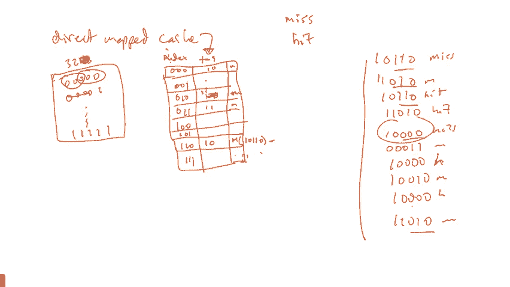

嗯，问题是，栈是不是已经移动到缓存中了？当然了，缓存就是这样工作的。

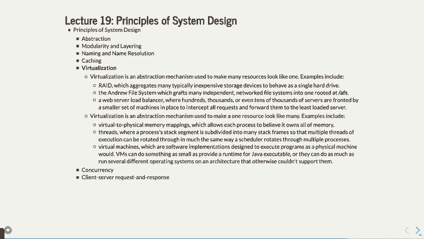

缓存与你的程序本身是分开的，它是根据你使用数据的频率来决定的。如果你使用了它，它会在缓存中查找，若没有找到，它会被放入缓存。一旦找到它，数据就会存入缓存。所以，这里有多种策略来实现这个目的，你的目标是尽量做到让缓存命中率达到90%。

更低级别的缓存是非常快的，这确实能大大加快速度。是的，是的。所以问题是，这些是否是在这里进行虚拟映射的？它们是的。它们的所有映射都是虚拟的，存储在缓存中的地址实际上是物理地址，所以一个特定的程序。

会有一个物理地址。现在，另一个可能出现的问题是，等一下，当你进行多进程处理并且切换进程时，所有的缓存会保留吗？还是它们会消失？通常它们会被清除，供不同的进程使用，但它们可能会被保存和重新填充，但一般来说我认为它们会被清除，因此每次切换进程时。

当你的缓存被清除时，事情也会变得显著变慢。他们讨论缓存时，会提到缓存是热的还是冷的，冷缓存还没有任何数据，而热缓存已经存有所有数据，它的访问速度非常快。顺便问一下，你知道我们还有哪些类型的缓存吗？你曾经做过网页浏览器缓存或者做过网页缓存、网页代理吗？

缓存DNS缓存是你每次试图请求Google的地址时，相信我，你的本地缓存已经有了Google的地址，因为你一直在使用它，所以不需要再去查找。然后我们看看，哦，还有一个叫做“缓存”的东西，我不知道它具体是做什么的，但它是用于网页内容的，它会将网页内容缓存起来，稍微。

以不同的方式，这里有很多地方，缓存变得非常重要。

它确实大大加快了速度，那我们还能做什么呢？虚拟化，所以我们我提到过虚拟化几次，你们在实验室里也见过，等等，虚拟化。虚拟化有两种类型，一种是抽象，它让许多资源看起来像是一个。好吧，让我给你举个例子。有一个硬盘系统叫做RAID，r-a-i-d。

它基本上是说，假设你有一台计算机，并且它有多个硬盘。你为什么会有这些硬盘呢？有几个原因——你可能会有四个硬盘与某台特定服务器关联。一个原因是你可以把文件一的一部分保存在这里，文件一的另一部分保存在这里，文件一的另一部分保存在这里，文件一的另一部分保存在这里。

并且这些四个磁盘可能会以某种方式进行重复，这样如果整个磁盘损坏，你可以仅通过另外三个磁盘恢复文件一。这在冗余方面非常有用。但假设你——另一种做法是，如果你把文件一保存在这里，文件一保存在这里。

记住，从硬盘读取数据很慢。如果你能并行处理，一个进程从这个硬盘读取数据，另一个进程从另一个硬盘读取同一文件的部分内容呢？

你实际上可以几乎快一倍，因为两个磁盘会并行运行，为你提供数据。所以，这既是为了稳健性，也是为了安全性，至少从稳健性和速度上来说，能让你更快地获得数据。顺便提一下，你的文件系统在访问文件时，并不知道这里有四个磁盘。

它看起来就像你发出一个请求，然后它返回数据。在 RAID 系统内部，它做了所有这些特殊的操作，哦，有四个磁盘。我必须这么做。那就是虚拟化。四个磁盘看起来像一个磁盘，但它们的分区方式可以使其更快或更稳健。

所以这是一种虚拟化类型。Andrew 文件系统，这就是我们在 MIF 机器上使用的。如果你曾经注意到过，登录到 MIF，或者登录到 Cardinal，或者登录到 MIF 52 或 58，或者其他任何地方，文件系统都是一样的。之所以文件系统相同，是因为它是一个遍布各地的文件系统。

所有这些计算机。实际上，Andrew 文件系统遍布全球。如果你能从你的 MIF 目录切换到卡内基梅隆的机器，你可以访问它。现在你可能没有权限做任何操作，但你实际上可以进入它。我们总是输入 `/user/class`。实际上，这只是一个指向 `/AFS/IR/` 的链接。

等等，等等。这些就像 AFS（Andrew 文件系统）。我记得 IR 是斯坦福的，或者其他的。它被映射到全世界。但这就是虚拟化。它看起来像一个文件系统，但实际上有成千上万的计算机连接到这个系统。

它们共享文件系统。Web 服务器负载均衡器。这就是当你登录 MIF 时，我们在课堂上做了负载均衡器。我们登录到 MIF，然后它会将你转发到 MIF 52，因为那里的人最少。虚拟化也是让一个资源看起来像许多资源。

那这意味着什么呢？这就像虚拟到物理内存映射。你知道我们上次说过，你有两个进程，它们都认为自己拥有整个系统的所有内存吧？但其实并不是。它们只拥有一小部分内存，但它们让这一部分——

它让一个资源看起来像多个资源，而不是反过来。线程。线程有自己的栈段。那只是将不规则的栈分割成多个部分。这就是虚拟化。虚拟机。那么谁以前使用过 VMware？

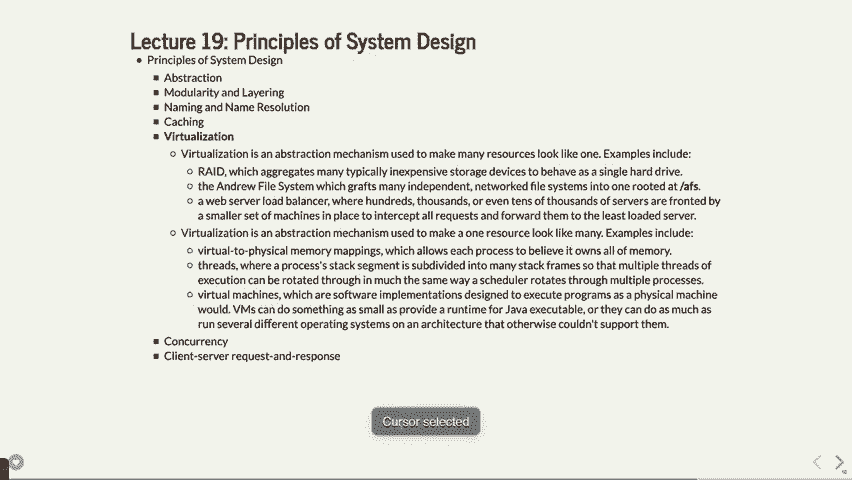

我想这里有 VMware。好了，这是 VMware。我可以加载——如果我加载这个，我可以加载一个 Linux 机器。

在我的脖子上，实际上是Linux。它确实认为自己是在直接与硬件通信。实际上，它确实是在这样做，因为英特尔设置了相关的机制，使得虚拟化能够正常工作。但现在，我的电脑上实际上运行着两个操作系统——我的Mac操作系统和一个Linux操作系统。顺便提一下。

VMware是——这个公司由Mendel Rosenblum教授创办，他是这里的教授，并且偶尔在其他一些系统课程中教授。他创建VMware时做得非常成功。但无论如何，现在我——看，现在我就在我的Linux机器上。并且我也可以做——你也可以做Windows或其他机器。

我甚至没有一台Windows PC，但我偶尔会使用Windows程序。所有我做的就是通过VMware运行它，操作起来很方便。所以会稍微慢一些，因为需要进行一些翻译工作。但并不算太糟糕，工作得还不错。运作得相当好。就是这样运作的。

好的。并发。我们在这门课上谈了很多并发。多个进程，多个线程，多个核心的多处理器计算机。直到大约10到12年前，你真的无法买到一台价格低于几万元的多处理器计算机。那时它真的非常昂贵。2006年。

英特尔开始推出双核机器，这意味着现在你有一台可以真正同时运行两个程序的计算机。这就是并发。信号中断处理程序就是关于并发的。信号时，你的程序正在运行，并且有一个中断处理程序。内核在做它自己的事情。

然后信号会通知你的处理程序停止剩余的程序部分，处理任何子进程处理程序或发生的任何事情。已经有一些专门为并发而设计的语言。有一种语言叫Erlang，它是一种很棒的语言，但有点难学。

让你理解起来有些复杂。但它基本上不允许竞态条件。你不能在一开始就产生竞态条件，因为语言的构建方式不允许。对于需要做大量并发的任务来说，这种方式不错。是吧？所以信号会中断，但并不会像它看起来的那样，因为它们会尝试并且编写有效的代码，然后再抛出问题。好问题。

如果信号中断处理程序，就像其他任何事情一样。如果信号中断处理程序是并发的，那么在多处理之前它是如何工作的？

当你只有一个处理器时，你可以通过时间切片来模拟多处理，是吧？

所以内核有一点时间，你也有一点时间。内核得到一些时间，而你也得到一些时间，以你自己的方式得到一些时间，随便什么。就这样运作。但是无论如何，Erlang，查一下它。如果你想做非常安全的并发程序，它是一个有趣的语言。JavaScript恰恰相反。

他们说并发太难了，我们就只用一个线程。这在如今不完全是事实。但这在某些方面让在JavaScript中编程变得非常简单，但也有些效率低下，因为它只有一个线程，做所有的事情。

所以就这样。好的。然后最后，我们有客户端-服务器响应，这就是请求与响应。这是我们一直在做的网络相关内容。这正是你们的MapReduce程序所做的事情，MapReduce的主程序和reducer、mapper之间来回交互，直到获取所有数据。

这是客户端-服务器请求。你在各种场合都会看到它，不仅仅是在网络中。你在多进程中也能看到它。在那些必须相互沟通并协调事情的处理器之间，你也能看到这种情况。系统调用也是一种请求与响应，对吧？

你发出系统调用，内核去处理它，基本上就是你和内核在沟通，内核再把答案反馈给你。在系统调用中必须发生的就是这种握手。所有的网络协议，当然，都是客户端请求与响应的不同例子。

然后我们刚刚讨论过的文件系统，也是客户端请求或请求与响应。因为你查找一个文件，它可能不在你正在使用的硬盘上，而是在其他建筑物中的文件系统里，也许在--，也许它在你查看卡内基梅隆的文件系统中。

它在卡内基梅隆的硬盘上。你需要提交一些请求，而且过程有点慢，从这个角度来看。所以这些是我们这个学期所涉及的七个部分。内容非常多，但你知道，有一些细节，你还是不清楚其中的一些抽象层次，属于底层的细节。这些你将在其他课程中学到。但在这里。

希望你能看到我们做的许多事情如何与这些内容相关。到目前为止，你有什么问题吗？好的。那么我将在星期三的最后一堂课上见你。那一堂课是关于非阻塞文件I/O的。然后我们会有期末考试。

这周没有环节，没有环节。我们下次见。
