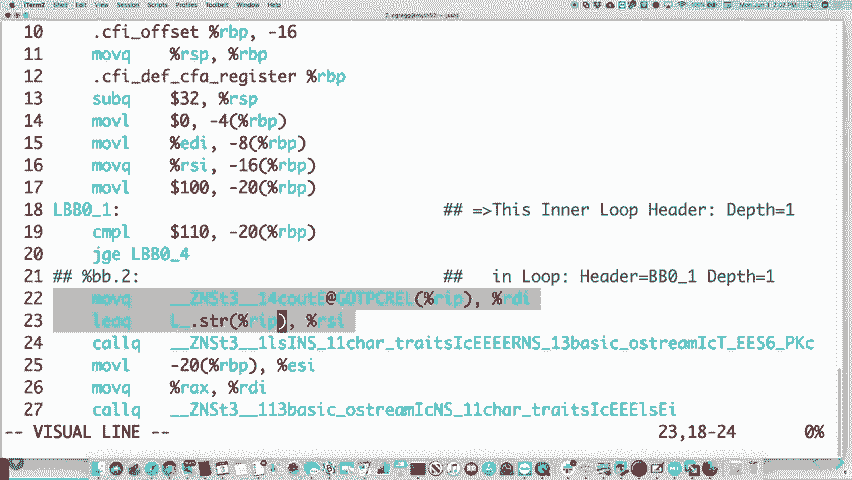

# 🖥️ 课程 P20：第19讲 系统设计原则

在本节课中，我们将学习计算机系统设计的核心原则。这些原则是构建大型、复杂且高效系统的基础，它们贯穿于我们整个学期的学习内容，并将指导你未来的系统编程实践。

***

## 📚 概述

系统设计原则旨在将庞大复杂的系统分解为更小、更易管理的部分，并定义这些部分之间如何交互。理解这些原则有助于我们设计出更健壮、更高效且更易维护的软件。

***

## 🔍 抽象

上一节我们介绍了课程的整体目标，本节中我们来看看第一个核心原则：**抽象**。

抽象是将程序的功能（接口）与其具体实现细节分离开来的过程。你无需关心内部如何运作，只需知道如何使用它。这是我们一直在做的事情。

以下是抽象的几个例子：

*   **排序程序**：你传入一个数组，它返回排序后的数组。你不需要知道它使用的是快速排序还是归并排序。
    *   **接口**：`sort(array)`
    *   **实现**：具体的排序算法（如 `O(n log n)` 的算法）。
*   **文件系统**：使用 `fstream` 或 `iostream` 进行读写，这抽象了底层的缓冲、字节读取等复杂操作。
*   **进程**：调用 `fork()` 会创建一个新进程，你无需了解内核如何复制进程映像。
*   **信号**：你注册一个信号处理函数，当事件发生时内核会调用它。信号如何被捕获和传递的细节被抽象了。
*   **线程**：与进程类似，你使用线程库创建和管理线程，而不必关心其底层调度。
*   **HTTP**：定义了数据如何在网络上传输（GET/POST请求），网页浏览器使用者无需关心底层的数据包细节。

抽象的主要挑战在于设计一个清晰、易用的接口。

***

## 🧩 模块化与分层

理解了抽象如何隐藏复杂性后，我们来看看如何管理复杂性本身。这就是**模块化与分层**。

模块化指将一个大系统分解为多个较小的、功能独立的子系统（模块）。分层是模块化的一种形式，指系统被组织成一系列层次，每一层为其上层提供服务，并调用其下层的服务。

**模块化的例子**：
*   **复印机**：涉及软件、机械工程、物理（激光、碳粉）、网络等多个独立模块，无人能精通所有细节。
*   **智能手机**：包含多种无线电（蜂窝、Wi-Fi、蓝牙、NFC）、多个摄像头、各种传感器（陀螺仪、加速度计）。每个模块由专门的团队开发。

**分层的例子**：
*   **文件系统**：
    1.  **路径名层**：处理 `/usr/class/...` 或 `../` 等路径。
    2.  **文件名层**：管理人类可读的文件名。
    3.  **inode层**：用数字（inode号）高效标识文件。
    4.  **文件层**：存储文件的实际内容（数据块）。
    5.  **块层**：管理数据在磁盘上的物理位置。
*   **编译器工作流程**：编译过程本身就是分层的绝佳示例。
    1.  **预处理器**：处理 `#include` 和 `#define` 等指令，进行宏替换和文件包含。
        *   命令：`clang -E hello.cc`
    2.  **词法分析器**：将源代码字符流分解为一系列标记（token），如关键字、标识符、运算符。
        *   命令：`clang -Xclang -dump-tokens hello.cc`
    3.  **语法分析器**：根据语法规则将标记组织成抽象语法树（AST）。
        *   命令：`clang -Xclang -ast-dump hello.cc`
    4.  **语义分析器**：检查AST是否符合语言规则（如类型检查）。
    5.  **代码生成**：将AST转换为目标机器码或汇编代码。
        *   命令：`clang -S hello.cc` （生成 `.s` 汇编文件）
        *   **名称修饰**：C++支持函数重载，编译器会修改函数名（如 `cout` 变成 `_ZNSt3...`）以在汇编级别区分。
*   **计算机网络（TCP/IP模型）**：
    *   **应用层**：HTTP, FTP - 应用程序使用的协议。
    *   **传输层**：TCP - 确保数据包顺序和可靠传输。
    *   **网络层**：IP - 负责将数据包路由到目标机器。
    *   **链路层**：以太网 - 处理本地网络设备间的数据传输。
    *   **物理层**：电缆、光纤 - 传输原始比特流。
    *   **工具示例**：`traceroute` 命令可以显示数据包从你的计算机到目标服务器所经过的所有网络节点（路由跳数）。

分层和模块化使得构建、理解和维护复杂系统成为可能。

***

## 🏷️ 命名与名称解析

在分层系统中，不同层次之间需要一种方式来定位和访问资源，这就引出了**命名与名称解析**的原则。

命名是将人类友好的标识符映射到计算机内部标识符的过程。

**名称解析的例子**：
*   **文件系统**：将路径名（如 `/home/user/file.txt`）解析为 inode 号。
*   **网络**：将域名（如 `google.com`）解析为 IP 地址（如 `142.250.190.78`）。
*   **URL**：统一资源定位符，包含了协议、主机名、路径等信息，可解析为具体的网络资源和本地文件。
*   **文件描述符**：进程内部用一个简单的整数（如 `3`）来代表一个打开的文件，操作系统通过文件描述符表将其解析为内核中的文件对象。

核心思想是：**人类擅长记忆名字，计算机擅长处理数字（地址）。** 命名系统就是两者之间的桥梁。

***

## 💾 缓存

名称解析或数据访问如果每次都去最慢的存储介质查找，效率会很低。**缓存**原则通过将最近或频繁使用的数据副本保存在更快的存储介质中，来显著提升系统性能。

计算机存储层次结构（从快到慢，容量从小到大）：
1.  **寄存器**：CPU内部，速度极快，数量极少。
2.  **L1/L2/L3缓存**：集成在CPU芯片上或附近，速度快，容量小（KB~MB级）。
3.  **主内存（RAM）**：速度较慢，容量大（GB级），断电数据丢失。
4.  **固态硬盘/机械硬盘**：速度很慢，容量很大（TB级），数据持久化。

**缓存工作原理（以直接映射缓存为例）**：
假设主内存有32个地址（5位地址），缓存只有8个位置（3位索引）。缓存根据内存地址的低3位（索引）决定数据存放在缓存的哪个槽位。高2位作为“标签”用于区分映射到同一槽位的不同内存地址。

**访问过程**：
1.  CPU请求一个内存地址。
2.  缓存控制器根据地址索引查找对应槽位。
3.  **缓存命中**：如果槽位有效且标签匹配，则直接从缓存返回数据（极快）。
4.  **缓存未命中**：如果标签不匹配或槽位为空，则需从主内存加载数据到该槽位，并更新标签，然后返回数据（较慢）。这可能导致**缓存驱逐**，即旧数据被新数据覆盖。

**其他缓存示例**：
*   **DNS缓存**：存储最近查询过的域名到IP的映射。
*   **网页缓存**：浏览器或代理服务器存储访问过的网页副本。
*   **数据库缓存**：存储频繁查询的结果。

缓存的目标是最大化**命中率**，让数据尽可能待在高速存储中。

***

## 🎭 虚拟化

缓存优化了数据访问，而**虚拟化**原则则优化了资源本身的管理和使用。虚拟化让一个物理资源看起来像多个逻辑资源（一对一多），或者让多个物理资源看起来像一个逻辑资源（多对一）。

**两种虚拟化类型**：
1.  **聚合虚拟化（多对一）**：多个物理资源组合起来，呈现为一个更强大或更可靠的单一逻辑资源。
    *   **RAID磁盘阵列**：将多个物理硬盘组合，呈现为一个逻辑卷，可提升性能（并行读写）或可靠性（数据冗余）。
    *   **Andrew文件系统**：将分布在全球多台服务器上的存储空间，呈现为一个统一的文件系统视图。
    *   **Web服务器负载均衡器**：将用户请求分发到后端的多个服务器，但对用户来说就像在访问一个网站。
2.  **分区虚拟化（一对多）**：一个物理资源被分割成多个独立的逻辑资源。
    *   **虚拟内存**：每个进程都认为自己独享整个内存地址空间，实际上物理内存被多个进程共享。
    *   **线程**：一个进程的地址空间被划分给多个线程，每个线程有自己的栈。
    *   **虚拟机**：通过VMware、VirtualBox等软件，一台物理计算机可以同时运行多个独立的操作系统实例。

虚拟化提高了硬件利用率、提供了隔离性并增强了系统的灵活性。

***

## ⚡ 并发

当系统中有多个虚拟化的执行单元（如进程、线程）时，它们如何协调工作？这就是**并发**原则要解决的问题。

并发涉及多个执行流同时或交替执行，以充分利用多核处理器或提高单核处理器的响应能力。

**并发在CS110中的体现**：
*   **多进程**：通过 `fork()` 创建。
*   **多线程**：通过线程库创建。
*   **信号与中断处理**：主程序执行被异步事件打断。
*   **多核处理器**：真正的并行执行。

**并发编程的挑战与语言支持**：
*   **竞态条件**：多个执行流以不可预测的顺序访问共享数据，导致结果错误。需要通过互斥锁（mutex）、信号量等机制进行同步。
*   **Erlang语言**：专为高并发设计，其“Actor模型”天然避免了共享内存，从而减少了竞态条件。
*   **JavaScript**：传统上采用单线程事件循环模型来避免并发复杂性（现代JS通过Web Workers等也支持多线程）。

理解并发是编写高效、正确现代软件的关键。

***

## 🔄 客户端-服务器与请求/响应

最后，我们来审视系统中各个独立模块之间最基础的交互模式：**客户端-服务器模型**，其核心是**请求与响应**。

这种模式不仅限于网络，它广泛存在于系统各个层面的通信中。

**请求/响应的例子**：
*   **网络通信**：浏览器（客户端）向Web服务器发送HTTP GET请求，服务器返回HTML响应。
*   **MapReduce**：主节点向工作节点分发Map或Reduce任务（请求），工作节点返回计算结果（响应）。
*   **进程间通信**：管道、套接字、共享内存等机制都遵循“一方发送请求，另一方处理并回复”的模式。
*   **系统调用**：应用程序（客户端）向操作系统内核（服务器）发起请求（如 `read()`），内核执行后返回结果。
*   **远程文件系统**：客户端程序向远程文件服务器请求文件数据。

这种清晰的请求/响应范式定义了模块间的边界和责任，是构建分布式和模块化系统的基石。

***

## 📝 总结

本节课我们一起学习了系统设计的七大核心原则：
1.  **抽象**：分离接口与实现，简化复杂性。
2.  **模块化与分层**：分解大系统，定义清晰的层次结构。
3.  **命名与名称解析**：建立人类标识符与机器地址的映射。
4.  **缓存**：利用局部性原理，用快速存储加速访问。
5.  **虚拟化**：灵活地聚合或分割物理资源。
6.  **并发**：管理多个同时执行的逻辑流。
7.  **客户端-服务器与请求/响应**：定义模块间交互的基本模式。

这些原则相互关联，共同构成了我们本学期所学的文件系统、进程、线程、网络编程等知识的理论基础。理解它们，将帮助你在未来的课程（如CS140操作系统、CS143编译器、CS144计算机网络）和工程项目中，更好地设计、分析和构建复杂的软件系统。