# P21：Lecture 20 非阻塞I/O - ___main___ - BV1ED4y1R7RJ

好的，好的，我们已经来到了最后一天。哇哦！

课程结束时我会对这门课做更多的评论，关于完成这门课后你应该觉得自己处于什么状态等等。不要举手，除非你真的想要，多少人是带着这样的心态进入CS110的，“哇，CS110我听说它工作量超大，一定会很难”，我看到几个人在点头。

我不介意告诉你，这工作量会很大，但应该没问题吧？

就像你们已经做到了，而且总体表现非常好，我对学生们的表现和大家在这门课中的进展感到非常满意。正如我之前可能提到过的，今天在这里讲话并不是我在教你们所有的东西。尽管我很想说，是我在教你们所有这些内容，但其实是你们在做。

作业实际上是你从这门课中获得学习成果的地方，对吧？

你不是通过我告诉你什么是六花节学到六花节的，你是通过，等等，怎么运作的？我该如何编程来理解它的。

这个奇怪的竞态条件是什么，为什么我的代码会卡住，为什么会发生死锁，等等，你们是通过实际操作并付出努力才学会这些的。所以做得好。稍后我会再对这些做一些评论。那么作业怎么样了？MapReduce做得怎么样了？好吧，有些人说，我还没开始做。

如果你还没有开始做作业，应该尽早开始。技术上来说，今天是截止日期。我在Piazza上发布了一条消息，说，哦，不，或者是其他人回答了，Piazza上说你们从周五开始才会有迟交的机会。所以如果你还在做作业，你明天之前可以提交而不影响迟交积分。

我们今天下课后会有办公时间，大约一个小时，然后明天早上我也会有正常的办公时间。我也会照常举行。你们可以随时来聊聊作业或期末考试等问题。考试是周一，所以它很快就到了。

实际上离考试没剩下多少时间了，但今天是星期一。如果你有特殊情况，需要参加后面的考试，请尽快告诉我。如果你有其他安排，我将在接下来的一两天内通过邮件告知你相关的时间安排等事宜。好吧，问题来了。

周末有办公时间吗？嗯，这是个好问题。问题是，周末有办公时间吗？

我们一定会在周日做些事情。我还没有和助教们谈论他们的其他计划。我们会有一些活动。我记得助教们还在讨论是否在周六进行一个复习环节，什么时间之类的，我们会尽快通知你们的。对，就这样。然后，看看还有什么。我们会尽力在下周中期之前评定好所有成绩。

至于期末评估的后勤工作，请在有机会时完成。如果你有机会，我非常乐意接受任何建设性的反馈，建设性的反馈比如说：哦，你知道吗，内容太多，或者某些内容在你讲解时不太通顺。我是说，我不会对好的建设性反馈感到不高兴。

这种反馈像“这个问题对我帮助不大”是不行的。但是类似于“嘿，我希望你Chris能做这个，或者这个做得很好，但可以改进”的反馈我很欢迎。我一直在努力让课程变得更好。所以如果你能给我这些反馈，我会很感激。好吧。

今天我们要讨论一个期末考试不涉及的主题。实际上，我今天早上在回顾时看了一下，发现这内容对一节课来说太多了，内容实在太多，我打算跳过一些内容，基本上给你们一个概览。我们有几个非阻塞IO的例子。到目前为止，我们一直在讨论IO。

换句话说，当你进行读写操作时，系统调用的文件描述符会被阻塞，直到它收到响应，响应会包含一定量的数据。现在，这并不总是你发送或请求的所有数据，而是部分数据，或者至少是某些数据，直到返回这些数据为止。

它实际上是在处理，无论是通过网络传输还是读写文件。今天，解决这些限制的方法是我们使用多线程或多进程，通常是多线程， 我们说，哦，太好了，让我们运行，我们将有一个读取器写入，但它会被阻塞。所以我们将会有……

我们将让其他线程也能接受连接，或做一些其他工作。这样我们就解决了这个问题。这不是唯一的方法。还有一个非阻塞的概念，你可以说我将要读取一些数据，可能会返回零数据，但它会立刻返回。在这里它确实是这样的。

它会返回一些数据，我们将看看为什么这可能是一个有趣的想法。当然，你不能只在自己的程序上操作，仍然需要操作系统和内核的一些支持。对，问题？是的，好的问题。这个问题刚在Piazza上提到。

最近有一个问题，可能是上个季度的期末考试，提到了术语 **I/O bound**，我们可以将其与 **CPU bound** 进行对比。好吧。我在 Piazza 帖子中做了一个评论。你应该知道什么是 I/O bound，可能我们没有明确讨论过这个概念。但这就是 I/O bound 实际的含义。它意味着你的处理器没有在忙着做计算。

它只是在等待某些输入或输出的发生。这种等待、阻塞的概念是，数据处理需要时间。现在，我在周一提到过，当你从硬盘读写数据时，速度比从内存读写慢了百万倍。

所以，执行读取或写入时，存在一些我们称之为延迟的时间。因此，I/O bound 意味着你的 CPU 正坐在那里，毫无所事，想着：“我现在不知道该做什么，因为在获取数据之前我不能继续执行。”这就是 I/O bound 的意思。**U bound** 则是完全相反的。

这意味着你的计算机在做一些事情，不能完成某些功能，直到它完成所有必要的计算，或者其他占用处理器时间的事情。如果某个操作是 I/O bound的，如果你能利用处理器（顺便说一句，它非常快）做些其他的工作，那就去做吧。

这就是我们为什么有多线程的原因，也是为什么最近有问题提到，哦，当我们只有一个处理器时，怎么得到多处理的概念，像多线程这种方式是怎么工作的。原因是你的处理器非常快，它可以比原来更快地在不同的进程之间切换。

你可以注意到，当你在屏幕上移动鼠标时，猜猜看，那是一个不同的进程在处理鼠标的移动，但是你无法察觉，因为它发生得非常快，且工作量非常小，看起来就像是和其他事情同时发生。

在像我们现在使用的多处理器电脑上，可能确实如此。但在单处理器上，情况是，当你移动鼠标时，程序本应处理的部分时间，现在被用于移动鼠标、更新屏幕等等。这可以追溯到 1980 年代中期，当时你购买了第一台 **Macintosh**。

原始的 Macintosh 电脑有处理鼠标的程序，它看起来就像是，嗯，当鼠标控制器接管时，程序会暂停一会儿，而你不会察觉到。其实是处理器在处理中断，交换了时间片。是的，意思是说 I/O 被阻塞是相似的，**I/O bound** 这个术语是很常见的。

就像是，你有一个处理器正在进行输入输出操作，并且由于输入输出部分的速度较慢，它被限制在 I/O 密集型的状态，这就是 I/O 密集型的真正含义。如果你能够让某些东西变成 CPU 密集型，那也不一定是坏事，这两者都不是坏事，但 CPU 密集型实际上是。

这样就更难了，因为现在你的计算机在做事情时非常快。如果你试图对大数字进行因数分解，那就会是 CPU 密集型的任务，因为你需要大量的处理来完成这一点，对吧？而且你可能需要分解某个大数字，然后把结果返回给处理器。

所以实际上，我想我们之前做的多进程农场程序就有一些元素是 CPU 密集型的，特别是在 Python 方面，因为它需要处理所有那些因数分解，然后直到 CPU 部分完成，才会给你返回响应。所以你可以做到这一点，但了解这两个术语的区别会很有帮助。

总体而言。所以是的，好吧，凯西，然后我们再回到这里。如果一个程序总是其中之一呢？程序总是会是其中之一吗？

一个程序在某些时候可能会是 CPU 密集型的，而在另一些时候可能会是 I/O 密集型的，但它通常会属于这两者之一。一般来说，它会适合这两者之一，尽管如果你…假设你知道你会有一大堆 I/O 密集型线程，情况就会不同。

就是继续增加更多线程，直到它变成 CPU 密集型，或者权衡不再合理，这时就完美了，对吧？你有所有这些未完成的连接，你正在努力处理这些连接，处理所有这些未完成的连接，你的处理器时间都被占用了，直到你得到返回结果。

所以是的，我的意思是，权衡的意思是，或者说想法是，继续做更多的 CPU 密集型工作，只要你能做到。你知道，有时候你不想这样做，因为它会消耗更多的能量，电脑的风扇也会转起来，其他的事情也会发生，但如果你真的想充分利用你的计算机的每一个处理器周期。

你会继续增加线程来实现这一点。我的意思是，我可以问你，我可以问你，我可以说为什么网络会是 I/O 密集型的，你可能会说哦，因为它是连接中的较慢部分，它需要在两台计算机之间通信，而这不是你和你的处理器。

必须等待，我们使用六个进程来执行，我们还使用了其他阻塞的读取和写入操作，等等，所以是的。

其他问题吗？好问题。好了，我们来谈谈 I/O 和系统调用。我们有这样的概念，就是快速的系统调用，好的，这些调用是那些立即返回的调用，也就是说，它们需要做的就是进行一些处理，这些处理实际上不涉及到网络连接、文件读取或写入等。

所以有很多系统调用的例子可能会这样做，但我们可以举个例子，比如获取主机名之类的系统调用，这种调用不需要访问外部网络，它只需要查询内核已经知道的某些信息，立即返回，这就是它的运行方式。只要需要做一些处理，只要处理器能支持，就没有真正的“立即”限制。

需要进行一些处理，或者内核需要实际执行某些操作来完成这个过程。即使它花费了60秒，仍然可以认为它是快速的，因为它需要进行某些处理。所以，你可能在因式分解一堆数字或一个数字，仍然可以认为它是快速的，意思是它没有在等待。但是这个想法是……

一个慢速系统调用的例子是，当它必须说“我现在什么都做不了，直到其他某些东西给我回应，或者返回一些数据等等”。好的，慢速系统调用就是那些我们不知道它们会等待多久的调用，它们依赖于其他资源，比如从客户端读取可能依赖于其他计算机。

回到你和你的，且我们希望尽可能避免这种行为。如果我们能帮忙的话。好的，所以读取调用是快速的，如果它们来自本地文件，因为它不会花费太多时间。但这仍然取决于你如何定义，你也可以认为它是慢的，因为文件读取比内存访问要慢，但总体来说，它是相对快速的。

如果调用是向一个套接字发送的，或者如果有内部的拥塞，比如套接字被大量进出连接填满，这可能会发生。当你有一个端口来响应所有这些连接时，就像一个网络服务器经常会遇到的情况，那个端口就处在“哦天哪，我几乎没有足够的时间处理了”的临界状态。

对这些调用作出响应是快速的，因为端口本身会收到大量的请求。这就是你上网去 Reddit，某人发布一个网页，但他们没准备好处理所有连接，结果网页突然崩溃了，因为他们无法处理所有连接。所以我们想要避免这种情况。

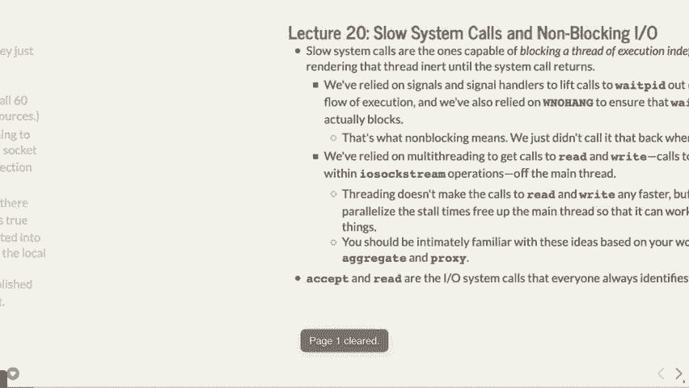

然后，慢速系统调用一般会无限期阻塞，换句话说，你必须等待它们。在这种情况下，它们被认为是慢的。我们之前做过一些工作，使得慢速系统调用不再重要，比如等待 PID 就是一个很好的例子，我们已经做了让它“挂起”。

记得之前我们说过，如果我们在没有W know hang的情况下做wait PID，并且是负一，甚至不只是负一，只是W know hang，它会等到子进程结束。这是一个慢的系统调用，因为它在等待子进程结束，直到子进程完成，它才会结束，一直占用处理器。

所以一旦我们开始使用W know hang，你必须使用一些逻辑，但这意味着你可以重新获得控制权，并且在完成其他工作后再次调用它。这样，你就不需要等到操作结束再继续进行。让我们看看使用iOSocstream的读取，我们通常是通过多线程来完成的。

可以说，做一个accept调用，但在另一个线程中进行，这样你可以立即回去再做一个accept调用。现在我们将以稍微不同的方式来做，接受和读取就像我们一直在做的那样。所以我们将逐步了解这是如何工作的。

那么我们到底如何让这些慢速系统调用变得更快呢？我们可以告诉系统不要在accept调用时等待，这是什么意思呢？这意味着你调用accept，然后它立即返回，你负责在需要实际获得连接时再次调用它。我们将看到这是如何工作的，可能会有很多的循环调用。

操作系统提供了一些额外的帮助，好吧，正如我们所看到的，我们以前以其他形式做过一些类似的事情，所以从大图来看，它会非常相似。通常情况下，如果你做accept并将其设置为非阻塞，它可能会返回负一，这通常意味着出现错误，通常还会设置错误。如果你完全没有收到请求，它就会立即返回，并且在未来的某个时刻会发送数据。

在这种情况下出现错误时，它将其设置为E would block，这基本上是说：好吧，错误是它会阻塞，但没有连接可以阻塞，所以这是错误。所以它实际上并不是真正的错误，但就是这样处理的，我们之前也见过这种情况。

与读取和写入一样，你可以将它们设置为非阻塞，但之后如果你想发送更多数据，那么你就有责任再次调用它们。好吧，现在你已经需要这样做，因为并非所有数据都能从缓冲区中发送出去，但在这种情况下，即使没有准备好接收，也可能只发送零字节。

如果没有更多的数据需要发送，并且它会阻塞，你会得到这个负一的返回值。好吧，如果没有更多的数据，你仍然会像以前一样只得到零。那么它就是这么工作的，我们再看看几个例子。

这个例子让我们来讨论一个叫做慢字母服务器的小程序。我不会键入它，因为时间关系，但这就是它将要做的事情，我们会在这里人工添加一些延迟，0.1秒的延迟和十分之一秒的延迟，这种延迟是可以注意到的，你实际上可以察觉到，并且我们将做的事情是，我们基本上。

我们将在这里设置一个客户端，就像我们之前做过的那样对吧？当我们收到连接请求时，我们要做的就是设置一个小的输出`sock`缓冲区，然后在每个字母后面加上一点延迟，逐字母发送字母表。所以这意味着26个字母将需要26次传输，总共需要2秒钟。

6秒钟才真正推送出去，推送26个字母非常慢，但我们。

人工这样做是为了看看为什么使用这种非阻塞的方式可能是个好主意。好吧，它是这样做的：它等待连接，拥有一个线程池来处理连接，这样它就能处理多个连接，工作者很慢，因为我们在里面加了人工延迟，然后它关闭连接，不做任何事情。

这里实际上是非阻塞的，但由于我们加了延迟，它确实很慢。你会经常看到，服务器通常如果试图提供很多网页，会先给你一点数据，然后给你下一点数据，接着再给你一点数据，这样它就不会让某一部分阻塞太长时间。你会注意到。

这有时就像你加载网页时，加载的是部分数据，可能加载了一点你试图下载的图片，或者加载了某个广告，然后又加载了另一个广告，反正就是需要一些时间，这就是发生了什么，你以前见过这样的情况。你也见过像YouTube那样的缓冲。

这基本上是同样的事情，因为还没有足够的数据被传送到你这里，来给你一个图像或视频，这就是发生的情况。

好的，所以这是我们将要实际测试的客户端。客户端这里有一个`while`循环，基本上它去尝试连接到服务器，服务器将在本地主机上运行，也就是同一台机器上，然后它将一次读取一个字节，然后打印出那个字节，但我们还没有做这个非阻塞的操作。

读取会很快，它会很快打印出来，然后再返回去重新读取。延迟的来源实际上是服务器慢慢推送数据的过程。好吧，这就是它正在做的，打印出这些数据。所以我们来实际看看这个，如果我们看看这里，好了，我们知道了，名字是什么？

这个文件的字母是慢的，如果我们像这样做慢速字母服务器的话。

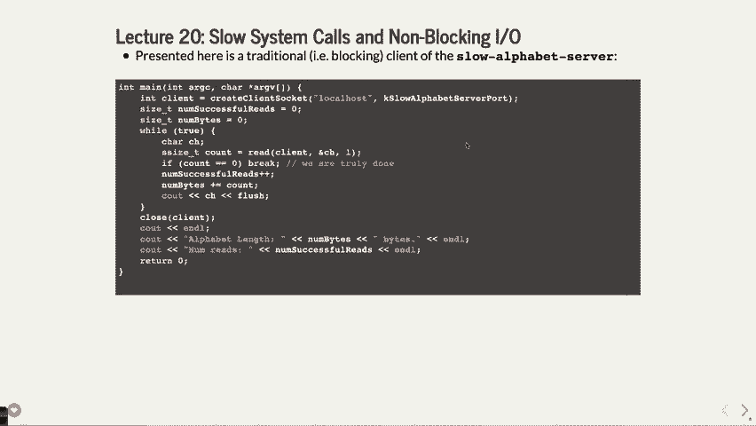

背景，然后我们确实看到这个是阻塞的字母客户端，好吧。看看发生了什么，当你读取26个字节时，你可以感觉到它很慢，实际上给它计时的话，好的，如果你计时的话，它会花费2.6秒，这很有道理，因为我们为每个字母延迟了0.1秒，共有26个字母。

等等，好吧，这不应该太奇怪，注意到这里我们加了一个小的...我们统计了调用`read`的次数，实际上我们调用了26次，主要是因为我们每次只请求一个字符。好的，这里有问题吗？哦，好的问题。是的，好问题，我用了一个小的bash快捷方式，如果你做`time !`，下一个命令或者...

用两个感叹号做某事，它会执行之前的命令，就像是执行了之前的命令，比如`time`，例如它会做最后的事情，应该会...

做两次，`time time`，对，它会做最后的事情，并执行当前命令。好的，问题。好了，不管怎样，这就是服务器的情况，好的，到目前为止没有什么新东西。

我们基本上做了和之前一样的事情，现在我可以在不超过128次之前，任何人都不会实际看到0.2秒，因为我甚至不会停下来，我可以继续做这么多次，事实上，我现在要取消服务器，但是。 所以这就是我们目前的状态，应该没有什么新鲜的东西，一切都是阻塞的。

这就是我们放入这个奇怪延迟的方式，目的是为了展示它需要的时间。

一些时间，可能是一个需要一些时间的网络连接，好的，有问题吗？哦，好的问题。

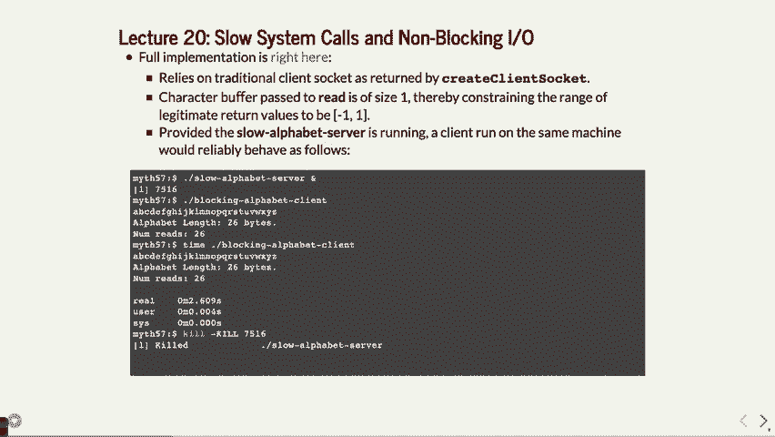

为什么他们使用`why`，看，我想给你展示的是，如果你想一次只做一个字节，你必须这样做。如果你想做一个流，你可以，但所有的这些都被隐藏了。在这种情况下，顺便说一下，它会请求一个大的缓冲区，因此它仍然会等待26秒或者大约2.6秒，但并不一定，你也许无法...

要看到每个字母，它可能会请求一个字母然后继续处理，所以在这种情况下，你想看看让我们每次一个字符地查看它。

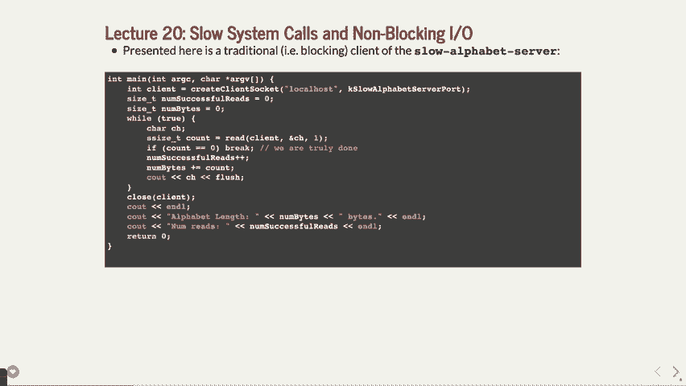

好的，所以这是我们刚刚运行的结果，我们看到它花了2.6秒，而在我们的情况下，我们一次只读取一个字符，因此你可以看到每个字符，并且你可以感知到它会相对较慢，好吧，所以如果我们想要改成非阻塞式。

相当于这个，我们将使用一个函数，稍后我们会看到。它是非常底层的，但它就是叫做“设置为非阻塞模式”。所以在你设置完客户端后，好吧，你调用这个函数，它会执行一些魔法的系统调用，并告诉你，如果你从这个套接字读取时，不要阻塞，就这么简单。

我们稍后会看到这个，好吗？但你基本上会在这里做同样的事情，当你读取时，好吗？它不会阻塞，所以你可能会返回负一，表示发生了某个错误，但这个错误可能只是阻塞了。所以你可以这样做，如果你返回的是零，就表示你仍然没有收到数据，或者你不。

如果没有数据剩余，那就没问题，它们只是像平常一样。但在这种情况下，我们想要的是，如果返回值大于零，我们就处理它，而且它应该只有一个字节，因为我们仍然只请求了一个字节，就这些。但是另一个选择是什么，如果它是负一呢？所以它不是零，也不是大于零，而是负一，检查一下它是不是。

哦，它会阻塞，因为这意味着有其他错误，比如连接断开了，或者有其他错误。但如果是“E would block”（会阻塞），那么你只需要好吧，在这种情况下，我们会记录下读取失败，并且我们会尝试重新读取，好吗？这会做的就是砰，砰砰砰，快速地尝试读取。是的，再试一次，我觉得他会再次阻塞，或者。

实际上是同一件事，结果我不确定它们是否会在不同的系统上有所不同，但。

这是你如何发现问题的，顺便说一下，你可以说 `air no - L`，它会列出所有错误。

让我们看看“E would block”，你会被阻塞，重复，“E would”，在那里，它是11号，在这种情况下。

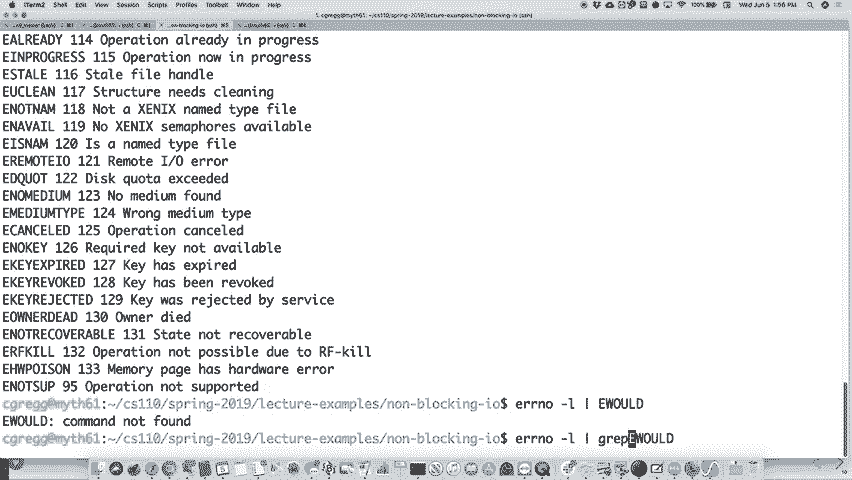

E，再次是11，因此在这种情况下它实际上是冗余的，尽管在不同的系统上可能不会是冗余的，但其中任何一个都可能是错误号，如果它要阻塞，“E would block”意味着再次尝试。在这种情况下，它恰好是相同的数字，所以我猜在我们的系统上是冗余的。

系统，好问题，是的，好问题。那么问题是，这是客户端对吧？现在这是客户端，他们正在做什么。所以客户端，你知道，它正在设置为非阻塞模式。现在我们没有，我们可以将服务器也设置为非阻塞模式，稍后我们会看到一些，但现在我们不在乎，服务器是阻塞的，因为它仍然很快，我们已经用线程做了它。

无论如何，但这个问题很好，是的，我们必须到达那个点。这个问题很好，等一下，这样做有优势吗？稍后我们会看到一个例子。不幸的是，由于时间原因，我得跳过一些部分，你可以去看细节，但我们将看到为什么我们可以这样做，为什么这只是做类似事情的另一种方式。

我们已经做过了，它是更好还是不好？线程需要一点时间来启动，线程需要你。知道多线程的事情，让操作系统处理等待。有时，等待不是问题，而是操作系统通知我们有数据等，这样更好。 有时这样会更高效，因此新的服务器通常会以我们当前的方式来处理。

他们决定这样做，是因为这样比做多线程稍微更快一点。所以这其实只是另一种做类似事情的方式。我们之前做的方式通常也不错，但如果你要服务数十亿个网页，可能你想要更高效一点，这可能是一个更好的方式，我们将会展示这种方式。

更高效的原因是什么？答案是，它是另一种方式来做相同的事情。为什么这很重要？好吧，反正如果我们运行这个代码，这就是非阻塞的等价实现。如果我们运行它并进行。

让我们看看，我们仍然需要设置服务器，这就是服务器，如果我们调用非阻塞的字母。

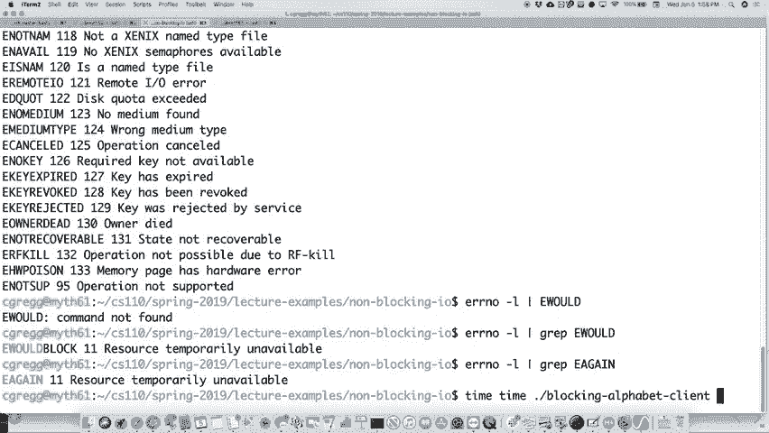

客户端，好，完全一样，但是看看刚才发生了什么，我们现在收到了26字节的返回值，但我们做了什么？让我们看看在2.6秒内读取了1600万次，对吧？那么，为什么这样不好或者好呢？在我们没有做这些读取操作的时候，我们本可以做别的事情。所以假设我们的程序需要做别的事情。

对，我们本可以做其他事情，然后再回去读取。否则，我们就得阻塞了。这样做很愚蠢，因为我们只是不断读取，完全没有做别的事情。但你可能会争辩，在那个时间段，你也许想接受来自用户的输入，而不仅仅是阻塞。所以这个想法是，这种做法释放了时间。

对于线程的情况，这会释放出主线程上的时间。现在，你能不能在一个线程中调用那个读取操作？当然可以。虽然这样做有点奇怪，但你可能会这么做。然后，这种情况和之前一样，你可能需要搞清楚线程何时结束，等等。在这种情况下，我们只是说我们尝试这么做。

需要读取26个字节，哦，这需要一些时间，也许我们想在这期间做点别的事。对吧，我是说我们还能做什么，非阻塞字母客户端，不是那个，怎么样，非阻塞。字母客户端dot cc对吧，如果我们执行读取，这就是非阻塞读取，好吧，假设。

假设我们到这里失败了，也许我们做了别的事情，就像我正在做其他工作一样，哎呀，看看吧，我不认为我。

还没有杀掉服务器，所以那就是这样了，继续做其他工作，做其他工作，对吧。你会看到里面有字，我不知道你有没有看到，但里面确实有一些字母。有些手指停在那里，但看看你做了多少工作，你知道，所以我们可以，你可以让你的一个线程做更多的工作，这就是方法，所以这是好处，你不必。

这里不需要线程，没有线程池，不需要线程，我们完成了工作，不必重新询问很多次，但我们能够做更多的工作，这大概是底部的那个。对，关于这个问题还有其他问题吗？好，现在我们看到我们可以。

实际上不需要这样做，好，我们看到我们可以获得数百万次读取，而且我们有很多额外的时间，因为对计算机来说，0.1秒是超级快的，好的，有没有人读过尼克·博斯特伦的《超级智能》这本书，这是我最喜欢的书之一，尽管它让我感到非常害怕。这是一本关于当我们最终创造出超级智能时会发生什么的书。

人工智能，它实际上比人类更聪明，嗯，这带来了许多后果，如果我们希望人类能够持续下去，我们可能需要对这个问题稍微小心一些，但其中一个有趣的事情是，他们提到计算机速度非常快，你知道，如果你。举着一杯水，我想这是他们在书中用的例子，如果你掉下去了。

你掉下来，好吧，因为你的神经元相对较慢，你的视觉处理也很慢，你没有太多时间把手移下去捡起来。因为你只能看到这么多不同的数据点。现在，大脑的好处是它非常擅长整合，所以如果我把球扔给你，你的大脑实际上能看到球的轨迹。

把手放在正确的位置，而且你非常擅长这一点，二十亿年的进化让你在这方面做得很好，对吧，但计算机，你的大脑在0.1秒内看到大约一百个或一千个不同的数据点，而计算机在有人掉下来的那一瞬间会看到数十亿或数百万个数据点，因此对计算机来说，掉下一个。

类似于玻璃一样，计算机会像“嘀嘀嘀”一样做事，而计算机能够在做这些操作的同时进行大量的计算。所以，计算机是超级快的，这就是可怕的地方。虽然它们这么快，但它们不会“爱”，至少目前不会，不是吗？嗯，总之，如果你想读的话，读这本书，虽然它有点吓人。

这本书读起来有点吓人，但是读一下还是很好的，因为它谈到了一些事情，尤其是如果你在做人工智能的工作，它是一本帮助你理解未来可能会面临的一些问题的好书。但是我的观点是，在这本书阅读的过程中，等待那个缓慢的事情发生时，计算机可以做成千上万的其他事情，这就是这里的重点。

好的，我们可以在一个线程中处理这个，或者做点别的，但现在只有一个线程在做所有的事情。

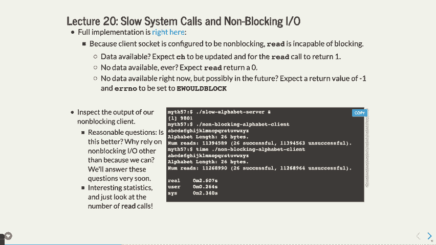

好的，现在这是我实际上要跳过的一部分，有一个类，我们将在另一个示例中使用，基本上它会被用来展示如何逐步进行文件读取或写入，在这个情况下，逐步处理文件。它本质上是一个简单的小类，初始化时需要一个文件描述符。

它接收实际的数据，以字符串格式传递，并会逐步将数据推送到文件描述符，每次发送一些数据。它会通过一个名为“发送更多数据”的函数来实现这一点。如果“发送更多数据”返回的是假值，表示数据发送完毕。但设置这个机制的整个原因是：

这部分就像许多幻灯片一样，展示了这个外部文件类的细微差别。但最大的想法是设置它，使得你可以说“我需要将这个字符串发送到这个文件”，然后持续地发送数据，它会自己处理这类操作。

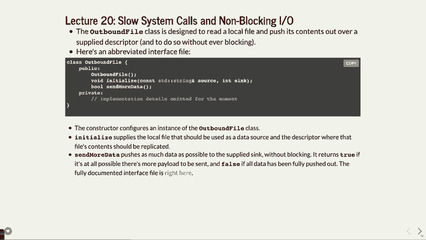

这本书的核心内容就是在做这个，因此这里有很多幻灯片讲述了细节，接下来是一个小的测试程序，基本上它设置了一个外部文件，并用一个文件名初始化它，准备好文件，而不是实际的字符串，但它是文件名，打开了那个文件，然后在这个情况下，它将会打印出来。

它会在你调用“发送更多数据”时将数据输出到标准输出，在这种情况下它会这样做。它以非阻塞的方式执行这个操作，因此它会发送一些数据，然后发送更多数据，再发送更多，但它会尽量立即返回，不会试图发送全部数据，可能会一次发送一个字节，或者一次发送一百个字节，但它会发送一定量的数据，这就是它的工作方式。

只是将这些抽象出来，以便我们能够使用它来展示当我们这样做时会发生什么。

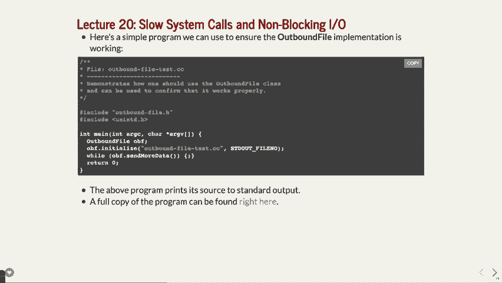

有一个服务器，所以我将跳过所有关于这个的细节。基本的思路是，这个示例拿一个文件，并将它输出到标准输出，所以我实际上可以给你展示这里的结尾部分，如果我们来看这个，它是一个出站文件测试，对吧？它只是将内容打印到文件中，但它是分批处理的，你看不出来，因为没有。

这个延迟看起来就像是 `cat` 命令，但在这个案例中，它做的是，只发送其中的一部分。

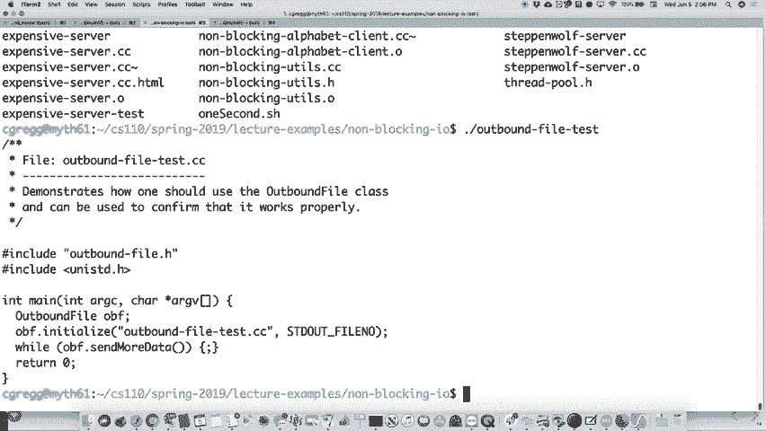

每次处理一块数据，仅此而已，这就是所有的细节，你可以去查看它。我认为这对今天我们要讨论的内容并不特别重要。所以，大多数的内容，嗯，你需要处理接受等等，作为其中的一部分，因为你。

试图发送到那个出站服务器，嗯，我们就跳过这些部分吧。

顺便说一句，这里是设置为非阻塞功能，我说过它是，嗯，我说它是低级的，它是这些系统调用之一，里面有很多内容。

如果你想实际使用它，那就去做，但这里重要的部分是，你调用了一个名为 `fcntl` 的函数，它接收一个描述符和其他一些信息，你给它一个参数，告诉它“嘿，在读取或写入该描述符时，不要阻塞”。

然后你可以检查是否有东西被阻塞，或者是非阻塞的情况。

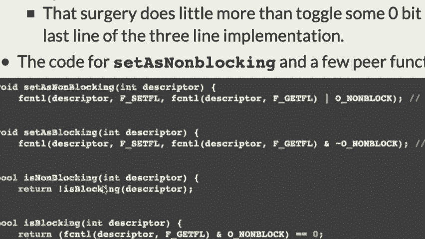

低级功能不需要担心这些细节，除非你关心创建它们。

你知道，我就这样使用它。好吧，嗯，所以我们不打算担心出站文件的干扰。这个思路是，每次你说“发送更多数据”，就读取一个文件，发送一小块数据。

数据就是我关心的，实际上你真正需要知道的是，这一切都是因为时间问题而快速进行的。但我想花一点时间来讲解两个服务器，它们将使用这个出站文件类，来实际使你能够在没有线程的情况下快速服务数据。好吧，和之前的思路一样，或者说现在的思路是，哦，不需要更多的线程，咱们开始吧。

我们将使用非阻塞 IO 来处理单线程网页服务器，虽然这不一定是做它的最佳方式，但可能比使用线程更高效，因为我们可以做到这一点。它会是响应迅速的，因为这里没有任何阻塞，希望也不会错过任何连接。因为它响应迅速。

然后你将多次检查，以确保你没有连接，直到你连接上了，然后迅速处理它，好吗？我们来看一下这里的一些细节。

在这个函数中，我们将创建一个外发文件的列表，换句话说，这个服务器将会做的是，你有一个网页，这是一个你可以从网页浏览器上使用的页面，我会在几分钟后展示给你看它的实际运行效果，但基本上，你将会有一个网页，它会持续记录你想要发送的文件列表。

所以可以把它想象成一个网页服务器，它会访问 google.com 或者访问 www.stanford.com，并请求一系列网页，每个返回的网页都会被保存在这些外发文件中，逐一发送出去，好吗？我们会在这个程序中保持这些文件的列表。

设置一个电路，或者说是一个套接字，我们接下来使它变成非阻塞模式。现在这个服务器在进行非阻塞操作，它将设置一个文件列表，我们将连接这些文件，发送回去。事实证明，在这个例子中，它们都是同一个文件，只是因为我们总是请求同一个文件。

文件我们没有指定某个具体文件，记得几周前在实验中你做了一个文件服务器吗？你还记得那个示例吗？希望你在实验中做过或者看过，这个就是同样的事情，只不过现在文件基本上只是一个文件，基本想法相同。

好的，然后我们有一些日志记录或其他的数据捕捉功能。

这里有一个 `while true` 循环，这个 `while true` 循环会进行一次 `accept` 操作，这个操作不会阻塞。然后它会计算或者进行日志记录，记录它需要执行多少次这个 `while` 循环。如果没有连接，它基本上就跳过了。如果没有连接，我们希望利用当前时间向所有这些文件发送一些数据。

所以基本上，我们会先问，是否有人想和我交流？如果没有，我将会把一些数据发送到已经设置好的文件中，这就是这里发生的事情。好的，所以我们设置了，嗯，我们将它们发送出去，如果我们确实有连接，我们会将它们添加到列表中。这里好的，如果我们没有连接的话，我们会。

最初，看来我们实际上正在做的事情是，当我们有了连接时，我们会设置它，添加数据并处理。如果我们没有连接，这是。

我们将发送更多数据。好的，基本上，你在尝试建立连接之后，如果连接设置好了，太好了。如果连接没有建立，那就把更多数据推送到所有文件中，分批进行，这就是我们在做的事情。嗯，你有一个。

是的，我会回去看看这些东西之间的背景，除了这个很棒的客户端。记住，这就是服务器，服务器正在运行。所以在这种情况下，我们正在接受请求。我们必须执行接受操作，这基本上是在我们编写的每一个程序中，我们都会说**accept**，然后就一直保持在那，直到它获得连接。

直到它获得连接，现在它会说，哦太好了，我有更多时间去做点什么，因为没有人想和我说话，我要做的是什么？如果我获得了连接，我会设置它。

对，如果我没有获得连接，或者即使我获得了连接，接下来的步骤是，我将花些时间将数据推送到所有请求数据的文件中。这是现在的情况，它会花些时间。是的，如果你有一千个文件在服务中，它会花一些时间。顺便说一下，我们现在进入了CPU绑定的情况。

如果你的列表中有10个或10万个不同的连接，现在它必须通过这个**while**循环执行十万次，这会导致CPU绑定，因为这些调用都是非阻塞的。它只是说，我有这么多事情要做，我必须完成它。所以这是。

它将变成CPU绑定的情况，这就是发生的事情。好的，接下来我们实际运行一下。

如果我们运行这个，嗯，咱们这样做，如果我们运行这个，但是这个叫做，哦，嗯，让我看看。等一下四，我想在之前取消服务器，嗯，这个叫做昂贵的服务器。好的，让我运行它，显示的是静态文件服务器正在监听端口12345，这是61版本。

顺便说一下，我今天重新启动了所有的 myths，我不得不去重新启动它们中的一半。它们都只是停在那里，我不知道为什么 107 可能和你们没关系，嗯，让我们做这个，让我们去 myth，呃，我说的是 myth 61，它是端口 12345，希望它在那里。

那里是文件，所以我们只是在提供这个文件一百万次，而恰好这个文件。

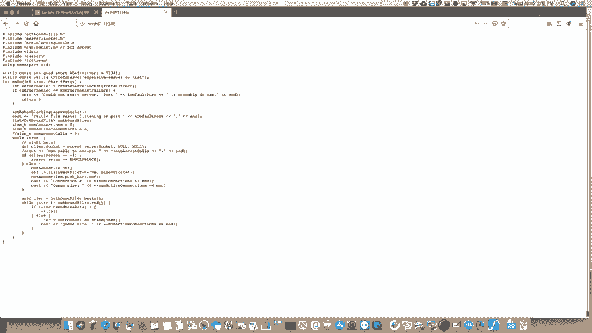

所以，如果我们去那里并提供这个文件，我们现在来看看这里发生了什么，顺便说一下，那就是它正在做的事情。如果其他人也想连接，可能会因为两个人同时连接而有所增加，但它会很快完成，好的，现在发生的事情是，这是 myth 61，让我们检查一下，呃，让我们看看 ssh myth，看看抓取 myth 61。

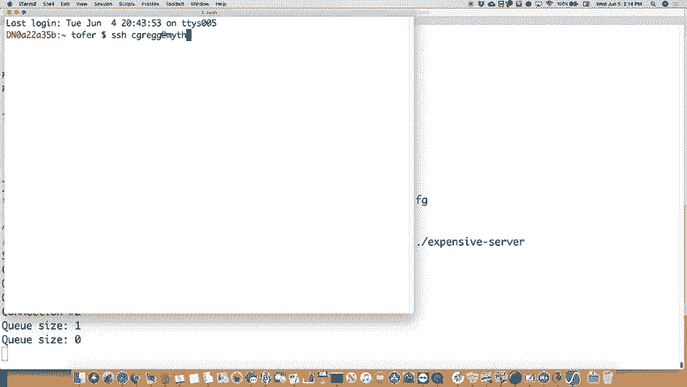

是的，哎呀，是的，htop 我们应该看一下，看看这个昂贵的服务器现在在做什么。

那个 100% 是我的昂贵服务器，为什么我的昂贵服务器这么贵？

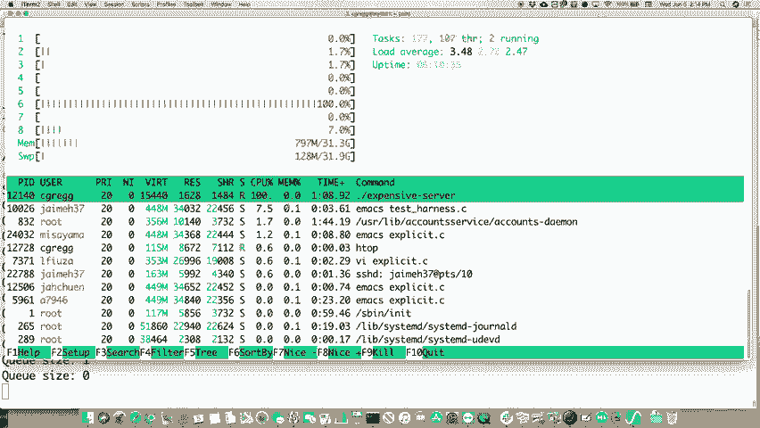

好的，没人真正请求什么数据，它在做什么呢？它就停在这里。

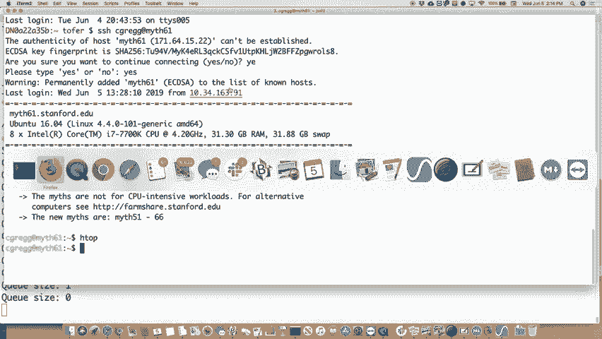

哎呀，让我们回到上一张幻灯片，好了，它现在正处于这个 while 循环中，没有在 accept 上阻塞，所以它一直在重复这个 while 循环，而且没有数据可以提供，所以这个 while 循环就一直在疯狂运行。好的，如果我们在这里放一个 C 输出，我们可以看到一大堆 C 输出。

就像我们之前做的一样，但是这意味着，如果我们做了停止，我们就会。

得到的哦，那里它是 100% 的工作负载都在一个核心上，还有一些 myth 机器，myth 60，随便这个是什么。现在风扇开始转动了，什么的，某个可怜的 107 学生没把他们的热平衡器调好，或者怎么的，嗯，所以下面发生的就是这样。

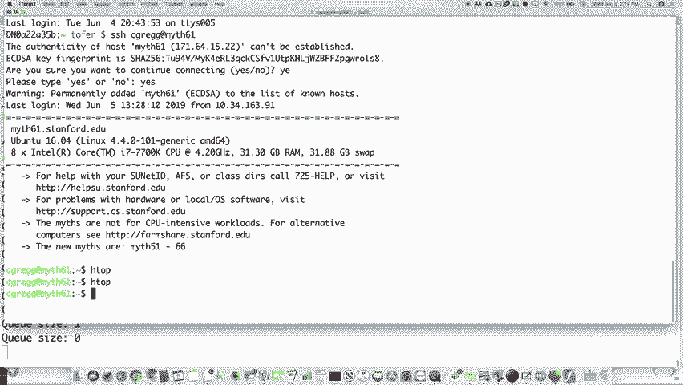

我们要做什么？我们有这个功能，过去当我们遇到类似情况时，我们怎么做？当我们需要等待某些事情时，我们怎么做？我们把它移出了进程，对吧？所以我们必须要有另一个操作系统，这是同样的道理。

支持这个，好的，这个叫做 E-pol，E-pol 系列的系统调用基本上是在等待文件描述符。所以它基本上是在说，不再重复做这个 while 循环，而是当发生某些事情时，我们能够调用我们想要的函数。换句话说，我们。

因为如果我们没有数据发送，且没有其他事情发生时，我们就会关闭处理器，或者至少关闭我们的进程，并执行相关操作。所以这里有一堆函数，其中有一个创建函数，它返回一个文件描述符，并且有一个 `e-colo` 这样的设置，它设置了相关功能。

文件描述符是我们会被提醒的对象，结果发现它有一个监视功能，基本上它会在每当某个事情发生变化时提醒你。所以，如果你在监视网络连接，一旦有数据进来，等待就会停止。你实际上可以调用 `epoll_wait` 来进行等待，直到发生超时。

你可以设置超时时间，这样你就可以去做更多的工作，反正就这样，基本上就是这种思路，只不过现在你对它的控制比阻塞式的服务器更强了。这里有一个结构体，这里有一个有趣的东西叫做联合体。有没有人知道什么是联合体？你可能以前没在 C 语言中用过联合体，这是一个比较古老的概念。

它可以追溯到数据稀缺的时候，当数据稀缺时，联合体就是为了这个目的：它声明这个数据结构可以存储一个指针、一个整数、一个 `uint32_t` 或一个 `uint64_t`，而且无论你存储的是哪种类型的数据，它都能够根据你使用的变量类型提取出数据。为什么要这样做呢？

这样，你就可以在相同的空间内存储不同类型的数据。它会为整个最大的数据类型分配足够的空间，即使你可能只使用一个四字节的整数。它会为一个 64 字节的整数分配足够的空间，但不需要为每种数据类型单独分配空间。所以它有一个 F4，它只分配了一个空间来存储数据。

联合体及其用途，你不常见到它们，但当你看到它们时，你必须理解它们的作用。联合体用于存储不同类型的数据，它能在多个数据类型中存储一个数据。我们可以监听哪些事件呢？顺便说一下，这里是基于事件的模型，我们之前见过事件，比如我们有信号处理程序时就用过。

基于事件的模型，在这种情况下我们可以说，对于一个文件，它是可读的，或者它是可写的，我们也可以设置为所谓的边缘触发，如果你学过 CS 107E，你应该听说过边缘触发，这意味着当描述符发生变化时，你会得到一个事件，而不是基于数据类型来触发。

你要查找的事件是，嘿，我希望在获取到数据时做点什么。那么我们接下来该怎么做呢？

接下来我们要做的是，我们将设置这个地方，服务器本身的主函数不会发生变化，好的，对于这个服务器，它将设置套接字，并使用 `create server` 来创建服务器套接字，然后运行这个服务器。这只是某种程度上的抽象。

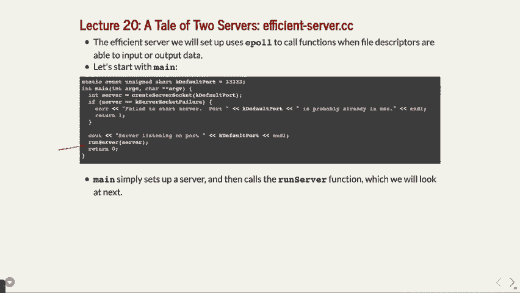

在某种程度上，将其稍微分解一下，好吗？运行服务器将把一些东西设置为非阻塞。好的，然后它设置了这个监视集，即我们所阻塞的内容，它将基于我们拥有的服务器套接字来构建这个监视集。我们稍后将看到，基于这个构建，我们正在设置一些 E pole，换句话说，就是监视某些事物的变化。

好的，然后这里有一些其他内容，基本上是在设置联合体和结构体，在这种情况下是结构体，然后调用这个 `E pole control` 来设置它。想一想，这和 `six suspend` 非常类似，你必须设置你想要阻塞的信号，等等。是同样的思路，不同的主题，但基本上是相同的思路，再次强调。

我现在并不是让你记住这些内容或知道如何使用它，但只需要知道这是可能的。

好的，接下来我们要做的事情是，我们实际上还会继续做。

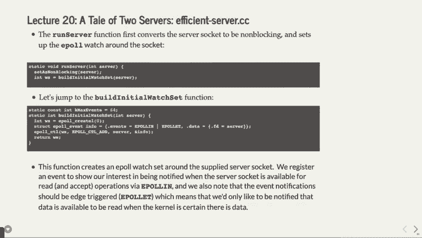

我们的 wild true，我们将有这些事件，我们将会触发事件的数量。由这个等待机制触发，好的，我们可能会有一个超时，表示等待直到超时，这样我们也可以处理数据。你不希望它超时，但它可能会超时，如果超时了，它会继续执行下一个部分。好的，实际上你可以获取。

许多事件在完全相同的时间触发，想一想，这和子进程获取 `wait PID` 返回多个结果是一样的。所以你应该处理所有这些事件，好的，当它们被触发时，我们一次处理一个事件。

使用 `for` 循环，基本上，事件会被触发，我们找到这些事件，然后处理它。好的，如果你获得了事件，你实际上可以在这种情况下消费从文件描述符读取的数据，你可以说“嘿，你想告诉我什么”，然后它会这样做，然后你可以发布响应。如果你没有东西可读的话。

你只是想写入它，好的。那还有什么呢？我知道这里有很多代码。这确实是你必须做的很多代码，但你必须看到，基本上我们正在设置，除了一个新的 `except` 调用，顺便提一下，叫做 `except for`，它带有一个非阻塞的参数，是的，标记当然，哦，对不起，继续。

是的，你很快就会明白为什么这仍然是非阻塞的，它并没有以同样的方式等待。基本上你是在做这件事，让它允许——怎么说呢？它是不会的，如果你……它不会去阻塞在accept调用上，你仍然会做这个，只是它不会进行这么多次调用，不会经过这个循环那么多次。你会看到，等我们走得更远一些，明白了吗？好问题。

我们再次进行这些设置，设置监视列表和接受等操作，好吗？

消费者可用数据的部分将基本上获取连接。好吧，我们会设置连接，并且在那时设置连接。然后，我们也能够做其他的事情。那只是设置连接并获取请求，然后我们将……让我们看看接下来的步骤。

这里我们将继续处理请求。好的，我们可能会有一堆活跃连接需要处理，我们将它们保存在一个映射中，等等。好的，然后我们会根据是否已经有连接来更改事件。再次提醒，关于这些细节请查看幻灯片，我不想在这里展开所有细节。

这背后的工作原理是，我们基本上会接收到请求或事件。内核将为我们处理这些内容，好吗？那么我们在哪里获取发布的响应呢？这里是我们实际上会在此情况下，创建一个实际的网站来进行响应，而不是返回那个文件。

它将为我们需要发送数据的所有不同位置逐步发送少量数据，使用正确的命令。好的，它只会发送……让我们看看，应该不会……看它会尝试发送所有数据，但就是这样。然后在发送完所有数据后，它需要关闭客户端。好的，像这样的情况会怎样呢？

那么重点是什么呢？好的，在这种情况下，让我们看看，它并没有以同样的方式阻塞。我们已经让内核为我们处理事件，而在我们这边，我们仍然能够做我们想做的额外工作，尽管内核在等待数据的到来与否。好的，它并没有阻止我们处理这些内容，但当没有数据要发送时……

接收操作，我们只是停下来不再进入 while 循环。所以从某种意义上说，如果没有任何要做的事，我们的进程就会关闭，然而如果我们有任何任务，不论是发送数据还是接收数据，它都会被触发，具体来说是内核在等待并告诉我们：“哦，你有更多的东西要发送，去发送它，你还有更多的……”

你有客户端连接进来，去做这个操作，因此，while 循环不会像那样一直旋转，它实际上会阻塞，在某种意义上，它会阻塞在多个操作上。这个大概的思想是，它在发送数据到所有不同的东西时会阻塞，如果没有数据发送，它就会等着，或者如果没有接受请求，它也会等待。

接受连接，这样理解吗，Amy？你看到的这些不再是阻塞的，某种程度上它是阻塞的，但它基本上是说现在我们可以同时等待两件事，不仅仅是等待并不断检查是否有连接。

我们至少有一个事件在接受客户端请求，具体取决于有多少客户端请求数据。然后，我们有更多的任务需要处理，每当我们能够发送时，e-pull 实际上会调用正确的函数来为我们完成工作，因此我们的主函数可以静静地等待，我们让内核告诉我们何时发送和接收数据。

这是最大的区别，这就是为什么它不再是阻塞的原因。我们利用了内核会为我们处理等待的事实，主线程不需要做任何事，我们是否能做更多工作？当然，我们可以继续做更多的工作，现在我们还是在等待两件事，但它只是把这部分抽象化了，仅此而已，我知道这里有很多内容。

要看到这一点，您可以阅读代码来实现这一点。底线是，好的，底线是这里有很多种构建服务器的方法。我们已经看到了不同的构建方法。我们可以构建一个线程化的服务器，或者我们可以构建一个非线程化的服务器，然后希望它能正常运行，我们还可以构建一个使用线程的线程化服务器，或者使用其他方式来接收。

线程池来做这个操作，我们知道有些调用会被阻塞，这是可以接受的，这也许只是另一种策略来实现这一点。但我们现在看到了另一种方式，就是让内核告诉我们何时需要发送或接收数据，然后它会以不同的方式工作。在我继续讲解更多细节之前，让我给您展示一下。

这实际上在此情况下是怎样的，让我们看看我们有的是什么。

高效的服务器，我相信这就是它的目标，它将在3333端口监听，如果我们去访问的话。

是不是又是神话61，神话史密斯，来吧，61 333，这个网站会为我们服务，对吧。

偶然间，网站就会去某个地方拉取图片之类的，反正无论如何你会做到的。而且对于每一个打开的浏览器窗口，它会一小段一小段地传输。我觉得即使我们这里的所有人都试图同时在浏览器中加载同一个页面，可能也不会看到太大的延迟，因为它每次只传输一个小数据包。

或者每两字节时间，但要非常快速地传输给你们所有人，这就是事情的真相。

好吧，那么这就把我们带到了一个更大的框架中，当你在构建服务器的时候，或者说当你在进行类似操作时。

你在做任何事情时，这也是这门课程的一个重要收获，希望你们能明白，这一切都取决于你自己的系统设置。你用的是什么操作系统？也许你用的操作系统不支持这种事件驱动模型？那就太糟了，好吧，Linux恰好支持它。也许你的电脑有一张非常快速的网卡，而且等待时间较少，你不会遇到那些问题。

那你该怎么做呢？或者说它可能有多个网络接口卡，或者其他什么的，那么网络本身呢？如果你是通过你的手机数据计划来提供网站服务，那又该怎么办？你可能基于实际平台对最佳方式有完全不同的看法。所以这一切都是关于权衡的，都是关于你如何去做的，服务器的核心理念就是接受并响应客户端请求。

尽可能多地处理连接，这是大概的思路，并且尽可能快速地响应客户端请求，好吗？不要阻塞接受请求，也不要服务得太慢，这些就是主要的理念，这是任何服务器在设置时的基本思想，好吗？你想要快速响应，也要接受请求，而不希望阻塞用户，明白了吗？

不要写一个忙等待的服务器，因为我们不喜欢忙等待，因为它会让我们电脑上的风扇转起来，对吧？我们不喜欢那样，它会浪费CPU时间和能量等等，好吧，但在做出这个选择时，你必须理解一些低级的概念。你们中的一些人肯定会进入那些把网络作为核心业务的公司。

你们中的一些人可能会进入思科公司，或者其他一些有大量网络需求的公司，对吧？比如发生在他们的亚马逊网络服务（Amazon Web Services）之类的地方，你将不得不理解一些低级的东西，为什么要避免忙等待（busy waiting）等等，你是否需要了解所有的细节，就像我刚才说的那些东西一样，嗯，取决于情况，如果你进入了这些领域，你就会知道。

你要是想学CS 144，也可以学，如果你有兴趣。对了，这也得很聪明才能做对。这个漫画真好，我喜欢这个漫画，它是xkcd系列之一。它展示了一个服务器，说，“嗨，我是一个服务器。”你有没做过这事？你在手机的浏览器上打开网页，服务器尝试给你提供移动版。

网站的版本并没有带你到正确的页面，而是带你到了像主页那样的地方。然后你会觉得，“这到底是怎么回事？” 哦，天啊！让我帮忙看看。哦，你是智能手机浏览器。顺便说一下，你的浏览器会告诉网络服务器自己是什么类型的浏览器，而你在某些情况下也可以伪装成其他类型的浏览器。

即便你是在手机上，有时这么做是挺好的。我不知道现在主流的浏览器是否允许这么做，但可能允许。你有时得删除最后的结尾，但实际上不止这些。之所以显示这个结尾，是因为手机的浏览器会说，“哦，我是手机。”于是客户端或服务器就会想，“哦，我最好给你……” 

即便你的手机上有普通的完整浏览器，压缩版的浏览器依然存在，所以无论如何，在这种情况下，服务器说，“嘿，我有这个新的移动版，”然后手机会说，“等一下，你给我的是主页。”接着，服务器就会重置，因为它没办法处理这种情况，它就是这样设计的。所以，如果你要搭建服务器，聪明点，做得好一点，不要太过。

即便你有像浏览器、手表浏览器之类的新东西，这一切也只是权衡取舍的问题，但要聪明一点，好吗？好，既然我们提前到达了，这很好。正如我在课堂一开始所说，你们完成了一门难度很大的课程。你可以辩论这门课比CS 107或CS 103难还是容易，但……

如果你对这门课没有感觉到挑战，那你比我聪明，因为我认为这是一门具有挑战性的课程。你应该为自己取得好成绩、完成了这些复杂的长任务（比如15页阅读和100个文件需要查看）感到自豪。如果你想学更多的系统课程，这里有很多。如果这门课是你最后一门系统类课程的话……

你完成了这一部分，应该为自己鼓掌。去做你的AI相关的事或者其他的事情。对了，我跟你们讲过Chris Peach吗？他告诉我，系统在当今AI领域中的重要性。Chris Peach，你们中很多人都认识他，他从事AI研究和计算机科学教育。他和我谈到了这些话题。

前几天我提到过，现在所有的AI都使用GPU和TensorFlow，以及这些类似的系统工具来做AI。他说，我真希望当年在110课程里更专注于那些系统课程，或者至少我希望我学过并行处理课程，这样我就能更深入地了解发生了什么，或者至少能更清楚地知道这些是怎么运作的。

这个是有效的，所以系统并不是你必须要做很多事情才能做到的，你可以在几乎任何领域通过了解一些关于所做决策的背景，来获得有用的信息。理解这些会对你的工作有所帮助。好了，我就留给你们这个思考，你们都很棒，谢谢你们耐心听我讲完。

在我第一次独自授课的那个学期，我很抱歉过程中可能有些错误，但你们都很棒。我会在周一的期末考试时见到你们，或者今天和明天的办公时间也可以见。非常感谢大家。
