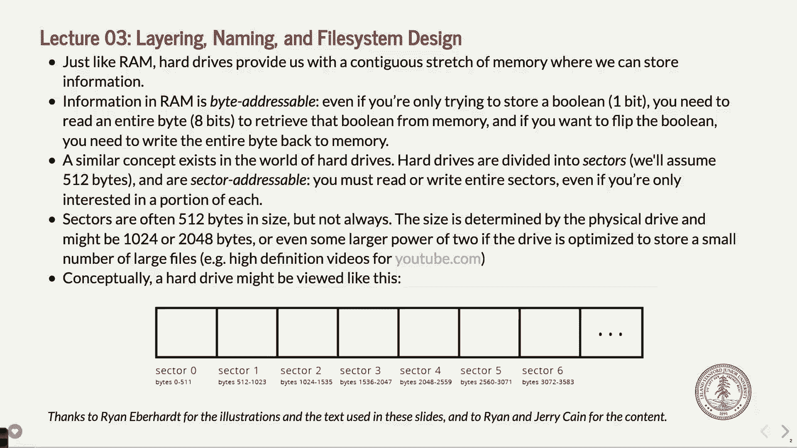
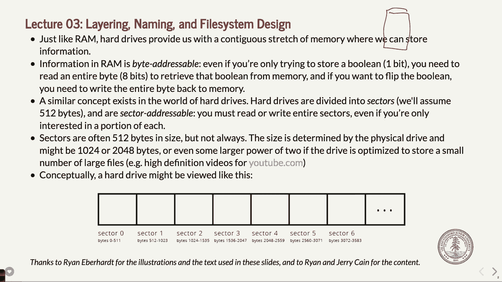
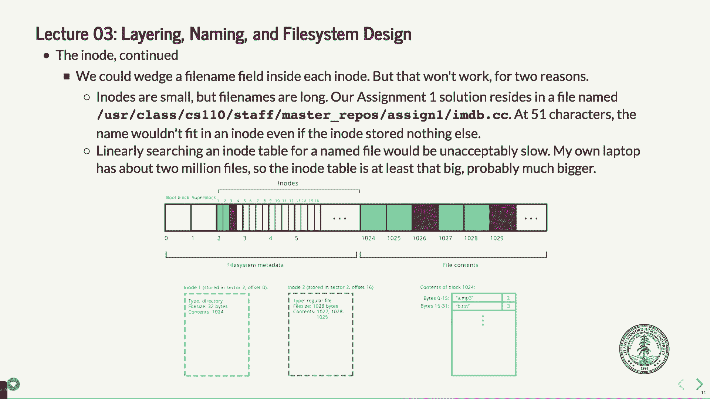
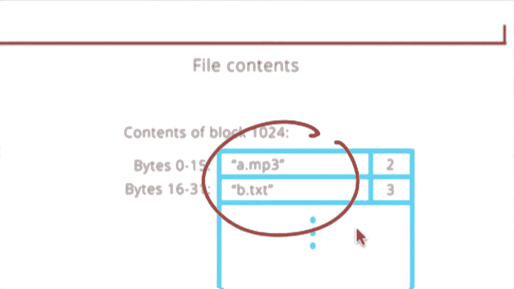
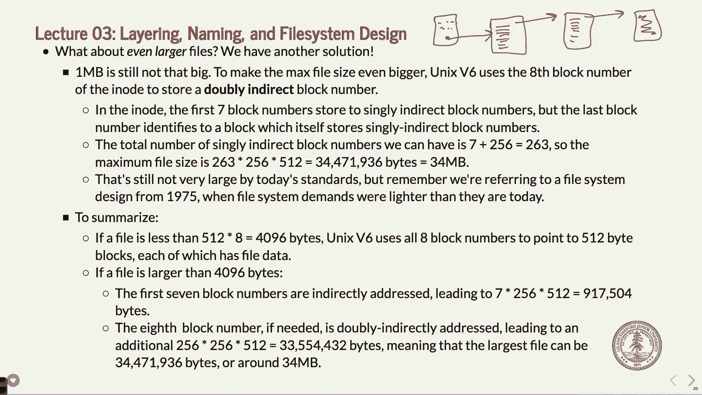

# P3：Lecture 3 Unix v6 Filesystem - ___main___ - BV1ED4y1R7RJ

 Welcome。 Welcome back to CS110。 How is the summit one going？ You guys started it。 I know a bunch of people started。 I've seen you in， office hours。 There will be more office hours。 If not today and tomorrow definitely on Sunday and then next week as well， we'll have a full list。 available。 So I hope it's going all right。 And I hope it's not bringing that too many memories of like pointer math and things that we're kind of tricky to learn。

 but you're getting back up to speed。 And then you're learning a little more C++， et cetera。 Let's see。 Sunday at noon。 Lab sign up will open up。 There are most of the labs sections。 whatever you want to call them， are on Fridays right now。 Like next week。 many of you will be in your section instead of here。 There are a few sections on Thursday。

 So if you do need a Thursday section， sign up， try to get on there and sign up as early as possible。 If you're like， oh， I don't can't do Friday。 Although most of you should be able to do Friday for what it's worth。 But if you can't do that， then get on there and do that。 If for some reason you can't find a time that fits your schedule。

 let me know and we'll try to figure something out。 You do have to go to some section。 but we will figure it out。 So that's going to open up on Sunday at noon and there's a link on the class website that will go straight to the sign up page。 I think that's about it for announcements。 I think that's about it。 All right。 Let's get going。 So today we're actually not going to see any code today。

 So what we're going to do though is we are going to learn about the Unix version six file system。 Now， why do I say it like that？ We're not just learning about file systems in general。 We're going to learn about a very specific one to show you an idea of how a file system is built。 So not necessarily the way you would build one today or the way people have built them for the last 20 years or so。

 I think the version six files came out in 1978 or something like that when computers were actually somewhat different。 But it still works and you can still run an emulator and actually use that kind of file system。 So generally think of this as a case study in how to build a file system。 So again。 don't think this is the only way to do it。 Don't even think this is the best way to do it necessarily。

 but it is a way to do it。 And it's a pretty good one。 And there were some very clever people who came up with it。 So that's what we're going to talk about today。 And in fact。 the version six file system is exactly the file system that you need to program assignment to for。

 And I'm going to go over three examples at the end of class today。 which should help you think through how you're going to code that up。 So stick around to the end and we'll see those examples。 All right。 Okay。 So if you've done CS 107 or even 106 B， you know that memory。

 at least RAM in your computer is we can think of it as one big long array。

 Right， going from address zero to address whatever the maximum address or the maximum number of bytes of memory in your computer。 One long array， you can， you could access it with either pointer math or just an array。 And if the operating system allowed you to do that。

 In fact， if you took CS 107 E， you'll realize that， oh。 if I have a bare metal hardware sort of system， I can access all sorts of memory。 which also means that you can dereference null pointers and nothing actually happens until later in your program when something crashes wildly。

 But anyway， think of it as one big long byte addressable array。 That's the RAM system。 And when I say byte addressable， what does that mean？

 It means that you can adjust one byte of memory at a time。 You can't do one bit at a time。

 Right now， you can do masking and you can do bit masking and so forth。 But you're always working on at least one byte at a time。 Meaning that if you want to read something from memory， you're going to read eight bits out of it。

 And if you write something in memory， you're going to write eight bits to it。 Okay。 That's how RAM works。 Now， the disk drive on your computer， and in fact。 many of you guys don't even have disk drives in your computer。

 You have an SSD， which is a solid state drive， which I guess is a， it's not a disk drive。 but it is a memory system that allows you to store information that persists when you turn your laptop off or crashes or whatever。

 That's what disks are all about。 They are generally relatively slow。 although SSDs are much faster because flash memory is pretty fast。

 It used to be that disks， in fact， some of you probably still have these kind of disks on the computer。 used to be a cylinder that was actually spinning around and has little read heads that read one byte or。 well， they read more than one byte at a time， depending on the type of thing。

 You read what we call a block at a time。 And they would forward that to the operating system and the operating system can say。 save data as well。

 Okay。 So the， so a disk has these things called blocks on them， okay， or sectors。 You can kind of use those interchangeably。 I'll talk about the difference in a minute。

 But we can assume that there's some fixed amount of bytes per sector。 A lot of times it's 512。 On some disks it's as much as 4096 maybe， but it's a relatively small amount。

 But that is the smallest chunk of data you can read or write from a drive。 Okay。 If you want to read one byte from a drive， you can't。 You have to read all 512。 And if you want to write one byte， you can't， you have to write all 512。

 Now， if you write one by， that you can keep track of up the other 512。 the operating system does or the hard drive itself does or what have you。

 But that's the way it works。 Okay。 The size of the sector just happens to do with the disk itself or the。 like the type of disk it is and so forth。 Okay。 So， and you， it's a trade-off。 How big your sector is。 It's just a trade-off on how fast it is and a couple of other different things。 This is what it might look like and this should look very similar to the memory system， right？

 You've got sector zero， sector one， sector two， et cetera。 A sector zero would be bytes zero through 511。 That's probably a little small to read。 But anyway。 that's the， like this is 512 bytes and then 512 bytes and you just access it that way。 Okay。 So that's how the hard drive or the solid state drive would work。

 The API that the hard drive makes available to the operating system is actually very simple。 It's read and write basically。 You can read a sector and you can write a sector and that's about it。 You give a sector number and you read it， you give a sector number and you write it。 It's a little more nuanced than that but for the most part you can think of it that way。 And again。

 you have to write a whole sector or read a whole sector at once。 Okay。 That's the part that below that level you don't need to worry about。 Okay。 We're going to talk about kind of a much higher level of basically how do you take this thing here and this memory kind of model and map files to it and map information to it that persists。 et cetera。

 Okay。 All right。 Like I said， and I've already done this once or twice。 you may hear me say block and sector kind of interchangeably。

 It turns out that the sectors are defined on the disk themselves， sector zero， sector one。 et cetera。 You can have another abstraction where it might be that multiple sectors are considered a block。 So you might have two sectors per block。

 For our purposes and to make things a little simpler except in the case where we sometimes need to think of sector versus block。 you don't really normally need to do that。 We are going to just consider them being the same。 So if I say block， think sector， think of the chunk of memory on the drive that you can read and then you can write to。 That's what we're going to continue going forth with this lecture。 Okay。 All right。

 So there is a diagram here。 Again， it might be a little hard to see from all the way in the back。 So pull it up on your slides。 You can't see it from all the way in the back。 But there's a diagram here that we're going to talk about。 Now， as I said。 this is one way to do a file system。 It happens to be the way some people decided to do it for a Linux or Unix version six back in the late 70s。

 And what it does is it basically allows the files to be written on here so that you can quickly find them depending on your definition quick。 And then you can read the data from the drive in a way that is more or less efficient。 Okay。 And we'll see what we mean about that as we go along。

 Okay。 The first block， the first sector or block here is special。 Okay。 It's block zero。 It's called the boot block。 And we are not going to worry about that for the class。 But the boot block is basically what happens when you turn your computer on。 Well。 the first thing it needs to do is it needs to start the computer up。

 And you can do that in a kind of a couple different ways。 The first thing that Peter does is it actually reads from its own BIOS。 which is ROM memory inside the computer itself。 And if you don't have a hard drive attached to your computer at all。 it will usually read something from that BIOS， look for a hard drive and then not find it and say something like can't find a hard drive or can't find any boot drive or something like that。

 And then the first block， sector one is going to be on your system。 And that's almost universal。 Like hard drives kind of do that and they know to do that。 The second block is called the super block。 And the super block contains information about the file system itself as far as interacting with the operating system。 Okay。 And again， these are things that are generally like put there by either when you format your drive or put there when the drive is created to begin with。

 We will not need to worry about those two sectors at all。 Okay。 The follow on sectors are where things start to get interesting。 Okay。 The rest of the disk is made up of two different parts。 There is a netta data part。

 And then there is an actual data part of the drive。 Okay。 This diagram。 it makes it look like if you broke this up， there's a whole bunch of metadata here。 This whole part。 it's not really that much。 It's in fact less than 10%。 but we needed to make this at least big enough so that you could see it to the extent that you do。

 Now， with metadata and data sharing this one long abstract kind of array sort of thing。 you might be starting to sweat a little because it sounds a little bit like a heap allocator。 Right？

 And you might be going， "Oh no。 Now I've got a deal with this。 Like metadata sharing the same space with the data。 And every time I put use some metadata。 I take away from the actual disk space for the data itself。" And so forth。 And that's true。 although I think this is set up a little less like integrated so that we don't have to worry about it too too much。

 Okay。 The details of how the file system work itself are going to be enough to keep you busy。 So you don't have to worry too much about it being too much like the heap allocator。 But that's basically the same idea。 You've got all this memory。 You need to store both of the data itself that you're trying to store and metadata about the stuff you're going to store so you can find it。

 So you can access it so you can get information about it whether it's a directory or a file or how big it is and so forth。 Okay。 What the permissions are and all that that's set in the operating system in the thing itself。 Okay。 So that's the basic idea of a file system of this file system。 Okay。 You've got a couple blocks that we don't worry about。 We've got a whole bunch of metadata in here。

 And then we've got all the rest of it being data。 And this is 90% of the drive。 Okay。 And depending on the file system that percentage can go up or down， I don't know if you can ever。 if you ever really run out of that metadata space， how the file system actually deals with it。 It might just say you look at a space or it might be able to take more data out of the rest of the hardware。

 I'm not 100% sure how that works。 And it's really not that pertinent。 Okay。 All right。 So we have file。

 File payloads。 That's the actual data， much like the payload that you've dealt with in 107 if you did a heap allocator assignment。 And they're stored in 512 byte chunks。 Well， that sounds like a good。 that sounds like a block size or sector size and in fact it is。 Okay。 So they。 the file payloads are stored 512 bytes at a time。 Unlike the heap allocator， when you assign a file。

 like when you have a file， it can use multiple blocks in different places on the drive。 It does not have to be contiguous。 Okay。 Which is good because it might。 it means that you can set up your file and then add to it and then you don't have to go moving all this data around。 Okay。 There's no real like necessary。 Although， I should say that your hard drive and your drive can what we call fragment。

 which means you've got all these different pieces all over the place。 And it is not quite as efficient to grab that data。 Depending on the buffering on your drive and so forth。 But again。 that's beyond the scope of what we're talking about now。 For now。

 all we need to know is 512 byte chunks for your file。 Okay。 If you have a file that is one byte long， that file takes up 512 bytes on the drive。 Too bad。 Okay。 That's the way it goes plus the metadata。 Alright。 Why is that the case？

 Because 512 is the smallest amount that we can deal with。 And so therefore。 we set it up so that our file has at least 512 bytes taken off the drive。 Okay。 This is why tiny little files can actually end up using a lot more space than you might think。 Because the underlying space has got to be done in 512 byte chunks。 Now。

 that's for this operating system。 And that's for this file system。 It may be that more advanced file systems have another way of dealing with this so that you don't have that limitation。 I'm not exactly sure about the newest ones or whatever。 But again。 this is one way of doing it and it's a way that seems to work。 Okay。 512 bytes is not that much。

 Even though you do that。 And most files are not one or two bytes generally。 But that's that's it。 Even if it was a zero byte file， by the way， we'd have one block associated with it and zero bytes for that。 Okay。 When it's not 512， if it's more than 512， well， it takes more blocks in 512 byte chunks。 Okay。 The last one， if the file size is not a multiple of 512， is just a partial block。

 So if you have a file that's 513 bytes， you have two blocks， right？ And 768， and so forth。 Or 512。 5， 1，025 would be one more。 Yeah。 What's the benefit of storing it as blocks of 512？

 And what was the last part？ Well， that's a good question。 Is it just to make the calculations better？ It's the way they set up the drives。 And it's a little historical in that drive for setup that it wants to be able to read that much and write that much。 That's really what it is。 Why is it 512？ It's multiple of two。 I mean。

 that's the big reason why it's 512。 But the ability for it to do just those chunks。 we had to find the quantum， if you will， somewhere。 So they said， let's make it 512。 If we had made it one byte， drives would be way too slow。 If we made it four megabytes。 it would still be too slow because there would be other issues going on。 Good question。 Anyway。

 other questions before we keep going on this。 What we're going to do， basically。 is I'm going to go through this stuff and then we're going to do three big examples that， well。 they're not that big。 But three examples of doing this that I think you'll see how this works if you are a little bit confused about it。 OK， so this diagram down here， again， it's a little bit hard to see。 But let me bump this up here。

 There are actually two files on here that we'll see。 A 32 byte file and a 1028 byte file。

 OK， and here's how this works in this kind of color coded for you here。 OK。 there is the file that is in green。 Again， I apologize to people who can't differentiate the colors。

 But the filing green here is a file that has three blocks associated， 1，025， 1，027， 1，028。 And each one of those blocks is 512 bytes。 And the file itself happens to only have 1。028 bytes associated with it。 So it uses a full block here and then a full block here and then a tiny little part of the next block。 So the way that goes。

 OK， and the other file was just a 32 byte file， which is here， which is going-- well。 it's actually-- it turns out it's over here。 But the information about it is here。

 And it uses this block here， 32 bytes worth。 That's that。 OK， question。

 [ Inaudible ]， Right， there's good question。 Would it be possible for files to share a block？

 Not with this operating system。 OK， so if you have 10 files and they're all one byte。 you need 10 different 512 byte blocks。 Some other file system may have that， but this one does not。 Good question。 Other questions？ OK， so let's move on。

 We need to track which blocks are used to store those payloads， right？

 The whole point of this is if we've got a file spread out among the disk here， well。 we better be able to find it， right？ And you might think， oh。 maybe we'll have some sort of linked lists where it goes on and then finds the other--。 that's one way to do it。 It's not the way this does it。 But that is one way to do it。

 The way this does it is it has the blocks that are used for the file listed in a particular place on the drive in that metadata area。 OK， down here。 OK。 And they will-- it lists them in what we call an i-node。 OK。 And an i-node is a 32-bit data structure for this operating system。 It might be different for others。 But for this operating system， it's 32 bytes。

 I'm sorry if I said bits。 It's 32 bytes data structure。 And it stores the information about a single file。 OK。 You get things like the file size。 You get the permissions。 You get when it was created or modified， right？

 And you get the blocks that are all there。 And the important ones that we care about are the file type。 That could be either a directory or a file or a link， as it turns out。 And also the file size。 which is going to be critical。 And in fact， the file size is the part that people get most confused about when they look at this operating-- when they look at this file system。 OK。 And what it is is this block or this i-node， OK， lists all that information。

 And it has space for up to eight different block numbers。 The block numbers are the ones that show which block-- tell which blocks in order the file is located in。 OK。 So if you've ever had your hard drive crash， by the way-- and there's various ways of hard drives crashing。 But sometimes it can crash。 And if it wipes out the metadata here。

 you will almost never be able to get your files back。 Because they're spread all around the disk and they're just data。 And so there's no way to reconcile where they are。 So the various drive manufacturers do fancy things like they keep backups of this area somewhere else on the drive。

 And they do things that try to make it so that if your car drive does crash。 you can get the data back。 But in this case， if the metadata is gone， your file is just out there。 512 bytes at a time， just out there。 So there's no real way to get that back easily。 Yeah。 [INAUDIBLE]， Ah， that's such a good question。 What if your file is more than eight blocks long？

 We will get there。 But that's a very good follow-on question。 OK。 But we'll get there and they thought of that， of course。 Because that's a good question。 Because if 512 times eight is like 4，096， and even in 1978， files were bigger than four kilobytes。 So that's a good question。 Right？ So we'll have to deal with that。

 But keep that in your mind for another few minutes。 OK。 Regardless， the i-nodes themselves， well。 they go into blocks。 OK？ Because they're， that's part of the thing。 And what it is is you can fit 16 i-nodes。 This diagram is a little bit off。 This actually only had this diagram shows that there's only four i-nodes per block。

 Don't worry about the numbers specifically down there。 Just know that for this file system。 you can store 1632 bite i-nodes in one sector or one block。 OK。 That's going to be critical when you do your assignment。 OK。 And each one of those refers to a particular file or a particular directory on the disk。

 And when I say directory， a directory is a file。 It's just a special type of file。 You'll see what you'll see what that means when we do the examples。 OK。 All right。 So let's look a little bit more at what this i-node actually does。

 So the i-node 2 here， OK， which would be down down here in green。

 Now I'm going to make this a little bigger so you can see it。 But the one in green here is i-node number 2。 This is considered i-node number 1。

 So it's the zero-earth one in the block。 It's considered one。 I don't know why they named they numbered them starting at one。 You'll probably have to do a little off by one kind of arithmetic when you do your assignment。 But anyway， the point is we're going to look at i-node 2， which happens to be right there。

 It's in block 2 or sector 2 offset one， I guess， which is block 2。

 That makes sense。 That's where it is。 For now you don't need to know more details than that。

 And what it says in it in this case is it says， and I guess it's offset 16 if you talk。 if you are talking about， let's see。

 Oh， sorry， that's offset 16 for the 4， but don't worry about that。 For now it's going to be offset of 32 bytes in that case。 In this case it tells that it's a regular file。 It says how big it is， critical。 And then it says how many blocks it's going to take。 So if you know the file size。

 then you can start to figure out how many blocks it needs to take。 And that is going to be very important to finding out how you can traverse these i-nodes。

 The blocks that are listed are 1，027， 1，028 and 1，025 in that order。

 So if you look at it here， the first part of the file is here， beginning of the file。 the second part of the next 512， the first 512 bytes are here， the second 5，000。 I got that wrong again。 It says 1，027 first。 That's the first one。 Thank you。 And then it says 1。028 is the next 512 bytes and here's the final 512 bytes。 Now look。

 the operating system is going to try to put these things in order。 If it's got a whole bunch of。 or the disk is going to depending on which， but the i- this is the operating system。 at least initially， is going to try to put it in order。 Why？ Because that just makes the most sense。 But if it can't， it will find， it's got a list of free blocks and it just picks the next one that it can do。

 And this is where fragmentation comes into play and you have to be a little bit concerned about that sometimes。 If you've been using your disk for a long time， sometimes I think your computer is slowing down。 And it may be because your disk needs to be defragmented。 Meaning， hey。 take all these parts of the files that are so far apart and put them closer together。

 Why would that matter except that they're right next to each other？

 The disk sometimes will read more than 512 bytes because it can and it buffers that and so forth。 So that's the big idea there。 Alright， questions on how that works。 And we'll get to the question there。 Yeah。 [inaudible]， Yeah， yeah， yeah， yeah。 The offset should be each one of these。 Again， Ryan came up with this and he had a different reason for doing it this way。

 These should be， you should get 16 i-nodes per block。 So there are 32 bytes each， 16。 So that's when you do your assignment， you'll get that。 What I think I'll do is I'll update this diagram and make it so the slides are actually correct for what we're talking about here。 Okay。 Alright。 And by the way， because it is 1028， as I already mentioned， the first two blocks。

 1027， 1028， completely filled。 This one only a little bit partially filled。 And by the way。 how could this happen？ Well， maybe this file was bigger at one point or there was another file here that freed up some space and then this one got changed。 And then you're always saving， right？ Whenever you save， if it's bigger or smaller。 the disk will accommodate that in whatever way it can't by deleting the。

 by freeing a block or taking a new block。 And so it's just going to happen as it goes along。 Okay。 Alright。

 So， as I said， the not in contiguous or sorted order。 you really have no idea until you actually read off the numbers there about what it is。 Okay。 And this is what I kind of just said about how it could be for one reason or the other。 You might。 and we've already talked about this too， where you might get a file system that does reuse some blocks for kind of double up on blocks。

 This one does not。

 Alright。 The files I nodes tell us where to find the payload。 But as I said。 it's also stored on the disk itself。 Okay。 That's the part that is the 32 bytes per i number。 Okay。 And you have to be able， you have to know that， right？

 Because you're going to be reading 512 byte chunks off the disk。 And so if you want to find i node 3， you can do the math， the calculations say， "Oh。 i node 3 must be in the first block because there's 16 in there。 i node 16 is also。 I guess i know 16 will also be in the end of the first block。

 i node 17 is going to be in the first node， first part of the next block。 Okay。 So you have to do those calculations。 And when you get to your assignment next week。 you will start to think about those。 Okay。 And as I said。 you can store 16 of these side by side in a block。 Alright。 And last time， I think。

 last time I'm going to mention it， if you think this is the only way to do it， it's not。 If you do have to know how to do this for your assignment， that's correct。 Yeah。 [inaudible]。 Good question。 If you have a block that has partial， and the question was。 if you had a block that had partial， it was partially filled and then you added more data and still didn't fill it。

 it would just fill right up to the， it's going to fill。 It will edit the block。 What it will do is it will read in the block， do the， make the change。 then write the whole thing back。 Again， that's what it'll actually do。 Okay。 And the operating system will take care of a lot of that for you。 Good question。

 Okay。 So， as humans， we like to remember， we don't like numbers so much。 Okay。 And this is not a comment on like math education in the United States or anything。 This is just saying that we don't like to remember。 we're not as good at remembering numbers as we are words because that's the way we are。

 Words are easier to remember。 It would not be so good if you had， if I said， Hey。 I just put a spreadsheet in Dropbox at 70881， slash， and that's how you had to refer to it。 Right。 You go a little crazy trying to remember those things。 Okay。 This is an emoji I found today。 It's called like screaming face emoji or something like that。 I also found another， you know。

 there's a， you know， there's a thumbs up and there's thumbs down and all those。 There's actually a middle finger emoji。 I didn't know that until I don't think it's listed like you can't like pull it up in your phone and there it is like you got to kind of figure know how to do it。

 I think。 But anyway， I didn't put that one out here。 But you probably could。 If you've got a file name that was like this， you could probably want that emoji。 But anyway。 we don't like that。 So what do we do instead？ Of course， we use names， right？

 And we actually have paths and in Linux and Unix， the paths are an English like name or I should say a string。 which is separated by slashes and you've been doing this， right？

 So you've got a path that's slash user slash class， less Cs 110 slash W。O。U。 slash index。html。 And that is going to be what we could remember。 I mean。 I can actually remember that when I can't remember all those different numbers。 Okay。 So we need some sort of translation layer。 Okay。 We need some sort of virtualization， if you will。

 between going from the numbers， which the computer likes to the words with impacts， which we like。 Okay。 And so that's handled with these special types of files called directories。 Right。 And that's what we're going to have to do。 And the directories are just files。 meaning that a directory has an i number associated with it。

 You follow blocks in that i number to an actual file that has the， well， not there。 I guess it would be here that has a file in it。 In fact， I'll zoom in on that over here。 It has information in it about the， about the files that are in that directory。

 Okay。 And it says the name of the file， which by the way is limited to 14 characters。 And there's a little tip for your assignment next week。 It's limited to 14 characters。 And there is no trailing zero at the end。 Okay。 If it doesn't， if it uses up all 14 characters。 That makes sense。 Like there's no， if it uses all 14， they don't bother with the new。

 with the zero because they know， you know that it's a maximum 14。 It's the way it goes。 the way it's described it。 Remember， back when these things were created。 memory was still kind of important。 So we ended up with things like this and things like the Y2K problem。 Some of you guys were actually born， anybody born after in 2000 or after？ Yeah， youngsters。

 The Y2K problem for what it's worth is， and I don't know if you've even heard of this。 but this is the big thing back then， was in 1997 or so。 somebody realized that people only use that most programs only use two digits for the date。 And so they would use the last two digits， like 1993 or 1994， whatever。 They would use 94。 Well。

 what happens when you get up to 2000？ It rolls over to zero。 and then all of a sudden you don't know， you think you're in 1900 instead of 2000。 And then people literally thought the world was going to die， like。 and like explode or whatever at that point。 And it didn't， of course。 But most programs those days。

 and in fact many programs these days were written in Coball。 which is a language from like the 1950s。 And if you were a Coball program in 1999。 you could in 2000 buy a vacation home， because lots of people were hiring you to go fix the code that's been 30 years old or whatever。 Anyway， so anyway， so as far as， as far as files are go， a directory is a file。 Oh。

 I didn't show you what else is in there。

 A directory is a file that has the name and an i number associated with it。 Okay。 it has the i number in the directory。 So if you're looking up a file name。 you know what i number to go to。 Okay， buy this little， buy this little file。 And it is a real file。

 The operating system actually keeps the details of that file from you。 You can't go and say， oh。 let me get the actual data out of that file to say what to see what the files in there are specifically。 It's all hidden from you。 You don't get access to that。

 Okay， all right， how do we do this？ Well， like you actually probably could put a file name inside an i node。 But the problem is， file names are kind of long。 In fact。 you have the whole path associated with the file name。 They can get very， very， very long。 And we want to keep the i nodes themselves small。 We want to keep them 32 bytes。 And in fact。

 if you try to keep this entire path here in one i node， you'd run out of space。 It's more than 32 bytes immediately。 So we don't keep the names there。 This is why we keep them in the actual file associated with the directory itself。 Okay。 you also don't want to try to search through the actual linear linear research through the i nodes。

 There might be a lot of i nodes。 There might be millions of them。 So you don't want to have to try to do that every time you're looking for a file。 Okay。 that would be kind of slow。 Okay， there are better ways to do it。 Question。 Do file i numbers always start at two？ Okay， that's a good question。

 And we'll get there in a little bit。 The first i node that you care about is the one right here that's at sector two。 offset zero。 And that happens to be the root i node， i number two， right there。 So I should say。 yeah， it's actually in this file system， it's one， newer ones it is two。 But that's the one that's the directory for root。

 Now we're going to know where to start。 And we'll see how that manifests itself in a minute。 Question。

 Good question。 Some of the super block， I believe。 keeps track of what i nodes have been used or not。 I'm not sure exactly how。 like the mechanics of that part of it， but it does。 the operating systems keep in the disk itself and say， hey。 these ones are failed and these ones aren't。 Other questions on this so far？ Okay。 we're getting there。 Yeah。 So is this the directory that maps the i-numbers of the file that it uses in any way that relates to directories。 how many like computers， like sort of files？ Good question。 Are the directories that the file names in here for directory。

 are they related to the directories on your computer？

 They are exactly the directories on your computer。 That's what they are， in fact。 So you've got slat， you've got a file for the root， you've got a file for user。 You've got a file for class。 You've got a file for CS110， et cetera。 And literally on the。 in each one of those has its own i-note associated with it。 Good question。 Yeah。

 I suppose it doesn't follow up。 So in the i-note itself。 is there something that tells me if it's in use or not used？ For the i-notes themselves。 is it something that tells you if it's in use or not in use？ Yes， same thing。 I mean。 I think it's the operating system or the disc itself has a list of which i-notes are not used and just like the blocks that are not used。

 Yeah。 Good question。 Anybody else？ All right。 Let's move on a little bit。 So what do we do for this？

 Okay。 We have a directory file type。 I've already kind of mentioned this a little bit。

 We don't really need to change our model to do this because we are going to simply say a directory is a special kind of file。 but it really is just a file。 We don't even make any changes。 We just lay this abstraction onto the system we've already got and we just say， great。 Now you're going to have to search through a bunch of files to find your directory。

 but it's going to be relatively fast because you can only have to search through a limited number to actually find that。 Okay。 So it's not too bad。 You， the file payload， the， this is again。 I think this is actually supposed to be， hang on， that one， the file payload is series 16 bytes。 livers of foreign table mapping names to i numbers。 Oh yeah， sorry。 That was right。 This is the。

 what we just talked about down here， we just talked about down here with the thing。 Each one of these is 16 bytes long。 Okay， you have 14 bytes with a file name and then two bytes for the number。 the i number。

 That's what the 16 bytes， bytes， slivers are。

 The file name is created at np3。 Yeah。 Whatever that directory is， yes， that's good。 That's a very good question was， hey， wait a minute， what directory is this one stored in。 It's wherever the directory that np3。mp3 lives。

 That's the file associated with this file here。 Yes， good question。 Okay。 All right。 So。 when we do the examples， it'll start to become a little more， little more clear。 Okay。

 Again， the OS hides this from you。 It's not like you can go and look at these files yourself。 Even though they are just files， the operating system won't let you。 Because I'm not going to let you look inside that directory file。 That's for a media use。 So it goes。 Okay。 All right。 Let's look at block 1024 on here。 Okay。 That's this one over。

 That's this one。 We already， we already did look at this one as it turns out。 The directory contains two files。 Okay。 The total file size there is actually 32。 Why？

 Because each one of these slivers takes 16 bytes。

 Okay。 And it， the first row of the table is the first file， second row is the second file。 And you can look through these。 And in fact， when you do your assignment starting next week on this stuff。 you will have a struct that you will lay over this information so you can walk through those files one after the other after the other。

 Okay。 So it's just a bunch of 32 bytes of data and it's 16 bytes chunks for each file。 Okay。 And again， you might ask， wait， what if there were more than 16 times 512 divided by 16 number of files in the directory？

 Yeah， it's going to need multiple blocks to store that file。 But it's just like any other file。 You hopefully have some abstraction where you can say。 give me an entire file or one chunk at a time。 And that's exactly what the program you will write does and you'll have to abstract that away next week。 Okay。 All right。 So， so what you're going to do is you're going to search through these files。

 If you are looking for a directory or a file that is somewhere down the path， you're going。 this file will hold instead of saying a。mp3。

 You might be looking in the slash directory and you might be looking for the user directory。 Well。 that's going to be user and it's going to have an i number and you're going to go to there and keep doing the process。 either recursively or iteratively depending on how you decide to do it。

 Okay。 Like I said， we're going to do examples where you're going to see this in action。

 All right。 What does the file look up actually like how does it actually work？ Well。 if you were looking for users slash users slash class last season one 10 slash example。 Okay。 First。 we find the i node for the slash。 Now， I've already mentioned that you know where that one is。 It happens to be the first i node or i node number i number one i node number one that you go look at。

 So that's where you start。 So you don't need to go like figure something else out。 You say， okay。 I know where it's listed on the draw or what sector it is on the drive， the i number。 and you go there。 Okay。 So you search that payload。 In other words。 you go to the file associated with that and you search for the user token and then you find the i number associated with that and then you go to the i node table。

 You find that you find out where the file is for that。 You go to that file。 You read the contents。 In there， you will hopefully find a slash class or a class file。 And then you go to the class i node and you find the i number with that。 You go to there and you find the file associated with that。

 You go read the file and then you find the CS 110 file inside that。 Okay。 And then inside that same thing。 It's the same process again。 Look at the i number。 Go to the block associated with that and then go and find the i number associated with the file。 Go to that i number。 Find all the blocks associated with that file and read the file。

 That's how the process works。 Okay。 It's relatively fast。 Okay。 You have to look through it most one， two， three， four different files to get to that。 And most paths aren't that many different， that many levels down。 Okay。 Question， how's it？

 When you're searching in a directory and you're trying to find like the next directory or file。 you want people in your search or you want them to sort of order an alphabet。 Good question。 The question was， hey， is this like a binary search or something？ It is not。 You do have to do a linear search for the files。 Now。

 it may be that the files are in alphabetical order， but I do not think they are at all。 You cannot guarantee that anyway。 What happens is when you create a new file。 it just gets tagged down to the end of the， it's just on VM。 They don't resort it or anything like that。 So good question， but you do have to do that。 But again。

 directories really don't have that many files in them。 And it's pretty quick to search through 32-bit or 16-bit files。 It's not our 16-bit entries in the file。 Relatively fast。 Question。 [ Inaudible ]。

 Good question。 Are these relative offsets or are they actually explicit ones？

 They are the i number associated with that。 So it's not an offset or anything。 It's just go to i number two starting at sector two in the file system。

 So in other words， starting here， counting down here until you get to that number。 That's how it works。 It's not an offset。 [ Inaudible ]， It's not necessarily in that sector either。 It's in the i-nodes。 It's somewhere in the i-number。 And so it's in the i-nodes somewhere。 And you just have to figure out， you do a little math。 Trust me。

 for the next assignment you're going to do some arithmetic。 That's really it。 Yeah。 [ Inaudible ]。

 Correct。

 [ Inaudible ]， Yeah， two bytes is， what， 16，000？ 16，000 different i-nodes。 Over this operating system， that was all you could add。 Or whatever。 You probably couldn't add more than 16，000 files。 But when the hard drive was five megabytes。 it didn't really matter that much。 Question。 [ Inaudible ]， A good question。

 What happens if there are two file names that have 14 characters？

 The first 14 characters are the same， but they're different file names。 They aren't different file names。 There is no way to make a file name longer than 14 bytes on this operating system。 You're limited to that。 In fact， DOS was that way。 Microsoft DOS was that way for years。 It was an 8 plus 3。 In other words， 8 characters meant 3 character extension。

 And then they had to do some dead jumps and big hoops to make it so they could put long file names into windows when they did it that way。 Yeah。 It was a limitation。 Nobody really thought it may have mattered if they could do that。

 So， yeah。 Limitations back then that were kind of important。 Good questions。 Anybody else？ Yeah。 Oh。 over here。 Sorry。 Mr。 Yeah。 [ Inaudible ]， A good question。 You limited 32 files per director。 No。 You can have as many as you want。 And it wouldn't be 32。 Yeah。 I guess it would be well。 512。 5 or 6。 32。 Yeah。 32。 But you just have more blocks associated with it。 Just like any other file。

 [ Inaudible ]， Yes。 Your director is a file which can be one block or multiple blocks。 Up to 8。 And we haven't quite gotten to this answer。 I was like， "Whoa。 what happens when there's more than 8？" We'll get there。 Yeah。 [ Inaudible ]， Nope。 The blocks do not have to be full。 Good question。 [ Inaudible ]， Yeah。

 This is a little bit they do fall show up。 A good question was， "Do hidden files show up？" I mean。 they do。 I didn't represent them here。 So， yeah。 And 。 。 。 you show up。 If that's your question。 Anybody else？ Okay。 So， let's move on。 We got some big stuff still happening here。

 Okay。 This was the question that came up earlier。 All right。 The question was。 "I nodes can only store 8 block numbers。" Okay。 They're just limited to that。 All right。 Why？

 Because that's the way they built it。 Okay。 So that means， ostensibly。 that you're limited to 8 by 512 or 4，000。 Or 4，000。 And 96 bytes worth of data for a file。 Well。 even back then， as I said， that was far smaller than files you might want to create。 Okay。 So。 what did they do？ Well， they had to figure out some other method to do that。

 And what they did was they said， "Let's do what we call indirect addressing。" Okay。 So。 if you had blocks like 2001 to 2008， right？ You would be full。 Right。

 Because you have 8 of those times。 You have 4，096 bytes worth。 And then the file would be full。 Okay。 Once it gets bigger than that， a flag is set。 It says， "Uh-oh。 Now we have what we call a large file。" Okay。 And the large file switches everything so that instead of listing the 8 blocks for that list the data。 it lists blocks that themselves list blocks for data。

 Okay。 So what that basically means is， if you have a block， before it had 8 numbers in it。 and each one of those， you'd go to the first one and that would be your data and the second would be your data and so forth。

 Now， it's going to have 8 numbers in it。 In fact， it is 7。 We'll get to that in a few minutes。 And what it would， what it means is each one of those points to a block。 And inside here。 the block itself is filled with numbers that are other blocks that are your data。

 Okay。 It's an indirect inception kind of thing where you've got your indirectly referring to your file by saying。 "Okay， great。 Let's have each one of these numbers go to a block。" And that block has a whole bunch of numbers in them to do that。

 Now， these are 2 byte numbers。 Blocks are 512 bytes each。 meaning that you can have 256 different blocks per indirect block。

 Okay。 Why？ Because you've got one indirect block pointing to here a block of。 I know block number pointing to this block。 Inside here， you have 256 more numbers。 Each one of those numbers points to a block of actual data in that order。

 Okay。 That's called indirect addressing。 And you can do that for every block of the original 8 blocks。 except it's only 7， and we'll get to why in a minute。

 Okay。 But what does that mean？ That means if you did store all 8 blocks as indirect blocks， okay。 well， how much data can we store now？

 We could store 8 of those blocks， good block numbers。 So we have 8 of them in the i-node。 Each one has 256 other block numbers。 Each one of those can store 512 bytes。

 8 times 256 times 5 under 12 is 1 megabyte。 That's how big your file could be with indirect addressing。 Okay。 What questions do you have about that so far？ That takes a few minutes to process。

 First time I saw it， I went， "Oh， what's going on there？" Yeah。

 [ Inaudible ]。

 That is a good question。 The question was， "Is the number of levels of indirection limited？

" For now， all we consider is one level of indirection。 We'll get to that in a second。

 You're thinking one side out of two sides ahead。 But yes。 For now， just think there is no other。 for this case， one level of indirection。 All we need to worry about。

 We'll get to the other in a second。 Somebody else？ Yes。 What's that？ You changed your mind。 Okay。 Anybody else have questions about this？

 If you're using indirect addressing， the best in every file。 Is it actually using indirect addressing or something？

 Good question。 Do we have all the blocks using indirect addressing or just some of them？

 You automatically switch to a full indirection。

 It needs the operating system and the drive has to do the moving of your files。 The minute it gets bigger than 4096。

 we've got to switch things here。 And then you end up going with that。 And then if you go back to 4096， it'll switch back again。 And so forth。

 It's pretty dumb in that sense。 But it does then。 Other questions about that？ Okay。

 So you might be saying to yourself， great。 In 1977 or 1978。 a million byte file was pretty big and they just left it at that。

 Well， even in 1978， a million byte file， one megabyte。 although it was a big proportion of the available hard drives in general。 was not big enough to store all the data that you might want to。

 Okay。 So they said， well， now what do we do？ Right。 And you kind of almost hit on what we do。 But what we do is we say， all righty then。

 If you have a indirect addressing， why not go to doubly indirect addressing？ Okay。 And it's not as bad as you think。

 Okay。 You might think， well， now we just go and once it gets bigger and we just do everything over again like we did before。 It's not quite that bad。 Okay。

 That would probably lead to when you hit that threshold。 you'd all of a sudden have to change things a lot and it would be more movement than they wanted to do。

 But what they did was they said， okay， if you use more than seven of your indirect blocks。 the eighth indirect block is a doubly indirect block。 And what that means is。 and this is really inception， right？

 You have the seven block numbers that are going to indirect blocks。 Each one of those goes to one that has 256 entries in it。 The final block number。 the eighth block number points to a block， okay， which is filled with block numbers， 256 of them。

 Each one of which goes to a block which has 256 numbers in it。 which each one points to a data file or data part of your data。

 Okay。 It's an indirect scheme because you can do that， right？

 And they just explicitly say just that eighth block and only that eighth block。 if you need to use it， should be interpreted as a doubly indirect block。

 Okay。 So there's a couple that I'll have a summary down here goes to the details here。 And again。 you'll have to figure these details out for assignment next week。 And it sounds like， oh。 this is crazy， but not as bad as you think once you understand what's happening。

 [ Inaudible ]。

 Is the eighth， let me explain the eighth block again。 Okay。 Let me do it this way。 Okay。 You have a。 you have the i node here。 Okay。 And the i node has seven numbers in it。 Okay。 We'll call them zero。 one， two， three， four， five。

 And six。 And those are all singly indirect。 Okay。 They each point to one。 they each point to a block which has 256 data block pointers， basically， or beta block i nodes。 Okay。 And each one of those goes to a data point。 Okay。 And that last one here， okay。 the eighth one is a special one。 And it is in， it's a regular number just like the others that points to a block。

 And when you go to that block， you will find 256 numbers。 Each one of those numbers points to a block which has 256 numbers in it which each point to a data。 Does that make sense？ As far as that answer your question as far as what's happening there？

 There's no other， like there's no other abnormalities to it。 And it's always the eight one。 And it's always the one that is used if it's necessary。 That's something in the back there。 No？ Yes。 So， you can see the indirect block shows that the string does just all numbers。 They are all two byte numbers。 Yep。 And that's it。 And they're just two byte i numbers。

 That's all they are。 Okay。 All right。 Question？ So， if your only one is in the indirect。 If you want to use， yes。 If your file is small enough so that it only fills in the first seven indirect block numbers。 that's all you do。 The minute you go over to that eighth one。 now it's a double indirect and you have to do it with a family。 But it's， but it's not， there's no。

 there's no decision making at that point。 The only real decision is， have I gotten。 have I gotten bigger than four thousand nine？ And then four thousand ninety six。 And then it goes to the indirect method。 And in the indirect method。 there's one of those blocks that's doubly if it's needed。 It's always the last one。 That's that。

 Okay。 All right。 So， let's go。 Yep。

 Are the indirect blocks considered files？ Are the indirect blocks still considered files？

 The indirect blocks are， no， they're just blocks in that case。 They're not files themselves。 They don't have associated i numbers with them。 No， they， they， well， they， they have block number。 They're not have i numbers。 They're not files。 Good question。

 Okay。 Let's summarize。 And by the way， here's the final calculation， by the way。 Okay。 You can have up to seven plus 256 indirect blocks。 Why？

 Because you have seven from the seven that you've got there in direct。 Right。 Plus you have 256 more indirect blocks because of the block that is now doubly indirect block。

 For a total of 263 indirect blocks， each one of which points to has 256 blocks associated with it。 Okay。 And each one of those 256 blocks， so each one is 512 bytes。 meaning that you can have a total of now 34 megabytes for a file in the Unix version six file system。

 Okay。 34 megabytes today is zero。 Right。 So， you know， an mp3 is bigger than 30。 34 megabytes or what have， you know， most things are bigger than 34 megabytes these days。 But back then， that was a big deal。 I'm going to date myself。 but my first computer didn't even have a hard drive for its work。 But the。

 when I did get a hard drive for it was 20 megabytes and I went， well， I will never fill that up。 And， and it took like， and it took hours to like back it up and so forth。 the flappy disks and whatever。 But it， but back then 34 megabytes was still was pretty big back then。 Right。 For the number of things that you wanted to do。 And if you did need bigger files， well。

 you'd do just like we do today， you would have to break them into different files and somehow keep that separate from the file system。

 And go look， I just know that mine， I'm going to do this myself for files that are bigger than that。 You would chunk them up yourselves。 But anyway， point is now we've got an act up to 34 megabytes。

 Okay。 All right。 So， to summarize。 Okay。 If a file is less than 4，096 bytes， okay。 we take those that i number and you go to the i node， associate with that i number。 and it's got eight block numbers in there。 And it also says the file size， by the way。 so you know how to interpret this。

 But you go and you find the eight block numbers are all used as a direct address block。 So all eight of those have 512 bytes， bytes associated with the block。 You go there。 you find the data in that order。 And it doesn't have to use all eight。 You can use one or two update。

 The instant you go above 4，096， you are now a large file。 And for large files。 the first seven block numbers are indirectly addressed， meaning that each one is not a large file。

 You can use one block number。 And you can use one block number。 And you can use one block number。 which is 256 numbers in it。 Each one of those goes to data。 And you do it in order。

 If you need to use the eight block， that eight block is now doubly indirectly addressed。 meaning that it refers to a block， which has 256 block numbers， which are。 which each refer to a block， which has 256 block numbers。

 Which refers to 512 different ones。 Okay。 That's how it works。 Question。

 So the two byte number is a block number， not a non-number。 Correct。 That's a good question。 All right。 And again， this goes to the question of are they files or not。 They're not。

 Once they're blocks that are associated with this scheme， they are not no longer considered files。 Okay。 So let's， yeah。 Question。 Sorry。 Yeah。

 >> You mentioned setting flags to show indirect addressing where to be。 >> Correct。 Good question。 Where do you store those flags that show indirect addressing？ The I number itself。 Remember it has six， it has eight numbers associated with the bytes。 It's 32 bytes long。 There's 16 bytes worth that are just there for data， metadata。 And it has the file type。

 it has the size， it has the flags that are set， whether it's large or not。 Good question。 And you will see one， when you do this， when you do the assignment associated with this。 we've showed you structs that you can use that can map right over that data。 Anybody else？ Okay。 Let's do a couple of examples。 All right。 We'll do three examples here。

 We are going to try to locate a file called local slash， slash local slash files， slash fairy tale。txt。 And then we want to read that file。 Okay。 It's the first thing we're going to do。 Then we're going to look at reading a file called slash， me file or med file。 which is a medium size， the large file。 Okay。 It's bigger than 4096， but not as big as 917，504。

 which would be using all seven of those indirect blocks。 Okay。 Then we will go and read a file called big slash big file， which is a large file。 which is bigger than 917，504 bytes， but smaller than 34 megabytes。 Okay。 And by the way。 at that limit right there， you do have other overhead because now you've got at least two more blocks that have to be used for your metadata and whatever。

 but it's not the， not the biggest deal in the world when your file is that big anyway。 It's a tiny。 tiny amount of extra data that you're using。

 Okay。 All right。 So hopefully I came up with this diagram that actually will make sense。 Okay。 Hopefully it's big enough too。 So we are going to look for slash local slash file slash fairy tale。txt。 Here's the steps on how you do that。 Okay。 You first look for the slash directory。 Okay。 We know where that lives。 There's no calculations necessary。 It lives at i number one。 Okay。

 And i number one happens to be I did not put sector zero and sector one here。 This is sector two。 sector three， sector four。 I node one lives at sector two offset zero。 That is where the file。 that is where the i node lives that tells you where to go look for your root directory。 Okay。 No。 no calculations necessary in that sense or no thinking， no like decision making there。

 You go there and you look it up and that set。 Okay。 So what does this say？ Well。 what I've got on here is these are the black numbers in this column here。 Okay。 These are the file size。 I just threw that in just so we can kind of check and see the size of the size。 And then these are the i numbers associated with the i node。 Those are in order， of course， right？

 You get one， two， three， four all the way up to however many you have。 Remember that you only get 16 of them per block。 Okay。 This is the arithmetic part you have to deal with。 Now we're doing it kind of abstractly。 You will have to figure out the arithmetic a little bit later。 Okay。 All right。 So anyway。

 you go to i node one。 That's the root。 You say， okay。 what block numbers are associated with that file？ 25。 Okay。 And it's only 80 bytes long。 So I know I'm only going to have to do one block number and it's singly address or it's directly address。 not indirectly address。 So you go to block 25， which happens to be down here。

 And you look through the， and you know that it's a directory because it's definitely a directory because that's the whole point。 And of the root。 And you look through and it's got some files in it。 Now in this time。 so I did put the dot and dot and dot in there。 Okay。 And you look through and you read that file and you go， is that I'm looking for local， by the way。

 That's the first thing I'm looking for。 Is that local？ No。 Is that local？ No。 Is that local？ Yep。 Well， that means that it says， oh， locals i number is 16。 So what do you do？

 You go up to block i node number 16 and that must be local。 Okay。 And so you do that and you go。 okay， what do I need to do？ Well， it's a thousand and one bytes long。 And I look at block 27 first and then I'll read 54 if I need to。 And you go to block 27。 which is down here。 And you say， okay， let me read through this。 Now I'm looking for files。 Okay。

 because that's the next part of our path。 And so in five not files， not files。 Oh。 there's files at i number 31。 You see how this is like recursive or iterative or whatever？

 Just keep doing that all the way through the thing。 Sorry。 Sorry。 Keeps for me。 It's iterative guys。 It's either whichever one you want， right？ I would do it iteratively。 It's just easier that way。 I think。 But anyway， so you go down here and you say， okay， great。 Files is at 31。 Okay。 So you go to 31， which is here。 And you go， oh， great。 That means I go to block 32。

 which is over here。 Now I'm looking for fairytale。txt。 And I go down here and I say， okay， well， 32。 I go to 32。 And I look at that's not fairytale。 There it is。 Block 47。 And now we found our file。 Right。 And now we know it's a file。 We can check and see if it's a file or a director if we want to。 Now we go on there。 We go to 47， i number 47， which happens to be over here。 And you go， great。

 It is a 1057 byte long file。 And so you go， okay， great。 Let me start reading it。 I'll go to block 80。 And because it's a 1057， we know that it's less than our large file differentiator。 Right。 So it's just going to be direct blocks。 That's nice。 So you go to block 80。 And you go to 80。 And that's going to say once upon a time there was a vast forest because they're fairytale。 Right。

 And then you read the next one。 And this may not be in order。 In fact， it isn't in this case。 You go to 89 and says， that's a die in the Princess Solar Star to Google， which blah， blah。 Right。 And then you go back and that's an expert。 And then you finally go to 87 and you get to 87 and they lived half the ever after。 Now， until you get to 87， how much data are you going to read from each one of these？

 That's actually kind of a trick question。 How much data are you going to always read from a sector？

 512 bytes。 How much is relevant for 80 and 89？ All 512。 How much is relevant for 87？

 Well， you have to do the calculation。 You have to do a little either modding and dividing and that arithmetic stuff。 Right。 Because you need to know you will read 512 bytes。 In fact。 the disk is not going to try to figure the disk doesn't say， hey， you want to read 7 bytes？

 I'll get you 7 bytes。 No。 It says， here's 512 bytes。 You do that what you want。 It might be garbage。 Some of it's garbage。 And some of it is the end of your file。 You do the math to figure that out。 Okay。 So that's how that works。 All right。 And then we found it and then we're done。 So that's that。 Questions on that。 Straight forward enough， I hope。 I mean。

 given that this is new and we able to do it。 You could look through that and do it that way。 Okay。 Good。 All right。 So then let's look at the next one here。 Now we want to read a file called slash need file or med file。

 Right。 It's a medium sized file。 Well， how do you do it？ First we have to find it by the way。 Right。 If you're going to do that， I could have said， oh， look， we know it's a design node number。 Well。 let's just actually find it。 What do we do？ We go to the root directory。 We know where that lives。 And we go there and we say， and it's the same one as before because I just kind of copied and pasted this over there and changed a couple of things。

 Anyway， you go to block 25。 You go to 25 and start reading through the files。 It's not that one。 It's not that one。 It's not that one。 Oh， there it is。 It's the file we're looking for。 It is a file。 You can go to the file and find out that it's actually a file。 So you go to i number 16， which is here。 And once you're here， you say， oh， okay。

 how big is this file？ 800，000 bytes。 Well， that's bigger than 4096。 so I'm going to start using my indirect addressing。 Okay。 So you go great。 There's one， two， three。 four， five， six different I know associated with this。 I hope I counted that right anyway。 And what you do is you go to the first one。 You say， okay， let's go to block 26。 Well。

 down in block 26， I know that these are not -- this is not a file。 These are more block numbers。 Two bytes each。 I go to the first one and I go， okay， 80。 Well， that's where my file starts。 Okay。 so I go to file starts as it was the best of times， it was the worst of times， right there。 And that's the first one。 Well， then I go to the next one and that goes to 87。 And 87 is over here。

 It was the spring of hope， it was winter， despair， etc， etc。 Okay。 And you do the same thing all the way through this list， right？

 And that's going to be 256 different blocks， right， of 512 bytes。 And then you go to the next one。 right？ And you do the same exact thing。 And you go to 30 and you go， okay， great。 And now I'm going to go to block 89 and I go to 89 and the accident is happening getting out of the car。 And that is the 257th data block。 Okay， because it's indirectly addressed。

 And you keep doing that all the way through in that particular order。 going back here every time you get through the 256， going back down there， doing 256 of those， etc。 Until you get to the last one， which is the last one of block 59， and you need to count， right？

 Because it might not be all 256 used， right？ It might just be， you know， however many you need。 You need to kind of recognize that。 For the last one。 there's going to be some off by whatever errors depending on whether it's 512 block bytes or not。 Good。 Everybody with us on that one？ Okay。 Hopefully that's not too bad。 The last one。

 let's take a look。 The last one is now we're going to try to read/large file。 We first have to find it and then read it。 Okay， same thing。

 You first go to the root， you find it， you have to go to block 25， you go to block 25。 which is a file。 You read the file。 You know that these are each 16 bytes each。 You go down。 you look， you're not in large file。 There's the large file。 It happens to be at i number 16。 You go up to i number 16 and you go， holy smokes， this is an 18 megabyte。 Long file。 And you go。

 great。 Now it's not， you have to know that， but it's not quite as critical to know that until you get to that last block there or that last block number。 Right？ Remember， all of the first seven ones are exactly indirect like we just did in the previous one。

 Okay？ So what do you do？ You go to 26 and you go down to 26 and you read off 80 and you go to 80 and this was the beginning of the file and then you go to 41。 which I don't have on here and that's the next one and 82， et cetera。 Okay？

 And then you're done with this one。 And then you do the same thing for 35 and 32 and 58 and 59。 And then you finally get to block 30 and block 30。 You go to block 30 and you go to， oh。 I gotta go to 87。 But I know that it's doubly indirect。 So you go to 87 and 87 has more numbers in it。 And the first number。

 you go to the file there and that happens to be the 1793rd data block because you're counting all this up。 Right？ And then you do， for you go through each one of these。 then you go back to block 30 again and you read 114 and 114 has 256 different numbers。 Right？

 And those go。 And those each have 256 different numbers， et cetera， et cetera。 Yeah？ Should I what？

 Should I what？

 Should I have 87？ So 87 should have， let's see， 87， did I do it wrong？ I might have done it wrong。 Let's see。 So 87 was from here。 87 should be， or 87 goes to 89 and that's a block number。 That's another number。 Which goes to， let's see， which goes to the actual data。 Yeah。 Make sense？

 You go to 30， that has a block number。 Right？ If it was indirect， that would point to data。 But now it points to a block which has a block pointing to data。

 Should it have 256？ It has 256 of them here。 Right。 Yes。 And that's an， oh。 I mean it could have 256 there。 It may not。 But it could have up to a hundred percent。 It doesn't have to if there's a， not necessarily。 One for a team。 Oh， sorry。 Yes。 You're right。 Because of this。 Yes。 You could have that。 You could have this be the last one， which goes to them。

 And then it's only， correct。 Because of the way I've done it。 All right。 So。 Questions。 Yes。 [ Inaudible ]， You know， I don't know if I did the math right。 But yeah。 It would have however many are necessary to get up to the maximum file size in there。 Yes。 It does not have to have 256 here。 Right。 That would be if you had almost 34 megabytes worth。 Yes。

 correct。 Other questions on this？ It kind of， hopefully it makes sense。 I mean。 the first time you see it， you go， oh man， it's so complicated。 It is pretty complicated for what it's worth。 But it's not un-learnable。 I mean。 you can certainly learn it。 And you just have to know how to do it。 And my final comment。

 which was exactly my first comment， was don't worry about that this is the only way to do it。 There are many hundreds of probably thousands of different file systems。 Another question。 Yes。 Say again。 One， two， three， one， two， three， four， five， six。 Oh， I should have done another one。 Sorry。 Thank you。 That should be an aid。 Thank you。 Keeping me honest。 I'll fix that。 Thanks。

 Anyone else？ All right。 We'll see you on Monday。 Don't forget to sign up for labs on Sunday。

