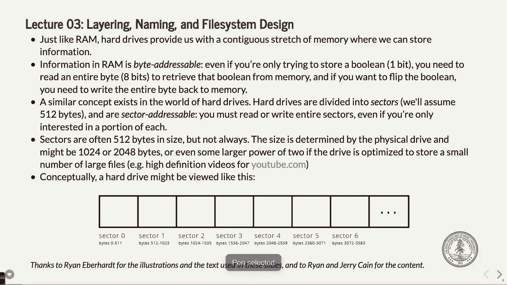
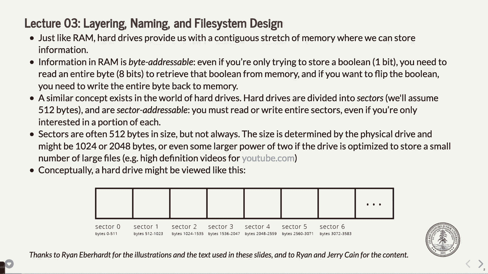
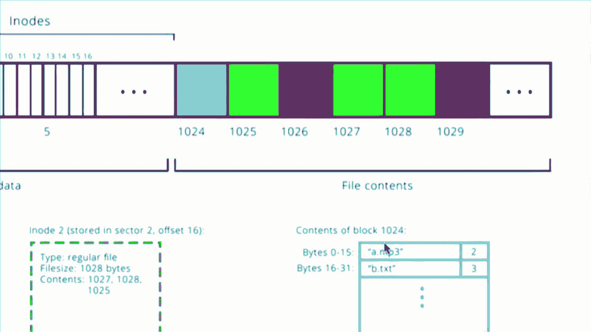

# P3：讲座3 Unix v6文件系统 - ___main___ - BV1ED4y1R7RJ

欢迎。欢迎回到CS110课程。**峰会**进行得怎么样？你们开始了吗？我知道有一群人已经开始了。我在办公时间见过你们。以后还会有更多的办公时间。如果今天和明天不行，那肯定会有星期天的办公时间，然后下周也会有，我们会提供完整的时间表。所以希望一切顺利。我也希望它不会带给你们太多像指针运算之类的回忆，那些曾经很难学的东西。

但是你们正在恢复状态，同时还在学习更多的C++，等等。再说一次，星期天中午，实验室报名将开放。目前大多数实验室部分，或者说你们可以称之为“组”，安排在星期五。下周，很多人可能会在你们的实验室小组而不是这里。也有少数小组安排在星期四。

如果你确实需要一个星期四的组，请尽早报名。如果你说，哦，我不能参加星期五的组，虽然大多数人应该能够参加星期五的组。可是如果你不能参加，那就尽早报名。如果因为某些原因找不到合适的时间来匹配你的日程。

如果有问题，告诉我，我们会尽量找出解决方案。你们确实需要去某些特定的部分，但我们会想办法解决。所以这个报名链接会在星期天中午开放，课程网站上会有直接链接到报名页面。我想这就是所有的通知了。大概就是这些。好了，开始吧。今天我们实际上不会看任何代码。

所以我们今天要做的就是学习Unix第六版文件系统。那么，为什么我这样说？我们不仅仅是学习一般的文件系统。我们将学习一个非常具体的文件系统，给你们展示文件系统是如何构建的。所以这不一定是你今天构建文件系统的方式，也不一定是过去20年来人们构建文件系统的方式。

我记得第六版的文件是在1978年左右发布的，那时的计算机其实和现在有些不同。但它依然有效，你仍然可以运行模拟器并实际使用那种文件系统。所以一般来说，可以把它看作是一个如何构建文件系统的案例研究。所以，别认为这是唯一的做法，也不要认为它一定是最好的做法。

但它确实是一个方法，而且是一个相当不错的方法。还有一些非常聪明的人发明了这个方法。所以今天我们要讨论的就是这个。事实上，第六版的文件系统正是你们在编程任务2中需要用到的文件系统。

今天课堂结束时，我会举三个例子，这些例子应该能帮助你们思考如何编写代码。所以坚持到最后，我们会看到这些例子。好了。好，既然你们学过CS107或甚至是CS106B，你们应该知道内存管理。

至少计算机中的RAM可以被认为是一个非常长的数组。

是的，从地址0到地址任意最大地址，或者是你计算机内存的最大字节数。就像一个长数组，你可以使用指针运算或直接用数组来访问它。如果操作系统允许你这样做。

事实上，如果你参加了CS 107 E课程，你会意识到，哦，如果我有一个裸机硬件系统，我可以访问各种内存，这也意味着你可以取消引用空指针，而直到程序的后期，某些东西崩溃时才会发生错误。

但无论如何，想象它是一个大的、可以按字节寻址的数组。这就是RAM系统。当我说“字节寻址”时，这是什么意思呢？

这意味着你一次可以调整一个字节的内存。你不能一次调整一个位。

现在，你可以进行掩码操作，进行位掩码等操作。但你总是至少一次操作一个字节。这意味着如果你想从内存中读取某些内容，你将一次读取8位。

如果你写入内存，你将写入8个位。好的，这就是RAM的工作原理。现在，计算机中的磁盘驱动器，事实上，许多人甚至没有磁盘驱动器。

你有一个SSD，固态硬盘，我猜它不算是磁盘驱动器，但它是一个内存系统，允许你存储在你关闭笔记本电脑或崩溃时依然能够持久化的信息。

这就是磁盘的工作原理。它们通常比较慢，尽管SSD比传统硬盘快得多，因为闪存的读写速度非常快。

以前，磁盘——实际上你们当中有些人可能还在使用这种磁盘——曾经是一个旋转的圆柱体，并且有一些读取头，可以读取一个字节，或者说，实际上它们一次读取不止一个字节，这取决于具体的类型。

你一次读取我们称之为“块”的数据。然后它们会转发给操作系统，操作系统可以继续处理这些数据。

好吧，所以，磁盘上有一些叫做块的东西，或者说是扇区。你可以把这两个词互换使用。稍后我会讲一下它们的区别。

但我们可以假设每个扇区有固定数量的字节。很多时候是512字节。在某些磁盘上，可能多达4096字节，但这仍然是相对较小的数量。

但那是你从磁盘上可以读取或写入的最小数据块。好吧。如果你想从磁盘上读取一个字节，你不能。你必须读取全部512字节。如果你想写入一个字节，你也不行，你必须写入全部512字节。

现在，如果你按字节写入，你可以保持追踪其他512字节。操作系统或硬盘本身会做这件事，或者由其他什么方式来处理。

但就是这样工作的。好吧，扇区的大小恰好与磁盘本身有关，或者说，它的磁盘类型等等。好吧，所以，这是一种权衡。扇区的大小就是如何影响速度以及其他一些不同因素的权衡。这看起来应该与你的内存系统非常相似，对吧？

你有扇区零、扇区一、扇区二，等等。扇区零是字节从0到511。可能有些小，难以阅读。但无论如何，这是512字节，然后是另一个512字节，你就是这么访问它的。好吧。所以硬盘或固态硬盘就是这样工作的。

硬盘提供给操作系统的 API 实际上非常简单。基本上就是读取和写入。你可以读取一个扇区，也可以写入一个扇区，差不多就是这样。你提供一个扇区号，读取它，提供一个扇区号，写入它。虽然细节上更复杂一些，但大多数情况下，你可以这样理解。再一次。

你必须一次性写入或读取整个扇区。好的。这部分是低于此层次的内容，你不需要担心。好的，我们将讨论一种更高层次的内容，基本上就是如何将这里的东西以及这个内存模型映射到文件并映射持久化的信息，等等。

好的，明白了。就像我说的，我已经做过一两次了，你可能会听到我说块和扇区交替使用。

事实证明，扇区是在磁盘上定义的，扇区零、扇区一，等等。你可以有另一种抽象，其中多个扇区可以算作一个块。所以你可能每个块有两个扇区。

对于我们的目的，为了简化事情，除非我们有时需要区分扇区和块，否则通常不需要这么做。我们会把它们当作相同的来看。所以如果我说块，就当作是扇区，想象一下驱动器上你可以读取和写入的内存块。这就是我们将在接下来的讲解中使用的方式。好的，明白了。

所以这里有一个图示。再说一次，从后排看可能有点难看到。所以请把它拉到你的幻灯片上。如果从后排看不清楚。这里有一个我们将要讨论的图示。正如我所说，这是实现文件系统的一种方式。恰好是一些人在上世纪70年代末为Linux或Unix版本六选择的方式。

它的作用基本上是允许文件写入这里，这样你可以根据你的“快速”定义来快速找到它们。然后，你可以以更高效或较低效的方式从驱动器读取数据。好的，我们在接下来的讲解中会详细解释这个意思。

好的，第一个块，第一个扇区或块是特别的。好的，它是块零。它被称为引导块。我们在课堂上不需要担心这个。但引导块基本上就是你开机时发生的事情。首先，它需要做的就是启动计算机。

你可以用几种不同的方式来做这件事。Peter做的第一件事是，它实际上从它自己的BIOS读取数据，这就是计算机内部的ROM内存。如果你的计算机没有连接硬盘驱动器，它通常会从BIOS中读取某些信息，查找硬盘驱动器，找不到时，会显示类似“找不到硬盘”或“找不到启动驱动器”的消息。

然后第一个块，扇区一，将会出现在你的系统中。这几乎是通用的。就像硬盘驱动器通常会这样做，它们知道要这么做。第二个块叫做超级块。超级块包含了关于文件系统本身的信息，主要是与操作系统交互的部分。好的。再说一次，这些内容通常是在你格式化驱动器时，或者在驱动器最初创建时由系统写入的。

我们不需要担心那两个扇区。好的。接下来的扇区是事情开始变得有趣的地方。好的，磁盘的其余部分由两部分组成。一部分是元数据部分。

然后是驱动器的实际数据部分。好的，这个图表，它让它看起来像是，如果你把它拆开，这里有一堆元数据。整个这一部分，实际上并没有那么多。实际上不到10%。但我们需要至少把它做得足够大，以便你能够看到它，直到你现在所看到的程度。

现在，元数据和数据共享这个长的抽象数组类型的东西，你可能会开始有点担心，因为这听起来有点像堆分配器。对吧？

你可能会想，“哦不，现在我得处理这个问题了。比如说，元数据和数据共享相同的空间。每次我使用一些元数据时，就会从实际的数据磁盘空间中扣除。”等等。这确实是对的，尽管我认为这个设置有点不像堆分配器那样集成化，因此我们不必过于担心这个问题。

好的。文件系统如何工作的细节本身就足够让你忙碌了。所以你不必太担心它会像堆分配器那样复杂。但基本上，概念是一样的。你拥有所有这些内存。你需要存储的不仅是你要存储的数据本身，还有关于你将要存储的东西的元数据，这样你才能找到它。

所以你可以访问它，获取关于它的信息，无论它是目录还是文件，或者它有多大，等等。好的。权限是什么，以及所有这些设置是在操作系统中进行的，是在系统本身设置的。好的。所以这就是这个文件系统的基本概念。好的。你有几个我们不需要担心的块。我们有一大堆元数据在这里。

然后我们有其余的部分是数据。这占据了硬盘的90%。好的。根据不同的文件系统，这个百分比可能会上下波动。我不知道你是否真的会用完元数据空间，文件系统如何处理它。它可能会说空间已满，或者它可能能够从其他硬件中获取更多的数据。

我不是100%确定它是如何工作的。其实这并不是那么重要。好的。好了。所以我们有文件。

文件负载。这是实际的数据，就像你在107课程中处理的负载，如果你做了堆分配作业一样。它们以512字节为单位存储。嗯，这听起来像是一个不错的块大小或扇区大小，实际上就是这样。好的。所以文件负载是以512字节为单位存储的。与堆分配器不同，当你分配一个文件时。

比如，当你有一个文件时，它可以在硬盘上的不同地方使用多个块。它不需要是连续的。好的。这个特性很好，因为它意味着你可以设置好文件，然后继续向其中添加数据，不需要移动所有的数据。好的。没有什么真正必要的。不过，我应该说的是，你的硬盘和存储设备可能会出现所谓的碎片化。

这意味着你在各个地方都有这些不同的片段。而且要获取这些数据并不是那么高效。取决于你硬盘的缓存等因素。但再说一次，这超出了我们现在讨论的范围。暂时就这样。

我们需要知道的是文件的512字节块。好的。如果你有一个1字节长的文件，那么这个文件在硬盘上占用512字节。没办法。好的。就是这么回事，还有元数据。好吧。为什么会这样呢？

因为512是我们可以处理的最小单位。所以因此，我们将其设置为文件至少占用512字节的空间。好的。这就是为什么小文件实际上可能占用比你想象的更多空间。因为底层空间必须以512字节为单位来处理。现在。

这是针对这个操作系统的。这也是针对这个文件系统的。可能更先进的文件系统有其他处理方式，以避免这个限制。我不确定最新的文件系统是怎么处理的。但这依然是一种可行的方式，而且似乎是有效的。好的，512字节并不多。

即使你这么做了。大多数文件通常不会只有一两字节。但就是这样。顺便说一下，即使是一个零字节文件，我们也会为它分配一个块，里面没有字节。好的。如果文件大小超过512字节，那么它会占用更多的块，每个块512字节。好的。如果文件大小不是512的倍数，那么最后一个块就是一个部分块。

所以，如果你有一个文件是513字节，你需要两个块，对吧？768字节，以此类推。或者是512字节。1,025字节会是另一个块。是的。将其存储为512字节的块有什么好处呢？

最后一部分是什么？嗯，这是个好问题。仅仅是为了让计算更准确吗？这是他们设置驱动器的方式。这种驱动器的设置有点历史性，它需要能够读取和写入这么多数据。这就是它的原因。为什么是512字节？因为它是2的倍数。我的意思是。

这就是它是512字节的主要原因。但是它能够处理这些块的能力，我们必须在某个地方找到量子，理解吧。所以他们说，让我们设定为512字节。如果我们设定为一个字节，硬盘会慢得不可思议。如果我们设定为四兆字节，它仍然会太慢，因为会有其他问题。好问题。不管怎么说。

在继续之前有什么问题吗？基本上我们要做的就是，我将通过这些内容，然后我们会做三个大的示例，嗯，实际上并不算太大。但是我认为如果你有点困惑的话，做这三个示例你会看到它是如何工作的。好了，这个图示在这里，虽然有点难以看清，但让我放大一下。

这里实际上有两个文件，我们将看到它们。一个是32字节的文件，另一个是1028字节的文件。

好的，这就是它在这里如何工作的，已经为你做了颜色编码。好的。绿色的部分是文件。再次为那些无法分辨颜色的人道歉。

但是绿色的文件表示它有三个关联的块，分别是1,025，1,027，1,028。而每个块的大小都是512字节。文件本身恰好有1,028字节。因此它使用了一个完整的块在这里，另一个完整的块在这里，然后在下一个块中使用了一个小小的部分。就是这么回事。

好的，另一个文件只是一个32字节的文件，位于这里，实际上它是在这里。不过关于它的信息就在这里。

它使用了这个块，大小为32字节。就是这样。好的，问题。

[听不清楚]，对，问得好。文件是否可能共享一个块？

这个操作系统不支持。好的，如果你有10个文件，而它们都是一个字节，你需要10个不同的512字节块。其他一些文件系统可能支持这种情况，但这个不行。好问题。还有其他问题吗？好了，我们继续。

我们需要追踪哪些块被用来存储这些负载，对吧？

这一切的关键是，如果我们的文件在磁盘上分散存储，我们最好能够找到它，对吧？你可能会想，哦，也许我们会有某种链表，它会继续查找下一个——这是一种做法。虽然这不是它的做法，但那的确是一种方法。

它的做法是把文件使用的块列在磁盘上一个特定的位置，即元数据区域。好的，在这里。好的。它们会——我们称之为i节点，列出这些块。好的。i节点是一个32位的数据结构，适用于这个操作系统。其他操作系统可能会不同。但对于这个操作系统，它是32字节。

对不起，如果我说成是比特。它是32字节的数据结构。它存储有关单个文件的信息。好的。你会得到像文件大小这样的信息。你会得到文件权限。你会知道它是何时创建或修改的，对吧？

然后你会得到所有存在的块。而我们关心的关键点是文件类型。它可以是目录、文件或链接。还有文件大小，这个是至关重要的。实际上，文件大小是人们在查看这个操作系统时最容易混淆的部分，尤其是在查看这个文件系统时。好的。实际上，这个块或i节点，好的，列出了所有这些信息。

它有空间存储最多八个不同的块编号。这些块编号标明了文件所在的各个块的顺序。好的。所以如果你曾经遇到过硬盘崩溃——顺便说一下，硬盘崩溃有很多种方式。但有时候它会崩溃。如果它抹掉了这里的元数据。

你几乎永远无法找回你的文件。因为它们分布在磁盘的各个地方，本质上只是数据。所以没有办法知道它们具体在哪儿。因此，各个硬盘制造商会做一些复杂的事情，比如把这个区域的备份存储在磁盘的其他地方。

它们会做一些尝试，以确保如果你的硬盘崩溃，你仍然可以找回数据。但在这种情况下，如果元数据丢失了，你的文件就在那里。每次512字节的存储，就在那儿。所以没有办法轻松地找回它。是的。[不清楚]，啊，这是个好问题。如果你的文件超过了八个块长怎么办？

我们会谈到这个问题。但这是一个非常好的后续问题。好的，我们会讨论这个问题，他们当然考虑到了这一点。因为这是一个很好的问题。如果512乘以8是4,096，那么即使在1978年，文件的大小也大于四千字节。所以这是一个很好的问题，对吧？所以我们需要处理这个问题。

但先记住这个，再等几分钟。好的，无论如何，i-node 本身，它们是存储在块中的。好的？因为它们是，这就是一部分。你可以在一个块中容纳 16 个 i-node。这个图有点不对，这个图实际上只显示每个块有四个 i-node。

不必特别关注下面的数字。只需要知道，对于这个文件系统，你可以在一个扇区或一个块中存储 1632 个字节的 i-nodes。好的，这在你做作业时非常关键。每个 i-node 都指向磁盘上的一个特定文件或目录。

当我说目录时，目录是一个文件。它只是文件的一种特殊类型。你将在做例子时看到这意味着什么。好的，明白了。那么，让我们再看一下这个 i-node 实际上是怎么工作的。

所以这个 i-node 2，在这里，好的，它会在绿色的地方。

现在我要把它放大一点，好让你能看到。但这里绿色的那个是 i-node 编号 2。这被认为是 i-node 编号 1。

所以它是块中的零地球。它被认为是第一项。我不知道为什么它们从1开始编号。你可能在做作业时需要做一些“减一”类型的算术。但无论如何，关键是我们要查看 i-node 2，它恰好就在这里。

它在块 2 或扇区 2，偏移量是 1，我想，应该是块 2。

这很合理。就是这样。现在你不需要知道更多细节了。

它在这里面说的内容是，它说，如果你说的是偏移量 16的话，让我们看看。

哦，抱歉，那是 4 的偏移量 16，但现在不用担心这个。现在它是 32 字节的偏移量。在这种情况下，它表明这是一个普通文件。它显示文件的大小，关键，然后它显示需要多少个块。所以如果你知道文件大小。

然后你可以开始弄清楚需要多少个块。了解这一点对于确定如何遍历这些 i-nodes 非常重要。

列出的块是 1,027，1,028 和 1,025，按这个顺序。

所以如果你看这里，文件的第一部分在这里，文件的开始。第二部分是下一个512字节，前512字节在这里，第二部分5000字节。我又错了。它说1027是第一个。谢谢你。然后它说1028是下一个512字节，这是最后的512字节。现在看。

操作系统会尝试将这些东西按顺序排列。如果它有一大堆，或者磁盘会根据具体情况来处理，但是i——这是操作系统，至少最初，它会尝试按顺序排列。为什么？因为那样最有意义。但如果它做不到，它会查找，它有一个空闲块的列表，然后它就选择下一个它能做的块。

这是碎片化问题的体现，有时候你必须稍微担心这一点。如果你使用磁盘已经很长时间了，有时你会觉得计算机变慢了。可能是因为你的磁盘需要进行碎片整理。也就是说，嘿，把这些相距很远的文件部分整理到一起。

为什么这会很重要？除非它们彼此非常接近？

磁盘有时会读取超过512字节的数据，因为它可以这么做，并且它会对这些数据进行缓存，等等。所以这就是那个大概的想法。好的，关于它如何工作的有什么问题吗？我们会回到那个问题上。是的。[听不清]，是的，是的，是的。偏移量应该是每一个。再说一遍，Ryan想出了这个方法，他有不同的理由这么做。

这些应该是，你每个块应该得到16个i节点。所以它们每个占32字节，16个。所以当你做作业时，你会得到这些。我想我会更新这个图表，使幻灯片与我们在这里讨论的内容一致。好的，明白了。顺便说一下，正如我之前提到的，因为它是1028，前两个块。

1027，1028，完全填满。这个只是部分填满一点。顺便问一下，为什么会这样？嗯，也许这个文件曾经更大，或者这里曾经有另一个文件，释放了一些空间，然后这个文件被修改了。然后你总是会保存，对吧？每次保存，无论文件变大还是变小，磁盘都会以某种方式进行适应，如果不能就会删除它们。

通过释放一个块或获取一个新的块。所以随着时间的推移，这种情况就会发生。好的，明白了吗？

所以，正如我所说，这些并不是按顺序或者连续存储的。你真的不知道，直到你实际读取这些数字，才能知道它是什么。好的。这就是我刚才说的，可能出于某种原因，可能是你会遇到一个文件系统，它会重复使用一些块，也就是说在块上做重复使用。

这个没有。

好的。文件的i节点告诉我们在哪里找到有效负载。但如我所说，它也存储在磁盘上。好的。那部分就是每个i节点32字节的部分。好的，你必须知道这一点，对吧？

因为你将从磁盘读取512字节的块。所以，如果你想找到i节点3，你可以做数学计算，得出结论：“哦，i节点3一定在第一个块，因为那里有16个i节点。i节点16也在其中。猜测i节点16也会在第一个块的末尾。”

i节点17会在下一个块的第一个部分。好的。所以你必须做这些计算。等到下周的作业，你将开始思考这些问题。好的。正如我所说，你可以在一个块中并排存储16个这样的i节点。好的。上次，我记得。

最后一次我要提到，如果你认为这是唯一的做法，那就错了。如果你确实需要了解如何为你的作业做到这一点，那是对的。是的。[听不清]。很好的问题。如果你有一个部分填充的块，问题是：如果你有一个部分填充的块，然后你添加了更多数据，但仍然没有填满它。

它会直接填满，填满它。它会编辑这个块。它会做的是读取块，进行更改，然后再把整个内容写回去。再次说明，这就是它实际上会做的。好的。操作系统会为你处理很多这些事情。很好的问题。

好的。所以，作为人类，我们喜欢记住东西，但我们不太喜欢记数字。好的。这并不是在评论美国的数学教育什么的。只是说我们不喜欢记忆数字，我们不如记单词那样善于记住数字，因为我们就是这样。

单词更容易记住。如果我说，“嘿，我刚把一个电子表格放进Dropbox，位置在70881，斜杠”，如果你必须通过这种方式来引用它，应该会有点疯掉吧？对吧。你会有点疯狂地试图记住这些东西。好的。今天我找到的一个表情符号。它叫做“尖叫的脸”表情，类似的名字。我还找到另一个，知道吗。

你知道的，有“点赞”和“点踩”之类的表情符号。实际上还有一个中指表情。我直到现在才知道这一点。我不认为它会列出来，你不能直接在手机上找到它，得想办法知道如何做。

我记得。不过，反正我没有把它放在这里。但你可能可以。如果你有一个文件名是这样的，你可能希望使用那个表情。反正，我们不喜欢这样做。那么我们该怎么办呢？当然，我们用名字，对吧？

在Linux和Unix中，我们实际上有路径，路径是像英文名字一样的字符串，应该说是字符串，用斜杠分隔，你一直在做这些事情，对吧？

所以你有一个路径，例如/用户/类/Cs 110/W.O.U./index.html。这个就是我们能够记住的东西。我实际上可以记住它，而不是那些不同的数字。好吧。所以我们需要某种翻译层。我们需要某种虚拟化，你懂吗？

计算机喜欢使用数字，而我们喜欢使用有影响的单词。明白了吗？所以这是通过一种特殊类型的文件来处理的，叫做目录。对吧。我们就要做这个了。而目录只是文件。意味着目录有一个与之关联的i号。

你跟随块中的i号到实际文件，这个文件有，嗯，应该是这里有一个文件。实际上，我会把这个放大，过来看看。它包含了关于该目录中所有文件的信息。

好的。它显示了文件的名称，顺便说一下，文件名最多只能有14个字符。这个是下周作业的小提示。它限制为14个字符。而且末尾没有零。如果它已经使用了所有14个字符，那就没有问题了。明白吗？如果用了所有14个字符，他们就不会再去添加零。

使用零，因为他们知道，你知道，最大值是14。事情就是这么描述的。记住，当这些东西被创建时，内存还是非常重要的。所以我们最终得到了像Y2K问题这样的事情。你们当中有些人其实是2000年后出生的，有人在2000年或之后出生的吗？是的，年轻人。

Y2K问题，说它值什么也好，我不知道你们是否听说过这个问题。这是当时的大问题，发生在1997年左右。有人意识到，大多数程序只用了两位数字来表示日期。所以，他们会使用最后两位数字，比如1993年或者1994年，随便。它们会用94年。嗯。

那么，到了2000年会发生什么？它会回滚到零。然后突然间，你就不再知道日期了，认为自己处于1900年而不是2000年。人们当时真的认为世界要毁灭，可能会爆炸之类的。当然，事实并没有。那时候的大多数程序都是这样。

事实上，现在很多程序都是用Cobol写的。Cobol是一种上世纪50年代的编程语言。如果你是1999年用Cobol编写程序的人，到了2000年，你可以去买一个度假屋，因为很多公司雇佣你去修复那些已经有30年历史的代码。无论如何，回到文件的问题，目录就是文件。哦。

我没有展示里面还有什么。

目录是一个文件，它与文件名和 i 编号关联。好的，目录中有该 i 编号。所以如果你要查找一个文件名，你知道该查找哪个 i 编号。好的，买这个小文件。它确实是一个真实的文件。

操作系统实际上将该文件的细节隐藏起来。你不能说，“哦，我来获取这个文件的实际数据，看看里面具体有什么文件。”这一切都对你隐藏了。你无法访问这些内容。

好的，好吧，我们该怎么做呢？嗯，实际上你可能可以把文件名放在 i 节点中。但问题是，文件名通常很长。事实上，你还需要包括与文件名关联的完整路径。它们可能变得非常非常长。而我们希望保持 i 节点本身的大小较小。我们希望它们保持为 32 字节。事实上。

如果你试图将整个路径保存在一个 i 节点中，你会很快用完空间。它超过了 32 字节。所以我们不把文件名保存在这里。这就是为什么我们把它们保存在与目录本身关联的实际文件中。好的。你也不想尝试通过 i 节点进行线性搜索。

可能会有很多 i 节点，甚至可能有数百万个。所以你不希望每次查找文件时都得做这件事。好的，那样会很慢。好，有更好的方法来做这件事。问题。文件的 i 编号总是从二开始吗？好的，这是个好问题。

我们稍后会讲到。你关心的第一个 i 节点是位于第二扇区，偏移量为零的那个。那恰好是根 i 节点，i 编号为二，就在这里。所以我应该说，嗯，实际上在这个文件系统中，它是 1，更新的文件系统中它是 2。但这是根目录的目录。

现在我们知道从哪里开始了。我们稍后会看到它是如何表现的。问题？

好问题。我相信有一些超级块会跟踪哪些 i 节点已被使用，哪些没有。我不完全确定它的具体机制是什么，但确实有。操作系统会在磁盘中保留这些信息，告诉你，嘿，这些是坏的，那些不是。到目前为止还有其他问题吗？好，我们快到了。是的。那么这个目录是否以某种方式映射文件的 i 编号，和目录有关吗？计算机中的文件如何？好问题。这里的文件名是目录的 i 节点吗？

它们和你电脑上的目录有关吗？

它们实际上就是你电脑上的目录。它们就是，实际上就是。你有根文件，你有用户文件。你有类文件。你有CS110文件，等等。而且每一个文件上都与之关联一个i号。好问题。是的。

我想它并没有跟进。那么在i号本身中。是否有某些内容告诉我它是否正在使用？对于i号本身。是否有某些内容告诉你它是否正在使用？是的，同样的事情。我的意思是，我认为是操作系统或磁盘本身有一个列表，列出了哪些i号没有被使用，就像哪些块没有被使用一样。

是的。好问题。还有其他人吗？好了。让我们继续一点。那么我们该怎么做呢？

好的。我们有一个目录文件类型。我已经稍微提到过这一点。

我们实际上不需要改变我们的模型来做这件事，因为我们将简单地说，目录是一个特殊类型的文件。但它实际上就是一个文件。我们甚至不做任何修改。我们只需将这个抽象应用到我们已经有的系统上，然后我们只需要说，太好了。现在你将不得不搜索一堆文件来找到你的目录。

但是它会相对较快，因为你只需要搜索有限数量的文件就能找到它。好了，所以并不算太糟糕。你，文件负载，这，嗯，我想这实际上应该是，等一下，那一个，文件负载是16字节的序列。将外部表映射到i号的名称。哦，是的，抱歉。没错。这就是。

我们刚才在下面讲过的内容，我们刚才在下面讲的内容。每个文件都是16字节长。好，你有14字节是文件名，然后2字节是数字，i号。

这就是16字节，字节，分片的含义。

文件名是在np3创建的。是的。不管那个目录是什么，没错，这是一个非常好的问题，嘿，等一下，这个文件是存储在哪个目录中的？它存储在np3.mp3所在的目录中。

这是与这个文件相关的文件。是的，好问题。好了。好的。那么，当我们做示例时，它将开始变得更清晰一点，更加明了。好吧。

再说一遍，操作系统会把这一切隐藏起来。不是说你可以自己去查看这些文件。虽然它们只是文件，但操作系统不会让你查看。因为我不会让你查看那个目录文件。那是用于媒体的。就这样。好了。好吧。让我们看一下这里的1024块。好，这是这一个。

这是这个文件。事实上，我们已经看过这个文件了。目录中包含两个文件。好的。那里文件的总大小实际上是32。为什么？

因为这些小块每个占 16 字节。

好的。表的第一行是第一个文件，第二行是第二个文件。你可以浏览这些。事实上，当你从下周开始做作业时，你将有一个结构体来覆盖这些信息，这样你就可以一个接一个地浏览这些文件。

好的。所以这只是一些 32 字节的数据，每个文件为 16 字节一块。好的。再说一次，你可能会问，等等，如果目录中有超过 `16 * 512 ÷ 16` 个文件怎么办？

是的，这个文件需要多个块来存储。但它就像其他任何文件一样。你应该有某种抽象方法，可以说，给我整个文件，或者一次一个块。那正是你将要编写的程序所做的，你下周必须将这个抽象化。好的。明白了。那么，你要做的就是在这些文件中进行搜索。

如果你在查找一个位于路径某处的目录或文件，你将会。这个文件将代替说一个 `.mp3`。

你可能在 `/` 目录下查找，并且你可能在找 `user` 目录。好吧，那就会是 `user`，它会有一个 i 编号，你就去那里并继续执行这个过程。不管是递归地还是迭代地，这取决于你决定如何做。

好的。正如我所说，我们将做一些示例，你将看到这个过程的实际应用。

好的。文件查找到底是怎样的？它到底是如何工作的？好吧，如果你要查找 `/users/users/class/last/season1/10/example`。好的。首先，我们找到 `/` 的 i 节点。我已经提到过，你知道那个在哪里。它恰好是第一个 i 节点，或者说 i 节点编号为 1，你去查找它。

所以这就是你开始的地方。你不需要去弄清楚其他的事情。你说，好吧，我知道它在磁盘上列出的位置或所在的扇区，i 编号，然后你就去那里。好的。所以你搜索那个有效载荷。换句话说，你去那个文件，查找与之关联的用户令牌，然后你找到与之关联的 i 编号，然后你去查找 i 节点表。

你发现并找出文件的位置。然后去那个文件。读取内容。里面，你希望能找到一个斜杠类或类文件。然后你去到类的i节点，找到与之关联的i号。然后去那里，找到与之关联的文件。

你去读文件，然后你会在里面找到CS 110文件。好的。然后在里面是同样的东西。又是同样的过程。看一下i号。去访问与之关联的块，然后去找与文件关联的i号。去到那个i号。找到所有与该文件关联的块并读取文件。

这就是过程的工作方式。好的。它相对较快。好的。你大约需要查看一、二、三、四个不同的文件才能找到它。而且大多数路径不会有那么多不同的层级。好的。问题，怎么样？

当你在目录中搜索并试图找到下一个目录或文件时，你希望在搜索中按字母顺序排列。好问题。问题是，嘿，这是不是类似于二分搜索之类的？不是的。你确实需要做线性搜索来找文件。现在。

文件可能是按字母顺序排列的，但我认为它们根本不是。你不能保证这一点。实际上发生的情况是，当你创建一个新文件时，它会被直接加到最后——它就在虚拟内存中。它们不会重新排序或类似的操作。所以，问题很好，但你确实需要做这件事。但还是。

目录里其实没有那么多文件。通过32位或16位文件进行搜索相当快。它不是我们文件中的16位条目。相对快速。问题。[听不清]。

好问题。这些是相对偏移量还是显式的偏移量？

它们是与之关联的i号。所以这不是偏移量什么的。就是从文件系统的第2个扇区开始，直接去到i号2。

换句话说，从这里开始，往下数，直到你得到那个数字。这就是它的工作方式。这不是偏移量。[听不清]，它不一定在那个扇区里。它在i节点中。它在某个i号中。所以它在i节点里。你只需要搞清楚，做一点数学运算。相信我。

对于下一个作业，你将进行一些算术运算。就这么简单。是的。[听不清]。

正确。

[听不清]，是的，两个字节是，多少，16000？16000个不同的i节点。在这个操作系统上，那是你能添加的全部。或者说，可能你无法添加超过16000个文件。但当硬盘只有五兆字节时，这没什么大不了的。问题。[听不清]，好问题。

如果有两个文件名都有14个字符，怎么办？

前14个字符是相同的，但它们是不同的文件名。它们不是不同的文件名。在这个操作系统上，无法创建超过14字节的文件名。你只能限定在这个长度。事实上，DOS就是这样。微软的DOS多年来都是如此。它是8+3格式。换句话说，8个字符代表3个字符的扩展名。

然后他们不得不做一些死跳和大圈子，才能让长文件名能够以这种方式放入窗口。是的，那是个限制。没有人真的觉得如果他们能够做到这一点，可能会有多大的影响。

是的，那个时候的限制确实有些重要。好问题。还有谁有问题吗？嗯？哦，您那边。抱歉，先生。嗯，[听不清]，是个好问题。你限于每个目录32个文件吗？不，您可以有任意多个文件。并不一定是32个。嗯，我猜可能是512个，5、6个，32个，嗯。32个。但你只是与之关联更多的块，就像任何其他文件一样。

[听不清]，是的。您的目录是一个文件，可以是一个块或多个块，最多8个块。我们还没有完全回答这个问题。我当时想，“哇，超过8个块怎么办？”我们马上会讲到。是的，[听不清]，不对。块不需要填满。好问题。[听不清]，是的。

这是他们展示的一个小问题。一个好问题是，“隐藏文件会显示出来吗？”我的意思是，它们会显示出来。我这里没有表示它们。所以，嗯。你会看到。如果这是你的问题的话。还有其他问题吗？好吧，我们继续。我们接下来还有些大事要发生。

好吧。这是早些时候提出的问题。好吧。问题是，“i节点只能存储8个块号。”好吧，它们就只能存储这么多。为什么呢？

因为他们就是这样构建的。好，假设这意味着，从表面上看，您限制于8个512个块或者4,000，或者4,000字节的数据。那么即便在当时，正如我所说，这个大小远远小于你可能想要创建的文件。好吧，那么他们是怎么做的呢？他们必须想出其他方法来解决这个问题。

他们做的是说，“我们来做所谓的间接寻址。”好吧。所以，如果你有像2001到2008这样的块，对吧？那么就会是满的，对吧？

因为你有8个这样的块。你有4,096字节的容量。然后文件就满了。好吧。一旦它变得更大，系统会设置一个标志。它会说，“哎呀，现在我们有了所谓的大文件。”好吧。大文件会切换一切，所以它不再列出这8个块来存储数据，而是列出那些列出数据块的块。

好的，基本上这意味着，如果你有一个区块，之前它有8个数字。而这些数字中的每一个，你都会去查看第一个数字，它就是你的数据，然后是第二个数字，依此类推。

现在，它将包含8个数字。实际上，它是7个。我们稍后会讨论这个。它的意思是，每一个数字指向一个区块。而在这个区块里，填充的是其他区块的数字，这些区块存储的是你的数据。

好的，这是一种间接的递归方式，你通过间接的方式引用你的文件。你可以说：“好的，太好了。让我们让这些数字每一个都指向一个区块。”而那个区块里面有许多数字来实现这一点。

现在，这些是2字节的数字。每个区块是512字节，意味着每个间接区块可以有256个不同的区块。

好的，为什么呢？因为你有一个间接区块指向了这里的一个区块。我知道这个区块的编号指向了这个区块。在这里，你有256个数字，每个数字指向一个实际的数据区块，按这个顺序。

好的，这叫做间接寻址。你可以对原始的8个区块中的每一个进行这样的处理。只是实际上只有7个，稍后我们会解释为什么。

好的，那这意味着什么呢？这意味着，如果你把所有8个区块都存储为间接区块，那么我们现在能存储多少数据呢？

我们可以存储8个这样的区块，也就是有效的区块数字。因此我们在i节点中有8个这样的区块。每个区块有256个其他区块的数字。每个区块可以存储512字节。

8乘以256再乘以5，除以12，就是1兆字节。这就是你在间接寻址下文件可能的大小。好的，到目前为止你有什么问题吗？这需要一点时间来处理。

我第一次看到它时，我想，“哦，发生了什么？”是的。

[听不清]。

这是个好问题。问题是，“间接寻址的层数是否有限？”

“现在，我们只考虑一个间接寻址的层级。稍后我们会讲到这个。”

你思考的是从两个方面中的一个提前一步。但没错。目前只需认为没有其他情况。对于这个例子，只需要一个间接寻址层级。我们只需要担心这个。

我们稍后会讲到其他问题。还有谁有问题？是的。那是什么？你改变主意了。好的。还有其他人对这个有问题吗？

如果你正在使用间接寻址，文件中最好每一部分都使用。那是不是实际上在使用间接寻址或类似的东西？

好问题。我们所有的块都在使用间接寻址，还是只有一些在使用？

你自动切换到完全的间接寻址。

它需要操作系统，并且驱动器必须负责移动你的文件。一旦它超过了4096字节。

我们得在这里切换一下。然后你就会用那个。接着如果你回到4096，它又会切换回来。如此类推。

在那方面它其实挺笨的。但它确实起作用了。还有其他问题吗？好的。

所以你可能会对自己说，太好了。在1977年或1978年，百万字节的文件相当大，而且他们就只停留在那个层面。

好吧，即使是在1978年，一个百万字节的文件，一个兆字节，尽管它在当时占据了大部分可用硬盘的存储空间，但它仍然不足以存储你可能想要的所有数据。

好的。那么他们说，现在我们该做什么呢？对吧。你几乎已经提到我们该做什么了。但我们要做的是，我们说，好吧。

如果你使用的是间接寻址，为什么不使用双重间接寻址呢？好的，事实上，它并不像你想的那么糟糕。

好的，你可能会想，嗯，现在我们只是把它弄大一点，然后像之前那样继续做下去。其实并不是那么糟糕。

这可能导致当你达到那个阈值时，突然间你就得做很大的改变，这会比他们原本希望的要更多的移动。

但是他们做的是，好的，如果你使用超过七个间接块，第八个间接块就是一个双重间接块。它的意思是，这真的是一种递归式的结构，对吧？

你有七个块号，它们指向间接块。每个块号指向一个包含 256 个条目的块。最后一个块号，第八个块号指向一个块，那个块里充满了块号，总共有 256 个。

每一个都指向一个包含 256 个数字的块。每个块指向一个数据文件或数据的一部分。

好的。这是一个间接方案，因为你可以这么做，对吧？

他们明确地说明只有第八个块，如果需要使用它，应该被解释为一个双重间接块。

好的。这里有几个总结，下面有详细内容。再说一遍，你需要搞清楚这些细节，作为下周作业的一部分。听起来可能很疯狂，但一旦你理解了发生了什么，其实并没有你想的那么糟糕。

[听不清]。

让我再解释一下第八块。好的，让我这么说。你有一个，你有这个 i 节点。好的，i 节点里有七个数字。好的，我们称它们为零、一个、二、三、四、五。

六个。这些都是单重间接块。好的。它们每个都指向一个。它们每个都指向一个包含256个数据块指针的块，基本上，或者是贝塔块i节点。好的。每一个指向一个数据点。好的。最后一个，这里，第八个是一个特殊的块。它是一个常规的数字，就像其他的那样，指向一个块。

当你进入那个块时，你会找到256个数字。每一个数字都指向一个块，这个块里有256个数字，每个数字指向一个数据。这样说有道理吗？这样回答你的问题，关于那里发生了什么？

没有其他的，就没有其他的异常情况了。并且它总是第八个。而且如果有需要，它总是被使用。那是后面的某个东西。不是吗？是的。所以，你可以看到间接块显示该字符串仅包含数字。它们都是两个字节的数字。是的。就这样。它们只是两个字节的i数字。

就是这些。好的。还有问题吗？所以，如果你的文件仅在间接块中存在。如果你想使用，是的。如果你的文件足够小，只填充了前七个间接块号。那你就做这个。一旦你进入第八个，它现在就是双重间接块，你必须使用一个家族来处理。但是，它不是没有。

在那个时候没有决策。唯一真正的决策是，我是否已经超过了四千九百？然后是四千九十六。然后它进入间接方法。在间接方法中，如果需要，会有一个块是双重间接的。它总是最后一个。就是这样。

好的，明白了。那我们开始吧。是的。

间接块被认为是文件吗？间接块仍然被认为是文件吗？

间接块，不，它们只是块而已。在这种情况下，它们不是文件本身。它们没有与之关联的i数字。不，它们有块号。它们没有i数字。它们不是文件。好问题。

好的，让我们总结一下。顺便说一下，这里是最终的计算结果。好的，你最多可以有七个加256个间接块。为什么？

因为你有从前七个直接块得到的七个。对的。加上你有256个额外的间接块，因为现在有一个块是双重间接块。

总共有263个间接块，每个块指向有256个相关的块。好的。每一个这些256个块，每个块是512字节。意味着在Unix版本六文件系统中，你可以为一个文件提供总计34MB的空间。

好吧，今天34MB已经不算什么了。对吧？你知道，现在一个MP3文件都比34MB大，或者说大多数东西现在都超过了34MB。但是在那个时候，这已经是个大事了。我得自嘲一下，但我第一台电脑甚至没有硬盘。

当时我买的硬盘是20MB，我想，我永远也用不完它。而且备份数据需要好几个小时。用软盘什么的。但在那个时候，34MB已经算是相当大了。对吧？在你需要做的事情数量上。而如果你需要更大的文件，那就另当别论了。

就像我们今天做的那样，你必须把它们拆分成不同的文件，并以某种方式将它们与文件系统分开。

然后你去看，我只是知道我会自己处理那些超过这个大小的文件。你会自己将它们拆分成更小的部分。不过，无论如何，重点是现在我们已经达到了34MB。

好的，好的。那么，总结一下。好吧，如果一个文件小于4,096字节，我们就拿到那个i号，然后去查看与该i号关联的i节点，它包含八个块号。顺便说一下，它还会显示文件大小，帮助你理解这个信息。

但是你去找，你会发现这八个块号都是作为直接地址块使用的。所以这八个块每个都有512字节的数据。你去那里，按顺序找到数据。而且并不一定要使用全部八个，你可以更新一个或两个。

一旦你超过了4,096字节，你现在就成了大文件。对于大文件，前七个块号是通过间接寻址的方式访问的，这意味着每一个块都不是一个大文件。

你可以使用一个块号。你可以使用一个块号。你可以使用一个块号，其中包含256个数字。每一个数字都指向数据。你按顺序进行操作。

如果你需要使用八块，那么这八块现在是通过间接寻址的方式访问的。这意味着它指向一个包含256个块号的块，而每个块号又指向一个包含256个块号的块。

它指向512个不同的块。好了，事情就是这样。问题是什么？

所以那个两字节的数字是一个块号，而不是一个非数字。正确。好问题。好的。再一次，这个问题又回到了它们是否是文件的问题。它们不是。

一旦它们是与这个方案相关的块，它们就不再被视为文件。好的。那我们，嗯，问题。抱歉。嗯。

>> 你提到了设置标志来显示间接寻址的地方。 >> 正确。好问题。你存储这些标志的地方在哪？就是i编号本身。记住，它有六个，它有八个数字与字节相关。它是32字节长的。有16字节用于存储数据、元数据。它还包含文件类型。

它有大小，也有设置的标志，表示它是否是大文件。好问题。当你做这项任务时，你会看到一个结构体，它可以直接映射到这些数据上。还有其他问题吗？好的。让我们做几个例子。好的。我们将做三个例子。

我们将尝试定位一个名为`/local//files/fairy tale.txt`的文件。然后我们想要读取这个文件。好的。这是我们要做的第一件事。接着我们将查看读取一个名为`/me file`或`med file`的文件。它是一个中等大小的、大型文件。好的。它比4096大，但没有917,504大。

这将会使用所有七个间接块。好的。然后我们将读取一个名为`big/big file`的文件，这是一个大文件，大小大于917,504字节，但小于34兆字节。好的。顺便提一下，达到这个限制时，你会有其他的开销，因为现在至少有两个块必须用于存储元数据和其他内容。

但如果你的文件这么大，也没什么大不了的。它只是占用了一点额外的数据。

好的。没问题。希望我能想出这个图示，它实际上能让你明白。好的。希望它也足够大。我们将要查找的是`/local/file/fairy tale.txt`。下面是你如何执行这个操作的步骤。好的。首先，查找斜杠目录。好的。我们知道它的位置，不需要计算。它位于i编号1。好的。

而且i编号1恰好是我没有在这里放置扇区零和扇区一。这是扇区二，扇区三，扇区四。i节点1位于扇区二的偏移量零。那就是文件的位置，也就是告诉你去哪里查找根目录的i节点。好的。没有，不需要做什么计算，也不需要做决定。

你去那里并查找，看它说了什么。好。那么这是什么意思呢？嗯。我这里有的是这一列中的块号。这些是文件大小。我把它放进去了，只是为了我们可以检查一下大小。然后这些是与i节点关联的i节点号。当然，这些是按顺序排列的，对吧？

你得到一个、二、三、四，直到你有多少个为止。记住，每个块最多只有16个。好的。这是你需要处理的算术部分。现在我们是抽象地处理这个问题。你稍后需要自己弄清楚算术。好的。总之。

你去到i节点1。那是根节点。你说，好的，这个文件关联了哪些块？25。好的，它只有80字节长。所以我知道我只需要做一个块，并且它是直接地址，不是间接地址。所以你去到25块，恰好就在这里。

你翻阅一下，你知道它是一个目录，因为它显然是一个目录，这就是根目录的全部要点。你翻阅一下，看到它里面有一些文件。这次我确实把点和点点也放进去了。好的。你翻阅并读取那个文件，问自己，嗯，我在找的是本地，顺便提一下。

这是我首先要找的东西。它是本地的吗？不是。它是本地的吗？不是。它是本地的吗？是的。那么，这意味着它显示了，哦，本地的i节点号是16。那么你怎么做？

你上到i节点号16的块，它应该是本地的。好的。所以你做这个，然后你说，好的，我需要做什么？嗯，它是1001字节长。我首先查看27块，如果需要的话，再读取54块。然后你去到27块，它就在这里。你说，好的，让我看看。现在我在找文件。好的。

因为这是我们路径的下一个部分。所以在五个不是文件，不是文件。哦，i节点31处有文件。你看得出这是递归的还是迭代的，或者是其他的吗？

一直这样做下去。抱歉，抱歉。保持下去。这是迭代的，伙计们。无论你喜欢哪种方式，对吧？我会选择迭代的方式。这样做更容易。我觉得。但不管怎样，你继续往下走，说，好的，文件在31处。好的。那么你去到31，那里就是。然后你会说，哦，太好了。那意味着我要去32块。

就在这里。现在我在找fairytale.txt。我往下看，说，好的，那就去32。我去到32，看看那不是fairytale。它在这里，块47。现在我们找到了我们的文件。对吧？现在我们知道它是一个文件。如果我们想的话，可以检查它是文件还是目录。现在我们进入，去到47，i节点47，恰好在这里。然后你说，太好了。

它是一个1057字节长的文件。所以你说，好吧，太好了。让我开始读取它。我将去块80。因为它是1057字节，我们知道它小于我们的较大文件区分值。对吧。所以它将直接访问块。这很不错。所以你去到块80。然后你去到80。它会说，很久很久以前，有一片广阔的森林，因为它们是童话故事。对吧。

然后你继续读取下一个。这可能不是按顺序的。事实上，这个例子中并不是。你去到89，看到的内容是，公主太阳星中死去的那一刻，什么的，接着就开始继续，吧，吧。对吧。然后你回去，那里是一个专家。最后你终于去到87，到了87，你就看到他们过上了幸福的生活。现在，直到你到达87，你会从每一个位置读取多少数据呢？

这个实际上有点像是一个陷阱问题。你打算从一个扇区里读取多少数据呢？

512字节。对于80和89来说，多少字节是相关的？全部512字节。对于87呢？

好吧，你得做个计算。你得做一些模运算、除法和那些算术的事情。对吧。因为你需要知道你将读取512字节。事实上，磁盘不会去尝试弄清楚磁盘并不会说，嘿，你要读取7字节吗？

我给你7字节。不。它说，这是512字节。你想怎么做就怎么做。可能是垃圾数据。部分是垃圾数据。部分是文件的结尾。你做数学运算来弄清楚这一点。好的。这就是它的工作方式。好了。我们找到了它，然后完成了。就是这样。关于这个有问题吗？我希望这足够直接明了。我的意思是。

鉴于这是新的，且我们能够做到。你可以查看这些内容并按照这种方式操作。好了。很好。那么，我们来看下一个。现在我们想读取一个名为“slash need file”或者“med file”的文件。

对吧。它是一个中等大小的文件。那么，你该怎么做呢？首先我们得找到它，顺便说一下。如果你要做这个，我可以说，哦，看，我们知道它是一个设计节点编号。那么，我们实际上来找到它。我们该怎么做呢？我们去根目录。我们知道它在哪。然后我们就去那里，发现它和之前的是一样的，因为我只是简单地复制粘贴了它，并做了一些修改。

不管怎样，你去到块25。你去到25并开始读取文件。不是那个。不是那个。也不是那个。哦，就是这个。就是我们要找的文件。它是一个文件。你可以打开文件，发现它确实是一个文件。所以你去到编号16的位置，就在这里。一旦你到达这里，你说，哦，好吧。

这个文件有多大？80万个字节。嗯，那比4096字节大。所以，我开始使用我的间接寻址。好的。接着，跟我之前说的一样，我知道这个文件有六个不同的I节点与之关联。希望我数对了。然后你做的事情是去第一个I节点，去块26。嗯。

在块26下，我知道这些不是——这不是一个文件。这些是更多的块编号。每个块两个字节。我去第一个块，然后我去，好的，80。嗯，这就是我的文件开始的地方。好的。所以我去到文件开始的位置，就像是“这是最好的时光，也是最坏的时光”，就在那儿。这就是第一个块。然后，我去到下一个块，它是87。87就在这里。

它是希望的春天，也是绝望的冬天，等等，等等。好的。你就这样做，直到整个列表结束，对吧？

这将是256个不同的块，对吧？每个块512字节。然后你去下一个块，对吧？然后做完全相同的事情。你去到块30，哦，太好了。现在我要去块89，然后我去到89，车外发生了事故。这是第257个数据块。好的，因为它是间接寻址的。

然后你一直按这个特定的顺序做。每次通过256个块后，你就回到这里，继续做256个块，依此类推，直到你到达最后一个，也就是块59的最后一个块，你需要开始计数，对吧？

因为它可能并不是全部256字节都被使用，对吧？它可能只是，嗯，使用了你需要的那些字节。你需要识别这一点。对于最后一个块，根据它是512字节块还是其他的，会有一些“越界”错误。好。大家都明白了吗？好的。希望这不太难。最后一个。

让我们来看看。最后一个是我们现在要尝试读取/大型文件。我们首先得找到它，然后读取它。好，过程一样。

你首先去根目录，找到它，你得去到块25，去块25，那是一个文件。你读取文件。你知道这些每个都是16字节。然后你继续往下看，发现你不在大型文件中。大型文件在i号16位置。你去到i号16，结果你发现，这是一个18MB的大文件。然后你继续。

很好。现在你知道了，但是直到你到达最后一个块或者最后一个块编号时，才需要特别注意这个问题，对吧？记住，前七个块都是完全间接的，就像我们在前一个例子中做的那样。

好吗？那你该怎么办？你去到块26，继续往下到26，读取80，然后去到80，这就是文件的开始，然后你去到41，我这里没有列出，那是下一个块，然后是82，依此类推。好的？

然后你完成了这个。然后你对35、32、58和59做同样的事。最后你回到块30，块30。你去块30，去到，哦，我得去87。但是我知道这是双重间接的。所以你去到87，87有更多的数字。第一个数字。

你去到文件那里，恰好是第1793个数据块，因为你在统计所有这些。对吧？然后你做的事情是，你逐个遍历这些。然后你再次返回到块30，读取114，而114包含了256个不同的数字。对吧？

然后它们继续。每个都有256个不同的数字，等等，等等。对吗？我应该做什么？

我应该做什么？

87应该有吗？所以87应该是，看看，87，难道我算错了吗？可能我算错了。看看。所以87是从这里来的。87应该是，或者87指向89，而那是块号。那是另一个数字。然后它指向，看看，指向实际的数据。明白吗？

你去到30，它有一个块号。对吗？如果它是间接的，它会指向数据。但现在它指向一个块，这个块又指向数据。

它应该有256个吗？这里有256个。对吧？是的。那是个，哦。我的意思是它可能有256个，也可能没有。但它最多可以有百分之百的容量。如果有的话，不一定非得是256。一个团队用的。哦，抱歉。是的，你说得对。因为这个。是的，你可以有这个。你可以让这个成为最后一个，它指向它们。

然后它是正确的。因为我就是这样做的。好了。问题。是的。[听不清]，你知道，我不确定我算得对不对。但没错。它会有足够的数字，直到最大文件大小。是的。这里不一定非得是256。对。这是如果你有接近34兆字节的内容。没错。

正确。还有其他问题吗？希望这样讲能让你明白。我的意思是，当你第一次看到它时，你会觉得，天啊，太复杂了。的确，它对于它的价值来说是相当复杂的。但它并不是不可学习的。我的意思是，你肯定能够学会它。你只需要知道怎么做。我的最后一个评论。

这正是我第一次评论的内容，不用担心这就是唯一的做法。实际上有成百上千种不同的文件系统。另一个问题。是的。再说一遍。一个，二，三，四，五，六。哦，我应该再做一个。抱歉。谢谢。那应该是一个帮助。谢谢。让我保持诚实。我会修正的。谢谢。

还有其他人吗？好了，我们周一见。别忘了周日报名参加实验课。

