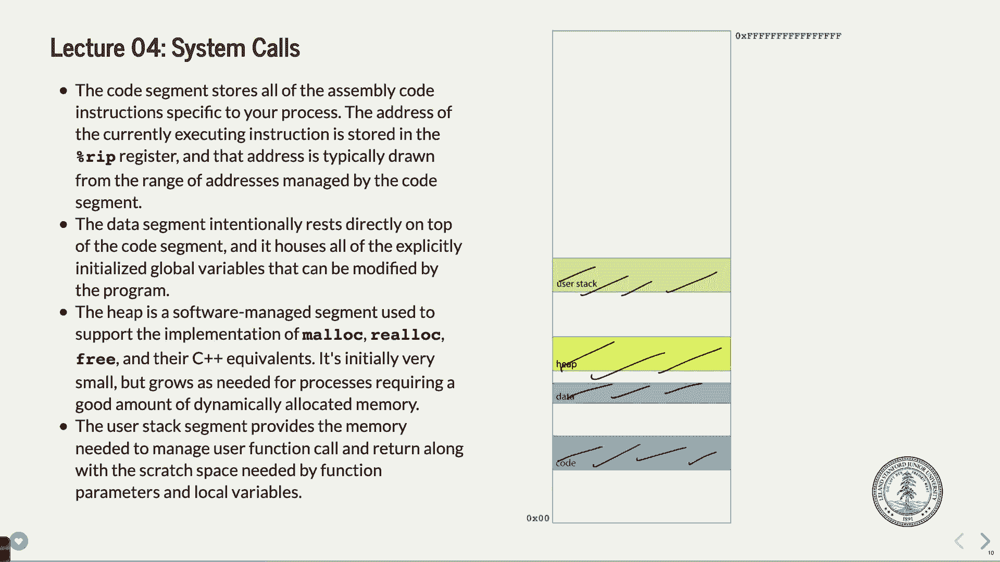
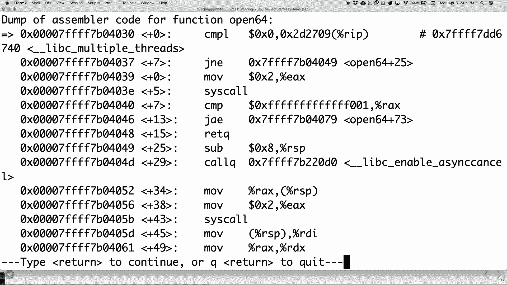
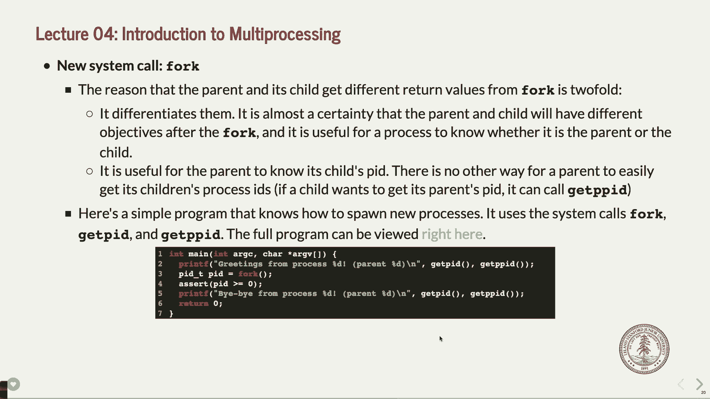

# P4：第四讲 文件系统数据结构、系统调用与多进程简介 - ___main___ - BV1ED4y1R7RJ

欢迎。欢迎来到第二周的CS110课程。我希望我已经度过了一个愉快的周末。我为实验室注册的混乱表示歉意。虽然只有半个小时，但还是有一些人确实担心能否成功注册。看起来大多数人已经注册了。我可以看出来，周四的时间对于课程来说非常重要。

看起来大多数人想选择周四的时间。但实际上，早些时候的时间还有空位。周五的时间也有很多，而你们在这个学期都已经注册了课程，所以应该没问题。希望如此。如果因为某种原因你不能参加你的时间段，请告知我。

如果你把笔记本电脑或者其他设备带进来，请告诉我。我们会尝试找出其他解决方案。不过，大多数人看起来都得到了他们想要的，有些人可能没有得到，所以如果有大问题请告诉我。好了，我们继续。

我正在重新插入我的平板电脑，因为它似乎让我很困扰。我打算调整一下，可能没有效果。也许我们就不做这个了。等一下。我想确保一切正常。好像不行。不行。好了，终于搞定了。那么今天我们将继续讨论文件系统。

我们将特别讨论一些操作系统为跟踪文件和进程所设置的数据结构。正如事实所证明的那样，操作系统不仅仅是用来管理文件的，还包括进程的管理。然后记住，这就是Unix的做法，或者说这是Linux的做法，并不是所有操作系统都这样做。

但是它恰好存在，Linux 做到了，而且它确实是一个非常好的系统，能够跟踪你的文件，至少在某种程度上是这样的。所以我们要做的是，接下来我们要讨论系统调用。我们已经看过一些系统调用并使用过一些，但接下来我们要讨论它们的细节。

等等，什么是系统调用和普通函数的区别呢？好了，最后我们应该有时间开始讨论第一种——“哇，这是一种不同的编程方式”——即多进程编程。希望你们喜欢这一部分，因为其实它挺有意思的。

一旦你开始操作，你就会觉得“哇，我以前真没想到可以这么做。”

作业还好，作业一进展如何？周三之前没有延期，也没有可以推迟的时间。第一次作业没有延期的余地，第二次作业也会在周三发布。好了，继续。

离线外包我们仍然遇到麻烦。好的，所以在 Linux 中，当你运行一个程序时，你的程序会变成一个所谓的进程，或者说它会有一个进程，基本上是给定一个编号，并且它会说这个程序正在运行，这就是进程，它在某个地方运行。好吧，我们稍后会讲到如何工作的细节。

这些可以稍后有所变化，但 Linux 会维护数据结构来跟踪这些进程，当然它会这么做，操作系统需要了解正在运行的程序，所以它会保留一些数据结构来跟踪这些内容，因此它会跟踪进程的不同部分。

所有与程序相关的不同东西都叫做进程控制块。它们叫做进程控制块，并且包含大量的信息，并且它们存储在操作系统所组织的一个叫做进程表的东西中。

进程控制块存储着许多东西，其中一个叫做描述符表，描述符表是一个数据结构，保存你打开的文件的信息，或者是为你打开的文件，或者是你已经打开的类似文件的东西。

比如，网络就是通过文件来建模的，终端实际上也是通过文件来建模的。你可以像读写文件一样向终端输出或从终端读取。这是 Unix 系统的一个美妙之处，它把所有东西都当作文件来处理。

如果你能找到这个文件，但无论如何他们保留了一个叫做描述符表的东西，每个进程都会维护自己的一组描述符。好的，就是它在运行时打开的东西，我们都知道它们会默认获取 0、1 和 2 这三个值，它们分别是标准输出、标准输入或者标准输入、标准输出。

标准输入输出和标准错误，它们是免费获得的。好的，它们通常会绑定到终端。换句话说，你输入的内容会送入标准输入，你的程序打印的内容会输出到标准输出或标准错误。这些是正常的事情。现在我们会花很多时间讲这个。

在本课程的后续部分，我们会讨论如果我们重新映射标准输入输出到其他地方，或者从文件读取标准输入输出，或是另一个程序的输出会发生什么。我们会讲很多关于这些内容的内容。

如我们所见，描述符被用来执行读取、写入、关闭等操作，打开文件等。进程控制块用于跟踪所有不同的细节。好吧，如果你打开一个文件，你通常会得到一个非常小的整数作为文件描述符，因为 0、1 和 2 是保留的，然后它会从那里递增。

你的文件描述符通常是比较小的数字，通常是这样的。好的，接下来。

这个图示下去了很多层级，这里并不多，只有几个层级，我们可以在每一层理解一些内容。如果文件描述符，如果一个描述符正在使用，换句话说，它是一个打开的文件。好的，它会保持与这个叫做打开文件表项的东西的链接。好的，所以如果你有一个文件，它。

打开后，你会看到一个叫做打开文件表项的东西，它包含了一些关于文件的细节。好的，它包括了像是是否是只读文件、读写文件、写入文件等等的信息，这是它的模式部分，它还包含了这个东西。

叫做游标，就像屏幕上的光标一样，告诉你你正在从文件的哪个位置读取。好的，结果你可以这样做。也有一个事实是，多个程序可以同时打开同一个文件并从不同的位置读取。好的，所以有很多文件可以。

被不同的程序打开，实际上它们会有一个游标，表示“嘿，这个程序在文件的这个位置，而另一个程序在这个位置”，那就是游标。好的，它还有一个叫做引用计数的东西。现在引用计数会讨论如何或者基本上追踪有多少个。

所有进程的描述符实际上都指向该会话。好的，这很重要，因为如果你关闭文件，可能会有其他文件需要保持打开状态或者其他情况，所以它不会被关闭，它只是保留了这种引用，稍后我们会讨论这个叫做 V 节点的东西。

但是如果你做一些事情，比如说以只读方式打开某个文件。嗯，这可能是你最终会遇到的情况，你可能会遇到模式是“只读”的。

因为你打开的是只读文件，游标在零位置，因为它刚刚被打开，游标就在最开始，引用计数是1，可能你是系统中唯一一个打开这个文件的人，这很可能，V-节点稍后会讲。好的，这就是它的工作原理。

好的，事实上这是用于进程一千零一，你看不见它，因为它太小了，但进程 ID 一千零一稍后会提到。

今天我们会讨论进程 ID 实际上是关于什么的。好的，那么。

还有什么呢？嗯，多个进程和你电脑上的所有不同进程。每个进程都有自己的进程控制块和自己的描述符表，但它们都指向一个公共的打开文件表，实际上我觉得它有点难读，但那就是打开文件表，这是你有的地方。

所有我们之前页面上讨论的细节，但可能会有多个文件或者多个进程指向它。现在事实证明，如果你有一个光标，如果两个文件指向相同的光标，或者两个文件在实际文件中的位置不同，那么你需要有两个。

不同的指向的对象。好吧，但基本情况是，有一个开放文件表，用于所有最终资源，因此你可以共享它们。我的意思是，如果25个程序都在打开一个文件，你就希望能够共享它们。问题来了。是的，黄色、绿色和蓝色是进程控制块。

进程。所以你的程序可能是黄色的，我的程序可能是绿色的，记住我们都可以在同一时间登录，我们可以同时运行不同的程序，我们每个人都有自己的进程控制块。

隐藏的通勤，顺便说一下，这并不是你可以去挖掘你的过程的方式。控制块，操作系统跟踪这个问题，任何一个。此时的疑问是，嗯，如何追踪哪个文件已达到哪个光标，这些实际上会指向不同的地方。

它们在文件中的位置不同，所以你会发现，我认为你还有一个打开的文件，它有不同的光标与之相关联，因为你可能正在从不同的地方读取，因此你会有两个副本。在这种情况下，我们稍后会讨论Vino是如何做的——这是另一个。

好的，所以下面我们想要能够追踪所有这些共享的文件。好了，在0、1和2的情况下，这里有一个0，一个0，一个0，一个0，这是标准的输入，它们都指向这个第一个文件。我们往下看，这个则完全在这里，它们都指向。

指向那个地方，为什么？因为它们都从相同的标准输入读取。具体取决于哪个程序在那时掌控终端或键盘的控制权，键盘是怎么工作的。好吧，你不能在键盘上输入并让它去两个不同的程序。这实际上只有一个地方。

一个程序，基本上我是说有一点点细微差别，但基本上就是说这个想法。顺便说一句，他们所有的标准输出都会输出到这个地方。这个地方实际上很有趣，如果你恰好正在运行一个程序，作为标准动作，你的程序可能也会在这里输出。

你希望他们提供一种会话的方式，如果它们都在打印东西。它们都去终端输出，所以你可以运行比如make命令，你就会做作业对吧，make调用g++，会产生一些输出信息，这些信息会输出到终端，g++也是一样，因为它们。

在这种情况下，它们共享相同的文件描述符，换句话说，它们共享相同的条目在打开文件表中。这样做是为了让你们都能访问终端。结果就是如此。这是基本的。

那么，猜猜看，我们可以谈论这些被称为 V 节点的东西。V 节点就是一个结构，保存关于文件的信息，有点像缓存。当我们说缓存时，我们指的是存储在内存中的某个地方，而不是重新回到原始位置，它存储在 RAM 中。

内存非常快，这就是 V 节点在这里发生的事情。V 节点基本上是在说，它基本上存储了关于文件是什么类型的详细信息，例如它是一个普通文件、目录等。它还存储了引用计数，表示有多少个地方打开了这个文件，然后它存储了其他一些细节。

实际上需要访问文件时，使用一堆指针，并存储一个我们上周讨论过的 i 节点的副本，i 节点包含关于特定文件的信息。所以，如果文件已经打开，你不需要重新进入文件系统再次查找它，如果想从中读取，也无需再次查找。

你可以看到关于 i 节点的信息就在这里。好的，这是细节。这些信息会随着文件写入等操作而更新，但随后这些信息会被拉入。因此，这些是操作系统和你的程序跟踪的数据结构的层级，用以维持。

跟踪我们有哪些文件是打开的。是的，为什么它要在两个地方存储引用计数？这个问题可能很好，可能要看是谁在读取它，或者在哪个部分读取它。它可能会去读取 V 节点或者打开文件表条目，我不确定。

它确实会发生，但我认为它们应该被锁定。如果你有不同的意思，比如这个可能会指向，那将是一个不好的例子，但它可能也会指向那里。是的，所以这里的引用计数是有多少个打开文件表条目。

指向那个 V 节点，比如你可以用两种不同的方式打开同一个文件。因为你已经打开了，我想这就是答案。问题是它是从磁盘复制的吗？是的，让我给你展示下一个。

这里不是下一个，我会处理的。基本上它的作用就是。

从磁盘读取它，然后存储在内存中，这样你就不用再去磁盘查找，方法更快。越快越好。如果你在处理内存问题，这是一个好问题，问题是打开的文件表是否以某种方式排序？不，它没有按特定方式排序，你基本上只是保存它的链接，没有。

比如你在整个过程中搜索东西，一般来说，如果你的进程打开一个文件，这个绿色进程可能会打开这个文件。它有一个链接，知道如何快速搜索，然后就能找到这里，这可能指向一个V节点。

这不是一个慢速过程，文件也不大，可能会有成千上万个文件打开，但说实话，成千上万对于计算机来说是很小的量。所以，问题是其他的，好的，问题是：嘿，如果我开始了，我。

从某个文件读取时，另一个文件也同时指向它，光标正在更新。我相信在这种情况下，如果需要在不同位置有不同的光标，它可能会创建一个新的条目。

这是从某个文件读取的，所以我认为还有另一个文件创建了它，我会看看。 我不完全确定那个文件是如何区分的，是的，其他人呢？好吧，我们继续看下一个。嗯，嗯，已经有一点。

我们已经讨论过这个问题，系统中有一个全局V节点表，因为每个人都需要共享这些，因为你不想让它们全部独立，如果可以的话，帮助那个。好的，这就像是一个别名，它说：“嘿，看看，有人已经打开了这个文件，为什么还要为其他程序保留多个副本？”

每个人，或者每个打开的文件，我们就把它们集中放在一个地方，然后有一些协调需要处理光标。

等等，好的，像我说的，首先，这些都不是真正对你作为用户可用的，内核会追踪这些，你其实不希望这样，换句话说，你不希望你作为用户能够浏览打开的文件表，看到其他人的文件以及他们的内容。

你希望它能保持一定的安全性，然后这个小的i节点，它基本上是与文件系统分开的，文件系统是在磁盘上的，你保留内存中的副本，例如这个黄色的小i节点。

内存中的切片。好吧，我不确定它实际更新时间的具体时刻，但它会被修改，可能在某个时刻会传播，但这取决于你使用的文件系统，它可能不是立即更新的。好吧，这就是大体内容了。如果你读过不是大版本的教科书，而是在线版本，那里面有详细的描述。

更简洁的教科书，在线版本上也有比较明确的描述。如果你需要更多的细节，可以参考那个教科书。好吧，关于文件系统的内容更多的细节我们稍后再讨论，让我们继续讲系统调用。

这里有一些有趣的事情发生，正如我之前所说的，系统调用就是你的程序与硬件、网络以及那些可能不太适合让你的程序直接访问的东西交互的方式。为什么呢？因为你们这些人很有恶意，不应该直接让用户访问这些内容。

编写恶意程序，对吧，这就是基本的思路。最初Unix并不是这样开始的，它一开始是一个非常开放的系统，大家都是在一个研究环境中，没有人会去乱改别人的文件。但随着Unix逐渐变得越来越流行。

随着用户的增多，大家意识到，嘿，我们最好弄清楚如何保证安全性，而系统调用就是实现这个目标的方式。到目前为止，我们已经见过一些系统调用，例如打开、读取、写入、关闭以及stat L staff，它们都是系统调用。我们还会看到更多更多的系统调用。

系统调用是这样，因为记住这门课就是关于如何与操作系统进行交互的，功能是不同的。我们编写的函数或者你为107或107 e编写的一些函数，最终会进入比如Lib C、用户函数，或者标准C++库，而系统调用则必须是。

特权操作好比是，必须访问它们自己的数据结构，这些是你的程序不应该访问的，并且它们应该能够从其余用户的操作中隔离开。这样，你才真正能做到这一点。打开操作需要访问打开文件描述符表等内容。

换句话说，我们不应该能够访问特权信息，但我们仍然需要能够打开和关闭文件。这就是最基本的底线。所以我们需要一个不同的调用和返回模型。如果你修过CS课程。

如果你上过107或者CS 107 e，你可能还记得每个进程，或者也许你不记得了，可能你从未被明确告知过。我的意思是，对于107 e来说，大家都知道，正在运行的程序可以访问系统中的所有内存，107或者106 B课程也是如此，或者你运行的是其他的程序。

程序认为它有权访问整个系统内存，好吗？就程序而言，它可以在内存的任何部分进行读写。现在，你可能会遇到段错误等问题，因为操作系统并没有真正给你这么做的权限，你不能随意这么做，但这是操作系统在控制。

看看，这就是你的部分，但在更大的图景下，并不是说如果你能够访问不同的内存部分，其他程序也会同时访问它。你的程序认为它拥有所有内存，这在几分钟后会变得非常重要，但首先，64位地址空间是非常巨大的。

两的64次方是一个非常非常大的数字，正如我说的，操作系统和硬件的工作方式，使得它看起来像你的程序拥有整个内存系统的访问权限，但实际上并不是这样，这是一层虚拟化层。发生的情况是，你拥有虚拟内存，

程序认为它正在写入的地址，会被转化为我们所说的物理内存，即操作系统和硬件会告诉你，好的，这个程序实际上的内存在这里，而另一个程序的内存则在这里，尽管它们都认为自己正在写同一个地方。

结果证明你可以这么做，我想给你展示一个例子。所以我写了一个程序，打算在两个地方同时运行，并展示它们是在相同的内存位置，但结果证明操作系统在这方面做了些手脚，所以它从不将它们放在同一个位置。

即使接近的地方，它也不会放在同一个位置。如果你试图请求大量内存，它可能会这样做，但为了演示这个目的，我没能完全展示出来，因为它也是一种安全措施——顺便说一句，我不知道你是否记得CS 107，如果你上过的话，当你运行一个程序时，

堆栈最终位于一个稍微不同的位置，并且里面有一些看门狗检测，检查堆栈是否被恶意用户覆盖。这些都是安全问题，我认为它们是同样的事情。不过，反正没有任何进程会使用到64字节的全部空间。

非常非常少的内存，好吧？好了，这就是这里的基本设置，内存系统中有很多不同的段，你们在106或者107或者107e中谈到过一些这些，你有堆栈，堆栈是你的用户程序存储所有局部变量的地方，存储数组等等。

堆栈保持着函数的局部数据，堆栈也是函数调用入栈的地方，所有函数调用的数据都会被压入堆栈，你有函数调用，函数调用按顺序压入堆栈，好吗？你还可以看到堆，你们写了一个堆分配器，堆分配器会分配更大内存。

这些通常是内存的不同部分，还有代码段，或者叫文本段，这里存放着你的代码，好吧。还有数据段，其中包含全局变量等数据的部分，好吧，而这整个过程基本上是由操作系统管理的。

由操作系统为你的进程分配的内存，好吧，操作系统说：“这是为你的进程分配的内存，这是你的栈，这是你的堆，这是数据，这是代码，开始吧。”看起来一个程序到另一个程序可能会很相似，但又稍微抽象了一点，好吧，好了，其他的还有。

你可能没有讨论过的段，好的，这里有共享的107e，确实讨论了这个内容，还有共享库部分、BSS部分和只读数据段，这些都是专门用途的段。正如你所想的，只读数据就是只读数据。

你只能读取它，不能写入它，它们有共享库。如果你有一个像printf这样的函数，对吧？如果你有printf，那么可能有很多很多程序同时使用printf来打印到各个终端上，那么为什么要重复这个代码呢？

对每个用户来说，只需将其放入一个代码位置，然后让该用户跳到该代码位置并运行共享代码，这是节省内存的好方法，好吗？这就是共享库的工作方式，好吧，所有的。

好的，那么程序是如何进行函数调用的呢？你应该还记得在107中，你有一个栈指针对吧？你还会有其他一些寄存器在这里，好吧，要调用一个函数，你做什么呢？你把一堆数据放入寄存器rdi、rsi、rdx，希望这是我。

所以这取决于我们中的一些人从107回来对吧，我们的CX等，如果你用完了寄存器，换句话说，1、2、3、4、5、6，你开始把它们放到栈上，有一个非常明确的方式来做到这一点，好吗？再次强调，这是一些人决定的“嘿，这样做吧”，所以就是这样。

我们要做的方式并不是某种高高在上的规定，“你必须这么做”，而是某些人决定了“嘿，这样做”，于是就按这个方式来。第一个参数总是进入rdi，第二个参数总是进入rsi，依此类推，好吗？然后你执行这个调用队列或调用。

汇编指令，它跳转到你自己的程序代码中的其他函数，然后进行调用，再返回，这应该是比较熟悉的吧？就像在做107或107E时一样，尽管在107E中你没有这些寄存器名称，它们。

像R0、R1、R2这样的命名方式出现在这里，它们来自x86时代，也就是原始的x86时代，好吧，函数调用就是这样工作的。

那么问题在哪呢？问题在于它没有封装我们使用的内存。换句话说，它没有隐藏内存，其他任何东西都能访问它。如果你有，假设你有一个主堆栈帧，然后你调用了一个函数，叫做加载文件，这个函数将会在。

然后你做你的 IF 流或者其他什么操作，这些可能会放到堆栈上，然后它会调用其他像读取和写入函数的系统调用。但在这种情况下，记得 107 课程中你做过那些偷偷摸摸的事情，我不知道你现在是否还会这样做，像是银行自动取款机，尝试进行某些操作。

无论如何，因为你可以修改自己的堆栈等等，你可以这么做，但这不是很安全。换句话说，隐私并不是这里的首要问题。基本上他们的意思是，如果你拥有程序的堆栈，当然可以在自己的堆栈里乱搞。

继续吧，谁在乎呢？你可能会崩溃你的程序，或者你可能会修改一些属于你自己程序的东西，但这不重要，对吧？这不重要。问题就出在，当你突然必须去系统获取信息时，一切都会改变。

我们进入了系统调用。系统调用，比如打开文件，正如我已经说了上百遍的那样，它们不应该被暴露，并且它们需要存储在一个你的程序无法访问的内存区域。它不能是一个共享库，它不能是你的程序实际上能编写的内容。

你写入的东西就不应该被允许了。那么我们该怎么办呢？我们把内存图分成了包含内核堆栈的空间。你不被允许写入那里，如果你尝试写入，操作系统会阻止你。内核堆栈存在于内存中，但你的程序并不。

没有访问权限。你基本上得告诉操作系统，“嘿，我现在要做一件事，或者我希望你为我做一件事，这件事涉及到一些我不应该直接访问的东西。”所以它需要位于一个用户无法触及的内存区域，并且需要在一个段中执行。

特权模式，我们称之为超级用户模式，好吧，这种模式可以获得访问权限。这个时候，这不再是你的代码了，好吗？它是属于内核的代码。内核拥有这些代码，你必须对内核说，“嘿，帮我做这个。”这就叫内核空间，它有自己的堆栈。

它也有自己的指令。好了，我们不能再用调用队列来做这个了。因为一旦我们使用了调用队列，它会停留在我们的堆栈内。

我们可以做些不同的事情。如果我们需要不同的方法，我们可以做的不同方式就是执行某个。

系统调用（sys call）实际上是一个指令，我马上给你展示。好吧，它的作用是将操作码（opcode）放入，也就是你想要执行的操作。所有系统代码的操作都对应一个编号。如果你想读取，它有一个操作码。

如果你想写入，它的操作码是3，我们稍后会看到。打开操作是3，等等。每个操作都有自己的操作码，这些操作码是由内核定义的。然后你将参数放入，就像之前一样，将它们放入一堆寄存器中。现在出于某种原因，它变成了RSI和R。

DIRS R DX R10，而不是RCX，我不知道为什么会有这个变化，但出于某些原因，它变了。对这门课来说不重要，但就是这样。然后，你所做的事情是执行所谓的中断1或7E，大家应该知道中断是什么，中断就是。

基本上，你是在说“嘿，操作系统，停止我的程序，处理这个任务”，然后操作系统会回应：“哦，好吧，你的程序不会被停止，然后我会查看寄存器，执行你想做的，然后再启动你的程序。”这基本上就是中断的作用。

它所做的事情是中断你的程序，直到你要求的任务完成。好吧，在这门课程中，我们将看到你的程序会一直等待某些任务完成，处于某种中断状态或休眠状态之类的。好吧，所以你将这些操作放入。

在寄存器中，你执行这个系统调用，它会处理，然后将结果返回给你，正如你预期的那样，结果在AX中，除了几个例外。

没有系统调用会有超过六个参数，这是规则所在。正因为如此，你没有权限将它们放入堆栈。所以，它们被放入你拥有的寄存器中，并且没有系统调用需要更多的参数。当然，事实上，还是有办法绕过这一点。

有个问题，非常好的问题，问题是，如果你有超过六个参数会发生什么？其实不会有这种情况。一般来说，没有系统调用会有超过六个参数。其他问题呢？是的，是的，让我讲讲中断处理程序。好问题，问题是“中断处理程序是什么？”这是内核空间中的另一个函数，它会运行，这个函数。

好的，现在我已经进入内核空间了，在内核中，我可以执行并访问所有内容，你无法影响这个函数，但你可以调用它，而这是通过我们在这里的 CIS 调用方法来实现的。这就是你该如何做。那么这个过程的底线是什么呢？这就是你告诉系统的方式。

操作系统，请为我做点什么，因为我不被允许这样做，你不能允许我做这个系统调用。或者说，做这件事的方式是这样的，接下来会有一些细节说明如果你返回到常规函数时，发生了错误。如果返回值为负数，这时会发生什么。

它做的事情是设置错误编号或 `errno`，这是一个全局变量，将其设置为该负值的正值。为什么呢？因为它们就是这样做的。然后你会更新 `rax`，使其实际包含负一。所以，如果你执行系统调用并得到负一，你就知道发生了错误。

出现问题后，你可以检查错误编号。好的，错误编号，错误编号是每个进程都有的，对，是 C 库的一部分，是的。所以当你调用中断时，当前的系统会知道是哪个进程在执行，它知道在哪里查找这些信息。

很好的问题，还有其他问题吗？好的，这就是系统调用的工作方式。我不会问你们太多关于细节的问题，当然也不会让你们做任何汇编编码什么的。但是我确实想给你们展示当你执行时会发生什么。

记得我们之前的复制函数吗？复制函数打开了两个文件，一个是用于读取的文件，另一个是用于写入的文件，然后将一个文件中的所有数据复制到另一个文件中。让我们在 GDB 中看一下这个过程。

实际上，让我们停在第 19 行，我们将在第 19 行停下，并运行它。

程序，哦，我得用`copy`这个命令来运行它。

看到了吗？好的，我们现在停在了第 19 行，接下来我们要进入。

如果我选择进入系统调用，实际上你会看到它进入了 CIS 调用模板，但我们还没有真正调用实际的系统调用。因为我们需要先进行一些设置，换句话说，我们需要设置参数，实际上我们需要做的就是执行这个 CIS 调用，但我们可以进行反汇编。

在这里，我们会注意到你有一些事情正在发生。

这个其实并不是特别重要，但它将移动一些细节，比如将 0 移动到记住我说过 open 是 0 到的操作码，好了，那里就是了。好的，我想我说过我们的 DI 是程序的实际名称的参数，记住 open 的时候。

看看 open 长什么样，我们来看看，我们再列一下 19，哎呀。

列表，那里就是它，所以这就是 open 调用，是我们的 V1，我输入的是 copy.dot see。好吧，好了，我们来做这个，来做这个给 I。

- 或者，如果你这样做，它会列出所有不同的指令，当我逐一查看时，接下来就一步一步执行这些指令。

做几件不太重要的事，但接下来它将会移动。

0 到这个操作码进入 E ax 或我们的 ax 然后它会执行。

cis 调用，好吧，它将执行系统调用，所以如果我们看看我们的 AX，它将。

是的，这就是 open 的操作码，如果我们打印出我们的 DI，我们可以把它转换成一个。

char star 我们的 DI 它应该在那里，我们复制那个 see，好了，所以它完成了设置，并且即将为我们调用函数，好的，执行系统调用。现在你可能会问，哦太好了，我可以进入系统调用吗？有点不可能。进入系统调用是很难的，因为操作系统正在运行你的程序。

它正在运行 GDB，或者我猜它在运行 GDB，而 GDB 又运行你的程序，进入操作系统意味着试图停止操作系统，而这根本行不通。事实证明，这是不可能的。如果你想调试一个内核，实际上你通常需要从。

另一台计算机基本上通过某种连接与另一台计算机通信，调试内核非常棘手，因为它必须一直运行，而你不能轻易地调试它或将其放入其他虚拟机之类的东西。所以，如果我们就这样做 S I。

看看会发生什么，它实际上跳转了，实际上我们看看，我相信它跳回去了。哦，是的，跳回到我们的东西，如果我们完成了，就做 p。rax 是的，我们有一个。

正数返回值意味着成功，在这种情况下。

好的，这就是系统调用的工作方式，它有点像调用一个。

你不说“调用”，而是说“系统调用”，这会停止你的进程并将控制权交给内核。好了，你对系统调用有问题吗？相对直接的，我想这对你来说应该不算新鲜。只需要知道我们将使用的大多数函数都是系统调用，

本课程的类型是这样的。好了，简而言之，我们使用系统调用，因为我们不希望用户访问敏感部分。很好，我们不能用普通的函数调用来做这个，为什么？因为我们拥有那块内存，我们可以操作那块内存，因此我们的代码会访问本不该访问的内容。

这样做是不好的，因为它可能是恶意的。然后，这一切通过一个叫做“系统调用”的中断来完成，这个中断会停止你的程序，转交给操作系统来处理。然后，一旦内核在运行，它就控制了这个过程，进行打开、关闭、读取等功能。

比如从磁盘中读取文件等等。之后它会返回到你的程序中。好了，你现在有关于这些的任何问题吗？关于系统调用的，其他问题呢？好了，关于这个内容，书中也有讲解。实际上，我想它在《Bright Hand Book》里有提到过。

好的，让我们继续讨论一个有趣的话题——多任务处理。到目前为止，我们……

我们一直在讨论的程序，自106A、106B、107开始，通常你的程序是运行单一进程的。一个进程在执行，可能在做很多事情，但它始终是一次一个进程。以前计算机只能运行一个进程，大家知道是什么原因吗？

计算机就在屏幕上显示出来，它是大约1981年的一款IBM个人计算机，这其实是我带到大学的计算机。它没有硬盘，正如我之前提到的，它最大只有640KB的内存，这其实不算多。它的运行速度是4.0 4。

77 兆赫兹，你现在的计算机运行在千兆赫，因此它当时相对较慢，但实际上一次只能运行一个进程。你只能在同一时间做一件事，这就是你得到的所有功能。现在，随着时间的推移，一些聪明的人编写了程序或一些不同的程序，

让你可以进行多任务处理，但它是非常初步的，并且经常崩溃，效果也不是很好。而且当时的计算机速度足够慢，以至于同时做多件事没有太大意义。好了，现在我们有了非常快速的计算机。

计算机，好的，我们有的计算机运行在吉赫兹频率上，非常高的频率，因此我们希望能够同时运行多个程序，好的，这就是所谓的**多处理**，你可以让你的计算机并发执行任务，换句话说，你将。

编写一个程序，它可能会同时做两件不同的事情。

恰好是同一时间，这倒挺有意思的，好的，我想就是这样。

非常有趣，我们可以做些什么来向你展示关于进程的更多信息。

计算机，事实上，我会把它拉到这里，看看处理过程，好的，我们是。

打开，我想我们将打开 `get PIDX.c`，所以当你的程序运行时。

正在运行的程序，正如我之前所说，我们已经谈论过几次，它有一个**进程 ID**与之关联，它是一个进程，并且它有一个与之相关的进程标识符，好的，我们实际上可以通过以下方式获取标识符，如果你愿意的话：`PIDT PID = get PID`，好的。

`PID_T` 只是一个整数，好的，你们可能会问，为什么不直接叫它整数呢？他们希望它成为一个独立的类型，只是将其类型化为整数，好的，你可以这么做，然后你可以说 `printf` 输出我的进程 ID `%d`，它只是一个整数 PID，最后返回零，那应该可以了，除了我需要在这个情况下。

在那之后加上分号，行了，开始吧，获取 PIDX，好的，获取 PIDX。

进程 ID 是 15,787，太好了，进程 ID 15,788，进程 ID 15,789，如果我稍等一会儿。

稍等一下，可能不会是 90，但它是。

有时会有很多其他进程启动和停止，比如 myth 55，现在可能会开始运行。

排列顺序，看看它是否上升，行了，看到几个新的进程已经启动了，对吧，但这就是，嗯，这就是。

当你的程序运行时，系统会给你一个数字，那就是你的**进程 ID**，好的，进程 ID 允许操作系统追踪你，这样它就能使用你的进程控制块，并且可以做所有相关操作。它可以用你的进程 ID 来告诉你可以运行一段时间。

随着时间的推移，某个程序会运行一段时间，之后其他程序会运行一段时间。这就是为什么我可以同时让我的程序运行，而且我还能做其他事情，比如在黑板上写字，而程序在后台运行。操作系统足够快，能够让它。

它允许你的计算机看起来像是多个程序同时运行。大多数时候，实际上一次只有一个程序在运行，除非考虑到现代计算机都拥有多个处理器。而且，实际上这些神话机器都有四个或八个不同的核心。

独立的处理器，这意味着它们实际上可以同时运行多个程序。你实际上可以看到这一点，如果你去，我想他们没有。

我想我已经安装了这个，我们可以试试，如果你输入`H top`，就可以看到。

`H top`的作用是给你提供一个所有不同程序的列表。

在系统上运行的还有其他用户的程序，你可能会想，等等，我可以知道其他用户在运行什么吗？你可以，事实证明这是不隐藏的。

从你那里得到的东西，实际上这个神话机器有八个不同的处理器，你可以看到它们都在运行，没人真正在做什么。现在这个神话机器恰好非常空闲。稍后在学期中，我们会在课堂上看到它，那个时候它可能会非常忙碌，因为。

有大约107个任务在运行，你知道它们正在做一些疯狂的事情，或者其他什么的。好的，但这就是这里发生的事情，你实际上可以看到这一点，它会告诉你每个处理器大部分时间的使用百分比。通常它们是空闲的，但现在并没有什么特别的事情发生。好的，就是这样，就是这样。

进程就是这些，就像我说的，现在的计算机都有多个。

这些处理器意味着它们可以同时运行多个程序。实际上，这不仅仅是时间切片或分配给每个进程的时间片，而是两个程序真的可以同时运行。好的，我们将看到这如何变得。

很快就会变得很重要。好了，我们有了一个新的系统调用。新的系统调用叫做`fork`，显然，它就像你吃东西时用的叉子一样，但实际上更像是路上的岔道。我们说到`fork`，它的作用是，它是一个系统调用，可以让你创建一个新的进程。

从你的程序中出来，现在你的程序会同时执行两条不同的代码路径，准确地说，是在相同的时刻。这就是 fork 的作用，你有问题吗？好，这就是 fork 实际上做的事情。我们接下来会看到为什么我们要这么做，你也许能开始思考一下为什么会这样。

你可能会想这么做，但对于我们在这门课上运行的程序，多个进程非常重要。接下来是 fork 的作用，这是一个稍微有点微妙的地方，人们总是容易忽略，所以我要明确说一下它的作用：fork 会创建一个新的进程。你已经。

进程 fork 创建了一个新进程，这是很多人不理解的原因。上一季度有些人认为它创建了两个进程，但其实它只创建了一个。现在有两个进程，如果每一个 fork 都创建一个新的进程，现在就会有四个进程，因为每个进程都会创建一个新的进程，然后就会有更多的进程。

总共有四个进程等等，但如果你调用 fork，它会创建一个新的进程，这个新进程叫做子进程，因为是父进程创建了它。顺便说一下，fork 调用的有趣之处在于，父进程和子进程都会从下一行代码开始执行。

fork 并不像你想象的那样，子进程会去别的地方执行。它是在父进程中进行的，父子进程都会执行下一条指令，这样你就会有两个程序、两个进程同时在执行代码的下一行。这是一个有趣的现象，你将看到它是如何工作的。

稍等一下，fork 返回的是一个 PID_T 类型或一个整数，但它本质上是一个 PID。好吧，接下来是这样的：当你调用 fork 时，父进程返回的值是新创建的子进程的 PID。所以你创建了一个子进程，它是一个新的进程，它会得到一个进程 ID，而父进程会得到这个 ID。

好了，父进程实际上可以跟踪它创建的所有子进程。你可以多次调用 fork，因此你可以调用 fork 并获取你刚刚创建的子进程的 ID，而子进程会返回零。如果子进程返回了它自己的 PID，那就没有什么意义了，因为。

然后你就无法区分子进程和父进程了。如果父进程返回了子进程的 PID，子进程返回了父进程的 PID，我们怎么知道谁是谁呢？我们仍然无法做出这个判断。那么它是怎么工作的呢？父进程会返回子进程的 PID，而子进程会返回零。

这意味着你就是子进程的 PID。如果子进程想要获取它自己的 PID，那很好，它可以调用 get PID，但从 fork 返回的是零，如果是子进程的话，这就能理解了。这一点曾经让很多人困惑。

就像在我以前教这门课时一样，我并不完全确定为什么会这样，所以我会非常具体地讲解。哦，好问题，如果你在子进程中。

你可以通过获取 P PID 来获取父进程的 PID，如果你想要的话。这个方法很好，适用于你想要在父进程和子进程之间来回发送信号的情况，我们稍后会讲到这个内容。好的，但如果你需要的话，可以获取这个信息，默认情况下并不会获得。

实际上，大多数情况下子进程并不在乎父进程的 PID，结果是这样。但是，如果你需要的话，可以获取。好了，现在这是另外一个有趣的部分。父进程和子进程之间的所有内存是相同的，我无法在这个表格的底部画一条直线，所有内存都是相同的。

但它并不是共享的。好的，我创建了一个整数 int a，然后我进行 fork。在下一行，父进程有一个整数 int a，子进程也有一个整数 int a。父进程的 int a 的指针假设是 0 x 1 2 3 4，子进程的版本也是 0 x 1 2 3 4，如果子进程改变了。

父进程不会改变，这怎么做到的，有什么想法吗？对了，答案是它不会，实际上它们并不是完全相同的内存，它们现在是独立的内存，但它们认为它们是同一块内存。现在它的工作原理是，你会想等一下，如果我有一大段代码，我去 fork。

这难道不会非常慢吗？因为它必须以某种方式将所有数据从父进程复制到子进程。它做了一种叫做写时复制的操作。换句话说，操作系统足够聪明，不会进行任何复制，直到父进程或子进程更改某个值为止。所以它在某种程度上是共享的。

从操作系统的角度来说，它会跟踪这一切，但一旦你在父进程或子进程中改变了某个值，它不会在对方中反映出来。如果你是子进程，它不会反映出来，操作系统会复制这个值。好的，太棒了，现在你就有了你的值。

这是一个非常有趣的概念，结果证明这个做法是对的，他们这样做有很多原因，目的是为了让程序能够继续执行下一行，而不需要担心任何数据，并且这样做的方式使得它非常快速。

好的，关于 fork 的工作原理你有什么问题吗？是的，好问题，实际上我们会看到，但并不是完全看到那个。问题是父进程终止后会发生什么，子进程会继续运行吗？是的，子进程会继续运行，父进程终止了之后，子进程仍然会继续。

结果是，你可能最终会回到终端，因为父进程就是在终端中运行，而子进程可能会在稍后结束。你输入其他命令之后可能会结束。所以有一点点复杂，但我们当然有方法来处理这个问题，我们会讲到如何处理。

确保父进程在子进程结束之前不要先结束，等等。但就是这样。关于这件事，还有一个有趣的地方，虽然不是特别相关，就是如果父进程结束，子进程的父进程现在会变成 root，也就是像是主进程那样没有父进程。

不幸的是，父进程死掉了，挺遗憾的，但就是这样的，好的，问题来了。是的，哦当然，问题是，如果你想把 PID 传递给子进程，你可以在 fork 之前调用 get PID，保存到一个变量里，然后之后可以用，当然，或者子进程可以直接调用 get PPID。

获取父进程的 PID，所以无论哪一个，都可以，不过有方法可以做到这一点。顺便说一下，也有方法可以共享数据，但我们这里不打算详细介绍。在这里，你会看到一个实验中的数据共享示例，但大多数情况下不需要共享数据，实际上我们已经问过了。

这是个挺不错的问题，我个人认为，尤其是在期末最后一季度时，很多人以为我们必须共享内存，但实际上并不需要。

结果证明，但你实际上不需要为此负责。好的，父进程和子进程获取不同的终端值的原因只是为了区分它们。程序中你通常会首先做的事情是，如果 PID 等于 0，就做这个，因为我是子进程；否则，就做……

这个和那个意思是说，现在我有两个进程在不同的方向上运行。所以通常你做的就是这样，有时候我们希望它们两个做完全相同的事情，出于各种原因，但大多数情况下，我们确实希望做出决定，比如说，如果我是子进程，我就走这条路，如果我是父进程，我就走那条路。它们尽管从相同的起点开始，但……

所以那就是其中的区别。好的，那么我们来看一个程序。

我们将编写另一个程序，叫做基本的 fork，哎呀，哦不，我已经……

再来一次，稍等一下，光标，这里来了，好的，基本的 fork，哦不，不是。

不是二进制文件，怎么是 dot C，来了，好的，那么我们要在这里做的事情是，实际上我们只是打印出一个进程的问候语，然后是该进程的父进程。好了，就像这样，然后我们将调用 fork。好了，然后我们做一点错误检查。

检查 PID 是否为 -1，意味着 fork 失败。为什么会失败呢？也许是操作系统内存不足，或者发生了其他情况。你几乎不会遇到这种情况，实际上不完全是这样，如果你试图创建成千上万的进程，你的程序会受到限制，至少在我们的系统上是这样。

大约有一千个，也许有一千零二十四个不同的进程。所以，如果你尝试做分叉，让它不断地创建越来越多的进程，你会发现数量有限，大约只有一千零二十四个。这个现象叫做“分叉炸弹”，也就是你基本上会尽量创建尽可能多的进程。

你可能会进行递归调用，或者你称之为循环，或者每个进程都进行分叉，然后它就会耗尽所有的进程资源。这就是为什么必须限制进程数量，因为如果你做了“分叉炸弹”，它会非常容易导致系统崩溃。但不管怎样，你会在这里检查它，然后我们会再次运行这个程序。

打印出再见来自进程，以及我们通过调用`get PID`获取的当前进程ID。然后我们还会打印出父进程ID。大家看到这怎么回事了吗？记住，当程序执行到这一行时，已经有两个进程在运行，一个是原始的父进程，另一个是子进程。

这是“孩子进程”，这就是区别所在。好了，现在我们还没有做任何检查，无法判断谁是父进程，谁是子进程，不过对于这个例子我们并不关心。

现在好了，创建基本的分叉，已经完成了，没错，创建基本的分叉。

好的，我们成功了！来自进程26385的问候，父进程是2892，正如它所展示的那样。然后它说再见，再见来自进程26385，父进程是2892，因为它已经结束。接着它说再见，来自进程26386，父进程是26385，而这个进程是那个创建进程26385的父进程。

运行多次后，你可能不会看到这个现象。  

这是一个非常简单的小程序，但结果是，最后那两行的执行顺序是完全随机的。为什么呢？因为谁知道谁会先执行？父进程还是子进程？这完全是随即的、非确定性的。这就是这个问题所在，也是本课程中更难的部分，因为你并不总是能掌控顺序。

在处理非确定性时，好调试这些问题非常棘手。如果你没有一个非常清晰的预期，你可能会运行一个程序两三次，每次的结果都会完全不同，但结果依然可能是正确的。好吧，这就是为什么这个问题有点棘手。

这个问题有点棘手，有时候会很难处理。好问题！这是一个非常好的问题，为什么打印输出的语句不会互相冲突并且一起打印出来呢？其实`print`函数本身有缓冲机制，`print`函数的工作方式是，它通常会将一个调用放在缓冲区里。

时间会过去，它会打印到新的一行。现在，如果你一次打印多个内容，而其他人也在一次打印多个内容，它们可能会交错，但每次处理一行，不会被交错。这个问题问得很好，是的，你会看到一些交错，但不会。

一次处理一行，通常是的，当我们使用 C++ 和 C 输出时。Jerry Kane 实际上创建了一个库，避免了这种情况，并且 C 输出也没有问题，这很好，没错。这个问题很好，问题是：等一下，当父进程... 当你做四次时，像是一个的。

在继续，另一个也在继续，也许是同时的，也许不是，好的，两个不同的进程，现在操作系统就像处理其他两个进程一样。如果只有一个处理器可用，子进程会运行一会儿，父进程会运行一会儿，子进程会。

子进程会运行一会儿，父进程会运行一会儿，然后来回交替。如果有两个处理器，它实际上可以是两个进程在同一时间，字面上是同时在运行。是的，但那是另一回事。所以操作系统正在处理。

处理好了，然后说，太棒了，现在即使是另一个进程也会分配时间片，它也有一些时间继续运行，是的，我们在继续的时候会看到很多这样的例子，好的，好吧，那我刚才给你们展示了。

这部分的输出，正如我所说，原进程的父进程是 shell，然后这是非确定性的，所以在编写这些程序时我们要小心，因为你无法预测顺序。问题吗？是的，还有别人吗？我相信你们有很多问题。

关于这些内容还有问题吗？我们继续往下走，好的，fork 被调用了两次，实际上是被调用了一次，fork 返回两次，对吧？它会两次返回到你的程序中，分成两个独立的进程。好的，正如我所说，所有数据段都会如实复制，堆也被复制，指针是。

复制的文件描述符被复制了，这很有趣，这意味着，如果你在打开文件后进行 fork，它们两个如果都尝试从文件中读取，第一个读取的会得到文件的一部分，第二个的游标实际上会移动，读取剩下的部分，所以它。

实际上在那个层次上是重复的，结果证明是这样的，好吧，我们会继续讨论如何处理打开的文件描述符。好的，还有什么？

还有其他问题吗？好的，就像我提到的，调试这个是一个。

有点复杂，你可能会对自己说，嘿，我到底该如何调试这些东西呢？嗯，这有点复杂，你可以在gdb中做，我已经给你们提供了命令，你可以去查看实际的代码，去查看实际的gdb trace，如果你愿意，我不会去。

现在我们就可以讨论这个，比如你可以设置“detach on fork”为关闭。基本上，它通常的做法是，gdb如果你有一个fork，它会让那个子进程继续运行，而父进程则继续它自己的执行。如果你设置“detach on fork”关闭，它实际上会沿着。

子进程gdb会跟踪子进程，你可以做这些事情，你可以做一个叫做“info in theoryers”的操作，它列出所有不同的进程，你可以在它们之间切换。如果你想要的话，可以切换，那个操作就在下面，你还可以说哦，如果我要继续，我。

继续一个进程，然后开始调试另一个进程。你可以这么做，我认为大多数人可能不会达到这个层次，但如果你想这样做，而且你正在调试，确实无法解决问题，这就是你该如何操作。好的，这并不是那么常见，但如果你。

这样做，但请记住它在那里的存在，以防你想，哦，我需要去调试这个问题。在gdb中，我不知道怎么做，看看trace，你就能看到如何操作了。

好的，没问题，就像我说的，唯一真正的区别就是进程ID和从fork返回的值。好的，如果你是子进程，你会得到一个新的进程ID，而父进程会得到不同的返回值。如果是子进程返回的是零，不是它自己的PID，但。

我们如何区分它与父进程的不同，好的，看看我们是如何让它们运行的。

如果我们想要往不同方向走，好的，让我们看看另一个区别，哦，等等。实际上，这可能是重复的，所以我先暂停，不，实际上并不是，它有点像。它复制了很多信息，但正如我所说，它没有像默认共享那样的机制。好的，你可以在父进程中等待，我们稍后会讨论到这个。

你可以设定一个时间，比如说我想等待我的子进程，实际上我们将会谈到这一点，关于多进程的内容，我们会讨论如何让父进程适当地等待所有子进程。它是如何工作的，我们稍后会讨论。你不能等待你的父进程，它是。

结果发现并不是真的允许的，为什么我不知道，他们就是这样设计的。你并不是真的能等待你的父进程，实际上当子进程结束时，父进程可以被通知，或者父进程可以等待它，但并不会向父进程反向通知。为什么不行，我不太确定，但它就是这样。

这是他们构建它的地方，好的，让我们看看另一个程序，好吧。

我们要看一个fork树的程序，好吧，我想我们要看的是一棵fork树。

看看这个是我们要看的那个吗？等一下，哎呀，来了。

好的，接下来我们来看看我们要做什么。

我们要做的是什么？嗯，让我们就在这里看看吧，然后我会继续往下看。

我们一边运行一边看，这个操作将会做什么？好吧，这个操作基本上会进行一个针对多个fork调用的**for**循环。

所以我们要做的是，我们将会有一个字符串叫做K-trail，然后我们会找出它的长度，我们将遍历字符串中的所有字母或所有字符，并逐一打印出来。

一次一个，不过在此期间我们会进行fork。好吧，在这种情况下，它会执行一个断言，检查PID是否大于等于零，这样如果有任何失败，它就会让程序崩溃或者停止执行，然后程序将继续往下执行。你认为会发生什么呢？

这里会发生什么？如果字符串是ABCD，哎呀，如果字符串是ABCD，接下来会怎样？

发生的第一件事是它会打印出来，然后我们将得到父进程，接着会有一个子进程。然后for循环会回到这里，记住，它会使用相同的I值，它会有相同的值。

字符串和相同的值都会经过这个处理，好吧，但是现在有两个东西在这里运行。I会被递增为1，好吧，然后它会打印出从子进程B中打印的内容，然后从父进程B中打印的内容。我们知道这个过程的顺序吗？我们完全不知道，但这不重要，因为…

它们都很大，对吧？但接下来父进程会怎样呢？父进程将创建一个子进程，子进程也会创建一个子进程。然后每个进程都会回到上面，大家都会回到这里。现在，我们会得到多少个不同的C版本？四个，一个，两个，三个，四个？不一定。

然后四个都会分别创建一个子进程，再创建一个子进程、再创建一个子进程，他们都创建子进程。我们会得到多少个不同的D？八个不同的D，试试看吧。让我试试，我得弄清楚这是哪个程序，因为我觉得我忘了。

我们要找的是什么？等一下，trail长度是从哪里开始的？

fork难题，就是这个，好吧，让我们看看fork。哦不，等一下，fork可能没有按照这个顺序执行。

实际上并没有写，等一下，复制一下，我写过了。

原始的，让我们看看分叉谜题，看看好的，是的，制作谜题，好的，好的，好的。

准备好了 A B C D A B C B D C D C D D 哦，这不是我们希望的顺序，对吧？它不是一个 A、两个 B、三个四个 C、八个 D，但就是这么多，对吧？一个 A，我看到了一个 A，一个两个，让我们看看两个 B，一个两个三个四个 C，然后是八个 D，我猜是这样，好吧，试着再跑一次。

发生了什么？为什么我在这里有我的行，而 D 却在那边？有任何想法吗？发生了什么？父母先完成了，回答很好，对，父母先完成，而其中一个孩子在父母完成之后仍在打印，外壳将其拿回来并执行了。所以我们可以再做几次。

看吧，又得到了相同的事情，对吧？这次它恰好工作了，但记住它是非确定性的，这就是它的规律。所以我们花点时间来处理它。

等一下，确保每个人都理解这个程序在做什么。你们有什么问题吗？你们理解为什么会有一个 A，两个 B，强制等吗？

是的，问题是：“好吧，我明白了为什么这些字母在那儿，为什么它们乱序了？是因为你有这些操作系统分配时间的多个进程吗？”正是如此，事实证明，里面的父母必须是这样的。

得到了信号继续处理所有的 D，直到其中一个孩子完成了，在某些情况下，孩子和所有的孩子都在父母之前完成。所以从这个意义上说，它是完全不确定的，你无法控制它。好的，从这个角度来看，确实有方法来控制发生的事情，我们会继续探讨。

到这么多次，你不一定要强行让它们按特定顺序执行，但有时你需要它们按特定顺序执行，所以我们也会讨论这个问题。如果你有父母然后你拥有一个孩子，那么就会有一个额外的形式，最终会有孙子，让我们假设是这样。

所以孙子而不是孩子，对，孩子完成之后基本上就消失了，但是这些孙子完成了，是不是有新的父母，原始的父母，还是说终端会返回到这里，这是个好问题。我认为任何时候当你是父母时，问题就是“嘿，父母之后会发生什么？”

孩子的孩子死了，他们的父母现在变成了祖父母，依此类推。不，我不认为它是这样，我认为它最终会变成root。我认为如果父母死了，你就成了孤儿，对吧？所以是的，我想就是这样，root和shell是不一样的，root就像内核一样在运行。

它可能还会有其他程序在运行，但它并不是shell，shell已经结束了。这个shell可以结束，其他程序仍然会继续运行，除非有其他方法来终止它们。嗯，好的，是的。

是的，问题是，嘿，能再解释一下那个D在结尾时发生了什么吗？

让我们看看能否让它运行，不，不，哦好了，来了。那么为什么那个D会在我的终端行出现呢？嗯，记住有一个父进程，当它结束时，终端就会说：“哦，你已经结束了，这里是一个提示符，请输入其他内容。”对吧？如果父进程在所有子进程结束之前结束了。

它的子进程继续运行时，子进程仍然可以继续运行并输出内容。我们将在周三看到这个例子，那时我们会涉及一些疯狂的例子，你会发现，哦，哇，它真的能做到！就像它会打印出来，你可以输入LS，然后它会继续运行。

程序仍然会输出内容给你，或者其他的。对，你可以这么做，但是让我给你展示一下，尝试一下这个：`for i in`，让我们看看，`let's do this sequence 1 through 100`，`do echo $i done`，不，`echo $i done`。好了，这会打印出来，这就是bash，是一个不同的程序。

我只是想在一行中打印出一百个数字，但如果我们这样做，并且我们在每个数字之间加一秒钟的暂停，它会打印出一二三等等。对吧？如果我们这样做，并且我们把它放到后台运行，我想我以前从来没有做过这个。它现在正在运行，我可以输入LS，而我的程序还在运行。

在后台继续运行并做它的事情。对，我甚至可以，它甚至。

比那更疯狂的是，我可以像他们一样做，然后哦，天哪，你知道，它会这样做，直到它达到100，而且这只是两个进程同时运行。它们都在尝试输出到终端，并且不在乎你知道的那个是正在运行的，那个不是。所以是的，就这样吧，它会这样做。

继续运行，直到你做完为止，我想我仍然能结束它，或者做其他的。对吧？你实际上不能，你可以把它放到前台，然后结束它。

但是你会在做斯坦福 shell 作业时了解到这一切，那将在几周后出现，届时你必须构建这个，你最终会遇到像这样的情况。是的，不过这样回答了你关于它是如何发生的问题吗？是的，像在你父母那里一样，你知道会发生什么。

问题是，当父进程在子进程之前结束时，有什么意义？其实没有什么特别的意义，除非你最终回到 shell 中，而你可能不想这样做。我们不喜欢它打印出那个 D 在我们的 puzzle 后面。

我们希望提示是像看一样，完成所有任务然后打印出结果。我们会在星期三直接看这个例子。是的，为什么？为什么总是有一个子进程？我们确实有多个子进程，只是我们不知道哦。谎言总是一个吗？它们两个都在。那是个好问题，它们都是...

它们大致同时运行，对吧？这个程序运行得非常快，它们大致是在同一时间运行的。它很容易就会有两个进程出来，我的意思是你只是不能知道，但它们基本上都是同时执行的，然后父进程会在几乎同一时间结束，有时...

一个将会出来，但只有一个并没有什么特别的意义。是的，好的问题。好了，还有其他问题吗？是的，好问题。如果我们看一下程序的话...

问题是，你可以选择每次只进行一次 fork 吗？当然可以，怎么样...

如果我们想在程序结束时停止，它会怎样？

我们想停止程序，所以让我们看一下 fork puzzle dot see，好吗？好，好的。

我们在这里有 fork。好的，来看看这里有什么有趣的。如果我们这么做，如果 PID 等于零，那么我们知道我们在子进程中，对吧？我们可以说，哦，我不知道，printf 然后就随便写点东西，然后我们也可以做 exit zero，或者我们可以 return zero，或者我们想做什么就做什么。是的，返回零，返回...

零，实际上这意味着，好的，我做完了，不会再进入 fork 了，对吧？

只会执行父进程部分而已...

其他孩子在那里像那些家伙一样做事，但没有人能重新进入 for 循环。所以，你可以只用这些，你得弄清楚那个逻辑。是的，很好。问题，其他人有问题吗？是的，啊，这是个好问题。问题是如果我们只有一个处理器，而你正在分叉进程，那么你是否一定会，你有没有可能让那个...

程序运行得更快，因为如果你试图完成一定量的工作，而只有一个处理器来做这件事，除非有其他事情发生，比如你在等待网络，或者你在等待文件被读取之类的事情，这些都会占用一些时间。

除此之外，你不会节省时间，这不一定是一个节省时间的做法。这更像是一种逻辑问题，我们希望某些事情发生。看，shell 就在做这件事，它在分叉一个进程并运行你告诉它运行的内容。所以，我们将使用这种方法，不仅仅是为了这种情况。

很有趣，哦，为了多个进程做很多事情，是的，问题提得好。好的，我想我们周三见。

