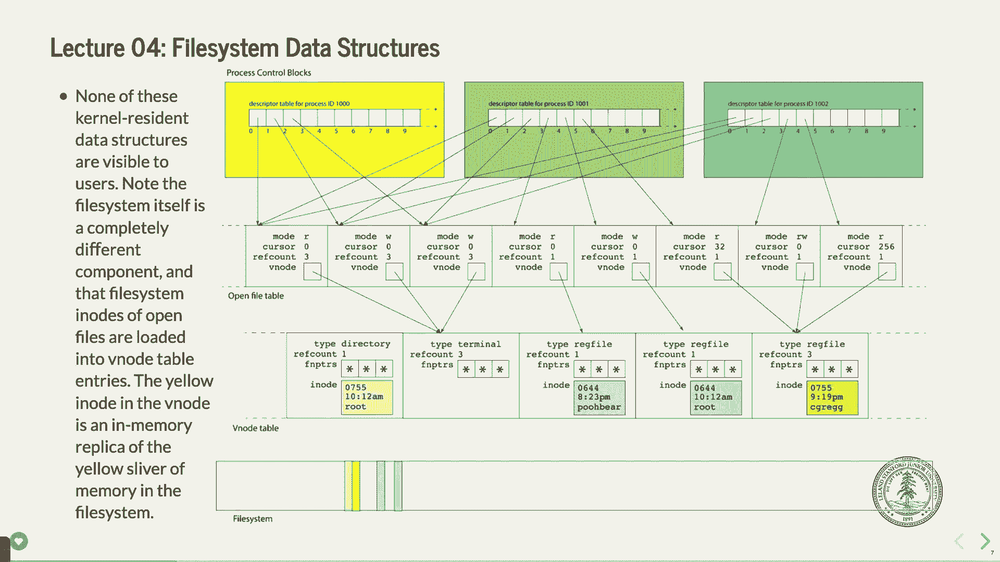
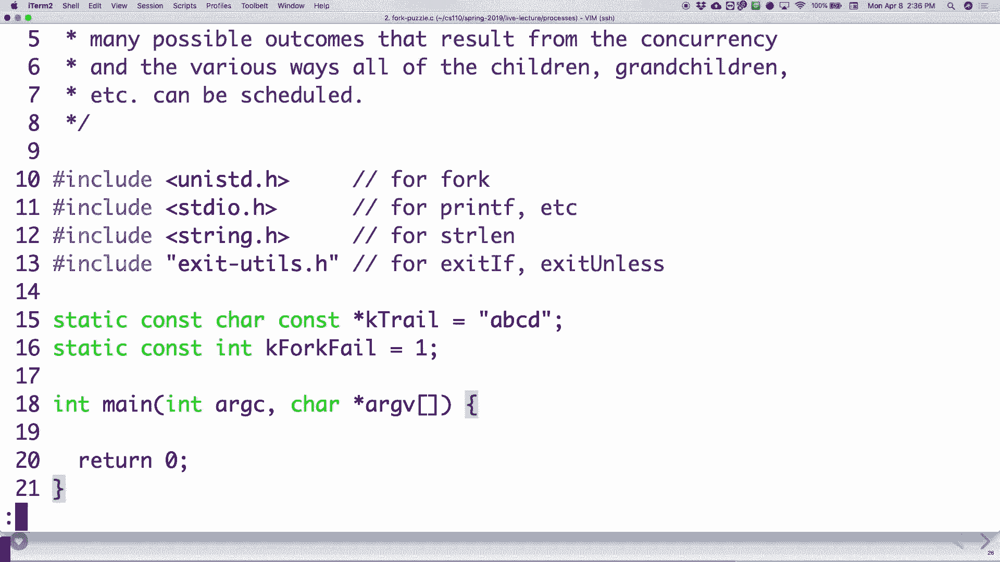

# P4：Lecture 4 Filesystem Data Structures, System Calls and Intro to Multiprocessing - ___main___ - BV1ED4y1R7RJ

 Welcome。 Welcome to week two CS110。 I hope I've already had a nice weekend。 I。

 apologize for the lab sign up fiasco。 It was only half an hour but there were。

 some people who are definitely concerned about getting signed up。 It looks like。

 most people have signed up。 I can tell already that the Thursday times were， pretty important。

 It looks like most people wanted to do the Thursday times。

 But in fact there's still some spots in the earlier time。 There's plenty of。

 Friday times and you guys are signed up for the class during this term so it。

 should be all right hopefully。 If for some reason you are not able to get your。

 laptop in or whatever let me know。 We'll try to figure something else out。 But。

 most part looks like a lot of people got what they wanted and some people might。

 be didn't so just let me know if there's a big issue。 Okay so we are on to just。

 re-plugging my tablet in here because it seems to be giving me fits。

 I'm going to set this works maybe not。 Maybe we don't do this out。 Hold on one second。

 I want everything。 This doesn't work。 It doesn't work。 Okay there we go。

 All right so today we are going to continue with file systems。

 We're going to talk specifically about some data structures that the operating。

 system has set up for the for keeping track of files and for keeping track of。

 your processes as well as it turns out。 And then and remember this is the way。

 Unix does it or this is the way Linux does it。 It's not the way everything does it。

 but it happens to be there Linux does it and it happens to be a pretty good。

 system for keeping track of your files for for what it's worth。 So we're going to。

 do that then we're going to talk about system calls。 We have seen some system。

 calls already and we've used some but we're going to talk about the details of。

 wait what does it mean to have a system call versus a regular function。

 All right and then finally we should have time to start getting into the first。

 kind of whoa this is a different way of programming which is multi processing。

 Okay so I hope I hope you enjoy that part because it's actually kind of neat。

 once you start going whoa that's really I didn't really know you could do that。

 for the program so that's what I think makes makes this stuff fun。 All right the。

 assignment going all right assignment one going okay do Wednesday no there are no。

 extensions of a allowed on no like late days for the first assignment and then。

 the second assignment will be out on Wednesday as well all right come to。

 off-sours we're still having trouble。 Okay so Linux when you run a program your。

 program ends up in what's called a process or it has a process that is。

 basically saying it's given a number and it says this program is running and。

 that's the process but it's running under okay we'll get to the details about how。

 that can change a little a little later but Linux maintains data structures to。

 keep track of these processes of course it does right the operating system needs。

 to know about your your programs that are running and so there's some data。

 structure that it keeps track so it keeps track of all the different parts of。

 all the different things that are associated with your program okay they're。

 called process control blocks okay they're called process control blocks and they。

 have lots of information in them okay and they are stored in this thing called。

 the process table which is organized by the operating system okay process control。

 box store lots of things one thing that they score a store is called the。

 descriptor table and the descriptor table is a data structure that holds。

 information about the files you've opened or the files that have been open。

 for you or the file like things that have been open for you or that you've。

 opened like for instance networking is modeled using a file the terminal is。

 actually modeled using the file you can print to the terminal just like or you。

 can read and write from the terminal just like you read and write from a file。

 that's one of the beautiful things about Unix is they treat everything like a。

 file if you can this turns out but anyway they keep this thing called the。

 descriptor table and each process maintains its own set of descriptors okay。

 which is the things that it has open at the time and we all they always get 0 1。

 and 2 for free those are standard out standard in or standard in standard out。

 and standard error they kind of get those for free okay most often they are what。

 we call bound to the terminal in other words you type something and it goes to。

 standard in you print out something from your program it goes to either standard。

 out or the standard error and those are the normal things now we will spend lots。

 of time in this course talking about hey what happens if we remap standard。

 into something else to reading in from a file or standard in standard or the。

 output of another program we'll talk lots about that as as the course goes。

 goes along okay the descriptors as we've seen you use read write close etc open to。

 actually interact with the files descriptors and then the process control。

 block keeps track of all the different all the details of that okay if you do an。

 open on a file you generally get a very small integer as the file descriptor。

 because 0 1 and 2 are taken and then it just kind of goes up from there and it's。

 your own file descriptors are fairly small numbers generally okay all right now。

 this this diagram kind of goes down many levels here not many a few levels and we。

 kind of understand each little level as we go if the file descriptor if a。

 descriptor is in use in other words it's an open file okay it maintains a link。

 to this thing called the open file table entry okay so if you have a file it's。

 open you've got this thing called an open file table entry which has some。

 details about the file okay it has things like it takes it takes into account。

 whether or not it's a read only file or read write file or write only file or。

 so forth it takes it has and that's the mode part of it it also has this thing。

 called the cursor which just like the cursor on your screen tells you like。

 where in the file you're reading from okay so it turns out that you can do that。

 it also turns out that multiple programs can open the same file and be reading。

 from different parts of it at the same time okay so lots of lots of files could。

 be opened by various different programs and in fact they end up having this。

 cursor saying hey this program is at this point in the file and this program is。

 at this point that's the cursor okay it's also got this thing called the ref。

 count now the ref count discusses how or basically keeps track of how many。

 descriptors across all processes actually refer to that session okay and。

 that's important because if you close the file it may be some other file needs to。

 leave it open or something so it's not going to close it and just has this。

 reference kind of that we will talk about what this other one this v node is in a。

 second but if you were to do something like say open some filing as read only。

 well this is what you might end up with you might end up with mode being read。

 because you've opened is read only cursor being at zero because it was just。

 opened and the cursor is right at the beginning ref count is one maybe you're。

 the only one in the system that has that file open it's pretty likely and the。

 V-Nope will get to in a second okay so that's how that that's how that works。

 all right and in fact this is for process one thousand and one which you。

 can't see because that's way too small but process ID one thousand one later。

 today we'll talk about what process IDs actually are all about all right so what。

 else do we have well multiple and all the different processes on your computer。

 are take each have their own process control blocks and their own descriptor。

 tables but they all point to a common open file table it's actually a little。

 hard to read to I think but that's the open file table and this is where you have。

 all of the details of that that we talked about on the previous page but it may be。

 more than one file might or more than one process may point to it okay now it。

 turns out if you have a cursor like if two files are pointing to if two files。

 are at different places in the in the actual file then you need to have two。

 different things you're pointing at okay but that's the basic deal there's one。

 open file table for all of the final resources and so you can share them I。

 mean if 25 programs are opening a file you want to be able to share them question。

 yes the yellow and the green and the blue are the process control blocks for a。

 process so your programs running it might be the yellow one my programs。

 running it might be the green one and remember we can all log on to the same。

 time we can be running different programs at the same time we each get our own。

 process control blocks for the offer the operating system does it now this is。

 hidden commute by the way it's not like you can go and dig into your process。

 control block the operating system keeps track of that good question any of the。

 questions at this point yeah so a good question how do you keep track of which。

 file has reached which cursor these will actually point to different ones that if。

 they're at different places in the file so then you got I think you've got another。

 one that's open that has a different cursor associated with it that's because。

 you might be reading in different places so you're gonna have two copies of that。

 in that case okay and we'll talk about the Vino does in a second - that's another。

 one all right so we want to be able to keep track of all these files that are。

 shared okay in the case of 0 1 and 2 up here okay this this has a 0 and a 0 and a。

 0 and a 0 that's standard in and they all happen to point down to this first one。

 right here we look down here and then this one's all the way over here and they all。

 point to that one why because they're all reading from the same standard in。

 depending on which program happens to have control of the terminal at that。

 point or the whatever the keyboard is going okay can't type in a keyboard and。

 have to go to two different programs as it turns out okay it's only gonna go to。

 one program basically I mean there's a little more nuance than that but it says。

 basically the idea you also they also by the way all their standard outs go down。

 to this one okay and this one actually is interesting if you if you happen to。

 be running one program and and this is a standard act for like your programs that。

 you want if they offer like one kind of session if they all are printing things。

 out they all go to the terminal so you can run for instance make which you do。

 for your assignments right and make calls g plus plus will make may have some。

 output messages they go to the terminal and so does g plus plus because they。

 share the same file descriptor in that case okay the same they share the same。

 entry in the open file table in other words and that's just so that you can can。

 all they can all go to the terminal as it turns out okay so that's the basics of。

 that well guess what we can talk about these things called a V node so the V node。

 is just a structure that holds the information about the file kind of like a。

 cache and when we say cache we mean a place in memory that is storing something。

 instead of going back to the original location right it's stored in RAM。

 memory and it's very fast and that's what's happening with the V node here okay the。

 V node is basically saying it's basically storing the details about what kind of。

 file it is a regular file as a directory etc it also stores the reference count。

 how many things have this file open and then it's stores a bunch of other details。

 needed to actually access the files a bunch of pointers and then it stores a。

 copy of the i node which we talked about last week which is the information about。

 a particular file so if a file is open you don't need to go back in if you want。

 to read from it or go back in and go and try to find it again in the file system。

 you've got the information about the i node right there okay so that's the details。

 and this gets updated as the file gets written to and so forth but and then that。

 gets that gets pulled in so those are the levels of the data structures that the。

 operating system and your program keep track of in order to in order to keep。

 track of what files we have open yes why does it store the ref count in two places。

 that's probably a good question it may be depending on who's reading it when or。

 which part of the which part of the opposite reading it when it'll go to。

 either the it'll go to either V node or the open file table entry I'm not sure。

 why it does go but if they should be I think they should be locked up yeah。

 if you have different if you have you mean like this one might this one might。

 also point that would be a bad example of one but that might also point there。

 yeah so the ref count down here is how many of the open file table entries。

 point to that V node like you could have the same file open in two different ways。

 okay because of you've opened and and that's I think that's the answer there。

 question it is a copy from the disk yeah this let me show you the next one right。

 here not the next one I'll get it I'll get to it what it basically does that just。

 reads it from the disk and then stores it in memory so you don't have to go look。

 it up again on the disk just faster that way faster you can do that the better if。

 you're you're dealing with things like memory， that's a good question the question is is the open file table sorted in any way。

 no it's not sorted in any particular way you basically keep links to it it's not。

 like you're searching through the whole thing to find thing generally you have a。

 like if your process opens a file it this green process might open this file。

 well it's got a link right there and it knows how to search that very quickly。

 and then it'll find here and then this might point to a V node that'll be so。

 it's it's not slow process not and the things aren't giant either there might。

 be thousands of files open but honestly thousands is small and computer speak so。

 it's not a huge huge amount other questions right so this is a good。

 question I should remember the answer the question was hey if I'm started if I。

 read from some file with this one another file is also pointing to it at the same。

 time which cursor is getting updated I believe it may actually create a whole。

 new entry in that case if it needs to have different cursors in different。

 places like if if one if if it's if it's reading through it needs to know where。

 it's reading from and so I think there's another one that created I'll look at it。

 I'm not a hundred percent sure and where that one differentiates yeah anybody。

 else okay let's move on to another one here okay um there well I've already kind。

 of talked about this there's one system wide V node table basically because。

 everybody has to share these things because you don't want to have them all。

 independent if you can help them help that okay it's kind of like an alias it。

 says hey look somebody's opened this file why keep multiple copies of it for。

 each person that's or each file that's opened it let's just keep it all in one。

 place and then there's some coordination that has to go to deal with the cursors。

 and so forth all right and like I said the well first of all none of this is。

 really available to you just as the user the kernel keeps track of this you。

 don't really want that by the way I mean you don't want you as the user to be。

 able to walk through the open file table and see other people's files and what。

 other programs have files open or be able to change any details about that so。

 you want that to be somewhat secure and then this little i-node is and this is。

 basically separate from the file system by the way the file system is kind of on。

 the disk and you keep a copy in memory of for instance this little yellow i-node。

 slice in memory okay and I'm not I'm not 100% sure when that actually gets。

 updated so but it like it gets modified that probably propagates through at some。

 point but it may not be immediate depending on the file system you're using。

 okay so those are the big things now if you read the not the big textbook but the。

 smaller textbook the one that's online this is all laid out in that pretty。

 explicitly as well so if you need more details about it go with that all right。

 that's file systems like more details about that let's move on to system calls。

 this is where some interesting things happen system calls are as I've said。

 I've said this a number of times system calls are the way your program interacts。

 with your hardware and a network and things that are probably not so great to。

 have your program directly accessing why because you guys are mean and would。

 write malicious programs right like that's the basic idea this didn't always start。

 this way Unix when it first started out you it was a very open sort of system。

 and everybody it was in a research environment nobody was gonna go muck around。

 in somebody else's files but when they when it started getting more and more。

 and more users they realized hey we better figure out how to make this so。

 that there's good security and a system call is the way that works okay so we've。

 seen some system calls already we've seen open and read and write and close and。

 stat L staff there's all system calls okay we'll see lots and lots of more。

 system calls because remember this class is all about interacting with the。

 operating system and the functions are different okay we write functions or you。

 wrote some functions for 107 or 107 e that would have gone into let's say Lib C or。

 just your user functions or lib standard C++ system calls have to be。

 privileged okay they have to access their own data structures that your。

 program shouldn't have access to and they should be able to be partitioned off。

 from the rest of the user okay and so that's what you really want to be able。

 to able to do okay open needs access to the open file descriptor table and well。

 or the open and you don't want to be able to make the user have access to that okay。

 in other words we shouldn't be able to get access to privileged information yet。

 we still need to be able to open and close files okay so that's the bottom。

 line up so we need to have a different call and return model now if you took CS。

 107 or CS 107 e you'll remember that each process or maybe you don't and maybe。

 this was never explicit made explicit to you I mean 107 e those you took that it。

 was pretty straightforward that the one program that was running has access to。

 all of the memory in the system for 107 or for 106 B or whatever you run a。

 program it thinks it has access the entire system memory okay your program as far。

 as its concerned can write and read from any part in memory now you can get。

 segfaults and things because you're not actually given that from the operating。

 system you can't just willy-nilly do it but that's the operating system saying。

 look here's your portion but in the bigger picture it's not like if you were。

 able to access a different portion of memory some other program would be also。

 accessing it your program thinks it has all of memory this is going to become。

 very important in a few minutes but the 64-bit address space first of all it's。

 gigantic okay two of 64 is a very very very big number and as in the way the。

 operating system in the hardware works it like I said makes it seem like your。

 program has access to the entire memory system but it really does it this is a。

 virtualization layer what happens is you've got virtual memory which is the。

 addresses that your program thinks it's writing to and then that gets translated。

 into what we call physical memory which is the operating system in the hardware。

 saying okay this program actually has the memory here and this program has the。

 memory up here even though they both think they're writing to the same place okay。

 so so it turns out that you can you can do that I wanted to show you an example。

 of that so I wrote a program and I was going to run it in two places at the same。

 time and show that it was the same memories place but it turns out that they。

 that the operating system plays some games for that so it doesn't ever put the。

 same one even nearby it probably would if you if you if you tried to get a huge。

 amount of memory but but for you know for the purposes of this I couldn't quite。

 demonstrate it because the it was also a security measure - by the way I don't。

 know if you remember from CS 107 if you took that when you run a program the。

 stack ends up at a slightly different place and there's these canaries in there。

 that say whether or not the stack gets overwritten by a malicious user or。

 something those are all security issues I think it's the same same sort of thing。

 but anyway no process uses all to hunt to the 64 bytes okay most programs use a。

 very very small amount okay all right that's kind of the setup here there are。

 lots of different segments in the memory system you talked about some of these in。

 one oh six or one or one oh seven or one oh seven e you've got the stack the stack。

 is where your user program keeps all its local variables keeps its arrays and。

 keeps its kind of local data for functions the stack also is where function。

 calls get pushed on to all the data for function calls get pushed on to and you've。

 got the function calls the function calls in order on the stack okay you've also。

 got the heap you guys wrote a heap allocator and heap allocators get memory in bigger。

 chunks generally and that's a different portion of memory there's also the code。

 section or also called the text section that's where your code is held okay。

 there's a data section which is which has part of the data for like global。

 variables things like that okay and the this this whole thing is managed basically。

 by the operating system for your process okay the operating system says here's。

 some memory for your process here's your stack here's your heap here's the data。

 here's the code go and it's it could look a very similar program to program but。

 again it's kind of abstracted a little bit away okay all right there's other。

 segments that you may not have talked about okay there's the shared 107 e。

 definitely talks about this there's the shared library portion and the BSS。

 portion and the read only data segment those are all segments that they're。

 specialized uses read only data as you can imagine is read only data you're。

 only allowed to read to it you're not allowed to write to it they've got the。

 shared libraries if you have a function like printf right if you have printf。

 well there might be many many many programs all using printf at the same。

 time to print out the individual terminals well why duplicate that code。

 for every user just put it in one code location and have that user or have the。

 user jump to that code location and run the shared code that's a good way to。

 save some memory okay and that's the way shared shared libraries work okay all。

 right so how do programs do function calls you should maybe remember this from。

 107 you have a stack pointer right and you have all these other registers in。

 here as well okay to call a function what do you do well you put a bunch of data。

 inside the registers rdi rsi rdx hopefully this is me。

 so it's up to some of us coming back to you from 107 right our CX etc if you run。

 out of registers in other words the one two three four five six you start putting。

 them on the stack and there's a very well defined way of doing that okay and。

 again this is some people decided hey this is the way it's gonna be so this is。

 the way we're gonna do it it's not like this is some come down from high sort of。

 you have to do it it's somebody decided this and said that's what we're gonna do。

 the first the first parameters always gonna go into rdi the second parameters。

 always gonna rsi etc okay and then you do this call queue or call。

 assembly instruction and that jumps to the program code for your for your other。

 function in your own user's base and then it does the call and then you do a。

 return and it comes back that should be relatively familiar okay from doing。

 107 or 107 E although in 107 E you didn't have these register names they were。

 nice like R0 R1 R2 here there there are these these historical names from x86。

 days the original x86 days okay so that's how function calls work well what's。

 the the big deal with that well this does not encapsulate the memory that we use。

 in other words it doesn't hide that memory from anything else okay if you。

 have your let's say you have your main stack frame here okay and then you call a。

 function just a regular function called load files well that's gonna go on the。

 stack okay and then you do your IF stream or whatever that might go on the stack。

 and then that's gonna call other like read and write function system calls but in。

 this case remember from 107 where you did all that like sneaky stuff with I。

 don't know if you still do this with like ATM machines and trying to pack in and。

 whatever because you can go and you can you can go and modify your own stack and。

 whatever you can do that but that's not very secure okay in other words its。

 privacy is not the prime concern here basically they're saying look if you own。

 the stack for your program sure you want to muck around in your own stack go。

 right ahead who cares you might crash your program or you might modify something。

 for your own program but it doesn't matter right that doesn't matter it all。

 the things change everything changes when you all of a sudden have to go to when。

 you have to go to the system and get information from the system okay so now。

 we get to system calls well system calls okay like open they as we said I said。

 a hundred times already they shouldn't be exposed and they are need to be stored。

 in a region of memory that your program does not have access to okay it can't be。

 a shared library it can't be something that your program could actually code。

 that you write modify just shouldn't be allowed okay so what do we do well we。

 break up the memory diagram into a space that has the kernel stack in it okay you。

 are not allowed to write to there and if you tried to the operating system would。

 stop you anyway okay but the kernel stack resides in memory but your programs do。

 not have access to that okay you basically have to tell the operating system hey。

 I am about to do something or I want you to do something for me that involves。

 something I shouldn't have a direct access to okay so it needs to be in a。

 region of memory that the user can't touch and it needs to be executed in a。

 privileged what we call super user mode okay so that that mode can have access。

 that this is not your code anymore okay it's the code that's owned by the。

 kernel okay the kernel owns the that code and you have to say to the kernel。

 hey go do this for me okay it's called kernel space and it's got the stack。

 segment and it's got its own instructions as well okay we can't use call queue any。

 more to do this okay because the minute we use call queue that stays within our。

 own address space we could we could do that so we need a different way of doing。

 it what is that different way well that different way is to do a thing called a。

 sys call and it's an actual instruction I'm going to show it to you in a second。

 okay and what it is is you place an opcode in other words an operation you。

 want to do all the operations that are the system codes have and have a number。

 associated with them if you want to read you've got one for the operation code if。

 you want to write it's to open happens to be three we'll see that in a minute。

 open is three etc okay they all have their own opcodes that are based in the。

 kernel defines them okay and then you place arguments same as before you place。

 them in a bunch of registers now it happens for some reason it goes RSI R。

 DIRS R DX R10 instead of RCX I don't know why that's changed but some other。

 reason for that not important for this class at all but that's that's the way。

 that goes and then what you do what you do is you perform what's called an。

 interrupt one or seven E folks you'll know what interrupts are but an interrupt is。

 basically saying hey operating system stop my program and handle this and the。

 operating system goes oh okay your program is not gonna be stopped and then。

 I'm gonna go do I'm gonna look at the registers and do whatever you want and。

 then I'm gonna start your program up again that's basically what an interrupt。

 is doing it's interrupting your program until whatever you're asking get to get。

 done gets done okay we're gonna see that a lot in this course of your program。

 waiting around for something else to get done being in some sort of interrupted。

 state or sleep state or something like that okay so you put all these things in。

 the in the registers you do this cis call it handles it and then it returns back。

 to you with the result as you might expect in our a X except for a couple。

 things there's a question oh such a good question the question was yeah this。

 question was what happens if you have more than six arguments you don't there。

 are no system calls that are that have more than six arguments in them that's by。

 the rules because of that exact reason you don't have access to put them on the。

 stack so they they get put in the just in the registers you have and no system。

 calls need more there are there are ways of getting around that by the way you。

 can but but in general there are no system calls that have more than six other。

 questions yeah yeah let me talk about the interrupt handler good question the。

 question was just like what's what's the steal the interrupt handler it's。

 another function that's actually in the kernel space that runs and that function。

 goes okay now I'm in kernel space on the on the kernel I get to do and I get to。

 access all things you can't affect that function at all but you can call it and。

 that didn't calling it through the cis call method that we have here that's。

 how you do it so what's the bottom line on that this is how you tell the。

 operating system please do something for me because I'm not allowed you're not。

 allowing you to do this system calls or wait the way you do that and then there's。

 some some details about what happens if you return to the regular function and。

 there was an error if you if you have a return value that is negative what it。

 does is it sets the error number or air no which is that global variable to the。

 positive value of that negative value why that's just the way they've done it。

 and then you update r a x to actually contain negative one so if you do a。

 system call and you get back negative one you know that you've that you've got。

 an issue and and then you go and check the error number okay yeah air number。

 air number air no is per process yes it's part of the sea library yes。

 yes so when you call the when you when you do the interrupt the current knows。

 that your process is the one that in a yeah and it knows where to find those。

 details good question anybody else all right so that's how system calls work。

 I'm not gonna ask you too many more deep too many details about this I'm not。

 gonna certainly not gonna like make you do any assembly coding or anything like。

 that for this but I do want to just show you what happens when when you do。

 this remember the copy function that we had the copy function opened up two files。

 opened up a file to read from opened up about the right right to and then。

 copied all the data out of one into the other let's look at that in gdb and let's。

 actually let's see let's stop it on line 19 we'll break on line 19 and we'll run。

 the program okay whoops I gotta run it with let's say copy that see to copy copy。

 dot see okay all right so now we stopped online 19 we're about to step into the。

 system call if I do yes to actually step into the system call you'll see that it。

 goes into cis call template we haven't quite called the actual system call yet。

 because we have to do the setup in other words we have to set the we have to set。

 the parameters and we have to actually do that cis call but we can do disassemble。

 here and we'll notice that you have things like the a couple things going on here。

 that this is not really that important but it's gonna move some of some detail。

 like move 0 to remember I said open was 0 to for the。

 operation code well there goes right there okay and and I think I said our。

 DI is the where the actual name of the pro the first argument remember open here's。

 what open looks like it is let's see let's just list 19 again whoops。

 list there it is so that's the open call is our V1 which I type is copy dot see。

 okay is there all right so let's actually do this let's do this for I。

 - or if you this will actually list all the different instructions as I'm going。

 through it let's step into the instructions one at a time okay it's gonna。

 do a couple things that aren't that important but then it's going to move。

 0 to which is the opcode into a E ax or our ax and then it's gonna do the。

 cis call okay and it's gonna do the syscall so if we look our AX is going to。

 be to well that's the opcode for open if we print out our DI let's cast it to a。

 char star our DI it should be there we go copy that see okay so it's done the。

 setup and it's about to call the function for us okay and do the system call now。

 you might ask you oh great can I step into the system call kind of impossible。

 to step into a system call because the operating system is running your program。

 which is running GDB or I guess it's running GDB which is running your program。

 and stepping into the operating system would mean trying to like stop the。

 operating system and it just wouldn't work it turns out it would be impossible。

 to if you want to debug a kernel you actually generally have to do it from。

 another computer that's talking to the other computer basically through like a。

 connection of some sort it's tricky to debug a kernel because it's got to be。

 running and you can't really debug it that easily or put it in some other。

 virtual machine or something like that so anyway if we let's just actually do S I。

 see what happens it actually jumps it actually let's see I believe it jumped。

 back oh yeah jump back to our thing if we finish let's do p。rax yeah we had a。

 positive return value which is going to mean there was a success in that case。

 okay so that's how that's how system calls work it's kind of like calling a。

 function it's just you don't say call you say syscall which stops your process。

 and turns over to the kernel okay well questions you have about that system。

 calls okay relatively straightforward I mean that shouldn't look too new to you。

 just know that most of the functions we're going to use our system calls because。

 of the type of class that this is okay here's the summary summary is we use。

 system calls because we don't want the user to have access to sensitive parts。

 great we can't do that using our regular function call why because we own that。

 memory we're allowed to touch on that memory so our code is accessing things。

 that it shouldn't be that would be bad because we could be malicious okay and。

 then the way this happens is through an interrupt called syscall and that stops。

 your program transfers over to the operating system and does that and then。

 once the kernel is running it's in control does the opening closing reading。

 from a disk whatever and then afterwards it returns back to your program okay all。

 right what questions you have about those right now system calls anything else。

 okay again this is this is in the this is talked about in the in the book in。

 fact I think it's talked about in the bright you know how how how her hand book。

 as well okay let us move on to a fun topic called multi-processing okay so far we。

 have been talking about programs that ever since 106 a 106 B 107 generally your。

 programs are running a single process okay a process that is going along and。

 might be doing lots of things but it's one process at a time okay it used to be。

 that one process was all computers could actually run anybody know what。

 computer that one is on the board says it on there you kind of ABC it's an IBM。

 personal computer from about 1981 this was actually the computer I took to。

 college it did it did not have a hard drive in it like I said and I said the。

 other day it had a maximum of 640 kilobytes of memory which is not that much it， ran at 4。0 4。

77 megahertz your computers these days run at giga hertz so。

 it was relatively slow but it actually had one process available at a time you could。

 run one thing on to the time and that was all you got now along the way。

 somebody some clever people did write a program or some various programs that。

 allowed you to kind of do multi processing but it was very rudimentary。

 and it crashed a lot and it was didn't it didn't work particularly well and。

 your computer the computer was slow enough that doing multiple things at once。

 didn't really make sense anyway okay well these days we have really fast。

 computers okay we have computers that are giga hertz and that are running really。

 at very high frequencies okay and so we want to be able to run multiple programs。

 at the same time okay this is called multi processing all right and you will。

 tell your computer to do things concurrently in other words you're gonna。

 write a program and it's gonna be doing two different things potentially。

 exactly the same time that's kind of interesting okay I think that's that's。

 very interesting what we can do to show you a little bit about the process on。

 the computer in fact I will pull this up here let's see processing okay we are。

 gonna open up I think we're going to open up get PIDX。c so when your program is。

 running as I said before we kind of talked about this a couple times it has a。

 process ID associated with it it is a process and it has a process。

 identification identifier associated with it okay and we can actually get the。

 identifier if you want by doing the following PIDT PID equals get PID okay。

 PID underscore T is just an integer okay you're all why don't we just call。

 it integers well they wanted to make it its own type it's just typed after to an。

 integer okay you can do that and then you can say print F my process ID percent。

 D it's just an integer PID and return zero and that should do it except for I need a。

 semicolon after that there we go okay make get get PIDX okay get PIDX。

 process ID was 15，787 great process ID 15 788 process ID 15 789 now if I wait a。

 little bit right if we wait a little bit it's probably not gonna be 90 but it is。

 in that case okay so sometimes there are lots of other processes being。

 started and stopped on like myth 55 right now that will probably start going。

 up in in order let's see if it goes up there we go we got a few more that kind。

 of started up in there right but but but that's what that's what episode。

 you're just given a number when your program's running and that's your。

 process ID okay all right the process ID allows the operating system to keep。

 track of you so that know it can use your process control blocks and it can do。

 all that it can use your process ID number to say you get to run for a chunk。

 of time and then some other program gets to run for a chunk of time and this is。

 why I can move my this is why I can have the program my program running and I can。

 also do things like right on the board while the program is the other program。

 is running in the background the operating system is fast enough that it。

 allows your computer to seem like multiple programs are running at once。

 most of the time there there's only one thing running at a time except for the。

 fact that your computers these days all have multiple processors in them and in。

 fact the myth machines all have four or eight different cores in them which are。

 individual processors which means they actually do run more than one program。

 at a time okay you can actually see this if you go to I don't think they have。

 this I think I installed this but we can we can do it but if you type H top okay。

 what H top does is it gives you a list of all the different programs that are。

 running on the system from all the other users to and you think wait a minute I。

 can know what other users are running you can as it turns out that's not hidden。

 from from you and it also in fact this myth machine has eight different。

 processors here and you can see them all running nobody's really doing anything。

 right now like this myth happens to be very not busy right later in the quarter。

 will be in class and we'll look at this and it'll be like going crazy because。

 some 107 assignments going you know they're doing some crazy things or whatever。

 okay but that's what's going on here you can actually look at this and it tells。

 you what percentage of each processor is being used most of the time it's pretty。

 idle but right now not much is really going on okay so that's it that's what。

 processes are okay and like I said your computers these days have multiple。

 processors which means they can run multiple programs at the same time。

 literally it's not just time shifting or time splitting between the each process。

 it's literally two are running at the same time okay we'll see how this becomes。

 important very soon okay so we have a new system call okay the new system call。

 is called fork and it's obviously it's I mean kind of like a fork you eat from。

 but it really is like a fork in the road okay this when we say fork what fork does。

 is it says the fork is a system call that allows you to create a new process。

 from your program so that now your program is going to literally go down to。

 different code paths the exact same time okay that's what fork does did you have。

 a question okay so this is what fork actually does okay we're gonna see why。

 that we might want to do that you might be able to start thinking about why you。

 might want to do that but it's but for for the types of programs we're running。

 in this class multiple processes become very important here's what fork does and。

 this is a little subtle and people always tend to forget this so I'm gonna。

 explicitly say what it does fork creates one more new process okay you've already。

 got a process fork creates one more process that's a lot of people for some。

 reason last quarter thought that it created to it does not fork creates one。

 and now there are two if each one of those forked right now there would be。

 four right because each one of those creates one more and then there's a。

 total of four etc but your process if you fork it creates one more process and。

 that is called the child process because the parent is the one creating it okay。

 and the fork call by the way the child and parent and this is the most。

 interesting part about it they both start executing on the next line after。

 fork it's not like you fork and the one the the child goes off somewhere else it。

 does this in the probe probe the parent goes off no no they both go to the next。

 instruction and now you've got two programs two processes running the next。

 line in your code which is kind of interesting you'll see how it works in。

 a minute okay fork returns a PID T or an integer but it's only kind of a PID。

 okay here's how it goes the parent when there when you call fork the parents。

 return value is the PID of the newly created child okay so you create a child。

 it's a new process it gets a process ID the parent gets that written in return。

 okay so the parent actually can keep track of all its children that it creates。

 you can fork multiple times by the way so you can fork and you get back the the。

 ID of your child that you just forked the child gets back zero right the child。

 gets back zero if the child got back its own PID it wouldn't make much sense because。

 then it wouldn't like you wouldn't be able to differentiate between the child。

 and the parent if the parent got back the child's PID and the child got back the。

 parent's PID how do we know who's who we still can't make that decision right so。

 the way it works the parent gets back the child PID and the child gets back zero。

 which means you're the child PID okay you are the child now look if the child。

 wants to get its own PID great it can it can call get PID but the return from。

 fork is zero if it's the child process that makes sense this confused people for。

 like for a while in other times I've taught this not not exactly sure why so。

 I'm being very specific oh good question if you're in the child。

 process you can do get P PID to get your parents process if you want yeah and。

 this is a good this is good if you want to be let's say sending signals back and。

 forth between the parent and the child we'll talk about that later in the course。

 okay but yes you can if you want to you don't get it for this by default in fact。

 it's most often that the child could care less what its parents PID is it turns。

 out but you can get it if you want to okay now here's the other interesting part。

 about this all the memory between the parent and the child is identical I can't。

 draw the straight line at the bottom of this tablet all the memory is identical。

 but it is not shared okay so I create an integer int a and then I fork right on。

 the next line the parent has an integer int a the child has an integer。

 int a the parent let's say the pointer to the parent's version of a is 0 x 1 2 3。

 4 the child's version is 0 x 1 2 3 4 the pointer to that if the child changes。

 a the parents does not change how does that work any ideas yeah exactly the。

 answer was it doesn't it's not really the same exact memory they are now they。

 are now separate memory but they think they're the same part of memory now what。

 it does is you think wait a minute if I have a huge amount of code and I fork。

 isn't this gonna be really slow because it's got to somehow has to copy all the。

 data from like the parent to the child it does this thing called copy on right in。

 other words the operating system is clever enough not to make any copies。

 until either the parent or the child changes a value so it's kind of shared in。

 the sense that the operating system is keeping track of it all but the instant。

 you change a value in one in the child of the parent it is not reflected in the。

 opposite the child be your parent if you're the child not reflected you make it。

 the operating system makes a copy of it is okay great now you have your value and。

 you have your value okay it's a very interesting interesting concept as it。

 turns out it's right they did this for lots of reasons they did it so that they。

 can make it so that programs can go to the next line and not worry about any of。

 the data and they also did it in the way they did so that it's fast so that's。

 kind of me okay what questions you have on that how fork works yeah。

 good question so we're gonna see actually we're not quite gonna see exactly that。

 but the question was what happens when the parent process is terminated the。

 child process keeps going yeah process child process keeps going now it turns。

 out that you might end up going back to the terminal because your parent is。

 what's running in the terminal and the child process might end it sometime later。

 after you type some other command or whatever so it's a little bit but of。

 course we have a way of dealing with that which we'll talk about like how to。

 make sure that your parent doesn't end before your child does and so forth but。

 that's it the other interesting thing about it although not particularly。

 relevant is that if the child or if the parent ends the child's parent now becomes。

 root actually which is like the main underlying process doesn't have a parent。

 anymore parent died unfortunately sad but that's that's the way that goes good， question yeah。

 Oh sure yeah this is the question is look if you wanted to pass along the。

 PID to the child you could call get PID before you fork save it in a value and。

 then it's available later sure or the child can just call get PPID which is。

 get parent PID so either one but yeah there's there's ways of doing that there。

 is there are ways of sharing data by the way but we're not going to cover that。

 really in here you'll see one example in a lab about sharing data but most of it。

 is not most of it doesn't need to be shared as it turns out I asked it we asked。

 a pretty good in my humble opinion question on the final last quarter where a lot。

 of people thought oh no we have to share memory but you actually didn't have to。

 as turned out but so you won't really be responsible for doing much of that okay。

 all right the reason the parent the child get these two different term values is。

 simply to differentiate them okay the first thing you will often do in a。

 program is if PID equals equals zero do this because I'm the child oh else do。

 this and that just says okay now I've got two of the process going in different。

 directions so that's generally what you do sometimes we want them both to do。

 exactly the same thing for various reasons but most of the time we do want。

 to make a decision say look if I'm the child I'm gonna go down this path if I'm。

 the parent I'm gonna be on this path they start at the exact same point though。

 right so that's the difference there all right so let's look at a program okay。

 we're gonna we're gonna write another program called basic fork oops oh no I've。

 done it again hang on there we go cursor there we go okay basic fork dot no not。

 not the binary how about dot C there we go okay so what we're gonna do in here。

 okay is we are going to actually just print out greetings from a process and。

 then the per parent of that process okay so that's what it's gonna look like。

 there okay and then we're going to call fork okay and we do a little bit of error。

 checking if the PID is negative one it means the fork failed why would a fork。

 fail maybe the operating system ran on memory or some other thing happened you。

 will almost never see that actually that's not true you will see that if you try。

 to do thousands of processes your program is limited at least on our system。

 to about a thousand maybe a thousand twenty four different process so if you。

 tried to do forking such that it just kept creating many many more processes。

 you get limited about a thousand twenty four there's a thing called a fork bomb。

 which would which is where you just basically try to just do as many if you。

 do kind of recursively call for or you call it a loop or just everybody forks。

 and it just uses up all your processes this is why they had to limit it because。

 you could take down a system by doing the fork bomb which is very easy to do as。

 it turns out but anyway you were gonna check it there and then we're going to。

 print out buy buy from process your the process that we are going to get from。

 calling get PID and then we're going to also print out the parent process okay。

 everybody see how that's gonna happen remember by the time the program gets to。

 this line here there are now two processes going the original parent and。

 the child and that's the difference okay now we haven't done any checking to see。

 who's the parent the child we don't really care for for this for this one。

 right now okay make basic fork it's already done yep okay basic fork and。

 there we go all right greetings from process 26385 with parent 2892 that's the。

 shell as it turns out okay and then it says buy buy from process 26385 with。

 parent 2892 because it ended and then it says buy buy from process 26386 which。

 has parent a parent of 26385 and that is the parent that created okay so we can。

 run this a number of times again you probably will not see this with this。

 tiny little program but it turns out that the ordering of those two final lines。

 completely arbitrary okay why because who knows who gets to go next a parent of。

 a child it is completely arbitrary and non deterministic this is the problem。

 this is one of the harder parts about this class is that you're not dealing。

 with non-determinism okay debugging some of these things is very tricky if you。

 don't if you don't have a real clear idea of what you're expecting because you。

 can run a program two or three times in a row and it can come out absolutely。

 different each time but still be perfectly correct okay so that's a little bit a。

 little bit tricky to deal with sometimes question good question that was a very。

 good question why didn't the print-off statements like bang into each other and。

 print out like that so print F actually has some buffering in it and the way the。

 print-off function actually works it's going to generally keep like one call at。

 a time is going to get through and it will print all the way to a new line now。

 you are printing multiple things at once and some other person's printing multiple。

 things at once they might get interlaced but one line at a time not gonna get。

 interlaced good question though yeah you will see some interlacing but not not。

 one line at a time generally yeah when we get to C++ using C out。

 Jerry Kane actually created a library that makes it so it doesn't do that and。

 C out either which is nice yeah yeah so this is a good question the question was。

 wait a minute when the parent process that when when you do four like one's。

 going and the other's going maybe maybe not at the same time okay two。

 different processes now the operating system treats it just like any other。

 two different processes if there's only one processor available the child gets。

 to run for a little time the parent gets to run for a little time the child gets。

 run for a little time the parent gets run for a little time and it's just shifted。

 back and forth if there's two processors it actually could be that both are。

 running on their own processor at exactly the same time literally the same time。

 yeah but that's the that's a different there so the operating system is taking。

 care of that and saying great now even other process I better time slice it so。

 it gets a little bit of time to keep running yeah we're gonna see lots of。

 those sorts of examples as we go along okay all right so that I just showed you。

 the output of this the as I said the original process has its parent being。

 the shell and then this is non deterministic so we have to be a little。

 careful of that when we're writing these programs because you can't。

 necessarily predict the order question yeah anybody else I'm sure you have lots。

 of questions on the stuff as we go a little bit farther okay fork is called。

 twice are called once fork returns twice right it returns to your program twice。

 in two separate processes okay as I said all segments of data are。

 faithfully replicated all right the heap is replicated pointers are。

 replicated file descriptors are replicated which is interesting it means that as。

 it turns out if you have a fork after you've opened a file and they both try to。

 read from the file the first one to read gets part of the file the next one's。

 cursor is actually moved over and gets more of the other the rest of it so it's。

 actually duplicated at that level as it turns out okay the we will talk about。

 how to deal with open file descriptors as we go along as well okay what else。

 any other question on that all right now like I mentioned debugging this is a。

 bit tricky you might want to say you might be saying yourself hey how do I。

 actually go and debug this stuff well it's a little tricky you can do it in。

 gdb I've given you the commands here you can go look at the actual you can go look。

 at the actual code to do to kind of the gdb trace if you want to I'm not going to。

 go over that right now but you can say for instance set detach on fork to off。

 basically what it normally does is gdb if you have a fork it just lets that child。

 go and it continues with the parent and the child processes on its own if you。

 set detach on fork off what it does is it actually goes down the path of the。

 child gdb keeps track of the child process you can do these things you can。

 do this thing called info in theoryers which is the two different all the。

 different processes it gives you a list you can switch between them if you want。

 to that's that's down here and you can also say oh if I'm going to continue I'm。

 gonna continue one of the processes and then start debugging the other one you。

 can do that I would say most people probably don't get to this level but if。

 you want to and you're milk and you're debugging you and I really can't。

 figure this out this is how you would do it okay it's not not that often that you。

 do that but just know that it's there in case you go ah I have to go debug this。

 and gdb I have no idea how that go look at the trace and you'll see how to do it。

 okay all right like I said the only real difference is the process ID and the。

 return value from fork okay you get a new product you get a different process。

 ID if you're the child from the parent and either return value from fork is is。

 different okay parent gets the product PID child gets zero not its PID but that's。

 how we differentiate it from the parent okay and that's how we make them go in。

 different directions if we want to okay let's see another difference oh let's。

 actually this might be a duplicate so I hold on no not really it's kind of got。

 the it's replicating much information but there's no like I said there's no。

 default sharing okay you can wait in the parent we're gonna get to that in a few。

 minutes where you can say hey I want to wait for my children in fact we're gonna。

 talk about that for much like for much of a multi processing material we're gonna。

 talk about hey how does the parent wait for all of its children appropriately。

 how does that work we're gonna get to that you can't wait for your parent as it。

 turns out not really allowed the way it goes why I don't know they built it that。

 way you're not really allowed to wait for your parent turns out when a child。

 process ends the parent can get notified or the parent can wait for that but it。

 doesn't go the other direction I'm not exactly sure why but that's the way they。

 that's where they built it all right let's look at another program okay we're。

 gonna look at a little program of a tree of forks okay a tree of forks I think let's。

 see is this the one is it hang on oops there we go。

 there we go let's let's look at the see if we're gonna do which which one we're。

 gonna do we want to look at well let's just look at it here and then I'll go。

 run it as we go here's what this is gonna do okay this is going to basically do a。

 for loop around a bunch of fork calls okay so what we're gonna do is we are。

 going to basically have a string called K-trail okay and we are going to find。

 how long it is we're going to loop through all the letters in that string。

 or all the characters in that string we're gonna print them out at one letter。

 at a time but in the meantime we're going to fork okay and then in this case it's。

 an assert that just says look at the PID is assert the PID is greater than equal。

 to zero which would make it so that if anything failed it would crash the program。

 or stop the program and then it will keep going down okay what do you think is。

 gonna happen here if the string is ABCD oops if the string is ABCD what is going。

 to happen in here the first thing is gonna happen is what it's gonna print out。

 okay and then we're gonna end up with here's the parent we're gonna end up with。

 a child process okay and then the for loop is going to come back here remember。

 it's going to the same it's got the same value of I it's got the same value for。

 the string and same value all that okay but now there are two things going through。

 here I is going to be incremented to one okay and then it is going to print。

 what from the child be and then what's gonna get printed from the parent be do。

 we know what order that's gonna happen we have no idea but it doesn't matter because。

 they're both big right but then what's gonna happen with the parent the parent。

 is going to create a child and the child is going to create a child and then。

 everybody is gonna go back up here and that they're all gonna be on see now how。

 many versions of see are we gonna get four one two three four not necessarily。

 in that order and then all four are gonna each create another child and。

 another child another child another child they get all and they all create a child。

 how many different D's are we gonna have eight different D's let's try it okay。

 let's try it I have to figure out which program this is because I think I forgot。

 which one is we are gonna look for trail length hang on trail like start a see。

 fork puzzle that's the one okay let's see fork oh no hang on in for might might not。

 be actually written oh it's not written hold on copy for I have I have written。

 original let's see to fork puzzle that see okay yes make for puzzle okay okay okay。

 ready a B C D A B C B D C D C D D oh not the order we necessarily would have。

 hoped for right it's not one a two B's three four C's eight D's but there are。

 that many right one a I see one a one two let's see two B's one two three four。

 C's and then eight D's I assume okay all right let's try running it again oh。

 what happened there why do I have my come my line here and a D way over here any。

 ideas what's up the parent finished first good answer yeah the parent finished。

 first and one of the children was still doing its printing after the pair finished。

 the shell got it back and did that right so we can we can do it a few more time。

 there you go got the same sort of thing again right that time it happened to。

 work okay but remember non deterministic and that's the way it goes so let's spend。

 a minute just making sure everybody understands what's happening in this。

 program what questions do you have about it you get why there are one a two B's， forces etc yeah。

 yes so the question was okay I get that it's I get that why they're all the。

 letters there why they're all those letters why is it out of order is it。

 because you have these multiple processes given time from the operating。

 system it's exactly that and it turns out that the parent in there must have。

 gotten the like gotten the signal to keep going through all of its D's before。

 one of the children did and in some cases the child and children all in before。

 the parents so it's it's completely non deterministic in that sense you can't。

 control it okay in that sense there are ways to control what happens we will get。

 to that many times you don't want to necessarily hinder them from going in a。

 particular order but sometimes you need them to go in a particular order so we'll。

 talk about that too questions so if you have a parent and then you own a child。

 then there is an additional form that ends up with grandchildren let's say yes。

 so grandchildren not the children yes the child finishes and then basically。

 disappears but those grandchildren are done is there new parents the original。

 parents or is it the terminal will they return to this that's a good question I。

 believe that anytime your parent the question was hey what happens when the。

 children's children died they their parent now become the grandparent and。

 so forth no I don't I think it just becomes all the way to root I think if。

 your parent dies you're just kind of become an orphan right so yeah I think。

 that's what that's what happens about it， root is not the same as shell root is like the kernel basically running it's。

 running there might be some other program but yeah it's it's not the shell。

 it's out this shell can end and the other program will continue as well unless。

 there's some other method to kill them yeah good yeah。

 yeah so the question was hey explain again what happens with the D at the end。

 let's see if we can get it to work no no there we go okay so why did that D。

 show up after my terminal line showed up well remember there's the parent。

 process which when it ends the terminal says oh you've ended here's a here's a。

 prompt again type something else right if the parent process ends before all of。

 its children do then it will do that and the child can still be running and。

 print out to there we're gonna see we're gonna see an example of that I guess on。

 Wednesday where we're gonna get into some of these crazy ones where you go oh。

 wow it really does do that like it just it will print out you can type LS and it。

 will still be putting stuff out for your program and whatever right you can you。

 can do that but let me let me show you try something that's for I in let's see。

 let's do this sequence one through 100 do echo I done no echo dollars on I done。

 there we go okay that's gonna print out this is bash it's a different program。

 I'm just gonna print out a hundred numbers in a row but if we do this and we。

 say sleep for one second in between it's gonna print one two three etc right if we。

 do this and we can run this what we call in the background I don't think I've ever。

 done this before it is now running and I can type LS and my program is running。

 along in the background and doing its thing right I mean I can even it's even。

 crazier than that I can do like them and then oh boy you know so it'll do this。

 until it gets up to 100 and it's just two processes running at the same time and。

 they're both trying to print out the terminal and they don't care that you。

 know one's going and one's not so that's what yeah so there you go that'll just。

 keep going right until you do that I think I can still end of it or whatever。

 right you can actually you can't you can put in the foreground and then kill it。

 but you will learn all about this when you do the Stanford shell assignment which。

 is coming up in a few weeks where you you have to build this and it you end up。

 with things like this but yeah but does that answer your question about how it's。

 happening yeah yeah， like in your parents it's like you know what happens。

 the question was what what's the significance of when the parent process。

 dies before the child does nothing really I mean there's no real significance。

 except for the fact that you can end up back in the shell and you might not want。

 to be like we don't like it that it printed out that D after our after our。

 prompt we want it to be like look finish everything then print out the thing and。

 we'll we'll see examples that straight straight away on Wednesday yeah yes why。

 are there always one child we do have multiple children we didn't know oh。

 lies are always one they're both there are that's a good question they're all。

 going roughly the same time right it's such a fast program they're roughly going。

 at the same time it could very easily come out there's two I mean you just don't。

 know but they're they're they're pretty much doing it all at the same time before。

 the and then the parent will we'll just end almost at the same time and sometimes。

 one will be out but there's no significance to just having one yeah good。

 question all right what else yeah good question if we look at the program the。

 question was can you choose to just do one fork each time well sure how about。

 this what if we wanted to stop the program at the end at the end of what if。

 we wanted to stop the program so let's look at fork puzzle dot see okay okay so。

 we have the fork there okay let's do let's see what would be interesting here if。

 we did if we said this if PID equals zero now we know we're in the child right we。

 could say oh I don't know print f by you know whatever and then we could also do。

 exit zero or we can do return zero or whatever we want was to return zero return。

 zero and that will actually say okay I'm done and not go through the fork right。

 for puzzle puzzle right and now it's gonna just do that parent only all the。

 other children did there like guys but nobody ever got back in the for loop so。

 you can just use to have you have to figure out the logic for that yeah good。

 question anybody else yes， ah that's a good question question was if we had one processor and you were。

 forking the process are you necessarily going to are you ever gonna make the。

 program faster because that probably not no I mean if you're trying to do a。

 certain amount of work and you have one processor to do it unless there's some。

 other thing going on like for instance you're waiting for network or you're。

 waiting for a file be read or something like that that can take some time other。

 than that no you're not gonna save time this is not necessarily a time saving。

 sort of thing it's kind of a logic thing where we want something to happen look。

 the shell is doing exactly this it's forking a process and running whatever。

 you tell it to run and so so we'll use that met more than just this kind of。

 funny like oh do lots of things for multiple processes yeah good question。

 all right I think we will see you guys on Wednesday。

