# P5：第五讲 Execvp介绍 - ___main___ - BV1ED4y1R7RJ

好的，欢迎回来。这里的人比之前少了。我大概猜到在这一学期的过程中会发生这种情况。感谢你们今天加入我们。所以今天我们将继续讨论fork，并且我们将讨论一个叫做exec CVP的新东西。这也是我们使用fork的原因，事实证明。

我还会讨论一下今天发布的作业。说到fork。所以，我，看看我怎么做这个？我今天在完成一些事情时，休息了一下，去了Reddit.com。

说到我们的编程，我看的是编程的内容，对吧？我们来看一下。那里第一个提到的是一个叫做fork in the road的东西。

然后我想，哦，酷。今天我们在课堂上讨论fork。让我点进去看看它说了什么。他们一定在讨论什么吧？

有些酷的东西在运行，关于fork。然后我们看看，实际的论文就在这里。我相信它在这里。找到了。好的。这个东西叫做fork和order。

普遍的观点认为Unix是fork和exec的一个不寻常的组合。这也是我们今天要讨论的内容，关于进程创建的设计在这篇论文中非常有启发性。我们对此提出异议，认为fork是70年代机器和程序的巧妙黑客，但它的有用性已经过时，现在反而成了负担。我心想，哦不，来了。然后它讨论了。

所以我读了这篇论文，它讨论了fork其实不是教得最好的东西。就像我们在这门课上做的那样，作为第一件事教fork。论文中提到，作为操作系统的设计者和实现者，我们应该认识到fork作为一个操作系统的基本原语的延续，阻碍了系统研究并且已经过时。

作为教育者，也就是我，作为教育者，我们应该把fork当作历史遗物来教授，而不是学生接触的第一个进程创建机制。抱歉，抱歉。顺便提一下，这篇论文是微软写的，微软本身并不生产Unix操作系统，它们有自己的操作系统。但实际上它对fork有一些有趣的看法，关于如何有些问题我们将讨论，这些问题可能并没有提供最好的答案。

例如，fork恰好是我们所说的非线程的东西，我们稍后会在课程中讨论线程。它意味着你不能以某些方式混合使用fork和线程。这其实不是一件好事。所以，作为一个教育者。

我将这段内容呈现给你们作为一个历史遗物。就当作它是这样。你们仍然需要知道这些内容，特别是为了期中考试。而谁知道呢？也许，我们会在课程进行几次之后重新调整这些内容的方式。

无论如何，我觉得这很有趣，也有点令人遗憾，我原以为这会是一篇很棒的文章。就这样吧。好吧，前几天在课堂上，有人问了一个很好的问题。我想这个问题值得关注。对此，我感到抱歉。

有人问了一个问题，因为我们展示了许多关于文件系统的图表。问题是，"嘿，操作系统跟踪的那些各种进程控制块，实际上包含文件描述符指针，这些指针基本上指向打开文件表中的文件描述符。"

而且只有一个打开文件表。这些打开文件表中的描述符列表包含了一些关于各种打开文件的信息，包括模式，是否为只读，读写等。它还包含了游标的位置。问题是，"等一下，如果只有一个副本，而两个文件被允许同时读取同一个文件，并且文件位置不同，怎么办？"

"如果在打开文件表中只有一份副本，怎么办？" 我说，"嗯，可能是对的，确实有不止一份副本。" 但我不确定，于是去查了一下。确实如此，每次调用 `open` 时，打开文件表会创建一个新的条目，并且会为其分配一个游标。所以，如果两个程序对同一个文件进行 `open` 操作，或者甚至是两个进程。

调用 `open` 打开一个特定的文件时，确实会有副本存在。我说，"嗯，之所以只有一个副本，是因为你不喜欢这些重复的副本。" 区别在于，当我们进行 `fork` 操作时，我们知道会复制所有的内存，因此它们会指向打开文件表中的同一个位置。

所以确实是这样的，进程可以指向相同的打开文件表记录，其中包含文件中的游标位置。但如果两个程序打开同一个文件，里面确实会出现副本。这就是为什么你会有两个不同的游标。这样就能稍微澄清一下那些好奇的人。

这不是世界上最大的事，但这就是它的工作原理。我想至少给你们提供我查到的信息。好了，希望你们完成第一项作业，今晚午夜前提交，记得没有延期。如果你们在完成时遇到问题，我相信今晚还有外包工作。

所以你们应该能找到这个地方，如果需要的话。

第二个作业，实际上是下一个作业，事实上是第一个真正考察你可能以前没有见过的内容的作业，即文件系统的相关内容。它基于我们在课堂上描述的文件系统，具体来说是1970年代末的Unix版本六文件系统。

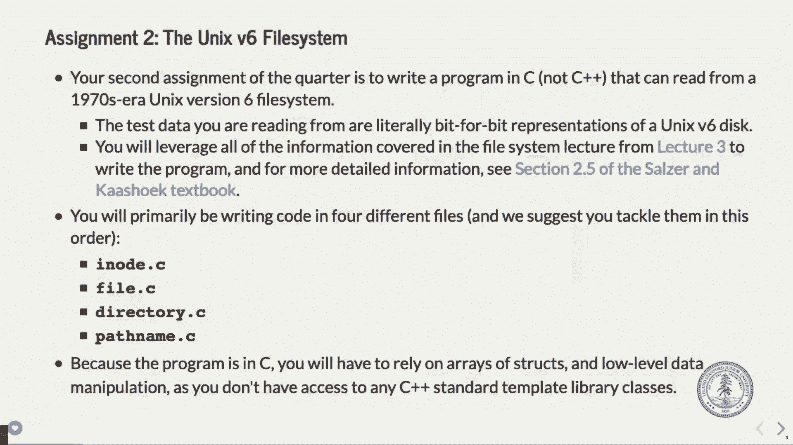

好吧，为什么我们关心这个文件系统呢？恰好它是一个不错的文件系统。它相对来说比较简单，容易理解，值得一提的是，它是一个很好的练习，适合操作文件系统所需的数据结构。好了，你将从我们提供的实际测试磁盘中读取的测试数据，实际上是Unix版本六磁盘的逐位表示。

所以有人成功地让一个版本六的系统运行起来，可能是在虚拟机中或其他什么地方，他们把磁盘拷贝下来，然后放入了这个作业中。这就是它们的来源。所以，你需要弄清楚如何读取这些磁盘，具体来说。好了，我们已经给你提供了一些框架，显然，但你还是需要自己去做。

第三讲的内容非常重要，因为我认为我们在那里讲解了具体细节。然后是我们其中一本教材的第2.5节，你可以直接获取该链接，这是获取文件系统更具体信息的地方。

所以如果你对具体的内容有疑问，先去查看那部分内容，然后在Piazza上提问，或者来参加办公时间等。作业是，你有一个磁盘镜像，必须能够读取和写入文件，并且能够在系统上找到这些文件。好了，然后你应该能够读取文件并读取该文件中的任何块等等。你将主要在四个不同的文件中编写代码，因此你将有四个不同的代码位置。

我们建议你按这个顺序进行。首先完成iNode.c中的函数，你可以想象那是操作iNode中的信息，以获取关于文件块的信息。接着是file.c，它在其上加了一层抽象，表示你应该搜索的文件。然后是directory.c，它也是用来操作实际目录的。

我想file.c是用来读取特定文件的。directory.c则是用来搜索文件的。记住，你必须搜索根目录并搜索其中的所有文件，直到你找到你想要的路径下的文件。

然后最后，路径名实际上也在进行搜索。不管怎样，我们说要逐步完成并注意顺序，之后，我想在前两个之后，你会有一些可以通过正常性检查或运行程序来测试的功能。

然后，当你完成每个任务时，你会获得更多的功能。好的，这就是基本的想法。这个作业是用C语言写的，不是C++。你不能使用映射（maps）、集合（sets）、向量（vectors）或者类似的东西。你必须处理低级数组，并且要使用结构体（structs）等等。

所以这个作业中没有C++的内容。虽然这不是世界末日，但它意味着，如果你认为可以用映射（map）来完成某个任务，那就不行了。在这个作业中不允许使用映射。

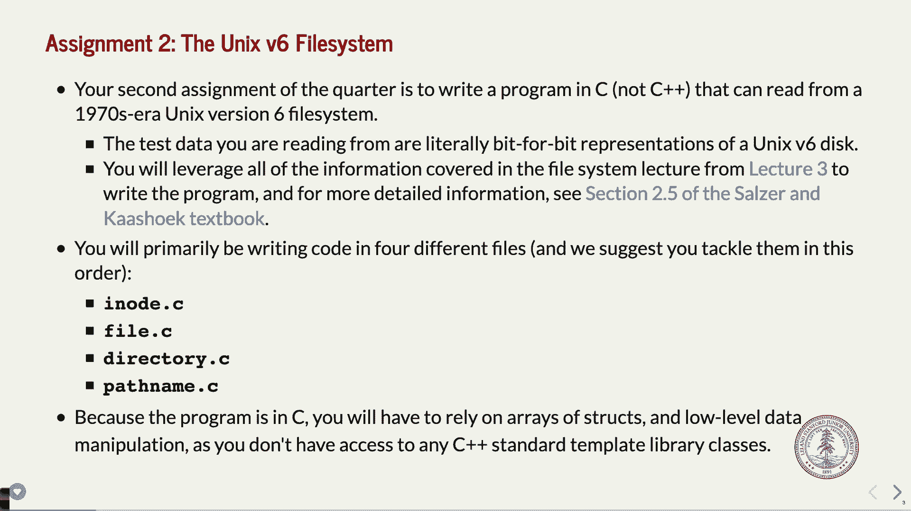

好的，我之前说过，你能够在这个文件系统中定位并读取文件。好的，你将使用我们为你写好的函数，也会自己编写一些函数。我在这里提到的一个函数，你会用到很多次，叫做`disk_image_read_sector`，它接收几个参数。它接收一个文件描述符，基本上。它接收一个扇区号，或者我想它是一个文件系统。

它大致就是这样。它接收一个扇区号，然后接收一个缓冲区，这个缓冲区会从磁盘映像中读取特定的扇区，我们已经为你写好了这部分代码。好的，你不需要担心这一部分。重要的是要找到正确的块来读取。这里有一些事情需要注意或了解。这个函数总是会读取`disk image_sector_size`字节的数据。

你可能会问，如果文件只有12个字节长怎么办？

它总是会读取这么多字节吗？这些字节恰好是512字节，正如我们讨论过的？是的。它读取这么多是因为除了前12个字节之外，其他都是垃圾数据，但磁盘一次只能读取512字节。所以你需要负责确定哪些字节是相关的，其中涉及一些算术运算。好的，所以你得考虑这些问题。

关键是要阅读这些头文件。对于这个作业，头文件其实并不大，但里面有很多常量是你需要的。例如，根I号（root I number）。它是一个常量。在头文件中我们已经提到了它，它的值恰好是1，这是根的I号。但是你需要使用这个根I号。

你可以使用1，但在这种情况下它已经为你定义好了。有一个目录项结构体（struct），其中包含了文件名等等。这些内容你可以从头文件中学到。好了，所以确保你阅读了这些内容。顺便提一下，作业现在已经发布了。你可以去看看。

这个作业的截止日期是下周四，供参考。

我想谈谈一个函数。这似乎是让人最困惑的一个，可能主要是因为在开始编写代码之前，他们并不完全理解它到底在问什么。这可不好。你应该在编写代码之前先理解你到底在做什么。但是这个函数是这样的。它叫做 I 节点索引查找。

在你实际使用 Unix 文件系统时，你会传递给函数，我们已经为你创建并初始化了它。你不需要担心这个问题。等到这个函数被调用时，你实际上已经拥有了 I 节点指针。好的，指针已经填充了 I 节点的详细信息。

记住，它有所有包含块号的块，并且还包含关于文件大小的信息，如果是一个大文件等等。好的，然后它也包含你要查找的块号。这是文件本身的块号，表示该文件占用的块数。所以如果它是一个 512 字节长的文件，它只占用一个块，那么只有块号为零。

对吧？块索引为零。如果是 1024 字节的文件，它会占用两个块。好的，I 节点就是这样，它占用的是常规的 32 字节，或者其他什么字节。但实际上文件中的块就是这个函数要返回的内容，它会返回你正在寻找的文件中的块的索引。好的，理解了吗？比如说，我有一个文件，这个文件的大小是 1024 字节。

对吧？好的。假设块号是 1，也就是文件中的一个块。好的，然后你需要在你正在寻找的文件系统中找到该块的索引。好的，换句话说，我会给你展示一下，你马上就能明白它是怎么工作的。稍微有点混乱。是的。你是从零开始还是从一开始？你是从零开始还是从一开始？好问题。

你可以选择任意一个，但你必须确保在编码时知道你使用的是哪一个。是的，好的。在这种情况下，它可能是零。但这是我想给你展示的例子。好的，这是我想给你展示的例子。假设 I 节点表示文件的大小是 180,000 字节。好的，180,000 字节。

假设块号是 302。这意味着什么呢？如果你每次读取 512 字节，那么第 302 个块就是你要返回的那个。好的，看到了吧。就是你接下来在文件系统中查找的那个块。好的，记住，一个文件可以有一个块，前 512 字节是一个块，然后它可能接着往下存储。

那就是下一个 512 字节。然后这边是下一个 512 字节，或者是其他什么的。我们要查找的是第 302 个块的块号。明白了吗？

我们要找什么？对，急吗？你怎么获得其他的呢？嗯。你每次调用一次这个函数。所以，意思是，如果你想得到。假设文件有302个块。你必须调用这个函数302次，才能获得每个块的单独索引。你明白它是如何运作的吗？这就是唯一的做法。

这里没有链接列表连接它们，对吧？你有前七个，或者你有I节点里面的八个文件编号或块编号。然后你还会有间接的那些，也会有双重间接的那些。是的。所以，明确一下，这不一定是文件中第三百零二个数据块。

不，确切来说是。它是第三百零二个512字节数据块。就是这样。好吧，那不是。理论上它可能在那之前的某个地方，我们会先找到第一个块。它可能在I节点之外的文件系统中的任何地方。但是，它会在I文件系统中的任何地方。但它就是。

如果你正在遍历文件，你首先需要找到第一个512字节的块。然后需要下一个512字节块。然后需要下一个512字节块。我们要找到第三百零二个512字节的数据块，对吧？为了找到它，你必须了解很多关于文件系统的知识，才能搞清楚如何跟踪所有的小路径来做到这一点。

这有道理吗？是的，所以这就是为什么这个函数很困惑，因为人们不太理解。但希望我们现在已经澄清了。好，好的。现在我们来看看我们可能如何实际做这件事。好吧，假设，如我所说，180,000字节。我们要找的是第302个块。好吧，我们要找第三个。

第三百零二个512字节的数据块。好，记住。其实这对我们正在做的事情影响不大，但块的大小是512字节。好，如何找到扇区索引？那就是实际的。我需要告诉磁盘读取哪个扇区，才能获取到第三个。

第三百零二块信息？这就是我们必须用这个函数来处理的。

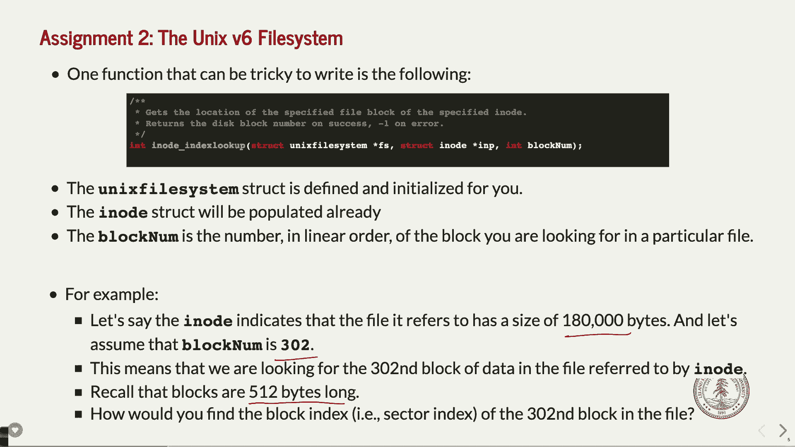

好的，那你需要做什么？嗯，首先要记住，我是怎么知道的，对吧？有那八个不同的块，对吧？一，二，三，四，五，六，七，八。

每个块，如果是一个小文件，它将有一个块编号，这个编号对应第一个512字节。然后是下一个512字节，下一个512字节，接下来的512字节，依此类推，一直到4096。因为那是你能在八个块中存储的唯一数量，“嘿，这就是不同的块。”所以，你的函数首先要做的是判断这个文件是大还是小。

因为它会改变这些数字实际所指代的内容，如果它是指。是一个大文件还是一个小文件。是一个小文件，很简单，对吧？

你知道那个块中的数字不会是302，顺便说一下，因为302会是2，它只能在0到7之间，如果是小文件的话。但无论如何，你要做的就是去读取那个i节点，从中读取出数字，然后把它返回。在这个例子中，它是一个大文件。

所以你知道你有间接寻址，这改变了事情。现在，这里每个块编号，指向文件系统中的一个块，文件系统中的一个段。但如果你去那里，你会发现它们包含256个数字，每个数字都指向一个存有数据的块。好的，那这是什么意思呢？嗯。

你的数据中的第302个块将会落入第二个间接块。不是这个，而是这个。你明白为什么会是这样吗？这里有256个，这个块会指向一个包含256个数字的块，这就是前256个数字。然后下一个块包含接下来的256个。

而且302恰好位于那个块中。你准备好了吗？

所以你看到你需要开始这样思考了吗？好的，那这是什么意思呢？

好的，你将使用磁盘映像读取扇区来读取其中的扇区，我已经擦除了它。一个，二，三，四，五，六，七，八。你将读取这里的数字，并从该数字开始读取磁盘映像，这个数字指向文件系统中的另一个地方。这样，你就会得到一个包含512字节的块，这个块中包含了各个块的编号。它们都是Uint_T类型，都是短整型。

无符号短整型。好的，接下来你需要在这个列表中找到第302个取模256的短整型，并返回其中的数字，这个数字表示你正在寻找的块的索引。如果你正在寻找的块恰好位于这里的第八个块，那么你就需要另一个间接层级，所以你的函数需要考虑这一点。好的。

所以你看到这是怎么运作的吗？太好了。我相信当你开始做作业时，你一定会有一些问题，但是至少到目前为止，希望你至少明白，“哦，我明白这个函数要我做什么了。现在我得做一些计算来完成它。”很好。

你有什么问题吗？

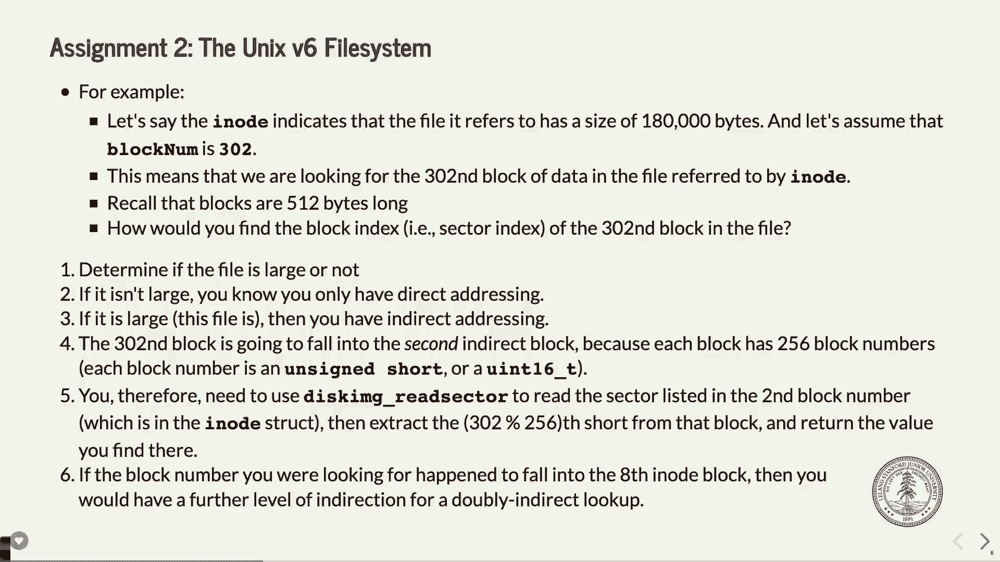

好的，太好了。那我就把关于它的问题全部删除了。那么，当然，在这个作业中，你还需要在目录中搜索以定位某个特定文件。你不需要跟随符号链接。你不需要担心符号链接有什么奇怪的情况。你可以忽略那些。

你确实需要考虑那些有超过 32 个文件的目录。因为它们可能有任意多的文件，基本上不受限制。不要认为那是特例。不要说，“哦，不，它超过了 32，我得用特殊的方式处理它。”你已经写了，假设到那时你已经写了。

有些函数能够一次读取整个文件的一个块。好的，这就是我们刚才讨论的函数。比如，“去找到这个文件中的下一个块。”你不需要把它当作特例。太多人有时会这么做，实际上没必要。像处理其他文件一样处理它，说，“我想读取下一个。”

读下一个，读下一个。" 然后你就没问题了。好了，它们都适合在 512 字节内。不是像文件条目那样，可能会跨越两个块。由于它们的写法，跨块的情况不会发生。明白吗？顺便说一下，你可能需要在这些从中得到的数据上放一些结构体。

对吧？会有不同类型的结构体，比如目录条目等等。把它们应用到数据上，按照 CS107 的方式处理，你就能够直接读取它们了。明白吗？

这些是我能想到的事情。好吧？别忘了，这是一个要点。文件名最大为 14 个字符。如果它们恰好是 14 个字符，那么没有结尾的零。为什么？因为他们想节省一个字节。对于所有这些 14 长度的文件，他们想节省一个字节，于是说，“哦，如果是 14 个字符的话。”

我不需要担心这个。" 那么，这意味着如果你尝试比较两个文件名，比如一个是你在找的，另一个是你数据中的文件名，你最好不要使用 Stercomp。因为 Stercomp 会查找末尾的零。你可能想使用 Stercomp 或者做其他方法来检查，“嘿，末尾有零吗？”，明白吗？你也许不应该使用 Sturlenn。

因为 Sturlenn，所有这些字符串函数都假定它是一个格式正确的字符串。如果你有一个 14 个字符的名称，它并不是格式正确的字符串，但仍然存在于文件系统中。明白吗？

就是这种小细节。在编程中常常会发生这种情况。我们试图节省一些空间，然后说，“如果你要做这样的事情，最好文档化一下。”当然，他们做到了。好吗？

好吧。这是作业一。是一个相对高级的作业。我的意思是，这是第一个你开始做新的内容的作业，这些内容你在这门课上才见过，之前没做过。请尽早开始。你在每门课上都会听到这句话。来上办公时间，问 Piauts 问题，显然。助教不会看你这次作业的代码。

所以如果你有关于代码的问题，按某种概念性的方式表达出来并说：“这是我想做的事。我做错了什么？或者我需要考虑哪些问题，因为我在做这个并画一些图等等，助教可以帮助你。”

他们不会喜欢——他们会查看错误消息，试图弄清楚。但他们不会深入研究你的代码，试图理解你到底在做什么。他们会问你，“你在做什么？这是你能找到的概念框架。”明白吗？好的。还有其他问题吗？作业？其实是一个挺有趣的作业。我是说。

这绝对是一个相当不错的媒体任务。就目前来看是这样的。

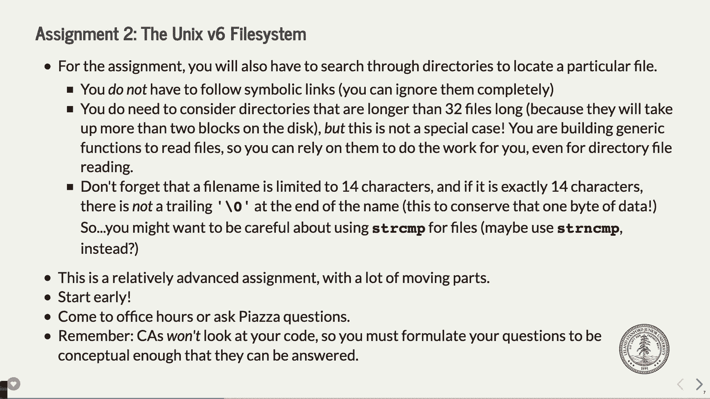

好的。好了，我们回到多进程。好吧，这就是我们星期一停下的地方。星期一我们说：“嘿，有一个新函数叫做fork。它实际上是一个系统调用。它叫做fork。它没有参数。它会返回一个整数，要么是父进程创建的子进程的PID，要么返回零，表示你是子进程。”

它不是子进程的PID。明白吗？

因为你希望能够区分这两者。明白吗？

然后我们开始查看一些关于这个的不同程序。我们看了一个叫做fork puzzle的程序。对吧？

然后我们发现，实际上在fork puzzle中，你可能会遇到数据或输出以你无法预测的顺序出现。

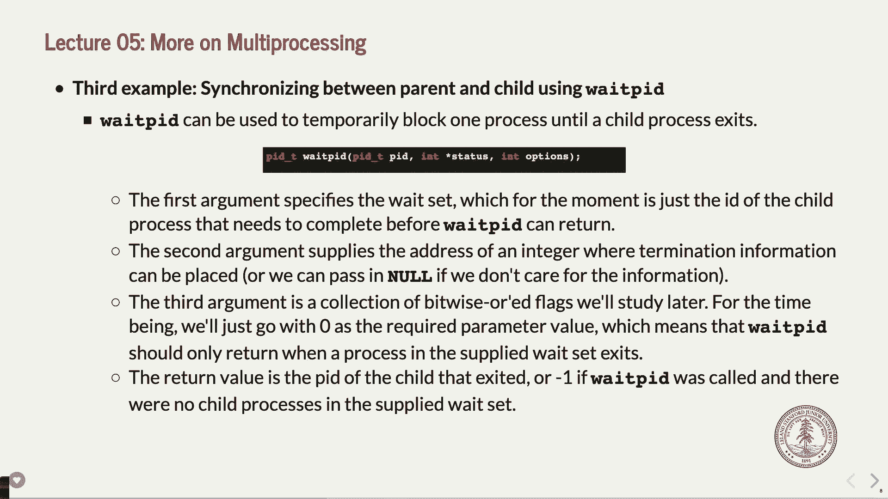

对吧？如果我再做一次，顺序可能会稍有不同。事实上，这次我们发现父进程在某个子进程之前就完成了。所以crop命令返回了，然后他们在最后得到了一个奇怪的D，感觉有点丑，像是你不想要的东西。明白吗？

我们希望如果可能的话，让它变得更加可预测。特别是我们希望父进程能够等待子进程。明白吗？

我们希望父进程能够说“我将等待我创建的任何子进程完成”。明白吗？

那我们该怎么做呢？嗯，我们使用了一个叫做weight PID的系统。明白吗？weight PID。

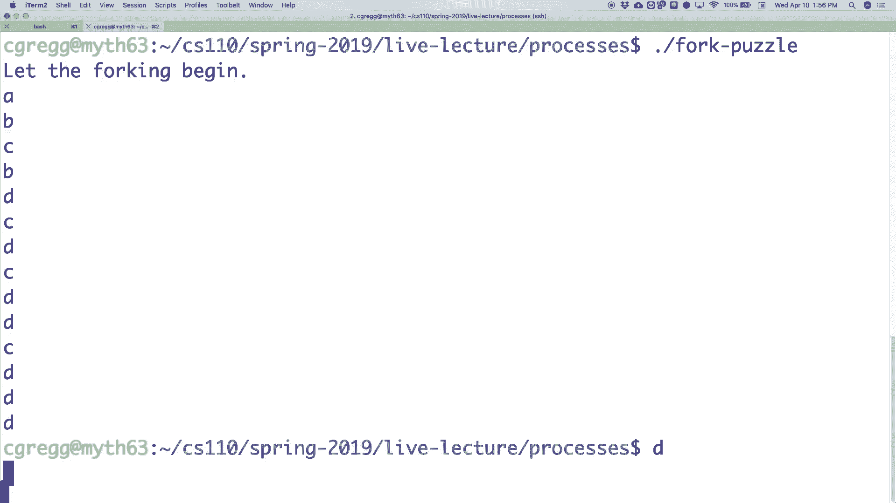

weight PID当然有几个参数，其中有一个是PID。事实证明，大部分情况下我们实际上不会在里面放一个PID。你稍后会明白为什么。但它代表的是等待集，可以是一个PID。例如，我正在寻找特定的子进程，或者可以是另一个数字，比如负数——比如说负一，表示等待任何子进程。

然后每当任何子进程结束时，程序将继续。明白吗？

它会暂停父进程，直到子进程结束。明白吗？

父母只是静静地坐在那里等待，并没有做任何事情。而且顺便说一下，它也不会消耗大量的处理器时间。操作系统，内核会说，“哦，你在等孩子。” 好的，那就先休息一下，不会进行任何处理，这是一件好事。

我们在程序中喜欢这么做。好吗？所以就是这样。它还需要一个地址。等一秒，接下来是第二个。它需要一个状态的地址。所以你传入一个整数的地址，它会用你调用等待 PID 后的结果填充那个整数。可能是一个错误，也可能是包含返回值等等。

最后，我们有基本上是按位或设置的选项。现在我们先将其设置为零，因为稍后我们会处理这些。好吗？

现在我们没有需要担心的选项。问题。好问题。如果孩子有了孩子，等待 PID 会等待那个吗？不。在这种情况下，孩子只能等待它自己的孩子。父母不一定知道它自己的孩子。

它的孙子或者它是否需要等待呢？不。它只需要等待它的孩子。好问题。好吧。还有别的问题吗？让我们来看一个具体的例子，嗯。那是个好问题。如果，嗯，好吧，你开始进入细节了。如果父母有一个孩子，而孩子有一个孩子，那么孙子与祖父母之间没有任何关系，以至于它需要等待。

当父母的孩子结束时，即使父母的孙子继续进行，父母也会收到通知。所以，不。它不会一直等待任何孙子完成。如果你为两个都使用等待纯度，那么孩子必须等到它的孩子完成后才能完成。也就是说，父母必须等到孩子完成后才能完成。是的。所以。

你可以像那样串联它们，但你必须小心一些。但不要认为孙子们都会被包含在父母里面。是的。好问题。好了。是的。好问题。你是说你传入的是你希望完成的孩子。在这种情况下，如果我们传入一个 PID，而不是负一，例如，它将会等待那个孩子。

正确。你不能传入孙子的 PID。它并不了解那个。你只会传入你可能知道的 PID。它们是直接的孩子，属于你的。你会明白的。让我们做一个例子，然后，嗯，再看看。好的。顺便说一下，返回值是孩子的 PID，或者如果没有，返回负一。

如果没有子进程仍在运行，因为也有可能这种情况发生。如果没有子进程仍然在运行，而你说等待某个子进程的 PID，它会返回负一。这意味着，哦，不需要等待，或者那个特定的进程已经结束。是的。在你使用完等待 PID 之前，那些子进程有可能已经终止。

好问题。这并不意味着子进程可能在你调用 PID 之前就已经终止了。确实有可能。是的。这没关系，事实证明。对了，PID 也做了一些清理工作。它确保子进程得到了清理。所以一般来说，我们应该调用 wait PID。我们在之前的程序中没有这么做，因为我们还没学到这个。

但一般来说，你应该这么做。是的。我们稍后会看到一些例子。对不起，问题是什么来着？如果你在根进程上调用 wait，PID，或者说，我们这么理解。如果你调用 wait，PID，你应该只在子进程上调用，或者使用负一，我们稍后会解释这个。如果你只在子进程上调用，且你的子进程已经结束。

返回值将是负一，这没问题。你可以捕捉到这一点。或者它会返回 PID，告诉你，嘿，是的，那个子进程刚刚结束了。这就是你需要知道的内容。我们稍后会看到它是如何表现出来的。是的。如果你添加了一个拥有 PID 的属性并且你等待它会怎样？如果你添加了自己的进程。

它不是你的子进程，所以它会忽略这个，我相信。所以你不会等待你自己的 PID。那么它会怎么玩？

我觉得实际上什么也不会发生。就像，我不认为它会崩溃或永远等待之类的。但是不，我认为我们可以尝试一下。但我不认为会发生那种情况。事实证明，什么也不会发生。它可能会返回负一，表示不，这个根本不在你的子进程集合中。

这可能就是发生的情况。好，我们来看一个例子。好，我们要做的是一个名为 separate 的例子。我现在不需要做这个。

我们要做一个名为 separate 的例子，这个例子会用到一些信息。这个 wait PID，这样我们就可以做一些事情，知道会发生什么，并且事件的顺序会怎样。好，接下来我们要做的是打印 F before。所以这是第一件发生的事，它会打印 before。

然后我们将说 PID T，PID 等于 fork。这将实现进程分离。好，然后我们会说 print F after。我们应该得到多少个？

因为现在我们有了一个额外的进程，两个进程都会这么做。好，如果 PID 等于零。那意味着什么？子进程，或者说子进程。好，如果 PID 等于零。好，你应该说类似 print F，我是子进程。好，父进程会等待我。好，从这个角度来看，这其实是一个不错的类比。如果你愿意。

好的，然后如果我们是子进程，我们将立即返回。我们就返回 110，表示 CS 110 或者其他。无所谓。我们只是想展示它不是零。

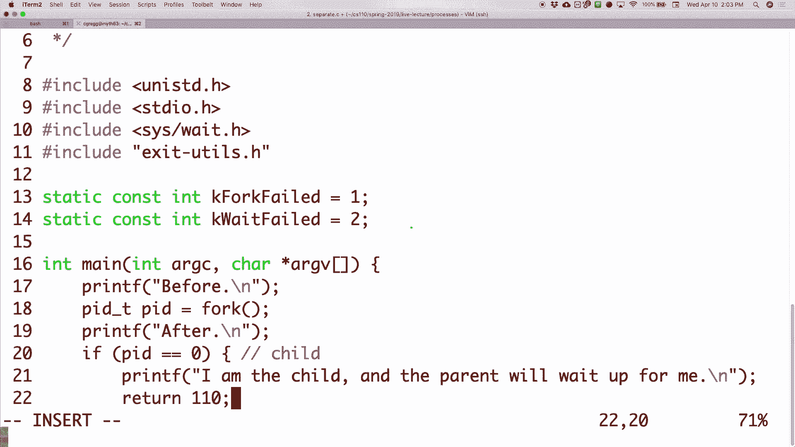

只是返回值。你实际上可以从子进程结束时获取返回值。这很不错，因为也许你想知道子进程是否正确结束，或者你可能想通过这种方式传递一些信息。好吧，到此为止。

我们可以加一个 else。这个 else 并不是绝对必要的，因为我们编写的程序方式。对吧？它总是会在这一点上返回子进程。好吧，所以在这种情况下，else 并不是真的必要。但不管怎样，重点是现在我们可以说我们在这里是父进程。明白了吗？

父进程会有一个状态。好吧，父进程会执行 wait PID。现在，我们只需要等待实际的 PID。我们会传入状态的指针。并且我们会为选项传入零。稍后我们会解释这些选项的含义。

好的，没问题。在这之后，这个函数会等待子进程完成。然后，嗯，问题来了。状态不需要初始化。它会传入一个指针，并且它会被更改。它没有被使用。函数没有使用状态的值。它是在为你填充状态的值。明白了吗？

这也是获取两种返回值的另一种方式。如果你愿意，可以这么理解。状态和实际的 PID。这是 C 语言处理这个问题的方式。好吧，所以我们现在要这么做。现在，我们要检查一些内容。好吧，我们会使用一个宏，你可以把它理解为一个内联函数。

我们之前看过一点类似的内容，但它叫做 WIF-exited。好吧，现在我知道它看起来像是 wife exited。我每次想到它时都会这么说，因为我读到这个时会想，哦，这意思是……但其实不是。它的意思是 WIF-exited。它的作用是检查状态。好吧，如果宏返回 true，意味着状态是正常的。

它用一个普通的返回值退出。我会向你展示当没有发生这种情况时它意味着什么，稍后几分钟我也会解释。好吧，你可以做的就是打印 F，然后你可以说“子进程以状态百分比 D 退出”。好吧，这就是实际的，可能不应该叫状态，而应该是像返回值之类的东西。然后你得到另一个宏，它做的是退出状态，抱歉，W exit 状态。

这会给你状态。它只是读取这些位，因为实际上宏或状态变量里包含了很多信息。其中一部分就是返回值。

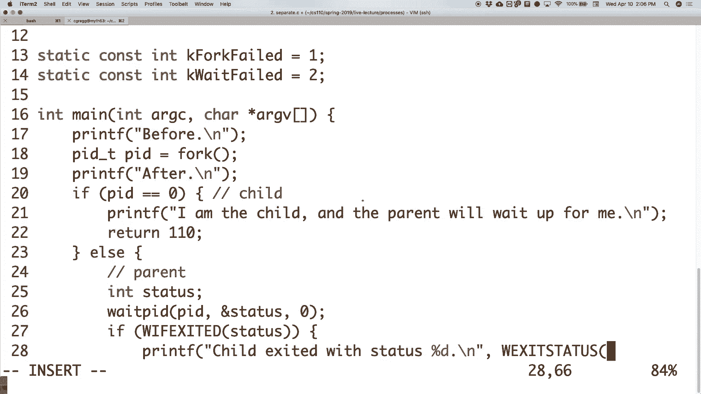

它的一部分包含关于子进程如何退出等的其他信息。好吧，这就是我们接下来要做的。好吧，接下来我们要做什么？

在这种情况下，我们想加一个 else。

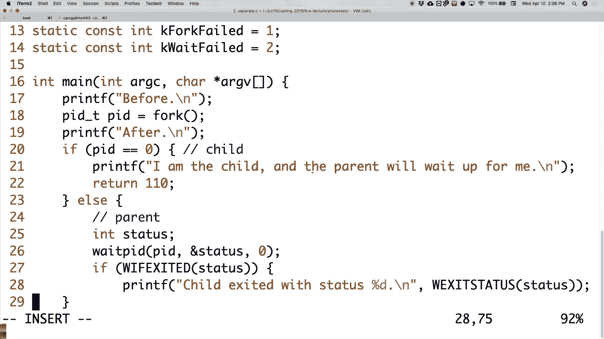

假设我们遇到不好的情况。子进程没有正常退出。我们可以打印“子进程异常终止”。类似这样的信息。然后在这里，我们可以返回零。好了，这就是会发生的情况。大家看到什么问题了吗？

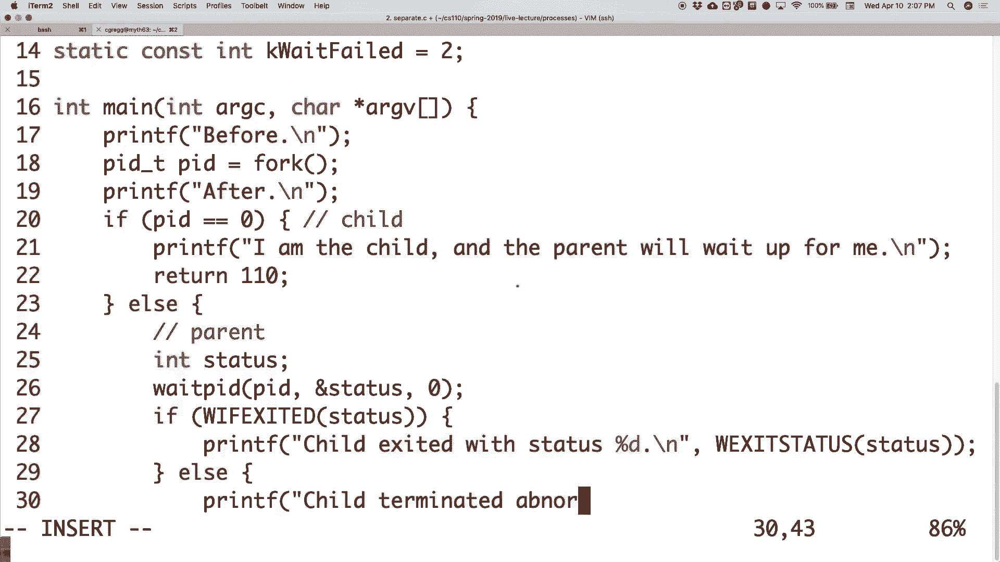

我们来看看。做分离。好，看来没问题。那么如果我们运行它，输出是：先是“之前”，接着是“之后”，然后打印“我是孩子，父进程会等我”。子进程以状态110退出。无论我运行多少次，输出都会按这个顺序进行。

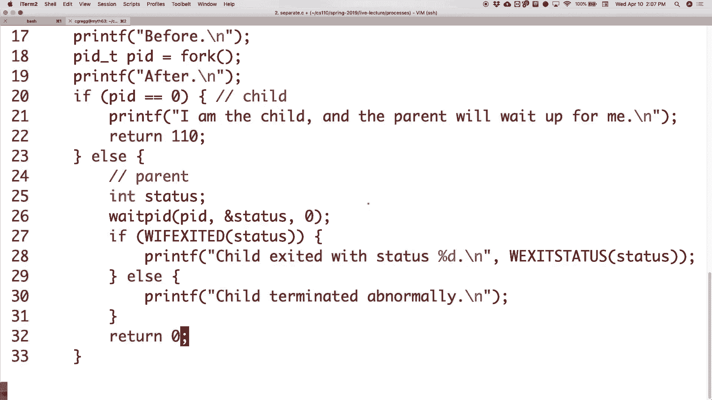

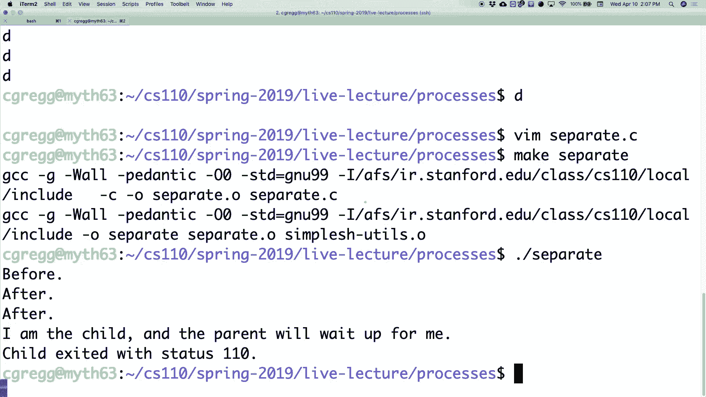

好的。因为父进程必须等到子进程退出后才能继续执行，这样我们就都准备好了。好的。那么你可能会问，子进程怎么退出？正常退出吗？我们怎么让子进程以错误的方式退出呢？

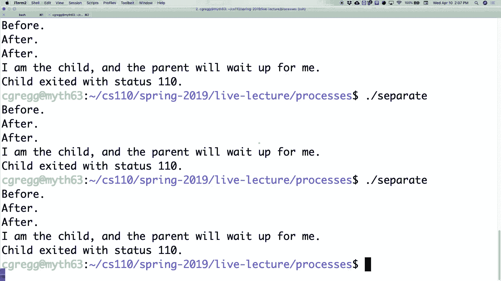

换句话说，崩溃它。我能让程序崩溃吗？我们可以做很多事情。如果我们想的话，甚至可以做除零运算。怎么样？这是我曾经遇到过的一种情况：`int* a = NULL; *a = 5;` 那将是个大麻烦，对吧？

尝试去解引用一个`NULL`值，那将是个大麻烦，对吧？

编译器其实不应该关心这个。

做分离。好了，分离。接下来，子进程会在父进程等待子进程正常终止之后结束，对吧？我们杀死了子进程。然后获取它的退出状态，告诉你。

哎呀，出问题了。发生了什么事情。好了，问题来了。子进程能打印出“我是孩子”吗？

孩子能在父进程打印之前打印“我是孩子”吗？是有可能的。虽然在这种情况下可能不会发生，但这完全是可能的。是的，可能的。所以我猜在这种情况下，确实有可能发生这种情况。可能性不大，但这是个很好的问题。对，就是这样。

顺便说一下，这是个不错的术语，值得学习。这被称为竞争条件。竞争条件意味着两件事同时沿不同路径进行。其中一个会“赢”，但你无法预知哪个会先完成。在这门课上，我们尽量避免竞争条件。有时你必须处理竞争条件，因此需要编写一些逻辑，确保你知道接下来会发生什么。

好的。当我们讨论线程时，你会看到很多这种情况，实际上。你也会在进程中看到这种情况。但特别是，如果你试图修改共享数据结构时，你会遇到竞争条件，在这种情况下，两个操作可能同时进行。

你想避免这种情况。所以，你要以我们将要讨论的方式来处理它。问题吗？是的，L 语句中调用 `wait PID` 这一部分，对吗？

[听不清]。

这不应该是子进程的 PID 吗？是的，它是子进程的 PID，因为记得 `fork` 的返回值是什么吗？

父进程会得到子进程的 PID 作为返回值。是的，正是如此。这就是为什么会发生这种情况，你可以利用它。这个问题很好。还有其他问题吗？好的，我们继续。这个函数每次的输出都是一样的，除了那一点：子进程可能会打印。

可能会在父进程在 `after` 之前就打印出来。

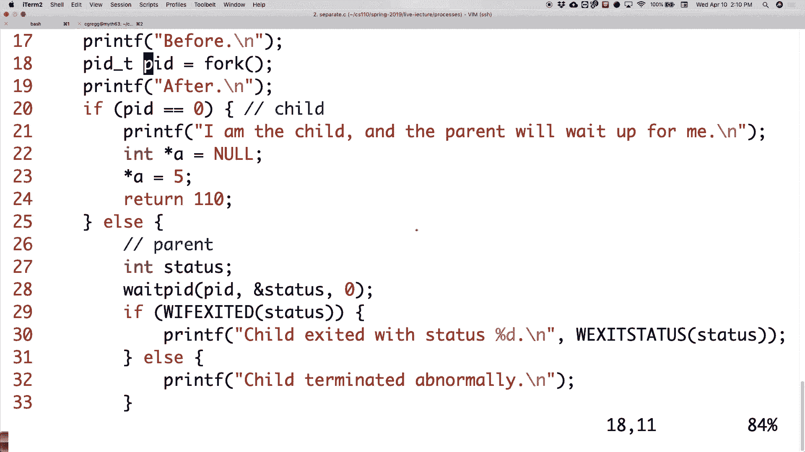

父进程，之所以能按我们预期的顺序工作，是因为父进程会等待子进程结束。然后你使用这些宏来获取更多的信息。你可能会问，等等，怎么能重叠返回值和其他信息呢？

对吧？返回值不是应该是一个 int 吗？其实并不是。返回值应该在 0 和 255 之间。所以你在那个 int 中还有很多额外的位可以用来存储其他信息。这就是返回值应该是这样的原因。它们是 int 类型，但你应该将它们限制在 0 到 255 之间。

就是这样。好的，正如我之前说的，`wait PID` 确实会将资源归还给系统。换句话说，这就像你在程序结束时进行的清理操作。当发生某些事情时，你应该为所有子进程执行 `wait PID`。最终，不管怎样，系统会帮你清理，但这就像在调用 `malloc` 后你做的 `free` 一样。

这样做很好，因为它能清理资源。好的，接下来呢？好，我们来看看另一个例子。在这个例子中，我们将看到一个有点像脑筋急转弯的问题。

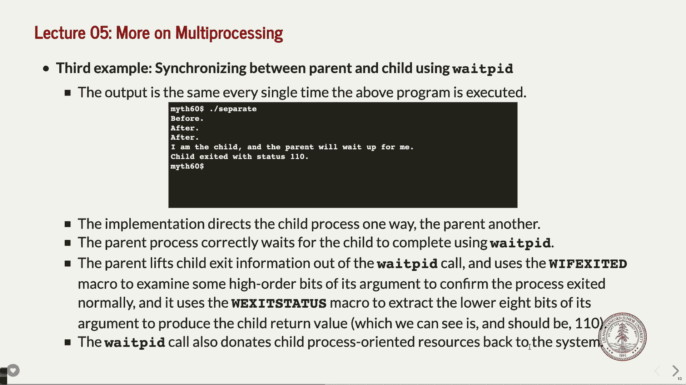

接下来，我们将逐步讲解，展示这个复制到底有多深。好的，这个例子将被称为“父子进程.c”。 

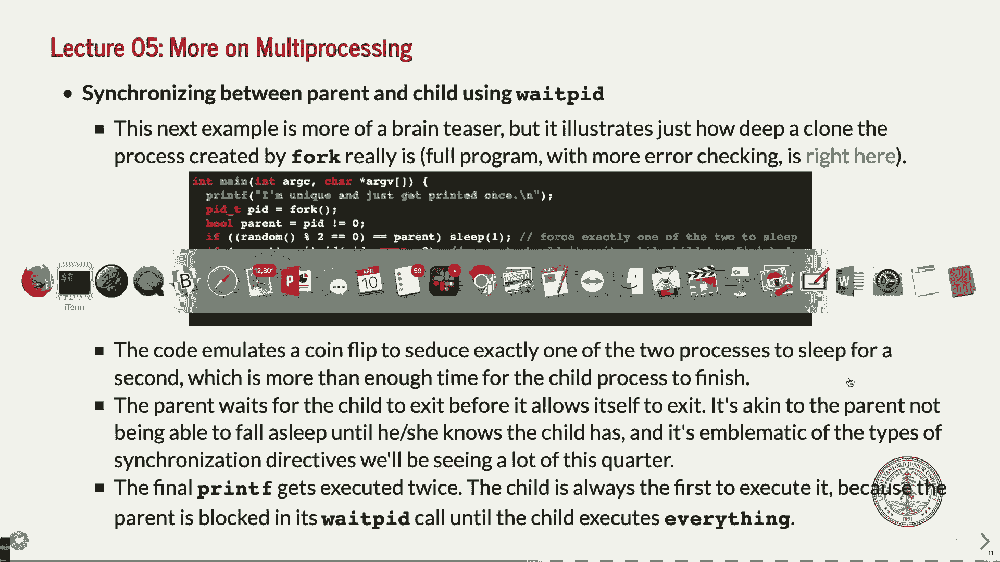

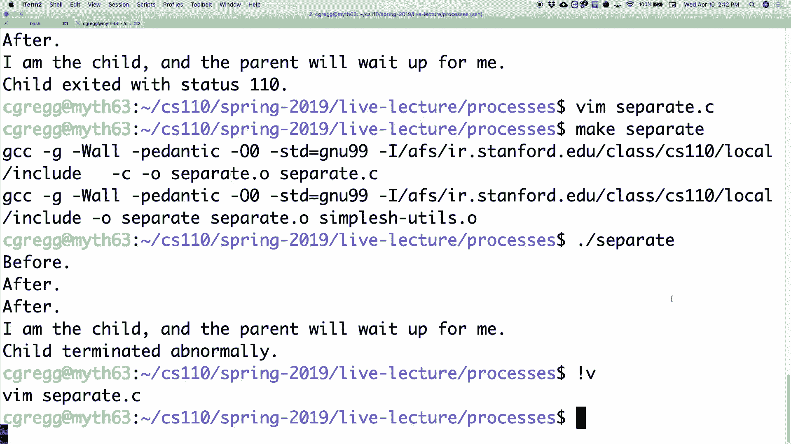

我们接下来要做的是这个。这将涉及随机数。好的，我们将在这里添加一些随机性。好的，在这种情况下，我们首先会说 `printf`，我很独特。并且只会打印一次。好的，我们知道这是为什么，因为还没有进行 `fork` 操作。然后我们将做 PIDT。

PID 等于 fork 就像我们通常做的那样。然后我要做一个布尔值判断。布尔值 parent 等于 PID 等于，看看，PID 不等于零。好吧。这是什么意思呢？

基本上是说，如果是父进程，换句话说，如果 PID 不等于零，那么它就是父进程。它就会设置这个。否则就不是父进程。好吧。它只是一种巧妙的做法。好吧。然后我们会说，如果是随机的，那将会给你一个随机数。好吧。

Mod 两等于零，这就代表父进程。换句话说，这是 C。所以 1 和 0 基本上是对和错。好吧。如果等于父进程。那我们就休眠一秒钟。意思就是这样。好吧。Sleep 是另一个命令，基本上是让你的进程在那段时间内暂停，然后在这段时间后再次唤醒它。

好的。然后如果我们是父进程，我们就要等待 PID 等于 PID。不是。哎呀。不对。零是因为我们什么也不做。好吧。在这种情况下，父进程等待子进程。好吧。然后我们会说 print F，我被打印了两次。

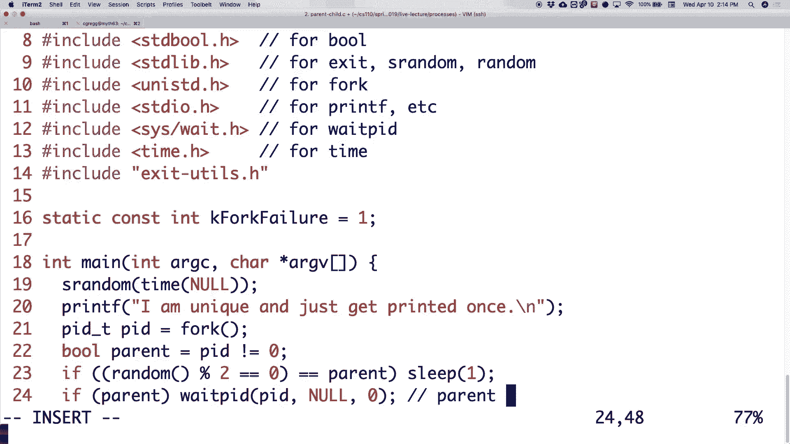

这个是来自 percent S，逗号，如果我是父进程，我就打印父进程。否则，我就打印子进程。好吧。然后我们会返回零。好吧。所以这意味着什么呢？这会设置这样一个规则，只有两个进程中的一个能休眠。对吧？

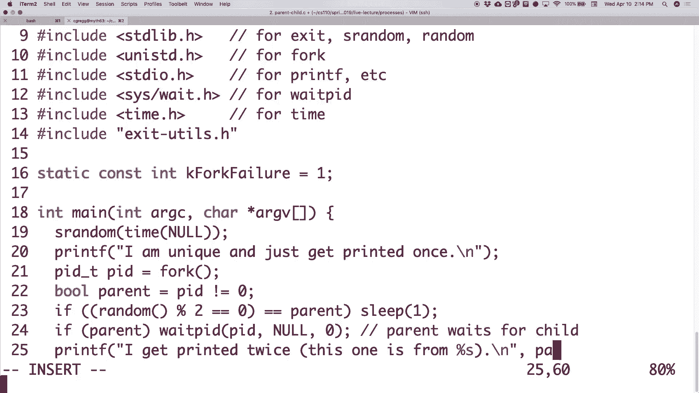

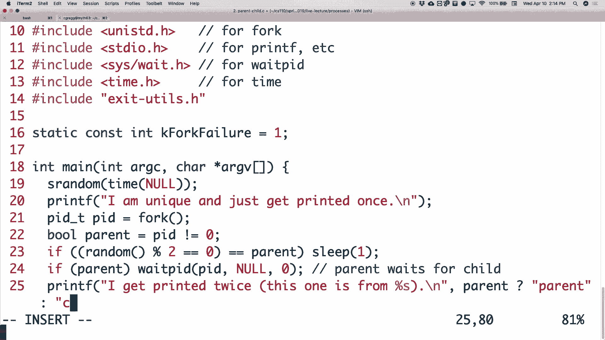

如果是父进程，它就得等子进程。好吧。让我们做个父子进程。好吧。父子进程。现在，你得注意了，我要把它放在这里。你得盯着看，因为只有一秒钟。对吧。但看看会发生什么。

爆炸。我的意思是，你可以只打印一次。它稍等了一下，然后我打印了两次。好吧。如果我再运行一遍，它会立即打印出我被打印了两次。然后打印下一个。我再给你看一次。我们来看这里会发生什么。好吧。所以这意味着父进程必须等待。好吧。然后也许它们又来了。

而且是子进程必须等待。好吧。大家看到它是如何工作的了吗？实际上只有一个能做到这一点。这看起来有什么奇怪的地方吗？

我们这里有随机数。看起来有什么奇怪的地方吗？

为什么两者不能同时休眠呢？

每个都有一个随机数。是的。你共享的随机数的种子会改变你的结果吗？

这是一个完美的答案。种子实际上是在两个进程之间共享的，因为一切都是共享的。换句话说，随机数并不是真正的随机数。它们是伪随机数。也就是说，有一个算法决定了下一个数字是什么。好吧。它应该是看起来随机的。好吧。这里发生的事情是我们在说，哦，好吧。

我们在两个不同的进程中都调用了随机函数，但它们使用的是完全相同的随机生成器。所以下一个随机数字对两者来说都会是一样的。这意味着只有其中一个会进入休眠。明白了吗？

所以这就是x随机数。对。所以x随机数只是用当前时间作为种子生成随机数。别太担心随机数，实际上伪随机数生成器是这样工作的。它会在我的随机数列表中的某个地方开始。

然后我将开始给你们看一些看起来像是随机的数字。种子说从这里开始，基本上就是它的工作方式。好吧。所以这其实并不完全是随机的。它是伪随机的。但它有点演示了，哦，对，它们有相同的记忆。结果就是这样。是的。如果你注释掉19会发生什么？如果你注释掉19的话。

除了它会，嗯，我明白了，实际上并不会有任何不同。它可能每次都会做完全相同的事情，因为随机数生成器每次都会从某个特定的值开始。而我们可以看看是否是这样，试试看，换句话说，不管什么时候你开始程序，它都会。

所以我们看看，如果我们运行父进程和子进程，似乎父进程在休眠，父进程在休眠，父进程在休眠。所以每次都会是同一个。我们可能会打印出随机数，它每次都会是同一个。

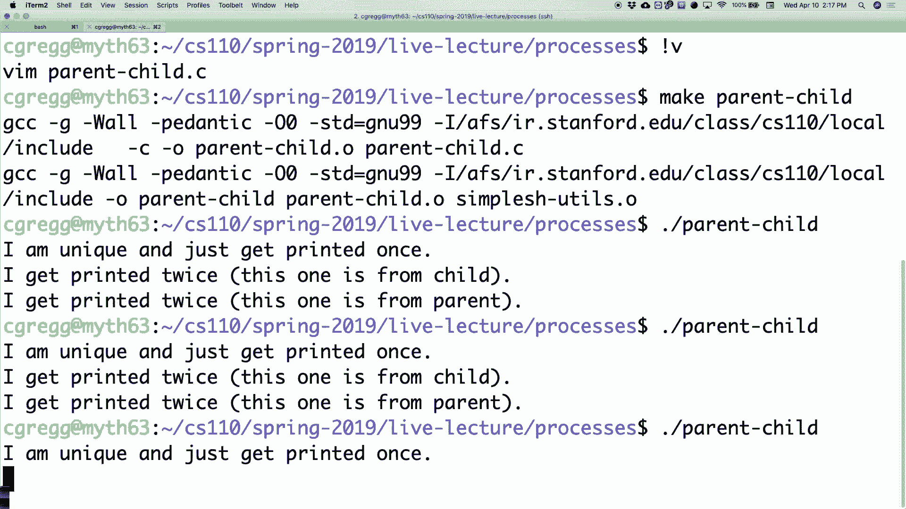

为什么父进程会在那样慢下来时休眠？好问题。代码是什么样的？

对吧？代码说，我将把这个拿出来，或者再放回去。好吧。它说，如果你是父进程，对吧，或者如果随机数等于父进程的值。换句话说，如果父进程是1，那么随机数是1，那么就休眠。

对吧？否则另一个就必须是休眠的那个，也就是子进程。记住，父进程是那个直到子进程结束才会打印的那个，所以如果它在休眠，它会等到子进程打印完后再由父进程打印。明白了吗？

再看一遍。嗯，问题。休眠只需要让父进程休眠，对吧？因为无论它在哪个进程中。好，咱们再看一遍。父子进程。好，我会先打印一次。然后子进程在你看到它等待了一下后，马上打印出来了。对吧。现在会是，嗯，在这种情况下。

子进程总是会打印。

不，这不一定。是的。我们来假设一下，我又做了一遍吗？等等。等等。我做了吗？做了。

父子进程。我的意思是，大家，咱们尽量搞清楚这个。好。子进程在那时立即打印出来了，因为它没有休眠。对吧。它总是按这个顺序执行，因为父进程必须等到子进程打印出来。但子进程是否立刻打印，或者稍等一会儿，是其中的区别。

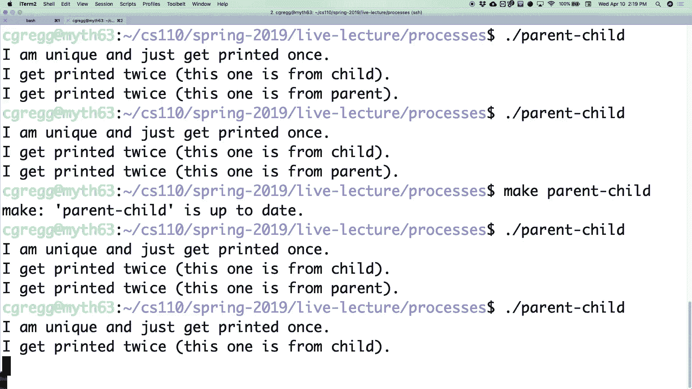

这样有帮助吗？嗯。再看一遍。我的意思是，我们就快速再看一遍。如果你理解了这个逻辑部分，你肯定需要搞清楚。好。

如果父进程最终不得不休眠，那你的问题就是一分钟后的事。父进程确实需要休眠，那父进程会休眠，子进程会立即打印。大家明白了吗？明白吗？嗯。如果是子进程需要休眠，那么两者都必须等到子进程打印出来，因为父进程肯定在等待子进程休眠。

父进程必须等，无论如何，但只是因为子进程还没完成，而不是因为它在休眠。对。[听不清]，对。好问题。如果你想要在两者中都使用不同的随机数。你会看到在分叉之后才生成随机数。[听不清]，哦，这真是个好问题。

你能不能用时间，因为它们可能在同一时刻？嗯。那可能也会有点麻烦。你得想办法得到不同的种子，时间可能不是最好的选择。嗯。还有其他方法可以得到种子，但这是一个很好的问题。非常好的问题。嗯。这里有个问题。对。抱歉。你能解释一下为什么只有父进程或子进程会休眠吗？

是的。那么问题是，为什么它只会让父进程或子进程？好吧。你应该同意，*希望此时你已经同意*，两者共享完全相同的内存。这意味着它们中的随机数生成器将给出相同的数字。好吧。基于返回的PID值，其中一个决定是父进程，另一个是子进程。

这行代码的意思是，如果数字模二等于父进程，对吧？

然后休眠一秒，意味着如果是父进程且模二的结果是1，那么它就会休眠。如果是子进程，它不会休眠。但是它们不能同时是父进程和子进程，因为它们的布尔值会不同。父进程和子进程是不同的。这里有个问题。对。

所以我有一个问题。[ 听不清 ]，对吧。只有一个进程在休眠。是的。[ 听不清 ]。至少有一个进程在休眠。是的。完全正确。所以其中一个进程绝对在休眠，因为它们的布尔值不同。很好。是的。[ 听不清 ]，模二操作是做什么的？随机函数调用会给你一个介于零和二的32次方减一之间的数字。

我们只是试图让它在0和1之间。所以现在我们的模二结果就是在0和1之间。是的。[ 听不清 ]，如果你休眠更长时间，子进程能等待吗？是的。子进程实际上几乎总是在你休眠时会等待。是的。让我们来做这个。我们可以检查一下，看看父进程，看看父进程，这就是我们将要做的。

我们要稍微修改一下，改成`PID return = wait PID`。然后我们会打印出来看看会发生什么。`Print F`，PID return。它可能实际上会，知道吗，它可能真的总是给出子进程的值。我想它确实会。它可能会给出负一。我们会看看它是否已经结束。但我认为它会的。

我觉得这可能不是我原本预期的样子。但无论如何，PID返回的就是这个。

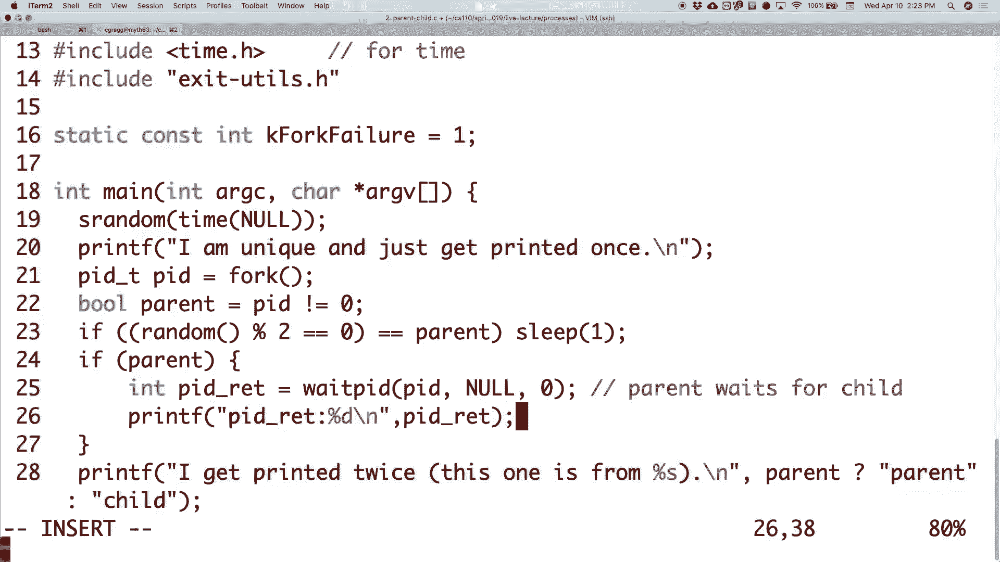

是的。这样应该可以。让我们看看。父进程 子进程 父进程 子进程。好吧。返回的是这个。然后现在它在等待。不是的，它总是会。看起来它总是会将返回结果给父进程，而不是子进程。即使它已经结束。事实上，如果子进程已经结束，它会立即返回。

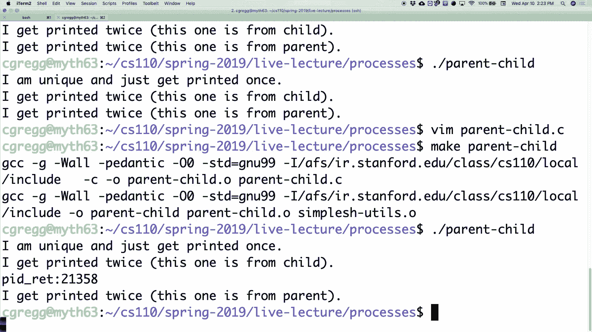

好的。还有其他问题吗？嗯？我已经快弄清楚这些了。好吧。那么如果我们想要多个子进程会发生什么？好吧。如果我们有多个子进程，那么我们实际上可以等待所有子进程。好吧。我们可以通过使用负一作为PID的第一个参数来等待所有子进程。

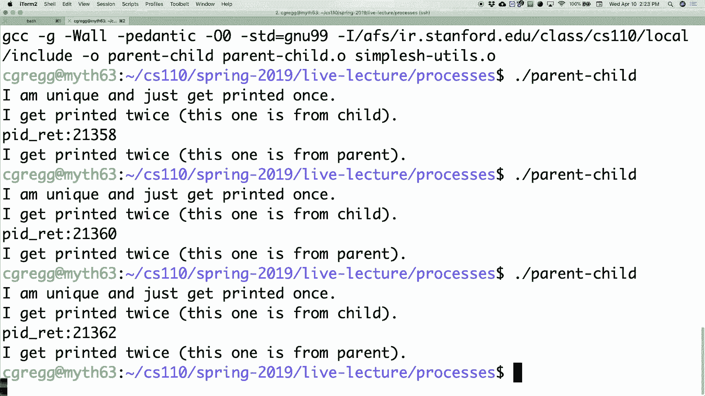

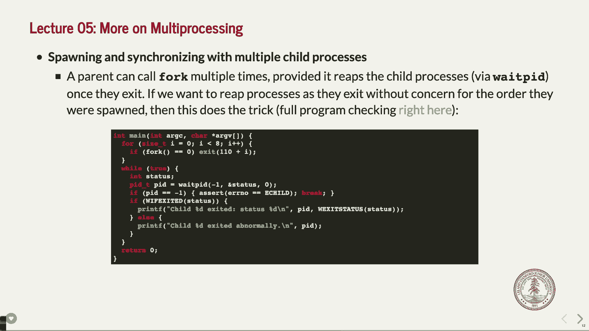

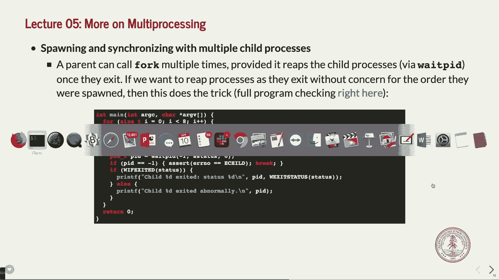

等待PID，意味着等待任何一个子进程。好。如果一个子进程已经结束，返回给我并给我PID，依此类推。好。任何，关于它，绝对是任何一个子进程。所以你将看到我们将在一个while循环中做这个，程序会说，好，我们将等待所有的子进程。你会看到我们在做这个时的过程。

所以在它们退出时要进行回收。好。我们要做什么呢？好，我们要做的是，我们将创建八个子进程。对于size t i等于零；i小于八；i加加。好。如果是for。好。好。等于零。这是什么意思？是子进程。好，我们将以值为一、十加i退出。

所以我们将为每一个子进程得到不同的返回值。一十，一一一，一一二，等等。好。然后这应该就可以了。所以我们将始终在那里退出。然后我们将做八次。好。问题。为什么你使用exit而不是直接返回一十加五？

你可以返回一、十加i。我们通常退出子进程而不是直接返回。结果证明其实没有什么区别。但是的，这个问题很好。我们通常这么做。好。那我们就这么做吧。然后现在我们要说，好，好的。我们将做一个while。我们将在这种情况下做一个while true。

我将展示一些不同的内容给你。我们可以搜索它。我们可以等它们全部完成，因为我们知道在这种情况下会有八个。但我们将做这个状态。P.I.D.T。P.I.D。等于权重。P.I.D。负一。然后我们像之前那样传递状态。然后是零。好。

然后我们将检查。如果我们发现P.I.D.等于负一。那么，这意味着没有更多的子进程等待，所以我们可以在这种情况下停止while循环。好。实际上，我们在这种情况下想要做的是，虽然你不必总是这么做，但这是一种错误检查。我们将断言在这种情况下错误码等于每个子进程的错误号。

我一会儿告诉你那是什么。然后我们将跳出循环。好。我们在这里做的是，我们说，如果返回值是负一。从技术上讲，如果返回值是负一，表示没有更多的子进程了。但也可能意味着，嘿，你的wait P.I.D.调用出现了实际错误。

它有点过载了。所以它有一个wait P.I.D.，也有错误。它肯定可能会有错误。但它的作用是将每个子进程的错误码设置为错误号，这意味着我给你错误是因为没有更多的子进程了。如果你检查这个，那么这其实没问题。实际上，这对于我们的目的非常合适。好。

是的，这是一个错误。哦，是子进程的问题。好吧。我们继续。好的。这就是我们在做的事情。好的。接着我们应该检查我们的 W 是否退出状态。好的。然后打印子进程 %d。

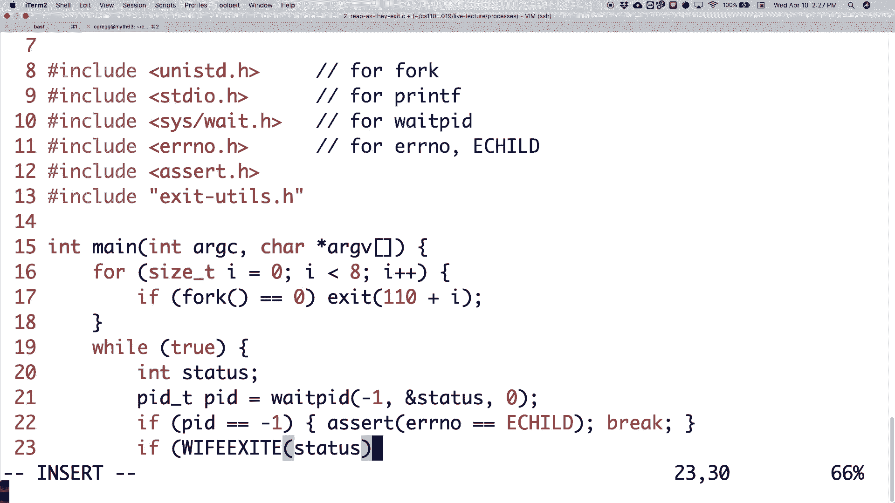

退出状态 %d。现在让我们打印 P.I.D. 和退出状态。所以你可以从状态本身获取退出状态，这将是子进程的返回值。

好的。然后看起来我这里好像有些错误。等一下。让我们看看。打印那个子进程的额外信息。子进程的额外状态是 P.I.D.W.X. 状态。

就是这个。好了。怎么样？那个亮了。 但我不认为那是实际的问题。哦，有个括号。是的。好的。然后是 else，接着打印子进程 %d，正常退出。然后我们只需要打印 P.I.D.，因为没有其他内容了。然后这就行了。接着返回零。好的。

那么让我们看看我们这样做会发生什么。哎呀。那是我不想做的。好的。

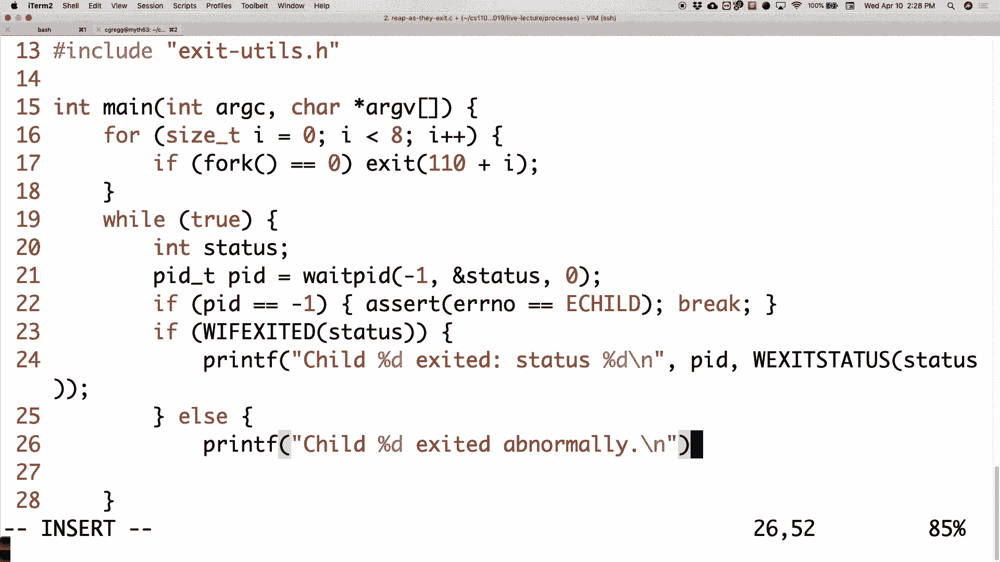

有人做过加密他们的文件吗？这很糟糕。我是说，试试看。好的。创建。重新处理它们退出。好的。

好的。它会随着它们的退出按顺序爬行。应该发生的情况是：10，11，12，13，14，15，16，17。但是我们再做一次看看。看看。10，12。

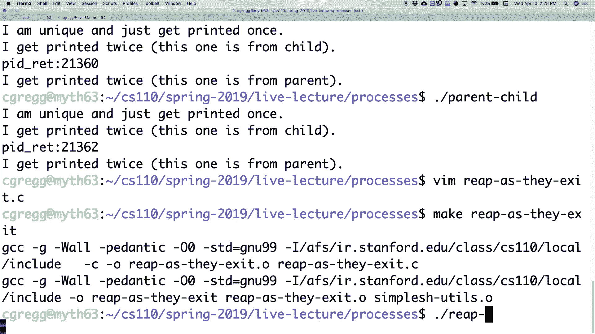

好了。终于，我搞错了顺序。10，11，12，16，13，17，14，15。这个顺序不够特别，因为我们说的是等待任何子进程退出，任何一个子进程可能会先于其他进程退出。虽然有可能先到的进程先退出，因为它仅仅是由于在子进程的情况下。好的。所以我们可能会遇到一些非确定性行为。好的，大家看明白发生了什么吗？

等待 P.I.D. 为负一，这样可以为你做这件事。好的。我们来看看，如果我们真的想按顺序等待它们会怎样？比如，我们能按顺序等待它们吗？好的。我们当然可以，这是它的功能。

这就是它做的事情。我提到了错误号和所有的内容。如果我们真的想按顺序等待它们会怎么样呢？让我们看一下另一个程序。

这个将按 fork 顺序回收，因为我们要按照它们的顺序来处理它们。好的。接下来我们做类似的事情。但现在，如果我们要按顺序等待它们，我们最好知道顺序是什么。

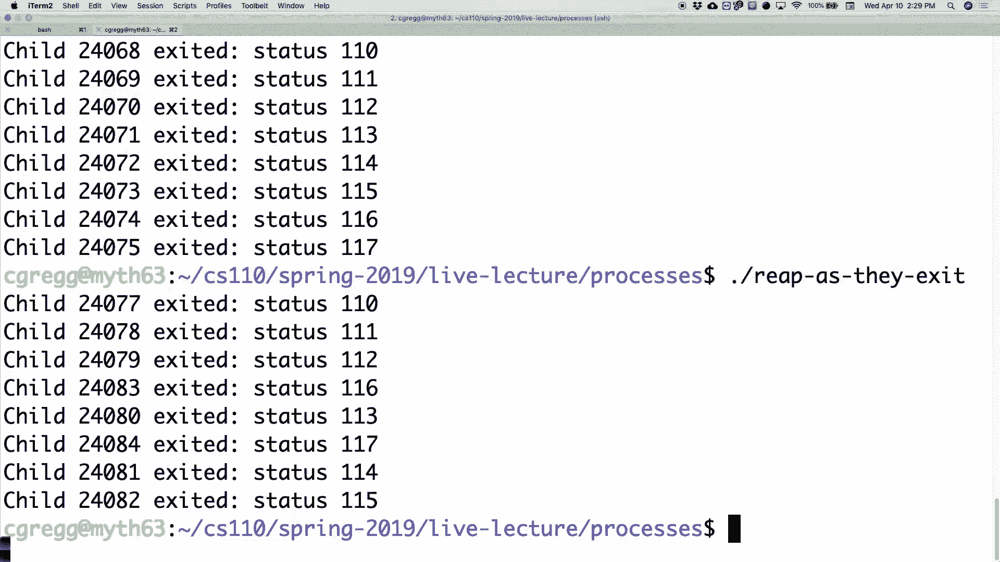

好的。所以我们可能想做类似P.I.D.T. 子数组的八项。对吧？因为现在我们需要追踪所有的P.I.D.s，如果我们要按顺序等待它们。我们将有相同大小的T。I等于零。I小于八。I加加。然后。然后我们将会在这里做状态。P.I.D.T. 对不起，我会在这里放一个公式。

在这种情况下，我们将把它们都创建在这里。如果子项为I等于分叉。我们将做一些公式。我们将做一些公式。我们将做一些公式。好的。然后，我们现在将遍历它们，另一个T。I等于零。

不是一个while true循环在这种情况下。虽然如果你真的想让它工作，你可能也能做到。好的。在这种情况下，我们现在要做P.I.D.T. P.I.D. 等于等待P.I.D.，等待某个特定的子项。我状态为零。好的。让我们确认我们得到了正确的子项，尽管我们几乎总是会。

P.I.D. 等于等于子项I。好的。然后，确认真的没有人在等待。我们现在只等待特定的一个。然后我们继续。

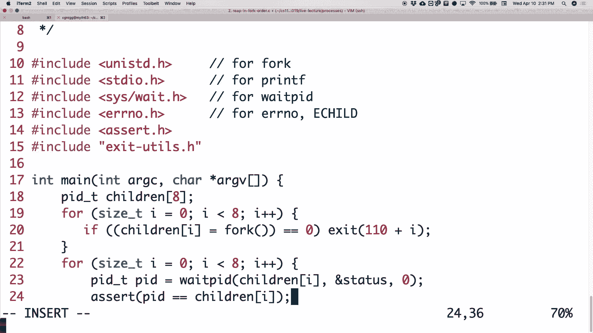

我们现在将同时检查几个事情。W.X. 它的状态等于110，再加上这像是额外的检查，以防万一。好的。然后我们将打印子项，带有P.I.D.，百分比D已被计算。

并返回百分比D的状态。句号。换行。子项。我。我们将给出它的实际状态。

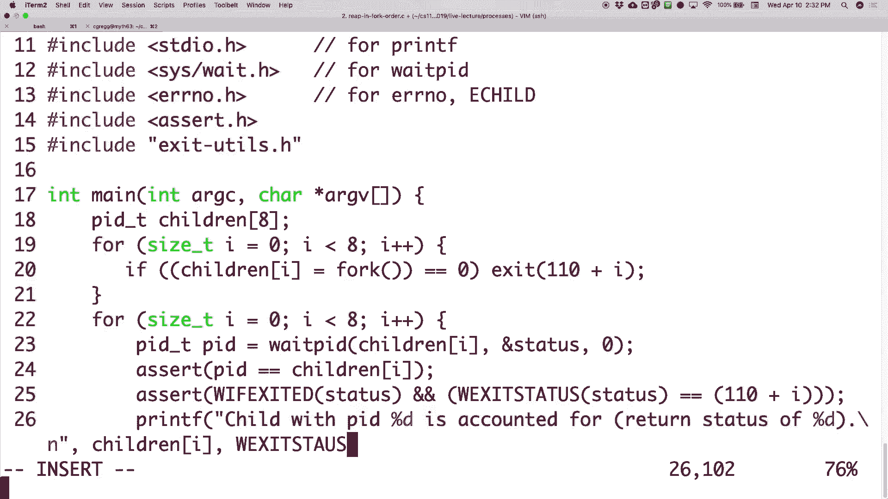

这是返回值。好的。就这样。再说一遍。

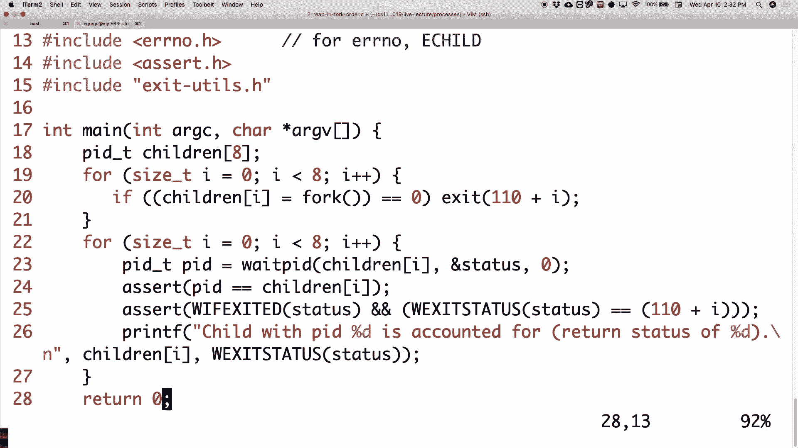

我不需要初始化它。哦，你需要声明它。我确实需要清除它。我不初始化，谢谢。谢谢。好的。还有其他问题吗？让我们试试看。四分之一的结果。好的，看起来不错。

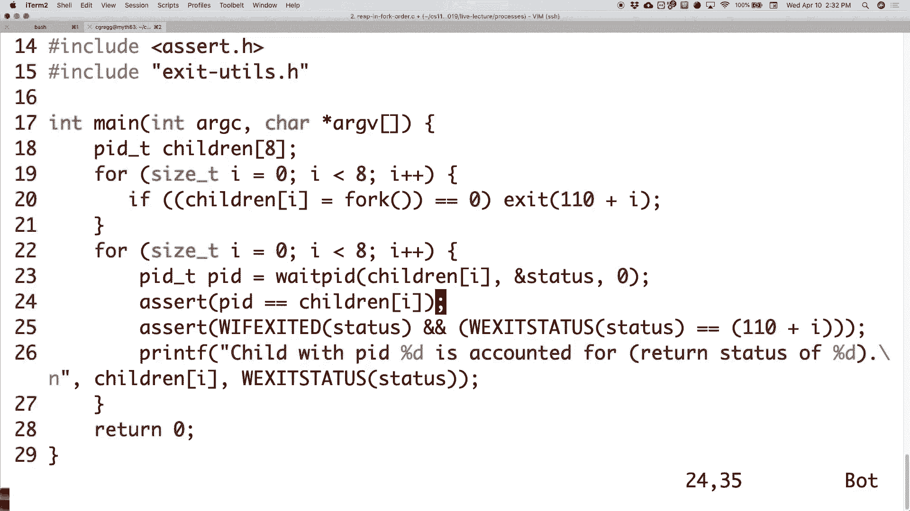

现在，在这种情况下，它必须等待每一个。所以我们将始终按顺序获取它们。

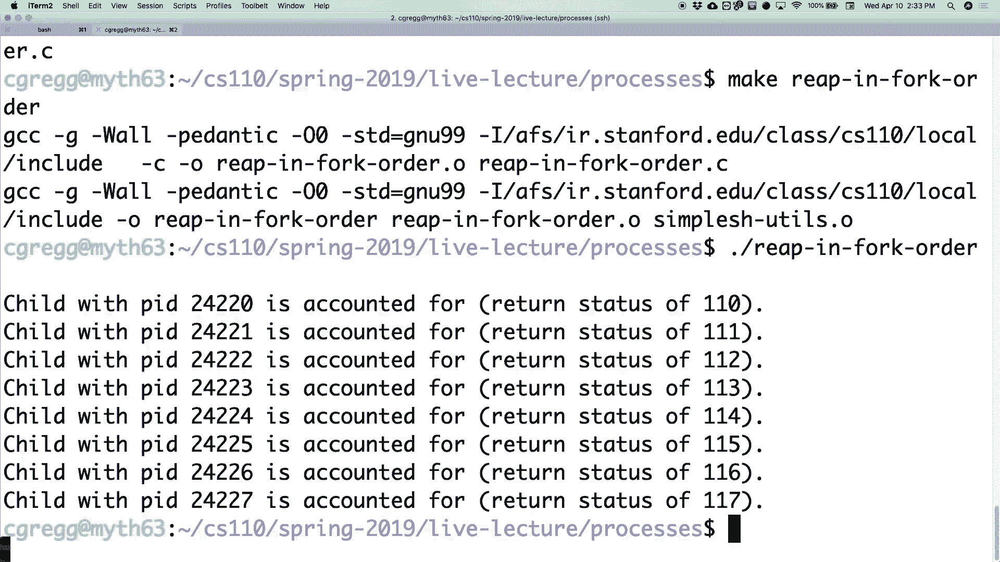

因为它在等待110、911，然后是112，等等。而且它们可能以不同的顺序结束。它最终会结束这个过程。另一种方式是P.I.D. 会在哪里，特定地去请求某个特定的。它会返回并说：是的，你得到了。好的，你对这个有什么问题？是的，这是个很好的问题。

你必须小心。问题是，它不会用P.I.D.填充子数组吗？只会填充父级。

它给了孩子的P.I.D。记住，孩子的P.I.D。是什么，或者说fork对孩子的结果是什么？零。如果你是孩子，它就不是孩子的P.I.D。只有当你是孩子时，才是零。所以在这种情况下，我简要提到过这一点。在这种情况下，是的，它为孩子版本的那个数组放入了一个零。

但我们会忽略它。我们不在乎，除了问它是零还不是零？

我们得继续跟进。是的。在向前执行时，它将等待孩子I继续。啊，好的问题。当你在这里等待孩子I时，不一定总是会是零。现在每次fork时，都会有两个数组。一个是父进程数组。你fork了，孩子有自己版本的数组。父进程仍然保持原来的版本。

它让父进程获得孩子的P.I.D。孩子得到零，但它会立即退出。哦，工作了。是的。这就是为什么我要非常小心地说明，fork的返回值不是P.I.D.，除了父进程。对于父进程来说，它永远是孩子的P.I.D。对于孩子来说，它总是零。如果孩子出于某种原因想要获取自己的P.I.D.，它必须调用get P.I.D。问题？没有。

孩子们从不执行第二个for循环。没错。好问题。是的。所以，在这种情况下，我们大多数时候会调用父进程的get P.I.D。它已经退出了。一些孩子已经退出了。是的。事实上，大多数孩子在前几个循环后可能已经退出了。

你可以在孩子退出后等待它，它仍然会返回。这一点我们稍早前测试过。好问题。是的。孩子是否能像i=7那样，回顾i=5或i=3时孩子们的P.I.D.值？不。是的。它可以。没错。是的。

这是一个好问题。第六或第七个孩子能看到前面孩子的所有P.I.D。值吗？当然。在那之前，它还是父进程的。是一样的。是的。父进程保持着，并持续填充。所以当然可以。现在你并不是想隐藏这些给孩子们。在这种情况下是不会的。好问题。

是的。因为我很困惑。为什么你可以在一个孩子退出后等待它，当你想像重新利用那个进程或做其他事情时？

为什么你可以在孩子退出后等待它，当你想重新利用那个孩子做其他进程或事情时？

它还没有被清理，直到调用wait P.I.D。为止。所以你仍然在等待。事实上，因为它还没有被清理，所以会有一些额外的开销。这就是区别所在。一旦结束，它会等待有人对其进行wait P.I.D。调用，基本上。这是清理过程。是的。为什么第一个fork看起来不像创造那样的树结构？

是的。为什么第一个fork看起来不像创造那样的树结构？你告诉我。这里第一个发生了什么？每个孩子发生了什么？

每个子进程接下来会做什么？它会退出。所以它永远不会进入下一个循环。因为它退出了。是的。好了。很好。这就像，你可以理解为什么第一次接触这些内容时会觉得很有挑战性。

第一次看到它的时候，可能是这样的。好吧，这就是它的理论。你可以让任何一个子进程按任何顺序执行。但循环仍然会被阻塞，等待第一个子进程结束，然后是第二个，第三个，第四个。就是这些进程的工作方式。好吧。好了。这就是 fork。

现在我们展示了一些有趣的 fork 示例，展示了你的程序如何在两个不同的方向上运行，你的代码在子进程中运行，父进程中也有代码，等等。结果是，大多数情况下你使用 fork 并不是为了在父进程和子进程中都执行代码。实际上，通常发生的情况是，我们会让另一个程序运行。

我们将启动另一个程序，让它执行它的任务，我们可能会捕获输出，也可能不会。但实际上，我们正在运行另一个程序。这就是最初的原因。fork 一个进程，让子进程运行另一个程序。这就是它的主要用途。你也可以做我们一直在做的事情，展示这些有趣的树形示例和有趣的子进程。

但大多数时候，我们要做的就是这个。好吧。我们将运行一个完全独立的程序，可能会捕获它的标准输出，也可能不会。我们也可能会或不会向它发送标准输入的信息。好吧。这就是你的 shell 做的事情。好吧。当你在 shell 中输入 LS 时，对吧，发生的事情是 shell 是一个程序，当你输入 LS 时，它会处理这个命令并执行。

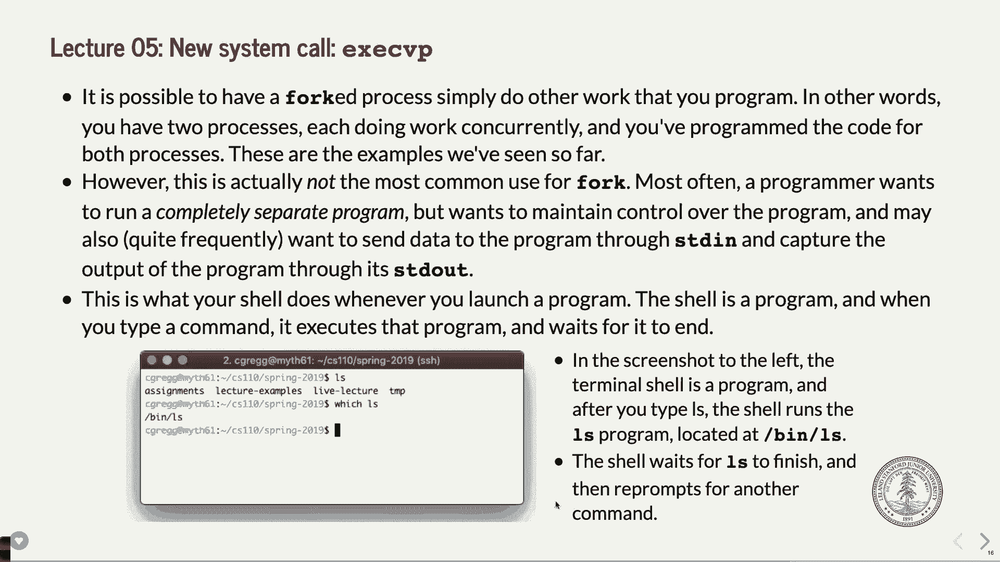

“哦，好吧。系统中有一个叫做 LS 的程序。”然后它运行这个程序，等待它结束，然后给你一个提示。这就是 shell 在做的事情。所以 shell 正在做完全一样的事情。它正在进行我们所说的 fork 操作，然后是 execvp，这是另一个系统调用。

而这个系统调用做的就是以下操作。它基本上是用另一个程序重启进程。好吧。这是做这件事的一种方式，实际上也是默认的做法。我之前给你们展示的那篇论文可能是在抱怨这个。它在抱怨：“为什么我们要这么做？有其他更好的方式可以做这些事情等等。”

"但这就是它的作用。Execvp，它基本上是一组命令，都叫做exec，就像执行。猜测。vp刚好是我们将要使用的某种变体。你可以查阅其他的。如果你输入man execvp，man execvp。你会看到它实际上列出了一大堆。

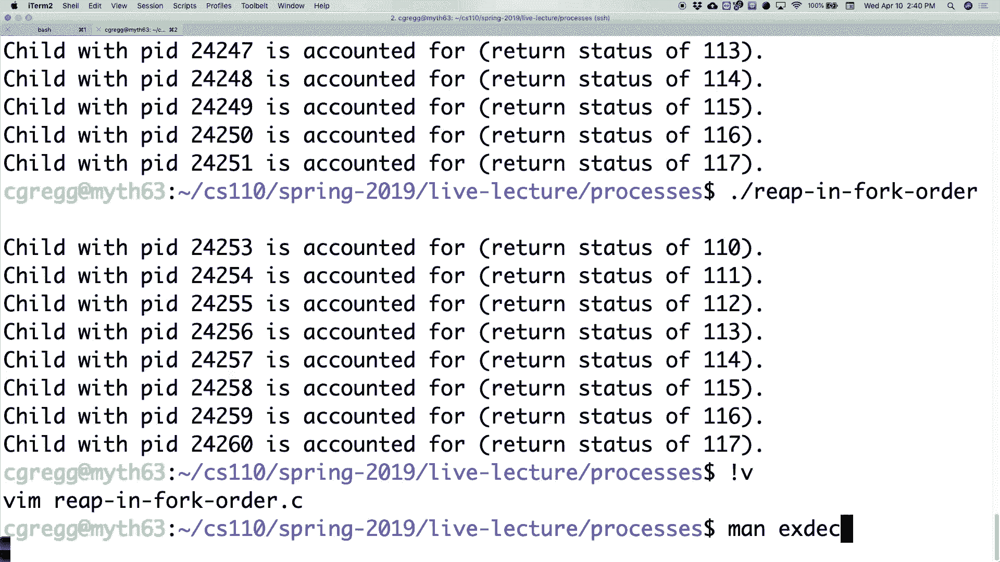

execl，execlp等等。我们使用的就是这样，你可以使用不同的环境变量。

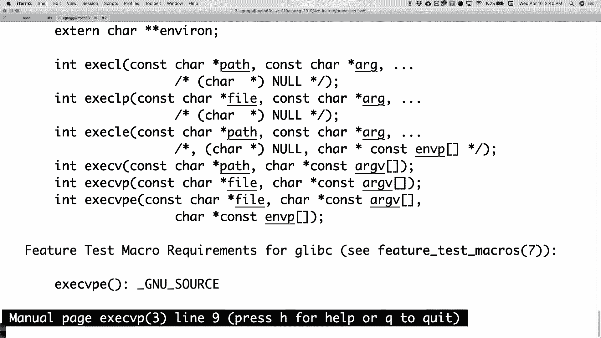

其实并不重要。我们要使用并关注的是execvp，它基本上是接受一个路径，然后接受一个像argv一样的参数数组，并且使用这些参数在那个路径下运行程序。好的。事实证明，就像你所有其他常规程序一样，路径和argv零将会是一样的。因为argv中的第一个参数总是程序的名称。

因此，我们将把程序的名称作为路径，这个路径也就是argv零。好的。它就是这么工作的。它所做的就是运行它，基本上接管那个进程，运行那个程序，这就是它的作用。现在有趣的是，如果它不工作，假设你给它一个错误的路径，而路径无法工作，它实际上什么都不运行。

它会返回一个错误消息或错误返回值负一，你可以捕获它并说哦，发生了错误。好的。如果它成功了，换句话说，如果它运行了那个程序，它就永远不会返回到调用函数。

它就是永远不会返回。为什么？因为这是一个全新的进程。实际上它已经被“吞噬”了，和你刚刚通过fork创建的进程一样，除非它已经成为了它自己的进程，拥有自己的所有内容。好的。所以这就是execv发生的事情，杰瑞把它放在这里。那个井号深度。对吧。但如果它成功，它就永远不会返回。就是这样。好的。

所以这就是execv。如果他这么做，主要的原因就是我们会使用它来做这些，并调用它们。

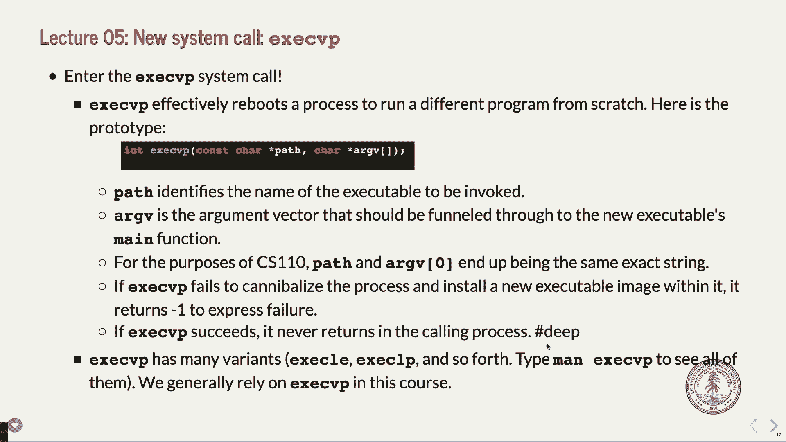

好的。我们要做什么例子？我有七分钟时间，我猜我可以做完。是的，实际上它并不算那么难。我们将做一个小的系统示例。好的。我们基本上要做一个小的shell。如果你们在CS107E课程中，应该了解shell，并且你们在这门课的作业中也将构建一个shell。

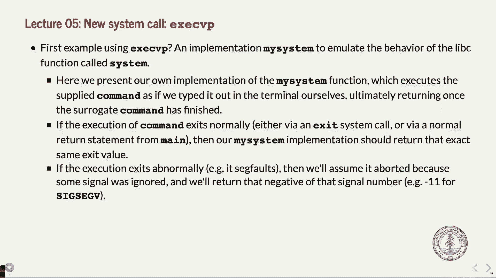

但是现在我们要做一个小的，叫做我的系统。好的。它将会有一点小小的作弊。

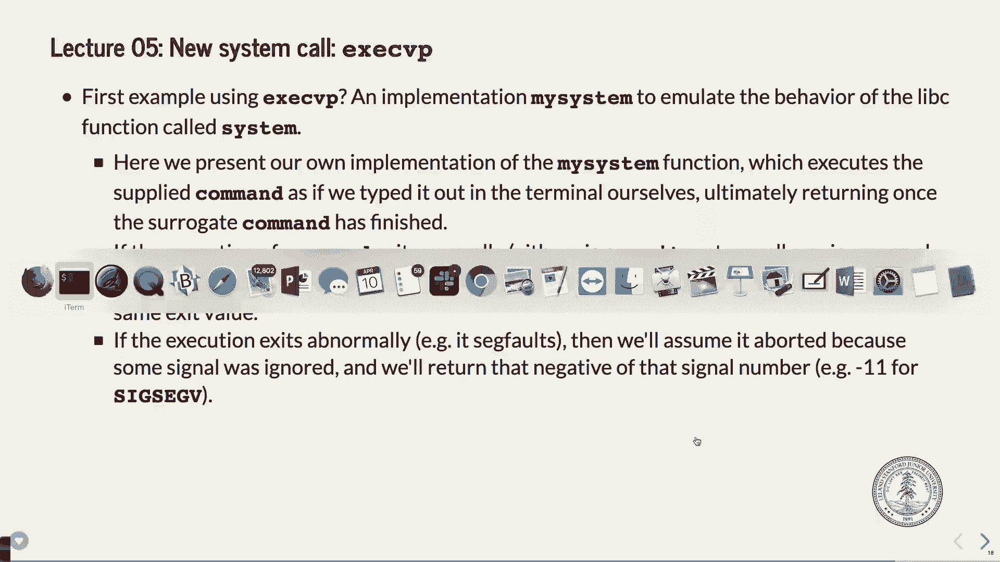

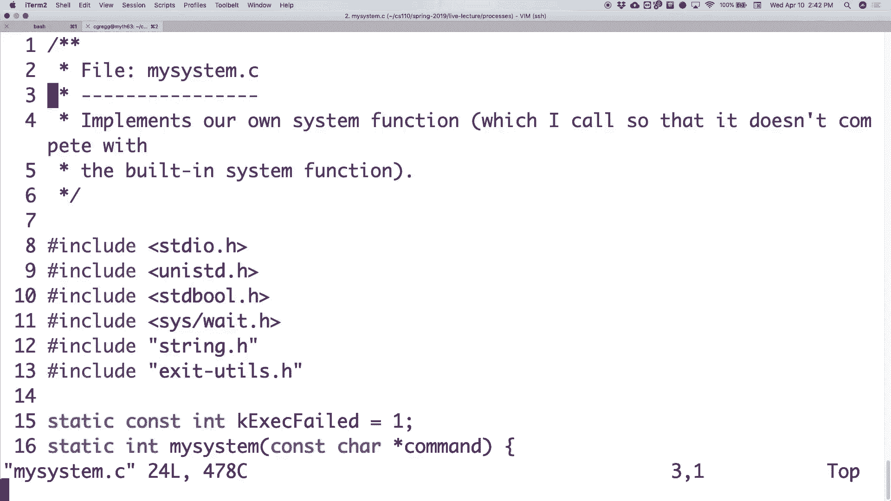

它将使用shell程序来运行我们给它的程序。为什么？

因为我不想解析命令行的不同部分。你将看到我们这样做时会发生什么。这是一个很好的初步示例。好的。我们将实际调用我的系统函数。它将传入我们想要运行的命令。好的。它将这样工作。

好的。PID等于fork。所以，当你执行这个系列的操作时，首先需要一个新的进程。你不一定非得有另一个进程，但是如果没有，你永远无法回到原始程序。它会被吞噬掉。好的。如果PID等于零，意味着我们是子进程。那么，在这种情况下我们要做的就是，好的，我们的参数等于，我们要做的就是运行一个叫做bin斜杠SH的程序，那就是将要运行的程序。

然后如果你想从其中运行另一个程序，可以使用斜杠 SH。你必须使用一个命令参数叫做dash C。然后这是实际的命令，你需要让它成为常量，或者实际上需要将其设置为非常量。它只是一个警告，实际上没有太大关系。但是在这种情况下它会作为常量传递。命令和没有。好的，你必须结束它，就是这个。谢谢。抱歉程序出问题了。

顺便说一下，这只是在创建一个数组。好的。你必须以没有（no）结束最后一个参数。这是我们做这些类型数组的方式，因为它们都是字符串，正如结果所示，我们可以这样做。好的。好了。那么我们要做的就是这样。然后到这个时候，我们可以说，哦，太好了，精确的CVP，参数零就是这个。

bin斜杠SH，然后是参数。然后这实际上会执行这个进程，如果我们能打印出来的话。如果我们到达这个点，意味着我们失败了，因为为什么呢？因为如果它没有到达这里，它就不会返回。如果它能工作。好的。调用失败，无法调用斜杠bin斜杠SH来执行提供的命令。伤心脸。好的。我猜我们可能应该做。其实没关系。

我们稍后会有一行新的代码。好的。然后退出零只是为了表示我们完成了。我们有了我们的分叉，任务完成。好的。如果我们是父进程的话，它会这么做。我们将进入状态。好吧。我们将等一下。好的。

等待PID。PID状态和零。哎呀。好的。然后返回。W如果退出状态。好的。如果是真的，我们将说退出状态。否则我们将返回。我们将返回终止状态的负值，这基本上就是说发生了什么。不要太担心这个。至于那个，我想是term。是的，应该就是这样。

然后就是这样。那就是我们的函数。好的。我们来写一个小驱动程序。好的。驱动程序就是调用它的主要部分。所以我们实际上需要设置它。

好的。我们将其做成一个小终端。我们将持续执行一个循环，直到你完成。让我们看看。我们想做什么。我们来创建一个字符命令吧。设定它为 K max。我们假设你不能在命令中输入超过2048个字符。好的。然后使用 while true。它将永远执行下去。

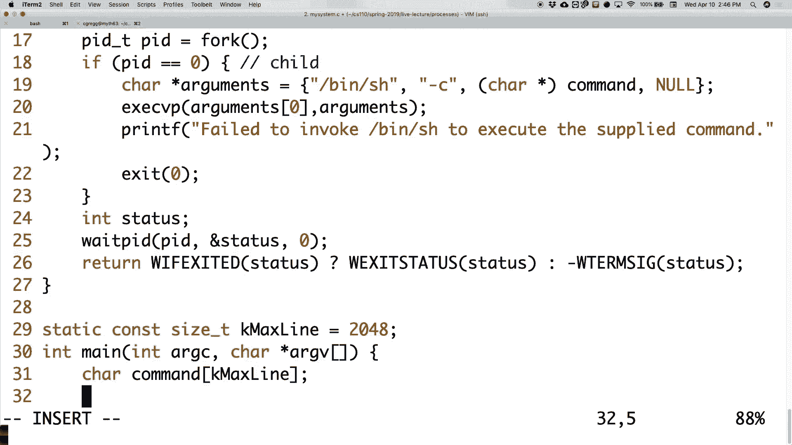

使用 while true，我们将打印出一个类似提示符的内容。然后使用 F get S，这基本上是一种从文件描述符获取内容的好方法。对吧。在这种情况下，它不是文件描述符，而是另一种类似的东西。设定 K max 行数，以防你输入太多。

然后我们将从标准输入获取数据。

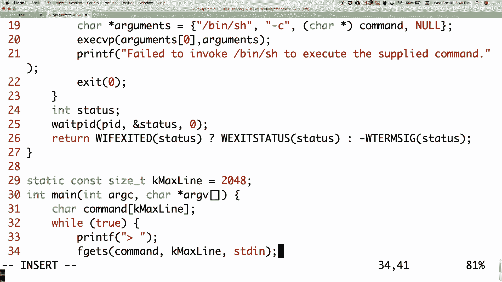

这就是你可以用这个方法做到的。如果是 F E O F 标准输入，这基本上意味着如果我们结束了，如果我们按下控制 D，这将结束它。我们将跳出循环。

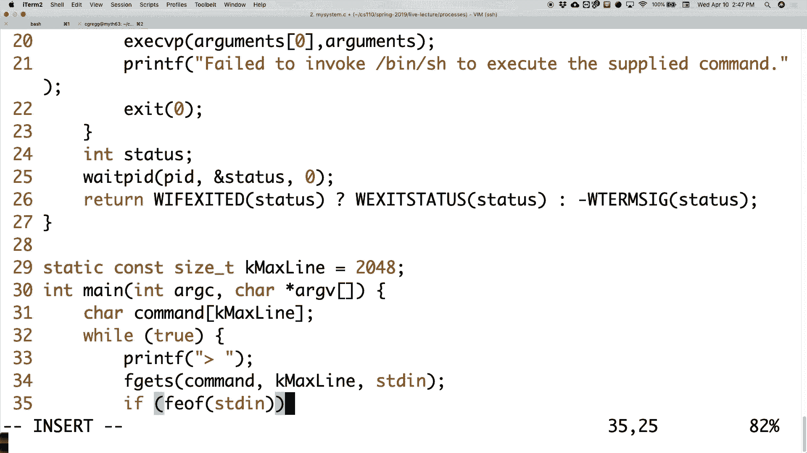

否则我们将说进入。然后我们将用零覆盖命令的最后一部分，而不是新的一行，这样你就会得到一个新的行。就这样。好的。我们将覆盖结尾部分，让你继续运行。

可能忘了在这里打印内容。好了。好的。最后我们将打印出 print F 返回码和百分号 D 以及我的系统。

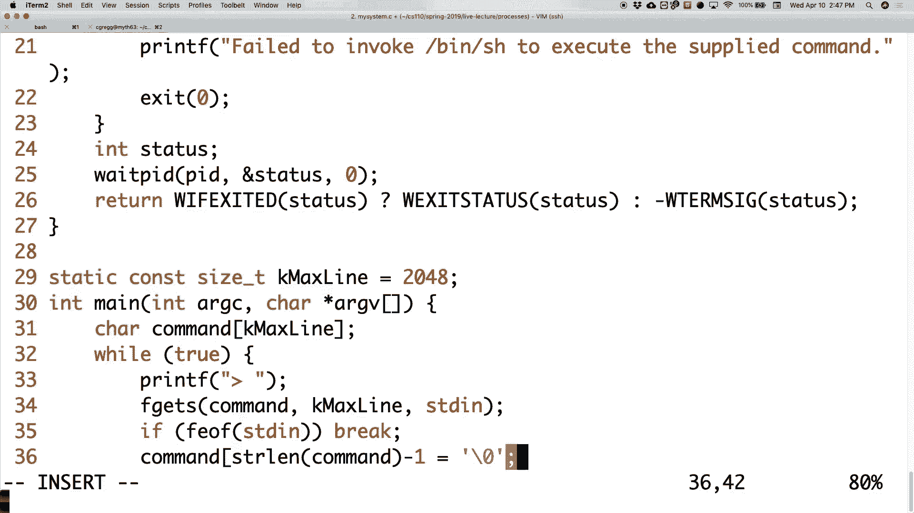

就这样。好的。然后我们将打印一行新的内容。然后打印我们的回合。好的。希望如果我做得对，它将使我的系统运行起来。

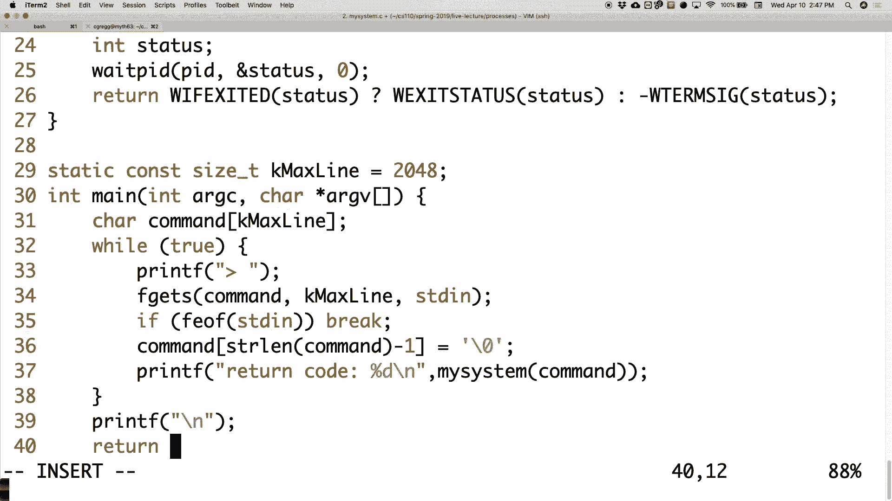

哦不。让我们看看。期待一个成本图表。我们看看。等等。传递参数使整数成为指针。我在这里做了什么？

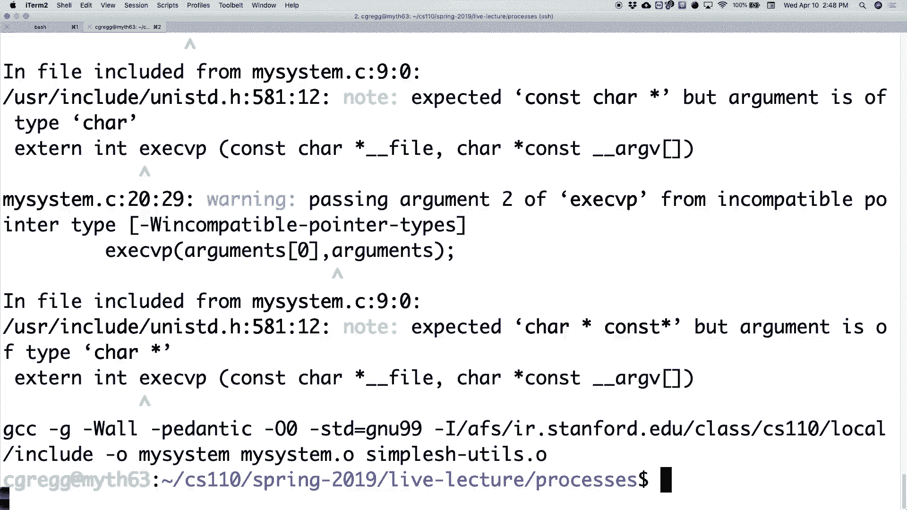

Chart star arguments 是我不想让你们再等太久了。我只想为你们运行它。等等。让我们看看。Chart star。哦，参数应该是对的，不是吗？

然后我的系统需要是一个数组。谢谢。

这样应该就可以了。好了。现在我的系统会给你一个提示符。所以这是你的提示符。如果你输入`LS`，它会执行`LS`命令。对吧。然后这是我们的提示符。如果我们说，我们实际上可以运行Python或者其他什么的。对吧。你想做什么就做什么。对吧。如果你想运行，它会返回代码。如果你输入一些无效的东西，它会说“权限被拒绝”，或者如果是其他错误，它会显示返回码127，这表示不正确。

好的。这是精确CEP的第一个例子。我们将在周一开始学习。到时见。

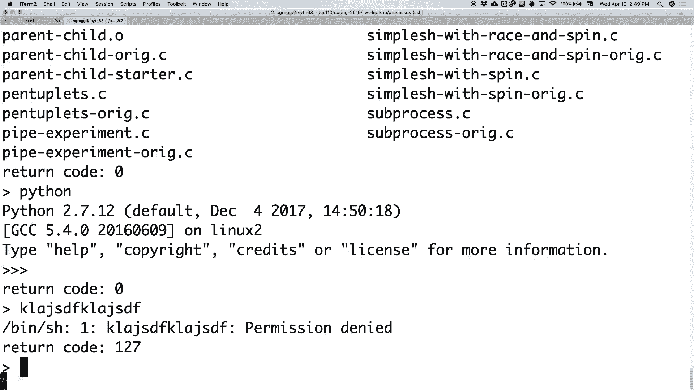
