# P5：Lecture 5 Execvp Introduction - ___main___ - BV1ED4y1R7RJ

 Okay， welcome back。 There are fewer of you here than before。 I kind of figured that might happen over the course of the quarter。 Thank you for joining us today。 So today we're going to continue with talking about fork and we're going to talk about this new thing called exec CVP。 which is generally why we use fork as it turns out。

 And I will also talk about the assignment that's going out that just went out today。 Speaking of fork。 So， I， let's see， how can I do this？ I took， so I was。 I was finishing some things up today and then I took a little break and I went to Reddit。com。

 Our programming， because I look at the programming ones， right？ And let's see。 the first thing that's there is this thing called a fork in the road。

 And I went， oh， cool。 We're talking about fork in class today。 Let me click on it and see what it says。 What do they must be talking about？

 Some cool things on， on fork。 And then let's see， is the actual paper here。 I believe it is。 There it is。 Okay。 So I go great。 This thing called fork and order。

 The received wisdom suggests that Unix is unusual combination of fork and exec。 which is what we're going to talk about today， for process creation was an inspired design in this paper。 We argue with that fork was a clever hack for machines and programs in the 1970s that has long outlived its usefulness and is now a liability。 And I went， oh no。 Here we go。 And it talks about。

 and so I read this paper and it talks about how fork is actually not the best thing in the world to teach。 Like as the first thing， which is exactly what we do in this class， is teach the first。 It says。 as designers and implementers of operating systems。 we should acknowledge that forks continued existence as a first class operating system primitive holds back systems research and deprecated。

 As educators， that's me， as educators we should teach for as a historical artifact and not the first process creation mechanism students encounter。 Sorry。 Sorry。 So， by the way， this is written by Microsoft who， for what it's worth。 does not produce a Unix operating system。 They have their own operating system。 But it actually has some interesting interesting things to say about fork and about how there are some things that we will actually talk about where it does produce not the best like answer to kind of your questions。

 For instance， for happens to be what we call not threads， say。 and we will talk about threading a little later in the course。 And it means that you can't mix and match forks and threads in certain ways。 And that's kind of not a great thing。 So， as an educator。

 I'm presenting this to you as a historical， what did they say？ A historical artifact。 So take that for what it is。 You still have to know it for the mid-term exam。 And who knows？ Maybe。 maybe we will retool the way these things go as we do this a few more times in the course。

 Anyway， I thought that was interesting and a little sad that I thought it was going to be this great article。 There you go。 Alright， so the other day in class， somebody asked a great question。 I figured it is。 I apologize。

 Someone asked a question because we were putting up all these diagrams about file systems。 And the question was， "Hey， these various process control blocks that the operating system keeps track of that actually have file descriptor pointers basically in them can point to file descriptors in the open file table。

 And there is one open file table。 And those descriptors in the open file table lists。 has some information about the various files that are open， including the mode。 whether it's read or write， read only， etc。 It also has the cursor position in there。 And the question was， "Wait a minute。 If there is only one copy and two files are allowed to simultaneously read a particular file and be at different places in the file。

 how does that work if there is only one copy in the open file table？" And I said， "Well。 it's probably true。 There is more than one copy。" And I wasn't sure。 So I went and looked it up。 Indeed， the open file table， every time you call open， creates a new entry in the open file table。 which has a cursor for it。 So if two programs call open on a particular file or two processes even。

 call open on a particular file。 You do get duplicates here。 And I said， "Well。 the reason it's only one is because you don't like all these duplicates。" The difference is that there are， when we do fork， for instance。 we know that you copy all of the memory and therefore they will indeed point to the same place in the open file table。

 So it is true that processes can point to the same open file table record。 which will have one cursor where in the file you are。 But if two programs open it up。 you do get duplicates in there。 So that's how you get two different cursors。 It's clear things up a little for the people who are curious about that。

 Not the biggest deal in the world， but that's how this ends up working。 And I thought I'd at least give you the information I looked up on that。 Okay。 So hopefully first assignment is finishing up due tonight， midnight no extensions remember。 If you do have trouble finishing up there， I believe there are still offsours tonight。

 so you guys should be able to get to there if you need to。

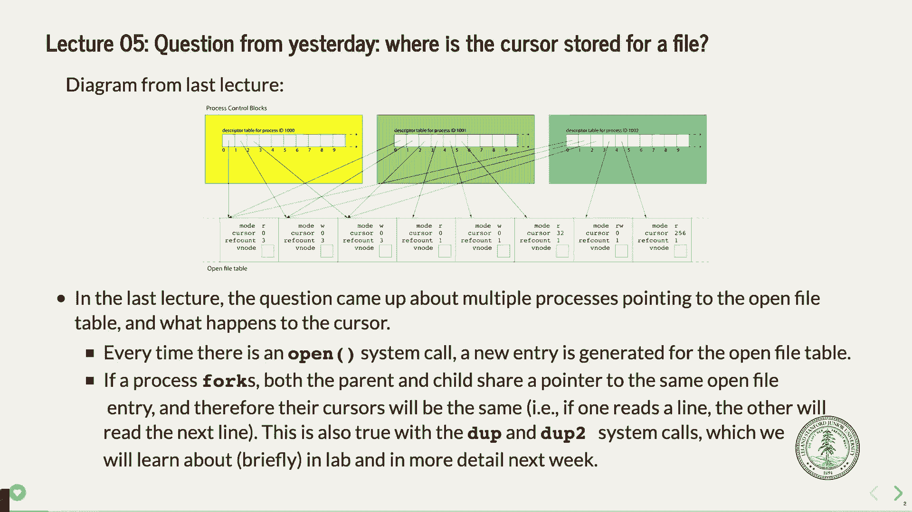

 The second assignment， which is the next assignment。 in fact the first assignment where we're really testing things that you probably haven't seen before。 namely the file system stuff。 And it is on the file system we described in class。 specifically the Unix version six file system from the late 1970s。

 Okay， why do we care about that file system？ It happens to be a decent file system。 It happens to be relatively， relatively straightforward to understand for what it's worth。 And it is just a good one to practice manipulating data structures needed for file systems。 Okay。 the test data that you're going to read from the actual test disks that we have are literally built bit for bit representations of a Unix version six disk。

 So somebody had a universe version six system up and running somehow。 probably in a virtual machine or something， and they copied the disks off and then put it in this assignment。 And that's where they came from。 And so you're going to have to figure out how to read those disks specifically。 Okay， we've given you some scaffolding for that obviously， but you're going to have to do that。

 The lectures from lecture three， very important to understand。 because I think we went over the specifics there。 And then this section 2。5 of one of the textbooks that we have， you can have a link straight to it。 is where you get even more specific information about the file system。

 So if you have questions about specifics， go there first， then ask the question on Piazza。 come to Office Hours， etc。 So the assignment is you've got this disk image and you have to be able to read and write files and find files on those that system。 Okay， and then you should be able to read the files and read any black in that file and so forth。 You'll primarily be writing in four different files， so you have code in four different places。

 We do， we suggest that you do them in this order。 First you do the functions in iNode。c。 and you can imagine what that is that's manipulating or like using the information in an iNode to get out information about the file blocks。 And then file。c which kind of puts another abstraction layer on it and says here's a file that you should be searching for。 Okay， and then directory。c which is also kind of for manipulating the actual directors。

 I guess file。c is for like reading a specific file。 Directory is going and searching for the file。 Remember you have to search for root and you have to search all the files in there and then one after the other until you find the path you're looking for the file at the path you're looking for。

 And then finally path name is actually doing the searching as well。 Anyway。 we say go through and note that order and after， I guess after the first two you'll have some functionality that you can test with either sanity check or by running the program。

 And then as each one， as you finish each one you get a little bit more functionality。 Okay。 so that's the basic idea。 This assignment is in C， not C++。 You don't have access to maps or sets or vectors or anything like that。 You've got to deal with low level arrays and you have to deal with structs and so forth。

 So no C++ stuff in this assignment。 Not the end of the world but it just means that if I think I might be able to do that with a map。 you can't。 No maps allowed in this assignment。

 Okay， the basic ideas I said you'll be able to locate and read files in this file system。 All right。 you'll be using functions that we've written for you and you're doing your own。 The one that I mentioned here that you'll use a bunch of times is called disk image read sector and it takes in a few parameters。 It takes in a file descriptor basically。 It takes in the sector number or I guess it's a file system。

 It's kind of what it is。 It takes in a sector number and then it takes in a buffer and that will read a particular sector off of this disk image and we've written that for you。 Okay， you don't need to worry about that part of it。 Finding the right block to read is the important part。 A couple things to notice or to know about it。 The function will always read disk image underscore sector underscore size number of bytes。

 And you ask yourself， well， what if the file is only 12 bytes long？

 Is it always going to read this many and this many happens to be 512 as we've discussed？ Yes。 it reads that many because the non first 12 bytes are all garbage but the disk has to read 512 at a time。 So you're responsible for saying， well， which of those bytes are actually relevant and there's a little bit of arithmetic involved with that。 Okay， so you're going to have to think about those sorts of things。

 It's critical that you read through the header files for this。 The header files are actually not that big for this assignment but there's lots of constants in there you're going to need。 For instance， root I number。 It's a constant in there。 Now we talked about that。 It happens to be one and that's the I number for the root。 But you need to use the root I number。

 You could use one but in this case it's defined for you。 There's a directory entry struct and so forth which has a file name in it and all that。 And these are the things you learn from the header files。 Okay， so make sure you read through that。 And the assignment is up right now already by the way。 You can go take a look at it。

 It's due next Thursday for what it's worth。

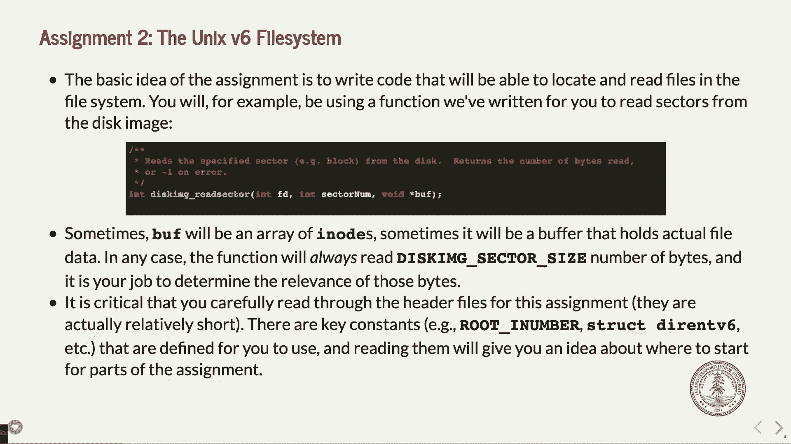

 One function I did want to talk about。 This seems to be the one that gives people kind of the most trouble。 And maybe mainly because they don't really understand what it's asking before they start trying to code it。 Not a good thing。 You should try to understand what you're trying to code before you do it。 But here's what this function is。 It's called I node index lookup。

 And you actually get passed in a Unix file system。 We have already created and initialized that for you。 You don't need to worry about that。 By the time this function gets called you will actually have an I node pointer itself。 Okay。 which is populated with the details of the I node。

 Remember it's got all the blocks that have block numbers in them and it's got the information about how big the file is and if it's a large file and so forth。 Okay， and then it's also got a block number that you're searching for。 This is the block number of the file itself for however many blocks that file takes up。 So if it's a 512 byte long file it takes one block and so there would only be a block number zero。

 Right？ Block index zero。 If it's a two， like a 1024 byte file it takes up two blocks。 Okay。 the I node does and the I node takes up it's just regular， what did I say 32 bytes or whatever。 But the actual blocks in the file are what this function is going to return the index into the actual file that you're looking for。 Okay， so that's the。 Yeah。 If I say okay so I have a file that's I have a file that's I have a file that's 1024 long。

 Right？ Okay。 The block number is going to be let's say one， which is the block into that file。 Okay。 and you need to find the index of that block in the file system that you're looking for。 Okay。 In other words， the， I'll show you and you'll see how it works in a second。 It is a bit confusing。 Yeah。 Are you coming from zero or from one？ Are you coming from zero or from one？ Good question。

 You can do either but you have to make sure you know which one when you're actually coding it up。 Yeah。 Okay。 In this case， it would probably be zero。 But here's the example I just wanted to show you。 Okay。 Here's the example I wanted to show you。 Let's say that the I node indicates that the file is 180，000 bytes long。 Okay。 180，000 bytes。

 And let's say the block number is 302。 Here's what that means。 If you go 512 bytes at a time。 the 300 second one is the one you want to return。 Okay。 See。 it's the block that you will then look up in your file system for that one。 Okay。 Remember。 a file can have a block here that's the first 512 bytes and then it went over here。

 That's the next 512。 And then one over here is the next 512 or whatever。 We're looking for the 300 and second one of those。 The block number for that。 Does that make sense？

 What we're trying to look for？ Yeah， hustle？ How do you get the other ones？ Well。 you call it once for each time。 So， I mean， if you want to get。 let's say the file had 302 blocks in it。 You have to call this function 302 times to get each individual index for each one。 You see how that works？ That's the only way you can do it。

 There's no linked list here that goes between them all， right？ You've got the seven first。 or you've got the eight file number or the block numbers inside the I node。 And then you've also got the indirect ones as well and the double indirect one as well。 Yeah。 So。 just to be clear， this isn't necessarily the three hundred and second amount of data in the file。

 No， it exactly is。 It's the three hundred and second amount of 512 blocks data。 That's what it is。 Okay， so it's not that。 So， it could theoretically be somewhere before that we're going to first block。 It could be anywhere in the file system outside the I-nodes。 but it's going to be anywhere in the I-file system。 But the， it's the。

 if you're walking through the file， you first need to go find a block for the first 512。 then you need the next 512。 Then you need the next 512。 We're trying to find the three hundred and second 512 block， right？ And to find that。 you have to know a lot about the file system to figure out how to follow all the little ways around to do it。

 That makes sense？ Yeah， so that's why this function is confusing because people don't quite get。 but hopefully we're clearing that up now。 Okay， all right。 let's just look at how we might actually do that。 Okay， let's say， as I said， the 180，000 bytes。 we're looking for block number 302。 Okay， we're looking for the third。

 three hundred and second block of 512 bytes of data。 Okay， and remember。 and this actually isn't going to matter so much for what we're doing， but blocks are 512 bytes long。 Okay， and how do you find the sector index？ That's the actual。 what sector do I need to tell the disk to read to get that third。

 three hundred and second block of information？ That's what we have to do with this function。

 Okay， well， what do you have to do？ Well， first things first。 Remember how I know， it's right。 there's those， those eight different blocks that have been there， right？ One， two， three， four。 five， six， seven， eight。

 And each one of those， if it's a small file， that's going to have a block number that's going to be the first 512 bytes。 That's going to be the next 512， the next 512， next 512， et cetera。 All the way up to 4096。 because that would be the only amount you can keep in eight blocks of， "Hey。 here's the different blocks。"， So， the first thing your function better do is figure out if this larger small file。

 because it's going to change what these numbers actually refer to， if it means。 if it's a large file versus a small file。 It's a small file， easy， right？

 You know that it's going to be what that block， it couldn't be 302， by the way。 because 302 would be two， it could only be between zero and seven， if it was a small file。 But anyway， all you would do is go to that i-node， read the number off there。 and that's the number that you send back to the return。 In this case， it is a large file。

 so you know you have indirect addressing， which changes things。 Now。 each one of these block numbers here， they refer to a block in the file system。 a segment in the file system。 But those， if when you go there， they have 256 numbers in them。 each one of which refer to a block where data is。 Okay， so， what does that mean？ Well。

 the three hundred and second block of your data is going to fall into the second indirect block。 Not this one， but this one。 Do you understand why that's the case？ There's 256。 this one is going to refer to， because this points to a block which has 256 numbers in it。 and those are the first 256。 And then the next block has the next 256。

 and 302 happens to be in that one。 Ready with me there？

 So you see how you're going to have to start thinking about this？ Okay， so what does that mean？

 Well， you are going to use disk image read sector to read the sector that is in， and I erased it。 one， two， three， four， five， six， seven， eight。 You're going to go read the number here and read the disk image from that number。 which is somewhere else in the file system。 That is going to give you a block that's going to get 512 bytes。 which is going to have individual block numbers in them。 They are all Uint_T， they are shorts。

 unsigned shorts。 Okay， you are going to then find the 302nd mod 256 short in that list。 and you are going to return the number there， which refers to the index in the block that you are looking for。 If the block number that you are looking for happen to be in this eighth one here， well。 you have another level of indirection， so your function better account for that as well。 Okay。

 so you see how that works？ Great。 I'm sure you'll have questions about that as you start doing the assignments。 but at least at this point， hopefully you're at least going， "Oh。 I see what this function is trying to get me to do。 Now I kind of have to go through all the calculations to do it。" Good。

 What questions you have on that？

 Okay， good。 So I'll just delete all the Piauts questions that come up about it。 So you also。 of course， for this assignment have to search through the directories to locate a particular file。 You don't have to follow symbolic links。 There's no worries about what's going on with a weird symbolic link。 You don't need to worry about that。 You can ignore those。

 You do need to consider directories that are more than 32 files。 because they could be as many files as we want， basically。 Do not think that that's a special case。 Don't say， "Oh， no， it's more than 32。 I have to handle it in some special way。" You have already written， presumably， you will have written at that point。

 functions that are able to read an entire file one block at a time。 Okay。 that's kind of the function we just talked about。 Like， "Go find the next block in this file。" You do not need to make this a special case。 Too many people try that sometimes。 It's not necessary。 Just deal with it like any other file and say， "I want to read the next one。

 read the next one， read the next one。" And you'll be fine。 Okay， they all fit in 512 bytes。 It's not like a file entry in that can be， like， across two blocks。 It's not going to happen because of the way they're written。 Okay？ By the way。 you will probably need to lay some structs over this data that you get back from these things。

 Right？ There's going to be structs of different things like directory entries and so forth。 Take those and kind of apply them in a CS107 sense to the data。 and you'll be able to read them off directly。 Okay？

 So that's the kinds of things I could think about。 All right？ Don't forget， and this is one thing。 file names are 14 characters maximum。 And if they happen to be exactly 14 characters， well。 there's no trailing zero at the end。 Why？ Because they wanted to save one byte。 For all those 14 length files， they wanted to save one byte and said， "Oh， if it's 14。

 I don't need to worry about it。"， So what that means is if you're trying to compare two file names。 like one that you're looking for and one that's in your data， you better not use Stercomp。 because Stercomp looks for the n zero on the end。 You might want to use Stercomp or do some other method to say。 "Hey， is there a zero at the end there？"， Okay？ You probably shouldn't do Sturlenn either。

 because Sturlenn， all those string functions presume that it's a properly formatted string。 If you have a 14 character name， not properly formatted string， but still in the file system。 Okay？

 Little nuances like that。 That happens in programming。 Like we try to save some space here and say。 "You better document it if you're going to build something like that。" And of course they did。 Good？

 All right。 That is assignment one。 It's a relatively advanced assignment。 I mean。 it's the first assignment where you're doing new stuff that you've seen only in this class and haven't done before。 Please start early。 You hear that in every class。 Come to Office Hours， Ask Piauts questions。 obviously。 The CAs are not going to look at your code for this。

 So if you have questions about your code formulated in some sort of conceptual way and say。 "Here's what I'm trying to do。 What am I doing wrong or what kinds of things do I need to think about because I'm trying to do this and draw some diagrams and so forth that the CAs can help you with。

 They're not going to like--they will look at error messages and they'll try to figure that out。 But they're not going to dig into your code and try to figure out what you're trying to do。 They're going to ask you， "What are you trying to do？ Here's the conceptual framework you find it。" Okay？ All right。 Other questions about that？ The assignment？ It's kind of a fun one。 I mean。

 it's definitely a pretty media assignment。 As far as it goes。

 Okay。 All right。 Let us go back to multi-processing。 Okay。 So here's where we left off on Monday。 On Monday we said， "Hey， there's this new function called fork。 It's actually a system call。 It's called fork。 It takes no parameters。 And it just returns to you a number integer which is either the PID of the child process that for creates if you are the parent that created that called fork or it returns zero which is the value saying basically you are the child。

 It is not the PID of the child for the child。 Okay？

 Because you want to be able to differentiate between these two。 Okay？

 And then we started looking at some of the various programs about this。 And we looked at this one called fork puzzle。 Right？

 And we found out that it turns out that with fork puzzle you can end up with data and going in--or the output in some order that you can't predict。

 Right？ If I do it again it'll probably be a slightly different order。 And in fact this time it went and we found that the parent finished before one of the children。 And so the command of the crop came back and then they got this weird D at the end。 And it was kind of ugly and kind of things that you don't necessarily want。 Okay？

 We want to make this a little bit more predictable if we can help it。 And specifically we want the parent to be able to wait for the child。 Okay？

 We want the parent to be able to say I'm going to wait for any children I create to finish。 Okay？

 So how do we do that？ Well， we use this system called weight PID。 Okay？ Weight PID。

 Weight PID has a few arguments of course and it has an argument that's a PID。 Most of the time as it turns out we won't actually put a PID in there。 You'll see why later。 But it stands for the weight set which can be one PID。 Like I am looking for a particular child or it can be another number like negative or like yeah negative one which means wait for any child。

 And then whenever any child ends this will continue。 Okay？

 And it does stop the parent until a child ends。 Okay？

 The parent just sits there and waits and doesn't do anything。 And by the way it doesn't use up lots of processor time either。 The kernel。 the operating system says， "Oh， you're waiting for the child。" Okay。 just go to sleep for a while and it doesn't do any processing which is a good thing。

 We like that in our programs。 Okay？ So that's that。 It also takes an address of a。 get to your second one second。 It takes an address of a status。 So you pass in the address of an integer and it will populate that integer with your。 with the result of the weight PID call。 Which can be an error or it can encompass the return value and so forth。

 And then finally we have the options which are basically a bitwise or set of options。 For now we're going to make it zero because we're going to get to those later。 Okay？

 There are no options we're going to worry about right now。 Question。 Good question。 If the child makes a child， does the weight PID wait for that？ No。 The child can only wait for its own child in that case。 The parent doesn't necessarily know that its own child。

 that its grandchildren or it can wait for those。 No。 It does need to wait for only its children。 Good question。 All right。 Anything else on that？ Let's see an exact， yeah。 That's a good question。 If the， okay， you're getting into the weeds here。 If the parent has a child and the child has a child。 the grandchild does not have any relation to the grandparent to the extent that it will wait。

 When the parent's child ends， even if the parent's grandchild keeps going。 the parent will get notified。 So， no。 It doesn't sit there and wait for any of grandchildren to finish。 If you use weight-purity for both， then the child can't finish until its child finishes。 which means the parent will not finish until the child finishes。 Yeah。 So。

 you can string them along like that， but you have to be a little careful with that。 But don't think that somehow the grandchildren all get encompassed into the parent。 Yeah。 Good question。 Okay。 Yeah。 Yes。 Good question。 You're saying you're passing in the child that you want to finish。 In this case， if we pass in a PID， not negative one， for instance， then it will wait for that child。

 Correct。 And you can't pass in one for your grandchildren。 It doesn't know about that。 You only pass in ones that you might know。 They are direct children and yours。 You'll see。 Let's do an example and then， and then we'll see。 Okay。 By the way。 the return value is the PID of the child or negative one if there was no。

 if there were no children available still running， because that could be the case too。 If no children happen to be still running and you say wait， PID for a child。 it will return negative one。 And that means， oh， there weren't need to wait or that one in particular had already ended。 Yeah。 Before you're done using the way PID that one of that child could terminate before it actually。

 Good question。 Doesn't mean that your to the child could terminate before you even call it a PD。 Absolutely。 Yep。 And that's okay as it turns out。 Yeah。 By the way， PID also does some cleanup。 It makes it so the child process does get cleaned up。 So we actually should do a way PID in general。 We didn't in the program before because we hadn't learned about it yet。

 but you should do it in general。 Yeah。 Again， we'll see some examples in this。 Yeah。 Sorry。 What's the question again？ If you call wait， PID on the root or well， let's just put it this way。 If you the if you call wait， PID on， you should call it only on your children or use negative one and we'll get to what that is in a bit。 If you only call it on the children， if your children already ended。

 the return value will be negative one， which is fine。 You'll be able to catch that。 Or it will give you back the PID saying， hey， yeah， that child just ended。 All you really need to know about that。 And we'll see how it manifests itself in a minute。 Yeah。 What happens if you add a property that owns PID and you feel waits at？ If you add your own process。

 it is not a child of you， so it'll kind of ignore that， I believe。 So you're not going to wait on your own PID。 So what would it play？

 I don't think anything will happen， actually。 Like。 I don't think it'll crash or wait forever or whatever。 But no， I don't think we can try it。 but I don't think that's what's going to happen。 I don't think anything will happen as it turns out。 It'll probably return negative one saying， no， that one's not even in your child's set at all。

 It's probably what will happen。 Okay， let's look at an example。 Okay。 What we're going to do is we're going to do an example called separate。 I don't need to do that right now。

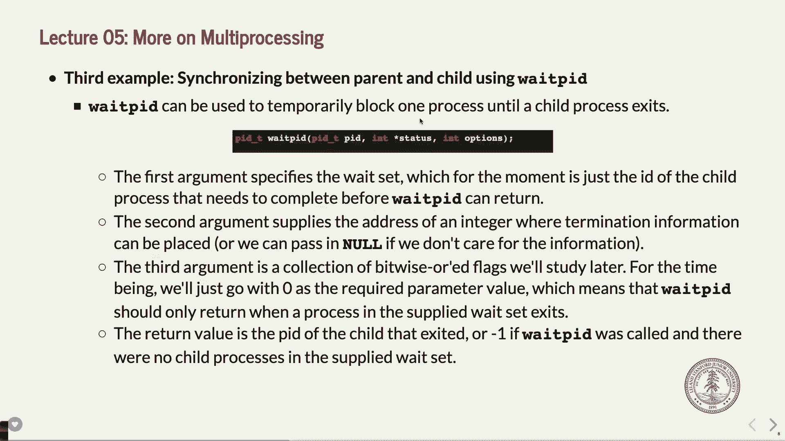

 We're going to do an example called separate， which is going to use some of this information。 this wait PID， so that we can actually do something where we know what's going to happen and the ordering is going to happen in it。 Okay， so here's what we're going to do。 We're going to say print F before。 So this is the first thing that's going to happen is going to， it's going to print before。 Okay。

 and then we're going to say PID T， PID equals fork。 and that's going to do this process separation business。 Okay。 and then we're going to say print F after。 How many of these should we get to， right？

 Because now we have one extra process and both are going to do that。 Okay， if PID equals zero。 what does that mean？ Child， or the child。 Okay， if the PID equals zero。 Okay。 you're going to want to say something like print F， I am the child。 Okay。 and the parent will wait up for me。 Okay， it's kind of a nice analogy in that sense。 If you want。

 Okay， and then we're going to immediately return if we are the child。 and let's just return 110 for CS 110 or whatever。 It doesn't matter。 We're just going to show that it's not zero。

 Just the return value。 You can actually get the return value from the。 you can get the return value from the return when the child ends。 which is kind of nice because maybe you want to know what happened with your child that it ended appropriately or not。 or maybe you'll pass some information that way if you want to。 Okay， all right。 At this point。

 we can put an else。 This else is not strictly necessary because of the way we've done our program。 right？ It will always， the child will always return at this point。 Okay。 so the else is not really necessary in that case。 But anyway。 the point is that it's now we're saying we are the parent in here。 Okay。

 and the parent is going to have a status。 Okay， and the parent is going to do wait PID。 For now。 we're just going to wait for the actual PID。 We're going to pass in a pointer to the status。 and we're going to pass in zero for the options。 We'll get to what the options mean later。

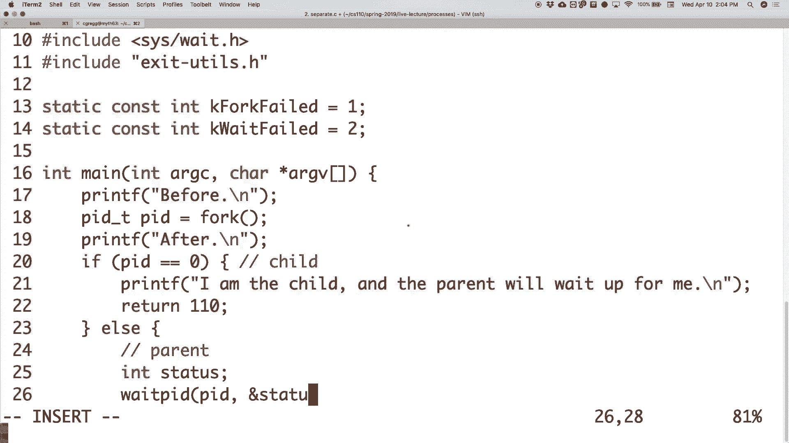

 Okay， all right。 After this， this will wait until the child finishes。 Okay， and then it will， yeah。 question。 The status doesn't need to be initialized。 It's going to pass in a pointer。 and it's going to be changed。 It's not used。 The function is not using the value of status。 It's populating the value of status for you。 Okay。

 it's another way to get kind of two return values， if you will。 The status and the actual PID。 It's kind of the C way of doing that。 Okay， so we're going to do that。 Now。 we're going to check some things about this。 Okay， we're going to use a macro。 which basically is an， you can think of it as an inline function。

 We've seen a little bit of those before， but it's called WIF-exited。 Okay。 now I know that looks like wife exited。 And I always say that when I think it because I read it and I go。 oh， that means， but it's not。 It means WIF-exited。 And what it does is it checks the status。 Okay。 and if the status is， if that macro returns true， it means， okay， it was fine。

 It exited with a regular old return value。 I'll show you what that means when it doesn't happen in a few minutes too。 Okay， and what you can do is you can print F and you can say child exited with status percent D。 Okay， and this is going to be the actual， it probably shouldn't be status should be something like the return value or whatever。 And then you get another macro， which does exited status， sorry， W exit status。

 And that's going to give you the status。 It's just reading off these bits because the。 the actual macro or the status variable holds a whole bunch of information in it。 Part of it is the return value。

 Part of it is the other information about how it exited and so forth。 Okay。 so that's what we're going to do there。 All right。 And then we want to do what？

 We want to do an else on this case。

 So let's say that we had bad news。 The child didn't exit correctly。 We can print F child terminated。 Ab normally。 Okay， something like that。 Okay。 And then we've got that。 And then after this。 we can just return zero。 Okay。 So that's what's going to happen。 Okay。 Anybody see any type of。

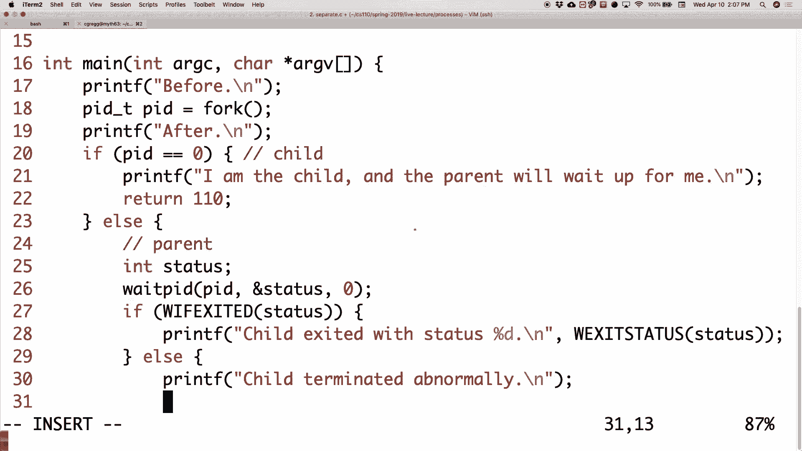

 We'll find out。 Make separate。 Okay， looks good。 Okay。 So if we run it， right， it says before。 after， after， and then it says， I am the child and the parent will wait up for me。 Child exited with status 110。 And it will always be in that order。 no matter how many times I run it。

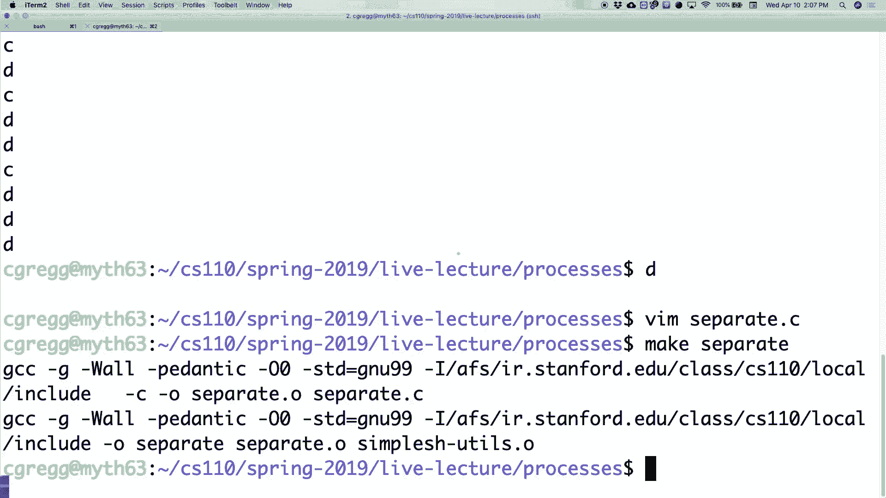

 Okay。 Because the parent is forced to wait until the child exits at which point that we are all set。 Okay。 All right。 You might be asking yourself， well， how could it exit？ Ab normally？ Well。 how might we make the child exit in a bad way？

 In other words， crash it。 Can I get the job to crash？ We can do a bunch of things。 We could divide by zero if we wanted to。 How about this？ This is one that I was like。 int star a equals no。 Asterisk a equals five。 That would be bad news， right？

 Try to dereference in place of value at no， which is going to be bad， bad news， right？

 And if the compiler shouldn't actually care about it。

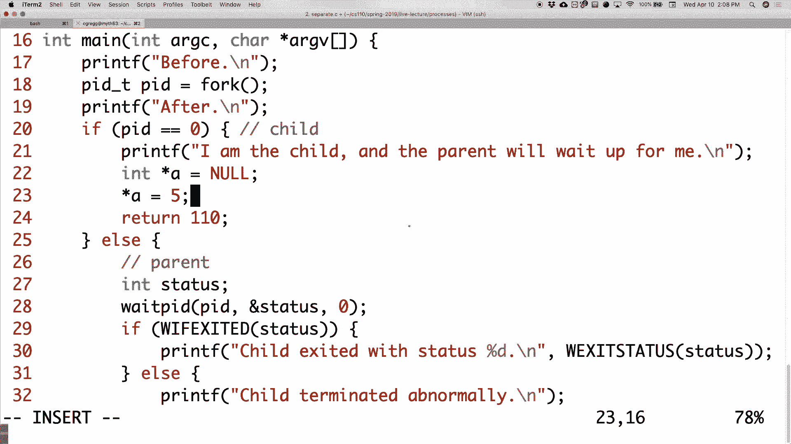

 Make separate。 There we go。 Okay。 Separate。 And before， after， after， I'm the child。 the parent will wait up for a child terminated normally。 Right？ We killed the child。 That got the exit status to be to tell you that。

 Oh， bad news。 Something happened。 Okay。 Question。 Is it possible for the child to print like the child？

 Is it possible for the child to print？ I am the child before the child parent prints after。 It is possible。 It's probably not going to happen in this case， but that's perfect。 Yes。 That's possible。 So I guess in this case， it could happen that that's the case。 It's probably not just because that's a good point。 Yeah。 So that is a。

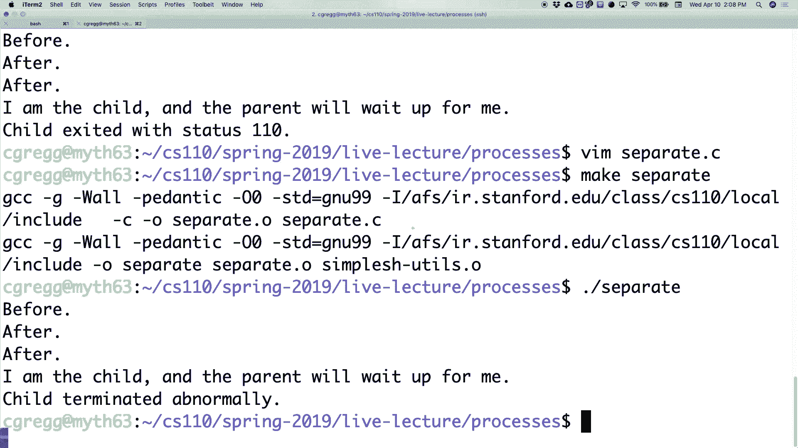

 By the way， this is a good term to learn。 That's called a race condition。 And a race condition means two things are going down some paths at the same time。 One of them is going to win， but you don't know which one is going to win。 We try to avoid race conditions in this class。 Sometimes you absolutely have race conditions and therefore you have to do some logic to make sure you know what will happen。

 Okay。 When we get to threads， you'll see this a lot with， well， actually。 you'll see it in processes a lot too。 But in particular。 if you're trying to modify shared data structures。 you have race conditions where they're both two things might be trying to do that。

 you want to avoid that。 So you， you handle in ways that we'll talk about。 Question。 Yeah。 In the L statement where it calls way PID down here， yes？

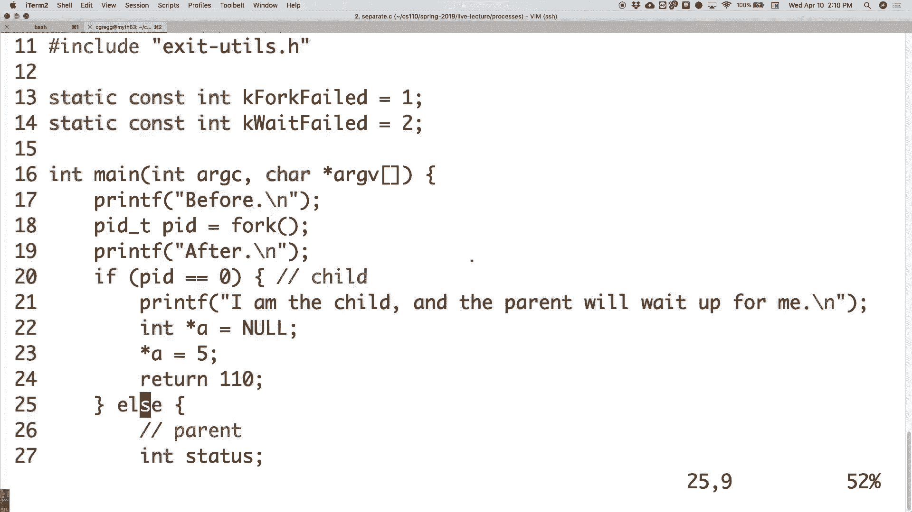

 [inaudible]。

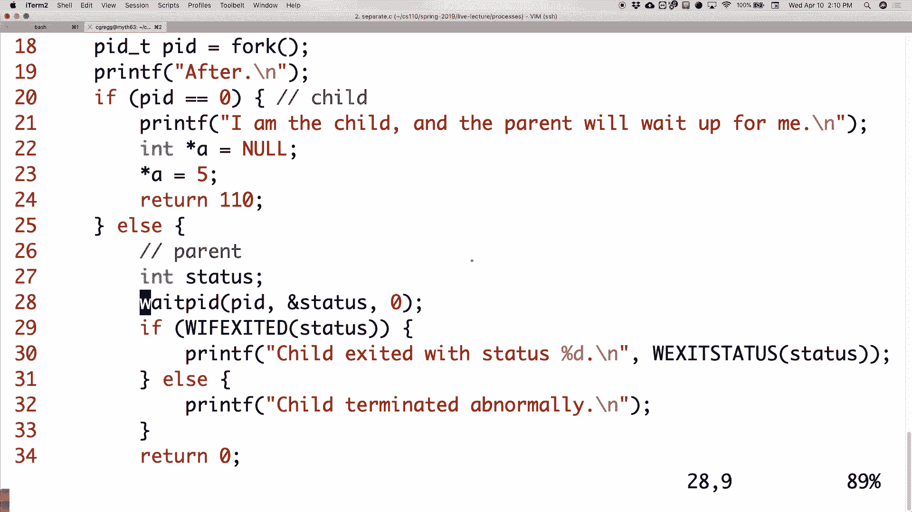

 Isn't that supposed to be a child's PID？ It is the child's PID because remember what is the return value for fork？

 The parent gets the child's PID as its return value。 So yes， that's exactly。 And that's why that happens so you can use it。 It turns out a good question。 Any other questions on this？ Okay。 Let's keep going。 So this function。 the output is same every time barring that one thing where the child could print the。

 could print the after and then it's line before the parent even gets to after。

 The parent， the whole reason this works in the order we expect is because the parent waits for the child to end。 And then you use these macros to actually get more information about this。 And you might be able to say， wait a minute， how can you overlap the return value and other information？

 Right？ Wasn't the return value an int？ Not really。 Return values are supposed to be between 0 and 255。 So you have lots of extra bits in that int to store other information。 That's the way return values should be。 They are ints but you should limit them between 0 and 255。

 That's the way it goes。 Okay。 And then as I said， the wait PID does donate the resources back to the system。 In other words， it's kind of the cleanup that you like to do at the end of the program when something happens。 You should be doing this wait PID for all of your children as it turns out。 Okay。 Better for the。 in the end， no matter what the system will clean up for you but it's just like doing free after you do a malloc。

 It's nice to do because it cleans things up。 All right。 What else？ Okay。 So。 let's look at another example。 Okay。 In this other example。 we're going to see it's kind of a little bit of a brain teaser。

 And we're going to， we're just going to kind of walk through it and say。 and it's going to demonstrate to you how deep this copy actually is。 Okay。 This one is going to be called the what？ This one is going to be parent child。c。 Okay。

 Here's what we're going to do here。 This is going to involve random numbers。 Okay。 We're going to have some randomness in here。 Okay。 And in this case。 what we're going to do is we're going to first say print F， I am unique。 And just get printed once。 Okay。 And we know why that's the case because there's no forking yet。 Okay。 And then we'll do PIDT。

 PID equals fork like we kind of always do。 Then I'm going to just do a make figure out a little Boolean。 Boolean parent equals PID equals， let's see， PID is not equal to zero。 Okay。 What is that all about？

 Basically it's saying if it's the parent， in other words， if the PID is not zero， it's the parent。 It's just going to set that。 Otherwise it's not going to be the parent。 Okay。 It's just kind of a fancy way of doing that。 Okay。 All right。 And then we're going to。 we're going to say， okay， if random， which is going to give you a random number。 Okay。

 Mod two equals zero and that equals the parent。 In other words， this is C。 so one and zero are true and false basically。 Okay。 If that equals the parent。 then we're going to sleep for one second。 That's what this means。 Okay。 Sleep is another command that basically says turn your process off for that amount of time and then wake it up again after that amount of time。

 Okay。 All right。 And then if we are the parent， we are going to wait PID for PID。 No。 Oops。 No。 And zero for basically because we're not doing anything there。 Okay。 Parent waits for child in that case。 Okay。 And then we're going to say print F， I get printed twice。

 This one is from percent S， comma， if I'm the parent， I'm going to print out parent。 Otherwise。 I'm going to print out child。 Okay。 And then we're going to return zero。 Okay。 So what this is doing is this is going to set up so that only one of the two actually gets to sleep。 Right。

 And if it's the parent， it's going to have to wait for the child。 Okay。 Make parent child。 Okay。 Parent child。 Now， you kind of have to， I'm going to put it up here。 You kind of have to watch this pretty closely because it's only one second。 Right。 But watch what happens。

 Boom。 I mean， you can get printed once。 It waited for a little bit of time and then I get printed twice。 Okay。 If I run it again， it printed that I got printed twice immediately。 And then printed the next one。 I'll show you again。 Let's see which one happens here。 Okay。 So that means that the parent was the one that had to sleep。 Okay。 And then maybe they're again。

 And the child is the one that had to sleep。 Okay。 Everybody see how that's working。 Only one of them actually allowed to do that。 What seems weird about this？

 We've got random numbers in here。 What seems a little bit weird？

 Why wouldn't it ever be the case that two of them could sleep？

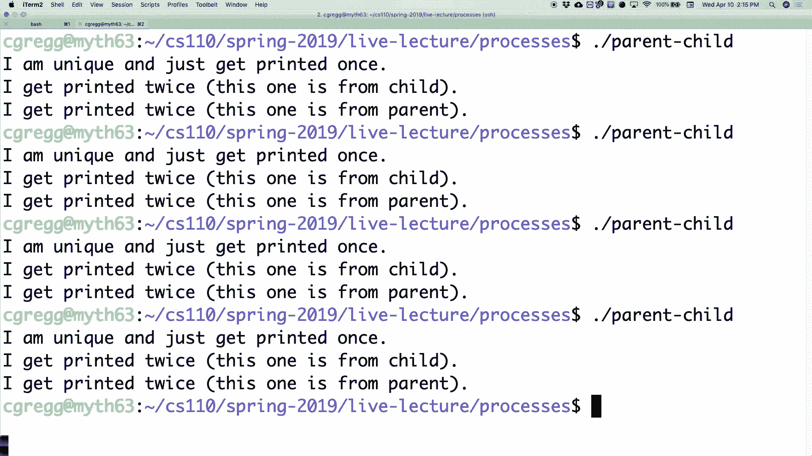

 It's a random number for each one。 Yeah。 Is the seed of the random number you're sharing to change your confidence？

 That's a perfect answer。 The seed is actually shared between the two processes because everything is shared。 In other words， random numbers are not really random。 They're pseudo random numbers。 Which means that there's an algorithm which decides which number comes next。 Okay。 And it should be seemingly random。 Okay。 And what's going on here is we're saying， oh， okay。

 We are both calling the random function in two different processes。 but it's the exact same random generator。 So the next random number will be the same for both。 meaning only one of them will end up sleeping。 Question？

 So that's kind of the x random random number。 Yeah。 So the x random is just seeding the random number with the current time as it turns out。 Don't worry about random numbers too much， but a pseudo random number generator says。 I'm going to start somewhere in my list of random numbers。

 and I'm going to start giving you what look like random numbers after that。 And the seed says start here， basically the way it works。 Okay。 So it's not really random。 it's pseudo random。 But it kind of demonstrates that， oh yeah， they both have the same memories。 It turns out。 Yeah。 What happens if you comment out the 19？ If you comment out the 19。

 nothing would happen to have any different except that it would， well， I get that's not true。 It would probably do the exact same thing every time because the random number generator starts in a particular。 value every time。 And we can see if that's the case， we can try it and see if that， in other words。 no matter when you start a program， it's going to。

 so let's see if we run parent child looks like the parent slept， the parent slept， the parent slept。 so it's going to be the same one every time。 We could probably print out the random number and it's going to be the same one every time。

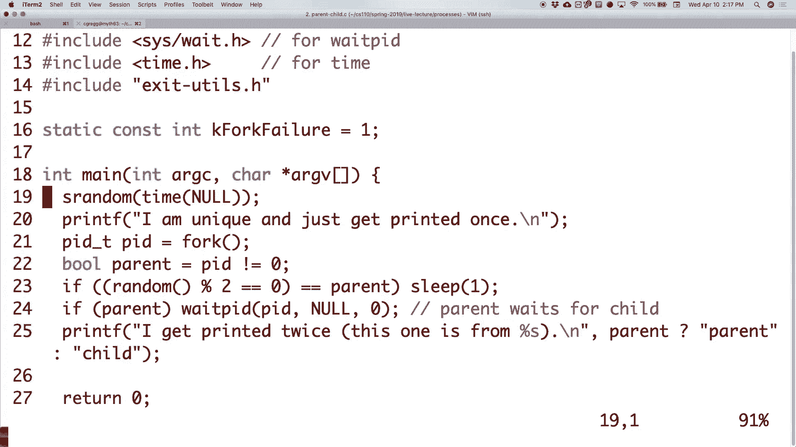

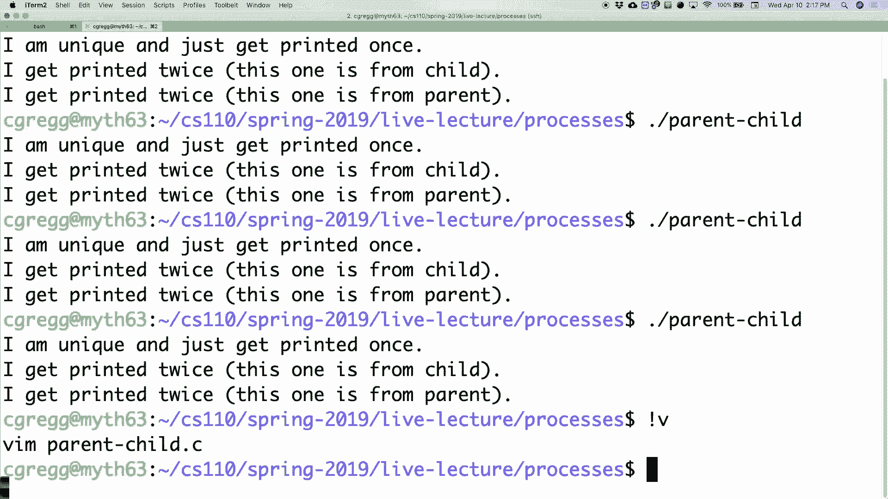

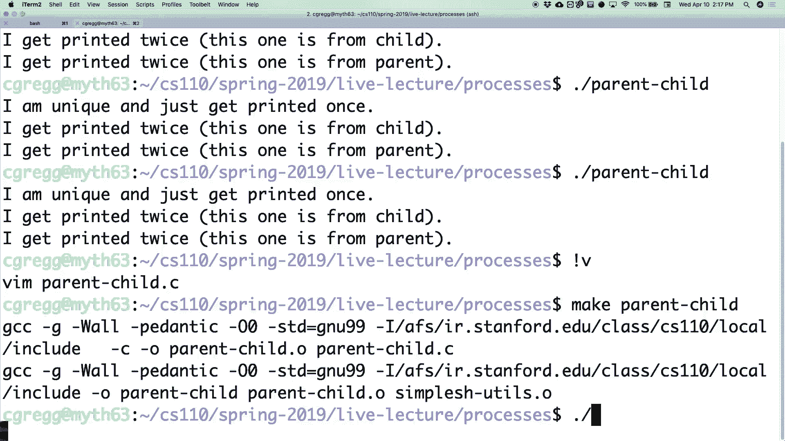

 Why is the parent sleeping when it goes slow like that？ Good question。 What's the code look like？

 Right？ The code says， I'm going to take this back out again or put that back in again。 Okay。 It says， if you are the parent， right， or if the random number equals what the parent is。 in other words， if the parent is one， then the random number is one， then sleep。

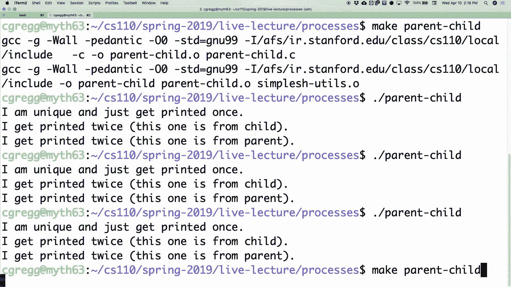

 Right？ Otherwise the other one has to be the one sleeping， which is the child。 And remember。 the parent is the one that is not going to even print。 I get printed twice until after the child ends， so if it's sleeping。 it's going to wait until the child prints it and then the parent does。 Make sense？

 Let's look at it again。 Yeah， question。 The sleep has to just sleep the parent， right。 because only whatever process it's in。 Okay。 Let's look at it again here。 Parent child。 Okay。 I'm going to， I'm going to print it once。 And then the child got printed before you could see that it waited a little bit。 then the child got printed immediately。 Right。 And now it's going to be， well， in this case。

 it's always going to be the child is going to print。

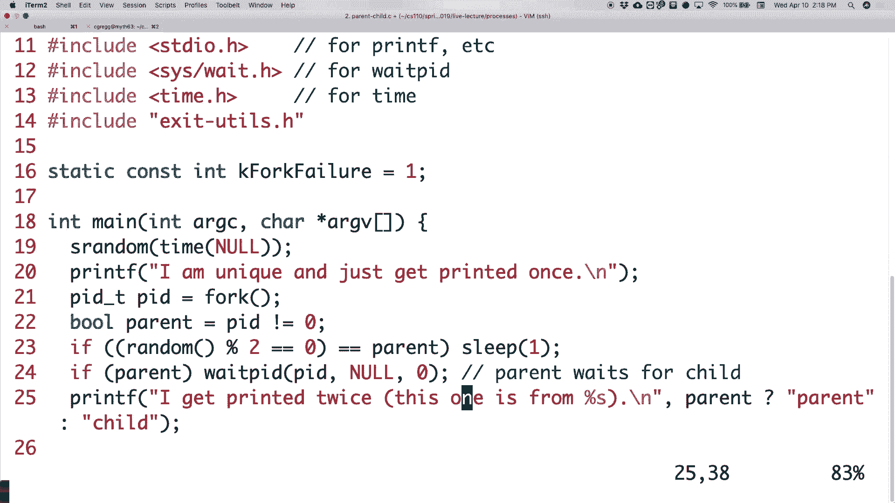

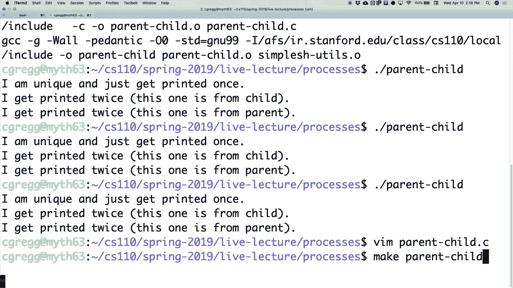

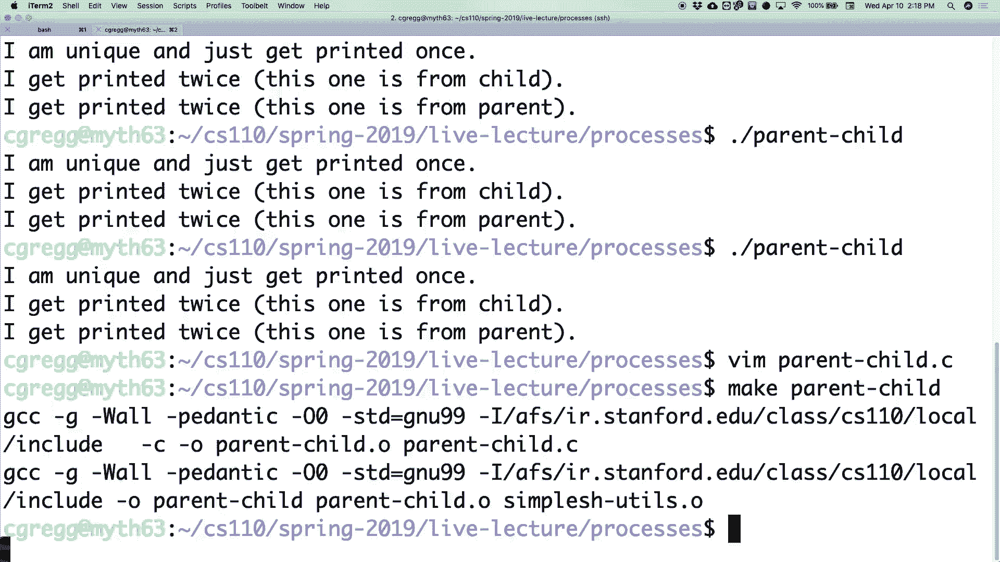

 No， it's not necessarily。 It is。 Let's say， did I make it again？ Hang on。 Hang on。 Did I make it again？ I thought I did。 I did。

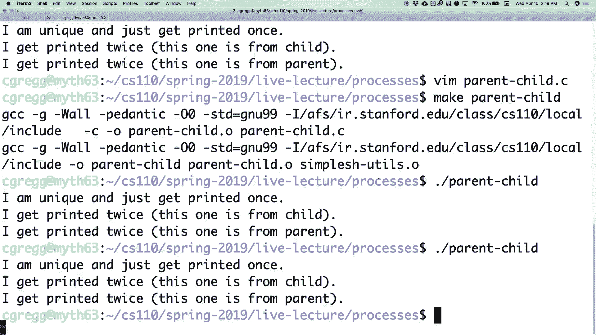

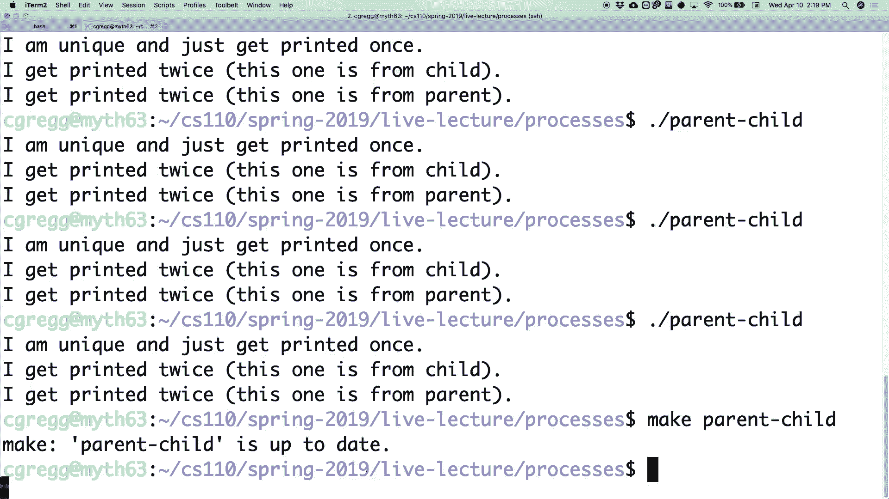

 Parent child。 I mean， let's try to get there， guys。 Okay。 So the child got printed at that time immediately because it didn't sleep。 Right。 It's always going to be in this order because the parent has to wait until the child prints。 but whether or not the child prints immediately or waits a second is the difference。

 Does that help？ Yeah。 Let's look at it again。 I mean， just quickly， let's just look at it again。 If you， and this is the logic part that you definitely need to kind of understand。 Okay。

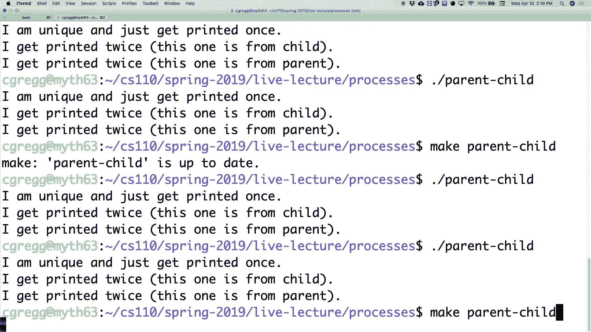

 If the parent ends up having to sleep， that's your question in a minute。 the parent does have to sleep， then the parent will sleep and the child will immediately print it。 Does that make sense， everyone？ Does that make sense？ Yeah。 If the child is the one that sleeps。 both of them have to wait until the child prints it because the parent is definitely waiting for the child to sleep。

 The parent has to wait anyway， but only because the child hasn't finished yet。 Not because it's sleeping。 Yeah。 [inaudible]， Yeah。 Good question。 If you wanted to use the。 if you wanted to have a random number in both that was different。 you would see the random number general after the fork。 [inaudible]， Oh， that's a good question。

 Can you actually use time because it would probably be the same time？ Yeah。 That's going to be a little bit trouble too。 You'd have to figure out some other way to get a different seed and time would not be the best one。 Yeah。 There are other ways to get seeds， but that's a good， good point。 Very good point。 Yeah。 Question over here。 Yeah。 Sorry。 Would you mind explaining and why only forces only the parent or the child would sleep？

 Yeah。 So the question is， why does it only make the parent or the child？ Okay。 You will agree that。 hopefully agree at this point that both share the same exact memory。 meaning that the random number generator in both is going to give the same number。 Okay。 One of them based on the PID value that gets back is either the parent wants the child。

 This line right here says， if you're the， if the number mod two equals the parent， right？

 Then sleep for one， meaning that if it's a parent and the mod number， then the number was one。 then it would sleep。 If it's a child， it would not。 but it can't be both because they're both going to have different Boolean values。 Parent and child are both going to be different。 There was a question up here。 Yeah。

 So I have a question。 [ Inaudible ]， Correct。 Only one of them is sleeping。 Yes。 [ Inaudible ]。 At least one of them is sleeping。 Yes。 Absolutely。 So one of them is absolutely sleeping because they're both different Boolean values。 Good。 Yes。 [ Inaudible ]， What's the mod two doing？ The random function call gives you a number between zero and two to the 32 minus one。

 We're just trying to make it between zero and one。 So now our mod two is between zero and one。 Yes。 [ Inaudible ]， If you sleep for longer， could the child wait？ Yes。 The child actually almost always does when you're， when you're sleeping。 Yeah。 Let's do this。 Here。 one thing we can check is let's see if parent， let's see if parent， here's what we're going to do。

 We're going to change this a little bit and we're going to say， in PID return equals wait PID。 And we're going to print it out and see what happens。 Print F， PID return。 It may actually。 you know， it may actually always give the value of the child。 I think it actually will。 It may give negative on。 We'll find out if it's already ended。 But I think it's going to。

 I think this is not going to be what I thought it was going to be。 But anyway， PID return like that。

 Yeah。 That should do it。 Let's see。 Make parent child parent child。 Okay。 Okay。 Return is that one。 And then now it's waiting。 No， it's always， it will always。 it looks like it'll always give back to parent that child's one。 Even if it's already ended。 In fact， it would return immediately if the child has already ended。

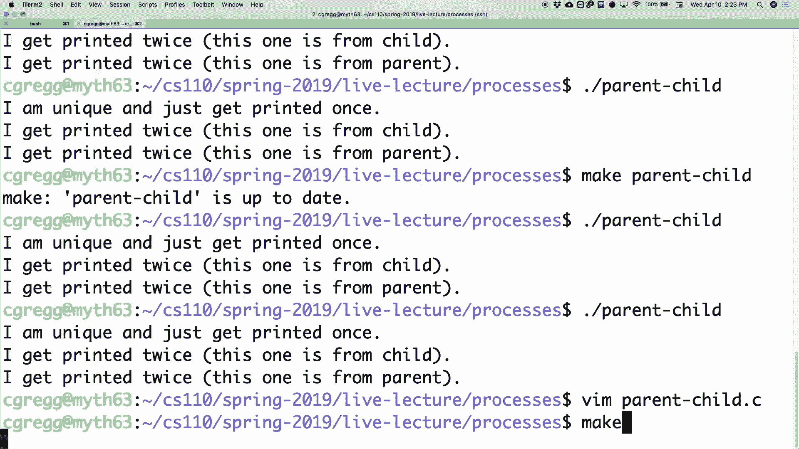

 Alright。 Anything else on that one？ One stuff， huh？ I'm getting there in this stuff。 Okay。 So what happens when we want to have multiple children？ Okay。 If we have multiple children。 then we can actually wait for all of them。 Okay。 And we can wait for all of them by using negative one as the PID as the first parameter in PID。

 Wait PID， which means wait for any child。 Okay。 And if a child has ended。 return to me and give me the PID and so forth。 Okay。 Any， for its， its， its， absolute to any child。 So you're going to see we're going to do this in a while loop and it's going to say， okay。 we're going to wait for all the children。 You'll see as we， as we do this。

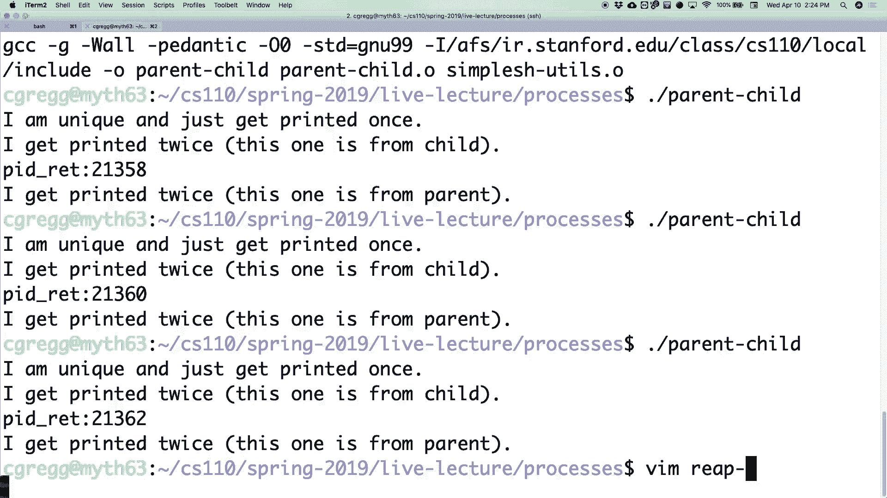

 So reap as they exit。c。 Okay。 Here's what we're going to do。 Okay。 We are going to do the fun。 We're going to create eight children for size t i equals zero。 i is less than eight。 i plus plus。 Okay。 If for。 Okay。 Okay。 Equals equals zero。 What's that mean？ The child。 Okay。 We're going to exit with a value of one， one ten plus i。

 So we'll get a different return value for each one of those。 One ten， one eleven， one twelve。 et cetera。 Okay。 And then that should do it。 So we'll always exit there。 And we're going to do eight of it。 Okay。 Question。 What's your reason why you're using an exit instead of just going return one ten plus five？

 You could do return one ten plus i。 We normally exit out of the children instead of return。 It doesn't really matter as it turns out。 But yeah， this， that's good question。 We normally do that。 Okay。 So we're going to do that。 And then now we're going to say， okay， fine。 We are going to do a while。 We're going to do a while true in this case。

 I'm going to demonstrate something else from you。 We could search for it。 We could wait for all of them because we know there's going to be eight of them in this case。 But we're going to do this status。 P。I。D。T。 P。I。D。 equals weight。 P。I。D。 negative one。 And we're going to pass in the status like we did there。 And then zero。 Okay。

 And then we're going to look。 And if we find out that if P。I。D。 equals negative one。 Well。 that means there were no more children to wait for so we can stop our while loop in this case。 Okay。 And what we actually want to do in this case， you don't always have to do this。 But it's a little bit of error checking。 We're going to assert in this case that the error number equals each child。

 I'll tell you what that is in a second。 And then we're going to break。 Okay。 What we're doing here is we're saying， well， the return value is negative one。 Technically。 if the return value is negative one， yes， it meant that there were no more children。 But it also could mean， hey， there's an actual error here in your wait P。I。D。 call。

 It's kind of overloaded。 So it's got a wait P。I。 It's got an error。 It definitely could be an error。 But what it does is it sets error no to each child。 which means the reason I gave you an error is because there were no more children left。 And if you check that， then that's actually okay。 In fact， works perfectly for our purposes。 Okay。

 Yes， it's an error。 But oh， it's the child issue。 Fine。 Let's just go ahead and go on。 Okay。 So that's what we're doing with that one。 Okay。 And then we should just check our W if exited status here。 Okay。 And then let's print a child percent D。

 exited status percent D。 Now let's do the P。I。D。 and the exit status。 So you can get the exit status from the status itself， which will be the return value for the child。

 Okay。 And then it looks like I have something wrong here。 Hold on。 Let's see。 Print that child extra bad。 Child extra status that P。I。D。W。X。 status。

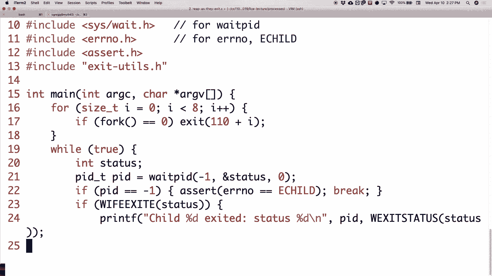

 That's the one。 There we go。 Okay。 How's that？ That was bright。 But I don't think that's the actual issue there。 Oh， there's a bracket。 Yeah。 Okay。 And then else and then print a child child percent D， exited ab normally。 And we'll go just P。I。D。 because no， there's nothing else there。 And that should do it。 And then our return zero。 Okay。

 So let's see what happens when we do this。 Oops。 That I don't want to do。 Okay。

 Anybody ever done that with the encrypt their file？ It's bad。 I mean， try it。 Okay。 Make。 reap as they exit。 Okay。

 Okay。 Creep as they exit。 And what should happen is it does 10， 11， 12， 13， 14， 15， 16， 17。 But let's do it again。 Let's see。 10， 12。

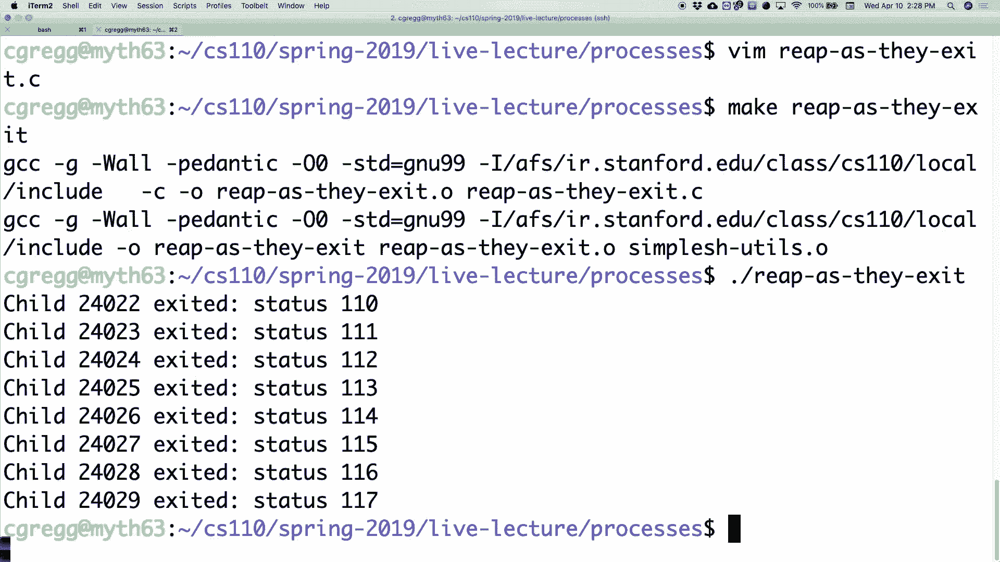

 There we go。 Okay。 Finally， I got any wrong order。 10， 11， 12， 16， 13， 17， 14， 15。 This is not in enough particular order because we are saying wait for any child to exit any one of those children could exit before any other one。 Although it's likely that the one that came first exits first because it's just not in the case of the child。 Okay。 So we can get some non-determinist behavior here。 Okay。 Everyone see what's happening there。

 Negative one for wait P。I。D。 does that for you。 Okay。 All right。 Let us say wait。 What if we wanted to actually wait for them in order？ Like， could we wait for them in order？ Okay。 We certainly， this is what it does do， by the way。

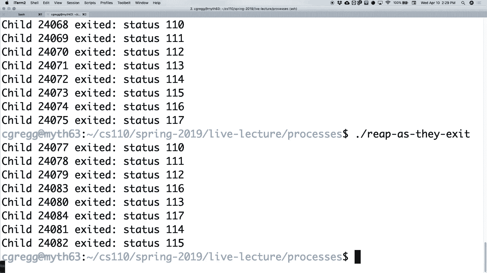

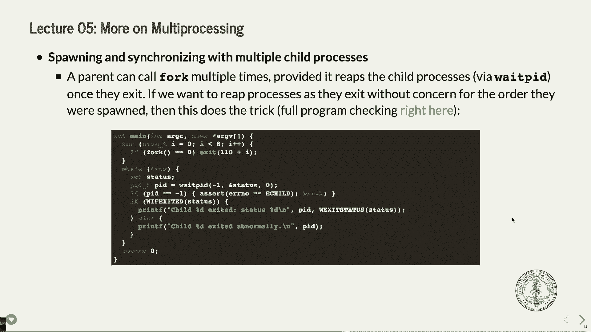

 This is what does that。 And I said， talked about error number and all that。 What if we did want to wait for them in order？ Let's take a look at another program。

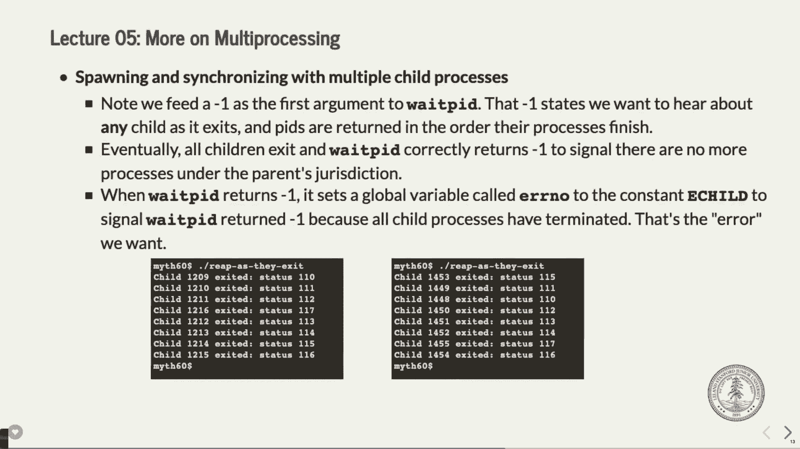

 This one's going to be reaped in fork order because we want to actually do it in the order they are in。 Okay。 So let's do same sort of thing。 Except now， if we want to wait for them in order。 we better know what the order is。

 Okay。 So we probably want to do something like P。I。D。T。 children array of eight。 Right。 Because now we need to keep track of all the P。I。D。s if we're going to wait for them in order。 We're going to have a same size T。 I equals zero。 I is less than eight。 I plus plus。 And then。 and then we are going to do status in here。 P。I。D。T。 Sorry。 I'm going to put a formula in here。

 In this case， we're just going to create them all here。 If children of I equals fork。 We're going to do a little bit of a formula。 We're going to do a little bit of a formula。 We're going to do a little bit of a formula。 Okay。 All right。 And then we're going to do now we're going to go through them all for another size T。I。 equals zero。

 Not a while true loop is this case。 Although you could probably make it work if you really wanted to。 Okay。 And in this case， we are going to now do P。I。D。T。 P。I。D。 equals wait P。I。D。 for a particular child。 I status zero。 Okay。 Let's assert that we got the right child。 even though we almost always would。

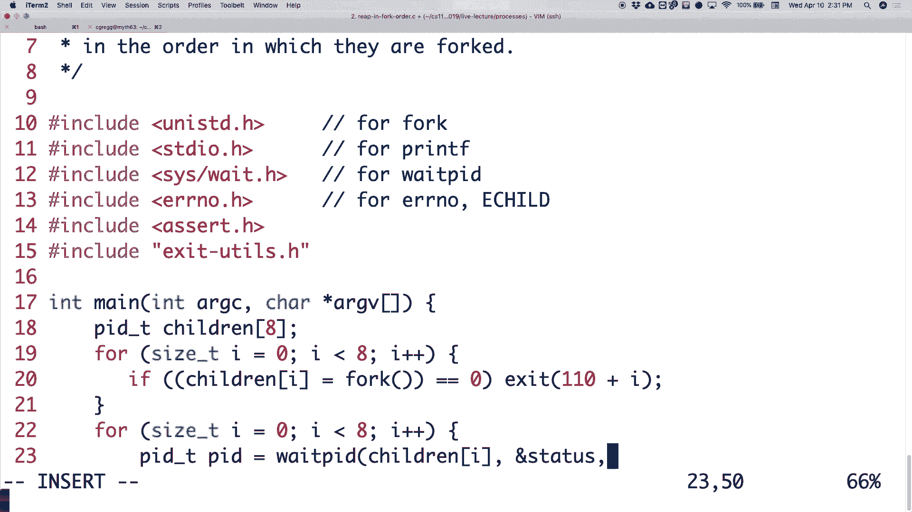

 P。I。D。 equals equals children I。 Okay。 And then， assert really could we're not waiting for anyone。 We're waiting for specific one right now。 And let's do。

 We're going to just kind of check a couple things at once here。 W。X。 its status status equals 110 plus this is like lots of extra checking just in case here。 Okay。 And then we're going to print child with P。I。D。 percent D is accounted for。

 And return status of percent D。 Period。 New line。 Children。 I。 And we'll give the actual status of it。

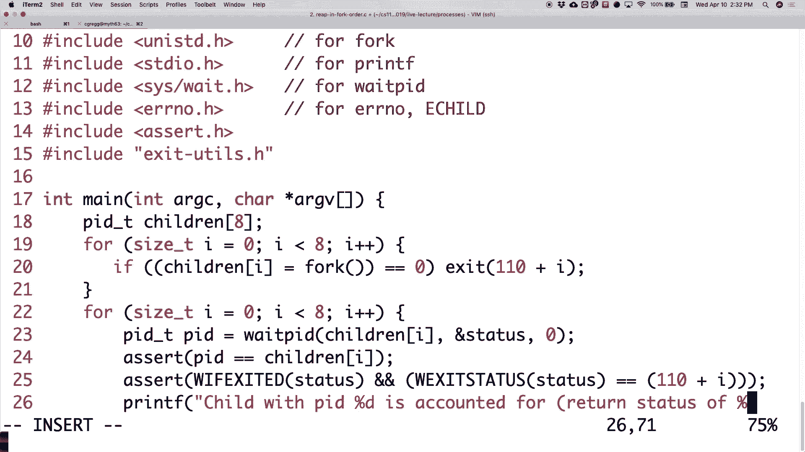

 Which is the return value。 Okay。 And that's it。 Say again。

 I do not need to initialize that。 Oh， you do declare it。 I do indeed need to clear it。 I don't initialize though。 Thank you。 Thank you。 Okay。 Anybody else issues？ Let's try it。 Make reap in four quarter。 Okay。 Looks good。

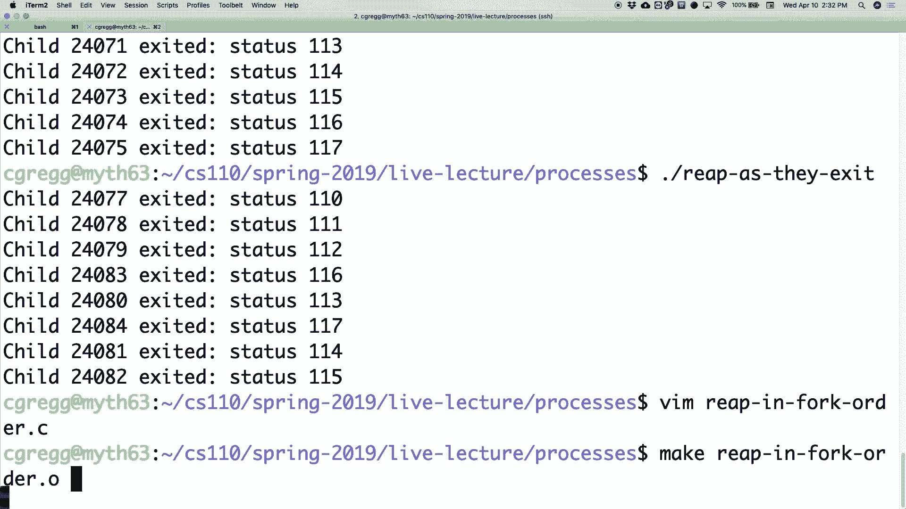

 Now， in this case， it has to wait for each one。 So we are going to always get them in order。

 Because it's waiting for 110， 911， then 112， etc。 And all of them might be ending in different orders。 It's just going to eventually reap the process。 Another way P。I。D。 is going to where specifically going to ask for a specific one。 And it's going to return and say。 yes， you got it。 Okay。 What questions you have on that？ Yeah。 That's a very good question。

 And you have to be careful。 The question was， doesn't it populate the children array with the P。I。D。 Only for the parents。

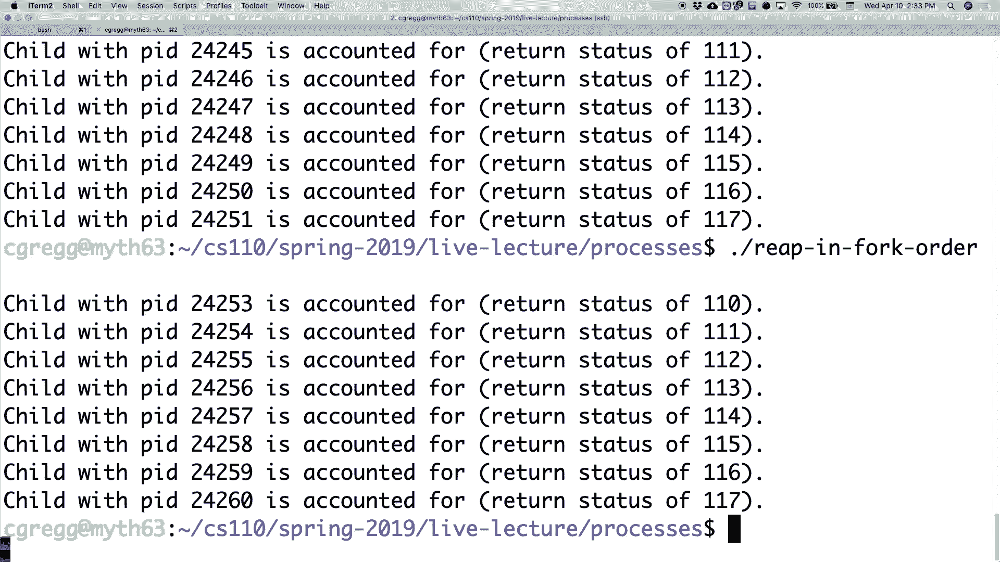

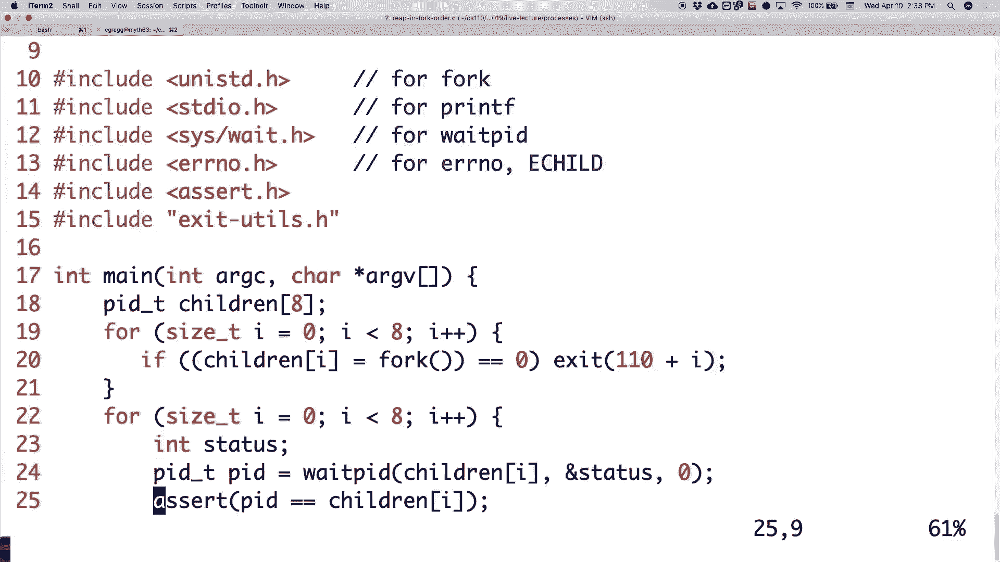

 It gives it the child's P。I。D。 Remember， what is the child's P。I。D。 or what's the result of fork for the child？ Zero。 It is not the child's P。I。D。 It's only zero if you are the child。 So in this case， I kind of briefly mentioned this。 In this case， yeah， it's putting a zero in there for the child's version of that array。

 But we're going to ignore it。 We don't care except to say， is it zero or not？

 We've got to follow up。 Yeah。 In the forward， then it will wait for children I to follow。 Ah。 good question。 When you wait for children I down here， isn't always going to be zero。 There are two arrays every time you fork now。 There's a parent array。 You fork。 The child has its own version of the array。 The parent still has its same version as before。

 It gets the parent gets the child P。I。D。 The child gets zero， but it's initially immediately exits。 Oh， it worked。 Yeah。 This is why I want to be really careful about that return value for fork is not a PID except for the parent。 It's only the child P。I。D。 for the parent。 It is always zero for the child。 If the child wants its P。I。D。 for some reason， it has to call get P。I。D。 Question？ No。

 The children never do the second for loop。 Exactly。 Good question。 Yes。 So， in this case。 most of the time we call get P。I。D。 for the parent。 It's already exited。 Some of the children have already exited。 Yes。 In fact。 most of them after the first couple loops have probably already exited。

 You can wait for a child after it's exited and it still returns without it。 We tested that a little earlier。 Good question。 Yeah。 Could a child create a like I equals seven look back on the P。I。D。 values of the children for like I equals five or three？ No。 Yes。 It could。 Sure。 Yeah。

 This is a good question。 Could the 6th or 7th child see all the values of the P。I。D。s for the previous children？ Sure。 Before that， it's still the parents。 It's the same。 Yeah。 The parent keeps it and keeps populating。 So sure。 Now you're not trying to hide that from the children。 It wouldn't be in that case。 Good question。

 Yeah。 Because I'm confused。 Why can you wait for a child after it's exited when she wants to like reuse that process or something else？

 Why can you wait for a child after it's exited when she wants to reuse that child for a process or something else？

 It hasn't been cleaned up yet until wait P。I。D。 is called。 So you're still waiting for。 In fact。 there is some extra overhead because it hasn't been cleaned up yet。 That's really the difference。 You've once it ends， it's waiting for somebody to do a wait P。I。D。 on it basically。 That's the clean up process。 Yeah。 Why doesn't the first four look like creative that tree of like that？

 Yeah。 Why doesn't the first four look creative tree？ You tell me。 What's happening in this first one right here？ What happens at each child？

 What does each child immediately do？ It dies。 So it never gets to the next loop。 Because it exits。 Yeah。 All right。 Good。 This is like， you can see why this stuff is like challenging to get the first time。

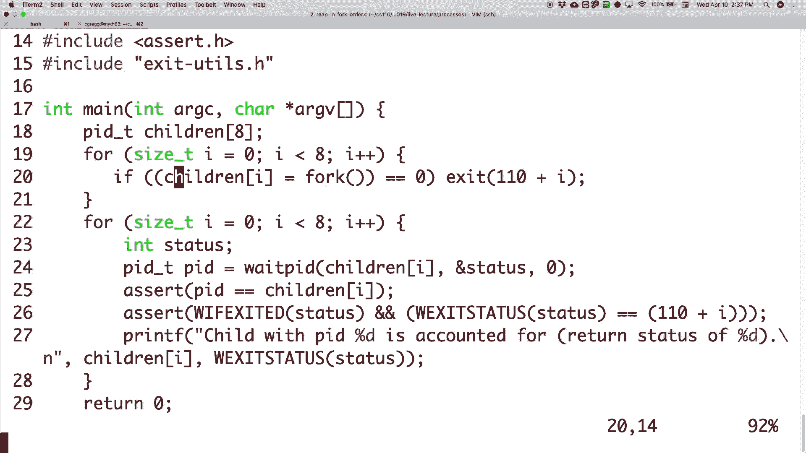

 The first couple of times you see it。 Okay。 This is what it is ever in theory。 You could have any of the children in any order。 But the loop is still going to be held up waiting for that first child to end。 then the second， then the third， then the fourth。 That's just the way these ones work。 Okay。 All right。 So that's the， that's fork。

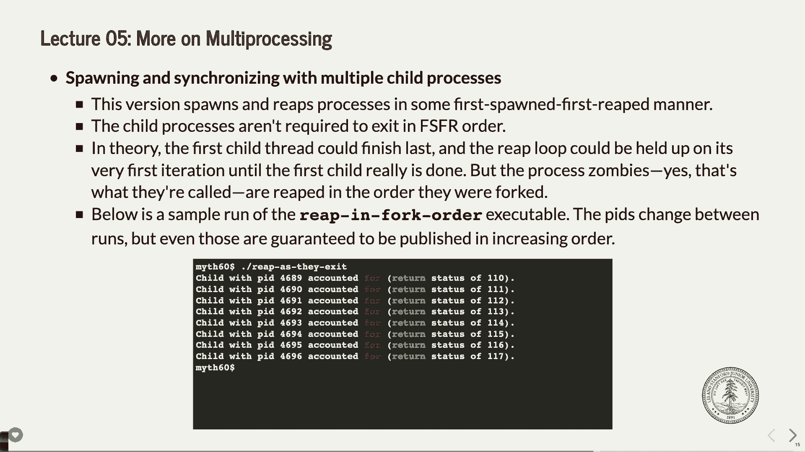

 Now we have showed some interesting examples of fork and how you've got your program going in two different directions。 and you've got your code in the child and your code in the parent and so forth。 It turns out that most times you use fork， it is not going to be to do your code in both the parent and the child。 It turns out that what normally happens is we are going to make another program run。

 We're going to set some other program off to run such that it does its thing and we may or may not capture the output。 But we actually are running some other program。 That was kind of the original reason。 Fork a process， have the other process the child run some other program。 That's mainly what it's for。 You can do what we've been doing where we show these kind of interesting tree examples and interesting child。

 But most of the time this is what we're going to be doing。 Okay。 We're going to run a completely separate program and we may or may not capture its standard out。 We may or may not send it information in standard in。 Okay。 This is what your shell does。 Okay。 When you type LS on your shell， right， well what happens is the shell is a program and when you type LS it takes that and says。

 "Oh， okay。 There's a program called LS on the system。" And it runs that program。 waits for it to end and gives you a prompt back。 That's what's happening with the shell。 So the shell is doing exactly this。 It's doing what we call forking and then execvp which is another system call。

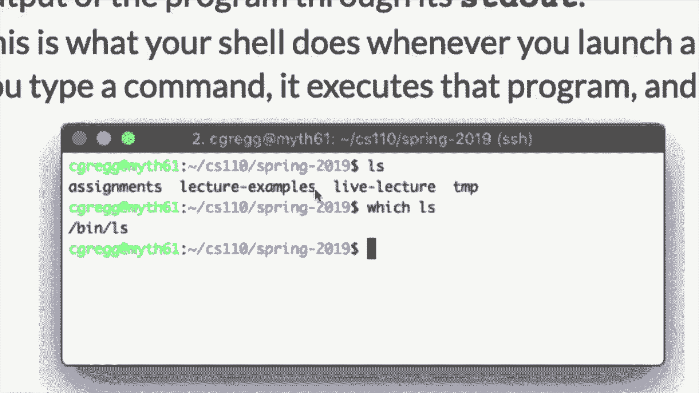

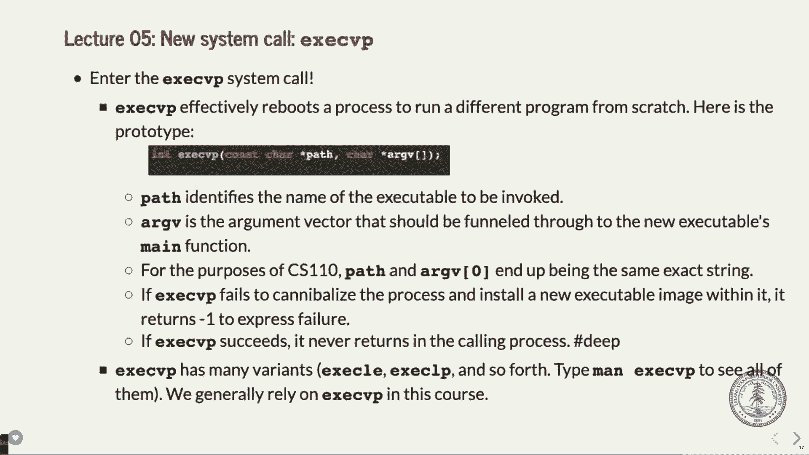

 And this system call does the following。 It basically reboots the process with some other program。 Okay。 And this is one way to do it and in fact kind of the default way to do it。 And that paper I showed you earlier is probably complaining about this。 It's complaining about like。 "Why have we do it this way？ There's other better ways of doing this and so forth。

" But this is what it does。 Execvp， it's basically a family of commands all called exec as in execute。 I guess。 And the vp happens to be a certain variety that we're going to use。 You can go look up all the other ones。 If you type man execvp， man execvp。 you can see that it actually shows a whole bunch of them。

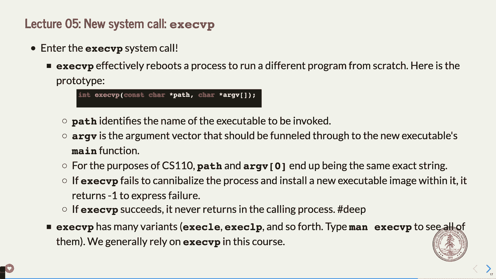

 execl， execlp and so forth。 The one we use and it's just so you can have different environment variables。

 Not really that important。 The one we're going to use and focus on is execvp which basically takes a path。 and then takes an argument array just like argv and it runs the program at that path with the argument string or array passed into it。 Okay。 As it turns out just like all your other regular programs。 the path and argv zero are going to be the same。 Because the first argument in argv is always the name of the program。

 So therefore we're going to have the name of the program as the path which is also the same as argv zero。 Okay。 So that's just the way that works。 And all it does is it runs it and it basically takes over that process。 runs that program in it and that's that。 Now what's interesting about this is if it doesn't work。 let's say you gave it a bad path and the path didn't work， it would not actually run anything。

 It would return to you and give you an error message or an error return value of negative one and you can capture that and say oh there was an error。 Okay。 If it does succeed， like in other words if it runs that program it never returns to the calling function。

 It just doesn't ever return。 Why？ Because it's a whole new process。 Well it's actually cannibalized to the process， to the extent that it is now the same process that you just created with fork except it's it's all own。 got it's own， everything else。 Okay。 So that's what's happening with execv and Jerry put this in here。 That hashtag deep。 Right。 But it's like never returns if it succeeds。 That's the way it goes。 Okay。

 So that's what execv。 If he does this is mainly the big reason we're going to use for is to do that and to call them。

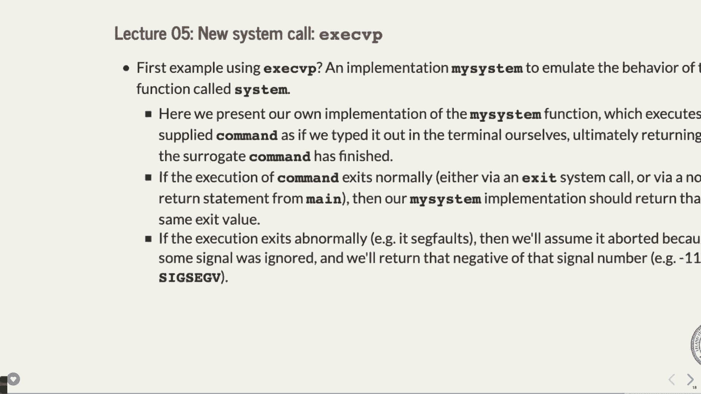

 Okay。 What example are we going to do？ I've got seven minutes and I guess I can do the whole。 Yeah it's actually it's actually not that bad。 We're going to do a little system example。 Okay。 We're basically going to do a tiny little shell。 If you guys are in CS107E you know all about shells and you're going to build one for an assignment in this class as well。

 But for right now we are going to do a tiny little one called my system。 Okay。 And what it's going to do is it's going to cheat a little bit。

 It's going to use the shell a shell program to run a program we give it。 Why？

 Because I don't want to have to parse out the different parts of the command line。 You'll see what happens when we do this。 And it's a good first example anyway。 Okay。 We're going to actually do the my system function itself。 It's going to be passed in a command that we want to run。 Okay。 And here's how it's going to work。

 Okay。 PID equals fork。 So the first thing you do when you do this exact series you need another process。 You don't have to have another process but if you don't have one you never get back to your original program。 It gets cannibalized。 Okay。 If PID equals zero that means we are the child。 Then what we're going to do in this case is we're going to say all right our arguments equals and what we're going to do is we're going to say run this program called bin slash SH and that's the program that's going to get run。

 Then slash SH if you want to run another program from within that you have to do a command parameter called dash C。 And then here's the command itself which you have to make it constant or you have to make it non constant as it turns out。 It'll just be a warning。 It doesn't really matter。 But it's passed in as a constant in that case。 Command and no。 Okay。 You have to end your it's this one。 Thank you。 Sorry for the program。

 That's just creating an array by the way is really all that's doing。 Okay。 And you have to end the last argument with no。 It's just the way that we do these kind of arrays because they're all strings we can do that as it turns out。 Okay。 All right。 So that's what we're going to do。 And then at this point then we can say oh great exact CVP the arguments zero which is the。

 bin slash S H and then arguments。 And then that will actually do the process right if we can say print if we get to this point。 It means we failed because why because it never returns if it doesn't get to this。 Doesn't if it works。 Okay。 Failed to invoke failed to invoke slash bin slash S H to execute the supply command。 Sad face。 Okay。 And I guess we should probably do。 That doesn't really matter。

 We'll get a new line later。 Okay。 And then exit zero just to say well we got it。 We have our fork where we're done。 Okay。 And that will do that if we are the parents。 We're going to do in status。 All right。 Well， we're going to wait for it。 All right。

 Wait PID。 P ID status and zero。 And oops。 Okay。 And then return。 W if exit status。 Okay。 If that's true。 We're going to say the exit status。 Otherwise we're going to return。 We're going to turn the negative of the termination status which just basically says well what happened。 Don't worry too much about that。 For that。 I think it's term。 Yeah， that should be it。

 And then that's that。 So that's our function。 Okay。 Let's write a little kind of a driver for it here。 Okay。 And the driver is going to be just the main part that's going to call it。 So let's actually set it up。

 Okay。 We'll make it like a little terminal。 We'll just keep going in some loop until you do it。 Let's see。 We want to do。 Let's do create a char command。 Let's make it K max。 Let's just say you can't type more than 2048 characters in your command。 Okay。 And then while true。 It's going to keep doing this forever。

 While true we're going to print F a little prompt like that。 And then use F get S which basically is a nice way of getting something from a file descriptor。 Right。 And in this case we're going to or not it's a kind of a different kind of file descriptor。 It's a similar sort of thing。 K max lines in case you type too much。

 And then we're going to get it from standard in。

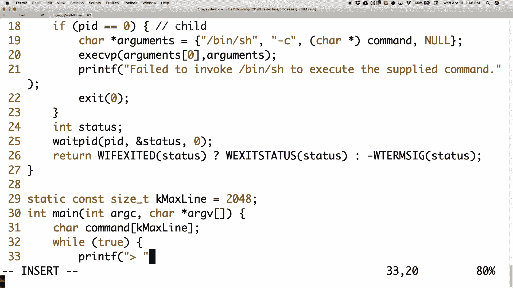

 Which is the way you can do this with this。 And if F E O F standard in which basically means if we have the if we've ended if we do control D this will end it。 We're going to break out of our loop。

 And otherwise we're going to say come in。 And we're going to overwrite the last part of the command with a zero instead of a new line it gets you get the new line back。 Like that。 Okay。 We're going to overwrite the end there and we'll let you run there。

 Probably forgot to print the thing here。 There we go。 Okay。 And then finally we're going to print out print F return code and percent D and my system。

 And like that。 Okay。 And then we're going to print a new line。 And we're going to print our turn。 Okay。 That is going to hopefully if I did everything right make my system。

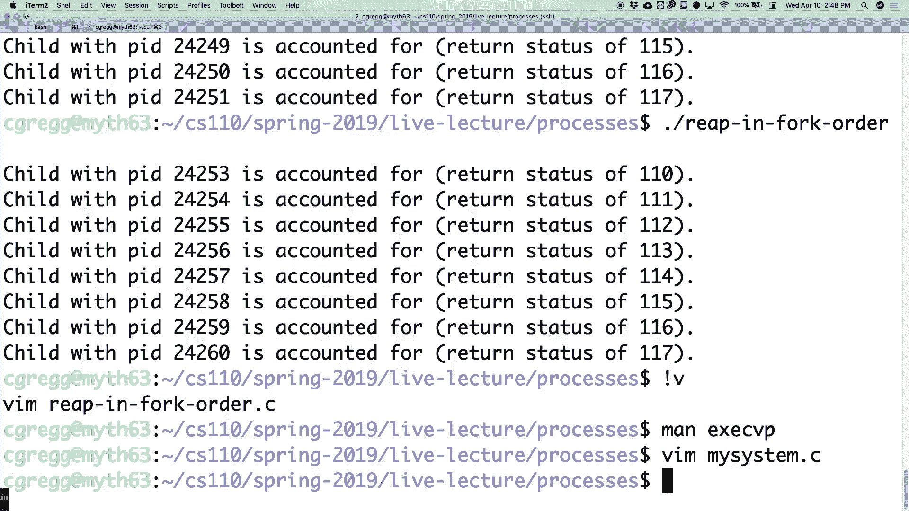

 Oh no。 Let's see。 Expect a cost chart。 Let's see。 Hang on。 Passing argument makes a pointer from integer。 What did I do here。

 Chart star arguments is that I don't want to keep you guys much longer。 I just want to run it for you。 Hang on。 Let's see。 Chart star。 Oh arguments think it needs to be a right， doesn't it。

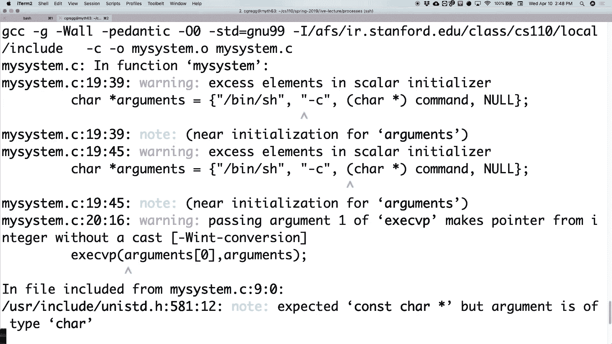

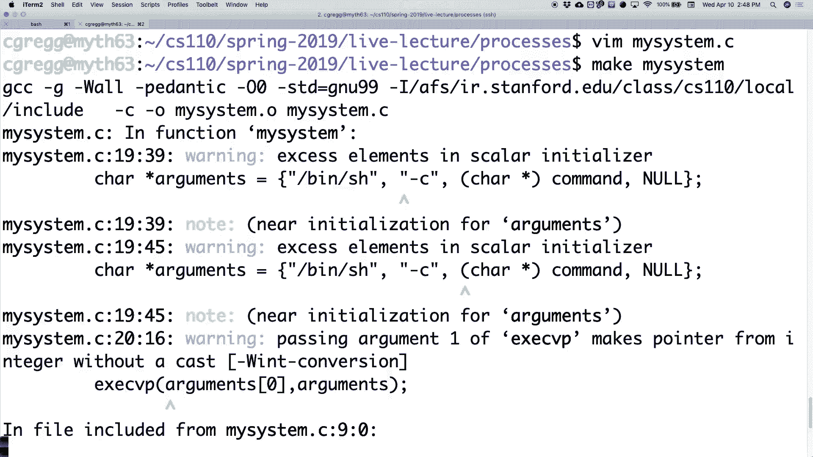

 Then my system needs to be an array。 Thank you。

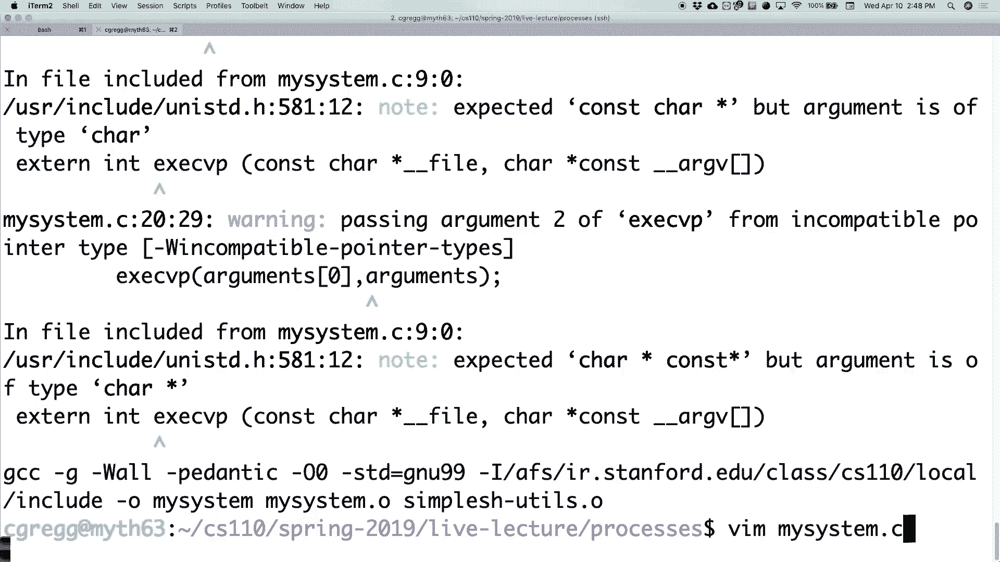

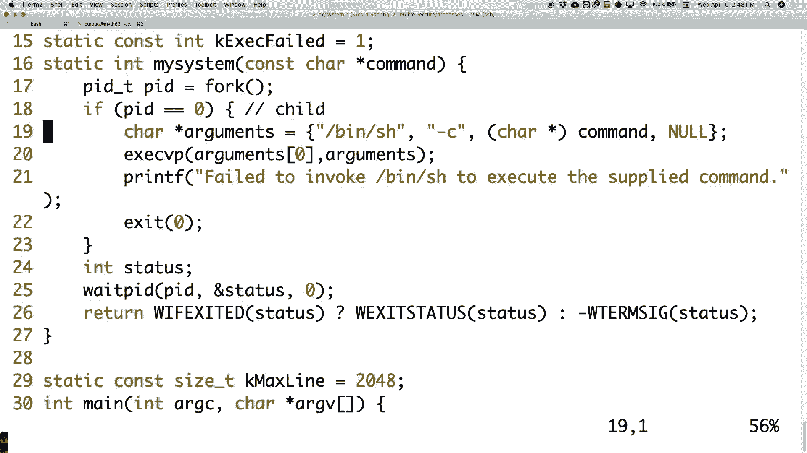

 That should do it maybe。 There we go。 Okay。 Now my system will give you a prompt。 So there's your little prompt。 And if you type LS it runs LS。 Right。 And there's our prompt。 And if we say we could actually run Python or something。 Right。 And whatever you want。 Right。 If you want to run it does the return code。 If you type some bogus something it'll say hey permission denied or something else it'll say return code 127 which is incorrect。

 Okay。 That's the first example of exact CEP。 We will start with that on Monday。 See you then。

