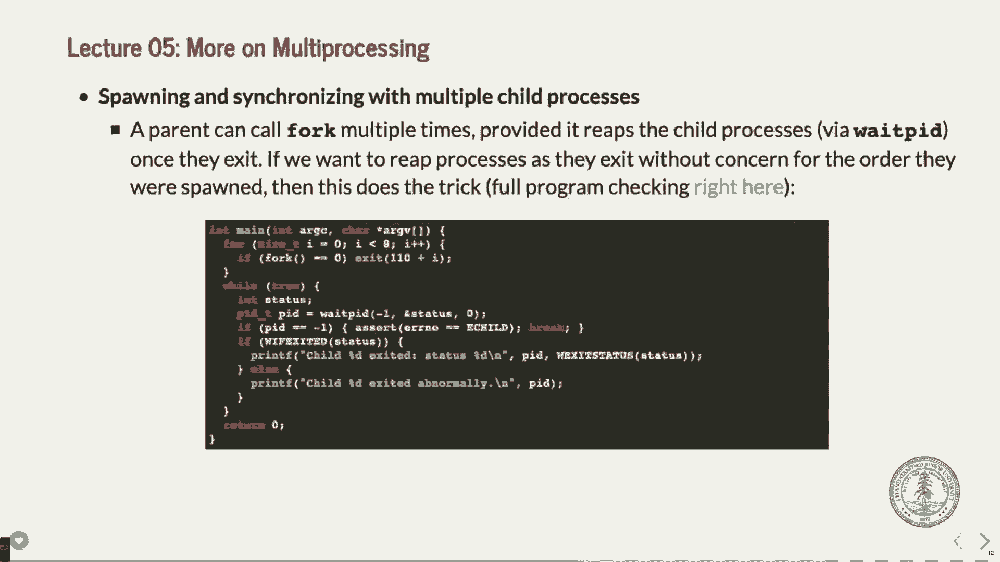

# 课程 P5：第五讲 - Fork、Waitpid 与 Execvp 🚀


在本节课中，我们将深入学习进程管理的核心概念：`fork`、`waitpid` 和 `execvp`。我们将探讨如何创建子进程、如何让父进程等待子进程完成，以及如何让子进程执行全新的程序。这些是构建更复杂应用（如Shell）的基础。


---


## 关于 Fork 的讨论与作业说明


上一节我们介绍了 `fork` 的基本用法。在深入新内容之前，我们先讨论一些相关话题和即将到来的作业。


有观点认为，Unix 将 `fork` 和 `exec` 结合是一种独特的设计。但也有人认为，`fork` 是上世纪70年代针对当时机器和程序的一种巧妙技巧，其现代实用性已经过时，甚至成为一种负担。作为操作系统教育的一部分，我们将其作为历史背景来学习，但你们仍然需要掌握它，尤其是在期中考试中。

关于文件系统的一个澄清：当两个进程各自调用 `open` 打开同一个文件时，系统会在打开文件表中创建两个独立的条目，每个都有自己独立的游标位置。只有在 `fork` 之后，子进程才会继承父进程的文件描述符，从而共享同一个打开文件表条目和游标。

接下来是作业说明。第二个作业（实际上是第一个涉及新知识的作业）关于文件系统。你们需要基于课堂上描述的 Unix V6 文件系统，编写代码来读取和写入磁盘镜像文件。


以下是作业的核心任务概述：
*   作业目标是能够定位、读取并写入磁盘镜像中的文件。
*   你将主要在四个文件中编写代码：`inode.c`、`file.c`、`directory.c` 和 `pathname.c`。
*   建议按上述顺序完成。
*   作业使用 C 语言，不能使用 C++ 的 STL 容器（如 `map`, `vector`），需直接操作数组和结构体。


一个关键函数是 `inode_index_lookup`，它的作用是：给定一个文件对应的 inode 和该文件内的逻辑块号，返回该逻辑块在磁盘上的实际物理扇区号。

例如，一个大小为 180,000 字节的文件，逻辑块号 302 代表该文件第 302 个 512 字节的数据块。你的函数需要根据 inode 中的直接、间接指针信息，计算出这个数据块在磁盘上的实际位置。


作业中还需注意：
*   目录可能包含超过 32 个文件，需通用处理。
*   文件名最长 14 字符且不以空字符结尾，比较时不能使用 `strcmp`。
*   尽早开始，充分利用 Piazza 和办公时间寻求概念性帮助。


---

## 使用 Waitpid 控制进程执行顺序

在上一节的 `fork` 示例中，我们遇到了输出顺序不可预测的问题。本节我们将学习如何使用 `waitpid` 系统调用来让父进程等待子进程，从而控制执行流程。


`waitpid` 函数原型如下：
```c
pid_t waitpid(pid_t pid, int *status, int options);
```
*   `pid`: 指定要等待的子进程ID。传入 `-1` 表示等待**任何**一个子进程。
*   `status`: 指向整数的指针，用于获取子进程的退出状态。
*   `options`: 通常设为 `0`。
*   返回值：成功时返回终止子进程的PID；失败时返回 `-1`。


`waitpid` 会暂停父进程的执行，直到指定的子进程状态发生变化（如终止）。同时，它也会完成对子进程的清理工作。


让我们看一个使用 `waitpid` 的示例程序 `separate.c`：


```c
#include <stdio.h>
#include <sys/wait.h>
#include <unistd.h>


int main(int argc, char *argv[]) {
    printf("Before.\n");
    pid_t pid = fork();
    printf("After.\n");
    
    if (pid == 0) {
        printf("I'm the child. Parent will wait up.\n");
        return 110; // 子进程返回值
    } else {
        int status;
        waitpid(pid, &status, 0); // 父进程等待特定的子进程
        if (WIFEXITED(status)) {
            printf("Child exited with status %d.\n", WEXITSTATUS(status));
        } else {
            printf("Child terminated abnormally.\n");
        }
    }
    return 0;
}
```
在这个程序中，父进程一定会等待子进程结束后才检查其状态，因此“After”总是在子进程的输出之后打印，顺序变得可预测。


宏 `WIFEXITED(status)` 用于检查子进程是否正常退出，`WEXITSTATUS(status)` 则用于提取子进程的返回值。


---


## 多子进程管理与 Waitpid 进阶


上一节我们看到了父进程等待一个子进程的情况。本节我们来看看当存在多个子进程时，如何使用 `waitpid` 进行管理。


我们可以通过循环多次调用 `fork` 来创建多个子进程。为了等待所有子进程结束，我们可以在一个循环中调用 `waitpid(-1, &status, 0)`，它会等待**任意**一个子进程结束，并返回该子进程的PID。


以下是一个创建8个子进程并等待它们全部结束的示例框架：
```c
for (size_t i = 0; i < 8; ++i) {
    if (fork() == 0) {
        // 子进程：做自己的工作，然后退出
        exit(110 + i); // 每个子进程返回不同的值
    }
}
// 父进程：等待所有子进程
while (1) {
    int status;
    pid_t pid = waitpid(-1, &status, 0);
    if (pid == -1) break; // 没有更多子进程了
    if (WIFEXITED(status)) {
        printf("Child %d exited with status %d.\n", pid, WEXITSTATUS(status));
    }
}
```
由于 `waitpid(-1, ...)` 等待的是**任意**结束的子进程，因此打印出的子进程结束顺序可能与创建顺序不同。

如果想严格按照创建顺序等待子进程，则需要保存每个子进程的PID，然后依次对每个PID调用 `waitpid`。





---


## 引入 Execvp：运行新程序


到目前为止，我们使用 `fork` 创建的子进程运行的是与父进程相同的代码。但 `fork` 更常见的用途是：创建一个子进程，然后让该子进程去执行一个**全新的、不同的程序**。这正是 Shell 运行命令的方式。


实现这个功能需要另一个系统调用家族：`exec`。我们将重点学习 `execvp`。


`execvp` 函数原型如下：
```c
int execvp(const char *file, char *const argv[]);
```
*   `file`: 要执行程序的路径（例如 `/bin/ls`）。
*   `argv`: 传递给新程序的参数数组，格式与 `main` 函数的 `argv` 相同。`argv[0]` 通常是程序名。
*   返回值：**仅在发生错误时返回 -1**。如果执行成功，该函数**永不返回**，因为当前进程的代码和数据已被新程序完全替换。


一个典型的模式是：`fork` 创建子进程，在子进程中调用 `execvp` 来运行新程序，而父进程则调用 `waitpid` 等待子进程（即新程序）结束。


---

## 实战：构建一个简易 Shell 🐚


结合我们刚学的 `fork`、`waitpid` 和 `execvp`，本节我们将构建一个非常简易的 Shell 原型 `my_system`。


这个简易 Shell 的工作流程是：
1.  显示提示符，读取用户输入的命令。
2.  `fork` 出一个子进程。
3.  在子进程中，使用 `execvp` 调用系统 Shell（如 `/bin/sh`）来执行用户输入的命令。
4.  在父进程中，使用 `waitpid` 等待子进程结束，并获取其退出状态。


以下是核心函数 `my_system` 的实现框架：
```c
int my_system(const char *command) {
    pid_t pid = fork();
    if (pid == 0) {
        // 子进程
        char *arguments[] = {"/bin/sh", "-c", (char *)command, NULL};
        execvp(arguments[0], arguments);
        // 如果 execvp 成功，不会执行到这里
        fprintf(stderr, "Failed to invoke /bin/sh to execute the provided command.\n");
        exit(0);
    } else {
        // 父进程
        int status;
        waitpid(pid, &status, 0);
        if (WIFEXITED(status)) {
            return WEXITSTATUS(status); // 返回子进程（即命令）的退出码
        }
        return -WTERMSIG(status); // 如果命令被信号终止，返回负的信号值
    }
}
```
主函数则是一个循环，不断打印提示符、读取命令、调用 `my_system` 并显示返回值。


通过这个例子，你可以清晰地看到 `fork`、`execvp` 和 `waitpid` 如何协同工作，来执行外部程序并管理其生命周期，这正是真实 Shell 的底层机制。


---


## 课程总结


本节课中，我们一起深入学习了进程管理的核心操作：
1.  **`fork`**：用于创建当前进程的副本（子进程）。
2.  **`waitpid`**：用于让父进程等待一个或全部子进程结束，并回收资源、获取其退出状态。这是避免竞争条件、控制执行顺序的关键。
3.  **`execvp`**：用于让一个进程“脱胎换骨”，停止执行当前代码，转而去执行磁盘上的另一个全新程序。它通常与 `fork` 配合使用。


我们还通过构建一个简易的 Shell 原型，看到了这三个系统调用如何在实际场景中协同工作。理解这些概念是进一步学习进程间通信、管道、信号以及构建复杂并发应用的基础。