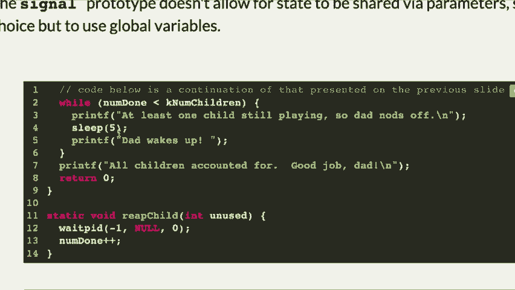
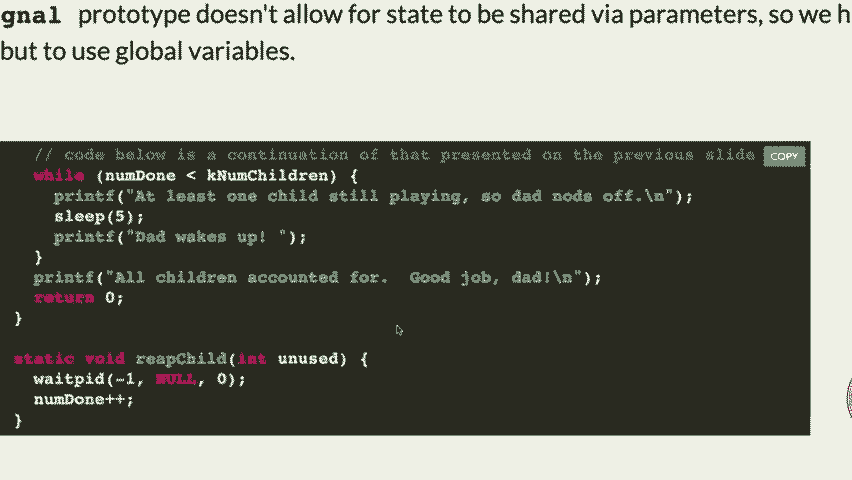

# P6：Lecture 6 execvp, pipe, dup2, signals - ___main___ - BV1ED4y1R7RJ

 Welcome， welcome back to Monday CS 110。 We are continuing with multi-processing， which is。

 like I said， the first time you're probably seeing things happening in parallel of a program you've written。

 So we're going to take the time we need to discuss that。 We're also going to talk about today。

 we're going to talk about these things called pipes。

 which are basically a way for two processes to send data back and forth using read and write。

 So we'll get to that。 And then we'll talk a little bit more， depending on how much time we have。

 about interprocess communication， which basically means that we'll talk about how two processes actually talk to each other。

 And how you end up getting a message， a signal， which is another name for it。

 how you get a signal when a child actually finishes。 So we'll get to that by the end of the class。

 I think。 How's the assignment going？ Biosystem going all right。 I've seen a couple of thumbs up。

 It's definitely， you know， it's got a lot of little moving parts to it。

 Somebody was just asking me in the hallway about， like， how do you get a signal？ Like。

 how do you know when you're reading data， what kind of data it holds？

 You kind of don't unless you're in a function where you're specifically reading data from the disk。

 where you already have information about， oh， I'm reading a file， or I'm reading a directory。

 or I'm reading an I know block or something like that。 And you know that as you。

 when you call these functions that read from the disk。

 because the disk itself could care less what's on it。

 it just matters to you as the actual operating system。

 and the file system has been put in place with certain， certain things associated with each block。

 So that's how you know that。 Anyway， hope it goes well。

 Any questions on the assignment at this point？ Piax has been going along。

 Comments or questions about it？ Yeah。 [ Inaudible ]， Good question。 So the question was， hey。

 you said that you're able， that you are allowed to change some of the functions。

 You mean the ones we've already written for you？ Things like that？ No。

 You should not change the return values for functions if you can help it。 I mean。

 especially the ones， I mean， in general leave them the same。 If you need to， for some reason。

 you should have a really good reason for it。 But no， you should。

 the spec we've laid out shouldn't need to be changed as far as the return values。

 If you have a specific question， come on up after and let me know what you're talking about and we'll chat about whether or not。

 But most of the time， yeah。 Everybody else？ Okay。 Office hours are this evening and rest of the week。

 I have my office hours tomorrow morning。 There haven't been many people showing up。

 So I may just add some office hours， kind of maybe in the afternoons。

 I'm thinking maybe Wednesday after class。 Would more people be able to go to that？ If I had。

 I don't see， I see a couple people。 Okay。 I'll see about doing that in my own schedule。

 I've got to look at it。 But we'll try to put some more office hours in there or Thursday around the same time。

 Might also work。 So we'll do that。 All right。 So last week。

 we actually finished with the example I'm going to go back over again。 Remember。

 we've been talking about this interesting system call called E-X-E-C-V-P。

 which is part of the E-X-E-C or exec functions system calls。 And what that does is it says。

 I want to run another program and basically replace my current system。

 And replace my current process with that program。 Now， if you want to do that。

 most of the time you're not going to be done with your program。 I mean。

 there might be some cases where that's going to be true。

 But most of the time you want your program to kind of spawn off this other process that some other program and you use fork to do that。

 So you fork， you get a child process and you save it a child process。

 you will run this program and while doing that， the child process will become that program and that's it。

 Now， there is some communications between that child program and the one you're the parent and we've got to talk about how that actually happens。

 So we wrote a little， just a very basic program called MySystem。

 We're going to expand on this a little bit more in a few minutes and then you're going to expand on it for assignment four actually。

 You're going to make a much more robust MySystem kind of command。

 which is basically a little shell is what we're talking about。

 So here's what the program itself did。 So let's look through this a little bit。 Basically。

 the first thing the MySystem function， this is the MySystem function does。

 it takes in a command and that could be something like LS or cat file。txt。

 It just takes a command in and it's going to run that command using the shell itself。

 the actual shell。 We do that so that it's a little easier to parse it。

 When you get to yours for assignment four， you will figure out how to do it without using the shell as kind of training wheels。

 You'll see it， we'll see what that means in a little bit。

 And then it takes that command and then it does this fork。 Does this fork and MyPen has died？

 So it actually forks because we are about to call exec CVP。 So we don't want to make it the only。

 we don't want the function to be done for our program。 Oh no， it's done。 Didn't work at all。

 Hang on。 Maybe we won't use these again。 Hang on。 Let's see。 Nope。 That's not working。

 Try this one more time and then we will not use this。 Not working。 Tabla。 Anyway。

 what it's doing is， I'll even blow this up here。 So basically。

 it's going to fork and then if it's the child， it's going to spawn this other process which is the program you want to run。

 And it's going to do that by basically saying， okay。

 actually run this program called /bin/sh which is the shell program。

 Run it with the -c option which says， hey， run the following program。

 So it's kind of like two levels of indirection here。

 And then it's going to take your command and it's going to run that command that you have typed in。

 And then this is an array that has to be null terminated。 So that's what's happening here。

 It's basically creating an arguments array that is an array of string pointers。

 charge star pointers。

 And then you call exec CVP and it calls the - the first argument to exec CVP is the name of the program that is directly being run。

 In this case， it's /bin/sh which also happens to be the first argument in the argument list just like it is in main。

 And then the second one is the entire arguments list， second parameter。 If that fails。

 then it returns to this function。 If it doesn't fail。

 the entire rest of that child process is destroyed。

 It's cannibalized so that this other program can run。 Remember， your parent is still running。

 But the child process you just created is now destroyed by running the other program。

 Okay， so that's what's going on there。 Now， I actually am trying something new。

 One of our TAs actually created this little system here so you can actually in the slides run this。

 although I think the font is possibly a little too small。 But you can actually run this in here。

 And here's what it looks like when it runs。 There we go。

 And it puts up a little cursor here like that。 I'll just do make this a little cursor like that。

 And you can type ls。 And that's what the program is doing。 It's actually running ls and doing that。

 And then let's see， catcode。c should also print out the code。

 And so we've written kind of a little shell and it always comes back to the prompt for us at the end。

 Okay。 The standard in for the child process is just regular old standard in。

 We'll see how that might change in a little bit。 Okay。 And then to end this， by the way。

 for us to end this function， we actually do control D。

 which says we're done entering things from standard in。

 It basically closes standard in for the process that's being run。 Okay。

 So let's look at the main and how main actually works here。 Main basically says， oh， okay。

 We're going to do a while loop because we have to keep putting a little prompt。

 which is just this little arrow here。 And it gets a line using fgets from standard in。

 And that's what you type ls or cat whatever。 And then if you type control D it would end。

 That's what's going on there。 And then it just populates the new line。

 changes the new line into a zero so that we've actually got just a regular old string here without the。

 Without the new line in it。 And then it actually calls my system with the command gets the return value back from my system。

 which is the return value from whatever the my system command does。 And then it continues to look。

 Okay。 Do you see what's going on there？

 All right。 So that's what we kind of covered the other day。 Let's move on。

 And this is the test on it。 So I just showed you that。

 Let's move on and we'll talk about a little bit more detail of the similar type of program in a few minutes。

 I want to introduce a couple of other topics。 Okay。 We're going to introduce the notion of a pipe。

 which I mentioned earlier。 And then doop two。 Now in lab you should have covered doop to some extent。

 We'll go over the details of what that's what do to in particular is doing here。 Okay。

 So now let's have a little more complicated shell。 All right。 In the actual， let's see。

 I just want to make sure that we're getting to the， because there's no piping yet。

 Let's actually go ahead and do this the more advanced shell here。

 Okay。 This is going to be simple shell dot C and。 Oh， no， hang on。 It is。 Yeah， it is simple shell。

 Hang on。 I think I already had it simple shell。 Sorry。 Oh， all right。 We'll just look at it。

 I won't type it all right now。 Got plenty of things to type a little bit later。

 Here's what we're going to。 Look at it。 Actually， I can do it in the thing over here。

 Now I think about it。 Here's what the code is going to do in this case。 Okay。

 We are going to create a shell that actually allows you to do a background command。

 Now what is a background command？ In the regular old shell。 Okay。 You can do the following。

 You can actually type a command that runs in the background。

 which means that you get your prompt back immediately and now it's all the other program is still running。

 Why might you want to do that？ Well， there might be various reasons why that you might want to have some other program running。

 and you still want to use your shell。 Okay。 It's a little weird if you do something like LS dash AL。

 but then you put it in the background。 And that's how you put it in the background， by the way。

 You put an ampersand and what it does is it actually immediately says， let me go back up here。

 Here we go。 It immediately says， "Hey， this is a process I just created。

" And then it gives you a prompt back， and the rest of it continues going。

 I think I showed you an example of this the other day， that actually kind of， what was it？

 It was like， "Wow。 Actually， I wouldn't think it was quite this one。"， So， "Wow one。 Echo。

 Are you annoyed yet？" Something like that。 "Semicolon sleep。 One。 Done。" Oops。 Let's see。 "Wow one。

 Do。 Do。 Echo。 There we go。" Okay。 So that's that。 We can just run this and it's just going to run every second。

 If I put that in the background， what it will do is it will， every second， just tell me that。

 which I can do other things。 And every second it just says， "You know， you're new and then whatever。

"， And I'm still able to run programs。 And this is kind of the same sort of thing I showed you today。

 And it just basically does， it's running in the background。

 So I've now done that by doing the ampersand on the end of the program， that says， "Hey。

 run this program and then let me do other stuff。" And you might think of various reasons why you want to do that。

 And this would be a bad thing to do unless you want to be annoyed lots。

 And then actually you have to actually type F G and then control C and it will actually stop the program。

 F G says， "Put it in the foreground。" Okay。 You can actually do this a different way too。

 If I just run that same command without the ampersand and let it go。

 if I want to put this one in the background， I just type control Z， not control C， control Z。

 and it will put it in the background and stop it。 Which might be what I want。 Okay。

 And then if we want to actually continue it， let's see。 Let's see。 If we want to continue it。

 I think， let's see。 I think if we， nope， hang on。 Job。 Nope。 Yes。 Oh。

 it might have killed it accidentally。 Hang on。 Might have killed it。 Let's see。 If I do control Z。

 it stops it and then I can put it back in foreground。 Oh。

 I think it only stops the final thing that my while loop isn't going to necessarily work。

 I could do it this way though。 I could say like an annoying got shell。 Let's see。

 We're going to check this。 There we go。 And then， an annoying got shell。 All right。 There we go。

 Now。 An annoying got shell。 Annoying。 Okay。 There we go。 Now that's that。

 And then hopefully this will keep， if I keep doing， there we go。 It'll keep， there we go。

 Now it's in the background。 So what you basically do is you run a program and then if you do control Z。

 it stops it， pauses it in the background。 And then if you type BG。

 it will continue it running in the background。 Okay。 And then that's it。

 And now I can still type LS， but every second it's going to say。

 are you annoyed yet， et cetera。 And then if I wanted to go in the foreground， I can do。

 I can take FG。

 It will go in the foreground and then I can control C and get rid of the message final。 All right。

 So what we are going to look at here is this program that basically will use the idea of a。

 background to enable us to run background processes。

 So it's a little bit more advanced than what we had before。 Okay。

 So let's look at the actual code here。 Okay。 Another while loop because we want our little shell to。

 actually keep going and giving us back a prompt。 Okay。 We are going to read a command。

 which is another， function， which basically reads the command in from the line there。 Okay。

 We are going to create an， arguments list， which is going to have the command in it that's going to parse the command。

 If you， want to look at all the details of these functions， you can see them。

 But basically we're going to type in a， command， have it parsed。

 And that part is not really that important to what we're trying to do here。 Okay。

 And then we are going to look for something called a built-in， which is this quit thing。

 Now how before we had， a type control D and it would end。

 Now we just type quit and it actually ends。 So this is actually just a little kind of。

 an extra part here where we say， oh look， if the arguments that we typed in was quit。

 then stop this while loop。 That's nice。 Okay。 And then if the last thing in the argument was the ampersand。

 we want to put this in the， background。 In other words。

 we want to go back to our prompt and let it keep running。 Okay。 Well， how are we going to do that？

 We'll see。 Okay。 We are basically going to do the following。

 We're going to see if we are in the background。 Okay。

 Then we're going to get rid of the little ampersand so we can run the command correctly。

 Then we're going to fork。 Okay。 And if we are the， child。

 remember if the return value from fork is zero， we are the child。

 we are going to call exec CDP on the arguments with the， argument zero in the arguments。

 And that of course is going to not return because it's the child。

 We should do error checking on this。 Like if I type a command that doesn't work。

 it shouldn't do this。 If it's the background， we are just going to print the actual child。

 process PID and then the command we did and then we're going to continue going back to another prompt。

 Okay。 And then we are going， if not， if it's not in the， but we have to do a weight PID。

 And the weight PID does what？ It tells the parent， don't do anything， until the child process ends。

 Okay， so that's the one here。

 And again， you can go look up some of the details there。 I think I actually have another， yeah。

 I can run it here， as well。

 Okay？ Run it here。 All right， this is simple， the prompt happens to be called。

 Simple SH。 Okay， you will be writing one called STSH， for Stanford Shell。 Okay， if I type LS。

 there we go。 If I type， let's see， if I type L， oh， you know what？

 I'm going to run this any other one， so I can show you the one that we just did。 Simple， maybe not。

 make Simple SH。

 There we go， Simple SH。 Okay， so if I type LS， then it will give me that。 I can type catmysystem。c。

 and it will give me that。

 If I type the catmysystem。c with the ampersand on it， then it actually runs in the background。

 and my prompt is going to be up here somewhere。 It's going to be way up here， there。

 It actually printed out the process number， and then the name of the file， the function。

 or the program that's in the background， and then it prints the prompt right there。 Okay。

 so we should be able to run our annoying program as well。 And， oh no， I forgot， I forgot to。

 We should be able to write a "knowing" I've put in the background。 Annoying。sh in the background。

 there we go。

 And then now we're on our Simple SH。

 Like that。 Now there happens to be no way to kill this。 Well， that's not true。

 I could probably type Jaa。 I probably could type PS， and it will tell me that。

 and if I do a command called kill， it may work， although I don't see annoying there， but yeah。

 so maybe not。 Anyway， how are we going to do it？ We're going to type Control C。 Or quick。

 And that's that。

 But anyway， the point is that now we've actually， got a little bit more functionality to our Simple。

 SH。 Which is to say that we can now run a command in the background。

 or what we call in the foreground， which actually， pauses the parent。 Yeah。 [INAUDIBLE]， Yeah。

 good question。 So the question was， hey， why are we。

 waiting on the PID in the parent？ OK， remember what the parent is doing。

 The parent is giving you back a prompt， and waiting for you to type something。

 If I run a program normally without being in the background， in what we call the foreground， we。

 don't want the parent to put the prompt until it's， waiting for the child to end。

 Does that make sense？ So that's what's happening here。 It's waiting for the child to end when。

 it's in the foreground， because the child， processes taking over the input output。

 If it's in the background， we don't want to wait PID， because we want to go， oh， OK。

 it's off running on its own。 Let's give you back a prompt so you could do more other things。

 Sounds good。 Yeah。 [INAUDIBLE]， Does the child not finish until after the argument--。

 or are they commanding pass a DEX， DEX， DEX， and so on？ That's a good question。 The question was。

 wait， does the child not， finish until the exact CBP ends？ Yes。

 The exact CBP is the child at that point。 Remember。

 the entire process gets taken over by that program， and it is the child process。

 So even though you run that other program， that's a chapter。 When that program ends。

 then your wait PID will stop。 Good question。 Yeah。 Will the child ever get to the line that you're。

 putting on right now？ The child will never get here if the command was a legitimate， command。 Why？

 Because exact CBP never returns if it， cannibalizes the process and works correctly。 Good question。

 Any other questions on that？ OK。 Let us-- and you can go-- like I said， you can either run it。

 in here， or you can run it certainly on your own computer。

 using the MIF machines。 All right。 Let's talk about another system call called pipe。

 The pipe system call enables you to have two file descriptors， one of which you read from。

 the other you write to， and whenever you write something to that other one。

 you can read that data from the first one。 Basically sets up two file descriptors。

 that communicate with each other。 Well， let's see how that actually works。

 It takes in a little array， in fact， a very small array， of two integers of FDS 0 and 1。

 So it takes a two integer array。 And those integers， when you call pipe。

 it populates that array with two file descriptors。

 One of the file descriptors you're going to read from， the other one you're going to write to。

 And what it does is it actually sets it up， so that parents and children can talk to each other。

 Because remember， when you do fork， everything is copied。

 And the pointers into the open file table are also copied。

 So you get the same data so that you can write to one， and read from the other。 And they're both in。

 both the parent and the child。 We're going to see an example of this in a few minutes。

 and you can do that。 And you can see why it actually becomes important。 But that's what pipe does。

 You call pipe， you pass in this tiny array。 You do not have to initialize the array。

 It doesn't matter。 You just pass it in。 And it populates that array with two file descriptors， one。

 of which writes， and the other one reads from the one， that you just read。

 That's how it works。 All right， let's look at a program。 In fact。

 I'll write this one out so we can do it one line， at a time。

 This one is going to be called pipeexperiment。c。 So in here， what we're going to do。

 is we are going to do this in FDS2。 That's our file descriptor that the pipe is going to populate。

 Then we are going to say pipe FDS。 We're going to ignore the return value for now。

 Don't worry about the return value。 It actually is not-- I think it may give us negative one。

 if it doesn't work。 Just ignore it for now。 And then we are going to do a fork， the IDT。

 PID equals fork。 All right， if PID equals 0， which means we're a child， what are we going to do？

 We are going to-- well， here's what this program is going to do。 I just want to tell you that first。

 The program is going to create a pipe， and the parent is going to write some data。

 that the child will read。 So the parent is going to write， the child is going to read。 All right。

 by the way， this file descriptor-- everybody， always gets confused。 Which one's the read。

 which one's the write？ The FDS0 is the reader。 And I always remember that because you。

 learned to read before you learned to write。 So it's the first one is the reader。

 And so the second one， FDS1 is the writer。 That's the way I remember it。

 And what you can do is you can say， OK， because the child will read from the pipe， what we can do。

 is we can immediately close the FDS1。 No need to write。 In other words。

 we're going to close the pipe。 When you create a pipe， it creates two file descriptors。

 And when you fork， now you've got a total of four file descriptors， because everything's copied。

 And by the way， it updates the reference counts too。 So now you've got a situation where。

 you've got four file descriptors floating around out there。 You only really want to use two of them。

 The reader will be in the child， and the writer， will be in the parent。 You could use both。

 But if both the parent and the child， tried to write to the writer， they might get garbled up。

 because there's no real easy way of determining who's going， to be writing at one particular time。

 You could probably figure that out， but that's not what we're trying to do here。

 We're simply trying to get the child to read from this pipe， when the parent writes to it。

 So we're going to close the FDS1 because the child does not， need to write。 OK。

 we're going to do a buffer that happens to have six characters。

 We're going to only pass six characters in here。 We're going to， in the child， read from FDS0。

 And we're going to read into the buffer。 And we're going to read six characters， which。

 is basically the size of the buffer。 And then we're going to print red from pipe。

 bridging the processes。 OK， percent S， whatever we read。 And we're going to write the buffer。

 So that's that。 Now we are done reading in our child。

 So we need to close FDS0 because we just finished it。 I'll just put Don reading。

 And then we're going to return 0， or we could exit as well。 So that's what the child is doing。

 The child is-- got these two pipe parts。 It's going to close one of them because it's not going。

 to bother writing to it。 And then it's going to read from the other one。 And then when it's done。

 it's going to close that。 You should always close your file descriptors， when you're done with them。

 except for standard in， standard out and standard error。 You don't need to close those。 OK。

 all right， so that's what the child is going to do。 The parent will write to FDS1。

 So what's the one that we're going to actually close？ FDS0。 No reading necessary。

 That's what we're going to do there。 And we know we're in the parent because it's。

 though not the PID of 0， but we got that。 OK， what we are going to do here is。

 we're going to write FDS1 because that's the writer， part of the pipe。

 And we're going to write just hello。 OK， and we're going to write six bytes。

 Why is it six bytes and not five？ There's a little null on the end there。

 Got to write that in there。 OK， and we are going to then just wait for the child。 PID， PID， no。

 we could do this with the return values。 Now that we're not going to worry about it。

 And then we're done with writing。 Done writing。 So we close that pipe and then we return 0。 Oops。

 got an extra one in there。 All right， questions on that？ Yeah。

 Do you have any guarantee that the parent is going to write， before the child is--。

 You do not have any guarantee。 That's a good question。 The good question is do you ever guarantee。

 the parent will write before the child reads？ No。 But remember read blocks until it gets the number of bytes。

 that you request。 So unless the parent closes， that will wait until all six， bytes get in there。

 Generally， you actually--， yeah， well， it will wait if there are six available。

 If there were four in it closed， then it would only read four。 But in this case。

 we know we're sending six。 But no， that's a very good question。

 Good point。 OK。 All right， let's try to run this。 Make pipe experiment。

 All right， pipe experiment。 This is going to be kind of anticlimactic。

 but read from pipe bridging process hello。 OK。 So that's all it did。

 What questions do you have about this at this point？ What other questions？ Yeah。 [INAUDIBLE]。

 If you made the buffer 12 long， and then--， But you only wrote six。

 Let's try it and see what happens。 Let's just try and see what happens。 OK。

 If we made the buffer 12 and said， hey， let's read 12。 Let's see。

 That was that size of buffer is OK。 And there we go。 Let's see。 Make pipe experiment。

 Pipe experiment。 Same thing。 So what happened was it tried to read 12 bytes。 It read only six。

 And then the file ended。 In other words， the input file ended。 And so it was able to continue。 Now。

 what if we did this though？ What if we said， oh， I'm going to forget to close my writer？

 Let's see if this actually changes。 May or may not。

 It may close it when it actually ends。 Let's just see。 Pipe experiment。 And let's see。 Yeah， OK。

 So it did actually， in that case， close it。 But I bet if we ran it in Valgrine-- oh， I don't know。

 how to the actual file。 In Valgrine， you can check to see if the files are still open。

 And it will tell you。 Not a good idea to leave them open just for waste。 Yeah。 All right。

 What other questions？ Yeah。 Can you only read and write two times？

 Is that a time when you write multiple times？ Or is it OK to read？

 Can you only read and write to one at a time？ And if you had multiple children。

 would you be able to only use this one？ You can use this pipe for whatever you want。

 As long as your logic is OK， you， could have all your children reading from it。

 But you'd need to know what order things were happening， back in the parent and so forth。

 But generally， if you're trying to write to multiple children。

 you will probably create a different pipe for each child， and just keep them in an array。

 And each child has its own reader pipe， that it's trying to read from。 And by the way。

 we could have swapped this and had the child， write to the pipe and the parent read it as well。

 But that would work too。 [INAUDIBLE]， Yeah。 [INAUDIBLE]， Oh， good question。

 Why is it implemented as an array of two file descriptors？

 This is the way they wrote it。 I mean， it has to be-- they just said， no。

 you've got to have an array。 And it does have to be an array。 It can't be like two。

 It's not two parameters。 One parameter， which they point her to an int array。

 And it can't be more than two。 A pipe is only working on two。 Creates a reader and a writer。

 That's it。 Yeah。 Could you explain why we wait for the child process before closing。

 the write file descriptor？ Yeah， good question。 So why do we wait for the child process before closing。

 the file descriptor？ It could be that if you close-- it probably could be--。

 and I'm not 100% sure on this。 But it probably could be that if you close the file descriptor。

 before the reader has done reading， it might actually say， oh， both the write was done。

 I'm not going to actually produce any more information。 So you kind of want to wait。

 You definitely don't want to close it until you're sure。

 that the other process has done all the reading。 I think that's it。 Any other questions on this one？

 Yeah。 [INAUDIBLE]， At four-- I didn't say four processes。 Or if I did， I apologize。

 We have four file descriptors now， because we have two file descriptors for FDS in the parent。

 and two file descriptors for FDS in the child。 Only two processes。 Whenever you fork。

 you get one more process。 Two processes， but you've got a copy of FDS。

 So the parent has FDS 0 and 1， and the child is FDS 0 and 1。

 Which is why we had four closes in here。 We closed FDS 1， and the child immediately。

 because we're not writing to it。 We closed it after we're done reading。

 because we're done with it completely。 And then the exact opposite in the parent。 Yeah。

 So the questions-- I thought since they're copies， they don't update in each other's frame。

 Good question。 The question is， wait， wait。 Are they not-- if their copies。

 they don't update in each frame。 When you fork， they both end up pointing， to the open file table。

 which is one file is open， for the actual file descriptors。 And it does update the reference counts。

 for who's pointing to them。 So it does-- does it-- does it not make new-- does no more。

 opens in that case。 Yeah。 So how does the child's copy do the open one do the writing。

 in the finish？ Good question。 The question was， how does the child process know。

 when the writing is finished？ It reads as many bytes as are available。 Is really what it is。

 So I asked it to read six bytes。 So it will read six bytes if they're available。

 That's how it knows。 It waits until they're all ready。 It's all available。 [INAUDIBLE]， No， no， no。

 It's possible for the child to try to read before the write is， done。

 But it waits until those six are available。 So they're not available。

 They might not be available when that read command is generated。 Yeah， good question。 Yeah。

 So by waiting， do you mean like they're， just signal in the read function and walks in the child。

 process？ Then it waits until it receives that signal。

 and then execute the rest of that child process after read。

 Like once it actually passes the six bytes to read raw。

 So what you're asking about-- the question was basically， wait， how does this waiting work here？

 Read is a system command or system call。 And the kernel says， oh， OK， you want。

 to read six bytes from this other file or from this file， descriptor。 Are they available yet？ Nope。

 no data has been read yet。 Oh， OK。 I'll just put you to sleep until they're available。

 And then when they're available， I'll give you them back。 You will read them all。

 And then you will continue along with your program。 Yeah。 That's actually very-- that's actually。

 a very good question。 Because later on， we'll see a function where we go。 Wait a minute。

 How does-- we're going to use a sort function。 How does the sort function know to wait for the data？

 It just says， hey， give me all the data until the file ends。

 And if there's no data-- if the file has an end， it'll just wait until data comes in。

 So we'll get to it a little bit more of that later。

 Yeah。 So if we change the whole load's high， then， we'll never have six characters， so we'll。

 just have to have a read。 Yeah。 Let's try this。 It may actually-- oh， yeah。

 If we don't close the thing， that's the good question。 The question was， wait。

 what if we changed it to we only row， high and we only row three bytes instead of six？ Let's see。

 Make， pipe experiment， pipe experiment。 Let's see。 In that case， it looks like it--， let's see。

 did we change anything else？ We still-- oh， we didn't-- let's see。 Yeah。 In that case。

 it may have been because we actually--， the parent ended and the file closed on its own。

 That's probably what happened。 So in other words， the file-- so if we were。

 to do something like this-- let's do this。 Let's do this。 While on semicolon。

 Just keep going forever。 The parent won't end。 And I won't be able to tell if the child ends。 Ah。

 yes we will。 Because they're making me do all this crazy stuff。 How about this？

 It probably won't actually-- it shouldn't actually， turn anything。 But let's just do the print。

 Child is ending。 Like that。 Make， pipe experiment。 Pipe experiment there。 OK。

 so it did seem to read the bytes probably possibly， because the zero was on the end of the high。

 That might be what it is。 I don't know。 We can check again。 There's some nuances in here that--。

 let's see。 That one is still。 The parent is still three。 What if we made it only two？ Hang on。

 If we made it six， it would read past the end of the buffer。 That's probably not what we want to do。

 But I mean， that would just be like--， let's see。 There we go。 Now we've only written two。

 So I think what happens is these file descriptors， are what we call somewhat buffered。

 If it gets a zero， it will pass it on to the other program， probably possibly。

 There's probably what's going on there。 Where's what's that？ Where's the-- oh， hi， Att。

 Because I didn't pass the actual zero on there。 So oh， you know what？ That's the other thing。 Yeah。

 so it did get a zero eventually。 So it tried to read。 It must have read only two or whatever。

 and then there is no zero on the end。 That's actually another thing。 So yeah。

 it's a little more nuanced than that。 So what this tells you is that you。

 do have to make sure your logic is correct so that you know。

 how much data is being read and written。 It's not as important as you think。

 because normally we will actually close files when， we're done writing to them。

 So you should just remember to do that。 It may or may not work depending on what you're trying to do。

 Yeah？ Yeah？ I'm sorry。 What was this experiment？ This didn't include anything as it turns out。

 Good question。 Yeah， I thought it was going to maybe pause and say， no， I didn't get enough data。

 But it only wrote two， and then it closed anyway， and it didn't actually wait for more data as it turns out。

 Yeah， I'm trying to think if there's a way to do that。 Let's see。 I don't-- yeah。

 I'm not sure exactly how we would， get it to pause in the child。 I mean。

 maybe when it gets to this wait PID， it says it does something with it。 But I'll have to look it up。

 I'll try to find out this actually if we can fool it。

 into pausing in the child to wait for more data。 There may be some time out as well in the read。

 Yeah？ What if you never wrote any data and it was just waiting to read？ There was no data。 Yeah。

 that's a good question。 We can try it and see if there's no data。

 We're actually writing it all。 Make pipe experiment。 Oops。 Okay， pipe experiment。 Yeah。

 If we write no data， it goes， I'm waiting for some data。

 And there's probably either a time out in there， or when the read/write function finishes。

 it's right。 It tells the read， go ahead and read anything， and so forth。 So yeah。

 So this one told us something。 Said if we don't write anything， we'll get a--。

 we'll stop in the child and wait for more data。 Okay。 Lots of nuance， I suppose。 All right。

 But anyway， that's how pipe works。 Pipe creates two file descriptors。 One you can write to。

 one you can read from， and whatever you wrote to the one you can write to。

 gets read from the other one。 Okay？ This actually makes things very interesting as we go along。

 Okay？ In fact， why don't I show you something first， before we get to the next little part here。

 There is a program built into units called sort。 And what sort does is it will sort input that you type in。

 line by line。 It will sort it--， do it。 So if I type bat and cat and apple and dinosaur and--。

 let's do some other things in here。 Bling and cool and whatever。 And when I end， right。

 if I do control D， it will actually， rewrite all the output in sorted order。 That's what sort does。

 Okay？ If I had a file， let's say unsorted。txt， and I put these words in the unsorted file。

 I could do the following。 I could say sort unsorted。txt。 I could also do cat unsorted。

txt and then pipe it into sort。 Okay？ And what that does is sort member takes input。

 as you're typing it， waits until it's all in， sorts all the lines。

 and then spits them all out again。 Okay？ But this pipe idea， this little vertical bar。

 is says take the output from cat， which is the words。 And send it into the input of sort。 Okay？

 So you have to think about what's going on there。 There's actually the output of one file。

 becomes the input of another file。 And we do that with a pipe。 Okay？

 So that's actually what we're about to take a look at now。

 Okay？ All right。 So let's see how we're going to--。

 this is the one we could run that again。 We already did that。 Okay？

 We've already talked about all this， all this things about how the actual pipe works。 Okay？

 I think that's a duplicate。 Okay？ Here's an example that we're going to do。

 And you will redo this function and make it more， robust for your next assignment， assignment three。

 which is going to come out on Thursday。 And it is a function we're going to create called subprocess。

 Okay？ And subprocess uses all of these kind of--， these pipe and fork and dupe。

 And I think called dupe 2， which we'll get to what， that means in a minute。

 And it uses exec CVP and so forth to produce--， to basically say。

 I want to send my output of my program， to some other file that's running。 Okay？

 So it's kind of neat。 The thing we need to first look at。

 is this struct that we are going to create。

 It is called subprocess_t。 And here's what it has in it。 It has a PID。

 which is the process of the--， I guess it's the program you're running。

 process of the program you're running。 And it has a supply file descriptor。 In other words。

 a file descriptor that if you write to it， it becomes the input to the file that you--。

 the program you're running。 Okay？ Yeah， I'll say that again。 It gives you the process identifier。

 for the program you're running。 And it also gives you a file descriptor， that when you write to it。

 it becomes， the input for the file you're running。

 So let's think about how we're going to use this for sort。

 And that's actually the example we are going to use exactly。 Once that goes on。

 What we're going to do is we are going， to create a subprocess of the sort program。

 And then we're going to pass into it， a bunch of strings。

 And the sort program is going to sort them， and print the output to the screen。

 Our program is going to pass in a bunch of strings to sort。

 And we're going to let sort do the sorting。 That's what's going on。

 You'll see how it works in a minute。 I'm getting some faces like， I don't get it。

 You'll see when it-- when it happens。 How's it make a question？ Is it the PID of the new program？

 And you've got to have the input here。 And the PID of the subdominant。

 It's the PID of the child process， which， is the one of-- in this case， the sort， for instance。

 And you'll see why we need it， why we need to do that， because we need to wait for it。 OK。

 we're going to create the subprocess and then wait for it， to end after we send it all the data。

 You'll see how it works in a minute。 OK？ All right。 So we are going to， again， pass in a command。

 which， is going to， in our case， be sort， or whatever program we， want to run。

 And it's going to create that process， start that process， running。

 and it's going to basically tell the process， hey。

 I'm going to give you a bunch of standard in as if you， were typing it。

 And then your job is to do whatever you want with it。 In this case， it's going to sort。 In our case。

 it's going to sort it。 OK？ That's what's going on。 So let's actually look at it。

 So here's what I'm going to do。 I'm going to type in--， I'm going to start with main， actually。

 Subprocess。c。 I'm going to start with main here。 OK， here's the type。

 Here's the struct that we're going to have。 And in main， here's what we're going to do。

 We're going to make this program sort a bunch of words for us。

 that we're going to pass to the sorting program。 So we're going to start out。

 and we're going to say， OK， we haven't written this function yet， we will。 Subprocess。

 TSP equals subprocess。 And the sort program lives at slash user slash bin slash sort。 OK？

 Our subprocess is going to take that sort function。

 It's going to create this subprocess T struct for us。

 It's going to create all the little pipe that's necessary， and it's going to set it all up。

 We'll get to that。 OK？ But that's what it's going to do。 It's going to start the sort program going。

 waiting for our data。 All right。 So then we are going to create--， let's create some words。

 charge star words。 And this， in this case， is going to--， I don't know。 We'll use some words like--。

 let's use--， Jerry calls them SAT words， like phagicity， umbridge。 Doesn't matter。

 whatever words you want。 Susser， equation。 Hopefully I'm spelling these right。 Halcyon， et cetera。

 OK， we're just basically creating a bunch of words， that we're going to pass into this sort。

 because we want to do that。 Pulperitude， let's see， evolution， some， not， some。

 Let's find a right to cross out。 OK， and then how about indivotigable？ OK。

 it doesn't matter if I didn't spell them right。 That's right。 OK， anyway。

 we're going to create a bunch of words。 They are not sorted right now。 OK？

 They're in this kind of random order。 OK？ And then we are going to take those words。 I equals 0。

 I is less than size of the words divided by size of words 0。

 That should be familiar from 107 of what we're doing there。 And then I plus plus。 OK？

 And then we're going to use a new function， called called dprintf。 OK， dprintf says a。

 Print to a particular file descriptor。 OK， well， we have a file descriptor。

 because we created the subprocess up here， sp。 We're going to go right to the supply fd。

 And we're going to write out each one of these strings， separated by the new line。 OK。

 so what we're going to do is we're going to say， hey。

 I'm going to take this file descriptor I got back， from subprocess。

 And I'm going to throw a bunch of words at it。 It's followed by new lines just as if I。

 were typing those words in to the sort function。 All right？ And then after we're done with that。

 we're done with the closing of--， or we're done writing the word so we should close our thing。

 We'll test this and see if we don't close that if it stops， the sort of sort actually stops。

 I doubt it will， but it may。 I don't know。 And then we could actually-- actually in this case， yeah。

 well， we might as well--， PIDT， PID equals weight， PID4， the PID。

 that we were given in the subprocess。 Status and 0。 And then we are going to， let's see。

 return PID equal--， we're going to basically check and see if we got an actual good， return value。

 If we got the correct PID back from weight PID， then we have to check W if exited。

 And if that is-- if we exited properly， we better return the exit status from the file we created。

 Or let's just return negative 127， which basically means not good。

 We didn't return anything reasonable。

 All right。 Let's see。 So this should actually almost work。

 except we didn't create the subprocess function yet。 Make subprocess-- OK， good。

 So at work， we have no-- not good。 That's everybody get what's going on here。 Creating a subprocess。

 It's about to take in all these words， we're going to send into it。

 We're going to de-print F to that file descriptor， that we know that subprocess is listening on。

 And then we are going to wait for that process， to do all the sorting。 When it does。

 we're going to end our program。 That's what Maine's doing。 OK。

 All right。 So the subprocess function itself。 OK。 Well， we're going to use our pipe in this case。

 FDS2， we're going to create that。 And then we're going to create a pipe。 FDS， like that。

 And then we are going to create a little subprocess T， process-- we'll call it process in this case。

 This is a struct remember。 So we can use the little curly braces to do this。

 This seems a little weird。 But I'm basically going to call fork。 And then I'm going to pass it--。

 I'm going to do make the FDS1， which is the writer， which。

 we're going to send back to the calling function。 This is what's going to get returned from this function。

 OK。 We've got the PID。 And then we're going to also populate it。

 with the writing part so that we can write， from our original calling function。 All right。

 So it's going to be there。 If process。pid， which we just created， equals 0， well。

 we're in the child。 So what we need to do is we need to actually do some setup。

 so that we can read from the file descriptor as standard in。 What does that mean？ OK。 Well。

 no writing necessary from the child， right？ So let's do that closed business before FDS1。

 No writing necessary。 And then we're going to use this function called dupe 2。

 Dupe 2-- and I'll write the whole thing out， what we're going to do here。

 We're going to take that reader that we get back from the pipe。

 And we're basically going to copy it， such that standard in--。

 whenever we read from standard in in the child， it is actually going to read from that pipe。

 That's what this is doing。 It's creating a copy of this FDS0 descriptor。

 and setting it such that FDS--， or the standard in file number， which is basically-- which。

 is generally 0--， is now going to point to our new pipe。 So it's basically saying， no more typing。

 We're going to get our input from this file descriptor。 That's what the dupe 2 is doing。 OK？

 Once we do that， because we've duplicated it， we can actually close FDS0 because we're done with it。

 Already duplicated。 OK， and basically， this is-- again， this is now-- we've already， said， hey。

 standard in is going to come from this pipe。 So we can close the original because we've。

 done made the copy that we need。 And then we're just going to do a little bit of setup。

 to actually call our command here， which is another， like。

 slash bin slash sh with the dash c argument， which， says， run the program about to pass you in。

 And then it is going to-- we can do a little casting， because it's constant。 Come in。

 And then we need to make it no on the end there like that。

 And that's basically creating the command line， that we're about to use exact cvpn or exact cvpn。

 And then we're going to cvpx cvpn， rv0， rv。 And that's that。 If-- and that's it for the child。

 The child is going to never return。 Child will never get to here。 Sad face。 All right。

 And then-- I'm ready to have you face。 So that's actually what we want。 In the parent。

 we are not going to use， not used in parent。 We've also got a closed FDS0 there。

 because there's no reading that's happening in the parent。

 We're just letting sort print out to the terminal。 And then we have to return the process。

 So that's what's happening with this function。 It's basically doing what？ Creating a pipe。

 So we've got two file scriptors。 Setting up this subprocess T struct with the P ID of the child。

 and then FDS1 for the parent。 This is for the one the only one we care about is the parent。

 And the child， if it's the child， we have to do some more setting up。

 We close FDS1 because we're not actually writing to it。

 We are going to duplicate FDS0 so that we're able into。

 standard in so that we can read from standard in from that file， as standard in。

 Then we're going to close that because we duplicated it。

 Then we're going to set up the command to actually use， execcvp and then we're going to do execcvp。

 And if we're in parent， we are closing the reader， and returning their parent。 OK。 Question。

 How would you close the one that you duplicated in？

 How would you close the one you duplicated in D2？ Well。

 we closed the one there that we actually did there。 You mean the other one？

 That will get closed by the program we call when it just， closes all that's open。

 Or it will just-- when a program in， standard in gets closed automatically。

 That's what would happen there。

 All right， let's actually try it。 Make subprocess。 We'll see if I have any。 OK， so subprocess。

 we passed in all those words。 And subprocess should sort them。 And it did。

 So subprocess used sort to actually do the sorting for the， words that we passed in。

 It was exactly as if I had had these words--， oh， they're going to be sorted now。 Hang on。

 Then unsorted。txt。 Let's do this。 There's probably a command in then to actually scramble up。

 your words。 But OK， so there we go。 Those are not sorted。

 It would be exactly the same as doing this。 Cat unsorted， pipe into sort， and there it does the。

 actual sorting for us。 All right， so now that you've seen it work and you've， actually done that。

 What other questions do you have about it？ Yeah。 Is that what he does at the start of the subprocess？

 Ah， that's such a good question。 The question was， hey， does the exact CVP discard the old。

 file descriptors？ No。 File descriptors are actually passed on to the child or。

 passed on to the program exactly as they are。 And that's a good question about why they chose to do that。

 Probably for this exact reason is why they do that。 But anything that's process related。

 you kind of want to， keep it with the process。 You don't want to destroy file descriptors and things。

 because the other new program might use it。 All the old memory--， right， I couldn't--。

 in the other program， I wouldn't have no access to， FDS0 and FDS。 Well。

 they don't exist in that program。 But the file descriptors are still open in that program。 Yeah。

 good。 Very good question。 What other questions you have on this one？

 Everybody gets how it's working？ All right， and you get why we might want to do this and how。

 it's actually doing the piping。 OK。

 All right。 OK， so we've got this。 We've got the SAT words。 Here's an important part。

 The close call--， and we'll have to check that， because I promise we'd check， that。

 When you do the close in the actual parent， that's what， tells sort to start sorting。

 because it doesn't get me more， data。 It's a step I control， control D， in the words that I typed。

 So let's actually try it at May， depending on how--。

 it's written in May， actually does。 But what if we forgot to close this after we did it？

 Make subprocess， and then subprocess。

 There we go。 It's waiting。 So sort is over there going， hey， I haven't seen the。

 end of the file yet。 I'm just going to wait for you to end the--， for the file to end。

 So in this case， we've crashed while we've paused sort。 We've frozen it。

 because it's still waiting for our data。 And since we can't wait for the data anymore。

 or since there's， no more data coming， it will just--， it will not actually end。

 So that's another good reason for remembering to close， your file descriptors。 Yeah？

 Why is it that close that one back close？ Good question。 Why is it this close that prevents the--。

 and this is a good question。

 What is this close actually doing？ Well， remember， we're now in the parent。

 We've set the subprocess， the sort program going。 What's the sort program doing？

 Waiting for us to type in--， it's waiting for us to type things in， right？

 So at this point down here， this is as if we are typing in， a bunch of words。

 They go to our or the supply FD that we've created with the， pipe earlier。

 They are being read by standard in in sort， which now has been。

 duped so that its standard in is the output part--， or the reader for the supply or the pipe。

 And it's waiting。 Sort waits until you the file ends before it does the sort。 And it has to， right？

 I mean， sort can't-- you can't sort。 I mean， you can start to sort as you go， but you can't。

 officially print anything out until you get the last word。

 Because what if it was the first word in the list？ You couldn't have already printed something。

 So it needs to wait until no more words are incoming。 Well， in this case。

 the only way it knows no more words， are incoming is when that file ends。 And it says， OK。

 no more words are incoming。 Then it can continue。 That's why it's that close。 Very good question。

 Right， where-- yeah？ OK， so let me reiterate。 So dprintf， normal in print， says the terminal。

 It says we've typed it to the sub-process。 It will actually go into our sort。

 Dprintf prints to a file descriptor。 Whatever file descriptor we give it。

 printf just normally prints the terminal。 Dprintf is new。 And it goes， oh， look。

 there's a parameter right here， which is our file descriptor。

 That file descriptor is what dprint and prints do。 So in this case。

 we're going to print to the supply file， descriptor， which is the writer end of the pipe。

 The reader end has now been turned into standard in for sort。 Write to this end， read from this end。

 into sort。 That makes sense？ Now， did you have to follow up more questions？ No。 OK。 Yeah。

 that's exactly what your exactly where it was。 All right。 Anybody else on this one？

 More questions on this？ OK， good。

 All right。 You will get lots of practice to this for the next assignment。 All right。

 Oh， we've already done this。 Dada-da-da， sub-process。 OK。 So we have about 15 minutes to go。

 Let me introduce you to another topic。 We may not actually write any code for this right now。

 When you have two processes that you want to communicate between the two。

 One way to do it is by reading and writing actual data。

 But that's not necessarily really what you want to do。

 You just want to basically tell another process， hey， I'm dumb with something or something。

 has happened in my process that you might be waiting for。 Or， hey。

 go do this thing because it's time。 I'm dumb with my stuff。

 It's your turn to go take that and run with it。 OK。 We do this with the idea of signals。

 And a signal is just a message。 In fact， you can't even really pass data along with it as it turns out。

 It basically just says， hey， this following thing that you can pass in one number that。

 says what kind of a signal it is basically。 It's a small message that allows you to say some event has occurred。

 Signals get sent by the kernel all the time。 Every time you hit Control C in your program。

 you have sent a signal to the program that， basically kills it。 That's what that's a signal。

 There's a signal called SIGKILL。 All right， which kills it。

 There's lots of other signals we'll talk about as we go along。 How do these signals get handled？

 In other words， what function does the processing once a signal comes in？ Well。

 you have a special function called a signal handler。

 And a signal handler is a function that actually gets called only when some event happens。

 So the kernel is waiting around for some event to happen。

 It realizes there's a signal that needs to get sent。

 And it tells that function in your program to do this。 If you took CS107E。

 you've dealt with signal handlers a lot when you did interrupts and， so forth。

 You created a function that when you typed a keyboard press， let's say that function got， called。

 It's called event handling。 And now we're able to do this in C。 There's a SIG SEGV。

 which happens when you get a SEG fault。 Whatever you do。

 you get a signal sent to your program that says， you're SEG fault， and it。

 generally kills your program。 You could capture that and deal with it and not have your program killed。

 Some programs do that， but that's one thing we can do。

 And this is what signal handlers allow you to do。 They allow you to take those signals and do something with them。

 There are some signals you can't actually capture。 One is SIG kill。 You're not allowed to say， hey。

 you can't kill my process。 And the other one is a stop。

 which we'll talk about later as we go along to。 So basically what we're trying to do is we're trying to say。

 here's a process。 When something happens， some event happens， call this other function。

 No matter where it is in our code， by the way， some other external thing calls our function。

 Our program stops everything， goes to that function， and starts dealing with the signal。

 that came in， which is a little weird to deal with when you get into it。

 We'll do lots of details on this。 One of the kinds of details， our signals are there。

 There's SIG floating point exception， which is basically when you do things like divide， by zero。

 you get this weird signal that says， whoa， you did something math wrong， and that's， bad。

 I can't deal with that， so I'm going to send a signal。 I told you we got SIGINT。

 which is the interrupt。 I think I call it SIGINT， it's called SIGINT。

 And that's the Terminator program。 There is SIGSTOP。 Whenever I did control Z earlier。

 that actually stops your program and just pauses it for a。

 while and brings you back to the terminal if you're in the terminal。 And then you can have a SIGINT。

 which continues the process running。 We will see some really neat examples of when those two signals are used。

 You can actually send signals to yourself， by the way。 You can tell your own program， stop。

 just wait。 You can tell your program to do。 It basically says。

 wait for somebody else to continue you。 And we'll see that in some interesting examples of that。

 When pipes end， you get a SIGPITE。 When children end， you get a SIGCHLD for a child ending。

 And that's an interesting one that we'll use， as you can imagine。

 This is the one we're talking about right now。 SIGCHILD is what happens whenever the child changes state。

 In other words， your child process is going along doing something。 If it stops a SIGCHILD message。

 you set the parent saying， hey， your child just stopped。 Do you care about that？ Maybe you do。

 maybe you don't。 A SIGCHILD happens when the child ends。 The signal handler gets called。

 And it also gets called when it continues as well。

 The parent process should actually use wait PID to handle when a child state changes。

 We've done that already。 We've kind of ignored it in a couple cases， by the way。

 You go back and look at the simple essays。 You'll see that when you have a background process。

 we actually ignore the wait PID and， we never do it。 It's actually not the best way to do it。

 You should have handled it at some point， even though we didn't。 But we'll get to this。

 You can get a SIGCHILD sent to a particular function in your program。

 That's when you end up calling wait PID。 You don't actually normally do it in the main loop in the program。

 Sometimes you do， but normally you don't。 You actually wait until the child handler function is called。

 Most of the time we ignore all the signals。 Most of them we ignore。

 We can't ignore SIGINT and we can't ignore stop， but we can ignore all the other ones。

 and normally you do。 So far in C and C++ you've never handled a signal before unless you're in 107E。

 But in CS107 or CS106B， you just ignored them。 These signals were happening and whatever and you're just ignoring them or they were。

 killing your program。 So that's what's happening in there。

 We will write some functions that actually do this。

 The purpose of a SIGCHILD handler is almost always do wait PID and maybe handle some other， things。

 All right。 So here's some code。 We'll just take a real quick look at this program。

 This program is a little Disneyland example actually。 Jerry wrote it。

 And what it's doing is it is basically setting up a bunch of forks and it's modeling。 Okay。

 the parent takes a bunch of his children to Disneyland and sends them off and they， all go play。

 And then when the dad goes to sleep while the children are out playing and then one by。

 one they come back， dad wakes up and he says， "Oh， I'm glad you're back。"。

 When all the children are back， they leave the park。 That's what this is modeling。

 And here's what it actually looks like。 It's pretty simple。 You've got a print F that says。

 "Let my five children play while I take a nap。"， And then it sets up a signal to a function that we're about to see。

 Function is not here yet。 It's going to set up a SIGCHILD signal to that function called REAP Child as it turns out。

 That's the name of the function we'll write。 Then it's going to do a for loop for the number of kids。

 five kids in this case。 And then if it's the child process。

 it is going to make the child go to sleep basically for。

 three seconds based on the number of the child。 Okay。

 so first child is going to come back immediately。 The second child is going to sleep for three seconds。

 And so actually， no， that's not true。 The first child is going to sleep for three seconds because it's one that it's going to。

 The first child is going to sleep for three seconds。 The next child is going to sleep for six。

 et cetera。 And then it's going to when the child wakes up， pretend they're off playing， it's going。

 to close that child， finish that child。 At that point， this signal handler will get called。

 And then that is about it。 Okay， actually there's a little bit more to it in terms of what happens in the parent。

 In the parent， you actually have to wait for them。

 While the number of children done is less than the total number of children you have， which。

 is five in this case。 Okay， printf， at least one child is still playing so dad sleeps， nods off。

 And the dad is going to sleep for five seconds。 Okay， and then after the dad， when the dad wakes up。

 when the child handler happens。

 the dad will actually wake up。 Sleep is an interesting command。 When you get any signal。

 sleep actually stops。 So you think it's doing it for five seconds。

 but it's actually going to do it until some， signal happens。

 Okay， and down here we have the tiny little function called reap child， which basically。

 waits for the child to just end it using negative one， because we don't know which one ended。

 We just know that some child just ended。 And then it increments the number of done。 Numb done。

 because it's in a different function than main， we actually have to use a global， variable。

 It's kind of too bad because we don't necessarily like global variables， but this is a case。

 where you kind of have to use a global variable because there's no other real way to pass information。

 between two functions。 Okay， one other thing。 The reap child function is in the parent。

 So the parent's process gets called when the child has a change of state。

 Okay。 So let me actually， let me actually type this in and run it。

 See this one's called five children。 Actually， let's do this。 Copy five children to five children。

 See， okay， make five children。 Five children。 Here's what it does。

 At least one child is playing so dad nods off。 The first child comes back after three seconds。

 returns to dad。 The first child is after six seconds， returns to dad。

 Third child's after nine seconds， returns to dad。 The fourth child returns to dad after the next second。

 the fifth child returns to dad， after the last time。 So actually， I guess in this case。

 the sleep didn't actually stop。 So it did the parent one didn't。 The parent looked that up。

 I thought it happened。 I guess it's only when it's off the look that's up。 I thought it stopped。

 but it didn't in this case。 Basically， that's what happens in the thing。

 After a child comes back after three seconds， after three seconds， after three seconds。

 the reaped child function gets called when the child finishes。 Let's look at the code again。

 If the last two minutes or four minutes， we will talk about whatever questions you have。

 about it。 What questions you have on this code at this point？ What's happening here？

 Maybe that you just haven't understood。 Why is there a parameter for reaped child？ Oh。

 good question。 That is， I believe， the signal that was triggered。 In other words。

 it's going to be "sig child，" as it turns out。 That's good question。 The question was。

 "What was this parameter here？"， We're not using it here because we don't care。

 We know there's only one signal that could get into this function。 But yeah。

 if we had multiple signals that we sent to the same function， you might want， to know that。

 Good question。 The only reason we're having orders is because we're waiting for such a long amount of time。

 that it's likely that number one will finish before number two and number two will finish。

 before。 Yeah， it's a good question。 The question was， "Wait， why is it happening in order？"。

 Remember how we set this up。 We said that each child waits for three seconds times the number it is。

 The first child waits for three， then six， then nine。

 That's the only reason it's happening in that order。 If they have on Wednesday。

 we'll see an example where we're trying to do them all at the same。

 time and we'll see if this actually breaks， which is not really what we want。 How's it going？

 The output。 The output。 Yes？ I was trying to prove why when the dad makes up the fire。

 the question was， "What is the， question？"， Yeah， the good question。 Why is the dad wake up here？

 The dad is sleeping for five seconds。 The first child comes back at for three and the dad still got two more seconds of sleeping。

 Right？ That goes back to sleep for five， but in the meantime， six happens and second nine happens。

 That's two in a row before dad wakes up again。 I was thinking the dad would wake up every time。

 but it's not true。 Yeah。 Yeah？ It's a good question。 The question is。

 "Why are we doing a weight PID in the REAP child？"。

 We do want to clean up after children。 When a child ends。

 we should call weight PID to do the clean up。 That's the function that does the clean。

 tells the colonel， "Go clean up after this child。"。

 So we might as well do it in REAP child because we got to clean up for it sometime， might。

 as well do it right then。 Good question。 If you didn't wait with the REAP memory leak。

 If you didn't wait， good question。 If you didn't wait with the REAP memory leak。

 it wouldn't necessarily be a memory leak， but， it's kind of like a memory leak。 I mean。

 I guess it's a memory leak in the sense that when your program ends， all the， children get handled。

 In the meantime， we're done with them， why are they still available？ That's kind of。 In some sense。

 it's a little bit of a memory leak。 There's extra resources being used that。 Why use them？ Yeah。

 Any other questions on this？ Yeah？ Sorry， weight PID like cleans up the memory from the child as well？

 Yes。 Good question。 Weight PID does clean up the memory from the child and it returns any resources that。

 the child might be using。 Okay。 Yeah。 [inaudible]， So， the REAP child could have done anything。

 I mean， you could just find that signal to any program process。 REAP child， yeah。

 that's a good question。 REAP child could have done anything。

 There are any signal and there's less than 30， but a bunch of different signals。

 Any signal we could have this function handle。 And remember。

 this function gets called no matter what。 Dad happens to be sleeping。

 This function gets called and starts running while when that happens。 So。

 there's two parts of your program now in the same process， which could be doing two。

 things at the same time now。 So， it's another parallelism that we have to kind of deal with。

 All right。 Last question， then we're going to let you guys go。 Yeah？ [inaudible]。

 You could have given， yes。 Good question。 When you say signal， signal， child， root child。

 whatever you type here， that's what you end。

 up getting。 That's the signal that REAP child is going to look for or get called triggered on。

 We're passing SIG child because we know we're creating a bunch of children that we want， to handle。

 That's why we're having SIG child。 The SIG child signal gets no matter what。 In this case。

 we're letting it， we're making it call our function。 That's that。 Okay。 If you have other questions。

 come on up。 I will see you guys Wednesday。