# CS110 课程笔记 P6：execvp, pipe, dup2, signals 🚀

在本节课中，我们将è¦å­¦ä¹ å¤šè¿›ç¨‹ç¼–程中的几个核心概念：如何使用 `execvp` è¿è¡Œæ–°ç¨‹åºï¼Œå¦‚何通过 `pipe` å’Œ `dup2` 在进程间建立通信管é“，以åŠå¦‚何利用 `signals` 处ç†è¿›ç¨‹é—´çš„事件通知。这些是æ„建更å¤æ‚程åºï¼ˆå¦‚你自己的shell）的基础。

## 概述：多进程ä¸è¿›ç¨‹é—´é€šä¿¡

上一节我们介ç»äº† `fork` 系统调用，它å…许我们创建新的进程。本节中我们æ¥çœ‹çœ‹å¦‚何让新进程执行ä¸åŒçš„程åºï¼Œä»¥åŠå¦‚何让父å­è¿›ç¨‹ä¹‹é—´è¿›è¡Œæ•°æ®äº¤æ¢å’Œäº‹ä»¶é€šçŸ¥ã€‚

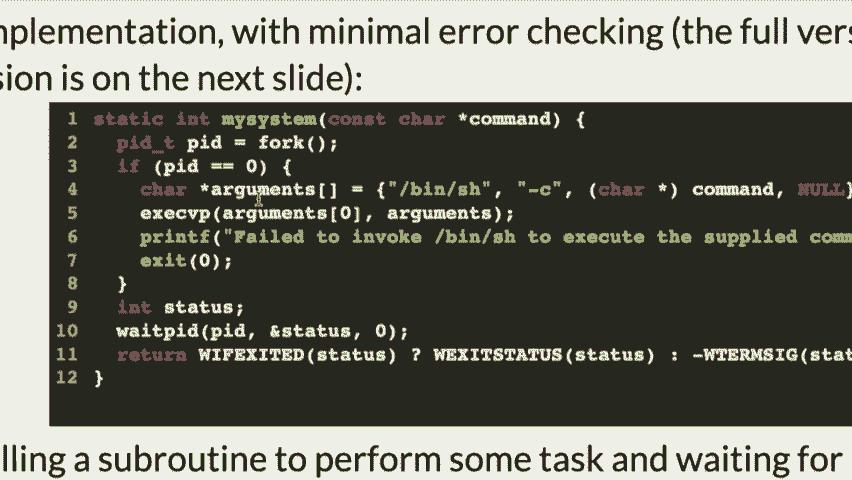


我们将通过æ„建一个简å•çš„ `shell` 程åºæ¥ä¸²è”这些概念，它能è¿è¡Œå‘½ä»¤ã€å¤„ç†åå°è¿›ç¨‹ï¼Œå¹¶ç®¡ç†è¿›ç¨‹é—´çš„输入输出。

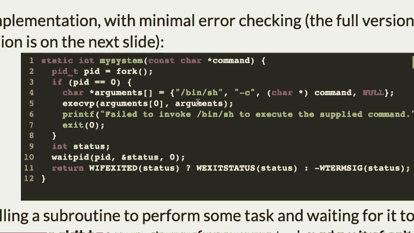


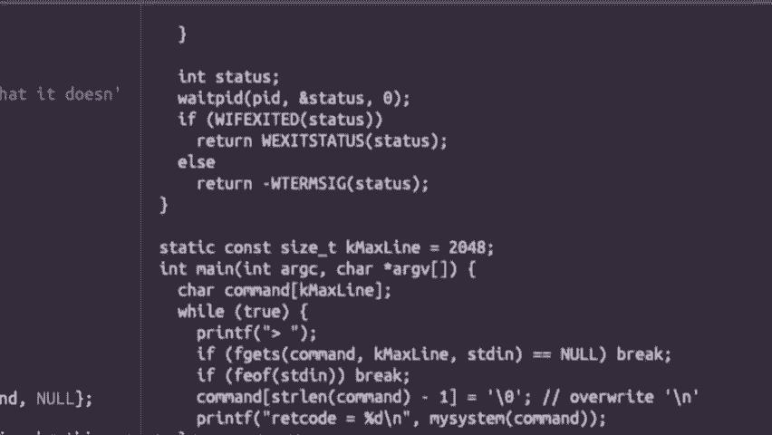

---


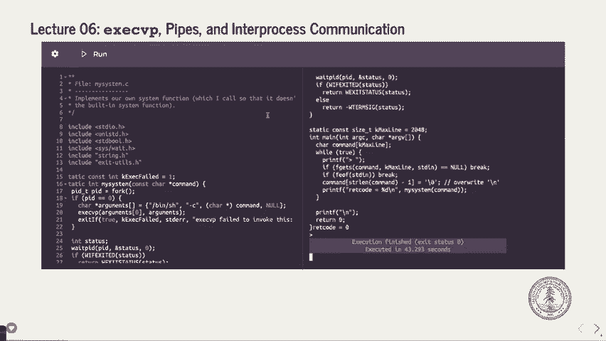

## 1. 使用 execvp è¿è¡Œæ–°ç¨‹åº 🔄


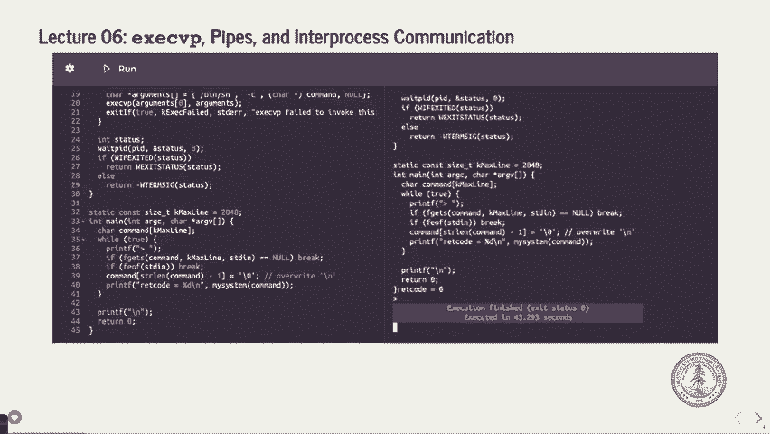


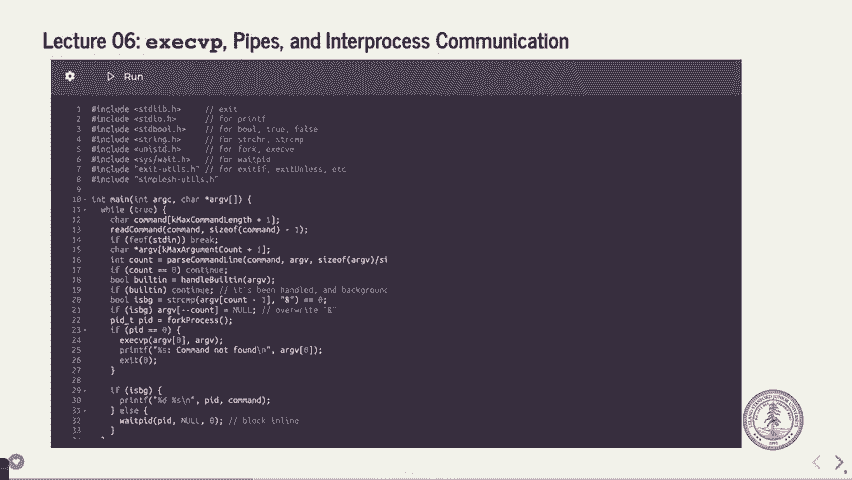

`execvp` 是 `exec` 函数家æ—的一员，它的作用是**用å¦ä¸€ä¸ªç¨‹åºæ›¿æ¢å½“å‰è¿›ç¨‹çš„内存映åƒ**。这æ„味ç€è°ƒç”¨ `execvp` å，åŸè¿›ç¨‹çš„代ç å°±ä¸å†è¿è¡Œï¼Œè½¬è€Œæ‰§è¡Œæ–°çš„程åºã€‚


**核心公å¼**：
```c
int execvp(const char *file, char *const argv[]);
```
*   `file`: è¦æ‰§è¡Œçš„程åºå。
*   `argv`: 传递给新程åºçš„å‚æ•°åˆ—è¡¨ï¼ˆç±»ä¼¼äº `main` 函数的 `argv`），必须以 `NULL` 指针结æŸã€‚


通常，我们ä¸ä¼šç›´æ¥åœ¨çˆ¶è¿›ç¨‹ä¸­è°ƒç”¨ `execvp`，因为这会终止父进程。更常è§çš„模å¼æ˜¯ï¼š
1.  父进程调用 `fork()` 创建å­è¿›ç¨‹ã€‚
2.  在å­è¿›ç¨‹ä¸­è°ƒç”¨ `execvp()` æ¥è¿è¡Œæ–°ç¨‹åºã€‚
3.  父进程继续执行åŸæœ‰é€»è¾‘。


以下是一个简å•ç¤ºä¾‹ `mysystem` 函数，它模拟了系统调用 `system()` 的部分功能：


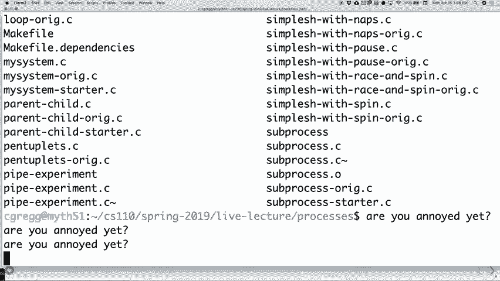


```c
pid_t pid = fork();
if (pid == 0) {
    // å­è¿›ç¨‹ï¼šè¿è¡Œ /bin/sh æ¥è§£é‡Šæ‰§è¡Œå‘½ä»¤
    char *args[] = {"/bin/sh", "-c", command, NULL};
    execvp(args[0], args);
    // å¦‚æœ execvp æˆåŠŸï¼Œä¸ä¼šæ‰§è¡Œåˆ°è¿™é‡Œ
    exit(1);
} else {
    // 父进程：等待å­è¿›ç¨‹ç»“æŸ
    waitpid(pid, &status, 0);
}
```

在这个模å¼ä¸­ï¼Œå­è¿›ç¨‹è¢« `/bin/sh`（å³shell程åºï¼‰â€œå噬â€ï¼Œå¹¶ç”±å®ƒæ¥æ‰§è¡Œç”¨æˆ·è¾“入的命令（如 `ls`）。


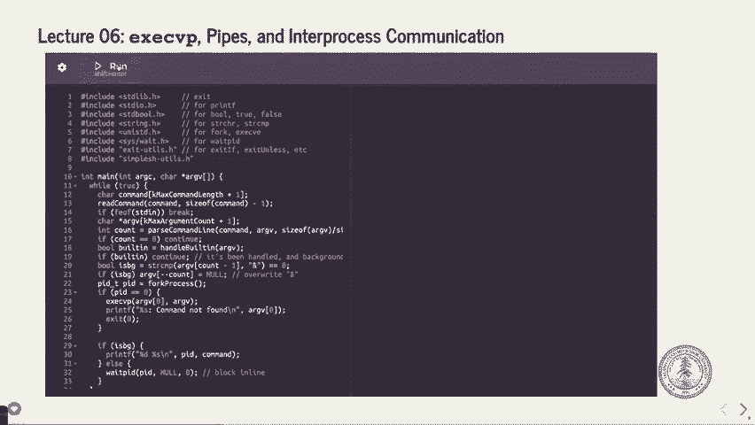

---


## 2. å®ç°ä¸€ä¸ªç®€å•çš„åå° Shell ğŸš


åŸºäº `fork` å’Œ `execvp`，我们å¯ä»¥æ„建一个能处ç†å‰å°å’Œåå°å‘½ä»¤çš„简易shell。


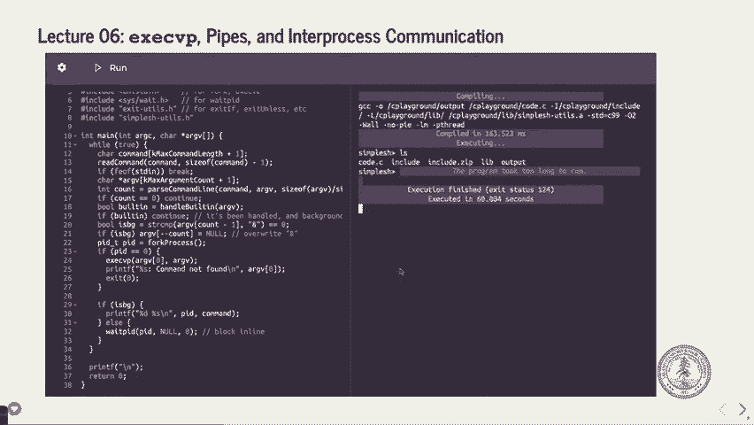

**核心逻辑**：
*   读å–用户输入的命令。
*   如æœå‘½ä»¤ä»¥ `&` 结尾，则标记为**åå°è¿è¡Œ**。
*   `fork` 出å­è¿›ç¨‹ï¼Œåœ¨å­è¿›ç¨‹ä¸­ç”¨ `execvp` 执行命令。
*   在父进程中：
    *   如æœæ˜¯**å‰å°å‘½ä»¤**，则调用 `waitpid` 等待å­è¿›ç¨‹ç»“æŸï¼Œå†æ˜¾ç¤ºä¸‹ä¸€ä¸ªæ示符。
    *   如æœæ˜¯**åå°å‘½ä»¤**，则**ä¸ç­‰å¾…**，直æ¥æ˜¾ç¤ºä¸‹ä¸€ä¸ªæ示符，让å­è¿›ç¨‹åœ¨åå°ç‹¬ç«‹è¿è¡Œã€‚


以下是关键代ç ç‰‡æ®µï¼š

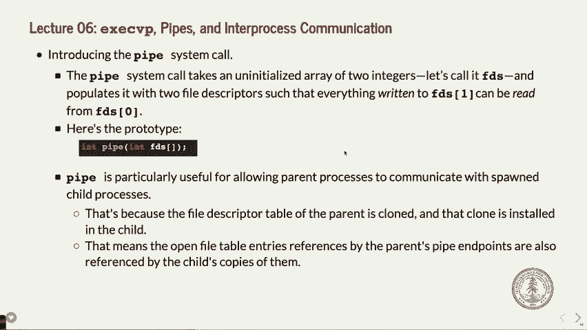

```c
// 解æ命令，判断是å¦ä»¥ '&' 结尾
int run_in_background = is_background_command(args);

pid_t pid = fork();
if (pid == 0) {
    // å­è¿›ç¨‹æ‰§è¡Œå‘½ä»¤
    execvp(args[0], args);
    exit(1); // execvp 失败时æ‰æ‰§è¡Œ
} else if (pid > 0) {
    // 父进程
    if (!run_in_background) {
        // å‰å°è¿è¡Œï¼šç­‰å¾…å­è¿›ç¨‹
        waitpid(pid, &status, 0);
    } else {
        // åå°è¿è¡Œï¼šæ‰“å°è¿›ç¨‹IDåç«‹å³è¿”å›
        printf("[%d] %s\n", pid, command);
    }
}
```
这样，当用户输入 `sleep 10 &` 时，shell会立刻返å›æ示符，而 `sleep` 命令则在åå°ç»§ç»­æ‰§è¡Œã€‚

---

## 3. 使用 pipe å»ºç«‹è¿›ç¨‹é—´é€šä¿¡ç®¡é“ ğŸš°


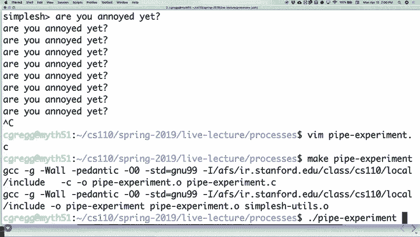

`pipe` 系统调用创建了一个**å•å‘通信通é“**，用äºä¸¤ä¸ªè¿›ç¨‹ï¼ˆé€šå¸¸æ˜¯çˆ¶å­è¿›ç¨‹ï¼‰é—´ä¼ é€’æ•°æ®ã€‚它返å›ä¸¤ä¸ªæ–‡ä»¶æ述符（file descriptor）：一个用äºè¯»å–，一个用äºå†™å…¥ã€‚

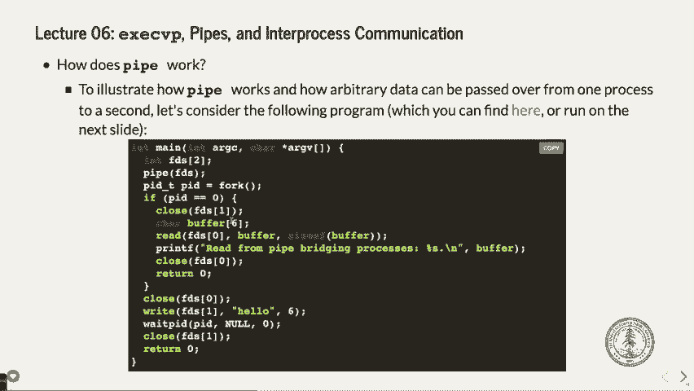


**核心公å¼**：
```c
int pipe(int fds[2]);
```
调用æˆåŠŸå：
*   `fds[0]` æˆä¸ºç®¡é“çš„**读å–端**。
*   `fds[1]` æˆä¸ºç®¡é“çš„**写入端**。
*   写入 `fds[1]` çš„æ•°æ®å¯ä»¥ä» `fds[0]` 读å–。


**é‡è¦ç‰¹æ€§**：调用 `fork` å，å­è¿›ç¨‹ä¼šç»§æ‰¿çˆ¶è¿›ç¨‹æ‰“开的文件æ述符。因此，父å­è¿›ç¨‹å¯ä»¥é€šè¿‡åŒä¸€ä¸ªç®¡é“进行通信。通常的用法是：
*   父进程关闭读å–端 (`fds[0]`)，åªä¿ç•™å†™å…¥ç«¯ï¼Œå‘管é“写数æ®ã€‚
*   å­è¿›ç¨‹å…³é—­å†™å…¥ç«¯ (`fds[1]`)，åªä¿ç•™è¯»å–端，ä»ç®¡é“读数æ®ã€‚

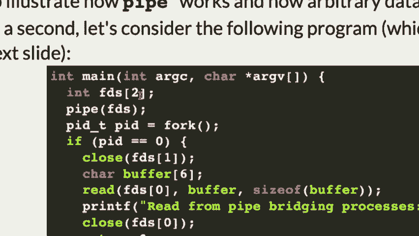

以下是一个简å•çš„管é“示例，父进程å‘å­è¿›ç¨‹å‘é€å­—符串：

```c
int fds[2];
pipe(fds); // 创建管é“

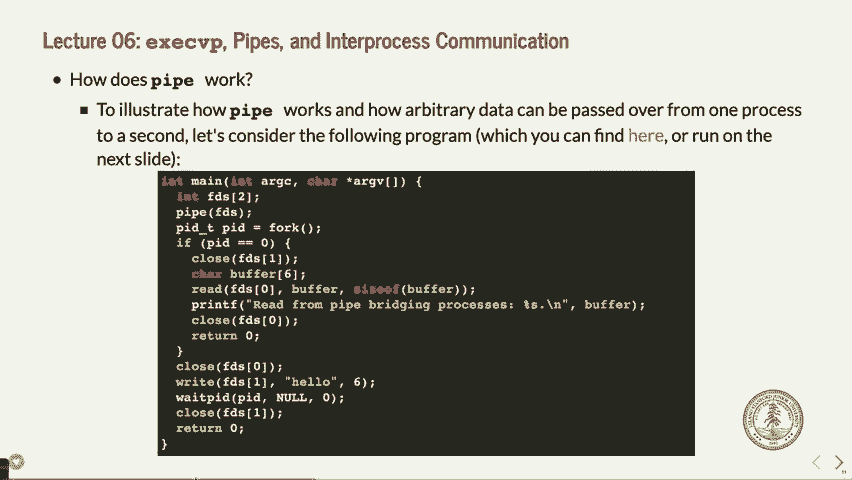

pid_t pid = fork();
if (pid == 0) {
    // å­è¿›ç¨‹ï¼šå…³é—­å†™å…¥ç«¯ï¼Œå‡†å¤‡è¯»å–
    close(fds[1]);
    char buffer[128];
    read(fds[0], buffer, sizeof(buffer));
    printf("Child read: %s\n", buffer);
    close(fds[0]);
    exit(0);
} else {
    // 父进程：关闭读å–端，准备写入
    close(fds[0]);
    write(fds[1], "Hello from parent", 18);
    close(fds[1]); // 关闭写入端表示数æ®å‘é€å®Œæ¯•
    waitpid(pid, NULL, 0); // 等待å­è¿›ç¨‹
}
```
**注æ„**：`read` 调用会**阻å¡**，直到有数æ®å¯è¯»æˆ–管é“写入端全部关闭。父进程关闭写入端 (`fds[1]`) 是通知å­è¿›ç¨‹â€œæ•°æ®å·²å‘é€å®Œâ€çš„关键。


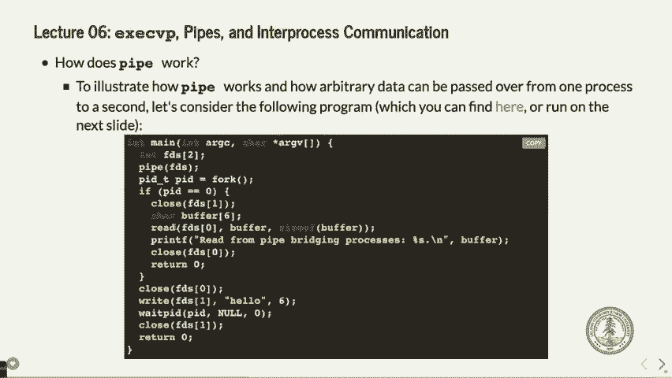

---

## 4. 使用 dup2 é‡å®šå‘标准输入输出 🔀


`dup2` 系统调用用äº**å¤åˆ¶ä¸€ä¸ªæ–‡ä»¶æ述符**。最常è§çš„用途是é‡å®šå‘进程的标准输入（`STDIN_FILENO`, 0）ã€æ ‡å‡†è¾“出（`STDOUT_FILENO`, 1）或标准错误（`STDERR_FILENO`, 2）。


**核心公å¼**：
```c
int dup2(int oldfd, int newfd);
```
它使 `newfd` æˆä¸º `oldfd` çš„å‰¯æœ¬ã€‚å¦‚æœ `newfd` å·²ç»æ‰“开，会先将其关闭。


在管é“通信中，我们常用 `dup2` å°†å­è¿›ç¨‹çš„标准输入é‡å®šå‘到管é“的读å–端。这样，å­è¿›ç¨‹åœ¨æ‰§è¡Œæ—¶ï¼ˆä¾‹å¦‚è¿è¡Œ `sort` 命令），就会ä»ç®¡é“读å–æ•°æ®ï¼Œè€Œä¸æ˜¯ä»é”®ç›˜è¾“入。

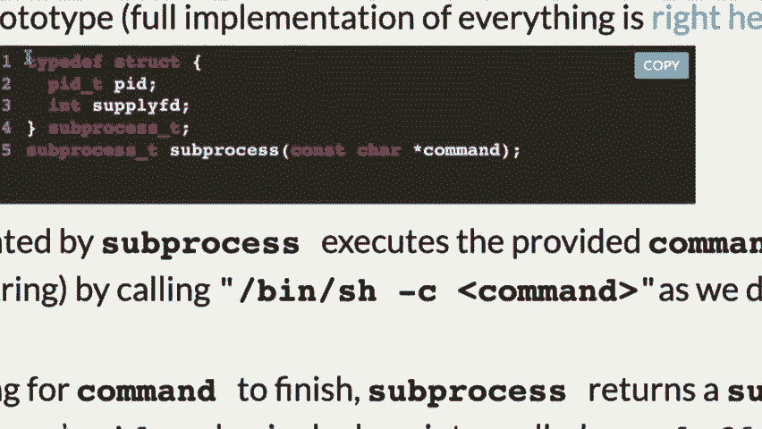

以下是将管é“读å–端é‡å®šå‘为标准输入的典å‹ç”¨æ³•ï¼š


```c
// å‡è®¾åœ¨å­è¿›ç¨‹ä¸­ï¼Œfds[0]是管é“的读å–端
close(fds[1]); // å­è¿›ç¨‹ä¸éœ€è¦å†™å…¥ç«¯
dup2(fds[0], STDIN_FILENO); // 将标准输入é‡å®šå‘到管é“读å–端
close(fds[0]); // é‡å®šå‘å，åŸå§‹çš„fds[0]å¯ä»¥å…³é—­äº†

// ç°åœ¨æ‰§è¡Œç¨‹åºï¼Œä¾‹å¦‚ sort，它会ä»ç®¡é“读å–输入
execlp("sort", "sort", NULL);
```

---


## 5. 综åˆç¤ºä¾‹ï¼šåˆ›å»ºå­è¿›ç¨‹å¹¶ä¼ é€’æ•°æ® ğŸ§©

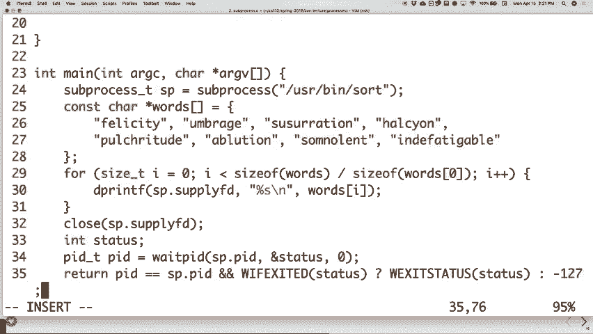


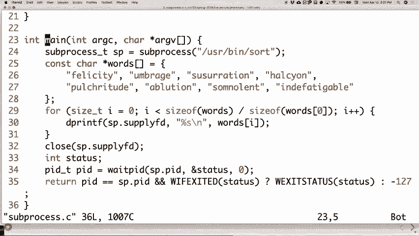

ç»“åˆ `pipe`ã€`fork`ã€`dup2` å’Œ `execvp`，我们å¯ä»¥ç¼–写一个 `subprocess` 函数。该函数å¯åŠ¨ä¸€ä¸ªå­è¿›ç¨‹ï¼ˆå¦‚ `sort`），并返å›ä¸€ä¸ªæ–‡ä»¶æ述符给父进程。父进程å‘这个文件æ述符写入数æ®ï¼Œæ•°æ®å°±ä¼šæˆä¸ºå­è¿›ç¨‹çš„输入。

以下是 `subprocess` 函数的简化框æ¶å’Œ `main` 函数中的用法：

```c
// subprocess_t 结æ„体，用äºè¿”å›å­è¿›ç¨‹ä¿¡æ¯
typedef struct {
    pid_t pid;   // å­è¿›ç¨‹ID
    int supply_fd; // 父进程写入此fd，数æ®ä¼šä¾›ç»™å­è¿›ç¨‹
} subprocess_t;

subprocess_t subprocess(char *command) {
    int fds[2];
    pipe(fds);
    pid_t pid = fork();

    if (pid == 0) {
        // å­è¿›ç¨‹
        close(fds[1]); // 关闭写入端
        dup2(fds[0], STDIN_FILENO); // é‡å®šå‘标准输入到管é“
        close(fds[0]);
        // 执行命令
        execlp("/bin/sh", "sh", "-c", command, NULL);
        exit(1);
    } else {
        // 父进程
        close(fds[0]); // 关闭读å–端
        subprocess_t sp = {pid, fds[1]};
        return sp;
    }
}

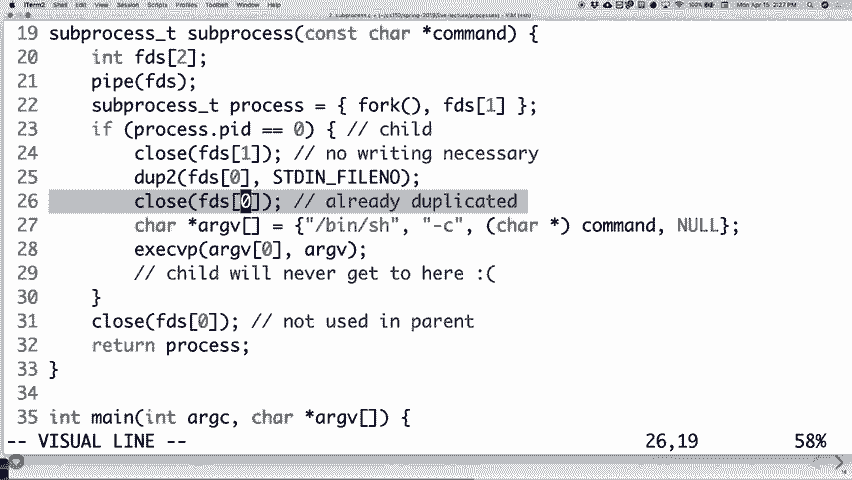


// 在 main 函数中使用
int main() {
    // å¯åŠ¨ sort 命令作为å­è¿›ç¨‹
    subprocess_t sp = subprocess("/usr/bin/sort");

    // 父进程å‘å­è¿›ç¨‹ä¾›ç»™æ•°æ®
    char *words[] = {"banana", "apple", "cherry"};
    for (int i = 0; i < 3; i++) {
        dprintf(sp.supply_fd, "%s\n", words[i]);
    }
    close(sp.supply_fd); // 关闭供给端，告知å­è¿›ç¨‹è¾“入结æŸ

    waitpid(sp.pid, &status, 0); // 等待å­è¿›ç¨‹ç»“æŸ
    return 0;
}
```
è¿è¡Œæ­¤ç¨‹åºï¼Œ`sort` å­è¿›ç¨‹ä¼šæ”¶åˆ°å•è¯åˆ—表，æ’åºå输出到终端。父进程关闭 `supply_fd` 至关é‡è¦ï¼Œå®ƒç›¸å½“äºåœ¨ç»ˆç«¯æŒ‰ä¸‹ `Ctrl+D`，告诉 `sort` 输入已结æŸï¼Œå¯ä»¥å¼€å§‹æ’åºäº†ã€‚

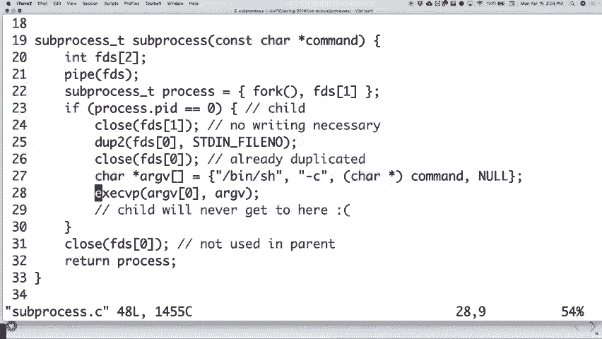


---


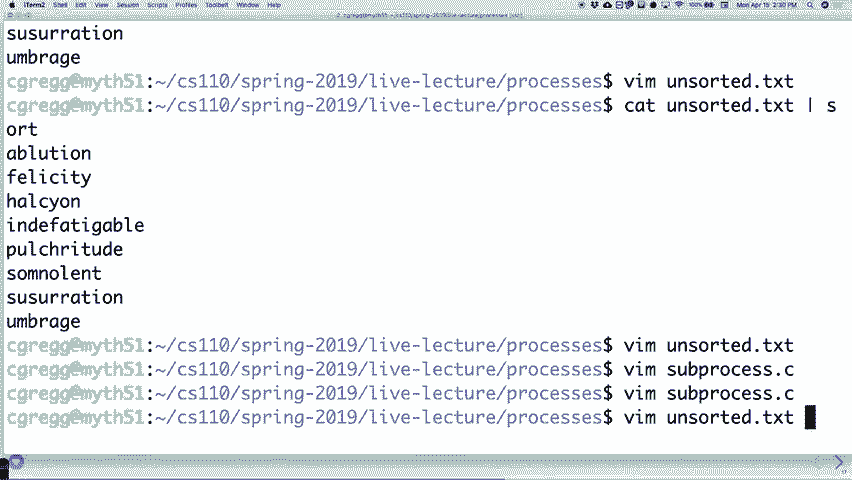

## 6. 使用 signals 处ç†è¿›ç¨‹äº‹ä»¶ ğŸ“

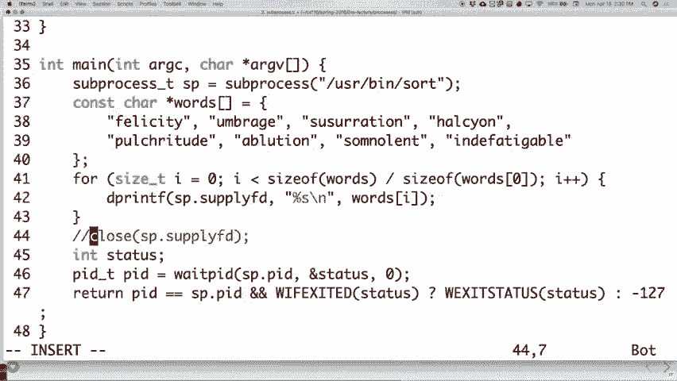

ä¿¡å·ï¼ˆSignal）是内核å‘进程å‘é€çš„**异步事件通知**。例如，按下 `Ctrl+C`（å‘é€ `SIGINT`）å¯ä»¥ç»ˆæ­¢å‰å°è¿›ç¨‹ï¼Œå­è¿›ç¨‹ç»“æŸæ—¶ä¼šå‘父进程å‘é€ `SIGCHLD` ä¿¡å·ã€‚

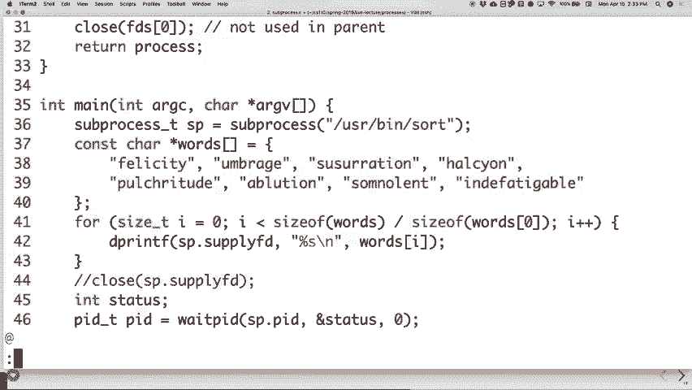


我们å¯ä»¥ä¸ºç‰¹å®šä¿¡å·æ³¨å†Œä¸€ä¸ª**ä¿¡å·å¤„ç†å‡½æ•°**（signal handler），当信å·å‘生时，该函数会被调用。

**核心概念**：
*   `SIGCHLD`：å­è¿›ç¨‹çŠ¶æ€æ”¹å˜ï¼ˆç»ˆæ­¢ã€åœæ­¢ã€ç»§ç»­ï¼‰æ—¶å‘é€ç»™çˆ¶è¿›ç¨‹ã€‚
*   `signal(int signum, void (*handler)(int))`：设置信å·å¤„ç†å‡½æ•°ã€‚

一个常è§çš„用途是处ç†åƒµå°¸è¿›ç¨‹ã€‚如æœçˆ¶è¿›ç¨‹ä¸è°ƒç”¨ `waitpid` å›æ”¶å·²ç»ˆæ­¢çš„å­è¿›ç¨‹ï¼Œå­è¿›ç¨‹ä¼šå˜æˆâ€œåƒµå°¸â€ã€‚通过æ•è· `SIGCHLD` ä¿¡å·å¹¶åœ¨å¤„ç†å‡½æ•°ä¸­è°ƒç”¨ `waitpid`，å¯ä»¥åŠæ—¶æ¸…ç†å­è¿›ç¨‹ã€‚

以下是一个“迪士尼ä¹å›­â€çš„例å­ï¼Œæ¼”示了父进程在å­è¿›ç¨‹ï¼ˆå­©å­ä»¬ï¼‰ç©è€æ—¶å°ç¡ï¼Œå¹¶åœ¨å­©å­å›æ¥æ—¶è¢«å”¤é†’：

```c
#include <signal.h>
#include <unistd.h>
#include <sys/wait.h>

int children_done = 0;
void reap_child(int sig) {
    waitpid(-1, NULL, 0); // å›æ”¶ä»»æ„一个已终止的å­è¿›ç¨‹
    children_done++;
}

int main() {
    signal(SIGCHLD, reap_child); // 设置 SIGCHLD 的处ç†å‡½æ•°

    for (int i = 0; i < 5; i++) {
        if (fork() == 0) {
            // å­è¿›ç¨‹ï¼šæ¨¡æ‹Ÿç©è€æ—¶é—´
            sleep(3 * (i + 1));
            exit(0);
        }
    }

    // 父进程：等待所有孩å­å›æ¥
    while (children_done < 5) {
        printf("At least one child is playing, dad naps.\n");
        sleep(5); // sleep 会被到æ¥çš„ SIGCHLD ä¿¡å·ä¸­æ–­
        printf("Dad wakes up!\n");
    }
    printf("All children back home. Let's leave!\n");
    return 0;
}
```
在这个例å­ä¸­ï¼Œ`sleep` 会被 `SIGCHLD` ä¿¡å·ä¸­æ–­ï¼Œçˆ¶è¿›ç¨‹æ¯æ¬¡è¢«å”¤é†’就检查是å¦æœ‰å­©å­å›æ¥ã€‚使用信å·å¤„ç†ä½¿å¾—父进程无需主动轮询å­è¿›ç¨‹çŠ¶æ€ã€‚


**注æ„**：一些信å·ï¼ˆå¦‚ `SIGKILL`, `SIGSTOP`）ä¸èƒ½è¢«æ•è·æˆ–忽略。在信å·å¤„ç†å‡½æ•°ä¸­åº”å°½é‡åªåšç®€å•æ“作，é¿å…使用ä¸å¯é‡å…¥å‡½æ•°ï¼ˆå¦‚ `printf`），本例仅为演示。

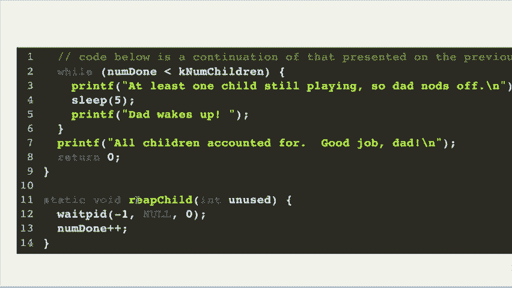

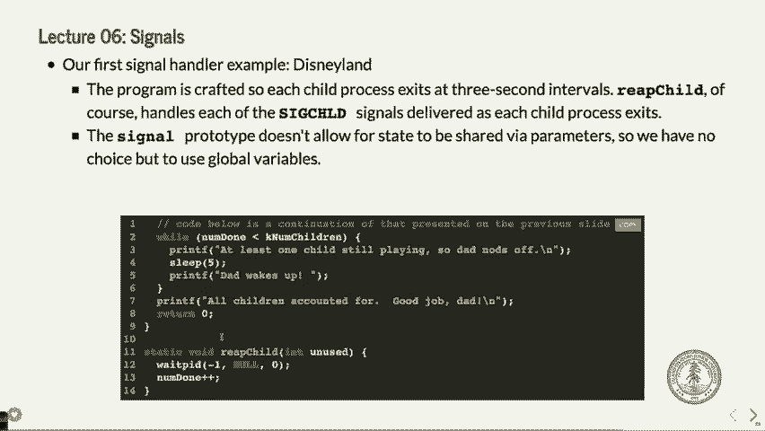

---

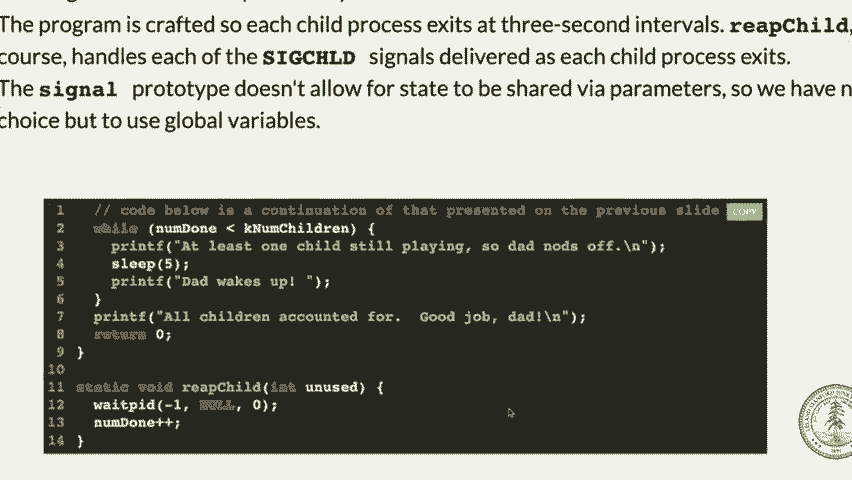


## 总结 ğŸ¯

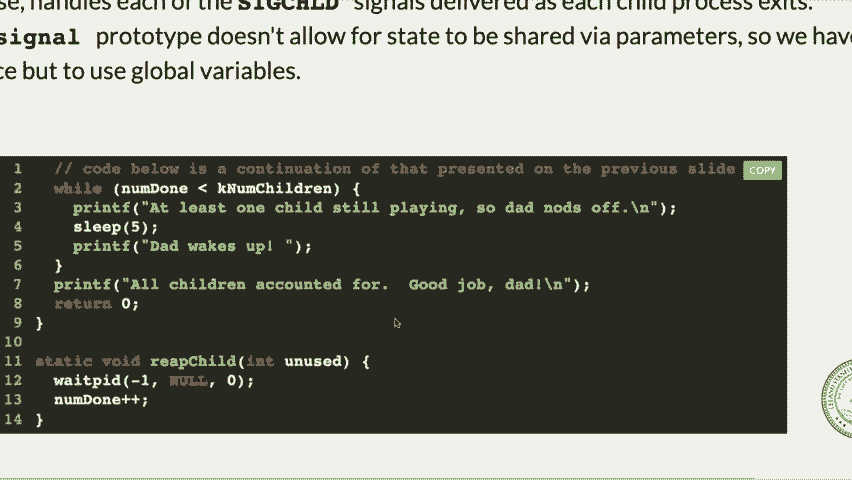


本节课中我们一起学习了多进程编程的核心工具链：

1.  **`execvp`**：用äºåœ¨å­è¿›ç¨‹ä¸­åŠ è½½å¹¶æ‰§è¡Œå…¨æ–°çš„程åºã€‚
2.  **Shell å®ç°**ï¼šç»“åˆ `fork` å’Œ `execvp`，å¯ä»¥æ„建支æŒå‰åå°ä»»åŠ¡ç®¡ç†çš„简å•shell。
3.  **`pipe`**：创建å•å‘通信管é“，是进程间通信（IPC）的基本方å¼ä¹‹ä¸€ã€‚
4.  **`dup2`**：é‡å®šå‘文件æ述符，常用äºå°†ç®¡é“的一端è¿æ¥åˆ°è¿›ç¨‹çš„标准输入或输出。
5.  **综åˆåº”用**：通过 `subprocess` 模å¼ï¼Œå¯ä»¥çµæ´»åœ°å¯åŠ¨å­è¿›ç¨‹å¹¶æ§åˆ¶å…¶è¾“å…¥æºã€‚
6.  **`signals`**：处ç†å¼‚步事件，如使用 `SIGCHLD` ä¿¡å·é«˜æ•ˆåœ°å›æ”¶å­è¿›ç¨‹èµ„æºã€‚

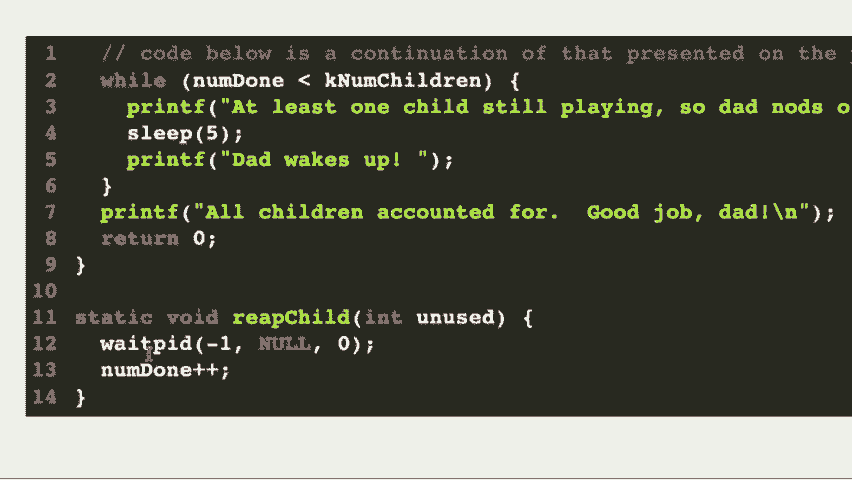

æŒæ¡è¿™äº›æ¦‚å¿µå’Œç³»ç»Ÿè°ƒç”¨ï¼Œä½ å°±æœ‰èƒ½åŠ›ç¼–å†™å‡ºåƒ `shell` 一样å¯ä»¥åˆ›å»ºã€ç®¡ç†ã€å¹¶ä¸å¤šä¸ªè¿›ç¨‹äº¤äº’çš„å¤æ‚程åºã€‚在æ¥ä¸‹æ¥çš„作业中，你将有机会å®è·µè¿™äº›çŸ¥è¯†ï¼Œæ„建更强大的工具。