# P7：第七讲 信号 - ___main___ - BV1ED4y1R7RJ

欢迎来到星期三。希望作业进行得顺利。今天下课后，我会回到我的办公室。我猜你们有机会来上课，顺便听到这些内容。今天我会回到办公室，然后待在那里大约45分钟到1小时，供有作业问题的同学提问。我也有。

明天早上10点到中午12点我会有办公时间。如果你想来我的办公室，请随时来Gates 201。晚上和明天也会有助教的常规办公时间。作业明天截止，希望大家进展顺利。记住，这是一个真实的文件系统。

大家其实在看着这些内容。所以所有细微的部分。嗯，这就是真实生活。在真实的程序中确实会发生这种情况。所以你们正在体验这种感觉。让我看一下，我在这里放了一个笑话。酒吧老板问第一个人想和谁比赛，她走进酒吧。所以我知道，这个笑话太好笑了，不是吗？

所以笑话是，如果笑话不够好笑，你总是得解释它。笑话的意思是这是一个竞争条件。我们还没有深入讨论竞争条件，但我们将会看到很多很多的竞争条件。我们已经看到了一些零星的竞争条件。竞争条件就是当。

两件事同时发生时，你不知道也无法预测哪一件会先到达它的目的地。如果你在等待某个事件发生，或者说如果你忘记等待某个事件发生时，这就会成为一个问题。

这可能与你预期的顺序不同。所以你必须考虑这一点。这使得并发编程变得棘手，因为你必须考虑这一点。今天我们将通过一些示例来展示竞争条件，并且会展示一种处理竞争条件的方法。

好的，这是我在周一介绍的内容。我们现在在讨论信号。好的，信号是一种基本上用于发送消息的方式，实际上并不是传递消息，基本上是一种告诉另一个进程某些事情已经发生的方式。你甚至无法传递任何具体的消息。你能做的最好的就是实际上。

你传递一个信号编号，那个信号就是实际发送的信号，但你不会得到其他任何信息。如果你想向另一个信号传递其他信息，你必须以这样的方式进行，确保两个进程都能访问这些信息，这通常意味着共享内存、文件或类似的东西。

这样做也会变得有点复杂。所以这不是一种简单的情况，你只是向另一个进程发送信号，然后就可以告诉它很多东西。这必须是一个逻辑上的过程，比如当这个信号发生时，你将会执行某个操作，因为这个信号发生了。这就是。

这就是我们要做的。我们会在整个过程中看到一些例子。好的，信号处理程序是你写的一个函数，它会进入一个进程，并且当信号到达时，进程的信号处理程序就会被调用。好的，我们要关注的是，当一个子进程出现异常时。

一些状态变化，当它结束、停止或者继续时，我们还没有讨论如何继续一个已经停止的子进程，我们将会讲到这一点。那是一个你写的函数，它会在那个时刻被调用。好的，没问题，正如我们所说，有很多不同类型的信号。

有些信号是因为某些错误发生，例如除以零时会发送一个信号，或者如果你按下了控制+C，你的程序会收到一个信号，它实际上是无法被阻止的，通常会导致程序被终止。当然，也有一些有限的方式可以规避这种情况，但它有一定的时间限制。

通常会发生的是，还有其他类型的信号可以发送，这些是用户信号，有几个不同的信号是专门为你使用的，可以根据你的需要发送。这是另一种类型的信号。好的，没问题，正如我说的，生病的子进程是我们最关心的。

至少对于这门课来说，它会在某个特定父进程的子进程状态发生变化时发生，所以我们能够捕捉到这个状态变化。通常我们会在子进程的生病处理程序中看到等待 PID 的操作。好的，我们通常会通过这种方式来获取子进程发生了什么，它刚刚做了什么，是否正常退出，或者发生了什么。

正常情况下，我们会看到等待 PID 的操作出现在生病的子进程处理程序中。好的，我们讨论的第一个程序，我会重新输入一下，这样你能更好地理解，或者说，感受一下它的流程。

你实际上是以一种稍微慢一点的方式来看待它，这样你就能处理发生了什么。我知道很多时候我快速地浏览代码，结果发现自己从没见过那段代码，根本没法处理它。所以，我会尽量放慢一点节奏，更多地去处理这个问题。

好的，让我们开始吧，我们将编写一个主函数，这就是我在星期一提到的例子，假设父亲带着五个孩子去迪士尼乐园，然后他让他们各自去玩，每个人都玩了很久。

然后它们会回来，在此期间，父进程会休眠。好的，我实际上在星期一说了一个我自己也很困惑的东西，后来我弄明白了原因，那是因为我没有键入程序代码。我到时候会给你展示我到底在说什么，但在这个案例中，我们会边打字边解释，给你一些时间来处理这些信息。

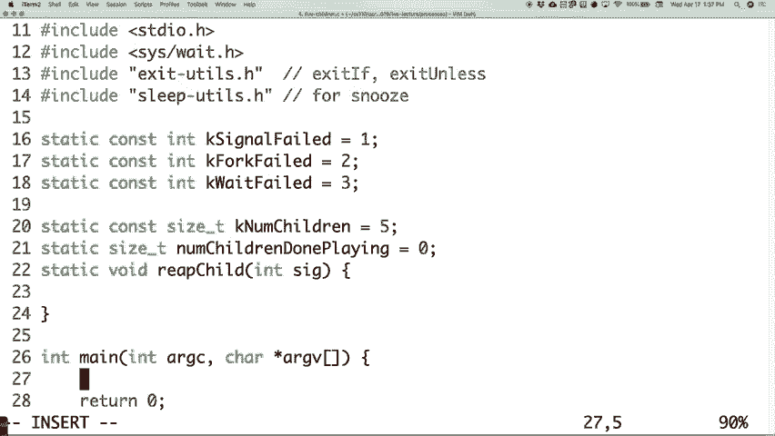

我们要做的是从这里开始，让我把屏幕稍微调高一点。

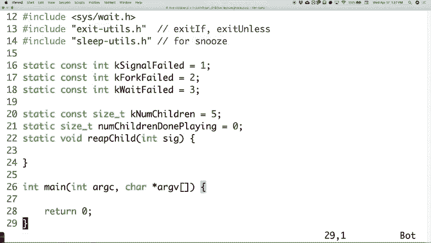

好了，我们要做的就是从这里开始，我们就直接说`print F`，让我五个孩子玩，而我自己小憩一下。看，如果我是一个带孩子去迪士尼乐园的父亲，我也会去玩所有的游乐设施，所以我不知道他是怎么带着孩子去的，但无论如何，这就是这个父亲的做法。

然后我们通过`signal SIGCHLD`来设置信号处理器，省略了那些字母和东西的原因是，因为以前你必须遵循某种文件长度限制或者名称长度限制，所以很多这些名字都非常简短。

之所以省略字母，是因为这在历史上是这样做的，所以我们将告诉它需要设置哪个函数作为信号处理器，在这种情况下。它将是`reap child`，然后我们将启动所有这些子进程。所以我们就直接用`size TI = 0 I or`。

实际上我们从1开始，这样我们就能得到1、2、3、4、5，`I`小于等于5，`I++`，然后我们就会进行`fork`，所以我们不会实际捕获子进程的PID。但在这种情况下，我们只需要说如果`fork == 0`，这意味着我们是子进程。

在这个块中，我们将休眠三倍的时间，我想我之前说过“孩子”对吧？做成这样，是的，休眠时间是三倍的孩子索引，从1开始。在这种情况下，休眠将模拟游戏，或者说玩耍。好的，然后在孩子从睡眠中醒来或者结束后。

现在我们就直接说`print F`，然后说子进程，然后因为我们用了`size T`，所以我们得用像`ZU`之类的东西，返回给父进程，而不是数据给父进程。好了，我想在计算机科学中这有意义，好的，接下来我可能需要加个引号，然后。

然后我们将在子进程中返回，所以这就是在子进程中会发生的事，我们会执行五次，砰，然后它们将休眠三秒钟、六秒钟、九秒钟，等等，是的，应该是这样，非常感谢。那么孩子们呢，非常感谢，不过那应该是个大错误，可能本来会有麻烦。

收到了一个警告，我希望没问题，继续，好的。所以不管怎样，这将是五个孩子启动并休眠一段时间的情况。然后我们会有父母在这里，比如父亲，好吧，当孩子们玩得还不够时，我们将会做一些处理。

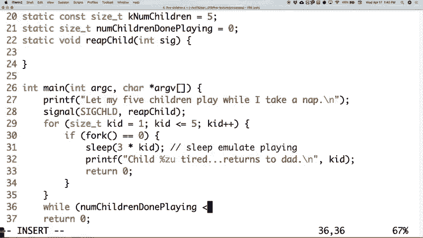

等等，哦不，我知道我会做这种事，我试图做一个特殊的命令，结果当然它不工作了，哦不，等等，匹配 1 个 76。

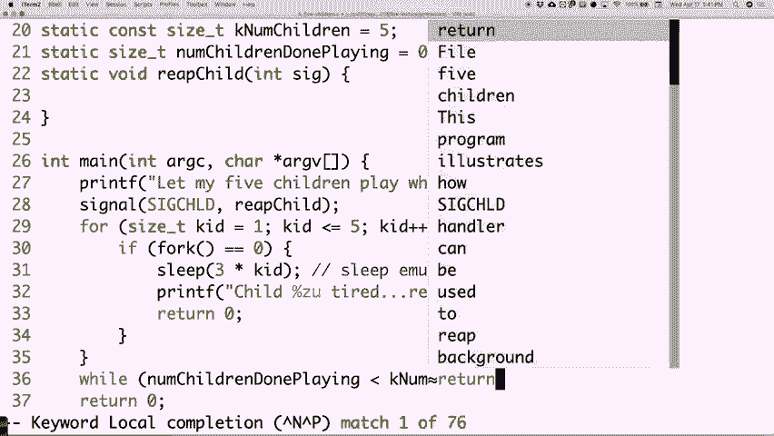

我们知道这怎么回事吗？哦不，我做了什么，还是重新坐一下吧，我想知道这些是否保存了，我们看看，马上就知道。我不认为我保存了，不过春天到了。我们来看看，这是实时讲座处理，看来它确实生成了一个交换文件。我们来看看是否能恢复它，五个孩子看一下，似乎恢复不了。

想玩，接着走。好吧，显示的内容是：文件交换被另一个程序占用，文件正在编辑，我想恢复它，按回车，好吧，所以已经保存了。

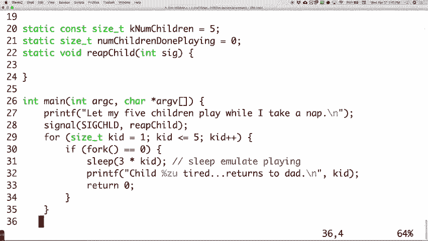

不管怎样，看起来大部分内容都正常。好吧，反正都行，我们再试一次，我不会太花哨了。所以在这个过程中，我们把所有内容都写进去了。对于父母和孩子，然后父母将做的事情是：当孩子的数量还没完成时，那个变量叫什么来着，记得是“num children done”。

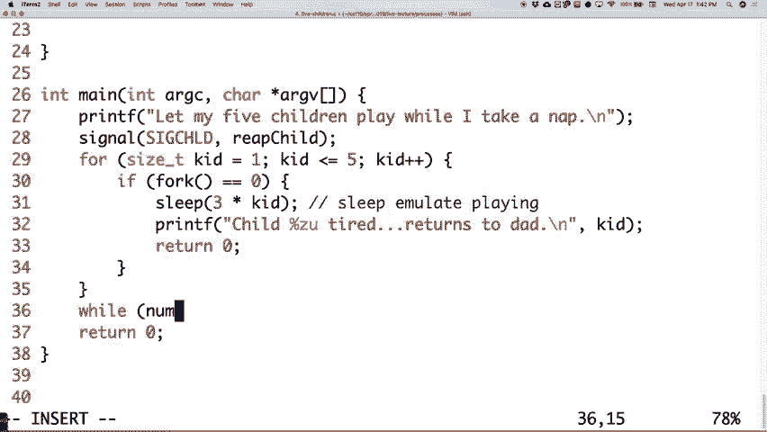

玩耍的孩子，玩得不够，好的，孩子的数量。那么我们接下来做什么呢？我们将打印F，至少有一个孩子还在躺着，这样爸爸就点头打盹了。接着在其他的日子里，我们使用了“when”，实际上在之前的。

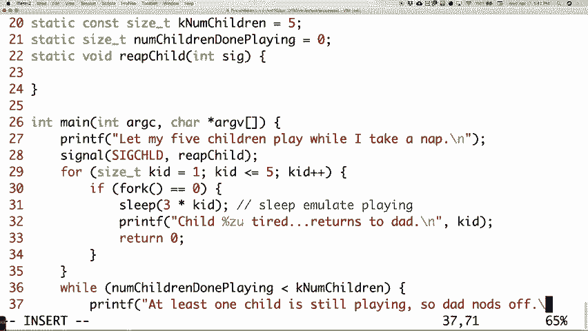

程序中我们使用了sleep，我不知道你是否记得我说过，嘿，看起来爸爸应该醒来但没醒，我以为是因为sleep应该在处理信号的地方停止。实际上，或者说没有处理信号，不过不管怎么样。

如果发生信号，睡眠一般会恢复，我们要做的是。我们要确保爸爸不醒来，所以我们要说“打盹”，这就是一个。

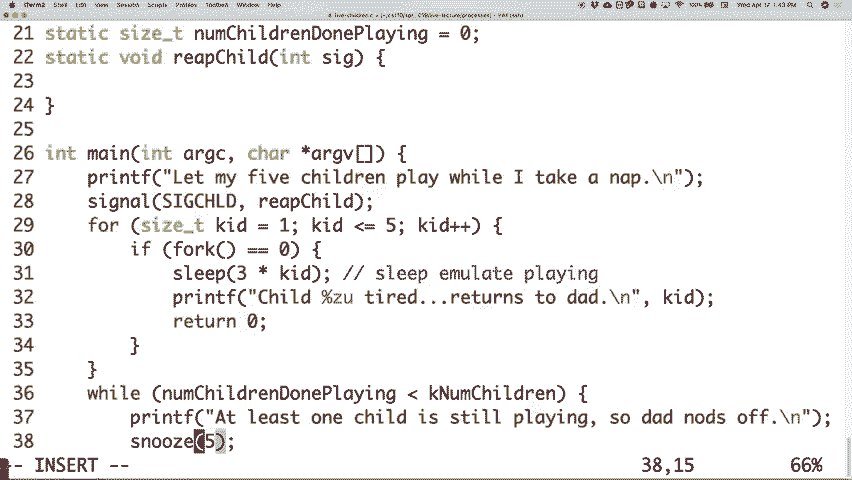

我们写的一个小函数，基本上就是这么做的，并且说，如果接收到信号就别醒来。好吧，这就是我们想要的，打盹五秒，然后打印F，爸爸醒来，然后就是这样了。然后当所有孩子都回到时，我们只需要说打印F，所有孩子。

计算好了，做得好，爸爸，没什么可担心的，然后我们将返回。

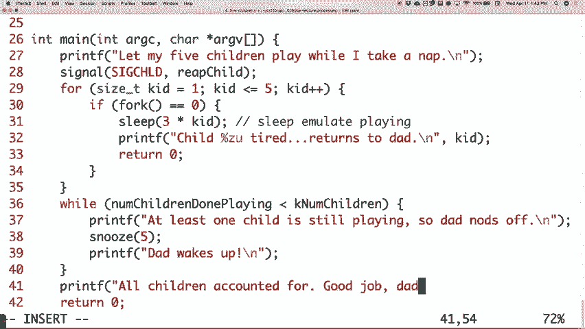

这是我们的函数，我们就运行一下吧。好的，做五个孩子。

当我们运行这个时，它会做所有的分叉，然后爸爸点头打盹，第一孩子三秒后返回，爸爸醒来，第二和第三个孩子。

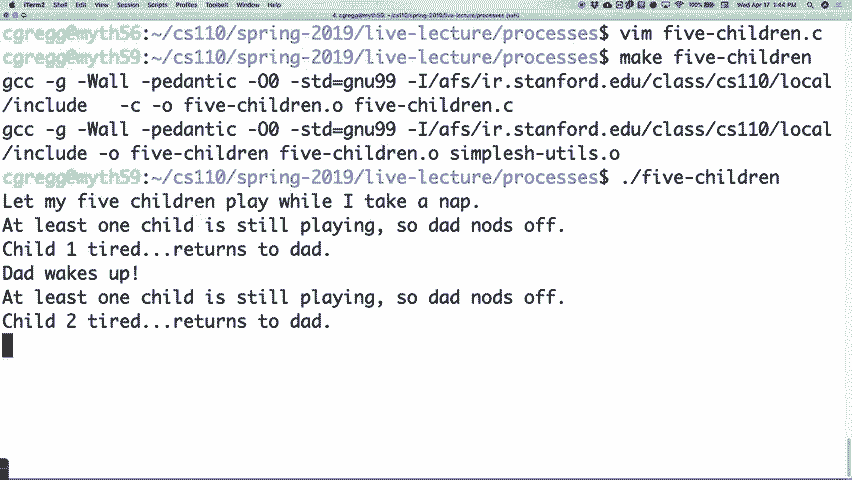

然后爸爸又回去睡觉，第二和第三个孩子醒了，爸爸还在睡。在接下来的五秒钟里，然后爸爸又回去睡觉了，接着第四和第五个孩子也醒了，回去睡了。然后就这样了，那我忘记做什么了吗？

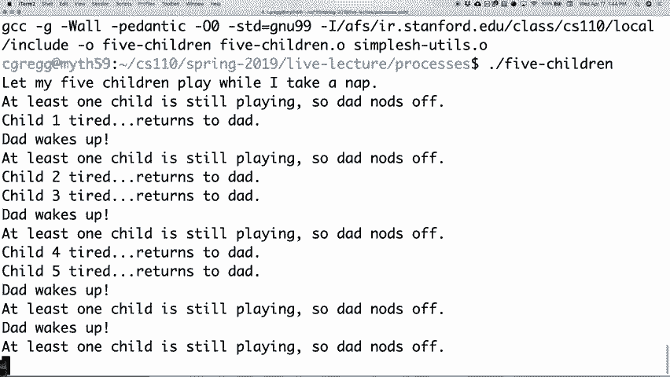

我是不是忘了写那个实际做事情的函数呢？让我们。

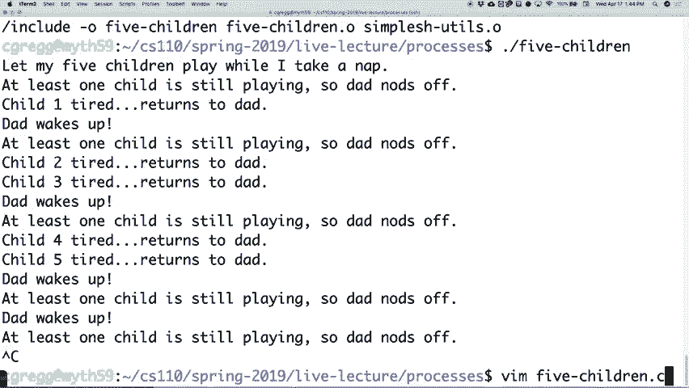

看，这个我想删除，好的，搞定了。那么在这种情况下，让我们看。

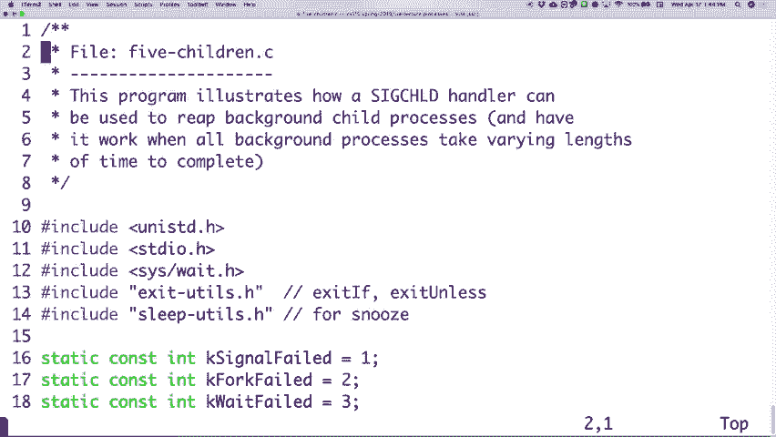

看，实际上等一下，我有个问题，是的，不，它并没有写在那里面。

好的，所以我们实际上需要编写`reap child`，这个函数在这个情况下会非常简单，好吧，它要做的就是清理子进程。所以它会调用`wait PID`，然后`-1`表示等待任何子进程，好的，因为我们不在乎捕获返回值。

到此时的值是什么呢？如果你是为了写一个更稳健的程序，可能会处理这些值，然后零值，我们今天实际上就会讲到如何修改这些。

基本上是说，直到那个子进程返回之前，父进程会一直阻塞，但它最终会结束，因为信号处理程序被调用了，好吧，然后在这个时候我们需要更新`num children done playing`，对吧？然后这应该就能完成了，现在这个信号处理程序是在父进程中。

当子进程结束时会被调用，好的，这就是信号处理程序被调用的方式，问题是什么呢？

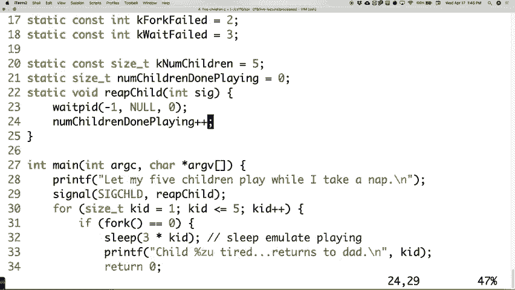

如果你没有写`wait PID`，那是一个好问题，所有的事情会。

发生的事情实际上就好像你泄露了内存一样，也就是说，你不会清理子进程，其他什么都不会发生，情况还是会照常工作。如果你想测试一下，我们可以试试看。还有其他问题吗？让我们看看这个现在是否能正常工作，我刚才把子进程数改成了五个。

好的，我们来了，好的，跟刚才一样，再次等待三秒钟，然后返回给父进程，父进程醒来后，接下来五秒钟内将会有两个子进程结束，最后剩下的两个子进程结束，然后父进程醒来，我们就可以说所有子进程都已结束，好的，所以这就是。

发生的事情是，父进程或者父函数在那个`while`循环里，但是它只是睡了五秒钟，信号处理程序在运行，而当父进程睡醒的时候，嘿，所有我的子进程都已经完成了，我就可以继续了。问题是，如果你没有写`reap child`函数，那父进程会怎么样呢？

就是不断醒来，是的，正如我之前所做的那样，当我没有写`reap child`函数时，问题是，如果你没有写`reap child`函数会发生什么呢？父进程会不断醒来，然后那个全局变量不会被更新，它会一直保持零，结果就是这样。

是的，很好的问题。当你调用信号函数时，你传递的是一个指向`reap child`的函数指针，对吗？正确，通常你不需要给它传递参数，这是一个。

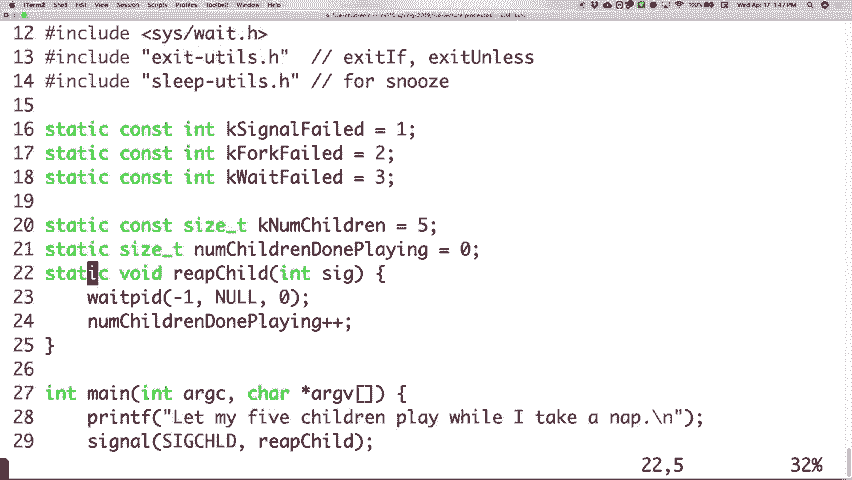

好问题，但你不需要。当你说信号时，它只需要知道是。回收子进程，这只有一个参数，回收子进程必须接收，并且它恰好是一个整数，表示信号号，清理子进程并没有做这个，像你说的好问题，为什么？

清理子进程后发生的事情是它让父进程。因为这是一个由信号处理程序更新的全局变量。好的，现在如果你在想，等一下，我以为子进程和父进程有不同的内存空间，所以如果我在这里更新全局变量，它就不是。

要更新父进程，记住它没有任何这些东西，这个函数。并没有发生在子进程中，而是发生在父进程中，当子进程结束时。实际上它是相同的全局变量，好的，明白了，所以这里发生了什么，如果我们只是在这里改变它，会发生什么呢？

某些事情，说让所有子进程同时睡一段时间。

换句话说，它们都会出去玩，它们都会。

返回相同的时间，让我们找出如果我们这么做会发生什么。

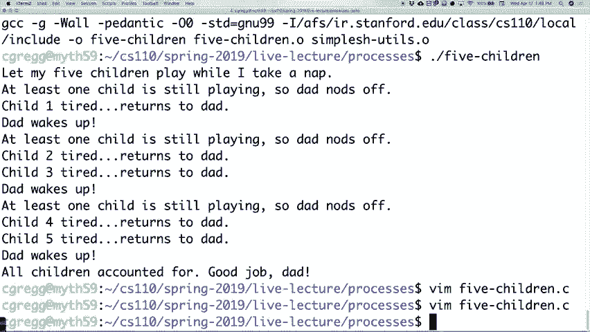

这五个子进程，好的，所以现在会发生同样的事情，它们都会同时回来，可能顺序有所不同，父进程醒来，然后五秒钟后父进程再次醒来，我们得到了所有子进程返回，但不知怎么的，某些子进程没有正确更新，好吧，我们实际上。

看看发生了什么，我们再看一遍这个，像这样，我们来做这个。

在处理程序中处理SIGCHI，让我们做这个打印F，子进程完成玩耍，就像。

那样做看看，应该就能解决了，我会再试一次，哦，这次成功了，好的，那么应该就好了，新的。

这些子进程，来吧，好的，那么我们来看发生了什么。哦，看来有四个子进程似乎一次性回来了，并调用了那个信号处理程序。

事实证明，如果子进程几乎在同一时间结束，这实际上是一个内核竞态条件，内核是这样处理的：如果一群子进程同时结束，内核会选择，只会调用一个实例的。

子进程处理程序，你需要处理是否以及如何。这个后果是什么？好的，所以它在某种意义上是一个竞态条件，因为在这种情况下，四个子进程是由同一个子进程处理程序。进程同时发生的，幸运的是，如果。

当你已经在子进程的信号处理程序中，并且另一个子进程结束时，它会再次调用信号处理程序。所以并不是你丢失了任何子进程，而是你需要立即处理所有已经结束的子进程。好的，你需要在子进程的处理程序内部处理，我们会看看怎么操作。

是的，问题正是如此，评论正是一个完美的评论。评论是：并不是子进程结束了却没有被处理，信号处理程序没有被调用，而是它们同时到达。这个函数只会处理第一个结束的子进程。

只会调用一次，因此当它们已经结束时，这个函数最终只会增加已完成的子进程数量。我们可以做的是修改程序，实际上可以说好吧，也许如果所有那些子进程……

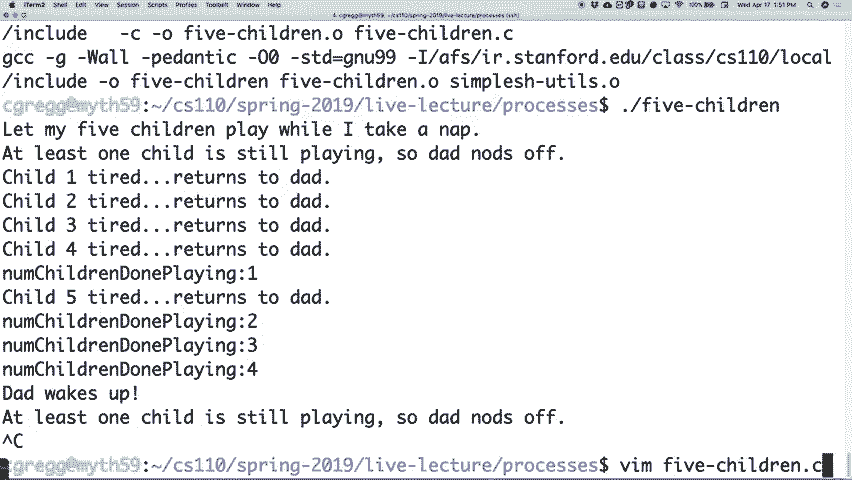

如果所有这些子进程都已经结束，当信号处理程序刚好发生时，我们就这样做。我们将在信号处理程序内使用`while true`。好的，我现在先把这个去掉，因为我们现在不需要它。好了，进入`while true`。我们要做的是等待所有子进程结束。

好的，如果`wait PID`的返回值，通常是刚刚等待的子进程，如果它返回负值，或者返回负一，或者是负数，这意味着没有更多的子进程需要等待了。如果另一个子进程结束，它将再次调用信号处理程序。

处理程序。好的，所以并不是你需要一直等待，可能会发生，没有更多的等待条件，在这种情况下，好吧，所以你在这种情况下需要做的是，你需要说，嗯，我们最好捕获子进程的PID。

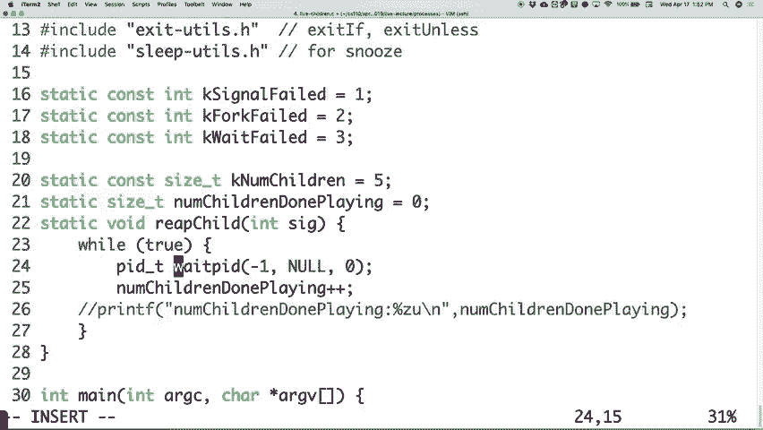

对的，如果PID小于零，我们就直接返回。好的，我们基本上会在处理完所有可能已结束的子进程后跳出`while`循环。好了，问题是这样的。

小于1表示最后一个子进程已经结束，而我们会重新调用`wait PID`，直到没有更多的子进程需要结束，因此`wait PID`会说没有更多子进程已结束。现在我们会返回，每一个子进程都会这样处理。

这段代码在这个小循环里对吗？它会一直停留在这个循环中，直到说没有更多的子进程了。这就是发生的情况。如果它们同时结束也没关系，但我们有一个`while`循环，它会处理第一个、第二个、第三个，依此类推。

第四个将继续进入 while 循环，并不断询问。最终某个子进程会成为被 wait PID 捕获的那个，我们不知道是哪一个。然后我们会再次执行 while 循环，它会返回一个 PID。所以我们会说，哦，我们不会跳出循环，我们将继续进行。

再次执行它，直到所有子进程都被捕获。好的，你还是不明白吗？你有问题吗？没关系，想个问题问吧。是的，所以 read child 被调用了，这不一定是必要的，但是 wait PID 被调用了多次，直到所有子进程都被捕获。是的，wait PID 被调用了，嗯，wait。

PID 在任何一个子进程结束时被调用一次，然后我们进入。这个 while 循环，它会一直等待，直到没有子进程剩下。好的，然后我们将结束，关于这个问题，嗯，这是个好问题。在这种情况下，我们现在运行的方式是它会在 while 循环中阻塞。

仍然有子进程没有完成，因此它将等待。是的，它实际上会等待，直到所有子进程都完成。现在它们都会大致在同一时间返回，但这是一个很好的问题，我们会看到稍后如何处理。如果你想有不同的处理方式，没问题。好的，好的，如果你。

仍然在等，嗯，好的，让我们看看当我们运行这个时会发生什么，好的，五个。

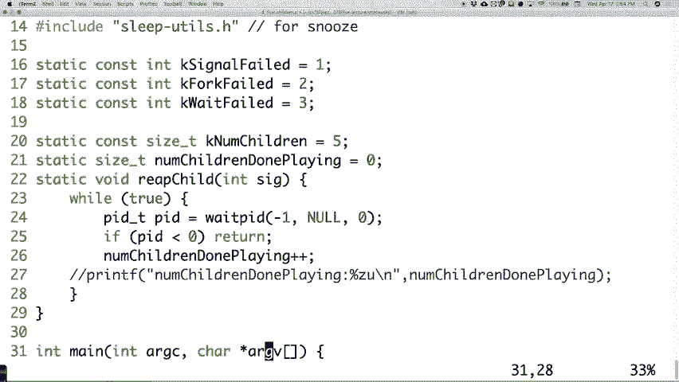

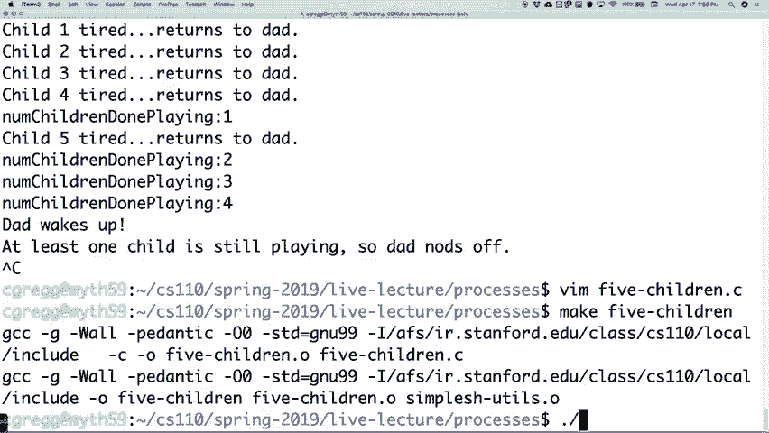

子进程，好的，现在它将进入那个 while 循环，它们会返回到父进程，所有五个子进程最终会在 while 循环中被捕获。然后父进程会被唤醒，并且确实递增了所有五个子进程的完成计数，每完成一次，计数就增加一次。是的，嗯，这是个非常好的问题。

在信号处理程序的情况下，事实证明，信号处理程序被调用一次，实际上它可能会再次被调用，虽然这没有关系。它实际上并不重要，因为我们正在调用 wait PID，记得 wait PID 是做什么的，这一点非常重要。在这种形式下，当我们这样说 wait PID 时，意味着我们会。

wait PID 这样说的是，好的，等待任何一个子进程完成，如果有未完成的子进程，比如说如果还有子进程存在，就等待其中的一个完成。好的，它实际上会阻塞，直到一个子进程完成。如果没有更多的子进程了，因为它们都已经完成了，它将。

立即返回负一，这时我们会跳出那个循环。是的，来做这个，老同学说，等等，如果我们做出以下修改呢，只是说，哦，看看我们的新方法是否适用于那个其他的情况，也就是所有子进程同时结束的情况，假设我们。

现在会发生什么？他的评论是，哦，这意味着我们是不是永远都看不到所有的父进程唤醒的情况，直到最后？让我们来看看吧，现在子进程开始执行。

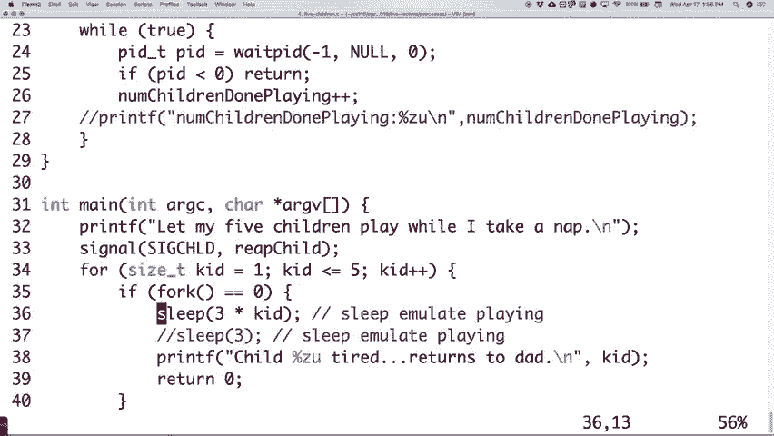

记住，现在它们每个子进程执行 3 秒，对吧？好的，第一个子进程三秒后返回，第二个子进程三秒后返回，父进程仍然没有醒来。第三个子进程返回，第四个子进程返回，父进程依然没有醒来，事实上，父进程在尝试醒来，但猜猜看，信号处理程序是执行的部分。

程序在运行时，它也不会，实际上现在只有一个进程，尽管可能有两个函数会发生，但信号处理程序是位于这个 while 循环中的，而父进程没有机会醒来，检查所有子进程是否已经结束。所以是的，我们通过做这些花哨的操作破坏了这一点。

我们得做些别的事情，是的，是的，问题是信号处理程序是否会在第一个子进程结束时运行，这可能是第一个，或者在这种情况下确实是第一个。因为它们在不同的时间结束，可能有多个子进程同时结束，只调用一次，但在这种情况下，是的，信号处理程序在这个时候启动。

第一个子进程结束后，它就不知道，直到所有子进程都结束，它才会离开信号处理程序。其实这并不是一个好的编程方式，你希望信号处理程序尽量快。如果你做了 107e，你知道这对于中断来说是对的，这基本上是相同的道理，你希望你的信号处理程序能够迅速完成。

处理程序进进出出要尽可能快，所以你不想等待其他子进程，记住，父进程有事情要做，父进程应该醒来并说：“哦，我要检查一下我的所有子进程是否都已经结束了”，但他不能，直到所有子进程都结束了才行，对吧？所以这是一个大问题，是的。

不，不好，非常好的问题，它是否是在调用 `wait PID` 之前，还是之后？

在子进程结束后被调用，因为子进程已经结束了，好吧，所以。

换句话说，`reap child` 会在子进程结束时被调用，而子进程还没有被清理干净。没有办法，所以操作系统基本上在说：“哦，这个子进程已经结束了，好吧，我等着，直到有人清理它，直到父进程清理它”，所以它是在被处理完成的过程中。

但子进程还没有被清理，这就是为什么会返回 PID 的原因。对吧？问题是，如果我们在这里打印出来呢？

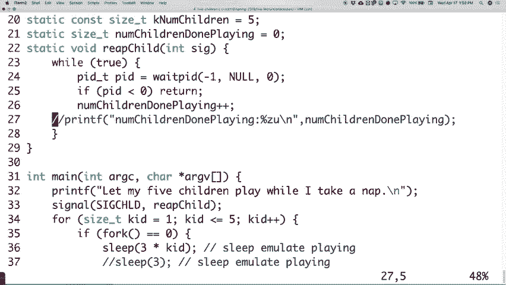

是的，让我们看看当我们这么做时会发生什么，好吧，它会做什么呢？它会在每个子进程返回时，就执行这个操作，因为，顺便说一下，它仍然在循环内，没离开那个 while 循环。我再给你展示一次，然后我们再看，看看它会怎么样。

完成这里，然后我们看看，好吧，仍然在这个 while 循环里。

记住，永远是`true`，一直在那个while循环中，直到`wait PID`返回一个负数，表示没有更多的子任务了。而在这种情况下，实际上我们并不想这么做，这不是最好的编码风格，因为我们会一直停留在那个子任务的信号处理程序中，直到它们都完成。如果有一个任务需要持续好几天，那其他程序就无法做任何事了。所以不应该一直待在信号处理程序中这么长时间，对的。其他等待返回的子任务在返回时，会再次调用这个子任务。

这是个好问题，我相信它会的。

正如结果所示，确实又调用了reap child。对啊，我是说，让我们试试吧。让我们看看能不能测试一下，我不完全确定这会成功。

不做任何事，但让我们来测试一下，reap child刚才被调用了。好的，我想问题是，如果它们在这里已经被清理了，是否会再次生成信号。我相信会的，我不是百分之百确定，一旦被清理，它可能会从中被移除，应该是的，可能在清理之后它就会被移除。

这样看来哦，我不需要再发送另一个信号，因为它已经被清理了。我猜是这个情况。好吧，我们就让我们来看看吧。

很多时候是这样的，所以我们实际上需要做的是，我们也需要说所有。

孩子任务已经被计算了，我们就看看是不是还有其他问题，可能在下面。好吧，让我们再做一次测试，做三次。

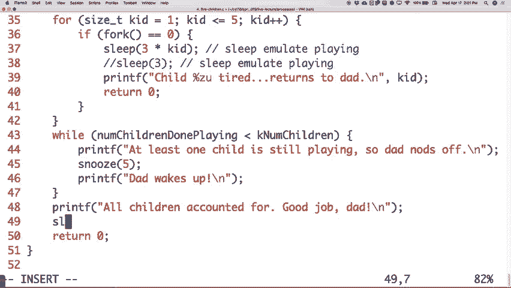

几秒钟或者其他什么事情，好的，创建五个子任务，孩子们，好的，开始了。

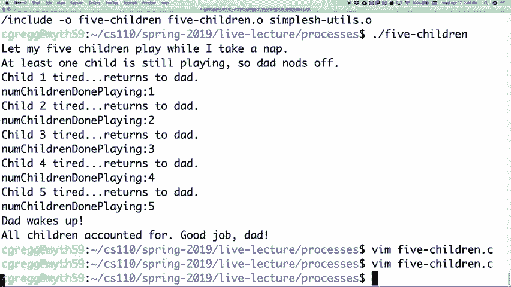

reap child刚刚被调用，现在它将在reap child中，不会再调用。直到所有五个任务完成，我们知道它会因为在那个while循环中，而一直停留在那，继续执行。好的，它不能也不允许你从这里面调用相同的信号。它又去了，它确实再次被调用了。

对，看起来它确实被再次调用了一次，因为所有那些子任务都触发了它。所以我错了，它确实至少会被调用一次。现在这并不重要，因为它会进入那个while循环，并且立即说没有更多子任务了，拜拜，就是这样，所以有一些情况是这样的。

这个逻辑是你必须处理的，对的，问题是SIG，也就是信号参数。

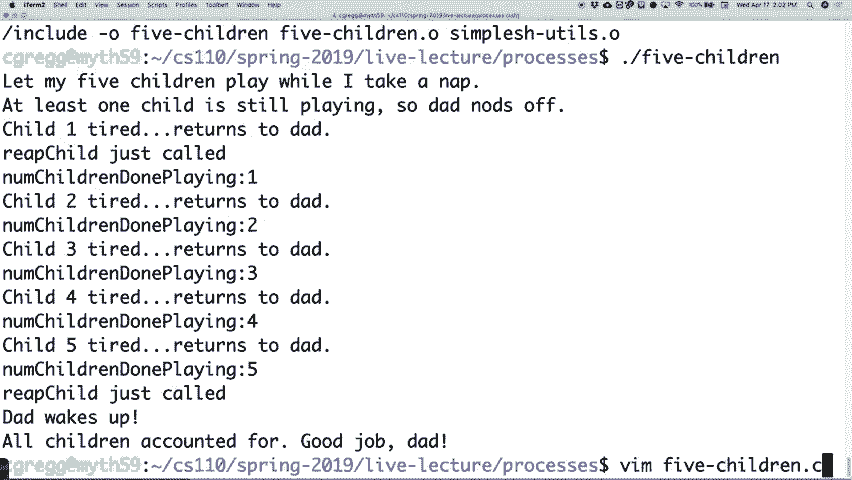

我打算去掉其中一些东西，因为我们很快会再次修改它。这里的信号参数，它说的是在这种情况下。

那是一个 SIG child，这是唯一能给你信息的东西，不会给你其他信息，只是告诉你哪个信号被触发。你可以查看这个信号，看看它是不是 SIG job，就是这样。也许我们想要一个包含更多功能的函数来捕捉更多的信号。

信号，也许你想知道到底是哪个信号触发了它。所以你就是这么做的。小心点，你是说回收子进程的函数在这里被调用，而不是在那里被调用。

这实际上只是调用 signal，并传递一个函数指针来回收子进程，意思是当一个子进程结束时，回收子进程的函数就会被调用。这是个好问题。可能的情况是，当时其他子进程还没有被创建。你说得对，在这个 for 循环中，如果我们把它设置为 sleep zero 或不睡眠的话。

如果那时它跳入了循环，然后做了，但是它仍然会正常工作。因为假设此时没有子进程，它就会退出回收子进程的函数。然后下一个子进程会被创建，它会回到函数并继续调用。所以我的意思是，这不会出错。

在这种情况下可能会出现任何问题，但你说得对，确实可能是我们在所有其他子进程创建之前就进入了回收子进程函数。不过，当其他子进程创建并且最终结束时，它仍然会被调用。很好，很多好问题，挺高兴我能再次复习这一部分，或者至少。

这一部分。好吧，那在这种情况下我们要做什么呢？现在我们有了。

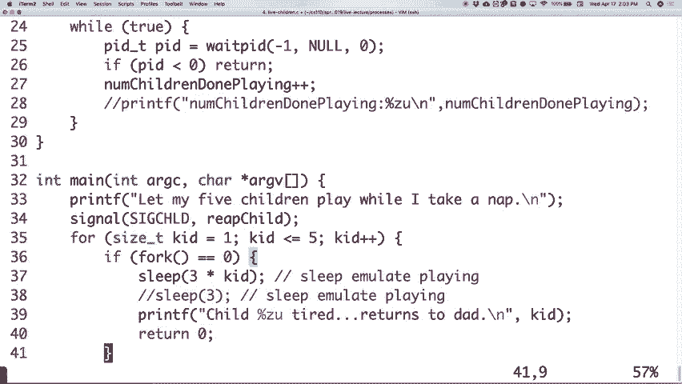

这个问题，记住我们通过添加来改变了行为。

这个上面的 while 循环。我们说过要阻塞等待直到所有子进程完成。如果我们有五个待处理的子进程，它将一直阻塞直到所有子进程都完成，而这正是我们不想要的。我们希望信号处理程序能迅速进出，这就是基本思路。

结果表明，我们最终会有机会使用这个最终参数。等待 PID 好吧，这个参数有很多标志你可以放进去。你只需要将它们一起排列，其中我们关心的标志之一，事实上，特别是针对这个情况，叫做 double you no hang，而 double you no hang 是一个。

一个标志表示等待任何子进程，除非没有子进程完成，这时会立即返回，返回值为零。所以这意味着返回值为零表示仍然有子进程，但它们还没有结束，但我要返回，因为你知道的，我不想在这上面阻塞。

不想等着那些在等待中的子进程。唯一需要改变的地方是，我们必须说，如果PID小于或等于零，因为在零的情况下，子进程仍然存在，但是它们还在运行。所以我不会停在那里或者等着它们，我会继续。

等一下，当他们完成后再调用这个函数，这就是这里发生的事情。让我们试试看，看看它是否有效，五个孩子，好，五个孩子，记住。

现在我们有了一个想法，我们希望父进程在前两个子进程完成后能重新唤醒。好的，我们得等一下第三个子进程，我会把它去掉，这样你就能看到接下来发生了什么，你可以看到父进程现在正在唤醒，正是我们想要的，和我们第一次看到的完全一样，但现在。

我们以一种方式进行操作，这样可以捕捉到所有子进程结束的情况。

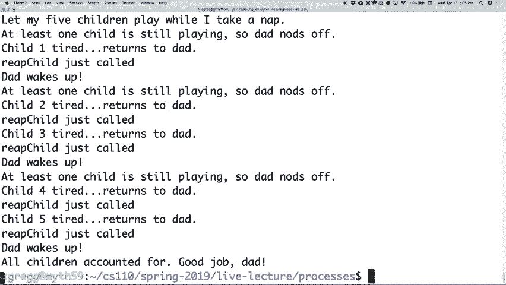

基本上在相同的时间或者大致相同的时间，好，让我再运行一遍，不再有这一行，我们就看看它一般是怎么工作的。

对于W挂起标志有什么问题，我们会经常使用它，好的，我们会使用它，特别是因为我们希望让程序继续运行，不想坐在那里等待子进程，等待它们完成，而是让信号来处理。

当子进程结束时，处理程序会被调用来处理这个问题。基本上，这个标志表示不再停止程序，只是处理那些已经结束的子进程，而不是我们不喜欢它的创建方式。是的，问题是，这个标志或者说是注释，是不是这个标志W，它会挂起。

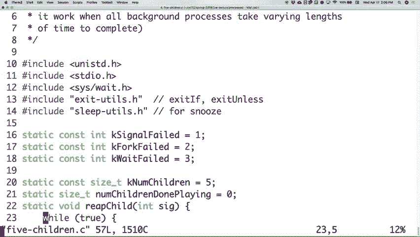

对于等待PID的函数，如果有子进程结束，返回该PID并清理它。如果有子进程已经结束，返回其中一个并清理它，给我那个PID，这样我可以做我想做的其他事情。如果没有子进程结束，但仍有子进程存在，别等待它们。

像我们过去一直做的那样，返回零并说看，它们还在那里，但我不会等，你让我不要等待，这就是它在做的事情。问题是，是否存在一个需要清理的进程队列？是的，我是这么认为的，它是操作系统特定的，我不确定具体情况。

Linux是如何处理的呢，操作系统是这个整体过程的一部分。当子进程结束时，操作系统会说“好，我欠父进程一个信号”，并且每当子进程结束时，它就发送信号。如果父进程已经结束了，那么你就不想再发送信号了，但在这种情况下，父进程我们。

这样做使得父进程不会在所有子进程结束之前结束，是的，基本上就是这样发生的，操作系统说，我要建立一个已结束子进程的小队列，然后在需要的时候调用 `wait PID`。还有很多其他问题，好的问题，我们不知道会调用多少次。

`reap child` 一般会在这种情况下被调用，因为它们是错开的，三秒钟，三秒钟，三秒钟，三秒钟，它会被调用五次，因为没有两个进程会同时结束。每当有两个或更多进程同时结束时，它可能只会被调用一次，这就是为什么你需要处理它们。

所有的子进程都要处理，因为你可能不会再收到另一个调用，这只是操作系统中内建的竞态条件，按照它们的说法，你必须计划好，如果 `reap child` 被调用，可能有多个子进程已经结束，你最好处理好这些情况，因为我们不会。

在这种情况下，是否会再次调用呢？是的，如果我们回到多个进程同时结束的情况，是的，正确，你会依次处理它，所以如果两个进程同时结束，你最终会得到一次调用，然后它会继续，然后这个 `while` 循环会处理两个子进程并清理它们。

然后发现没有，其他的都没有结束，返回零，然后你从函数中返回。是的，在这种情况下，记住这是状态，所以我们本来可以做的，事实上你通常应该做的是。

像这样的状态，然后你粘贴一个状态，像那样，它会给你更多的信息，子进程的返回值是什么，它是否正常结束，是否有其他的，里面有很多信息，从中你能获得更多的信息，状态是什么，怎么结束的，是否正常结束。

停止，或者说它是结束了，还是被停止了，还是继续执行了，它会给你更多关于这个问题的信息。好的问题，是的，我能不能在没有的情况下运行它？哦，是的，你是要我在没有的情况下运行吗？所以它们都会。

同时结束，没问题，让我们看看，如果它们同时结束，那会发生什么。

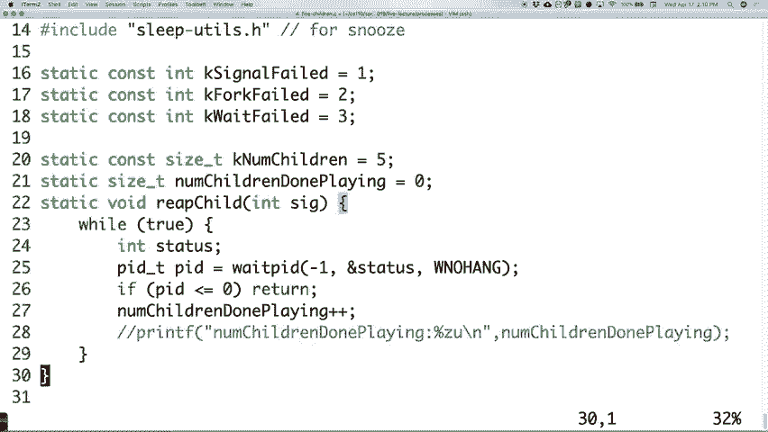

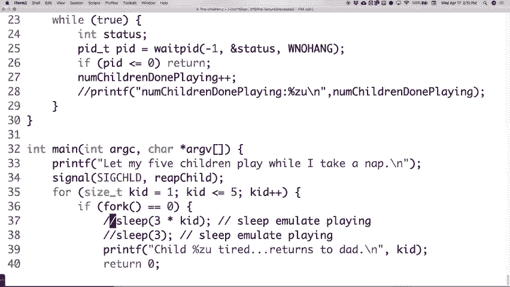

看，这样记住它们都会发生，然后三秒钟后，或者其他的，对吧，它们都结束了，最后父进程醒来，发现它们都结束了，我们完成了，它们已经在那个里面得到了处理。好的问题，没错，这个程序确实包含了很多东西，是一个程序里有很多内容。

发生了不同的事情，但我们现在学到的是，这些信号处理器确实有一些微妙之处，它们有一些能力可以被调用，但有时这有点奇怪，因为两件事可能会在同一时间被调用，所以这是微妙的，我们有 `wait PID`，它会。

等待任何子进程，你可以将第一个参数设置为负一来等待任何子进程，现在我们说了，但如果我们不想让你阻塞并等待该子进程，只是立即返回，我们会捕获关于这一点的信息，说明如果是零的话就没有。

仍然剩下的子进程，这些子进程还没有被捕获到。好吧，现在我们不在乎是否还有子进程剩下，或者所有子进程已经完成，因为我们知道我们正在正确地计数。所以，如果我们还没有计数，或者如果所有子进程仍然存在，`reap child`将会再次被调用，仅仅是因为父进程或该进程的父部分仍然在做自己的事情。

好的，我知道这里面有很多内容，但请随时提问，并且如果你想的话可以自己去运行代码。你可以下载它，我今天没有把它放在幻灯片里，不确定它是否包含了这个。

我搞坏了我的平板电脑，但前几天我会再试一次的。所以我们已经遍历了所有这些不同的情况，我不认为我们需要重新做这些，因为我们在进行时就已经做了这些，但可以随时阅读幻灯片，它基本上就是一一遍历所有情况。

我们实际操作过的，看到我们有一些需要进行更多逻辑判断的情况和不同类型的逻辑。好的，接下来我们来看一下，我认为到此为止。还有其他的标志，除了 `W no hang` 之外，还有 `W untraced`，虽然这个名字有点奇怪，但基本上它的意思是：阻塞直到某个子进程的状态发生变化。

子进程要么已经结束，要么已被停止，而“停止”是指暂停，并非结束。我们将会看到很多这种暂停的情况，如果你使用 `W untraced` 和 `W no hang`，它会移除阻塞部分，它实际上并不会阻塞。在这种情况下，`W no hang` 总是表示“不阻塞”，而其他的选项则不然。

`W untraced` 是指它已经停止，另外你还会有 `W continued`，用于子进程被停止后重新启动的情况。父进程也会收到相关的通知或者信号。所以，我们通常会看到三者一起出现：`W untraced`，`W continued` 或 `W no hang`。

这就是说，看，我希望你等待并返回关于某个子进程的状态变化的相关信息，不仅仅是结束，不仅仅是继续，不仅仅是停止，而是任何状态的变化，顺便说一下，在执行这些操作时不真正进行阻塞。好的，这就是信号的基本概念。

到目前为止我们已经处理了一些更加细微的竞态条件，接下来我们需要继续处理这些问题。好的，我们必须讨论一些更多的同步问题，特别是在讨论信号处理程序时。记住，信号处理程序会在某个特定事件发生时被调用。

问题之前提到过，有人问如果子进程在父进程实际执行之前就结束了怎么办？这个情况是可能发生的，好的，因为你编写代码的方式，实际上可能会发生这种情况，而这可能并不是你想要的结果。

这种情况可能不是你想要的，所以我们必须处理这个问题。我们将编写另一个程序，它将基本上是一个作业列表程序，换句话说，我们将使用 `fork`、`exec` 和 `cvp` 启动一堆程序，就像我们之前做过的那样，我们将启动它们。

我们将把它们添加到作业列表中，实际上你将为即将到来的作业完成这个任务，不是本周而是下周，你将开始做这个作业，你必须这样做，因为每当你在 shell 中输入命令时，它就会自动执行这个过程。

shell 接收该命令并将其放入它正在跟踪的某个列表中，以了解哪些程序正在运行，这就是它的作用。所以我们要做的就是这样，我们将运行这三个程序，正如事实证明的那样，然后我们将按顺序每秒执行一次，*一个接一个地执行*。

然后我们将有一个信号处理程序，当子进程状态发生变化时它会被调用，记住每当子进程状态变化时它都会被调用，我们将通过信号处理将其添加到作业列表中，明白吗？好了，然后父进程也会进行维护。

父进程实际上维护着这个作业列表，实际上这就是它的作用。事实上，我们并不真正维护它，而是一直输出它。好了，让我给你展示程序，然后我们将看到它的实际运行效果。这个程序将被命名为 `job list synchronization.doc`，并且它将是函数的一部分，我们将编写主函数。

先给你展示一下它实际上是如何工作的。好了，我将调用 `date` 函数，顺便说一下，你以前没有见过这个 `date` 函数。

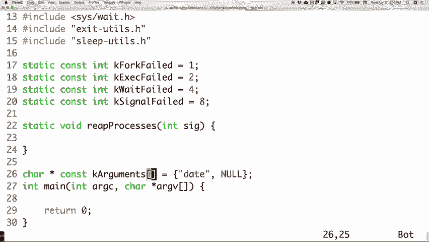

它只是打印当前的日期，所以我要调用 `date` 命令。

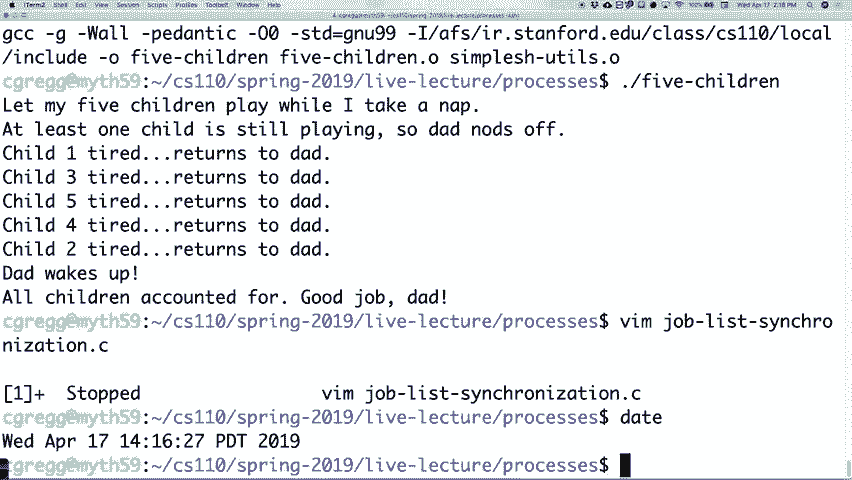

该函数会执行并将结果输出到屏幕上，实际上 `date` 函数的作用就是这样。接下来我们将设置一个信号处理程序，信号类型是 `SIG_CHILD`，在这种情况下它会清理进程。

这个信号处理程序会被调用，然后我们要做的是我们将启动一个真正的 `for` 循环，开始处理流程。所以对于 `size TI` 等于零，`I` 小于三的情况，`I++`。

好的，`PID_T PID = fork()`，如果没有，那就不行，反正也好。

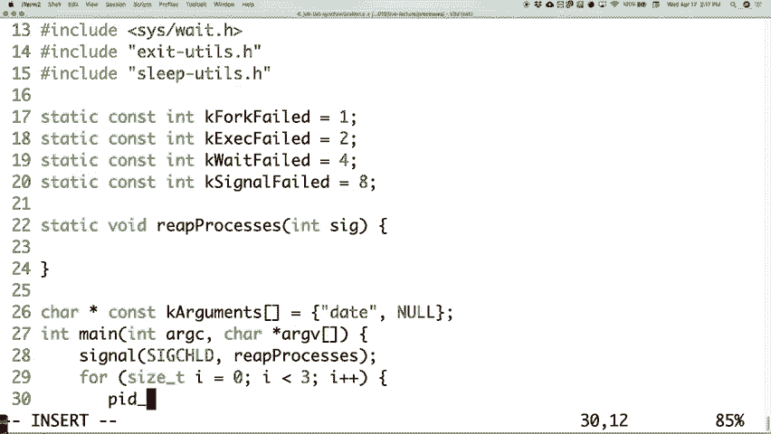

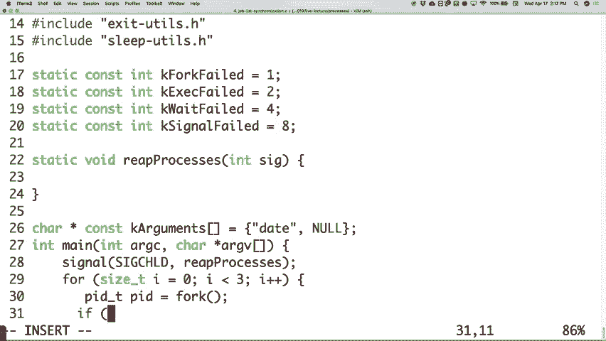

`fork`，我可能在这里有一个错误，不管怎样，如果 PID 为零，意味着我们在子进程中。那么在这种情况下，我们实际上会调用 `execvp`，并传递 `k_arguments[0]` 和 `k_arguments`，记住这是 `execvp` 的工作方式，好吧，就是这样。

记住，如果它成功的话不会返回，我们假设 `date` 函数会正常工作，在这种情况下我们没有进行任何错误检查。接下来，我们会睡眠一秒钟，基本上强制 CPU 或强制父进程从 CPU 中移除。那是什么意思呢？我指的是它会。

我们会告诉父进程去睡觉，然后子进程实际上会去做它自己的事情。如果你有多个处理器，可能会发生这种情况。但在这种情况下，我们只是强制让父进程等待一秒钟。为什么呢？谁知道呢，可能这是一个系统，你知道你正在键入。

命令输入并且它在等待命令执行，或者说我们现在只是将其强制从 CPU 中移除，然后我们会打印出“作业 %d 已添加到任务列表”，并且我们会打印出该任务的实际 PID。

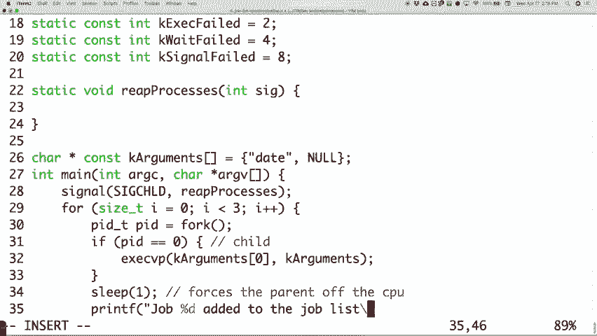

子进程，好吧，然后我们会返回零，这样没问题，每个进程都能正常结束。

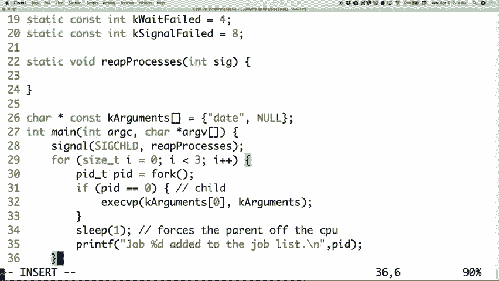

这里发生了什么呢？我们将启动三个进程，使用 `date` 命令。它会执行，然后我们会打印出“嘿，我已经在一秒钟后启动了这些进程”。好吧，接下来就是回收进程的工作。在这种情况下。好吧，我们要做的是，我们仍然会在 `while true` 循环中执行，因为我们不想。

你知道的，我们几乎从现在开始总是会这样做，因为我们无法知道。

很多子进程已经结束或已改变状态，好吧，我们要说的是。PID 等于 wait PID 负一，没有 W 没有挂起，因为我们不想等待。

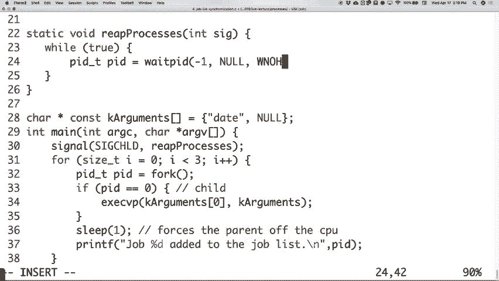

我们不希望在这些地方阻塞，然后我们要说的是，如果 PID 小于。

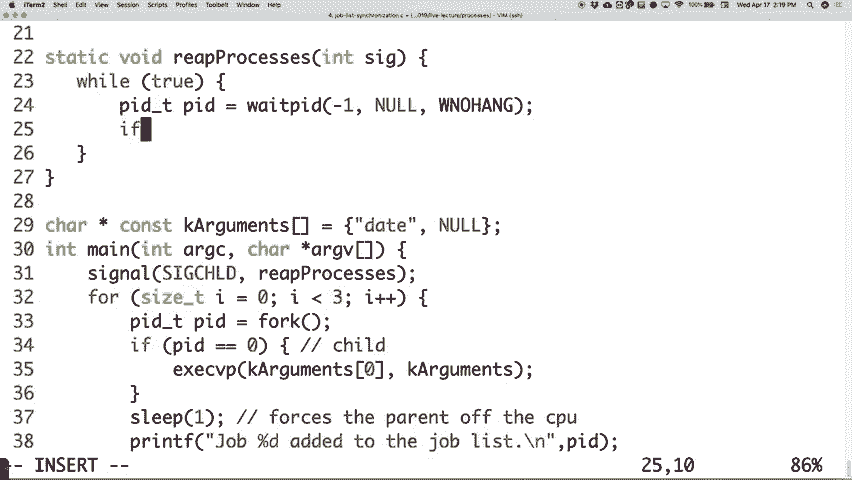

如果等于零，我们就简单地跳出循环，做与之前完全一样的事情。接下来如果我们在追踪这个进程（你将在作业四中做到这一点），我们将打印“作业 %d 已从任务列表中移除”，好的，接下来就会这样做。

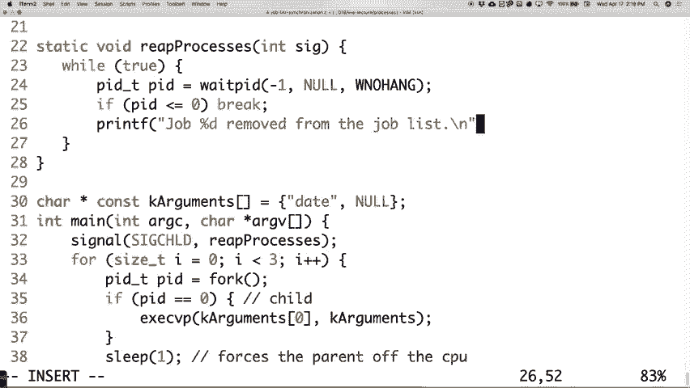

当任务结束时，记住不要挂起，实际上在这种情况下就是这样的。

当任务真正完成时，它会说从任务列表中移除了。子进程结束后，为什么我们还要把它保留在任务列表中呢？我们把它从任务列表中移除吧。所以再次强调，父进程创建了所有这些进程，并将它们放入任务列表中，我们只是把它们移出去，但这就像是放入…

当子进程处理完信号并调用信号处理程序时，它会说，哦，这个任务现在已经从任务列表中移除了。

好的，我们运行这个看看会发生什么。

好的，任务列表同步。它说任务23735，也就是子进程的PID，从任务列表中移除，然后它说任务23735已被加入到任务列表，然后它说，日期好了。实际上，它首先说了日期，事实上因为它需要结束，首先会说日期。

然后它结束了，做了同样的事情，接着说下一个任务被移除并重新添加，然后又移除再添加。现在你可能会想，自己说，这有点傻，任务列表中的项目在被添加之前就被移除了，对吧？你必须问自己。

那为什么会发生这种情况呢？我们做了什么让它发生的呢？这是更大的问题，对吧？评论或问题？是的，我们做了这个小睡眠。

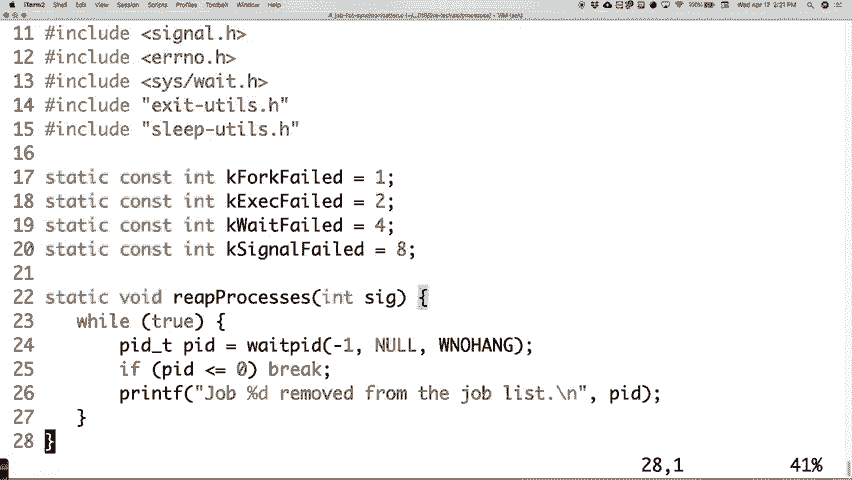

一秒钟，对吧？那么当它到达那段睡眠时，子进程已经开始了，而且日期函数的执行不会超过一秒，它几乎是瞬间完成的。`date`函数执行完后，命令也就完成了，调用信号处理程序，所有这些都在一秒钟内完成。

你会注意到当我运行它时，实际上那一秒钟并没有发生。因为`sleep`并不会等待那一秒钟。如果我改变延迟，它确实会等一秒钟，但在这种情况下，它立即醒来了，没错，非常好的问题，非常好的评论。

问题和评论是，等等，如果我们去掉`sleep 1`，它是不是仍然会有这个潜在问题，因为你不知道`date`命令是否会运行得比这个命令更快，绝对是的，你不能知道这些，然后我们故意在这里加了这个`sleep`，是为了告诉大家，嘿。

这是可能发生的事情，尽管我们强制它发生了，所以我们知道会发生什么，但这些就是竞态条件，你无法预测它们，非常好，很好的观点。是的，如果你在这里加上判断条件，确保它是子进程之前…

由于父进程和子进程会各自执行，所以在这种情况下，它被打印了两次。这其实不是我们在这种情况下想要的结果。但你看到了这里的问题，我们有一个竞态条件，实际上我们想要的是…

所以我们要做的是，我们希望子进程在执行此命令之后再发送信号。我们希望的是，子进程可能结束，我们不在乎子进程是否结束，只是我们不希望那个信号在我们准备好之前发送，直到我们准备好接收这个信号。

在这种情况下，它会在我们把任务添加到列表之后，因为如果你真的是在维护一个需要的列表，特别是如果它是一个队列或某种集合，或者是某个列表，而你在添加之前就试图移除它，那就有点难。

你会崩溃，对吧？或者有其他情况，比如“哦，我不能移除那个任务，即使它已经结束了”，这很奇怪，对吧？所以你需要以某种方式能够说，在这次打印输出之后再调用那个信号，在这种情况下，好吧。那么我们怎么做呢？好吧，刚才我们做的那个就是我们需要做的。

好吧，这个我们其实已经讲过了所有这些细节。我们需要做的是我们需要使用一种不同类型的系统调用。好吧，我们需要使用信号集的概念，这个信号集将是一个数据结构，表示当你调用这个函数时。

SIGPROC mask表示在我们解锁之前，不允许某个特定的信号被调用。好吧，所以我们将阻塞一些信号，实际上有时你可以阻塞许多信号，但我们特别要阻塞SIG child，直到我们准备好让这个SIG child信号被触发。

我们所做的事情好吧，这里有三种不同类型的函数我们需要处理。在这种情况下，其中一个叫做SIG empty set，让我把它放大一点。它叫做SIG empty set，而SIG empty set基本上接收我们拥有的SIG set T类型，并且它会初始化，表示没有信号。

信号集中的信号，好吧，这只是一个初始化。顺便说一下，这个信号集基本上是一个整数，它有许多位，显然它有许多位，并且这些位会根据信号的不同而设置。所以它是一个32位的整数，结果是信号的数量少于32个，所以我们可以处理它。

如果你想往一个集合中添加特定的信号，你可以这么做。你可以说：“好吧，我将传入我想要添加的集合，然后告诉它我要向集合中添加哪个信号。”你也可以移除它们，接下来我们关心的三种是这些。

如果你想说“去阻塞这个信号”，你需要调用SIG proc mask并传入一个名为SIG block的值，然后传入你关心的SIG set。你也可以获取已经设置的信号，就像那种奇怪的情况，实际上我们不会告诉你。

你还记得从第一天开始我们谈论的那个掩码吗？有个奇怪的事情是，唯一检查掩码的方法是实际上改变它，然后你得到你检查的内容，这里也是一样的。为什么这么做，可能是历史原因，我猜，但无论如何，大多数的。

现在我们不在乎现有的集合，我们只会说，看看，这是我们的新集合，我不在乎已经完成的信号，我们就这么做。如果你写的是一个更健壮的程序，你可能会在意这些。好的，现在让我们看看这在实践中是如何工作的，所以让我们修改一下。

现在让我们修改一下我们的main函数，我们不需要做任何事情。

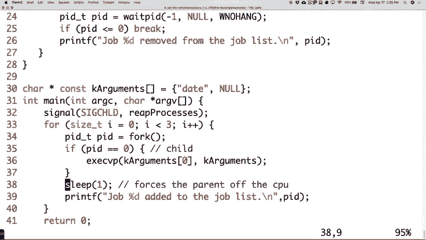

我们只是需要在这里更改main函数，使用我们将要阻塞的信号集合，你会看到这是如何发生的。好的，所以我们要做的就是做同样的事情，我们将设置这个信号，然后我们将说，好的，我要得到一个SIG。

设置下划线 T，然后我只想称它为我的集合，我将通过调用SIG空集合SIG空集合来初始化它，然后我们传递一个指向集合的指针，然后我们说让我们添加SIG子集SIG或抱歉，集合和SIG CHLD。 好的，现在我们已经得到了我们的集合，我们将能够。

说，嘿，等待这个信号，直到我们准备好。

好的，我们还不需要阻塞它对吧？我们希望在我们实际上有机会调用它之前阻塞它，像是在我们实际执行fork之前，因为在那个时候我们需要它保持阻塞。好的，在这一点上我们将说SIG PROC MASK，好的，SIG BLOCK，然后我们将。

传递我们的集合，我们不在乎其他集合，所以在这一点上，在fork之前，我们已经阻塞了信号，结果证明这是好事。事实证明，阻塞的信号会传递给子进程。父进程中阻塞的信号在子进程中也会被阻塞。

这样做的原因是为了让我们能做到这一点。我的意思是，这真的是我们这么做的基本原因。这样到时候。

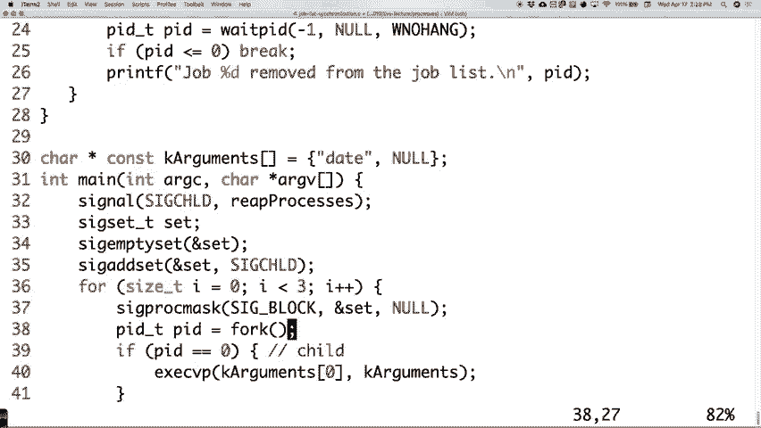

你到达子进程部分时，等到我们实际运行date命令时，实际上程序不允许调用SIG子信号。现在并不意味着它会永远被忽略，一旦我们解除阻塞，所有需要发送的信号队列就会恢复，哦，好的。

操作系统会说，哦，太好了，我得到了这个子进程已经结束，我最好调用它，但只有在我们解除阻塞之后。好的，那我们现在需要做什么呢？我们现在需要在子进程中做点事情，这看起来可能有点奇怪。

但是在子进程中，我们将做SIG PROC MASK。好的，实际上我之前有点撒谎了。信号在子进程中被阻塞的原因并不是因为这个，实际上是因为你可能希望。子进程也能阻塞它自己的信号，这可能是因为。

你在运行相同类型的程序时，我们将看到为什么这实际上不。重要，因为我现在要做的事情，我们将在那里只为子进程解锁。换句话说，如果date调用子进程，如果我们在那个点没有解锁，那么date函数将会开始。

当它的子进程被阻塞时，date并不会这么做，所以实际上。并不那么重要，但如果date有自己的子进程，因为信号集会传递给它们的子进程，date也会面临这个问题，可能无法。处理这个问题。好的，所以谁知道，这可能是一个问题，但目前我们所做的。

我们说的是，在子进程中继续解锁，因为。无关紧要，子进程，我们不在乎子进程是否会调用子进程的处理程序。我们关心的是父进程的子进程处理程序是否被调用，我们不希望它在这里之前解锁，直到printf之后。好的，所以在printf之后，SIG PROC。

在父进程中设置的MASK SIG UNBLOCK，我们不关心前一个是什么。

不像那样，之后，当子进程信号或父进程的信号。处理程序可以被调用时，子进程可能已经结束了。因为我们刚刚等了一整秒，在这种情况下，确实非常快。函数问题，是的，很好的问题，问题，能回去看一下吗？

解释为什么在子进程中解锁信号与父进程没有任何关系。好的，父进程先放一放，父进程有一个主函数，并且有一个处理SIG子进程信号的处理程序。父进程的SIG子进程处理程序在子进程结束时被调用。

除非我们已经告诉父进程我们不打算让你发送信号，我们不打算。让你接受信号，或者你无法发送该信号给父进程。好的，所以无论子进程的信号是否被阻塞都无关紧要。它在处理自己的子进程时，如果有的话是这样。所以当你说的时候，这并不重要。

SIG PROC MAS SIG UNBLOCK INSIDE THE CHILD 只是说，我确保。子进程现在没有任何自己的信号被阻塞。好的，然后。那可能对子进程很重要，对父进程而言，尽管在这里我们仍然阻塞那个信号。

因为父进程最后看到的是这个阻塞，直到在此之前。所以父进程的子进程处理程序不会被调用，直到45行。我们调用解锁时，我们会说SIG PROC MAS UNBLOCK SIG UNBLOCK那个集合。到那时，父进程的信号处理程序可以被调用，并且它将会。

因为操作系统会说，哦，现在你正在接受信号，我有一个信号要给你，然后它就会调用它，希望这次实际可以看到这种情况。

任务列表的同步？希望是的。现在我们实际上在等了1秒钟后，任务已经按正确的顺序添加和移除。为什么呢？因为我们不允许它们在添加之前就被移除，在这个案例中，只是需要一点时间来编辑。

就是这样，没问题。问题是，日期被打印出来是在我们有任务之前。我们其实不太在乎这个，因为我们说了，这是一个好点子，我们说“嘿，去运行吧”，我们在尝试做自己的添加操作，做我们自己的记账，但你现在已经在运行了。

如果你想做这个，假设你需要这样做，我们就会做类似这样的事情。如果你说，等一下，我不想让日期在我们做精确的 V 或者 CVP 之前运行，对吧？像是我们在分叉之前就必须弄清楚，如何处理这些事情。

现在做这件事，实际上这可能会是一个问题。在这种情况下，我们必须做些别的事情来弄清楚如何等到父进程完成后再打印出来。不过一旦你有了子进程，它们就算是独立的了，所以你并不真正在乎...

你不可能等父进程的孩子，子进程本身没有办法为父进程等待，所以你必须想出一些其他的逻辑来处理这个问题。对，没错。非常好的问题，问题是，等待的信号是否也会传递给...

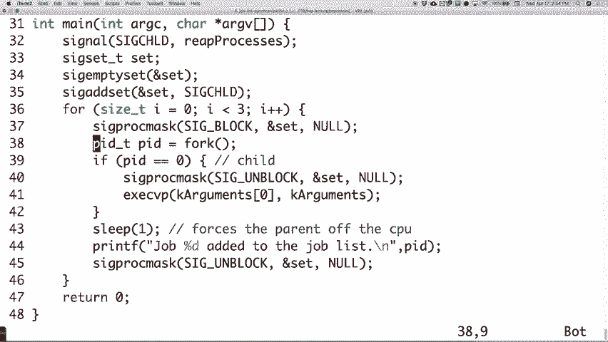

子进程确实是程序的一部分，所以它有权限访问它自己的所有函数。现在子进程的重处理信号不会在子进程结束时被调用，因为它没有结束的子进程，像是之前提到的那样。这有点像是前面的内省现象。

如果子进程存在，那么这个信号可能会被调用。现在很可能子进程会自己设置好，实际上这是一个好点子。在这种情况下，这个信号确实可能会被调用，如果子进程...

进程有一个子进程，如果子进程还有一个子进程。那这个子进程的情况就会被调用，而不会被添加到父进程的任务列表中。我们会从子进程的任务列表中退出，或者我猜我们会把它从子进程的任务列表中移除。所以你需要在里面加上更多的逻辑来处理这种情况。

关心这个问题，对，挺好的观点，对，你还可以做的是，你可以基本上说，你可以设置信号，你可以说信号没有值。基本上就是在说不要再处理它了，你可以在子进程中这样做。如果你在乎这个问题，那我们就不需要在这部分关心这个问题了。很好。

很好，很好的观点，做这些事情时有很多东西需要考虑，当你。构建这些实际的程序时，没错，`sig block` 是否不允许程序。

接收信号或发送信号没有限制。好问题，如果问题是。

是的，`sig block` 是不是不允许程序接收信号或发送信号？它不允许父进程接收该信号，信号处理器将不会被调用，它可能会被排队等待稍后调用，但它。不会被调用。好问题，操作系统有一定的限制，限制信号的数量。

操作系统会像阻塞并存储信号一样，哦，好的问题，是否有某种列表或者队列限制信号的数量，我不知道有没有这样的限制，但它可能。足够大，以至于不会产生影响，可能有成千上万的信号。而且你。可能根本无法创建成千上万的子进程，或者。

随便吧，可能是某种限制，我们不需要担心。对，好问题，如果我们写下注释，它会运行。

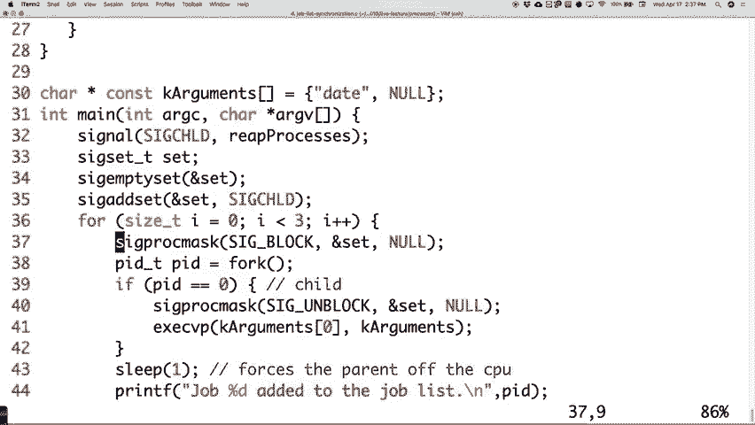

完全一样，因为子进程不会获得任何子进程，它也不会。无论如何，它不再重要，尽管如果我们。如果我们运行了另一个有子进程的程序，可能会打印出某些作业已。被添加，那就奇怪了，为什么会发生这种情况呢？不过，在这种情况下。

不会有影响，我删错了吗？哦不，谢谢你，哦，你想做的是。这个吗？那个只会使你之前的行为发生变化，谢谢。

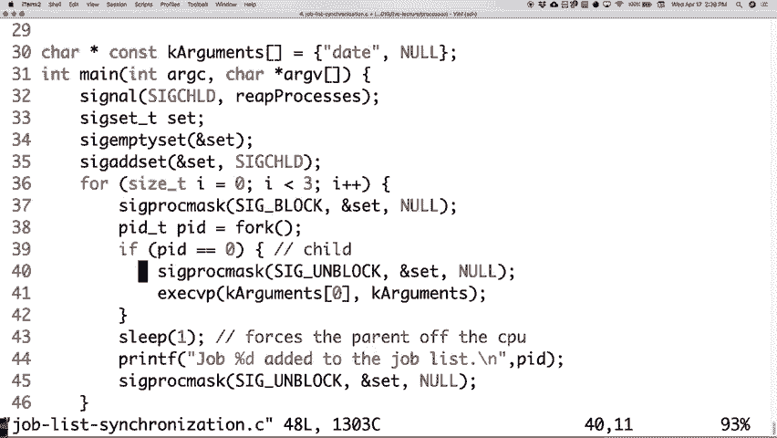

你们所有的同步，没错，就是类似的东西，对吧，没有子进程。子进程会调用那个函数，如果你有一个函数那样做的话。如果日期有自己的子进程，我们可能会看到一个奇怪的打印出来，显示某个其他进程并添加了一个作业列表，他们。

知道了，所以再次强调，当你尝试做这些事情时，你必须有点。跟踪这些细节，因为它有点复杂。对，好的问题，对，好的问题，如果你想说停止调用我的。函数或信号处理器，我不记得确切是什么，但它是另一个你。

基本上发信号，而不是 SIG_CHILD，类似这样，或者不是那样的，但类似的。我不记得确切是什么，但。就是那样的。事实上，我们可以查找一下，如果我们做 `man signal`。

让我们看看，SIG IGN意味着信号将会被。

忽略或SIG DFL意味着默认的操作将会发生，所以你已经做到了。你已经将其传递给信号，它就会继续，没有问题。SIG child将在我的进程中被调用，好的问题。好了，当你手头有手册时，这种情况会变得很方便，好的，继续吧。

这些就是信号，我们已经讲过了不同类型的信号。我们实际上可以写一个小函数来捕获这些，而不是逐一写出每个部分。在这种情况下，我们可以编写一个`impose SIG child block`，它设置一个信号集，然后调用SIG proc master。

阻塞，然后我们可以执行精确的解除阻塞操作，它执行类似的操作。只是它会解除阻塞，如果你想的话，你也可以有一个切换操作。你会看到这些函数，我们为你编写了一些函数。

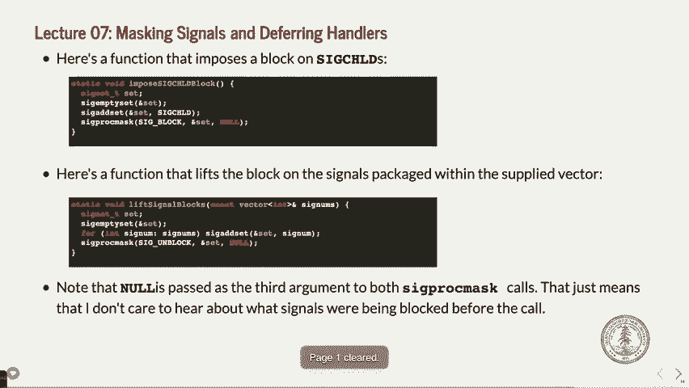

好的，我们已经做了这个改进的作业列表，还有什么可以说的吗？

对于它，是的，正如我所说，针对进程和信号的阻塞信号集。所以它应该，它应该解除该信号，以防万一子进程在意它。正如人们已经提到的，可能还应该取消这个信号处理程序，以便子进程结束时不再调用它。

因为那不是我们程序的一部分，再次提醒，当你在实际构建这些时，你必须进行大量的测试。好了，再快速讲两个信号或两个系统调用。这里，进程可以向其他进程发送消息而不需要任何事情发生。

你可以向另一个进程发送信号，你可以使用一个略显不明确的命令，叫做`kill`。现在kill之所以命名是因为最初它只发送了一个终止进程的信号，基本上就是说“杀死这个进程”，它意味着停止它的运行。这是最初的意思。

然后他们说，假如我们想要发送其他信号呢？那我们就继续使用`kill`吧。为什么不叫它`send signal`或者别的什么呢？我也不知道，但他们还是叫它`kill`。好了，它实际上不会杀死进程，如果你发送的是`SIG kill`，是的，它会终止进程，但否则你可以发送其他信号。

要发送一个AP ID发送特定的信号，好的，如果你想将SIG child信号发送到特定的进程，你可以发送它。你还可以发送，我想还有两个其他的信号，比如SIG，我想是SIG USR1，它是一个通用的信号，你可以发送，因为嘿，或许你只是想发送它。

发送一个不是特殊的信号，比如说杀死信号，它说的是终止，你知道的，或者是停止或者继续，我们在后面会看到这些信号的许多用法。你也可以发送信号给你自己，这可以通过调用 `raise` 系统调用实现，基本上它就是将你尝试的信号号传进去。

将其发送到你自己的进程，这就像是通过获取 PID 来发送信号一样，**你的** PID 信号号，你可以使用任何一种，它们是可以互换的。好，你还可以获取它的值，你可以更改 PID，使其不再是实际的。PID，你可以让它影响到其他与 A 稍微相关的进程。

特定的进程，你可以通过一种叫做“组”的方式来管理，我现在不打算详细讲解这个，如果你给 kill 信号传入一个负数小于一的值，它实际上会找到与该进程相关的组。你可以将进程设置成同一组，这样如果……

如果你想发送一个信号到某个进程，它可以接收，或者如果你想发送一个杀死信号，它也可以传播到很多不同的进程。所以，拥有这些组非常方便，我们会在做作业四时深入了解组的概念。然后你也可以设为零或者负一，我们暂时不讨论这个。

现在先不用担心这些，好，这有点多的内容，你明天有作业要做，第三次作业明天早上发布，我会在早上第一时间发布它，任何想要开始的人都可以拿到。我会在周一稍微解释一下第三次作业的内容，所以如果你想提前准备的话，可以这么做。

如果你已经开始了，可能我会做一个小视频，不知道什么时候会做，但是不管怎样，我会在周一稍微解释一下第三次作业的内容。好了，还有什么问题吗？是关于这些内容还是别的？对了，第三次作业实际上是下周日到期，所以有点……

时间稍长，然后接下来的一次会在那天发布，之后就是期中考试了，因此你还有额外时间来准备下一次作业。所以整个计划会稍微推迟一下，因为期中考试之类的。好了，周一或者实验室见，哦，提醒我，抱歉，我差点忘记了，最后一件事。

所以有很多人希望能参加周四的课，我忘记了是哪个，下午三点的实验课。我们会增加一个周四的实验课，所以我们会调整一个周四早上的实验课，那里人不多，我们会调整，或者增加一个周四下午的实验课，我们会将两个周四的课程合并。

早上的部分只是四五个人增加所以不是什么大问题。我稍后会发布更新，所以如果你想换到周四的课时，或者如果你不喜欢你现在所在的下午班，你可以换。好了，稍后见。
