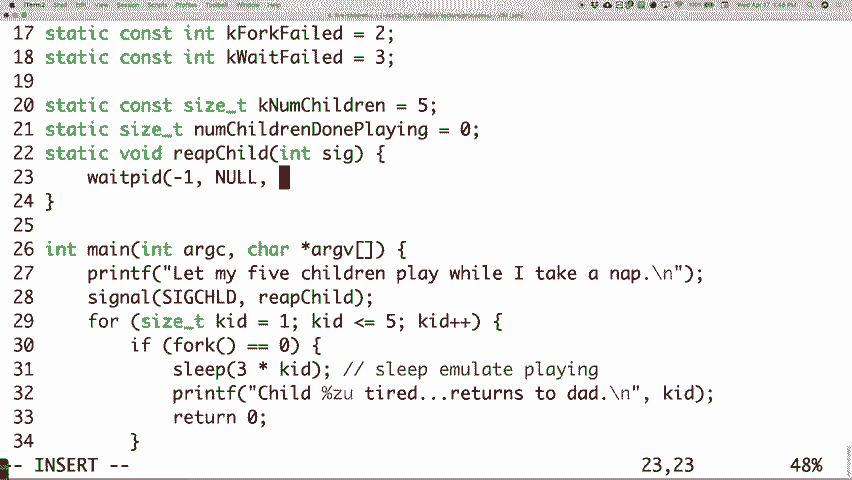
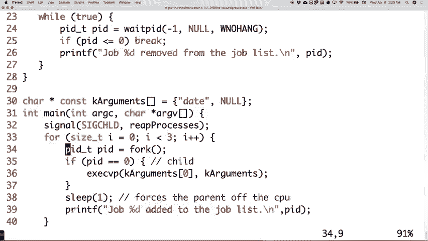

# 课程 P7：第七讲 信号 🚦

在本节课中，我们将要学习操作系统中的**信号**机制。信号是进程间通信的一种基本方式，用于通知另一个进程某个事件已经发生。我们将通过编写代码示例，深入理解信号的工作原理、信号处理程序的编写，以及如何应对信号处理中可能出现的**竞态条件**。


---


## 概述


信号是一种进程间通信机制，允许一个进程通知另一个进程某个事件已经发生。它不传递具体数据，只传递一个**信号编号**。本节课我们将学习如何设置信号处理程序，处理子进程状态变化，并解决信号处理中的同步问题。


---


## 信号基础





上一节我们介绍了信号的基本概念。本节中我们来看看信号的具体工作机制。


信号本质上是一种通知机制。当一个进程需要通知另一个进程时，它可以发送一个特定的信号编号。接收信号的进程可以预先定义一个**信号处理程序**，这是一个函数，当信号到达时会被自动调用。


**核心公式/代码：设置信号处理程序**
```c
#include <signal.h>
void (*signal(int sig, void (*func)(int)))(int);
// 例如，设置 SIGCHLD 信号的处理函数为 reap_child
signal(SIGCHLD, reap_child);
```


需要注意的是，信号处理程序无法接收除信号编号以外的其他信息。如果需要在进程间传递更多数据，必须借助共享内存、文件等其他机制。


---

## 处理子进程状态变化


在并发编程中，父进程经常需要知道其子进程的状态变化（如结束、停止）。`SIGCHLD` 信号就是为此设计的。


当父进程的一个子进程状态发生变化时，内核会向父进程发送 `SIGCHLD` 信号。我们可以在信号处理程序中调用 `waitpid` 系统调用来“收割”已结束的子进程，并获取其退出状态。


**核心代码：在 SIGCHLD 处理程序中收割子进程**
```c
void reap_child(int sig) {
    pid_t pid;
    int status;
    while ((pid = waitpid(-1, &status, WNOHANG)) > 0) {
        // 成功收割一个子进程，处理其退出状态 status
        num_children_done++;
    }
}
```
上面的代码使用 `while` 循环和 `WNOHANG` 选项，确保即使多个子进程同时结束，也能全部被正确处理，而不会遗漏。


---


## 竞态条件与信号同步


上一节我们介绍了如何收割子进程。本节中我们来看看信号处理中一个常见的问题：**竞态条件**。


竞态条件是指当多个事件（或进程）几乎同时发生时，其执行顺序的不确定性可能导致程序结果不符合预期。在信号处理中，这尤其棘手。


考虑以下场景：父进程 `fork` 出子进程，并将其加入一个作业列表。子进程结束后，信号处理程序会将其从列表中移除。如果子进程结束得**太快**，可能在父进程将其加入列表**之前**，信号处理程序就已经试图移除它了。

**示例：有问题的作业列表程序**
```c
// 父进程代码片段
for (int i = 0; i < 3; i++) {
    pid_t pid = fork();
    if (pid == 0) {
        // 子进程：立即执行命令并退出
        execvp(...);
    }
    sleep(1); // 父进程休眠1秒
    printf("Job %d added to task list.\n", pid);
}
// SIGCHLD 处理程序会打印 “Job %d removed from task list.”
```
运行此程序，可能会看到“移除”打印在“添加”之前，这就是一个竞态条件。


---

## 使用信号阻塞实现同步

为了解决上述竞态条件，我们需要控制信号的接收时机。我们可以使用 **信号集** 和 **信号掩码** 来暂时阻塞特定的信号，直到我们准备好处理它们。

以下是实现同步的步骤：


1.  **初始化信号集**：创建一个空的信号集。
2.  **添加信号到集合**：将 `SIGCHLD` 信号添加到该集合中。
3.  **阻塞信号**：在关键代码段（如将子进程加入列表）执行前，阻塞该信号集中的信号。
4.  **解除阻塞**：在关键代码段执行后，解除对信号的阻塞。所有在阻塞期间到达的 `SIGCHLD` 信号会被递延，此时才会调用信号处理程序。


**核心代码：阻塞与解除阻塞信号**
```c
#include <signal.h>


sigset_t set;
sigemptyset(&set); // 初始化空信号集
sigaddset(&set, SIGCHLD); // 将 SIGCHLD 加入集合


// 在 fork 和关键操作前，阻塞 SIGCHLD
sigprocmask(SIG_BLOCK, &set, NULL);



// ... 执行 fork、将子进程加入列表等关键操作 ...

// 关键操作完成后，解除阻塞
sigprocmask(SIG_UNBLOCK, &set, NULL);
```
通过这种方式，我们确保了“添加作业到列表”的操作一定发生在“从列表移除作业”的信号处理程序之前，从而消除了竞态条件。


---


## 其他相关系统调用


除了已经介绍的内容，还有两个重要的系统调用用于发送信号：


*   **`kill`**：向指定进程发送一个信号。
    ```c
    kill(pid, SIGUSR1); // 向进程 pid 发送用户自定义信号 SIGUSR1
    ```
*   **`raise`**：向进程自身发送一个信号。
    ```c
    raise(SIGTERM); // 向自己发送终止信号
    ```


`kill` 命令功能强大，除了发送终止信号，还可以发送任何其他信号。通过指定负数的进程组ID，还可以向整个进程组发送信号。


---


## 总结


本节课中我们一起学习了操作系统信号机制的核心内容：

1.  **信号基础**：信号是简单的进程间事件通知机制，通过编号标识。
2.  **信号处理程序**：我们编写了处理 `SIGCHLD` 信号的函数，用于收割结束的子进程，并学会了使用 `WNOHANG` 选项处理多个子进程同时结束的情况。
3.  **竞态条件**：我们认识了信号处理中由于时序不确定性导致的竞态条件问题。
4.  **信号同步**：我们使用 `sigprocmask`、信号集等工具阻塞和解除阻塞信号，确保了关键代码段的执行顺序，解决了竞态条件。
5.  **信号发送**：我们了解了 `kill` 和 `raise` 系统调用，用于主动发送信号。

信号是并发编程中强大但需要谨慎使用的工具。正确理解和使用信号，对于编写健壮的多进程程序至关重要。