# P8：Lecture 8 Race Conditions, Deadlock and Data Integrity - ___main___ - BV1ED4y1R7RJ

 All right， so welcome。 We have a presentation which you've probably heard when you were in 1Six B or 1Six X and。 1S7 and you're hearing it again。 This is Sonia。 She is one of the CS198 section leader coordinators and she is going to talk to you about section。

 leading。 How many section leaders do we have in here？ All right。 A whole bunch of you。 So people with your hands up， other people can ask questions of you as well。 Feel free to chime in if you have comments about this。 Look， when you were in 1Six A。 1Six B or 1Six X， there are these section leaders and they。

 were possibly quite important to your life。 It is an awesome opportunity。 I'm not going to steal Sonia's thunder， but I think it's a great opportunity to actually。 give something back to computer science and also improve your own skills。 Trust me。 when you teach something， you learn it much better than you do when you're just， like in a class。

 All right。 Over to Sonia。 Cool。 So who here has taken a 106 class here at Stanford？ Nice。 Vast majority。

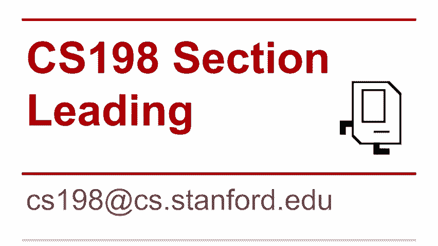

 Almost everybody。 So a lot of you know what section leaders are。 but they are undergraduate TAs who lead， sections。 And for this round of applications。 we're looking for people like you who have completed， 106B and X。 So we're looking for people from all sorts of different backgrounds。

 Like if you're a conflict major， great。 We want you。 I guess if you're a CS major。 which I'm sure there are lots of you in 110， we also want， you to apply。

 So do apply。 What do section leaders do？ You teach a 50 minute section。 You help students in the lair and teach them like good debugging strategies。 You grade assignments。 You hold interactive grading sessions。 So you get lots of one-on-one time with your students and you grade things and you get。 paid 17， 15 hours starting salary actually next year it'll be $18 an hour starting salary。

 And more of a seniority。 And you get to be part of a really cool community who has lots of fun doing things。

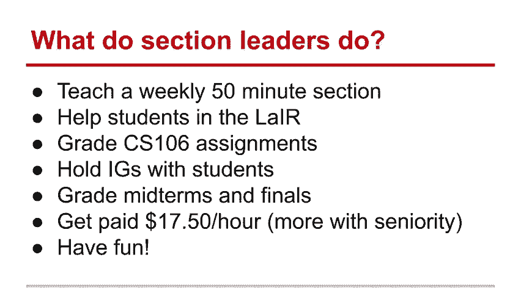

 So time and requirements， you'll need to section lead for two quarters。 So if you want to study abroad， that's totally fine。 We're cool with you deferring that。 Just let us know when you're applying。 And then in your very first quarter。 we want you to take CS 198 for three or four years。 And then we're going to Monday meetings。

 which are every Monday for 30 to 6 p。m。 And attend workshops in the very first four weeks that you're a section leader。

 Just because we want to get you oriented。 So why section lead？ Well。 teaching is the biggest and most valuable way as Chris said to master a subject。 And it actually helps you develop a lot of skills that come in use later in life if you。 want to go into management or if you want to just talk or if you want to be a mentor。

 Teaching is a really great way to hone those skills。 You also get an opportunity to work directly with students more so than in other TAShips。 that are available to you here at Stanford。 Because you've got these 15 minute interactive grading sessions with your students after every。 single assignment， you really get to develop a relationship with them and play an important。

 role in their education and their love of computer science。 You get to be participating in fun events and you also get to join an awesome group of。 people who really care about teaching well and teaching CS。 And then leave your mark on campus。 You can make a significant distance in a student's life。 So keep that in mind。

 These are some of the fun events that we do。 We dress up and help people debug their code and we also eat breakfast。 And then we also have corporate partnerships and we do special events just for section， leaders。 So yeah， we cooked things at Google and went on to boats in the bay once upon a time。 And also you can be like one of these people if you're a section leader。

 All of these were section leaders here at Stanford。 So I encourage you to become the next mayor on Zohami。 So the applications are open right now and they are due this Thursday at 11。59 PM。 And you can access them at cs198。stanford。edu。 Any questions？ Awesome。 Great。 We'll apply。

 Hope to see you soon。 Actually， can I add one last thing？

 If you have applied before in the past and didn't you， you can apply it。 Hope to see you soon。 I'd say that we really would love for you to apply again。 And in our interview process。 we care about making you better teachers。 So we're happy to provide you feedback。 So many section leaders don't get it until they apply two or three or four times。

 So I encourage you to keep applying and keep asking for feedback if you're interested in。 it but it hasn't worked out for you in the past。 Cool。 All right。 Thank you so much。 All right。 I think section leaders a great opportunity all around。 And like I said。 if you've applied before and didn't get it for some reason， don't let。

 that discourage you too much because many people try lots of time before they get it。 And that's the way it goes。 All right。 Thanks， Tony。 Okay。 So how's the assignment？

 What are we up to now？ How's assignment three going？ Going all right。

 It's such a tricky one。 I would say it's probably one of the longer ones， believe it or not。

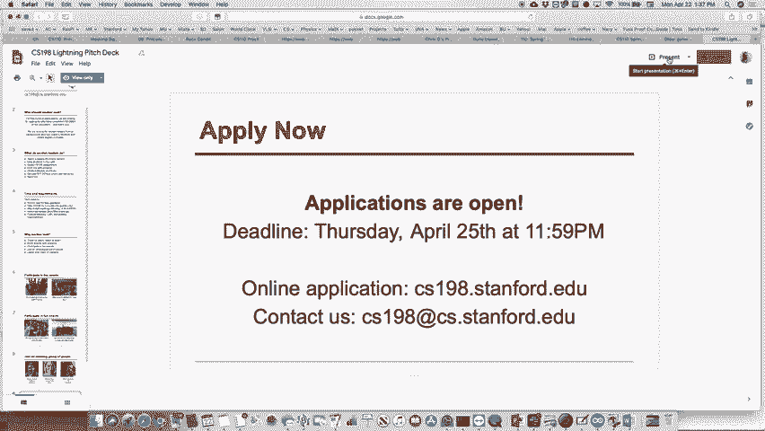

 There's lots of moving parts to it。 And I promised you I would talk about it today。 But I didn't prepare anything to talk about today。 Here's what I'll do。 I totally blanked that I was going to tell you about this。 The assignment。 Most of you。 many of you have already started it。 If you haven't， please do it soon。 Here's what I'll do。

 I'll tell you when I get home today， Ally is going to remind me this because she's going。 to send me an email anyway and she's going to send me an email about that。 Remind me in that to do a little video this afternoon about that。 Okay。 I'll post it this evening。 Okay。 But anyway， that'll be about the assignment。 Sorry， I didn't prepare that now。

 And where did this go？

 Are the box closed？ It did close。

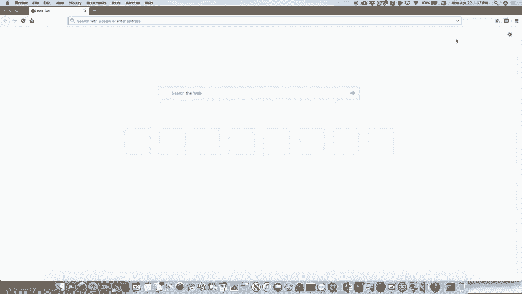

 All right。 So we are on to we're still talking about signals and signals can be tricky。

 Okay。 Processes which need with processes when they run with signals tend to have lots of race。 conditions and we want to avoid those race conditions。

 If we can， we have to talk about some of the places those happen， some of the times those。 happen and how to actually remove those race conditions or make it so that the race conditions。 don't happen because our logic is correct。 So that's what we're trying to do。 Speaking of not being correct， last Wednesday I misled you a bit and I apologize about that。

 One of the CAs was watching the video and goes， "I don't think you were right at the。 end there when you said this thing。"， And I went back and thought about it and I went， "Oh。 I can see why。"， Yes， that was wrong。 I can see what you're talking about。 Here's what I said。 I don't know if you remember this example from last week but what we did was we had， my pen。

 is not working again。 Hold on one second。 I'm going to try this one more time。 This and this。 I swear it was working before。 It might be。 There we go。 Let's try that。 So。 the example that we worked on last week was this example where we had a SIGCHILD that。 was that we had。 We signaled it and it's a special function that we call and this is how the signal handler's。

 work。 We say signal and then the type of signal and then the signal handling function。 What I said for this one， this was the one that printed out the job list and it said。 we had a problem with it to begin with。 First thing we said， "Wait a minute。 Sometimes when we add a job to the job list， it will say job removed from the job list before。

 it even gets to job is added to the job list because we've got this specifically， because。 we've got this crazy sleep in there。 We're saying before you even add it to the job list。 do some other stuff basically sleep。 By the time that wakes up。 the parent adds it to the job list after the process has already， ended。

 called the signal handler and said that it was removed。 We didn't like that。 When we have our logic so that a job gets removed from some job list before it gets added。 that's not really a good thing。 That just logically doesn't make sense。 Why？

 I didn't break our program because our program wasn't really breakable in that sense。 But it doesn't look right and if we had added more to it to actually add and remove jobs。 it doesn't make any sense to remove it before it's added。 What we did was we said， "Oh， all right。 There's this SIG PROC MASK system call which will allow us to block a signal and we in this。

 case we're going to block the set of signals which includes just the child process which。 means that that signal handler will not get called until we unblock those。"。 That's what's happening with this system。 We're basically saying， "Okay， look。 now we're saying only unblock after we print out our， message in the parent anyway。

 after we print out that we've added the job list。"， What I said in lecture the other day was， "Hey。 what happens if the child ends up sending， if the child let's say sends a message that says。 or the child process does this exec， cvp？"， Where is it here？ And in the， let's see。 I'm missing it here。 Oh， you know what？ Yeah， here it is。 Done here。 What is this？

 What if that process had its own children with the child signal handler to call them？

 What we get this weird job removed from job list when it wasn't even part of our program？

 And the answer I said was， "Oh， it depends， we would have to check it out and we'd have。 to block the signal。"， No， I was wrong on that。 Here's what happens and this is actually critical to understanding the actual workings。 of this system。 When you call exec cvp， your entire program that is already running in that child process。 is destroyed。 The new program is what starts running。

 So there is no longer a signal handler for the actual child process you created because。 by the time you do execvp， there are no more functions in that original process to begin， with。 So it doesn't really matter that the child has children process。 Now。 it does matter for block signals。 The signals get blocked across the exec cvp boundary as well。

 So we do want to remove the signal right。 Let's see。 We want to unblock when we go into the child。 So the child， if the child's program did have its own children， it wouldn't automatically。 have those children signal blocked。 Does that hopefully clear things up a little bit？

 The big idea is that exec cvp destroys everything in your original program so it's not like。 anything in the original program can get called again。 So that's what's happening there。 Okay。 All right。 So hang on。 Now this won't clear。 I think this tablet is not long for this world。 Hang on a sec。 Clear。 Okay。 We're going to do this。 And then clear。 There we go。 Okay。 All right。

 Back to here。

 So we're going to keep talking about some signals。 Okay。 The two signal question？ No？ Yeah。 When you call exec cvp， does that trigger itself？

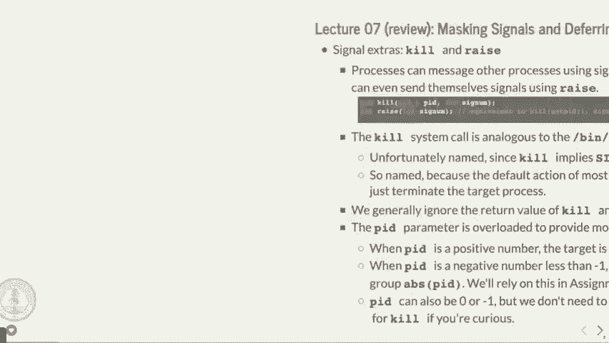

 When you call exec cvp， that does not trigger the significant child。 Oh， and this was a good quick。 That's a good point that I forgot to mention。 Somebody on Piazza said， "Oh， when exec cvp happens。 you get a whole new process。 No ID and all that。 You don't。 It's actually the same process ID that you started with in your child。"， Okay。 So to your question。

 when exec cvp happens， the child is still alive throughout the running， of that program。 When that program ends， the child itself ends。 Does that help？

 I thought that when you call the thing， it says it doesn't return。 When you do exec cvp。 it does not return， but it's still the child process。 And when that ends。 that's when your child handler gets called。 Good question。 All right。 So the other day I did mention two new kinds of system calls called kill and raise。

 Kill is a way to send a signal to another process or your own process， but you would use raise。 for that generally。 And you can send all the different signals。 and that's how you actually do it to notify， the other process that you actually are sending it to some signal。 You use the kill command。 Now， unfortunately， because of the naming。

 kill is not really named particularly well。 But let me just show you an example of how we might do this。 Let's do this first。 Man to kill。 Let's see。 So it's these two。 I always get these wrong。 These two handlers right here。 Okay。 And these two include Vim test kill dot， say。 actually we'll do test raise， we'll send it， to ourselves。 Let's see。 Okay。 That。

 And we will also pound include STD I O dot H。 Okay。 Int main。 All right。 Print F。 I am about to terminate my own process。 Sad face。 Okay。 And then we are going to use the raise command or the raise system call。 The raise system call just takes a signal that you want it。 So if we send say kill， that actually。

 we can say return zero， but we will never get， there。 Then we get there。 This will already be terminated。 And that should actually do it。 Let's see。 Make test raise。 Okay。 Test raise kill。 All right。 What happened was we sent a signal to our own process using the raise system call and。 it just terminated the process。 Okay。 We could have called it。

 We could have done other ones as well。 But that one will do that。 We did for instance。 let's try a different one。 Sig stop。 I think that might be the one。 I think that's the one。 Make test raise。 Oh， maybe it's not。 See。 Does it save an entire different sig？ Sig？ Did I spell it？

 Oh， it's not s t。 Oh， okay。 Of course。 Of course， I thought maybe they removed that。 Oh， too。 Maybe if I spell it right。 How about that？

 There we go。 Oh， it's even in red。 Okay。 So， oops。 Make。 Come on。 Ah， faster。 Sometimes the best lay plans。 Okay。 Test raise。 Okay。 Stop。 And then it actually stopped it。 So it is still running as it turns out。 Well， it's not running anymore because the program actually。 well， it will when I do this， it will actually say go back into it and end immediately。

 But Sig stop pauses your program， right？ And actually you use that for the Python program you're using in this week's assignment。 actually does that。 So the Sig stop， which you can send to yourself。 pauses your program in temporarily。 I think although I think it's a slightly different one that we're using。 Why is it just a FG command？ FG。 Good question。 The question is why is it FG continues to program？

 So once you have a background process， you can actually see all the different jobs。 FG puts one of them back in the foreground for you。 FG puts foreground。 That's where it goes。 Okay。 So if we， if we do test raise again and then it's in there， if I type， if I type jobs， I， believe。 yeah， there we go。 Just tells you there's one stop job。 I can run the other one too。

 And then now there's two stop jobs like that。 And so if I put。 I can put one one back and then put the other one back and now that just， starts and back up again。 Question 10。 Sleep keeps it in the foreground but sleep also put it in the background。 Sleep does keep it in the foreground。 So if we types just sleep like 10。

 it will keep it in the foreground and just not be running。 the program necessarily but not give back the problem， not give back the terminal access， to it。 Yeah。 Good question。 Okay。 Yes。 If you， good question。 So if you。 your question is if I'm like the child， my call， SIG stop on the parent does。

 the child affect the child or the exact CV。 If you're， no， doesn't affect that at all。 Once you have two processes， they can work independently of each other almost completely。 Right？

 If the parent can end first， the child can end first or completely independently in that， sense。 Yeah。 That's the， all right。 So that's the， uh， kiss， or the kill system call and the， uh。 raise system call and they， just are used to actually send these signals。 Okay。 All right。 Let's move on to， uh， some more signal handling especially handling things like race conditions。

 and another thing called spinning which is what we want to avoid and I will show you what。 that means as we get to it。 So remember the job， well， this is the program we just looked at。 the job list， uh， program， that we had。 The reason we needed the fixed version was to have that， uh。 SIG proc mask blocking our， SIG child until the time when we wanted it to actually work。 Okay。

 The SIG， the， the processes， okay， do have some control over SIG child signals。 Um。 and when you use the signal handling， the parent shouldn't need to do anything special。 to like handle children anymore outside of the actual， uh， outside of the actual signal， handler。 Okay。 Um， so and by the way， signals when you block them， you might think to yourself， oh， that。

 sounds draconian and whatever。 It's all about your process。 It's not like you're blocking things for other processes。 I mean， unless you exec CVP and so forth。 but potentially or ostensibly you know what， you're doing when you're writing your own program。 Um。 so it does seem somewhat draconian to do this。 Like I'm blocking this whole signal from happening。

 Well， you're writing the program so you get， you get control over that。 Okay。 All right。 So let's look at， remember the simple shell example and in fact， again， you're going to。 write a much more advanced shell， um， that we had。 Here's what it looks like。

 Okay。 I'll blow this up here。 All right。 So let's see， uh， the simple shell， um。 function actually does what it forks off of it。

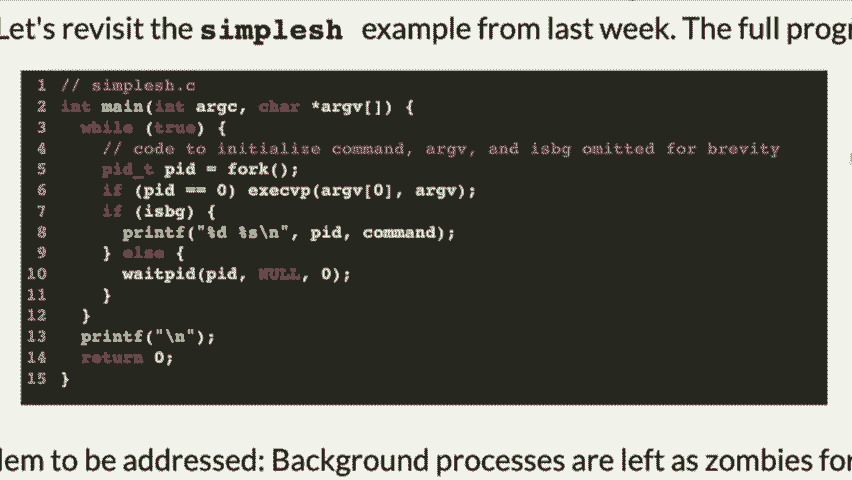

 Actually， this is， there's other stuff in here too， but it basically forks off as code that。 we don't have in there to initialize it man。 Uh， forks off in a process that you type in a command for and then if you type the ampersand。 on it on the end， it's in the background and so it ends up in the background and you get。 your shell prompt back。 If not， we've got this interesting weight PID in here for foreground processes actually。

 because the shell is waiting for the child to end。 When the child processes in the foreground。 the parent process wants to wait for it。 So that's why we have the weight PID here。 Okay。 Well。 once we have signal handling， maybe we want to change this a little bit。

 Okay。 Because we don't， we haven't had signal handling before。 So we did it in this kind of。 this method where we've got， oh， we're going to just wait PID。

 And by the way， when does the background process get cleaned up in this program？

 I'm seeing some head shaking。 Yeah， the background process doesn't get cleaned up in this program。 Okay。 So that's kind of an error on our part。 We didn't even know how signals work before。 So we didn't have signal handler。 So it was going to be impossible to actually do this。

 But you see how there is no weight PID for the background process。

 The background process prints the command that's in the background and then it goes back and。 prints another terminal and then it never again cleans up that process。 Okay。 Which actually means that it turns out that the， as long as that shell is running， that。 process is still not cleaned up。 Okay。 So it's kind of， I mean。

 it's kind of an error in the sense that it's like not freeing memory。

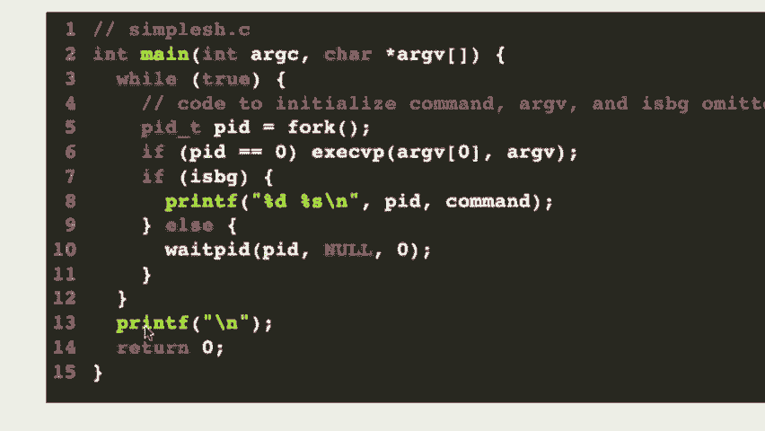

 that should be free and so forth。 So we want to avoid that if we can。

 Okay。 So let's change this。 Okay。 So let's actually look at our simple shell program again。

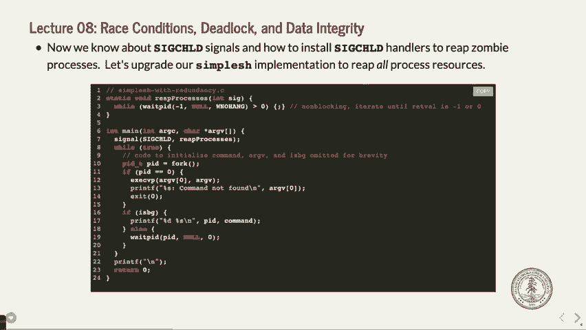

 Simple shell dot c。 Okay。 There are， let's see。 Let's see。 Do we have the actual， yeah。 This is the original here。 Okay。 And what we're going to do is we are going to add a couple things to this。 Okay。 We're going to， actually let me not use this one。 Let's do simple shell with redundancy。 Which is a， there we go。 Okay。 So now we're going to have a reprocess for our simple shell。 Okay。

 And we are going to， actually this is here。 I mean， now， gotten all that in there。 Okay。 We are going to change this so that we actually use that signal handler in our program。 Okay。 So what we want to do， okay， is we want to do the same basic thing as before。 Okay。 We're going to fork。 Okay。 And we are going to， oh， absolutely wrong。

 We should probably keep track of it。 P-I-D-T-P-I-D equals fork。 Okay。 We're going to fork in our process here。 Okay。 If we are the child， okay。 What are we going to do？

 We are going to exact CVP， argv0， and argv。 Now by the way， this is not error checking。 In fact。 let's do at least a little bit of error checking in here。 In other words。 if the exact CVP command fails， which could be just because we typed the wrong， command。 that would be bad。 Okay。 But so what we want to do is let's just print F， I don't know， %S， command。

 and then， not found or something like that。 Okay。 And then X at zero and something like that。 Thank you。 I need to tell what's going to be asked。 Do I， by the way， let's see， argv0。 Do I。 by the way， need to have some if statement in here to see whether or not the command， was not found。 Why not？ Because it will never get there if exact CVP actually works。 Destroys the entire program。

 Okay。 So anyway， so that's that。 All right。 Now we're going to have if is background。 Okay。 What we're going to do is we're going to just do the same thing as before。 Print F。 Okay。 %D， %S。 and， okay， come PID command。 Okay。 And we are going to do that。 Okay。 And this will get handled by the signal handler， which we haven't installed yet。 Okay。

 But what we want to do is if it's not in the background， okay， we want to call this other。 function called wait for the background process。 And I'll show you how that works in a minute。 Process， PID， and that。 Okay。 And， let's see。 Do I need one more in here？ Yep。 Okay。 And so。 so that's that。 Let's install a signal handler。 We're going to have a signal handler。 Oh。

 I guess I didn't put it up here already。 We're going to have a signal handler for reap processes。 Okay。 The reap processes signal is going to do the following。 Okay。 While true。 and things we've done a number of times for these signals。 Okay。 While true， PID， PID equals wait。 PID， negative one， because we don't know which one we're， waiting for。 W no hang。

 because we don't want it to actually wait for the return， because we don't like。 it when it waits long in a signal handler anyway， and we don't have to do this anyway。 If PID is less than or equal to zero， break， that means we either have it still running。 or something's across still running， or we don't have any left。 Okay。 And if PID equals， well。

 we are going to add a new variable， okay， to see which if we have， our child process。 Okay。 I'm going to call it FGID。 Okay。 And I'm just going to actually reset it to zero。 which is clearing it。 Or a brown process。 Okay。 This product， because we have the FPG。 we have to actually make it a global variable。 Okay。

 So we have to do something like static PIDTFG PID， oops， sorry， FG， am I doing a PID？ Yeah。 because we do FGPID foreground PID rather。 Okay。 Foreground PID。 All right。 And we actually will set it equal to zero， and it's got to be global because we need a。 way to communicate between our signal handler and our own。 Yes？ Hang on。 Over。 Thank you。 Right。

 There。 We'll get there。 There we go。 Okay。 So anyway， point。 Did I not do it right？ Yep。 Oh。 FPGID。 How's that？ Oh my gosh。 I'm losing it today。 Anybody have those kind of days？ FPGND， process ID。 That's what it is。 All right。 Oh man。 Okay。 Thank you for keeping me honest。 Okay。 So anyway。 now what have we done？ We have， we've said， okay， we've got this foreground process ID that we have to set in。

 our， in another function that we are about to create。 Okay。 Let's create a function。 Static void。 wait for foreground process。 PIDTPID。 Okay。 In here， what we want to do is。 let's see if I get this right。 F， G， P， I， D， equals the PID that we have。 Okay。 And then while F。 G， P， I， D， equals PID， we're going to do this weird thing where we're just。

 going to sit here and kind of wait。 Okay。 By waiting。 we're doing this thing called spinning as it turns out。 Okay。 So let's actually test this。 But this is basically， here's what happens。 Okay。 We're going to， if we're a background process。 we're just going to let the signal handler， take care of it。 Okay。 When it ends。

 If we're the foreground process， we are also going to basically let the， the back or。 the process handle。 Yeah。 So， if we're in C++， could you use this to do that？

 I don't believe you even could do that。 You might be able to。 I'm not sure。 So。 we're using that now， especially because we're in C。 Yeah。 Good question。 Okay。 All right。 So。 I think that is about it。 Let's see。 At this point， right。 So let's try it and see what happens。 And make simple shell with redundancy。 Okay。 All right。 Simple shell with redundancy。 Okay。

 So we can do LS and it gives us back our prompt after that。 We could do LS。 Let's just make this do up here。 LS。 Ampersand。 Okay。 And it should have put our little command down here all the way up the top。 Lots of stuff here。 There it is。 It printed out。 Simple。 It printed out the PID that just relaunched and then it immediately printed a prompt back。

 for us to do that。 Let's do one that's a little more reasonable。 Let's do， if we just do sleep 10。 it will sleep for 10 seconds in the foreground。 Okay。 And then when the， when the， when the signal。 when the child ends in this case， we actually， get the signal hang on。 We can do sleep 10 in the background and then now it's sleeping。

 And if we type PS actually we can see there's our sleep right there， our sleep command right， there。 In the background， we don't have too many issues。 In the foreground， well if we do this。 let's do sleep 100。 So it's just going to sleep 100。 What is our program doing？

 Let's go back and look at our program here because it's still sleeping by the way。 Okay。 Our program has now gone into， let's see。 Whoops， hang on。 Is this one in here？ Let's see。 Oh no。 you know what？ I might have jumped。 I might have jumped ahead a little bit。 Yeah。 I went to the wrong one。 This is with the race， with the race condition。

 If， let me， let me go ahead and show you that one here。 In this case。 what's happening is we're doing this sleep here， okay， or not sleep this spinning， here， okay。 which is happening because we are in the foreground process， the shell is。 would be the foreground process and the sleep is the foreground process so it's got to wait。

 for that， right？

 Now， I think we're still sleeping here， okay， look， yeah， we're still sleeping for 100。 If I open up another terminal here and go to the same myth， myth 55， all right， and whoops。

 yes， and then type this command called htop。 Notice something up there。 There's one process。 this is the htop program， I think I've shown you this before， shows， all， maybe I haven't。 shows all the different processors on the computer we're running on。 and it shows how much each core is being used。 One of them is 100%。

 the others are like almost nothing。 One of them is 100%， guess whose program it is？ Oh， it's simple。 so with redundancy at 100% CPU， which is my program， okay。 Well， why is that the case？ Well。 it's because it's spinning and it's actually sitting in this while loop going， and it finally。 ended by the way， and then now it's back to zero when the sleep 100 ended， okay。 Well。

 why is that bad？ Well， it's bad because unfortunately there's some poor like 107 students sitting over in。 next to the on a myth machine going， why is my terminal like stalled right now， right？

 Because you're running your 100% CPU thing。 Now， there's eight cores and they're not really because there's lots of other cores doing。 other things， but the machine might be heating up a little bit more and it's using that core。 that it shouldn't be， right？ We shouldn't be able to actually do that， okay。 And the question is why？ Like how do we get around that？ We will get to that， okay。 Oh， by the way。

 you can run， I'll have to install Htop。 You can't run it。 I installed it locally from my own machine， and I'll install it and send you guys an email。 about how to run that， okay。

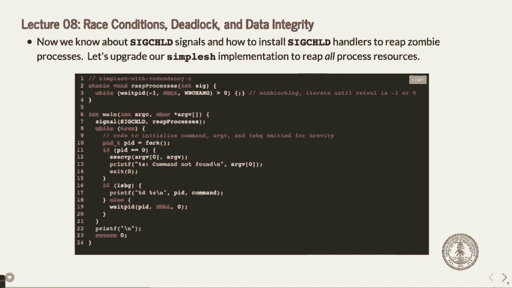

 The original one here that I skipped， okay， looks like this， this is if we wanted to remove。

 all the， or reap all the processes， okay， with this strange， with this extra weight， PID in here。 okay。 So this is kind of what we had before， all right。 We had this before where instead of。 or now we're actually capturing the child process， okay。 This gets reaped up here， okay， and the。 like it always， or like it would because we're， using the signal handler。 But down here。

 we have this strange like situation where we're calling weight PID without W-No， hang。 which means this is going to sit here and wait for the child to end， but we're handling。 it up in the reap processes。 In fact， that happens first。 The signal handler will get called immediately， handle the signal， it will return the correct。

 PID for the child process。 And then the parent， which is down here in weight PID。 actually the weight PID called down， here finishes with an error that says there are no more children left。 Isn't that a little strange？ Let me rephrase it again。 Down here。 we have said if the child is the foreground， we want to wait for it to end。 But instead of letting。

 well， we're letting the signal handler clean up the weight PID， clean up the child。 and then this one is getting kind of redundant because it actually gets。 called after the child handler cleans it up。 And then this one happens and you go， oh。 that seems a little logically on。 And you're like， no， this one's going to fail。 Now it works。

 but we'd like to do it a little bit better， which is why we kind of handled。

 the previous， or we kind of did it the other way。 What questions do you have on this one for a sec？

 Spinning is bad。 I'll show you what the， yeah， I jumped ahead and we did the spinning one first。 But the spinning is not good because it's a really tight， I'll show you what the spinning。

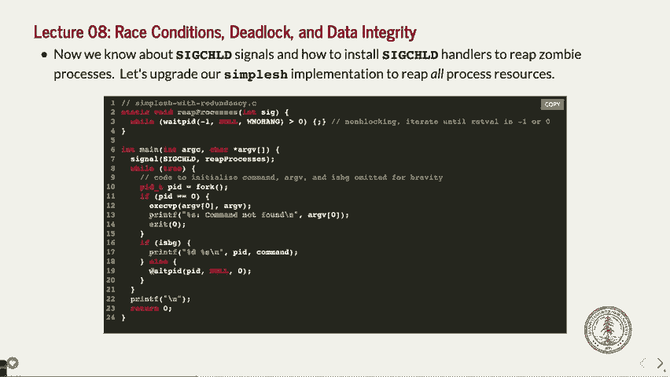

 one does。

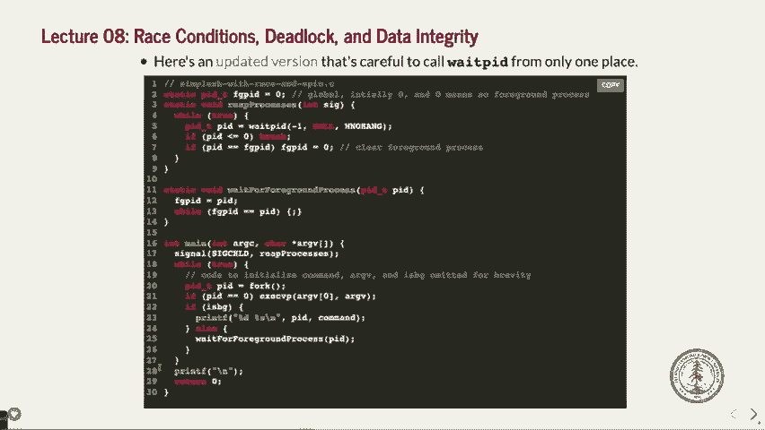

 And right here， what's happening here？ It's basically checking this global variable FGPID。 And if the entire time the child process is running， they are not the same because we。 set it equal to the， we set FGPID equal to zero and then the PID is the PID for the process。 And it just does this while loop again and again and again and again and again and again。

 and that's wasting processing time。 Because it's thinking it's trying to do something and the only reason the compiler actually allows。 this to happen is because we have a global variable in there。 Otherwise the compiler would go， wait。 this function is not changing it。 How can it ever not be one thing and it will just do it once。 So turn that while we're in an if statement and then not even run the way we want。 If you're in 107。

 if you took 107E you'd know all about that and we can deal with this， it， actually compilers says。 oh global variables， I don't optimize for those。 Does that answer your question about what spinning is？

 It's this tight little loop that's doing stuff that doesn't do any good for us。 We'd rather the process be off the process or altogether and have the kernel wait like。 make it actually do what it should be doing。

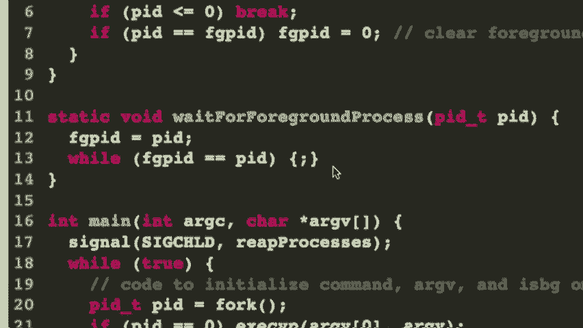

 Okay。 So that's that。 To be this other， to the previous one that I skipped here。 with this one where we have。

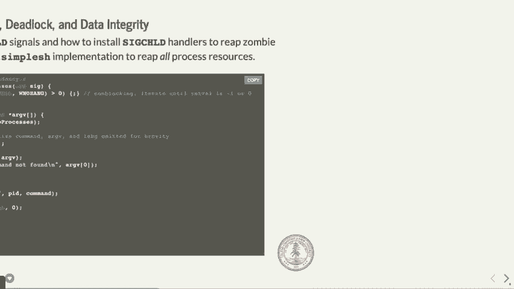

 this little wait PID， we definitely want to not have that wait PID happen once。

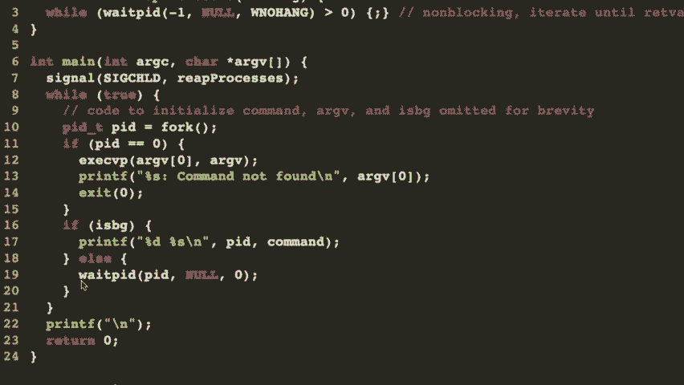

 We want it to happen or twice。 We want it to happen just once and let the signal handler take care of all of it。 Question。 You do not have to put volatile before the global variable。 Good question。 And if you've never heard about volatile， it basically just means that， oh， this variable。 is special， don't optimize it out because you don't know what's going on with it。 But no。

 you don't need to for global variable， at least for this compiler reason。 Yeah。 Okay。 So other questions on this one。 You get why we don't like to have wait PID in two places。 By the way， last quarter we asked a midterm exam question where the students could， if。 they wanted to， put the wait PID in two places and we took points off。 So be careful。

 You can do it like we just showed you before where there's one wait PID。 I'll show you how to get rid of that race condition in a second。 Okay。 But here's the race condition one。 What's nice about this？

 Well， okay， we're not actually doing any more wait PID。

 In fact， wait for foreground process。 The wait for foreground process function does not have any wait PID in it。 It's got this strange spinning loop which we want to try to avoid。

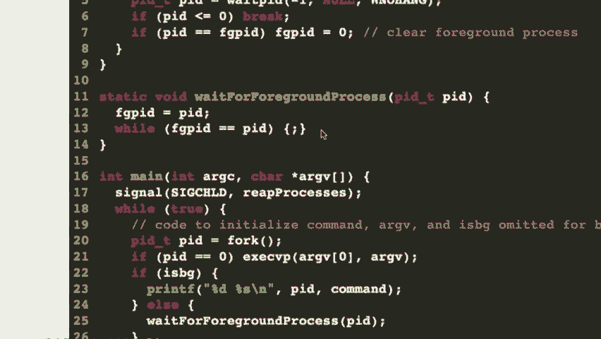

 But all of the children do get handled up here。 Now， more critically。 we actually have a bigger bug than the spin。 The spin isn't going to do anything except make your computer warm up a little more。 make the fans come on and make like your computer have less of a long lifespan because。 it's doing more work。 Right？ That's not the biggest deal in the world。

 The biggest deal in the world is there's an actual race condition in here。 Okay？

 Anybody see where the race condition might be？

 Race conditions happen when you're doing something where like you're forking and various things。 can happen before other things。 What do you think？ Anybody see a race condition here？ Yeah。 Yeah。 Yeah。 Yeah。 Yeah。 Yeah。 Yeah。 You're setting up the FBAG F in the second hand。 And you're checking it in wait for foreground process。 Why is that a race condition？

 What could happen first？ Like what could happen here？

 Let's think about the two different possibilities。 So you have an idea？ Go ahead。 Yeah。 The while up is not going to ever end， right？ If you have a slightly off。 slightly like interesting situation here。 Okay。 So let's walk through this。 F we fork。 Okay。 And then we exact CVP。 What if that was really fast？

 We did something that was super duper fast and the child ended。 Okay。 Well。 we would get up here into reaper process。 Let's pretend that before we ever even get to wait for foreground process。 Okay。 We actually go and immediately the child ends and we go up here and we reap the process。 Okay。 So what happens？ Well， it goes and it says， all right， well， let's see。 In this case actually。

 depending on what the previous PID would be， it wouldn't actually， matter。 So I guess it doesn't matter if it doesn't immediately。 But what happens if it doesn't here？

 And this is what you were saying。 If it doesn't right after this line right here。 So this line right here， okay， sets F， P， or F。 Let's see。 Is it going to be before that or after？

 I'm getting this mixed up now。 It is。 This is why race is just a hard。 It's always tough to remember exactly where it is。 If FGPID is set to PID and then FGPID equals here， right。 If the signal handler was called before that and gets down here and sets the FPGID to zero。

 at this point we would then set FGPID to PID and then this while it would never end because。 we would never get this set to zero again。 That's the issue。 Okay。 So basically we're saying that there's the race condition。

 Let me see。 Let me read it off here。 It's probably easier to hear。 If the foreground process finishes and reprocesses is invoked before normal execution flow updates。 FGPID。 If that happens， this is just going to spin forever。 So again。 we could end up here because the child process has already been reaped basically。

 between this line and or right before this line。 Right before this line。 The child process gets reaped。 It changes the PID to zero and then we updated here going to this while loop no more jobs。 to actually reap。 Right。 So that's probably that's the issue right there。 That would be a bad race condition to have。

 So how do we deal with this race condition？ Okay。 What we want to do is we want to actually remove that race condition using a different type。 of actually before we even do that。 Let's actually， let's actually， yeah。 We want to。 Yes。 We'll do this one。 We'll do this one right now。 This is where we're going to block the child appropriately like we did before so that we。 don't actually need to so we don't actually have that race condition at all。

 Just like what we did kind of before。 Okay。 So let's see。 Let's do it the same one in here again。 Oh， actually let's do it in different here。 Let's do it in simple shell with just leave the spin for now because that's not actually。 the most important one。 Okay。 We'll leave the spin in there now and we will reprocesses is not going to change。 Okay。 What we need to do down here is we need to block the signals like we said before。 In fact。

 we're going to have instead of doing the blocking like one line at a time where。 to set up the empty set and then set it to be or actually declare the signal set and then。 set it the empty set and so forth。 Let's have little functions that do that。 I'll show you those functions in a minute。 Okay。 So we are going to do this where。

 We are going to block the signals。 Okay。 Right after we get right before we do the fork。 Okay。 Let's block the child signal。 Okay。 All right。 There's a function that's going to do this。 I'll show you that in a second。 Okay。 We're going to block before we fork。 So therefore， the child。 the signal handler can't get called in the parent process while， the signal is blocked。 Okay。

 All right。 Then we are going to fork。 If the PID is zero， it's the child。 We don't care if that signals blocked。 In fact， we want it to not be blocked。 So we're going to call unblocked SIG child which is the other function that we're going。 to show you in a second。 Okay。 And then we are going to also unblock it if it is a background process because we don't。

 care about like there's no need to worry about the actual blocking there。 That's not where the problem is。 Okay。 It was the foreground process that we had the problem。 Okay。 Unblock SIG child here。 Okay。 It's a background process or the background process。 So we don't。 they're not going to be that issue。 Okay。 And then we've got wait for foreground process。 Well。

 let's look at wait for foreground process。 It's after we do the setting here where we want to unblock the SIG child again。 This should now like we're only lifting this after FGPID is set。 Okay。 That's what's happening here。 We've now got the blocking happening until the point where we don't need it anymore。 Now we can't get the， we won't have that raised condition。 Yes。 So when we。

 before we had the blocking of the blocking and FGPID is， is it all？ Uh huh。 Which is how that people are narrow in the first place。 How can like we ever wait for the condition on this before we set it to FGPID？ Let's see。 Your question is how do we actually race condition on it here because， well， let's see。

 When we are doing。 So this is in here until we call wait for foreground process。 And then if people get a wait for it。 And then， because it'll never be。 Right。 So what happens when。 what's that？ Sorry。 Say again。 When it。 When we first call it FGPID is zero。 And then it's a little bit of a little bit of a little bit of a little bit of a little bit。 Right。

 And then we call it a foreground process。 Right。 If the child leaves partially before that。 how do we have a rate of interest？ Right。 That is a good question。 The question is when do we。 or how do we actually have the race condition in there at all？ Let me check one thing here。

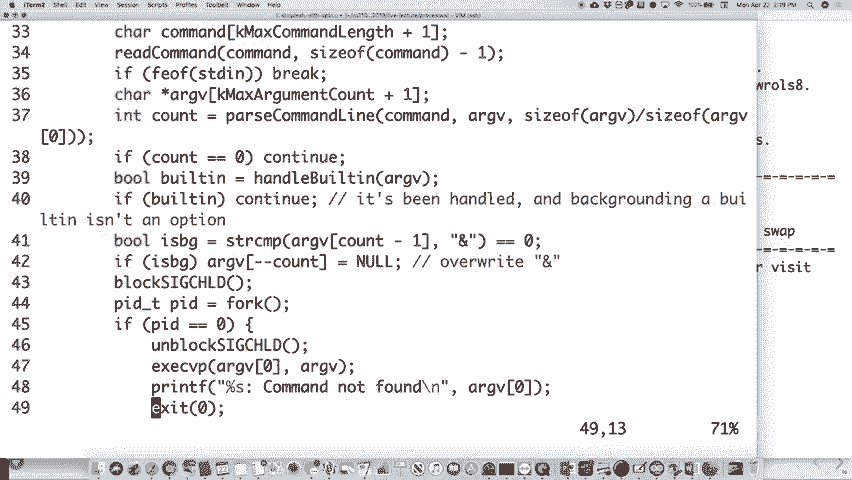

 I'm just making sure I don't， I didn't miss setting it。 Actually。 let's go back up in here and look again。 I think that's actually a good question。 Hang on。 Okay。 We are not setting it there， are we？ Oh， and the parent we're setting it， we're setting PID here。 Right。 We're setting the PID here。 Right。 Okay。 And then FGPID is still there。

 Let me get back to you on that。 I know this is a race condition。 You're right。 There's either one line missing or I'm not making it through quite correctly。 Good catch on that。 Yep。 I think that if you want to bring position occurs because of these processes， signal handler。 the ability to pull points。 So even though that different doesn't execute like designing a player again。

 Google never， says to zero after the end。 Right。 Good point。 Okay。 So here's the answer。 Good answer over there。 Okay。 The idea gets， or reprocesses gets called once when the child ends。 Okay。 All right。 Let's assume that the， let's assume that FGPID is still zero。 Right。 Well。 it's not going to reset it。 It doesn't actually， it's already， FGPID is already zero。

 So this is going to end。 Okay。 If that ends and then we set it here and then we do this while， well。 it's already ended， and then that's where it is。 Yeah。 Thank you for that clarification。 Yeah。 The race condition is in the case where we're waiting for the foreground process and it's， already。 it's already happened that the child is finished。 It was so fast that the child finished and then all of a sudden we're waiting。

 We're not doing that。 Yeah。 Good call。

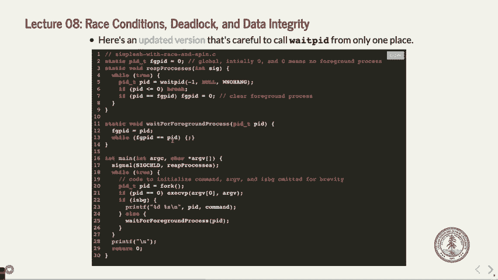

 Good call。 Now， why does this fix the situation？ Okay。 This fixes the situation。 This is the one that I just typed up here。 This fixes the situation because we're not actually allowing this。 wait the child handler， to get caught until after the actual FGPID sets equal to PID。 In which case it will get unset by the child handler and then we will go out of the while。 Yes。

 Question。 Do you imagine a blocking works so that the child process is pretty much finished but then。 you can kind of place this holding on sending out the signal？ Yes。 Good question。 How does blocking work？ Does the child process just wait around if it can't send the signal？

 It's the kernel that's sending the signal and the kernel knows that the child process， ends。 It wants to send a signal to your parent process but your parent process says I'm not accepting。 that signal now so the kernel will just wait until it gets on block and then send the signal。 The child finishes and doesn't and it's fine。 It just hasn't gotten cleaned up yet but the child is done and then eventually the parent。

 says now you can send the signal and then that's when the kernel says okay here's your。 signal immediately at that point。 Good questions。 All right。 Stuff is tricky。 Other questions on this one？ Let's get real。 Oh here's those two signals or those two functions actually there's three functions here。

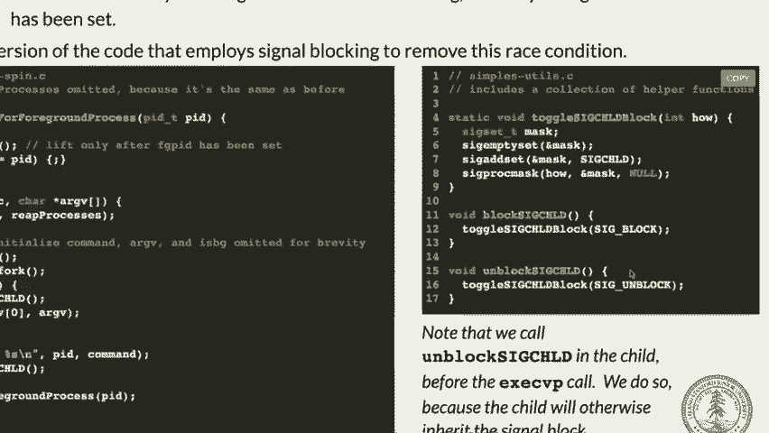

 You can do toggle SIGCHILD block which is a little more advanced or you can and this one。 we are calling from block SIGCHILD and we are calling from block SIGCHILD。 Okay。 What is it doing？

 It's setting the signal set to some mask or setting it's creating it and then it's emptying。 it so it's basically initializing it and then we are adding the mask itself。 We're adding SIGCHILD to the mask by doing add set and then we are either blocking or。 unblocking depending on how we call this function the signal。 That's it。 Yeah。

 Why do we call block SIGCHILD before we fork？ Are you saying we could call it after we fork？ Yeah。 This is a good question。

 We probably could do this。 Well no we can't actually it turns out we can't。 Here's what happens。 Remember we're talking about a race condition here that could happen really fast。 If we wait to block down like after the in the parent yes the parent will be the only。 thing that gets blocked but it might already be too late。

 The child might have already ended and called the signal and the signal hand or sent the。 signal handler happened。 Yeah。 So we have to block before even fork because we don't want the child to end before we can。 allow the parent to be ready for it。 Good question。

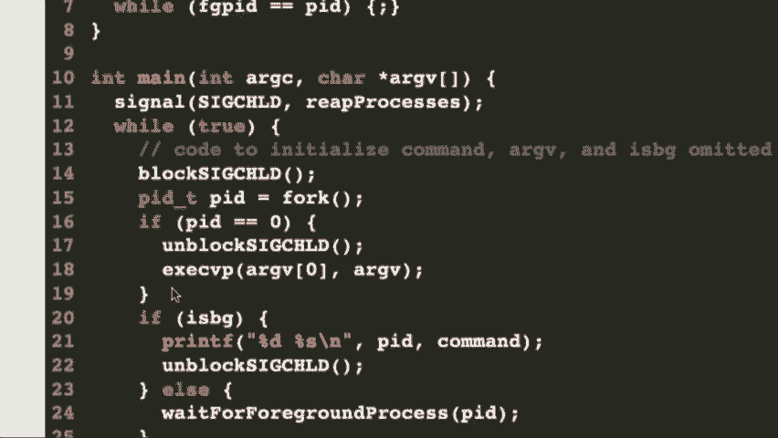

 Got a very good question on that。 Any others on this one？ Okay。 Let's take care of that spinning issue that we had。 So the race condition is gone。 We want to do the unblocking in the child because we don't like having that signal block。 in the child but we already set it in before we fork so it is set。 Let's unblock it。

 Then we still need to deal with this spinning。 We could do something like this。 We could say while FGPID equals PCCLE SPEDI sleep or micro sleep as this one is called， for 100。000 microseconds。 Then that would actually work okay。 I believe micro sleep actually does not wake up when a signal happens。

 That would kind of not be the best thing anyway but we would just wait and then the。 child would end and then eventually sleep would wake up and we go， "Oh， we changed anything。 and then we do that。"， The sleep at least takes it off the processor。 So that would work。 It's just not particularly elegant。 It would work though。

 So we really want to keep the OS like the OS can figure out when our child process ends。 So we might as well utilize that。 What else could we do？

 There is a pause function which actually would also have， might work。 The pause function forces the process to sleep until some unblock signal arrives。 Well， that's nice。 This says， "Okay， so now we are going to just wait until an unblock signal arrives。"。 The problem here though is that we have a situation， another situation where we have。

 a race condition and we could end up in this thing called deadlock。 That's the situation that we would have had in the previous race condition too where， well。 it's a little bit different。 It's basically one process is waiting on the other which is waiting on the other process。 and now we have two processes kind of waiting on each other。

 That's considered deadlock where you don't have to have some logic that actually figures， that out。 So you could try doing this with a pause but that might put it into a situation where you。 won't actually， if we had the following， if， again， if the signal arrives after the FGPID。 equals PID but before the call to pause， well， then what's happening。 The pause says， "Okay。

 I'm waiting for the signal handler saying， 'Oh， I've already。 been hit it so it's not going to actually end up working。'。 And you could try doing some like unblock and then block but you still got the problem。 because between unblock， SIGCHILD and pause， isn't there some time for something else， to happen？

 Yeah。 So we want a way to make something work so that we say basically， 'Look， we know you're。 going to be put off the CPU。 We know this process is going to wait。 We know we have to unblock some signals。 Let's make it so that that happens after we are guaranteed that the process is already。

 off the CPU。'， Okay。 How do we do that？ Well， we have this other system call called SIGSPEND。 And SIGSPEND does the following。 SIGSPEND says， 'Oh， okay。 We are going to unblock signals。'， Okay。 Or I guess we're going to basically set this other block set which we can make the empty， set。 Here we remove the process from the CPU so that it can't have this weird deadlock condition。 Okay。

 So that's what's happening here。 What we do is we say this。 We set up another signal set and we make it empty and we actually just set it to empty。 but don't change anything。 Here's what happens。 Okay。 We say， 'While FGPID equals PID。 we are going to say SIGSPEND on the empty set。'， Now remember， at this point。

 didn't we already blocked the signal for SIGCHILD？ It's already been blocked before。 We did it before。 We even forked。 Okay。 So the SIGCHILD is blocked。 When you say SIGSPEND， it says。 'Oh， okay。 I'm going to unblock all the signals after I push the processor off the processor and。 therefore it's going to wait until that child actually happens and then when the child happens。

 the SIGSPEND wakes up after the process the child handler happens。 Question。 [inaudible]， It un。 Good question。 It blocks。 It says， 'Set the signal set that's blocked to this set。'， Right？

 So when you say 'Set it to the empty set，' it means no signals are blocked。 Now you might have a situation where you need some signals to remain blocked and you can， do that。 But in this case， we're basically saying， 'Okay， fine。 Well。 the SIGCHILD is blocked before this while loop。 Get into the while loop SIGCHILD is still blocked。

 You call the SIGSPEND system call and it goes， 'Oh， okay。 I am now taking the CPU。 the processor off and waiting until that SIGCHILD happens。 Now I'm unblocking and so if the SIGCHILD happens， it will be able to run in the child。 handler and then after it finishes， it will come and stop this SIGSPEND。

 Go back in the while loop and then we will have already changed FGPAD to have changed。 FGPAD back to zero and we're done。 Okay？ Now I'm seeing some people going， 'No， what's going on？'。 Seeing a few different， like， 'What's happening here？'。

 What questions？ Yeah， yeah。 Yeah。 [inaudible]， Yeah， SIGCHILD is kind of like pause in that it says。 'Okay， wait until it's blocked。 The SIGCHILD handle happens and returns and then you can keep going。 Wait for some signal basically。 [inaudible]， This one， yeah。 So the SIGSPEND is a little bit strange。 It says， 'Set this block signals to this set which we are unblocking。

 We're unblocking the SIGCHILD in this case because of this empty set and we're saying。 'Unblock that SIGCHILD after we've moved to the process， off-process so there's no race。 condition there anymore。'， So it will now unblock it。 The child handler will just wait until the child handler happens。 Child handler will do its thing。

 Change FGPAD to B zero and then it will return。 This line will say， 'Oh。 we've now got that signal so now we're going to go back up here， and change that。'， Okay？

 Now you might be asking yourself one sec。 You might be asking yourself， 'Wait。 why do we even need this while loop in here？'， Because if we're going to wait for the signal。 why do we even need to do that？ It turns out that any signal that gets handled will cause this SIGCHE SPEND to end。 And so you need to， you want to say， 'Oh， well， in that case let's make sure that we。

 check again to see if our condition that we were supposed to set got set。 If not。 we'll just loop again and do another SIGCHE SPEND。 Question。 That was your question。 There you go。 I asked it before you got to it。 Yeah？ [inaudible]， Yeah， let's see what's happening here。 Remember。 we， well， okay， what have we done here？ We are a foreground process。

 which means the parent needs to wait for the foreground process， to end。 Okay？

 We have blocked the signal child handler at this point。 We've come into here， okay。 and the signal child， the child could have ended already， but it's been blocked。 So it's not a race condition in that sense。 We now say， okay， great。 FGPID equals PID。 So we're saying that there's a foreground process。

 We want to set these two equal and then the child handler will unset， like， unset FGPAD。 Okay？ Well。 then we say， okay， we're setting up the signal set to be this empty set。 We say。 while FGPID equals PID， is that going to be true the first time through， even though。 the child has ended？ Yeah， it will be true the first time through， which is fine。

 Then we will do SIG suspend， which is going to push the parent process off the processor。 because it's waiting for the child process to end。 Okay？ That handler to happen。 It calls。 it unblocks the signal after the process is off the processor。 At that point， the child has ended。 it calls signal handler， changes FGPID to be zero。 Well， and then it ends and it wakes up here。

 it goes back in this while loop and says， oh， okay， now I've got zero is not equal to the PID。 I can end and then I can unblock SIG， child again。 By the way。 when it comes out of this SIG suspend， it reblocks the things that it would， block before。 And that's the only， the good thing about that is so this while loop will actually work， again。

 Lots of good， like， questions on this。 Yeah， good question。 Do I mean when I push off the processor。 push back in the OS scheduler， we haven't talked， about the schedule itself， but yes。 it basically means put the parent process to sleep。 And when the parent process is to sleep。 there's nothing else happening in the actual code， here until that signal gets handled。

 Why does the really unblock SIG child？ We have to， because when SIG suspend ends。 it unblocks the signals。 It puts back the original set。 Yes， good question。 So it reblocks in that case， reblocks the signals。 Yeah。 Yeah。 Well。 the while loop ever iterate more in one time。 Let's see。 It shouldn't for this one child process。

 Yeah。 Now， unless some other signal came in and then it happened to un-suspended。 So it could happen more than once if another signal came in that happened to un-suspended。 Does that-- does the suspend happen until any signal gets handled？ Yeah。 Now。 if you were making this much more robust and you care about other signals， you might。

 not want to make it just the empty set and so forth， but we don't care about any other。 signals right now。 That's fine。

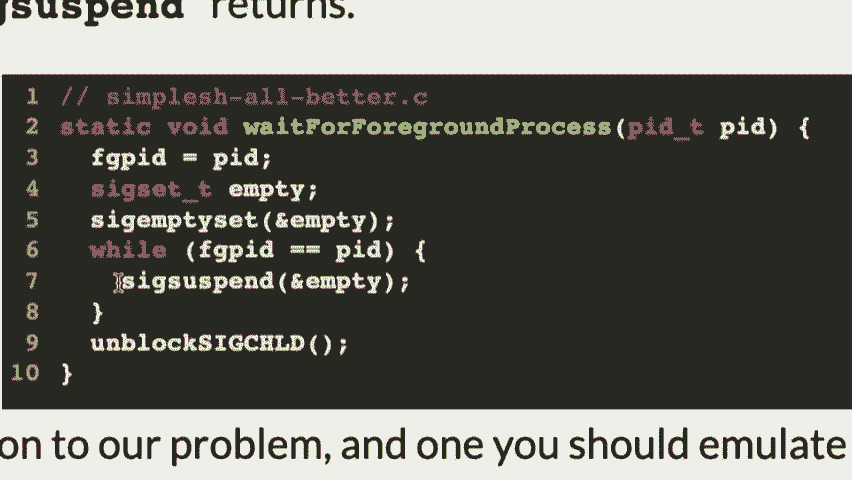

 Okay。 That's a lot of stuff。 That one thing。 You will use this extensively in the assignment three farm。 which you are going to， which you're， working on now in that assignment four。 Not extensively。 but you use some of these as you go through these。 Okay？

 It's hard to reason about these things sometimes。 Okay。 Let's do this。 What I wanted to do is go through a couple questions。 Now， unfortunately。 you have a midterm and a week and a half。 Unfortunately。 Nobody likes midterms。 We don't like grading them。 You guys don't like taping them。 We should just get rid of them。

 But there's lots of barriers to that。 But if you have good ideas， certainly let me know。 Let's go through a couple of questions。 We have about 15 minutes， so we can get through these。 I think。 Let's go through a couple of questions related to signal handling that you might see on the。 midterm。 In fact， the two questions are from previous midterms。 Okay？ So， here's the problem。

 Consider this program and its execution。 Okay。 Assume that all processes run to completion and all system calls and all print F succeed。 et cetera。 Don't worry about any errors in this case。 And assume that all calls to print F are atomic。 Atomic means that it happens without anything else being able to interrupt it。 Okay？ So， in other words， if you're printing out ghost or pirate， which is what we're printing。

 out here， you can't have it interrupted in the middle of the。 Pre-enter the P and pirate。 It's not like a signal is going to happen。 Okay？ And， like， interrupt it。 Okay？

 This is actually more or less true for print F。 Okay？ Print F will print out its whole， like。 stuff before any other print F can get in there and， print stuff out。 So。 it's generally a good assumption in this case。 It's not true for C out。 which is why we had to write a little external function for， C out to make that work。

 But that's what you have to assume here。 Okay？ You just can't assume anything about scheduling or how long a time slice is or whatever。 You can just look at this and go， "Hey， what can happen in this program？

 What conditions could this program happen if anything happened in any order according。 to the rules that we have for our processes？"， Okay？ Here is the program。 Let me do this。 Let me bump this up and go to this program here。 Okay？ We've got a main function。 It sets up a SIG user 1 signal。 That's just a signal that we can use for whatever we want。 Okay？

 We can send a SIG user 1 to another process。 In fact。 we're going to send it to our child in this case。 Okay？ We。 The back function is the function that we are actually calling as our signal handler。 Then we're printing pirate and then we're exiting。 Okay？ First question， by the way。

 Is this function happen in the parent or the child？ In the parent。 Okay？

 It's not happening in the child。 Sorry。 The pen's who gets called。 Right？

 Depends who gets it as it turns out。 So that's a trick question I suppose。 Right？

 What if it was a SIG child handler but it's not a SIG child handler， it's anything that。 ignores a SIG user 1 handler which means we are sending it。 So， pens who is calling it。 And who's receiving it。 Okay？ We are setting up the signal handler。 The fork means that both the parent and the child will have a signal handler。 But in this case。

 as you'll see it's just。 It turns out it's just the child that's actually getting a signal。 Okay？

 All right。 Okay。 So then it's going to fork and then if we're the child。 we're going to print ghost and return， zero。 And then if we're the parent。 we're going to send the kill signal with SIG user 1 to the。 child and then we're going to print ninja and then return zero。

 Okay？ All right。 Can you say then what does kill exactly the。 Yeah， good question。 What does kill exactly do？ It sends a signal to a process。 Would the send SIG user 1 or send SIG to it？ In this case it sends SIG user 1 to the process PID。 Kill is not a good name for the function。 Okay。 So raise it to the send sort of style。 Yeah。

 Raise means send it to ourselves。 Yeah。 Kill means send it somewhere else。 Say kill。 get PID and send it to yourself。

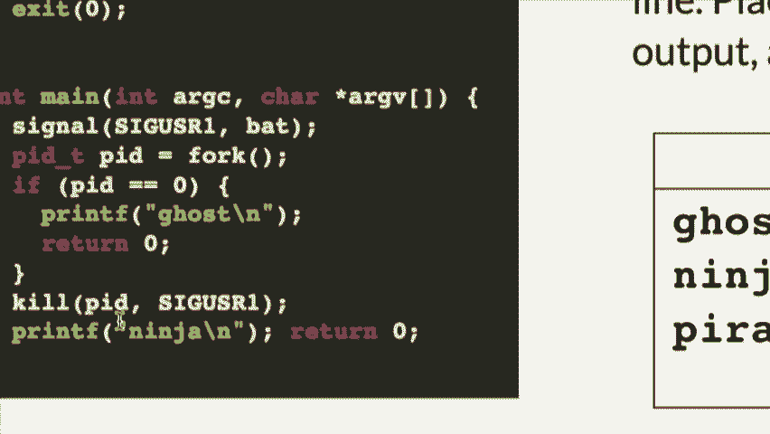

 But raise does that for you。 All right。 Now， question is， right yes or no。 if there's a possible output here。 Okay。 And we can go through this and check and see。 is it possible for any of these outputs to， happen？ Okay。 Well， let's see。 What would make it true that ghost ninja and then pirate happens？ Okay。 Let's see。 No。

 for ghost ninja， I'll make it big there。 Okay。 For ghost ninja and pirate to happen。 Well。 how do we get ghost first？ Okay。 We fork and then this happens immediately。 Could that happen before anything else happens？ Sure。 It looks like ghost could be printed immediately。 Okay。 Then for ninja to happen， okay。

 we send a kill signal。 From parent， we send a SIG user signal using the kill system call。 We send SIG user， okay， to the child， okay。 And this can return immediately by the way。 It doesn't wait for the child to do anything。 It just sends it in returns。 Could we send off that signal and then really quickly print ninja？ Sure。 In the child。

 we have now had our signal handler called。 So can we print pirate and then end？ Yeah。 So I think this one is fine。 Anybody have any questions why it's not？ Yeah。 That doesn't have to have the kill signal or like the kill call to turn before the child。 is done or not。 Oh， good question。 This would have to happen between after this and before this。

 Yeah， that could happen。 We don't say there's no reason it couldn't in this case， right？

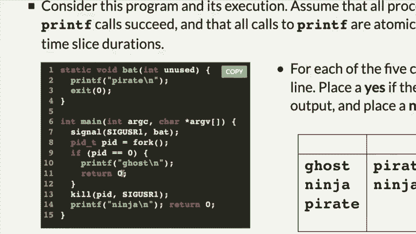

 We're looking at there's no reason that couldn't happen。 Okay。 Let's look about pirate and then ninja。

 Let's see if that one's possible。 Okay。 For pirate to happen。 we would have to fork send a kill signal before the child gets a， chance to print ghost。 Is that possible？ Sure。 It seems possible， right？ And then that will get。 we'll call the child's signal handler， print a pilot， print pirate， which is good。

 And then that'll end。 And then we get， we're still over here。 Then we could have ninja print at some point。 That makes sense。 Okay。 I think that's plausible。 I think that's a couple plausible ones。

 Let's look at the next one。 I'll make this done。 How about ninja and ghost？

 What if bat returned instead of exited， then you would definitely get ghost at some point， in there。 right？ Because it exits， right， and doesn't return， it exits the actual signal， the child itself。 It closes， it's terminates the child process by using exit。 Good question。 Good call。 Okay。 Let's look at the next one。 Ninja and ghost。 How could ninja happen before ghost？ Well。

 we could get down here， let's say that the child is just slow right now。 We get down here and we send this signal。 Okay。 So， how could it happen that this signal。 which is going to signal the child， say， pirate， could it happen that this signals and then gets up here and then this prints and returns。 but then this never happens？ No， I don't think that could happen。 Right？

 Because the minute this signal handler happens， it stops everything happening down here。 So if you were to get that case， right， where you were trying to get ghost happening， right， well。 this has to happen before this happens and therefore you're going to get the signal。 called up here and you're going to end up getting pirate before you're going to get ghost。

 So it's not really possible for ghost to happen without having the pirate happening if， you call。 say， if you do a signal first。 So no， I don't think that。 Yeah？ We know that， we know that。 but the call to show has to happen right there， but we can。 actually know anything about when this title actually misses。

 The signal is like what if you send the signal， the ninja gets printed out and then the cross。 and then when the child crosses out the print is out there， it's that there's some reason。 it hasn't received the signal user yet。 Right。 So the signal happens immediately。 It's the next thing that happens。 So even if it got to print ghost。

 it would still have the signal called actually and then， have to go up and print pirate。 So I think you're not really going to get， remember we can't say that， oh， these two are。 going to happen next to each other， right？ But we can say that the signal will definitely。 if that got printed， right， well， by the time， back I printed， if this had already been printed。

 that signal had already been sent。 So the fact that signal got sent at all means that even if this printed。 it would have to， then go and do the pirate because it would never get to the return zero。 Does that help？ Yeah。 Yeah。 Yeah。 Yeah。 Yeah。 Yeah。 Yeah。 Yeah。 Yeah。 So signal handler stops。 Because， again， this is kind of my question earlier， which one is happening， this happening。

 is happening in the child in this case。 The signal handler， the child is one process。 It can't have two things going on at once。 So it's either doing the signal handler or it's doing the rest of the program。 And if it's doing the signal handler， the rest of the program is not happening。 Yeah。 What if you had ghost and then it returned and then you tried to send it to signal handler？

 If you had ghost and then it returned， so returning from main is going to call a closed， program。 It may take an instruction or two after that， actually。 But I guess there's that。 but that wouldn't happen in this program。 You see why？ Because you send this kill signal。 even if it's too late to do this ghost one， it's going， to happen before the return。 Okay。

 Because that， because it happens， the instant you send it and it's not like the return， the。 problem， the kernel is going， oh， I guess there's a signal I'm sending it immediately， to the child。 If it did return， if after printf goes， if it did return， there is some time in there。 still where the signal handler could still get it， still happen， but probably not very， long。

 Return goes， your return does not like immediately stop the program。 No， exit does。 Exit's like we're done。 Yeah。 In the second one， why wouldn't it go since you're getting it？

 Why wouldn't ghost print after ninja？ Let's see， pirate does exit the。 it actually stops the child from happening， being， it， terminates the child completely immediately。 Process is done。 Yes。 Good question。 Yeah。 So the second one， why would you return zero also？ Again。 returning zero does， it does work eventually， but there's actually a little bit。

 of time between return zero and the end of the program。 There's some more cleanup that's actually involved。 You actually propagate。 it's actually a different path through the， going back to the shell as， it turns out。 It's not returning， a function calls mean。 When you say exit。

 it actually never returns to that calling function as it turns out。 It just ends it immediately。 More or less。 I mean， there's still a little bit of time in there， but it ends it immediately。 You can think of it that way。 But it does not return from the。 I guess the bigger thing is it does not return so that， this could ever get printed。 In other words。

 exit zero never makes it， it means it never makes it back to the parent， at all。 so this couldn't get printed。 Right？ Okay。 All right， we've got two ones。 Let's look at the other ones here。 Could we do ninja pirate ninja？ No， that's silly。 Ninja pai。 Ninja pai， you can't get to， you're not going to get to there。 Could you get ninja pirate ghost？

 Ninja pai。 This is what we were kind of talking about before， right？ Ninja pirate ghost。 Well。 ninja and then pirate and you'll never get back to here if you have set the， if the， pirate happens。 you'll never get back to the other part of the job process。 Yes， no， no， yes， yes， no， no， no。 There we go。 All right， there's another one that I don't have time to do today， but another midterm。

 and we'll start with this one on Wednesday。 It's another race condition one。 Feel free to look at it if you want to， but it's another one from the midterm。

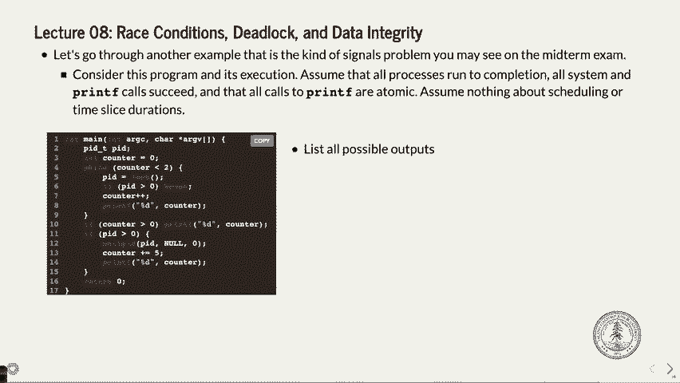

 See you guys Wednesday。