# P8：讲座8 竞争条件、死锁和数据完整性 - ___main___ - BV1ED4y1R7RJ

好的，欢迎大家。我们有一个介绍，可能你们在1Six B或者1Six X时听过，1S7你们也听过，这次你们还会听到。这是Sonia，她是CS198小组负责人协调员之一，她将向你们介绍小组负责人工作。

领导。这里有多少位小组负责人？好吧，举手的人有很多。那么，举手的人，其他人也可以向你们提问。如果你有关于此的评论，随时可以插话。看，当你们在1Six A、1Six B或者1Six X的时候，那里有这些小组负责人，他们。

这些工作可能对你们的生活非常重要。这是一个很棒的机会。我不想抢Sonia的风头，但我觉得这是一个真正很好的机会，能回馈计算机科学，也能提升你们自己的技能。相信我，当你教别人时，你学得比仅仅上课时要好得多。

好的，接下来是Sonia。很酷。那么这里有多少人参加过斯坦福的106课程？不错，大多数人。

几乎每个人。所以你们大部分都知道小组负责人是什么，但他们是本科助教，负责带领小组。对于这一轮的申请，我们在寻找像你们这样已经完成106B和X课程的人。所以我们欢迎各个不同背景的人申请。

如果你是冲突专业的，太好了。我们需要你。应该说，如果你是计算机科学专业的，当然我知道110课上有很多这样的同学，我们同样欢迎你们申请。

所以请一定要申请。小组负责人做什么呢？你将带领一个50分钟的小组课程。你会帮助学生解决问题，并教他们一些好的调试策略。你还要批改作业，主持互动评分会议。所以你会有大量的与学生一对一的时间，并且批改作业，还能拿到薪水，起薪是17.15美元每小时，实际上明年起薪将会是18美元每小时。

还有更多的是资历问题。你将成为一个真正酷的社区的一部分，大家在这里做事情都很开心。

所以，时间和要求，你们需要担任小组负责人两学期。所以如果你想出国留学，完全没问题。我们很支持你们推迟这个。只要在申请时告诉我们就行。然后在你们的第一学期，我们希望你们修CS 198，为期三到四年。接下来我们会有周一的会议。

会议时间是每周一，下午3点到6点。并且在你成为小组负责人后的前四周，参加工作坊。

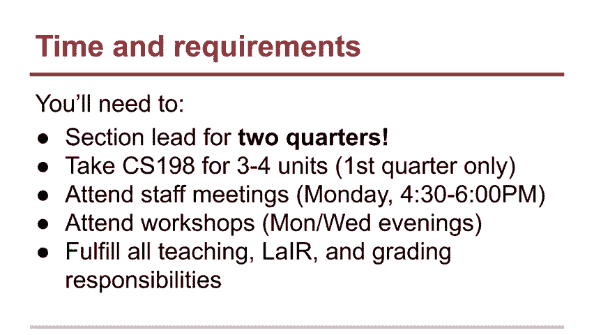

我们之所以想让你们了解这一点，是为了让你们有个更好的定位。那么，为什么是小组负责人呢？嗯，正如Chris所说，教学是掌握一门学科的最大和最有价值的方式。它实际上还帮助你培养许多将来在生活中派上用场的技能，无论是你想进入管理层，还是想进行公开演讲，或是想成为一名导师。

教学是提升这些技能的绝佳方式。你还将有机会直接与学生合作，远超过你在斯坦福其他助教岗位上能获得的机会。因为每次作业后，你都有15分钟与学生进行互动评分，你真的可以与他们建立关系，并在他们的学习过程中扮演重要角色。

在他们的教育和对计算机科学的热爱中扮演角色。你可以参加有趣的活动，还可以加入一个非常棒的团队，大家都很关心如何做好教学，尤其是计算机科学的教学。然后在校园里留下你的印记。你能在学生的生活中产生重大影响。所以，请记住这一点。

这些是我们举办的一些有趣活动。我们会打扮起来，帮助人们调试代码，同时还一起吃早餐。我们还有企业合作关系，专门为小组负责人举办特别活动。所以，没错，我们曾经在Google做过烹饪活动，还曾乘船游览过海湾。此外，如果你是小组负责人，你也可以成为这些人之一。

所有这些人曾是斯坦福的小组负责人。所以我鼓励你成为下一个Zohami市长。现在申请已经开放，截止时间是本周四晚上11点59分。你可以在cs198.stanford.edu上申请。有什么问题吗？太棒了。很好。我们会申请。

希望很快见到你。实际上，我可以再说一件事吗？

如果你以前申请过但没有成功，你可以再次申请。希望很快见到你。我想说，我们真的很希望你再次申请。在我们的面试过程中，我们关注的是帮助你成为更好的老师。所以我们很乐意给你反馈。很多小组负责人直到申请两次、三次甚至四次才成功。

所以我鼓励你继续申请并不断寻求反馈，如果你有兴趣，但过去没有成功的话。太棒了。好的，非常感谢。好的，我认为小组领导是一个很棒的机会。如我所说，如果你以前申请过但因某种原因没有成功，不要灰心。

不要让这些让你太沮丧，因为许多人在成功之前都会尝试很多次。这就是过程。好了，谢谢Tony。好，作业怎么样了？

我们现在进展如何？作业三进行得怎么样？还算顺利。

这是一个相当棘手的问题。我会说这可能是其中一个最长的，信不信由你。

有很多部分需要处理。我曾答应你们今天会谈论这个话题，但我今天没有准备任何内容来谈论这个。这样吧，我完全忘记了我本来要告诉你们这件事——作业。你们中的大多数人，很多人已经开始做了。如果还没开始，请尽快做。这样吧，我会做的。

我等会儿到家会告诉你，Ally会提醒我这件事，因为她会发邮件给我，反正她会发邮件告诉我这件事。提醒我下午做个视频关于这个。好的，我今天晚上会发出去。好的。不过无论如何，那将是关于作业的。抱歉，我现在还没有准备好这个。

那这个去哪了？

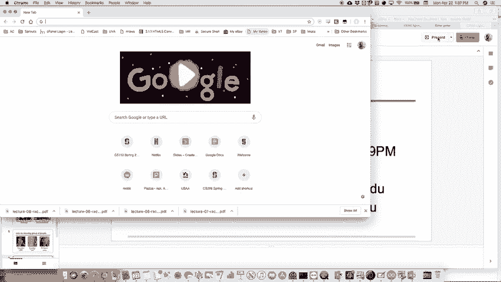

盒子关了吗？它关了。

好的。现在我们继续，我们还是在谈论信号，信号可能很棘手。

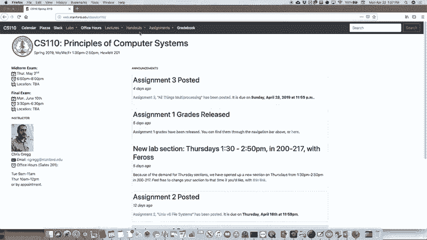

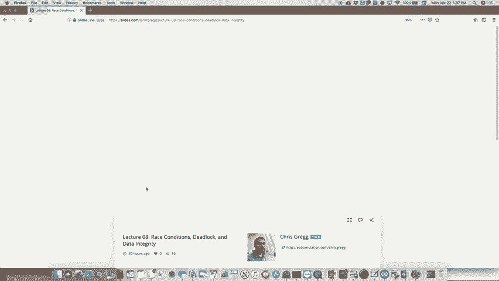

好的。进程在运行时需要与信号配合，往往会有很多竞争条件，我们想要避免这些竞争条件。

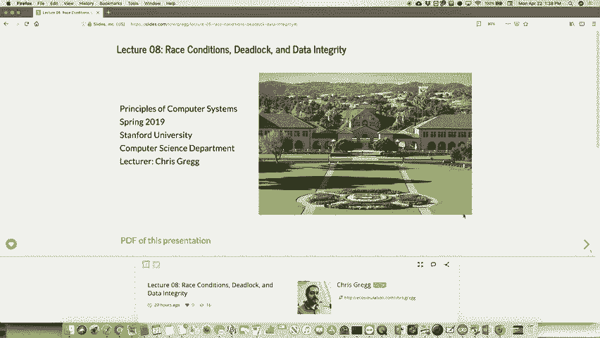

如果可能的话，我们需要讨论一下这些问题发生的一些地方、发生的时间，以及如何实际上消除这些竞争条件，或者让这些竞争条件不会发生，因为我们的逻辑是正确的。所以这就是我们想要做的。说到不正确，上周三我有点误导了你们，为此我感到抱歉。

有一个CA在看视频时说：“我觉得你在最后说的那句话不对。”我回去想了想，才发现，“哦，我明白为什么了。”是的，那个是错的。我明白你说的意思了。就是我说的这个。我不知道你是否记得上周的这个例子，但我们做的是我们有，我的笔。

又不行了。等一下，我再试一次。这个和这个。我发誓之前它是能用的。可能是。好了，我们试试这个。 所以，上周我们做的例子就是这个例子，我们有一个SIGCHILD信号。就是我们有这个信号，然后是一个我们调用的特殊函数，这就是信号处理函数的工作原理。

工作。我们说信号，然后是信号的类型，再然后是信号处理函数。对于这个，我说的是那个打印出作业列表的，它说：我们一开始就遇到过问题。我们首先说，“等一下，有时候当我们将一个作业添加到作业列表时，它会说作业在之前已经从作业列表中移除。”

它甚至没有达到作业被添加到作业列表的步骤，因为我们有这段特别的代码，正因为我们在其中加了这个疯狂的睡眠。我们说在你把它添加到作业列表之前，做一些其他事情，基本上就是休眠。等到它醒来时，父进程已经在进程结束后将其添加到了作业列表。

我们不喜欢那样。我们设置的逻辑是，在任务被添加之前，它会从某个任务列表中移除。那样做其实不太好。从逻辑上讲，这不成立。为什么？  

我没有破坏我们的程序，因为我们的程序在这个意义上根本不可破坏。但它看起来不对，如果我们在程序中添加了更多内容来实际添加和移除任务，在任务被添加之前移除它是没有任何意义的。我们做的是，我们说，“哦，好吧。有这个 SIG PROC MASK 系统调用，它允许我们屏蔽信号，我们在这里就做了这个。”  

因为我们将会屏蔽一组信号，其中仅包括子进程的信号。这意味着，直到我们解除屏蔽，这个信号处理器才会被调用。"这就是这个系统的运作方式。我们基本上是在说，"好吧，现在我们说，在父进程打印出消息后才解除屏蔽。"  

在我们打印出已添加任务列表之后，"我在前几天的讲座中说过，‘嘿，假如子进程最终发送了一个消息，假如子进程做了 exec，cvp 呢？’"，它在哪里？嗯，让我看看。我这里缺少它了。哦，你知道吗？对，这里是。就在这里。这个是什么？  

如果那个进程有自己的子进程并且有子进程的信号处理器呢？  

我们为什么会遇到这个奇怪的任务被从任务列表中移除，而它甚至不属于我们的程序呢？  

我当时的回答是，“哦，情况取决，我们得检查一下，必须屏蔽信号。”不，我当时说错了。事实是，这实际上对理解这个系统的实际运作非常关键。当你调用 exec cvp 时，原本已经在子进程中运行的整个程序会被销毁。新的程序才会开始运行。  

所以不再有实际子进程的信号处理器，因为当你执行 execvp 时，原进程中的函数已经不存在了。所以实际上不重要，子进程是否有子进程。现在，屏蔽信号是重要的。这些信号会跨越 exec cvp 边界被屏蔽。  

所以我们确实想要移除信号，对吧？让我们看看。我们希望在进入子进程时解除屏蔽信号。这样，如果子进程的程序有自己的子进程，它们的信号就不会被自动屏蔽。这样应该能稍微理清一些事情吧？  

关键思想是，exec cvp 会摧毁你原始程序中的一切，所以原程序中的任何内容都无法再次调用。所以，这就是这里发生的情况。好了。好吧。稍等一下。这台平板电脑快不行了。稍等一会。清除。好。我们来做这个。然后清除。好了。  

回到这里。

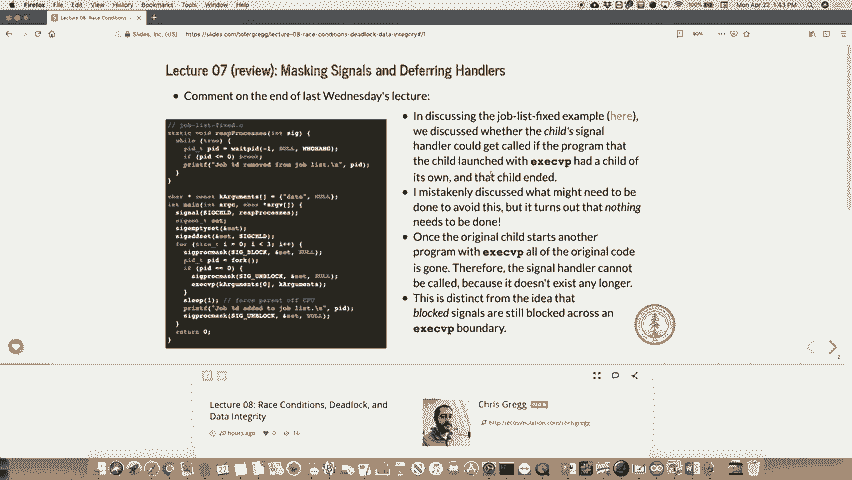

所以我们将继续讨论一些信号。 好的。 两个信号的问题？ 没有？ 是的。 当你调用 `exec cvp` 时，它会触发自己吗？

当你调用 `exec cvp` 时，它不会触发重要的子进程。 哦，这是一个很好的问题。 这是我忘记提到的一个好点子。 有人在 Piazza 上说，“哦，当 `exec cvp` 发生时，你会得到一个全新的进程，新的进程 ID 之类的。” 但你不会。 它实际上是你在子进程中启动时使用的相同的进程 ID。 好的。 所以回答你的问题。

当 `exec cvp` 发生时，子进程在程序运行期间仍然是活着的。 当该程序结束时，子进程本身也结束。 这样有帮助吗？

我以为当你调用这个时，它说它不会返回。 当你做 `exec cvp` 时，它不会返回，但它仍然是子进程。 当它结束时，才会调用你的子进程处理程序。 好问题。 好的。 所以前几天我提到了两种新的系统调用，叫做 `kill` 和 `raise`。

`kill` 是一种向另一个进程或你自己的进程发送信号的方式，但你通常会使用 `raise`。 你可以发送所有不同的信号。 这就是你实际上怎么做的，用来通知另一个进程，你确实向它发送了某个信号。 你使用 `kill` 命令。 现在，不幸的是，由于命名问题。

`kill` 的命名其实不是特别好。 但让我给你展示一个我们如何做到的例子。 先做这个。 `Man to kill`。 让我们看看。 所以是这两个。 我总是搞错这两个。 这两个处理程序就在这里。 好的。 然后这两个包含的 `Vim test kill dot`，假设。 实际上我们会做 `test raise`，我们将它发送给自己。 让我们看看。 好的。

我们还将包括 `STD I O dot H`。 好的。 `Int main`。 好的。 `Print F`。 我将终止我自己的进程。 伤心的表情。 好的。 然后我们将使用 `raise` 命令或 `raise` 系统调用。 `raise` 系统调用只需要一个你想要的信号。 所以如果我们发送比如 `kill`，那实际上。

我们可以说返回零，但我们永远不会到达那里。 然后我们到达那里。 这个将已经被终止。 那应该就可以了。 看看。 `Make test raise`。 好的。 `Test raise kill`。 好的。 发生的事情是我们使用 `raise` 系统调用向我们自己的进程发送了一个信号。 它只是终止了进程。 好的。 我们本可以调用它。

我们本来也可以做其他的。但是那个就能做到。 比如我们试试另一个。 `Sig stop`。 我想那可能是那个信号。 我想就是那个。 `Make test raise`。 哦，可能不是。 看看。 它保存了一个完全不同的信号吗？ `Sig`？ 我拼对了吗？

哦，它不是 `s t`。 哦，好吧。 当然。 当然，我以为他们可能删除了那个。 哦，对。 也许如果我拼对了。 怎么样？

好的，搞定。哦，它甚至显示为红色。好的。哦，哎呀。快点。啊，快点。计划赶不上变化。好的。测试抛出。好的。停止。然后它实际上停止了。所以它实际上还是在运行，结果是这样。嗯，它现在不再运行了，因为程序实际上。嗯，当我执行这个命令时，它会实际上说回到程序并立即结束。

但是Sig stop会暂停你的程序，对吧？实际上你在本周的作业中使用了这个功能。它实际上就是这么做的。所以，Sig stop，你可以发送给自己，暂时暂停你的程序。我认为，尽管我觉得我们使用的是一个稍微不同的命令。为什么它只是一个FG命令？FG。好问题。问题是，为什么FG继续执行程序？

所以，一旦你有了后台进程，你实际上可以看到所有不同的任务。FG会将其中一个任务放回到前台给你。FG放到前台。就是这么做的。好的。所以如果我们再次执行测试抛出，并且它在那里，如果我输入，如果我输入jobs，我，相信。是的，搞定。它告诉你有一个停止的任务。我也可以运行另一个任务。

然后现在有两个类似的停止任务。所以如果我放置，我可以把一个放回去，再把另一个放回去，现在它就会开始并重新启动。第10个问题。Sleep让它保持在前台，但sleep也会把它放到后台。Sleep确实会保持它在前台。所以如果我们输入的是sleep 10。

它会保持在前台，只是不一定会运行程序，但不会把问题返回给终端，不会给它返回终端访问权限。是的。好问题。好的。是的。如果你，好的问题。那么如果你。你的问题是如果我是子进程，调用SIG stop，父进程会怎么做？

子进程会影响子进程还是精确的CV？如果你，嗯，不，不会有任何影响。一旦你有了两个进程，它们几乎可以完全独立地工作。对吧？

父进程可以先结束，子进程也可以先结束，或者在那个意义上它们可以完全独立。是的。这就是，好的。所以这就是，嗯，kill系统调用和，嗯。raise系统调用，它们只是用来发送这些信号的。好的。好了。让我们继续，嗯，更多的信号处理，特别是处理像竞争条件这样的情况。

还有一种叫做自旋的东西，我们要避免它，我会在后面展示它意味着什么。所以记住这个任务，嗯，这是我们刚才看的程序。任务列表，嗯，程序，我们使用的。我们需要固定版本的原因是要有那个，嗯。SIG proc mask来阻止我们的SIG child，直到我们想让它实际工作的时候。好的。

SIG信号，进程是可以控制SIG子进程信号的。嗯。当你使用信号处理时，父进程不需要做任何特殊的事情，来处理子进程，除非是实际的信号处理程序。好的。顺便说一下，当你阻塞信号时，你可能会想，“哦，那个……”

听起来像是专制，什么的。其实都是关于你的进程。这并不像是你在阻塞其他进程的事情。我的意思是，除非你执行了`exec`，等等，但从某种程度上说，你知道你在写自己的程序。所以做这件事似乎有点专制，像是我在阻塞整个信号的发生。

好的，你在编写程序，所以你对它有控制权。好的。那么，让我们回顾一下，记得简单的Shell示例吗？实际上，你将编写一个更高级的Shell，嗯，这就是它的样子。

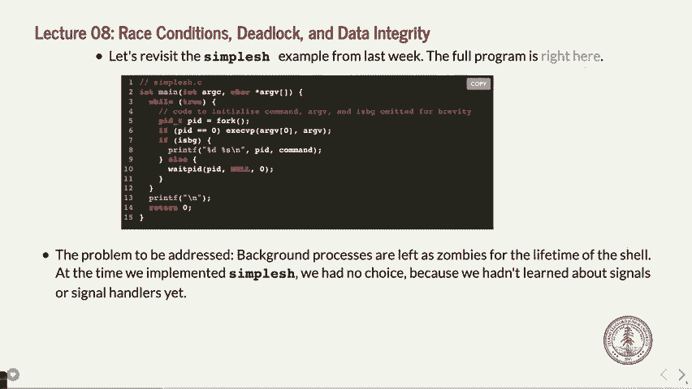

好的，我放大一下。好的。那么让我们看一下，嗯，简单的Shell函数实际上会做什么，它会从这里分叉出去。

实际上，这里有其他内容，但基本上它会分叉成一个代码，我们没有在这里初始化。嗯，它会分叉成一个进程，你输入命令，然后如果你在后面加上“&”符号，它就会在后台运行，最终你会返回到命令行提示符。如果没有，我们会看到这个有趣的PID，用于前台进程。

因为Shell正在等待子进程结束。当子进程在前台时，父进程希望等待它。所以这就是我们在这里使用`wait PID`的原因。好的。那么，一旦我们有了信号处理，也许我们想要稍微改变一下。

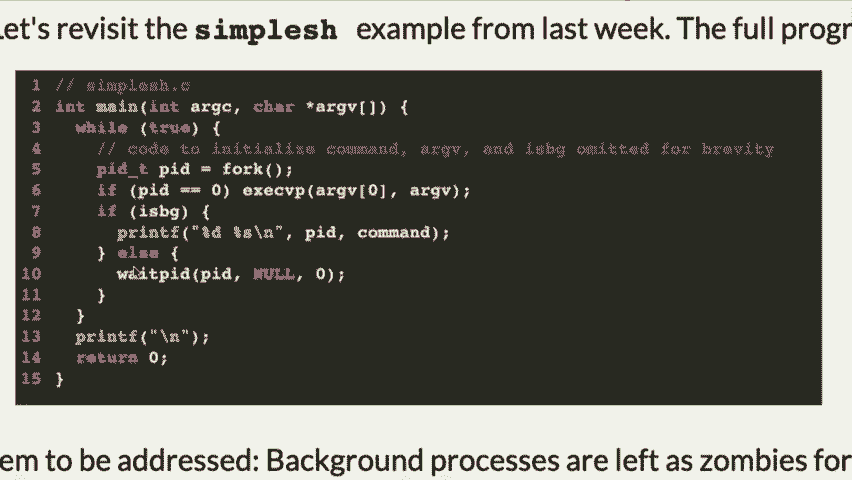

好的，因为我们之前没有信号处理。所以我们采取了这种方法，我们有，哦，我们只会等待PID。

顺便问一下，后台进程什么时候会在这个程序中被清理？

我看到有人在摇头。是的，这个程序中的后台进程并没有被清理。好的，这就是我们的一部分错误。我们之前甚至不知道信号是如何工作的。所以我们没有信号处理程序。这样做就不可能实现。

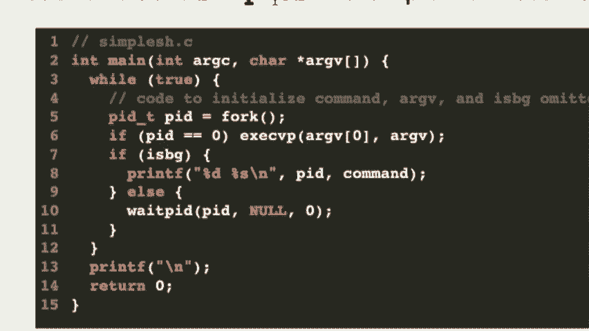

但是你可以看到，后台进程并没有等待PID。

后台进程打印后台的命令，然后它返回，打印另一个终端，然后它再也不会清理这个进程。好吧。这实际上意味着，只要那个 shell 还在运行，那么这个进程就一直没有被清理。好吧。所以它有点，嗯。

这有点像一个错误，因为它没有释放内存。

那应该是免费的，等等。所以如果我们能避免的话，我们想避免这种情况。

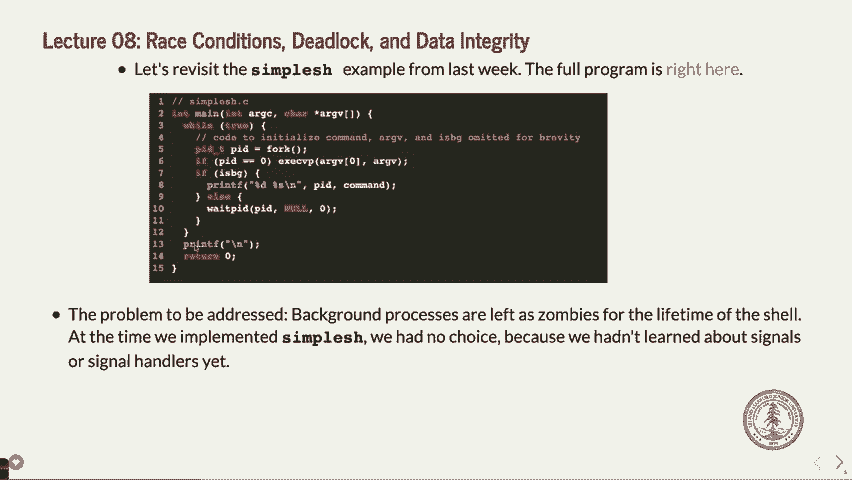

好吧。所以让我们改变这个。好吧。所以让我们实际上再看一下我们的简单 shell 程序。

简单的 shell dot c。好吧。我们来看看。我们来看一下。我们有实际的，嗯，是的。这是原始的。好吧。接下来我们要做的是给这个程序添加一些东西。好吧。我们要，实际上让我不使用这个。让我们做一个带有冗余的简单 shell。是的，那里就可以。好吧。现在我们将为我们的简单 shell 重新处理。好吧。

然后我们要做的是，实际上这就是这里。我是说，现在，已经把所有的都加进去了。好吧。我们要改变这个，使得我们实际上在程序中使用那个信号处理器。好吧。所以我们要做的是，嗯，我们要做的事情跟之前一样。好吧。我们要进行 fork。好吧。然后我们要，哦，完全错了。

我们可能应该追踪它。P-I-D-T-P-I-D 等于 fork。好吧。我们将在这里进行进程的 fork。好吧。如果我们是子进程，嗯，我们将怎么做？

我们将精确获取 CVP，argv0 和 argv。顺便说一下，这里没有进行错误检查。实际上，我们至少做一点错误检查。换句话说，如果精确获取 CVP 命令失败，可能是因为我们输入了错误的命令。那就糟糕了。好吧。所以我们要做的就是，先打印 F，我不知道，%S，命令。

然后，未找到或者类似的错误信息。好吧。然后是 X 在零处，类似这样的。谢谢。我需要告诉他们将会问什么问题。顺便说一下，让我们看看，argv0。我需要，顺便问一下，是否需要在这里加一些 if 语句，看看命令是否没有找到。为什么不呢？因为如果精确获取 CVP 成功了，它将摧毁整个程序，根本不会到达那里。

好吧。所以不管怎样，情况就是这样。好了。现在我们有了 if 是后台。好吧。我们要做的就是跟之前一样。打印 F。好吧。%D，%S。然后，好的，进程 ID 命令。好吧。然后我们将这样做。好吧。这将由信号处理器处理，但我们还没有安装它。好吧。

但是我们想要做的是，如果它不在后台，好的，我们想要调用另一个函数，叫做等待后台进程。我一会儿会展示它是怎么工作的。进程，PID，以及这个。好的。让我们看看，我需要再加一个吗？嗯。好的。那么，这就是了。让我们安装一个信号处理器。我们将有一个信号处理器。哦。

我想我没有把它放到上面。我们将有一个信号处理器来回收进程。好的。回收进程的信号将做以下操作。好的。一直循环。我们做了很多次这些信号的操作。好的。一直循环，PID，PID 等于等待。PID，负一，因为我们不知道我们在等待哪个。W 无挂起。

因为我们不希望它实际上等待返回，因为我们不喜欢。它在信号处理器里等太久，而且我们也不必这样做。如果 PID 小于或等于零，跳出循环，这意味着我们要么它还在运行，要么其他进程还在运行，或者我们没有剩下任何进程。好的。如果 PID 等于，嗯。

我们将添加一个新变量，好的，来查看我们是否有子进程。好的。我将它命名为 FGID。好的。我将它实际设置为零。这是清除它。或者说是一个后台进程。好的。这个产品，因为我们有 FPG。我们必须将它设为全局变量。好的。

所以我们得做一些类似静态 PIDTFG PID， 哎，抱歉， FG，我在做 PID 吗？是的。因为我们做的是 FGPID 前台 PID。好的。前台 PID。没问题。实际上我们会将它设为零，它必须是全局的，因为我们需要一种方式在我们的信号处理器和我们自己的程序之间进行通信。是吗？等一下。结束。谢谢。好的。

会的。我们会做到的。好吧。总之，重点。是我没有做对吗？嗯。哦。FPGID。这样怎么样？哦天哪。今天我有点失常。有人也有这种日子吗？FPGND，进程 ID。就是它。好了。哦，天哪。谢谢你保持我清醒。好的。那么，接下来我们做了什么？我们已经说了，好吧，我们有这个必须设置的前台进程 ID。

在我们即将创建的另一个函数中。好的。让我们创建一个函数。静态 void。等待前台进程。PIDTPID。好的。在这里，我们想要做的是。让我看看我能不能做对。F，G，P，I，D，等于我们有的 PID。好的。然后当 F，G，P，I，D 等于 PID 时，我们将做一件奇怪的事情，我们只是。

我们会在这里坐着，稍微等一下。好的。通过等待，我们其实是在做一种叫做旋转的事情。好的。那么让我们实际上测试一下这个。基本上，事情是这样发生的。好的。如果我们是后台进程，我们就让信号处理器来处理它。好的。等它结束。

如果我们是前台进程，我们也基本上会让后台或其他进程来处理。是的。那么，如果我们在 C++ 中，能不能用这个来做呢？

我不认为你能够做到这一点。你可能可以做到。我不确定。所以。我们现在正在使用这个，特别是因为我们在使用C语言。是的。好问题。好的。好。那我想差不多就是这些了。让我们看看。此时，对吧。所以我们试试看看会发生什么。并且创建一个有冗余的简单shell。好的。好的。有冗余的简单shell。好的。

所以我们可以做LS，它会在之后给我们返回提示符。我们可以做LS。让我们让它做这个。LS。&。好的。它应该把我们的小命令放在这里，一直放到顶部。这里有很多东西。找到了。它打印出来了。很简单。它打印出了刚刚重新启动的PID，然后立刻打印出了提示符回来。

为了让我们继续操作。让我们做一个更合理的例子。如果我们只做sleep 10，它将在前台睡眠10秒。好的。然后，当，信号，当子进程结束时，在这种情况下，我们实际上会，得到信号，稍等。我们可以在后台做sleep 10，然后现在它在睡眠中。

如果我们输入PS，实际上我们可以看到我们的sleep就在这里，我们的sleep命令就在这里。在后台，我们没有太多问题。在前台，嗯，如果我们这样做。让我们做一下sleep 100。所以它将睡眠100秒。我们的程序在做什么呢？

让我们回到这里看看我们的程序，因为顺便提一句，它现在还在睡眠中。好的。我们的程序现在已经进入了，咱们看看。哎呀，稍等一下。这个在这里吗？让我们看看。哦不，你知道吗？我可能跳过了一点。我可能提前跳了一点。是的。我跳到了错误的地方。这个是关于竞态条件的，关于竞态条件的。

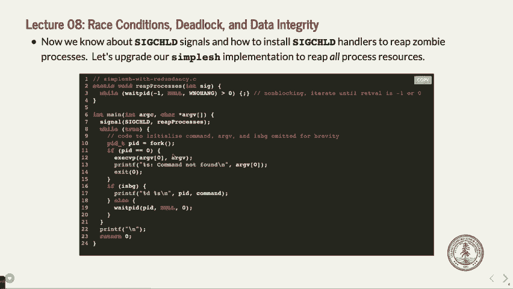

如果，让我，先给你展示一下这个。在这种情况下。发生的事情是我们在做这个睡眠，好的，或者说不是睡眠，是在进行这个旋转，好的。因为我们处于前台进程中，shell是前台进程，而sleep也是前台进程，所以它必须等待。

就是这样，对吧？

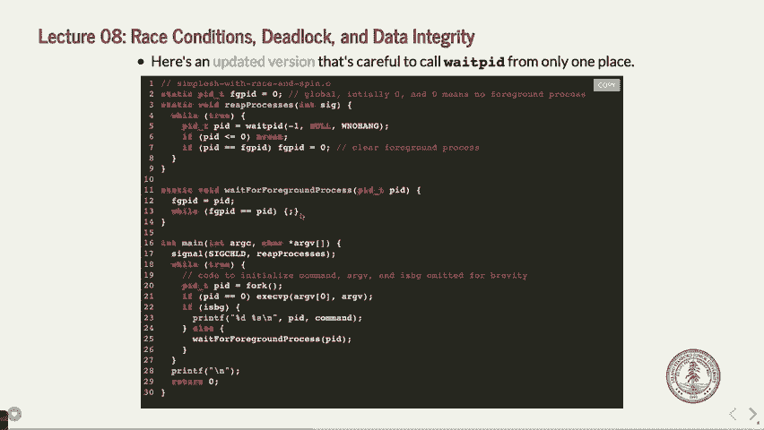

现在，我想我们还是在睡眠中，好的，看看，是的，我们还是在睡眠100秒。如果我在这里打开另一个终端并进入相同的 myth，myth 55，好的，哎呀。

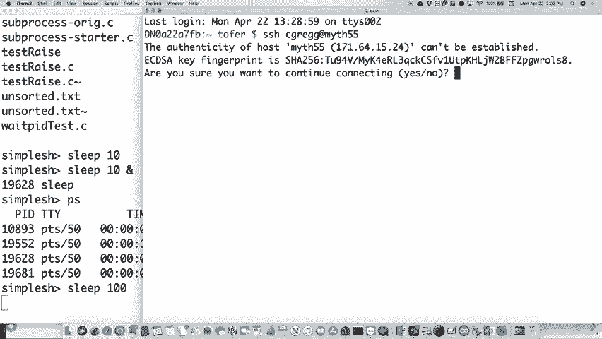

是的，然后输入一个叫做htop的命令。注意到上面有什么。那是一个进程。这是htop程序，我想我以前展示过这个，展示了，所有，可能我没有。展示了我们正在运行的计算机上所有不同的处理器。它显示了每个核心的使用情况。其中一个已经达到100%。

其他的几乎没有什么。它们中的一个是 100%，猜猜这是哪个程序？哦，很简单。所以，当 CPU 达到 100% 时的冗余是我的程序，好的。那么，为什么会这样？嗯。因为它在旋转，实际上它卡在这个 while 循环中运行，最终，它结束了，顺便说一下，现在当 sleep 100 结束时，它回到了零，好的。嗯。

为什么那样不好？嗯，那不好，因为不幸的是，有些可怜的像 107 的学生正坐在旁边的一个 Myth 机器前，想着，为什么我的终端现在卡住了，对吧？

因为你正在运行 100% CPU 的程序。现在有八个核心，它们实际上没有完全利用，因为还有很多其他核心在做其他事情，但机器可能会变热一点，使用了不应该使用的核心，对吧？我们本不应该这样做，好的。那么问题是为什么？我们该如何避免这种情况？我们会解决这个问题的，好的。哦，顺便说一下。

你可以运行，我需要安装 Htop。你不能运行它。我从我的机器上本地安装了它，我会安装并发送一封电子邮件给你们，关于如何运行它，好的。

我跳过的原始版本，看起来是这样的，如果我们想移除它的话。

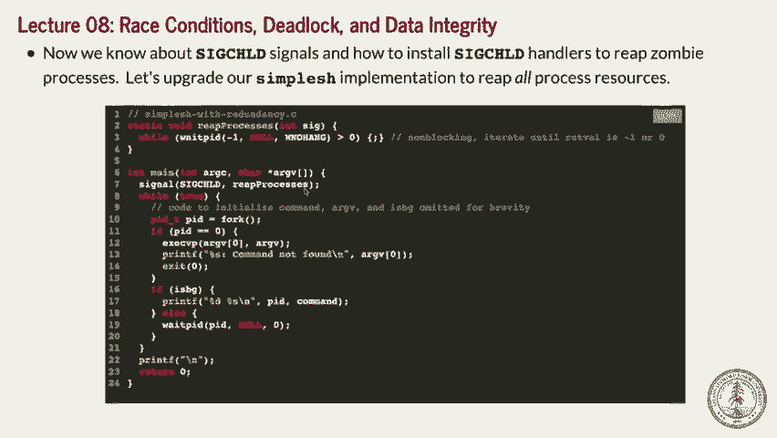

所有的，或者回收所有进程，好的，带着这个奇怪的，额外的 weight PID 在这里。好的。这是我们之前的情况，好吧。我们之前是这样做的，而现在我们实际上在捕获子进程，好的。这个在这里被回收，好的，像往常一样，或者像我们使用信号处理程序时那样。但在这里。

我们有这种奇怪的情况，我们在没有 W-No 的情况下调用 weight PID，等等。这意味着它将会在这里等待子进程结束，但我们在回收进程时已经处理了它。事实上，这个过程会先发生。信号处理程序会立即被调用，处理信号，它会返回正确的结果。

子进程的 PID。然后是父进程，它在这里通过 weight PID 调用，实际上 weight PID 会在这里完成并报错，提示没有更多的子进程了。这是不是有点奇怪？让我再说一遍。这里我们说，如果子进程是前台进程，我们想等待它结束。但我们并没有让。

嗯，我们让信号处理程序清理 weight PID，清理子进程。然后这个就变得有点多余了，因为它实际上会在子进程处理完后被调用。然后这个问题出现了，你会觉得，哦，这看起来有点不合逻辑。你会想，不，这个会失败。现在它工作了。

但我们希望做得更好，这也是我们处理的原因。

之前的，或者我们有点做错了方向。你对此有什么问题吗？

自旋是坏的。我会给你看看，嗯，我提前跳过了，我们先做了自旋的那个。但自旋不好，因为它是一个非常紧密的循环，我会给你看看自旋是怎样的。

一个做的事情。

那么这里发生了什么？它基本上是在检查这个全局变量FGPID。如果子进程在运行期间，它们的值始终不相同，因为我们把它设置为零，然后PID就是该进程的PID。它就是这样一次又一次地运行这个while循环。

这就浪费了处理时间。因为它认为自己在做某件事，而编译器之所以允许这种情况发生，是因为我们有一个全局变量在这里。否则，编译器会认为，等一下，这个函数并没有改变它。那它怎么可能不是一个固定的值呢？所以编译器只会执行一次。如果我们把它放在if语句里，甚至不会按我们希望的那样运行。如果你在107。

如果你上过107E课程，你就知道这一切了，编译器会说，哦，全局变量，我不会对这些进行优化。这回答了你关于自旋是什么的问题吗？

这是一个紧密的小循环，它做了一些对我们没有帮助的事情。我们宁愿进程结束，或者完全结束，让内核等待，就像。让它真正做应该做的事。

好的，明白了。那么接下来是我跳过的那个，之前的那个。这里是这个，我们有。

这个小的wait PID，我们确实不希望它只发生一次。

我们希望它发生一次或两次。我们希望它只发生一次，然后让信号处理程序处理所有的事情。问题。你不需要在全局变量前加volatile。好问题。如果你从未听说过volatile，它基本上意味着，这个变量很特殊，不要优化掉它，因为你不知道它会发生什么。但并不需要。

对于全局变量，你不需要，至少在这个编译器的情况下，不需要。好的。那么对这个有其他问题吗？你明白为什么我们不希望在两个地方都有wait PID吗？顺便提一下，上个学期我们在期中考试时有一个问题，学生如果愿意的话，可以把wait PID放在两个地方，我们会扣分。所以要小心。

你可以像我们之前展示的那样，只有一个wait PID。我会在稍后展示如何消除那个竞争条件。好的，但这里是竞争条件的例子。这个有什么好处呢？

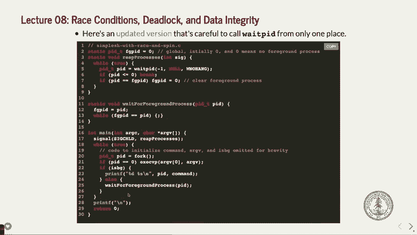

好的，我们其实并没有再做任何wait PID。

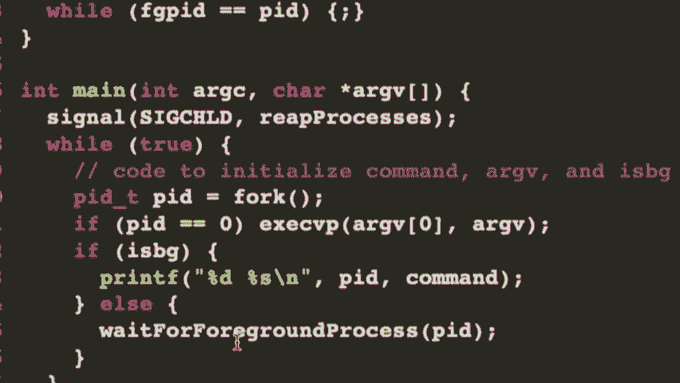

实际上，等待前台进程。等待前台进程函数中没有任何等待PID的内容。它有一个奇怪的旋转循环，我们希望避免这个问题。

但是所有的子进程都在这里被处理了。现在，更关键的是，我们实际上有一个比旋转更严重的错误。旋转并不会做任何事，除了让你的电脑稍微变热，让风扇启动，并使得你的电脑寿命变短，因为它做了更多的工作，对吧？这不是世界上最大的事情。

世界上最大的事情是这里确实存在一个实际的竞争条件。明白了吗？

有人看到竞争条件可能出现在哪里吗？

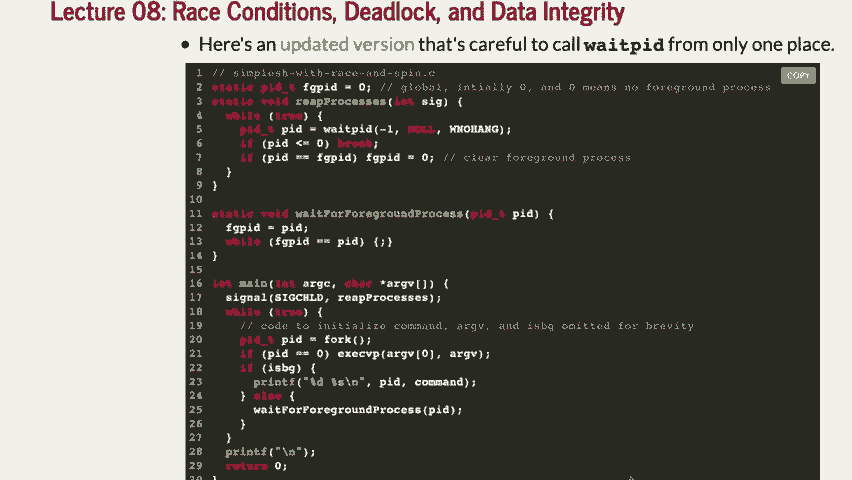

竞争条件发生在你执行一些操作时，比如你在进行分叉，许多事情可能会在其他事情之前发生。你怎么看？有人看出这里有竞争条件吗？是的，是的，是的，是的，是的，是的，是的。你在第二手中设置FBAG F，然后在等待前台进程时检查它。为什么这是一个竞争条件？

什么会先发生？像这里会发生什么？

让我们考虑两种不同的可能性。你有个想法吗？去吧。是的。这个while循环永远不会结束，对吧？如果这里有一个稍微不正常的、稍微有趣的情况。好吧，让我们一起走一遍这个过程。F我们分叉。好吧，然后我们执行CVP。如果这真的很快怎么办？

我们做了一件超级快的事情，子进程结束了。好吧。那么，我们就会来到回收进程的步骤。假设我们甚至在等待前台进程之前就进入了这个步骤。好吧，我们实际上去执行并且立刻结束了子进程，然后我们回收了这个进程。那么会发生什么呢？好吧，它会去执行，好的，那么让我们看看。在这个情况下，实际上会发生什么。

根据之前的PID是什么，其实并不重要。所以我猜如果它不立即发生也无所谓。但是如果它不在这里发生会怎样？

这就是你说的。如果它没有在这一行之后立刻执行。那么这行代码，好的，设置了F，P，或者F。我们看看，是在那之前还是之后？

我现在有点混乱了。这就是为什么竞争条件很难处理。记住具体位置总是很难。如果FGPID被设置为PID，然后FGPID在这里等于，好的。如果信号处理程序在那之前被调用，并且到达这里并将FGPID设置为零。

在这个时候，我们将FGPID设置为PID，然后这个while循环将永远不会结束，因为我们永远无法将其重新设置为零。这就是问题所在。好的。所以基本上我们在说这里存在一个竞争条件。

让我看看。让我读一下这里。听起来可能更容易理解。如果前台进程结束，而重新处理被调用在正常执行流程更新FGPID之前。如果发生这种情况，它将永远循环。因此，我们可能会遇到这种情况，因为子进程已经被收割了。

在这一行和这一行之间，或者就在这一行之前。就在这一行之前。子进程被收割。它将PID改为零，然后我们更新这里进入这个while循环，不再有作业。其实是要进行收割。对吧。所以问题应该出在这里。那应该是一个很糟糕的竞争条件。

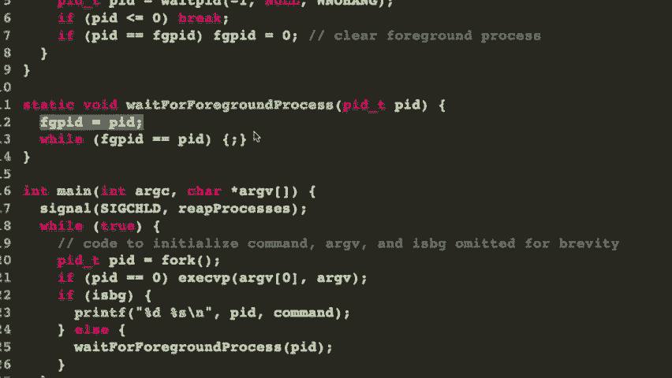

那么我们如何处理这个竞争条件呢？好的。我们想要做的是，实际上我们想要使用一种不同的方法来消除这个竞争条件。事实上，在我们做这个之前。让我们实际做这个，嗯。我们要做的就是。好的。我们现在就做这个。这是我们将正确阻塞子进程信号的地方，就像之前那样，以便我们不需要，实际上我们完全避免了这个竞争条件。

就像我们之前做的那样。好的。让我们看看。我们在这里再做一次。哦，实际上让我们换个地方做。在简单的shell中就做，暂时保留旋转，因为这并不是最重要的部分。好的。我们现在保留旋转，我们会重新处理，不会改变。好的。我们需要在这里做的是，如之前所说，阻塞信号。事实上。

我们将不再像以前那样逐行阻塞信号，而是设置一个空的信号集，然后设置它为空集合，等等。我们会有一些小的函数来完成这些操作。我稍后会向你展示这些函数。好的。所以我们将做这个。

我们将阻塞信号。好的。在我们执行分叉之前。好的。让我们阻塞子进程信号。好的。这里有一个函数将会完成这个操作。我会在稍后展示给你。好的。我们将分叉之前进行阻塞。这样一来，在父进程中，信号处理程序就不能在信号被阻塞时被调用了。好的。

好的。那么我们接下来要进行分叉。如果PID是零，那么就是子进程。我们不在乎信号是否被阻塞。事实上，我们希望它不被阻塞。所以我们将调用未阻塞的SIG子进程，这是我们马上要展示的另一个函数。好的。然后，如果它是后台进程，我们还会解除它的阻塞，因为我们不想。

不用担心实际的阻塞问题。问题不在于这里。好的。是前台进程出了问题。好的。解除SIG子进程的阻塞。好的。是后台进程或者背景进程。所以我们不需要担心。它们不会出现那个问题。好的。然后我们有等待前台进程。嗯。

让我们看看等待前台进程。就是在我们在这里设置之后，我们想要再次解除SIG子进程的阻塞。现在看起来我们只是在FGPID设置后才解除阻塞。好的。这里发生的就是这个情况。我们现在在不再需要阻塞的地方解除了阻塞。现在我们不会再出现那个竞态条件了。是的。我们就是这样做的。

在我们进行阻塞之前，阻塞和FGPID的设置，是全部吗？嗯嗯。那就是人们一开始为什么会变得很狭隘。我们怎么能在设置FGPID之前，等到这个条件呢？让我们看看。你的问题是，我们到底是如何在这里引发竞态条件的，因为，嗯，看看吧。

当我们在做的时候。所以这里一直到我们调用等待前台进程。如果有人等待它。那么，因为它永远不会被满足。对吧。那么，发生了什么呢？那是什么？抱歉，再说一遍。那是怎样的？当我们第一次调用时，FGPID是零。然后它会变成一小段时间，一点点的变化。对吧？

然后我们调用它作为前台进程。对吧。如果子进程在之前部分退出。我们怎么会有竞态条件呢？对吧。这是个好问题。问题是，我们什么时候会有竞态条件呢？或者我们怎么在这里引发竞态条件？让我检查一下。

我只是确保我没有错过设置它。实际上，让我们再回头看一遍。我觉得这是个好问题。等一下。我们没有在这里设置它，是吗？哦，我们在父进程那里设置了，它在这里设置了PID。对吧。我们在这里设置了PID。对吧。好的。然后FGPID仍然在那里。

让我再回头检查一下。我知道这是一个竞态条件。你说得对。可能是漏掉了一行，或者我没完全正确地理解。不错，发现得好。嗯。我认为如果你想指出是由于这些进程、信号处理程序的能力来触发的。所以即使它不同，也不能像设计玩家一样再次执行。

Google永远不会，结束后设置为零。对。好点子。好的。这里是答案。很好的答案。好的。这个想法是，当子进程结束时，重处理会被调用一次。好的。好的。让我们假设FGPID仍然是零。对吧。嗯。它不会重置它。实际上，FGPID已经是零了。

所以这就要结束了。好吧。如果结束了，我们在这里设置它，然后再执行while循环，实际上它已经结束了，然后就是这样。是的，谢谢你的澄清。是的。竞态条件发生在我们等待前台进程时，而子进程已经结束。它的速度非常快，子进程结束了，突然间我们还在等待。

我们不这么做。是的。好判断。

好判断。现在，为什么这样可以解决问题？好吧。这样就解决了问题。这就是我刚才在这里输入的内容。这样解决问题是因为我们实际上没有允许这个。等待子进程处理器，直到实际的FGPID设置为PID之后才会被捕获。那时，它会被子进程处理器重置，然后我们将跳出while循环。是的。

问题。你认为阻塞是怎么工作的？也就是说，子进程几乎完成了，但你可以保持信号不发送吗？是的。好问题。阻塞是如何工作的？如果子进程不能发送信号，它会一直等吗？

是内核在发送信号，内核知道子进程已经结束。它想发送信号给父进程，但父进程表示现在不接受信号，所以内核会等到信号解除阻塞后再发送。子进程完成了，不影响，一切正常。只是还没清理完，但子进程已经结束，最后父进程也会处理。

他说现在你可以发送信号了，这时内核就会说好吧，马上就给你信号。好问题。好了，事情确实很复杂。还有其他问题吗？我们开始讨论更具体的内容吧。哦，这里是那两个信号，或者说其实有三个函数。

你可以使用切换SIGCHILD屏蔽，这有点更复杂，或者你也可以像这样，调用解除屏蔽SIGCHILD。好吧。它在做什么？

它设置信号集为某个屏蔽，或者在创建信号集后再清空它。基本上就是初始化信号集，然后我们添加屏蔽。我们通过添加SIGCHILD到屏蔽中来实现，之后根据调用该函数的方式，信号可能被阻塞或解除阻塞。就这样。是的。

为什么在fork之前调用阻塞SIGCHILD？你是说我们可以在fork之后再调用它吗？是的，这是个好问题。

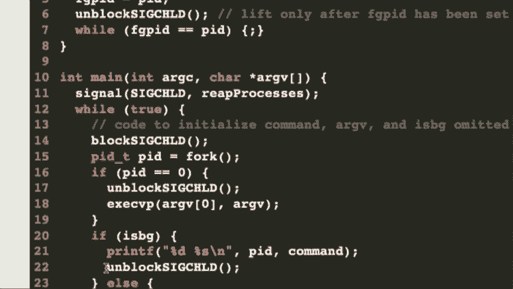

我们可能可以这样做。不过不行，实际上我们做不到。发生了什么呢？记住，我们这里讨论的是一个可能发生非常迅速的竞争条件。如果我们等待阻塞，比如在父进程中，父进程会是唯一被阻塞的。但是可能已经太晚了。

子进程可能已经结束并调用了信号，或者信号处理程序已经执行了。是的。所以我们必须在分叉之前就进行阻塞，因为我们不希望子进程在我们准备好之前就结束。好问题。

有个非常好的问题。还有其他问题吗？好的。让我们处理我们之前遇到的旋转问题。所以竞争条件消失了。我们想在子进程中解除阻塞，因为我们不希望信号被阻塞在子进程中，但我们已经在分叉之前设置了它，因此它已被设置。现在让我们解除阻塞。

然后我们仍然需要处理这个旋转。我们可以做类似这样的操作。我们可以说，当FGPID等于PCCLE SPEDI时，休眠或微休眠（如这个名称所示），持续100,000微秒。这样应该就能正常工作。我相信微休眠实际上在信号发生时不会唤醒。

那可能不是最好的方法，但我们可以等待，然后子进程结束，最终休眠会唤醒，然后我们说，“哦，我们没有做任何更改。”然后我们执行这个操作。至少休眠会让它从处理器上移开。所以那样可以工作，只是它不特别优雅，但它确实能工作。

所以我们确实想让操作系统来处理，操作系统可以判断我们的子进程何时结束。所以我们不妨利用这一点。我们还能做些什么呢？

有一个暂停函数，它实际上也可能有效。暂停函数强制进程睡眠，直到收到某个解除阻塞的信号。嗯，这很好。这表示，“好了，现在我们将等待直到解除阻塞的信号到来。”不过，问题在于我们又遇到了另一种情况。

这是一个竞争条件，我们可能会陷入所谓的死锁。这是我们之前在竞争条件中也可能遇到的情况，嗯，虽然稍有不同。基本上，一个进程在等待另一个进程，而另一个进程也在等待第一个进程。现在我们有两个进程相互等待。

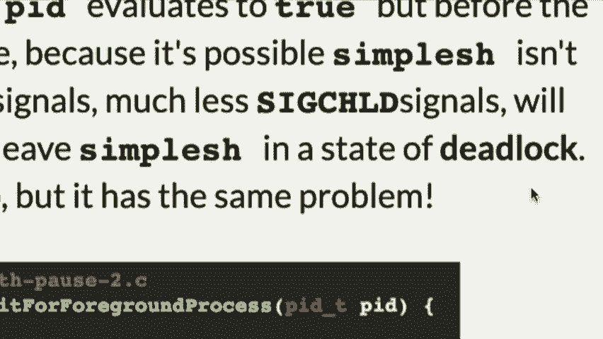

这被认为是死锁，在这种情况下你需要有一些逻辑来解决这个问题。所以你可以尝试使用暂停函数，但那可能会把它引入一个我们无法真正解决的情况。如果发生以下情况，如果信号在FGPID等于PID之后到达，但在调用暂停之前，那么会发生什么呢？暂停函数会说，“好吧。”

我在等待信号处理程序说，'哦，我已经处理过了，所以它实际上不会执行下去。' 你可以尝试做一些像解除阻塞然后再阻塞，但你依然会遇到问题。因为在解除阻塞SIGCHILD信号和pause之间，不是有一些时间可以让其他事情发生吗？

是的。所以我们想要一种方法来确保某些事情能正常工作，基本上我们说，'看，我们知道你将会被从CPU中移除。我们知道这个进程将会等待。我们知道我们必须解锁一些信号。让我们确保这件事发生，在我们保证进程已经发生之后。'

被从CPU移除。' 好的。我们怎么做呢？好吧，我们有另一个系统调用叫做SIGSPEND。SIGSPEND的操作是这样的。SIGSPEND说，'哦，好吧，我们将解除信号的阻塞。' 好吧，或者我猜我们基本上是设置另一个阻塞集，我们可以把它设为空集。在这里我们将进程从CPU中移除，以避免发生这种奇怪的死锁情况。好的。

所以这就是发生的情况。我们做的是这样：我们设置另一个信号集，并将其设为空，实际上我们就是把它设为空，但不改变任何东西。发生的情况是这样的。好的，我们说，'当FGPID等于PID时，我们将对空集执行SIGSPEND操作。' 现在记住，到此为止。

难道我们不是已经阻塞了SIGCHILD信号吗？它之前已经被阻塞了。我们之前做过。我们甚至执行了fork操作。好的，SIGCHILD信号被阻塞了。当你说SIGSPEND时，它会说，'哦，好吧。在我将处理器从CPU上移除之后，我会解除所有信号的阻塞。因此，它会等待，直到子进程实际发生，然后当子进程发生时，'

SIGSPEND会在子进程处理程序发生后唤醒。问题是，[听不清]，它解除阻塞。好问题。它阻塞。它说，'将阻塞的信号集设置为这个集。' 对吗？

所以当你说'将其设为空集'时，意味着没有信号被阻塞。现在你可能会遇到一种情况，需要某些信号保持被阻塞，你可以这样做。但在这种情况下，我们基本上是在说，'好的，没问题。SIGCHILD在这个while循环之前已经被阻塞。进入while循环后，SIGCHILD依然被阻塞。'

你调用SIGSPEND系统调用，它会说，'哦，好吧。我现在将CPU从处理器上移除，等待直到SIGCHILD发生。现在我解除阻塞，所以如果SIGCHILD发生，它将能够在子进程处理程序中运行，然后在完成后，它会停止这个SIGSPEND。'

回到while循环，然后我们就已经改变了FGPAD，将FGPAD改回零，这样我们就完成了。好的？现在我看到一些人说，'不，发生了什么？'看到一些不同的反应，像是，'这里发生了什么？'。

什么问题？是的，是的。是的。[听不清]，是的，SIGCHILD有点像暂停，它会说：“好，等到它被阻塞。SIGCHILD处理程序发生并返回，然后你就可以继续了。”基本上是等一个信号。[听不清]，这个，嗯，是的。所以SIGSPEND有点奇怪。它说：“将此块信号设置为这个集合，我们正在解除阻塞。”

我们正在解除阻塞SIGCHILD，因为这个空集合，我们说：“解除阻塞SIGCHILD，在我们将进程移出处理器后，这样就没有竞争条件了。”所以它现在会解除阻塞。子处理程序会等待直到子处理程序发生。子处理程序会做它的事。

将FGPAD更改为零，然后它将返回。这一行会说，“哦，我们现在已经得到了那个信号，所以现在我们会回到这里，进行更改。”好吗？

现在你可能会问自己，等等。你可能会问自己：“等等，为什么我们这里还需要这个while循环？”因为如果我们要等待信号，为什么还要做这个？结果发现，任何被处理的信号都会导致SIGCHE SPEND结束。所以你需要，或者说，你想说：“哦，那既然如此，我们确保……”

再次检查，看看我们应该设置的条件是否已被设置。如果没有，我们就会继续循环，再次执行SIGCHE SPEND。问题。那是你的问题。给你了。我在你问之前就问了。是吗？[听不清]，是的，让我们看看这里发生了什么。记住，我们，嗯，好吧，我们在这里做了什么？我们是一个前台进程。

这意味着父进程需要等待前台进程结束。好吗？

我们此时已经阻塞了信号子处理程序。我们已经进入这里，好的。信号子处理程序，子进程可能已经结束，但它被阻塞了。所以从这个角度来说，这不是竞争条件。我们现在说，好，太好了，FGPID等于PID。所以我们说这里有一个前台进程。

我们想将这两个设置为相等，然后子处理程序会解除设置，比如，解除FGPAD。好吗？好吧。然后我们说，好，我们将信号集设置为空集。我们说，while FGPID等于PID，第一次执行时这个条件会成立吗，即使子进程已经结束？是的，第一次执行时它会成立，这没问题。

然后我们会做SIG suspend，这将会把父进程推到处理器外，因为它在等待子进程结束。好吗？让那个处理程序发生。它调用，处理完后解除信号阻塞，进程从处理器中移除。此时，子进程已经结束。它调用信号处理程序，将FGPID更改为零。然后它结束并在这里醒来。

它回到这个`while`循环中，看到“哦，好吧，现在我发现PID不等于0了。我可以结束并且再次解除阻塞SIG child。”顺便提一下，当它退出这个SIG suspend时，它会重新阻塞之前阻塞的信号。这样做的好处是，这个`while`循环实际上可以再次正常工作。

很多很好的问题，像是这个问题。是的，好问题。我是指当我把处理器推离时，推回到操作系统调度器，我们还没有讨论调度本身，但确实。它基本上意味着将父进程置于休眠状态。当父进程处于休眠状态时，直到信号被处理之前，实际代码中不会发生任何其他事情。

为什么要真正解除阻塞SIG child？我们必须这么做，因为当SIG suspend结束时，它解除阻塞信号。它恢复了原始的信号集。是的，好的问题。所以它在这种情况下会重新阻塞信号。是的，是的。那么，`while`循环会在一次中迭代更多次吗？让我们看看。对于这个子进程来说，不应该。

是的。现在，除非有其他信号进入并且恰好使得它恢复执行。所以，如果有其他信号进入并且恰好使得它恢复执行，可能会发生多次。这是否意味着暂停会一直持续，直到某个信号被处理？是的。现在。如果你要让它更健壮，并且关心其他信号的话，你可能需要考虑。

不想让它仅仅是空集合等等，但现在我们不关心其他信号。那没问题。

好的。这是很多内容。那件事，你将在作业三中广泛使用它，你现在正在做的作业四中，虽然不算广泛，但在做这些的时候会用到一些这些内容。好的？

有时候确实很难推理这些事情。好的。让我们来做这个。我想做的是看几个问题。现在，不幸的是，你们有一个期中考试，一周半后。不幸的是，没有人喜欢期中考试。我们不喜欢批改它们，你们不喜欢做它们。我们应该干脆取消期中考试。

但这有很多障碍。不过，如果你有好的想法，当然可以告诉我。我们来看几个问题。我们大约有15分钟，所以我们可以完成这些。我想。我们来讨论几个你可能会在期中考试中看到的信号处理相关的问题。事实上，这两个问题来自之前的期中考试。好的？那么，这里是问题。

考虑这个程序及其执行。好的。假设所有进程都运行到完成，所有的系统调用和所有的`printf`都成功，等等。这个情况下，不必担心任何错误。并且假设所有的`printf`调用都是原子的。原子操作意味着它发生时不会被其他任何事情打断。好的？换句话说，如果你正在打印“ghost”或“pirate”，这就是我们正在打印的内容。

在这里，你不能在中途被打断。预先进入 P 和 pirate。它不像信号会发生。好吧？并且像，打断它。好吧？

这实际上对 `printf` 来说或多或少是对的。好吧？`printf` 会先打印出它的所有内容，然后其他任何 `printf` 才能进入并打印内容。所以，这通常是一个不错的假设。在这种情况下，`printf` 是对的。对于 `cout` 来说就不成立，这就是为什么我们必须为 `cout` 写一个小的外部函数来让它工作。

但你必须假设这里的情况。好吧？你不能假设任何关于调度的事情，或者时间片有多长之类的。你只能看着这个并说，“嘿，这个程序中会发生什么？”

根据我们为进程设置的规则，如果程序中的任何事件以任何顺序发生，可能会发生什么情况？好吧？这里是程序。让我做一下这个。让我把它放大，然后转到这个程序。好吧？我们有一个主函数。它设置了一个 SIG 用户 1 信号。那只是一个我们可以用来做任何事情的信号。好吧？

我们可以向另一个进程发送 SIG 用户 1。事实上，在这个例子中，我们将它发送给我们的子进程。好吧？我们。回调函数是我们实际调用的信号处理器函数。然后我们打印 pirate，然后退出。好吧？顺便问一下，第一个问题。

这个函数是在父进程还是子进程中发生的？在父进程。好吧？

这不是在子进程中发生的。抱歉。笔者是谁被调用了。对吧？

取决于谁接收它，事实证明。所以这应该是一个陷阱问题，对吧？

如果这是一个 SIG 子进程处理器，但它不是一个 SIG 子进程处理器，它是任何忽略 SIG 用户 1 处理器的东西，这意味着我们正在发送它。那么，笔者谁在调用它？而谁在接收它？好吧？我们正在设置信号处理器。`fork` 意味着父进程和子进程都会有一个信号处理器。但在这种情况下。

正如你所看到的，实际上是子进程在接收到信号。好吧？

好的。那好。然后它将进行 `fork`，然后如果我们是子进程，我们将打印 ghost 并返回零。然后如果我们是父进程，我们将向子进程发送一个带有 SIG 用户 1 的 kill 信号，然后我们将打印 ninja 并返回零。

好吧？好吧。那么你能说出 `kill` 到底做了什么吗？是的，好的问题。`kill` 到底做了什么？它向一个进程发送一个信号。它会发送 SIG 用户 1 还是发送 SIG 到它？在这个例子中，它向进程 PID 发送 SIG 用户 1。`kill` 这个函数名字不太好。好吧。所以可以把它理解为发送信号的样式。是的。

`raise` 意味着将其发送给我们自己。是的。`kill` 意味着将其发送到其他地方。比如 `kill`，获取 PID 并将其发送给自己。

但是`raise`会帮你做到这一点。好了，现在问题是，是否可能在这里产生输出。好的。我们可以逐步检查，看看是否有可能出现这些输出？好的。让我们看看。什么会让幽灵、忍者然后是海盗依次发生？好的。看看吧。没有。

关于幽灵和忍者，我会把它写大点。好的，要让幽灵、忍者和海盗依次发生。好吧，怎么才能先发生幽灵呢？好，我们分叉后，这个立即发生。这个能在其他事情发生之前就发生吗？当然。看起来幽灵可以立即被打印。好的，接下来要发生忍者的情况，好的。

我们发送一个`kill`信号。从父进程发送，我们使用`kill`系统调用发送`SIGUSER`信号。我们发送`SIGUSER`，好，给子进程，好的。顺便提一下，这可以立即返回。它不会等子进程做任何事情。它只是发送信号然后返回。我们能先发送这个信号然后非常快速地打印忍者吗？当然可以。在子进程中。

我们现在已经调用了信号处理程序。那么我们可以先打印海盗然后结束吗？是的。所以我认为这个是没问题的。有人有问题为什么不行吗？是的。它不需要`kill`信号或类似的调用在子进程完成之前先触发。哦，好问题。这必须发生在这个和这个之间。

是的，确实可以发生。我们没有说在这种情况下不可能发生，对吧？

我们在考虑没有理由这不可能发生。好的，让我们看看海盗和忍者。

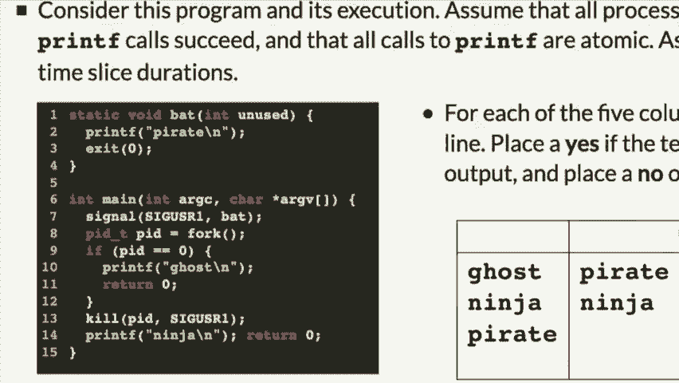

让我们看看这种情况是否可能。好，想让海盗事件发生，我们必须先分叉并在子进程有机会打印幽灵之前发送一个`kill`信号。那可能吗？当然，似乎是可能的，对吧？然后，这将触发子进程的信号处理程序，打印一个海盗，打印海盗，这很好。

然后那将结束。然后我们仍然在这里。然后我们可能会在某个时刻打印忍者。那有道理。好的，我认为这是合理的。我认为这几种情况都很有可能。

看下一个问题。我要完成这个。忍者和幽灵怎么样？

如果`bat`返回而不是退出，那么你肯定会在某个时刻遇到幽灵，没错吧？因为它是退出的，对吧，它并没有返回，它退出了实际信号，即子进程本身。它关闭了，使用`exit`终止了子进程。好问题。好选择。好了，让我们看下一个问题。忍者和幽灵。为什么忍者会先于幽灵发生呢？嗯。

假设现在子进程比较慢，我们可以到这里，我们发送这个信号。好的。那么，如何发生这种情况呢？这个信号，理论上是会触发子进程执行海盗的，这个信号在这里触发然后上升，打印出来返回后，但接下来的这个永远不会发生？不，我不认为这种情况会发生。对吧？

因为一旦信号处理程序发生，它会停止下面所有的事情。所以如果你碰到那种情况，对吧，试图让 ghost 发生，对，那么这必须在这个发生之前，所以你会在这里调用信号，然后你最终会先得到 pirate，而不是 ghost。

所以没有真的可能在没有 pirate 发生的情况下发生 ghost，如果你先发送信号。所以不，我不认为是这样的。对？我们知道，我们知道。但调用 show 必须在那里发生，我们不能。实际上不知道这个标题到底什么时候会错过。

信号就像是你发送信号，忍者被打印出来，然后是十字架。然后当子进程退出时，打印仍然会在那里，原因是它还没有接收到信号。对。所以信号会立即发生。这是接下来发生的事情。所以即使它已经打印了 ghost。

它仍然会收到信号，实际上，然后必须打印 pirate。所以我认为你不会真的得到，记住我们不能说，哦，这两件事会紧接着发生，对吧？但我们可以说，信号肯定会发生。如果它打印了，那对，等我打印完，如果这已经打印了。

信号已经发送了。所以信号已发送这一事实意味着，即使这个被打印了，它也必须接着做 pirate，因为它永远不会到达 return zero。这样有帮助吗？对。对。对。对。对。对。对。对。对。所以信号处理程序停止了。因为，再次，这其实是我之前的问题，哪个在发生，这在发生。

在这个案例中，子进程正在发生什么？信号处理程序，子进程是一个进程。它不能同时做两件事。所以它要么在处理信号，要么在执行程序的其余部分。如果它正在处理信号，程序的其他部分就不会发生。对。如果你先有了 ghost，然后它返回了，你试图发送它到信号处理程序，会发生什么？

如果你有 ghost 然后它返回，返回主函数将调用关闭程序。实际上可能再执行一到两条指令。但是我猜那样的情况不会发生在这个程序中。你明白为什么吗？因为你发送了 kill 信号。即使太晚去做 ghost，它会在返回之前发生。好。

因为它，发生的瞬间你发送信号，并不像返回那样。问题是，内核会说，哦，我猜有一个信号，我立刻把它发送到子进程。如果它返回了，如果 printf 运行后，它确实返回了，那么其中还是有一些时间，信号处理程序仍然能接收到它，依然会发生，但可能不会持续很长时间。

返回时，你的返回并不会立即停止程序。不，退出才会。退出就像是我们结束了。是的。在第二种情况下，为什么它不会去呢，既然你得到了它？

为什么忍者之后不会打印鬼？我们来看，海盗确实退出了。它实际上阻止了子进程的发生，结束了它，完全终止了子进程。进程完成。是的。好问题。是的。那么第二种情况，为什么你还会返回零呢？再次说明，返回零最终是有效的，但实际上还有一点时间。

在返回零和程序结束之间的时间里，还涉及一些清理工作。你实际上是在传播。实际上，这是一条不同的路径，通过返回 shell，如实际情况所示。它并不是返回，函数调用意味着。当你说退出时。

实际上，它永远不会返回到那个调用函数，事实证明。它只是立即结束了。或多或少。我的意思是，里面仍然有一点时间，但它立即结束了。你可以这么理解。但它并没有从中返回。我猜更大的问题是，它不返回，以至于**这个**永远不会被打印出来。换句话说。

退出零永远不会到达，它意味着永远不会返回到父进程，完全不会。因此，**这个**不会被打印出来。对吧？好吧。好了，我们有两个。让我们看看这里的其他问题。我们能做忍者海盗忍者吗？不，那太傻了。Ninja pai。Ninja pai，你无法到达那里。你能做忍者海盗鬼吗？

Ninja pai。 这是我们之前讨论过的，对吧？Ninja pirate ghost。好吧，先是忍者，然后是海盗，如果海盗发生了，你将永远无法回到这里。如果设定了海盗，程序的其他部分将无法再返回。是的，不，不，是的，是的，不，不，不。好了。好吧，还有一个我今天没有时间做的，但这是另一个期中考试题目。

我们将在星期三从这里开始。这是另一个竞态条件问题。如果你想的话，随时可以看看它，但这是期中考试中的另一个题目。

星期三见。
