# P9：Lecture 8-1 Assignment 3 - ___main___ - BV1ED4y1R7RJ

 Hi there， this is Chris and this is a video on assignment three and I apologize for being。

 late and I apologize that I didn't get to it in class today。 So assignment three is。

 as the title says， everything about multi-processing。

 So you're going to have to do lots of multi-processing here。 Specifically。

 you're going to use fork and exec CVP and you're going to use weight PID。

 and you're going to use pipe and you're going to use dupe or probably dupe two as it turns。

 out and all the different things that we've learned about in order to do four different， programs。

 The first two are relatively minor and the third one and fourth one are a little bit。

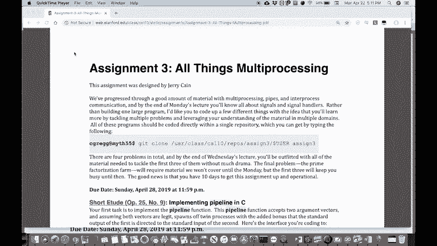

 bigger。 So let's dig right in。 So the first assignment is pipeline。

 the first part of the assignment is pipeline。 Now pipeline does the following。

 Pipeline takes in two parameters that are basically command line arguments that include the program。

 name as the first argument and then all of its arguments after that and then a second。

 argument list that's the same thing。 So basically。

 and then it takes in an array of PIDs which is empty when you start， this。

 will be filled when the pipeline function returns and we'll have two PIDs in it that。

 are the two PIDs for the two children that your pipeline is going to create。

 The first of which will send its standard output into the second one's standard input。

 So what does that actually mean？ Well， what you're basically doing is you're setting up a system like the following。

 Okay， let me pull up a terminal here and show you what's going on here。

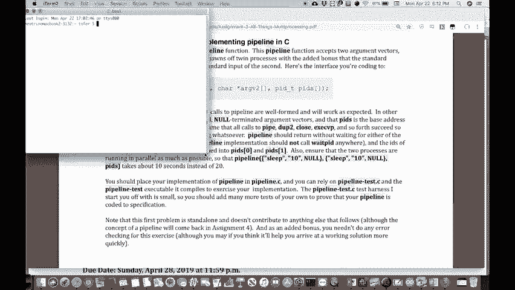

 So you're basically setting up a two programs that will basically do the following。

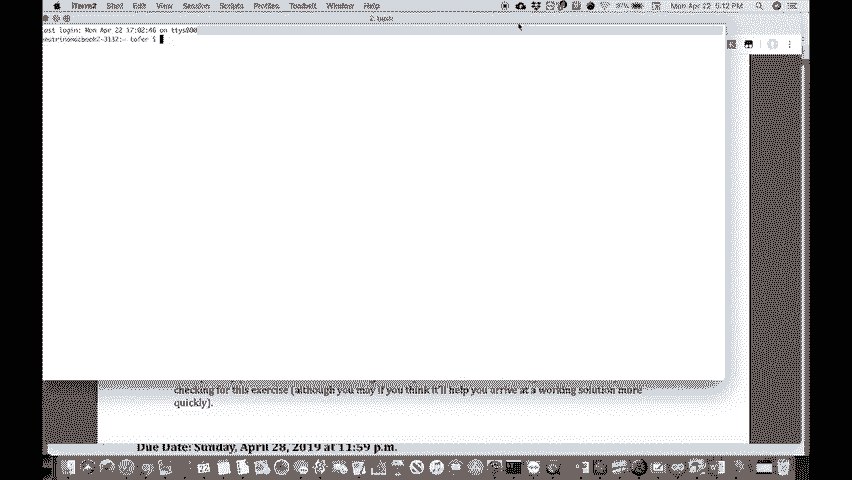

 Okay， if you do something like the following。 Let's see。

 let's just say I have a test file about TXT and inside it I'll put some fruit， name。

 BANNA and apple and donut which is not a fruit at all。

 And let's put in cantaloupe and so you have these sorts of fruits and other things in， your list。

 Okay， and that is test file。 Let's say we wanted to cat test file， in other words printed out。

 right？ And we wanted to then pipe it through sort which would sort the words in the list。

 So what's happening here？ Well， cat is taking the file and inputting from the file and outputting through standard。

 out， if you just type cat test file then it prints out to the terminal which is standard， out。 Okay。

 this is important。 And then sort is taking input from standard in。 How do I know it's standard in？

 If I just type sort and start typing things， right？

 And if I type and then these are standard in and it's just accepting this。

 And when I do control D it will actually end the input and it will sort it。

 Sort it will actually sort it。 So sort is taking standard input and printing it to standard output and cat is taking input。

 from this file as it turns out and printing it to standard output。 Alright。

 so what does that actually mean in terms of your pipeline file？

 When you do cat test file dot txt pipe through sort the standard out of cat， standard out。

 of cat becomes the standard in of sort。 And how do we do that？ Well， we have to do that via a pipe。

 Okay， so you have to say basically you have to pipe the output of test file that our cat。

 test file txt into sort。 Okay， in fact later in the next assignment you'll be able to do it through more pipes。

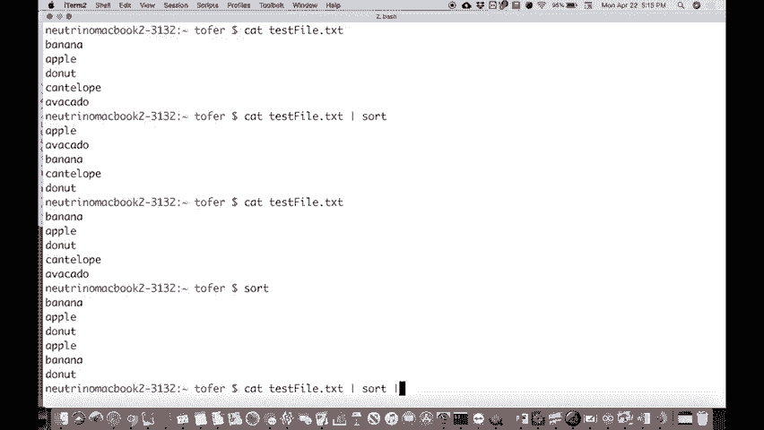

 as well。 Basically standard out of cat becomes standard in of sort。

 standard out of sort becomes standard， in for word count。 Okay。

 now pipeline is only two of these but that's how it works。 Okay。

 now let's talk a little bit more about the actual pipeline itself。

 Well， remember what pipe does。 Okay， pipe when you say FDS when you have an array of file descriptors basically like。

 this int FDS 2， you have a 2。 And then you do that pipe creates two file descriptors。

 FDS 0 is the reader and FDS 1 is the writer。 Okay。

 when you write into FDS 1 you can read that text from FDS 0。 Okay。

 now let's talk just briefly about the example we had before。 We had cat file test。

txt or whatever it was。 Okay， well that is going to need to redirect its standard out。 Okay。

 and then we also have the sort， right？ Well， and sort needs its standard in redirected。 Okay。

 so basically standard， and I should do it this way I guess， we should say that， standard out。

 so basically FDS 1 which is the writer， okay， okay， needs to be kind of。

 translated to SD standard out for file test and FDS 0 needs to be translated to SD standard。

 in for sort。 Okay， that's really all there is to it。

 This is not a long program。 There will be two forks in this file。

 One to fork the first program and one to fork the second program and up third program， in this case。

 One to fork let's say one to fork cat and then one to fork sort in this case。

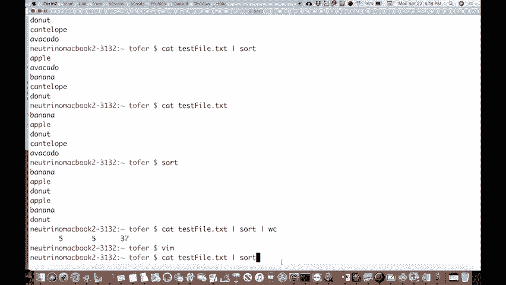

 Okay， so that's how pipeline works。 All right， the next part of the assignment is subprocess。

 Now subprocess is， this one is C++ by the way， so make sure you get your C++ going。

 It feels a lot like C still but it is technically C++。

 Now this uses a struct called subprocess_t and this subprocess basically function does。

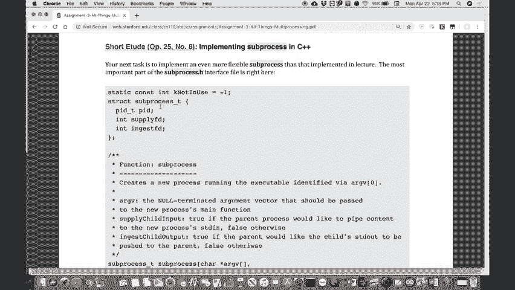

 the following。 It， the subprocess function creates one executable and it。

 in fact here is the definition for。

 it， creates one executable which is the same as the pipeline one by the way， it has a list。

 command list in an array。 And it has two booleans which say do I want to provide the supply child input or do I。

 want to ingest the child output。 Okay， so in other words， if it's true。

 I want to get return to me in the subprocess_t struct。

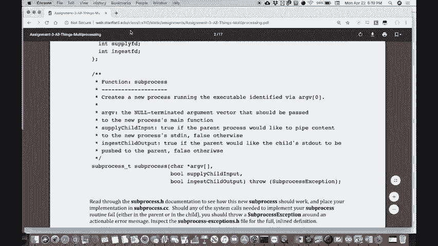

 a file descriptor which I am allowed to write to which will be input into the subprocess。

 into the child。 Okay， if I have true for the second or the third parameter actually。

 the ingest child， output。 Okay， basically this one says I'm going to get a file descriptor such that if I read。

 from it it is whatever the child produced on standard out。 Okay。

 it's whatever the child produced on standard out。

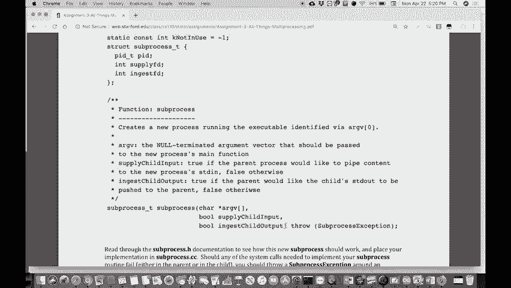

 And that's how it works。 Okay， so it's kind of similar to the。

 it's similar to the pipeline in the sense that you've， got a pipe here or at least one pipe。

 I've probably said too much already。 You need to handle such that you will be able to get back the file descriptor such that。

 you can either write to that subprocess or you can read from it。

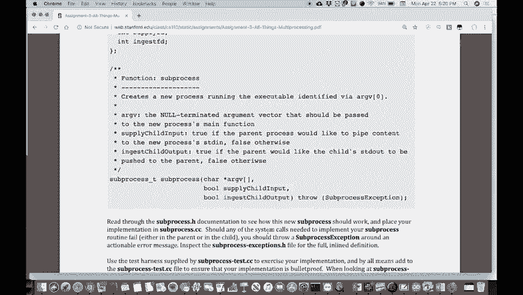

 Okay， so that's basically the big idea。

 I'm not sure there's much else to tell you about that one。

 So the next one is a little more difficult to kind of understand。 This is the trace function。

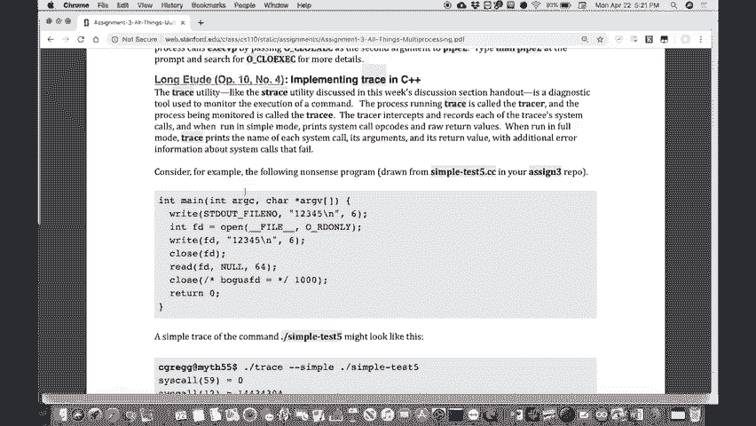

 Now basically in some sense you are writing a little bit of a debugger。 Okay。

 you're writing a debugger that captures all system calls and reports the output of。

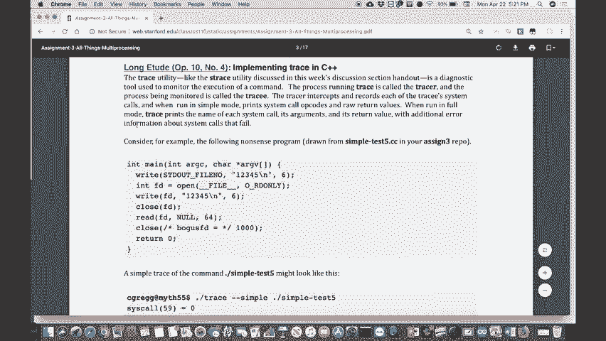

 those system calls or actually the， not necessarily the output， it reports the details of those。

 system calls to you。

 Okay， so if we had a function like this main function， okay， and we used the trace function。

 to do it。

 Well， what it does is it says， okay， first we got a syscall 59 and it returns a little。

 term 0 and then we have a syscall 12 and it returns 1， 4， 4， 3， 4， 3， 4。 And by the way。

 some of these numbers will be different for you than in the assignment， handout here。 Okay。

 don't worry about some of the numbers。 Some of them are going to be the same。

 Some of them are going to be different and sanity check will ignore values that are different。

 It will just look for a value and then ignore it if it's different。

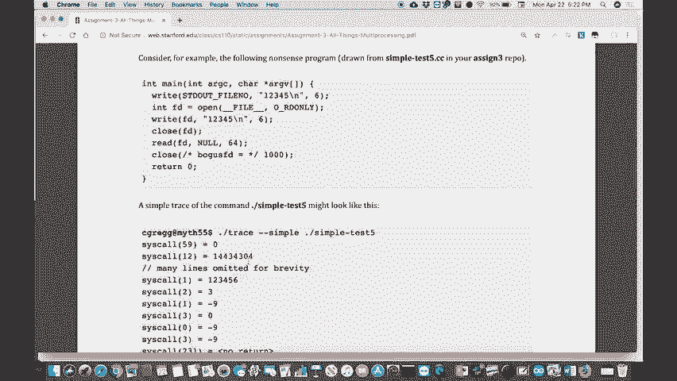

 Okay， and then there's lots of other things to happen and then we get a bunch more syscalls， here。

 And then finally we get a syscall 231 here that does not return anything and then the。

 program exits。 And that should be the output of your trace。 Okay， so again。

 trace captures all the system calls from a program that it runs and it reports。

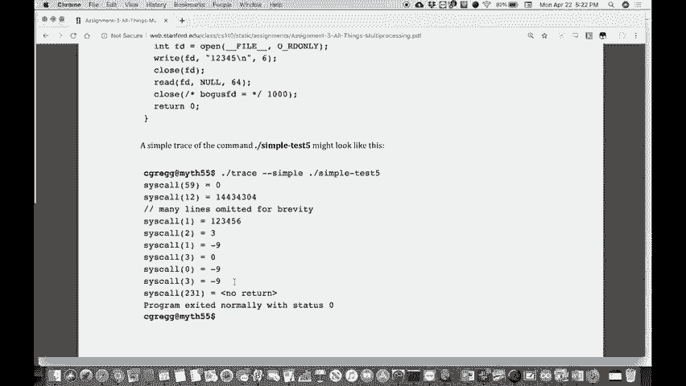

 those to you。 Okay， so it's an interesting way to see all the different system calls that your program。

 is making。 In fact， there's more than you might think， right？

 There's lots of different system calls for things here。

 Some are by the way for opening and writing and closing and reading and closing and so。

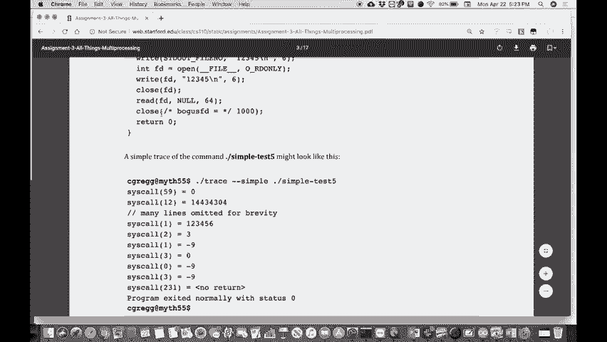

 forth。 There's also a lot of other ones happening as well。

 Okay， that is the simple trace by the way。

 Then we have a full trace where it gives you much more information about that。

 Okay， about the actual system calls。 Okay， it doesn't just say what the system calls are。

 It says syscall it actually says specifically which system call it is。

 And you have to look this up in a map。 And in fact。

 I think there's two maps here that you have to utilize to look the information， up。

 Okay， there's also an error map as well that you have to look up。

 So there's a few different maps here that you have to wrap your head around to get that。

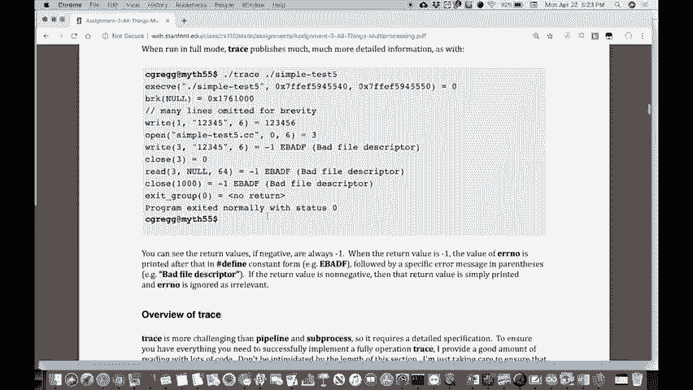

 Okay， trace is definitely more challenging because it has a lot more going on。

 And so make sure you read through a lot of this here。

 The big thing to understand is a little bit anyway is how ptrace works。

 ptrace is another system call and it allows a program to make another program stop at。

 various points， particularly after system calls and so forth。

 And it allows it to capture that information。

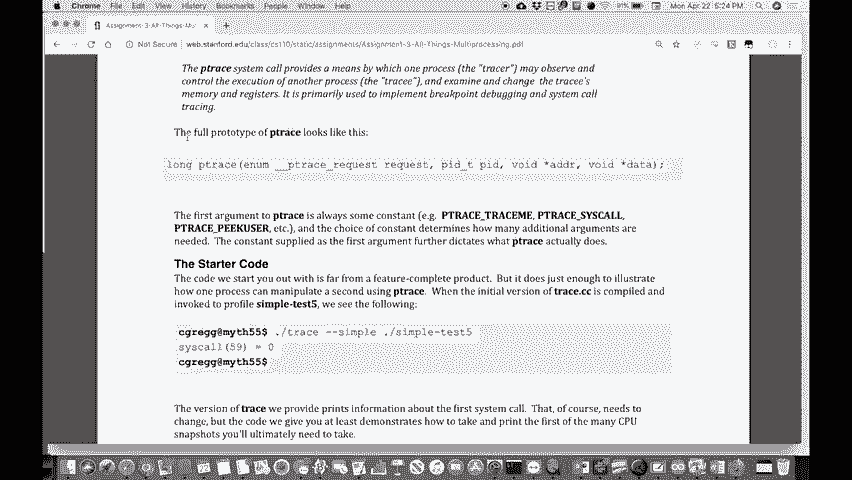

 Okay， so we give you a kind of a basic one that doesn't do much in the starter code。

 Make sure you read through all the header files and make sure you understand the actual。

 maps and things that we'll talk about in a few minutes。

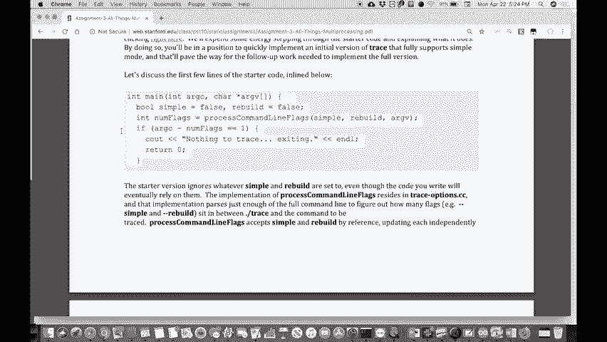

 The initial starter code basically ignores a lot of things and then it ignores kind of。

 the simple and rebuild and then it ends up using this process command line flags to actually。

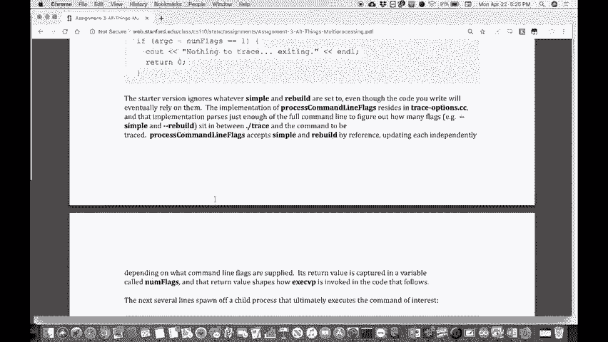

 run the trace itself or actual well process and then it runs the trace based on those。

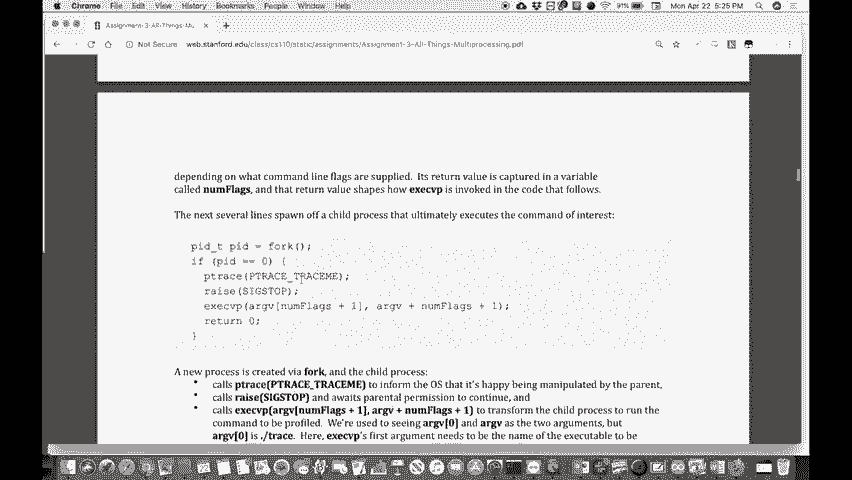

 Okay， we in this case we fork off a child which is the name of the program that you've。

 actually asked it to trace through。 And then it calls ptrace on ptrace trace me which basically says。

 "Hey， I'm about to。

 trace you。"， And then it raises a signal stop on itself。

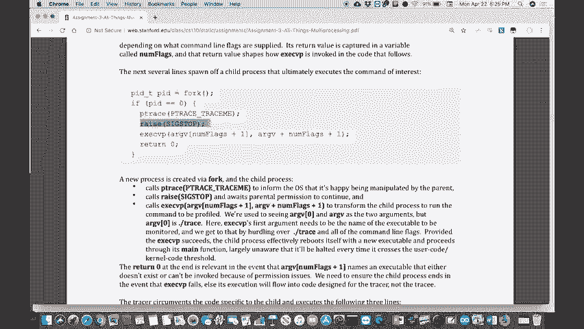

 So remember this is in the child and it starts the child running and then stops it。

 Why？ Because we're in the process of tracing it so it's kind of like a debugger where it runs。

 maybe one line and stops。 In this case it runs a couple lines of the actual or it stops it before it actually runs。

 the program that we're trying to do。

 Okay， why？ Because we still need to set some things up in the parent。

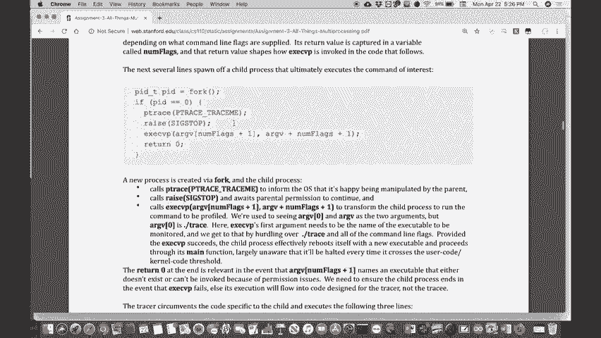

 Okay， so you can read through this about how it actually does its thing here。

 Okay。 And then the tracer itself has to basically run a weight PID and another ptrace here to。

 say what happens when the child actually stops。 So in this case when we do weight PID in this case well it ends up returning the PID of the。

 child process that just stopped。 And so we know what the PID is and so forth。 Okay。

 And then it says， "Well yes it actually stopped。"。

 And then it sets some more tracing ability on the actual child process。

 Okay。 All right。 And then what do we have？ We have the。

 this is basically a wild true loop that goes through and for the basic one。

 anyway just keeps the program running okay until it gets to a system call。 All right。

 And then that's what this does。 It says ptrace， ptrace until a system call and then wait until the function gets to it。

 or the program gets to a system call and that's that。

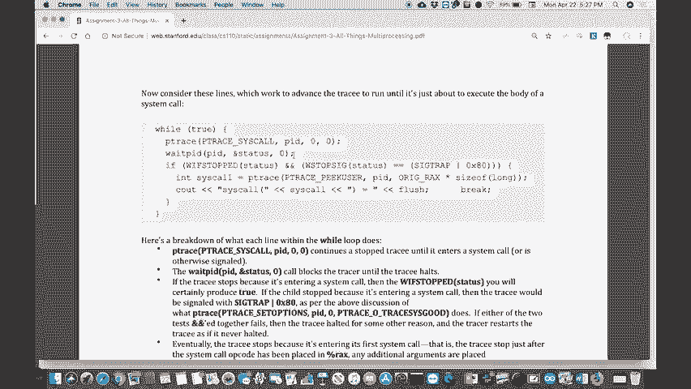

 Okay。 And you can read down through all the details of this as well。

 A couple interesting things are that you need to find the opcode which is in percent。

 RAX which is one of the registers as you know from 107。 107 E folks， RAX is one of the registers。

 It's kind of like R0。 And then you end up getting the details of that register which by the way lives in the。

 child process with another command called ptrace or with ptrace peak user。

 This is reading the information from the actual program itself。 Okay。

 That's where it stores that opcode。 Okay。 And then you have to do a couple of other things where you flush and so forth。

 Okay。 And now you need to do another loop where you actually go ahead and print out the return。

 value which you have to do by another ptrace function。

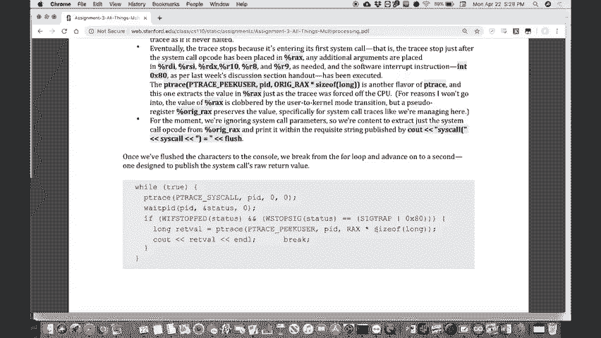

 Okay。 All of this is written for you。 Okay。

 And what you're going to do is you are going to modify it to actually get more details out。

 of it。 Okay。 So you need to change trace。CC to support simple mode and print out these details like this。

 Again， this one's not getting the names or using those maps at all。

 It's just saying look a system call happened and the number was one here was the return。

 value。 Okay。 And that's what it was。 And then program exit。

 In fact there should be a new line right in there。 I have to fix the output here。

 Okay。 All right， there's the words of wisdom and for the simple trace。

 And again don't worry about the details of the numbers。

 They will， they're important but they're not specific。

 Like they'll be different on different times through the program。

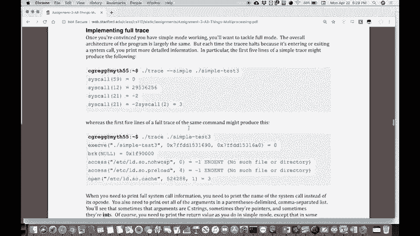

 Okay。 Then you have to go for full mode。 And full mode is basically the same idea。 Okay。

 Again， I have a missing new line here。 I'll have to fix that。

 It has a， it's basically the same idea except now you have to get the actual details of。

 the， what function call it is。 And this is where you're going to read through the maps that get the error number and get。

 the actual names of all the function calls。 We've actually pulled those from some header files but we've given those those details to。

 you。

 Okay。 All right。 Let's see。 How do you actually get the argument， the argument list？ Another map。

 So these are all the little maps you have to read through。

 I'll let you read the details of all of those there。

 Okay。 This is pretty specific。

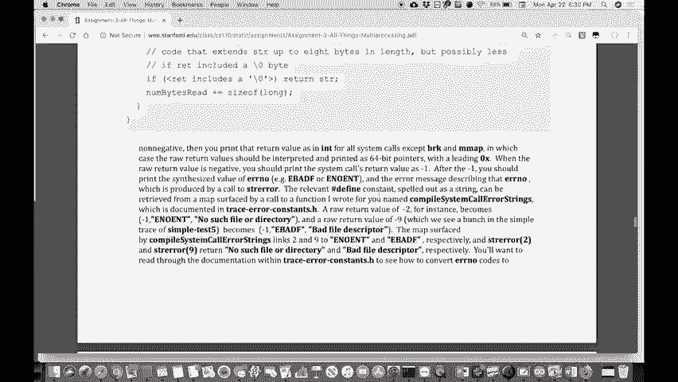

 Again， I don't want to necessarily go through all the details because it's all written out。

 for you here。

 But it's a matter of knowing the maps and knowing how to read through them。

 And actually get those details。 Okay。 All right。

 It's more output here。 And again， we've talked a little bit about ptrace as you go through here。

 The maps。 Here's where it talks about the different maps here that you have to use for getting。

 the system call names and the error messages and so forth。 Okay。 Again。

 lots of details here that you have to read through。

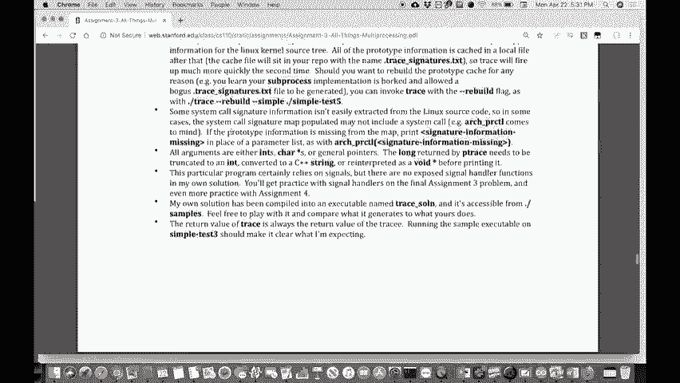

 Okay。 So basically， what's the takeaway on this？

 This is one of the harder parts of this assignment。

 I think it's challenging mainly because there's a lot going on and there's a lot of things。

 like reading memory from another program through registers that seems tricky。

 And it's not easy， but it's not too too bad when you actually go and dig into the details。

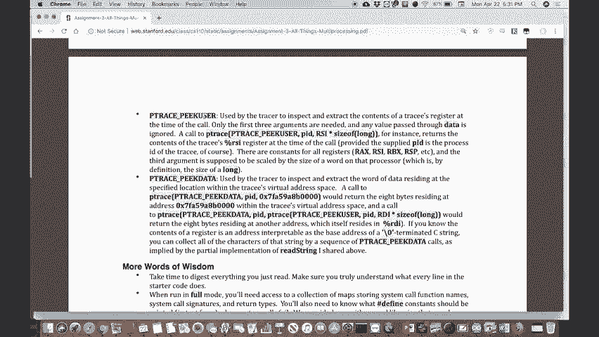

 Again， feel free to ask questions on Piazza come to us hours。

 It will help you out if you have trouble understanding what you're trying to do。 Okay。

 So the final part of assignment three is kind of a cool program called farm， which is basically。

 going to use all the cores on a particular myth machine to factor numbers for you。 Okay。

 And there's going to be all sorts of processes that you're going to launch onto the various。

 processors of the myth machines。 And they are going to wait for your program to feed them numbers and they are going to。

 factor those numbers。 Okay。 So here's how it actually works。

 Take a look at this Python program。 Now the actual factoring is going to be done by a Python program。

 You don't really need to understand Python necessarily。

 It's although it's a fairly easy program here to understand。

 But basically this Python program checks the command line arguments and see if it's self-haulting。

 or not。 And then it is self-haulting as it turns out when we run it。

 And it is going to get its own PID。 And then it's going to go through this while loop。

 And in the while loop， the first thing it's going to do is it's going to stop itself。

 In other words， it's going to pause itself to wait for input from your program。 Okay。

 so it's going to be a farm of all these different processes that are waiting for。

 input from you as the coordinating process from your parent as it turns out。 Okay。

 Once your program continues this Python program， it is going to read in a number。 Okay。

 And it's going to read the number and then start a timer immediately because we want a。

 time how long it takes to factor these。 And it's going to actually factor it。

 Then it is going to stop the timer。 And then it is going to print out the factorization。 Okay。

 And then it's going to continue back in the while loop and wait for another number。

 Eventually you will close the input that you are sending to this Python program at which。

 point it will close the actual Python program。 Okay。

 So that's how the Python program does it。 It's the one doing the factoring。 Okay。

 So what do you have to do for this？ Well this is how it works。

 You say something like print F 1357 new line 13， works。

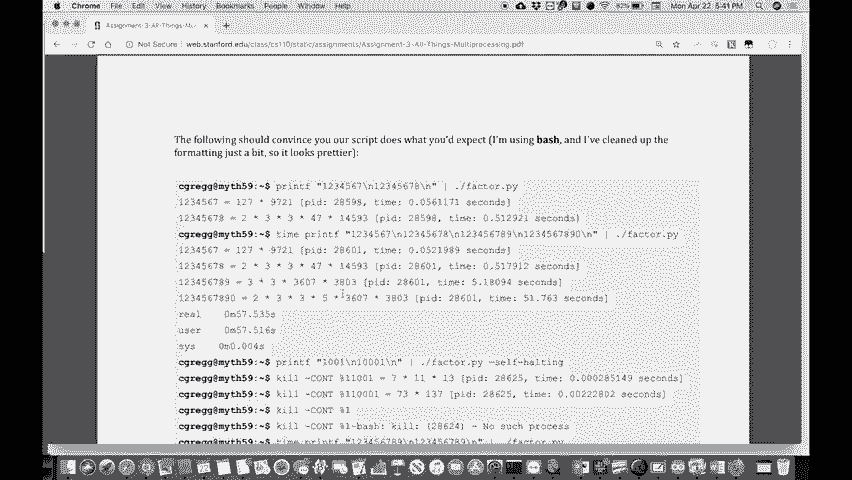

 Then you can send the kill system call which basically remember it doesn't necessarily， kill it。

 It actually continues it。

 And then the number you want to actually factor gets printed out here and it tells you。

 how long it takes and so forth。

 Okay。 So that's how the actual Python program works。 Okay。

 This factorization is not a fast factorization。

 You will see that when you this is actually good for testing because you can test and see。

 how long it takes to do these things。

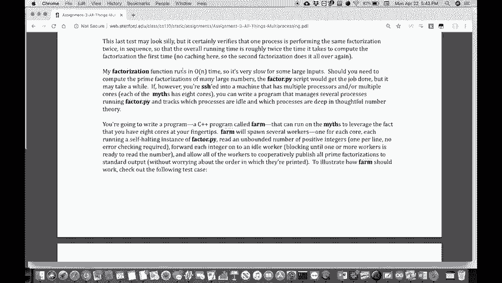

 It's not not fast which is good。 Okay。 Your job is to write a program that runs on the myths and spawns several what we call。

 workers one for each core and then of the self halting factor and then sends numbers。

 to that program to be factored。

 Okay。 So here's how it might work。 You might say time print F and then this long string separated by new line number separated。

 by new lines and then send it into farm。 It says if you typed those numbers on the standard in by the way and then it should say。

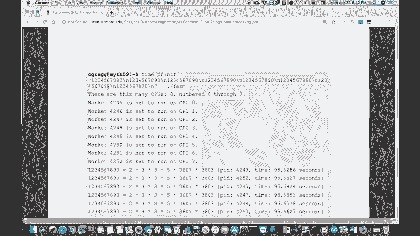

 how many CPUs there are。 It should number the knowledge and send all the workers on different CPUs and then it should。

 start factoring them。 Okay。 And it will factor all those numbers one and each core as it turns out and it will take。

 about the same amount of time for each one but the total time is only going to be the。

 basically the time you want because they're all happening in parallel。

 Okay。 So that's the basic idea。 Of course there is a struct here that you have to understand called worker。

 Okay。 And there's a let's see worker has a it is a C plus plus struct by the way so it has things。

 like constructors in it。 So it's got a constructor that takes in an argument and the arguments for the constructor。

 are the parameters that end up getting processed for the constructor。

 It basically sets sp to be this guess what that's a subprocess which is from your other。

 program and then it immediately sets it to be not available and it only becomes available。

 when you actually allow it to become available you see that later。 Okay。

 And then it has the two variables that it has inside the struct。

 Okay。 All right。 And there's a couple other constants in here and then in mean what we do is we have a signal。

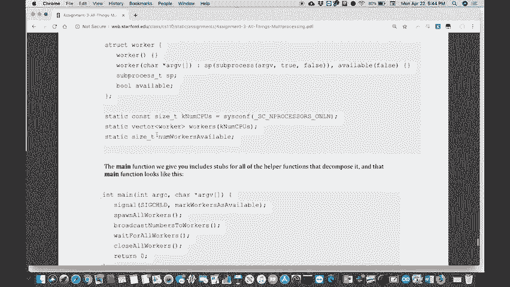

 okay which is SIGCHILD and mark workers is available。

 Remember SIGCHILD gets SIGCHILD actually gets called or rather the signal handler for SIGCHILD。

 gets called when the your process continues or stops or halts。

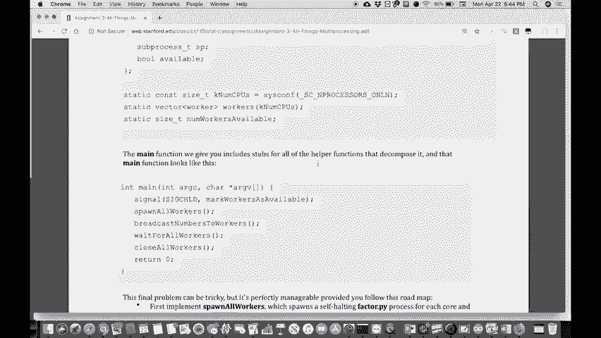

 Okay。 All right。 And then you're going to spawn all the workers you're going to actually launch them all then。

 you're going to send all the workers all the numbers to those workers then you're going。

 to wait for them all to be done and then you're going to close them all。

 Okay。 That's the basic idea of this program。

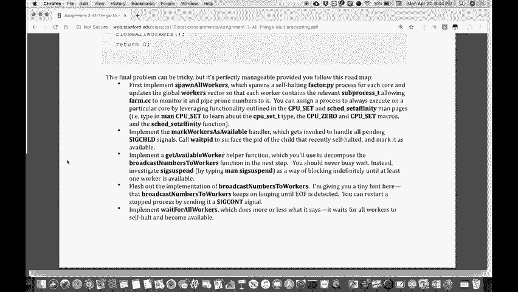

 Okay。 So you can read all the details about this as far as what is responsible what you're responsible。

 for there。 Okay。 But basically we have we've implanted a little bit of some of these things most of this in。

 here to actually broadcast the numbers to workers。

 You have to write a couple more lines of code down here and basically this just kind of。

 sets it up so that you can send the numbers to the to the workers。

 Okay。 And you also should make sure that you send you have a close all workers routine that sends。

 that stops all those programs。 Remember how do you stop those Python programs you close the file that they are reading in。

 from。 Okay。 So it's if you can control D on the command line or if it was reading from a file in the。

 file ended。 Okay。

 All right。 So that's basically it。 We give you some details about farm here but for the most part got the main function you。

 have to implement these functions here。

 Okay。 Mark workers will be able to implement spawn all workers broadcast numbers to work with。

 wait for all workers and close all workers。 Okay。 The basic idea is send all of these numbers to a bunch of Python processes that are waiting。

 for you to send them numbers。 All right。 That should do it。 Thanks。 And again。

 put your questions on Piazza or stop by office hours。

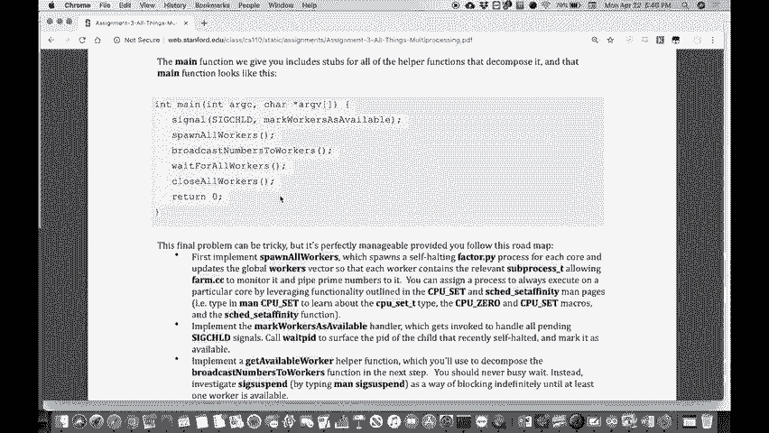

 Thanks。 you。