# P9：讲座 8-1 作业 3 - ___main___ - BV1ED4y1R7RJ

大家好，我是克里斯，这是一段关于第三次作业的视频，我很抱歉今天在课堂上没能讲解完。

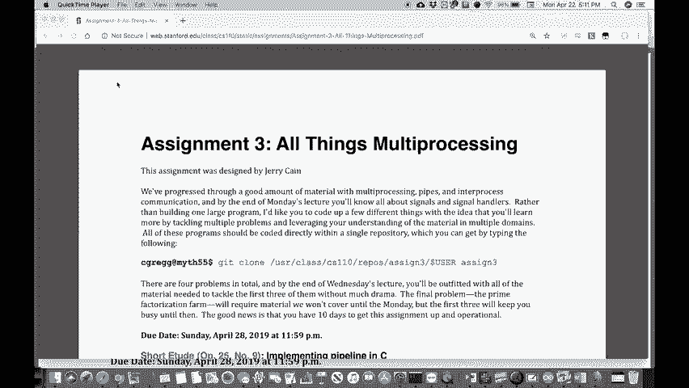

很晚了，我很抱歉今天没有在课堂上讲解这个内容。所以，第三次作业是的，标题上写着，关于多进程的一切。所以你将不得不做很多多进程的工作。特别是，你将使用`fork`和`execvp`，并且会使用`waitpid`。

你将使用管道，并且你会使用`dup`或者可能是`dup2`，正如我们所学的所有内容，来执行四个不同的程序。前两个比较简单，第三个和第四个稍微复杂一点。

更大。所以我们直接开始吧。第一个任务是管道。任务的第一部分是管道。现在管道做以下事情。管道接受两个参数，它们基本上是命令行参数，其中第一个参数是程序的名称，然后是所有其他参数，之后还有第二个。

参数列表是相同的。所以基本上。然后它接受一个空的PID数组，开始时为空，管道函数返回时这个数组将被填充，我们会有两个PID，它们是管道将创建的两个子进程的PID。

第一个将其标准输出发送到第二个的标准输入。那么这实际上意味着什么呢？嗯，基本上你在设置一个如下所示的系统。好的，让我打开一个终端，给你展示这里发生了什么。

所以你基本上是设置了两个程序，它们将执行以下操作。

好的，如果你做类似以下的事情。让我们看看。假设我有一个名为`test file.txt`的文件，里面写着一些水果名称，香蕉、苹果和甜甜圈（这显然不是水果）。然后我们再加上哈密瓜，所以你会在列表中看到这些水果和其他东西。

好的，这就是测试文件。假设我们想要显示测试文件的内容，换句话说，打印出来，对吧？然后我们想把它通过管道传递给排序，这样就可以对列表中的单词进行排序。那么这里发生了什么？嗯，`cat`命令从文件中输入内容，并通过标准输出输出，如果你只输入`cat test file`，它会打印到终端，也就是标准输出。好的。

这很重要。然后`sort`命令从标准输入接收输入。我怎么知道它是标准输入呢？

如果我只是输入排序并开始输入内容，对吧？

如果我输入，然后这些是标准输入，它只是接受这个。当我按下控制+D时，它实际上会结束输入，并且它会对其进行排序。

`Sort` 它实际上会排序。所以 `sort` 是接受标准输入并将其打印到标准输出，而 `cat` 则是从文件中接受输入并打印到标准输出。好的，那么这在你的管道文件中到底意味着什么呢？

当你执行 `cat test file dot txt` 通过管道传递给 `sort` 时，`cat` 的标准输出成为 `sort` 的标准输入。那我们是怎么做到的呢？嗯，我们必须通过管道来实现。好的，你基本上需要把 `test file` 这个文件通过 `cat` 传递的输出管道传递到 `sort`。好的，实际上在下一个作业中，你将能够通过更多的管道来实现这一点。

同样地，基本上 `cat` 的标准输出成为 `sort` 的标准输入，`sort` 的标准输出成为 `word count` 的标准输入。好的，现在管道只有两个这样的操作，但它就是这样工作的。好的，现在让我们稍微谈谈实际管道的工作原理。

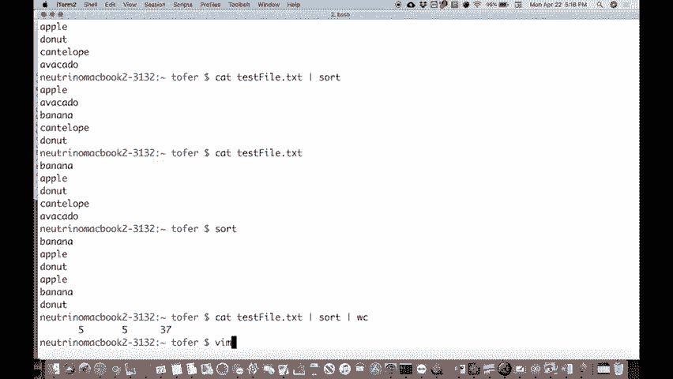

好了，记住管道的作用。好的，管道当你说 FDS，当你有一个文件描述符数组时，比如这个 `int FDS 2`，你有一个 2。然后你执行管道时，它会创建两个文件描述符。FDS 0 是读者，FDS 1 是写入者。好的，当你写入 FDS 1 时，你可以从 FDS 0 中读取文本。好的。

现在让我们简要谈一下之前的例子。我们有 `cat file test.txt` 或者它是什么的。好的，那么它需要重定向其标准输出。好的，然后我们也有 `sort`，对吧？那么 `sort` 需要其标准输入被重定向。好的。所以基本上标准，我想我应该这么做，应该说，标准输出。

所以基本上，FDS 1，即写入者，好的，好的，需要被转化为标准输出文件测试，而 FDS 0 需要被转化为标准输入 `sort`。好的，这就是所有的操作。

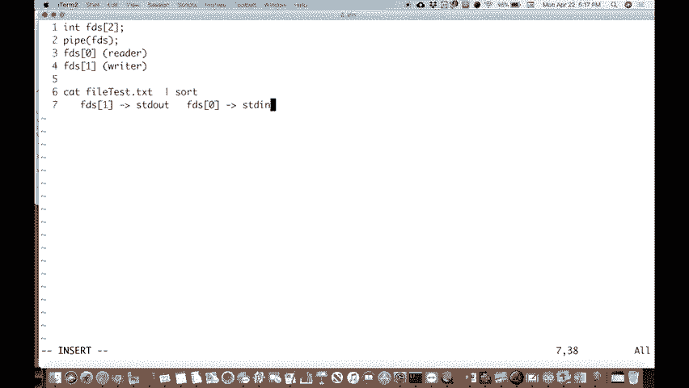

这不是一个长程序。这个文件里会有两个分叉，一个是分叉第一个程序，另一个是分叉第二个程序，再加上第三个程序，在这个例子中。一个是分叉 `cat`，然后一个是分叉 `sort`。

好的，这就是管道的工作原理。好了，作业的下一部分是子进程。现在子进程是，顺便说一下，这是 C++，所以确保你准备好你的 C++ 环境。

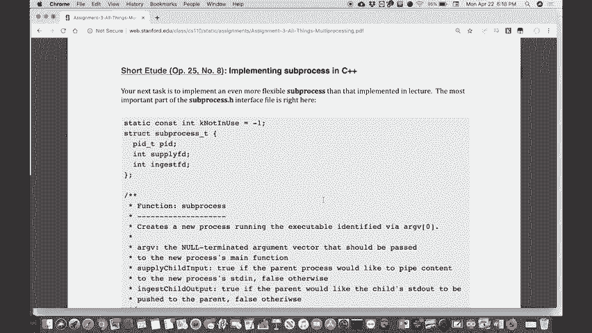

它感觉还是像 C，但从技术上讲它是 C++。现在这个使用了一个名为 `subprocess_t` 的结构体，这个子进程基本上执行的功能是。

以下是它，子进程函数创建一个可执行文件，实际上这里是它的定义。

它创建一个可执行文件，顺便提一下，它和管道中的那个是相同的，它有一个列表。

在一个数组中列出命令。它有两个布尔值，表示我是否想提供子进程的输入，或者我是否想……

想要获取子进程的输出。好的，换句话说，如果它为真。我想在 subprocess_t 结构体中返回给我。

一个我可以写入的文件描述符，这将作为输入提供给子进程。

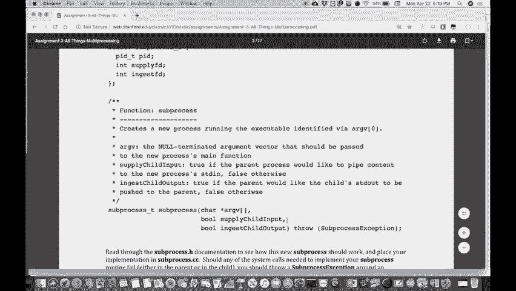

进入子进程。好的，如果我为第二个或第三个参数设置为 true，实际上就是 ingest child 输出。好的，基本上这个意思是说，我将获取一个文件描述符，这样如果我从中读取，它就是子进程在标准输出上产生的内容。好的，它就是子进程在标准输出上产生的内容。

这就是它的工作原理。好的，所以它有点类似于管道。它在某种意义上类似于管道，你看，至少这里有一根管道。或许我已经说得太多了。你需要处理这种情况，以便能够获取文件描述符，这样你就可以向该子进程写入数据，或者从中读取数据。

好的，所以这基本上就是大致的想法。

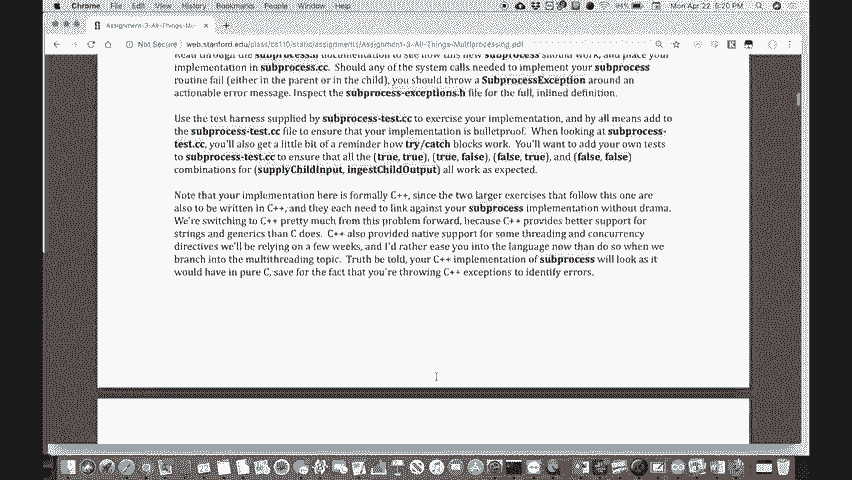

我不确定关于那个问题还有什么更多要告诉你的。所以下一个问题稍微难一些，稍微难以理解。这就是 trace 函数。

现在，从某种意义上说，你基本上是在写一个小型的调试器。好吧，你正在编写一个捕获所有系统调用并报告输出的调试器。

这些系统调用，实际上，不一定是输出，它报告了这些系统调用的细节。

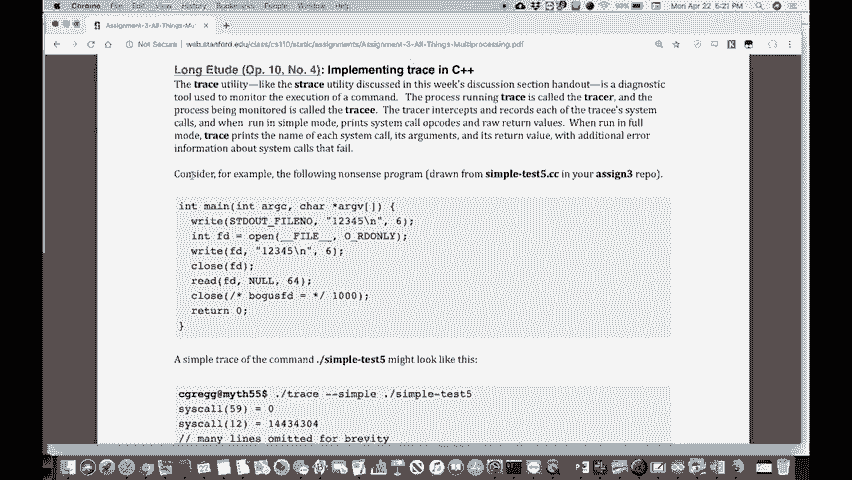

系统调用到你这里。

好的，如果我们有像这个主函数这样的函数，好的，我们使用 trace 函数。

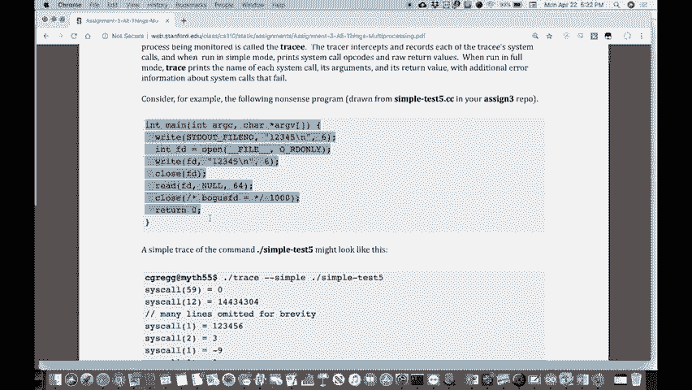

去做吧。

好吧，它的作用是这样：首先我们得到了系统调用 59，它返回了一个小的值。然后我们得到了系统调用 12，它返回了 1，4，4，3，4，3，4。顺便说一句，某些数字可能与你在作业手册中看到的不同。好的，不用担心这些数字中的一些。它们中有些会是一样的。

有些数字会有所不同，理智检查会忽略不同的值。它会查找一个值，然后如果值不同，就会忽略它。

好的，然后有很多其他事情发生，接着我们会得到更多的系统调用，在这里。然后最后我们得到一个没有返回任何东西的系统调用 231，接着程序退出。这应该是你跟踪的输出。好的，所以再次强调。跟踪捕捉程序运行中所有的系统调用并报告。

这些给你。好的，这是一个有趣的方式，可以查看程序中的所有不同系统调用。

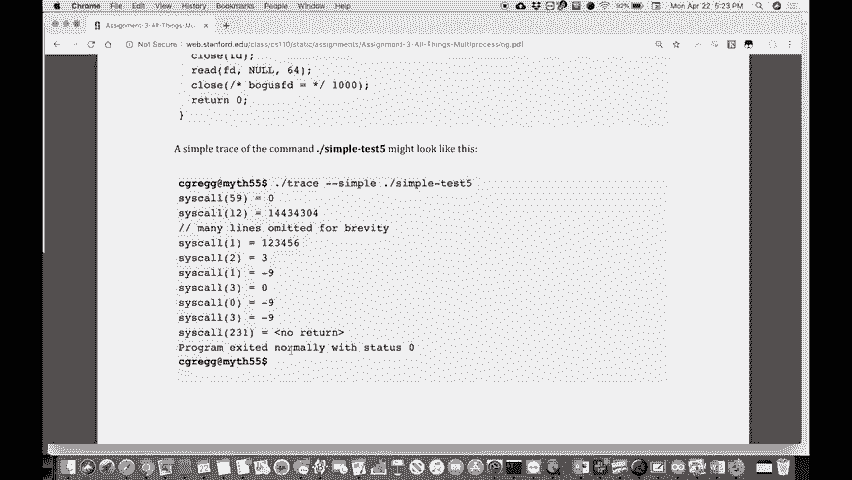

它所做的。事实上，比你想象的还要多，对吧？

这里有很多不同的系统调用。顺便提一下，有些是用来打开、写入、关闭、读取、关闭等操作的。

等等。还有很多其他的也在发生。

好的，顺便说一下，这是简单的跟踪。

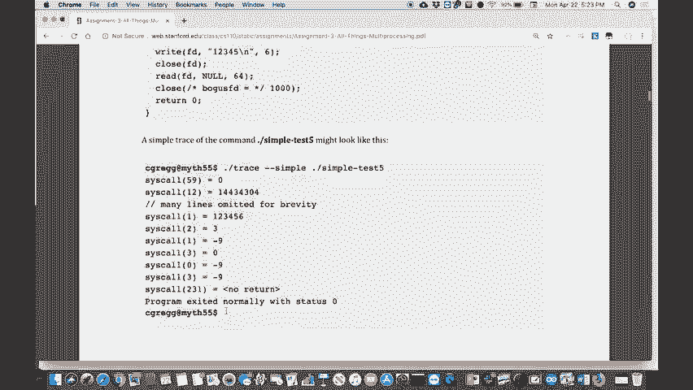

然后我们有一个完整的跟踪，它会提供更多关于它的信息。

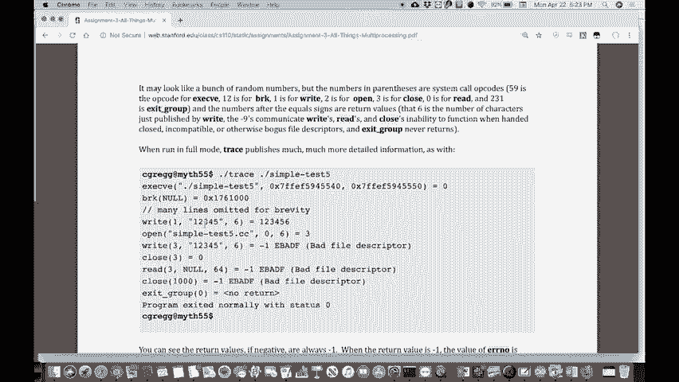

好的，关于实际的系统调用。好的，它不仅仅是说系统调用是什么。

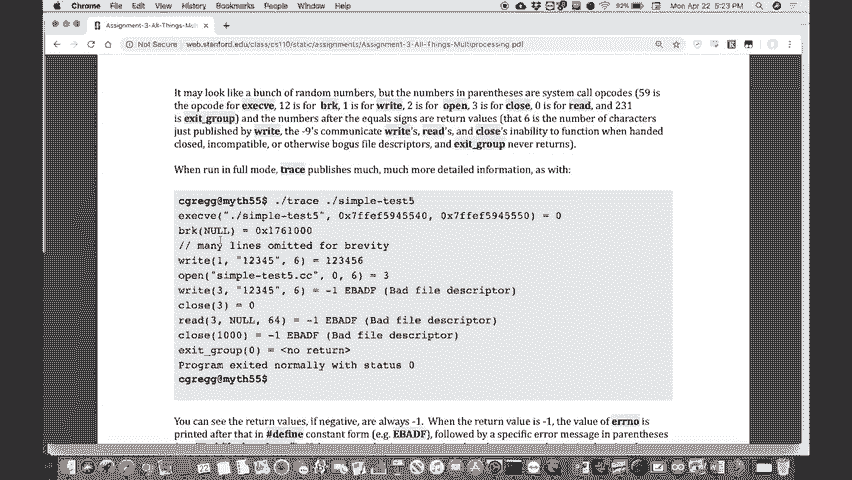

它说是系统调用，实际上它明确指出了是哪个系统调用。你需要在映射表中查找这个信息。事实上，我认为这里有两个映射表，你需要利用它们来查找信息。

好的，还有一个错误映射表，你需要查找它。所以这里有几个不同的映射表，你需要理解它们，才能搞明白。

好的，跟踪（trace）肯定更具挑战性，因为它涉及的内容更多。

所以确保你通读这一部分内容。

要理解的关键是了解 `ptrace` 如何工作。`ptrace` 是另一个系统调用，它允许一个程序让另一个程序在特定点停下，特别是在系统调用之后等等。它允许捕捉这些信息。

好的，我们给了你一个基础的代码示例，它不会做太多事情。

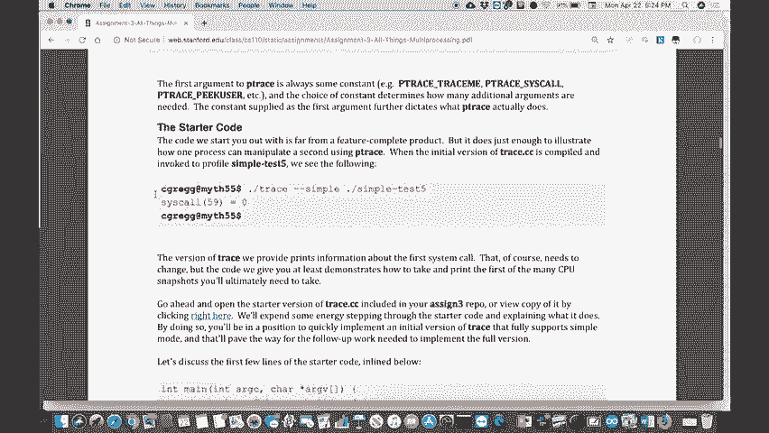

确保你阅读所有的头文件，并确保你理解实际的内容。

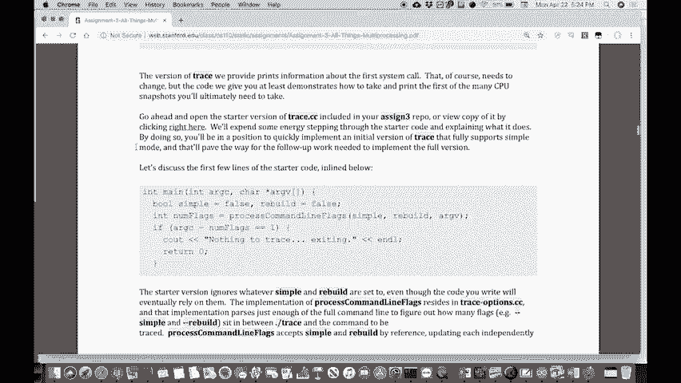

映射表和一些我们稍后会讨论的内容。

初始的代码示例基本上忽略了很多内容，然后它也忽略了一些。

简单的重建过程，最后它使用这个进程命令行标志来实际操作。

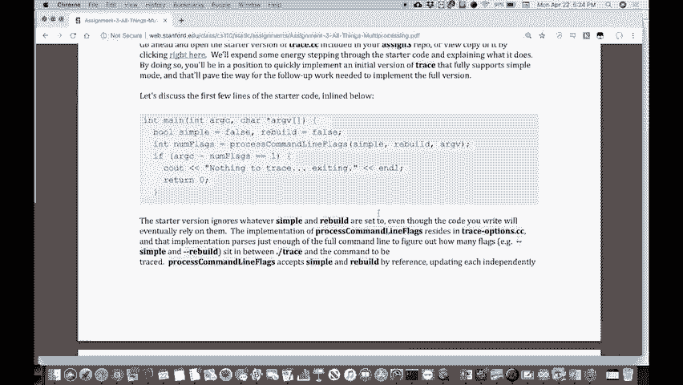

执行追踪本身或者说实际的进程，然后根据这些内容执行追踪。

好的，在这种情况下，我们会派生出一个子进程，这个子进程的名字就是你所指定的程序。

实际上，它要求进行追踪。然后它调用ptrace中的ptrace trace me，这基本上是在说：“嘿，我马上要……”

追踪你。然后它会在自身上引发一个停止信号。

所以记住，这是在子进程中，它开始运行子进程然后暂停它。

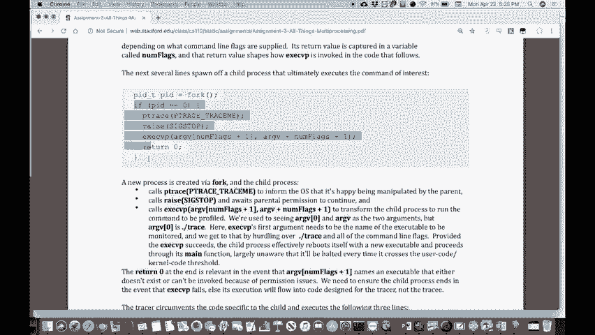

为什么？因为我们正在追踪它，实际上它就像一个调试器，运行一行代码后暂停。在这种情况下，它会执行几行实际代码，或者在它真正执行之前暂停，我们要执行的程序。

好的，为什么？因为我们仍然需要在父进程中设置一些内容。

好的，你可以阅读这部分内容，了解它是如何执行的。

好的，然后追踪器本身基本上需要运行一个`wait PID`，并且在这里再调用一次ptrace。就是说，当子进程实际上停止时会发生什么。所以，在这种情况下，当我们执行`wait PID`时，它最终返回的是刚刚停止的子进程的PID。这样我们就知道了PID等等。好的，然后它说：“是的，它确实停止了。”

然后它会在实际的子进程上设置更多的追踪能力。

好的。好的，然后我们得到什么？基本上这是一个`while true`循环，它会不断执行，直到程序执行到一个系统调用。好的，然后这就是它的作用。它说ptrace，ptrace，直到遇到系统调用，然后等待直到函数执行到它。

或者程序达到一个系统调用，然后就停止了。

好的，你也可以查看这个过程的所有细节。有几个有趣的地方，你需要找到操作码，它在百分号后面。RAX是其中一个寄存器，正如你在107中知道的，107 E的朋友们，RAX就是其中一个寄存器，类似于R0。然后你会得到该寄存器的详细信息，顺便提一下，它位于……

使用另一个命令 ptrace 或 ptrace peak user 来处理子进程。这是在从实际程序本身读取信息。好的。那就是它存储操作码的地方。好的。然后你还需要做一些其他操作，如刷新等。好的。接下来你需要进行另一个循环，实际去打印返回值。

你必须通过另一个 ptrace 函数来获取该值。

好的。这一切已经为你写好了。好的。

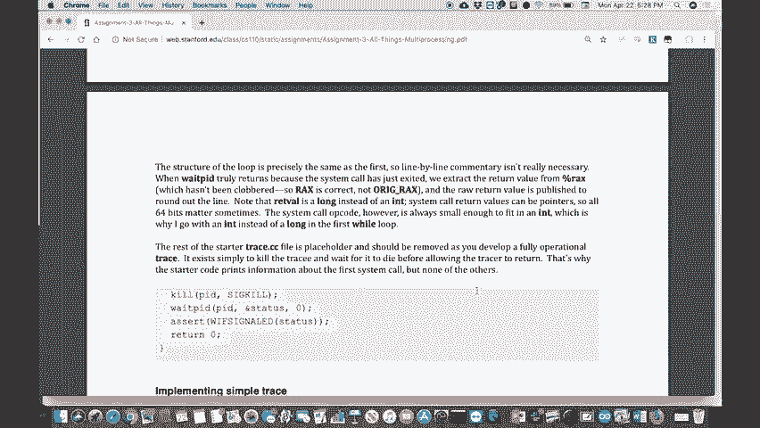

你将修改它，以实际获取更多的细节。

这样。所以你需要修改 trace.CC 以支持简单模式并打印出这些细节。再次提醒，这个没有获取名称或使用那些映射。它只是显示“系统调用发生了，号码是1，返回是这个。”

值。好的。就是这样。然后程序退出。

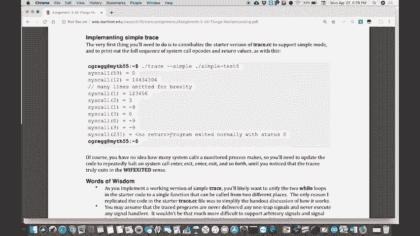

事实上，应该在这里加个新行。我得修复输出。

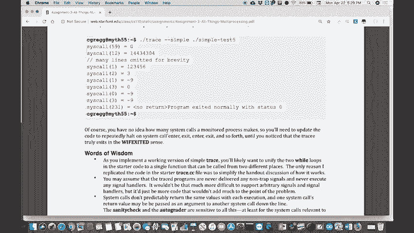

好的。好了，这就是智慧之言，简单跟踪的部分。

同样，别担心数字的细节。

它们很重要，但并不特定。比如它们在程序的不同阶段会有所不同。

好的。然后你需要进行完整模式。完整模式基本上是相同的思路。好的。

再次提醒，这里我缺少一个换行符，我需要修复它。

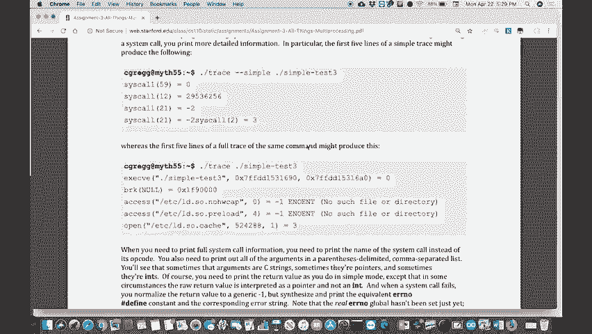

它基本上是相同的思路，只是现在你需要获取实际的细节。

它是什么函数调用。这就是你要通过这些映射来获取错误号，并获取所有函数调用的实际名称的地方。我们实际上从一些头文件中提取了这些信息，但我们也将这些细节提供给了你。

你。

好的。好了，来看一下。你如何获取参数列表呢？另一个映射。所以这些是你需要读取的所有小映射。我会让你自己阅读所有这些细节。

好的。这非常具体。

再次提醒，我不想一定要讲解所有细节，因为这一切都已经写好，给你了。

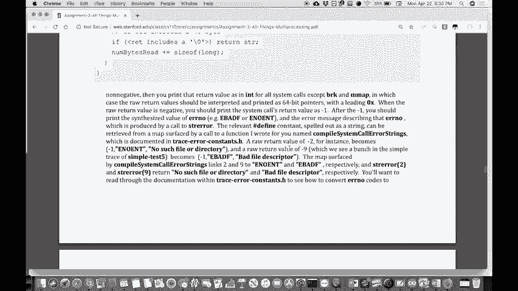

但这其实是了解映射并知道如何读取它们，进而获取这些细节的问题。好的。好了。

这是更多的输出。再次提醒，我们在这里讲解过 ptrace。这里谈到的是你需要使用的不同映射，获取系统调用名称、错误信息等。好吧。再次强调，这里有很多细节需要你仔细阅读。

好吧。那么，究竟我们能从中得到什么结论呢？

这是这个作业中较为困难的部分之一。我认为这主要是因为有很多事情在发生，而且有很多事情需要做。比如通过寄存器从另一个程序读取内存，这看起来很棘手。

这并不容易，但当你真正深入细节时，发现它也不是太难。

再次提醒，如果有任何问题，随时在 Piazza 上提问，或者来我们的答疑时间。如果你在理解你需要做的事情时遇到困难，我们会帮助你。好吧。第三个作业的最后部分是一个很酷的程序，叫做 farm，它基本上会利用特定 Myth 机器上的所有核心来为你进行因式分解。好吧。

会有各种各样的进程，你会把它们启动到 Myth 机器的不同处理器上。它们会等待你的程序提供数字，然后它们将开始处理这些数字。

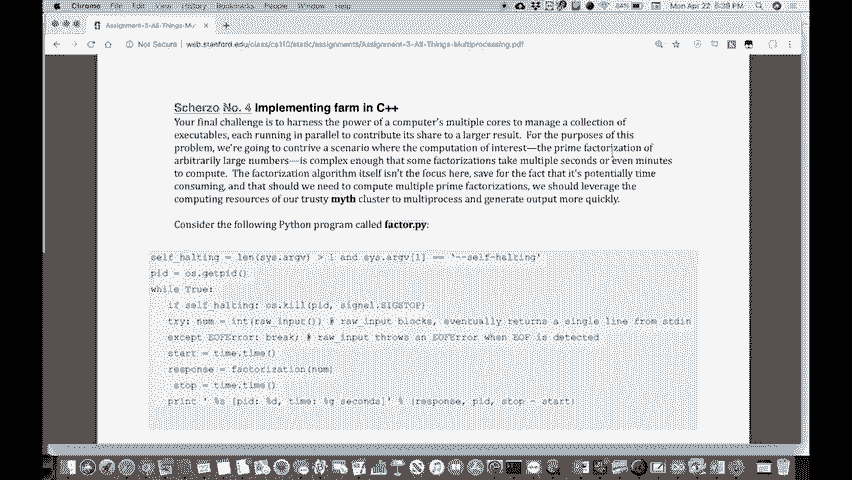

进行因式分解这些数字。好吧。现在我们来看看它是如何工作的。

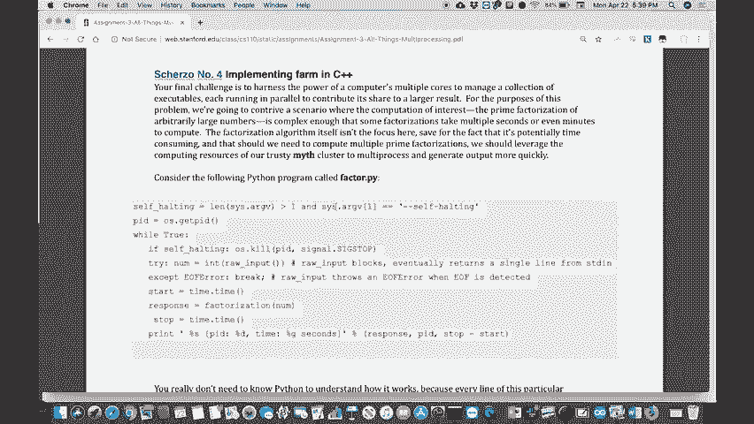

看一下这个 Python 程序。实际上，因式分解将由一个 Python 程序来完成。你不一定需要理解 Python，尽管这个程序很容易理解。但基本上，这个 Python 程序会检查命令行参数，看看它是否是自我暂停的。

或者不。然后它会自我暂停，结果就是在运行时它会停下来。它会获得自己的 PID。然后它会进入这个 while 循环。在 while 循环中，它首先做的事情是，它会停止自己。换句话说，它会暂停自己，等待来自你程序的输入。好吧。

所以这将是一个处理各种不同过程的“农场”，这些过程会等待来自你作为协调进程的输入，来自你的父进程，结果就是这样。好吧。一旦你的程序继续执行这个 Python 程序，它将会读取一个数字。好吧。然后它会读取数字并立即启动一个计时器，因为我们需要一个计时器。

计时器将记录它因因式分解这些数字所花费的时间。然后它会实际进行因式分解。接着它会停止计时器，并打印出因式分解结果。好吧。然后它会继续回到 while 循环，等待下一个数字。最终，你将关闭发送给这个 Python 程序的输入。

到那时，它会关闭实际的 Python 程序。好的。

所以这就是 Python 程序是如何处理的。它是执行分解的部分。好的。

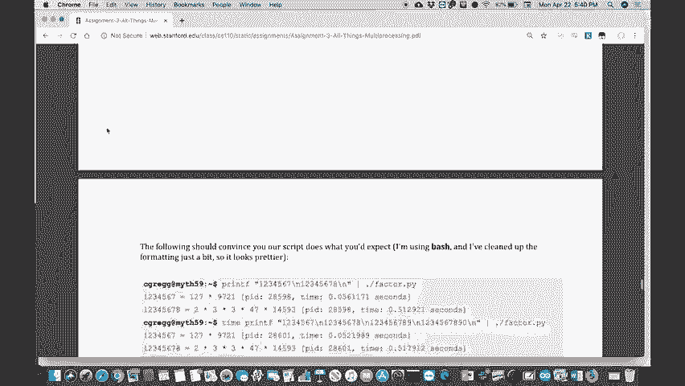

那么你需要为此做什么呢？这就是它的工作原理。你可以说类似 `print F 1357` 换行符 13，工作。

然后你可以发送 kill 系统调用，基本上记住它不一定会杀死它。它实际上会继续运行。

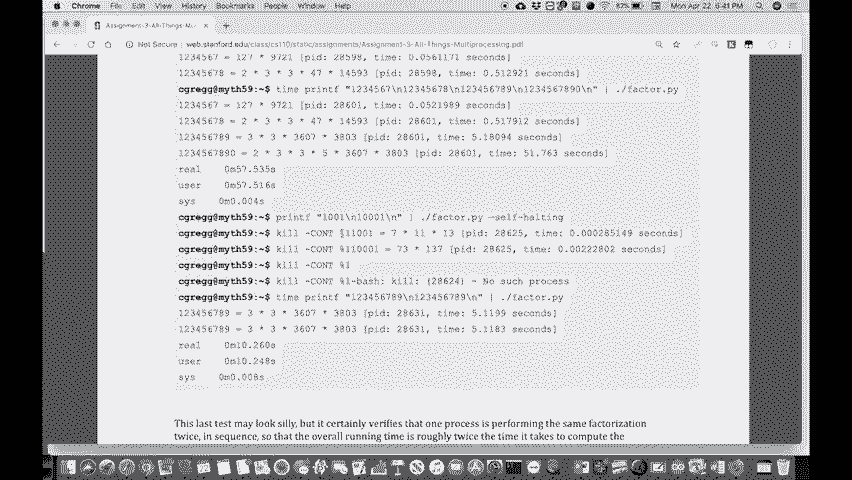

然后你想要实际分解的数字会在这里打印出来，并告诉你需要多少时间，等等。

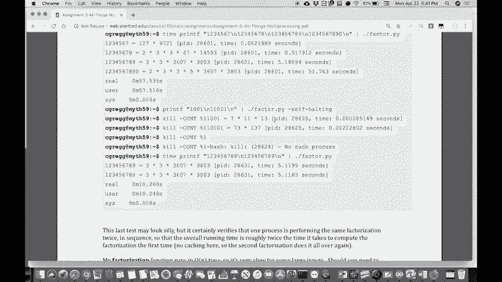

好的。那么这就是实际的 Python 程序是如何工作的。好的，这个分解方法并不是一个快速的分解方法。

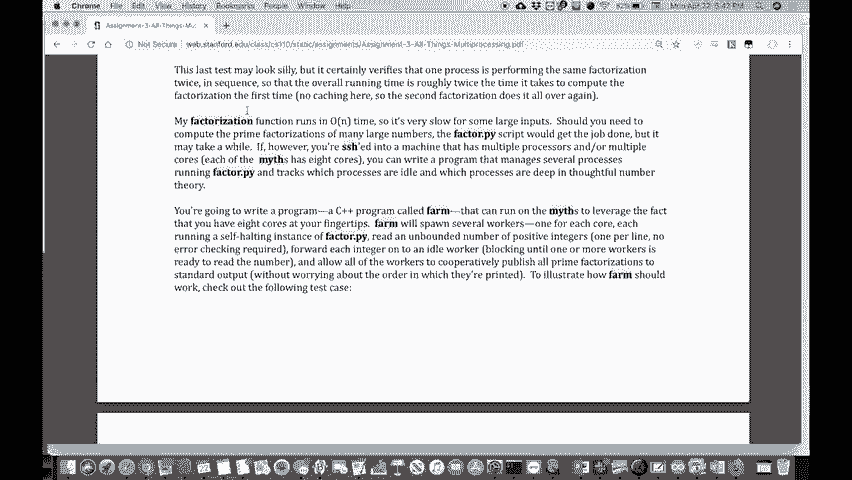

你会看到，当你这样做时，这实际上适合测试，因为你可以测试并查看这些操作需要多长时间。

它并不快，这很好。好的，你的任务是编写一个程序，它运行在神话系统上，并生成多个我们所称为的 worker，每个核心一个，然后执行自我停止的分解任务，并将数字传送到该程序进行分解。

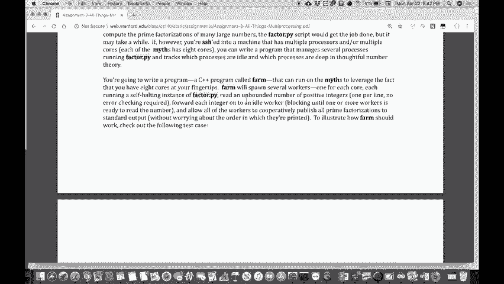

好的。这就是它可能的工作方式。你可能会说 `time print F` 然后是这个长字符串，通过换行符分隔的数字，然后把它传送到 farm。顺便说一下，它会说你在标准输入中输入了那些数字，然后它应该会显示。

它应该会显示有多少个 CPU。它应该对知识进行编号，并将所有 worker 分配到不同的 CPU 上，然后它应该开始进行分解。好的。它会分解所有这些数字，每个核心一个，事实证明，它会花差不多相同的时间，但总的时间只会是你想要的时间，因为它们都在并行运行。

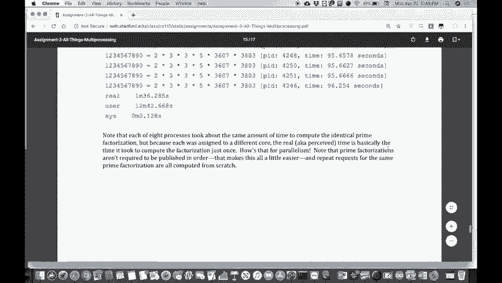

好的。那么这就是基本的思路。当然，这里有一个结构体你需要理解，叫做 worker。好的。然后我们来看看，worker 是一个 C++ 结构体，顺便说一下，它有构造函数之类的东西。所以它有一个构造函数，它接受一个参数，构造函数的参数就是最终要处理的参数。

它基本上将 sp 设置为这个猜测，事实上，那是一个子进程，来自你的其他程序，然后它立刻将其设置为不可用，只有在你允许它变得可用时，它才会变得可用，你稍后会看到这一点。好的。然后它包含了它在结构体内部的两个变量。

好的，明白了。这里还有一些其他常量，然后我们所做的是有一个信号。

好的，SIGCHILD信号以及标记工人是否可用。记住，SIGCHILD信号会被触发，或者更确切地说，SIGCHILD的信号处理程序会被调用。

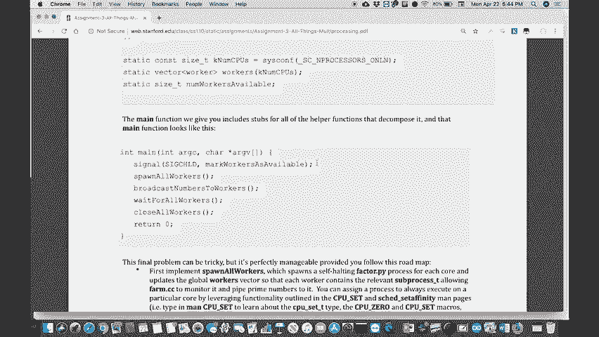

当你的进程继续、停止或暂停时，**该方法会被调用**。

好的。好的。那么你将会生成所有工人进程，你会启动它们，然后将所有数字发送给这些工人，然后你会等待它们全部完成，最后关闭所有工人进程。

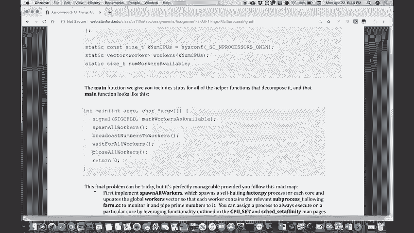

好的。这就是这个程序的基本思路。

好的。你可以阅读所有这些细节，了解你负责的内容。

好的。基本上，我们已经实现了一些这些功能，主要是用来广播数字给工人进程的。

你需要在这里再写几行代码，基本上就是这些。

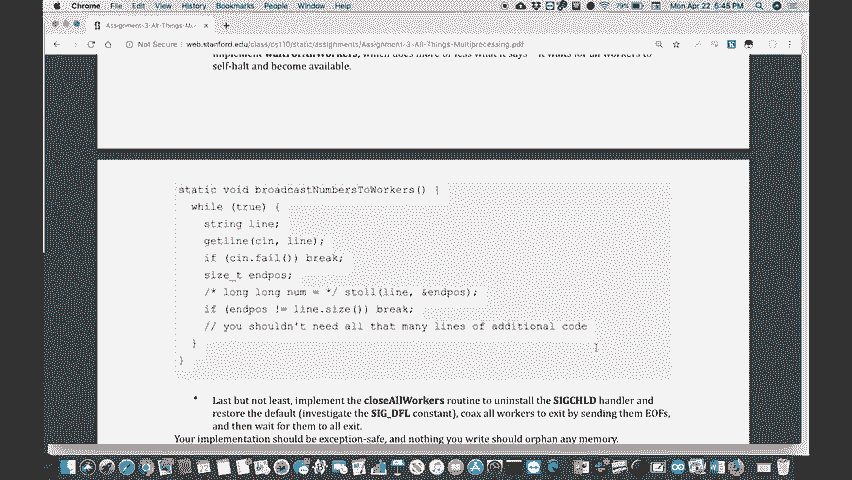

它将会设置好，使你能够将数字发送给工人进程。

好的。你还需要确保你有一个关闭所有工人进程的例程，用来停止所有这些程序。记住，你怎么停止这些Python程序呢？你可以通过关闭它们读取的文件来停止。好的，所以，如果你在命令行上按Ctrl+D，或者如果它们是从文件中读取的。

文件结束。好的。

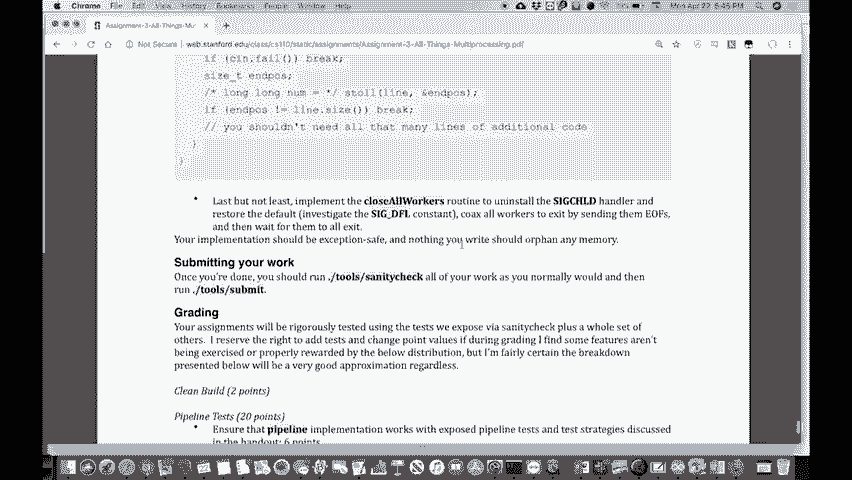

好的。所以基本上就是这样。我们在这里给你提供一些关于农场的细节，但大部分情况下，你已经掌握了主要功能。

你需要在这里实现这些功能。

好的。标记工人将能够实现：生成所有工人、广播数字给工人、等待所有工人完成并关闭所有工人。基本思路是将所有这些数字发送给一堆正在等待的Python进程，让它们处理。好了，这样就完成了。谢谢大家。如果有问题，可以把问题发到Piazza上，或者在办公时间来找我。

谢谢你。
