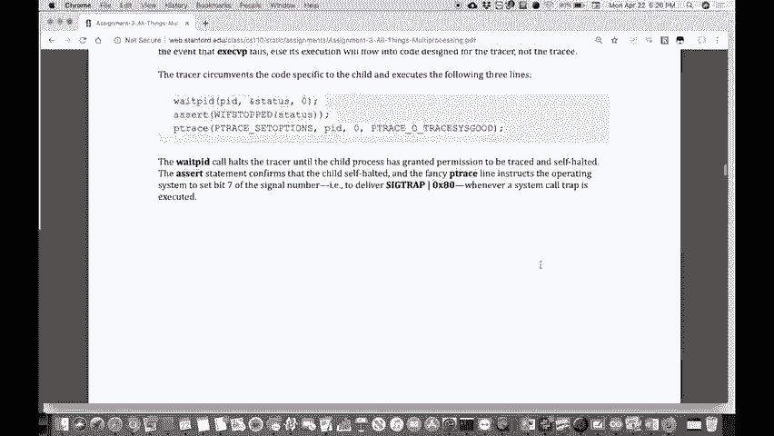

# 课程 P9：作业 3 详解 - 多进程编程实战 🚀


在本节课中，我们将学习第三次作业的核心内容。本次作业聚焦于多进程编程，你将综合运用 `fork`、`execvp`、`waitpid`、管道以及 `dup`/`dup2` 等系统调用，完成四个不同程序。课程将分为四个主要部分进行讲解。


## 第一部分：管道（pipe）🛠️


上一节我们介绍了作业的整体结构，本节中我们来看看第一个任务——管道函数。


管道函数接收两个参数列表，每个列表代表一个要执行的命令及其参数。它还会填充一个初始为空的 PID 数组，最终包含两个子进程的 PID。其核心功能是：**第一个进程的标准输出将成为第二个进程的标准输入**。


### 管道的工作原理


管道通过 `int fds[2]` 创建两个文件描述符：
*   `fds[0]` 是**读取端**。
*   `fds[1]` 是**写入端**。


写入 `fds[1]` 的数据可以从 `fds[0]` 读取。


### 一个具体例子


假设我们有一个文件 `testfile.txt`，内容是一些单词。我们想用 `cat` 命令显示其内容，并通过管道传递给 `sort` 命令进行排序。


在 Shell 中，命令如下：
```bash
cat testfile.txt | sort
```
在这个例子中：
*   `cat` 从文件读取并输出到**标准输出**。
*   `sort` 从**标准输入**读取数据。
*   管道 `|` 将 `cat` 的**标准输出**重定向为 `sort` 的**标准输入**。


在你的 `pipe` 函数实现中，需要模拟这个过程。以下是关键步骤：
1.  使用 `pipe` 系统调用创建管道。
2.  使用 `fork` 创建第一个子进程（执行 `cat`）。
3.  在该子进程中，使用 `dup2` 将管道的写入端 (`fds[1]`) 复制到标准输出文件描述符 (`STDOUT_FILENO`)。
4.  使用 `execvp` 执行 `cat` 命令。
5.  使用 `fork` 创建第二个子进程（执行 `sort`）。
6.  在该子进程中，使用 `dup2` 将管道的读取端 (`fds[0]`) 复制到标准输入文件描述符 (`STDIN_FILENO`)。
7.  使用 `execvp` 执行 `sort` 命令。
8.  在父进程中，使用 `waitpid` 等待两个子进程结束。


## 第二部分：子进程（subprocess）👶


理解了管道的基本构造后，我们进入下一个任务——实现 `subprocess` 函数。


`subprocess` 函数用于创建一个可执行的子进程，并允许父进程控制其输入输出。它接收一个命令数组和两个布尔参数：
*   `supplyChildInput`：如果为真，父进程将获得一个可写入的文件描述符，写入的内容会成为子进程的**标准输入**。
*   `ingestChildOutput`：如果为真，父进程将获得一个可读取的文件描述符，读取的内容是子进程的**标准输出**。


函数返回一个 `subprocess_t` 结构体，其中包含子进程的 PID 以及上述可选的输入/输出文件描述符。


这个函数在思路上与管道类似，但更通用。你需要处理以下情况：
*   当 `supplyChildInput` 为真时，需要创建一个管道，并将管道的读取端作为子进程的标准输入。
*   当 `ingestChildOutput` 为真时，需要创建另一个管道，并将管道的写入端作为子进程的标准输出。
*   在父进程中，根据布尔值决定是否关闭不需要的管道端，并保存需要使用的文件描述符到 `subprocess_t` 结构体中。


## 第三部分：追踪（trace）🔍


完成了相对基础的进程控制后，我们来看一个更具挑战性的任务——实现一个简单的调试追踪器。


`trace` 函数的功能是启动一个程序，并捕获、报告该程序运行过程中发起的所有**系统调用**及其返回值。这就像编写一个小型调试器。


### 简单追踪模式


在简单模式下，输出格式类似：
```
syscall(59) -> 0
syscall(12) -> 1
syscall(4) -> 3
...
syscall(231) -> ?
```
其中，括号内的数字是系统调用号，箭头后是返回值（`?` 表示无返回值）。




### 完整追踪模式


在完整模式下，你需要利用提供的映射表，将系统调用号、错误码等转换为可读的名称。输出会包含更多细节，例如系统调用的具体名称。


### 实现关键：`ptrace` 系统调用


实现追踪功能的核心是 `ptrace` 系统调用。它允许一个进程（父进程/追踪者）观察和控制另一个进程（子进程/被追踪者）的执行。


基础代码框架已经提供，主要流程如下：
1.  父进程 `fork` 出子进程。
2.  在子进程中，调用 `ptrace(PTRACE_TRACEME, 0, nullptr, nullptr)` 请求被追踪，然后调用 `raise(SIGSTOP)` 暂停自己。
3.  在父进程中，调用 `waitpid` 等待子进程进入暂停状态。
4.  父进程进入循环，反复调用 `ptrace(PTRACE_SYSCALL, child_pid, nullptr, nullptr)` 让子进程执行，直到遇到下一个系统调用入口或出口时停止。
5.  父进程通过 `ptrace(PTRACE_PEEKUSER, child_pid, ...)` 读取子进程的寄存器（如 `RAX`），以获取系统调用号或返回值。
6.  父进程打印信息，然后继续循环，直到子进程退出。


你的任务是在此框架基础上，修改代码以实现简单模式和完整模式的输出。你需要仔细阅读提供的映射表头文件，并理解如何读取系统调用的参数。


## 第四部分：农场（farm）🌾


最后，我们来看一个综合应用——`farm` 程序。它将利用多核处理器并行进行大数分解。


### 整体架构

`farm` 程序会作为协调者（父进程）：
1.  **生成工人**：为每个 CPU 核心 `fork` 出一个工人子进程。每个工人子进程执行一个给定的 Python 分解脚本。
2.  **分配任务**：从标准输入读取一系列待分解的数字，然后将这些数字分发给各个空闲的工人进程。
3.  **收集结果**：工人进程完成分解后输出结果和耗时。
4.  **关闭农场**：所有数字处理完毕后，关闭所有工人进程。


### 工人进程与 Python 脚本


工人进程运行一个 Python 脚本，其工作流程如下：
1.  启动后，立即暂停自己，等待协调者发送数字。
2.  收到协调者发送的数字后，开始计时并进行分解。
3.  分解完成后，停止计时，输出结果。
4.  返回步骤 1，等待下一个数字，直到输入通道被关闭（读到 EOF）。


### 你的实现任务


大部分框架代码已提供。你需要实现的核心函数包括：
*   `spawnAllWorkers`：生成所有工人子进程。
*   `broadcastNumberToWorkers`：将数字分发给空闲的工人。
*   `waitAllWorkers`：等待所有工人完成当前任务。
*   `closeAllWorkers`：关闭所有工人进程（通过关闭向其写入的文件描述符来发送 EOF）。


关键点在于管理工人的状态（忙/闲），并使用信号（如 `SIGCHLD`）或 `waitpid` 的非阻塞模式来高效地处理多个子进程。


---


**本节课总结** 🎯


在本节课中，我们一起学习了第三次作业的四个核心部分：
1.  **管道**：实现了连接两个进程输入输出的 `pipe` 函数。
2.  **子进程**：实现了可灵活控制子进程输入输出的 `subprocess` 函数。
3.  **追踪**：使用 `ptrace` 系统调用实现了一个能拦截并报告系统调用的简单调试器。
4.  **农场**：综合运用多进程技术，实现了一个并行计算框架，用于分解大数。


通过本次作业，你将深入理解 Linux 多进程编程、进程间通信以及进程调试的核心机制。如果在实现过程中遇到问题，请及时在课程讨论区或答疑时间寻求帮助。