# 斯坦福大学 CS 110 计算机系统原理 Principles of Computer Systems（Spring 2019） - P11：Lecture 10 From C threads to C++ threads - ___main___ - BV1ED4y1R7RJ

 Welcome。 All right。 Welcome to the 19 of you that are here。 No。

 it's more than that for people watching this on， video。 There's more people than that here。

 So assignment three， hopefully ended up okay。 There were lots of。

 Piazza questions and lots of consternation about race conditions and this and that and that's the kind of thing。

 you have to deal with when you're doing multi-processing， also multi-threading。

 which we're going to talk about， today and you will do more multi-processing for this week's assignment and then of course you'll practice it a。

 little bit on the mid-term as well。 So big week this week。

 I think I'm already behind but we will keep going， forward here today。 The mid-term is Thursday。

 It's 6 to 8 p。m。 Hewlett 200 which is across the hall。 It's not this， one。

 Don't sit in here and think where's everybody？ It's across the hall。

 If you are taking an alternate exam， hopefully you already emailed me。 If you haven't。

 please do that today so I can set things up and same thing for， any accommodations that you have。

 Do that。 I plan on sending out emails about that this evening for people who。

 talk to me about those things already。 The exam is going to be on Blue Book。

 Who has used Blue Book before？ Raise， your hands。 About half of you maybe。 To the other half。

 what it is is you have your laptop and you load a program on it。

 that you take the test on and it submits it to us and we grade it all kind of digitally。

 The nice thing about Blue Book is， that you get to type your answers。

 Some people think that's nice anyway but it feels very much like taking a paper。

 exam in that we don't really， you can't compile code， you can't look things up。

 You can't copy and paste within the， application and so forth but you should get it working on your computer before coming to the midterm。

 What happens is， we will publish an encrypted exam sometime on either Wednesday night or Thursday morning that you can download and then。

 when you get to the exam we give you a password and then it starts the exam for you and it is timed on the computer。

 If for some reason you don't have a laptop or your laptop battery is going to die after five minutes or something。

 you should talk to me， sooner than later so we can find you another laptop to use or for your battery issues we will have some plugs but they are not going to be。

 like for everybody。 Most people's laptops these days will last two hours although I know some people are。

 there will last like an hour and a half and you have to， get near a power plug。

 We will have that available for some extent。 You are allowed one back in front piece of paper for your own notes or whatever。

 Please don't， bring any magnifying devices regular glasses are fine like I don't see people like you know like Microscope here。

 I think I told this to people in 106D when I was doing a similar sort of thing。

 I once heard and I mentioned， somebody else recently I once heard of a professor saying you can use anything you can bring into the exam for notes or to use for the exam and somebody came in carrying a graduate student。

 Popped the next to him and that was that。 No， you are allowed one piece of paper back in front。

 We will also， did that， did the joke just finally sick。

 We will also give you a somewhat limited resource resources sheet。

 It looks kind of like this where basically gives you all of the。

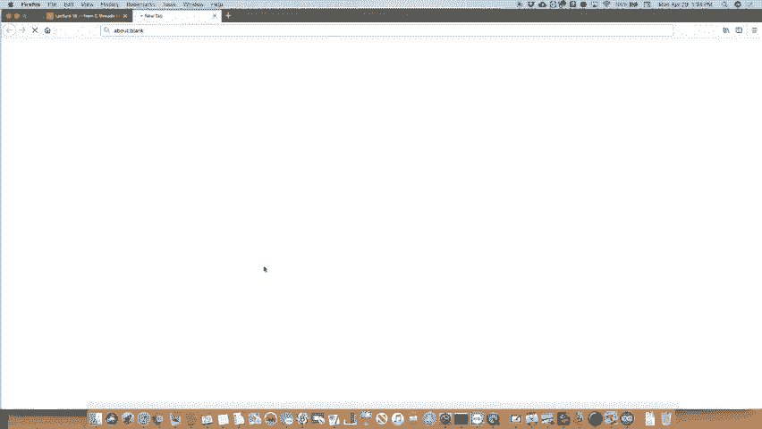

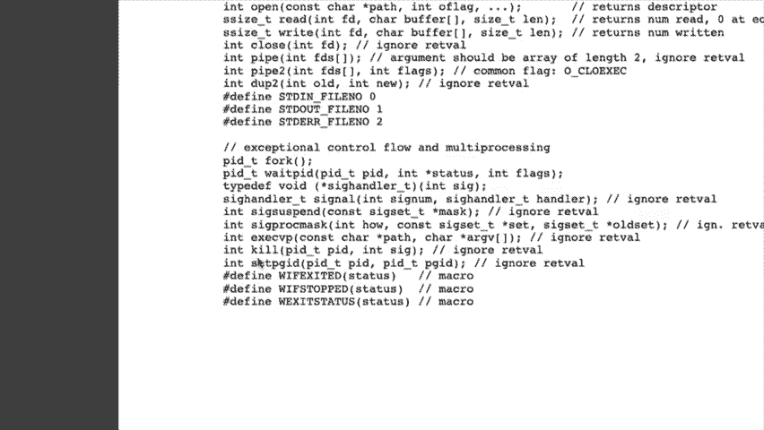

 prototypes and things for functions that you'll need and then some some specific constants and things that you'll need。

 We are not trying to make you memorize those sorts of things。

 So in the middle of the exam you're like I forget how to do that。 It's probably not going to matter。

 We're not going to try to compile your code necessarily。

 But but either way it's not that we're not testing you on that。

 Do the best you can with those sorts of things。 Let's see。 I think that's about it。

 All the comments I have at the mid term。 Any questions at this point？

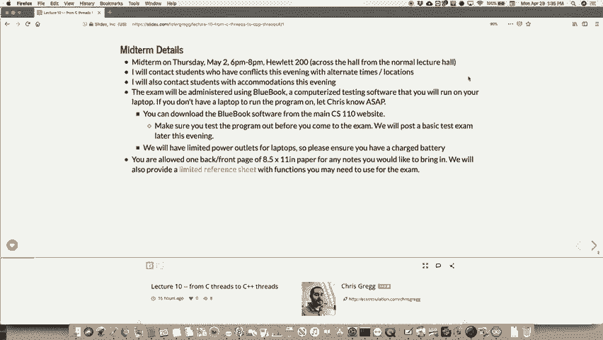

 About the mid term comments。 It's two hour exam。 I'm going to try to make it so that you finish it that most people finish within an hour and a half or so。

 I mean I don't want this to be a test of your ability to like race through hard problems because they are sometimes difficult。

 Awesome。 Good question。 What's the format going to be？ Is it going to be like the practice ones？

 I would say it's going to be kind of most like the last practice one which is a couple of programming problems。

 I'll try to walk you through the details of that pretty。

 I don't want a wall of text if I can help it。 And then maybe a problem like the try to figure out what's going on with these signals like what's the output sort of thing。

 And then something else is going to be a little bit more difficult。

 And then some short answer questions which kind of cover the spectrum。

 That's probably the way it'll be。 I'm still in the middle of finishing it。 Anybody else？ Okay。

 So we have another assignment。 This assignment， Stanford Shell。

 I'm going to do a little demo of it to show you what it is。 Is kind of a neat assignment。

 It's basically building the shell that you use every day and have used since 107。

 And it's it needs to handle certain things。 You need to be able to do the basic things like quit it or exit it。

 You will be putting processes in the background or in the foreground kind of like what we did in our simple shell。

 So you can use that as a hey， how do we do it then and what do we need to do differently now。

 You also have to keep track of all the processes。 So you'll be able to have multiple processes。

 You can throw in the background and then maybe a program process as well。

 And your program has to handle all of those。 Okay。

 So you need to be able to use FG to bring a background process into the foreground。

 You need to be able to do BG， which restarts a stopped background process。

 And you can tell it which one as well。 You also have to be able to kill a set of processes。

 And this is an interesting one。 We have this term， this command called slay。

 which basically will send to a process group。 And that's a group of processes like for instance down here。

 We have LS pipe through grep pipe through cut。 Well， they will all be in the same process group。

 But if you kill the process group， they all die。 So that's the sort of thing you're going to have to think about when you're doing this。

 You also can halt a process that's currently running。

 You're going to send a SIG stop to it or actually a SIG， actually， I think it is a SIG stop to it。

 You will be able to continue a process。 You'll also be able to tell what jobs are running with a command so you can see what the process IDs for all those jobs are。

 And you're going to be responsible for setting up the pipelines。

 I think this is one of the trickier parts of this assignment。

 It's getting this to work where you have LS pipe through grep pipe through cut。

 For any number of these。 And you'll also have to do things like sort input from a file as standard in error I get read from standard in。

 And then maybe output to another file。 So those are things you're going to have to think about as well。

 So there's a lot of moving parts to this。 For that， the piping。

 you have to think about what's happening here and you have to go， okay， well。

 LS needs to have its standard out going to grep as its standard in。 It sounds a lot like pipeline。

 right， which you've already done， but this is a more robust version。 And then same thing for us。

 grep has to send its output to cut。 So guess what。

 there's going to be like a pipe here and another pipe here。

 And they're not going to be the same pipe and you have to start them and stop them in different places。

 And so it's a little bit trickier to get that going。

 You'll also have to be hand off terminal control to foreground process。

 Sometimes when you type in process， well， your terminal isn't really grabbing the input anymore。

 It's whatever program is running。 So there's a little bit of a hand off there。

 That's not actually one of the hardest things about the program。

 You just have to end up thinking about it。 Question。

 >> So it's going to rely on pipeline and sub-process from the last time。 >> It is a good question。

 It's not going to rely on pipeline sub-process。 You kind of recreate them in the form that we。

 at least the pipeline one in the form that we will have for you。 Yeah。

 What are their questions just so far on this？ All right。 This evening。

 I will do my best to put up a little video describing some of the details a little bit better。

 There are a lot of moving parts to this， okay。 There's a ton of moving parts because you have to kind of move into the form。

 You have to think about all the nuances to this shell。

 There's a bunch of header files always read through those first。

 If you've already downloaded the assignment， read through those。

 You're only going to be putting modifying one program。 So that's at least like good。

 It won't be like trying to figure out six different programs。

 You can test the shell either by running programs。 I'll show you in a second。

 Or through a driver program， which basically runs the shell using some input so you can see the output in a way that you can test a little better。

 So it's a good way to test。 So get used to using the little driver。

 You would definitely have to have a SIG child handler because all of your children are going to be starting。

 continuing， stopping， all that kind of stuff。 And it's the SIG child handler that's going to be manipulating those and taking care of which programs are stopping when and so forth。

 In some sense， it's a little like farm in that you have to get your SIG child handler pretty robust to get these。

 You'll also have another handler or maybe two。 And by the way， you can make these into one handler。

 If you want your shell， if I go to a shell， by the way。

 if I go over to a shell and I type control C， my shell doesn't die。

 You're going to have your shell also make it so that it doesn't die when you do control C。 Well。

 that's actually where to do that you have to handle and you have to capture SIG in to which is the interrupt and SIG stop。

 which is control Z。 And they should affect your processes that you have， but not your shell itself。

 So there's a little bit of that going on as well。 As I said。

 the piping between processes is a little bit tricky。

 You'll have to take some time to get through that。

 This assignment has lots of a whole list of milestones。 You should probably do this， then this。

 then this， then this。 If you can follow those milestones。

 you'll be able to do some testing and it will be a little more straightforward。

 Don't try to jump to the last part or like just go down some route。

 Test as often as you can is the big thing。 Now， this is a detailed assignment。

 We also have a midterm coming up this week。 It's due next Wednesday， which is a week and a half。

 This should be about a week long assignment。 So I'm giving you a little bit of buffer room in there。

 If you wait until Friday to start it， you can get it done。

 but it's going to be a lot of work over the weekend and over the beginning of next week。

 So I would at least start the assignment。 And by the way。

 it's got all the signal handling stuff you will need to know for the exam。

 We will not ask specific questions， although the practice midterms did on Stanford Shell。

 but we will， the material is ostensibly the same。 So you'll， starting to do the assignment。

 at least you'll start， you'll continue to think about those。 Okay。 All right。

 And then we'll see how it goes as far as how people are doing after beginning of next week。

 All right。 What questions on the assignment at this point？ Anything else？ This is a fun one too。

 It's definitely got a lot of parts。 So I said， okay。 All right。 Then let's move on back to threads。

 Now， remember， we have left multi processing world and we are now in multi threading world。

 The biggest difference is that threads are all under one single process。

 which means they share their memory。 They have a different stack space for each thread。

 but they can relate to each other's stack frames。 You can pass references to global variables。

 That works just fine。 And you can have threads interacting with， like， say。

 one global data structure very easily。 That's one of the benefits of threads。

 They're considered lightweight processes in the sense that they really are doing different things。

 You can actually set the affinity on threads to run on different cores。

 And they really do run in parallel， especially if you have different cores。

 So there are benefits using threading， but there's a lot of little things you have to think about。

 just like multi processing。 And there are many analogous things to multi processing that you'll have to look at。

 On Wednesday， what we did was we looked at the C version of P threads。 Now。

 threading doesn't come standard with Unix。 It's kind of a test。 It's kind of， well。

 it's more or less added these days， but it's another library that we're going to use。

 It's another library that you have to run。 So that's why we had P threads。 And for C， of course。

 you have to do all these things with void star and pointers to send various blocks of data。

 And it's kind of annoying。 It turns out in C++11， which is the version that we are using。 In C++11。

 we have actual support for threading built into the language。

 And it works a little bit better and is actually much cleaner once you get to understand it than P threads are。

 So we're going to quickly transition into that and then never speak of P threads again。

 Although if you take a networks class or maybe an operating systems class。

 you're going to have to probably implement those and think about those in the future。 Yeah。

 >> Is threading in the P threads on the term？ >> No， no。 There's no threading in the mid term。 No。

 good question。 Yeah。 Unless you want me to put it on there。 [LAUGHTER]， So anyway。

 let's take a look at -- we'll go back and look at the recharge or the introverts program that we had before。

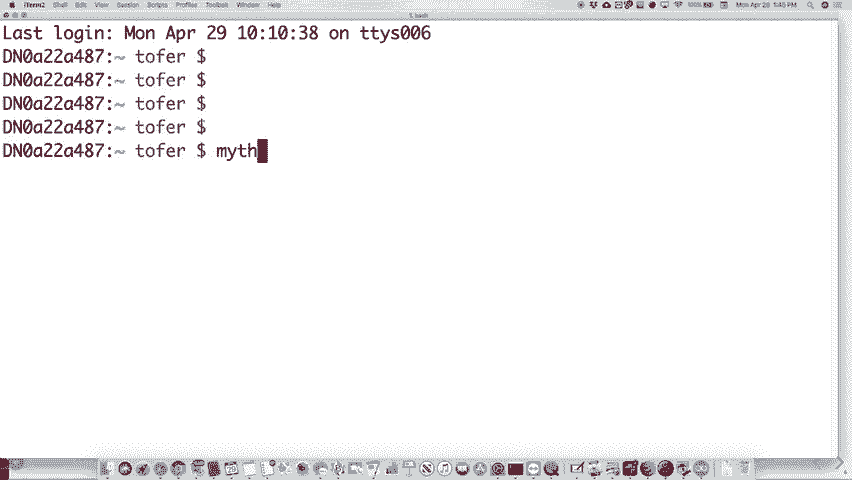

 Okay。 So let's actually log on to myth here。 Oh， I forgot to show you。

 I'm going to show you Stanford shell。 I forgot about that。 [INAUDIBLE]， There we go。

 So Stanford shell looks like this。 You can do things like LS。

 You can do things like sleep in the background。 And it will -- oops。

 Needs a sleep something like 10 in the background。

 And then it goes in the background and you can type jobs and it will tell you that there's a sleep running。

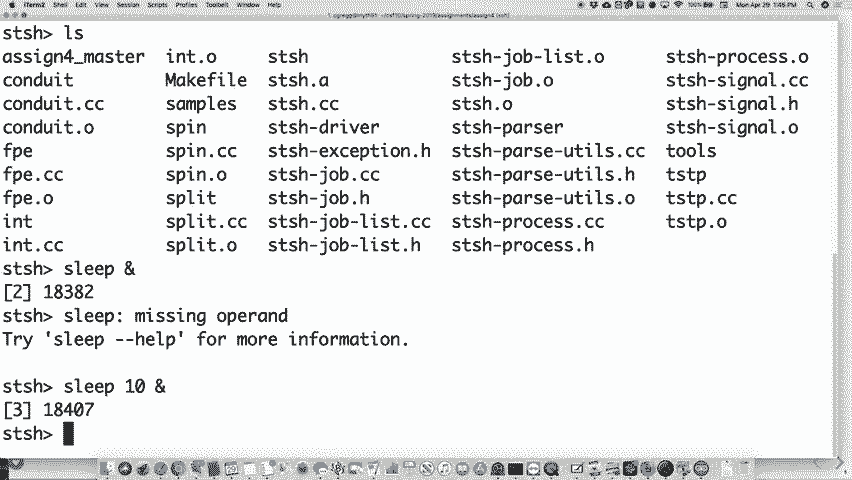

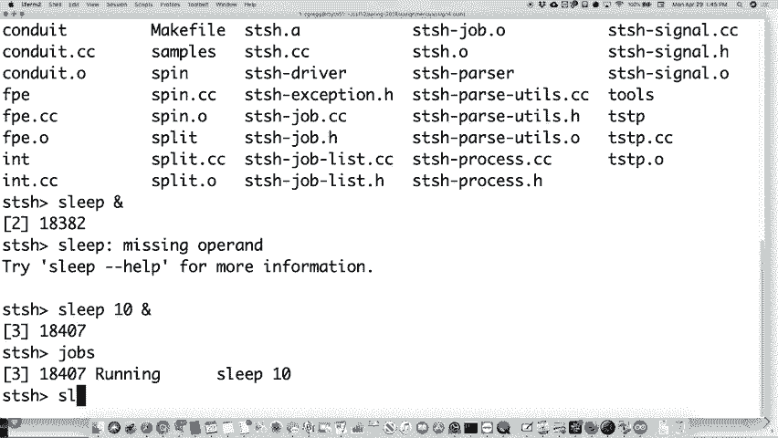

 If I quickly do another one， I'm going to have time。 Let's do sleep 20 and then jobs。

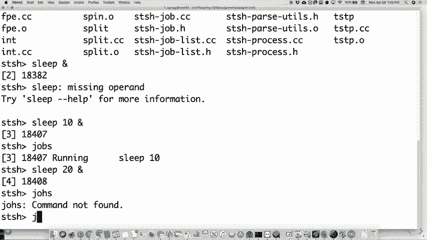

 Jobs。 Then there's still only one。 Let's do another one。 Sleep。 20 in the background。

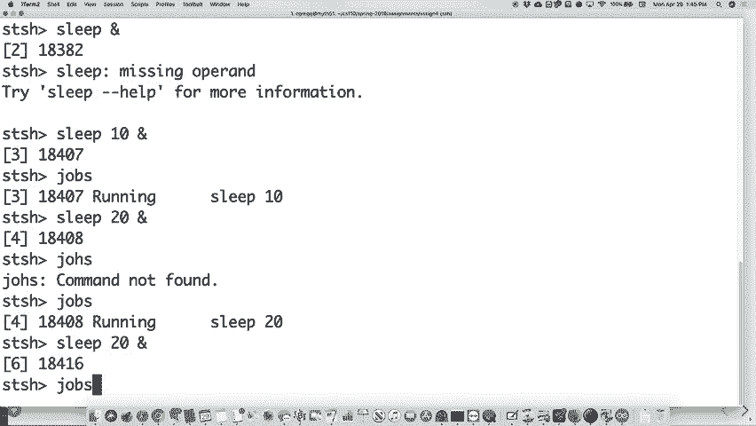

 Now if we do jobs， there should be two。 Now there are two jobs in the background。

 We should be able to -- I think kill -- did I say it's not kill。 So let's go back to the next slide。

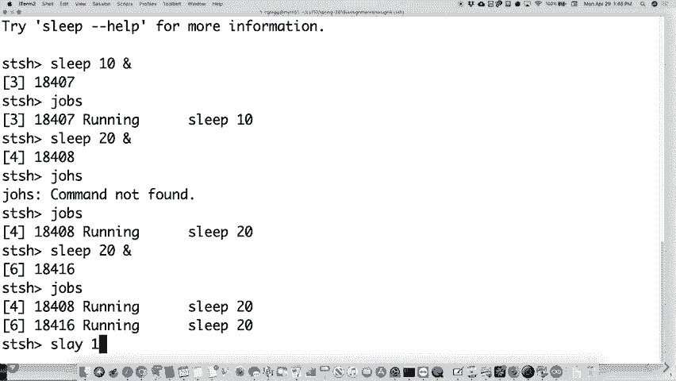

 So let's go back to the next slide。 So let's go back to the next slide。

 So let's go back to the next slide。 So let's go back to the next slide。

 So let's go back to the next slide。 So let's go back to the next slide。

 So let's go back to the next slide。 So let's go back to the next slide。

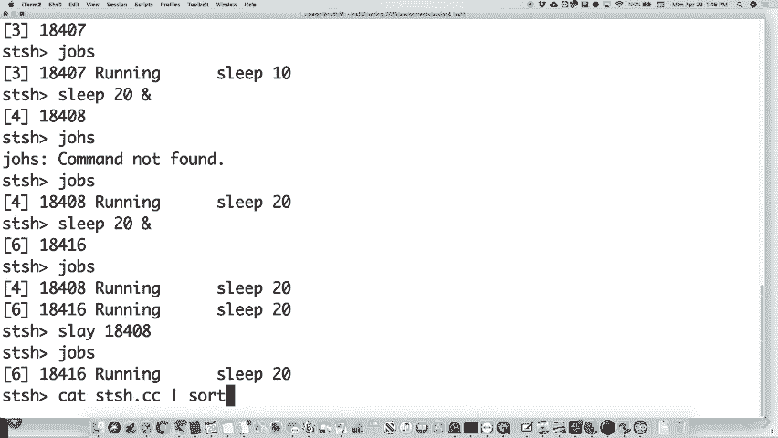

 So let's go back to the next slide。 So let's go back to the next slide。

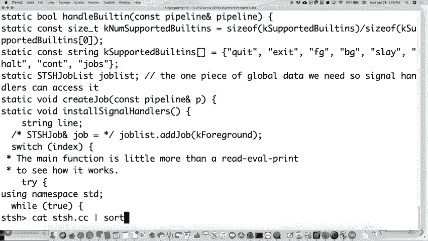

 So let's go back to the next slide。 And then you could put that through word count and so forth。

 You could also do that and then output it to word count out。txt。

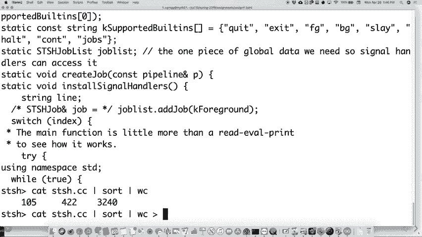

 And then we could do cat word count out。txt。 It should look very much like a terminal。

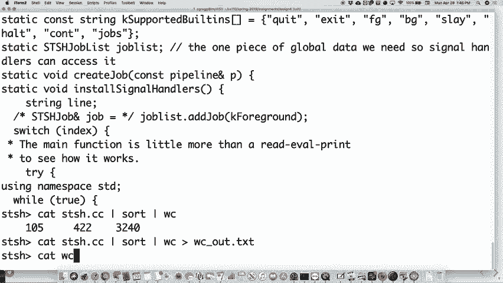

 And that's what you do。 I shouldn't be able to do control C。 It actually says control C。

 but it doesn't kill the shell。

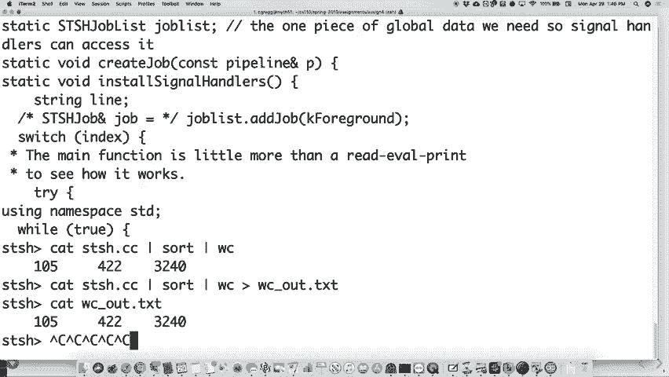

 It shouldn't anyway。 And then control Z will not do the same thing。 If I do something like。

 let's do sleep 20。

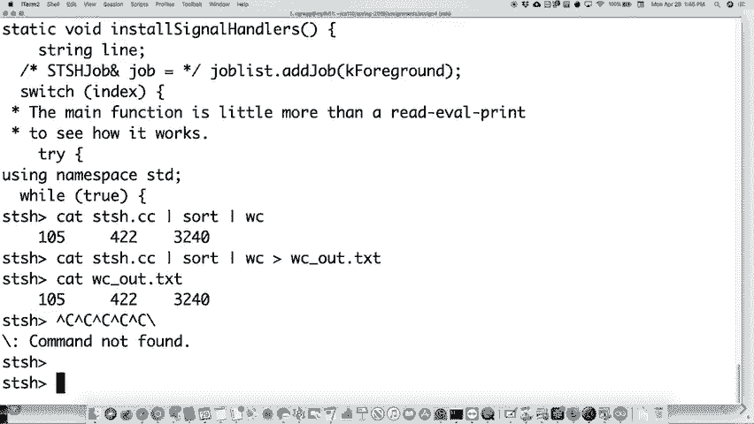

 And then I do control Z now。 It should bring you back and then have a background job there。

 which it does。

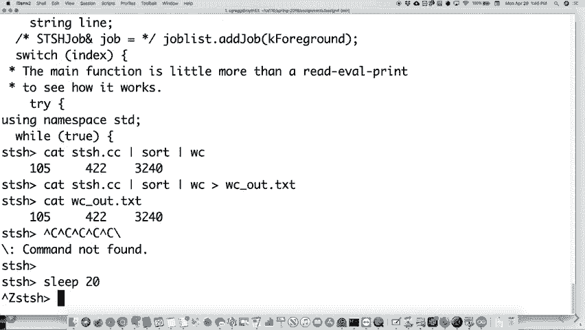

 So there's all the different parts that you're going to have to do for that assignment。

 What is the 12？ The 12 means the 12th job that you've actually launched so far， I think。

 in your shell。 I think that's all it means。 Never。 [ Inaudible ]， Oh， well。

 the question was why are we using STSH for cat？ Cat actually will print out a particular file。

 That's all we're doing there。 And I happen to have that in that folder so I know that file is there。

 So that's why I just said cat that one。 I just happen to know that file is this。

 Any other question on that？ Okay， and then to exit， quit or exit。

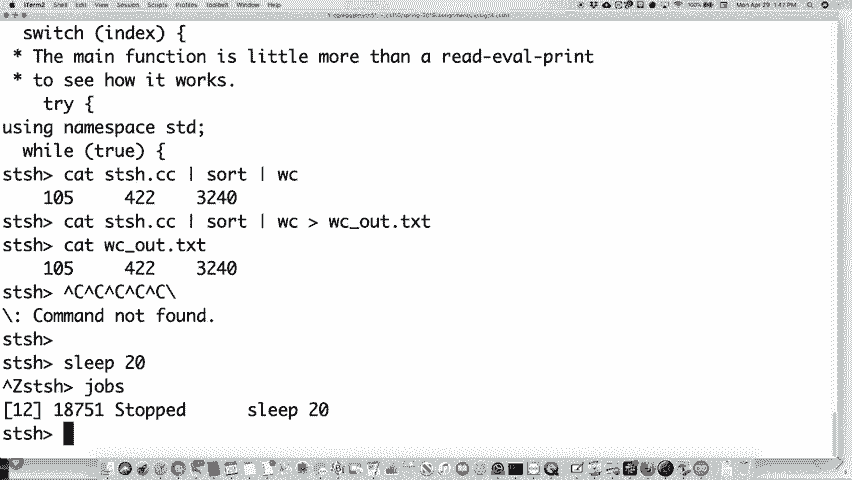

 That's Stanford shell。 You'll get used to that。

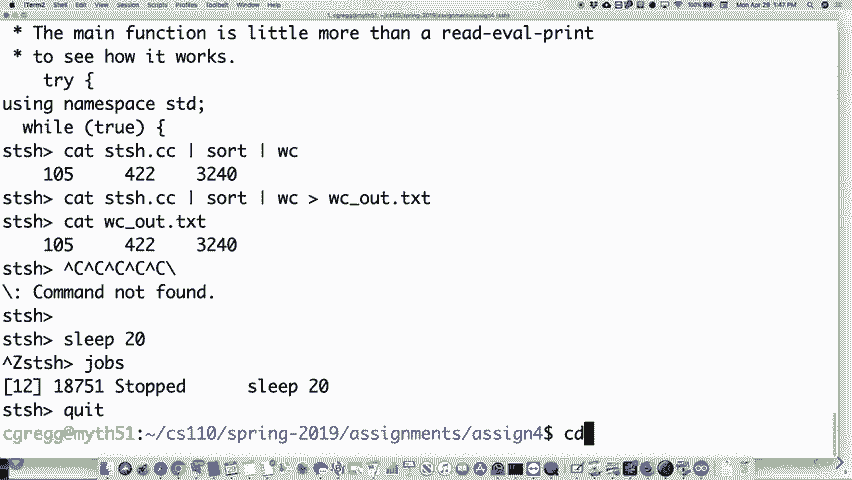

 And by the way， use that solution one to see what the output should be like。

 And some people sometimes miss that。 All right。 Let's see。

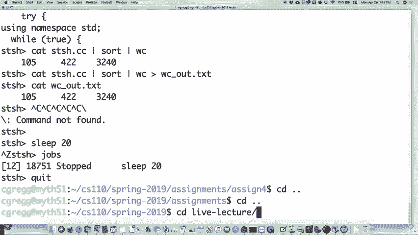

 Cpp now。

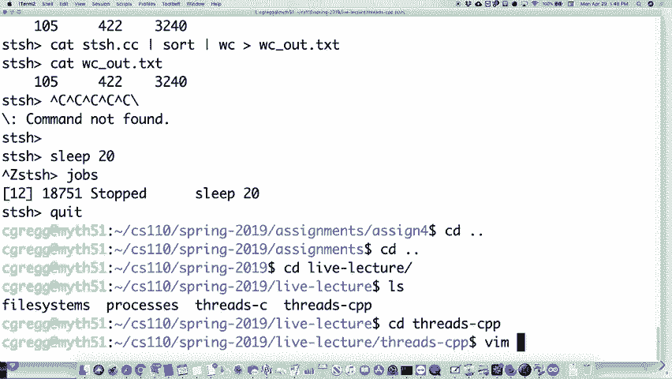

 Okay。 Let's look at a new introverts program。 This is the recharge。

 Basically what we're going to do is the same thing as --， same thing as we did for the same program。

 It basically has 10 threads or， I guess， six threads in this case。

 And they're all going to print out something about recharging when you're alone。 Okay。 In fact。

 we'll do that right now。 We are in C++ now so we can start to use C out。 Okay。 And if we do C out。

 I recharge by spending time alone。 Okay。 And then -- and then N to L。

 One thing about C out is unlike printf， it is actually not thread safe。

 Which means that -- and it turns out here's how it's not thread safe， by the way。

 Each one of these less than less thans are a new function。

 So basically this can print separately from the end L。 And so we want to avoid that， actually。 Well。

 you might not want to avoid that， but let's say you want to avoid that， we normally will。

 If we want that entire C out statement to print without any other。

 thread interrupting it -- by the way， it probably won't do it like between time and alone。

 but it will do it like any time you have this。 So if we wanted to not interrupt that。

 what we can do is we can actually use a function， that Jeri Caine created。

 which is just a lock on it， which says， "Hey， after I say OS lock inside a C out statement or inside a C out function。

 I just want to not have any other thread get in there and do something， while it's still doing that。

" And then after this， we should also have OS unlock。

 And this is using a header file called OS stream lock that we'll just link you to。 Okay， question。

 Chase。 [ Inaudible ]， Couldn't you just use print F？ Sure。

 But there might be some things that you might want to see out that are easier to do。

 and to see out maybe some output of some other -- I don't know。

 some other type or something that has a built-in overload for out or something like that。 But yeah。

 you should just probably stick to see out in this for C++。 It's also the better way to do C++。 Yeah？

 [ Inaudible ]， In this case， you could use a new line character。 Yes。

 although new line may not flush in this case， but yeah。

 you probably could use a new line in this case。 But sometimes what if we wanted to do something like this？

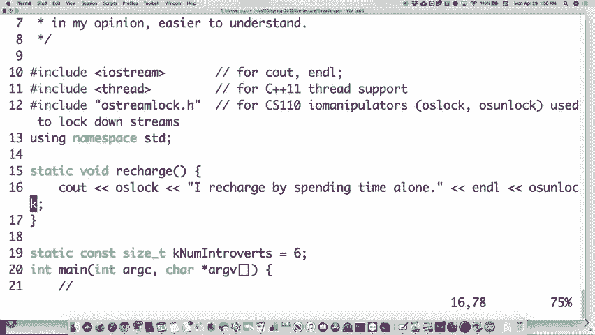

 I'll just do this one。 Like， see out， this is -- I should do it in var a colon a。

 You know what I mean？ Like that， you know， period or whatever。

 Then we still want to wrap it in that OS lock， OS unlock。

 It's easy to use anyway。 All right， and that's that。 Somebody else had a question up here。

 or maybe it was the same。 No？ Okay。 So anyway， that's what we're going to do there。

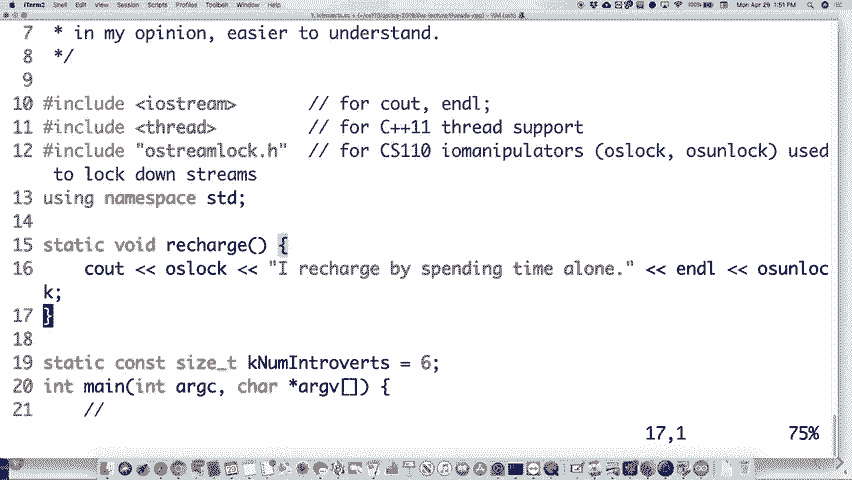

 In fact， that's all this function actually does。 Okay？

 And then what we're going to do is we're going to use the actual， threading library built into C++。

 Okay？ So let's hear from K-num-introverts space introverts period。

 And why didn't I use the OS lock there？ We're not in a thread yet。

 Like we're not even in a thread yet， so not really necessary。

 And although it wouldn't break if we did use it， it's just don't use if you， don't need to。 Okay？

 There's a thread library。 I'll talk about the details of the thread library after we see the example。

 Okay？ Here's how it works。 We're going to do the following introverts。 Okay？ And K-num-introverts。

 Introverts。 Okay？ And that is actually setting up。

 So we're calling the default constructor for this thread class。

 And it is placing them into that array one after the other。 Now you would think， oh。

 does that mean that it's actually launching a thread？ As it turns out。

 the default constructor doesn't do that。 And then I'll show you what we do in a minute。

 This is actually a nuanced thing of C++11 that I'll show you。

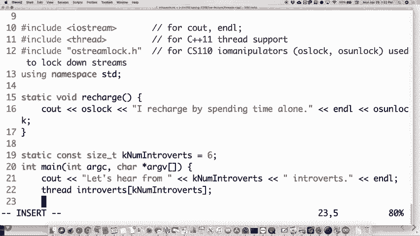

 But for now， just know that that sets up the array of threads。 And then we can do the following。

 So for thread， definitely need the ampersand on there to make it a reference。

 And you'd buy the way you could put that reference there too。 I like to put it here。

 but some people like to put it before or with a space or whatever。

 It doesn't matter as far as C++ is concerned。 Introvert in introverts。 Okay？

 And then what we are going to do is we are going to do the following。

 So introvert equals thread recharge。 And that's all you need to do to actually say， hey。

 here's a new thread with the recharge function， launch it。 Okay？

 You can have as many parameters as you want here。 If you want to send in other parameters。

 we'll do that in a second。

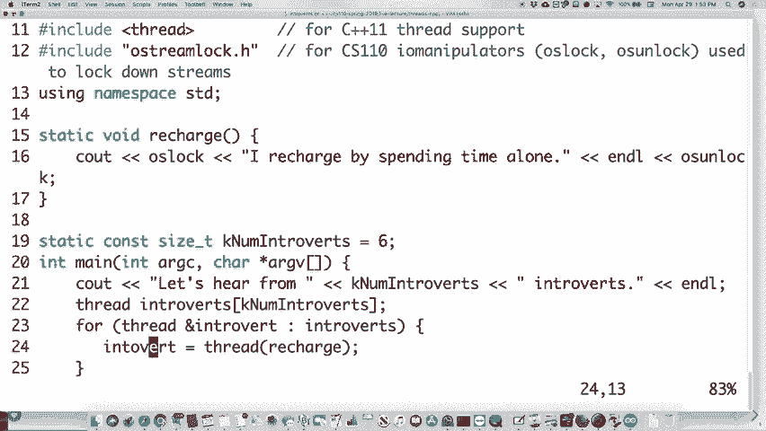

 You can do that。 But this is for the simple example。 That's all you need to do。 Now。

 the interesting part is happening right here where you're doing this weird。

 and if I spell the introvert right， that would be better。 You're doing the exchange as it turns out。

 Instead of just setting it equal， I'll talk about that more in a minute。

 But you might think to yourself， wait， didn't I just start 10 threads？

 And now I'm doing a copy of 10 more threads。 And how does that work？ And so forth。

 It actually is because C++ allows it to work as it turns out。 Okay？

 Then what we can do is we can do another same sort of thing。 In thread， introvert， in introverts。

 Okay？ And then we are just going to do introvert because this is C++ is a class。

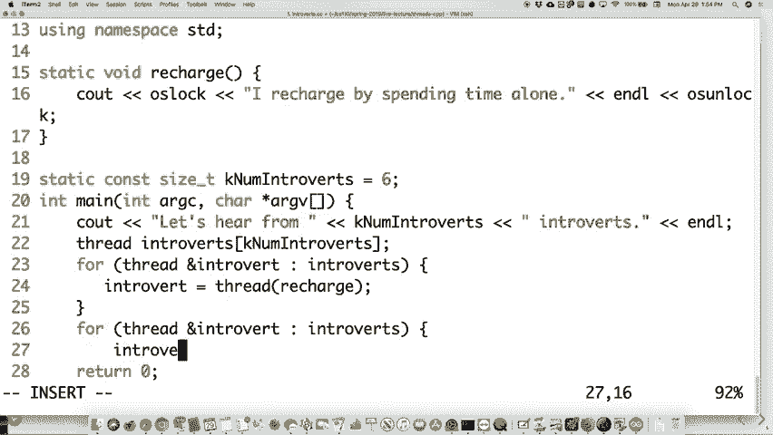

 Join， which does the exact same thing as join the function called it in C and it waits for that particular thread to end before it moves on to the next one in the fourth。

 Okay？

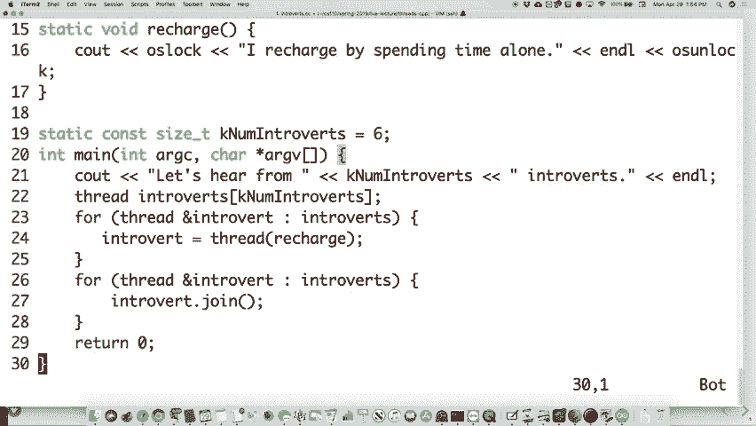

 That's the beginning one。 Let's see if it works。 Anybody notice any type of stuff？

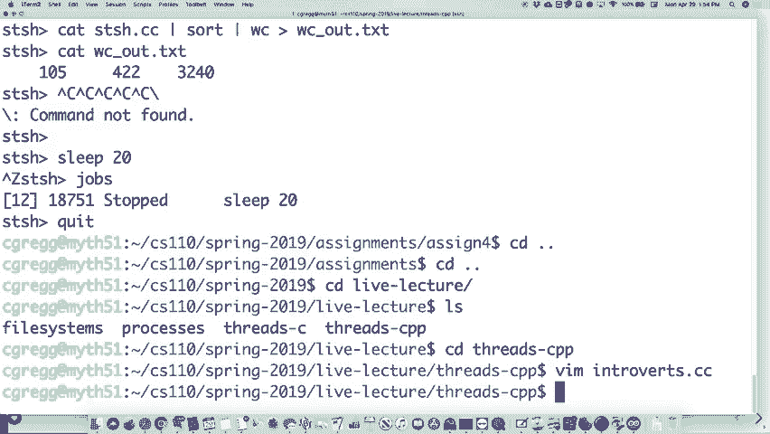

 Let's see。 Make， introverts。 Okay， looks so good。 Introverts。 And there we go。

 I recharged by spending time alone six times。 Okay？

 So let's go back and talk about the details of this。 A little more， in a little bit more detail。

 Anybody have any particular questions so far on this？

 So the syntax for the formants you're getting the introvert by reference？ Yeah， very good question。

 You're getting the introvert by reference in the line down here。 Yes。 And here。

 You're getting it by reference from the actual introverts array。 And well， yeah， good question。

 Why are you doing that？ We need to， as it turns out， this is the C++ part。

 And I guess we should just talk about that right now。

 We're trying to take a thread that we're creating and plop it into an array。

 Normally what would happen is you would copy all the resources out of the thread and place。

 it into that array。 Right？ Well， that would mean there's now kind of two threads that are going and there's no real。

 way to like shut down the one and start up the one in the array。

 It just happens that that doesn't work in C++ normally。 Well， C++ itself。

 I think this is on the next page， has a new function， which is， here it， is。

 operator equals thread two ampersands other。 It's just a syntax thing。

 It basically means we are setting up this move type of equality。

 Basically it's swapping the two things。 Okay？ And all you need to really know about that is that this works。

 And so， what's kind of the bottom line is that when you do this， when you do the actual。

 equals right down here， and you say， okay， look， the thread that we are creating here is。

 actually going to be placed into the place where the reference is in the array。

 And it actually does a complete swap and places the non-working thread that we constructed。

 in the array into our actual as the kind of thread over on the other， on the right-hand side。

 of the array。 And so， what we're going to do is we're going to do this。 And we're going to do this。

 And we're going to do this。 And we're going to do this。 And we're going to do this。

 And we're going to do this。 And we're going to do this。 And we're going to do this。

 And we're going to do this。 And we're going to do this。 And we're going to do this。

 And we're going to do this。 And we're going to do this。 And we're going to do this。

 And we're going to do this。 And we're going to do this。 And we're going to do this。

 And we're going to do this。 And we're going to do this。 And we're going to do this。

 And we're going to do this。 And we're going to do this。 And we're going to do this。

 And we're going to do this。 And we're going to do this。 And we're going to do this。

 And we're going to do this。 And we're going to do this。 And we're going to do this。

 And we're going to do this。 And we're going to do this。 And we're going to do this。

 And we're going to do this。 And we're going to do this。 And we're going to do this。

 And we're going to do this。 And we're going to do this。 And we're going to do this。

 And we're going to do this。 And we're going to do this。 And we're going to do this。

 And we're going to do this。 And we're going to do this。 And we're going to do this。

 And we're going to do this。 And we're going to do this。 And we're going to do this。

 And we're going to do this。 And we're going to do this。 And we're going to do this。

 And we're going to do this。 And we're going to do this。 And we're going to do this。

 And we're going to do this。 And we're going to do this。 And we're going to do this。

 And we're going to do this。 And we're going to do this。 And we're going to do this。

 And we're going to do this。 And we're going to do this。 And we're going to do this。

 And we're going to do this。 And we're going to do this。 And we're going to do this。

 And we're going to do this。 And we're going to do this。 And we're going to do this。

 And we're going to do this。 And we're going to do this。 And we're going to do this。

 And we're going to do this。 And we're going to do this。 And we're going to do this。

 And we're going to do this。 And we're going to do this。 And we're going to do this。

 And we're going to do this。 And we're going to do this。 And we're going to do this。

 And we're going to do this。 And we're going to do this。 And we're going to do this。

 And we're going to do this。 And we're going to do this。 And we're going to do this。

 And we're going to do this。 And we're going to do this。 And we're going to do this。

 And we're going to do this。 And we're going to do this。 And we're going to do this。

 And we're going to do this。 And we're going to do this。 And we're going to do this。

 And we're going to do this。 And we're going to do this。 And we're going to do this。

 And we're going to do this。 And we're going to do this。 And we're going to do this。

 And we're going to do this。 Yeah， good question。 Are there things like W-No-Hang and W-On-Trace and all that？

 Not really。 You're not going to have the same models when you're doing this。 Basically。

 you're most often going to join at the end。 And it's not like you're going to stop a thread using SIGSTOP and so。

 forth。 It's not a process in itself。 Most of the things that we did with threads are processes in。

 that sense are not going to be really in the same model of， threading。 Okay。

 threading is most of the time breaking up a problem into。

 many subproblems to solve kind of independently。 We'll see an example of that in a few minutes。

 And that's where it differs a little bit from multi-processing。 Remember。

 most of the time multi-processing is fork exec。 Fork exec fork exec。

 That's most of the time what we do with processes so that we can， launch other programs。

 This is now saying everything's going to be in my one program。

 but I'm going to make them all kind of happen in parallel。 Yeah。 Good question。 All right。

 So that's the actual program。 Let's see。 What else can we talk about here？

 This is the important part。 We declare an empty thread。 The empty thread handles array。

 That's the important one。 Okay。 And then we install the recharge function into temporary threads。

 That's just saying thread and then the name of the function。

 And then they get copied over or I should say moved into the， array。 Okay。

 So that's kind of the new C++ part。 All right。 And you can read a little more details about that as you go。

 Join method。 We talked about the function can be anything we want。

 Normally we just have a void function because we don't actually， ever get the return value of it。

 It's not you can't really get the return value in the same sense， that you can in wait PID。

 But it can be the function can be anything。 So you'll see lots of functions you'll write that we actually。

 launch in a thread。 And it's actually pretty nice。

 It's in some ways much simpler than multiprocessing。

 And you don't have to have any special types of functions。

 Just call the function with the parameters you want。 There it is。

 Now it's running in its own thread。 It's actually relatively clean。 Yeah。 >> Can you give arguments？

 >> You can give arguments。 We will talk about that now。 Good question。 Okay。 All right。

 So let's move on to a different example。 Okay。 This is going to be a greeter program。

 And it's going to be just a program where we are going to have。

 a number of threads run and print out a little greeting based on。

 their thread number that we're assigning it。

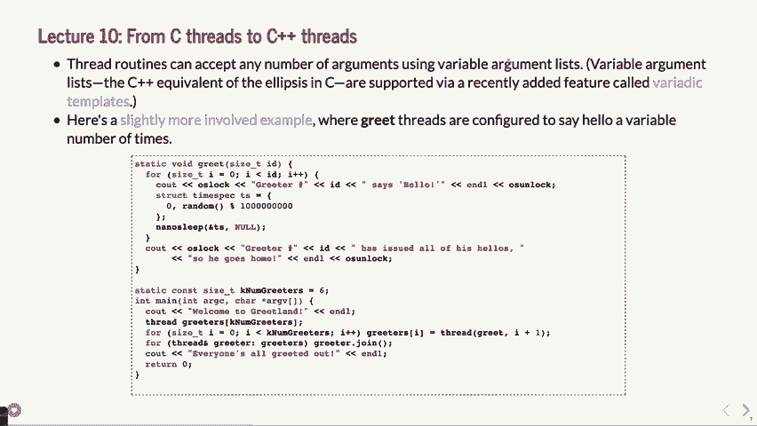

 So let's look at that。 Oops。 There we go。 Maybe that's the one。 I hope that's the one。 There we go。

 Okay。 So in this one we are going to have a function that takes a。

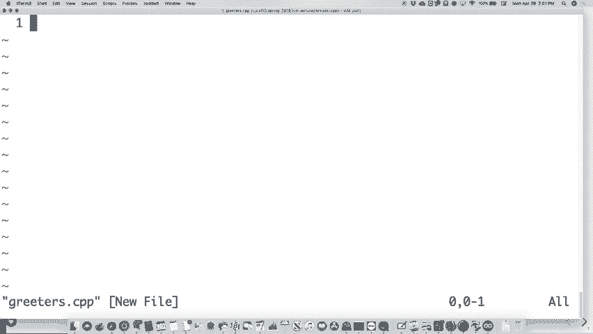

 parameter。 And so this is how to actually send that parameter。

 You can send it by value or references。

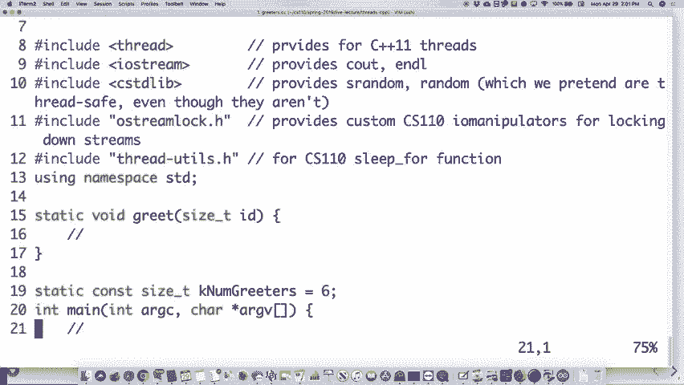

 It turns out you can do either。 We can -- we'll show you how to do both of those。 Okay。

 In this case we are going to have each greeter grader。

 And we're going to have a number of different types of parameters。

 And we're going to have both of those。 Okay。 In this case we are going to have each greeter grader grader a。

 whole number of times。 I'll show you what I mean。 Okay。 Size t -- size t。 I equals zero。

 I is less than the id。 So whatever id we pass in it's going to greet them that many， times。 Why not？

 It's kind of a silly program。 Okay。 So whenever we have to do osloc because we are in a thread and。

 we can say greeter number and then id says hello。 And l。

 And then we do osloc because that's after the entire line。 Okay。 All right。

 And then what we're going to do is we're actually going to do。

 something here where we pause for a little bit of time so you can。

 see the interleaving of the threads。 So we're going to do kind of this interesting thing。

 We're just going to use a little time structure called time， spec。 You don't have to know about it。

 I mean we'll never ask you about that。 t s equals and then you can set it up like this。

 It's got a few different things in random。 And then we are going to -- oops， random mod。 1， 2， 3， 4。

 5， 6， 7， 8， 9。 A big number。 Okay。 And let's see。 I think that's that。 There we go。

 And then we're going to do this thing called nano sleep for that。

 amount of time which is a slightly small amount of time because， it's time divided by a billion。

 Okay。 And then we are going to end our loop。

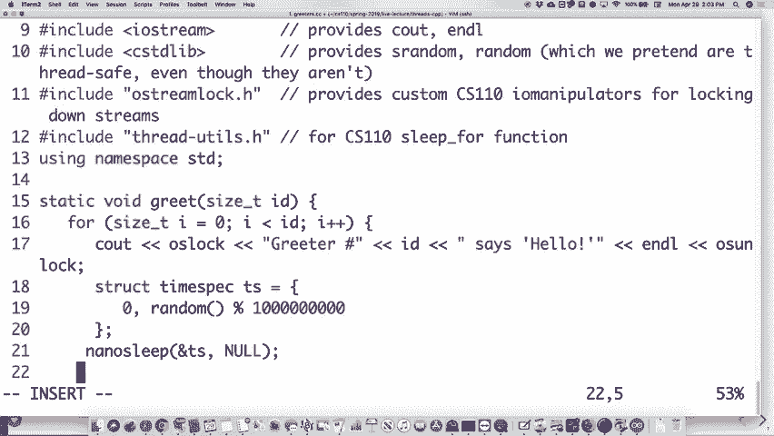

 I don't know why this is not。 There we go。

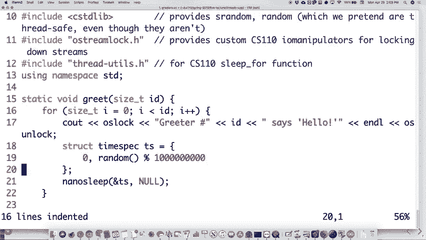

 Okay。 And then we are going to do another cout， os lock。 And we're going to say。

 creader number ID as issued all of their hellos comma。

 And then you can -- I guess because the next line here we'll， do it on the next line。 So let's see。

 So they go home。 And L。 And then os unlock。 And that's it。 Okay。 So that's our greeting function。

 Okay。 Question。 >> Is there a get-de-ed like get-de-ed sort of phone？ Can you join in this function？

 >> Is there a get-de-ed？ Can you join in this function？ There is a get-thread-id。

 You can get your threads-id which is more or less a process， like id if you want to do that。 No。

 you wouldn't be joining inside the thread。 You don't want to be joining inside the thread。

 You want the main program to do the joining。 Yeah。 Maybe some nuances to that。

 but in general don't try to join， another thread。 And by the way， again。

 multi-processing and multi-threading don't really mix too well。

 You don't want to fork inside a thread。 Otherwise lots of things could be bad。

 You could do threads inside a process that you fork but not， the other way around。

 Just the way it works。

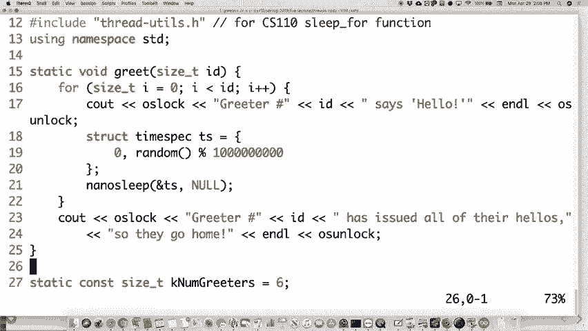

 You've got to be used to that。 Okay。 So anyway， that is our grid。

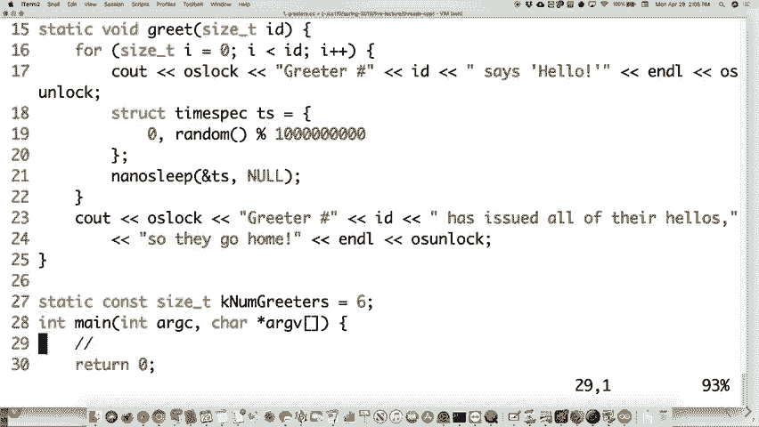

 Let's just make sure we made that make-readers looks good。 Define and I used okay。 Good。 All right。

 So then in main， what we're going to do is we're going to do， something like see out。

 Welcome to gretland。 Welcome to gretland。 We're going to gretland。

 We should probably capitalize that if it's a proper noun。 Okay。 And then and L。 Okay。

 And then thread。 Greeters。 This should look familiar。 K-nom-greeters。 And then four。 Size t。

 I equals zero。 I is less than K-nom-greeters。 Semi-colon I plus plus。

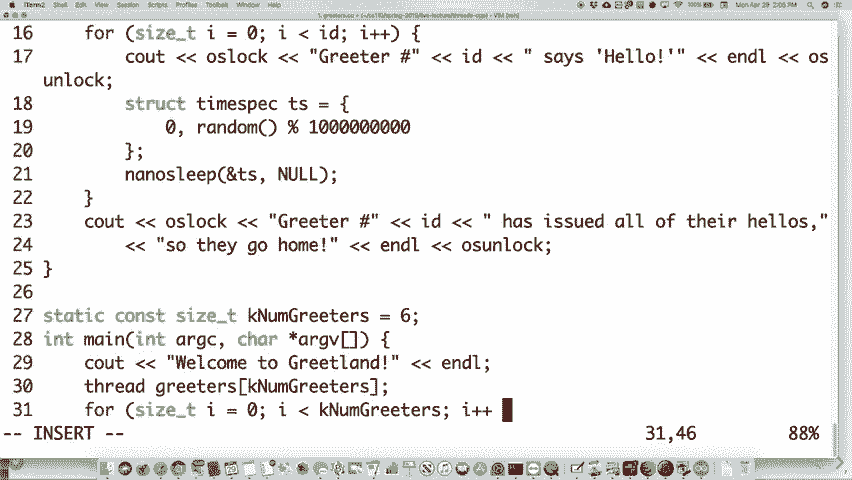

 Okay。 We can do greeters。 We could have done it the way we did before， but this is just a。

 slightly different way of doing without the reference。

 We'll still do a copy like we did before and move like we did before。 Okay。

 Greeters I equals thread and greet。 And then what we do is we just pass the parameter as the next parameter。

 And that's what it does。 It calls greet with the parameter I plus one passed by value。

 Did I do something wrong？ I plus one。 Oh， not I plus I。 That would have been an interesting program。

 Okay。 All right。

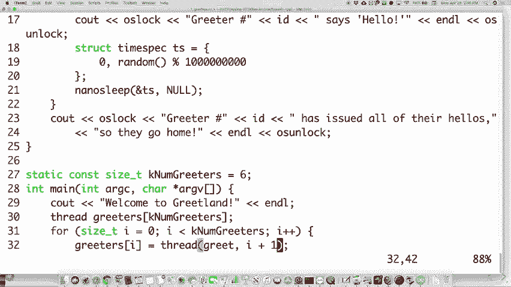

 I plus one。 There we go like that。 Okay。 And then that's that。

 And then we need to join them for size。

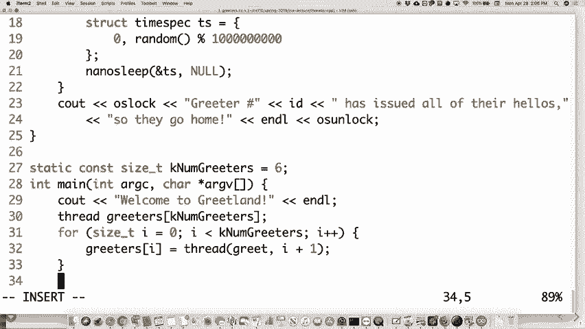

 I'll just do this。 It's going to be the same。 Okay。 For size t。 K-nom-greeters。 Okay。

 And then we just do a greeter。 Nope。 Actually in this case we don't want to do that。

 We want to do the actual thread。 I can't do it the way I want it to。 I guess we probably could。

 We could。 But in this case we'll do it the way we did before。 And then we want to do the thread。

 And percent greeter。 Mix and match。 Greeter。 That。 And then in this case we want to do greeter。join。

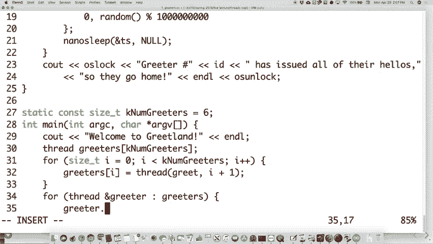

 Okay。 That will wait for them all。 Okay。 And then we want to just say see out everyone。

 All greeted out。 And out。 Okay。 That's what we're going to do。 Good question。 Wait。

 why did you say that original form of--， The original form of wood have worked。

 I just decided to do a different way。 The original form of wood would have been this。

 We could have done the--， We would have just done the greeter's eye。join instead。

 That would have worked。 Yeah。 But different way of doing it。 Let's show you both。 Question。

 What happens if you joined right after you created it？ Good question。

 If you joined right after you created it， what would happen？ You tell me。

 Because it was a good thing to do nothing so it wouldn't get like， different time。

 It would do something？ What would it do？ That would--， Won't join and wait until that thread just--。

 Yeah。 It would serialize everything。 If you create the thread and then immediately join。

 then it won't， go on and it won't even go to the next loop until that thread finishes。

 So you need two loops？ Because you want to launch all the threads。

 Let them all work in parallel and then wait for them all afterwards。 In fact。

 that's a very good point。 That this is actually kind of key。 This is very much non-blocking。

 This loop happens super-duper fast。 What happens？ It just basically calls this thread function with a function name and。

 says on your own time， as soon as possible， launch this thread and it。

 moves on to the next iteration of the loop。

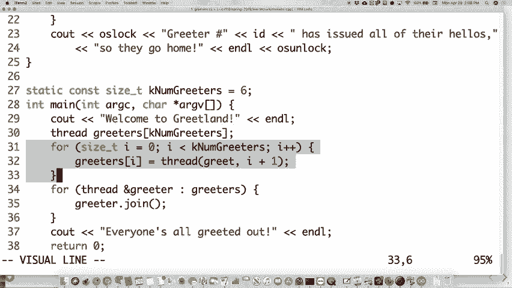

 So there's no waiting at all on this and that's actually kind of key。 All right。

 Let's see if we did this right。 Make readers。 So far so good。 Greeters。 All right。

 And then Greeters。 There we go。 Okay。

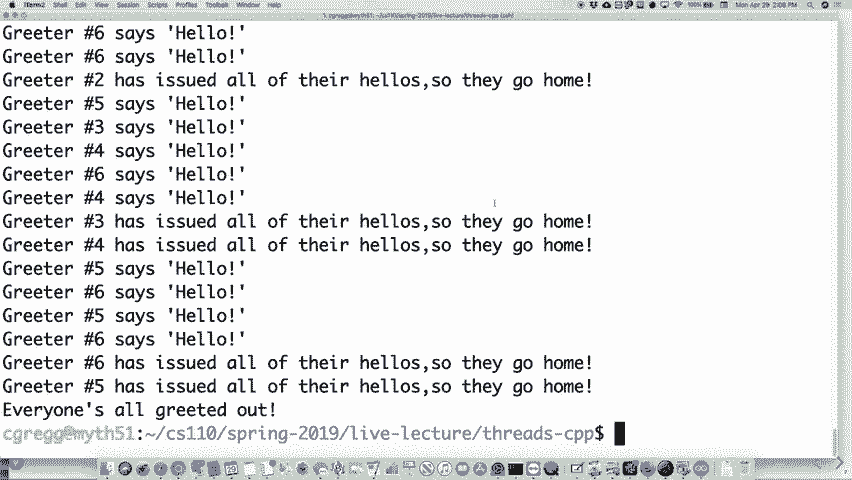

 So remember it's wait pausing a little bit in there。 That's why it does that。

 How many times should six say hello？ Six， say hello six times， I believe。

 unless I did the less than instead of。

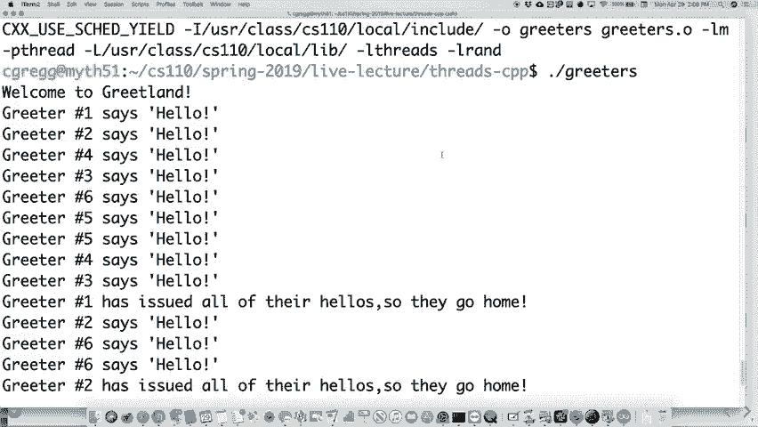

 less than or equal to。 But anyway， that's what it is。

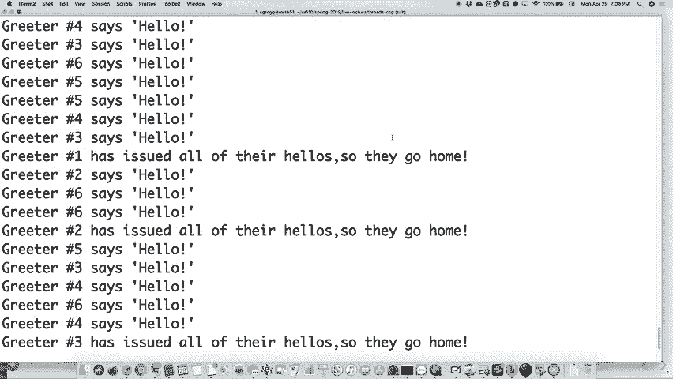

 One only says hello once and then one happens to be the first one that's。

 issued all of its hello so that they go home and so on and so on and so forth。

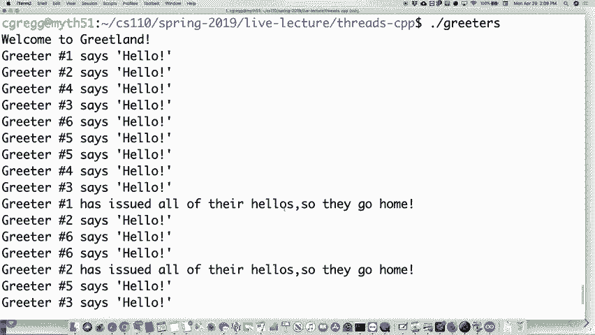

 Yeah。 If you want to do all that， I think we're going to do all that。

 Could you do an OS lock for the --， Okay。 So first of all， OS lock is not for processes。

 It's only for C out。 So OS lock is only -- we'll talk about locks and things in a minute as we go for it。

 If you wanted to do it in order， you just probably wouldn't have threads， number one。

 And number two， if you really could just join after you do each thread and then， it would do it。

 That's not really the way you would normally use threads anyway。 All right。

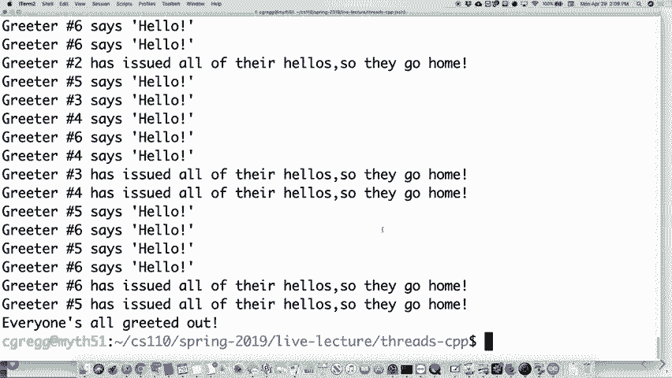

 Questions on this one， on this greeter function。 You can actually pass the parameters in。

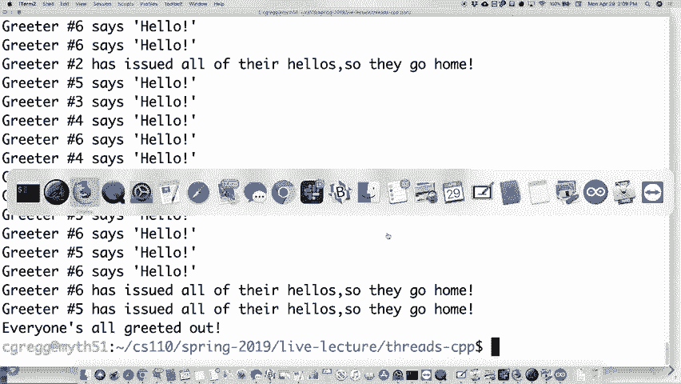

 Yeah。 I'm Mark。 [ Inaudible ]， Oh。 [ Inaudible ]， Right。 There's a good question。 The question is。

 wait a minute。 And I think you're alluding to a wait PID where you can say， oh， this one ended。

 I'm going to handle that one first。 Not really。 In this case。

 you just got to -- you have to wait for them all in kind of order -- in whatever， order you want。

 But there's not really a way to -- as far as I know， I'll look it up。

 But I've never seen it where you've waited for things out of -- you've joined out of order。

 You kind of just go， I'm going to slouch these threads and then wait for them all at the end。

 In some sort of order。 You can't say I'm going to wait for any thread like that。

 It's not the same model as multi-processing。 Good question。 Okay。 All right。

 So that's the greeter program。

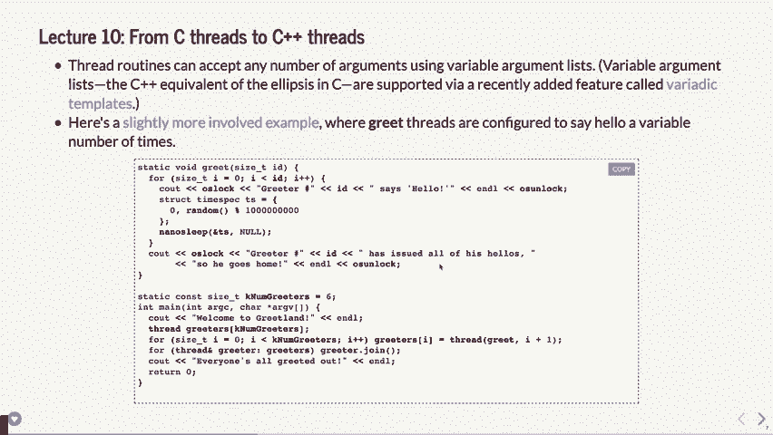

 And notice you can send in a parameter。 Okay。 All right。

 What we can do is we generally want to use threads to break up a smaller -- or a bigger problem。

 such that some group of threads can work on individual parts of that problem independently。

 That's why we have multiple cores and multiple processors so that we can actually do this。

 It's actually a nice benefit of threads and probably the main reason threads were ever created in the beginning。

 So what we're going to do is we're going to do another little program and we're going to model ticket sales。

 Okay。 Basically， this is where you call up， like， I don't know， United Airlines in this case。

 And you don't do that anymore。 People used to actually call them instead of doing it online。

 But you would call them up。 And let's say we have 10 ticket agents， which I'll answer the telephone。

 And when they answer a telephone， they sell a ticket。 And we have 250 tickets that can be sold。

 Okay。 256 tickets can be sold。 And as they answer the telephone。

 they get a caller and then they sell that ticket。 Okay。 And they sell one ticket。 Now。

 it might turn out that somebody wants to fly to the middle of nowhere or whatever。

 And the ticket agent takes a little longer to actually process that ticket。

 And it might be that some other ticket agent gets a whole bunch of people who just want to fly from New York to Boston。

 And it's an easy， like， you know， two second call， phone call， whatever。

 That's -- so we don't want to necessarily limit all of the -- we don't want to limit -- oh， no。

 All right。 Why do you do this？ Hang on。 We don't want to limit the actual number of tickets to 10% of the -- like 10% for each agent。

 Okay。 And specifically， so that we can allow them to do it a little more effectively。 Okay。

 So what we might do is something like this。 Okay。 Let me actually start -- I'll actually do this in the program because we're going to run this for you in a minute。

 And let's see if I can clear it。 Okay。 Let's see。 This one is going to be called Confused。

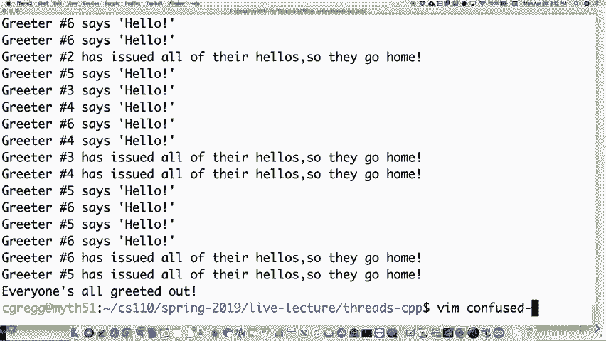

 And we'll see why in a minute ticket agents。 Okay。 It's going to be a little bit confusing here。

 But this is what we might start out with。 Okay。 We might start out with something like this。

 All right。 Thread Agents 10。 Okay。 We could have a constant for that。 That's that。 Thread Agents 10。

 Size T remaining tickets。 Tickets equals 250。 Okay。 So we're going to have 250 remaining tickets。

 All right。 And then four。 Size T。 I equals zero。 I is less than 10。

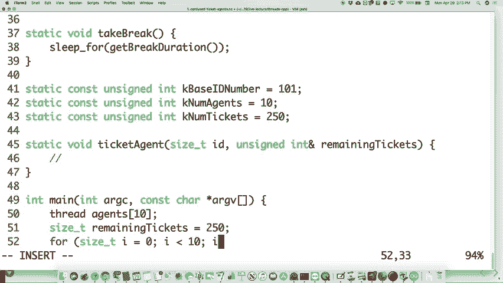

 I plus plus。 Okay。 What we're going to do here is we're going to say agents。

 I equals thread ticket agent because that's the function we're going to create。 Ticket agent。

 We'll give a ticket -- each ticket agent a little number between 101 and I。

 I'm not sure why we gave it a hundred and one， but we did。 Okay。 100 and I。

 And then we need to pass in the remaining tickets by reference。 Okay。

 Now thread has no idea about a reference parameter versus a regular parameter。

 So if you tried to say this remaining tickets like that， okay。

 then what would happen is you would actually send it by value， which is not what you want to do。

 Okay。 And there's no real easy -- well， there is an easy way to do it。

 but something you may not have seen before。 If you want to specifically send a parameter by reference。

 you actually wrap it in a ref function。 Okay。 Or maybe it's an operator。 But anyway。

 it basically says send this by reference， not by value。 Okay。

 So that's what we're going to do for each thing because now we're going to have one remaining tickets that all the agents are going to pull from。

 Okay。 All right。 And let's see。 That's -- let's see。 Is that the end of the function there？ Well。

 we've got it。 We've been running that statement。

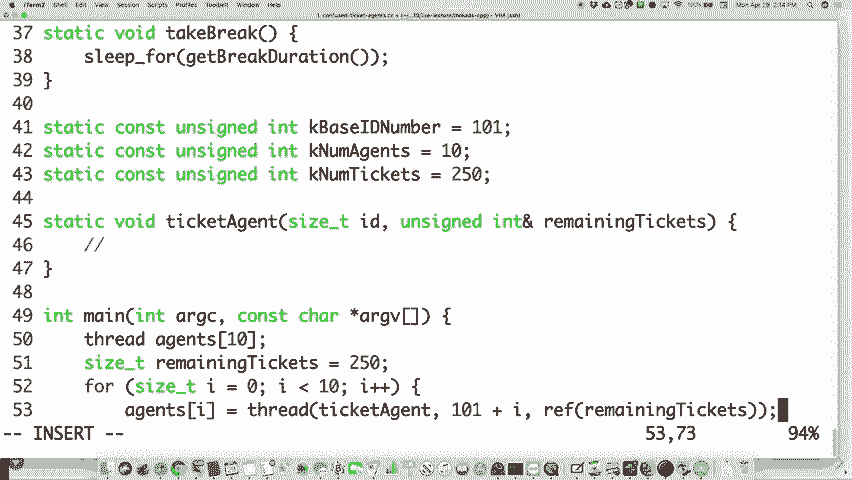

 Okay。 And then there， and then that actually launches them all。

 And then we have for the red ampersand agent in agents， agent dot join like that。

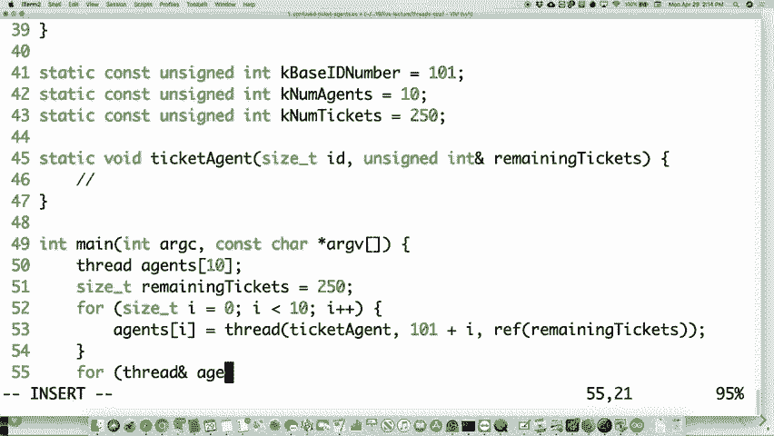

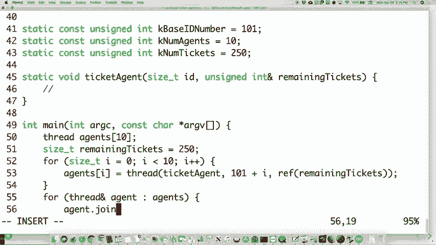

 And then we will say see out end of business day。 Okay。

 So we're basically going to -- after everybody finishes， we will say end of business day。 Okay。

 All right。 Everybody get what's happening in main there。 Okay。

 Let's look at the actual remain or ticket agent function and see what we can come up with here。

 Okay。 Well， we're going to have each agent grab a ticket and sell it， basically。

 And then we're going to have a ticket that's going to be like a while remaining tickets。

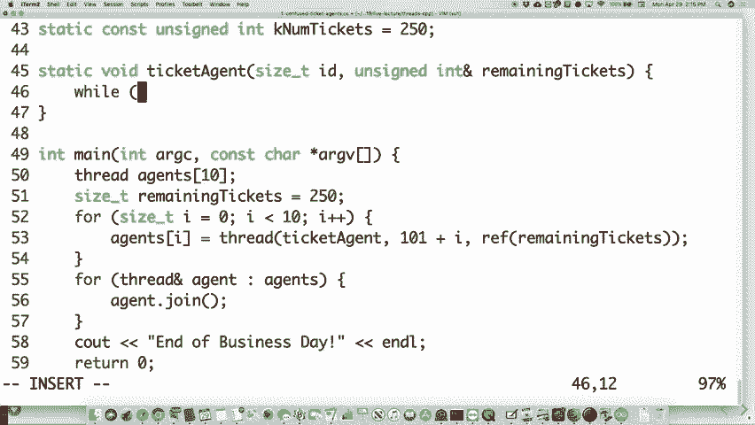

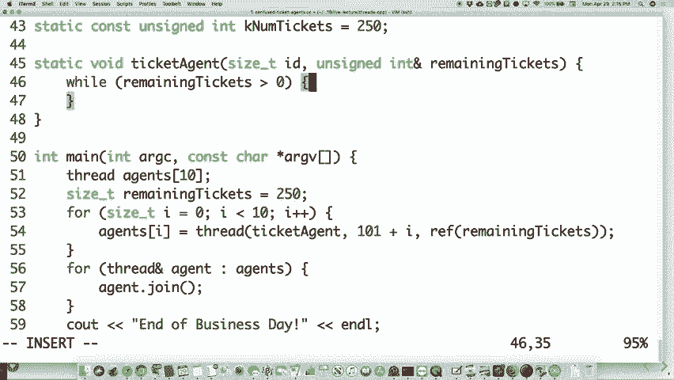

 It's greater than zero。

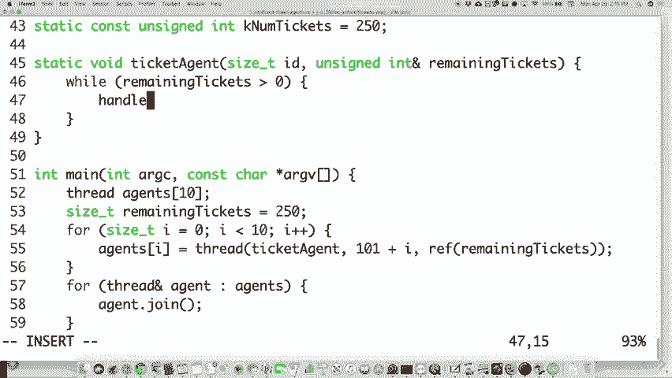

 Okay。 Well， in here we are going to say I have a function that handles the call。

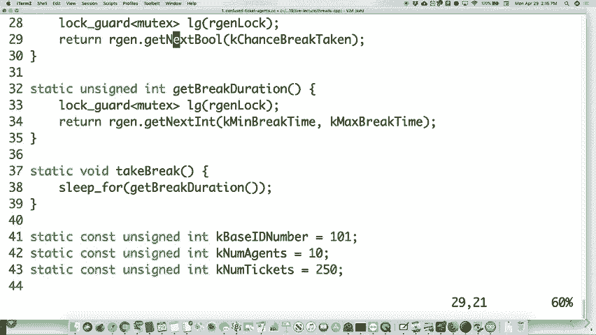

 Okay。 You don't have to worry about the points up here somewhere。

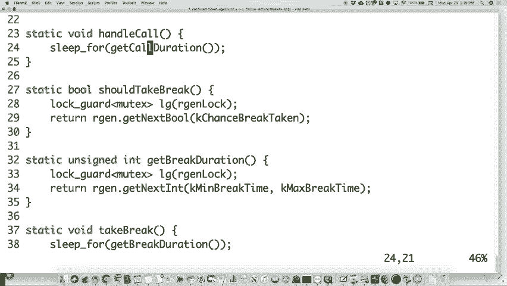

 You can actually read it later。 But don't -- actually。

 it's just basically -- it sleeps for a while to kind of mimic handling the call。

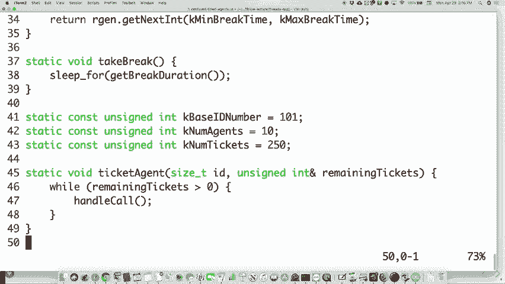

 Okay。 So we're going to handle the call。

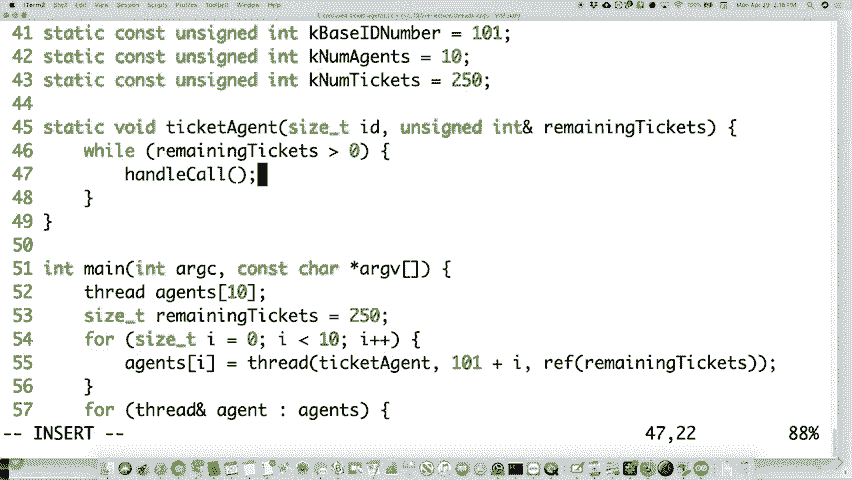

 Okay。 And then this is going to sleep for a little while to basically mimic handling the call。 Now。

 how long it takes。 And that's a random number。 Okay。

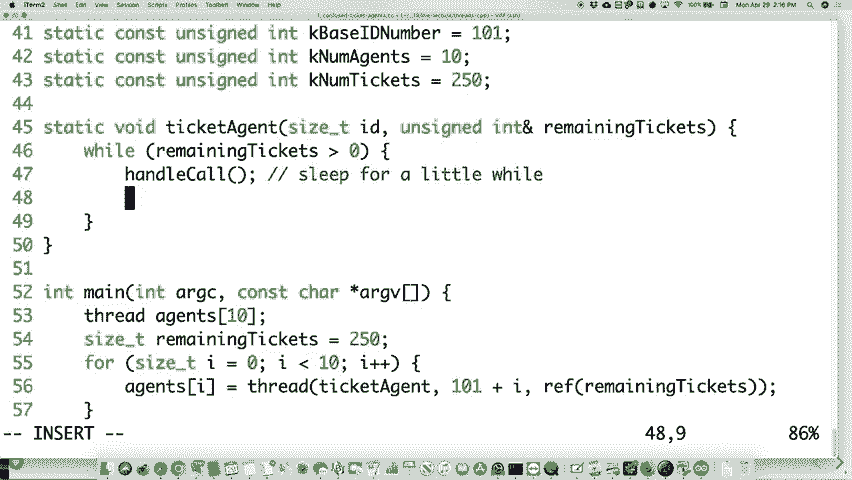

 And then we're going to say remaining tickets minus minus because we just sold one。 Okay。

 And then let's actually print out OS lock in this case and agent number。

 And same thing ID sold a ticket like that。

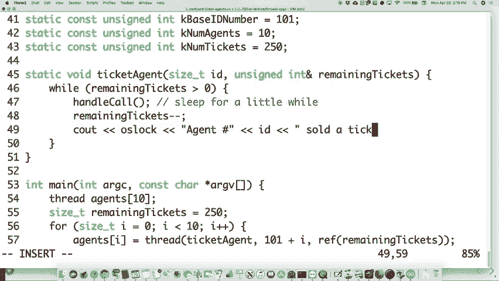

 Okay。 And then we will say remaining remaining tickets more to be sold like that。

 And then we have to do the OS unlock like that。 Okay。 So we're basically saying， okay。

 well now a ticket -- ticket has been sold。 Okay。 And then we're going to let the agent take a break if it's time for them to take a break。

 This is just to kind of interleave things a little bit more。 If should take break。

 then we are going to basically take break。 Okay。 All right。 Sometimes these get a little bit silly。

 But then that's it。 And then see out。 That is actually after the while loop， right？

 We get -- then we say， oh great。 We've sold all the tickets because the remaining tickets are not -- there's no more left。

 Okay。 So we can say something like agent number ID notices。 All tickets are sold and goes home。

 Okay。 And LOS unlock。 I forgot to do the OS lock beginning。 OS lock that。

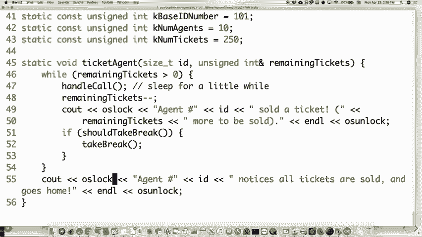

 Okay。 All right。 So this is our first attempt。 Anybody see any bugs？ All right。

 This is our first attempt。 Basically we're going to have each agent keep countdown and go ahead and do it。

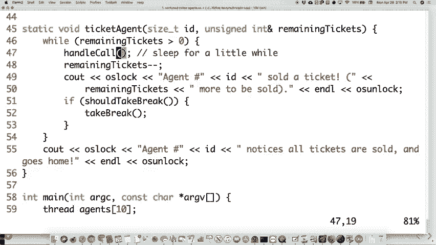

 Make confused。 Ticket。

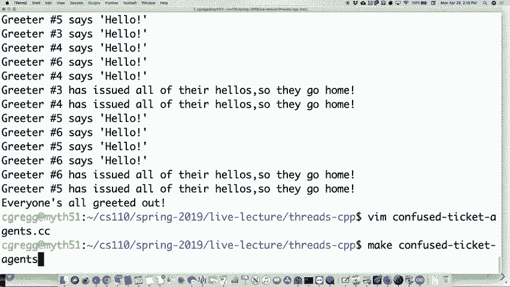

 Agents。 Oh no。 Here we go。 Let's see。 No name type online。 Oh boy。 I love C++ errors。 Okay。 Hold on。

 Not there。 Where is the actual error？ Not there。 Not there。 Not there。 Not there。 Uh oh。

 Oh there it is。 62。 Maybe。 62。 All right。 What do we do here？ We're going to do a red ticket agent。

 We're out for remaining tickets。 Agents。 We set up agents。 And then what else？ It's the agent side。

 It goes through the ticket agent。 And plus the ref remaining tickets。

 I think you don't define ticket agent。 I don't define ticket agent。

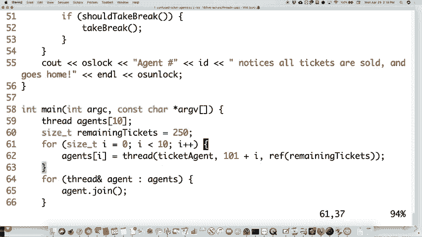

 Uh it's up here isn't it？ I think there it is right there。

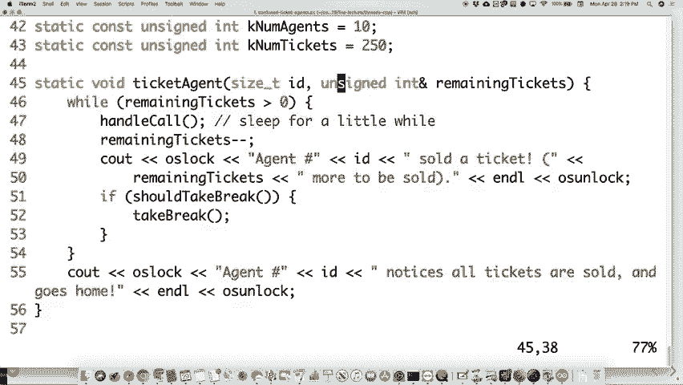

 It's the function we're trying to send。 Mmm。 Let's see。

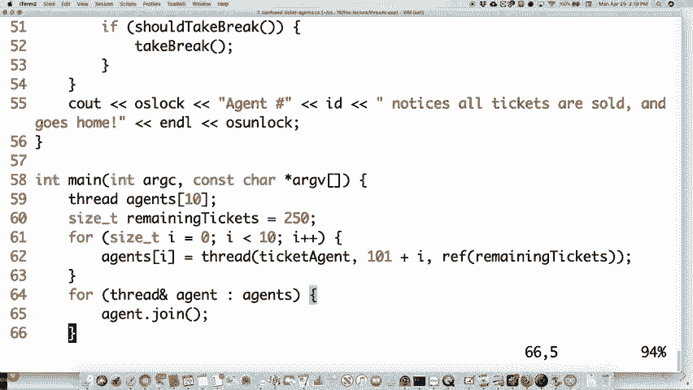

 Do we need the ref？ We do。 That's right there。 That's going to happen there。 We do need that。

 You need to like import something。 I don't think so。 Um let's see。

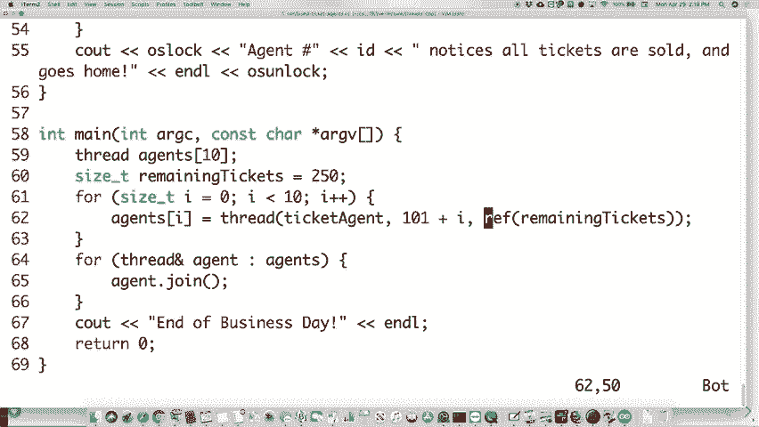

 I'm trying to think if there's any。 Let's look at the error again。 No name type。 Mmm。 Red 137。

 Known type name type in class void。 Not sure。 Well in the interest of time I happen to have the original。

 Let's just do it。 Let's do it。 This is just in case this sort of thing happens and I can't not。

 good enough to find this。 I'm confused ticket agents original CC。

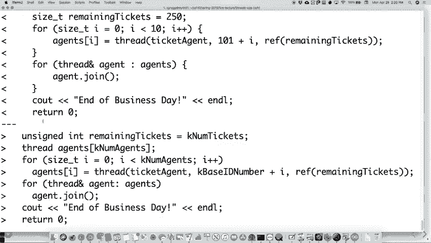

 Uh let's see。 What did we do here？

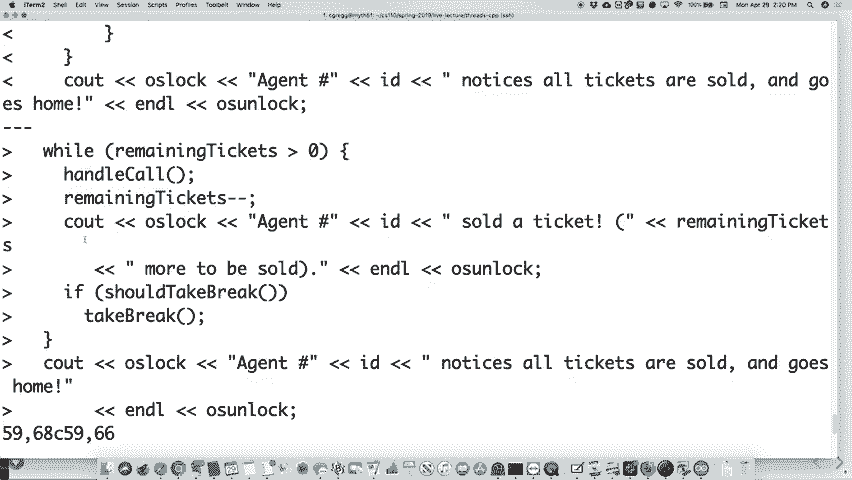

 Oh no。 Doesn't look looks much different。 I don't think it。

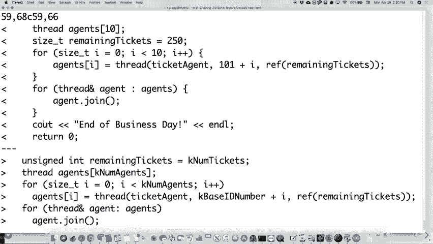

 Well it's the one I promise you it should be the one。 Now that's a hang on。

 That is it uses all the constants。 Yeah。 Maybe I actually forgot a part of it here。

 No I don't think so。 Well here's what we're going to do。

 We're going to copy it over and do it and run it。 Uh because I'll look at here。 Here's what I'll do。

 I'll make a copy of it right now。

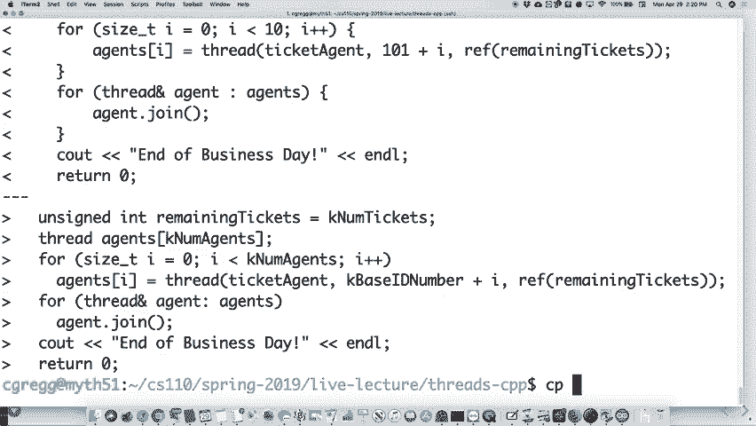

 Confused ticket agents。cc to confused ticket agents。 Chris is confused。

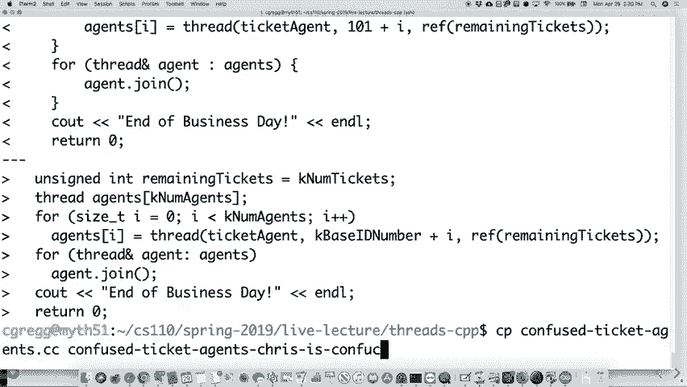

 I'll check it out later and then confused ticket agents。

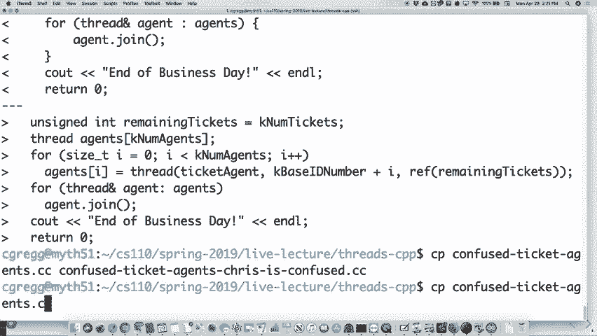

 Uh original to confused ticket agents。cc。

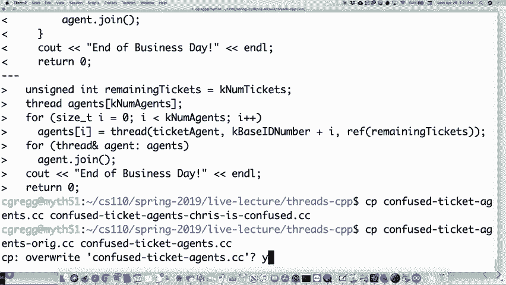

 And right。 Okay。 Let's try it again。 Confused ticket agents。 That time it worked。 Okay。

 Now I swear I work when I try to。 Okay。 So here's what it's going to do。

 It's going to go count down all 250 each。 Each ticket agent is getting waiting some amount of time。

 Some may get five over the course。 Some may get 10。 Some may get 20。 Some may get 30。 Whatever。

 It will finally keep going and count down。 And then that's going to take a long time to get one more sold。

 Okay。 So and this is going to go on basically forever。 Right。

 In fact when it gets down to about zero again it'll probably wrap around again。 Okay。

 So we have an issue。 What is our issue is the question。 Okay。

 Let's look at the actual code here that we should have been doing here。 Okay。 That's main。

 And then that's main two。 We already know that's there。 Let's see。 Here's the ticket agent。

 Maybe I still looks all right。 So here's what we're doing here。 Is there a race condition？

 Some of you already noticed it。 I could tell when I was writing it。 What's the race condition here？

 Yeah。 Emily。 They all have access to remaining tickets。 Right。

 And when the remaining tickets when it does the decrement there and the remaining tickets。

 while remaining tickets is greater than zero and then remaining tickets minus minus。

 those it may not be true that that actually that remaining tickets is still greater than。

 zero because some other thread could have come in and done the exact same thing。 Okay。

 So that's the issue。 One of the issues here。 In fact， it's much more subtle than that even。 Okay。

 There's this idea that you can do that。 Well， what happens is， well。

 we can see what happens there that it actually ends up going。

 down and wrapping around because two things have tried to decrement。

 If actually indeed decremented the thread count before， another thread came out and said， oh。

 there are any left。 Oh， yeah， there's four billion left。 So that's the issue。 The， as I said。

 it's even more subtle than that。 Even remaining tickets minus minus itself is not necessarily atomic。

 Okay。 A C++ statement is atomic in that it runs on its own。 But remember。

 what does a C++ statement do？ And all you people who took 107 would know that it gets translated into possibly a whole bunch。

 of assembly code instructions， each one of which is more or less atomic， but together。

 they certainly are not atomic。 Okay。 So this， when you do remaining tickets minus minus。

 if you go and decompile， you can see， that it ends up coming into some。

 ends up something like this assembly code here where you've got five different， instructions。

 any which， any one of which could get interrupted by going to the next thread， and having a problem。

 So what are we actually doing？ We're getting the memory and then we are decrementing it by one。

 Remember our favorite command， LEA， for two people who took 107。

 And then we're decrementing it by one。 And then we are moving it back into memory。 Well。

 if any other thread did some of those operations while these were happening， like。

 then the memory wouldn't necessarily be one or move。 This is a classic race condition。 Okay。

 Absolutely classic race condition that you need to be able to handle。 Okay。

 So what are the kinds of things we can do？ Well， what we can do。

 and this is built into the thread libraries， we can say， okay， one， of the programs is not going to。

 is not going to run， or one of the threads is going to have， access to this data structure。

 in other words， the， or， or， or data structures that remain， in tickets variable。

 while all the other ones have to wait on it。 Okay。 So that's what， and by the way。

 I just realized what I can do here to make our code a little， simpler， as far as the， see。

 then confused ticket agents， not CC。 I'm just going to do the following。 That was which one。

 That was the ticket agent。

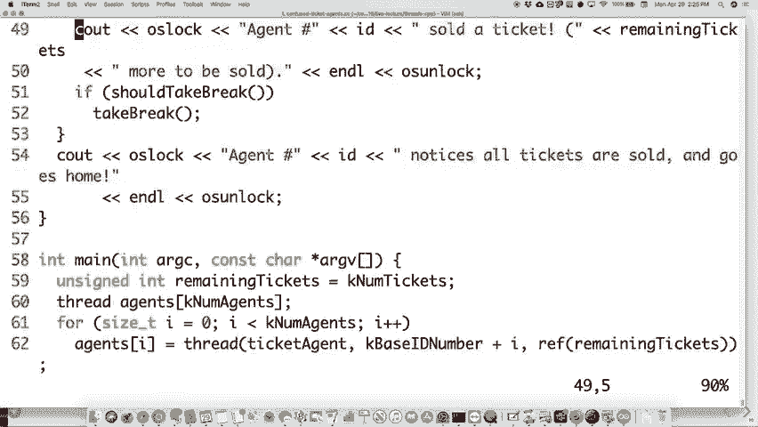

 Again， I'll go home and pour over this and see why I made this mistake before。 But anyway。

 we'll place that in there and then we will change main as well。

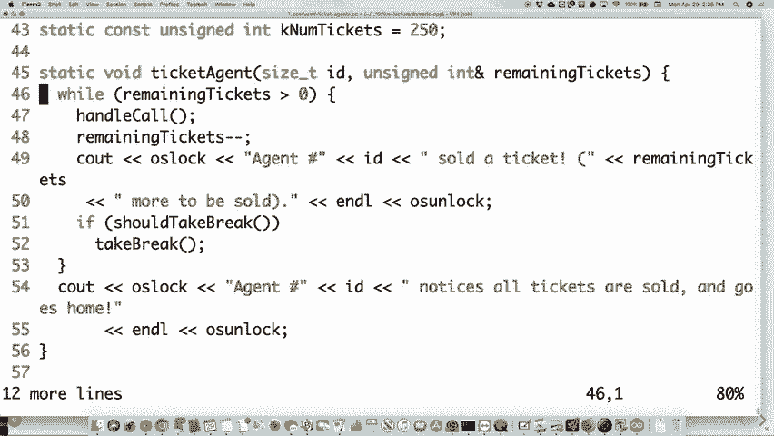

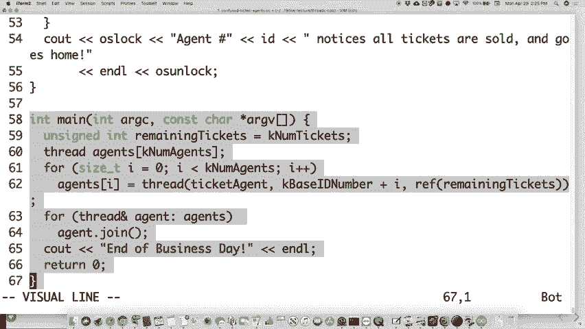

 And then let's see， name is going to be here。 Okay。 And what we're going to do is， okay。

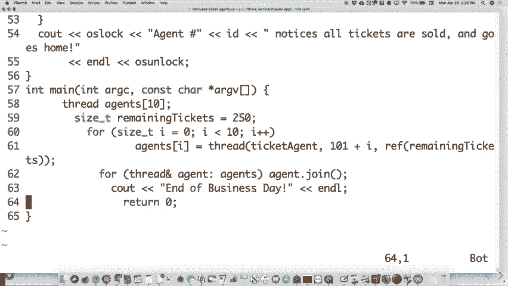

 So let's see if that works now。 Make confused ticket agents。 Oh， no。 It must be my， wait。

 I swear I typed this in the front。 Well， all right， hold on。 Maybe we won't do that。 Well。

 what I'm going to， I'll show you what we're going to actually do here to， yes。 All right。

 What we have to do is we have to modify using this thing called a mutex。 Okay。 And a mutex is。

 where did it go here？ A mutex， this we already went through this。 A mutex is a。

 basically a lock that says when a particular thread calls lock on a mutex。

 Any other thread that also tries to call lock on that mutex has to wait until the previous。

 thread releases it with an unlock。 Okay。 So here's how it goes。 It's a class called mutex。

 And what you do is you say mutex m for some mutex variable。 Okay。 And then if a thread says mutex。

lock， another thread can come in and say mutex。lock。

 But if the previous thread already has it locked， the new thread just kind of waits around until。

 it unlocks。 Okay。 If multiple threads are trying to lock on a mutex。

 then one of them will win during the， unlock battle that happens after it gets released。

 And all the others will go back and wait again。 Okay。 So it's a way to say， no。

 only one thread can handle this at a time。 And it's just using this variable as that beacon that says you are allowed to use it。

 you are， not。 And that's how it works。 Okay。 It locks what we call critical regions of memory。 Okay。

 And it's super useful。 And there's a couple of other ones that we're going to learn about as well。

 Super useful to be able to say， oh， great。 Now we've got multiple threads here that all get to use that。

 but nobody's going to step， on everybody else trying to do the decrement。 Question chasing。

 Is it possible that thread will always lose the battle？ So that's a good question。

 Is it possible that a single thread will always lose the battle？ Sure。

 One thread might always lose the battle。 But then in the end， if all， whenever else finishes。

 it will finally get it。 If your logic is right， it would eventually get it。

 But you can't promise to any one thread， you're going to be next。 No way to do that with a mutex。

 Good idea。 There are certain types of locking locks that have a priority associated with them。

 We'll get to that later。 But the ones we're going to concentrate on have no。

 you have no ability yet。 Yeah。 So that's C++ statements on atomic。

 Because they're translated into assembly， the same culture to C++。 Yeah。

 The question was are C++ statements are not atomic because they're translated into assembly。

 Same exact history for C。 Yeah。 All of that stuff that you did in 107 where you had to translate C statements into assembly。

 you had lots of assemblies， statements per C statement。 So same exact thing。

 So does it not get expensive instead of just getting hung up on this light log？ Ah。

 Very good question。 Does it get expensive because if they're held up a box？

 Let's see what happens when we make a change here and then we'll see how it actually manifests。

 itself。 A very good question and very pressing a question。 Anybody else？ Okay。

 So what is a mutex come from？ It stands for mutual exclusion and it basically is solely there so that you can mark where critical。

 places in your code are that multiple threads might be working on at the same time。 Okay。

 When you create a mutex， it is unlocked。 A particular thread calls lock on it and then nobody else can call lock。

 They just wait until that lock is unlocked。 The only thread that's allowed to call unlock after locking is the one that locked it。

 Another thread could do it and it's undefined behavior and you shouldn't do that。

 Only your heavy logic so that nothing tries to unlock a lock it doesn't hold。

 You'll see how that's not hard to get that right by the way。 And then that's that。 Okay。

 So let's actually see what we would have to do to make our confused ticket agents。 Uh， hang on。

 Confused ticket agents。

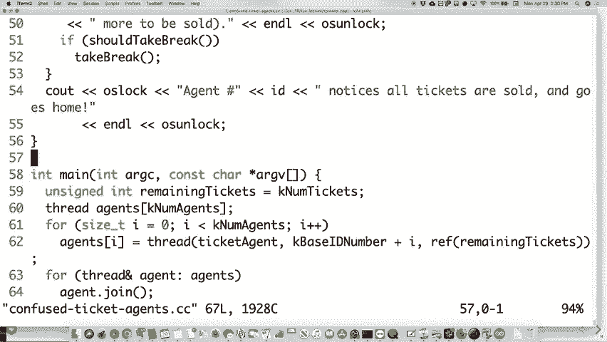

 Program。 Do this。 Okay。 All right。 So here's where we've got the issue。 Okay。 Well。

 what we need to do is we need to have a mutex that we send in to all of the threads。

 So they all have one mutex。 Okay。

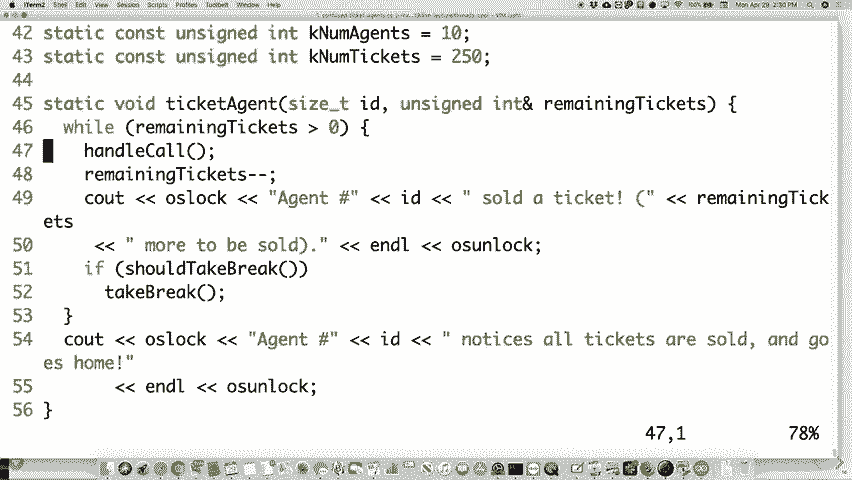

 So let's go back down to main and actually do that。 Okay。 So， again。

 what we're going to do is now we're going to say， oh， all right。

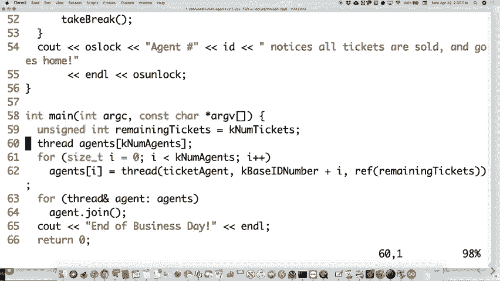

 Let's have a mutex here that is， let's say mutex。 Let's see。 I haven't done the， yeah。

 I haven't done the before。 Yeah。 Mutex tickets lock。 Okay。 All right。

 That's all you have to do for that。 Okay。 And what we can do is we can， um， in here。

 we actually now have to， uh， send it in。 Okay。 So we're just going to do this。

 We're going to say same thing as before。 We're going to say， uh， have the remaining tickets in here。

 And then we're just going to put another parameter， which is the same thing as before。

 ref tickets lock。 Okay。 Like that。 And then that will just send the other parameter in there。

 We have to update our parameter list for the function as well。 So it can take the right function。

 Okay。 And， um， other than that， that's all we have to change in main。

 We're just creating in main and sending it into the threads。

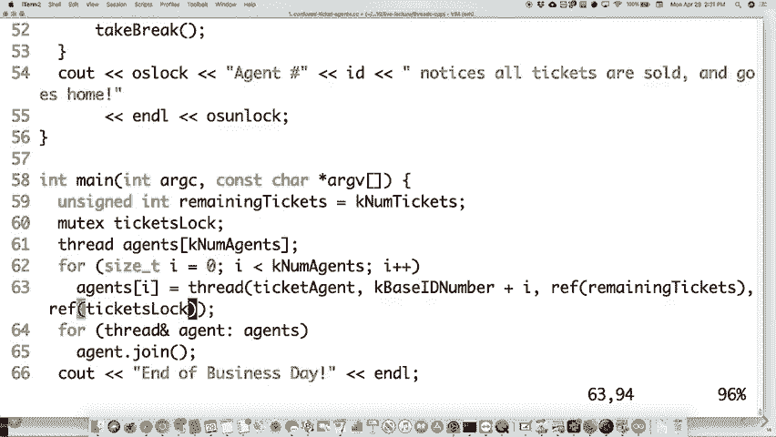

 Okay。 Now here we need to do a mutex reference。

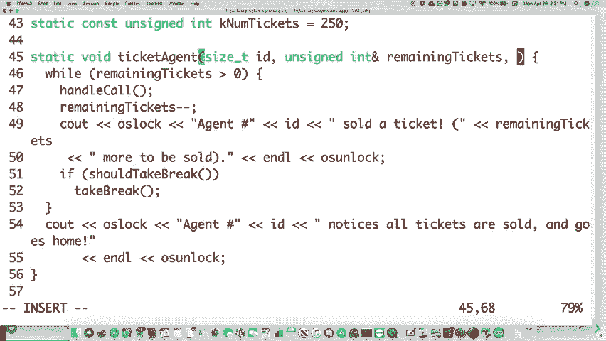

 Mutex reference tickets lock。 Okay。 All right。 And what are we changing here？ Well。

 instead of doing， uh， remaining tickets is greater than zero。 Let's do the following。 Okay。

 Let's do while true。

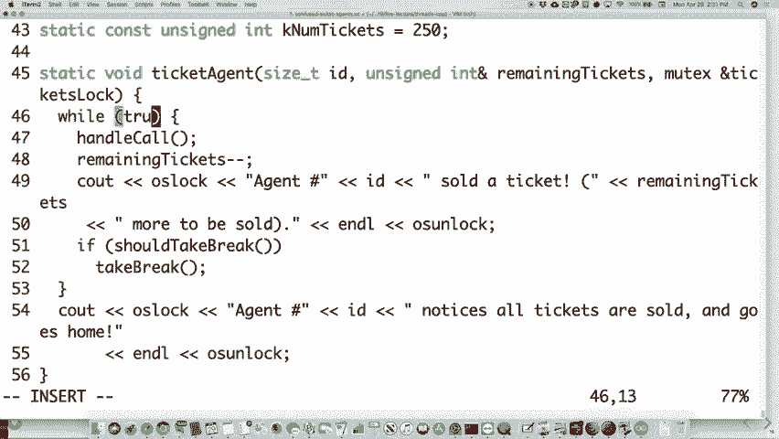

 Okay。 And then let's do this tickets lock dot lock。

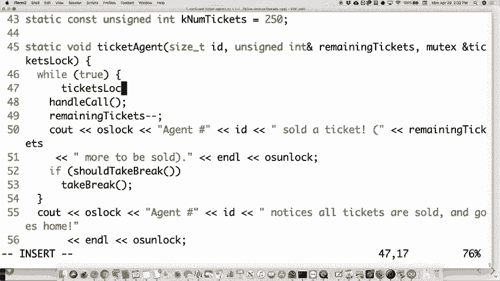

 Okay。 Actually， I'm going to reform at this。 There we go。 Ticket lock tickets lock dot lock。 Okay。

 And then we are going to do， we're going to check and see if remaining tickets， each。

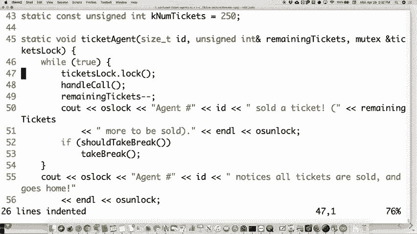

 equal zero， right。 In other words， now we're the ones who are going to have access to that remaining tickets。

 Nobody else can be changing it in the middle。 We're going to be changing。

 We're going to be checking it。 If it happens to be zero， we're done。 No more tickets to go。

 You have a question。 So there's a lock lock all of the variables in this function or where did you have to。

 then you have to specify the remaining tickets to one model。 Yeah。 Good question。 The question was。

 does lock， lock all the remaining variables？ It's much more simple than that。 Lock says。

 somebody else is going to want this exact data structure or want this critical， piece of code。

 I'm going to just basically put the lock in here。 Nobody else can access this critical piece of code because they're also going to ask。

 for the lock。 Okay。 Anything else， they're going to be doing the same sort of thing。

 So you have to get your logic right so that you know that， oh， everybody who wants this。

 critical data structure or in this case remaining tickets， just lock around it and then that's。

 all we need to do。 Okay。 So what do we have to do after the actual while statement here？

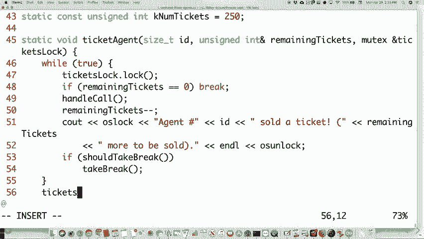

 Tickets， lock， unlock。 Right。 So we have to do that if we're going to break out an unlock it there and then at that point。

 everybody can do it。 We're not quite done yet。 You have a question before we go。

 So is it that at that point they can lock？ None of the threads will run after that。

 So all the threads are going to eventually get to this line。 And they're going to go。

 I want to lock that variable。 One of them is going to win。

 All the rest is going to wait around until this one finishes。 Okay。 Now this may cause an issue。

 We'll talk about that。 They're waiting at that。 They're waiting at that lock。 Yep。

 They're not doing anything。 There's waiting at the lock。 Yep。 Yeah。 Good question。

 So specifically because of that break we break out but we're still locked so we better unlock。

 But as I said we're not quite done yet。 We also want to unlock actually let's say I guess we could do it either there or let's。

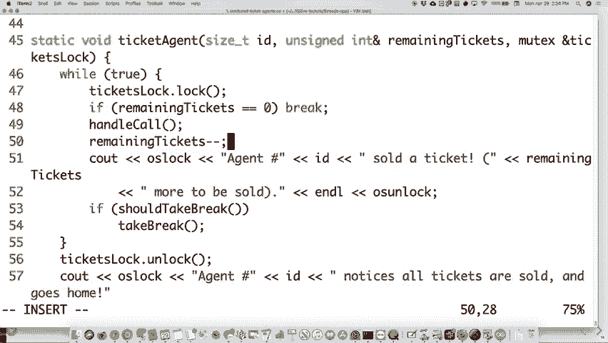

 say not there。 Let's say we want to lock like unlock right here。

 On tickets lock unlock like that as well。 Now it will actually work out because what we didn't want to do is re-lock try to re-lock。

 the lock。 Again you would actually deadlock because you've got the hold of the lock and then you try。

 to lock it again and you're going to wait until you release it and that's impossible。

 But that's so we do it in two different places in this case。 On next。

 I guess on Wednesday we will learn about another， we do that or next week。

 We will learn about another way to do it where you don't need both unlocks。 It's a different。

 actually a very clever piece of code。 We'll learn about that later but that's why we do it there。

 Okay。 So I believe that is all we need to do at this point to make this now safe。 Right？ Question。

 >> The original one that calls lock。 Once they call unlock the different threads come around and call that lock and when you。

 press right。 >> Yeah。 The question was if once you've got lock when it unlocks another thread can come in immediately。

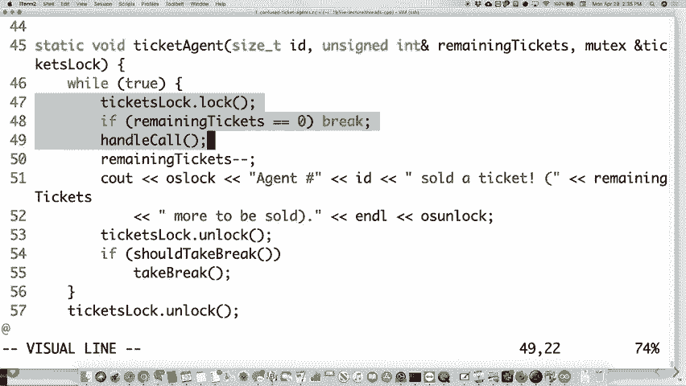

 if it's waiting for that lock and then unlock it。 And two or more could be trying to do that and one will win。

 And the other one will go back and stay locked for a while or stay in that position。

 There's no race condition。 Well， I mean there is a race condition in that they're both looking for it but hopefully。

 your lock doesn't matter at that point because you're not trying to change something in there。

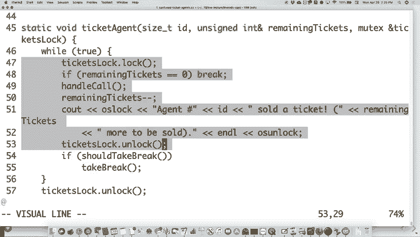

 You're not trying to serialize it or so forth。 Okay。 So let's see what happens when we do this。

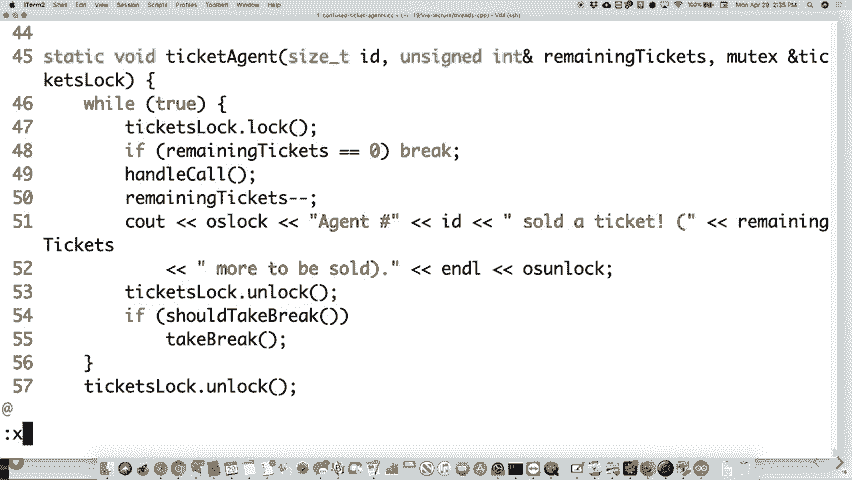

 Make confused， ticket， agents。 These are not confused anymore， hopefully。

 Let's see what happens when we do that。 Confused ticket agents。 Okay。 Now。

 what's the first thing you notice about this？ >> Slower。 >> Slower。 Right。

 So there is an issue here because we've now got like every ticket agent is saying， okay。

 there's a ticket available。 I am going to go and I'm going to sell it。 Right。

 And then I'm going to decrement the remaining tickets and then I'm going to release the， lock。 Okay。

 And this， the way what we've created is kind of inherently still serialized。 Right。 Now。

 there is the break time which is not serialized。 That's fine。 I mean。

 we get a little bit of benefit because we don't do the break time。

 Anybody can be on break at the same time。 They don't fight over the coffee machine or something or whatever they need to like。

 you know， do on that。 But otherwise it's taking a while。

 This is taking like over a minute actually to run this now and you think， well， that seems。

 a little crazy。 Okay。 So is there a way to actually modify this so that we can do this and still end up not。

 blocking in quite like in a way that makes it so that we're slowing things down？ And by the way。

 let's make sure， let's see if it works。 We're going to get down to zero。

 It should be that everybody goes up。 Okay。 Yay。 We worked。 Right。

 Because they all got to a point near the end where they， there were no more to be sold。

 And by the way， you， let's see， is it saying or no？ They all， they all wait。

 Notice the tickets are sold。 They actually all happen to wait at the same time in that case。 Okay。

 And then because or they all ended up that place because they were all waiting for that。

 lock to do that check。 So what do you think？ Can we fix this even to make it a little bit faster？

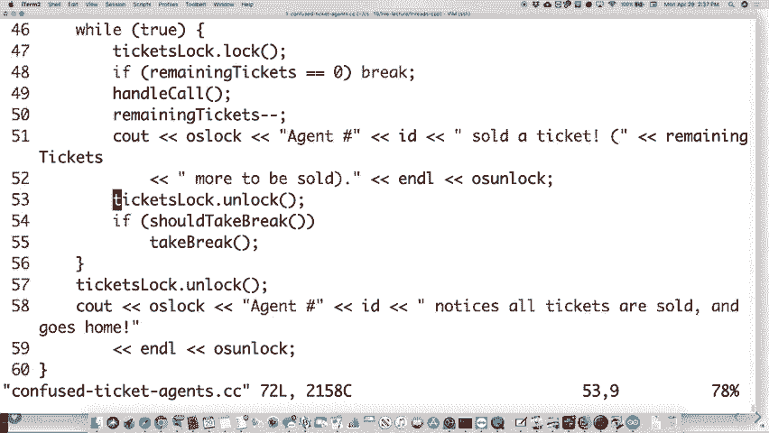

 And maybe we have to change our own like understanding of what it means to sell a ticket。

 Like sometimes you can't get away with that。 All right。 So in this case。

 could we do something here to make it so that this actually works and， faster anyway？

 What do you think？ Awesome。 Like put the remaining tickets there and then do。

 I'm going to go this way。

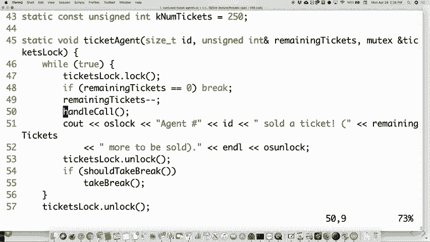

 This one up here。 Would that work？ I think it would work。 Right？

 Now we're assuming that the ticket gets sold。 Right？

 So let's say the ticket agent gets on the phone。 The ticket agent says already said， oh。

 I've got to say it's sold。 And then let's say that there's some logic where the。

 I don't want that stupid ticket， airlines terrible to hang up on the phone or whatever。 Right？ Well。

 they have to somehow put the ticket back and we don't have that logic in here， but。

 we could build it in if we， I mean， we， we could build it in。

 You could build it in somehow where we say， oh， look， if you've got the last ticket， you。

 better keep trying to sell it。 You've got to stay until it gets sold。 There's something like that。

 Right？ But I think this will actually， this will actually work。 Let's see。

 make confused tickets and then， ah， still much faster now。 Right？ Not， not like way， way。

 way faster， but definitely much faster。 I can say it is much faster。 In fact。

 and this is going a lot faster。 But let's see what happens near the end here。 See if it still works。

 There we go。 Okay。 So it did finish and lots of agents said zero more tickets and they let。

 they went， home while the other take， agents were still selling。 Right？ But who cares at that point？

 We assume that each agent sells their ticket。 Okay？ So that's one way to do it。 So what you read。

 the takeaway on this is if you can make your logic such that you lock。

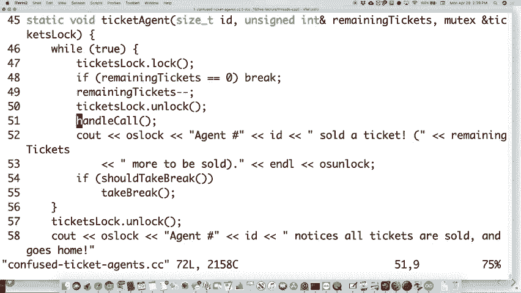

 for a very short amount of time， that's the best way to do it。

 Don't try to lock around important things like handle call。

 It has nothing to do with whether or not the ticket itself has been decremented or not。

 Now maybe we need more logic to put it back if it doesn't get sold and， you know， that's。

 a different， different program in some sense。 But you do have。

 you do want to not lock around extended places that don't matter for， that lock。 Don't。

 don't have the ticket agent say， you can't touch the ticket queue until I'm done， selling my ticket。

 which is what we just did。 Yeah。 So in that like agent blank sold the ticket and there are like multiple of those statements。

 of like different agents and then the same number of tickets remaining。

 Like because right now the lock is going to lock into that， you know， a decrement can。

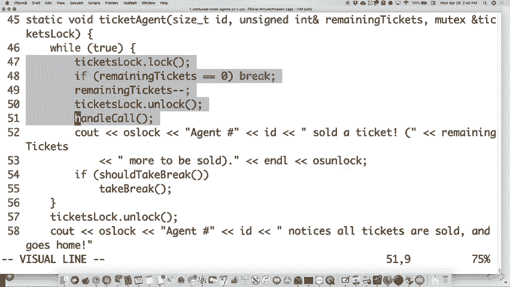

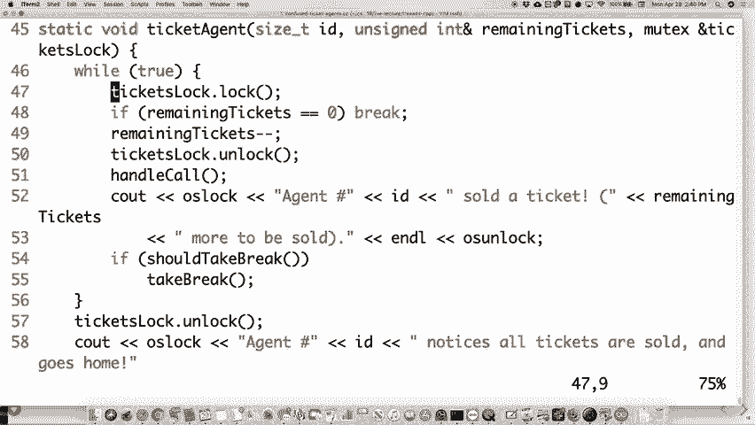

 happen before the print statement happens。 Right。 So like right here it says six more tickets to be sold from two different agents。

 Is that your concern？ Yeah。 In case it probably doesn't matter， you'd still have some other。

 maybe we should have put the， print statement before they're unlocked or something if we wanted to。

 We could have done that too。 But that's just a print statement in that case。

 We could probably clean that up。 In fact， we can try and see if it makes sense for our thing here。

 Let's see。 Yeah。 I mean you would have to break it up here and say， you know。

 put the number of tickets to， be sold up farther and the agents sold the ticket below。

 You could break that， see out statement up and do that。 But yeah。

 that's another race condition in that sense。 Oh， two people think that there's the same amount of tickets left to be sold。

 That seems a little odd。 But in the end， their logic for the stopping still works out。 But yeah。

 that was kind of another anomaly that you'd have to fix。 Yeah。 Good question。 Okay。

 Is there any way to make it near as fast as this won't be written lock at all？

 Is it like even that is not as quick as it works？ Is there any way to make it near as fast？

 This is pretty close actually。 I don't know if you remember from before。 It's about it。

 It's pretty close。 But no， I mean， locking will involve some overhead because there is a time where two threads are。

 trying to get the same data structure or variable and it's going to take more time。

 And that's just a， that's a downside but a necessary downside of making it so it's functional。

 So the program works。 But yeah， good question。 Yeah。

 What we do do like conditional lock boards like the only lock where they're like 10 tickets。

 left to the board。 Yes， good question。 So Sam saying wait， what if。

 is there a way to lock when there's like a certain number。

 of tickets left or something so that more people can go in and tell that there is， they're。

 called conditional variables actually。 And there's also another one that will build ourselves called a semaphore which does that。

 It allows you to basically have a count in which case you only lock when that count ends。

 up at zero。 And then before then anybody can go in and grab as many as they can grab one until that。

 count becomes zero。 Good。 Good point。 We'll get there。 Good question。 Yeah。

 Could you explain to you how the lock calls inside the lock is slower？ Yeah， good question。 Well。

 why is handle when handle call was inside the lock， why is it slower？ Well， handle call does what？

 It just is asleep。 Right。 And if all the， if you have not unlocked yet by the time when handle call gets called。

 everybody， else is standing or looking at that one ticket agent trying to sell the ticket because they。

 can't get into the to modify it。 Right。 So there's where the inherent like slowness happened before。

 Every ticket agent was on and on their own selling a ticket with all the other ones waiting。

 around going， I can't even sell a ticket because I can't even get out the thing。

 So our model wasn't perfect in that sense。 Right。 But knowing that a ticket's always sold makes it so we can do it。

 Okay。 Other questions on this？ All right。 Threading is kind of fun stuff。

 but you can see lots of issues。 We will get to many more different types of locks as we go along。

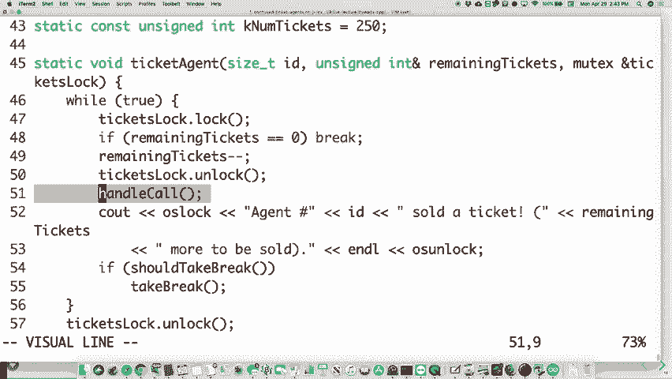

 All right。 I will see you Wednesday。