# 斯坦福大学 CS 110 计算机系统原理 Principles of Computer Systems（Spring 2019） - P14：Lecture 13 Ice Cream Shop Sitmulation - ___main___ - BV1ED4y1R7RJ

 Okay， so we are starting out today。 Today is one problem。 Hopefully you've got the handout。

 If you happen to break up here， I made plenty of them。

 There's one program we're going to look at today and it is going to model。 Where did it go here？

 It is modeling the ice cream shop。 We're actually going to try something live in person demo with people。

 We have now opened up an ice cream shop。 I'm sorry for people watching the video。

 You're going to not see the chaos that's about to ensue。 Here's what I need。

 I need 11 volunteers or conscripts。 Come on up。 First three people get their big customers。

 Which means you get ice cream if you actually buy ice cream。 Alright， let's see。 Okay， one， two。

 three。 There we go。 Other people， the next people， you get to be a clerk。

 Somebody gets to be the manager and somebody gets to be a cashier。

 I think there's a couple of clerks。 Anybody else who is up here？ There we go。 Okay。

 thank you very much。 Clerks， go over in this corner over here。 Oh， and by the way。

 everybody grab one of these too which is your instruction manual。 Okay。

 there should be enough for everybody。 Okay， here's what we're doing。

 We're going to model an ice cream shop。 Now what we're actually doing is we're modeling a problem that was given a believer in a lot of CS107 finally banned from many years ago when multi-processing and threading with the ANSES-1 upset。

 It used to be。 We've changed things since then。 Okay， but here's what we're doing。 Alright。

 we are setting it up。 So where's our manager？ Please， okay， you're the manager。 You're going to be。

 you're going to be， people are going to fight over you actually as it turns out。 Okay。

 and where's our cashier？ You're going to kind of come in near the end。 Okay， but you have。

 there's a little number system here。 So the one， two， three， they， people will。

 the customers will take the number in order。 So I've got numbers。 We have ice cream cons。 Okay。

 and we have lots of， who are the customers？ Customers over here？ Okay。 So here's the way this works。

 Alright， we're modeling this with only three customers。 Okay， a customer does the following。

 Customer comes into our ice cream shop and says， "I want X number of cones。

" And you have how many cones you want on there。 Okay。

 so they're going to come in and they're going to say X number of cones。

 And what they're going to do is because they want to get their cones quickly。

 or at least as quickly as they can， they're going to grab a clerk。 For some reason。

 we have as many clerks as ice cream cons that are going to be delivered that day。

 And each clerk gets to make one perfect ice cream cone。 In fact。

 each clerk can try to make an ice cream cone perfect。

 but the manager is going to keep them honest if it turns out to be terrible。

 I used to have a friend who， he worked in an ice cream shop and he and a buddy of his used to have a competition to see who could make the smallest scoop without somebody complaining。

 Which is really a mean thing。 You know the tiny little scoop and you're like， "Oh。

 I'm just too nice not to complain。"， Anyway， you don't get to do that。

 You'll actually have more or less determinants。 It's a random thing。

 but it's deterministic as far as the ice cream cons go。 Okay。

 so they look at me and they will grab a clerk。 For the number of clerks for each ice cream cone。

 Okay， each clerk will then actually make the clerks walk all the way over this table to grab an ice cream cone。

 This is going to be a time thing。 There's going to be ice cream cones over there that you're going to make。

 When you may have made an ice cream cone， you're going to walk back and you're going to present it to the manager。

 Okay， and by the way， you are milling around at this point， waiting for your ice cream cones。

 You're not getting in the way。 You're just kind of waiting for your ice cream cones。

 When you have created an ice cream cone that you think is perfect， in other words。

 you have grabbed one， you're going to bring it back to the manager。

 And if there are two of you who are kind of going towards the manager at the same time。

 you get to fight over who gives it to the manager。 Okay。

 now you don't really need to participate in this fight。 Just basically grab one。 And， you know。

 whoever you want， it's your kind of choice in that case。 Okay， and then the manager。

 you are going to decide whether or not is a good ice cream cone。

 Don't tell the clerks that you're not that。 The "e" means bad， the "g" means good。 Oh， nice。

 Don't tell the clerks this。 Okay， so anyway， and then you're going to either tell them， "Yes。

 that was a beautiful ice cream cone。 In which case， you are going to say。

 "Now I have made one of my six ice cream cones that I have to make today。"， Okay。

 once you have made it， you might want to keep track。 You can say， "I'm going to make six。

 and you can say five， and four。 Once you make all six days that are good， or that you have approved。

 you get to go home for the day。"， Okay， all right。 Clerks， if the manager says， "No。

 that wasn't a good cone，" you have to throw that cone away。

 just throw it around the floor wherever you want， go get another cone。

 and come back and fight again。 Okay， for the manager's attention。 Okay。

 customers are just waiting around。 Now， if the manager says， "This is a great cone， perfectly fine。

" you can go deliver it to the customer and then you get to go home。 Okay， all right。 And now。

 once you get all three of your cones back， you come take a number， okay。

 and the cashier is waiting for somebody to take care of。 Okay， now。

 the minute you see somebody take a number， you can go， "Oh， I'll take number one。"。

 And then take as much time as you want， checking them out。 Make sure they pay you in the right。

 whatever you want。 All right， but you have to check them out。 Once you check them out。

 you get to mark off， but you have checked off one， customer。 You have to check off three customers。

 then you get to go home。 Okay， all right。 And then， customers， when she's checked you out。

 you can then take your ice cream and go home。 Okay， at the end of that。

 you should have however many ice cream comes you get。 Now， does everybody。

 that was a lot of stuff all at once。 Okay， you have your own instructions here。 Okay， in fact。

 I will pull up the instruction so that everybody can kind of see what's going on。 Let's see。

 I'm going to do this。 I'm going to pull this up。

 Here it should be here， and then ice cream details。 There we go。 And if this pulls up correctly。

 we should do that。

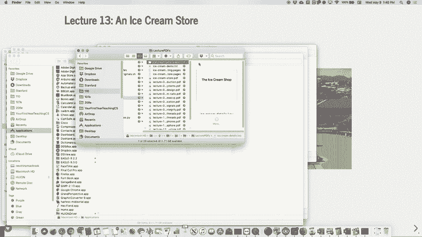

 And there we go， hold on， not now。

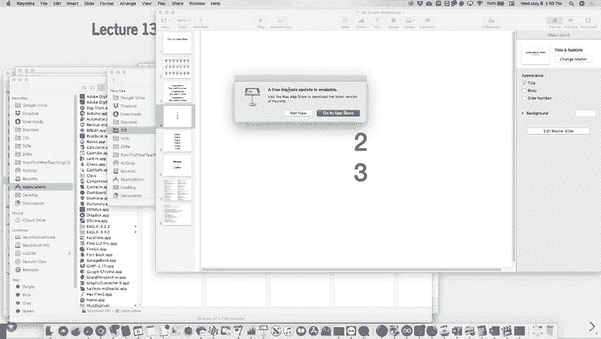

 And here are the instructions。 I will make this as big as I can。 And there we go。 Okay。 So。

 I know there's a lot there， but you can kind of see what's happening， right？

 The customer grabs an ice cream cone， grabs a clerk price cream cone， mills around。

 the clerks do their thing。 When the customer gets back the ice cream cones， they go to the cashier。

 take a number， et cetera。 Everybody get what's going on more or less？ I mean。

 it might look a little crazy。 Let's see if we can make this happen without， no real fights， please。

 But you can see what happens。 Okay。 So， customers。

 come on into the shop as much as whatever you want。 Okay。 And go buy your business。 Okay。

 Clerk's over there。 All right。 I will now， I will marry for the people listening on the video。

 We are the ice cream cone customers are asking the clerks， they're grabbing the clerk。

 A clerk is going over for the ice cream cone。 Clerk goes to the manager and says。

 is that a good con？ Yes， it is。 It's a good con。 All right。 So。

 we got a good con and you give it back there。 Okay。 And then now there's some people milling around。

 but there's a little， oh， a bad con。 We got a bad con in there。 Okay。 That is a good con。 Okay。 So。

 you can see there might be a little bit of a bottleneck here。 This is a little bit less than that。

 Oh， no。 We got more bad con。 Okay。 Oh， bad con。 Okay。 No。 You got a good con？ That was a good con。

 Okay。 Okay。 Okay。 All right。 So， all right。 So， then the， has the cashier had anything to do yet？

 One person。 Okay。 And so， you have gotten all your cons。 Do you have just one con？ Yes。

 Just one con。 Okay。 All right。 And so， you get to take a number。 Okay。 That's a good con。 All right。

 And let's see。 Two。 There's number two。 Okay。 So， one person is still waiting for the cons。

 And have you done all six cons？ I said all six。 Okay。 You can go home。 All right。

 Manage your just to go home for the day。 Clerk， so。

 if you take and grab all your cons to this point， yeah， you're going to all go home。 You're great。

 Good to go。 Now we have that and you have now taken care。 Okay。

 And the cashier is the last one to go home。 Sadly。 But， but that's that。 Okay。 And you're all done。

 And you got your cons。 Okay。 Now， that was a bit of a melee up here， right？ No fights。

 I didn't see any real fights。 But did you kind of see that this is the thing we're about to try to model all of that madness in one program？

 Okay。 That's what we're trying to model here。 And you have the program and there's a lot to it。

 But we can we'll go through it one little part at a time。 Okay。

 So questions on what happened up here。 Did anybody see anything that was odd or didn't get or whatever？

 Getting quite figure out what was happening。 That's okay。 Yes。 Okay。

 So a customer asks one person and then they all wait。 Like。

 because like technically only one degree you get like a message and then all of them wait for them。

 Yeah。 So okay。 Okay。 Well， first good question was look I'm confused on like the mechanics of how this is going to work like programming wise like getting it。

 So it was all happening kind of in parallel。 Each customer was able to ask for however many cons by telling a clerk one clerk at a time。

 please make me a con。 And that was what was happening。

 So one customer went to a clerk and said make me a con。

 And for some reason we had a number of clerks one per cone， which is a weird model。

 So I will grant you that this model of an ice cream store is a little bit weird and probably wouldn't work in real life。

 And you could certainly make it better。 But that's the model one person who wants any number of cones goes to any number of clerks and says make me one con。

 And then they go and ask the manager and the manager is saying that good cone bad cone and the clerk has to keep making cones until they get a good cone。

 Emma， you probably made three cones or ever before you got a good one or whatever。 Right。

 So I thought I'm going to come back and forth a couple times and scowl on her face with a number of cones she was making。

 And then the cashier had to get the now notice that the clerks were kind of fighting with each other for the manager's attention。

 Fine。 The customers were not fighting for the cashier's attention and you probably want it that way。

 Like even in a real ice cream store， you'd rather have the customers go when they get up to the line go on next and then they get handled next。

 As far as the clerks and the manager go well they could kind of all mill around until one gets to decide。

 Okay。 Do we see the kind of basic idea though of this？ Okay。

 Now we're going to try to model it using threading techniques that we hopefully kind of understand now but we will go through them。

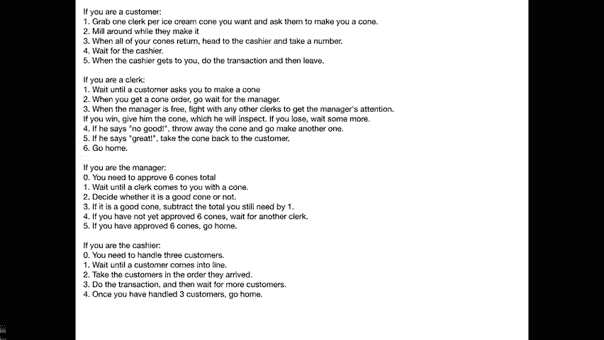

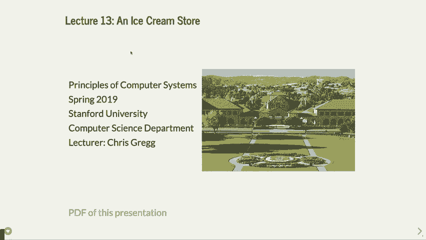

 Okay。 We're actually going to go through five different types of things here with this program。

 It is kind of a meaty program。 I can't really imagine how it ended up as a one final exam problem。

 Maybe it was two but but anyway that's the way it goes。

 We're going to talk about a binary lock which should be at this point。 Hey do a mutex。

 Just going to be a binary lock。 We're going to do a generalized counter。

 That should be thinking maybe semaphore。 You should be thinking about that。 A binary rendezvous。

 A binary rendezvous is when basically well we'll get to it but it's two two threads trying to coordinate between each other。

 Like for instance a clerk and a manager trying to make a decision like hey the clerk has to wait for the manager to tell them whether the cones good or not and the manager has to wait for the clerks to come over and so forth。

 So that's going to be something we're going to do。

 A generalized rendezvous is when you have multiple things at once happening。

 This could be with let's say the people who are asking for the ice cream cones have to wait for all their cones to be made。

 They're generalized like I'm waiting for a bunch of things to happen kind of before I can do anything。

 And then layered construction is more or less it's more or less like how do you do this one thing on top of the other。

 We'll do that。 And we'll see how that works。 You certainly can go download the code。

 You have the multi-threading all the code right in front of you。

 So if you're looking at one piece and you want to go back and go hey wait how did that work with the other part feel free。

 And I know you haven't had a chance to really look through this but we will go through it one thing at a time。

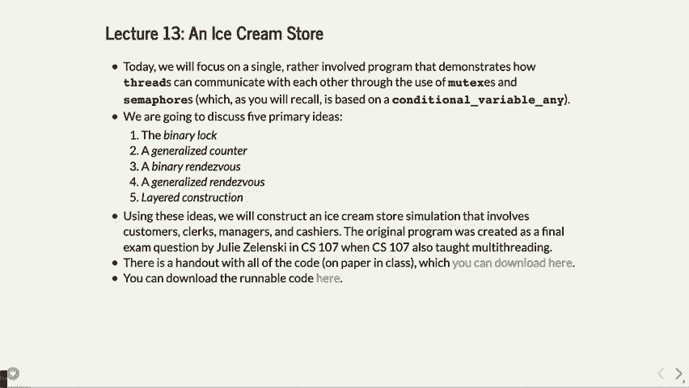

 Okay so binary lock what's the binary lock it's a mutex basically。

 Okay to remind you a mutex does nothing else except allow two threads to try to get into some critical region。

 And it doesn't even have to be the same critical region they just have to basically both be fighting over some resource。

 One of only one of which can do can access that resource at a given time。

 Many times it's a global variable or some shared variable they both want to update and you want to do it what we call it。

 Okay and then so again it's all about single thread access。

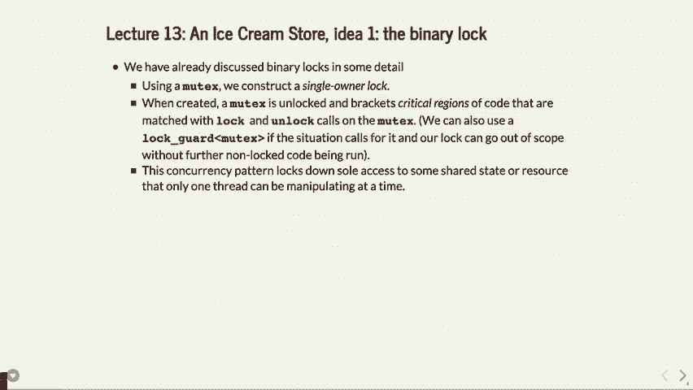

 Okay the generalized counter this is where we talk start talking about semaphores。

 This is where the counter itself the semaphore itself can do a can increment a variable atomically。

 In other words no other like only one thread can actually make it do its thing at once do the incrementing or decrementing。

 Okay we talked last time about the various things we can do with a semaphore。

 If we have a semaphore that has a count of zero like no permits it's basically just uses a signaling thing back and forth。

 Okay so one thread can signal another thread which is waiting on that it's not like there's a permit here just one thread goes on waiting around。

 So we will see those used as we go as well。 Okay and this is where you're coordinating some limited resource that has some number of things in it。

 Number of columns or one column or you know one sort of number of things that you might want to link。

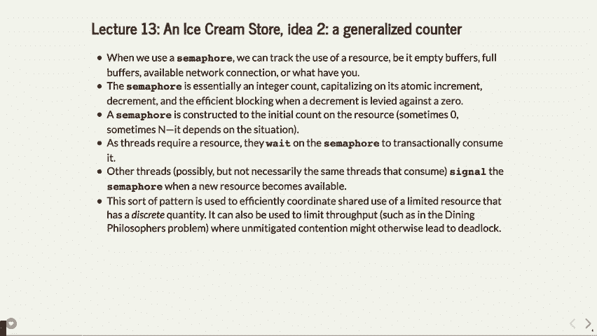

 Okay all right a binary rendezvous this is where again you use semaphore and this is for inter thread communication。

 Okay and the example here is a pretty good one。 So suppose we had thread A that needs to know when thread B finishes something。

 Okay so for instance when the manager has to determine whether or not the cone is well good or not the clerk has to wait around for that to happen and has to wait on that other thread to do to do their thing。

 Okay what we can do is we can have this rendezvous semaphore initialized to zero because all we care about is the signaling part。

 Okay and thread A actually waits on that semaphore。

 Okay and after thread B finishes it signals thread A which continues。

 Okay and thread B does not care about anything else that the other thread is doing at that point。

 It just goes signals and then moves on。 Okay so that's how a binary semaphore works or a binary rendezvous in this case。

 Okay there's only one event that needs to happen and that's all we care about。

 Okay this is sometimes used to wake up other threads like a thread just waiting around and then somebody wakes it up with this signal。

 That's a good way of thinking about it。 You can do a bi-directional rendezvous。

 This is different than a generalized one。 This is like basically one thread waits for the other which waits for the other。

 You have to be very careful that you do that so they're not both waiting at the same time because then you'll get deadlock。

 So you have to be careful there。 Okay so there's some logic that you need to figure out there。

 Okay all right a generalized rendezvous is where you have a binary rendezvous and a generalized counter。

 Okay this could be more or less the like ice cream customers are waiting for the clerk to do something or actually waiting for a bunch of clerks to do something and they have to sit around。

 So in this case thread a spawned five thread B's。 That sounds like the ice cream customer asking five different clerks。

 Okay thread a spawned five thread B's and needs to wait for all of them to make a certain amount of progress before advancing。

 That's when we would use this technique。 Okay again you have the semaphore initialized to zero。

 When a needs to sync up with the other ones it will block until they all finish。

 Okay and then when they all finish then they will the thread a will then be able to get moved forward after that。

 Okay this is a good this is the generalized part of this is you have some task that you're dividing up。

 You're saying I need to make three cones I'm dividing the three different clerks you need to generalize that and then wait for all those tasks to complete。

 That's the generalized rendezvous。 Okay all right and then this whole layered construction is basically using all this together to say oh we've got a mutex and then we can have a semaphore that uses the mutex and how do you kind of piece them together。

 You've got some global counter that uses this that's going to have mutex associated with it you've got to wait around what size the counter changes value or reaches some value and so forth。

 So that's the big takeaway for that one is that you need to you need to be able to use these constructs together to suit your to suit whatever you're trying to do。

 Okay all right let us look at some of the actual code。

 Okay I've already we've already talked about this we modeled it pretty distinctly okay ice cream store clerks manager customers cashier lots of clerks one manager one cashier。

 Customers are in a hurry so they get lots of clerks per one per ice cream cone and then once they get their cones back they go to the cashier I mean it's not a terrible model。

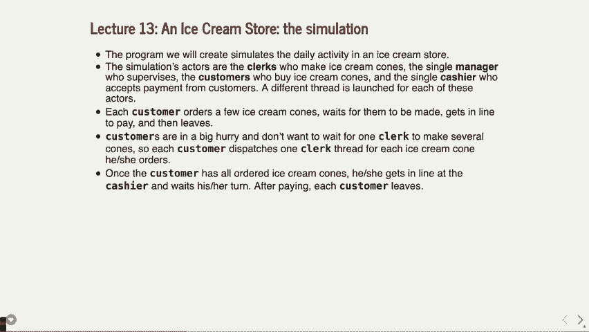

 And then each clerk just gets to make one cone yeah that's a little weird but that's the way it works in this in this world and the manager has to determine whether or not the cone is legitimate or not。

 Okay and the big issue there for the cashier is it has to be a first in first out queue otherwise it's chaos because the customer's going I was here first and why didn't you take care of me and so forth and Brenda would not want to do that because she could help。

 Okay and then we're actually have to at some point determine when everybody goes home it's a little wonky like that the manager knows the manager has to make six cones by the end of that little weird so we could have done it some other way but in this case we just say right off the bat we'll do that。

 You will see how the code ends up manifesting itself for that。

 Okay all right questions before we start looking at the code about the overall picture here you've seen it now we're going to see some code you kind of get the idea。

 Okay good all right so here's the various things we're going to look at。

 Okay we're going to look at all these parts of the code you have them in here I'll try to tell you which page these are on as we go through them because they're not necessarily in the order on the code in the code。

 But the first thing we're going to look at is the random number generators just to kind of see where it is this is actually on page four of nine in the handout。

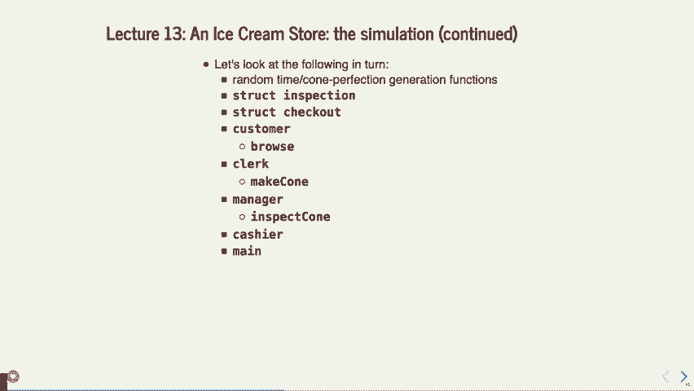

 And I've got it right here as well。 Basically we have lots of randomness going on here why because we want to make it look like it's some sort of like actual time constraints and it's not always the same time。

 Okay we do this often with these sorts of things this makes debugging a little harder because it is kind of random but it will definitely test lots of different categories。

 Okay most of these are times we have get number of or get actually a couple of mark get number of cones like the customer comes in and says I want you know how many cones so that's not a time。

 There's get browser browse time which is the customer milling around there is or and that's part of it。

 There's get prep time that's how long it takes the clerks to make an ice cream cone that may or may not be good。

 And then there's get inspection time along manager takes and then finally there's get inspection outcome which is the binary yay or nay as far as the cone goes。

 Okay relatively straightforward not anything you need to particularly concern yourself about it's just using a library function we actually wrote to get these values out。

 Okay let's look at the structs here so this model is if you're in 106 B this or 106 A you would probably cringe if you saw this that there's some global struct here。

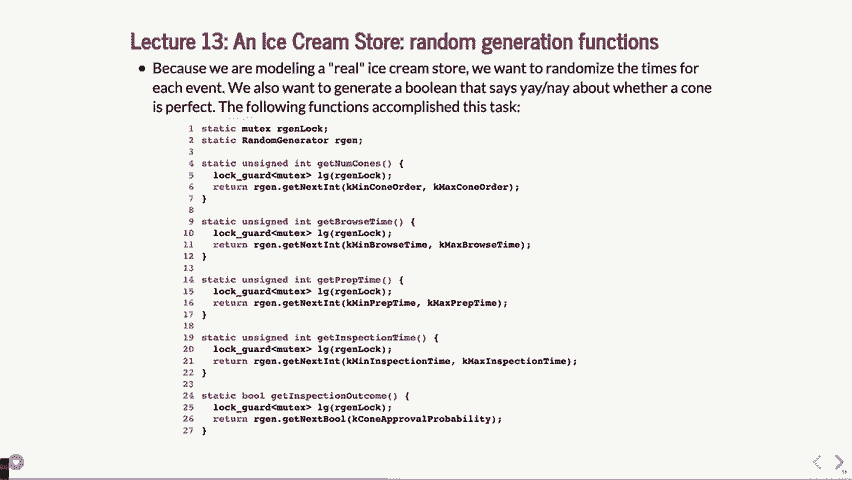

 All right why because we don't necessarily like global things but with threads sometimes it just makes it easier to pass around global very or to have a global variable then to deal with having a having a struct that you're passing around。

 For encapsulation reasons we probably would want to pass it around in a in a more robust program but for now we are just making a struct called inspection and it's got these fields in it。

 Okay it's got a mutex for available this is the handshake basically between it's the it's the binary round of view between the clerk and the manager。

 Okay so there's an available mutex which is basically saying only one clerk can be dealing with the manager at a time the manager can only look at one ice cream cone at a time that's the mutex。

 Okay there is a semaphore for signaling hey manager I've got an ice cream cone for you and there's a semaphore for saying hey clerk here's your ice cream cone it's terrible or it's great。

 That's another one and then there's actually a boolean in here for whether or not it passed and then by the way out here we create a struct called inspection and then we immediately declare it as a variable inspection。

 Seems like it's overloading the name but that's the way it goes so this is a global variable again we didn't have to do it globally but just makes it a little easier。

 Now there are a couple interesting things about this if there's only one value about past or not right how many things can be using this struct at any one time。

 One thing right one manager or one one manager or one clerk can be inspecting this or using it at one time there's only one manager which is nice。

 In fact if we did do many managers like let's see what multiple managers or assistant managers or whatever then we would have to rethink this we might have to have some other either array of these inspection structs or something else because the way it's worked right now there's one value at one time which says whether or not ice cream cone is good or not。

 Okay， all right so that's how the struct works what questions you have about that struct at this point maybe you don't。

 We'll see it in action very soon。

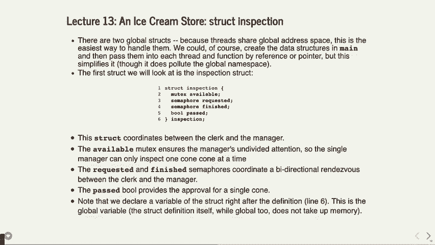

 Okay there's another struct which is the checkout one so we're kind of jumping ahead to the checkout phase but the checkout has a semaphore for next in place in line。

 Okay which is a new kind of integer here it's an atomic unsigned in what that means is that that variable can be updated by multiple threads at the same time and it will never do that we're double or not not double counting。

 So atomic such that it makes it so the plus plus works no matter 10 threads come at it once it's what we call thread safe 10 threads can go update that you'll always get 10 increments if 10 threads updated or not。

 Yes。 Ah good question the question was hey is there ever a time you don't want to use the atomic variable most of the time you don't because most of the time you're not using threads right and the atomic operation is slower。

 Alright because it's got to do other some other things in there and it actually needs the hardware to support it so it's a different instruction and there's other hardware support which means it takes a little longer。

 And if you know anything about C and C++ the bottom line is let the user do things as fast as necessary but give them the tools to be able to do it correctly if that has to be an issue。

 So this is one of those ones where only use an atomic number you're going to need it right otherwise use the faster ones because most of the time you don't。

 Very good question。 Yes。 If you just had a regular unsigned into you and you did plus plus it's going to be faster than plus plusing this one because this one has similar。

 Oh right right well sure you know the last time we could have used a we could maybe we could have done this with an autonomous number semaphore we could have done it so。

 Maybe you would have used a conditional variable。 In this case we're going to see where it gets incremented or documented and then you'll go oh okay it makes sense that if we have this atomic thing we might as well use it。

 We'll get there。 Ask the question when we see it in action when you see somebody doing something the next place in line。

 Good so that's the that's the the couple of the structs that we're going to have again global struct。

 Okay and that's it。 Now the other one again at this point it's a global it may be that multiple types of multiple threads are actually accessing at the same time。

 It turns out it's okay but the cash here is still going to take the customers in order based on this array here when they end up in the array。

 Okay and and maybe you'll understand that once you if you can update this next place in line atomically then you can use that as the actual as the actual index into the array and make sure that each customer gets their own spot in the array。

 You'll see that see that happening as well。 Okay the waiting customer semaphore informs the cashier their customers waiting so cashier is going to go start up and then go I'm waiting for customers to finish and then just wait and then eventually a customer will signal the cashier。

 Hey I'm ready to get checked out let me check out。

 Okay there are other ways of doing this this just happens to be one of them。 Okay。

 All right let's move on to the next thing。 All right here's the first real like major function here this is the customer function the customer function is on page。

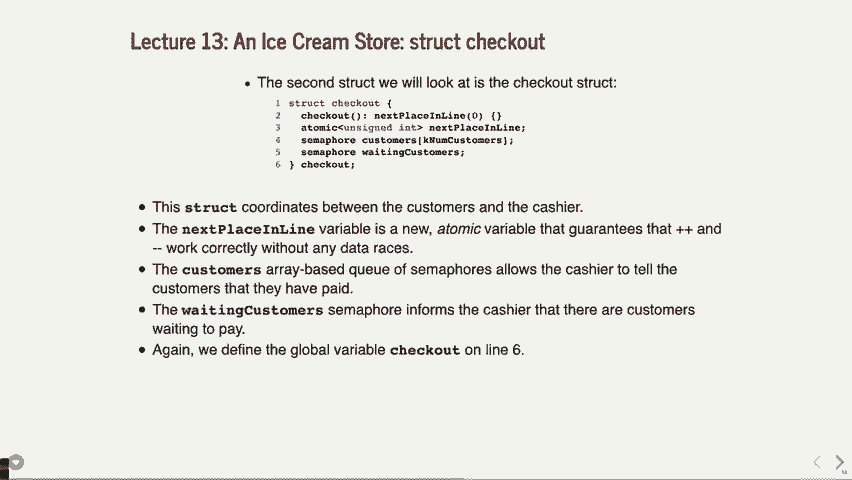

 Yeah page nine of nine right near the end right before main customer line。

 Okay all right so what is the customer have to do well the customer goes in and figures out the customer already knows by the time they get here how many cones they want we will do that we'll initialize that in main as it turns out。

 And the customer will then create a vector of clerks。

 Okay it could have created an array of clerks of the number it's going to do doesn't matter in this case we're just making a vector we're in C++ we can do vectors。

 Okay and then it is going to call thread on the clerk function with its variable i which is just the it's not really the id in this case the id will be passed in based on because we've got two things going on here we've got the number of the cone which is i and the id of the customer as well。

 Okay that's going to get passed into the clerk so the clerk needs to know who to go back to anyway and so the customer is going to ask a trigger for hey my idea is such and such i want i am this is calling whatever。

 All right and then and then the customer goes and brows is which just is some time takes up some time。

 Okay and then the customer has to do what the customer has to wait before the customer checks out all of the customers cones need to be made。

 Fair enough which means that you're going to they're going to actually join on all of their clerks and they're going to wait around until the clerks are done making their cones。

 Now they might still be browsing and all the clerks end but either way it's going to at this by the time you get passed this line on line eight here you are going to the customer knows that all of the cones have been made。

 Question。 Yes good question the the join here simply blocks until the threads are done and that's the whole point of join and it cleans up the thread because they're done as well。

 Okay so at this point we know going forward we can the customer can check out because all of the clerks have finished their cone making。

 Okay now there's no like hey here's your cone business I mean it's all that would all have to happen some other we didn't make that into this thing but you can assume that if we were really doing this and there's something else here we would actually have a cone handover sort of thing。

 But in this case clerks just know or the customer knows I have my three cones now maybe they're waiting at the cashier who knows。

 All right then the then the customer has to go and actually find the next place in line now take a look at this line this is where your question might come in。

 Check out next place in line plus plus okay this is going to assign whatever next place in line is to this customer and then atomically increment that variable。

 Okay what this means is that if two threads are coming in at this if two customers are coming in at the same time boom one of them will get the next place in line。

 Another one will get the following place in line guaranteed。

 Okay there is no race condition here specifically because we used an atomic variable there otherwise we could have a new text on there and then lock it and then update the place in line and then unlock it。

 This makes it a little easier if we've got this atomic integer we might as well use it。

 This kind of negates the necessity of a lock in this case。

 Yeah yeah good question so one of the cases where you do need a music there aren't that many atomic operations increment happens to be one where we can or integer that gets increment and decrement it happens to be one where we can change it atomically。

 I think you could also add something to it or subtract to multiply whatever whatever you want you do map on that one and it's going to do it atomically but there if it was a map。

 There's no atomic map necessarily so still have a lock and unlock just makes it a little simpler but you simply certainly could do this with a lock and unlock you want to。

 Yes。 Is it something that we can't know how is it going to be something or something like this？

 Do you want to know how it's doing it atomically？ Yeah so it's a bit beyond the scope of this class as far as what's happening but there are machine instructions which when you call them will do this operation atomically and you just have to set it up such that this is a little bit more than you can。

 It's not just such that this uses that like uses that operation。

 It may just be honestly it may be that that class just puts a locker on it。

 It might just be as easy as that I don't have it looked it up but I think in other cases it's there are machine instructions and you'll speed things along so that's why you might want to use this。

 [inaudible]， Yeah so the question was hey look in process we block and unblock if multiple processes can change one。

 It's not really a global variable because it could be calling a signal handler because member processes don't share memory。

 But in this case yes if you're using the atomic variable you don't need the lock if that's all you're really doing to it is updating the variable itself。

 You don't need to worry about it because it will be done in such a way that you don't need to do the lock on it。

 Just another thing to show you you can use this if it's a case where you have something like this。

 Don't overuse it because it is a little slower but use it when you can if you want to or you can just lock nobody's going to take off points for that if it's if you do one of the other。

 Okay so then what happens after the customer gets in line well the customer tells the checkout signals the checkout person to the cashier to actually keep going so the checkout waiting customer signal so the cashier is going I'm waiting around waiting around and going oh there's a signal let's start processing this。

 The next customer and the checkout the cashier will go and look up who the next customer is based on the same variable。

 Okay you'll see how that works as well when we get to the cashier。

 And while the cashier is checking the customer out the customer has to wait。

 Okay so the customer says check our customers place wait remember this is a semaphore per each one of those or rather a what looks like hold on it is what it is a semaphore per customer in that case。

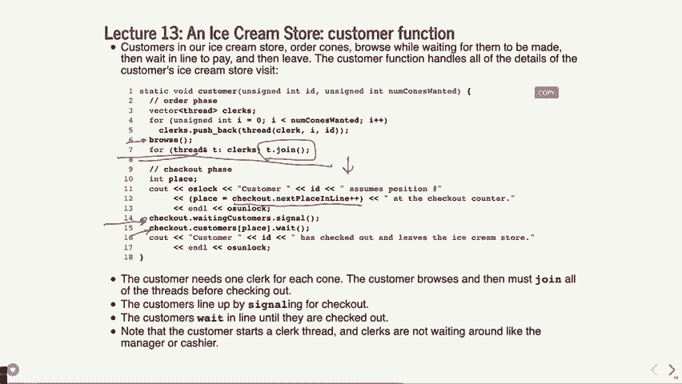

 And let's see the semaphore again it's a let's see semaphore customer it's just a single zero value semaphore just signaling doesn't need any like permits or anything like that。

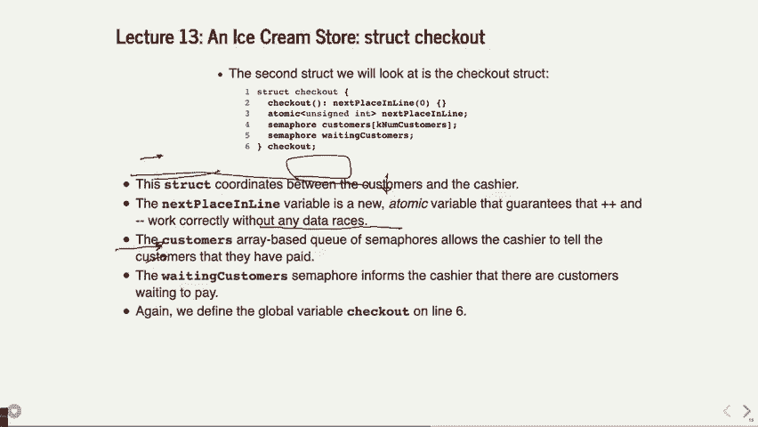

 Could you have done this with permits maybe like with permits the thing about permits though is that there's still a bit of a race condition there as far as who gets handled next with a permit like there might be some permit thing if you signal everybody it won't go necessarily in line。

 That's going to be an issue。 Okay we need the customers based on our model to be handled in order they arrived at the cashier that's the important part。

 Okay all right once the signal comes back from the cashier the customer has checked out and leaves。

 Okay question there are okay this weight right here you tell me what that's weight what did the customer what did the customer just do customer just signaled the cashier。

 So what's the customer have to do wait for the cashier to check them out that's what's happening here。

 Okay so there's a double signal going on here the signaling the cashier to say hey can you check me out and then waiting for the cashier to signal back。

 Now the cashier has to signal back in the proper order right the cashier because this signal there is no waiting associated with a signal like you signal and then you go on。

 So it might be that all the customers are sitting here waiting the cashier needs to go to signal the correct next customer and we'll get to see how that works in a little bit。

 Okay question。 The cashier will signal you in order cashier will signal in order we'll see how that happens。

 Is it possible that a person further along the line could have their ice cream cones completed or will they not have sent the signals to the cashier。

 Right so your second part so basically the question was wait if the could somebody in line not have their or have their cones made before somebody further up in line。

 Remember the customers just milling around until they get all their cones back then they get in line。

 Alright this isn't a case where like you go stand in line while everybody goes and gets the you know whatever it's you know your one person stand you only stand in line when you get your cones so that's the order you'll be taking it。

 And now it could be certainly that two customers get their cones at the same time and then fight over who gets to be in place first。

 That's fine but whoever ends up in first place gets handled by the cashier first and we'll see how that happens in an interview。

 Other questions on this one。 Yes。 So just some main clear is just looks a little weird though。

 So the whole check out dot customers play。 That's because you literally have an array of semaphores one for each customer or you have one semaphore that's needed to track up all the way。

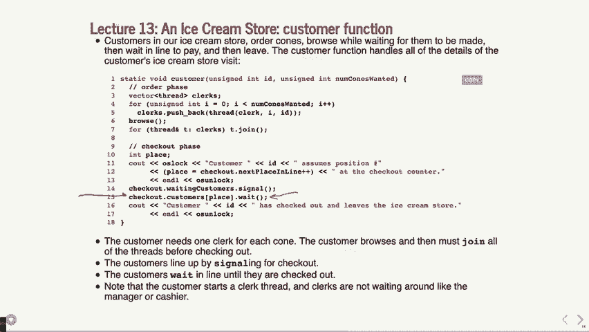

 No let's take a look。 There is a customer's array which is a semaphore per customer。

 Right so each customer gets their own semaphore what's their rating on how do they know which which where they are in line。

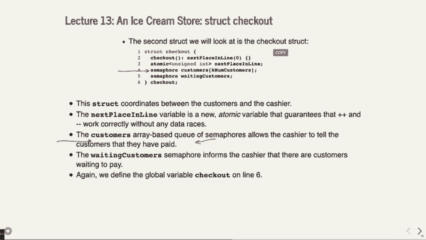

 They do right here they get their place in line by getting the next place in line variable which is updated per customer that comes in and then incrementing it so the next customer gets the next place in line。

 That's what we're doing right there。 And the cashier is just going to go through a little bit and go you you you you and know which one to actually get next。

 Right and the only way the cashier is going to know to get anybody is because the cashier gets a signal。

 So that's the the signaling part there。 Okay。 Does it start in the jail a little bit how this stuff works？

 Good。 Okay。 If it's if you're like oh I get it all on the board awesome。

 I would love it if that was a guess。 Okay。 So great。

 If that's if that's what's going through your head。

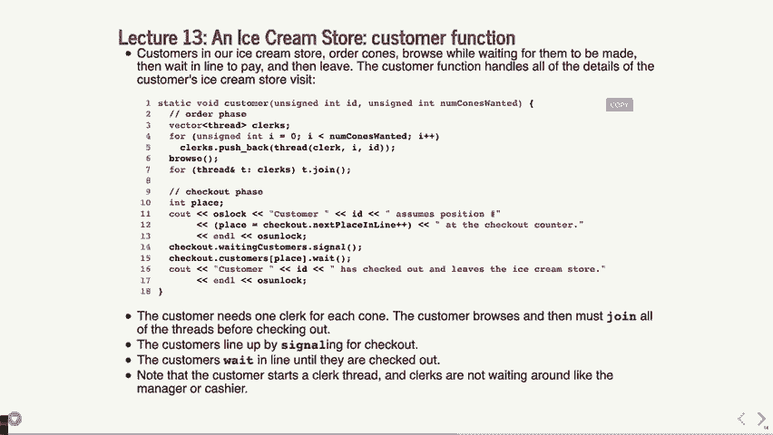

 Okay。 How does the customer browse pretty straightforward。

 The customer just gets a browse time and then sleeps for that amount of browse time。 All right。

 Sleep for is the way threads sleep for a particular amount of time。

 They cause sleep for and then the amount of time in micro millisseconds and then they do that and then the customer just said customer just killed so many seconds。

 Okay。 All right。 That's that。

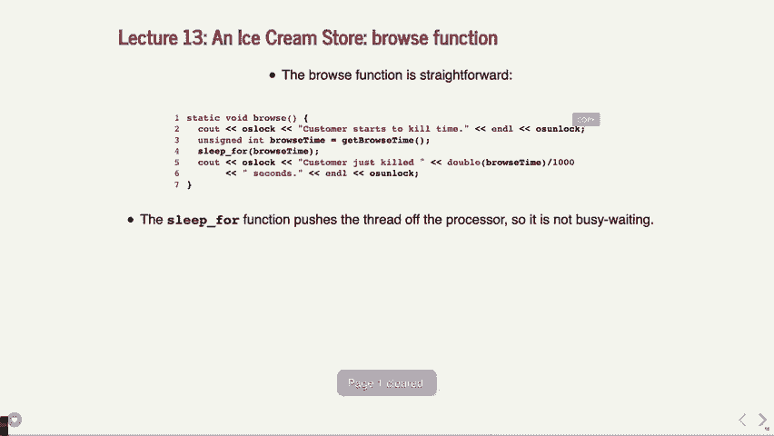

 All right。 Let's look at the clerk function。 Okay。 Remember one。

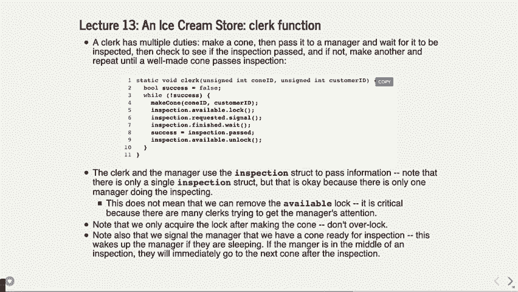

 Oh， by the way， what happened？ We kind of went right over this part。

 Here is where the clerk threads get started。 This is back in the in the customer function。

 This is an interesting point。 We are going to see when we get to main that both the manager and the customers and the cashier are all created in main。

 And then the cashier and the manager immediately go to sleep basically because they don't have anything to do yet but have their thread started。

 Yes， their threads have started。 So which means that it's actually less time to wake them up。

 This is going to actually follow directly into the next thing。 In fact。

 not this next assignment which I'll have out by tonight at some point or the by the next assignment。

 You'll learn about these things called thread pools which are ready waiting threads to go do their thing。

 Does that sound like any other assignment you've seen？ Farm maybe。 Right。

 Farm was processes waiting to go。 They're already ready。 They're what we call spun up ready to go。

 That's the same sort of thing。 We are spinning up the customers。

 the manager and the and the cashier but we are not spinning up the clerks until the customer actually does it。

 So it's kind of like the customer goes and like hires a clerk。

 You can think of it that way which would be weird。

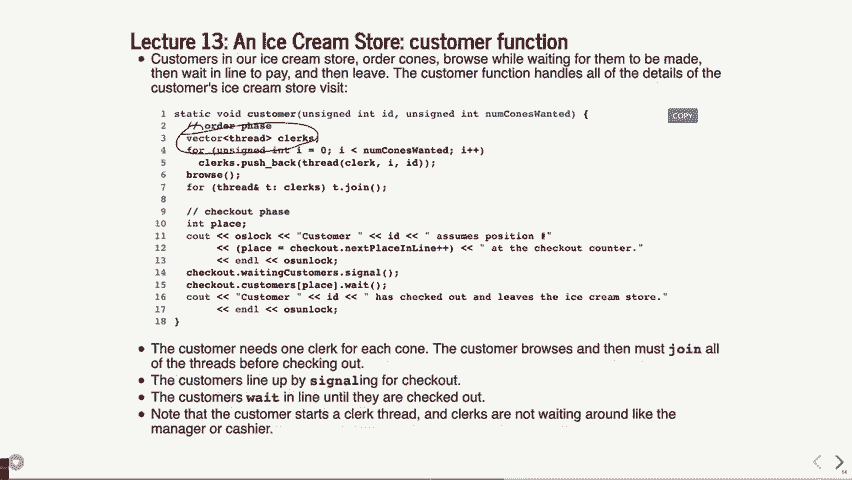

 Now we go into the clerk and we see what happens with the clerk。 So the clerk， all right。

 The clerk needs to do what？ Make a cone that's perfect and if it's not perfect then it needs to make another cone until the manager says you have made a perfect cone。

 So there's a little while loop in here that says while not success。

 This success is a local variable。 Does not need to be locked or anything。

 It's before the clerk itself and that's the way it goes。 It's kind of nice。

 Every clerk has its own success variable。 No need to block on that or have any reason to lock on those。

 What does the clerk do？ The clerk makes a cone。 The clerk locks the available lock。

 The available lock is whether or not the manager is available。 So the clerk says。

 "I need to lock this manager lock。"， What happens if a thread tries to lock and somebody else holds lock？

 Just blocks。 All the clerks could come and this is where they're fighting over the manager。

 One of the managers looking at a cone and then says the manager unlocks available and then goes or the other clerk that holds this lock unlocks it and then the manager is a free for all。

 All the other clerks try to grab that manager right there。

 Then once the lock is gathered then the clerk says， "Oh， I'm going to signal the manager。 Hey。

 go please inspect my cone。"， And then what does it do？ It waits。

 This looks exactly like what it did before。 The first signal then you wait because you're telling the other thread。

 "Do something and I'm going to wait for you to finish it。"， Good？ Question， how's it？

 >> So requested the requested and finished parts of the inspections part or both semifor？

 >> They are both semifor and zero permits。 It's just a signaling semifor in that case。

 The finished one or the requested is requesting the manager。 And by the way。

 what do you think the manager is doing at this point？

 If the manager is waiting for the requested signal， it is waiting。

 So that's what it's doing right there。 And then the manager has to then signal back to the thread。

 "Oh， now you can go again。"， So there's only one requested and one finished。

 What does that mean again about how many things can be dealing with this struct at one time？

 It turns out there's two that the manager and the clerk。

 but no other clerks because they're all going to be stuck on this lock before they could go and change anything。

 That's why there's only one need for a zero one there。 >> So there's like the following one way。

 >> There could be always one waiting and always one like， "Yeah， then the manager signals。"， Maybe。

 maybe not depending on how much time these things take。 The manager could be sleeping。

 which means the manager is going to just wait until it gets a signal。

 Or it could happen immediately。 I mean， here's the nice thing about all of this。

 The way we set this up， as long as things are progressing okay， it's as efficient as it can be。

 There may be some wait time， but that wait time is out of our control。

 We're going to make it as efficient as possible， so there's no extra wait time。

 And there's certainly no busy waiting here。 We're not spinning， we're not doing any process。

 We're just kind of going， "Look， I know I'm waiting for some other thread。

 I'm just going to sleep until it happens。 The incident happens， I move on。"， That's where it goes。

 >> Why would we go after requested and finished？ How does one form but it's waiting to signal requested and then wait on request？

 >> Yeah， very good question。 Why couldn't we signal on requested and？ And wait on requested。

 I was thinking about this。 I think there's a race condition there。

 If you signal and then try to wait， you might actually be the one getting your own signal。

 If everything has to happen in an order where you don't， you， in an order。

 it could happen in an order where you send a signal， go to sleep and wait。

 And then by the time that signal propagates through the operation。

 it comes back to you instead of the other thing waiting。 And not only that， there's。

 the semaphore would drop down again and then it would take two signals， actually。

 So that's probably the even better one。 It would take two signals to actually。

 to make one of them go unless it happened to be exactly ordered。

 So you want to just avoid that kind of ordering nightmare。 In this case。

 just use two because you know that one thread is going to wait on the request。

 and the other is going to wait on finished and you're okay。 You can try it。 In fact。

 go try to build it with one and see if it， if you can get it to do a deadlock or not。

 But I imagine you might be able to。 Good questions。 All right。 Anything else on the clerk？

 What the clerk's doing？ Oh， by the way， the clerk does what？ Here， the clerk says。

 waits for the manager to come back。 And then the clerk checks success and says， oh。

 either it passed or not， right？ And if it didn't pass， well， first of all， it unlocks。

 And if it didn't pass， well， it makes another cone， right？ Otherwise。

 it would leave if it didn't do that。 And so it may stay in this loop as long as it keeps making bad cones。

 It's just going to stay in that loop。 Really understand what's going on there。 All right。 Good。

 All right。

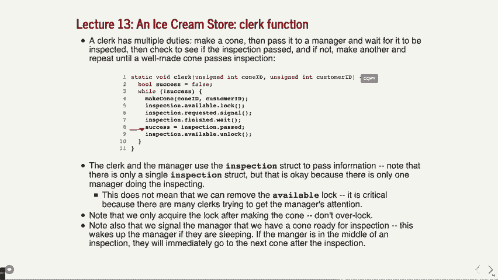

 Make a cone pretty straightforward。 It's just going to wait again。 It's going to， like， say。

 I'm about to make a cone。 And it's going to get some time and then sleep for that amount of time。

 And then tell how much time it was。 I'm going to run this program at the end。

 It scrolls through the screen and it's like， oh， my gosh， what's going on？

 But you'll see when it happens。

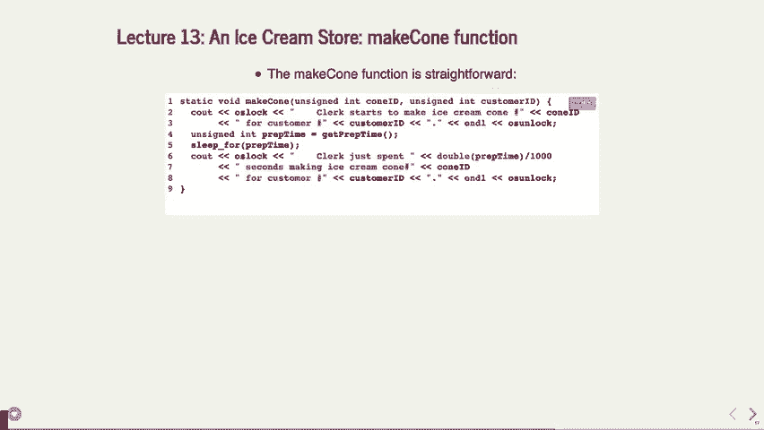

 OK？ All right。 Let's look at the manager function。 So the manager， remember。

 the manager starts out knowing how many cones it's going to make that day。 It's a little weird。

 We could have done something else where there's a Boolean flag that says， all cones are going to go。

 All the other signals are going to be handled。 Or not even signal。

 Just you could have another signal if you wanted to。

 Or you could just say the signal would probably work pretty well。

 Have another sum up for being done for the manager。 It says， go home。 You're done。

 And maybe you could link it together with one for the cashier as well or something like that。

 Although the manager can actually go home， although not the best business process。

 before the cashier does。 Because cashier might still be taking care of all the other customers。

 But that's what it does。 So it needs to-- so it knows how many cones it needs to make。

 manager knows how many cones they need to make。 And then they are going to attempt a bunch。

 We're just doing this to log it， as it turns out。 And then they're going to approve a bunch of cones as well。

 Until they approve the total number of cones they need to， they can't leave。 They are going to。

 first things first， well， find out if they can leave， which they can't immediately。

 And then they're going to wait on requested。 Because they're waiting for a clerk to come and hand them an ice cream cone and say。

 please investigate there。 Please inspect this。 Then they inspect the cone。 Just again。

 it's just going to be some time。 And it's going to be some time。

 And it's going to actually update the struct to say whether or not the cone passed。

 And then after it inspects it， it's going to send a signal back to the waiting clerk to say。

 go check your cone。 I just inspected it。 And then it does the num cones attempted plus plus。

 And if inspection passed it's going to say the number of proof。 Now， the， can the。

 this is going to happen at the same time as possibly the clerk is looking at inspection passes。

 Is that okay if they both look at the same variable at the same time？ That's actually okay。

 As long as no thread is able to update while the other thread is looking at it。

 many threads can look at that one variable at the same time because it's not going to change。

 So that's perfectly fine。 They might do it in some weird order in with the assembly language。

 but it doesn't matter。 Doesn't matter。 All right。 So what do they do after that？ So what's the。

 what's the manager do after they inspect a cone？ They check number code。

 they update number of cones proof possibly。 And then they go back in the while loop。

 If they have reached the number of cones they need exit the while loop， go home for the day。

 That's that question。 [ Inaudible ]， Say again。 [ Inaudible ]， Oh， such a good question。 Okay。 Yes。

 So you're saying look， the lock happening， oops， the lock happening here。 Is this the one here？

 Yeah。 So the lock happening right here。 Okay。 You just have to remember that a lock has no care about what data structures there are。

 It doesn't know。 It's not， it's not saying you can't touch this data structure。

 It's saying anyone else who tries to get this lock is going to be denied。 Right。

 That's all it's doing。 It's not packaging up a data structure。 It's saying nobody else can touch it。

 It's just saying hey， if you're going to try to get my lock you're not going to be able， to。

 So it's very abstract in that case。 Right。 It's just saying nobody goes past this line until the lock is unlocked。

 That's the end of the story there。 Okay。 All right。

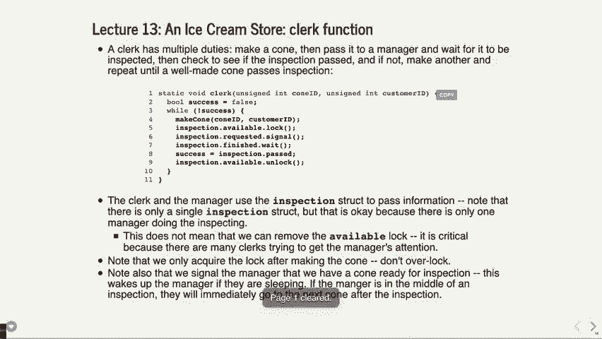

 Good question。 Does that answer it for you there？ Doesn't it doesn't affect the actual。

 so it doesn't， the manager can go and do whatever it。

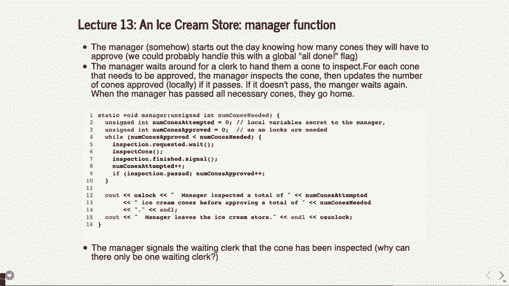

 does with that data structure at that point because it doesn't need to lock。 Now if it was。

 if two threads were trying to update that data structure then you would。

 need to lock and then only one would be able to do it based on your logic around locking。

 So it might go a whole block if the tries to modify it or it can go？ No。 You will get a note。

 If it tried to， if， very good question。 If the manager tried to update something here。

 in fact it does， it actually updates the， it actually updates the， in Inspector Cohen。

 we'll see that in a minute。 It updates the Boolean about whether or not it passed or not。

 Perfectly able to do that。 The child or the， not the child。

 the clerk is not going to look at that until after it gets， a signal， which， that case will be fine。

 Everything will be updated and it will be fine。 Good。 All right。 Other questions on this？

 Sounds like you guys are starting to get this。 Great。 Okay。 All right。 Let's now， let's see。

 Why can there only be one waiting clerk？ Because of that lock。 That's the whole point of this。

 that lock before。 All of the clerks would get there and go， "I can't do anything yet。"， Okay。

 So let's look at the， this is the Inspector Cohen。

 This is not too interesting except so basically sleeps for a while while it's inspecting the。

 system and then updating inspection passed based on whatever the random number that comes。

 back from get inspection outcome is and then it reports on whether it's approved or not。

 and then ends。 That's all the inspect Cohen does。 But again。

 it does update the inspection passed very， uh， struct but that's perfectly fine， because no。

 we know logically that no other threat is even looking at that right now。 Okay。

 What it can't do by the way is you can't go to the customer， they can customer can't。

 what if the clerk went and said， "Oh， I didn't get this to pass。

 I'm going to give it back to the customer anyway even though it's not a good inspection。"。

 It's not like the customer can go check this because the customer should not have access。

 to this because it's not， it's just between the， the manager and the clerk。

 I might be stressing the analogy of it but that's the way that， that you wouldn't want the。

 you wouldn't want the customer to have access to this because this number is going to change。

 for every inspection passed is going to change for every Cohen that comes through。

 And it's only one value and it's not like it's stored anywhere except after the。

 or except while the customer and the manager， or the clerk and the manager care。

 then it's updated again for the next one that comes through。 Single struct in this case。 Okay。

 Why are there no locks needed here？ Because we already locked what we need to。

 We logically know the only update is going to happen from the， uh， right here and the， and the。

 and the clerk is not reading this value at all right now。

 We know that based on our logic and that's sometimes the hardest thing to remember to。

 solve to figure out。 Other questions to this one？

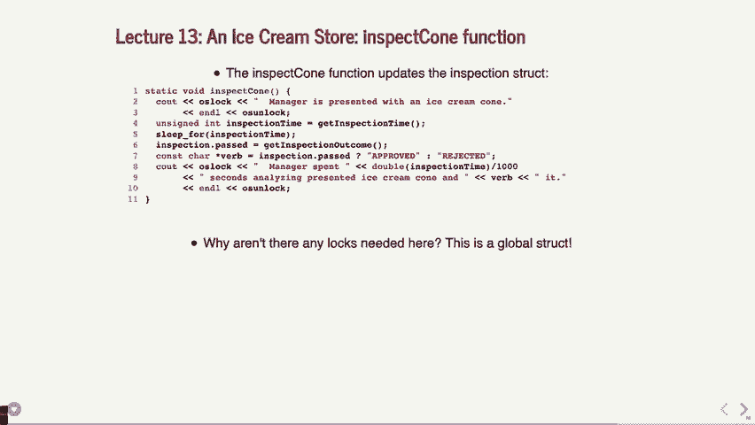

 Okay。 All right。 Now we're finally to the cashier。 Okay。 So again。

 the cashier knows how many customers there will be during the day。 Um， a little weird。 Uh。

 in that sense， we could have again done something where we had a queue that kept。

 or this vector or a queue， probably a queue of， um， that eventually the cashier would， uh。

 get a signal that says there's no more people that are going to enter the queue。

 And then when the queue is empty， the cashier can go home。 We didn't do it quite this way。 Remember。

 it's a final exam problem。 It's not like this was an assignment problem。 But， uh。

 but that's that the cashier。 Now this is where it starts to get interesting for the cashier。 Okay。

 The cashier does go in order。 Right。 The cashier goes from zero to the number of customers。 Okay。

 And the cost， the first thing the cashier does is wait on the， uh， the waiting customer。

 sell for it。 In other words， if nobody's there yet， don't do anything but just sit there and wait。

 Okay。 Wait for that thing。 Could you have maybe done it where they wait on the first one and then the signal comes in。

 maybe。 That might have been another， another way of doing it。 But in this case， we just have that。

 some affords is waiting on several。 Then what does it do？ Okay。

 It rings up the customer eye because anytime it's， when it gets that first signal， it knows。

 that signal had to have the first one anyway， has to come from that first， uh， from that， first， uh。

 customer。 Okay。 And so it brings up the customer。 And then what does it do？ Well。

 it knows that that was the customer just rang up。 So it signals that particular customer through that customer semaphore to say you're not。

 We have checked you out， go at your ice cream。 Okay。 And then it goes and does the next one。 Now。

 what could happen in the meantime if another customer has come in and is waiting， in the queue。

 well， this weight right here， this weight right here will blast right through。

 It'll blast right through that because another customer has already signaled。 And this is different。

 This is a difference between semaphores and signaling in， um， like a， uh， signaling in， processes。

 The signal remember does what？ It's on a semaphore。 It just decrements or increments a counter。

 So there's some counter there that has been， uh， in the， in case of the signaling has incremented。

 that counter。 And so by the time this weight happens， if another customer is already there， right。

 through and handled the next customer immediately。 Okay。 That's an important part right there。 Okay。

 And then， uh， it signals that customer goes to the next customer， might have to wait if。

 the customer's not ready yet。 Uh， if the customer is ready， then， um， then it will just go， the。

 this will go right up， and ring up with that customer。 But it's doing it in order。 And that's the。

 that's the important part here because this is kind of a cued up sort of， system。 Okay。

 Once all it goes through all the customers it needs to goes home。 Okay。 Question。 Yeah。

 Good question。 How is it that it's doing it in order of the customer？ It's not only the order。

 sorry， it's not when they arrive。 It's when they arrive to check out。 In other words。

 the customer has gotten her ice cream cones and then she goes up to the。

 cashier or goes up in the line， which may have other customers in it and stands there。

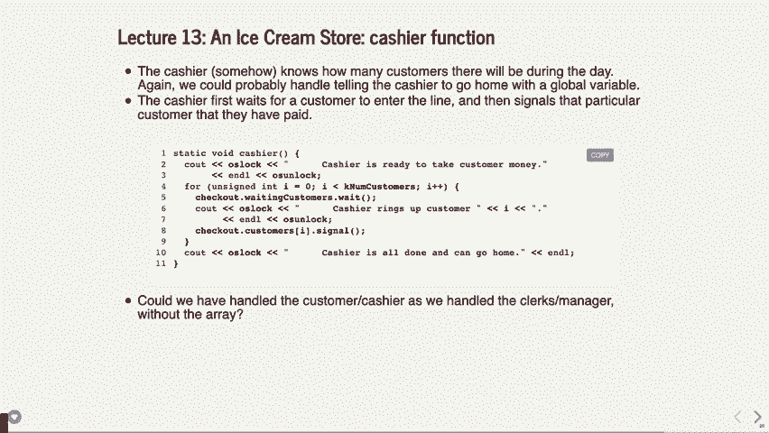

 At that point， let's go back quickly and look at what the customer， uh， what the， let's。

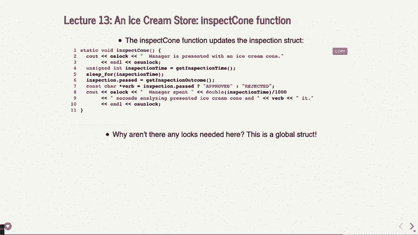

 see， this is what the customer was doing。

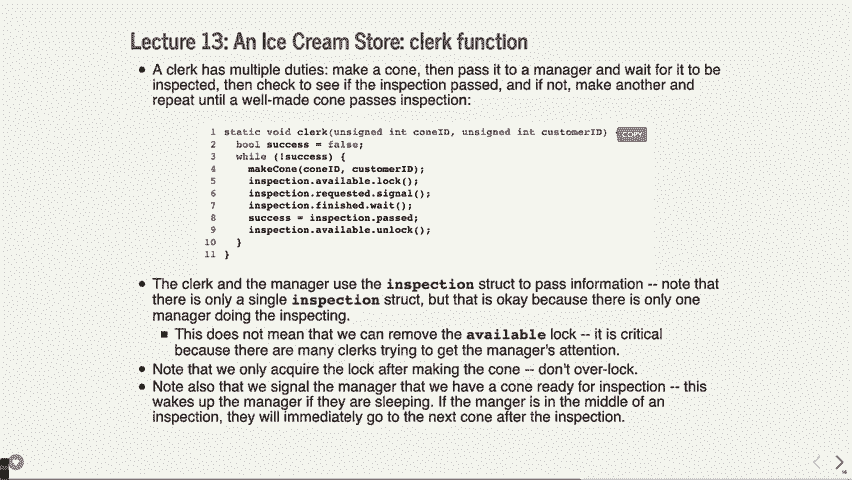

 Here's where the customer is doing this。 Remember。

 the customer gets their place in line by checking the next place in line variable。

 and then that's the， that's the signal it will end up waiting for。 Right？ Because it actually。

 remember， here's where it does it。 It waits in its place in line。

 And so the only way it can get in line is to go and get the next place in line and then。

 update the counter so the next person line gets the next place。

 It's kind of like taking that little bar at the supermarket and moving it behind your， groceries。

 like， you know， the next person is going to be behind that， right？ And that's what you're doing。

 You're like， oh， here's my place and then I'm going to put the bar behind the next one。

 That's kind of what's going on with that， that update right here。 Okay。 Other questions on that？

 Good。

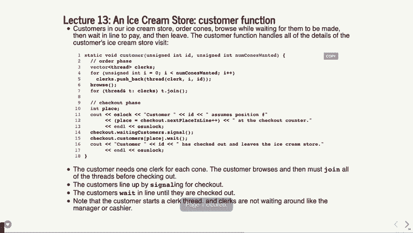

 Let's go back and look at， let's see， we did the manager respect on cashier。 Okay。 Cashier。

 cashier is done when they check every out in order。 Yeah。 Okay。 You got it。 What was it？

 Is this something interesting？ No， this is exactly what she was talking about waiting for。 Okay。

 How does it know to wait in order？ Yeah。 The customer gets the ordering。

 Because if we're updating the customers' array with their order and then we're just looking。

 for that array in signal。 Yeah。 So it is， it is， yeah， this is， I mean。

 this is an interesting thing。 Way of doing this。 This function has no real idea how many， like。

 which customer is where， except for the fact， that it's going through this loop。

 And the only reason it gets through the loop is because it first has to wait for that semaphore。

 for the waiting semaphore， which is， are there any customers？ Is really what it is。

 And then as a customer comes through， the customer， when that signal happens， that gets documented。

 again。 But if another customer comes in and gets incremented， and so if two customers come in。

 it will be， high enough that you know there's two people in line。

 And then that will go right through。 But it goes in order because of this for loop。

 forces it to go 0， 1， 2。 And which one is it actually signaling？ It's signaling 0， 1， and then 2。

 based on that。 Yeah。 And remember， this program， there is actually very， very， very simple。

 kind of thing。 And there is actually very little actual communication between the threads。 I mean。

 it's really only the customer is just waiting for the signal。

 And then that signal comes out of nowhere and it moves on。 You know。

 it doesn't know what place -- it knows what place in line it is。

 But it doesn't really care at that point。 It's just going， "I'm just waiting。"。

 And then it gets a signal that's， "I'm done。 I can leave this store。"， So， yeah。 Good question。

 Okay。 Could we have handled the cashier， customer cashier if we handled the clerks manager without the array？

 Not really， right？ The problem is that we needed to do this in order。

 So we need to have enough semaphores for each one to wait in their place。 Otherwise。

 if there was one semaphore， it would be -- there would be fighting going on when that signal came through。

 And the person who came in last in line could all of a sudden be jumping up in front。

 That wouldn't be so good。 We wouldn't like that at all。

 Kind of like that one where a line of his grocery store ends up。

 Somebody opens it up and the person in the back of the line goes straight to the other cashier。

 And you're everybody else like， "Well， that's not the right order。"， Chaos。 That's it。 All right。

 Any other questions on what the cashier is doing？ Okay。 So， we have -- so， yeah。

 we made -- we needed to do that。

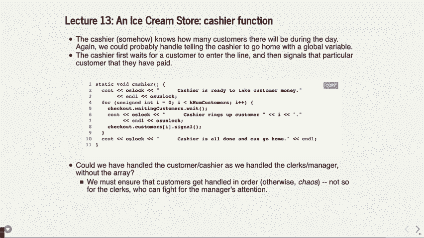

 The main function -- we finally made it to the main function here。 So。

 the main function sets things up。 And let's see how it actually sets things up。 Okay。

 It sets up the customers， the manager， and the cashier。 Remember。

 it does not do anything with the clerks because the clerks happen in the customer --。

 the customer somehow magically creates a clerk thread。 Okay。 That's how that works。 Okay。 So。

 the customers -- the total cones order -- this is just for logging， basically。 It sets up here。

 And then the customers -- we know how many customers are going to come in because we're。

 writing this program。 Maybe that could be some other random number。

 but that's the -- that's -- we did it as a constant。 Okay。 For each customer， what do we do？

 We get how many cones they want。 That's where we determine how many cones each customer wants。

 Then we set up a thread for each customer with the customer ID， basically， and with the number。

 of cones they want。 And that's how each customer knows to go and get so many clerks -- one for each cone -- and。

 then it passes on its own ID to the clerks and to the cashier。

 And then we actually just keep track of the total cones order because we want to report， on that。

 All right。 We're going to have to join these at some point because they're all threads and they。

 need to -- when they end we need to join them， we'll get there。 Okay。

 Then we need one thread for the manager and one thread for the cashier。

 And we don't need to tell them anything。 At this point -- well。

 we need to tell the manager -- the total number of cones ordered。

 and the cashier will use the global constlet to tell how many customers there are。

 So it doesn't need to be passed in。 Probably should have been in terms of the encapsulation question。

 So notice that -- I noticed that the cashier gets joined before the manager。 What's the idea there？

 Is that on purpose？ Cashier gets joined for the manager。 I don't think it matters。 Yeah。

 I don't think these are irrelevant because they're both ending and they're ending and。

 they're not coordinating and they don't really need to worry about it。 Yep。 [ Inaudible ]。

 The max number of clerks is the total -- total cones ordered， yes。 Yeah。

 That's because we know that each clerk only makes one cone。 And no， that's not true。

 Each clerk could make infinite number of cones， but it only makes one good cone。

 It only makes one passed inspection cone。 So the other question。

 Is it possible that the clerk signals before the manager is fun？

 Is it possible that the clerk signals before the manager is fun？ Sure。

 Nothing happens then because nobody is -- that -- all that's happening when you signal。 Remember。

 this is not the same as signaling in a process。 This is just updating that semaphore。

 And so the semaphore is going to get updated no matter what。

 Who cares if there's a manager thread yet？ Unless the manager thread gets ready and checks that signal。

 does it wait on that signal， it will move right on。 Yeah。 Good question。

 Like this is not signaling in the same sense。 It's too bad it's called signal in some sense because it's not really the same like I'm。

 signaling。 You're signaling the semaphore and then somebody else might be waiting on that semaphore。

 And so that's where the abstract signaling part comes in。 Good question。 Everybody else on this one？

 So then what do we do after we -- so now here's the most interesting part。

 And I already mentioned this a little bit。 The manager thread -- so the customers are just all spinning up and going about their。

 business。 They're creating clerks and so forth。 The manager and the cashier。

 the first thing they are likely to do is just wait。

 But they are already running and ready to go and they're just waiting for that one signal。

 to happen and through the condition variable any and when that happens， boom， they go and。

 they start respecting。 You don't have to spin up a thread and spinning up a thread takes a little time。

 This is a good way。 This is going to set us up for that thread pool stuff we'll talk about as in two assignments。

 from now。 We'll get to there。 And thread pools are a good way to make it so that you reduce the lag that comes with。

 creating a thread。 There is some。 Okay。 Then what do we do？ We join all of the customers。

 Then we join the clerk and we join the manager。 I don't believe that matters what order those happen in because we're just waiting for them。

 all to end。 That will mean that we don't end our program until that finishes。 All right。

 There's a lot of code to look through。 Hopefully we did it in pieces so you got the feeling for whichever。

 what they all did。 It was much better than me typing it all live。 That would have been a nightmare。

 Any questions on the code so far？

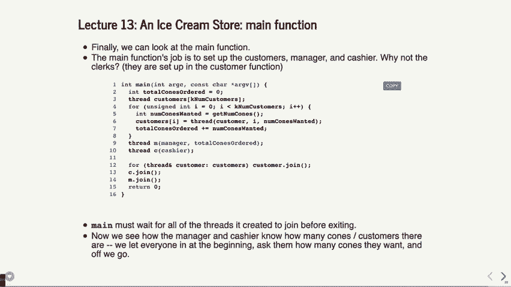

 What are the takeaways from this？ There's a lot going on here。 We made a big model。

 Not even that big really， but it's a big enough model that there's lots of moving parts managing。

 all the threads， waiting。 You do have to plan this out。

 This is not something you can just throw together and go， "Oh， now I need something。"。

 You had to sit there and plant。 Trust me， Julie Zelensky， once you created this。

 must have spent some time going， "Okay， what do I really need here？

 I want all these things to happen。 I need some managers out there going to need a semaphore。

 There's going to be another semaphore for the clerk and all I need to and whatever。

 It's not like she just started writing code。 She's certainly planned this out to some extent。

 Although I guess I know Julie enough to know she probably just did started， but she's good。

 enough to do that。 I'm not going to do that。 Anyway， you didn't even plan these things out。

 This is not the only way to do it。 You could modify this model in a zillion different ways。

 You could make it so that the clerks， there's multiple clerks that all are always spun up。

 and then you get one in time。 That'd be a thread tool sort of thing where a clerk。

 once they make a good ice cream goes， back in the pool and gets another one。

 Maybe you'd want a semaphore， some number of permits with the number of clerks that can。

 do it at a time or something。 Who knows？ But you would do that。 If we had more than one manager。

 we've already talked about the details of that。 That's going to not involve more structure。

 different structure， semaphores。 Then you could have done a main and then spun them up a little bit。

 Yeah。 So I keep throwing around this thread pool thing。

 A thread pool is basically a number of threads that are all waiting to do a job。

 I think it's exactly like the farm where you have all those Python processes that are。

 still running on machines around the world。 You've got all those processes that are all ready to go。

 waiting for something to do and， then boom， they do it。 They don't need to start anything else up。

 You will see that into assignments。 You'll actually build a thread pool and see how it works。

 But it's not really that complicated。 You have a whole bunch of threads and then you say go but just do a wait and then I'll。

 eventually signal you。 It's really all there is to it。 And then， yeah， that's the thread pool。

 waiting around。 We want to avoid spinning up a thread， taking the time to do that if we can。

 But for this program， we did it for the clerks or we didn't do it for the clerks。

 We did it for the manager and the cashier。 All right。 So that is the program。

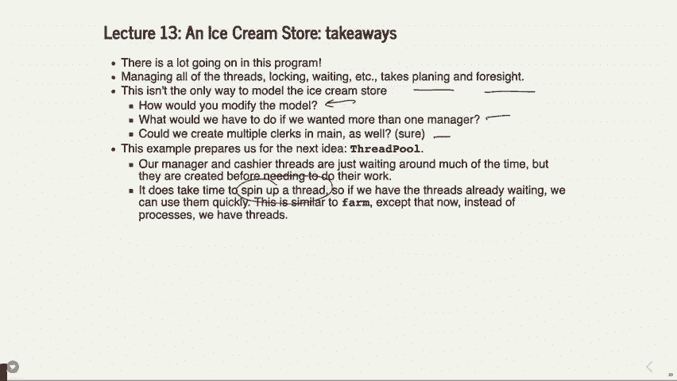

 Let me actually show it to you in action。 Let's go find a terminal here。 Oops。 Skip this version。

 Need to go back to the cursor。 Skip this version。 Hang on。 There we go。 Okay。 All right。

 So we need to。 Let's see。 Are we in myth？ Yes， we are。 We need to go to 110 and spring。

 Live lecture thread。 CPP。

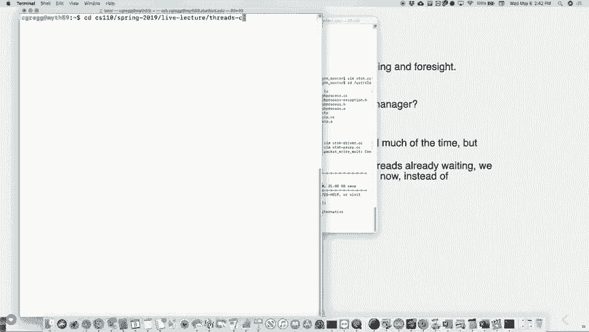

 Okay。 In here， I've already created the ice cream parlor。 Let's see it go。 Now。

 this is going to go on。 It goes on and on and on and on。

 If we kind of go up and see what's going on here， clerks starts to make ice cream cone。

 zero for customer number seven。 Managers presented with an ice cream cone。 Clerk just spent 0。

287 seconds making an ice cream cone。 Right？ Et cetera， et cetera。 And it keeps going， keeps going。

 keeps going， keeps going。 And you can kind of see， eventually it's going to keep going。

 I don't know how many there is。 Okay。 So at the end here， what happens， well。

 it says the managers presented with an ice cream， cone。 And then the manager is done。

 Manager inspected a total of 333 ice cream cones before approving a total of 27。 Terrible clerks。

 it turns out。 Right？ Wasting a whole bunch of ice cream。 90% of the ice cream is wasted。 Not good。

 Not going to be in business very long。 And then the manager leaves。 Right？ And then the customer。

 the last customer here takes up position， let's see， 14 at the counter。 Why would that happen？

 How do we have customer tenting？ I don't know。 I'd have to look into that。 Why it's not position 10。

 I'll flip it up。 I'll have to see。 Oh， I know why。 Because 12， 11， 5， whatever。

 they all happened before。 Turns out that it took the most time to make customer 10s。

 which is not the order of customer， 10 gets in line。 The order of customer 10 was the 14th cut。

 the final customer to get their cones made， is what happened there。 Okay？

 And then the cashier has already run everybody up。 It took less time to ring them up。

 I'm going to cashier good one。 Yeah。 [ Inaudible ]， Close。

 The question was technically the cashier that the manager thread ends before the cashier。

 The manager thread is joined after the cashier thread。 So if you want to think about it。

 the cashier has to wave at the door before leaving。 Yes。 Although the thread is actually gone。

 but all the cleanup for the thread has not happened， yet。 So I'm going to say the cashier。

 the manager left their coffee cup on the table。 Somebody has to go clean it up。 That's still there。

 But the manager is long gone。 All done。 Okay。 All right。 Feel free to look at this code， modify it。

 check it out， try to make some other semaphore， changes， see what happens。

 This is not a bad problem for our final exam。 If you want it， if this is the kind of -- now。

 coming up with Hall， making it work is the， hard part， like for designing the problem。

 so it's unambiguous。 But this is a pretty good problem。

 So I would really try to understand this if you go back to the slides， look at the code。

 run the code， and you may see something similar on the final exam。

 We'll see you guys through the results。