# 斯坦福大学 CS 110 计算机系统原理 Principles of Computer Systems（Spring 2019） - P17：Lecture 16 Network System Calls - ___main___ - BV1ED4y1R7RJ

 Screen and cast people you missed about 30 seconds。 Okay， so the question was， "Hey。

 can we use multi-processing from threading？"。

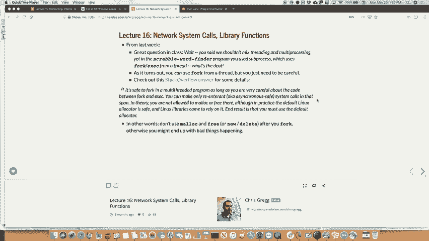

 The answer is you kind of have to be careful。 The best I could find was the sacroful answer。

 which basically said， "Look， you can use fork in a multi-threaded program。"。

 And then what does that actually mean？ It means that both copies of when you've forked。

 now both processes， have threads associated with them。 So something's got to be， you know。

 you've got to have some way of dealing with that。 But in the sense of being able to do it。

 the biggest thing is， after you do fork and before you do exec BP， don't do any mallet-free。

 new or delete。 And that was the best I could find。 You can do it。

 Just don't do anything that's going to mess with memory in such a way that it will end up。

 messing with the schedulers and things。 And that was the best I could find。 So the answer is， yes。

 if you want to use multi-processing from within multi-threading， you can。

 You just have to be a little careful about it。 And obviously。

 testing is always going to be something important to do。 Okay， so good question。

 And there's the kind of answer that I could find。 Feel free to do some more digging on your own。

 But it is possible。 It's just you've got to be careful。 Okay， so let's move on to。

 Network system calls， library functions， et cetera。 Now， as I said a couple minutes ago。

 this is where I think it's kind of a flashback to CS107。

 because some of the walkiness associated with C propagates to these functions。

 that are about getting host names and resolving them and using these low-level functions。

 to do so in a way such that you can support IP version 4 and IP version 6 and any other。

 version that you want。 It turns out that socket programming， which is what we're talking。

 about here， where two computers talk to each other through a socket or basically a port。

 A socket is， as it turns out， just a file descriptor， but it's a very special file descriptor。

 It still gets an entry in the open file table。 Believe it or not。

 it still gets an entry in the file descriptors for a particular process。

 but it allows you to have a double-ended communication between two processes or two computers over a network。

 Okay， so it's just like a file descriptor， but there's a little more to it。

 And you don't necessarily need to know what else there is to it， except for the fact that。

 even though it's a file descriptor， you actually can't say。

 you don't say read and write in the same way that you normally do。 Okay？

 You use things like accept and you use other functions that。

 I guess you can use write on the file descriptors。 But you can't。

 but there's some other nuances that you can't just say， oh， it's just like every other file。

 Somewhat like that a bit of a file， but not exactly。 So， let's talk about the specifics。

 Because we are people， we like to use things like www。facebook。com， versus 31。13。75。17， right？

 You don't want to memorize numbers。 We've talked about that in a number of the ways this class。

 And so， there are functions that will get the number from the name。 So， if you know the name www。

facebook。com， which you can remember easily， you can use a function called gethostbyname。

 And you can also use one gethostbyaddress， which they're both technically deprecated。

 In other words， there's other things you should probably use instead。 However。

 your book talks about these ones and they're still used enough that you should be used to using them。

 In particular， I'm not exactly sure what the actual new one is。 I don't say。

 see these ones more than I see that and I forget what the actual。

 the one that you should use these days is。 So， anyway， we're going to talk about these two。

 And what they take are a gethostbyname。 It takes a name like www。facebook。com。

 And it returns this struct called host， a struct hostint。

 which is a particular struct we'll see in a second。

 And it populates it with the information you're going to need about what the IP address is and so forth。

 You can also pass in an address here。 As it turns out， I don't believe that's actually a char star。

 Although it looks like a char star。 You have to actually cast it to believe it or not a like an int in this case。

 And the reason for that is because you need to， actually this one may be not。 This one。

 I don't even think we use this one or an example。 This one may be not。

 There are ones where you have to do that。 And again。

 it's because of the longiness of C and some of this stuff we've done in 1977 and there weren't even void star pointers then。

 So， everything became a char star pointer and it， you can do that。 In this case。

 I guess in this case， yeah， this is actually going to be， I believe， a number。

 a pointer to a number。 And you're going to say how many bytes it is and then another variable it talks about the type of connection。

 whether it's an IP for before or six or so forth。 Okay。

 so there's lots of details about that that you have to know when you're using that function。 Okay。

 a struct host int has the following， well， we'll get to what it is。 Let's see， get host name。 Yes。

 here we go。 This one is a struct i-n-a-d-d-r， which happens to be an int。

 It's the weirdest struct I've ever seen。 It's got one value in it， which is an int。 So。

 we'll see a little bit more about that in a second。

 But the one we're going to focus mostly on is get host by name。 So， it turns out。 Okay， all right。

 so what is this？ What is this？ Oops。 Oh， no， that's not what I want to do。 Hang on。

 I don't have my tablet set up quite correctly now， so hang on。

 Let me go back here and we will use cursor。 Okay。 All right。 So。

 here's what the struct host int looks like。 First of all， it takes inside of it， I will use the pen。

 It takes a struct called struct i-n-a-d_ad-dr， which is， in this case， an unsigned int s-a-d-d-r。

 which is， like I said， the strange is struct because it's only got one value in it。

 You normally don't bother with a struct that has one value， and it wants the point。

 Maybe this is for， hey， they thought maybe it would be used some other way。

 and they might have some other， they probably were forward thinking enough， and it never was。

 And it never has changed。 So， that's all that is in there。 Okay。 This is an unsigned int。

 And then the struct host int has a regular old charge star， finally， a regular old charge star。

 which is the name。 Okay。 That's the official name。 Turns out， I'll show you an example。

 the official name might be different than what you actually type in。

 A lot of times they end up going to the same IP address。

 but the name could be a little bit different。 Then you have a bunch of aliases。 Okay。

 And the aliases are other strings that also refer to the same IP address。 Okay。

 So there's like an official one， and there's other ones that do that。

 You rarely see the aliases one filled in at all。 I guess maybe it doesn't really。

 nobody really cares that much about it。 But you rarely see that in。 But it is a charge star star。

 meaning that it's basically just like every other charge star we normally use。 It's a。

 as it turns out， no terminated list of our pointer to strings。 So string， string， string， string。

 string， and then the final ones， no， you know， you've reached the end。 That's what that one is。

 Okay。 The age address type is going to be different depending on which type of IP address you care about。

 So in this case， we'll probably stick mostly with AFI net。

 which means the Internet for IPV for addresses。 Okay。 And this is actually somewhat important。

 We'll see why when we get into the details of some of the strange polymorphism that they've jammed into C。

 as we see。 Okay。 And then here's a charge star star， each address list。

 which is another not charge star star。 It's basically a void star star。

 That should be a void star star。 But when they built this function。

 they either didn't have void star star， they didn't want to use it for whatever reason。

 But when you use this， you should cast it to the appropriate thing that it is。

 which you will know based on analyzing this。 We'll see how that works again。

 It's like really low level 107 kind of stuff。 Question， are these things supposed to make a durant？

 Are these things that make a durant？ Probably， yeah。 Probably the same people。 Yeah。 There you go。

 Yeah。 It's， look， when you're designing something in the 1970s。

 it's a little bit different than the way you might design it today。 Maybe。 But yes。

 it's probably the same people who did that。 Or somebody who's thinking along the same lines。 Okay。

 Anyway， we'll see why this becomes interesting in a few minutes。 Okay。 All right。

 The S-A-D-D-R field is what we call a dotted quad。 Okay。 Basically， it's four bytes。 One， two。

 three， four。 Okay。 Four bytes。 And this is what you hopefully have seen IP addresses that look like this in the path。

 You have it。 Well， that's what an IP address looks like。 An IP version four address looks like。 171。

64。 64。136。 And those IP addresses， they break them into fours because it's a little easier than memorizing that big long number。

 number one。 And number two， each little byte means something different。 171。

 I believe that Stanford's mean like the first byte and all Stanford addresses once everyone I believe。

 And then the other ones kind of slowly get it down to the actual machine or router that you're actually looking at。

 So that's how that works。 Meaning that because these are just bytes， the IP version four addresses。

 four bytes long or 32 bits， and it's 171， 64， 64， 136。 Now。

 what order are those bytes going to be in？ In other words， when you have。

 this is the 107 stuff I was talking about too。 When you have a number and a four byte number on your system。

 there's two different orderings we can use。 Remember what they were？ Little Indian and big Indian。

 right？ And our machines are generally little Indian machines。

 Meaning that the little end of the number actually comes first in memory。

 So 136 would actually be the first one in memory and then 64 and then another 64。

 And then 171 would be last in memory。 We could have done it in exactly the opposite order。

 You could have done it in big Indian。 And for those of you who took CS， let's see， 107E。

 I believe the Raspberry Pi's are in general big Indian。 Although maybe they。

 I think I can actually switch it back and forth as it turns out。

 But the point is that in that case it would be in a different order。 Well。

 because of standardization， your computer， which is the little Indian。

 you need to talk to some computer on the other side of the world， which may be big Indian。

 You have to make a decision on which direction to put the bytes when you actually send them over the wire。

 Okay？ So the reason we have to do that is so that everybody can talk together。 And therefore。

 if you have the wrong type on your computer， you'd better do a translation when you're about to send it。

 We will see that in action。 I'm just setting you up for it， thinking about it right now。

 And I'm going to show you the details in a second。 Okay？ Let's see。 Yeah。 So we。

 for non-IP version 4 ones， we can also， let's see， hang on， see this one。 See this one。

 For non-IP v4 ones， we have different information in all that thing。

 It's got other information in there。 H-atter type is going to be a different actual number。

 Length is going to be different if you have 128 bits。 You're going to need to report that。

 And the list can have different types of information too。 So you've got to be a little bit。

 a little bit careful with that as well。 Okay？ All right。 Now。

 why is it not letting me do this again？ There we go。 Okay。 Any questions on that so far？

 We're getting the， getting to the actual code here。

 In fact， let's actually write some code and then I'll show you this as we go along。

 That is way too small。 All right。 So， there we go。 All right。 So。

 we're going to go ahead and take a look at the code。

 And then we're going to go ahead and take a look at the code。

 And then we're going to go ahead and take a look at the code。

 And then we're going to go ahead and take a look at the code。

 And then we're going to go ahead and take a look at the code。

 And then we're going to go ahead and take a look at the code。

 And then we're going to go ahead and take a look at the code。

 And then we're going to go ahead and take a look at the code。 Okay。 So。

 we have to start out and we declare a struct host end。

 This is a statically built variable that is kept by the operating system。 So。

 if you're going to use this multiple times in your code， you'd better make a， if you want。

 to keep track of different like things。 Keep a copy of it because it's not， it's not like it's。

 it's not thread safe and it's other， things because you are just getting the actual pointer to the data that's living inside the。

 function that you're calling。 Okay。 Not the best way to do it。

 but that's the way static variables work and that's how this， works。

 Get host by name is a C function。 So we need to convert， if we have a C plus plus string。

 we just convert to C string。 Okay。 And then calling the get host by name will populate this。 Okay。

 So， no， it means we couldn't resolve the name。 That could be for a number of reasons as it turns out。

 It could be that your DNS server is down and that's on your computer or the network or。

 the router and so forth where you're connecting to or it could be some other reason。

 So if you type one and it happens to be not there， it doesn't necessarily mean that it。

 doesn't exist， but it doesn't， it means that your program couldn't resolve it。

 This is the problem with networks。 Sometimes other things that you can't rely on go down and nothing you can do about it。

 Okay。 Then H E the H name is the name we talked about and then all of those IP addresses， we just。

 go through them one at a time by first saying， okay， let's cast the H address list to what。

 it really is and we know that really is a IN address double pointer。 Why？ Because we're no。

 we're asking for the IP version for address。 In other words， we call get host by name。

 meaning we were expecting an IPV4。 If you want an IPV6， there's a different function you call。

 Okay。 I'll show you that in a minute。 But anyway， then you get the IP address by the IP addresses by looping through until you。

 get no。 Okay。 And how do we actually get out the actual IP address？ Well。

 remember it's just a number right now and it's just a four byte number。

 And so what we do is we call another function called， I met network to printable is basically。

 what the NTOP stands for， which means it takes， it says， hey， what type of IP address。

 are you using in this case， IP version for？ Okay。 It says。

 give me the actual pointer to the address itself。 Okay。

 And then give me a string to populate it with。 And that's what we've done up here。

 And we know that I met underscore ADDR， Sterling is the maximum length of a IP address that。

 turns out。 So we know that's okay。 And then how long it is is also passed in so that it won't。

 right over the buffer。 Once you do that， it takes that number and it forms it into a nice 172 dot whatever。

 whatever， whatever。 Okay。 Any questions on that？ Yeah。 Yes。 A of I net is IP version four。 Yes。

 A of I net is IP version four。 Let's look real quickly。 Resolve host name six， C C。 Yeah。

 There's the one for IP version six。

 A of I net six， et cetera。 And we also would call a different function called get host by name two。

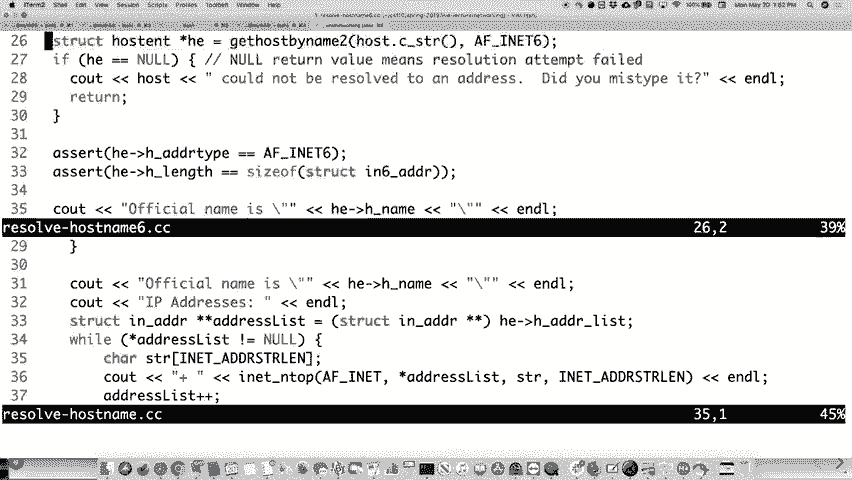

 They weren't very clever when they named these， I guess。 You think it would be。

 you think it would be someone like get host by name six or something。 But it's a。

 you can pass into this one。 This one you pass in the actual type。

 So I believe we could have used this one for the IP V or version six as well。

 And it would have worked just fine as well。 Because we would have passed in the IP version， sorry。

 the IP version four。 Did they also write two two？ Did they also write two two？

 They probably also wrote two two。 Yes。 Yes。 If you ever build a big system。

 you will quickly realize that there are decisions you have。

 to make that you hate at the core in your core。 But you have to make those decisions because it just happens at the way。

 Now， if they have to do it this way， probably not。

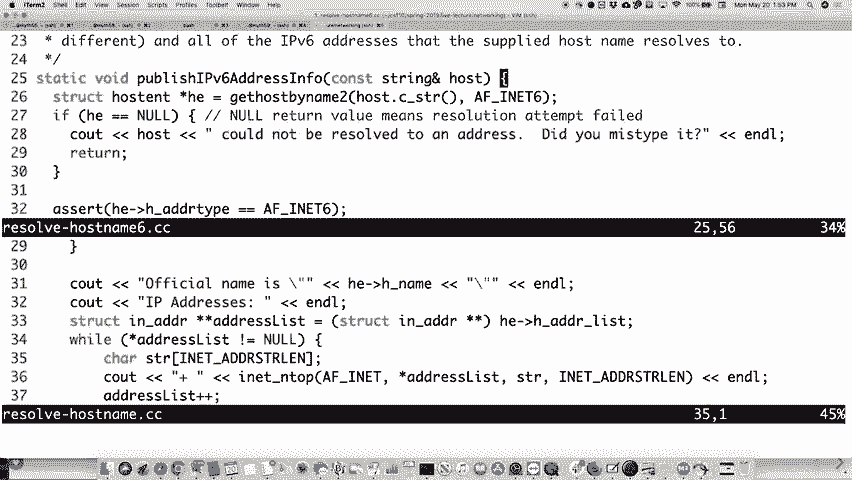

 But they may be， there's some committee that probably decided that and that's the way it， goes。

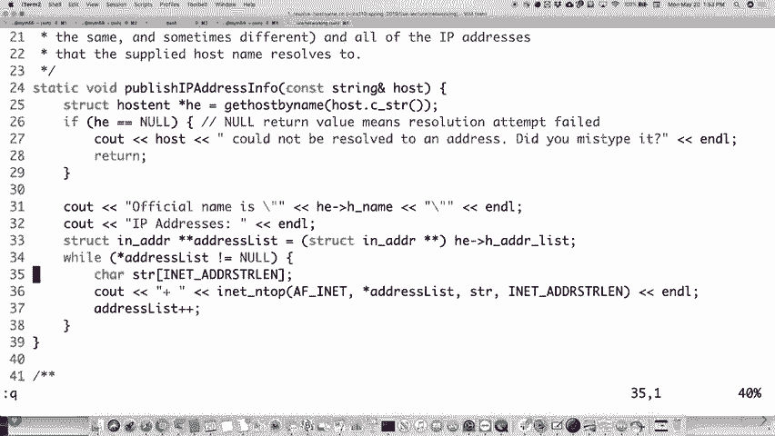

 Anyway， let's see this program in action。 Okay。 I think it's already made。 Let's see。

 Resolve host name。 Yes。 Okay。 So if we type a host name， let's try， let's try， www。stanfer。edu。

 Okay。 So it says that that's the actual host name， the official one。

 Now it's a good thing we don't have to type that every time you want to go to Stanford。

 or to Stanford or to you。 Why is it that big long？ Well。

 it tells you that actually Stanford relies on Amazon AWS services for their， well。

 if you think about it， it's actually not a terrible call。

 Why do it all in house if you don't have to， right？

 Just rely on some giant company that has billions of servers out there。

 It's probably going to stay up relatively often and so forth。 I believe if we just type Stanford。

edu， we get， there we go， we get the official name， is just Stanford。

edu and it happens to go to a slightly different web address。 My guess is that if you type www。

stanfer。edu， your browser may actually， let's try this。

 I'm going to try something。 Ping。 Stanford。edu， okay， it says 171， 67， 215， 200。

 Okay， so that's that。 If we ping www， let's see what happens here。 No。

 it's giving you the other one。 So they're slightly different。

 They probably end up pointing to the same place somewhere along the line。 But yeah， there's the。

 they do end up with different， www actually makes a slight difference， in that case。

 If you type both， you'll end up with the same place。 Somewhere along the line。

 they re-routed to the same web page。 Let's try a couple more。 Let's try google。com。 Google。

com has an IP address that I believe is actually based on your location。

 Like it kind of knows who you， who's asking and then it returns the IP address about like， where。

 like locally， more local to you。 As it turns out， let's see， facebook。com。 Yeah， same thing。

 There you go。 Oh， some of the other ones， let's see， www。facebook。com。 There you go。 The， the www。

stampford1， actually I think it had two， there it is。

 It did have two different IP addresses associated with it。 Those are Amazon addresses I think。

 And then there's another one that Jerry likes to use。

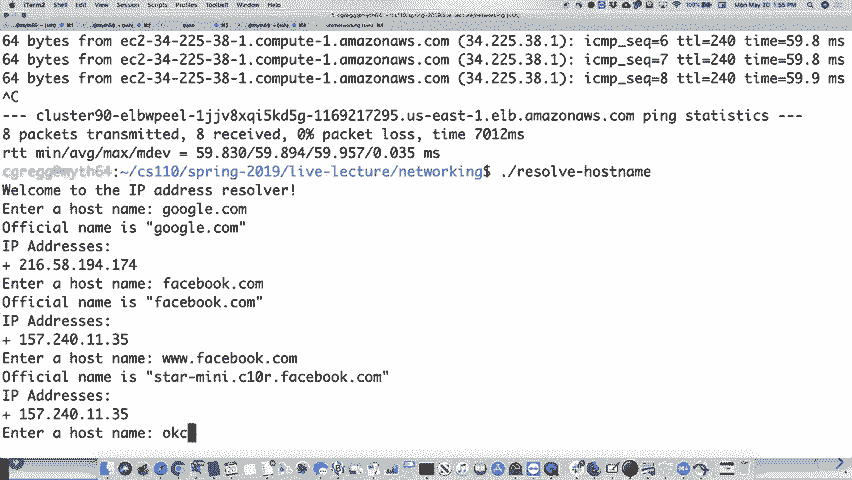

 Okay， Cupid。com。 I don't know that Jerry likes to use that， but Jerry actually showed me this。

 That it， that it has lots。 I'm not sure why。 And it's not because like billions and billions of people are using it and like Google has。

 a few people here and there。 So I don't know why。 There's some。

 something going on where their host server says， hey， these are all your IP。

 addresses and it shows up in this list and it's， it's a little bit black magic after that。 Now。

 github。com， let me try it。 github。com。 There's just one for that。 I don't know if I could try www。

github。com。 Same。 So it's the same。 That one happened to be the。

 the official name is the same one that went to the same one。 So yeah。

 there's definitely some black magic going on there。 I know， you know。

 I don't know all the details about that。 So let's do one other thing。

 I want to show you just one other thing here。 gdb。 I told you it's not feel like 107。 gdb。 Resolve。

 Host name。

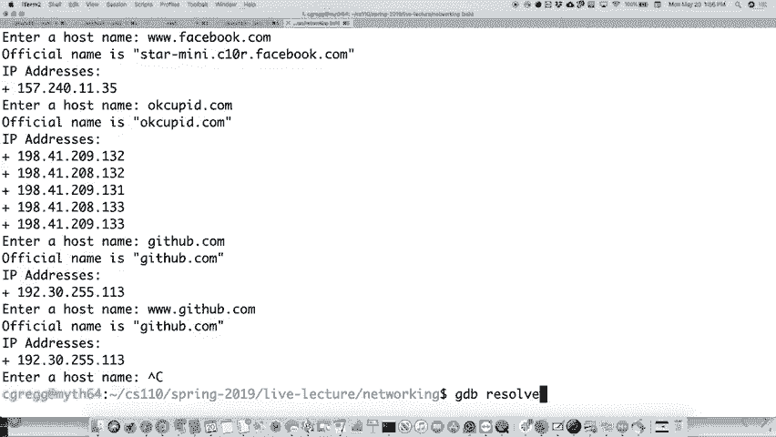

 Okay。 Break on publish。 IP address info。 I think there we go。 All right。

 Let's run it again。 Let's do Stanford。edu。 Actually， let's do it。 Let's do it。 Let's do it。

 All right。

 Let's do the， let's do the， okay， keep one just to see。 Okay， qubit。com。

 Okay。 So if we go into the code and we get the host name， okay， if we print out HE， it's just。

 a pointer。 All right。

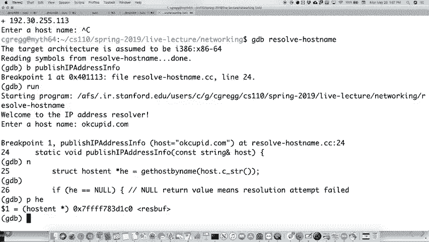

 If we print out host HE like that， it tells you all the details there。 Okay。

 So it tells there in this case the name， that's just a pointer to the name。

 And then the aliases are in， there's no， it turns out there's no aliases。 I believe if we do。

 let's see how we're going to do this。 We're going to do a star。 HE， let's do the star。 HE， arrow。

 HE， alias is。

 See if that works。 Yeah。 So the first there are no aliases turns out。 And then let's see。

 The H address type happens to be two。 In that case， that one means the IP version four。

 And then the length is four bytes。 So we know how long the address is。 And then the address list is。

 remember we said it was a char star。

 But if we just said， try to do this， ADDR list like that， it's going to be kind of garbage-y， right？

 Because we don't really know what it is。 I think you're going to have to actually do something like this。

 See if this works。 Let's see if we can do this。 We're going to have to cast it。 I know。

 It gets ugly， right？ We have to cast it to a--， what is it here？ It is a struct， i-n-a-d-d-r。

 Struct， i-n-a-d-d-r star， maybe？

 Nope。 [INAUDIBLE]， It's going to be--， nope， oh no。 Let's see。 I did this earlier。

 I figured this out earlier。

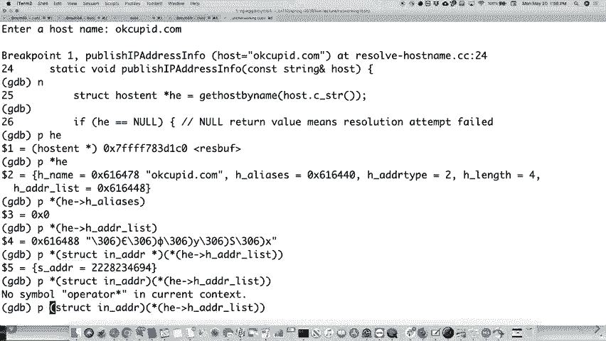

 OK。 That's that。 Maybe we need to do--。

 let's see。 Let's just go--， [INAUDIBLE]， Hang on。 This the only-- like this one？

 It's going to be that well。 It's going to be the same thing if I do--。

 if I--， if I did--， hang on。 OK。 So that's that one。 And then if we want to then--。

 let's see。 So let's print out what each one of those is。

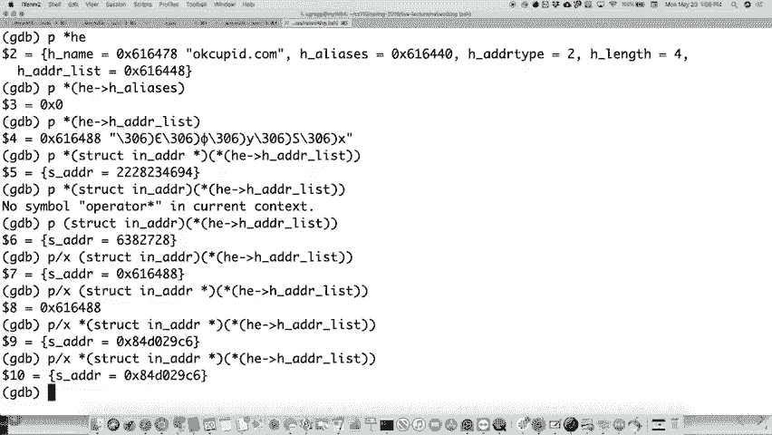

 P0x84--， 132。 Was that one of the OK， keep it once？

 It is。 132。

 And then let's see。 84d0--。

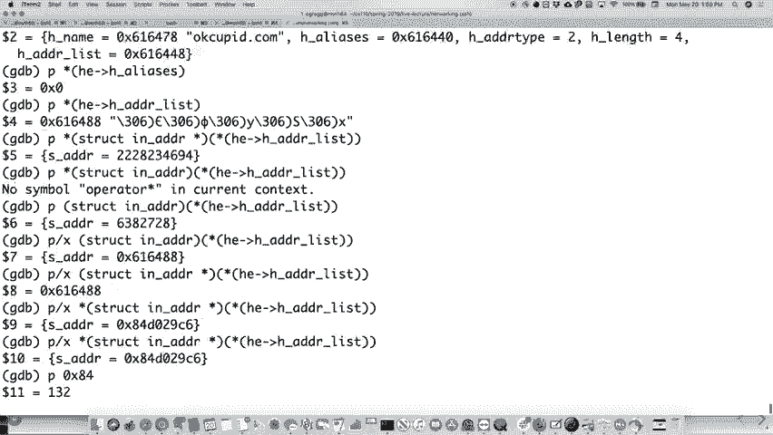

 208。 Yeah。 What are the other ones？ It's 41 and 198。 So we should get 41 should be 29。

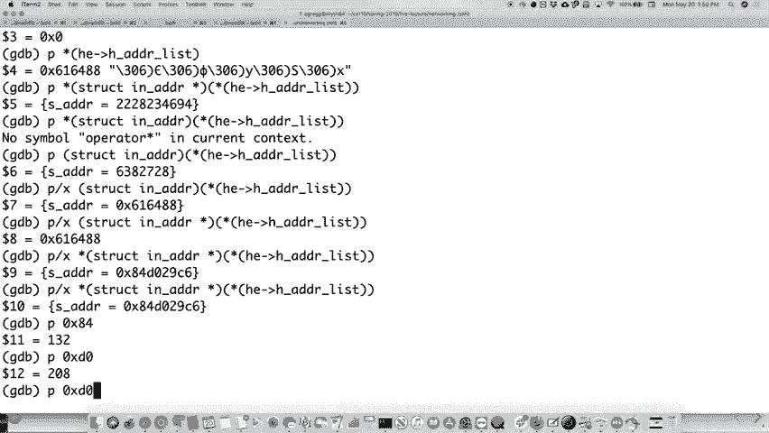

 And then C6 should be 198。

 OK。 Notice the order it's in。 It's in the wrong order。 It's backwards。 Well。

 the function that we called earlier that i net， underscore ntop function actually。

 knows that it's in the wrong--， no， there's in the little endian format。

 And then gives us the correct string back。 OK。 But we haven't yet actually converted--。

 like send anything over the network yet。 Yeah。 [INAUDIBLE]， Yeah。

 It knows that by the time it gets into that number， it's whatever the computer's representation is。

 So in this case， little nd。 When we actually send it across the network。

 we have to turn it into a big nd number。 You have to do that so that everybody knows how to--。

 [INAUDIBLE]， Why big and not little？ Somebody made that decision。 I mean。

 so do you know where the little ending and big， ending comes from？ You guys need to take more。 See。

 this is so supposedly Stanford is a liberal arts， university。 That's what I understand。

 But it comes from Gulliver's Travels。 So in Gulliver's Travels， there were。

 the little Indians and the big Indians who cracked their eggs， either on the big end。

 to open them up， or like their hard-well or soft-well， of eggs or whatever， or the little endian。

 And they got a big fight over it。 And so somebody who ever is creating this said， oh。

 it looks like the little end is there。 Oh， I remember this。 Oh。

 and this is also going to cause a big fight。 And that's why we get questions like， why？

 What does it matter， and so forth。 So it was actually a perfect analogy， which turns out。

 That's where it comes from as turns out。 OK， so while we're at it， let's look at the hostname 6。cc。

 which is the-- oops--。

 then resolve hostname 6。cc。 Let's look at this。 When we kind of look at this one already a little bit。

 if we want to do IP version 6 addresses， we can actually look at them。

 We have to actually use a get hostname。 We got hostname 2 and tell it。

 We're looking for an I and a 6 address。 And then we have to check and make sure。

 that's an I and a 6 address， an IP version 6 address。 And then same sort of thing here。

 We can use this function。 It knows how to convert IP version 6s。

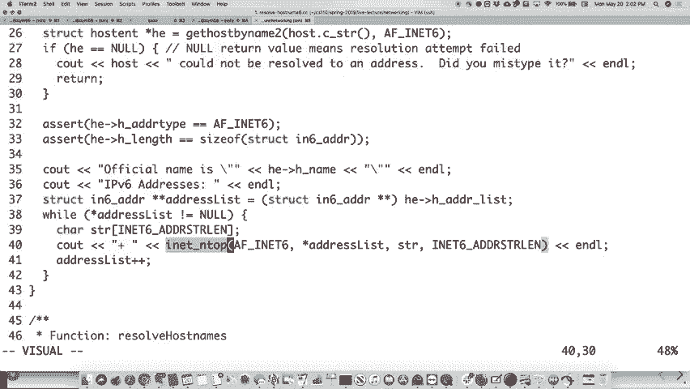

 Let's see that one as we run it。 Let's actually do it on DDB just to see the difference。

 Resolve hostname 6。

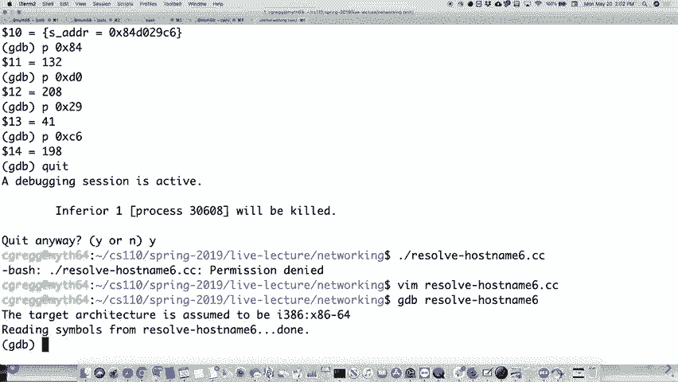

 Let's first run it and see hostname， google。com。 There's google。com's address。 Now。

 there's 128 bits here。 This is a pretty big。 128 divided by 8 is 16。 That would mean 16。

 There's not 16 here。 There's one， two， three， four， five， six， seven， basically seven， eight。

 because it takes about 9， 10。 And there's a little extra double colons in there。

 This is a decision they made to try to make the IP version 6， number smaller。

 If there's a bunch of zeros in a row， you can actually put two colons and just look。

 all the rest of the zeros in there。 I still think it's almost impossible for a human。

 to figure out exactly what all that means。 It's not impossible， but it's just like。

 you got a rock your brain about， where's the zeros， and how do they fit in？

 And it was probably an uninspired decision， as far as I'm concerned。 But some places， actually。

 when they remember an IP version， 6 address， there's 128 bits available， which。

 is 2 to the 128 different addresses。 Actually， let me go to here。 Got the number in here。

 There it is。

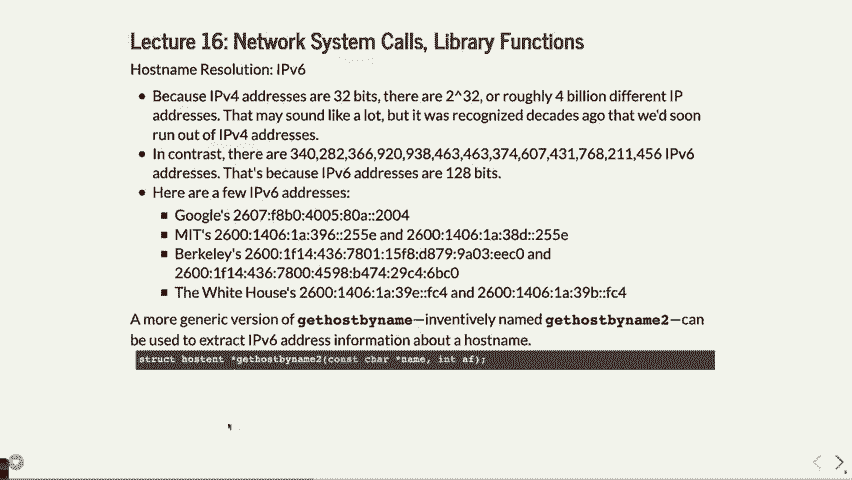

 There are this many different IP addresses， that you can now have。

 That number is bigger than the number of protons or atoms， in the universe， I believe。

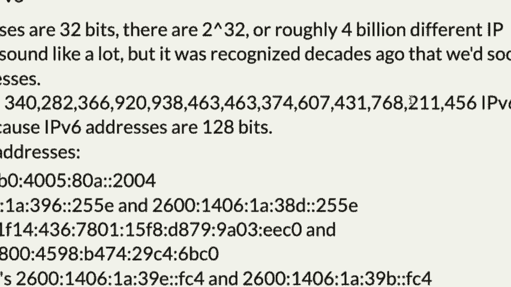

 So you will be able to assign every atom in the universe， an IP version 6 if you'd like。

 So I doubt we'll run out of them， at least in our lifetimes。 But you never know， I suppose。

 But they look at it。 So if you're a big enough company and you have enough cloud。

 you can actually ask for a particular IP version 6。 And why would you care about that？ Facebook。com。

 Take a look at Facebook's IP version 6 address。

 It actually says Facebook in it， which is like， oh， how clever， how nice is that。 And again。

 I don't even know why they didn't put just， two double colons。 Again。

 I don't understand how these things are。

 How these things are figured out。 But maybe someday they'll just have vanity IP addresses。

 and you can get one for your phone or whatever。

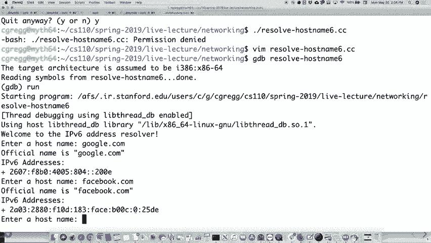

 Not that you actually care， but people of Facebook， I guess， care about these things。

 Let's just run it。 Let's break on the same function as before。 Publish IP address info。

 And then-- oh， no。 Is it not there？ Hang on。 Then。 Then。 Then resolve host name 6。

 They say it is called-- let's see。

 Publish-- oh， of course。 Publish IPV6。 Info。 Let me do that。 All right。 Break on that。

 and then run it。 And yes， we're going to start it， and let's try Google again。

 Notice I didn't do Stanford。 Wait， let me show you Stanford。 Yes。 Stanford。edu。 Continue。

 I don't know if it has it yet。 Just kind of too bad。 But anyway， that's the way that goes。

 Let's see。 Host name。 We'll try it again。 Google。com。 OK。 Google。com。 OK。

 So you do the get host name， and then there， and then there。 And then we have to-- again， we have。

 to cast it to the struct i and address 6。 And that we have to actually do it。

 So if we just type again--， let's see， pi_print_out_he。

 It will give us the fact that it， has got a length of 16 for the number of bytes。

 and the actual address list， and so forth。 So there are some differences that you go into that。

 Yeah， it has to。 When you do cast it as the struct i， and 6 address star star。

 it's because you're able to do， just address list。 Well， that's correct。 Right。 Good question。

 Take a look at the struct--。

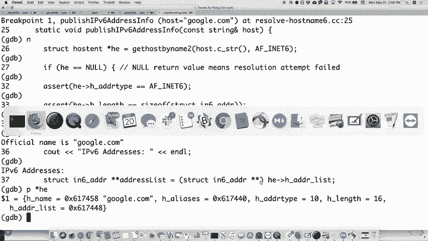

 where did it go？ There it is。 OK。 So this is cast to a char star star。

 It's not cast to what it really is。 Why is it cast to really-- why is it cast to really what。

 it really is？ Because we want this to be generic enough。

 to work with both IP version 4 and IP version 6， and any other one that you want。

 There's actually another one that's IP。 I think it's just got a--， I think it's i-- what is it here？

 It's not i and address。

 It's i and addr_unix。 And it's its own type， meaning that you。

 can use sockets like internal to a computer。 And it's another way of doing that。 So again。

 this server thing is pretty robust。 But it's robust enough that there's。

 some weird details in here that you kind of have to get to know。

 But does that make sense about that？ Why you'd have to do that？ Mr。--， [INAUDIBLE]。

 How come you were going to do address list plus plus？ Yeah。

 You can do address list plus plus because it knows now， that it's this type of strong。 Right？

 Once you do that， if you didn't do that， it would try to do one character at a time。

 and it would get all screwed up。 Again， 107 stuff。 Yeah。 [INAUDIBLE]。

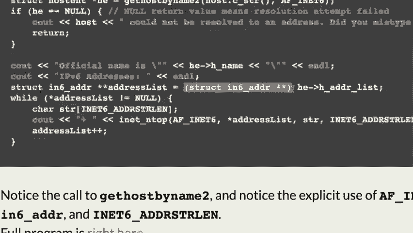

 I don't know what happened to version 5。 I mean， that's a good question。

 This could be deadly。 But what happened happened to the IPV5？ IP-- why is there no IP？

 Yeah， it might be like Windows 9。 Let's see。 Doesn't exist， so there is no IP version 5。 Let's see。

 It was intentionally skipped to avoid confusion。 There was an experimental protocol called the internet。

 stream protocol defined in 1190。 And therefore， it was assigned IP version 5。

 And we don't use that anymore。 So they said， oh， let's skip it。 Use 6。

 Has nothing to do with those four bytes or six bytes or anything。

 like that if that was one thing you were thinking。 So that's it。 OK。 That works。 All right。

 I know this stuff is definitely a bit crazy。

 So anyway， we've run a bunch of these here。 Now， let's talk about the sockets themselves。

 When you are creating a socket-- remember we did？ We had the accept command and we had the create socket。

 and so forth。 We are going to look at those in a little bit of detail。

 to see how they're actually built。 We're going to look at the create client socket。

 and create server socket。 Now remember， they are two very different things。

 When you are creating a client socket， what you are trying to do is you're。

 trying to reach out to some other computer， and connect to that computer's IP address and port。

 So you're trying to actually go， let， me make a connection with some other computer。

 That's when you're creating the client socket。 You're trying to create the client socket。

 When you are a host， if you're trying， to do the create server socket， all you need to do。

 is get your local port number and try to assign it， to yourself。 We call that binding it。

 We'll see how that works。 So you don't actually reach out and get anybody。

 when you're doing a server。 So you're basically saying， hey， I'm here。 Please。

 I'm listening for people to connect to me。 Or other computers to connect to me。

 That's the big difference there。 Now， of course， we have different types of sockets here。

 This is also， again， where it gets a little bit pokey。 We have a generic socket。

 The generic socket is struct-socket-dress。 And it has its first element--。

 its first member is this unsigned short called SA family。 It's a two-byte value called SA family。

 which， is going to be the--， this is going to say what protocol it is。

 Then we have a really bizarre SA data 14 bytes worth。 But that's it。

 It doesn't say anything else about that， except that it says there's 14 bytes there。 And you say。

 oh， all right， maybe that 14 bytes， is going to be useful for something。 I don't really see。

 Then we have struct-socket-dress-in for internet。 This is the IP version for version。

 And it also has as its first two bytes， the family， the internet socket internet family。

 And then it then has a port number associated with it。

 And then it has one of these struct-i and addresses， which we saw earlier， sine ADDR， which。

 says the actual four-byte internet address in it。 Remember， it says weird。

 It's four bytes and not-- it's actually a struct， which is weird。

 And then it has eight bytes worth of zeros。 And they're defined to be zeros。

 And it turns out they're completely ignored， although most people actually just do set them to zero。

 because it says zero in the name。 And so they figure out I should probably just set it to zero。

 It actually probably doesn't matter one bit。 They're completely ignored。 So what is that？ Well。

 I don't know。 We'll see。 Let's count the bytes， first of all。

 Let's see if this actually does anything。 How many bytes is a short？ Two。 Short's another two。

 There's four。 How many bytes is an unsigned in， which is the INRS？ Four。 So that's eight total。

 And then there's eight more。 So that's 16。 And then up here， we add two there and 14 there。

 So that's 16。 OK， that sounds like it might make sense。 Let's look at the internet version。

 sixth version。 Well， it also has the first two bytes as the family。

 Then it's got the first two bytes as the port。 Remember， ports are only two bytes。

 either whether you're， using IP version 6 or 4。 And then it's got a struct IN6 address。

 And that's going to be sign a sin 6 address。 How big is 128 bytes？ And how big is 128 bits in bytes。

 rather？ 16。 16 plus 4 is 20 plus 2 is 22 plus 2 is 24。 Plus another 4 is 28 for this one。

 Is that 16？ No。

 I have no idea why this is the case。 It turns out that it really doesn't matter。

 that there's this 14 byte one there。 I think there has to be something there。

 to make the compilation work right。 That's about all I can figure out。

 The various resources I've looked at said， and it just kind of doesn't matter。 So whatever。

 [INAUDIBLE]， What's what？ [INAUDIBLE]， Oh， sorry。 Flow info and scope ID。

 I'm not even sure what those are。 Those are specific things to IP version 6。

 The nice thing about this part of this thing， is that it is generic enough so you can have this that。

 has extra stuff in it。 Flow info might have something to do with the actual back。

 and forth between the server and client。 Maybe it's more efficient than something else。

 And they wanted to add it in there。 Scope ID might be something else too。 I just don't know。

 But it's beyond a scope of this class。 No pun intended。

 But it's just extra information that goes along with it there。 OK。

 So that's what a SOC address looks like。 We've got this generic one， which。

 doesn't seem to do much for us， except that it has， this family in there。

 And then we've got these other ones， that have the family as well as the first two bytes。

 and then extra stuff in them。 That's the important stuff。 In fact， there's not just two。

 There's this other Unix one and there's other ones as well。

 Socket is a very generic type of structure。 OK。 So that's that。 Anyway， as I said， the version 6。

1 has some other stuff in it。 You will rarely ever declare variables that are of this type。 OK。

 This is kind of like an abstract class or something， in Java or those sorts of things。

 where you've got this， definition that you will never actually use。

 It's just there so that other things that are--， that kind of inherent from it can be used。 OK。

 So you will rarely ever do an actual SOC ADDR。 You'll do the one you want for the particular socket。

 you're trying to create。 OK。 And Linux actually does kind of one set for both。

 because they want to make it generic。 OK。 What you're going to have to do-- and we'll see this。

 when we actually write the code--， is you are going to have to do some casting associated。

 with these to get the right value out。 Now， if you remember from CS107， all。

 of that casting you would have had to do， when you did generic functions。

 There are times when you are， say， writing a function that， has two void star pointers。

 where you don't really know--， you know when you're writing it， but the compiler has no idea。

 what type it is， because it expects void star pointers。 You know。

 because you're the one writing the function， that， oh， really， these are char star star pointers。

 or something like that， inside the function， you will actually cast them。

 It's going to be very similar when we go and figure out， what these are。

 when we actually write these two functions， we're about to write。 All right。

 We are going to write two functions。 The one is create client socket。

 The other is create server socket。 The client socket is a little bit easier。

 even though it seems like there's more to do。 You're actually trying to reach out to this other computer。

 and connect to it。 But there's not that much really to do。

 You know that you're going to know the port number， and the address。

 And then you have to set up the socket to do it。 And that's what we're going to do。

 What we're going to do is we are going to confirm， that we can actually talk to the IP address。

 Well， confirm that the IP address exists for that host。

 We're going to try to go to some host and we're going to go up。 We need the IP address。

 Let's see if it exists。 Then we are going to allocate a new descriptor。

 This is exactly like except very different from a regular descriptor， file descriptor。

 It's just like the file descriptor in that it lives in the file。

 descriptor table and it has an open file descriptor and so forth。

 But you don't use it in the same way。 It's a double。

 It's a two-way communications instead of a one-way， which most of our other descriptors were。

 You use this system call called socket， to actually configure a socket descriptor。

 When you use socket， it doesn't actually， talk to any other computer yet。

 It just sets up the socket so that you can， populate it with the right details。 And then use it。

 Then we have to create an instance of socket address， underscore IN if we're doing IPv4。

 And then that packages up the host and port number。

 That packages all the details that we're going to connect to。 We'll do that。

 And then now you've got this socket that you've set up。

 Now you can actually go and connect it to the other computer。 That's what we're going to do。

 And then if all goes well， you return that socket to whatever。

 program or whatever function requested it。 OK？ Question。 Is that it？ Conceptually。

 how is this different from just setting up， a server in a client like we did？ Yeah， good question。

 The question is conceptually， how is this different than setting， up？

 Now we're doing the details of setting it up。 So we actually called these functions before。

 Now we're actually going to go and dig in and go， what do I look like？

 And that's where all this other stuff that we had to get to， is involved。 Good question。

 So the socket descriptor， the thousand of the files。

 A socket descriptor lives in the file of the descriptor table。 The type is a socket。

 So it's not a read file， write only file， et cetera。 It's a socket。

 And it's got more details associated with it because it。

 needs to be too way and potentially connect other， computers and so forth。

 But because pretty much everything in Unix is a file， they still made it a file。

 even though you can't use it， quite like you would in your local file descriptor。 All right。

 let's actually do this。 OK。 Let's go and do this one now。

 Let's see。 We want to do client sockets。cc。

 OK。 This one is here。 You've also got this code so you can follow one as we do this。

 We are going to do struct host and hv equals get host by name。 And then the name that we passed in。

 host。cster， like that。 Which is exactly what we did。 We've talked about for 10 minutes earlier。

 Because we're trying to just figure out if it's there。 All right。 If he is no。

 we're just going to return negative one， which， said， look， we didn't get it。

 We don't know what address you're talking about。 And then hopefully whoever's calling create client circuit。

 is paying attention to the return value and then knows， oops。

 I didn't get the socket that I requested。 And then we do in s equals。

 And this is where we call the socket function to set up the， socket。 In this case。

 we're doing afinet。 And then we're doing SOC stream。 And then let me talk about that in a second。

 SOC stream is basically telling the operating system， please， please。

 please handle this the way the regular old， internet works。 And you might say， well。

 how does a regular， internet work？ Well， I'm going to tell you。

 When you send data between two computers， you don't send one long stream of data like all at once。

 until you're done。 I mean， you kind of do。 But what happens in the way they've set it up is it's sent。

 in packets。 A packet can be very sizes。 I think most--。

 I'm not exactly sure how big a packet is right now。

 It might be something like 128 bytes or something like that。 It's relatively small。

 but it made it 512。 But it has information about the data。 It has a packet number。

 And it has information about the data itself。 And then it has some of that data。

 And you send a whole bunch of these packets off to some， computer。

 And they all take different paths around the internet。 Many of them go on the same path。

 because it happens to be， the shortest path。 But it might not。

 And some of your packets may go down one path。 Some might go down another path。

 And they all meet up at the computer where they're trying。

 to be heard in the one you're sending them to。 And they may end up in the wrong order。

 If they end up in the wrong order， it actually doesn't， matter， because the other computer is going。

 OK， I'm， going to listen for all these packets。 And if I get packet two first。

 I'm just going to hold it， aside until I get packet one。

 And then I'm going to know that I got packets one and two。

 And I'm going to order them all when I get them。 And sometimes packets get dropped。 In fact。

 packets get dropped all the time。 Some computer goes down， or there's a glitch somewhere。

 or whatever。 If a packet gets lost， there's a time out associated with that。 On both ends。

 as it turns out。 When a receiving computer gets a packet， it sends an， acknowledgment packet back。

 It says， I got your packet number three。 And then the sending computer goes， OK， packet three got。

 three。 And it checks it off the list。 If the receiving computer doesn't get packet three， it。

 waits a little bit of time。 And then sends a-- actually， it just waits。 I believe。

 It just sits there and waits。 It's the sending computer that says， oh， I never got an。

 acknowledgment。 I better send another packet。 And it keeps sending them until it gets through。

 And that's sometimes why I can take your file。 That's sometimes why your file is buffers and so forth。

 Question。 But is it-- what is the accepting packet that's lost？ Yeah， a good question。

 That's such a good question。 What if the acknowledgment packet gets lost？

 It's exactly the same thing。 The sending computer says， oh， they never got my thing。

 They send another one。 And then the receiving computer， if it gets two packet， three。

 it ignores one of them。 It ignores the second one。 It's because I already got it。

 So it's robust in that sense。 There is a problem called the--。

 it's called-- why am I blanking on it？ The-- let me think about this for a second。 Say again？

 Is this forward？ No， no， no。 The Byzantine Emperor's problem。 That's what it is。 You know。

 Byzantine generals problem。 Again， liberal arts education。 The Byzantine generals problem is。

 what happens if there's two generals on two hills， and they both want to， and they want。

 to coordinate attacking a valley。 And they have to agree on the time。

 They have to attack the valley。 And let's say one general sends a message to the other general。

 and says， we're going to attack at 7 a。m。 And the other one sends a message back that says， OK。

 we know we're going to attack at 7。 But what if then you never get those like acknowledgments？

 And even if you do， how does the one who sent the acknowledgment。

 know that the other one got the acknowledgment？ And then like-- so you can never quite exactly coordinate。

 So there's always-- there's a little bit of an issue there。 But generally， you send how many total。

 bites you want at the beginning， and hopefully that gets through。

 and you get an acknowledgment on that， and whatever。 It turns out it works out OK， as it turns out。

 But that's how it works。 So basically， you send a bunch of these packets on。

 Here's what Sockstream does。 Sockstream says to the operating system。

 please take care of all of the details of that packet back， and forth for me。

 If you don't want them to the operating system to do that。

 let's say instead you wanted to handle it all yourself。

 You just want to send the packet and let them go in the order， they're in and go and do that。

 There's more work for you to do， especially if you want， to keep everything。

 like make sure that the other end got， the packet。 You have to do all that。

 And you may want to do that。 Let's say you're sending video data or something。

 and you don't care about every bite or every packet。 Maybe you want to do that。

 You want to send it that way。 You can say， hey， I'll take care of it。

 because it doesn't matter that ever a few bites of the video， gets a little blurry for a second。

 Who cares， at least it continues， instead， of having to be slowed down by this acknowledgment business。

 and all that。 So there are reasons to do that。 We will only stick to SOC string， in this case。

 All right？ OK， so that's that if S is less than 0。 Again， that means we had a problem。

 Return negative 1。 Now we have to do struct SOC address， and address。

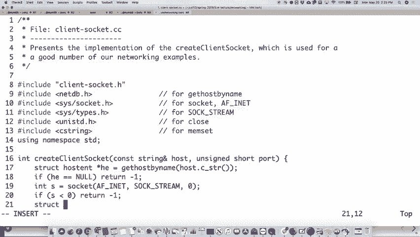

 And we need to populate this address we're creating here。

 because we're actually going to use it to do the connection。 So we are going to do this。 Now。

 the first thing we're going to do， is memset and percent address 0 size of struct SOC address。

 And like that-- actually， I guess we can just do--， I have that in private， but you also just。

 do size of address。

 I think both would work。 We're doing that just in 0 out of memory。 Again。

 it probably doesn't matter， as it turns out。 But we just do it because it says， hey。

 these things should be 0。

 It's not actually a matter。 I think we fill in all the bytes anyway， because it turns out。 OK。

 Then we're going to do address。internet， basically， socket internet family equals affinet。

 And then we are going to do address。sonport equals。 Now。

 here's where we need to make it into a network number。 When we're going to set up the socket。

 we have to make sure that it's correct for the network order。

 I'm not sure why they couldn't just make the connect thing do this。

 But you need to actually do the following。 You need to just say， htonsport。

 And that stands for-- it stands for--， let's see， h-- forget now。 The host-- yeah。

 host to network short。 It's going to convert the port to the correct address。

 Going to flip those two bytes， as it turns out。 If you were building this on a big M in machine。

 that would be a no operation function。 It would actually do nothing。

 because it's already in that order。

 That's the way it goes。 OK。 So we have to do that。

 All right。 So then we're going to do the address equals。 OK。 Ready for this？

 We have to now cast it appropriately。 Two， we have to cast it to a struct， internet， a， d， d， r。

 like that， h， e， h， e， r。

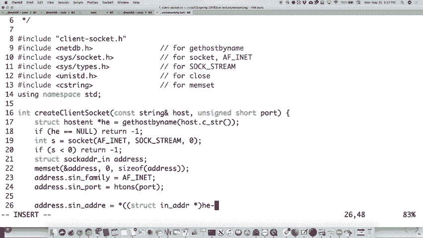

 Why are we doing-- oops， what do I do here？ Hang on。 A sign， a， d， d， r， equals。 There。

 did I forget the number of-- yes， I did。 I must have forgotten on there， but we won't yet。

 So now we are casting that 4 by int we got to an actual struct。

 to make sure it goes into the struct correctly。 Why？ Because it's a struct and not actually an int。

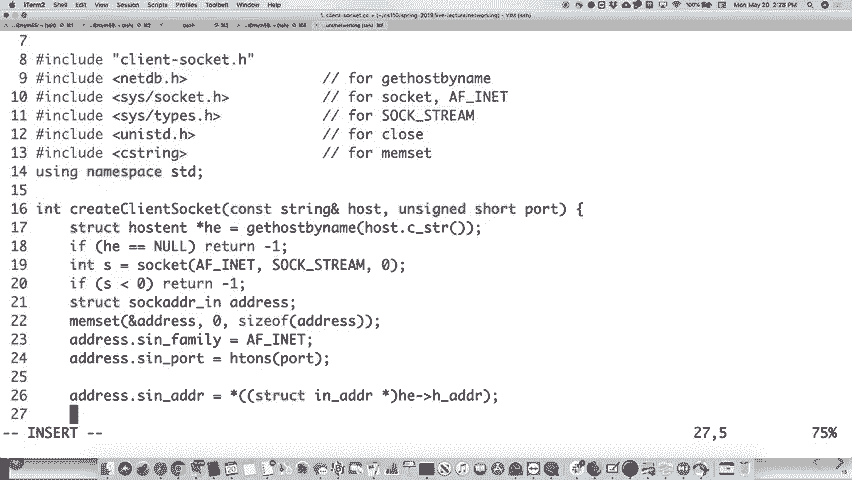

 So it goes。 So we do that。 And then we call this connect function。 If， connect。

 We are passing in the socket that we don't--， it has nothing associated with it yet。

 We are about to do that。 We have another cast we have to do here， struct， sock， address， star。

 This is basically down casting it。 It's losing information in the big picture。

 It's losing information when you do this in the sense。

 that the compiler is going to be looking for a sock address， instead of a sock address i n。

 And you say， well， how do you ever get that information back？ Well。

 let's talk about that after you do this line， size of address， and equals equals 0。

 That's the actual connect line。 How does the socket-- or sorry， the connect function。

 know that we are doing internet version 4？ That's the question。 How does it know？

 What did we say was the same about every one of these？ The first two bytes is always the address。

 family。 So if we know that the first two bytes are always， in address， I mean。

 we know that structs always， have to be in the order of the members。

 We can actually look at that first member， and say that member must be the type。

 And then inside the connect function， as well if the type is internet address 4。

 let's handle it this way。 If it's 6， we'll handle it this way。 If it's units， we'll end up this way。

 et cetera。 So it tells that by knowing what it is。 All right。 OK， if that's a return 0。

 meaning that we--， or sorry， return s， meaning that we actually， got the correct socket for now。

 [INAUDIBLE]， Yeah。 OK， how does it know？ We are creating this up here。 Now。

 it's one of the types of internet address family， set up like structs， right？

 The first two bytes have to be。 In fact， we set them here。 The first two bytes are the family。

 So any time you get one of these generic socket， address ones， if you look at the first two bytes。

 it will be a family。 And then you can say， oh， I know what the various families are。 Therefore。

 it must be of this type， socket address i n。 And therefore， they treat it that way。

 So the connect function needs to know the different types。 And it looks at the first two bytes。

 says， oh， that one's 2， or that one's 4， that one's 8， or whatever， and the number is。

 And then it decides internally， oh， I know what this is。 That's how it does it。 Now。

 you can't do that in C because you can't overload， function declaration types。 So therefore。

 you have to do it this wonky way。 CS107， yay。 That's what that all comes back to。 All right， now。

 if for some reason you don't get a connection--， let's say the connection actually is broken or something--。

 you have to close that socket that we created， because we opened--。

 or that descriptor because we actually， opened a descriptor using socket。 And so therefore。

 you have to close it。 So if you don't-- if you get to this line。

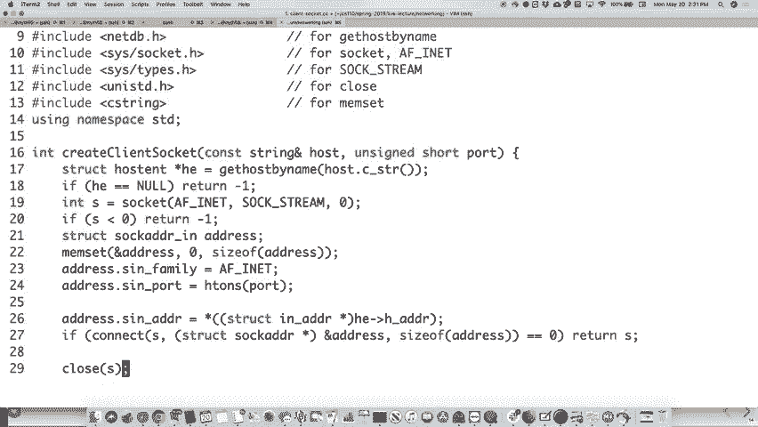

 it means something's bad， and you need to close it， and then you return negative line like that。

 Question。 So I noticed before deciding the SI and address the old--， [INAUDIBLE]， Yeah。

 Just the court you take。 I was hoping nobody would ask that question。 The question is。

 in a very good point。 In this case， you don't have to do the Indian-ness。 I think because--。

 let me think about this。 Yeah， I'm not exactly sure。 There's the reason why-- I don't know why。

 Why you have to do it up here， and you don't， have to do it down here。 I'm not 100% sure why。 Yeah。

 I'm not sure。 I'll look it up。 I'll try to look at it and see。 This works。 Well， we can try it。

 I mean， it's worked for every example we've used so far in class， so I assume it works in that case。

 OK， so what do we have？

 So that's the client connect function。

 All right， let's actually make it and see。 Did anybody see any client socket？

 See if that works。 A client socket。 OK， oh no。 Oh， I know why， because it's not-- it just。

 needs to make it into a--， if we just type make in this case， it would work。

 It's actually a library function that， doesn't need a main function。 We don't have main in that。 OK。

 any other questions on that？ Yes。 [INAUDIBLE]， Why do we close it？ [INAUDIBLE]。

 If the call succeeds， we pass it back。 The user needs to close it。

 Because you're setting up the socket， right？ So down here， you're saying。

 let's actually connect to that， computer and get-- now the socket is an open file。

 For-- it's an open file descriptor。 Or rather， it's a connected file descriptor， I should say。

 And then you pass it back to the user who uses it。 [INAUDIBLE]， Yeah， yeah， the question is。

 is that kind of like how sub-process， passes back and open file descriptor。

 so the user has to close it。 Exactly。 Notice that we do close our descriptors when we're using them。

 It turns out the screen， the socket stream， does the closing for us。 But it closes it。 Yeah。

 good point。 The using function needs to actually close it。

 Because that's the only one that knows when it's done。 OK。

 So let's now look quickly at the server socket file。

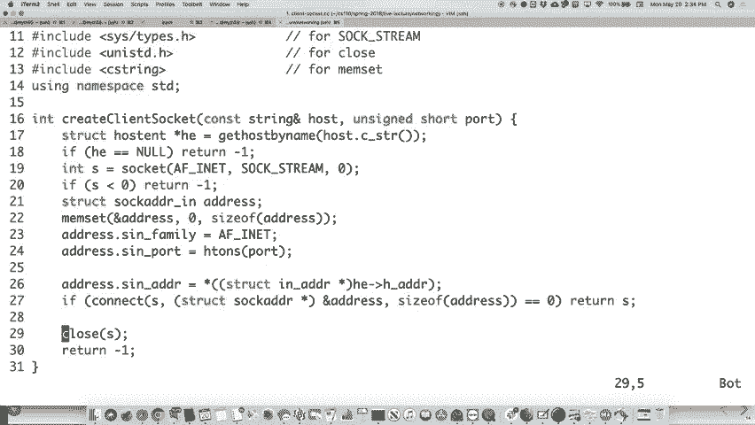

 OK。 This one's going to be somewhat similar。 But we've got a couple extra little details to do to work on here。

 OK。 So in the Create Server socket， we're， going to do basically the same thing。 And by the way。

 we're only doing internet IPV4， in this case。 AF， iNet， OK。 Sockstream， 0。

 So we don't need to get any IP address in this case。 Because the IP address is our IP address。

 We're trying to set up a server on our computer。 So it actually turns out that it doesn't matter。

 We could use one of our IP addresses。 And I say one of our IP addresses。

 Because your computer often has net more than one IP address。 If you've got Bluetooth。

 if you've got Wi-Fi， if you've got a cable， ethernet cable plugged in your computer。

 you are going to have multiple IP addresses。 So you can actually say， can that only。

 allow connections on this Wi-Fi or whatever？ Or as it turns out， you can say any。

 which we'll see in a second。 OK。 All right。 If that doesn't work。

 we are going to return negative one。 It didn't even open yet， so we don't need to actually close it。

 But if it did open， then we can go on。 We can go OK， struct。 And same things before， SOC， address。

 high， and address。 This is going to look relatively familiar。 And then we're going to M。

 set address， 0， size of address。 OK。 And then we are going to set the sign for the family。

 And this is， again， how the socket function is going to--， or in this case， the bind function。

 is going to know how to interpret our downcasted address， or downcasted SOC address。 OK。

 So we're going to do that。 And SOC family equals a， f， i net。

 OK。 And then we need to address。son address。address。address。 OK。 In this case。

 now we do need to do this。 So I'm wondering if we didn't need to do it before。 No。

 I don't think we did， because it always worked before。 I'll have to look at it。 See why this is OK。

 So what we're doing now， we are doing HTML， meaning。

 we are going to now convert the IP address that we are doing， into host to network form。

 in this case。 So now， on an ADDR， any。 We could have put our own IP address， but we don't want to。

 because we want to， just in this case， allow it to connect on any of the available ports。

 You don't have to do that if you don't want to。 And then address。son。port equals hto_n short port。

 like that。

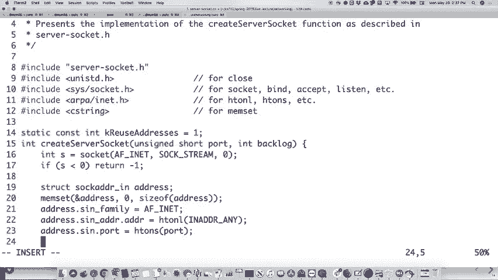

 And then now we need to make it so that we are connected， to that port for the operating system。

 And we need to make it so that we're listening to that port。 We have to do two things。

 We have to do what we call bind。 We bind the socket to the address。 And again。

 you have to downcast it。 Follows， socket， address。 And then same thing。 If that， if bind equals 0。

 and let's do another thing called， listen。 The listen system call says， OK。

 now you've got this port， that you bound to。 Now you actually say， oh， whenever I get somebody。

 trying to connect， forward that along to my program。 And you do that with a listen。

 And then backlog。 Did we type backlog there？ Did we have backlog in there at all？ Oh。

 it's passed in。 Yeah， I'm not sure what that-- oh， I。

 think that normally we pass it in as zero or no， or whatever。 It doesn't actually matter。

 I'm not sure what the backlog one actually does。 Return S。 OK。 So in other words。

 if you can't bind to the socket， or if you can bind to it， and you can listen to it。

 return that socket we now correctly set up， to be a server socket。 Otherwise。

 we close the socket because we had a problem。

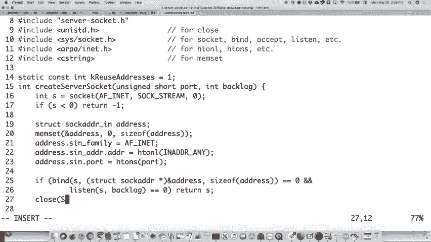

 and we return negative line。 And that's how that works， yeah， we're not。 What is line 22？

 What is line 22 do？ OK， that sets up the address that we are-- it basically。

 tells the-- in this case， it tells the bind and listen。

 function you can listen on any of my IP addresses。 That's what it means。

 It is different than any of its ports， because your computer has an IP address through the Wi-Fi。

 Your computer also， believe it or not， has an IP address through Bluetooth。

 And it also has one if you connect an ethernet port in。 So there's different IP addresses， which。

 are associated with the connection in this case。 As it turns out， I believe， I believe。

 I and ADDR any actually is zero。 So you probably didn't need to do this at all。

 But that wasn't the case in the other one。 So again， I'll look that up and let the other miss。

 And now we have set it up to start listening。 One other question。 Yes？ [INAUDIBLE]， OK。

 so let's see about your question。 Question is， what's stopping the client from connecting？

 And then reassigning things or whatever。 So remember， the client just--。

 it's a very opaque procedure。 The client is a different computer。

 that's trying to request something from the server。 And it just says， hey。

 I want to talk to port 1234。 And then if your server is listening to it。

 it just sets up a connection that says， OK， start giving me data for it。

 It doesn't do anything else locally on the other server， computer。

 You can't reach over the server computer， and change any of the ports over there。 [INAUDIBLE]， Oh。

 it can try to communicate with other ports。 [INAUDIBLE]， Well， it can try to-- well， OK。

 So let's say you send a message， a random message， to a web server on port 80。

 And you're trying to get it from-- it's only going to talk web。 Again， it's not going to try it。

 It's not going to be able to get any other information from it。

 You can take that and then pass that information， to pass that to other programs and whatever。

 And then they can talk to the web server。 It doesn't really matter in the sense that it's not going to--。

 what you do on your computer with that socket is irrelevant。 If it's all you talk web HTTP。

 then it'll be fine。 And maybe multiple programs can talk。 Sure。

 But it doesn't-- maybe I'm misunderstanding your question。 [INAUDIBLE]， [INAUDIBLE]。

 Can a server be given a socket that hasn't been requested directly？ [INAUDIBLE]， No。 I can't。

 I mean， it's local to the machine。 A socket is local to a machine。

 It happens to be maybe connecting to another machine。

 on a particular IP address on the other machine。 But that's it。

 If there's no other-- you can't request a socket。 You can't request a port that's not listening。

 first of all。 And you can't request anything that's--， stop by ready for class。 We'll check。

 Come on back。 We're ready for class。 But anyway， any other questions on this？ Sorry， but not good。

 Yeah。 [INAUDIBLE]， Yeah， I'm not exactly-- I'm not 100% sure what the backlog does。

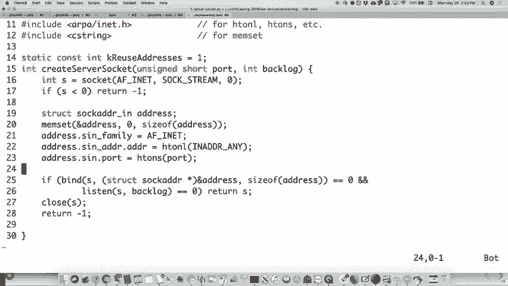

 Let's look it up。 Bind。 And bind。 Let's see。 Bind to a socket。 Let's see。

 Bind or-- is that the-- was it bind？ Hang on。 It was-- oh， it's listening。 Sorry。 Listen。

 Listen for an action。 I'm sorry。 Backlog。 OK。 The backlog argument defines the maximum length。

 to which the queue of pending connections may grow。 So basically， if a connection requests， arise。

 the queue is full of clientry。 OK。 Yeah。 So this is saying how many different connections。

 you're going to allow。 And I think the maximum is 128， actually。

 I don't think you're allowed to say do more。 But it's going to make it so that your program can take a little bit。

 of time to set up a connection。 And then the operating system will。

 keep a backlog of the other connections， and then forward them to you one at a time。

 Believe that's what it is。 Yeah。 [INAUDIBLE]， Yeah， good question。 OK。 So the question is。

 I'm getting confused about support， socket， and IP address。 OK。

 An IP address-- let's start with the reverse order。 An IP address is your computer's address。

 that the rest of the world knows about。 OK。 My IP address on this machine on Myth 64， rather。

 is IP address。

 IF config gives you the IP address。 And it's right here。 The IP before address is 171641529。

 The IP version 6 address is this big long one here。 And the scope-- ooh， the scope。

 There's where the scope comes in。 It's a link， for some reason。 So that's where your IP address is。

 It's the address the rest of the world talks on。 When somebody from the rest of the world wants to talk to you。

 they can ask for a particular port of yours。 One of your programs is listening on it。

 So maybe we want to SSH into Myth。 That's port 22。 So we go look at IP address。

 and then we look at port 22， and that gives us an SSH connection。 If we look for port 80。

 that gives us a web connection。 If we look for port 443， that's a mail connection。

 or something like that。 So that's what the port is。 It's defined as on your computer。

 what port are you listening to for various types of things。 Now， a socket is the file descriptor。

 that is associated with a connection， either to another， computer or one you're listening on。

 The socket itself is the file descriptor， that you can read and write from， and you can do both。

 as it turns out。 Does that help answer your question？ Yeah。 Good。 Yes， sir。 So we can have multiple。

 like， we can do other computers around what， are connected to a server like other words。

 and they'd be like， it would be like， what are the multiple， multiple， different sockets。

 And then the socket。 Ah， good question。 So yeah， this is a very good question。

 I haven't really talked about this yet。 The question is， wait， so we've got--。

 if multiple computers are trying to talk to you， on a particular port， because that。

 means they all have different sockets， here's what really happens。 And this。

 we kind of glossed over this。 Once you've set up a connection to another computer。

 you actually do it on a completely different port。 The only thing you do on the original port。

 is listen for connections。 Then you set up another port to go and connect。

 to the client through another port， that you can listen on and do the connection on。

 So once you set up on that initial port， then you actually hand over the connection。

 to a different port to have that connection。 So let's say you have 1。

000 different computers connected， to you， you will then have 1，000 other ports。

 that they're connecting on and talking back and forth， and you're still listening to port 80。

 for the next connection to come in。 That's what happens there。 Good question。 Yeah。 [INAUDIBLE]。

 When you want to listen to various ports， you have to do-- well， you have to do processes。

 not really。 I mean， you can listen to multiple ports， in a particular process。

 Just like you can have multiple files open。 [INAUDIBLE]， Oh， do threads share sockets？

 I believe they do。 Yes， I believe threads share sockets。 Now， it's not really going to， again。

 like in your thread pool for networking， for instance， when we do that， we set up a new connection。

 that's a different port when we do all this--， when we do the setup。

 the connection back to the client。 It's a different port altogether。 OK， any other questions？

 All right， we'll see you all Wednesday。