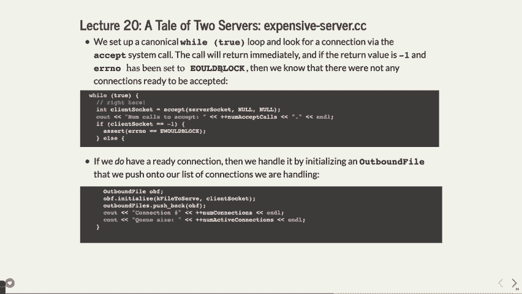

# 斯坦福大学 CS 110 计算机系统原理 Principles of Computer Systems（Spring 2019） - P21：Lecture 20 Non-blocking I_O - ___main___ - BV1ED4y1R7RJ

 Okay， all right， so we've made it to the last day。 Woohoo！

 I'll have more comments right at the end of class about what this class， where you should。

 feel that you are after taking this class and so forth。 Without raising your hands。

 unless you absolutely want to， how many people in here came in， to CS110 and what， man CS110。

 I've heard that it's so much work and it's going to， be like， yeah， I see a couple people going。

 I don't mind telling you it's going to be， not work， but it's been okay， right？

 Like you've made it and you did very well overall， I think I'm very happy with the way。

 students have done and how people have gone through the class。 As I think I might have said before。

 it's not me speaking up here that's teaching you， all this stuff。 As much as I'd love to say， well。

 I'm the one teaching you all this stuff， it's you doing。

 the assignments really is where you get the learning out of this， right？

 You don't learn about six-spend from me telling you what six-spend is， you learn about it。

 from like， wait， how does this work and how do I program？

 What's this weird race condition and why is my code stalling and why is there this deadlock。

 and whatever， you learn that from actually doing it and putting in the hard work。 So good job there。

 I'll have a couple more comments about that later。 So how's the assignment going。

 MapReduce getting there？ Okay， some people are like， I haven't started it yet。

 you should probably start it soon if， you haven't yet。 Technically it's due today。

 I put something on Piazza that said， look， no， or somebody。

 else answered this on Piazza that said that you won't have any late days until starting， Friday。

 So you still have until tomorrow without any late credit for the assignment if you're still。

 working on it。 We'll have office hours both today， right after class。

 for about an hour and then tomorrow， morning my normal regular office hours。

 I'll hold those as well。 You are welcome to stop by and chat about the assignment or about the final exam and。

 so forth。 And the exam is Monday， so it's coming up pretty quickly。

 There's not actually that much time before the exam but it's Monday。

 If you do have extenuating circumstances and need to take the later exam and so forth。

 please let me know before too long。 If you have other accommodations。

 I will email you in the next day or two about timings and， so forth。 Okay， yes， question。

 Are there going to be any office hours over the weekend？ Well， that's a good question。

 The question was， are there going to be any office hours over the weekend？

 We will definitely have something on Sunday。 I haven't talked to the CAs yet about what other plans they do。

 We'll have some。 There's also going to be a review session that I think the CAs we're talking about Saturday。

 at some point or something like that but we'll let you know as soon as we can about that。 Yeah。

 so that's that。 And then let's see what else。 We will have everything graded midweek next week as best we can before that。

 As far as one of their logistical thing for the end of term evaluations， please do that。

 if you get the chance。 I will gladly take any constructive feedback and constructive feedback is like。

 oh， you， know what， there was too much material or this material didn't make much sense when。

 you covered it。 And I mean， I'm not upset about good constructive feedback。

 It's feedback like the question is not going to help me much。 But like feedback like， hey。

 I wish you Chris would have done this or this was good but， this could have been better。

 That sort of stuff fine with me。 I'm always trying to make the class better。

 So I'll appreciate if you did that。 Let's see。 Okay。

 so today we're going to talk about a topic that's not on the final。 And in fact。

 I was looking at it。 I was going over it this morning going。 It's way too much for one lecture。

 There's actually too much stuff。 I'm going to skip some things in here and basically give you the kind of the overview。

 we have a couple of examples of this non-blocking IO。 So so far we have been talking about IO。

 In other words， reads and writes that when you send the， when you do the system call for。

 read or write with a file descriptor， it actually blocks until it gets a response or。

 and the response is some amount of data。 Now it's not always all the data you're either sending or requesting but it's some of the。

 data or at least it may， it's going to be some data and it waits until that some data。

 is actually processed， be it over the network or reading or writing a file。 And today。

 and the way we get around those limitations is we have just been doing multi。

 threading or multi processing which generally multi threading where we say， oh great， let's， run。

 we're going to have this reader write but it's going to block。 So we're going to have。

 we're going to have the ability for other threads to accept connections， or to be also doing work。

 That's how we're getting around it。 It's not the only way。

 There is this idea of having a non-blocking situation where you say I'm going to read。

 some data and it might come back with zero data but it comes back instantly。 Here it does。

 it comes back with some amount of data and we're going to see why that might。

 be an interesting idea。 And of course you can't do it just on your own program。

 there's going to be some other， things we need to have support from the kernel and from the operating system about。

 Yeah。 Question。 Yeah， good question。 This just came up on Piazza。

 There was a question on a recent final maybe last quarter actually that mentioned the term。

 I/O bound and we can contrast that with CPU bound。 Okay。 And I made a comment in the Piazza post。

 You should know what I/O bound means and maybe we haven't talked about it explicitly。

 But here's what I/O bound actually means。 It means that your processor is not chugging away doing calculations。

 It's just waiting for some input or output to happen。 And that's this idea of this weight。

 this blocking sort of idea is it takes time for， data to be processed。

 Now I've mentioned on Monday that when you're reading and writing from a hard drive it's。

 like millions of times slower than reading and writing from memory。

 And so there is some what we call latency that is involved with actually doing a read， or write。

 So something that's I/O bound means your CPU is sitting there twiddling its thumbs going。

 and I don't know what to do right now because I can't go on until I get some data so that's。

 what it means to be I/O bound。 The U bound is kind of the exact opposite。

 It means that your computer is chugging away doing something and it can't finish some function。

 until it finishes all of the calculations it needs to do or something that is taking the。

 processors time。 If something's I/O bound if you can use that processor。

 which by the way is really fast， to do some other work let's do that。

 And that's where we have multi threading and that's why having this question came up the。

 other day too about oh what happened when we had one processor how did we get this idea。

 of multi processing like multi threading how did that actually work。

 It was because your processor is so fast that it can switch between processes faster than。

 you can notice so that when you move your mouse around the screen guess what that's a。

 different process taking care of the mouse movement but you don't you can't tell because。

 it's it happens so fast and it does such a small amount of work that it looks like it's。

 just happening at the exact same time as something else。

 And on a multi process or computer like the ones we have these days it probably is but。

 on a single processor it was just that your mouse would move around and part of the time。

 that it was would have been working on your program is now spent actually moving the mouse。

 and updating the screen and so forth。 And this goes back all the way back to the mid 1980s when you bought the original of the。

 original Macintosh computer it had mouse routines that it would look just like you know something。

 would be happening in the mouse would take over for a second and you couldn't tell that。

 it was time from the processor to take the time。 Yeah。

 I mean saying something is I/O blocked is similar yes I mean the term I/O bound is well known。

 as oh you've got a processor that's doing some input output and it's bound by the fact。

 that that's low part is the input output that's really what I/O bound generally means。

 And if you can if you can make something CPU pound bound that's not not necessarily a。

 bad thing it's not neither one of these is a bad thing but being CPU bound is actually。

 harder because it's much because your computer is so fast at doing things right now if you。

 were trying to factor large numbers that that's going to be a CPU bound sort of thing because。

 you take a lot of processing to do that right and you might be that you have to factor some。

 large number and then spit it out to the processor。

 So in fact I guess the farm program that we did with multi processing had elements of it。

 that were CPU bound on the Python side right because it had to do all that factoring and。

 then it never got back to you with a response until after the CPU part was done。

 So so you can do that but knowing the difference between these two terms is going to be helpful。

 long term anyway。 So yeah。 Alright， Kathy and then we'll go back here。

 What if a program always be one of them？ Would a program always be one of them？

 A program could at certain times be CPU bound and at certain times be I/O bound but it's。

 going to be it's going to be one of the other generally。

 It's all well it's generally going to fit into one of those although you could if you。

 let's say you had you knew you were going to have a whole bunch of I/O bound threads。

 just keep doing more threads until it becomes CPU bound or the trade off is not you know。

 then that's perfect right you've got all these outstanding connections and you're you're。

 chugging away creating all your processing all these outstanding connections and you've。

 got so many that it actually is taking your process of time until you get something back。

 So yeah I mean the trade off would be or the idea would be yeah keep doing see more CPU。

 stuff while you can you know so now sometimes you don't want to do that because it takes。

 more energy and there's other you know things going on your fans or come out on your computer。

 and whatever but if you really wanted to eke out every processor cycle from your computer。

 you would keep doing more threads to be able to do that。

 I mean I could ask you you know I could ask you I could say why is networking going to。

 be I/O bound and you would probably you would have to say oh it's because it's the slower。

 part of the connection it's got to talk between two computers and it's not you and your processor。

 has to wait and we use six to spend and we use you know we use other blocking sort of。

 reads and writes and so forth so yeah。

 Other questions on that good questions。 Okay so let's talk about I/O in general and system calls。

 We have this idea that we have fast system calls okay those are the ones that return。

 immediately which means all they need to do is do some process that doesn't really involve。

 a connection or file reading or writing and so forth。

 So there are lots of examples of system calls that might do that but let's say get host。

 name or something like that that system call doesn't need to go outside the network it needs。

 to just query something that the that the kernel already knows about it just returns。

 immediately and that's the way it goes。 There's no real limit on immediately as long as it needs to do stuff as long as the processor。

 needs to be doing things or the kernel needs to be actually doing something to do that that。

 still can be considered fast even if it takes 60 seconds it still might be fast because it。

 has to do something so you're factoring a whole bunch of numbers or you're factoring。

 one number it might be still fast in the sense that it's not waiting around but the idea。

 of a slow system call is when it actually has to say I can't do anything right now until。

 something else responds to me or you know gets back with some data and so forth okay。

 So slow system calls are the ones where we don't know how long they're going to wait。

 it depends on some other resource right reading from a client might depend on some other computer。

 getting back to you and the and we want to minimize that kind of behavior if we can help， it okay。

 So calls to read are fast if they're from a local file because it's not that much but。

 you still depends on what your definition is you can still consider that slow because。

 file reading is slower than memory access and so forth but in general it's relatively fast。

 What calls are slow if it's going to a socket or if there's some internal congestion like。

 the socket is filled with lots of in going and outgoing connections and that can happen。

 when you have one port responding to all these connections like a web server often has its。

 port like it's really on the edge of oh my gosh I'm almost gonna not have enough time。

 to respond to these because just the port itself is getting lots and lots of requests。

 This is what happens when you go online to like Reddit and somebody puts a webpage and。

 they're not ready for all the connections and it like suddenly goes down it's because。

 well I just couldn't handle all the connections so we want to avoid that if we can。

 And then slow system calls in general can block indefinitely in other words you have。

 to wait for them and in that case they're considered slow。

 We've done some of this before where we've made it so that slow system calls don't matter。

 wait PID is a good one where we have that W know hang。

 Remember before when we said oh if we don't if we do wait PID without W know hang and the。

 negative one or not even the one just the W know hang it will wait until the child ends。

 and that's a slow system call because it's waiting for the child end and it just goes。

 on just gonna be off the processor until the child finishes。

 So once we start using W know hang you have some logic you have to use but it means that。

 you can get control back and just do it call it again at some other time after you've done。

 some other work and then it won't and then you get the benefit of not having to hold。

 up until that ends。 So let's see reading right with iOSocstream we've generally done it with multi threading。

 to say great do the accept call but do it on in another thread so that you can go back。

 and do another accept immediately。 Now we're gonna do it in a slightly different way okay accept and read slow the way we've。

 been doing。 So we'll see we're gonna have to work up to this by the way about how this how this works。

 So how do we actually make these slow system calls fast well we can tell the we can tell。

 the system don't wait on an accept call what does that mean it means you call accept and。

 then it returns immediately and you're responsible for doing it again if you need to actually。

 get in a connection we'll see how this works it's gonna be a lot of wild true loops with。

 some extra help from the operating system okay as we'll see and we've done some of this。

 before in other forms so it will look very similar in a big picture。

 So generally if you do accept if you set it to non blocking it can return with negative。

 one which generally means an error and often it sets remember it sets error no if you get。

 an error in this case it sets it to E would block which basically says okay it's the error。

 is that it would block except there's no connection to block on so that's the error so。

 it's not really an error but that's how you handle it we've seen that before as well。

 Same thing with read and write you can set those to be non blocking but then it becomes。

 your responsibility to call them again when you want to send more data okay now you already。

 have to do that because all the data might not get sent from your buffer anyway but in。

 this case it could be zero bytes get sent just because you it's not even ready to take。

 your request at all so it just returns immediately and at some time in the future it will send。

 the data okay so if it does if there's no more if it would block and there is data to。

 be sent still you'll get this negative one business back okay if there's no more data。

 you'll still just get zero as always okay so that's how it's gonna work let's see a couple。

 examples of this let's do talk about this little program called slow alphabet server I'm。

 not gonna type it up because of the time but here's what it's going to do we're going to。

 artificially put some delay in here of a 0。1 second delay and a tenth of a second delay which。

 is noticeable you can actually notice that and what we're gonna do is we are basically。

 going to set up a client here to we're gonna have a thread pool like we've done before right。

 and when we get a connection request all we're gonna do is set up a little output sock buffer。

 and then feed the alphabet one letter at a time with a delay in there after each letter。

 okay so what that's gonna mean it's gonna be 26 it's gonna take 26 letters it's gonna， take 2。

6 seconds to actually push out which is really slow to push 26 letters out but we're。

 artificially doing this to see why it might be a good idea to use this non-vaught index。

 okay so here's what it does it waits for a connection it has a thread pool to actually。

 handle the connection so it can request it can respond to many connections the worker is。

 slow because we put that artificial delay in there and then it closes the connection nothing。

 here is actually non-blocking but it's definitely slow because we put that delay in there okay。

 you will see this often servers in general if they're trying to serve many many web pages。

 will give a little bit of data to you and a little bit of data the next one a little bit。

 of data the next one so that it doesn't block one for too too long okay and you'll notice。

 this sometimes if you're loading a web page it loads partial data and it loads a little。

 bit of the image you're trying to download or it loads you know this this add and then。

 this add and whatever it takes a little bit of time and that's you know what happened。

 so you've seen this before okay you've seen these you've also seen buffering like on YouTube。

 which is more or less the same thing where there's just not enough data that's gotten。

 to you yet to actually give you an image or give you the the video so that's what happens。

 there okay so here's a client that we're gonna actually test okay and the client here has。

 a while loop and basically it goes and it tries to connect to the server which is going。

 to be on local host here the same machine here and then it is going to read one byte。

 at a time and then print out that byte but we have yet to do this non-blocking thing so。

 the read it's going to read it pretty fast print it out pretty fast and then go back。

 here and read it again the delay though it's going to come from the server doing really。

 slow pushing out of the data okay and that's all it's doing it's printing out this out。

 so let's actually see this if we let's see there we go okay so we have what was the name。

 of this file this one was slow alphabet if we do slow alphabet server like this in the。

 background and then we do see this one was this one was blocking alphabet client okay。

 watch what happens there's your amount of like reading the 26 bytes you could tell it。

 was slow it's actually time it okay if you time it then it will take in this case 2。6。

 seconds which makes sense we delayed for 0。1 second for letter and it's 26 letters and。

 so forth okay that shouldn't be too strange notice something in here we did put a little。

 we counted how many times we called the read right we called it 26 times mainly because。

 we asked for one character at a time okay is there a question over here oh good question。

 yeah good question so I used a little bash shortcut if you do time exclamation next or。

 do something with two exclamation it does the previous command after like it does the。

 previous command we've time for instance so it just does the last thing this would probably。

 do it twice time time yeah it does the last thing with it with the current command good。

 question okay so anyway that's what's happening with the server okay nothing is new yet okay。

 we basically done exactly what we've done before now I could do this up to 128 times before anyone。

 would actually not get 0。2 seconds because I wouldn't even I'd be able to keep doing this。

 as many times as we wanted to in fact I'm gonna cancel the server for right now but that's。

 so that's where we kind of are already nothing should be new yet everything's blocking in。

 the kind of the way it is we put this strange delay in there to kind of show that it takes。

 some time and and it could be a network connection that takes some time okay question oh good question。

 why did they use the why look I kind of wanted to show you that you have to do it one if you。

 want to do it one bite at a time if you wanted to do a stream you could but that's all hidden。

 from you and in this case and by the way it would ask for a big buffer is worth so it。

 would still wait 26 or probably 2。6 seconds but not it probably wouldn't you wouldn't be able。

 to see each letter it would probably ask for letter and then go okay I asked for the whole。

 26 at once so in this case you want to go look let's just see it one character at a time。

 all right so this is what we just ran and we saw that took 2。6 seconds and in our case。

 we're only reading one character at a time so you can see each character and you can kind。

 of perceive that it's going to be relatively slow okay so if we want to change to a non-blocking。

 equivalent of this we're going to use a function that we are going to see in a few minutes and。

 it's pretty low level but it's just called set as non-blocking so after you set up the。

 client okay you get you call this function that place some magic system calls itself。

 and says if you when you're reading from this socket don't block on it that's all it's doing。

 we'll see that in a little bit okay but you're going to do basically the same thing here when。

 you read though okay it is going to not block so you could get a negative one back okay meaning。

 that it would there was some error but the error could be that it would just block okay so you。

 could do that if you do get zero back it means that there you're still getting no or you don't。

 have any data left so that's fine they're just like normal but in this case we want to if we had。

 greater than zero we would handle it and it should be just one byte because we're still only。

 asking for one byte and that's it but the other option could be what if it's negative one so it's。

 not zero it's not zero it's not greater than zero so it's negative one check to see that it's not。

 the oh it would block because that means there's some other error the connection died or there's。

 some other error but if it is E would block then you just go all right in this case we're going to。

 log that we had an unsuccessful read and we just go and try again okay this is going to do boom。

 boom boom and try to read very fast yeah again is a sim I think he again and he would block or。

 actually the same thing as it turns out I'm not sure they could be different on different systems but。

 here's how you would figure that out by the way you would say air no - L and that lists them all。

 let's look at E would block you would block rep E would there it is it's number 11 and in this case。

 E again also 11 so it's actually redundant in this case although on different systems it might not。

 be but either one of those could get could be the error number if it's going to block E again means。

 try again basically in this case it happens to be the same number so I guess it's redundant on our。

 system good question yeah good question all right so question this is the client right this is now。

 the this is now the client they're doing so the client you know is setting it unblock now we we。

 don't we could set the server to also be non-blocking and we'll see a little bit of that later but we。

 don't care right now the server is blocking because it's still fast we've done it with a thread and。

 whatever but yeah good question yeah yeah we have to get there so this is good question good question。

 wait is there is there any advantage to this we'll see an example later unfortunately because of the。

 time I have to skip over some of the part that you can go look at the details but we'll see why this。

 why we could use that we could see we'll see why this is just another way to do a similar thing。

 we've already done is it better or not threads take a little time to spin up and threads take you。

 know multi-threading things letting the operant letting the operating system handle the waiting is。

 sometimes a better like the not the waiting but the the alerting us that there's data and so forth。

 sometimes it's just a little more efficient so new servers generally handle it the way we're。

 going to talk about just because they've decided that it's a little faster than doing that multi-threading。

 so there's just this is really just another way of doing similar things we've already done the way。

 we've already done it generally fine but if you're going to serve billions of web pages maybe you。

 want to get a little more efficient this might be better way the way we're going to show you a little。

 more efficient so long answer for why are we doing it it's another way to do it why is it important。

 okay so anyway now if we run this this is the non-blocking equivalent okay if we run this and we do the。

 let's see we still need to set up the server there's the server and if we call non-blocking alphabet。

 client okay it looks exactly the same okay but take a look at what just happened we now got 26。

 bytes back but we did what is that let's see 16 million reads in that 2。6 seconds right well。

 why is that not why is that a good or a bad thing during the time when we weren't doing those reads。

 we could have been doing other things so let's say our program needed to do something else。

 right we could have done that something else and then gone back and read again later so。

 otherwise we would have had to block right this is a dumb way to do it because we're just chugging。

 away and doing all we're doing is reads but you'll argue that maybe you want to accept input from。

 the user or something during that time instead of just blocking so the idea that this frees up time。

 for thread city here this frees up time on the main thread in this case right now could you。

 have a thread could you have called that read in a thread sure so it seems a little odd to do that。

 but you might do that and then this is same sort of thing you might need a you might need to figure。

 out when that thread ends and so forth in this case we're just saying you know what we're trying。

 to read 26 bytes oh it's going to take a while maybe we want to do something else in the meantime。

 right i mean what other things could we do non-blocking alphabet clients not that one how about non-blocking。

 alphabet client dot cc right if we do the read this is the non-blocking read okay let's say that。

 let's say that we get to here where it was unsuccessful maybe we did something else like。

 i'm doing other work right like that and whoops there we go make and let's see i don't think i。

 killed the server yet so that's that there we go it's doing other work doing other work right。

 it's you'll see there are letters in there i don't know if you saw but there were some letters。

 some fingers perched in there but look at how much work you did you know so we could you could have。

 your one thread doing more work and this is the way to do it so that's the benefit you don't。

 know threads necessary in here no thread pool no threads necessary we got the work done we did。

 have to re-ask a lot of times but we were able to do more work that's probably the bottom one。

 yeah other questions on that okay so where does that get us now well now we've seen that we can。

 actually do this okay and we see that we get millions and millions of reads and we got lots of extra。

 time because point one seconds to a computer is super duper fast okay how many is anybody in here。

 read the book super intelligence by nick bostrom one of my favorite books although it scares me to。

 death it's a book about uh one what happens when we end up creating a super intelligent。

 ai it's actually smarter than humans and uh there's lots of ramifications of that and we have to。

 maybe be a little careful about that if we want humans to actually persist but uh one of the。

 interesting things about that they mentioned this that computers are so fast that you know if you're。

 holding and i think this is the example they use in the book if you're holding a glass of water and。

 you drop it right well because your neurons are relatively slow and the processing of your you're。

 the seeing things is slow you don't get that much time to like move your hand down here and pick it up。

 because you only see so many different data points now the nice thing about your brain is it's very。

 good it's very good at integrating so if i throw a ball to you your brain actually can see the path。

 and put your hand in the right place and you're very good at that two billion years of evolution has。

 you know done a good job of that right but a computer your brain sees you know a hundred or。

 thousand different data points in the point one seconds that it takes for somebody to drop a computer。

 will see you know billions or millions of data points and so really to a computer dropping a。

 glass is like the glass is like do do do do do do and the computer's doing like oh i can do i can do。

 tons of calculations while doing that and i can you know it's so it's uh i mean that's the scary part。

 is that computers are just super duper fast right that that's things but you know but they can't love。

 not yet anyway not yet um so anyway read the read the book if you want like it's a little bit of a。

 it's a little bit of a uh uh scary book to read but but read it it's good because it talks about some。

 of things and especially if you're doing ai it's a just a great book to understand oh we might have。

 to face this some on the future but my point is during the time when this is reading waiting for。

 that slow thing to happen the computer gets to do zillions of other things which is the point here。

 okay we could handle that in a thread or we could do something but now it's just one thread doing all。

 the work okay now here's the part that i'm actually going to skip over a little bit um there is this。

 class that we are going to that is used in the other example that basically is uh going to be used。

 to show you how you can take do file reading or writing in this case uh piecemeal okay and so it's。

 basically a it's just a little uh class that has an initialization that takes a uh a file descriptor。

 and it takes the uh it takes the actual like data itself in a string format and it's going to push。

 that data to that file descriptor piecemeal like some amount of data at a time it's going to do that。

 and it's going to do that through this function called send more data and if the send more data。

 however comes back with false it means you're done sending data but the whole reason for setting。

 this up and and it's like many slides here showing you the nuances of this uh this outbound file class。

 but the big the big idea is set it up so that you say i need to send this string to this file and send。

 some and then it just continually can say send more data and it will do that kind of on its own and。

 the whole point of this is doing that so there are lots of slides here where it talks about uh the。

 details here here would be a little test program for that which basically um sets up an outbound file。

 initializes it with a uh sorry it's actually a file name that gets you ready and not not the actual。

 string but it's the file name it opens that file name up and then in this case it's going to print。

 it out to standard out whenever you call uh send more data and in this case it's going to do that now。

 it does this in a non-blocking way okay so it will send some data and then it will send some more。

 and send some more but it will try to return immediately won't try to send all of it it might send one。

 byte at a time or it might send a hundred bytes at a time but it's some amount of data so this is。

 just kind of abstracting that away so that we can use it to show what happens when we do this with。

 a server so i'm going to skip over all the all the details about this um the the basic idea or the。

 example here takes a file and shoots it out to standard out so i can actually show you what the。

 what the uh the end part of it is here if we let's see this one is uh it is outbound file test right。

 and it just prints it out to the file but it did it in piecemeal and you can't tell because there's no。

 delays in this one it just looks like cat but in this case it does it you just send one bit of it one。

 piece of the data at a time that's all that's about no the details of this you can go look at it i don't。

 think it's particularly important for getting through what we want to cover for the rest of the day here。

 so lots of this um again you have to deal with accept and so forth as part of this because you're。

 trying to send to uh that outbound uh server and uh let's see we're gonna just skip past this skip。

 past this here's the by the way here's the set as non-blocking function okay i said that it was uh i。

 said that it was low level it's another one of these system calls that's got lots of stuff in it that。

 you if you want to actually use it then you go do it but the important part is here is that you。

 call this function called f c n t l it takes in the descriptor and some other information and you。

 you give it a parameter that says hey don't block on that descriptor when you're reading or writing。

 from it so that's all that's doing uh there is set as blocking which does the exact opposite。

 and then you can check to see if something is blocking or unblock or non-blocking as well。

 low level functions don't need to worry about those details unless you care about creating them。

 you know i just use that okay uh so again we're not going to worry about the outbound file。

 distraction the idea is read a file every time you say send more data send a little bit of chunk of。

 data that's all i care that you really know about this is all blasting through that because of the。

 time but what i want to spend a little bit of time on is uh two servers that are going to utilize this。

 outbound file uh class to actually enable you to serve data quickly without threads okay so the。

 same idea as we did before or the same idea now is oh no more threads necessary let's do it okay。

 we're going to use non-blocking IO for a single threaded web server again not necessarily the。

 best way to do it but probably a little more efficient than using threads because we can do that okay。

 it's going to be responsive because there's nothing blocking here and it's also hopefully not going。

 to miss any connections okay that's because again it's got it's going to respond quickly but。

 then you're going to check many times to be able to check and make sure that you you don't have a。

 connection yet and when you do you get it and you handle it very quickly okay so let's see some of。

 the details here of this uh function um we are going to create a list of outbound files in other words。

 what this server is going to do is you have a web page and this is actually one that we can uh。

 you can use from a web browser i'll show show it to you in action in a few minutes but you're。

 gonna have a web page that basically is keeping a list of the files that you want to send out。

 so think of it like a web server saying i'm gonna go to google。com or i'm gonna go to， www。stanford。

com and request a bunch of web pages each web page that gets sent back is going to be。

 held in one of these outbound files that can get sent back piece by piece by piece okay and we're。

 gonna keep a list of those uh in this uh in this program okay so what's happening here we are。

 setting up a circuit okay or a socket rather we are uh then making it non-blocking now this is the。

 this is now the server is now doing the non-blocking part okay it's going to set up this list of files。

 that we're going to the connect the connection files the ones we want to send back it turns out。

 they're all the same file in this case but we just because we're always just gonna request the same。

 file we didn't say do a certain file specific file um remember in lab a couple weeks ago you did a。

 file server you remember that example hopefully you covered in lab or you've looked it over this is。

 the same sort of thing except now the file is all just one file basically the same same basic idea。

 okay and then we've got a little bit of either logging or some other data capture thing okay。

 there's a wild true loop in here okay the wild true loop will do an accept which will not block。

 okay and it will calculate or just do the kind of the logging again of how many times it had to go。

 through this wild loop okay if you don't have a connection it basically just goes it well if you。

 don't have a connection what we want to do is use the time now to send some data to all those files。

 so basically we're gonna go hey is anybody want to talk to me if not i'm gonna send a bunch of data。

 to the files that have already been set up that's all that's going on here okay so we set up the uh。

 we we send them out and in here we are going to push onto the list of if we do have a connection。

 here okay then we are going to uh sorry if we don't have a connection here we're going to。

 initial this one that looks like we're actually doing we are doing it when we do have that we're。

 going to just get a connection set it up push it on your data and deal with it if we don't this is。

 where we are going to send more data okay so basically uh you go and after you've tried to do a connection。

 if you set the connection up great you don't set the connection up then you push some more data to。

 all your files and just a little bit at a time and that's all that we're doing yeah um do you have a。

 yeah i'll go back side what is the background between these things except for this great client。

 this is a server remember this is the server going on here right so in this case we're accepting a。

 somebody's requesting us so we have to do the accept this is basically where in every other。

 program we've ever written we've said accept and it's just stayed right there until it gets。

 until it gets a connection right now it's going oh great i have more time to do something because。

 nobody wants to talk to me and i'm gonna do what am i gonna do if i get a connection i will set it up。

 right if i don't get a connection then or if i even if i do the next thing i'm going to do it i'm going。

 to take some time to push a bit to push out to all those files they're requesting this data and this。

 is where it's going to now is this going to take some time yes now if you have a thousand files here。

 that are being served it is going to take some time now by the way we're getting into CPU bound things。

 if your list has uh 10 or 100 000 different connections now it's got to go whipping through this。

 while loop a hundred thousand times that's going to be CPU bound because none of those calls are。

 blocking it's just i've got all this stuff to do i have to do it in this case so this is this is。

 where it would become CPU bound that's that's what's going on there okay all right let's actually run。

 this if we run this uh let's do it this way if we run this but this one is called oh uh let's see。

 hang on four i want to cancel the server before um this one's called the expensive server okay。

 let me just run it and it's saying static file server listening on port 12345 and this is mid 61。

 by the way i did restart all the myths today i had to go and like literally start half of them and。

 they were all just sitting there dead i don't know why 107 probably not because of you guys um let's do。

 this let us go to myth uh what did i say it was myth 61 and it is port 12345 and hopefully there。

 there is the file so we are serving just this one file a million times and it happens to be that。

 so if we go there and serve this file we'll do that now what's happening in here and by the way that。

 was where it was it was doing that if other people also wanted to connect that might go up if two。

 people are connecting at the same time but it's going to go through pretty fast okay what's happening。

 right now this is myth 61 let's check something uh let's see ssh myth let's see see grab myth 61。

 yes whoops yes and htop we should there we go take a look at what expensive server is doing right。

 there that 100% is my expensive server why why is my expensive server expensive。

 okay nobody's really requesting much data and what's it doing it is sitting here。

 oops let's go back one slide there we go it's sitting here in this while loop not blocking on。

 accept so it's doing this while loop again and again and again and there's no data to serve so this。

 while loop is just going nuts okay if we put a C out in there we can see a whole bunch of C out。

 statements just like we did before but what it means is that it's that if we do eight stop we are。

 getting oh there it is 100% of the work is on one core and some myth machine myth 60 whatever this is。

 is right now the fans are starting to come on and whatever and some poor 107 student doesn't get their。

 their heat balicator down or whatever um so uh so that's what that's what's happening there so。

 what do we want to do we've got this feature what did we do in the past when we wanted when we had。

 to deal with this what did we do when we want to wait for something hell we moved it off the process。

 right so we have to have this is the same thing there we have to have another operating system。

 support for this okay and this is a thing called E-pol and the E-pol family of system calls are。

 basically waiting for file descriptors okay so it's basically saying instead of doing that while。

 loop again and again and again and instead of blocking on it we are going to be able to。

 we're basically going to go and call the function we want when something happens so in other words we。

 can we're going to do some sort of waiting if we have no data to send and we have nothing else。

 going on we are going to shut the processor down or at least our process down and we're going to do。

 that okay so there's a whole bunch of functions here there's a create function that returns a file。

 the scriptor and it has this e-colo exact thing which we've used before and it sets up a。

 file descriptor that we won't that won't that we will get alerted on as it turns out it has this。

 watching facility which basically says what's happening whenever something changes so if you're。

 watching a network connection if data comes in it will get the waiting will stop okay and you actually。

 can call e-pol wait to do the waiting around okay and it's waiting until there's some time out。

 which the time out you can set so that you can go do more work and whatever okay so it's basically。

 the same sort of idea you've just now have more control over it than you would have from a blocking。

 sort of server okay there's a struct in here there's this interesting see thing called a union。

 anybody know what a union is you probably never used unions in c before it's a pretty old concept。

 and it goes back to when data was scarce like when you had the data was scarce here's what this is by。

 the way a union says this data structure can hold either something avoid star or an int or a u n 32。

 t or a u n 64 t and whichever one you happen to have in there it will be able to get out that data。

 based on which which one of these which one of these variables that you use in there so why does it do。

 that so that you can store different types of data in the same amount of space right it's going to。

 allocate enough for the entire the biggest thing even though you might only be using a four byte。

 int right you can have it all have enough space for a 64 byte int but it won't but it but it doesn't。

 need to have a different one for each one so there's an F4 in there it's just got one so look up。

 unions and why they're used you don't see them too often but when you do you have to kind。

 understand what they what they do okay we'll hold a single type of data out of the data types okay。

 what kind of events can we listen for okay and this by the way goes but this is now event based。

 things and this is we've seen events before when we have when we have signal handlers though that's。

 an event based model but in this case we can say for a file the file is available for reading or。

 it's available for writing and we can also have it what's called edge triggered and if you saw。

 say if you took CS 107E you would have heard of edge triggered before but that means that you。

 actually get like an event on a change in the descriptor okay versus what like what type of data。

 you're looking for this is saying hey I want to do it when I get the data okay so what are we going。

 to do we are going to set this up now where we have the the server itself main is not really going to。

 change okay for this server it's going to set up the the socket and with create server。

 server socket in this case and then it is going to run this server so this is just kind of abstracting。

 in a way decomposing it a little bit okay run server is going to set things as non-blocking。

 okay and then it sets this watch set of what we're blocking it's going to build the watch set which。

 I will see in a second based on that server socket that we have okay what's happening with the build。

 initial watch set we are setting up some E pole in other words to watch for that thing changing。

 okay and then there's some other it's basically setting up the the union and the struct there in。

 this case the struct and then it's calling this E pole control to set it up think of it in a very。

 similar way to six suspend how you have to do the six the the set just set up the signals that you。

 want to block and so forth same idea different topic but basically same exact idea and again。

 I'm not asking to memorize this stuff right now or know how to use it but just know that it's possible。

 to do this okay all right the next thing we're going to do is we are actually going to still do。

 our wild true we're going to have these events we are going to have the number of events get。

 triggered by this weight thing here okay we might have a timeout on there to say just wait until。

 there's a timeout so that we can go do data as well you don't want to time it out but it could。

 timeout and if it does well it'll just go on and do the next next part okay you can actually get。

 many events triggered at exactly the same time think of it it's the same thing is the child。

 process getting a weight PID where it returns multiple things so you should have you should。

 handle all the events here okay and when you get them triggered we handle the events one at a time。

 using a for loop so basically the events get triggered we find those events and then we go and。

 and deal with that okay and if you get an event then you can actually in this case like consume。

 the data read from the file description you say hey what did you want to tell me right and then。

 it will do that and then you can publish the response if you don't have things to read in if。

 you're just trying to write it out okay so what else is this and there's a lot of code here I know。

 this is a lot of code that you have to do but you have to see but basically we are setting up the。

 except there's a new except call by the way called except for which has this non-block。

 parameter thing in there yeah mark of course oh sorry go ahead。

 yeah well you'll see in a second why this is still non-block it's not waiting in the same sense it's。

 basically you're you're doing it so that it's allowing how should I put it it's it's not it's。

 if you it's not going and blocking on the except call you're still doing that it's just not going。

 to have to call as many it's not going to go through this loop as many times you'll see when we get a。

 little bit farther along good good question on this okay we again we do this is all set up and。

 setting up the watch list and and setting up the the acceptance so forth okay so。

 the consumer available data part is where it's going to basically do the get the connection。

 okay and we're going to set the connection up and we're going to set the connection up。

 at that point okay and it is going to and then we're also going to be able to do that's just setting。

 up the connection and getting the request and then we are going to let's see do the。

 where's here we're going to yeah still take care of the requests okay and we may have a whole。

 bunch of active connections okay that we have to do and we kept that in a map and and so forth。

 okay and then we will actually change the event based on whether or not we'd already have connections。

 again these details go look at the slides I don't want to go into all the details about the。

 how this this works under the hood but we basically are going to get requests or get the events happening。

 and the kernel is going to handle this for us okay so where do we get here published response this。

 is where we're going to actually in this case we're going to take do an actual website that we're。

 going to respond with instead of the instead of that file in this case and the publishing the response。

 is going to for all the different places that we need to send data send a little bit of data at a time。

 using the right command okay it's only going to send let's see I believe it might not let's see。

 it's going to try to send I think it actually tries to send all of it at once here but but that's that。

 and then after it sends all the data it needs to close the client okay where does that like what's。

 the whole point what's the whole point here okay in this case let's see it's not blocking in the。

 same sense we've let the we've let the kernel handle the events for us and in our case we are still。

 able to do the extra work that we want to while the kernel is waiting around for data to either come in。

 or not okay so it's not stopping us from handling this but when there isn't any data to send or。

 receive we just that we do shut down we don't need to go back to that while loop so in some sense it's。

 it's blocking in the sense that if there's nothing to be done our process turns off right but if we。

 have anything to do either sending or receiving data it will be triggered by the fact that there。

 is the kernel waiting telling us going oh you've got more stuff to send go send it you've got more。

 stuff to receive you've got a client connection coming in do that so the the while loop will not just。

 continue spinning like that it will actually block in the sense it'll block in more than one thing。

 and that's really the big idea is that it's kind of blocking on both sending the data to all our。

 different things if there's no data to send it will just wait around or if there's no accepting。

 connections to accept does that make sense Amy to your to your wise not blocking anymore it's kind。

 of blocking in the sense that it's it's not blocking but it's basically saying now we can wait for two。

 things at once whether we have to send or receive not just wait and check again and again and again。

 to see if we have connections so we're setting up these events to say we've got two events well。

 we've got at least one event which is accepting clients and depending on how many clients request。

 the data then we've got many more we've got other things to do as well every time we are able to send。

 that the the e-pull will actually call the right function to do the the work for us so our our main。

 function can just sit there and the we let the kernel tell us when to send and receive data that's。

 the big difference so that's why it's not not blocking anymore we've leveraged the fact that the kernel。

 will handle that waiting for us and our main threat doesn't need to do anything could we do more work。

 yeah sure we can continue to do more work and now we're still waiting for two things at once but。

 it's just abstracting it away a little bit that's all and I know there's a lot a lot going on here。

 to see that and the day of the code you can go and read through the code to do that here's the bottom。

 line okay the bottom line here is there are lots of ways to build a server okay we've seen a。

 a number of different ways to do this okay we can build a threaded server we can build a non-threaded。

 server and just kind of hope for the best we can build a threaded server that uses threads or uses。

 thread pool to do that which does we do know that there are going to be some blocking calls。

 and it's fine to do that again it's just maybe it's a different strategy to do that。

 but we've now seen another one where you let the kernel tell you when data needs to be sent or。

 received and then it will that'll work in a different way before I go on to more details let me show you。

 what this actually looks like in this case this is the let's see we've got the。

 efficient server I believe is what it is it's going to listen on port 3333 and if we go to what。

 was it myth 61 again myth Smith there we go 61 333 it's going to serve us this website right it。

 happened to be a website where I told that it went and pulled the image from somewhere and whatever。

 but you would be able to do that many times and for every browser window that's open it will just。

 feed a bit at a time and I think even if all of us in here tried to load that one page of the exact。

 same time on our browsers you probably wouldn't see much of a slowdown because it's just sending one。

 or two bytes of time but doing it very fast to all of you so that's how that that's that's what's going on。

 there okay so where where does that leave us in the big picture when you're building a server or when。

 you're doing anything and this is hopefully one of the big takeaways of this class it depends on your。

 own system setup what operating system are you using maybe you're using an operating system。

 doesn't support this event driven model well too bad all right Linux happens to support it right。

 maybe you have a computer that has a really fast network card and there's less waiting you're not。

 gonna do on that or maybe it's got multiple network cards or whatever what about the network itself。

 what if you are trying to serve a website through like your phone's data plan right you might have a。

 totally different idea of the best way to do that based on the actual platform so it's all about trade。

 offs and it's all about how you can do that the big idea with the server except is and respond to。

 as many connections as you can that's the big idea and respond as quickly as you can to client requests。

 okay don't block the accept and don't serve too slowly that's those are the big ideas and that's。

 the the basic idea of any server when you're setting it up okay you want to respond quickly。

 and you want to accept and you don't want to block the the user okay um。

 don't write a server that busy waits because we don't like busy waiting because it makes the fans on our。

 computer turn on right we don't like that we're going to just wasted CPU time and energy and so。

 forth okay but you have to understand some of these low level ideas when you're making this choice。

 some of you will undoubtedly go to companies that do networking as their core business right。

 some of you might end up in Cisco or some other company that has lots of networking right that's。

 happening at their Amazon web services or something like that and you'll have to understand some of。

 this low level stuff right why do you avoid busy waiting and and so forth and do you need to know。

 all the details like all that stuff I just flew through well depends but you will if you get into。

 that take CS 144 if you if you want to do that okay and you have to be smart about this too by the。

 way right this is a great comic I love this comic because it it's one of the xkcd comics that basically。

 it's this server that says hi I'm a server have you ever done this where you go to a web page on。

 your web browser on your phone and the server basically gives you tries to give you the mobile。

 version of the website but it doesn't take you to the right page takes you to like it's the main。

 website and then you're like well this is exactly what's going on here right oh boy can I help let me。

 get it oh you're a smartphone browser your browser tells the web server what kind of browser it is by。

 the way and you can spoof it in some cases too you can pretend that you're a regular computer browser。

 even though you're on your phone sometimes that's a good way to do it um I don't know if the main。

 browsers let you do that now but they might you have to do sometimes you have to delete the end but。

 it's more than that actually the reason the end shows up is because the browser your phone's browser。

 says oh I'm a web I'm a phone right and the and the client or the server goes oh I better give you。

 the paired down version even though your phones have regular full browsers on them so um anyway in。

 this case this server says um hey I've got this new mobile version and uh the phone goes wait a。

 minute you're giving me the main page and then the server just resets because it has no it's kind of。

 done like that so build your servers smart if you're gonna build servers right don't try to be too。

 fancy with them even though you've got new things like browsers and your watch browsers and so forth。

 and it's uh it's their trade-offs but be smart about that okay all right so we are a little early。

 which is great um as I said at the beginning of class you guys made it through a difficult class um。

 you can argue whether this class is more or less difficult than CS 107 or CS 103 or whatever but。

 if you weren't challenged by this class you're a smarter person than me because this is I think。

 a challenging class you should give yourself a pat on the back for doing well and making it through。

 all these crazy long assignments with 15 pages of reading and 100 files to look through and so forth。

 if you want to take more systems classes there are tons of them if this is the last systems class。

 you ever did well you should congratulate yourself on being done with that too。

 and uh and go do your AI stuff and whatever um but uh and did I tell you about Chris Peach。

 telling me that hey how important systems is to AI these days and so Chris Peach who you many of。

 you know um does AI research and CS education AI research uh and he was talking about with me。

 the other day about the fact that all of the AI that's done now uses GPUs and TensorFlow and all。

 these kind of systemsy things to do AI and he says I wish I paid more attention in 110 in those。

 systems classes or maybe I wish I wish I'd taken a parallel processing course so I could dig in a。

 little bit more to figure out what's going on or at least I understood a little bit more about how。

 this works so systems is not something that you necessarily you can do a lot of stuff without。

 knowing much systems at all but you can definitely inform what you're doing in almost any field by。

 understanding a little bit more about some of the decisions that are made and and so forth so uh so。

 let's now I'll leave you with uh with that thought uh you guys are great thank you for bearing with me。

 during my first quarter teaching this all alone I apologize if there were mistakes along the way。

 but you guys are great I will see you on Monday at the final or during the office hours today and。

 tomorrow and thank you very much。