# 斯坦福大学 CS 110 计算机系统原理 Principles of Computer Systems（Spring 2019） - P2：Lecture 2 File Systems - ___main___ - BV1ED4y1R7RJ

 Hello， hello。 Welcome。 Welcome back to day two， CS110。 So we have a lot to cover。 We。

 have a lot to cover every day。 That's one of the things about this class is that just。

 kind of there's lots and lots of material。 So a couple things I put out the first assignment。

 which we're going to talk about today。 So hopefully we'll get started on that if you。

 haven't already。 Please re-download the assignment if you downloaded it last night or like early。

 this morning。 I made a couple not critical changes but for instance I found out that for。

 whatever reason when I the PDF if you open the PDF and try to copy some of the things。

 from the some of the like commands from the PDF and then try to run it it will look like。

 your program is not working but it's because there's some hidden character in like the。

 pasted thing。 So that like confused me for a while I'm like I think my program is working。

 but it didn't look like it and so there so re-download that I think I fixed that。 That。

 would be a really annoying bug to know that your program is working fine and then it's。

 just because you copied a code and they had hidden characters in it。 So please re-download， that。

 Let's see Piazza is up and going but there's been a few questions on Piazza。 Piazza。

 is probably your first line of defense as far as trying to get information from about the。

 assignments and so forth。 I look at Piazza all the time and Tiazza look at Piazza all。

 the time and so it's a good place to kind of get started if you have a question。 Obviously。

 coming to Offsowers is a great place too but lots of questions get answered on Piazza before。

 they get answered like in Offsowers or whatever and you might as well check there。 Alright。

 So on Monday we started out with UMass and the questions afterwards kind of indicated。

 that I confused a bunch of you so I apologize about that。 I just wanted to redo just talk。

 about UMass a little bit more or UMass excuse me a little bit more just to kind of give。

 you the overview of it。 By the way this is not the most important part of the class so。

 I wanted to start with the other day not mean to confuse anybody but I just wanted to talk。

 about permissions a little bit more specifically as it relates to UMass so that I kind of unconfused。

 you or you have get your questions answered right now。 Okay。 The UMass is all about allowing。

 the user to control what the default permissions are for files。 Okay。 So it's not so much about。

 the program trying to set various permissions。 It's about the user saying hey look when a。

 program creates a file for me I don't want it to give read access to anybody in the world。

 That's up to the user to be able to like control that。 So if you go to your terminal in fact。

 we'll just do that right now and you type UMass if you hang on。 I don't know why am I hold on。

 a sec。 No。 Hang on let me try this again。 Oh that's not good。 Hold on a sec。 There we， go。 Okay。

 There we go。 Okay。 If you type UMass then it will tell you your default user permissions， right。

 And in fact remember 077 we'll go over the details in a minute means that the 0 the first。

 the second 0 after the 0 meaning it's an octal number the actual this 0 here means that the user。

 can write whatever permissions it wants。 Okay。 So it'll be read write execute whatever permissions。

 the program tries to write it will be able to write it。 The 7 in the 7 means that the group。

 and the any other people not not the owner cannot write directly to the or cannot actually。

 have those permissions set。 Okay。 So let me give you an example。 All right。 If we actually if I do。

 the following where I type touch let's say test 1。txt and then do ls-l test 1。txt。 Okay。

 Notice that it gave read write permissions when you take you touch it doesn't do the execute。

 permissions anyway。 The touch file the touch will attempt to do the user to do the read write for。

 anybody is allowed to。 You mask because 077 says you can't do that。 Okay。 But if I changed UMass to。

 0 okay well that would not now if I just actually check it right it's 0 which means that if I tried。

 to set a particular permission for the owner the or sorry the yeah the owner anybody else and the。

 group it will now allow me to。 So if I do touch test 2。txt let's see if this is different test 2。

txt。

 Guess what it set all the permissions that way。 Okay。 So it's all about the user you having control。

 over what gets set regardless of what the program tries to set。 Okay。 So in other words the touch。

 program said set the read write permissions for the owner every the group and everybody else。

 and the original UMass blocked out the setting of the permissions for the group and anybody else。

 Okay。 Does that make sense about what's going on now it's basically the UMass is saying you as the。

 user get to control this if another program tries to set the permissions it won't let it or it will。

 let it depending on what your situation is。 Yeah。 Question。

 Touch actually creates like an empty file。 Yeah。 That's all。 Yeah。 The first one here。

 Oh the first one in UMass is the it's the fact that it is， an octal number。 Yeah。

 I believe that's what it is anyway but anyway that you put a zero before。

 three digits and it means it's an octal number in Unix talk。 It's really normal it is。 What other。

 question is that？ Yeah。 Right。 So this is a good question。 So the question was wait a minute wait。

 a minute。 I thought there are all three ones where the bits were on。

 I'm gonna go over that in a second。 UMass is the reverse。 Why？ I couldn't find out。

 Like I did all the sorts of searching。 I'm like why would， this be the case？ Not exactly sure。

 The way you use it。 I'll show you in a second。 Very good question。 Yeah。 So all of them are on。

 Why aren't they in the X file？ These files were created various other， reasons。

 Like other programs created these ones。 Yeah。 So and it's it's the default for touch for instance。

 doesn't ever try to set the executable。 So that's that。 Okay。 Let's go over some more details about。

 any other big ones on this one。 Again this is not the most important part of this class so I don't。

 want to spend an hour kind of going over the nuances of it except to say that there are member。

 there are three parts to the permissions。 There's the owner in red。 Sorry for colorblind people。 I。

 apologize。 There's owner in red and then I put green for the for the group and then blue for the。

 other。 Anybody else is not in your group and not you。 And that's what it is。

 And the by the permissions， are just bits right。 So if you have a permissions if you want permissions R W dash R W dash R W dash。

 that would be one one zero one one zero one one zero or well one one zero happens to be octal six and。

 then octal six and octal six。 Okay so zero six six six would be the permissions for R W dash R W dash。

 R W dash。 Okay。 Now the mask does the reverse like it it's the reverse and again I'm not exactly sure why。

 I'm also not sure。 Oops。 I'm also not sure why the this little black。 Hang on。

 Let me see if I can't get。

 rid of that for a sec。 That is kind of weird。 Maybe that he's。 Hang on。 Let me try this。 Nope。 Well。

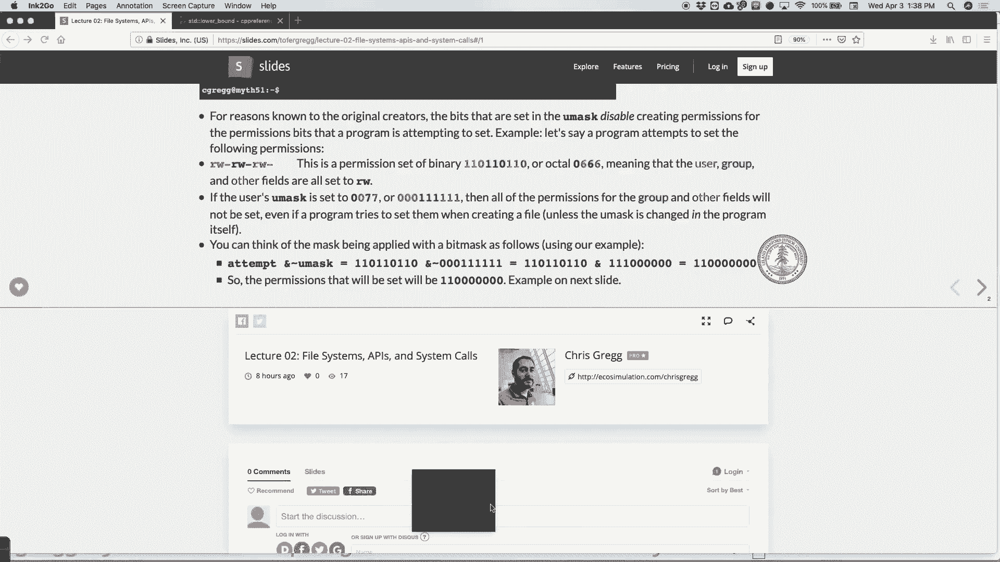

 okay it's just going to stay there for a while。 Um， hang on。 Yeah， I'm not sure why。 Well anyway。

 The。

 so the U mask is actually applied as follows。 Okay。

 so if the U mask is zero zero seven or zero seven， seven。 In other words， act all zero seven seven。

 That would be this U mask and it basically says， you're not allowed to create permissions for any of the you the group or the other。

 That's the bottom， line for it。 And what it does and kind of stinks that this is we've got this weird black box in here。

 but it basically does whatever you're attempting to set it bitwise and zip with the inverse of the。

 U mask and that's how it actually gets the actual permissions that are set。 Okay， so that's how it。

 goes and I did a little example here of if you're trying to set this R W dash R W dash R W dash and。

 you have a U mask that's zero and or zero and all ones。 Then it does the inverse of it and。

 it against that and you get the permissions out like this。 That's all there is to it。 What other。

 questions do you have on this stuff？ Yeah。 What is it？ Yeah， so let's do let me show you。

 That's a good question about what is an actual group here and again， I wish I could get rid of。

 this little thing。 I don't really know why it's even there but oh， ah-ha。 I moved it。 I moved it。

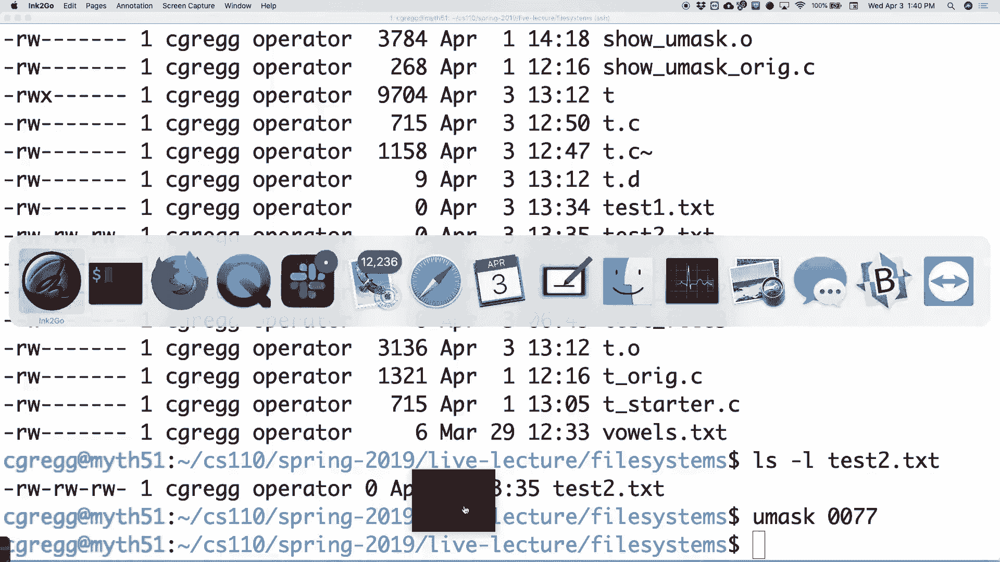

 Okay， it's gone。 All right。 All right。 I don't know why it's there， but so if you if you do the。

 following and say groups， these are all the group。 I guess the hang on。 It's just group。

 Group is it？

 No。 I thought it was groups。 Anyway， you can find out what groups you're in and if you if you。

 look at particular files， the second one over here is the actual group that your that file。

 happens to belong to。 So all does each file has a user and then has a group that many users may be。

 able to use for it。 I'm not sure what the operator one in particular is， but that's what it is。

 What other question on this？ Any more hands？ Okay， so you mask is not that important。

 It's just kind。

 of a nuanced thing。 I wanted to show you。 All right。 Okay， so if you here's another just another。

 example， I guess about this。 Basically， if you have the file that we created the other day， right。

 where it just basically tries to set a certain permissions， in this case， 0644。

 and your U mask is like， if it's zero， it will enable you to set all those permissions correctly。

 If you change your U mask， you can the same program inherits that U mask and then applies it。

 and will only allow you to set the permissions here。 Now。

 a particular program can modify the U mask。 So if the program modifies the U mask。

 then it will be able to write to it。 But it's all about。

 defaults and as long as you know what the program is attempting to do， you as the user can control。

 it。 That's the bottom line there。 Okay。 All right。 Unix file systems are interesting。

 Okay。 Assignment one。 How many people actually looked at it already？ Oh， half of you。 Okay。 If that。

 The first assignment is， well， first of all， we haven't covered enough。

 stuff for you to get to like do new CS 110 stuff for the first assignment。 But what we wanted to do。

 is give you a refresher on CS106B and CS107 and a little bit more， hey， you got to go learn some C。

 plus plus things you didn't learn in 106B。 Okay。 So that's what this assignment is all about。 All。

 right。 The assignment is meant to get you up to speed on all of this coding that you need to be able。

 to do for this class。 Okay。 So some of you have already emailed me and go， oh my gosh， I haven't。

 taken 107 in like two and a half years and whatever。 What am I going to do？ Well。

 this assignment is， going to get you back at the speed。 All right。 The assignment itself， okay。

 is kind of a fun， assignment。 It's basically called the six degrees of Kevin Bacon。

 And why is it Kevin Bacon？ Well， Kevin Bacon happens to have been in a ton of movies。

 And so if you try to link Kevin Bacon to， another actor。

 it's very hard to find more than one or two movies where Kevin Bacon was in this。

 movie with a bunch of actors。 They were in a bunch of different movies。 And then some other。

 actor happened to be in one movie with one of those actors。 And you can link them together。

 like with one movie difference。 Okay。 And so that's how the program actually works。 You can。

 you run it by saying dot slash search， which is one of the one of the files you will be working on。

 And then you type two names in， in this case it's Meryl Streep and Jack Nicholson。 And by the way。

 many actors， because you can have many people with the same name， are in the IMDB internet movie。

 database system with a little Roman numeral next to their name in parentheses。 That just means。

 that there's two or three or more Jack Nicholson's and you have to type that in。 So you have to be。

 a little bit careful。 Madonna， for instance， is another one。 If you're testing your code for this。

 before you test a particular name that you haven't tested yet， go and IMDB and look them up。 And if。

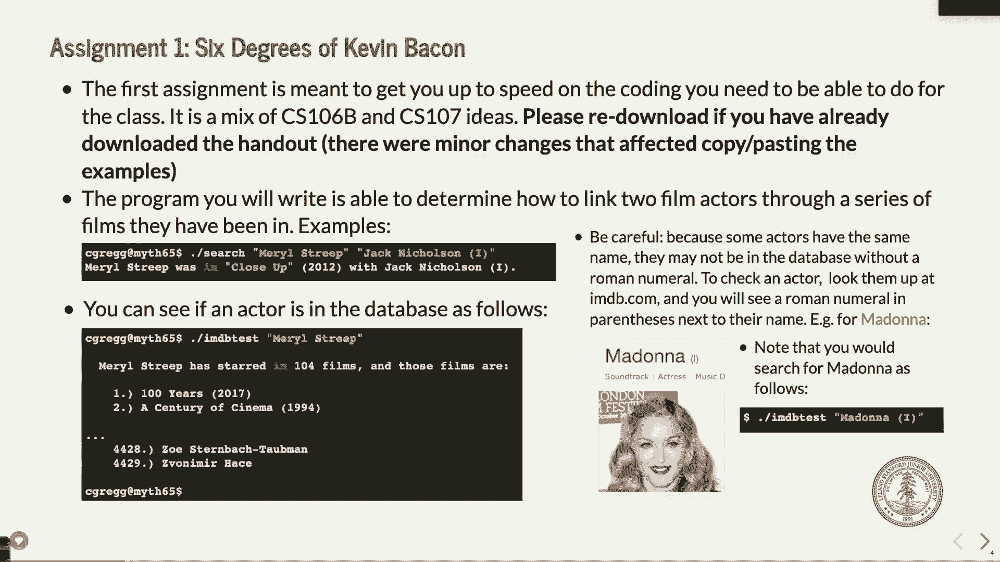

 they have a little parentheses like that next to their name， you have to type that one in or。

 the Roman numeral。 Otherwise it will say Madonna is not in the search in the files。

 And you'll think， your program is broken when really it's just you didn't type it in wrong。 Right。

 Okay。 So that's how。

 it works。 You can type dot slash search， Meryl Streep and Jack Nicholson。 And it works fine。 Let's。

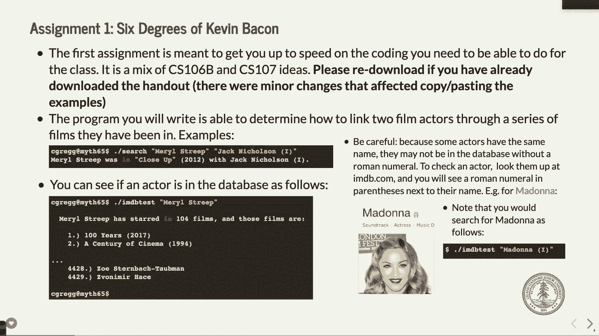

 actually do this。 Oh， no， here we go again。 Hang on。 There we go。 All right。 There we go。 All right。

 Let's see。 We will do assignments， assignment one。

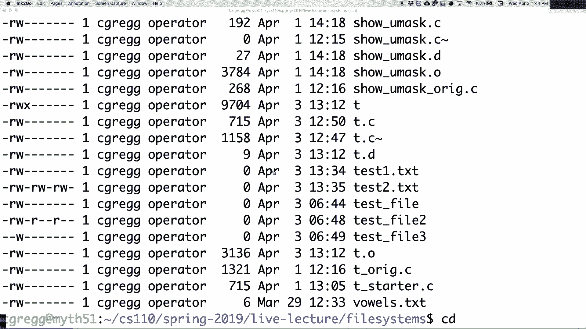

 And you can test this out yourself by doing samples， samples slash search。 And it's got the。

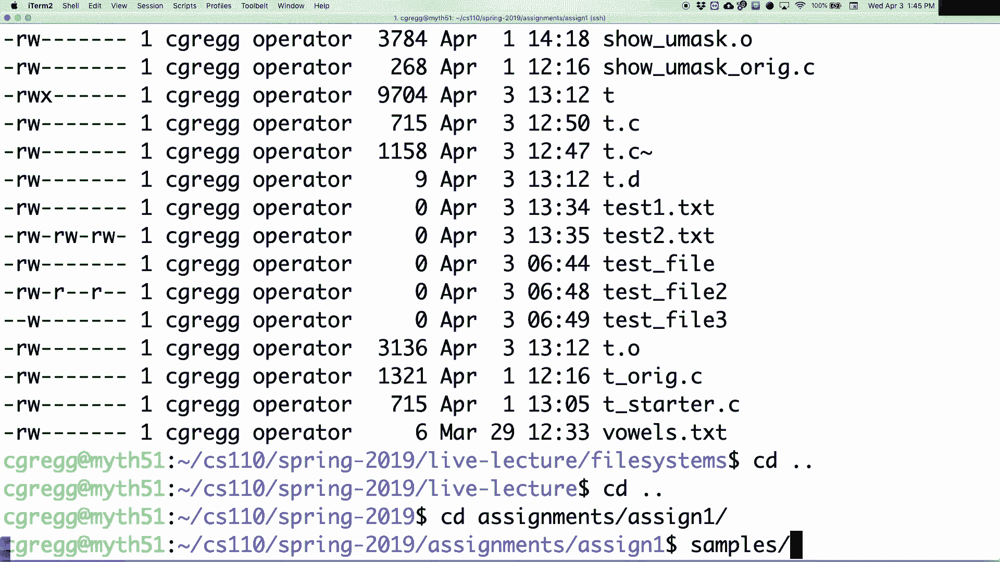

 search solution。 And if you type Meryl Streep and you to streak， streak， streak， there might be a。

 Meryl Streep。 I don't know。 And then you type Jack Nicholson parentheses one， right。 It should say。

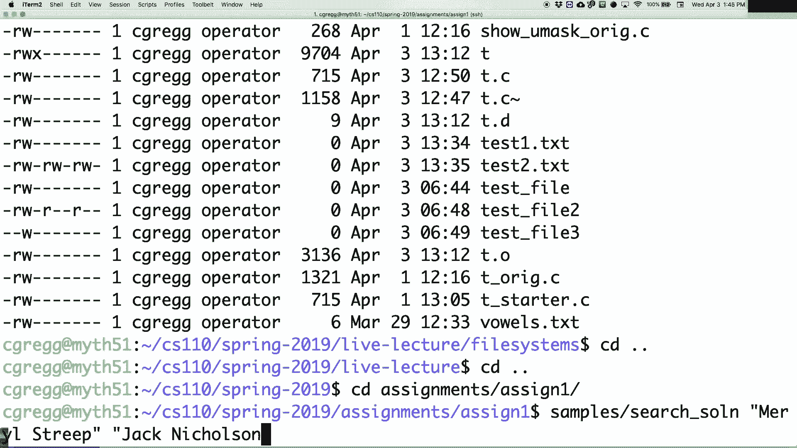

 that Meryl Streep was in close up with Jack Nicholson。 Okay。 Let's try some others。 Try to fool the。

 system。 Give me two names of actors we might have heard of just just so but give me two names。

 Jerry Kane。 Jerry Kane who talked to class before。 I think there might be more than one actually。

 And then let's try Meryl Streep。 Why not？ He probably wasn't in a， what did I do？

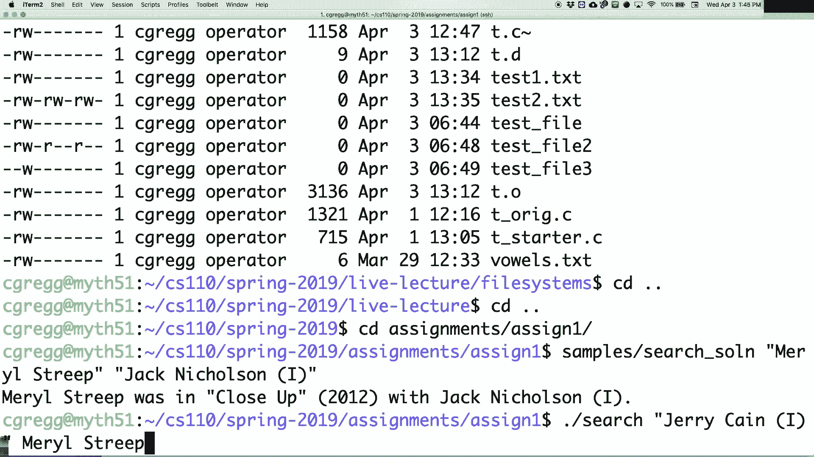

 Forgot the quotes here。 Thank you。 There we go。 Okay。 So Jerry Kane。

 one not the lecturer who's here。

 was in a movie called No Rules with somebody named Don Fry。

 Don Fry was in the Aunt bully with Meryl， Streep， right？ It's going to be really。

 it's actually really hard to find more than one or two different， movies。

 Give me some other names of people that we've heard of。 Sorry？ Michael Jordan。

 Michael Jordan was in what？ Here Jordan， or Michael Jordan？ He was in that sort of space jam。 Okay。

 There's probably more than one but let's try this。 Jordan。

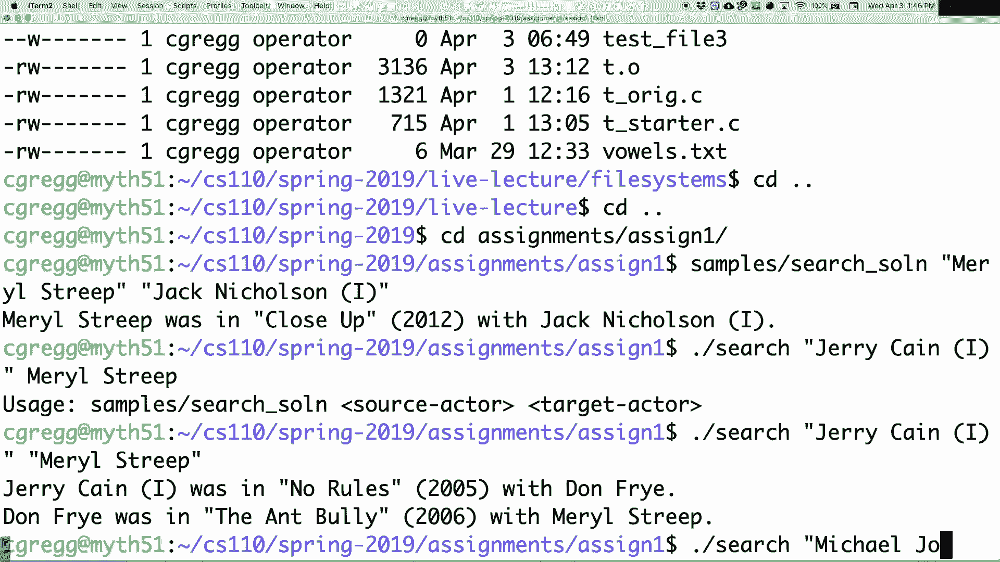

 and then anybody else？ Keanu。 Is that， did I spell it right？

 I think so。 Okay。 Couldn't find Michael Jordan because there's probably more than one。

 So we will do， let's just see if it's the first one。 I don't know。 There we go。

 Michael Jordan's in Blink， who knew。

 The Rick， I don't know how it sounds。 And that other person with chain reaction。 So it's hard。

 right？ You can go back a long way。 So let's see if Michael Jordan and let's see。

 How about Charlie Chaplin？

 All right。 That was a while ago， right？ And maybe I wonder if， I haven't tried that one yet。

 That's interesting。 That's interesting。 We'll let it go for another。

 second or so。 It might be that， hmm， I'm not sure what's going on with that。 Let me try。

 let me try it， everyone。 So I should try these things out before。 But let's just try Meryl Streep。

 And， yeah， that's interesting。 I wonder if Charlie Chaplin's not， well， it shouldn't， hmm。

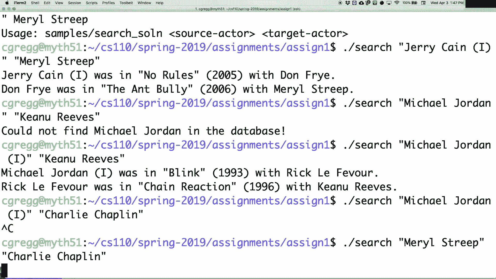

 I don't know。 That's weird。 How about Ronald Reagan？

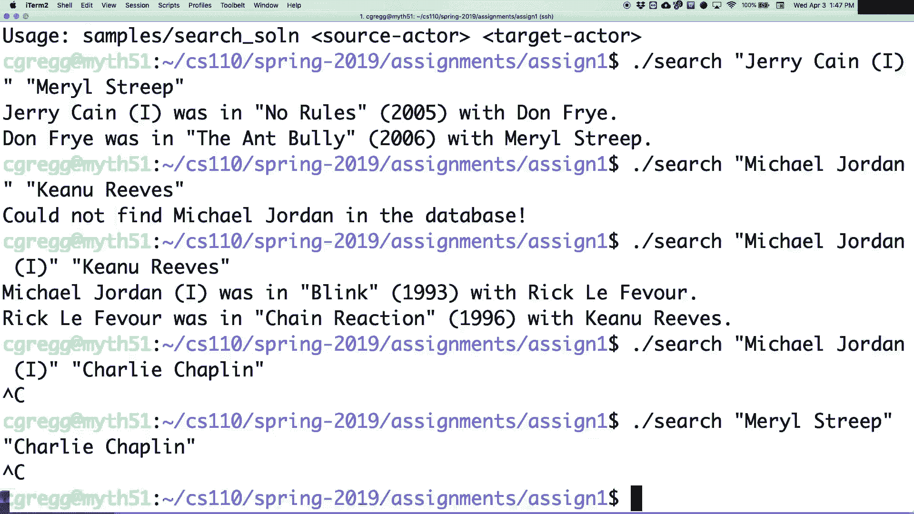

 I think something， I think it's the file system actually。 Hang on。 Let's go try again and see if。

 I don't know。 I don't know。 That's weird。 Well， anyway， you get kind of the idea。 You can。

 even though it's a little crazy。 But you can also do things like you can do IMDB tests。

 which are going to do first， which would be something like just check and see it。 Let's just， check。

 Oh， you know， is it Charles？ Now I think it's， I might be Charles。 Ah， there we go。 Maybe。

 that was the issue before。 Okay， hold on， hold on， hold on。 I don't know why I didn't tell。

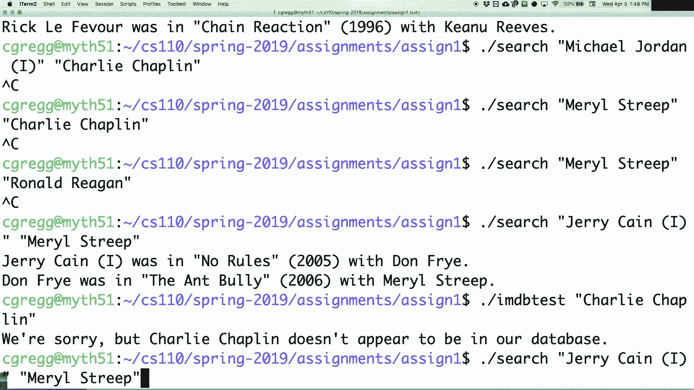

 us Charles ever。 There we go。 Okay。 Well， okay。 So here's one problem with the IMDB database。

 Charles， Charlie Chaplin didn't， wasn't alive in 2006。 He died in like 1970 or something。

 But he was， whenever somebody's in like clips in a movie， they also put him in here too。

 So it's a little bit。

 little bit trickier。 Anyway， that's it。 But you can do IMDB cert test。 And if we do。

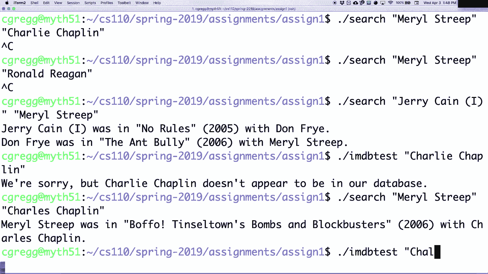

 Charles Chaplin， then it will give you the fact that he was in thousands and thousands of movies。

 and it will list them， list a bunch of them， not all of them。

 And you can test your program that way。 Okay。 So that's kind of the basic idea about the。

 about how this works。 Okay。 Let's talk about a。

 little bit more details。 There are two big files， big being hundreds of thousands of names that。

 are called， one's called the actor file， one is called the movie file。 And they are set up such。

 that you can do binary searching on them。 Okay。 The actor file has a whole bunch of offsets to。

 where various actors are located in this file。 And then there they have the name and the actor and。

 all the movies that the actor was in。 And the movie database is kind of the reverse。 It's got。

 movie， it's got a whole bunch of offsets into this file that point to movies。 And then the movie。

 say what actors they were in。 Okay。 These files are big enough that you do not want to read them。

 all in at once， number one。 But we've actually， we've actually put a lot of that under the hood。

 for you。 You don't need to worry about like the fact that you're not reading these。 Just know。

 that you're not reading， you're actually jumping to a place in the file and reading a little bit。

 But the important part about these files is that you can do a binary search on them。 They are set。

 up in alphabetical order such that you can do a binary search。 Awesome binary searches， as you know。

 from CS106B are very fast because they break things into chunks and divide and conquer， etc。

 So you have to figure out how to index correctly into this weird file that's got all these offsets。

 in it with a whole bunch of different kind of nuances to it。 And that's the CS107 part。 Okay。

 That's the part where you're going to be going， oh boy， I got to remember， I got to remember how。

 to do pointer math and pointer arithmetic and indexing into things and so forth。 So and off by one。

 errors and all that kind of stuff。 But that's the CS107 part。 Okay。 There's a C++ part where you're。

 going to use the standard template library which is similar but different from the Stanford library。

 which you used in like 106B or 106A。 Specifically you're going to have to use this function called。

 lower bound which is a standard template library function which does the binary search for you。

 In fact there was a question on Piazza already that said， hey， can we do recursion to do this。

 searching？ And I said， whoa， we know recursion necessary for searching because lower bound does。

 the recursion， does the recursion， but it does the searching the binary search for you。 Okay。

 The idea is you set up the lower bound function and it searches through your data but you have to set。

 it up correctly。 Okay。 But that's the kind of 106B plus sort of stuff that you're going to be working on。

 Okay。 This lower bound function， it's a little bit interesting。 It returns what we call an iterator。

 and an iterator for our purposes at least for this assignment is a pointer because an iterator。

 allows you to add to it and allows you to allows you to go to the next one in the line of whatever。

 you're iterating through。 That's what it does。 You will be able to learn those sorts of things。

 This， is what this week is all about。 Oh， I don't know what an iterator is yet。

 Let me learn what it is。 Okay。 Once you have figured all that out， well， you've got this。

 you're able to search through this， database。 Well， now you actually have to link after two。

 after one to actor two。 Well， how are you， going to do that？

 You're going to do a breadth first search。 Ah， more 106B stuff。 Right。 You're。

 going to have to remember how to do a breadth first search。 I'll give you a hint。 You probably。

 want to use a queue or in our case a list， which is a queue by another name as such。 So those are。

 the big things about the assignment。 Okay。 Now， let's talk a little bit more about this lower bound。

 for a couple minutes。 The assignment itself says I am requiring that you use the STL lower bound。

 algorithm。 Oh， great。 So you've got to use that to perform binary searches and that you use C++。

 lambdas， also known as anonymous functions with capture clauses to provide nameless comparison。

 functions。 And you're thinking to yourself， I have never seen that before， right？ We haven't even。

 learned it yet。 Well， I'm going to talk to you a little bit about that right now。 A C++ lambda。

 is it's a new， it's a， it's a new concept probably， if although if you've done any， JavaScript。

 you have certainly used these before， although you might not have known what they were， called。

 And what it is， is a function that is placed in line as a parameter to another function， okay。

 which it， which expects the parameter itself to be a function。 So it's kind of inception， right？

 You did all this in 107 with function pointers。 Okay。 So if you remember 107， you talked。

 about function pointers。 This is a function pointer that's in line and not like another function that。

 you're setting up。 Okay。 So for instance， you remember the Q sort function from 107， right？

 The last。

 parameter in here is a， oops， not good， is a comparison function that you have to define and。

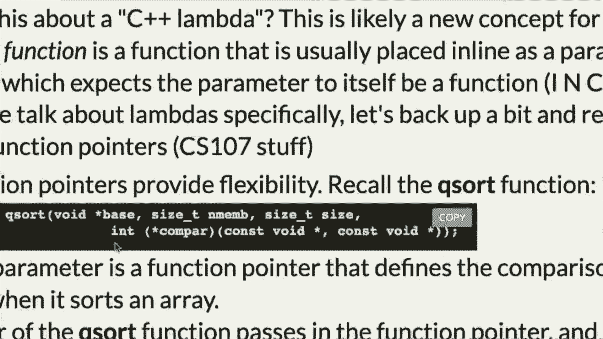

 you pass it in to Q sort。 Okay。 Q sort has no idea how that function works。

 It just knows that I have， two pointers that I'm going to pass them to this function。

 I'm going to get back which ones the， I'm going to get back a zero。

 a negative one or a one to say whether it's smaller， bigger， the same。 All it knows， right？

 And that's what function pointers are all about。 You give， give this other， function。

 the function pointer that says， "Hey， I'm going to do something for you， use it。" That's。

 all it's about。 All it is。 Okay。 That's what that's all about。 Okay。 Let's look at a little program。

 about this。 Okay。 I just made up some dumb program to do the following。 Okay。 In this program， okay。

 I created two， well， let's start with this one。 I created a function called modified VEC。

 And what it does， we're now in C++ land， so it takes in a C++ vector by reference。 Okay。

 It takes in a value and it takes in this which is C++ for function pointer。 You can think of it。

 that way。 Okay。 What it is is it says， "Give me a function that returns an integer and takes。

 two integers as parameters。" Okay。 And what it's going to do is it's going to basically loop through。

 the vector and then pass in that vector element， a reference to it as it turns out， and the， well。

 it's actually going to get to reference out。 It's going to pass in the value。

 it's going to pass in the value in the vector and then it's going to apply that operation to it。

 That's all it's doing。 It's basically updating the vector with new values based on some operation。

 Okay。 Well， what are the two operations I did？ I happen to make one called add which basically。

 returns x plus y when you pass it in。 Pretty simple。 And then subtract which does x minus y。

 That's all it does。 Okay。 Well， what is it actually， what are we actually doing in main？

 We are getting some stuff out of the command line。 And then we are creating a vector and then。

 calling the operator inside this modified vector function。 Okay。 I'm saying modify the vector。

 pass in the vector， pass in the value that I'm typing on the command line to do the operation with。

 and then the function itself。 Okay。 A key part of this is that when you call this modified。

 VEC function， even though add is a function itself， it is not getting called immediately。

 That's a key key part of this。 When you say modify back when you pass in parameter one。

 parameter two， parameter three， this is a parameter that is not being called until modified VEC。

 actually calls it directly。 Okay。 That's how this is。 That's how that's working。 Okay。

 And you can test it out by saying like function pointer add 12。 And what we'll do is it will take。

 the one， two， three， four， five， ten， a hundred thousand and add 12 to each one of those and。

 print them out。 Okay。 This should look very familiar from CS107。 Okay。 If it's not。

 if you're a little， rusty on that， okay。 Take a look at the example。

 figure out how it works and ask questions about， it if you've got them。 Okay。

 But the important part is here's where you're passing in a。

 function pointer。 Okay。 Now let's rewrite this as or using this weird thing called a lambda function。

 Okay。 Everything is the same except for this from right here to right here and then the same thing。

 on the next line。 What's happening here is we are saying， okay， great， pass in the vector。

 pass in that value and then pass in this weird thing which actually has code inside the function。

 parameter itself。 Seems kind of weird。 But it's just inline code that's going to return x plus y。

 for parameters x plus y or x and y。 Okay。 Exactly the same thing except notice I do not have an。

 add and subtract program up here or function up here。 I've just done the exact same thing， inline。

 That's what a lambda allows you to do。 Okay。 A lambda does the following， it has the。

 following signature。 It has a curly or a hang up。 It's a little hard to see here。 It has two square。

 brackets and something can go in there。 We'll talk about that in a minute。 It has a parameter list。

 parameter list and then it has some code that's in curly braces。 Okay。 That is a function that gets。

 passed into the other function as a parameter itself。 Okay。 It does not have a name associated。

 with it。 It doesn't need one。 It's right in line。 Okay。 And this is exactly what will happen。

 It's exact same program now。 Okay。 All right。 We'll talk about what this weird thing in this。

 square brackets are for a second。 Ponder that for a second。 What questions do you have about it。

 so far？ You may not have time to think through yet but questions you have about it so far。 Yeah。

 Good question。 The question was， what's the advantage of this？ Is the advantage that you can。

 write in line？ That is one advantage。 Normally these functions are short。 They're right there。

 You can look at them right there。 That's great。 Another advantage which we'll come up to is the。

 big advantage is the fact that you can do things with lambda you can't do with function pointers。

 and we'll get to that in a minute。 But yeah。 But for now I just want to introduce it and just kind。

 of， hey， this is exactly the same before。 Next we'll go into what is new。

 What are the questions you， have about that so far？ Okay。 If you are like， oh。

 I haven't seen this before。 Take a look at it again。

 and we'll get there。 Now it turns out， okay， what if， or I should say， what if we want to actually。

 utilize variables that we don't want to explicitly pass into the function and it's not necessarily just。

 a variable。 We could actually have a function call inside our lambda function。 It might use。

 something local to the original calling function。 Let me show you what I mean。 Okay。 This is what。

 we originally had。 Right。 We had a function here which took in two things。

 It took in a value and it， took in or it took in two values。 Okay。

 One of those values is coming from this vector。 The other one， we pass into the function。

 That's like the 12。 It would add 12 to each one of the， each one of the， elements in the vector。

 Okay。 But what if we wanted to change it to say， I only want to deal in my。

 function here with the actual vector element itself。

 I don't want to pass another element through using， these function parameters。 Okay。

 This as it turns out will be very hard to do。 In fact， I didn't know。

 if I know how I would do it with function， a regular old function pointer。 Okay。 What。

 and I'll show you， the example in a second。 It turns out we want modified vector in this case to also handle the value。

 that we are updating by。 In other words， we want the function that calls modified vector to handle that。

 before it even gets to our modified vector function。

 We want to like pre-line up what we've got there。 That would be really hard to do with a function pointer。

 With a lambda function， it is actually。

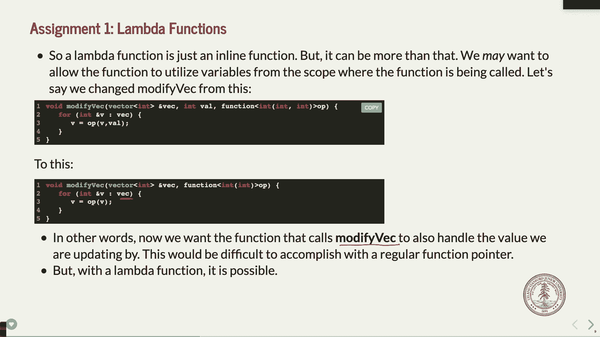

 possible。 Okay。 Here's how you might do it。 Okay。 Here's what I've done differently now。 I have。

 I've changed this up here。 So basically the function now simply says。

 give me a vector element and I， will do my operation with some other value on it。 And our knife。

 our modified vector function is， really easy。 All it needs to know is get an element out of a vector。

 pass it on to this operation， function and it's done。 And then it'll do the rest of it for us。

 But it still does add that。 Well， down here what I've said was， okay。

 and this is now the important part here， okay。 I have said， all right， pass into modified vector。

 the vector we're trying to change。 And then the following， lambda function， okay， which is this。

 It says only take one parameter x but use the value of v。

 called val from the scope of this function in the modified x function。 Okay。 How is it going to do。

 that？ It's going to say return x plus that value。 In other words。

 I am not sending value as a parameter， to modify that anymore。 Okay。

 So that's what's happening here。 The way this works is through this， idea of captures。 Okay。

 And a capture says， put something inside those square brackets that are。

 local variables or variables in scope anyway that you want to pass to the。

 to the captured or to the， lambda function that will get used in some other function。 Okay。

 In this case， I'm just passing in， val and then we're saying int x is the。

 and then we're saying in here return x plus val， semicolon and curly brace like that。

 That's what we're doing inside that function and it allows you， to do that。 Now。

 you might still say， well， it doesn't seem like it's that much different。 It turns out that it's in。

 well， it would be almost impossible to do this with a regular function， pointer number one。

 And number two， it's even more difficult to do if you are in a class function。

 trying to call a non-class function。 Okay。 It's just really hard to do。

 especially if that non-class， function expects something already handled for you that isn't part of the parameter list already。

 Okay。 So that's a lot to kind of think about right now。 There are， by the way。

 there are lots of ways， to capture multiple variables by putting them in a list like value one。

 value two， etc。 You can， also capture them by reference。

 which unfortunately looks just like a pointer， but it's not in this， area in a dress rather。

 But if you said a percent value would pass the value by reference， so you're。

 actually changing the original one， you would do this with big data structures and so forth。 Now。

 the reason I'm bringing all this up and showing you how to do this is that you do have to do it。

 for this assignment in a very， in a particular place， using that lower bound function and go back。

 to the notes here and go， "Oh， how is this stuff actually working？" Understand these， then you'll。

 be able to figure out how to do the one with the assignment。 Yeah。 [inaudible question]， Yeah。

 So let's think about what we're trying to do。 If we have a function that says， "Okay。

 you are going to give me a function pointer，" in this case， or just a function kind of。

 lambda function， "but a function pointer then only has one value， but that value is contingent on。

 something else happening in the original calling function。" In other words， this， in other words。

 this vowel variable， right？ If I can't pass that in to the function up here， how would this。

 modify VEC do that unless I was able to pass in another variable？ You， I， obviously， could have。

 done it with passing that other variable in， but they don't do it for things like lower bound。

 They say， "Here's the， here's the function signature。 You get one variable or you get one。

 function to pass in with one parameter。 You don't get any other parameters。" And you go， "Well。

 wait a， minute。 I need two parameters for this。 How am I going to pass the other one？

 How am I going to deal， with the other one？ You do it through the lambda function。" Okay。 You say。

 "Oh， I'll handle it locally， capture that variable I'm going to need。

 tell the function what to do with that variable。"。

 And then when that whole function gets passed into the other function， it all gets handled。

 as if it was kind of， it's all gets handled as a black box to the original function or the one。

 you're calling。 So it， these things are subtle， but you'll see later， in fact， when you start to。

 break the assignment， you'll get to this point and go， "I guess I could use a regular function。

 player and you go， 'Oh， I can't。 This won't work that way。 That's， that's where it's going to come。

 into play。'" What other questions do you have on this？ No？ Okay。 Look at this stuff again。

 There are， lots， there's lots of documentation on it and certainly feel free to come to office hours。

 to look at it as well。 Okay。 All right。 What other comments do we have on here？ "They are critical。

 for C++ classes。 As I said， class method variables。

 you actually can't pass them by reference at all， to other functions no matter how you do it。

 So that's going to be， you're necessary to use the， the lambda functions。

 You can capture all of the variables in a class by using the this， pointer to do that。 Okay。

 You can also， as I said， do them by one after the other。 There's some nuances。

 about how you actually need to set these up， but if you wanted to pass in this and Val and my。

 VEC by reference， that's how you would do it。 Okay。

 You'll see when you get into this and by the end， of the class， by the end of the quarter。

 you'll go， "I get these things。" But the first couple times， you see it， you go。

 "I don't know what's going on。" Go back to the slides， ask questions on Piazza。

 and then off-sars and we will figure it out。 Anything else on that？ Okay。 All right。 Let us go back。

 to where we ended up yesterday。 We're going to talk about file systems some more。 Okay。 Yesterday。

 I ended with this example， which basically was re-implementing the CP command called copy。

 And it was a pretty simple， all things considered。

 program that basically says you have file one and。

 file two and you want to copy the contents of file or you want to file two is what you're creating。

 You want to copy file one into file two as an exact copy。 Okay。 And what we did was we said， "Okay。

 fine。 We're going to get set up a file descriptor， which is just an integer。

 and we're going to use the open command to do it。 And we're going to say it's read-only。 That's。

 all I'm reading from。 We're going to do the exact same thing except we're going to create a file。

 using another file descriptor using open and using write-only O-cre-at and O-X-C-L。 We'll see。

 another one in a couple slides as well。 But this says， "Create the file if it doesn't exist already。

"， Right。 Otherwise， produce an error。 And then attempt to do the following permissions。 And that。

 may or may not work with those exact permissions based on the UMass。 Again， not super important。

 Okay。 And then what do we do？ We set up a little buffer and this buffer can be any length we want。

 We just happen to make it 1，024 because we want to save memory， let's say， but you could make it。

 bigger if you wanted to。 And then we have a while loop and there are some questions about the while。

 loop here。 This is to read 1，024 bytes from the file one after another after another or 1，000。

 1 kilobyte and another kilobyte and another kilobyte。

 And each time take that kilobyte and put it into， the output file。

 That's what the first while loop is doing。 Okay。 How does it work？ Well， it reads data。

 It reads from the input file into the buffer and the size of， in this case， 1，024。 You do not need。

 to worry about the fact that there's， oh， there might be a null character at the end or these are。

 not strings necessarily。 They're just data。 So you don't need， you can read all 1，024 bytes worth。

 Okay。 If you end up getting zero bytes back， it means there were no more bytes to read and you can end。

 Okay。 If you get any number of bytes other than zero， well， they came out of the file and you then。

 need to write them to the other file。 How do you do that？ Well， you start out and you say， okay。

 I've got the number of bytes written， which is zero。 I haven't written any yet。

 And then I'm going to do， another while loop， which is going to attempt to write all of those bytes。

 That's right here。 It's going to be right here。 It's going to try to write all of those bytes into the file at once。

 Okay。 Where it's going to do it into the output file， it's going to index so many bytes into the。

 buffer。 And the first time through this is going to be zero， of course， it's going to start and。

 try to do all 1024。 It turns out that right may only write some of those bytes。 Why？ Well。

 that's what the operating system can do。 The operating system can say， you want to write a。

 thousand 24。 I'm going to only allow you to write a byte。 Sorry。 You have to try again later。

 That's what this while loop is all about。 It's going through until you have successfully written。

 all those bytes。 Okay。 It's probably not going to fail for 1024 in a local file。 But if you try to。

 do a million bytes at once， it might say， oh， you can have half a million， and then the next time。

 you have to do another half a million。 Okay。 All right。 And by the way， the read command， as I。

 mentioned yesterday， does block until those bytes are read， at least some of those bytes are read。

 It will， if there's any bytes to be read， it will wait until some are available。

 What questions you have on this program so far？ Anything？ Nope。 Okay。 So。

 the interesting part about that is that the， this is direct and low level。

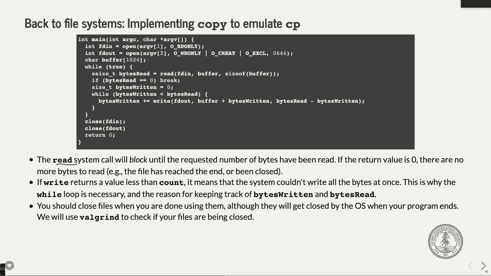

 Okay。 When I say low level， all the other things that you might have used to read and write to files。

 uses read and write under the hood to do that。 Okay。 So， if you're using file pointers， which you。

 might use in C or IO streams in C++， they are themselves using read and write to do the work。 Okay。

 They have some other nice benefits to them。 They can buffer connections。 You can go backwards。

 and forwards using a file， a star or an IO stream。 You can rewind， etc。 You can't do that with read。

 and write。 You have to like manually figure out the details of that in a library function。 So。

 read and write are going to be fast， but they're really not that developed。 Right？ You。

 have to go through that while loop to write out。 Otherwise， you may miss writing some other bytes。

 Okay。 Those are the big things about read and write。 Okay。 What are their questions？ Anything？

 All right。 So， let's move on to another program called T。 Okay。 Now， T is a program that you can。

 that you have built into Linux。 Okay。 And T works like this。 Okay。 T says does the following。

 It says。

 okay。 Take input from the command line or piped in through another file and then。

 print it out to the output and print it into any one of a number of files。 Okay。 So， for instance。

 I can say cat， let's say T。C， which is a file I have。 Cat。T。C。 No， I don't have T。C。 Hang on。 Maybe。

 not there。 Maybe if I went to the right file， let's see lecture and then file system。 There we go。

 If I type cat， T。C。 We'll print it out to the screen。 If I type cat， T。C。 And then pipe it into。

 the T program。 Okay。 What it will do is it will then say， okay， fine， I'm going to print out the。

 screen and I'm going to copy it into T2。C and T3。C and T4。C and whatever。 And it will do that。 So。

 it should print out to the screen， which it did。 And then if we look at T2。C， it's also there。 And。

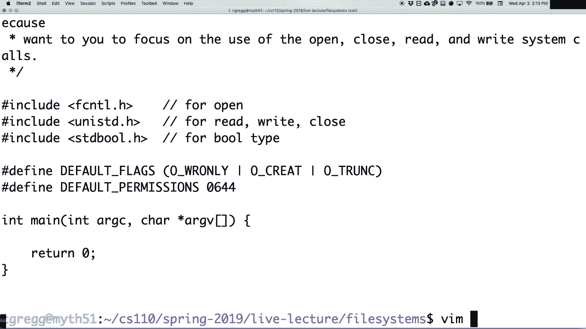

 it's same thing for T3。C and T4。C。 Okay。 Do you get the idea of what T is doing？ Yeah。

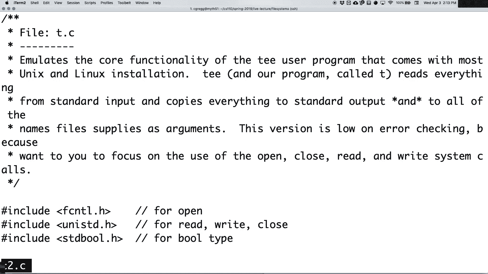

 Is it creating those new？ It's creating those。 If they already exist。 If they already exist。

 let's try。 Let's see if we， let's type file called， I don't know， d。txt and abcd。 And let's try the。

 exact same thing except now we're going to cat D into d。txt into this。txt into T2。T3 and T4。 T2。C。

 Yep。 It overrides it。 Yep。 So it doesn't care。 In that case， it overrides it。 Okay。

 So to get what's going on here， take a file that， or standard input and do that。 By the way。

 standard input is normally you typing。 That's what standard input does。 If we did the。

 same thing and I said instead of cat D。txt， I just said， okay， T2。D3。4。 Right。

 And then I start typing。 This is some text。 Right。 Well， it doubles it。 What it's did did it。

 It took that。 This is some， text and it printed out to the screen and it threw them into the files。

 And then this is some more， text。 It does the same thing until I type control D which says end of file。

 That's by the way what， that means in there。 And then if we look at， if we look at T2。C now。

 it's this is some text。 This is， some other text。 Okay。

 So standard input is you typing or getting information from the output of， another file。

 That's what the little pipe symbol does。 Okay。 You will be very familiar with that pipe。

 symbol by the end of this class。 I guarantee it。 Okay。 All right。 Let's look at T。C。 Let's actually。

 look at how we might do this。 Okay。 Well， what do I have to do？ We said take standard input。 We。

 have to figure out how to do that。 We're going to print the standard input to standard output。 We。

 have to figure out how to do that。 And then we have to open up as many files as we type on the command。

 line and then open them up and print the data to those as well。 We might want to help our function。

 for this just because it seems like there's going to be a lot of things going on here。 Okay。

 But let's， actually start this off and say， okay， fine。 Int file descriptors。

 If we have a command line， you remember that the command line is argv and argc。

 argc says how many different things you've， typed on the command line。

 The first one is the program name and the rest are the things you， typed after the program name。

 Okay。 We need to create argc number of files。 Why？ If I type， let's see， let's see this。

 If I type t abc。txt def。txt， right， we've got a file that's going to be， output。

 We've got a file for abc。txt and we've got a file for def。txt。 Three things on the command。

 line means argc is going to be three。 That's how many file descriptors we need as it turns out。

 Okay。 So let's go back up here and do that。 So we do that。 Okay。 Well， then we need to actually。

 create them those files except for standard in， right， or rather standard out in this case。 Okay。

 Because standard out is going to be created for you already。 It turns out it already exists。 Here's。

 how that works。 Okay。 FDS0 in this case equals STD0UT standard out file。 That's what it's called。

 Standard out and standard in already exists。 There are two， there are another one too。 There's。

 standard， well， there's standard in。t file。 There's also standard error dot file or standard error。

 underscore file。 That's because sometimes you want your program to print regular output and also。

 output that's an error or debugging or whatever。 Just the way it goes。

 There's three different types， of files that are created for you as we go。 Okay。

 So that's how that works。 All right。 And then， we have to open all those other files。

 So let's do it this way。 Size ti equals one。 We've already， created FDS0。 i equals one。

 i is less than argc。 i plus plus。 Okay。 And what we're going to do here。

 is we are going to say FDSi equals open argv of i。 And then now we're going to do the， okay。

 we're going to write output to these。 So write only。 Okay。 And we're going to， amount。

 we're going to bitwise or that with o create because we're creating the file。 And then。

 there's one other that we haven't seen yet called o trunk。 This is the one that says if the file。

 exists， wipe it out before you're putting the other stuff into it。

 That's what your question kind of， goes to。 And then we can say oh let's try to do 044 but we know that may or may not work。

 Okay。 That's how we're doing that。 Now we've opened all those files we're about to push out to。

 Okay。 Well let's read in the data。 Char buffer will make it 2048 this time。 Why not？ Okay。

 While true。 This is going to look very familiar to what we did before。 Okay。 While true。 S size。

 tier。 Remember that's a signed integer number of bytes red equals read。 We're going to read from。

 where standard in file number。 That's what we said。 We said we read from the input file from the。

 typing or or data piped in from another file output piped in buffer size of buffer。 Okay。

 So we do that。 Okay。 And then if num red equals zero we mean we're done because we don't。

 anything else to do。 And this is where we'll use our little helper function here to write output。

 to all those different files。 So let's see， we'll do another size t i equals zero i is less than rc。

 i plus plus we need to do all of them。 We'll do a function called write all which we'll write in a。

 second。 And then we are going to do we're going to write it out to a buffer。

 I in this case and then， or to a file descriptor。 And then the amount of bytes red。 Okay。

 And then that will do that。 Sorry， for the size of the screen。 And then we are going to let's see。

 That's on one line so that actually， will work。 And then afterwards we're done writing to all those files。

 We have to close them all。 Well， we better do another size t i equals zero i is less than rc i plus plus。

 Right。 And in this case， we're going to close fds i。 You can close the input if you want to。

 If you're done with it in your， program close it。 It's still opened in all the other programs that might be running。

 So it's not， like you're ruining anything for anybody。 Okay。

 And then now we can return zero which I might， already have in there。 Okay。 So that's that。

 Let's see if there's any issue there。 There will， probably be there will be an issue because we haven't created the write all function yet。

 But。

 let's see comparisons do not have their mathematical meaning。 Oh no。

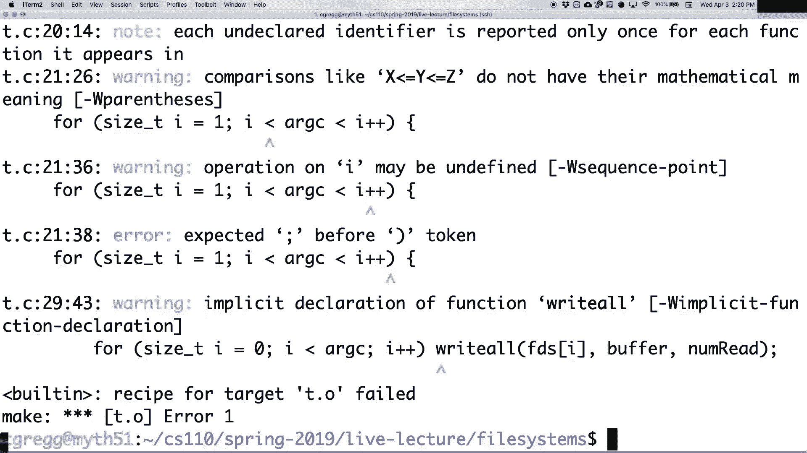

 Mind 21。 Did you guys notice that？ 21。 There we go。 Oh thank you。 Semi-colon。 There we go。 Better。

 Let's try it again。 Oops。 Oh no。 What have I done？ There we go。

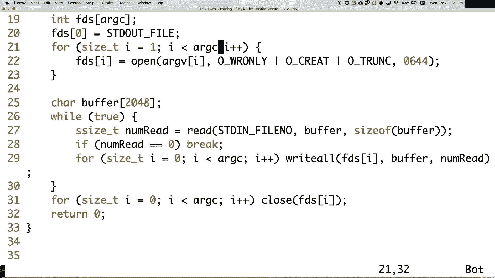

 All right。 There we go。 Implicit declaration of and standard out underscore file under， layered。

 Let's see。 Standard。 Oh。 File number is what it is。 Thank you。 I was getting it wrong。

 It is standard out file like this。 File new like that。 And the same thing。 I think the same。 There。

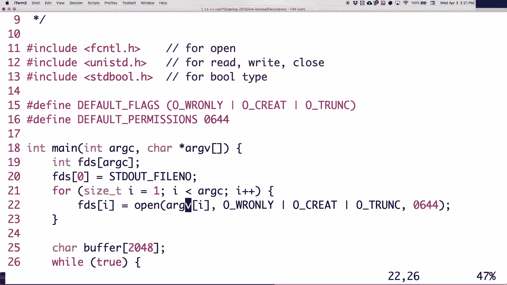

 we go。 Do the same thing。 Okay。 Let's try it again。 Okay。 So what we need to do now is just quickly。

 write that other function which is just write all which should look very familiar to the copy。

 function。 Static void write all what does a static function do？

 Remember only visible in the current file。 You should write your local functions as static。

 just because it's nice to not pop pollute the namespaces too much if you can help it。 Okay。

 We're going to do a buffer and a length。 Okay。 And in this function， we are going to do。

 the same exact thing we did before。 Size T num written equals zero。 And then while num。

 written is less than the length that was passed in， we are going to do what we're going to do。

 num written plus equals right。 We're writing that with each of those files。 Okay。 To the file。

 descriptor we passed in the buffer plus the number of bytes we've already written。 And the。

 length minus number of written bytes。 And that should do it。 And that's all our function is。

 Question。 Yeah。 Here。 Yeah。 So what does that mean？ Remember what the T command is doing。

 It's reading from， you typing which is standard input。

 So this case we have to open that file for we have to open it。

 to be able to read to or sorry we have to not open it we have to set it because it's already。

 open for you。 So we need that file descriptor。 That's how we do it。 Good question。 There are。

 questions on this before I try it。 Yeah。 No， it's an or so you can do them any order。 Totally。

 associate like that。 Good question。 Anybody else？ All right。 Let's try it。 Make。 Oh。

 it's a different。

 file。 Okay。 So T。 If I do dot slash T and then I say F file one dot T X T file to dot T X T。

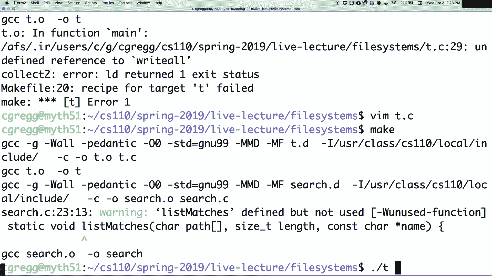

 Right。 And I start typing this is me typing more typing。 Right。 And then control D。

 I should be able。

 to look in F one dot T X T and see that that's where it works。 Okay。 So what questions do you have。

 about that？ You've now learned about started about standard file in and our standard in file。

 number and standard out file number input and output。 There's also standard error file number。 Okay。

 In our little program here， we're assuming everything succeeded but the actual code which。

 you can go look at online has more error checking。 You should probably do more error checking。 For。

 our class， we're not quite as worried about most error checking。 But you'll see in various。

 assignments when it's important。 Okay。 Other questions on that？ All right。 That is T。 Okay。 So。

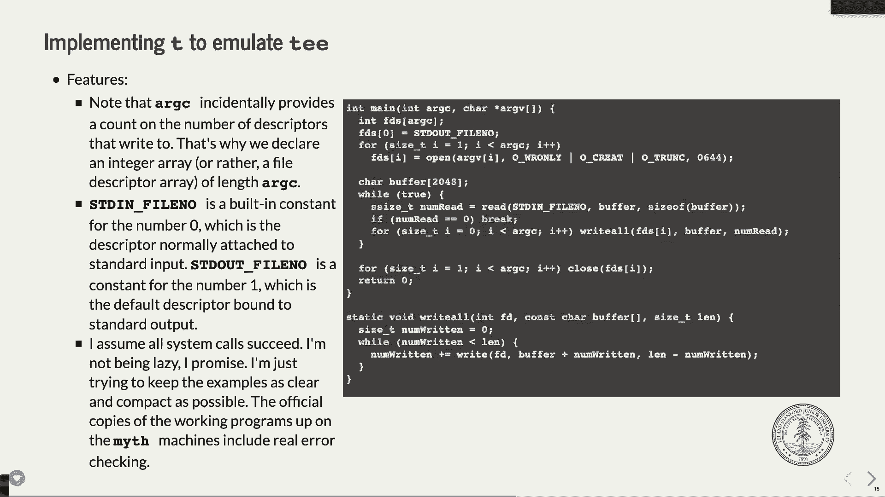

 let's we're going to continue to dig a little deeper into file system sorts of things。 Okay。

 There are two functions， STAT and EL STAT， which are system calls。 And again， a system call is a。

 function that the kernel runs。 Okay。 Your code calls it and then the kernel takes over and runs it。

 Okay。 And they populate this other thing called a struct STAT。 Unfortunately， it's overloaded。 Okay。

 Struct STAT is called is populated。 The struct STAT you pass in is populated by the STAT function。

 Okay。 And STAT and EL STAT are exactly the same except that if there is a link。

 and we'll talk about links， a little bit later， STAT returns the functions about the links itself。

 EL STAT says， oh， I'm going to go， check the details of that link。

 What a link is is think of an alias。 It's basically a name that points， to some other file。 Okay。

 So we'll get to that in the next day or so。 Okay。 And you can definitely， look these things up。

 By the way， you should get very used to typing things like MAN 2 STAT and so。

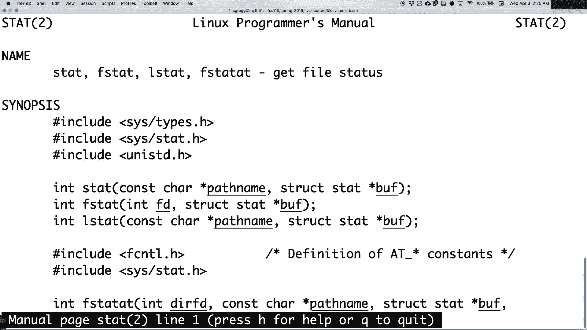

 forth。 Two being the part of the manual that you need to。 If you just type MAN STAT。

 watch what happens。

 I think it's a different， it's the built-in command from Unix that gets run or that you see instead of。

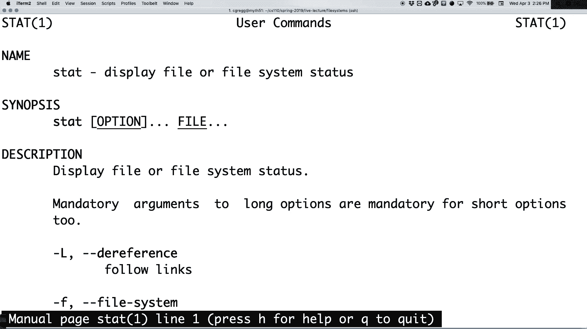

 the library function。 Okay。 But you've got all the details here for the library for the function。

 Okay。 And what they do， okay， is they populate this struct STAT and the struct STAT has some。

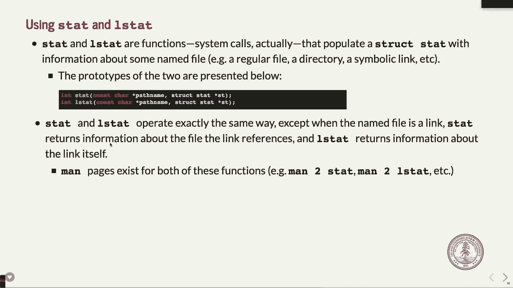

 information in it that might be useful to you。 Okay。 We eventually will use the i number， okay。

 or the i node number。 And then， but the one we care about is this mode。 Okay。 And the mode is a。

 bunch of different bits in one variable that allows you to find out information about the file。

 Okay。 So you can extract information about the file。 Is it a directory？ Is it， I think。

 I don't know if that tells how big it is。 I don't think that tells how big it is， but it。

 says various information about a particular file。 Okay。 And we want to actually do a little bit of。

 coding to show you what this is doing。 Okay。 So there's a function called find。 I used。

 Unix for years and years and didn't know about this。

 And once I found out there was a function called， find。 I went， oh boy， there's the。

 I'm going to use it every day。 And I did， I have， I use find。

 every single day。 What find does， it allows you to search through a set of directories recursively。

 and find a particular file or a pattern for a file。 So let's see， we happen in。

 I know there's search。

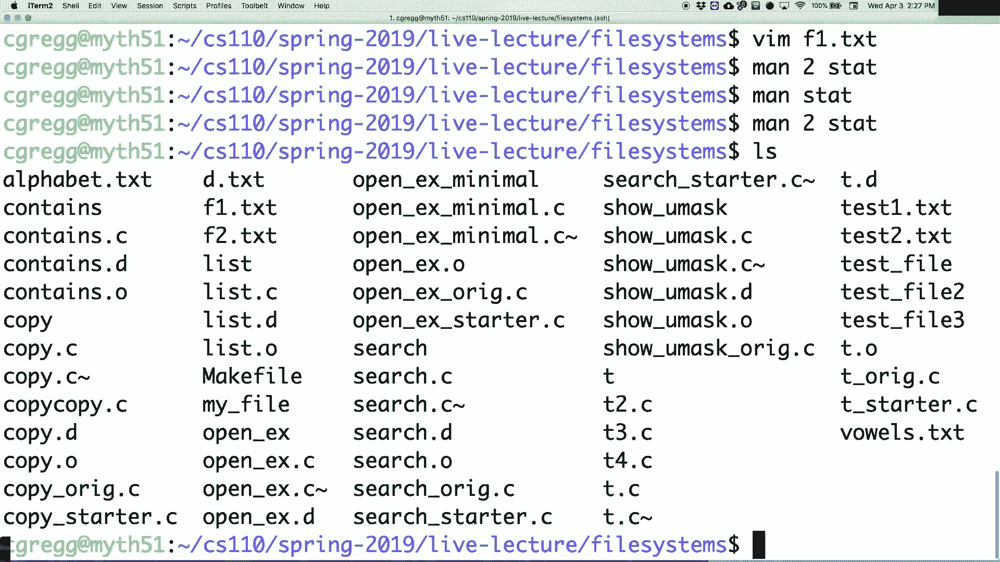

 dot whatever in here。 So if I go back up to， let's do this， find live lecture。

 and then search dot star， I'll put that in parentheses。 Okay。

 Then what it does is it goes and says anything that actually。

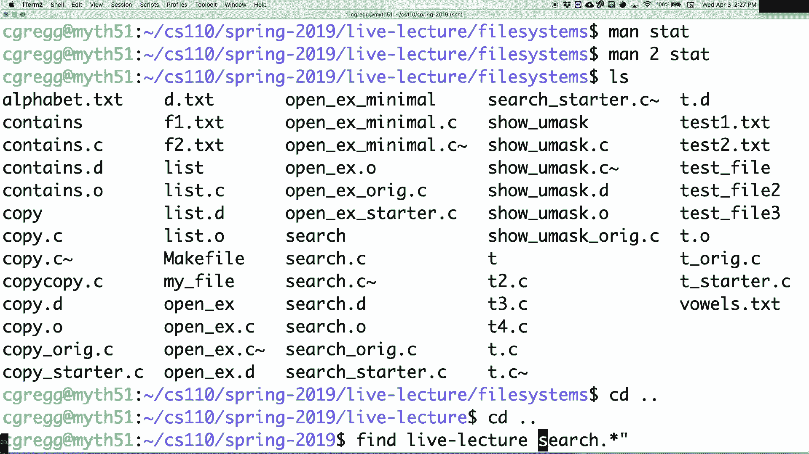

 it sort of shows you， well， actually in this case it didn't， hang on， let me just do this。

 I'll just， say search like that。 And it will tell you where it things。

 the various things are found for that。 Okay。 Let's see。 Oh。

 you know what find is a little different。 It means a thing called a dot mean。

 That's what it's looking for。 Okay。 So there we go。 There's where search itself is。

 If I wanted to find， matching， I hope all the different ones， I would type search star。

 and it would give me all the。

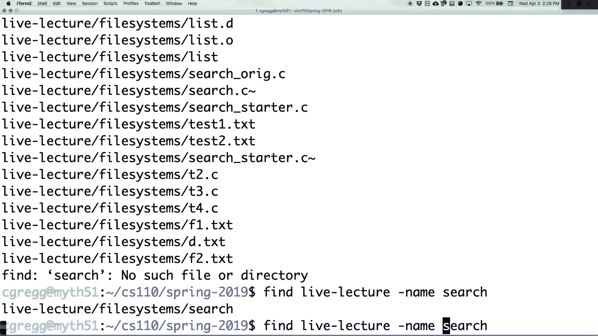

 different things that had star or search in them， which are all those files。 Okay。 So it allows you。

 to search through various directories to find files based on a file name or partial matches。 Okay。

 So what we're going to do is we're going to write a relatively simple program to actually do this。

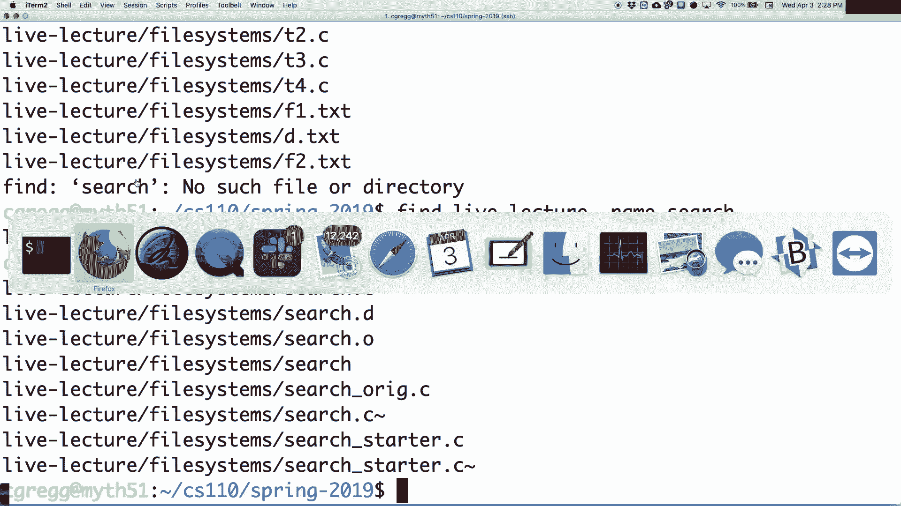

 And to do some searching to do exactly that。 If you do find slash user slash include。

 and then look for STD IO dot H， find slash user slash include STDI。 Let's see。 You got to do the。

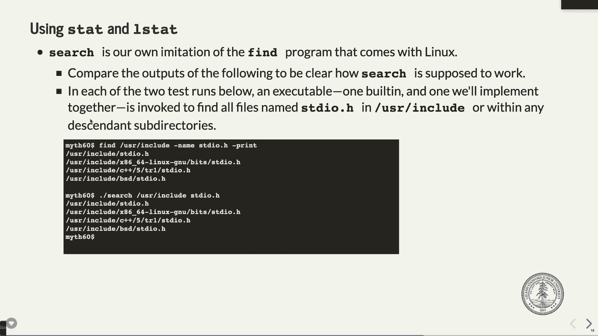

 dash name STD IO dot H and then print is a term。 Bring print as it turns out。 There we go。 We'll。

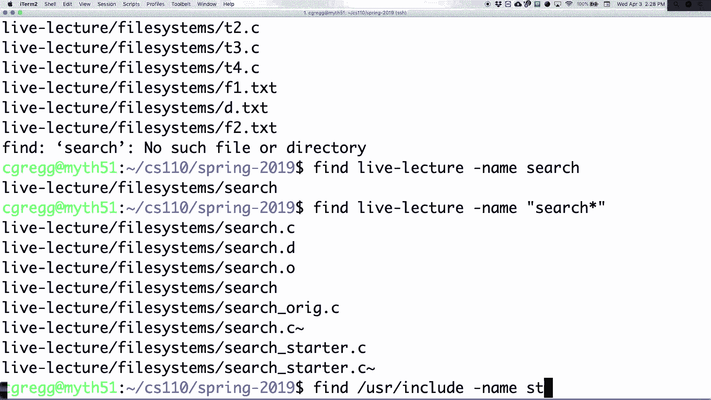

 list all the ones that are called STD IO H and there's a whole bunch of them as it turns out。

 And our search function should do the exact same thing。 Okay。 We need to be able to read a file in。

 see if it's a directory。 If it's a directory traversing that directory and then continue reading。

 This， should look very fairly familiar from some CS107 things that you did。 Okay。

 But let's actually go。

 and write the actual command search dot C。 Okay。 I've got all the header stuff in there。

 We're going to。

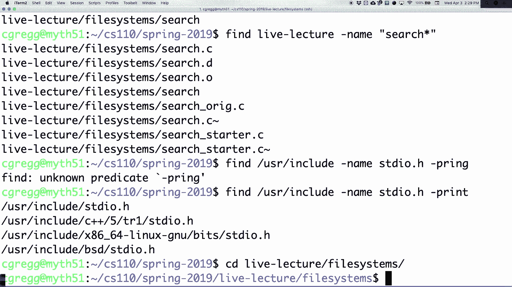

 first do the main function。 And then we're going to write this list matches function， which is。

 which is going to be a little bit more a little bit more involved。 But for right now。

 let's actually do the search function。 In fact， yeah， we'll do some of it。 In fact。

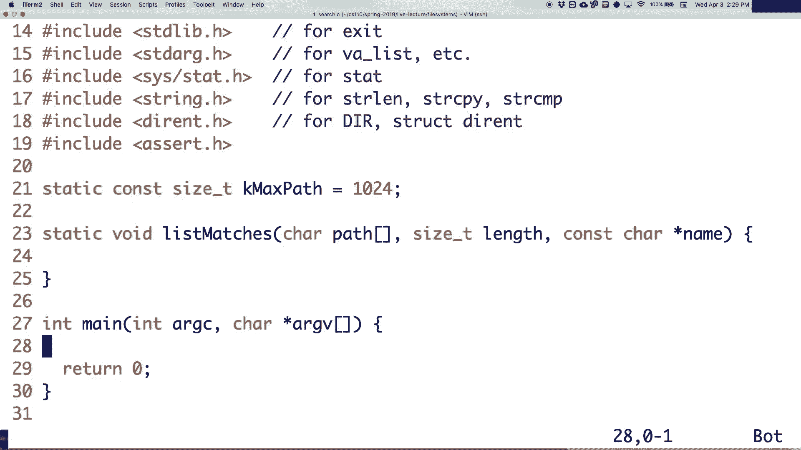

 I'll just show it to you right now。 And then we can go and run it the actual version in a little。

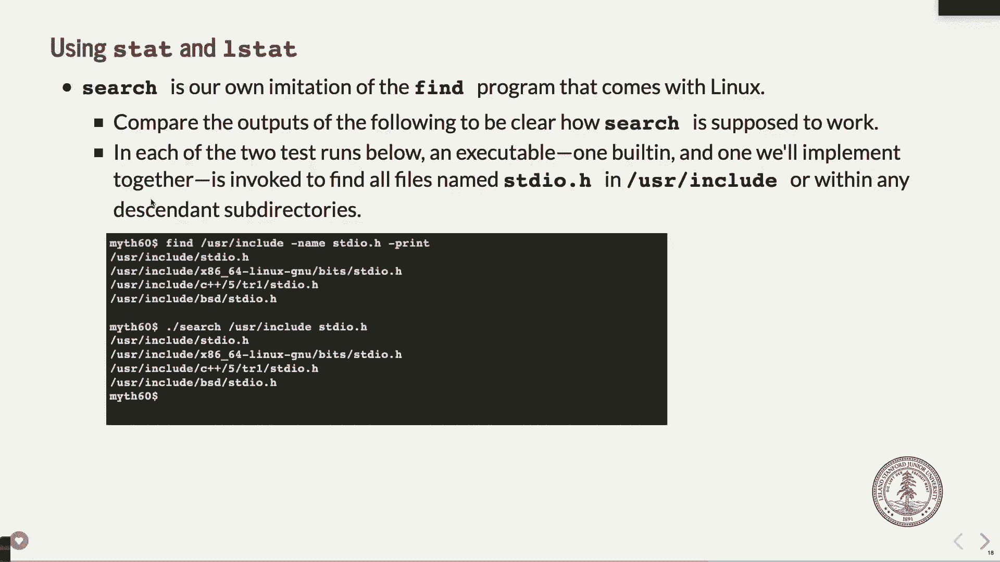

 bit。 Okay。 The main function， instead of me typing it all out right now， the main function。

 looks like this。 Okay。 It basically uses the the L stat system call to get information about whether。

 or not a file is a directory。 And how do you do that？ Well， you say L stat and then some name。

 right， and you populate a struct stat that populates a struct stat with that。

 And then you check and see， if it is a directory by using this macro S is DER。

 And then you pass in the mode that you get back。 All there is to it。 Okay。

 And then you need to actually go ahead and check the length of the， directory name itself。 Okay。

 And then you have a pattern that we're going to type in that you。

 actually are going to pass in to the list matches function by basically copying the path plus the。

 file in plus the next plus the next plus the next。 Okay。

 And that's how it's going to work using the， list matches program or list matches function that we're going to write。

 Okay。 So it's basically。

 what it is。 You're going to type in the search and then the name of the directory you're starting。

 search at and then the and then the pattern that you're trying to search for。 And it will and the。

 list matches will do all that。 Okay。 All right。 So how's that going to work？ Well， as I said。

 we need。

 else that to do this。 Okay。 The S is there is a macro。 A macro is kind of like a function except。

 it gets replaced in the code immediately。 It doesn't actually call a function。

 It's like in lines a bunch， of code。 It's basically just trying to check some bits。

 And if one of those bits is set， it needs， it's a directory for this for this case。 Okay。

 There's also is reg， which is whether or not it's a regular。

 file is link is whether it's a link to a file。 That's the alias I mentioned before。

 And most of this， is actually going to happen in the list matches function。

 which I'm going to show you in a second。 Okay。 You need to utilize open dir to open a directory and you need to utilize dir int。

 which。

 is sorry， you need to use struct dir int and the redir function， which you should have done in 107。

 If you forget that one， well， you can go look up how to do it。 But it basically does the traversing。

 of this directory for you。 It's kind of nice to do that。 And then you need to know how to close。

 a directory as well。 Okay。 All right。 So here's the actual implementation of the list matches function。

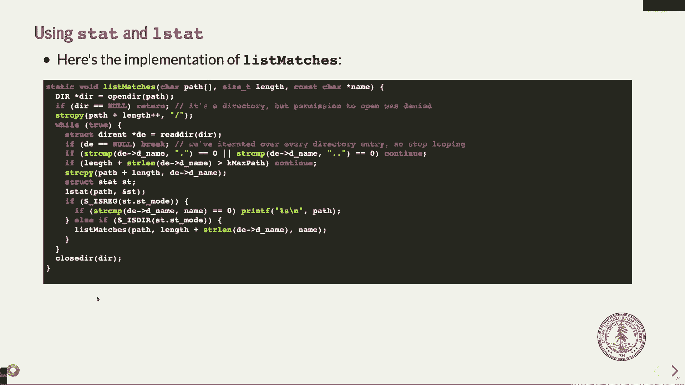

 Okay。 The list matches function does what？ It opens the directory up。 Okay。 And if the， directory。

 if the path is no， meaning if there is nothing there， then it just returns。 Okay。 Otherwise。

 it takes the path that copies the， the actual path onto the， or the， the。

 copies of slash onto the path and then starts going through all the different directories or。

 all the different entries and checking each one to see if it matches what we're trying to match。

 Okay。 I'm gonna have to do this from my pen down here。 So we are going to read in the directory。

 in this while loop of going through the directory。 Okay。 Again， if it's no。

 we're going to stop because， we've gone to， you know， we've gone to the end。 That's how this works。

 It goes until it gives you back a， no。 Okay。 And then we're going to compare this to dot and dot dot dot dot and dot dot are the two。

 files that are mean what？ What do we say？ Dot and dot dot are same directories dot and then。

 previous directory is dot dot。 So what it's going to do is it's going to ignore those。

 It's going to skip them because why， because then it would end up in some loop that you don't want to。

 go down necessarily。 Okay。 And then if you happen to have a path which is too long。

 we only allow a certain path with that's fine。 Then it just kind of says I'm done。

 I'm not going to go， any farther than that。 Too bad for you。

 And then it copies the actual name onto the end of the path， after that slash。

 And then it does the LStack command again checks if it's a regular file。 If it's a regular file。

 it does a string comparison on that file。 And then if it comes out with zero。

 meaning they're the same， then it will actually print out the path。

 And that's how it actually finds it。 Okay。 If it's a directory， what does it have to do？

 It has to recursively call list matches because， then it needs to traverse through the list。

 So it's a recursive， it's a recursive program。 But really it's not that like it's just looking through a set of directories to do that。

 Okay。 Question。 Yeah。 A regular file is not a link。 It's basically a file that has data inside it。

 A link， it's a file， that refers to another file。 So the data inside of it refers to the other file。

 And the operating， system needs to know whether or not it's an alias or a link or a regular file so they can。

 travel down those or not。 Yeah。 What are the questions you have on this one， on this program？ Yeah。

 What do we use？ Yeah。 What do we say the difference was？ It was just a matter of like， like。

 what do we expect that to be？ You might have links。 Yeah。 You can certainly have links。 In fact。

 your assignment has links in it。

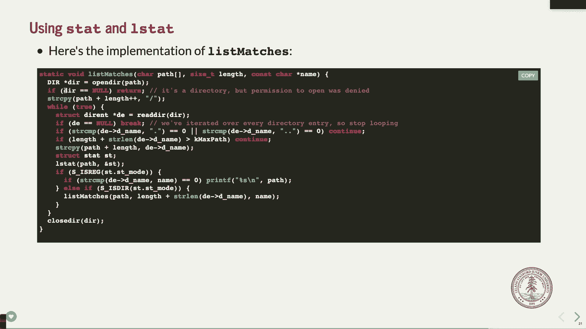

 Let me show you a link in your assignment。 If you go to， let's see， let's go to assignment。

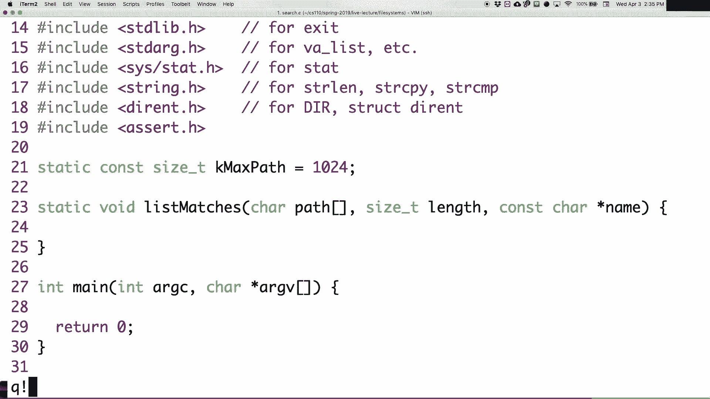

 assignment one， let's see， I think， I think， you start or maybe？ There we go。 Okay。

 If we go into here and if you look at dash L， okay， take a look at samples down here。 What's that？

 What's going on there？ It says samples has this little weird arrow that points to slash。

 AFS slash IRS slash class CS110 samples assignment one。 And by the way， if we go into samples。

 let's take a look。 Now we're actually in that file。 If we look at it， we've got an actor data。

 file and a movie data file。 And those two files are ginormous。 And what it means is if you put a。

 link in your assignment file to this regular file， none of you are going to change these files。

 You're not even allowed to， as it turns out。 Like you can't change them because they're redonely for。

 you。 But it means that everybody in the class can get access to this one gigantic file through。

 a link so that it doesn't have， so that you don't have to make copies of them for everybody。

 You would quickly run out of space if we tried to make a gigabyte file or 80 megabyte files for。

 everybody or whatever。 Yeah。 Eight hundred megabytes files， whatever。 Other questions on that？

 Good question。 Did that answer？ All right。 So that's how the stat and L stat works。 Again。

 the reason we did this example was to show you that you can use L stat to get whether it's something。

 to file or a directory。 Okay。 You can error stats do that。 You can also do that with other。

 there's other things that you might care about。 Like for next assignment， you will care about some。

 other pieces of that structure。 All right。 We relied on Opender， which basically says。

 oh， it's a directory。 We had to do an assertion in there and says， don't try to open a directory。

 that's a file。 You have to figure that out。 Okay。 You have to make sure you do that。

 And then you get， all of these different directory entries by walking through that read/read/der call。

 Okay。 And again， you probably did this in 107。 You probably did an assignment about that。

 But it's not too bad。 It's just recall that function again and again and again and it gives you the next directory。

 the next file， the next sort of， or the next directory。 Okay。 Let's see。 What else？ Here it is。

 Here's your answer to your question。 We used L stat instead of stat so we know whether it's really。

 a link and we're going to ignore links in this case。 You can have links that are recursive like。

 that refer back to something earlier in the file system。 And so if you did that， you might have a。

 problem because you traversed on a link and then it might come back where you were and then you。

 didn't end up in this recursive loop forever。 And that would be probably bad。 Okay。 And I want。

 over the other details about about all this。 You do should as always remember to close your directories。

 Any else on those？ All right。 There's another function that we'll briefly look at called list。

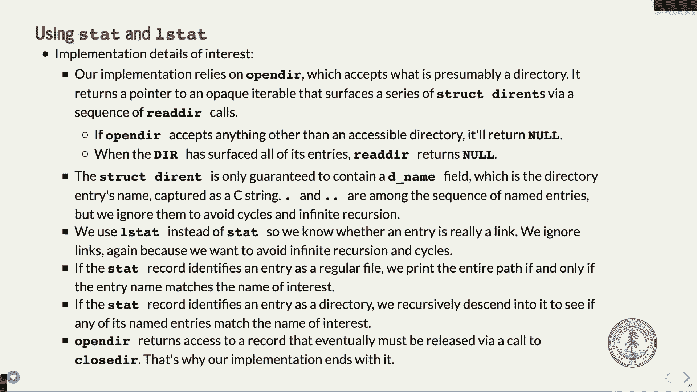

 which is basically LS。 Right。 And LS does what？ LS actually lists all the stuff in your directory。

 Well guess what？ It has to do basically the same sort of thing。 It needs to read through all of。

 the directory entries and get the information out about it。

 It needs to get the permissions by the way。 Needs to get whether or not this is directory and it needs to populate these parts of it right here。

 Okay。 It also needs to tell how big or how many other what we call hard links refer to a file。

 That's another topic we'll get to I guess on Friday or next week。

 But basically you can have one file， which lots of things point to in two different ways and the list will actually tell you how many of。

 those exist。 Okay。 It needs to get the name and it needs to get the date it's created and so forth。

 Okay。 Those details are a little bit like down in the weeds but you can you can do that。 Okay。 If。

 you want to look at the entire list。c function you can do that。 On the key one I will show you。

 right here。 This is the permissions one。 How do you get the permissions for a particular file？

 Okay。 Well let's see。 Okay。 What we need to do is we need to。 There's a lot of code in this one。

 right。 We basically need to。 Here's the list permissions right down here。 Okay。 It needs to， find。

 And there's details about this that you don't really need to know but it basically says。

 "Set all the permissions to dash。" Okay。 And then go ahead and look through each directory， right。

 And check the permissions of each directory and if it's a directory you put D in it and。

 otherwise you go through the all the permissions for each one of the various。

 permissions that you might have。 So you have to go through each one of those and go look can the user。

 can the owner read can the owner write can the owner execute set that up。 Can the other do the。

 same thing can the group do the same thing， right。 Details。

 You have to kind of go through all these， details when you're writing this low level code。

 That's kind of the way it goes in this case。 Okay。 And let's see。

 Is there anything else important here？ Here are some flags that you can use。

 for all of the different files， right。 S-I-R user。 That's a macro that basically says。

 check and see if the user can write or the user can read or the user can write。

 nine different things to check for because there's three for each owner group and user。

 Lot to do if you're trying to do all this one by one。 Okay。 It's kind of amazing what， LS can do。

 It has to go through all these details if you're doing systems type stuff。 Okay。

 The list permissions function itself prints out those permissions and this is。

 hang on I think the neck。 Oh no that's that's uh yeah here we go。

 Oh no that's a great that was all that right there。 It's got that's the list permissions and the。

 stuff up here is kind of all of the setup for it。 Okay。 Anyway go look at the code for this if you。

 want to see how how all these macros and things work。 We won't necessarily make you code all this。

 kind of low level things。 You should just know how these things work so that you understand how。

 permissions work and that there are macros and there is this struct that you have to use and so。

 forth。 Okay。 All right。 What questions do you have at this point about any of that that we've covered？

 The assignment is due next Wednesday。 It is due absolutely on Wednesday。 There's no late days for。

 this assignment just because we want you to get going on the next assignment and we want to grade。

 the first assignment as quickly as we can。 Officer I have officers tomorrow morning 10 to 12 I believe。

 stop by if you want and then we will get the I will send a message out to the CAs。 They're going to。

 start some office hours probably tomorrow or Friday。

 They will go through on Saturday or sorry Friday， and Sunday at least and then next week as well。

 All right I'll stick around for a few more minutes， and we'll see you on Friday。

 There is class this Friday。 No labs。 Class Friday。

