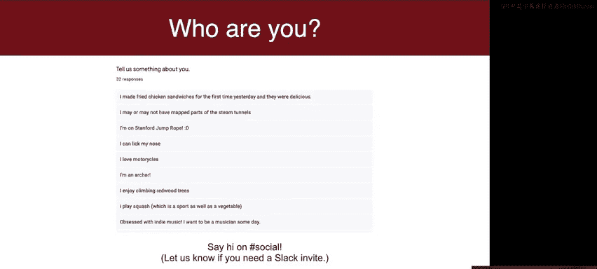
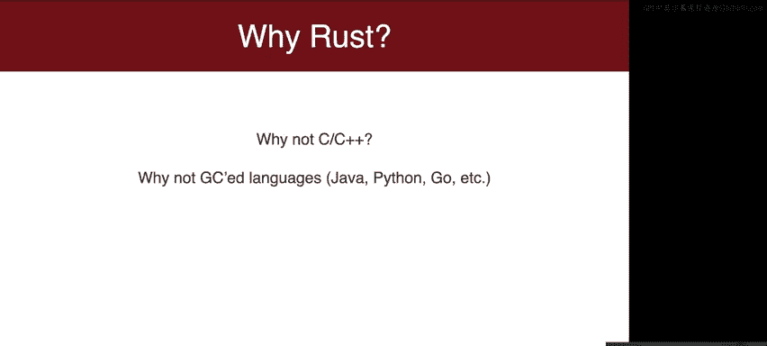
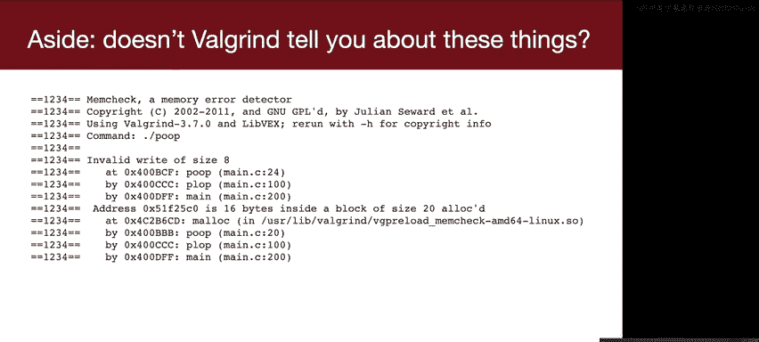
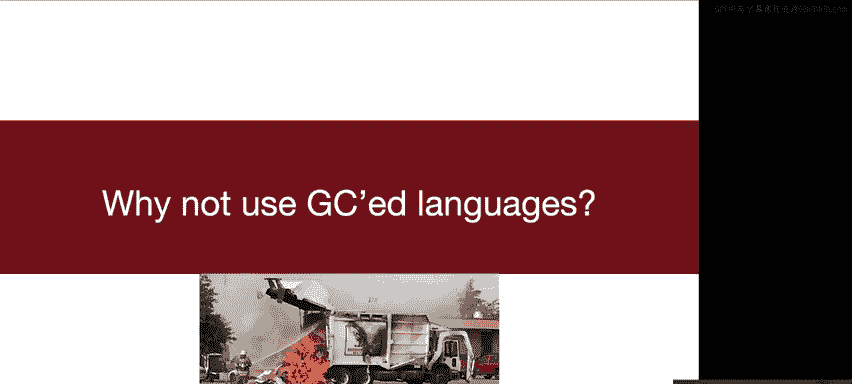
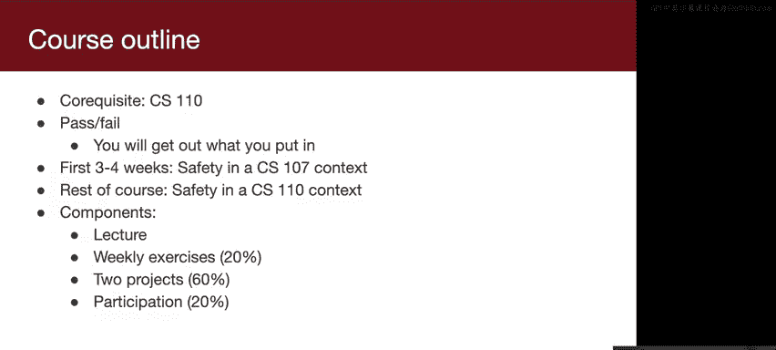
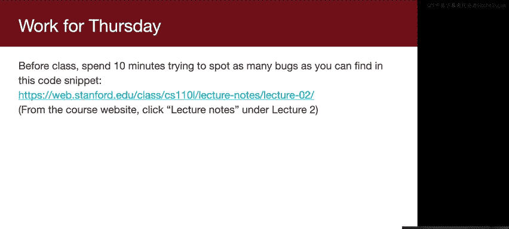

# 001：系统编程中的安全性


## 概述

在本节课中，我们将探讨系统编程中安全性的重要性，理解传统语言（如C/C++）和现代语言（如Java/Python）在编写系统软件时各自面临的挑战，并初步了解Rust语言的设计动机。

## 课程开始前的准备


在正式开始前，请确保您已开启摄像头（如果条件允许），这有助于营造更具互动性的社区氛围。请在不发言时保持静音，以减少背景噪音。如果您有问题，请使用Zoom的“举手”功能示意。我们将尽力在讲座中频繁停顿，以确保解答所有疑问。

请放松并享受课程。如果需要短暂离开或进食，这完全可以接受。我们希望每个人都能有愉快的体验。

## 讲师介绍

我是Ryan，与Arman一样，也是系统与安全方向的研究生。我热衷于种植，在隔离开始前，这是我的鳄梨农场。我也非常喜欢音乐和陶艺。需要说明的是，我本人也是Rust的新手学习者，将与大家一同进步。我过去教授过CS110课程，并拥有丰富的系统编程背景，我将把这些经验带入本课程。




Arman是我们的Rust专家。本课程的讲座将由我们两人共同完成。特别感谢Will Crichton，他在课程规划中给予了我们大量建议和材料支持。




## 关于选课同学


目前约有33名同学注册了本课程，还有一些旁听生。我们很高兴能有这样一个充满活力的社区。大家来自世界各地，这可能是本在线季度最酷的事情之一。

根据调查反馈，大家选课的原因主要集中在几个方面：对Rust语言本身感兴趣；希望本课程能支持并丰富CS110的学习体验；关注代码安全性与维护；以及对课程项目感兴趣。

绝大多数同学此前没有或仅有很少的Rust经验，这完全符合我们的预期。如果有同学上过CS242（编程语言）课程，请注意，本课程前半部分的内容对您来说可能是复习，但后半部分关于线程和网络的内容，结合CS110的知识，仍会很有价值。

我们拥有一个背景多元的出色社区。如果您尚未加入Slack，请告知我们，并欢迎在社交频道中介绍自己。

## 为什么需要这门课程？为什么选择Rust？

为了正确回答这个问题，我们需要从两个角度来审视：一方面，大量系统代码由C/C++编写，我们需问为何不继续使用这些已有三四十年历史的语言？另一方面，有许多更新的语言，如Java、Python、Go，为何不尝试用它们来编写系统代码？这些语言似乎没有内存泄漏等问题，使用起来更简单。

### 为何不使用C/C++？

让我们首先探讨为何不应继续使用C/C++。我们将在周四详细阐述，这里先看一个方面。

以下是从TutorialsPoint（一个常见的C语言教程网站）复制粘贴的代码。这段程序存在一个重大缺陷。请花一分钟查看，找出问题所在。

```c
#include <stdio.h>
int main() {
    char buffer[10];
    printf("Enter your name: ");
    gets(buffer);
    printf("Hello, %s!\n", buffer);
    return 0;
}
```

许多同学在聊天中指出是 `gets` 函数的问题。在解释原因前，我们需要回顾一些CS107中的概念，以理解为何这是一个严重问题。

您不需要懂汇编，但我会展示一些汇编代码来解释C程序运行时的底层情况。在C语言中调用函数时，编译器会将其转换为汇编指令。调用函数时，首先将参数压入栈中。接着执行 `call` 指令来调用目标函数，该指令会将当前地址（返回地址）压入栈，以便函数返回时知道跳回哪里。然后，`call` 指令跳转到函数定义处。

函数开始执行时，会保存基指针（base pointer），并为局部变量在栈上分配内存。函数执行完毕后，会弹出局部变量，恢复基指针，然后执行 `return` 指令。`return` 指令会从栈中弹出返回地址，并跳转到该地址，从而使程序回到调用函数中。

那么，问题出在哪里？假设函数中有一个用于读取字符串的字符缓冲区。如果读取的字符串内容超过了缓冲区的大小，会发生什么？C语言默认不会在运行时进行边界检查。如果写入的数据超出了缓冲区范围，程序会继续向上（向高地址）写入栈内存。如果写入没有超出栈的范围，就不会触发段错误，程序会继续运行。

这可能导致覆盖栈上的返回地址。这是一个大问题，因为程序将不知道返回到何处。更糟糕的是，如果恶意攻击者能够控制输入到缓冲区的字符串内容，他们可以精心构造输入，使得覆盖后的返回地址指向缓冲区开头。而他们可以在缓冲区开头预先放置恶意的汇编代码。这样，当函数返回时，程序不会返回到原调用处，而是开始执行攻击者放置在缓冲区中的恶意代码。

这就是所谓的“缓冲区溢出”漏洞。著名的“莫里斯蠕虫”病毒（1988年）就利用了此类漏洞。它感染了当时约10%的互联网主机。该蠕虫利用了 `fingerd` 服务中的一个漏洞。查看 `fingerd` 的代码，可以看到它使用 `gets` 函数将输入读入一个512字节的缓冲区，但 `gets` 函数并不知道缓冲区的实际大小。如果攻击者发送超过512字节的字符串，`gets` 会愉快地将其复制到缓冲区，导致溢出，并可能覆盖返回地址，从而执行蠕虫代码。

令人惊讶的是，在2020年，互联网上仍然有教程建议使用 `gets` 函数。你可能会想，专业的工程师不会犯这种低级错误吧？

然而，现实是，即使是最顶尖的公司，在安全方面投入巨大，也仍然难以完全消除此类漏洞。例如，2011年的一项研究中，研究人员通过攻击汽车的远程信息处理模块，利用缓冲区溢出漏洞，最终可以控制汽车的转向、引擎等系统。他们甚至可以通过播放音频文件来发起攻击。

在漏洞数据库中搜索“缓冲区溢出”，结果不计其数，仅2019年就有大量案例。例如，Chrome OS中的一个漏洞仅仅是因为一个“差一错误”（off-by-one error）。研究人员经过努力，最终利用这个微小溢出成功入侵了Chromebook操作系统。

有些漏洞则更为隐蔽。请看这段代码，它也存在缓冲区溢出风险。初看之下，这段代码似乎不错：它进行了边界检查，确保要复制的字节数不超过缓冲区大小。它使用 `strncpy` 进行复制（这比 `strcpy` 安全）。然而，这里有一个非常微妙的问题：`bytes_to_copy` 是一个有符号整型（`int`），而 `strncpy` 期望一个无符号的 `size_t` 类型。如果攻击者提供一个负数的长度值（如-1），当将其转换为无符号的 `size_t` 时，会发生下溢，变成一个非常大的正数（如40亿），从而导致实际复制的数据远远超出预期。

在C语言中，默认编译这段代码不会产生任何警告或错误。即使是有经验的开发者，也可能忽略这个陷阱。这说明了在C/C++中保证安全的极端困难性。

你可能会问，我们不是有工具（如Valgrind）来检测这类问题吗？Valgrind确实可以检测运行时发生的非法内存访问。但Valgrind进行的是“动态分析”，即它观察程序实际执行时发生的情况。如果恶意输入没有触发溢出，Valgrind就无法发现问题。另一种方法是“静态分析”，即通过分析代码来预测可能发生的问题。但静态分析通常会产生大量误报，因为代码逻辑可能很复杂，某些溢出路径在实际中不可能被执行。因此，尽管工具在不断进步，缓冲区溢出等内存安全问题依然普遍存在。

### 为何不使用垃圾回收语言？

既然C/C++问题这么多，我们为什么不使用垃圾回收语言（如Java、Python、Go）来编写系统代码呢？垃圾回收意味着你不需要手动分配和释放内存，语言运行时会自动管理内存，这听起来很棒。



用一个比喻来说明：假设宿舍管理员发邮件提议，由他每周为每个房间清理垃圾，费用从宿舍基金中支出，每位学生每天不到50美分。这听起来像是个不错的服务（垃圾回收），但它有几个问题：**成本高昂**（垃圾回收有显著的开销）；**具有侵扰性**（垃圾回收运行时需要暂停所有工作，即“Stop-The-World”停顿）；**时间不确定**（你无法预知垃圾回收何时发生）；此外，在某些对性能有极致要求的场景（如游戏、自动驾驶），不可预测的停顿是无法接受的。



例如，Discord（最初使用Go语言编写）的博客显示，每两分钟就会出现明显的延迟峰值（从10毫秒飙升至300毫秒），这些峰值对应着垃圾回收的停顿。LinkedIn也曾报告在生产环境中遇到超过5秒的“Stop-The-World”停顿。对于实时性要求高的应用，这是致命的。

此外，即使有了垃圾回收，也只能解决内存释放的问题，无法防止其他类型的内存错误（如数据竞争、迭代器失效等），而Rust的设计目标更侧重于全面的安全性，而不仅仅是便利性。

## 课程结构与要求

本课程应与CS110同步学习，或已修完CS110。课程内容将紧密依托CS110的知识。如果你还没有学习CS110，可能会感到困惑。

课程前半部分将重点结合CS107的内容讨论内存安全，后半部分则将探讨如何在CS110所涉及的线程、网络等上下文中保证安全。

课程组成部分包括：讲座、练习、项目和课堂参与。我们鼓励大家参加讲座，但也会提供录像。练习旨在每周巩固所学知识，为项目做准备，预计每周花费1-3小时。项目有两个，我们将根据功能完成度进行评分。Rust编译器本身具有出色的错误信息和代码风格提示，这能帮助大家成为更好的程序员。

如果你有自己特别感兴趣的项目想法，欢迎告诉我们，我们很乐意支持你进行个性化探索。

## 总结




本节课我们一起探讨了系统编程中安全性的核心挑战。我们看到了C/C++语言中缓冲区溢出等内存安全问题的普遍性与危险性，即使是有经验的开发者和使用先进工具也难以完全避免。同时，我们也了解了垃圾回收语言虽然提供了内存管理的便利，但其带来的性能开销、不可预测的停顿以及对底层控制力的削弱，使其并非系统编程的完美解决方案。这些挑战正是Rust语言设计的出发点。在接下来的课程中，我们将开始学习Rust如何通过其独特的所有权、借用检查器等机制，试图在提供高级别安全保证的同时，又不牺牲系统编程所需的性能与控制力。

## 课前准备

在周四上课前，请花10分钟查看以下链接中的代码，尝试找出其中尽可能多的错误（共有7个）。这些错误涵盖了多种概念性问题，能够很好地体现Rust的设计动机。
（链接：[https://example.com/buggy_c_code](https://example.com/buggy_c_code) – *注：原文本未提供有效链接，此处为示意*）



感谢大家的参与，我们周四再见！