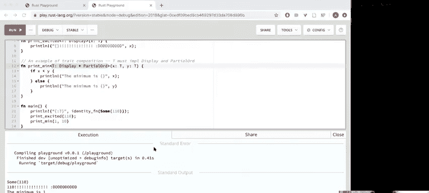
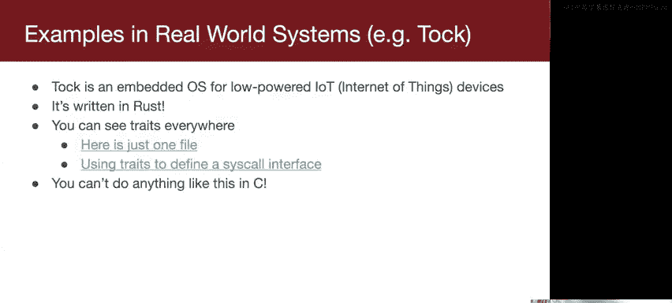
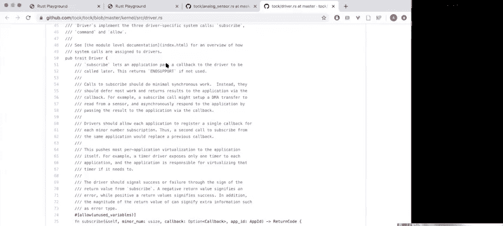
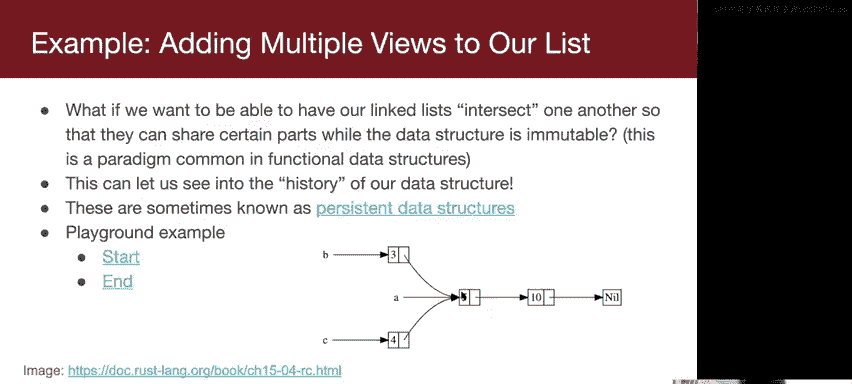
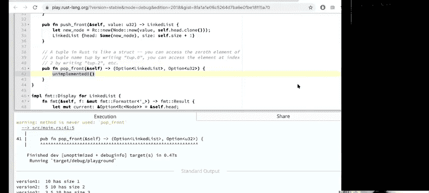
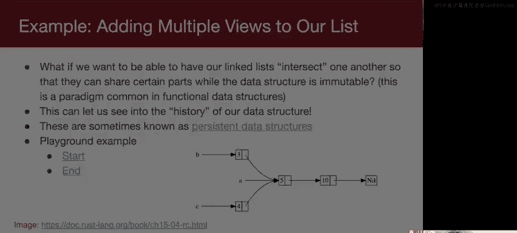
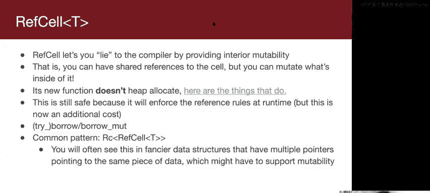

# 006：智能指针 🧠

在本节课中，我们将要学习Rust中的智能指针。我们将首先回顾并完成上一讲关于特质（Traits）和泛型（Generics）的讨论，然后深入探讨几种不同类型的智能指针，包括 `Box<T>`、`Rc<T>` 和 `RefCell<T>`。这些工具对于管理堆内存和实现复杂的数据结构至关重要。

## 回顾特质与泛型

上一节我们介绍了特质和泛型的基础知识，本节中我们来看看如何在实际代码中应用它们，并理解它们如何实现零成本抽象。

### 实现 `Clone` 特质

我们从一个名为 `MatchingPair` 的结构体开始，它有两个相同类型 `T` 的字段。

```rust
struct MatchingPair<T> {
    first: T,
    second: T,
}
```

现在，我们想为 `MatchingPair` 实现 `Clone` 特质。`Clone` 特质有一个名为 `clone` 的函数，它接受一个对自身的不可变引用（`&self`），并返回一个自身的副本。

```rust
impl<T> Clone for MatchingPair<T> {
    fn clone(&self) -> Self {
        MatchingPair::new(self.first.clone(), self.second.clone())
    }
}
```

这里的关键点是，我们不能直接从 `&self` 中移出（move）`first` 和 `second` 字段，因为 `self` 是一个共享引用。我们必须调用字段上的 `clone` 方法。这意味着类型 `T` 本身必须实现 `Clone` 特质。我们通过特质约束（trait bound）来声明这一点。

```rust
impl<T: Clone> Clone for MatchingPair<T> {
    fn clone(&self) -> Self {
        MatchingPair::new(self.first.clone(), self.second.clone())
    }
}
```

如果 `T` 没有实现 `Clone`，编译器会报错，告诉我们相应的特质约束未得到满足。

### 泛型函数与特质组合




泛型也可以用在函数中。以下是一个简单的恒等函数：

```rust
fn identity<T>(x: T) -> T {
    x
}
```



我们还可以为泛型参数添加特质约束。例如，一个函数要求其参数同时实现 `Display` 和 `PartialOrd` 特质：

```rust
use std::fmt::Display;


fn print_min<T: Display + PartialOrd>(x: T, y: T) {
    if x < y {
        println!("最小值是: {}", x);
    } else {
        println!("最小值是: {}", y);
    }
}
```

这里的 `+` 符号表示特质组合（trait composition），意味着类型 `T` 必须同时满足多个特质。

### 零成本抽象与真实案例

Rust 的特质和泛型是零成本抽象（zero-cost abstractions）。这意味着它们提供了高级的编程特性，但在运行时几乎没有额外开销。编译器通过静态分发（static dispatch）在编译时为每个具体类型生成特化的代码。

这种能力在系统编程中非常有用。例如，嵌入式操作系统 **Tock** 就大量使用了特质来定义其内核组件（如传感器驱动）和系统调用接口，证明了即使在最底层的代码中，也能安全地使用这些高级抽象。




## 智能指针介绍


现在，让我们转向本节课的核心主题：智能指针。智能指针是一种数据结构，它不仅像普通指针一样指向数据，还拥有额外的元数据和功能，如所有权和借用规则管理。

### `Box<T>`：唯一指针

`Box<T>` 是最简单的智能指针。它在堆上分配内存，并拥有该内存的唯一所有权。当 `Box` 离开作用域时，它会自动释放其指向的堆内存。

```rust
let b = Box::new(5); // 在堆上分配一个整数
```

`Box<T>` 的局限性在于它是唯一指针。你只能有一个所有者，这限制了它在需要多个引用共享同一数据场景下的使用，例如在图或双向链表中。

### `Rc<T>`：引用计数指针

当需要多个所有者共享同一块堆内存时，可以使用 `Rc<T>`（Reference Counted pointer）。`Rc<T>` 通过引用计数来追踪所有者的数量。当计数变为零时，内存会被自动释放。

```rust
use std::rc::Rc;

let a = Rc::new(5);
let b = Rc::clone(&a); // 增加引用计数
```

`Rc<T>` 只允许不可变（共享）引用。这意味着你不能通过 `Rc` 直接修改其内部数据。这遵守了 Rust 的借用规则：要么多个不可变借用，要么一个可变借用。

#### 持久化数据结构示例

`Rc<T>` 非常适合实现持久化数据结构（persistent data structures）。在这种数据结构中，操作（如添加元素）不会修改原数据，而是返回一个新版本的数据，同时共享未改变的部分。

以下是使用 `Rc` 实现持久化链表的 `push` 方法示例：

```rust
use std::rc::Rc;

struct Node<T> {
    value: T,
    next: Option<Rc<Node<T>>>,
}




struct PersistentList<T> {
    head: Option<Rc<Node<T>>>,
    size: u32,
}

impl<T> PersistentList<T> {
    fn push_front(&self, value: T) -> Self
    where
        T: Clone,
    {
        let new_node = Rc::new(Node {
            value,
            next: self.head.clone(), // 克隆 Option<Rc<Node<T>>>，增加引用计数
        });
        PersistentList {
            head: Some(new_node),
            size: self.size + 1,
        }
    }
}
```

通过这种方式，我们可以创建链表的不同“版本”，它们共享底层节点，而无需复制整个数据结构。

**`Rc<T>` 的警告：循环引用**
`Rc<T>` 可能导致内存泄漏，如果创建了循环引用。例如，对象 A 持有 `Rc` 指向 B，同时 B 也持有 `Rc` 指向 A，那么它们的引用计数永远不会降到零，内存也就永远不会被释放。解决这个问题需要更复杂的模式，如使用 `Weak<T>`。

### `RefCell<T>`：内部可变性

`RefCell<T>` 提供了“内部可变性”（Interior Mutability）。它允许你在拥有不可变引用的情况下，仍然能够修改其内部数据。这是通过在运行时强制执行借用规则来实现的：在任意时刻，只允许一个可变借用或多个不可变借用。如果违反规则，程序会 panic（恐慌）。

```rust
use std::cell::RefCell;

let data = RefCell::new(5);
{
    let mut borrow = data.borrow_mut(); // 获取可变借用
    *borrow += 1;
} // 借用在此处离开作用域，被释放
println!("{}", data.borrow()); // 获取不可变借用
```

`RefCell<T>` 本身不分配堆内存。它通常与 `Rc<T>` 结合使用，以实现具有多个所有者且可修改的数据结构。

```rust
use std::rc::Rc;
use std::cell::RefCell;

let shared_data = Rc::new(RefCell::new(vec![1, 2, 3]));
let clone1 = Rc::clone(&shared_data);
clone1.borrow_mut().push(4); // 通过 Rc<RefCell<Vec<i32>>> 修改数据
```






这种 `Rc<RefCell<T>>` 模式非常强大，常用于实现如双向链表等需要多处修改和共享所有权的数据结构。

## 总结

本节课中我们一起学习了 Rust 智能指针的核心概念。

*   我们首先完成了对特质和泛型的讨论，看到了如何通过特质约束和组合来编写可重用且类型安全的代码，并了解了零成本抽象的优势。
*   接着，我们深入探讨了三种主要的智能指针：
    *   **`Box<T>`**：用于在堆上分配数据的唯一所有权指针。
    *   **`Rc<T>`**：引用计数指针，允许多个所有者共享不可变数据，是实现持久化数据结构的利器。
    *   **`RefCell<T>`**：提供内部可变性，在运行时检查借用规则，常与 `Rc` 搭配使用以实现共享且可变的数据。



智能指针是 Rust 所有权和借用系统的重要组成部分，它们使得在保证内存安全的前提下，构建复杂的数据结构成为可能。理解它们的工作原理对于成为一名高效的 Rust 程序员至关重要。