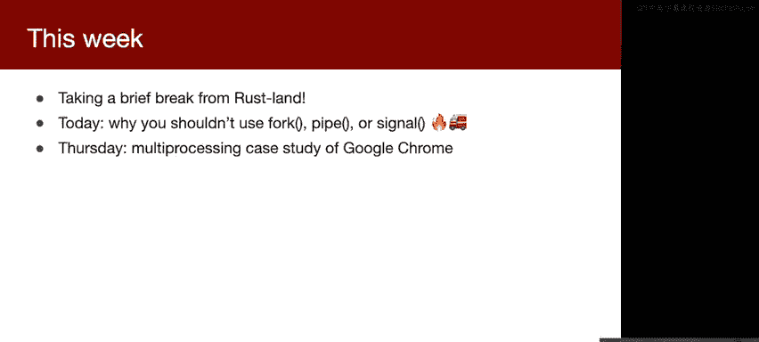
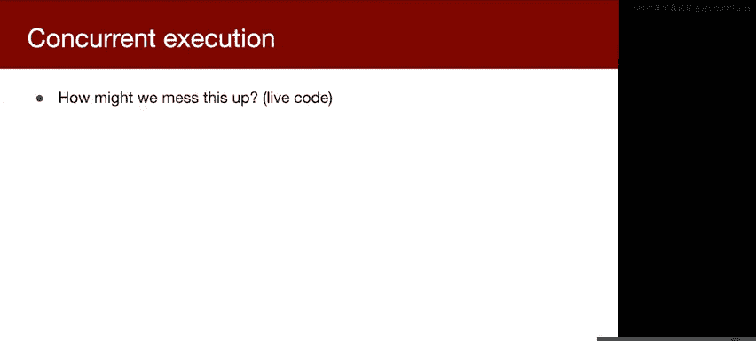
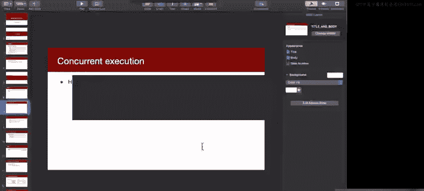
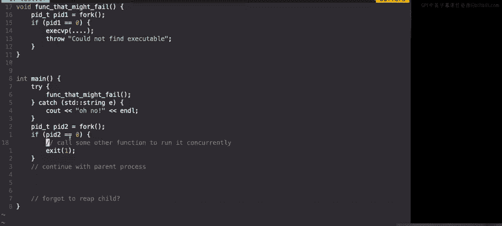
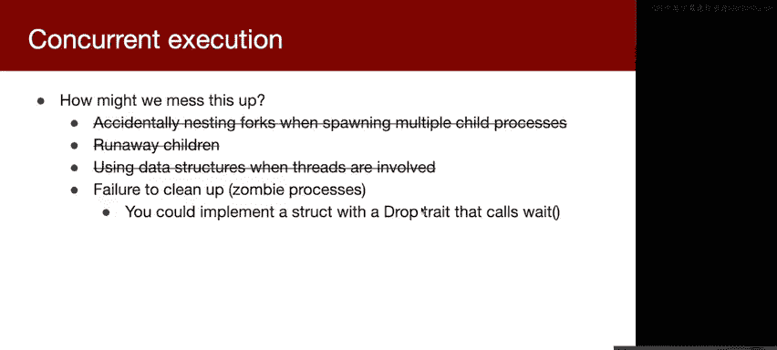
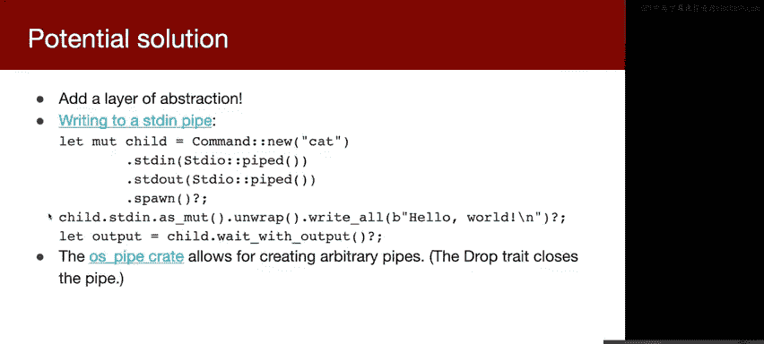
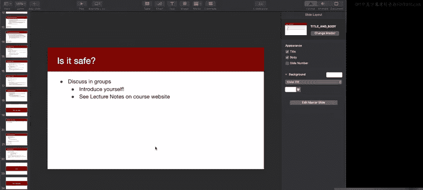
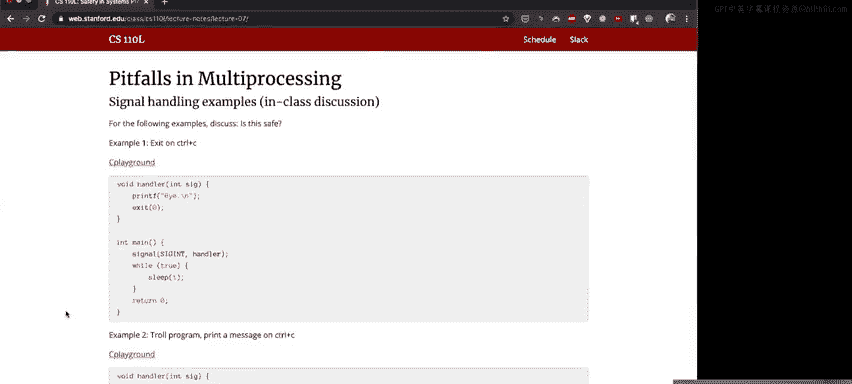
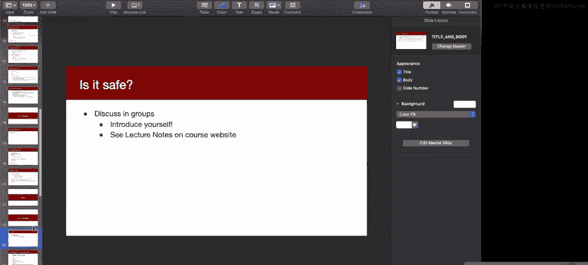
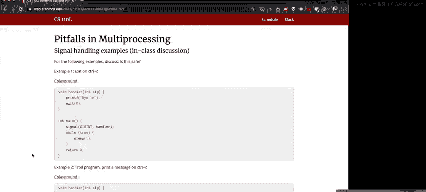

# 007：多进程编程的陷阱 🚧


在本节课中，我们将要学习多进程编程中常见的陷阱，特别是关于`fork`系统调用的使用。我们将探讨为什么直接使用`fork`可能带来风险，并介绍更安全、更高级的抽象方法。

---

大家好，欢迎来到第四周。本周我们将讨论多进程编程。你们已经完成了本季度近一半的课程，这非常了不起。无论你们感觉如何，我认为你们应该为取得的进步感到自豪。现在，你们已经掌握了足够的Rust知识，可以开始构建实际项目了。从本周开始，我们将更多地讨论CS 110课程的内容，以及它们如何与系统编程的安全性和健壮性相关联。我们将从多进程编程开始。




希望你们一切安好，保持健康，保持理智，并祝贺你们取得目前的成就。

## 课程安排 📅





上周发布的练习将于周三截止。如果你们需要帮助或感到困惑，请随时联系我们。我们知道有些人可能对特质（traits）和特质边界（trait bounds）等内容不太熟悉。你们可以随时提出问题，例如“我不太理解这部分内容，能为我提供一些额外资源吗？”或者“能和我一起讨论一下吗？”。我们非常乐意通过Zoom或Slack提供帮助。我们不希望你们在某个问题上花费过多时间，如果遇到困难，请及时联系我们。

另外，提醒一下，你们可以用一篇关于Rust学习经历的博客文章来替代任何一周的练习。文章内容可以是你们喜欢或不喜欢Rust的方面，或者任何相关主题。如果对此感兴趣，请记住这是一个可选方案。

第一个项目将于本周晚些时候（可能是周四或周五）发布。该项目是实现一个迷你调试器，截止日期为发布后的两周。你们可以与一位伙伴合作完成。如果你们对寻找合作伙伴有更好的建议，请告诉我。本周将没有练习，只有一项调查，因为项目即将发布。

## 为什么不应直接使用 `fork`？ 🤔

今天，我们将讨论为什么不应使用我们在CS 110课程中一直推荐使用的`fork`系统调用。这可能会引起一些争议。我将尝试提出一些论据来解释为什么我认为应该这样做。然后，在周四，我们将通过一个案例研究来探讨Google Chrome如何使用多进程。我认为Google Chrome是目前最复杂的系统之一，它在某种程度上就像一个操作系统。我们将看看它如何利用进程来提高性能、安全性和健壮性。

首先，让我们谈谈`fork`。我将尝试论证，尽管我们在CS 110中告诉你们使用`fork`，但在你们的代码中不应直接调用它。那么，为什么我们会有`fork`呢？有人能提出一些`fork`有用的原因吗？例如，为什么我们想在代码中调用它？

### `fork` 的用途

*   **调用系统上的其他功能**：如果你想运行其他二进制文件并希望继续执行当前程序，那么你需要使用`fork`。
*   **实现并发执行**：如果只有一个进程和一个线程，你无法获得太多并发性。虽然可以安装信号处理程序，但除此之外，你无法同时执行多个任务。`fork`允许你同时执行多个函数或代码块。

我将尝试论证第一个理由（用于并发执行）并不是一个好理由。让我们从这个开始。

### `fork` 用于并发执行的陷阱

假设你想同时运行多个任务，例如并发运行另一个函数或一段代码。我们如何可能搞砸这件事呢？

让我们打开一个编辑器，看看一个简单的例子：

```c
pid_t pid = fork();
if (pid == 0) {
    // 子进程：执行一些并发任务
    // ...
} else {
    // 父进程：继续执行
    // ...
}
```

这段代码可能出错的地方有哪些？



1.  **忘记回收子进程（僵尸进程）**：如果你忘记调用`waitpid`，为什么这很糟糕？这是一个资源泄漏。当你调用`fork`时，你实际上是在分配内存（内核中的进程数据结构）。你需要调用`waitpid`来释放这些内存，否则内核将保留这些进程数据结构。如果你的程序运行很长时间，将会积累大量僵尸进程，最终可能导致系统无法创建新进程。

2.  **进程创建顺序错误**：如果你想启动两个执行不同任务的子进程，可能会这样写：
    ```c
    pid_t pid1 = fork();
    if (pid1 == 0) {
        // 子进程1的任务
    }
    pid_t pid2 = fork();
    if (pid2 == 0) {
        // 子进程2的任务
    }
    ```
    这里的第二个`fork`调用会产生两个子进程（父进程和第一个子进程都会执行它），最终你会得到四个进程，而不是预期的三个。因此，你必须非常小心代码的顺序。在CS 110的作业3中，这是一个非常常见的错误。

3.  **子进程意外执行父进程代码**：在子进程分支中，我们必须确保在完成任务后返回或退出。否则，子进程将继续执行`if`语句之后的代码，这些代码原本是为父进程设计的。例如：
    ```c
    if (pid == 0) {
        // 子进程任务
        return; // 必须返回或exit()
    }
    // 父进程代码
    ```
    如果其他开发者重构代码，将子进程任务移到一个函数中，但忘记在函数调用后返回，就会导致子进程执行父进程代码。

4.  **异常处理问题**：在C++中，如果在子进程中使用`execvp`失败并抛出异常，而该异常被捕获并处理，子进程可能不会终止，从而继续执行父进程代码。

5.  **与多线程混合使用的危险**：这是我认为最严重的问题。如果你在子进程中分配堆内存（例如使用`malloc`），而程序中有其他线程存在，那么`fork`时只有调用`fork`的线程会存活，其他线程会消失，但它们可能没有机会清理状态（例如，可能正在修改堆分配器的数据结构）。这可能导致子进程中的堆处于不一致状态，进而使`malloc`失败。即使你确定自己的代码没有使用多线程，你使用的库也可能在后台使用多线程。因此，在子进程中分配内存需要100%确定在调用`fork`时没有其他线程运行，这是一个很难保证的条件。

基于以上原因，我认为如果你想让程序的两个部分并发运行，应该将它们放在单独的可执行文件中。你应该从主程序`fork`一个子进程，然后调用`execvp`来运行另一个二进制文件。这样，即使`malloc`的数据结构已损坏，`execvp`也会丢弃整个虚拟内存空间并加载新的二进制文件，从而避免不一致状态。

### `fork` 与 `exec` 的设计哲学

那么，为什么操作系统设计者将`fork`和`exec`分成两个系统调用，而不是合并成一个呢？原因在于灵活性。通过`fork`和`exec`，你可以在调用`exec`之前，使用任何系统调用来定制子进程的环境，例如：
*   重定向文件描述符
*   修改环境变量
*   将进程绑定到特定的CPU核心
*   启用调试功能
*   等等

Windows尝试将两者合并成一个`CreateProcess`系统调用，但它需要大量参数，甚至结构体作为参数，非常复杂。而`fork`和`exec`几乎不需要参数，非常简单，但功能极其强大。然而，简单并不意味着易于使用。正因为其强大，也容易出错。

### 更安全的抽象：子进程库

那么，我们该怎么办呢？最好的方法是在`fork`和`exec`之上构建一个更高级的抽象。许多编程语言都提供了这样的抽象：
*   **Rust** 有 `std::process::Command`
*   **Python** 有 `subprocess` 模块
*   **C++** 也有类似的库

这些抽象允许你方便地创建子进程，并设置标准输入/输出/错误、环境变量、工作目录等。更重要的是，它们通常允许你指定一个“preexec”函数，该函数在`fork`之后、`exec`之前调用，让你可以执行那些抽象未涵盖的低级定制操作。

在Rust中，使用`Command`的语法非常直观：
```rust
use std::process::Command;

let output = Command::new("echo")
    .arg("Hello, world!")
    .output()
    .expect("Failed to execute command");
```
`Command`提供了几种运行子进程的方法：
*   `.output()`: 运行命令并等待完成，捕获其输出。
*   `.status()`: 运行命令并等待完成，返回退出状态。
*   `.spawn()`: 启动命令并立即返回一个`Child`句柄，之后可以调用`.wait()`来等待。

对于需要在`exec`前执行特定操作的情况，可以使用`.pre_exec()`方法，但需要注意，其中的代码应避免分配内存，并且被标记为`unsafe`，因为它在一个潜在危险的环境中运行。

## 管道的陷阱 🚰

上一节我们介绍了`fork`的陷阱和更安全的抽象，本节中我们来看看另一个多进程编程中常用的工具——管道（pipe）可能遇到的问题。




管道用于进程间通信，但使用它们时也可能遇到问题：
*   **文件描述符泄漏**：忘记关闭管道的一端。
*   **关闭错误的文件描述符**：例如，在错误检查时误关了标准输入。
    ```c
    if (close(fd) == -1) { // 正确：检查close的返回值
        // 处理错误
    }
    if (close(fd) == -1)   // 错误：括号位置错误，实际上在检查fd是否为-1
        perror("close");
    ```
*   **使用未初始化的管道**：在调用`pipe`之前就使用了管道文件描述符数组中的值。

解决方案同样是使用更高级的抽象。例如，可以创建一个封装了管道的对象，并在其析构函数中自动关闭文件描述符，从而避免手动管理带来的错误。

## 为什么还要学习底层机制？ 🧠

你们可能会想：既然直接使用`fork`、`exec`、`pipe`和信号有这么多陷阱，为什么CS 110还要教我们使用它们呢？我的观点是，理解这些底层机制的工作原理至关重要。尤其是在系统编程中，当你使用高级抽象库时，你需要知道它们底层在做什么。因为系统编程中的交互非常复杂，交换两行代码可能完全改变程序的行为。如果你需要实现这些抽象库，或者调试它们的问题，你必须理解底层机制。我们构建抽象是为了让你们避免犯错，但为了有效地使用和调试这些抽象，你们需要理解它们是如何工作的。



## 信号安全代码分析 ⚠️

在剩余的时间里，我们将进行一个小组练习。请访问课程网站，查看今天讲座的笔记，那里有四个关于信号处理的代码示例。其中一些是安全的，一些则不安全。请在小组中讨论你们认为哪些示例是安全的，并思考原因。由于时间关系，我们将在周四的讲座开始时回顾这些示例，并解释为什么结果可能出乎意料。


---










本节课中我们一起学习了多进程编程中`fork`系统调用的潜在陷阱，包括资源泄漏、执行流混淆以及与多线程混合使用的危险。我们探讨了为什么直接使用`fork`进行并发执行可能不是最佳实践，并介绍了通过创建独立可执行文件和使用高级抽象（如Rust的`Command`）来更安全地创建子进程的方法。我们还简要讨论了管道的常见问题及其解决方案。最后，我们强调了理解底层系统调用原理对于有效使用高级抽象和进行系统调试的重要性。