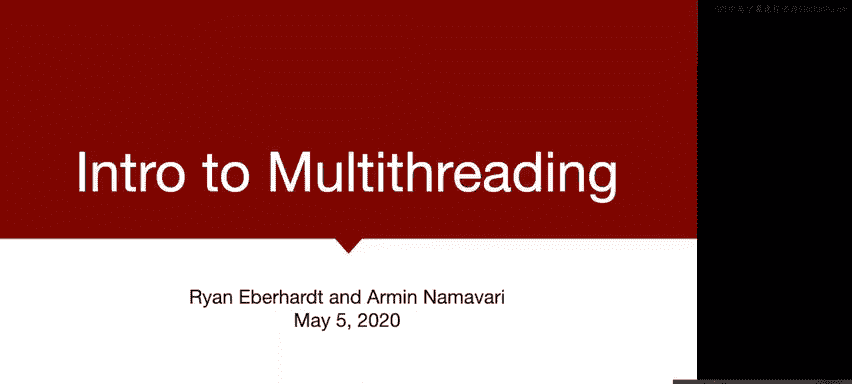
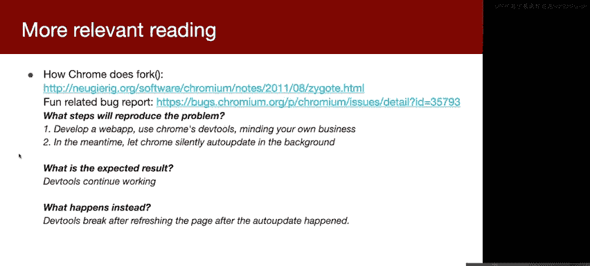
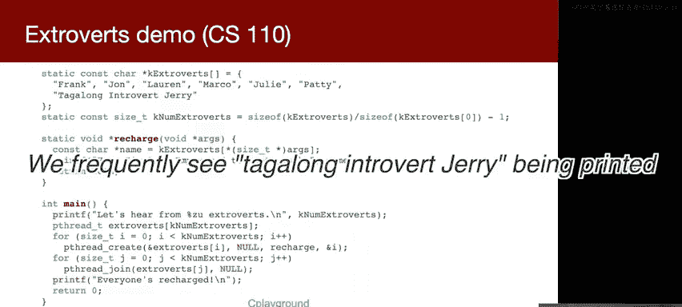
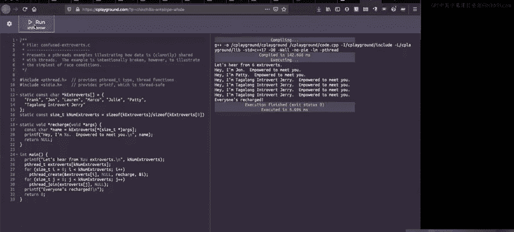
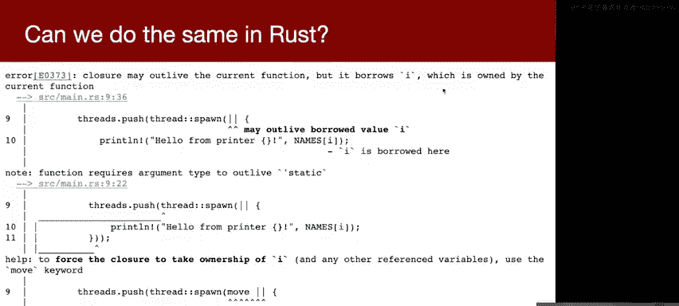

# 009：多线程入门



在本节课中，我们将学习多线程编程的基础知识。我们将回顾上周关于Google Chrome架构的讨论，了解其为何选择多进程模型，并正式引入Rust中的多线程概念。通过对比C语言中常见的线程错误，我们将看到Rust的所有权模型如何帮助我们在编译期就防止数据竞争。

## 课程概述与回顾

首先，我们进行一些课程事务的说明。

我们已在Slack上发布了本周的问卷调查，这是本周唯一的练习部分。请在周三晚上前完成，这将帮助我们改进课程。


第一个项目“D调试器”已经发布。这是一个系统级的项目，涉及处理寄存器和原始内存地址。项目使用与`trace`作业相同的基础，但功能更强大。项目截止日期是两周后的周二，建议在本周日之前完成前四个里程碑。

回顾过去四周，我们学习了很多内容：全新的内存安全管理模型、`Option`和`Result`类型、作为继承替代方案的`trait`、泛型、堆内存分配以及引用计数指针。上周我们还讨论了如何安全地使用`fork`、`signal`和`pipe`等多进程构造。大家做得非常出色。

展望未来，接下来两周我们将专注于**多线程**，这是Rust的核心优势之一。之后，我们将讨论异步编程（非阻塞I/O）、网络服务设计，并回顾所学知识如何应用于C++或Go等其他系统编程语言。

## Google Chrome架构深入探讨

上一节我们介绍了Chrome的多进程模型，本节中我们来看看这种设计背后的具体安全考量。

现代浏览器极其复杂，实现一个没有漏洞的正确浏览器非常困难。Chrome团队的策略是承认漏洞不可避免，转而致力于将漏洞的影响范围限制在尽可能小的区域内。

他们通过多进程模型来实现这种隔离。每个标签页运行在一个独立的“渲染进程”中，这是权限最低的进程，负责运行JavaScript、解析HTML和CSS。而网络请求、文件系统访问等特权操作则由一个中心的“浏览器进程”处理。

以下是这种设计的核心优势：
*   **标签页间隔离**：一个标签页被攻破或崩溃，不会影响其他标签页或整个浏览器。
*   **标签页与主机隔离**：被攻破的渲染进程权限有限，无法随意访问文件系统或向网络中的其他机器发送请求。

那么，这些进程之间如何通信呢？它们几乎完全使用**管道**进行通信。Chrome使用了一个库，通过**消息传递**模型，将结构体序列化为文本通过管道发送，接收端再反序列化回结构体。这使得高层开发无需关心底层的文件描述符和文本解析。

然而，这种模型最初仍存在不足。例如，一个标签页内可能通过`<iframe>`嵌入来自不同网站的多个内容（如广告），它们最初共享同一个渲染进程。如果恶意网站通过漏洞控制了该进程，它就能访问同进程中其他`<iframe`（如银行网站）的内存。

为此，Chrome启动了庞大的“站点隔离”项目，即使在同一标签页内，来自不同站点的内容也运行在独立的进程中。这在2018年因Spectre和Meltdown这类硬件漏洞而变得尤为重要。尽管实施难度极大，但这显著提升了安全性。

尽管如此，沙箱逃逸漏洞每年仍会出现，但通常需要串联多个漏洞才能实现，难度和成本都很高。这说明了安全是一个需要层层设防的持续过程。

## 多线程编程简介

上一节我们讨论了Chrome如何利用进程实现隔离，本节中我们来看看另一种实现并发的方式：**多线程**。

为什么使用多线程？
*   **实现并发**：允许长时间运行的操作不阻塞程序的其他部分。
*   **性能与轻量**：线程比进程更轻量，创建和切换开销更小，共享内存使得线程间通信比进程间通信（IPC）更容易。

为什么多线程危险？
*   **数据竞争**：多个线程访问同一数据，且至少有一个进行写操作，可能导致数据损坏或读取到不一致的值。
*   **死锁**：多个线程相互等待对方持有的资源，导致所有线程都无法继续执行。

Rust的所有权模型在解决数据竞争方面表现出色。有趣的是，Rust最初将内存安全和并发安全视为两个独立目标，但后来发现所有权和借用规则恰好同时解决了这两个问题。Rust编译器会阻止可能引发数据竞争的代码编译。

### 一个悲剧性的案例：Therac-25

Therac-25是一款放射治疗机，在1980年代导致多起严重辐射伤害甚至死亡事故。调查发现，根本原因之一是一个**竞态条件**。



该机器有两种模式：低功率的“直接电子束”模式和高功率的“X射线”模式（需放置一个金属扩散器）。操作界面线程和控制线程在快速切换模式时未能正确同步，导致可能出现扩散器未就位时却发射高功率电子束的情况。这个难以复现的竞态条件，在操作员熟练到能在8秒内完成特定操作序列时被触发。


这个案例表明，竞态条件在医疗设备、自动驾驶、金融系统等关键领域可能造成灾难性后果。

### Rust中的线程基础

以下是如何在Rust中创建线程的基本示例：

```rust
use std::thread;
use std::time::Duration;
use rand::Rng;

fn main() {
    let mut handles = vec![];

    for _ in 0..20 {
        let handle = thread::spawn(|| {
            let mut rng = rand::thread_rng();
            let sleep_time = rng.gen_range(100..500);
            thread::sleep(Duration::from_millis(sleep_time));
            println!("Thread finished running!");
        });
        handles.push(handle);
    }

    for handle in handles {
        handle.join().expect("Thread panicked!");
    }
}
```

代码解析：
*   `thread::spawn` 用于创建新线程，它接受一个闭包（`|| {...}`），该闭包内的代码将在新线程中运行。
*   `join()` 方法等待线程结束。它返回一个`Result`，因为线程可能会恐慌（`panic`）。默认情况下，一个线程的恐慌不会终止整个程序。

### Rust如何防止常见错误

考虑一个C语言中常见的错误模式（“自我介绍”例子）：

```c
// C 代码 (存在bug)
char *names[] = {"Frank", "John", "Laura", "Marco", "Julie", "Patty"};
for (int i = 0; i < 6; i++) {
    pthread_create(&threads[i], NULL, intro, &i); // 传递局部变量 i 的地址
}
// 线程函数 intro 会打印 names[i]
```

问题在于，我们向线程传递了局部变量 `i` 的地址。`for`循环迭代很快，在线程开始读取 `i` 的值之前，`i` 可能已经自增或循环已经结束，导致线程读取到错误的下标，可能打印出错误的名字、重复的名字，甚至越界访问。

如果我们尝试在Rust中直接翻译这段代码：

```rust
let names = ["Frank", "John", "Laura", "Marco", "Julie", "Patty"];
let mut handles = vec![];





for i in 0..6 {
    let handle = thread::spawn(|| {
        println!("Hello from {}", names[i]); // 错误！闭包捕获了 `i`
    });
    handles.push(handle);
}
```

Rust编译器会拒绝这段代码！它会指出：闭包捕获了引用 `&i`，但这个引用可能比变量 `i` 存活得更久（因为线程可能比当前循环迭代活得更长）。这**正是**C代码中那个bug的本质。Rust在编译期就强制我们解决这个问题，彻底避免了数据竞争。



解决方案通常是使用 `move` 关键字获取所有权，或者传递数据的副本。我们将在后续课程中详细探讨。

## 总结与展望

本节课中我们一起学习了多线程编程的动机与风险，并通过Therac-25的案例看到了竞态条件的严重性。我们介绍了Rust中创建线程的基本方法，并看到了Rust的所有权模型如何通过编译期检查，有效防止了C语言中常见的一类数据竞争错误。

然而，Rust并非万能。它主要解决了**数据竞争**的问题，但对于更高层面的**逻辑竞态条件**（如Therac-25中的同步问题）以及**死锁**，程序员仍需谨慎处理。安全是一个综合工程，需要结合语言安全特性（如Rust）、系统架构（如Chrome的沙箱）和良好的编程实践。

下节课我们将更深入地探讨Rust中线程间的数据共享与同步机制。