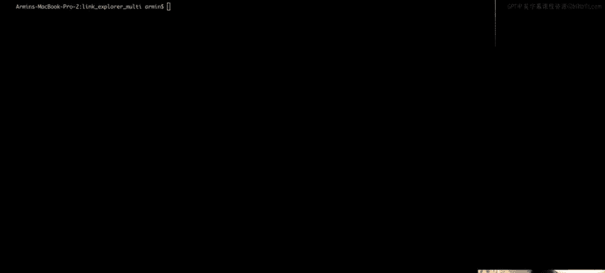
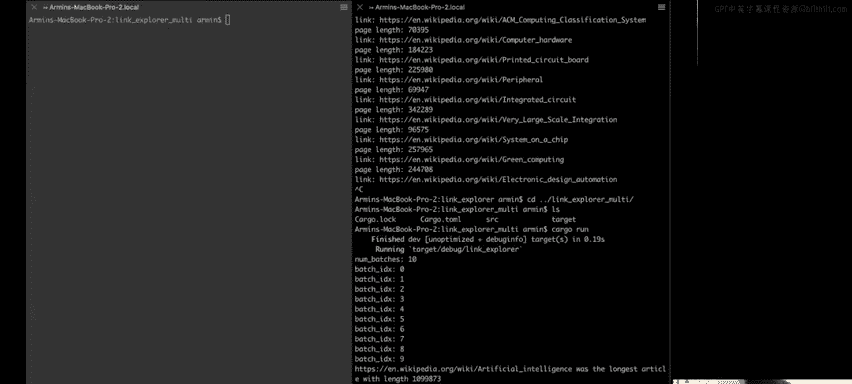
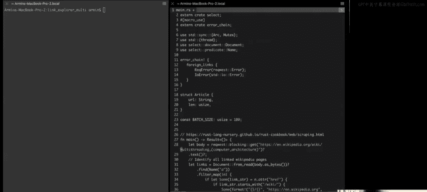
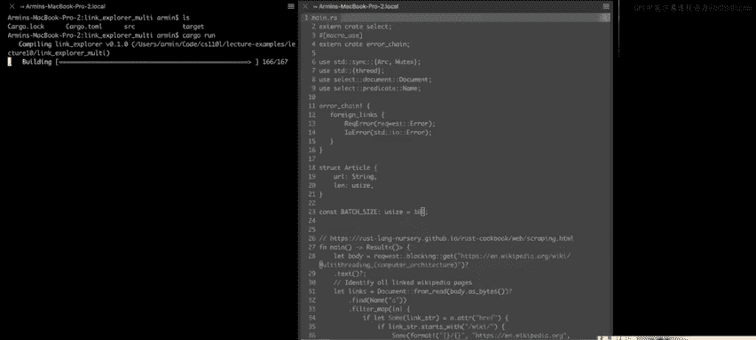
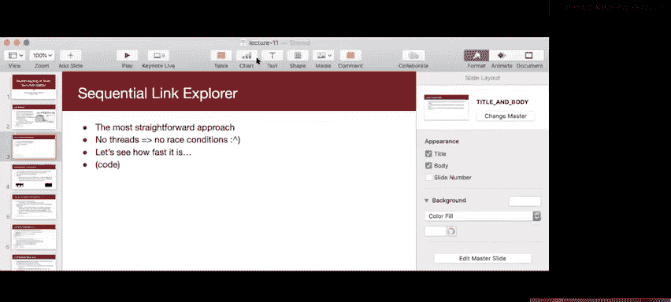
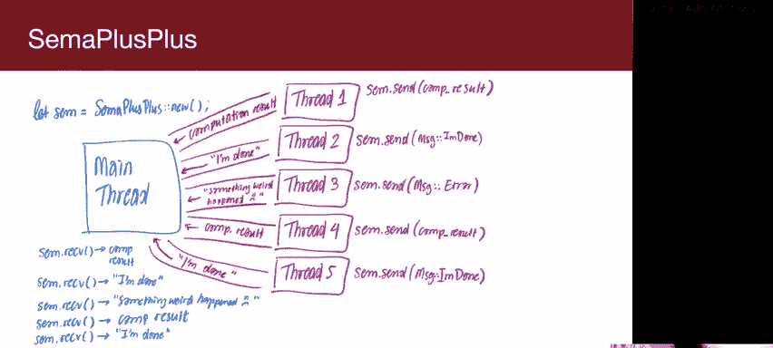
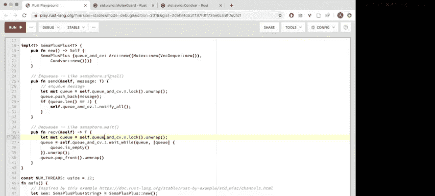

# 011：同步




在本节课中，我们将要学习Rust中关于多线程的同步。我们将从回顾上节课末尾的内容开始，然后过渡到一些新的、有趣的同步原语，这些内容Ryan将在周四继续讲解。



## 回顾：链接探索器

上一节我们介绍了链接探索器的概念。其核心思想是，你可以在维基百科页面之间跳转，尝试从某个词条（例如“disentre”）开始，最终到达另一个词条（例如“revolver”）。但为了简化，我们这次的目标是：扫描整个维基百科页面，尝试找到HTML体积最大的链接。

我们将首先尝试顺序执行这个任务。让我切换到终端演示一下。





我将运行顺序版本的链接探索器。运行 `cargo run` 后，程序会顺序遍历所有链接。链接数量很多，顺序执行大约需要三分钟，这并不高效。





接下来，我们看看多线程版本。运行多线程版本后，程序能相当快地处理完所有链接。虽然速度并非极快，但相比顺序版本有了显著提升。有趣的是，根据我们上次的观察，“人工智能”似乎是计算机科学中最重要的主题。


## 代码解析：使用 `Mutex` 保护共享数据

现在，让我们深入看一下代码。我打开 `main.rs` 文件。


我们使用了一个名为 `reqwest` 的库来发起HTTP请求，下载网页的HTML内容。代码的核心部分在于使用 `Mutex` 来保护共享数据。

以下是关键部分：
```rust
struct Article {
    url: String,
    len: usize,
}
```
我们定义了一个 `Article` 结构体来存储URL和长度。你可能会问，为什么需要将这两个字段放在一个结构体中？这与 `Mutex` 的构造方式有关。

在Rust中，`Mutex` 的构造函数接收一个需要保护的数据。如果我们想用同一个互斥锁保护两个独立的变量，就必须将它们打包到同一个结构体中。这与C++不同，在C++中，你可以声明两个变量和一个独立的互斥锁变量，在使用变量前后手动加锁和解锁。

从设计角度看，这实际上很好。这被称为“监视器”风格的并发，即将相关的数据分组在一起。Rust的类型系统强制我们这样做，因为 `Mutex::new` 只接收一个数据参数。

`Mutex` 被这样构造和使用：
```rust
let longest_article = Arc::new(Mutex::new(Article { url: String::new(), len: 0 }));
```
当我们锁定互斥锁时（例如 `longest_article.lock().unwrap()`），它会返回一个指向内部数据的特殊引用（一个 `MutexGuard`）。这个引用确保我们拥有对共享数据的独占访问权。当这个引用离开作用域时，锁会自动释放。

## 线程批处理与资源限制




在代码中，我们采用了批处理线程的策略：生成一批线程，等待它们全部完成（`join`），然后再生成下一批。你可能会想，为什么不一次性生成所有线程？

让我们看看如果将批处理大小设置得过大（例如100）会发生什么。运行程序后，我们遇到了错误：“too many open files”。这是因为每个网络连接都会创建一个文件描述符。如果同时建立过多连接，就会耗尽系统的文件描述符限制，导致程序崩溃。


此外，我们也不希望用过多请求压垮服务器。批处理策略的问题在于不够灵活和动态。更好的方法是使用线程池，这将在CS110L的作业6中实现。


## 引入信号量进行节流


上一节我们讨论了批处理的局限性，本节我们来看看如何使用信号量来更有效地节流。

一种更有效的方法是使用信号量作为“许可条”来限制同时进行的请求数量。你需要先获取许可，才能开始下载文章。熟悉信号量这种用法的同学应该知道，这在CS110的课程和作业5中都有涉及。

为了在Rust中实现信号量，我们首先需要理解条件变量。

## 条件变量快速回顾

条件变量与我们在多进程中见过的 `sigsuspend` 类似。其核心思想是：
1.  获取一个锁（例如互斥锁）。
2.  检查某个条件是否成立。
3.  如果条件不成立，则“等待”。在等待期间，线程会被阻塞，不消耗CPU资源，相当于被移到了阻塞队列。
4.  当其他线程通知条件变量时，等待的线程被唤醒。
5.  线程重新获取锁。
6.  再次检查条件，如果成立则继续执行。
7.  锁守卫离开作用域时自动释放锁。

在C++中，信号量的实现可能如下所示（伪代码）：
```cpp
void wait() {
    lock_guard<mutex> lg(m);
    while (value == 0) {
        cv.wait(m); // 释放m并等待，被唤醒后重新获取m
    }
    value--;
}
void signal() {
    lock_guard<mutex> lg(m);
    value++;
    if (value == 1) cv.notify_all();
}
```
关于 `notify_all` 与 `notify_one`：使用 `notify_all` 更安全。虽然它可能唤醒多于所需的线程（这些线程醒来后检查条件，不满足会再次睡眠），但功能上是正确的。而错误地使用 `notify_one` 可能导致死锁，例如唤醒了无法继续执行的线程，而能继续执行的线程却仍在睡眠。

## Rust中的条件变量

在Rust中，习惯上将条件变量与互斥锁配对使用，通常放在一个元组或结构体中。这是因为条件变量与特定的互斥锁（以及该锁保护的数据）相关联。你不应该让一个条件变量负责多个互斥锁，那会使代码难以理解并可能导致死锁。

`Mutex` 和 `Condvar` 的接口能帮助你编写更安全、更清晰的代码。让我们看看如何实现一个比简单信号量更强大的工具。

## 构建 `SemaphorePlusPlus`：一个通道

我们想构建一个 `SemaphorePlusPlus`（简称 `S++`），它不仅仅是递增递减计数器，还能发送和接收消息。可以把它想象成一个线程安全的队列（通道）。

主线程可以克隆 `S++` 并将其分发给多个工作线程。工作线程完成任务后，可以调用 `s.send(result)` 发送结果或状态消息。主线程则调用 `s.receive()` 来接收这些消息。如果队列为空，`receive()` 会阻塞，直到有消息到达。

这类似于将数据存储（队列）和同步机制（信号量/条件变量）结合在了一起，使用起来更简单，无需直接操作共享内存和条件变量。

## 实现 `SemaphorePlusPlus`

让我们开始实现。首先看结构体定义和构造函数：
```rust
struct SemaphorePlusPlus<T> {
    qc: Arc<(Mutex<VecDeque<T>>, Condvar)>,
}
impl<T> SemaphorePlusPlus<T> {
    fn new() -> Self {
        let pair = (Mutex::new(VecDeque::new()), Condvar::new());
        SemaphorePlusPlus { qc: Arc::new(pair) }
    }
}
```
它包含一个 `Arc`，里面是一个元组，元组里有一个保护 `VecDeque`（双端队列）的 `Mutex` 和一个 `Condvar`。

我们需要为它实现 `Clone`。由于唯一字段 `qc` 是 `Arc`，而 `Arc` 实现了 `Clone`，我们可以使用派生宏：
```rust
#[derive(Clone)]
struct SemaphorePlusPlus<T> {
    qc: Arc<(Mutex<VecDeque<T>>, Condvar)>,
}
```

### 实现 `send` 方法

`send` 方法将消息放入队列，并通知等待的消费者。
```rust
fn send(&self, message: T) {
    let (q, c) = &*self.qc; // 解引用Arc并解构元组
    let mut queue = q.lock().unwrap(); // 获取锁守卫
    queue.push_back(message); // 入队
    if queue.len() == 1 { // 如果队列从空变为非空
        c.notify_all(); // 通知所有等待者
    }
    // lock守卫离开作用域，自动释放锁
}
```
注意：我们只在队列长度变为1（即从空变为非空）时才调用 `notify_all()`，这是一个优化，避免不必要的唤醒。

### 实现 `receive` 方法

`receive` 方法从队列中取出消息，如果队列为空则等待。
```rust
fn receive(&self) -> T {
    let (q, c) = &*self.qc;
    // 获取锁，并将锁守卫传入 `wait_while`
    let mut queue = c.wait_while(q.lock().unwrap(), |queue| queue.is_empty()).unwrap();
    // `wait_while` 返回时，我们已重新获得锁守卫，并且队列不为空
    queue.pop_front().unwrap() // 出队并返回
}
```
`Condvar::wait_while` 方法接收一个锁守卫和一个谓词闭包。它会释放锁并等待，直到被通知且谓词条件为假（即队列不为空）时，重新获取锁并返回锁守卫。这确保了在检查条件和执行操作（`pop_front`）期间，锁始终被持有，避免了竞争条件。

这里的关键是，`wait_while` **消耗**（获取所有权）并最终**返回**锁守卫，这由Rust的所有权系统保证，防止了在等待期间错误地访问数据。

## 总结

本节课中我们一起学习了Rust中的同步机制。

1.  我们回顾了使用 `Mutex` 保护共享数据的方式，并理解了为何需要将相关数据打包到结构体中。
2.  我们探讨了多线程程序中资源限制（如文件描述符）的问题，以及批处理策略的优缺点。
3.  我们回顾了条件变量的工作原理，并将其与信号量的节流用途联系起来。
4.  我们深入研究了Rust中 `Mutex` 和 `Condvar` 的接口，看到了它们如何通过类型系统强制关联锁与数据，从而编写出更安全的代码。
5.  最后，我们实现了一个 `SemaphorePlusPlus`（通道），它结合了队列和条件变量，提供了线程间通信的更高级抽象。在实现中，我们特别关注了 `Condvar::wait_while` 方法如何安全地管理锁的生命周期，确保同步的正确性。



Rust的同步原语通过其所有权和类型系统，帮助开发者避免了许多在C/C++中常见的并发错误，例如未加锁访问数据、错误关联条件变量与锁等。虽然代码有时看起来紧凑而复杂，但它内在的安全性保障是强大的。