# Rust安全编程：10：共享内存

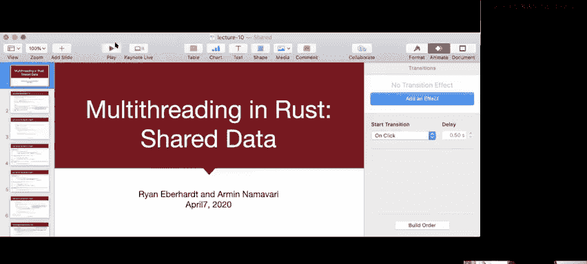

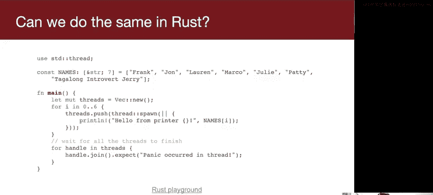


在本节课中，我们将要学习Rust中的多线程编程与共享数据。我们将探讨如何安全地在多个线程之间共享和修改数据，理解Rust如何通过其类型系统防止常见的并发错误，并学习使用`Arc`和`Mutex`等工具来构建线程安全的程序。

---

## 从CS110的例子说起

上一节我们介绍了多线程的基本概念。本节中我们来看看一个来自CS110的经典例子——“外向者演示”。这个程序创建了多个线程，每个线程打印一个名字。然而，程序运行到最后，Jerry的名字会反复出现，这暴露了什么问题？

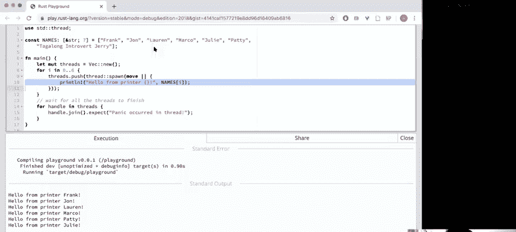


问题的核心在于，多个线程可能同时访问和修改同一个共享变量（比如一个计数器或索引），导致数据竞争和不一致的状态。在C/C++中，我们需要手动使用锁（如互斥锁）来保护共享数据。在Rust中，编译器会帮助我们识别这类问题。

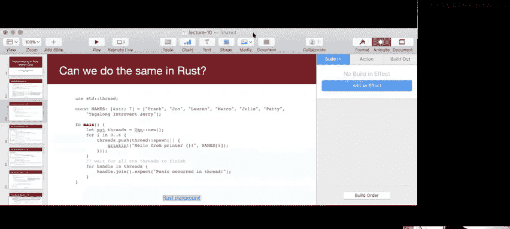

---

## 尝试在Rust中创建线程

让我们尝试在Rust中编写一个类似的程序。我们创建一个线程向量，每个线程打印一个名字。

```rust
use std::thread;

fn main() {
    let names = vec!["Frank", "Patty", "Julie", "Marco", "Lauren", "John"];
    let mut threads = vec![];

    for i in 0..names.len() {
        let handle = thread::spawn(|| {
            println!("{}", names[i]);
        });
        threads.push(handle);
    }

    for handle in threads {
        handle.join().unwrap();
    }
}
```

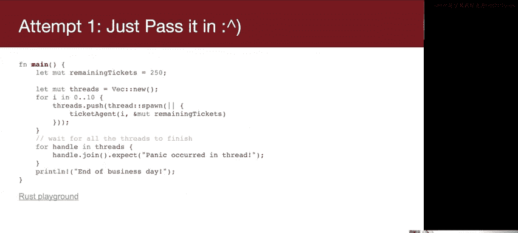

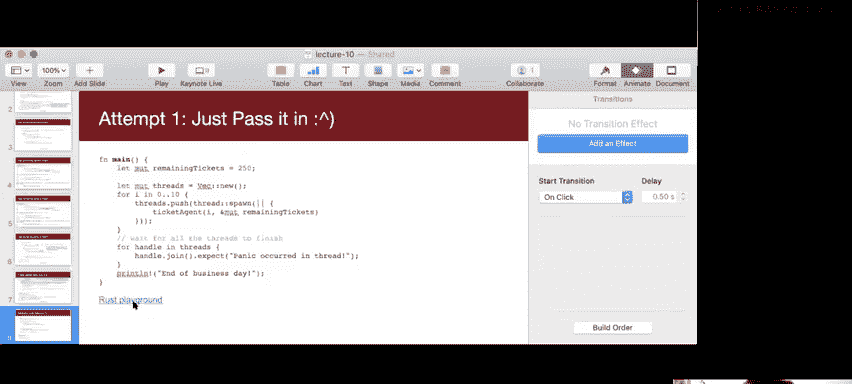


当我们尝试编译这段代码时，Rust编译器会报错。它指出闭包可能比当前函数存活得更久，但它借用了`i`，而`i`归当前函数所有。这本质上是生命周期问题：我们不知道线程会存活多久，如果主线程先结束，`i`的引用就会变成悬垂指针。

编译器甚至给出了建议：使用`move`关键字。`move`会强制闭包获取其捕获变量的所有权。对于实现了`Copy`特性的类型（如整数`i`），这实际上会复制一份值给闭包。

```rust
let handle = thread::spawn(move || {
    println!("{}", names[i]);
});
```

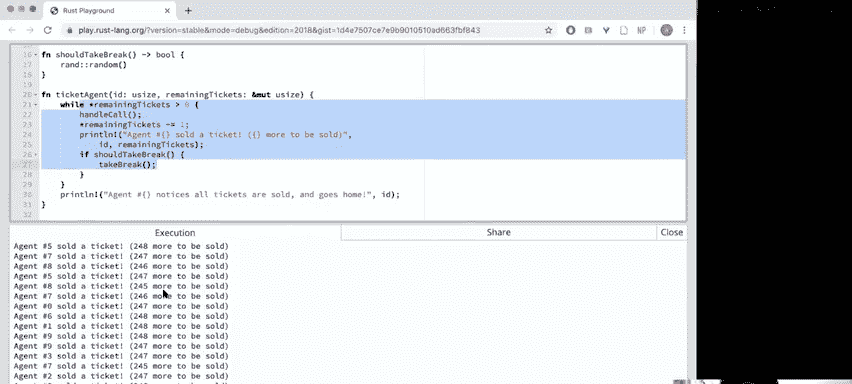


修改后，程序可以正常运行，并且由于线程调度的不确定性，每次运行名字出现的顺序可能不同。

---


## 共享数据的挑战：售票代理示例

上一节我们看到了如何将值移动到线程中。本节中我们来看看当多个线程需要读写**同一个**数据时会发生什么。考虑另一个CS110经典示例——售票代理。

多个售票代理共享一个剩余票数计数器。每个代理在票数大于0时，处理一个呼叫并减少票数。在C语言中，递减操作`remaining_tickets--`不是原子的，它可能被分解为多条机器指令。如果两个线程的指令交错执行，就可能导致数据竞争，最终售出的票数可能超过实际票数。

更隐蔽的是，即使检查`remaining_tickets > 0`的操作，也需要在锁的保护下进行，否则检查后状态可能被其他线程改变。

---

## 在Rust中实现共享计数器

让我们尝试在Rust中编写这个有问题的售票程序。

```rust
use std::thread;

fn ticket_agent(remaining_tickets: &mut usize) {
    while *remaining_tickets > 0 {
        // 处理呼叫
        *remaining_tickets -= 1;
        // 可能休息一下
    }
}

fn main() {
    let mut remaining_tickets = 250;
    let mut threads = vec![];

    for _ in 0..10 {
        let handle = thread::spawn(|| {
            ticket_agent(&mut remaining_tickets);
        });
        threads.push(handle);
    }

    for handle in threads {
        handle.join().unwrap();
    }
}
```

编译器会立刻阻止我们。它指出`remaining_tickets`的引用生命周期可能不够长，并再次建议使用`move`。但如果我们使用`move`，每个线程将获得`remaining_tickets`的一个副本，它们将无法共享状态，这显然不是我们想要的。

我们需要一种方式，让多个线程能够安全地指向并修改堆上的同一块内存。

---

## 引入 `Arc` 和 `Mutex`

为了安全地共享可变数据，Rust标准库提供了两个关键工具：`Arc` 和 `Mutex`。

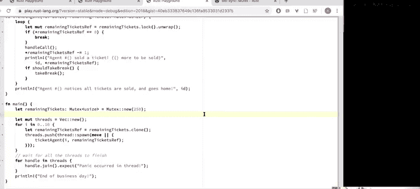


*   **`Arc<T>` (Atomic Reference Counting)**： 原子引用计数指针。它允许多个所有者同时拥有对同一堆上数据的引用，并通过原子操作更新引用计数，因此可以安全地在线程间共享。
*   **`Mutex<T>` (Mutual Exclusion)**： 互斥锁。它包装一个值，并确保一次只有一个线程可以访问该值。要访问数据，线程必须首先通过`lock`方法获取锁。

**为什么需要两者结合？**
*   单独的`Mutex`无法被多个线程“拥有”。我们需要`Arc`来创建指向同一个`Mutex`的多个“句柄”。
*   单独的`Rc<T>`（非原子引用计数）不能用于多线程，因为其引用计数的更新不是线程安全的。

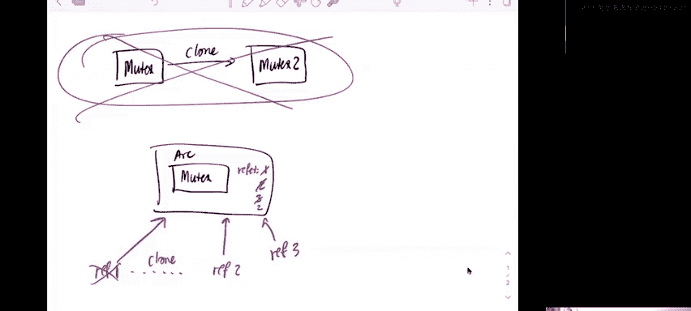


以下是修正后的售票代理程序：

```rust
use std::sync::{Arc, Mutex};
use std::thread;

fn ticket_agent(remaining_tickets_ref: Arc<Mutex<usize>>) {
    loop {
        // 获取锁，guard是一个智能指针，当其离开作用域时会自动释放锁
        let mut remaining_tickets = remaining_tickets_ref.lock().unwrap();

        if *remaining_tickets == 0 {
            break;
        }

        // 处理呼叫
        *remaining_tickets -= 1;

        // 释放锁（remaining_tickets离开作用域）
    }
    // 代理可能休息一下（此时不持有锁）
}

fn main() {
    let remaining_tickets = Arc::new(Mutex::new(250));
    let mut threads = vec![];

    for _ in 0..10 {
        // 克隆Arc，增加引用计数，获得一个新的指向同一Mutex的指针
        let remaining_tickets_ref = remaining_tickets.clone();
        let handle = thread::spawn(move || {
            ticket_agent(remaining_tickets_ref);
        });
        threads.push(handle);
    }

    for handle in threads {
        handle.join().unwrap();
    }
}
```

**关键点解析：**
1.  `Arc::new(Mutex::new(250))`： 在堆上创建一个受互斥锁保护的整数。
2.  `remaining_tickets.clone()`： 克隆`Arc`，增加引用计数，返回一个新的指向同一`Mutex`的智能指针。这不会复制内部数据。
3.  `lock().unwrap()`： 尝试获取锁。如果成功，返回一个`MutexGuard`。这个守卫实现了`Deref`和`DerefMut`，因此我们可以像使用`&mut usize`一样使用它。当守卫离开作用域时，锁会自动释放。这种模式被称为“锁守卫”（Lock Guard），能有效防止忘记解锁。

---

## 线程安全的标记：`Send` 和 `Sync`

当编译器之前抱怨`Rc<RefCell<T>>`不能安全共享时，它提到了`Send`和`Sync`这两个特性。

*   **`Send`**： 标记一个类型的所有权可以安全地**转移**到另一个线程。
*   **`Sync`**： 标记一个类型的引用可以安全地**共享**给多个线程（即`&T`是`Send`）。

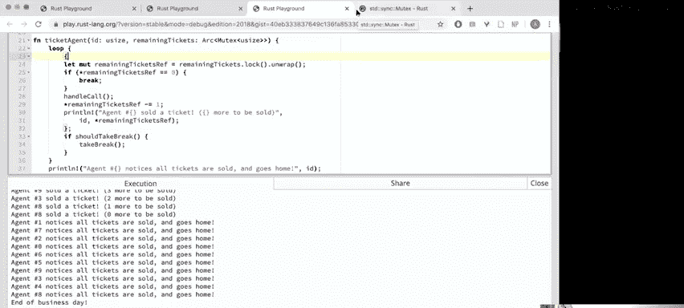

它们是**标记特性**，没有方法，仅用于在类型系统中表达并发安全性。`Arc<T>`和`Mutex<T>`都实现了`Send`和`Sync`（当`T`满足一定条件时），这意味着它们可以安全地用于多线程上下文。而`Rc<T>`和`RefCell<T>`没有实现这些特性，因此编译器禁止我们在线程间传递它们。

---


## 性能对比：一个I/O密集型示例


多线程的一个主要优势是处理I/O密集型任务，例如网络请求。考虑一个“维基百科链接探索者”程序：从一个起始页面开始，找到页面上链接中最长的文章标题。

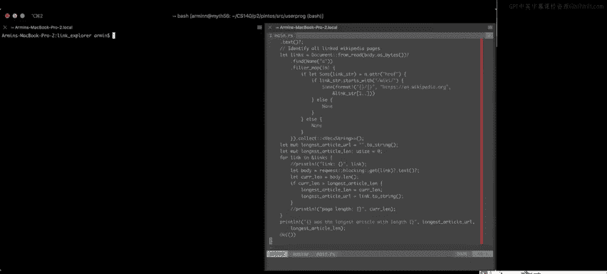

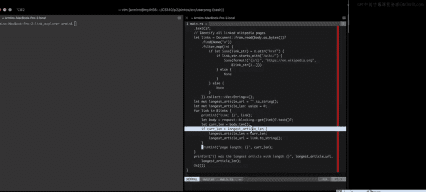

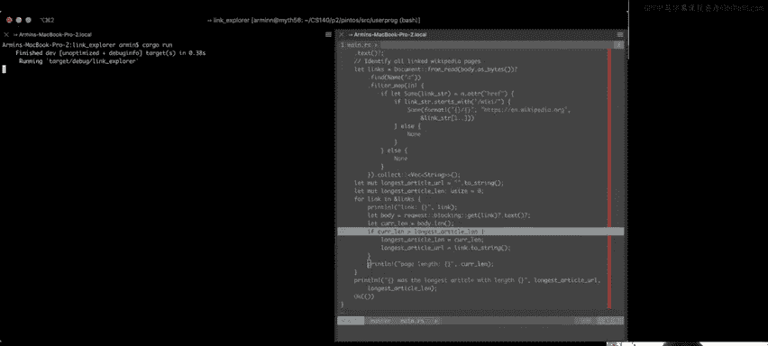

**顺序版本**需要依次下载每个链接页面并检查其长度，速度很慢（例如，可能花费近3分钟）。

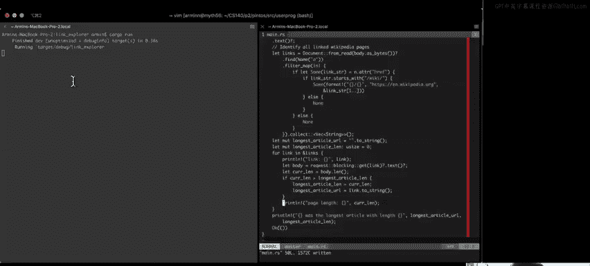

**多线程版本**可以同时发起多个网络请求，极大地重叠了I/O等待时间。使用类似`Arc<Mutex<...>>`的结构来安全地更新“找到的最长文章”这一共享状态，可以将执行时间缩短到数秒（例如9秒），性能提升显著。

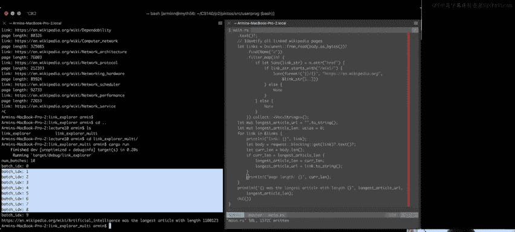


---


## 总结与展望

本节课中我们一起学习了Rust中基于共享内存的多线程编程。

1.  我们回顾了数据竞争的问题，并看到Rust编译器如何通过生命周期和所有权规则在编译期阻止不安全的共享。
2.  我们学习了使用`Arc<Mutex<T>>`组合来安全地在线程间共享可变状态。`Arc`负责所有权的共享，`Mutex`负责访问的互斥。
3.  我们了解了`Send`和`Sync`特性，它们是Rust类型系统用于保证线程安全的核心抽象。
4.  最后，我们看到了多线程如何显著加速I/O密集型任务。

需要注意的是，Rust能防止数据竞争，但无法防止**死锁**（例如，以不同顺序获取多个锁）。这仍然需要程序员仔细设计。

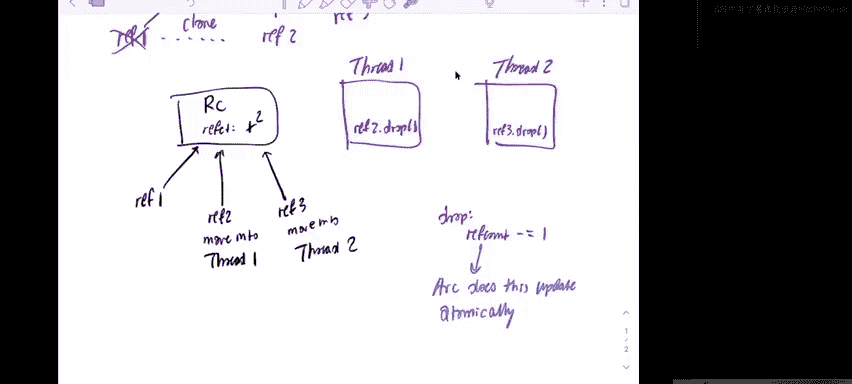

在下节课中，我们将探讨更多的同步原语（如信号量、条件变量），并在后续课程中了解超越共享内存模型的并发编程方法（如消息传递）。