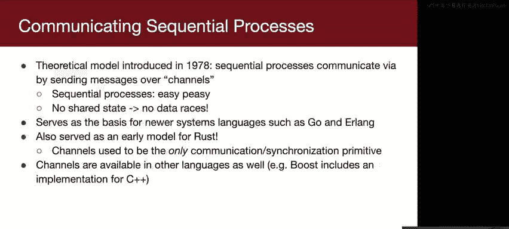
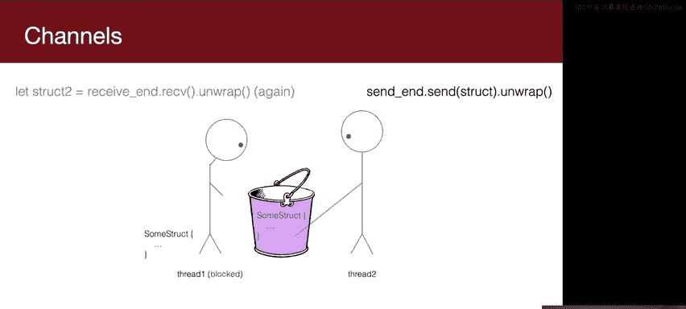
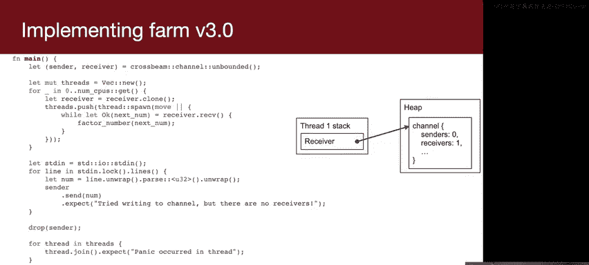

# 斯坦福大学《Rust安全编程｜CS 110L Safety in Systems Programming 2020》中英字幕（豆包翻译 - P12：-12-Lecture 12_ Channels - GPT中英字幕课程资源 - BV1D142147he

Welcome back， everyone。 So welcome to week end of week 6。

 Congratulations on nearly making it through six/10 of the quarter。😊。

It's crazy， we only have four weeks left。Some quick reminders。

 we have the week five exercises due this Saturday， they should be very quick。

 they're really just intended to get you warmed up with multi threading and using muttexes。

So they shouldn't take you long and we also have Project one， the debugger assignment due Tuesday。

 so if you haven't started that yet， please please start like today if possible because it will take some time。

But we are here to help and if youre into any road bumps just message us on Slack。

 we're happy to hop on a Zoom call or do whatever we can。

 we're also staying after class so if you have questions on lecture material or on the assignment。

 please let us know and we'd be happy to help。Also， Armand posted a quick poll on Slack。

So we would like to have some event called Not office hours where we just chat about whatever。

 maybe play some online multiplayer games and yeah I think it'll be a really fun time or we just get to know each other a little bit better given that we haven't been able to meet in person this quarter so if you're interested in that please react to the messages on Slack to let us know when you can make it and we'll announce that tonight。

All right， so today we are talking about a concurrency primitive called channels and in order to understand channels。

 you need to understand the context from which they come like you have to understand the motivation for this。

We've been talking about multi threading for two weeks and you've been learning about primitives like mu tes and conditioned variables and semaphores in order to safely manage multi threadreading。

 but let's let's take a step back and let's think about。

What are the basics that we're dealing with here？Why do we like multi threadreading。

 what are some reasons that multi threadreading is preferable？Anyone can shout some stuff out。

That's true， that's true。Why do we like multi3ing over multi processing。

 Multi processing would also allow us to do something like that。Yeah， sharing data is easier。

 it's just generally easier to work with。And why else？It's faster， yeah。

The contact switching overhead is lower， so if you contact switch between processes you have to swap out the virtual address space and that's more expensive。

 whereas if you context switch threads then you don't have to do that and so it's cheaper and also as you mentioned the communication is also a little bit cheaper writing into a pipe can be a bit slower than just writing to a memory value in the same memory address space。

So those are some reasons that we like multi threading， why do we not like multi threading？

Why is multi thread a huge pain sometimes？Yeah， really。

 it all comes down to we share memory and because we share memory， we can have data races。

 threads can screw up each other's virtual address spaces because it's all the same they all share memory。

 and so that is really the root cause of all of our problems。And so。

Let me make a radical proposition here， What if we tried to preserve the benefits of multi threadreading？

But we didn't share memory。And you're like， wait， Ryan， back the truck up。

 how is that supposed to work like how are we supposed to have threads that work together when data is involved if they can't share memory？

And there's another systems programming language called Go。

 which has become very popular in recent years and it has a slogan that says。

 and I can't read it because Zoom is blocking it， do not communicate by sharing memory instead share memory by communicating and this is getting at an idea of message passing instead of having shared memory you can exchange messages so this is the communicating part that contain information you can put information inside of messages and that's what they mean by shared memory by communicating whatever data it is that you need to collaborate with with different threads。

 you can put that inside of a message and send it to a different thread。

So that you're sharing memory in that sense by kind of copying things in between threads rather than having some shared area and memory where all of the threads are looking。

 each thread has its own memory， and if it needs to share it。

 it sends a message to some other thread so that they can access whatever data it is that needs to be processed and in that sense you're not communicating by sharing memory which is what we typically do in multithreading world。

 you share memory by communicating。Bit of an interesting slogan。

 But it's one that has become very powerful in the last decade。

And really the big point here is you can't have data races if there's no shared memory。

That's kind of what causes us so much pain in multithreadating land is that we're trying to manage this shared memory。

 which has a lot of benefits， but also creates a lot of downsides and if you don't share memory。

 well you can't have data raises。So this comes from a theory called communicating sequential processes。

 you have separate processes that are sequential， so sequential just means like you write some code and it executes in order。

 easyPas， we've been writing that since 106A。And because there's no shared state。

 there's no data races， these processes are isolated， and they communicate over these channels。

This model， it's a theoretical model， but it serves as the basis for a lot of newer systems languages that have responded to the pain of race conditions over the last several decades。

 so you may or may not have heard of go orerling， but there are two languages that really。

 really took this approach to heart and are totally designed around this idea where。

They don't really have Muet， that's not entirely true go actually does provide Mutexes。

 but the language itself is built around these processes or these threads or they call them go routines that that talk to each other not by sharing state and not by using Mut and condition variables but by using channels。

 and actually you may not know this， but this is actually where rust started as well in early rust。

 there were no mu textexes or condition variables rust used to be a lightweight taskbased language and channels used to be the only communication and synchronization primitive。

You can get channels in other languages as well and we'll talk about like what exactly these things are so you have a better sense of what you're dealing with。

All right。I'm going to give you two frames of comparison for you to understand channels。

 and the first is if you understand semaphores， you already understand channels。

So to recap semaphoes， the analogy that I always use to explain semaphores is sephores are like a bucket of balls。

 except you don't actually put real tangible things in the bucket， it's just a bucket of like stuff。

 bucket of permission slips as Jerry calls it or a bucket of whatever it is it's just a metaphorical bucket that you can put things in and take things out of and semaphorees are used for synchronization not for communication because they don't carry data。

 you can't really communicate very much through them but they are very useful for synchronization。

 you always have to pair them with an accompanied buffer or mut text if you want to use them for communication。

So say that you are trying to get some data from Th1。

 we have a buffer in an associated mute text to prevent race conditions with that buffer。

 and then thread1， anytime anything gets added to that buffer。

 thread1 wants to take it out and do something with it。

So the first thing Tread1 should do is wait to ensure that something is in the buffer。

 so threadhread1 will wait on the semaphore。And if the semaphore is nonzero。

 meaning there is something in the bucket， thread1 will go and grab it and because it passes the semapho do weight and knows something is in the buffer so it can lock the buffer。

And then it can go and grab the thing out of the buffer。Something in the chat， or the animations。

Yeah， magic move and Keynote is awesome。Thank you for appreciating my stick figures。

Then the thread can unlock the mutt because it no longer needs it。

 So it unlocks the muttex and now it wants to pull something from the buffer again。 So。

 but there's nothing in the buffer。 So when it calls74 dot weight again。

 it looks into the bucket and it's trying to take something out。 but of course， nothing is there。

 And so that thread blocks。If we now have another thread that comes along and wants to add something to the buffer。

 it first will acquire the lock， so it locks a lock。

Then it puts something inside of the buffer because it has exclusive access to the buffer。

 and then it unlocks the lock。And now to signal that something has been added to the buffer and wake up anybody who's waiting。

 it will call7 for that signal， and so metaphorically this is throwing a ball inside of the bucket。

And thread one will then wake up from its semapho。 weight call。

 and now it knows that something is inside of the buffer so it can lock the lock again。

 take the thing out。And the lock I'm sorry， unlock the lock。Everyone。Makes sense to everyone so far。

This's just semaphos as we use them in 110。So channels are actually the same。

 except instead of being a metaphorical bucket， it actually has associated data storage。

 instead of being a bucket of permission slips or a bucket of balls。

 it's a bucket ofstructs of like whatever kind ofstruct that you want to put inside of it。

And so if threadhread1 wants to take things out of the bucket and process them。

It calls that each channel has two ends it has a receive end and a send end So thread one takes the receive end and calls receive on it and what that does is if there's something there it just pulls it out and it returns it so thread1 will have access to thisstruct。

And then if it wants to process something again， it can call receive and do receive again。

 and of course， if nothing is in there， then it will block until thread2 comes along and calls sendend to end dot send。

And that will place something inside of the bucket。And that will wake up thread1。

 which will receive that struct inside of another variable。Does this make sense to people so far？

Thumbs up， thumbs up。Repeat the function called it sensorens data。Yeah， so it's just dot send。

 and I'll give you a code example that will。Put everything into context。

 but I want you to understand conceptually what's happening here。It's just a semaphore。

Except instead of also needing and accompanying muttex and buffer。

You just have this one communication primitive。You to put things inside of the channel and you can take things out of the channel and if you try to take something out of the channel and there's nothing there。

 then you'll block， you'll wait for something to be added。

Also in this example I've shown a bucket with only one thing at a time。

 but you can have as many things as you want inside of a channel。

 threadread2 could add five things before threadhread one takes anything out and that would be fine then the channel has five things in it and thread1 could call receive five times without blocking the sixth time it calls it'll block because nothing is in the channel。

That's a really good question like what is actually used under the hood it depends on the implementation and I'll talk a little bit about implementation in a few slides in many cases it's a linked list。

😊，Or linked to queue， really like aub doubly linked list。

Okay， so then thread one can take the thing out。 Okay， cool。

 So the other comparison that you can make here is channels are really like pipes from multi processing land with two differences。

😊，They're really fast so in a pipe any time you want to write to a pipe you to make you have to use the write cis call and every time you want to get something out of a pipe you have to use the read cis call you may not realize this buts callss are actually very slow compared to normal function calls and the reason for that is they have to make a context switch into the operating system so the processor is operating at an unprivileged level usually and then whenever you make a cis call。

 the processor has to switch into privilegeed mode where it can access any memory address and do a bunch of things that normal processes are not allowed to do。

So。Using pipes is。It is not slow compared to some other things that you might want to do。

 like writing to disk or reading from a network， but compared to making function calls。

 it is quite slow。Also， channels don't exchange a stream of bytes。

 you could use them to exchange a stream of bytes if you wanted to。

 but you could also just putstructs inside of them， they're strongly typed。

 which is extremely nice for for using them because instead of having to like if you want to send a number for example instead of having to convert the number to a string and send it in and then when you receive it or desialize it back to a number。

 you don't have to do any of that， you just，Put the strs in， the types in。

 whatever data you want into the channel， and then you get it out out and it's the same type。

And if you think back to this Chrome architecture diagram。That we saw last week。

 it has this thing in here called a channel in this IPC and what this diagram is getting at is it has this notion of interprocesed communication channels。

 channels are just pipes， but within in the context of multiprocessing。

 they're just pipes but within an extra layer of abstraction to serialize and deseialized objects into bytes so that when you send something into this IPC channel。

 it gets converted into a string of bytes that can be written into the pipe and then when you read something out of the pipe。

 it converts that string of bytes into an object that is usable by this application。

When we're talking about channels in a multithreading context。

 this serialization and desialization doesn't happen。

 we want them to be as fast as possible and so they're not the same as multi processing channels。

 but it's the same idea。Channels are very much like pipes。

 but they're simpler to use and they're faster。Makes sense。All right。

 so how do we actually use channels And the first thing that you should be asking yourself is。

It's I kind of see where you're going with this and it seems like it might be useful。

But isn't it bad for performance if we're not sharing memory like part of the reason that we wanted to use threads was because it's easy because we're sharing memory and it's also faster than multiprocessing and it seems like we're kind of throwing out that faster advantage。

If we have to pass messages。Can somebody explain why message passing might be bad for performance。

 just like in a sentence？I kind of just alluded to it。

But I want to make sure everyone's on the same page about why this should be concerning。That's true。

 So if we're talking about multi threadreading， well threads already share memory。

And it's redundant to。To pass a message。That's true。

 but redundancy might not necessarily be bad if that redundancy can prevent us from making safety errors。

 then that's probably worthwhile， but there's something else here and I think you're on the right track。

That redundancy is bad， why is it bad， is more than just like redundancy。

You'd put a lock around shared memory。嗯。What would be the memory that you would put the lock around。

 would it be the objects that you put inside of the channel？嗯哼。😊，So that's true。

 it need to be shared in it does need to be stored in the process's memory。

How would you if you had to design this yourself， Actually， let's let's talk about this。

 I'm going to talk about it in later in the slides， but， but we should talk about it now。

 if you were to implement this thing。How would you implement it like yes。

 thisstruct needs to be stored somewhere in memory， but where would you put that lock？So。

It would need to be on the heap。But the problem is that if。啊。

I'm trying to think of a way to explain why it's difficult to put locks around arbitrary data。

Usually when you're writing a program and you're using locks you know what data you have and you have multiple threads trying to access that same data at the same time like you have a global variable somewhere or some variable that gets shared between threads。

 all the threads know what that variable is and they know that they know exactly where the variable is and they know that there's a lock protecting that variable and so before touching the variable they acquire the lock then they touch the variable but in this case。

Thread1 is just being handed things by some number of other threads in this diagram。

 I've only drawn one other thread that is handing it things。

 but we could imagine that there are five different threads that are producing work that needs to be processed or producingstructs that needs to be looked at for whatever reason and they're just handing it to thread1 and so in the code for thread1。

 we don't really know。It's not like there are five different variables somewhere that we can look at and we're like okay I need to fetch from these five variables it's just there's this incoming data stream that threadread1 is receiving and threadread1 doesn't know how manystructs are going to come out of this channel is just repeatedly like trying to pull something out and then looking at it trying to pull something out and looking at it trying to pull something out and looking at it and so using locks on the individual data doesn't make as much sense here because there is no central place where。

Where we're looking for that data， if that makes sense because we don't even know how many。

How many pieces of data， how manystructs we would need to look at。

 We don't know how many variables there are so。Does that make sense at all？

I think it might be helpful to think about like last lecture。

 the thing that we implemented at the end， like the sum++ is like very similar。

 right like you're taking these messages and you're putting them somewhere and then you're just pulling them out of some structure。

So it's like they don't live like all in a centralized place， you're taking them。

 you're queuing them up and then you're providing them to some sort of receiver that's going to take them off that queuee does that make more sense or？

And actually， I think the sum++ thing may be a little confusing for this context that I'm trying to give。

If we go back to the motivation for channels。So it was in this。诶。This slide。

 what we're trying to do is we're trying to avoid race conditions。

But instead of doing it by using locks so normally race conditions happen because you have some variable that is shared between threads and then multiple threads are trying to access that memory at the same time。

 what we're trying to do here is we're trying to create a totally different paradigm of doing multithreading and we're saying we're not going to share memory at all If you want two threads to communicate there're not going to go look at some shared data structure that has a lock on it or something like that There's going to be no variables that are shared between threads。

 no globals， nothing every every thread has separate memory。And if they need to talk to each other。

 then they're going to pass messages to each other。

 so thread1 is going to like put something in an envelope and throw it at thread2。

 thread2 is going to receive it and it's going to be like oh， I have this data now now I can use it。

So that that should feel expensive， like， like detach yourself from everything you know about multi threading right now and just think about this as as a thought experiment because。

It turns out that in practice this is not actually what we do。

 but I want you to understand why that is， why it is that we don't follow this ideal theoretical model。

 I mean this is a theory from 1978 it's been around for a long time and it's well appreciated that if you follow this model。

 you won't have data races because you don't share data if you want to pass data around you pass it in these messages。

But why is that expensive？That's partially true So you said anytime they need data they need to like read or write it so the threads do have their own memory。

 it's just that they aren't sharing memory with other threads and so really the problem that I'm trying to get at here is if you have data that you want multiple threads to be working on。

They all need to have their own separate copies of that data。They don't share memory。

 therefore if you have some data that all the threads need to work with。

 they all need to have their own separate copies of that data and if you say you have like a vector of gigantic strings and you're trying to take that vector of gigantic strings and you're trying to share it with another thread you're trying to send it over to another thread if you want to put that in an envelope。

You better find a really fat envelope because you're going to need it in order to send that huge vector of a ton of really long strings and then you have to send that to this other process and that is really expensive。

 there's a lot of overhead associated with copying here if you want to have each thread have its own copy of data that's great。

 you're not going to have data raises， they're not sharing memory but now you have to deal with this overhead of copying data here。

 copying data there， copying data here and all of this replication of data in a lot of places。

That is what strikes me as being problematic about this approach is now you have a bunch of copies everywhere and copying memory is not cheap。

 especially if it's really big if you're just sending a number，It doesn't really matter。

 but if you're trying to send over a vector of strings。

 now you're going to have to copy that to another thread and what if you're just trying to move it to another thread？

Like what if you're trying to send a vector of strings to another thread and you're not going to use it after that。

 Really， it would be nice if you could just。Say， oh， here's a pointer to this region of memory。

 but if you're not sharing memory， then you can't do that， you have to copy it over。

 even though you're about to discard your own copy。Does this make sense what the problem is？

So what do we actually do and oh boy， I'm going to have to go through all my animations again。

This is fun。All right。So what do we actually do and the key here is that when we talk about channels almost always this may not be true in some programming languages。

 but in all the ones that I know of， they don't actually follow the theory of communicating sequential processes that theory says that all the processes。

 they call them processes， but you call them whatever you want， some languages call them threads。

 some languages call them go routines， some call them tasks， it's the same idea。

That theory says that they should not share memory and exchange they should communicate exclusively by using channels and actually that's not what happens。

 We share some memory， so we do share the heap and when we put information into channels。

 we make a shallow copy of that data so we are doing some copying。But it's only a shallow copying。

 we're not copying all of the data here， and to help you visualize this。

 let's say that we're trying to pass a vector of in this case numbers。

 but it could be a vector of really huge strings。Let's say we're trying to pass a vector from one thread to another。

 so when we put this in the channel， really according to channel's theory。

 we should be copying the entire vector， we should be doing a deep copy of this whole vector and putting it inside of the channel。

 copying it somewhere where the other thread can receive it。But that's not what we do。 We。

 we do make a copy， but it's a shallow copy of of the vectorstruct and that vectorstruct contains a pointer to the heap where the actual data resides。

 So this isn't a very expensive copy。 This is a pretty small struct。

 I'm sure Vec has more fields in it than than this。 But the way that I've drawn it， This is just。

Two numbers and a pointer， let's assume that the numbers and the pointer are the same size。

 so this would be 24 bytes。That's not a big deal to copy， especially if that vector is really huge。

 and then thread one copies it into its stack。 but that's also okay。

 It's really not a big deal because we're only doing a shallow copy here。

 We are sharing memory to the heap， but。But。But we're going to say that's a tradeoff we're going to make。

Because we don't want to have to copy huge amounts of memory every time we want to send something into the channel。

So you might say like， hey， that seems problematic。

The whole reason we're talking about this is because channels are supposed to be able to be another model for safety if we use channels。

 then we can't have data races right and the only reason that this works is because the threads aren't sharing memory now you're telling me that they're sharing memory what's going on here and actually that's true。

And in go， for example。You can still have data races the channel model as implemented in practice fails to prevent data races if you pass a pointer into a channel which you are doing when you pass a vector。

 if you pass a pointer into a channel，Now you have。

You can potentially have multiple pointers to the same data。

Because you're copying that pointer into the channel and then you're copying it out now you have multiple copies of a pointer to the same location in memory if you had copied the entire vector it would be fine that you have two vectors on both ends because they're deep copies of each other and they're separate but if you copy just the vector struck and it's pointing to the same region in the heap。

Now you have two pointers to the same region of memory and you can still have data races。

 and I've read horror stories of application developers trying to debug things because they passed something into a channel and then they accidentally used it again after that。

And the language doesn't prevent you from doing that。

 but as you might imagine Ru's ownership model does not allow you to do that when you send something to a channel。

 ownership of that value gets transferred to the channel so you can't use it after that。

And say that you pass a VC into a channel， what it's doing is it's taking ownership of the V struct。

 so you can't use it after that， but it's not doing a deep copy， it's not copying all of the data。

 it's only copying just those 24 bytes of the struct itself。Does this make sense to people？Thumbs up。

 thumbs down， any any questions？All right。I'm going to give a code example of how to actually use this。

 but before I do that I need to talk about the API and this is a little bit of a sad conversation because。

This is one place where where rust actually does not shine at the moment so the ideal channel is what we call anmpMC channel that stands for multi producer。

 multi consumer that means that you can have multiple threads sending to the channel at the same time。

And you can also have multiple threads receiving from the channel at the same time。

 so a pipe in multiprocesing is multiproducer or multiconsumer because you can dupe a file descriptor to multiple processes。

 you can dope the right end multiple processes you can do the read into to multiple processes you can do whatever you want and this is the ideal channel because it gives you the most flexibility you can do whatever you want with it if you only want to have one thread sending in one thread receiving that's fine too。

 but you have the option to have multiple threads sending of multiple threads receiving at the same time。

It turns out that you actually already know how this works because you implemented this on Tuesday。

 Arman walked through the implementation of we called it SM++ back then。

 but really that was a channel。And if you think about the Semaphore channel stick figure thing。

 that's basically what we implemented， it's just a simple mutt with a V deck， which is just a queue。

 and a condition variable to wake threads up when things get added and whatnot。

So this seems really easy to implement， so why are we talking about this in the first place。

 like why aren't all channelsmpMC？And the reason is that it has to do with performance。

Why might this approach not give us the performance that we want？Does anyone have any guesses？

So you have to lock a mutex before touching the queue and therefore only one thread can touch the queue at a time。

 that is true， that is what gives us safety。嗯。So that is preventing race conditions in the channel implementation。

 why is that potentially a bad thing？You're right， by the way。Interesting。So it's not multi producer。

 multi consumer in the sense that you can't really have multiple threads writing at the same time。

All right。That is true。You。You could make that argument。But then I'm not sure if you ever can have。

 I think by that definition， I'm not sure if you ever can have a real multi producer multi consumer cu because if there is one cu。

嗯。If two threads were to be able to add to the queue at the exact same time。I'm not sure。

MaybeMaybe it is theoretically possible to have some cue。Yeah。

 maybe it is possible to have a theoretical model where like two threads can add at the exact same time。

 but I haven't heard of anything like that in practice just because the queue has to exist somewhere physically in memory and。

You'd have to come up with a really clever solution to allow two threads to modify it in such a way that when they're modifying at the same time。

 the end result is coherent and includes both of the things that they added。So we actually do。

 we're okay with having one thread writing at any particular instant。

 but a muttex is still something that we would like to avoid。So there's two parts to this。

The first part is。Okay， we don't want to have multiple writers at the same time。

But if what if one thread is adding to the Q and one thread is removing from the Q at the same time。

 should we allow that？So it does seem like in theory there should be some ways to do something like that。

 and I mentioned that the channels are often implemented as a linked list and that's one of the reasons why because if you're modifying the two ends of the queue。

 as long as you're not modifying the same thing at the same time。

Then then we might be able to come up with the solution and it seems like there should be some way to allow one thread to be pushing onto the queue and one thread to be popping from the queue at the same time that will improve performance because if you have a thread that is adding a ton of things to the queue in rapid succession like very very quickly you also want it to be able to pop things off the queue as fast as possible and those two operations don't necessarily have to conflict with each other。

So that might be something that we want to allow， and a Muex won't allow that because both of those operations are modifying the queue and with a Muex。

 you can't do that。Another thing is that mutt are actually。U， they're not cheap。

Because say that you try to acquire a lock。 first of all。

 a Mutex involves a system call so and we already mentioned that we want to avoid system calls if possible。

 So Mutexes are already expensive off the bat regardless of how they're implemented and the way that they're implemented。

Is say that you want to touch the cu， but somebody already holds to the lock。If that happens。

 you're actually taken off the processor and you get added to the queue of processes and you don't get to run again until you get scheduled to the processor again。

 so a typical time slice on a CPU might be something like 10 milliseconds。

If you're at the very beginning of your time slice and you get booted off the CPU。

 you don't get the rest of your 10 milliseconds， even if you only used 100 nanoseconds。

 you've lost the rest of your time slice purely because you attempted to acquire a Muex and it was already locked and furthermore you're going to get booted to the bottom of the queue until you get your processor time again and so it might be like a significant amount of time。

Before you get scheduled on on the CPU again， and if these Q operations。

 these Q and DQ operations are really， really， really fast。

 like if this takes on the order of 50 nanoseconds to add something to the queue or to remove something from the Q。

It would be ideal if we didn't give up our time slice just because somebody is currently modifying the queue it would be better if we could stay on the processor busy waiting we mentioned one time the busy waitinging is usually bad but there are certain really high performance situations where busy waiting is actually a good thing because you don't want to give up your time slice and let other processes run because you know that I just need to wait like 50 more nanoseconds I really don't have to wait that long just give me 50 more nanoseconds and I'll be fine please don't take me off the processor because I'll be ready in just a moment。

And so if we want a fast implementation， we can't use locks and this is very very very difficult to implement well G channels arempMC。

 but they're known for being slow because they basically do a muttex V deck they just instead of using a muttex they use a F text they're called which is a fast userspace mutexs it avoids the system called part but it doesn't avoid the locking part and goes channels are slow for that reason there's a question from Hannah in the chat and I just wanted to compare。

嗯。My zoom is not right， I think you're muted。I still can't hear you。The question is。

 is there an issue if the queue only has one element or if it's empty because earlier you were mentioning that you could like simultaneously pop and push and presumably yeah。

 you know， it just has one element you need to synchronize access to that。For sure。

 there are a lot of edge cases that you have to worry about。

 and those are just more examples of why it's so difficult to implement this without a mutex。

It's it's really hard to get this right， but Rus said we need to get this right。

 we really don't want a slow channel because especially at the beginning when channels were the only option available。

 they needed to be fast。And。And soR does not have an MPMC channel R channel is actually an MPC channel。

 single consumer and that's not ideal， so it's great if you want to have if you want to aggregate results of an operation。

 it's also great if you just have two threads that are talking to each other。

 but it doesn't really work so well， if you need to broadcast messages or distribute messages for example。

 like if you want to have a work queue where you have a bunch of stuff in the queue and a bunch of workers take stuff off the queue and process them also because this is one of R's earliest APIs。

 there is a lot of inconsistent terminology and places where things are not so intuitive。

 there's a really good article that I linked here that talks about this is one of the core RE developers saying we need to overhaul channels and there's a pretty good chance that within a year or two the rust channels's standard library implementation will be replaced they're either going to keep the。

APpiI and replace the implementation or they're going to deprecate it entirely and introduce a different API they definitely will keep channels because they view this as a very important feature in modern concurency。

 but they they acknowledge that there's issues with the standard library channel and。

They're going to replace it。 What are they going to replace it with。

 There's a crate called crossbeam， which is maintained by this core rust developer and。

Basically what he did with this crossbe implementation is he said if we were to redo rest channels from scratch。

 how would they look if we didn't have any historical legacy that we were trying to uphold and we were to do it from scratch how would they look so he redid the API and the implementation is extremely fast。

 it's mostly lock free。And it's even faster than the existing MPC channels that that R has。

 So he went through a lot of iterations and it took a really long time to develop。 but this works。

 And if you're interested in the implementation， there's a really good read that is linked here。

So in this code， I'm going to be talking about crossbeam channels， not standard library channels。

 and if you use channels in your code， it' is a good idea to use this library instead of the standard Library one because this is the officially recommended one for now and very soon the standard library channel may change。

And by the way， if you want to use channels in other languages， I mentioned this earlier。

 but channels are not specific to rust， they're a really good idea in general。

 and if you want to use them in other languages， there are libraries， for example。

 like Bot provides channels for C++ and so you can check those out。All right。

 so in the remaining four minutes， I'm going to talk through。How you actually use these things。

You call crossbeam channel unbounded to create an unbounded channel and unbounded means that there's no fixed capacity of the channel。

 it's just a queue with an unlimited buffer size can。

You can add things in until you run out of memory。And this returns you two objects。

 a sender object and a receiver object or a sender struct and a receiver'sstruct。

 those are really handles to the underlying channel and they're managed so that the underlying channel struct has a reference count of how many senders and how many receivers are active are active it's really similar to RC and Arc in this regard like when you clone an RC or an arc it increments some internal reference count that's sort of similar to what is happening here。

So it returns these two ends of the channel and what we're going to do also I should mention I got ahead of myself what we're doing here is we're just reimplementing farm again for the third time so in the week five exercises you reimplemented farm which was like a more basic version of farm that doesn't support receiving numbers via standard in。

So that version took all the numbers to factor in ArgV so that they are all present upfront and you didn't get any numbers added later on。

 and that really simplified things quite a bit。 This version is going to be the fullflged to version of farm it receives numbers via standard in。

 you can type numbers at any point you can type in a bunch of numbers。

 it can finish factoring everything and then you can type more numbers and it will factor those numbers as well。

So we'll spawn a bunch of threads identical to the number of CPUs that we have and then we'll call receiver。

 clonene and what that does is it creates it just clonenes the receiverstruct。

 it's not actually cloning the channel and this is doing the trick similar to RC where it it's really oh I didn't update the reference count here I should have。

 but it's really just incrementing the reference count in the underlying channel struct。

Then what we'll do is we'll spawn our thread and our thread is just going to loop。

 so while it continues to get numbers out of the channel， it will try to factor them。

So two things happening in this code here that I want to highlight。 first of all。

 this move is going to move any reference variables into the threads the thread stack。

And so we're using this receiver variable here， and so what that's going to do is it's going to move receiver into Thread2's stack。

So now the thread2 has that and also this like while let okay thingy you may not have seen before。

 all that is doing is it's saying while receiver dot receive。Returns the O enum。

Unwrap the OK Eum into this variable called next nuum。

So it's going to basically unwrap the return value of receiver do receive。

 and then once receiver dot receive returns error， it's not going to panic。

 it's just going to break out of the loop。So this is saying read until receive returns error and when does receive return error。

 receive returns error when the channel is closed， so when there are no more senders to the channel。

And you try to receive from that channel。 that's when receive will return error。

 It's kind of like calling the reads cis call on a pipe。It read doesn't return an error。

 but it returns zero to indicate that you've reached the end of the file。

 that's kind of what's happening here， it's returning error to indicate that you've reached end of file in the sense that no more data is coming because there are no sends here。

Then our program， the main thread is going to read from Standard In and so it's going to try to repeatedly read alignign from Standard In and parse that as a number。

And then it is going to write that to the channel。 So it's going to send the number to the channel。

Likewise， send also returns a result and it just returns an error if if there are no receivers。

 if you're trying to send to a channel where there are no receivers， that seems suspicious。

 that's probably a mistake and so it returns an error to indicate that hey you're trying to send to a channel where nobody's listening。

 that's probably not good and in this case that definitely should not happen if that happens something's terribly wrong with our program and so that's I called expect here saying just panic if that happens。

嗯。Then what we do is after we have written some numbers， we drop the sender。

 so this is something you may not have seen before because usually when a variable goes out of scope it gets automatically dropped and that's how we've been dropping our variables。

But rust has an option to drop early if you want to， it's basically calling free on the memory。

 except the compiler is smarter than that， and it ensures that you can't have use after freeze and it also ensures that there are no double freeze or anything like that。

So if you want to drop the sender early， you can call a drop sender effectively kind of kicking it out of scope and that will remove that from the sender stack。

 so now there are no senders。Which means that the channel is closed。

 so any workers that are in that while loop that are trying to read from this channel。

 receive receive is going to return an error。So they'll break out of their while loop and that will be the end of those worker threads。

 so the last thing that we do here is we join all of the threads to make sure that they exited successfully and did not panic and to free up any resources。

So that was a whole lot in six minutes apologies for going over in a moment we can stay after and I'll answer any questions but I just wanted to conclude by saying you should pick the right tool for the job channels I love channels that work really great they're such a simple and elegant interface and in many cases you can get by without using any Mu textexes or condition variables they're much simpler to use and even in rustT。

 I think Rut does an amazing job with Mu textexes but even in rustT you can still have issues if you lock or unlock at the wrong time。

嗯。So as a quick example， if you're implementing a semapho and you CV do weight to ensure that the counter is greater than zero。

But then you unlock and re before decrementing the counter。

 it's possible for some other thread to get in at that moment， decrement the counter to zero。

 and then you try to decrement the counter and it's already zero and so we end up with an issue there。

The compiler doesn't complain because you're holding the lock whenever you're touching the variable but that's still a problem。

 And in general when you're using channels， it's just easier to reason about and you don't have these sorts of issues So channels have their own issues And I mentioned Rus started out with channels and they added mut Texas。

 Why did they add mutt Well channels don't always work particularly when you have global variables。

 So if you have a global cache that you want all the threads to share or if you have a global counter think like ticket sellers。

 for example， it's very difficult because you have to replicate that state across all of the threads。

And that's very hard to do well， so if you're using this kind of scenario where you have a global value that you need to maintain。

 then channels probably aren't the best choice。That's all I have for today Thanks for coming and please stay after if you have any questions about that code example or about the assignment or whatnot and we'll see you next week。

