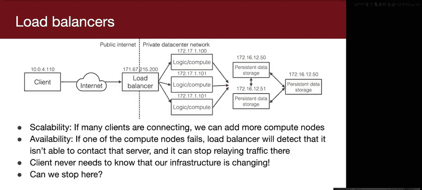
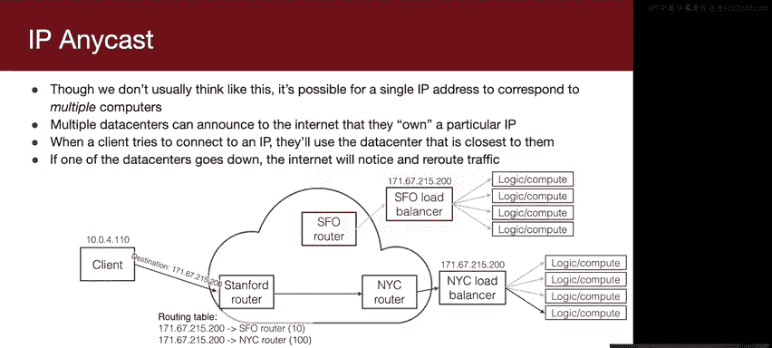
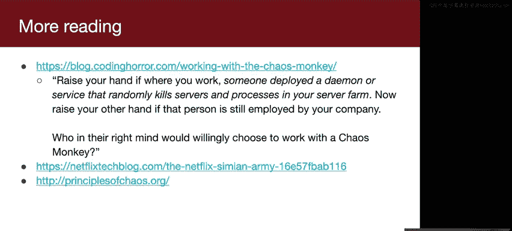

# Rust安全编程：第13讲：可扩展性与可用性

在本节课中，我们将学习网络系统设计中的两个核心概念：**可扩展性**和**可用性**。我们将从网络基础知识开始，了解IP地址、端口和连接的工作原理，然后探讨如何设计能够应对高流量和组件故障的大型系统。课程最后，我们将一起总结所学内容。

---

## 网络基础回顾

在深入讨论系统设计之前，我们需要确保大家对一些网络基础知识有共同的理解。如果你对以下细节不完全理解，不必担心，本课程不涉及具体代码实现。但理解这些概念有助于我们后续讨论抽象的系统设计。

### IP地址

网络上的每台计算机都有一个**IP地址**，用于唯一标识它。一个IP地址由4个字节组成，通常表示为四个0到255之间的数字，用点号分隔。例如，`192.168.1.230`是一个有效的IP地址。

如果你想与网络上的另一台计算机通信，你需要知道它的IP地址。这就像寄信需要收件人的地址一样。

### DNS服务器

然而，我们通常不直接记住IP地址（例如，很少有人记得Google的IP地址）。为了解决这个问题，计算机会配置一个**DNS服务器**的地址。当你想要访问`google.com`时，你的计算机会询问已知的DNS服务器（例如`8.8.8.8`）：“`google.com`的IP地址是什么？” DNS服务器会回复相应的IP地址，然后你的计算机就可以直接与Google服务器通信了。

### 端口号

端口号的概念有时会让初学者感到困惑。一个常见的类比是：将互联网上的每台计算机看作一个**公寓楼**。

*   **IP地址**就像是公寓楼的街道地址。
*   **端口号**就像是公寓楼内的**单元号**。

例如，如果你想访问`web.stanford.edu`的网页服务（HTTP），你需要：
1.  通过DNS找到它的IP地址（找到公寓楼）。
2.  然后“敲开”运行HTTP服务的“公寓门”，即**端口80**。

同样，如果你想通过SSH连接到`my.stanford.edu`，你需要找到它的IP地址，然后连接到运行SSH服务的**端口22**。

这些端口号是约定俗成的标准。虽然你可以将自己的服务运行在任何端口上，但使用标准端口（如HTTP用80，HTTPS用443，SSH用22）能让其他人更容易找到你的服务。

---

## 连接是如何建立的

上一节我们介绍了地址和端口，本节我们来看看两台计算机之间是如何建立连接并通信的。

在计算机网络术语中，**主机**就是指一台计算机。每台主机上运行着一个或多个进程。

### 服务器端：绑定端口

如果一台主机上的一个进程（例如PID 1234）想要提供一个网络服务（如Web服务器），它需要执行一个称为**绑定到端口**的操作。

1.  **选择“公寓”**：进程需要选择一个端口号，例如Web服务器选择端口80。这就像在公寓楼里选一个单元住下。
2.  **设置“等候名单”**：进程会在“公寓门外”安装一个“等候名单”（在操作系统中，这对应一个特殊的文件描述符，称为**监听套接字**）。当其他计算机尝试连接这个端口时，它们会“在名单上签名”排队。
3.  **接受连接**：服务器进程通过读取这个特殊的文件描述符，可以知道有新的连接请求到来。然后，它使用`accept`系统调用将客户端从等候名单中“请进公寓”，并创建一个新的、专门用于与该客户端通信的**套接字**（另一个文件描述符）。

一台主机上的不同进程可以绑定到不同的端口，但**同一个端口只能被一个进程绑定**。一个进程也可以绑定多个端口（例如，Web服务器同时绑定80和443端口以支持HTTP和HTTPS）。

### 客户端：发起连接

现在，假设网络另一端的另一台计算机（客户端）想要与这个服务器通信。

1.  **寻找服务器**：客户端首先通过DNS找到服务器的IP地址。
2.  **连接与排队**：客户端尝试连接到服务器的特定IP地址和端口。如果该端口有服务在监听（即有“等候名单”），客户端会将自己添加到名单中排队。
3.  **建立双向通道**：服务器接受连接后，双方都会获得一个新的文件描述符（套接字）。**关键点在于**：这个网络套接字是**双向的**。客户端和服务器都可以通过它同时读取和写入数据，这与单向的管道不同。
    *   如果客户端向它的文件描述符写入数据，这些数据会通过网络发送到服务器对应的文件描述符。
    *   如果服务器向其文件描述符写入数据，客户端也能读取到。

这种抽象隐藏了网络底层复杂的传输细节，我们只需要关心对文件描述符的读写操作即可。

---

## 系统设计：可扩展性与可用性

理解了基础连接机制后，我们现在可以退一步，从更高的视角思考系统设计。本节我们将聚焦于两个关键属性：可扩展性和可用性。

### 什么是可扩展性？

**可扩展性**指的是系统随着需求增长而扩展的能力。

*   **理想情况**：系统支持线性或次线性扩展。例如，用户量增加10倍，只需将服务器数量增加10倍（线性）或更少（次线性），这非常高效。
*   **糟糕情况**：系统无法扩展。无论投入多少资源，其处理能力都存在上限（例如，最多支持1000个并发用户）。

### 什么是可用性？

**可用性**指的是系统保持在线、避免停机的能力。

高可用性极具挑战性。假设单台服务器的可用性是99.99%（每年停机不到1小时）。如果你有一个由1000台这样的服务器组成的系统，并且**每台服务器都必须正常工作**整个系统才能运行（即没有容错设计），那么系统的整体可用性会急剧下降至约90.48%（每年停机超过一个月）。这说明，在多服务器系统中，**容错设计**至关重要。

可扩展性和可用性有时会相互冲突。为了使系统更易于扩展，我们可能会增加其复杂性，而这又可能降低其可用性。

---

## 从单服务器到负载均衡

上一节我们定义了可扩展性和可用性，本节我们来看看一个简单的单服务器架构，并分析其局限性。

一个简单的网络服务模型是：客户端直接连接到单个服务器的IP地址。服务器可以为多个客户端创建多个连接（例如，使用多线程，每个线程服务一个客户端）。

**问题**：这种架构可扩展吗？
答案是否定的。单台服务器的能力（CPU、内存、网络带宽、文件描述符数量）存在物理上限。当用户量增长时，你只能通过升级硬件（“纵向扩展”）来应对，但这成本高昂且很快会达到技术极限。此外，单台服务器也构成了**单点故障**，一旦宕机，整个服务就不可用。

**解决方案**：我们不应只进行“纵向扩展”（使用更强大的机器），而应进行“横向扩展”（使用更多普通机器）。这是谷歌等公司早期成功的关键理念之一：使用大量普通商用服务器协同工作，而非依赖少数超级服务器。

---

## 引入负载均衡器

为了横向扩展，我们需要将流量分发到多台服务器上。但客户端只知道一个IP地址（例如`google.com`），如何指向多台服务器呢？答案是引入**负载均衡器**。

负载均衡器是一台专门的服务器，它的作用是：
1.  对外提供一个IP地址供客户端连接。
2.  内部维护一个**后端服务器**（或称为计算节点）池。
3.  当客户端连接到来时，负载均衡器接受连接，然后**选择一台后端服务器**，并在客户端与该服务器之间**转发**所有网络消息。

以下是负载均衡器带来的好处：
*   **可扩展性**：当流量增加时，我们可以轻松地向池中添加更多后端服务器。负载均衡器会自动将新连接分发到所有可用节点上。现代云服务（如AWS）支持自动伸缩，可以根据负载动态增减服务器。
*   **可用性**：负载均衡器可以监控后端服务器的健康状态。如果某台服务器故障，它可以停止向其发送流量，从而避免影响整体服务。客户端对此完全无感知。

此时，系统的架构变为：`客户端 -> 负载均衡器 -> 多个后端服务器`。后端服务器通常是无状态的（或状态存储在独立的、可扩展的数据库中），这使得它们很容易被复制和替换。

---

## 负载均衡器本身的扩展

上一节我们通过负载均衡器解决了后端服务器的扩展问题，但负载均衡器本身也可能成为瓶颈和单点故障。本节我们探讨如何让负载均衡器也具备可扩展性和高可用性。

单个负载均衡器存在两个问题：
1.  **可扩展性瓶颈**：即使它只做简单的转发工作，其能处理的并发连接数和网络吞吐量也存在上限。像YouTube这样的服务，其流量绝非单台机器所能承受。
2.  **单点故障**：如果这台负载均衡器宕机，整个服务依然会中断。

### 方案一：DNS轮询

一种方法是配置DNS服务器，使其为一个域名返回**多个负载均衡器的IP地址列表**，并且每次响应的顺序是随机的。

*   **工作原理**：客户端拿到IP列表后，会尝试连接第一个，如果失败则尝试第二个，依此类推。不同的客户端可能拿到不同顺序的列表，从而将流量分散到不同的负载均衡器。
*   **缺点**：
    *   **不够智能**：无法根据负载均衡器的实时负载进行调整。
    *   **DNS缓存**：DNS响应会被中间网络缓存，导致一段时间内大量客户端连接同一个首选IP，造成负载不均。
    *   **故障切换慢**：当一台负载均衡器故障后，客户端需要依次尝试连接失败后才会切换到下一个，增加了连接延迟。

### 方案二：基于地理位置的DNS和任播

大型服务商（如Google）使用更高级的技术。它们在全球拥有多个数据中心。

*   **基于地理位置的DNS**：DNS服务器会根据客户端的来源IP，返回距离最近的数据中心的负载均衡器IP地址。这降低了延迟，并实现了流量在全球范围的分布。
*   **任播**：这是一种网络层技术。多个数据中心可以**宣告同一个IP地址**。互联网中的路由器会根据路由协议（如BGP）的成本（通常与距离相关）选择最优路径，将数据包导向最近的数据中心。如果某个数据中心故障，路由器会自动从路由表中移除该路径，流量会被导向其他宣告相同IP地址的数据中心。客户端完全感知不到这一切换过程。

在实际的数据中心内部，也会采用多台负载均衡器构成集群，并结合故障转移机制，进一步消除单点故障。

---

## 混沌工程：主动拥抱失败

在结束关于可用性的讨论前，我们介绍一个由Netflix推广的有趣理念——**混沌工程**。

设计高可用系统时，我们必须假设任何组件都会失败。但问题在于，在复杂的系统中，你很难预测所有可能的失败模式及其连锁反应，直到它真正发生。

混沌工程的核心理念是：**在受控环境下主动注入故障**，而不是被动等待它在凌晨三点意外发生。Netflix开发了一系列工具：
*   **Chaos Monkey**：随机终止生产环境中的虚拟机实例。
*   **Chaos Kong**：模拟整个AWS区域（包含多个数据中心）故障。

这样做的好处是：
1.  **在可控时间内发现问题**：在工程师准备好的时候进行故障测试，便于快速定位和修复。
2.  **推动构建更健壮的系统**：当团队知道生产环境会随机发生故障时，他们就有更强的动力去设计能够容忍这些故障的系统架构。这样，当真实的硬件故障发生时，它只不过是系统日常处理的“噪音”而已，不会引起服务中断。

混沌工程是一种通过主动制造混乱来提升系统韧性的创造性方法。

---

## 总结

本节课我们一起学习了构建大型网络系统所需的核心概念。

1.  **网络基础**：我们回顾了IP地址、DNS和端口号的工作原理，以及客户端与服务器之间通过套接字建立双向连接的过程。
2.  **核心目标**：我们定义了系统设计的两个关键目标——**可扩展性**（应对增长的能力）和**可用性**（保持在线的时间）。
3.  **架构演进**：我们从简单的单服务器架构出发，分析了其局限性，并逐步引入了**负载均衡器**来解决后端服务器的扩展和部分可用性问题。
4.  **高级技术**：我们探讨了负载均衡器自身的扩展方案，如DNS轮询和更先进的**基于地理位置的DNS**与**任播**技术，这些技术被谷歌等大型服务商用于实现全球范围的高性能和高可用。
5.  **设计哲学**：最后，我们了解了**混沌工程**这一通过主动注入故障来提升系统韧性的前沿实践。

理解这些设计模式和思想，对于构建能够安全、可靠地服务数百万用户的现代软件系统至关重要。