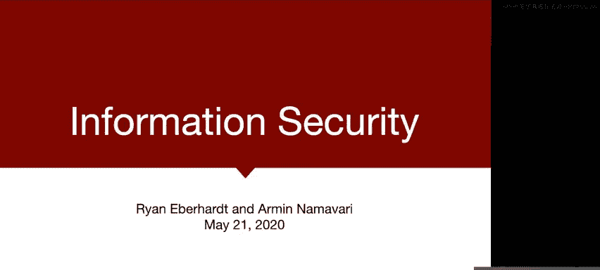
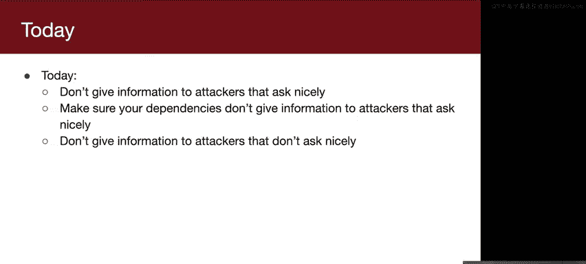
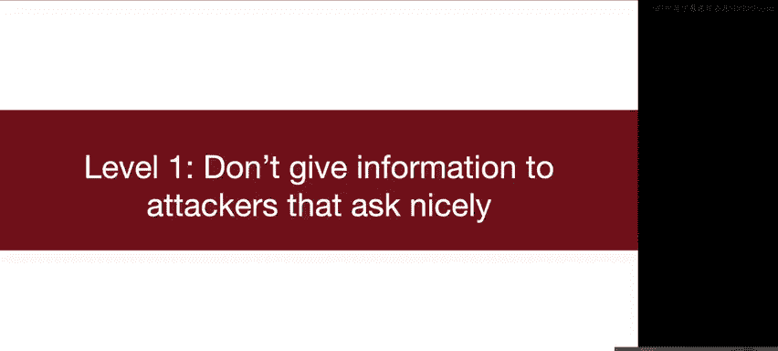
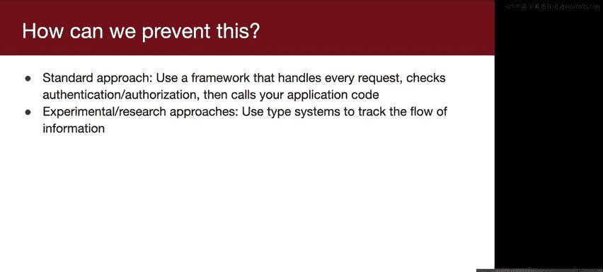
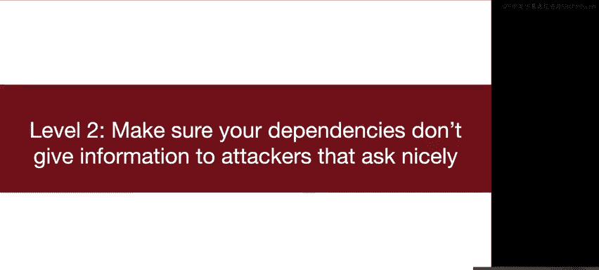
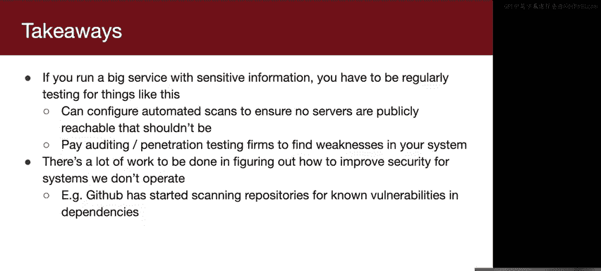
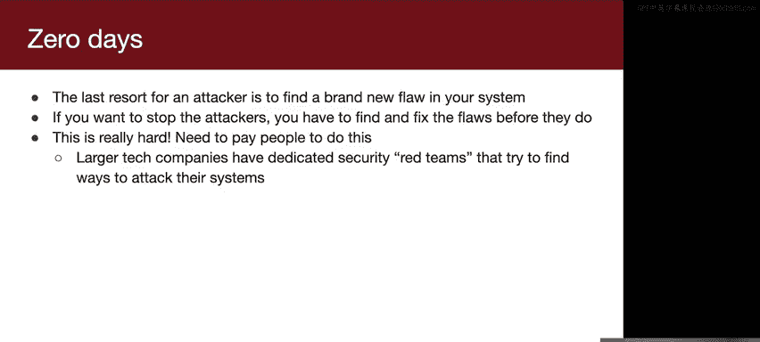
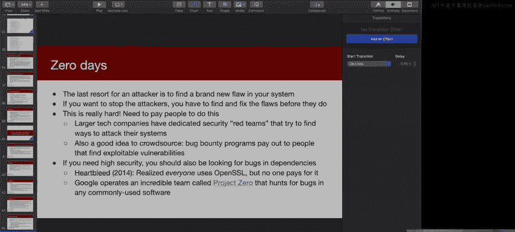

# 斯坦福大学《Rust安全编程》：14：信息安全

在本节课中，我们将继续讨论网络相关主题，并聚焦于信息安全。

上一节课我们讨论了如何构建一个服务，并确保该服务在用户增多时仍能保持可用。今天，我们将探讨如何保护信息的安全。我们将学习如何防止攻击者侵入系统并窃取敏感信息。

## 网络系统回顾

在深入信息安全之前，我们先快速回顾一下网络系统的基本概念。

通常，在网络服务中，会有一个服务器监听来自一个或多个客户端的网络连接。服务器会等待客户端连接到它绑定的端口，然后开始与对方计算机通信。到目前为止，我们讨论的方式是，通信双方都会获得一个文件描述符，通过向文件描述符写入和读取字节来发送和接收数据。这是底层通信的基本原理。

但我们不希望停留在字节通信这种底层层面。如果能有更正式、更一致的通信方式会更好。通常，两个服务器会使用某种预定义的语言进行通信，我们称之为**协议**。

一个非常常见的协议是**HTTP**。例如，当你访问一个网站时，你的浏览器就在使用一种定义明确的语言——HTTP——与服务器通信。它以所有HTTP服务器都能理解的格式发送请求，例如“请加载这个页面”。服务器知道如何解释这个请求，因为双方使用的是相同的语言（协议）。然后，服务器会获取网页内容，并使用预定义的响应格式将响应写回文件描述符。这样，互联网上的两台计算机就知道如何相互通信。

服务器接收请求并发送响应。这个概念对大家来说都清楚了吗？

## 我们需要防御什么？

现在，让我们思考一下，如果我们的服务器存储了敏感信息，我们需要防御哪些攻击。

换个角度思考可能更有帮助：假设你试图入侵一个网络服务器（可以是HTTP服务器，也可以是任何类型的服务器），并窃取信息。你会怎么做？虽然这里大多数人没有此类经验，但从基本原则出发，你会尝试什么？

一种方法是发送随机请求来探测服务器，看看会发生什么。这涉及到信息发现。你可能不完全清楚服务器的功能或所有可用路径。服务器可能对某些请求的响应方式会暴露信息。

还有其他想法吗？有人提到了**拒绝服务**攻击。拒绝服务意味着你通过使服务器宕机或使其过于繁忙而无法响应他人，从而剥夺他人使用服务的权利。这与信息安全略有不同，因为你并非提取信息，而是使服务对他人不可用，但这确实是一个需要关注的问题。

你还提到了**伪造请求**，这与信息安全密切相关。发送伪造请求如何有助于攻击？一个很好的思路是尝试冒充系统中有权限的用户。具体方法取决于系统的设置和通信设计。例如，可能只需找出管理员的用户名，然后发送请求说“我是这个人”。如果服务器不够智能，它可能不会验证你的身份。

回到发送伪造或无效请求的想法。另一种方法是发送无效的HTTP请求。我们提到客户端和服务器应使用预定义的HTTP语言通信。但如果你稍微偏离HTTP，发送一些看起来像HTTP但在某些地方有语法错误的东西呢？如果服务器的HTTP解析代码编写不当，就有可能通过发送格式错误的请求来诱导**缓冲区溢出**。HTTP解析本质上是字符串解析。如果字符串解析不正确，就可能发生缓冲区溢出。然后，攻击者可以利用这一点，在服务器上获得**远程代码执行**权限，从而上传并运行任意代码。

我们想出了几种不同的攻击策略，它们的实施难度差异很大。例如，发送随机请求探测服务器比精心设计缓冲区溢出攻击要容易得多，后者实际上非常困难。

## 保护服务器的三个层次

关于如何保护服务器，我认为可以分为三个步骤或层次。

首先，**不要向“礼貌询问”的攻击者提供信息**。如果有人敲你的前门问“你的社保号码是多少？”，你很可能不应该告诉他。网络服务也是如此。作为每个人都应达到的基线，我们绝对不应该向礼貌询问的攻击者提供敏感信息。

其次，我们需要确保系统的**任何依赖项**也不会向礼貌询问的攻击者提供信息。

最后，也是最困难的一步，是确保**不向“不礼貌询问”的攻击者提供信息**。如果有人发送旨在引发缓冲区溢出的畸形HTTP请求，我们希望确保自己不会因此被攻破。

接下来，我将更详细地讨论每一个步骤。

## 第一层：防御“礼貌询问”的攻击者

首先，我们来看如何防御那些只是简单“询问”的攻击者。

回顾一下，HTTP请求看起来像这样：你以特定格式发送一些字节。例如，你想获取某个路径，比如访问 `http://example.com/secret` 时，你的浏览器会以这种格式发送请求。然后服务器用一些响应来回复。

假设这是一个存储菜谱的餐厅服务器，攻击者只是问：“嘿，你的超级秘制酱料是什么？”然后服务器回答：“哦，是味精。”这样，服务器就把存储在那里的秘密给出去了。攻击者甚至不需要做任何复杂的事情，只是“礼貌地”问了一下。

没人会这么傻，对吧？攻击从来不会这么明显，对吧？我们希望如此。然而，Panera Bread 的移动订餐应用实际上就是这样工作的。

攻击者可以发送一个请求到 `foundation-api/users/{user_id}`，其中 `user_id` 是一个数字。服务器会返回 Panera 拥有的关于该用户ID的所有信息，包括电子邮件地址、电话号码、食物偏好等大量信息。这非常糟糕，尤其是因为这些ID是顺序的。系统上注册的每个用户都会获得一个递增的整数ID。因此，攻击者可以简单地枚举每个数字，下载整个数据库。这非常容易，只需“询问”：“我能获取这个用户的信息吗？”

这个事件是一个很好的案例，展示了**如何不处理安全漏洞**。处理得非常糟糕。安全研究员在八个月里不断尝试联系他们，他们却称其为骗子，并表示不想与他打交道。研究员并没有索要钱财，只是告知漏洞信息，而他们认为他在撒谎。最终，研究员感到沮丧，向媒体曝光。在他联系媒体后的两小时内，Panera 宣布他们已修复问题，并且只有一万用户受影响。但看看请求中的用户ID数字：7382194，这远大于一万。他们不仅谎报了受影响用户的数量，而且实际上也没有真正修复漏洞。他们只是关闭了这个特定的API端点。

API端点是指服务器上可以请求信息的特定路径前缀。你可以向这个端点传递用户ID `7382194`，它会返回指定用户的信息。他们修复了这个API端点，但后来发现，该应用中的**每一个其他API端点**都以完全相同的方式设计。事实上，包括他们企业餐饮应用在内的其他应用也存在完全相同的设计问题，后者包含大量企业数据。

如果你想了解更多，可以阅读发现此问题的研究员撰写的详细报告。需要说明的是，我并非特意针对 Panera。正如你将在本讲座中看到的，这不是 Panera 独有的问题。这是整个行业普遍存在的问题。这也是我们开设这门课程的部分原因：我们希望你们了解所面临的挑战，以及行业中常见的各类问题。

### 如何正确处理：认证与授权

那么，我们如何正确处理呢？安全领域有两个原则：**认证**和**授权**。

它们听起来相似，都以A开头，拼写长度和难度也差不多，但含义有细微差别。

*   **认证** 指的是“你是谁？”即谁在与系统对话。通常通过提供凭据来建立认证，例如，你告诉服务器：“我是某个用户名，这是我的密码，用于验证我是我。”或者提供双因素认证令牌，或提供只有该用户知道的密钥。
*   **授权** 指的是“你被允许做你试图做的事情吗？”一旦你知道谁在与你的服务器对话，你还必须验证他们试图做的事情是否被允许。例如，在客户数据的例子中，授权意味着如果我们知道你是特定用户，我们只会授权你访问**自己的**数据，你不应该被允许获取系统上其他客户的信息。这是由某种策略建立的，例如，你可以访问自己的电子邮件，但不能访问他人的。

要拥有安全的服务，必须同时建立两者。仅有认证是不够的，没有认证的授权也几乎没有意义，因为你不知道在和谁说话。我将举例说明只有其一而没有其二的后果。

### 实践中的认证与授权

在实践中，这通常看起来是这样的：你有一个客户端和一个服务器。客户端发出请求，并传递一些认证令牌，例如用户名和密码。服务器可能响应说：“很好，下次你想和我对话时，使用这个随机令牌。”我们使用这些令牌而不是每次传递用户名和密码的原因有几个，我稍后会提到。但主要原因是我们希望尽量减少凭据在网络中传输的次数。同时，也希望尽量减少客户端需要保存凭据的时间。例如，你登录一个网站，输入用户名和密码。浏览器在未来需要发送更多请求，但理想情况下，浏览器不应一直保存你的用户名和密码。你只在登录时输入，登录后浏览器就“忘记”它们，以减少编程错误导致泄露的可能性。此外，令牌可以设置过期时间，这很有用，例如两周后过期。

然后，客户端说：“嘿，给我看看用户 `cactus` 的电子邮件，这是我的令牌。”当服务器收到这个经过认证的请求（它有令牌）时，服务器首先必须验证认证：验证 `ABC123` 是否是一个有效令牌，并找出它属于谁。它会在令牌数据库中查找，发现这个令牌是发给 `cactus` 的，所以正在与 `cactus` 对话。接着，它必须检查授权：它知道正在与 `cactus` 对话，必须确保 `cactus` 有权查看 `cactus` 的电子邮件。根据合理的授权策略，这应该是允许的。然后服务器会响应：“这是用户 `cactus` 的电子邮件。”

如果你查看网络应用中的请求和响应，这通常就是它们的工作方式。

大家都明白了吗？对此有任何问题吗？

总结一下这里的认证和授权：**认证**要求客户端证明其身份（这里提供用户名和密码）。**授权**要求服务器验证与之对话的人是否有权执行其请求的操作。

我提到过，没有令牌也可以，每次请求都传递用户名和密码是可能的，但我们希望避免必须记住用户名和密码，并且我们可以让令牌在一周后过期，让用户重新登录。如果你听说过 **cookies** 这个术语，它在网络编程和浏览器领域非常常见，cookies 就是令牌，是同样的东西。

### 缺少认证或授权的后果

Panera 的例子是完全缺乏认证的例子。那些请求都没有经过认证。你不需要提供任何表明身份的东西。所以那张图中没有认证。

这里有一个不那么严重但三周前刚发生的例子。

上周我们讨论了机器集群。如果你有一个包含数千台机器的集群，管理所有这些机器将非常困难。为了执行系统更新或检查是否过载进行监控等，单独 SSH 到每台机器是不切实际的。**Salt** 是一个系统管理产品，可以让你监督这些大型机器集群。你可以让集群中的许多节点向主服务器“报到”，发送请求说“嘿，这是我的CPU使用率”或“这是当前运行的进程”等。你也可以让系统管理员联系主服务器说：“嘿，请将所有服务器更新到版本10。”这个主服务器有一个内部队列，它会将该消息添加到队列中，最终将该消息广播给所有服务器：“嘿，请安装版本10。”

需要说明的是，我刚才展示的所有请求都经过了适当的认证和授权，那里没有问题。问题在于，如果你碰巧发送了一个请求，指示调用 `_send_pub` 函数，并且在请求中说“嘿，在所有服务器上安装比特币矿工并杀死 SSH”，而且你没有提供任何认证或授权，那么 Salt 主服务器会很高兴地将该消息添加到其作业队列中，然后将其发送给所有服务器。这完全是个意外，本不应该发生。`_send_pub` 是主服务器内部的一个函数，当系统管理员发送“请将服务器更新到版本10”这样的指令时才会被调用。它本应是一个私有函数（这就是为什么它以下划线前缀命名）。但不知何故（我没有看过任何相关代码），他们创建了一个映射，使得该函数可以通过网络请求调用。

一开始有人提到“发送一堆请求看看能找到什么”，有时就会出现这种情况。没人打算让这个函数可以从网络请求调用，但结果却是可以的，而且你可以向这些服务器发送任意消息。

那么发生了什么？三周前，整个集群开始变得无法访问。许多公司突然无法连接，无法 SSH，服务器宕机。许多服务器被植入了比特币矿工和后门，允许攻击者进入并窃取数据（尽管就我们所知，似乎主要是比特币挖矿攻击）。但这造成了巨大的麻烦，因为你甚至无法进入服务器。一旦你重新进入，如何验证攻击者是否仍在机器上？如果他们控制了机器并拥有 root 访问权限，他们可以设置一个假象，看起来他们不在机器上，而实际上他们仍在。

如果你想了解更多关于这次攻击的信息，这里有一些链接。这发生在三周前，并非有意为之，只是有人犯了错误，意外暴露了本不应暴露的网络端点。

### 缺少授权会怎样？

那么，如果你有认证但没有授权会怎样？这里有一个例子。

有一家叫 **LocationSmart** 的公司。你可能从未听说过，但它与美国的每家手机运营商合作，知道这些运营商在美国的每一部手机的位置。他们将此位置数据出售给执法部门、营销机构以及希望跟踪公司设备的公司。而且你无法选择退出。这不是你的手机向 LocationSmart 或你的运营商提供信息。位置是通过手机信号塔三角测量计算的，所以你无法真正选择退出。这是一个影响几乎每个人的重大问题。

这家公司在他们的网站上提供了一个演示：你可以输入你的联系信息和电话号码，然后它会给你发送一条短信，你需要点击链接来验证“是的，我希望为这个演示暴露我的位置”，然后它会在谷歌地图上显示你的位置。老实说，我不太明白为什么他们认为这有帮助，但他们只是想展示“是的，我们确实有这些数据，我们是合法的”。在我看来，这从一开始就是个坏主意。

它的工作方式是：你的浏览器访问这个网站，你说“我想注册这个演示”，它向服务器发送一个请求。请求中包含了你想获取位置的电话号码。服务器响应，其中包含两个我想强调的字段：`privacyConsentRequired: true`。这基本上是说，为了获取此设备的位置，我们将向该设备发送短信，并且它必须确认愿意共享其位置。同时，它还返回一个随机令牌。该令牌用于认证。

然后，客户端发送另一个请求：“获取这个电话号码的状态”（例如，它是否已接受请求）。服务器会说：“不，实际上它还没有接受跟踪请求，订阅未激活。”浏览器会一遍又一遍地发送这个请求，实际上是忙等待。在用户实际在手机上接受之后，服务器会响应说：“是的，他们选择了加入，现在你可以请求他们的位置了。”

最后，浏览器现在知道设备已接受请求，会发送一个请求说：“这是我的令牌，我想获取这个特定电话的确切地址。”然后服务器响应说：“好的，这是位置数据”，并以 XML 格式响应。

这看起来没问题。那么问题在哪里？如果你省略中间的请求，直接跳到请求位置，如果用户尚未同意，服务器会按设计返回错误。但是，如果你更改最后一个参数：之前是 `.xml`（位置请求），如果你加上 `.json`，那么无论用户是否同意，它都会以 JSON 格式响应位置信息。

老实说，我不知道他们为什么这样设计。首先，他们同时使用 JSON 和 XML 有点奇怪（对于不熟悉的人来说，JSON 和 XML 都是结构化信息的方式，功能相同）。但他们确实两者都用。如果你更改格式，他们就会跳过授权检查。这里仍然有认证，你仍然需要提供令牌来表明“我是最初请求此位置的人”，但它甚至不检查用户是否通过手机同意了。这似乎是个大问题，影响了美国几乎所有有手机的人。

这几乎肯定是一个糟糕的复制粘贴案例。我猜他们先实现了 JSON 版本，然后改为 XML，他们复制粘贴了这个端点的代码，然后想：“哦，等等，我们忘了添加授权检查。”于是他们添加到了 XML 端点，却忘了添加到 JSON 端点，因为他们不再使用它了。这令人费解，但它确实存在。利用起来很简单，我刚才已经展示了具体方法。如果你想了解更多技术细节和背景，这里有一些很好的链接。

### 如何防止此类问题？

我认为更重要的是如何防止这种情况发生。标准方法（你会经常看到）是使用**Web应用框架**。

在实现这些应用时，绝对不应该直接从文件描述符读取然后进行一些处理，那太底层了。我们更希望有一个高级库或框架来处理这些。通常，你会使用一个管理所有HTTP请求和响应的框架。你只需说：“当对这个API端点（这个路径）的请求进来时，调用我这个函数；当对那个路径的请求进来时，调用那个函数。”你可以配置这个框架，使其在调用你的应用代码之前，对**每一个**请求都检查认证和授权。

这样你就不会犯错，不会出现某些请求有检查而另一些没有的复制粘贴错误，因为框架被编程为对所有请求都执行这些检查，然后再调用你的应用代码。这非常有效，虽然有时仍有错误，但许多错误是由复制粘贴引起的。如果你以这种方式最小化复制粘贴，就能最小化出错的可能性。

还有一些更实验性的方法使用类型系统，有点像 Rust 确保你永远不会忘记锁或释放内存。有一些方法可以确保在语言层面，你永远不会向未经验证的端点暴露信息。你接收输入，确保在处理之前验证输入。希望我们能在课程后期讨论这个。

到目前为止，一切都清楚了吗？

## 第二层：保护依赖项

好的，我从来不知道这些幻灯片能讲多深。看看现在的时间，我准备的内容似乎有点多，所以我可能会跳过下一部分的一些幻灯片，但我们会根据时间来看。

好的，这是我们上节课展示的图表，这是许多分布式系统的架构方式。这里我想指出的一个关键点是：这些服务器也有IP地址。你不仅需要确保你的计算节点、应用服务器不向礼貌询问的人提供数据，还需要确保你的**依赖服务器**（如数据库服务器）也不向礼貌询问的攻击者提供信息。如果攻击者找到你的数据库并说“嘿，请给我你所有的数据”，而数据库说“当然，没问题，给你”，那将是一个大问题。我们应该努力解决这个问题。

### 具体例子：Elasticsearch

举一些具体例子。这种情况发生在各种数据库服务器上，但仅举一例，有一个叫 **Elasticsearch** 的数据库。它非常流行，因为它允许你存入任何类型的数据，并为你分析这些数据，你可以对数据运行任意查询。它常用于应用搜索、网站搜索（搜索就在名字里，这确实是它的设计初衷），但有时也用于指标、分析、可视化等涉及大量数据处理的地方。非常常用。

原因是它使得进行相当复杂的操作变得非常容易。你可以快速建立一个集群，数据进来就扔进集群，然后无论需要运行什么搜索、分析或查询，都可以快速在所有数据上运行。

Elasticsearch 的默认设置是只响应本地连接。你在机器上安装 Elasticsearch，只能与该机器上的 Elasticsearch 对话。它确实绑定了一个端口，但只响应来自同一台计算机的客户端。所以它使用了网络，但并没有真正与你自己机器之外的东西通信，网络范围非常有限。

如果你想在集群中使用 Elasticsearch，就像我展示的图表那样，你需要让其他机器与 Elasticsearch 机器对话。那你该怎么做？你只需更改配置，使其接受外部连接。这听起来不错吗？你只需将服务器放在互联网上，它接受来自任何人的连接，字面上任何人都可以连接到服务器并询问任何他们想要的东西。

这种情况一直在发生。我搜索了“Elasticsearch 数据泄露”，本以为会找到几篇文章，但实际上第一页的每个链接都是不同的数据泄露事件。不同的泄露：50亿条记录、12亿条记录、10亿条、5700万条、1.5万条……厄瓜多尔所有人……继续，2.5亿条微软记录（我想是客户支持记录）。翻到下一页，2400万条信贷和抵押贷款记录，听起来也很糟糕。重大泄露。我不记得这里的细节了，但找到这些泄露并不难，每年发生多次。我上周刚发现的一个泄露。

有一个网站叫“Have I Been Pwned”，如果你没听说过应该注册一下。每当你的信息出现在在线数据转储中时，它会给你发送电子邮件。我不知道这有多大帮助，你对此无能为力，它只是发邮件说“嘿，你倒霉了”，但也许知道一下也好。上周我收到一封邮件，说我的数据在一家公司的数据泄露中泄露，涉及1.03亿条记录，相当大规模的泄露。最大的转折是：我们完全不知道是哪家公司。我们完全不知道这些数据来自哪里。它是在互联网上的 Elasticsearch 实例上发现的，没人知道它属于谁，或者它是哪个集群的一部分。它就在那里，一个公共IP，完全可访问，我们不知道是谁的。它包含大量信息，甚至包括一些随机的东西，比如“由 Andy 推荐，安排木工学徒 Devon 在某日更换某街道地址的浴室盥洗台”。同样很奇怪，根据内部数据，没人能弄清楚它来自哪里。如果你想了解更多，这里有一个很好的链接讨论这次泄露。

所有这些围绕 Elasticsearch 的泄露。你可能会想，Elasticsearch 肯定有问题吧？Elasticsearch 说：“嘿，这不是我们的错。这些泄露是由于对安全性和软件工作原理的误解造成的。”如果你记得，默认设置实际上是安全的：默认情况下，数据库不会响应外部连接。但人们做了什么？他们主动错误配置安装，使其响应互联网上的任何人。人们在这里主动搬起石头砸自己的脚。

我在这里挑 Elasticsearch 的例子只是为了提供一个实例，但如果你搜索任何其他数据库技术，**S3** 可能是下一个想到的最大的例子，只需搜索“S3 数据泄露”，你就会发现可怕的事情。

### 为什么会发生这种情况？

那么，这是 Elasticsearch 的错吗？如果我们有更多时间，我很想听听你们的想法，为什么你们认为会发生这种情况。但这是我的看法，我认为发生这种情况的原因如下：

第一个原因是**糟糕的默认设置**。我认为我们在这方面已经取得了很大进展，但通常数据库有默认的用户名和密码，并且不要求你更改。Elasticsearch 就是这样。所以，如果你发现一个暴露的数据库，你可能知道它的凭据，因为人们懒得更改用户名和密码。**MongoDB** 是一个曾经有糟糕默认设置的流行数据库，它过去默认配置为接受所有连接，这很糟糕。我认为我们正在慢慢改善，MongoDB 不再那样做了。许多 MySQL 安装工具会要求你更改默认用户名和密码，但我们肯定还没有完全解决，这仍然是个问题。

第二个问题是 Elasticsearch 指出的，也是他们归咎的问题：他们说这是工程师和系统管理员的错。运行系统的人不知道自己在做什么，他们说：“嘿，我需要从不同的服务器访问我的数据库，那就向所有人开放吧。”我认为这确实是一个系统性问题。在行业的许多地方都是如此，公司优先考虑发布新功能和版本，而不是确保这些版本的安全。如果你开发了某个东西，花了很多时间试图使其安全，可能大多数人无法分辨。对于使用该应用的人来说，它看起来完全一样。因此，安全性通常得不到回报，往往是事后才考虑。我认为我们在这方面取得了一些进展，当然也有更多立法出台，比如加州最近通过了一项相当严格的隐私和安全法，旨在与欧盟的立法保持一致。但我们还有很长的路要走，我不太确定我们作为工程师整体是否在变得更好。

最后一个问题，我认为也是最有趣的一个，是我们设计的系统使得**最小阻力路径是糟糕的安全性**。如果你想设计一个安全的系统，你需要设计得让做错事比做对事更难，因为人们在使用你的系统时总是选择最简单的选项。如果你在设计一个数据库，你必须设计得让它更难搞砸，而不是更容易做对。我认为在许多方面，我们才刚刚开始思考这个问题。这是一个新的发展领域，在如何设计默认安全的系统方面，还有很多工作要做。

### 我们能做什么？

那么，我们能做些什么来避免这些问题？如果你运营一项大型服务怎么办？微软也牵涉其中，许多拥有安全团队的高知名度公司都曾因这种愚蠢的泄露而遭到入侵。

如果你经营一家大公司，拥有资源和敏感信息，你需要投入资源定期测试此类问题。你可以设置自动扫描。我去年夏天在一家公司工作，他们提供这项服务：他们与公司签约，尝试在互联网上找到该公司使用的所有服务器，以便发现“嘿，你有一个看起来包含你公司信息的 Amazon S3 存储桶，这可能不应该在互联网上”。你需要在恶意个人之前找到这些东西。你还需要聘请审计公司尝试找出系统中的弱点，实际尝试攻击它，以便发现此类问题。

另外，如果你不运营大型服务，我认为我们仍然可以做很多工作。正如我提到的，尝试找出如何改进我们无法控制的系统的安全性。你可能无法控制微软的数据库，但如果你在他们使用的数据库上工作，你可以尝试找出如何使其默认更安全。

例如，**GitHub** 已经开始在这方面做出一些非常有趣的贡献。他们并不运营人们的服务，只是托管他们的代码。所以很容易袖手旁观说“嘿，我对此无能为力”。但他们认真思考了这个问题，并说：“我们能想出一些创造性的解决方案来帮助解决这个问题吗？”他们开始做的一件事是扫描漏洞。他们开始扫描代码中的漏洞，如果你的代码使用了具有已知漏洞的依赖项，他们会提醒你并提交拉取请求来修复它。

这就是防御“礼貌询问”的攻击者的第二层。那么，对于那些“不礼貌询问”的攻击者呢？

## 第三层：防御“不礼貌询问”的攻击者

我本来打算做一个小思考实验，但我们在开始时已经做过了：如果你试图入侵一个系统，你应该总是先尝试简单的方法，比如找到明显的弱点，找到未经认证的API请求，或者尝试社会工程学。社会工程学非常有效，你可以发送钓鱼邮件，可以打电话冒充别人。这些都是大问题。

如果所有这些都失败了，下一个最好的方法是什么？我这样设计幻灯片的原因是，如果你思考这个问题，大多数人会跳到：“好吧，如果我们找不到明显的弱点，那就找新的弱点。”但实际上，你可以转向别人已经发现的弱点，即代码中的**已知漏洞**，并尝试利用它们。大多数时候，你甚至不需要花时间寻找缓冲区溢出，因为已经有太多现存的缓冲区溢出，而且人们非常不擅长修复它们。

### 案例：WannaCry 勒索软件

让我举一些出错的例子。你们有些人可能听说过名为 **WannaCry** 的勒索软件。它会加密你计算机上的所有文件，然后你必须支付比特币才能取回文件。幸运的是，这是那种实际上仍然保留你文件的勒索软件之一（有些勒索软件病毒会加密所有文件并要求比特币支付，但它们实际上没有解密密钥，所以你支付了比特币仍然拿不回文件）。据估计，它造成了高达40亿美元的经济损失，是2017年的一个大问题。它甚至使英国国家医疗服务体系瘫痪，导致医院不得不拒收病人。

这是怎么发生的？这**完全是可以预防的**，绝对完全可以预防。这是一个时间线：在2017年之前的某个时间点（我们不知道具体时间），美国国家安全局在 Windows 的文件共享堆栈中发现了一个缓冲区溢出漏洞。他们没有与微软分享，而是保留了这个漏洞，并利用它开发用于间谍活动的攻击性漏洞利用程序。三月，微软独立发现了这个漏洞，并在安全公告中发布了补丁，基本上告诉所有人：“嘿，你需要更新到这个新版本的软件，因为它修复了一个关键的安全漏洞。”四月，一个名为“影子经纪人”的黑客组织宣布他们从 NSA 窃取了这个漏洞，并将其发布在互联网上。这里的道德有点问题，我想微软已经打了补丁，但他们还是发布了。然后人们开始利用它，开发自己的恶意软件。五月，WannaCry 开始在互联网上传播。注意时间线：从补丁发布到开始传播有近两个月的时间，而且它还需要一段时间才造成最大损害。如果我们在一周内更新了系统，就完全没问题，不会有任何问题。

### 案例：Equifax 数据泄露

另一次泄露你可能听说过，来自一家叫 **Equifax** 的公司。Equifax 是一家信用监控公司。当你获取信用报告时，报告来自美国三大信用机构之一。Equifax 的数据被泄露了。我不确定是否有人确切知道所有被窃取的数据，但基本上包含了美国几乎所有有信用记录的成年人的大量敏感数据。即使你从未与他们分享过数据，甚至从未听说过这家公司，他们也拥有你的信用历史数据，这些数据被窃取了。

时间线是怎样的？这能预防吗？绝对可以。没有人想出聪明的黑客手段来入侵 Equifax 的软件，没有人开发缓冲区溢出来试图入侵 Equifax。人们只是**机会主义**地利用了漏洞。事情是这样的：3月7日，Apache 发布了一个针对名为 **Apache Struts** 的框架中漏洞的安全公告。记得我提到过，大多数网络软件都建立在为你处理 HTTP 请求的库和框架上，这就是其中之一。但它有一个漏洞，所以他们告诉所有人，如果你在使用 Apache Struts，请确保更新。猜猜谁没有更新？然后五月，攻击者开始利用这个漏洞在 Equifax 系统中获得远程代码执行权限，从而能够使用这个漏洞运行他们想要的任何代码。七月（几个月后），Equifax 终于发现他们被入侵了，但他们没有对外公布。当他们最终公开时，他们声称他们认为这不是什么大问题，所以没有宣布。但他们将此事隐瞒了七月、八月、九月，直到两个月后才最终宣布“我们被黑了”。他们的应对非常灾难性。Brian Krebs 对此有一些很好的评论，关于他们处理得多么糟糕，以及本可以如何更好地处理。是的，如果你想了解更多，这里有一些链接。再次强调，这完全是可以预防的。如果他们在这个公告发布后一两周内更新了软件，就没事了。

### 如何防御？

所以，更新可能很烦人，但被入侵要糟糕得多。你真的需要确保你的系统保持最新。我们在这方面取得的许多进展，就是试图找出如何让人们更定期地更新。

我认为，尝试**减少攻击面**也很重要。如果某个东西不需要暴露在互联网上，那就不要暴露它。如果你想避免数据库通过这些缓冲区溢出漏洞被黑客攻击，那就不要将数据库暴露在互联网上。如果你的应用程序有一部分可以只暴露给你的服务器所在的私有网络，那么你应该尝试这样做。

当然，还有**零日漏洞**。这肯定是个问题。最后的防线是，如果没有已知漏洞，最后的手段就是发现一个全新的漏洞。零日漏洞指的是刚刚被发现、存在零天的漏洞。要阻止这类攻击者，你必须在他们发现并利用漏洞攻击你的系统之前，找到并修复这些漏洞。这实际上非常困难。你必须花钱请人寻找这些漏洞，而且不能只是你的开发人员。开发时，你考虑的是系统应该如何被使用；而寻找漏洞时，你需要采取“系统应该如何**不被**使用”的思维方式：如何滥用本意做某事的代码，用它来做完全不同的事情。你真的需要花钱请人进入那种思维模式，尝试攻击你的系统并发现问题。

公司有办法做到这一点。而且，即使你确信你的软件没有缓冲区溢出或其他零日漏洞，也还不够，因为你的依赖项也可能有漏洞。

因此，谷歌建立了一个名为 **Project Zero** 的团队，其唯一目的就是在任何常用软件中寻找漏洞。这个链接指向 Project Zero 的博客，我强烈推荐查看。这可能是我知道的最好的技术安全博客，那里发布了很多非常有趣的东西，有些我完全看不懂，但有些还是相当容易理解的。

这就是我今天要讲的全部内容。如果你有问题，请留下来，我很乐意回答。否则，我们下周二见。祝大家周末愉快，恭喜大家度过了第七周。

是的，当然，我不知道。

我想这是最后一张幻灯片了。是的，**Heartbleed** 是2014年（如果我没记错的话）的一个漏洞，允许攻击者发送……首先，我应该解释一下什么是 SSL。SSL（实际上是 TLS）是一种在那些互联网“管道”上建立加密的协议。上周我展示了那个图表，你可以写入文件描述符，数据会通过这些互联网管道从另一端出来。TLS（有时称为 SSL）只是其上的另一个抽象层，当你发送到 TLS 堆栈时，数据在进入互联网管道之前被加密，然后在另一端被解密。所以，任何时候你使用 HTTPS 网站，数据都使用 TLS 加密。那么 TLS 是如何实现的呢？没人自己实现它，尝试自己实现加密是个非常糟糕的主意，总是最好使用别人的实现。TLS 最常见的实现叫做 **OpenSSL**，几乎每个人都在使用它。任何时候使用 SSH（我相信 OpenSSH 使用 OpenSSL），任何时候使用 HTTPS 网站，你都在使用 OpenSSL。但事实证明，在2014年，每个人都意识到 OpenSSL 有一个绝对关键的安全漏洞，允许读取任意服务器内存。幸运的是，这不是远程代码执行漏洞，你不能执行任意代码，但你可以读取任意内存。通过向服务器发送大量畸形请求，随着时间的推移，你可以提取服务器的整个内存，包括任何敏感的加密密钥或敏感信息等。这尤其糟糕，因为 OpenSSL 也用于许多不接收软件更新的嵌入式设备，例如路由器。因此，它的影响范围非常广泛，每个人都使用 SSL，而且很难修补。我敢肯定仍然存在未修补的、易受 Heartbleed 攻击的设备。

我提到这个的原因是，当这个漏洞出现时，每个人都意识到：“天哪，每个人都在使用 OpenSSL，而 OpenSSL 是一个失业的家伙在空闲时间开发的。没有团队，OpenSSL 不是一家公司，没有付费团队在这个东西上工作。”它是如此关键的基础设施，却没有公司真正维护，当时基本上只有一个人。我记得他当时还患有健康问题。所以情况很复杂。如果我没记错的话（我可能错了），我认为这就是谷歌创立 Project Zero 的原因。我想 Project Zero 大约是在那个时候开始的，因为他们意识到有大量每个人都依赖的开源软件没有得到积极维护，我们应该投入更多精力来维护和审计这些软件。

## 总结

在本节课中，我们一起学习了信息安全的基础知识。我们从回顾网络系统开始，理解了客户端与服务器通过协议（如HTTP）进行通信。接着，我们探讨了保护服务器需要防御的三种攻击者类型：礼貌询问的、依赖项暴露的以及不礼貌询问的。

我们深入讨论了**认证**（验证身份）和**授权**（验证权限）这两个核心安全原则，并通过 Panera、Salt 和 LocationSmart 等案例看到了缺少它们所带来的严重后果。我们还学习了如何使用 Web 应用框架来系统化地实施这些检查，避免人为错误。

然后，我们将视角扩展到系统的依赖项，特别是数据库（如 Elasticsearch），指出了错误配置和糟糕默认设置如何导致大规模数据泄露，并讨论了通过设计使系统“默认安全”的重要性。

最后，我们探讨了防御更高级攻击者的策略，包括利用已知漏洞（如 WannaCry 和 Equifax 事件）和零日漏洞。我们强调了保持软件更新、减少攻击面以及投入资源进行安全审计和漏洞挖掘的必要性。

信息安全是一个复杂且持续的挑战，但通过理解基本原则、学习过往案例并采用良好的工程实践，我们可以构建更安全、更可靠的系统。