# 斯坦福大学《Rust安全编程｜CS 110L Safety in Systems Programming 2020》中英字幕（豆包翻译 - P2：-03-Lecture 2_ Memory Safety - GPT中英字幕课程资源 - BV1D142147he

Itll be a cool project Do we have everybody back Yes， we do Okay， lovely okay。

 so we have everybody back so yeah， like if we had like more time I'd love for us to just like discuss and like share from like all like the different rooms I saw a lot of great discussion between people but just to like keep things moving I'm gonna just launch into the presentation and if you want to see like the full list like the full like list of like correct answers I posted something on the last slide for resources that sound good to everybody。

😊，Okay， great and yes， I'm going to present and I think this is going to make it hard for me to see people's faces so if you have a question please let me know great okay。

 so I'm going to share that do people see it。

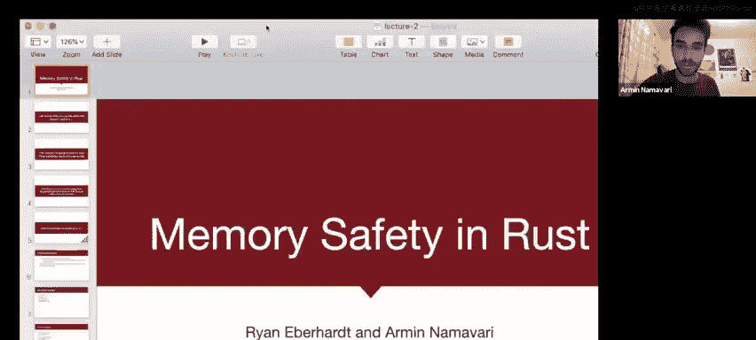

Great， and now I'm going to play right so last lecture。

 Ryan was telling us the bad news about CNC++ all sorts of issues with memory safety that lead to even security vulnerabilities and just like broader issues with correctness and stuff like that right and this lecture I'm gonna tell you about how rust is going to try to address some of these issues now that being said you know as a disclaimer you can still write buggy programs in rest okay like you know by all means like this is a great like exercise I don't know like if it's like a good exercise is just like write buggy programs but there are ways you can screw up in rest like all sorts of logical errors and stuff like that can lead to all sorts of issues right but rest just makes it harder to make certain kinds of mistakes and we'll see what that looks like concretely later so let's first think about white so easy to screw up and see so that was the whole point of the exercise that you'all just in discussions you've had so we already did this let's talk about a couple of those errors So the first class of errors I'm going to talk about is something。

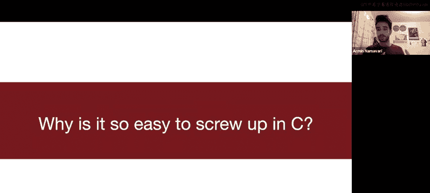

All the dangling pointer right so notice so could someone just quickly explain what's wrong here。

 just feel free to chime in。Anyone。Okay great so we have an invalid pointer is there is there something wrong with that because something bad happened like why you know。

 what's like what what do you think could go wrong？Yeah。

 it's gonna clobber whatever is at that value。 So if you put some like interesting things in your array that you hoped would be there later on the bad news because it's all delocated and it's going to get overwritten with other stack frame right so that's really bad Here's another one。

 A lot of you spotted this in your discussions， but there's a double free going on right here。

 which is not good so。You know。Why is this bad？Yeah yeah totally it's really just it's it's corrupting heAP state right and a couple of you mentioned that you're taking CS155 right now。

 this is not something that we're going to talk about in this class because it's beyond the scope of this class but we can post resources to it if you're interested in learning more and this is actually part of the first assignment in 155 is you're gonna learn you'll learn how to take a double free and use it to like control hijack of program this is actually security vulnerability to if you have questions about why that is I probably don't have time to explain it right now but please feel free to like talk to us after like we can point you to some resources but it's just cool to think about how like something that seems kind of innocuous like a double free you know can actually lead to something pretty drastic。

And then now there's something that I think a couple of you mentioned in your groups as I was floating around。

 there's this iterator and validation issue here so could someone try to I guess like explain what's going on here。

Or why this might be bad。Or like why am I highlighting that particular line of code I guess the issue is I'm not showing the full context。

 so if you have the full code snippet make sure to look at what that push is doing。Exactly。

 that's a perfect explanation。 so N is now pointing to freed memory and。😊。

Right like's it's pointing to something that's no longer valid it's sort of like I think this is really。

 you can think of this as like a trust issue in a way like I thought N was going to point to this vector。

 I thought it was going to point to some valid memory and it just changed under my nose right like I thought it was something and ended up turning into something else。

So it's sort of like this is definitely something bad and something that will lead to like unexpected behavior。

 right？And here's another one right here we have a memory leak right we forgot to free the old data right so this is under the circumstances in which we need to like resize our array。

 we need to create a new array， copy over what was in the previous array to the new array and have that be like our current working array。

 but we forgot to free the old memory。So this is pretty bad right and this kind of goes back to something that Ryan was talking about last lecture it is incredibly hard to reason about programs sometimes it's impossible and sometimes it's even more than impossible I'm not going to talk too much about what I mean by that but if you're interested you should take something like CS103 or CS154 so like like Laryan mentioned last lecture if if you give me a program and。

You claim like this program will eventually stop right this program will halt this is something called the halting problem right it's in general like computationally impossible to prove that in the general case。

For for certain technical reasons and this is actually a really old result in computer science some might even say this is the oldest result in computer science This is something that Alan Tran came up with who's pictured on the right there。

 is is something he came up with almost 100 years ago I think I don't know the exact time skill but yeah so like this is something like we knew this before computers were even built which is kind of crazy to think about and what do I mean by more than impossible okay so it turns out that there are problems that are even like harder than the halting problem something like secure voting machines right like if you give me a piece of code and you claim this is a secure voting machine right it is very like relevant to our election right you might have seen this in CS103 it's impossible to prove that it is literally impossible to prove things statements like that in the general case right。

And now you might be wondering， okay， so like why， why do we care that it's hard to prove statements like that。

 given what I've told you about rest？I guess can someone kind of like see where I'm going with this？

Or suggest。So we have a tool like rust that wants to prevent us from making the errors that we saw before。

Why might these results make us a little bit pessimistic about being able to do that？Any thoughts？

Exactly exactlyly that's a great way of putting it If it's hard to show any non-trivial fact about a program is true。

 how can I show facts like I'll never dereference an old pointer or I'll never dereference a pointer to invalid memory or I'll never do a double free these are other kinds of like nontrivial properties of programs that are of the flavor of like do I have a secure voting machine will this program halt stuff like this and this is stuff that we want to be able to reason about during compile time This is actually I probably should have like mentioned this before R is able to get you some of these like like like it's able to resolve those kinds of errors that we were just talking about at compile time which is a huge deal because it doesn't even need to run your program in order to understand if you're making。

Those kinds of issues， right， So what's sort of the solution to this。

 I guess I sort of have it in that last bullet point。 But like， what do people think。

 How do you think we can cope with this， right？ How do you think we can cope with the fact that。

 you know， it's， it's impossible in the ju is to like prove interesting facts about programs。Okay。

 sure。 So like simulations， like maybe this is of like， yeah， we can try to like see like。

What might our program do like if we can just like reason about it by looking at the code？嗯。

Any other ideas？Exactly exactlyly right so the issue is like something like C C is a very liberal language that you can kind of do whatever you want That's why it what's great about it。

 but also what's horrible about it it's so easy to shoot yourself in the foot with C because like you can have like they can like type a random string and it'll probably like compile the C program right like that's awful right how like liberal C compilers like what it does but like Lake mentioned if you if you add certain constraints to the kinds of programs you can write that makes it harder to shoot yourself in the foot and maybe you can get some guarantees out of that right so this is kind of like the art of like programming languages and PL theory and stuff like that how can we add constraints to what we're allowed to express that enable us to have guarantees。

Are there any questions about that yeah this is like a super abstract idea。

 but we're going to see it more concretely in the case of Ru。

 but like other than that are there any like general questions right now？Okay。So moving forward。

 yeah， so Rus， just like like mentioned， needs to place restrictions on the program you can write。

And unfortunately this can make it difficult and maybe even sometimes impossible to write certain programs in R a lot of y'all have been sort of like asking questions on the S which is wonderful but like therere like some like weird quirky things that Ru does with regards to like how you pass references around that make it hard to express certain things if you haven't seen like the full picture right and sometimes in systems programming you need to be able to do sort of low level like manipulation on memory and stuff like that and that by itself is just like an unsafe thing right so sometimes you need to break rust safety guarantees in order to do everything you need to do and in order to do that you use this thing called the unsafe keyword which we'll talk about later in the course don't worry about that for now for now we're only talking about safe rust okay。

But you know， like under the hood like even some of the things that you interact with in safefe rest have to use the unsafe keyword it's just like that code is like properly vetted like if if you're wondering。

 okay， like this seems counterintuitive， why would I want to allow like I thought the whole point of this was to be secure like why would I even want to allow unsafe at all right if you limit and control your use of unsafe to like small pieces of code that are easy to like reason about and understand then this is okay and it can only strictly be better than having your entire program be unsafe like you wouldn't see does that kind of make sense to people like a high level conceptual。

Level， yeah， we're going to talk about this a little bit later in the course。

 though This is more of an advanced point。 So another like interesting thing to like。

Recognizes that a lot of the guarantees you get from rust comes from the checks the compiler performs right like what the compiler can reason about the code statically at rest right and。

Sort of。The reason it's able to perform those checks is because of the restrictions and limitations language places on you。

Wwhichch is again super abstract I promise to talk about this more concretely in a couple of slides was keeping an eye on time and the other cool thing is that sometimes Ru can exceed the performance of C because of the compiler optimizations it performs and sometimes it can do these compiler optimizations because of the way the language is structured and if you're interested in learning more about those topics there are a bunch of great classes like CS242 which is an incredible class top by Will Creitton that also covers Ru in more like a PL theory kind of way and also CS143 which is compilers which I think is offered this core you may or may not be taking it those topics and as well as their followups right I think there's like an compiler optimizations class I think it's 243 so like these topics are outside of the scope of110L but like let us know if you want us to point you to resources if you want to learn more about them actually I think this is like a really open area of research like what kinds of compiler optimizations can you perform and how do you make sure that your compiler optimizations are correct right because theyre。

Long history of like， we try to make something faster and it ends up breaking practice yeah。

Are there any questions so far about anything I've said？Okay， yeah。Continuing， okay。

 let's go back to these errors that we were seeing before。

And like let's look it back at the stangling point of thing right so like wouldn't it be nice if like the compiler just realized that this Vck piece of data just lives within those two curly braces and we shouldn't return an address to it that escape that lifetime in a way right like wouldn't it be nice if it was able to just sort of automatically figure that out or if we could like sort of like place a restriction in such a way right furthermore like would like this double free。

🤧K。Wouldn't it be nice if the compiler said that once you pass a pointer to free you can no longer use that pointer so you know in like something like C like you might free a pointer then you might set it equal the mall of something else but wouldn't it just be nice if like the compiler said you just free this pointer like just don't use it anymore right like like call it something else maybe right but you don't want to be able to sort of like run to this issue where you like double free something or you end up using a freed pointer right or like you try to dereence a free pointer right？

And furthermore， wouldn't it be nice if the compiler stopped you from trying to modify this data that N was pointing to right so like Vec push will modify the data that N is pointing to like kind of like right under our noseses right wouldn't it be nice if the compiler recognized okay you actually have a reference to this piece of data？

You shouldn't be allowed like we shouldn't have someone else like V P change that data while we still have a reference to it because we might try to use that reference later。

 in fact we do use that reference later we use that reference in print F。

These are sort of things that you can see by looking at the code and not even having to run it right these are things you can reason about at compile time so these are sort of like the high level ideas behind ownership and barn which we're going to see in just a little bit and then furthermore like with the memory leaks right like wouldn't it be nice if the compiler just realize that you know if there's no longer anything pointing to this heat chunk of memory right we can just get rid of it we can free it so we don't have to automatically we don't have to automatically insert those free calls ourselves？

Yeah， great question would someone like to explain why this is an error？

Maybe someone we haven't heard from yet。I heard a couple of people talking about this in the breakout rooms。

Does that make sense？Yeah， why would it endpoint for the new memory， right？

Right but yeah these are great questions so right so now that we've like sort of built up like I'd like for us to like take a pause like maybe just like stand up in your seats like do like a little stretch or something I don't know maybe like in a future lecture can like lead us through some like yoga。

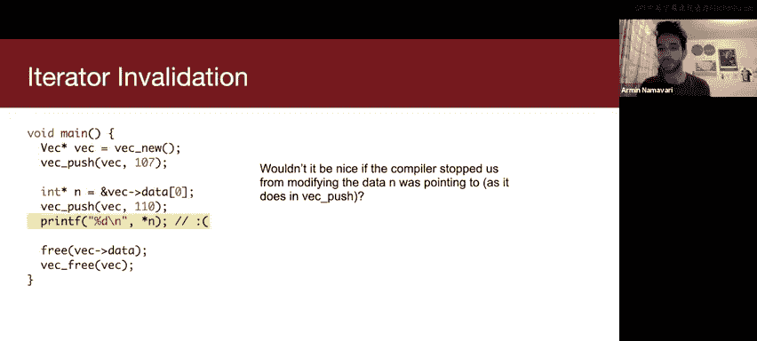

But it's important to。For to the sake of your owns sanity to just sort of like get up。

 stretch around a little bit。 Okay， I see a lot of stretching。 And we only have 20 minutes left。

 So we're gonna make this a brief stretch。 But let's go forward。 I guess like also doing this pause。

 Are there any other， iss an opportunity for people to ask questions about stuff。

 Are there any other questions people have。😊，Okay， great， so let's continue。

 so let's think about how rest might prevent us from from making the errors that we just saw。

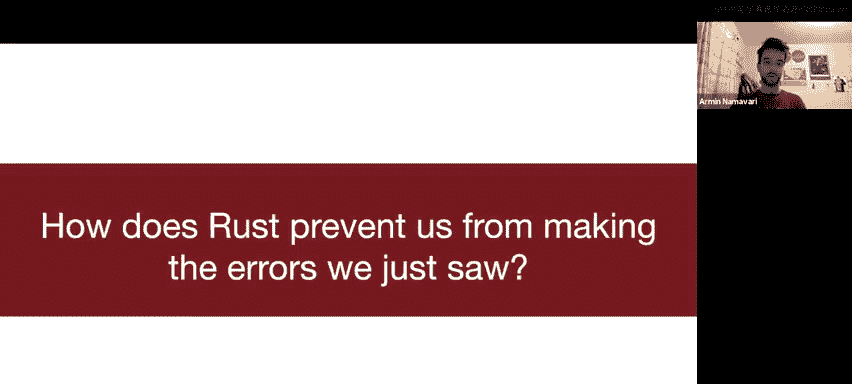

So there's this concept called ownership and rust and a lot of y'all were're actually running into this issue in the questions that you're asking on the slack so it's great that some of y'all started the assignment before the lecture because you're already to see these things pop up in the compiler messages right so you know and I'll like show this in a code example more concretely later but the idea is that you know each value and rest so think about each data chunk in rest each piece of data each resource and rest has a variable that's called the owner and you can only have one owner at once so some of y'all would have functions that would like like try to like print a string in like some formatted way for instance and then you pass the string in as an owned value right and you're transferring ownership there and that's why you'd run into a lot of the errors that you had before there are ways we can get around that that we're gonna to talk about in just a couple of slides but this is why you saw those errors right and if you haven't started the assignment you might start seeing the word ownership or like moved like pop up in some of your compiler error。

And furthermore， the idea is like when the owner goes out of scope。

 the value will be dropped so by dropped drop is just a name for the destructor right the thing that will get called once this resource needs to be delocated in the case of like point to heat memory this will be like freed for instance if this was a file the file will be closed and so on and so forth right so this idea is a very big idea in systems programming it's often called RAII or resource acquisition is initialization believe that's the acronym which we won't like talk about in too much depth。

 but the idea here is that like even though this is an idea that's unique to rust it's something that also exists in other languages like C++ like C++ also has destructors and it's something to be aware of。

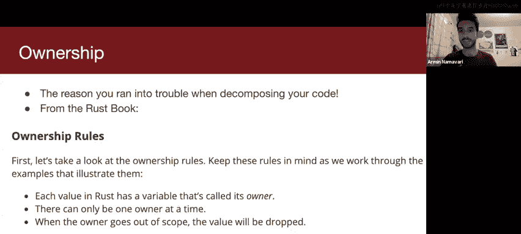

And yeah， this is exactly the point I wanted to make it isn't that controlling references to resources isn't unique to rust if you're taking one time concurrently with this class。

 you might have learned about the open file table and the fact that there's a ref count and once the ref count in the open file table entry drops to zero that entry is delocated rust actually has a special kind of heat pointer that does the same exact thing with regards to reference counts and this is an idea that pops up all over again in systems because we want to make sure we're being smart about how we're managing our resources we don't want our resources to be kept around longer than we need them we want to be good citizens of our operating system for instance and we want to relinquish our resources as soon as we can does this highlevel concept make sense。

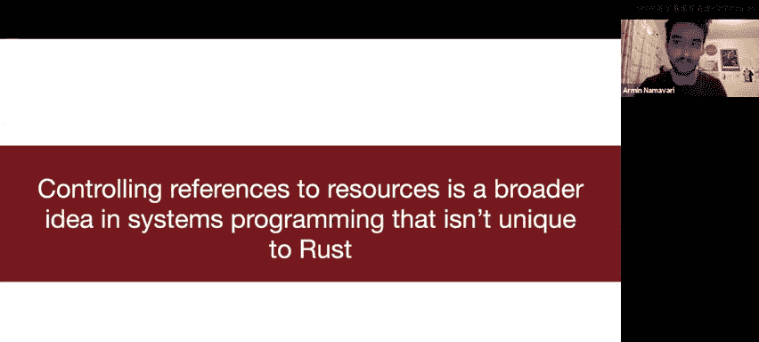

Great。So let's actually look at it in context so one way you can transfer ownership is by making a variable assignment right so if we have this variable s which is a string and if I say also this let syntax if you haven't seen rust syntax yet let is how you declare variables if I say let U is equal to S that means I am transferring ownership of that string to you and now when I try to print S I get an error what is the error I get so the error is actually like really helpful like one of the things I love about rest is its compiler it's such a great compiler it tells you exactly what's wrong and it sometimes gives you suggestions about how to make it right so。

It says that the move occurs because S has type string which does not implement copy we're not going to talk about copy yet。

 we'll talk about it in a couple of slides， but it's saying that okay。

 you moved this string out of S and into you and now you're trying to print S this is bad this is not okay because we don't know because essentially like you know。

This S is sort of like in a way like a dangling pointer right now。Because we only because remember。

 we want to have that property that there's only one owner at any one time。

 the owner used to be S and then by that second line the owner becomes you。

So this is in order to sort of maintain that invariant that we want only one owner at one time a way you might have seen this in your assignment if if you tried to decompose your code was when you defined functions。

 I think a lot of you had questions about this I got a bunch of different questions about this so if you have this function omm Nm that takes an S string like as an owned type if I do om Nm of S so notice how we're just printing the string right printing the string seems like an inherently safe thing to do if I'm just printing a string I'm not modifying it it's fine right but what happens is that when you take if you look at like that type signature there because let me see if I can actually do annotations I do。

see。Sor of like a pointer。Actually， I'm not going to try to figure that out we can see your mouse picture。

Sorry， okay， yeah， Oh， you can see my mouse cursor。 Okay， great lovely。 Yeah， so if you see。😊。

If you see this type signature here it says S string it means it's going to consume that string that means ownership of the string is going to get transferred to this function ono right which we explain in the next slide right so so when you move S into am Ammm becomes the owner of it right technically it's the parameter in the function that becomes the owner of it but that means you can no longer use it in main are there any questions about this this is sort of like the gist of ownership I can imagine that are a lot of questions about this because this is a weird concept is I totally acknowledge this is a weird concept that you probably have never seen in any of the programming languages you've studied。

Great question， great question， so I can actually return S from the function on no mom if I wanted to transfer ownership back does that make sense？

Yeah， so it's like I give ownership to you and then I give it back to like you can sort of like pass it around like。

 you know， like you're borrowing a book or something like that right although we'll talk about a the more common way to handle this issue in a couple slides。

Exactly， exactly， right。And then a caveat I want to mention is all right given what we just talked about we have ommm is taking something called a U32 U32 looks like a weird combination of characters but it stands for unsigned integer of 32 bits in length that's what it means and you'll notice I called ommm so first of all I said m is equal to n and like that was fine like this code compiles and you can see what it prints out right and then I said ammnom of n omm of M and then I was able to use them in the print link afterwards so how the heck is that possible like why does it work differently with integers I'm not going talk about this too much in detail right now but it turns out integers implement something called the copy trait and that changes the semantics of this assignment operator right by semantics I mean it changes what that single equal sign means so when I say let m equals n it no longer means transfer ownership of that integer to M it means copy that integer to n。

Does that make sense to everybody so the way you want to think about this is there's a special subroutine defined somewhere that says okay。

 every time I see an equal sign for integers I'm actually going to treat it this way。

 I'm going to treat it by copying instead of by transferring ownership instead of moving moving is the technical term for transferring ownership。

Does that make sense to people， are there any questions about that？Yes。

 okay so the string case it doesn't have so like integers have a special subroutine written somewhere is actually something called a trait there's something called the copy trait and we're going to talk about that later in the course probably a little bit next week and it essentially says every time I see equal sign for integers that means copy。

RightEvery time I see an assignment operator for an integer that means copy strings don't have that subroutine written for them Strs do not implement this copy trait is the technical term that I would say you can still copy strings you just have to be explicit about it there's a special function you call to copy strings because oftentimes you don't want to be like if I like assign like if I've like arbitrarily long strings I don't want to have to deal with the overhead of like copying all of them whereas like into like you know small and like bite sized and like you know we can easily copy those around they fit inside of like a register right so it's like pretty small。

Does that answer your question？

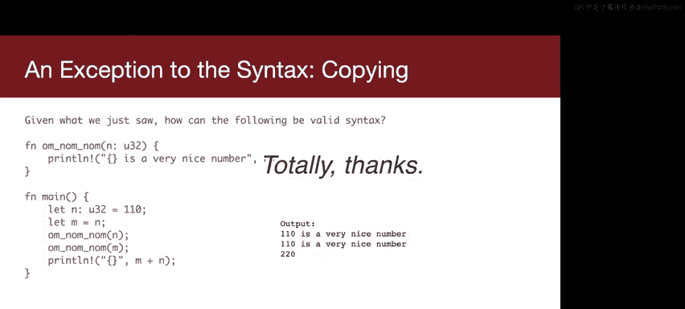

So just moving forward yeah okay so a lot of thoughts y'all are probably having right now okay like especially with like the whole single owner thing that's dumb right like why this must make it so hard to write code。

 especially if we have to return ownership like at the end of every function call right so it turns out rest actually has some ways of like going around this you can actually take references to data but you have to be a little bit disciplined about how you do that and we'll talk about that in the next couple slide so yeah Ryan you want to sort of like mention this analogy right here yeah so。

😊。

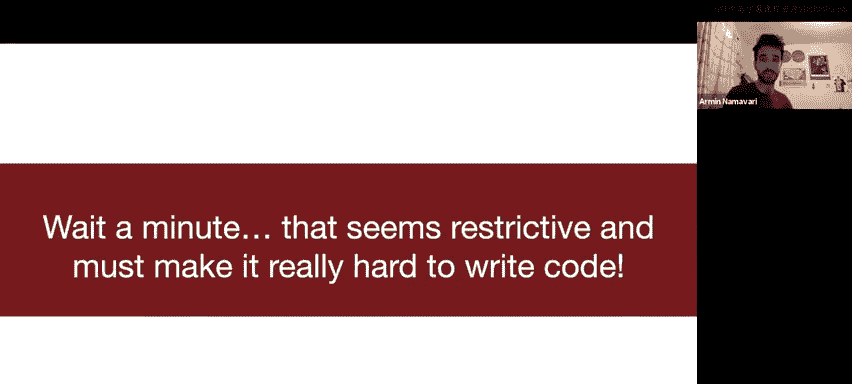

As a thought experiment， let's say that you have a group of lawyers and to map this to code。

 the lawyers are functions， but you can just think about them as lawyers right now。

 let's say that you have a group of lawyers that are trying to sign a contract。

 they're trying to collaboratively come up with a contract and sign it together。诶。

No lawyer would actually do this like you'd have one lawyer that kind of prepares things and then sends it and then they give feedback over email and they like make adjustments and blah。

 blah， blah， but let's just say that this is what they're doing。

What are some ground rules that we would need in order to make this setup work in order to make sure that nobody gets chipped Ar and go back in order to make sure that nobody nobody gets chipped and。

And like nothing bad happens。What are some restrictions that we need to set on the scenario？

Why is that important？Okay that's that's very important and let me expand this and say that instead of just signing the contract together。

 they can edit the contract they're trying to come up with the substance of the contract at the same time so this is a very good point what else do we need to restrict。

Yeah， you definitely don't want it to be the case that like people can be reading the contract and then they get to the end and when most people are looking at the end of the contract。

 somebody has snuck up at the top and like changed something around。

 you want to make sure that while people are reading it， there's nobody editing the contract， right？

But we do want it to be possible to edit the contract， that's pretty important。

So how would we do that， how would we allow that safely？Yeah。

 exactly and the crux here is if there is a single person editing the contract and nobody else is is reading it or accessing it in any way。

 that's fine。And if everybody is reading it。That's also fine as long as nobody is writing to it。

 but as soon as somebody is trying to modify， there should only be a single person modifying and nobody else should be allowed to be reviewing the contract at the time because there may be some issue where they're like reading one part and they think like everything up to that point is fine。

 but really somebody has snuck in earlier and changed something around。

Does this make sense to people and to give you an idea of how this maps to code。

 the lawyers here are really variables or like pointers you can imagine you have multiple pointers to some region of data。

 and if you are modifying that region of data through one of the pointers。

 you want to make sure that nobody else is accessing that data through one of the other pointers or this is not how Ru thinks about it。

 but you can think about this in terms of functions。

 say that you are modifying the data in one function。

 you want to make sure that there aren't any other functions that expect that data to be unchanged。

 This goes back to the dangling pointer example where we had our main function that had a pointer it called some other function that function changed the buffer from underneath it and violated the expectations of the main function。

Preci preciselyly this maps to how like resting stuff right like I should be able to have many constant pointers to a piece of data right but if I have a noncon pointer to a piece of data that can invalidate the other constant pointers that are viewing it right this would be like one lawyer sort of like writing as other people like viewing a contract and then if I and I can have most one noncon pointer at any given time like that's okay。

So the way this manifests itself is that you can have multiple shared references at once this is called like a shared borrow right these are mutable references with no mutable references to that value rest will actually enforces and you can have only one mutable reference at once and no shared references and the important thing to remember here is that this is this will pop up a lot in systems programming in general especially when you have this concept of like readers and writers so some of you might be taking 110 right now some of you might have already taken it you will start seeing this concept pop up in CS110 when we talk about threading and concurrency if you've already taken CS 110 then you might have heard of something called a read write Rock that might have been a lab or I guess like a section question you've done。

嗯。The other important concept here is there's this idea of lifetimes associated with pieces of data so the lifetime of value starts when it's created and it ends the last time that value is used and the rust compiler tries to figure out these lifetimes right so it doesn't let you have a reference to a value that lasts longer than the value's lifetime that's exactly the first thing pointer issue we saw we had the stack allocated vector and we tried to return a reference to it the stack allocated vector lives shorter than that reference that shouldn't be allowed。

And then Russ tries to figure out lifetimes that compile time using static analysis。

 I'm not going to go into too much detail about like how that works。

 but if you're interested in like more resources I have like a resources slide at the end and this is oftentimes like an over approximationro and then once something goes out of that lifetime it gets delocated so there's an automatic drop call inserted。

呃。And this is essentially what a deor is， more or less are there any questions about this like any like quick questions about this in general？

So like this this pertains to references because we don't want the references to live longer than the actual pieces of data like I don't want to have a reference to a piece of data that's going to become invalid does that make sense？

Great。So let's actually look at a borrowing example right so if I like so this is what these borrows actually look like in code if I want a mutable borrow I use this ampersand mute thing and if I have a shared borrow I use this ampersand string thing right one second sorry let's go back I guess you can't see my curor anymore but notice how I can have this mutable string hello I can call change it up on it and I'll change it to goodbye and then let me see will take a shared reference to it right and it just prints out the string and then make it plural will take another mutable reference to it and notice how have to pass an ampersand mute of s when I'm invoking a function so notice this is kind of like a weird subtle point you have this ampersand mute in the ampersand like it's both in the function definition and in the function invocation does that make sense。

🤧。So this is just sort of like what it looks like syntactically。

Because I'm short on time I'm going to go to the next example。

 but another thing I want to show here is that notice how this push method it just adds a character to the end of the string it dependss it to the end of the string and it takes in an ampersand mute to self so we haven't talked about what self is yet we'll talk about that on Tuesday probably when we talk about like more object oriented type rust but you have to have this mutable reference passed into push in order for it to work so yeah kind of like a subtle thing here is that S is defined as just sort of like a variable so when I do s dot push it actually implicitly casts it to an ampersande is like a weird nuance we'll actually see that in the next slide as well so with vectors it looks like this this is actually a question that somebody asked me about yesterday and the issue here was。

Right， if we have。So can anyone like spot the issue here actually I guess we're running long time so I'll just tell you the issue We have let v is equal to V So this is a very like well intentionten piece of code。

 but the thing in rest is like when I say let V equals V V is by default immutable C plus plus on the other hand by default makes things mutable it doesn't really care you have to go out of your way to declare something as' constant C and C plus here you have to go out of your way to declare something as mutable philosophically I think this is better because it's much harder to screw up if you you know make sure that you have to like go out of your way to say like yes。

 this is mutable this can change and in order to call something like itme if you look at the function signature it takes an ampersand mute to soft and if I have。

V as immutable I can't take that ampers and mute reference that is why the rust compiler complain but look at this the Ru compiler is so helpful it says help consider changing this to be mutable mute V right isn't that great like when was the last time you had a compiler to tell you what you were probably supposed to do in order to make your code work that's pretty incredible right。

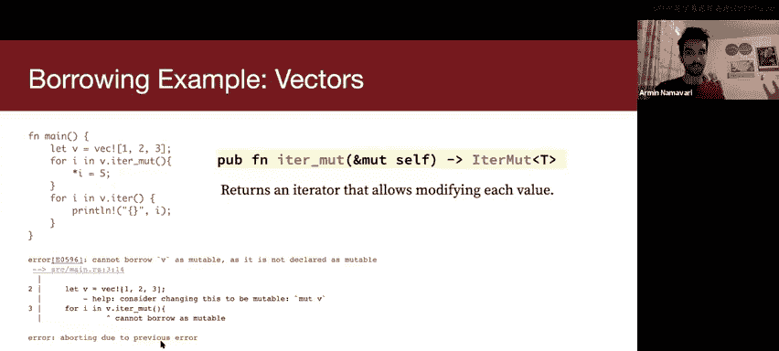

So。The other really cool thing to realize these are sort of some parting thoughts All of the things I just talked about are enforced at compile time right and this is a huge deal right because you compile your program only once but you can execute it as many times as you like afterwards so shifting things to compile time is actually huge and this is like a big this is sort of like what people try to do like there's like open research questions about like how many things how many kinds of checks can we just like guarantee it compile time right and this is like use like economics terms this is like we have like a fixed cost investment in our preprocessing in a way like I want to open a pizzaizz I only have to like buy the pizza oven once and I can make as many pizzas as I want right I only have to compile my program once I can compile it as many times I can run executable as many times as I'd like。

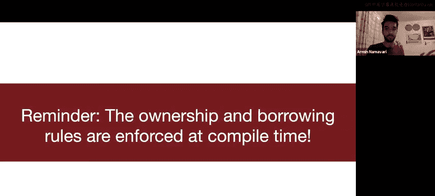

so in general you want to do this shift right so oftentimes there's like this tension between security and performance right and Ru tries to give you both。

Just don't screw up what you're doing in your compiler。

 the checks you're making in your compiler because there are a lot of security vulnerabilities that pop up from making fancy optimizations but there's been a lot of like vetting done of like the rest compiler and it's like developed by experts and like in general you can like trust like the changes they're making I think there's like a good amount of research on also like verifying like certain aspects of like what rest does but that being said there have been vulnerabilities and rest rest is not like。

A panacea， it's not perfect， right？Yeah， and just kind of like as a reminder。

 like for the first assignment， we just want you to get familiar with the basic syntax you'll definitely see ownership and borrowring in action as many of y'all already have as you've tried to decompose your code please ask questions on Sck and if you feel comfortable please ask them in like the public channel so that other people can benefit from the answers as well and I guess like before you ask a question like see if like someone else has already asked it。

Yeah， sometimes like it might be hard because you don't want to show your code。

 so you don't have to show your code explicitly， but if you can type up a code example and ask questions about that code example。

 that's completely fine。Does that make sense to everyone？

And like feel free to like chime in and like help each other out too and if you're interested in additional resources that's on the last slide we'll post these slides soon。

 shout out to WillCreton for providing some feedback on how to explain some of these concepts and thank you all so much for coming and feel free to stick around if you have questions。

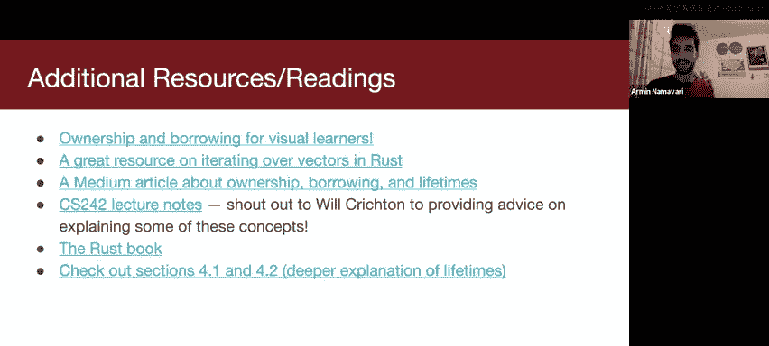